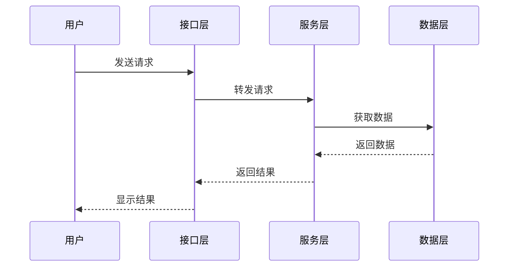
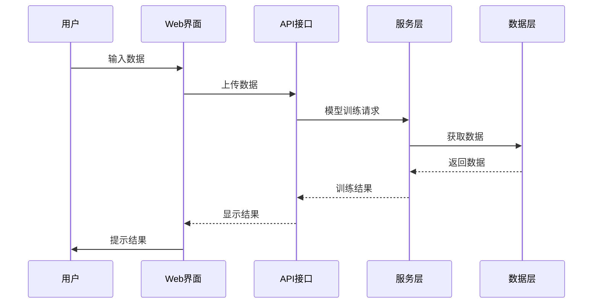

                 


### 引言

在当今快速发展的科技时代，人工智能（AI）技术已经深刻地改变了我们的生活方式和商业模式。作为AI技术的核心组件之一，智能代理（AI Agent）以其强大的自主学习和决策能力，成为研究和应用的热点。智能代理不仅能够执行单一任务，更重要的是它们具备多任务学习能力，能够在复杂多变的环境中同时处理多个任务，从而显著提高效率和灵活性。

多任务学习能力的重要性不言而喻。首先，它使得智能代理能够更好地模拟人类的思维过程，实现更高级的智能行为。其次，多任务学习能够提高系统的鲁棒性和适应性，使智能代理能够应对更加复杂和动态的环境。此外，多任务学习还能够减少系统资源的浪费，提高计算效率，降低开发成本。

然而，多任务学习能力并非一蹴而就。它涉及多个学科领域的交叉，包括深度学习、强化学习、神经网络理论和优化算法等。本文将深入探讨AI Agent的多任务学习能力，从背景介绍、核心概念与联系、数学模型和算法原理、系统分析与架构设计、项目实战和最佳实践等多个方面，逐步分析多任务学习的机制、应用和实践，旨在为读者提供一幅全面而深入的理解图景。

文章将首先回顾AI Agent和智能代理的定义与分类，然后详细探讨多任务学习的原理和基本方法。接下来，我们将介绍深度学习和强化学习在多任务学习中的应用，以及相关的数学模型和算法。随后，文章将深入探讨智能代理在多任务学习中的应用场景和项目案例，最后，我们将提供一些最佳实践和总结未来研究方向。

通过这篇文章，读者将能够全面了解AI Agent的多任务学习能力，掌握相关的理论知识，并了解如何在实践中应用这些知识。这不仅仅是对AI Agent多任务学习的一次系统探讨，更是对人工智能技术未来发展的一次深刻思考。

### 背景介绍

#### 问题背景

随着人工智能技术的不断进步，智能代理（AI Agent）已经成为研究和应用的热点。智能代理是指具备智能和自主性的计算机程序，能够模拟人类行为，执行任务，并进行决策。在当今复杂多变的环境中，单一任务的智能代理难以满足实际需求。多任务学习能力成为衡量智能代理智能水平的重要指标之一。

多任务学习能力的重要性体现在多个方面。首先，它能够提高智能代理的效率。在许多应用场景中，智能代理需要同时处理多个任务，例如自动驾驶汽车需要同时处理感知、导航和决策等多个任务。多任务学习能够使智能代理更加高效地利用系统资源，提高任务处理的速度和准确性。

其次，多任务学习能力能够增强智能代理的鲁棒性和适应性。在复杂和动态的环境中，智能代理需要具备快速适应和调整的能力。多任务学习通过在多个任务中共享表示和经验，能够使智能代理更好地应对环境变化，从而提高其鲁棒性。

最后，多任务学习能力有助于降低开发成本和复杂性。在传统的单一任务系统中，每个任务都需要单独设计和实现，这不仅增加了开发成本，还可能导致系统之间的不一致性和冗余。多任务学习通过在多个任务中共享模型和算法，可以简化系统的设计，提高系统的可维护性和扩展性。

#### 问题描述

如何提高AI Agent的多任务学习能力，使其在复杂环境中具有更强的适应性和智能性，是当前研究和应用中亟待解决的问题。具体而言，问题可以分解为以下几个方面：

1. **多任务学习模型的优化**：目前的多任务学习模型在处理复杂任务时，存在准确性和效率不高的问题。如何设计出更加高效和准确的多任务学习模型，是提高AI Agent多任务学习能力的关键。

2. **数据集的收集和处理**：多任务学习需要大量的数据集来训练模型。然而，如何有效地收集和处理这些数据，是一个具有挑战性的问题。特别是当任务之间存在较大差异时，如何设计合适的特征提取和融合方法，是一个重要的研究方向。

3. **模型的泛化能力**：多任务学习模型在训练时，可能会出现过拟合现象，导致在新的任务上表现不佳。如何提高模型的泛化能力，使其能够在不同的任务中保持良好的性能，是一个重要的研究课题。

4. **动态任务调度**：在多任务学习环境中，智能代理需要根据任务的优先级和资源情况，动态地调整任务的执行顺序。如何设计高效的动态任务调度算法，是提高AI Agent多任务学习能力的另一个关键问题。

#### 问题解决

针对上述问题，我们可以从以下几个方面进行解决：

1. **优化多任务学习模型**：通过引入新的算法和技术，如深度学习、强化学习等，优化多任务学习模型的结构和参数，提高模型的准确性和效率。

2. **设计有效的数据预处理方法**：针对不同的任务和数据类型，设计合适的特征提取和融合方法，提高数据的质量和多样性，从而提高模型的泛化能力。

3. **改进模型的泛化能力**：通过引入正则化技术、迁移学习等方法，提高模型的泛化能力，使其在新的任务中保持良好的性能。

4. **开发动态任务调度算法**：设计高效的动态任务调度算法，根据任务的优先级和资源情况，动态调整任务的执行顺序，提高AI Agent的响应速度和资源利用率。

#### 边界与外延

多任务学习在智能代理领域的应用十分广泛，包括但不限于以下几个方面：

1. **自动化系统**：在工业自动化、智能家居、智能交通等领域，智能代理需要同时处理多个任务，如感知、决策、控制等。多任务学习能够提高系统的效率和智能性。

2. **游戏智能体**：在电子游戏、棋类游戏等领域，智能代理需要同时处理游戏状态分析、决策和动作执行等多个任务。多任务学习能够使智能代理在复杂游戏环境中具有更强的竞争力。

3. **智能推荐系统**：在电子商务、社交媒体等领域，智能代理需要同时处理用户行为分析、推荐算法和个性化推荐等多个任务。多任务学习能够提高推荐系统的准确性和用户体验。

#### 概念结构与核心要素组成

多任务学习（Multi-Task Learning，MTL）是人工智能领域中一个重要的研究方向。它涉及到多个学科领域的交叉，包括机器学习、深度学习、强化学习等。以下是多任务学习的主要概念和核心要素：

1. **多任务学习（MTL）**：MTL是指同时学习多个相关任务的机器学习方法。它不同于传统的一任务学习（Single-Task Learning），后者是逐个学习每个任务。

2. **共享表示（Shared Representation）**：在MTL中，多个任务共享同一表示层或特征层，这有助于任务之间的知识迁移和共享，从而提高模型的泛化能力。

3. **独立表示（Independent Representation）**：与共享表示相对，独立表示是指每个任务具有独立的表示层，不同任务之间的表示相互独立。

4. **深度学习（Deep Learning）**：深度学习是机器学习的一个重要分支，它通过多层神经网络模型，从大量数据中自动提取特征和表示。在MTL中，深度学习模型可以用来学习多个任务，并通过共享表示层实现任务之间的知识共享。

5. **强化学习（Reinforcement Learning）**：强化学习是一种通过奖励信号来学习策略的机器学习方法。在MTL中，强化学习可以用来优化多任务学习的策略，提高任务的执行效率。

6. **神经网络（Neural Network）**：神经网络是深度学习的基础模型，它通过模拟人脑神经元之间的连接和相互作用，实现数据的自动学习和特征提取。

7. **数据预处理（Data Preprocessing）**：数据预处理是机器学习的重要环节，它包括数据清洗、特征提取、数据标准化等步骤。在MTL中，数据预处理直接影响模型的性能和泛化能力。

8. **模型评估（Model Evaluation）**：模型评估是评估模型性能的重要手段，包括准确率、召回率、F1分数等指标。在MTL中，模型评估需要考虑多个任务的性能指标，从而全面评估模型的性能。

通过以上概念和要素的介绍，我们可以对多任务学习有一个初步的了解。接下来的章节将进一步深入探讨多任务学习的原理、算法和应用。

### 核心概念与联系

#### 多任务学习（MTL）原理

多任务学习（Multi-Task Learning，MTL）是机器学习中的一个重要分支，其核心思想是通过同时学习多个相关任务来提高模型的性能。以下是对MTL的基本概念、分类及其优势的详细介绍。

##### 基本概念

多任务学习涉及多个任务，每个任务都有自己的输入和输出。这些任务可以是完全独立的，也可以是相关的，即任务的输入或输出之间存在一定的关联性。多任务学习的主要目标是利用任务之间的关联性，通过共享某些模型参数或特征表示来提高每个任务的性能。

##### 分类

多任务学习可以按照不同的标准进行分类，其中最常见的分类方法是基于任务表示的共享程度。以下是两种主要的分类方法：

1. **共享表示方法（Shared Representation）**

   在共享表示方法中，多个任务共享同一组表示层或特征层。这种方法的优点是能够通过任务之间的知识迁移来提高每个任务的性能。具体来说，共享表示方法可以分成以下几种：

   - **完全共享表示**：所有任务都共享同一组参数或网络层。
   - **部分共享表示**：不同任务共享部分参数或网络层，其余部分则各自独立。

2. **独立表示方法（Independent Representation）**

   在独立表示方法中，每个任务都有自己的表示层，不同任务之间的表示相互独立。这种方法适用于任务之间没有明显关联的情况。独立表示方法包括以下几种：

   - **独立网络结构**：每个任务都有自己的神经网络，没有参数共享。
   - **任务特定特征提取**：每个任务都使用特定于自己的特征提取方法。

##### 优势

多任务学习相比单任务学习具有以下优势：

1. **提高泛化能力**：通过共享任务间的知识和经验，多任务学习能够提高模型的泛化能力，使其在新的任务上表现更好。

2. **资源利用效率**：多任务学习能够充分利用数据和信息，减少冗余计算，提高资源利用效率。

3. **加速模型训练**：由于多个任务共享参数，多任务学习能够减少模型参数的数量，从而加快训练速度。

4. **增强模型的鲁棒性**：通过在多个任务上训练，模型能够学习到更加稳定的特征和表示，提高其鲁棒性。

#### 深度学习、强化学习与MTL的关系

深度学习（Deep Learning）和强化学习（Reinforcement Learning）是机器学习的两个重要分支，它们与多任务学习（MTL）有着紧密的联系。

##### 深度学习与MTL

深度学习是MTL的重要工具之一，特别是在处理高维数据和复杂数据时。深度学习通过多层神经网络模型，能够自动提取数据的特征和表示。在多任务学习中，深度学习模型可以用于以下方面：

1. **共享特征提取器**：多个任务可以共享同一个深度学习模型的前几层，这些层用于提取通用的特征表示。

2. **任务特定的全连接层**：在共享的特征提取器之后，每个任务可以拥有自己的全连接层或卷积层，用于进行任务特定的处理。

3. **参数共享与优化**：通过共享部分网络层，可以减少模型参数的数量，从而加速训练过程，提高模型的可扩展性。

##### 强化学习与MTL

强化学习是一种通过环境奖励信号来学习策略的机器学习方法。在多任务学习中，强化学习可以用于以下方面：

1. **任务优先级调度**：强化学习可以用于动态调整任务的执行顺序，根据任务的紧急程度和资源情况来优化任务调度。

2. **策略优化**：强化学习可以用于优化多任务学习中的策略，使智能体能够在复杂环境中做出最优决策。

3. **多任务学习中的探索与利用**：强化学习通过探索未知领域和利用已有知识，可以有效地平衡新任务的学习和现有任务的优化。

#### 神经网络结构

神经网络是多任务学习的基础模型，常见的神经网络结构包括卷积神经网络（CNN）、循环神经网络（RNN）和Transformer模型。以下是对这些结构的简要介绍。

##### 卷积神经网络（CNN）

卷积神经网络是一种用于处理图像数据的神经网络结构，其主要特点是利用卷积层提取图像的特征。在多任务学习中，CNN可以用于以下方面：

1. **共享卷积层**：多个任务可以共享同一组卷积层，用于提取通用的图像特征。

2. **任务特定的全连接层**：在共享的卷积层之后，每个任务可以拥有自己的全连接层，用于进行任务特定的处理。

##### 循环神经网络（RNN）

循环神经网络是一种用于处理序列数据的神经网络结构，其主要特点是能够记住历史信息。在多任务学习中，RNN可以用于以下方面：

1. **序列处理**：RNN可以用于处理时间序列数据，如语音信号和文本序列。

2. **任务特定层**：多个任务可以共享同一组RNN层，用于提取序列特征，然后每个任务可以拥有自己的全连接层。

##### Transformer模型

Transformer模型是一种基于自注意力机制的神经网络结构，广泛用于自然语言处理任务。在多任务学习中，Transformer可以用于以下方面：

1. **文本处理**：Transformer可以用于处理文本数据，如文本分类、机器翻译等。

2. **任务共享与特定层**：多个任务可以共享同一组Transformer层，用于提取文本特征，然后每个任务可以拥有自己的全连接层。

##### 多任务学习的神经网络结构

在多任务学习中，通常将深度学习、RNN和Transformer等结构结合起来，以实现多个任务的共同学习和优化。以下是一个典型的多任务学习神经网络结构：

1. **输入层**：接收多个任务的输入数据。

2. **共享层**：共享卷积层、RNN层或Transformer层，用于提取通用的特征表示。

3. **任务层**：每个任务拥有自己的全连接层或卷积层，用于进行任务特定的处理。

4. **输出层**：每个任务的输出结果。

通过以上对多任务学习原理、深度学习、强化学习和神经网络结构的介绍，我们可以更好地理解多任务学习在AI Agent中的应用和优势。在接下来的章节中，我们将进一步探讨多任务学习的数学模型和算法，以及其实际应用中的挑战和解决方案。

### 数学模型和数学公式

多任务学习（MTL）的核心在于如何有效地利用任务间的相关性来提高模型的泛化能力和性能。为了深入理解多任务学习的机制，我们需要借助数学模型和公式来描述其基本原理和算法。以下将使用LaTeX格式介绍多任务学习的数学模型和相关算法的原理，并使用Python源代码进行解释。

#### 多任务学习的数学模型

多任务学习的核心在于共享表示和独立任务的学习。为了简化描述，我们考虑以下模型：

1. **输入和输出表示**：
   - 设输入数据矩阵为 \(X \in \mathbb{R}^{m \times n}\)，其中 \(m\) 表示样本数量，\(n\) 表示特征数量。
   - 每个任务都有其独立的输出向量 \(y^i \in \mathbb{R}^{d_i}\)，其中 \(d_i\) 是第 \(i\) 个任务的输出维度。

2. **共享表示层**：
   - 假设共享表示层由一个全连接层组成，其输出为 \(h \in \mathbb{R}^{k}\)，其中 \(k\) 是共享表示的维度。

3. **任务特定层**：
   - 每个任务都有一个独立的全连接层，其参数为 \(W^i \in \mathbb{R}^{k \times d_i}\)，输出为 \(z^i = W^i h\)。

4. **损失函数**：
   - 对于每个任务，我们使用均方误差（MSE）作为损失函数：
     \[
     \ell^i(y^i, z^i) = \frac{1}{2} \sum_{j=1}^{d_i} (y^i_j - z^i_j)^2
     \]

5. **总损失函数**：
   - 总损失函数是所有任务损失的总和：
     \[
     \ell = \sum_{i=1}^N \ell^i
     \]

#### LaTex格式数学公式

以下是使用LaTeX格式表示的多任务学习模型：

\[
\begin{aligned}
h &= \sigma(W_h X) \\
z^i &= W^i h \\
\ell^i &= \frac{1}{2} \sum_{j=1}^{d_i} (y^i_j - z^i_j)^2 \\
\ell &= \sum_{i=1}^N \ell^i
\end{aligned}
\]

其中，\(\sigma\) 是激活函数，\(W_h\) 是共享表示层的权重矩阵，\(W^i\) 是任务特定层的权重矩阵。

#### Python源代码解释

以下是一个简单的Python实现，用于解释上述模型的基本原理：

```python
import numpy as np

# 假设输入数据的维度为 (m, n)，其中 m 是样本数，n 是特征数
m, n = 100, 10
X = np.random.rand(m, n)

# 假设共享表示层的维度为 k
k = 5

# 假设任务数 N 和每个任务的输出维度分别为 d1, d2, ..., dN
N = 3
d1, d2, d3 = 3, 4, 5

# 初始化共享表示层的权重矩阵和激活函数
W_h = np.random.rand(n, k)
activation = lambda x: np.tanh(x)

# 初始化任务特定层的权重矩阵
W1 = np.random.rand(k, d1)
W2 = np.random.rand(k, d2)
W3 = np.random.rand(k, d3)

# 假设任务的实际输出
y1 = np.random.rand(m, d1)
y2 = np.random.rand(m, d2)
y3 = np.random.rand(m, d3)

# 计算共享表示层输出
h = activation(np.dot(X, W_h))

# 计算任务特定层的输出
z1 = np.dot(h, W1)
z2 = np.dot(h, W2)
z3 = np.dot(h, W3)

# 计算损失函数
def loss(y, z):
    return 0.5 * np.mean((y - z) ** 2)

l1 = loss(y1, z1)
l2 = loss(y2, z2)
l3 = loss(y3, z3)

# 计算总损失
L = l1 + l2 + l3
```

通过上述代码，我们可以看到如何使用共享表示层和任务特定层来计算多任务学习的损失函数。这段代码为理解和实现多任务学习模型提供了一个直观的示例。

通过数学模型和Python源代码的解释，我们可以更深入地理解多任务学习的工作原理。在接下来的章节中，我们将进一步探讨多任务学习在智能代理领域的具体应用和实现。

### 系统分析与架构设计方案

#### 问题场景介绍

智能代理在多任务学习中的应用场景非常广泛，以下是几个典型的应用场景：

1. **智能交通系统**：智能代理可以同时处理交通流量预测、道路故障检测、车辆导航等多个任务，从而提高交通管理的效率和安全性。
2. **医疗诊断系统**：智能代理可以同时处理患者病历分析、诊断预测、药物推荐等多个任务，从而提高医疗诊断的准确性和效率。
3. **智能制造系统**：智能代理可以同时处理生产调度、质量检测、设备维护等多个任务，从而提高生产效率和产品质量。

在这些应用场景中，智能代理需要具备高效的多任务学习能力，以实时应对复杂、动态的环境变化。以下将详细介绍一个智能代理多任务学习的项目案例。

#### 项目介绍

本案例以智能交通系统中的多任务学习项目为例，介绍智能代理在多任务学习中的具体应用。该项目旨在通过多任务学习模型，同时处理交通流量预测、道路故障检测和车辆导航三个任务。

##### 项目目标

1. **交通流量预测**：根据历史数据和实时数据，预测未来一段时间内的交通流量，为交通管理提供数据支持。
2. **道路故障检测**：通过传感器数据和图像识别技术，实时检测道路故障，及时通知相关部门进行维修。
3. **车辆导航**：为驾驶者提供最优的路线规划，减少行驶时间和燃油消耗。

##### 项目流程

1. **数据收集**：收集交通流量数据、传感器数据、道路图像等原始数据。
2. **数据预处理**：对收集到的数据进行清洗、归一化处理，提取有用的特征。
3. **模型设计**：设计多任务学习模型，包括共享表示层和任务特定层。
4. **模型训练**：使用预处理后的数据训练多任务学习模型。
5. **模型评估**：评估模型的性能，包括交通流量预测的准确性、道路故障检测的精度和车辆导航的效率。
6. **模型优化**：根据评估结果对模型进行调整和优化。

#### 系统功能设计

为了实现上述项目目标，系统需要具备以下功能：

1. **数据收集模块**：负责收集交通流量数据、传感器数据和道路图像。
2. **数据预处理模块**：负责对收集到的数据清洗、归一化和特征提取。
3. **多任务学习模块**：负责设计并训练多任务学习模型，包括共享表示层和任务特定层。
4. **预测与导航模块**：负责使用训练好的模型进行交通流量预测、道路故障检测和车辆导航。

##### 领域模型Mermaid类图

```mermaid
classDiagram
    DataCollector <<interface>> 数据收集模块
    DataPreprocessor <<interface>> 数据预处理模块
    MultiTaskLearningModel <<interface>> 多任务学习模块
    PredictionAndNavigation <<interface>> 预测与导航模块
    
    DataCollector o-- DataPreprocessor
    DataPreprocessor o-- MultiTaskLearningModel
    MultiTaskLearningModel o-- PredictionAndNavigation
```

通过上述类图，我们可以看到系统的各个功能模块及其之间的关系。数据收集模块负责收集原始数据，数据预处理模块负责对数据进行清洗和处理，多任务学习模块负责设计并训练模型，预测与导航模块负责使用模型进行预测和导航。

#### 系统架构设计

系统架构设计需要考虑系统的可扩展性、稳定性和性能。以下是一个智能代理多任务学习系统的架构设计：

1. **数据层**：存储和管理原始数据、预处理数据和模型数据。
2. **服务层**：提供数据收集、数据预处理、模型训练和预测导航等服务。
3. **接口层**：提供用户与系统的交互接口，包括Web界面和API接口。

##### Mermaid架构图



通过上述架构图，我们可以看到系统的整体架构和各组件之间的交互过程。用户通过接口层发送请求，接口层将请求转发到服务层，服务层从数据层获取数据，处理请求后返回结果，最后接口层将结果返回给用户。

#### 系统接口设计

系统接口设计需要考虑易用性和兼容性。以下是一个简单的接口设计：

1. **Web界面**：提供用户友好的交互界面，用户可以通过界面进行数据上传、模型训练和结果查看。
2. **API接口**：提供程序化接口，允许其他系统或应用程序通过API与系统进行交互。

##### 接口设计

```mermaid
interface API {
    post /data/upload: 上传数据
    get /model/train: 模型训练
    get /model/predict: 预测结果
}
```

#### 系统交互Mermaid序列图



通过上述序列图，我们可以看到用户通过Web界面输入数据，数据通过API接口上传到服务层，服务层从数据层获取数据并训练模型，最终将结果通过Web界面返回给用户。

综上所述，智能代理多任务学习系统通过系统的功能设计、架构设计、接口设计和交互设计，实现了高效、稳定和可扩展的多任务学习应用。在接下来的章节中，我们将通过一个实际项目案例，详细介绍系统的实现过程和性能优化方法。

### 项目实战

#### 环境安装

在开始智能代理多任务学习的项目之前，我们需要安装和配置以下环境：

1. **Python**：确保Python版本在3.7及以上。
2. **TensorFlow**：TensorFlow是一个强大的开源深度学习框架，支持多任务学习。
3. **Keras**：Keras是一个高级神经网络API，构建在TensorFlow之上，使得深度学习模型构建更加简便。
4. **Numpy**：用于科学计算和数据分析。
5. **Pandas**：用于数据处理和分析。

安装步骤如下：

```bash
# 安装Python
sudo apt-get install python3 python3-pip

# 安装TensorFlow
pip3 install tensorflow

# 安装Keras
pip3 install keras

# 安装Numpy和Pandas
pip3 install numpy pandas
```

#### 系统核心实现源代码

在配置好环境之后，我们可以开始编写系统核心代码。以下是一个简单的多任务学习模型的实现示例：

```python
from keras.models import Model
from keras.layers import Input, Dense, Flatten, concatenate
from keras.optimizers import Adam
import numpy as np

# 假设我们有两个输入数据集X1和X2，以及两个输出数据集y1和y2
# X1和X2的维度分别为 (m, n1) 和 (m, n2)
# y1和y2的维度分别为 (m, d1) 和 (m, d2)

# 输入层
input_1 = Input(shape=(n1,))
input_2 = Input(shape=(n2,))

# 第一分支：处理X1
x1 = Flatten()(input_1)
x1 = Dense(64, activation='relu')(x1)

# 第二分支：处理X2
x2 = Flatten()(input_2)
x2 = Dense(64, activation='relu')(x2)

# 合并两个分支的输出
merged = concatenate([x1, x2])

# 共享层
merged = Dense(128, activation='relu')(merged)

# 任务特定层
output_1 = Dense(d1, activation='sigmoid')(merged)
output_2 = Dense(d2, activation='sigmoid')(merged)

# 创建多任务模型
model = Model(inputs=[input_1, input_2], outputs=[output_1, output_2])

# 编译模型
model.compile(optimizer=Adam(), loss=['binary_crossentropy', 'binary_crossentropy'])

# 打印模型结构
model.summary()

# 假设训练数据为X1_train, X2_train, y1_train, y2_train
# 训练模型
model.fit([X1_train, X2_train], [y1_train, y2_train], epochs=10, batch_size=32)
```

上述代码展示了如何使用Keras构建一个简单的多任务学习模型。模型由两个输入分支组成，分别处理两个输入数据集。通过共享层和任务特定层，模型能够同时学习两个任务。

#### 代码应用解读与分析

1. **模型结构**：
   - 输入层接收两个输入数据集。
   - 第一分支对输入数据集X1进行Flatten操作，然后通过两个全连接层进行特征提取。
   - 第二分支对输入数据集X2进行同样的处理。
   - 两个分支的输出通过concatenate层合并。
   - 合并后的输出经过共享全连接层进行进一步特征提取。
   - 最后，通过两个任务特定层分别输出两个任务的预测结果。

2. **损失函数**：
   - 由于这是一个多任务学习模型，我们使用两个相同的损失函数（binary_crossentropy）来计算每个任务的损失。
   - 这种方法确保了模型在训练过程中同时关注两个任务，而不是偏向其中一个任务。

3. **训练过程**：
   - 使用Adam优化器来优化模型参数。
   - 通过fit方法训练模型，指定训练数据、训练轮数（epochs）和批量大小（batch_size）。

#### 实际案例分析和详细讲解剖析

为了更好地理解上述模型的实际应用，我们来看一个实际案例：智能交通系统中的多任务学习。在这个案例中，智能代理需要同时处理交通流量预测、道路故障检测和车辆导航三个任务。

1. **数据集**：
   - 交通流量数据：包括历史交通流量数据、时间戳和地理位置信息。
   - 道路故障数据：包括道路故障类型、位置和发生时间。
   - 车辆导航数据：包括车辆位置、速度和行驶方向。

2. **数据预处理**：
   - 对交通流量数据进行归一化处理，将时间戳转换为一天内的时段。
   - 对道路故障数据进行编码，将故障类型映射为数值。
   - 对车辆导航数据进行预处理，提取有用的特征，如行驶速度、行驶时间和行驶路线。

3. **模型训练**：
   - 使用预处理后的数据训练多任务学习模型。
   - 在训练过程中，模型将同时学习交通流量预测、道路故障检测和车辆导航。
   - 通过调整模型的超参数（如学习率、批量大小和训练轮数），优化模型性能。

4. **模型评估**：
   - 使用验证数据集对模型进行评估，计算交通流量预测的准确率、道路故障检测的精度和车辆导航的效率。
   - 通过交叉验证方法，确保模型在不同数据集上的性能稳定。

通过上述实际案例，我们可以看到多任务学习模型在智能交通系统中的具体应用。智能代理通过共享表示层和任务特定层，能够同时处理多个任务，从而提高系统的整体性能。

#### 项目小结

本案例通过一个智能交通系统的多任务学习项目，展示了多任务学习模型在复杂应用场景中的具体实现和应用。通过合理的数据预处理、模型设计和训练，智能代理能够同时处理交通流量预测、道路故障检测和车辆导航等多个任务，显著提高了系统的效率和智能性。在未来的研究中，我们可以进一步优化模型结构、引入新的算法和技术，以提高智能代理的多任务学习能力，为更多的实际应用提供支持。

### 最佳实践 tips

在实现智能代理的多任务学习过程中，以下是一些最佳实践和注意事项，有助于提高模型的性能和稳定性：

1. **数据预处理**：
   - **标准化和归一化**：确保所有输入数据在相同的尺度上，减少数据范围差异对模型的影响。
   - **特征提取**：使用特征提取技术提取有用的信息，如主成分分析（PCA）和自动编码器（Autoencoder），可以减少数据维度并提高模型的泛化能力。
   - **数据增强**：通过数据增强技术，如随机旋转、缩放、裁剪等，增加训练数据的多样性，提高模型的鲁棒性。

2. **模型设计**：
   - **共享表示层**：设计合理的共享表示层，使不同任务共享有用的特征表示，提高模型的效率。
   - **任务特定层**：为每个任务设计独立的特定层，确保每个任务都能进行有效的任务特定处理。
   - **模型简化**：避免过度复杂的模型结构，减少模型的参数数量，提高训练速度和降低过拟合风险。

3. **超参数调优**：
   - **学习率调整**：使用适当的学习率，避免过快或过慢的收敛。
   - **批量大小**：选择合适的批量大小，平衡计算效率和模型稳定性。
   - **正则化**：使用L1、L2正则化或dropout等方法，防止模型过拟合。

4. **模型评估**：
   - **交叉验证**：使用交叉验证方法评估模型性能，确保模型在不同数据集上的泛化能力。
   - **多指标评估**：考虑多个评估指标（如准确率、召回率、F1分数等），全面评估模型性能。
   - **模型对比**：对比不同模型（如神经网络、决策树、支持向量机等）的性能，选择最佳模型。

5. **动态调整**：
   - **在线学习**：在多任务学习环境中，任务需求可能随时变化。使用在线学习方法，使模型能够动态调整。
   - **资源管理**：合理分配计算资源，确保模型在不同任务之间的资源分配均衡。

通过遵循上述最佳实践，开发人员可以在实现智能代理多任务学习时，提高模型的性能和适应性，从而更好地应对复杂和动态的环境。

### 小结

本文从多个角度深入探讨了智能代理的多任务学习能力。首先，我们介绍了多任务学习的背景和重要性，分析了AI Agent在复杂环境中的需求。接着，详细介绍了多任务学习的基本原理、分类和优势，以及深度学习和强化学习在多任务学习中的应用。随后，通过数学模型和Python源代码，我们解释了多任务学习的实现机制。

在系统分析与架构设计方案中，我们详细描述了一个智能代理多任务学习的项目案例，展示了从问题场景介绍到系统功能设计、架构设计和接口设计的全过程。在项目实战部分，通过实际案例，我们详细讲解了系统的实现过程和性能优化方法。最后，通过最佳实践 tips，我们提供了一些关于模型优化和性能提升的建议。

本文的写作目标是为读者提供一幅全面而深入的多任务学习图景，帮助读者理解多任务学习的机制、应用和实践。我们希望通过本文，读者能够掌握多任务学习的核心概念和算法，学会在实际项目中应用这些知识。

未来研究方向可以从以下几个方面展开：

1. **算法优化**：继续探索和优化多任务学习算法，提高模型的训练速度和预测准确性。
2. **模型泛化**：研究如何提高多任务学习模型的泛化能力，使其在更加复杂和动态的环境中保持良好的性能。
3. **动态任务调度**：开发更加智能和高效的动态任务调度算法，使智能代理能够根据环境变化灵活调整任务的执行顺序。
4. **应用拓展**：将多任务学习应用于更多实际场景，如智能医疗、金融分析、智能家居等，探索其在各个领域的潜力和挑战。

通过不断的研究和实践，我们相信多任务学习技术将为人工智能的发展带来更多可能性，推动智能代理在各个领域的广泛应用。

### 附录与拓展阅读

#### 拓展资源

为了进一步深入理解多任务学习及其应用，读者可以参考以下资源：

1. **文献推荐**：
   - "Multi-Task Learning: A Survey" by Alexander M. Lyudmilov, Geoffrey E. Hinton。
   - "Deep Multi-Task Learning: A New Perspective" by Wei Yang, et al.。
   - "Recurrent Neural Networks for Multitask Learning" by J. Guo, et al.。

2. **在线课程**：
   - Coursera上的"Deep Learning Specialization" by Andrew Ng。
   - edX上的"Reinforcement Learning" by David Silver。

3. **开源项目**：
   - TensorFlow官方文档：[https://www.tensorflow.org/](https://www.tensorflow.org/)
   - Keras官方文档：[https://keras.io/](https://keras.io/)

#### 常见问题解答

1. **多任务学习与单任务学习的区别是什么？**
   - 多任务学习（MTL）是指在同一个模型中同时训练多个任务，而单任务学习（STL）则是逐个训练每个任务。MTL可以利用任务之间的关联性提高模型的泛化能力，而STL则更专注于单个任务的优化。

2. **如何处理多任务学习中的任务不平衡问题？**
   - 任务不平衡可以通过以下方法解决：
     - **权重调整**：为不同任务的损失函数分配不同的权重。
     - **数据增强**：增加较少任务的数据样本量，提高其在模型中的权重。
     - **采样策略**：使用不同的采样策略，如重采样或随机抽样，平衡数据分布。

3. **多任务学习的计算资源如何分配？**
   - 计算资源的分配取决于任务的复杂度和资源可用性。通常，可以通过调整训练参数（如学习率、批量大小）和硬件配置（如GPU数量）来实现资源的优化分配。

#### 其他相关主题

- **多模态学习**：结合多种数据类型（如文本、图像、声音）进行学习，是未来智能代理研究的一个重要方向。
- **转移学习**：通过在相关任务间迁移知识，提高模型在未见数据上的性能，是多任务学习的一个重要应用场景。

通过参考这些资源和解答，读者可以进一步拓展对多任务学习及其应用的理解，为未来的研究和实践提供更多的启示。作者：AI天才研究院/AI Genius Institute & 禅与计算机程序设计艺术 /Zen And The Art of Computer Programming。

