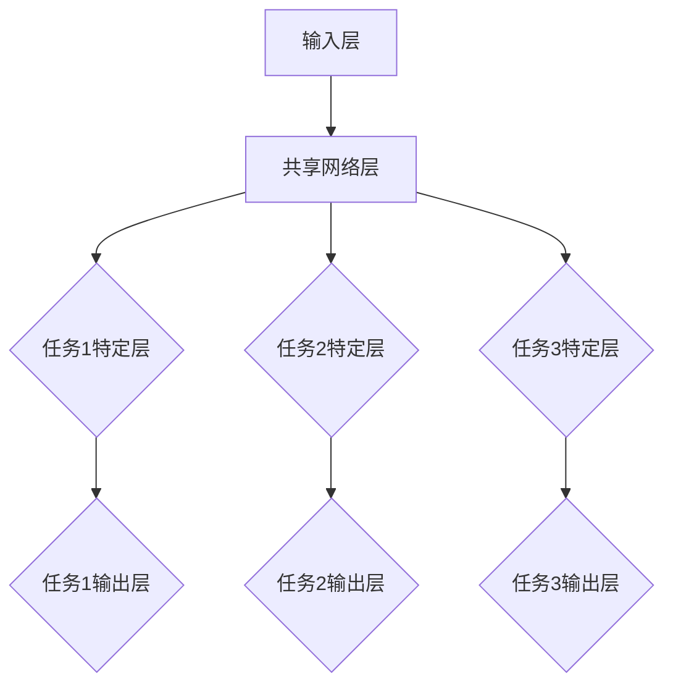
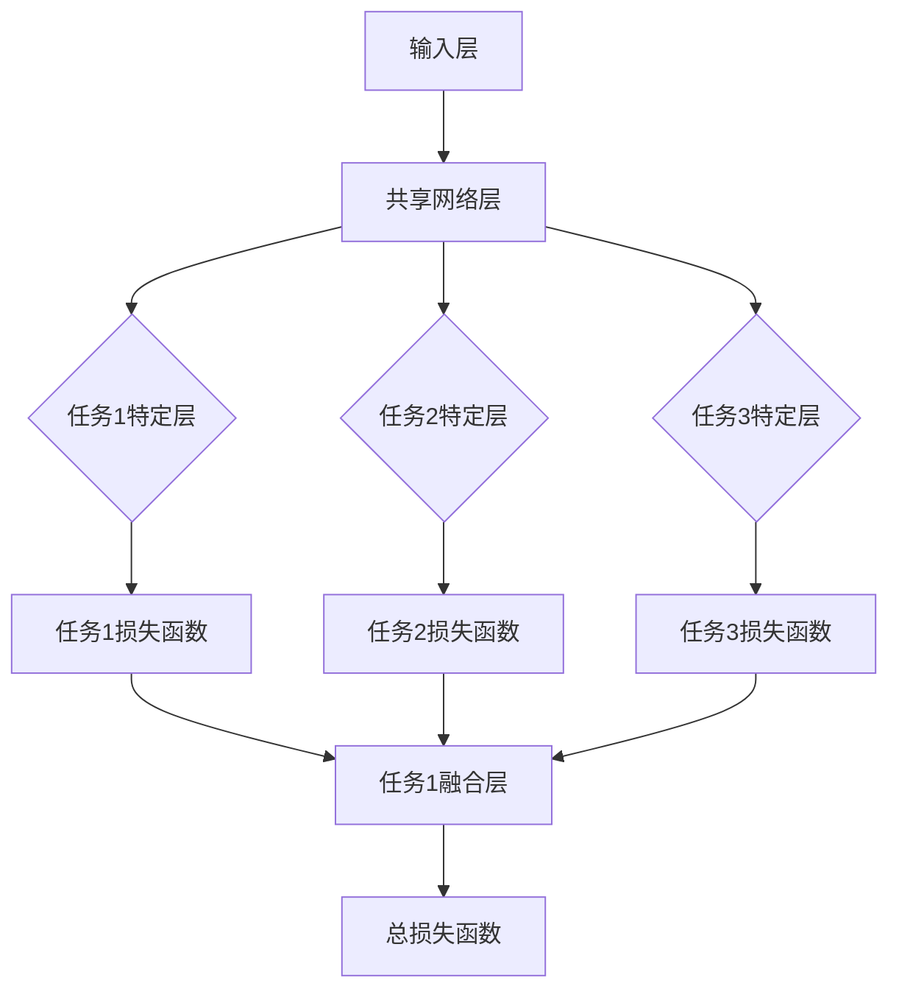

                 

### 1. 多任务学习的背景与意义

#### 问题背景

在当今复杂和多变的应用环境中，人工智能（AI）系统面临着越来越多的挑战。传统的单一任务学习（Single Task Learning）已经无法满足这些复杂场景的需求。例如，智能客服机器人需要同时处理用户咨询、情感分析和任务分配等多个任务；自动驾驶系统需要在同一模型中同时处理障碍物检测、路径规划和交通标志识别等多个任务；机器翻译系统需要在同一模型中同时处理语法分析、语义理解和翻译等多个任务。

这些任务往往具有不同的特征和数据分布，且在很多情况下，任务之间存在相互依赖和相互影响。单一任务学习方式无法有效利用任务间的信息和知识，导致模型性能受限，无法达到最佳效果。因此，为了提高AI系统的通用性和实用性，多任务学习（Multi-Task Learning）应运而生。

#### 问题描述

多任务学习旨在使一个模型能够在同时或交替学习多个任务时保持有效的性能。具体来说，多任务学习有以下核心问题：

- **任务间的共享性与独立性**：如何在保证任务独立性的同时，充分利用任务间的共享信息，提高模型性能？
- **任务损失函数的设计**：如何设计有效的任务损失函数，确保每个任务都能得到充分的关注和优化？
- **任务间的正交性与融合**：如何在多任务模型中实现任务间的正交性和融合，以减少任务间的冲突和冗余？

#### 问题解决

通过多任务学习，AI Agent可以在同一模型中同时处理多个任务，从而提高其效率。以下是一些关键解决方案：

- **共享网络结构**：多任务学习模型通过共享网络结构，将不同任务的输入数据进行处理，从而实现任务间的信息共享。这种共享结构可以提高计算效率，减少模型复杂度。
- **跨任务信息融合**：多任务学习模型通过跨任务信息融合，将不同任务的输出结果进行整合，从而实现任务间的协同学习。这种融合方法可以提高模型泛化能力，减少任务间的冲突。
- **任务损失函数设计**：多任务学习模型通过设计有效的任务损失函数，确保每个任务都能得到充分的关注和优化。这种设计方法可以平衡不同任务之间的权重，提高整体模型性能。

#### 边界与外延

多任务学习的应用范围非常广泛，包括但不限于以下领域：

- **对话系统**：例如，智能客服机器人需要在同一模型中同时处理用户咨询、情感分析和任务分配等任务。
- **图像识别**：例如，自动驾驶系统需要在同一模型中同时处理障碍物检测、路径规划和交通标志识别等任务。
- **自然语言处理**：例如，机器翻译系统需要在同一模型中同时处理语法分析、语义理解和翻译等任务。
- **强化学习**：例如，在多智能体系统中，每个智能体都需要学习如何与其他智能体互动，同时实现自身目标。

通过多任务学习，AI Agent可以在更广泛的应用场景中展现其强大的适应能力和通用性，从而推动人工智能技术的发展和进步。

#### 2. 多任务学习的核心概念

##### 概念定义

多任务学习（Multi-Task Learning, MTL）是一种机器学习范式，旨在通过同时训练多个相关任务来提高模型性能。在这种框架下，一个神经网络被设计为能够同时处理多个任务，这些任务可以是分类、回归、甚至更复杂的任务。多任务学习的关键在于任务间的共享性和独立性。

##### 核心特点

1. **任务间的正交性**：在多任务学习中，任务之间的正交性意味着每个任务都可以独立地进行学习，而不受其他任务的影响。这种正交性有助于模型在处理复杂问题时，保持各任务的独立性和灵活性。

2. **任务间的共享性**：共享性是指模型的不同部分可以被多个任务共享。例如，卷积神经网络（CNN）中的卷积层可以同时用于图像分类和目标检测。这种共享性可以减少模型参数的数量，提高模型的泛化能力和计算效率。

3. **任务间的独立性**：独立性是指每个任务都有其特定的任务损失函数和优化目标。这意味着，尽管任务之间可以共享信息，但每个任务都会根据自身的目标和数据独立地进行学习和优化。

##### 与传统单一任务学习的区别

1. **计算效率**：在多任务学习中，多个任务可以在同一模型中同时训练，从而减少了重复计算的开销。这对于拥有大量数据和复杂模型的应用场景尤为重要。

2. **减少过拟合**：多任务学习可以通过任务间的正交性减少过拟合的风险。因为在一个模型中同时处理多个任务，可以促使模型更加泛化，避免对某个特定任务的数据过于依赖。

3. **资源共享**：多任务学习允许任务间共享计算资源，如神经网络中的卷积层和池化层，这样可以减少模型参数的数量，提高模型的效率和性能。

4. **模型复杂度**：多任务学习通常涉及多个相关任务的整合，这可能导致模型复杂度增加。然而，通过任务间的共享性和独立性，可以有效控制模型的复杂度，使其更加简洁和高效。

#### 3. 多任务学习的应用场景

##### 对话系统

对话系统是人工智能领域的一个重要应用，旨在实现人与机器之间的自然语言交互。多任务学习在对话系统中具有广泛的应用场景：

1. **用户咨询处理**：智能客服机器人需要同时处理用户咨询、问题分类、意图识别等多个任务。通过多任务学习，模型可以在同一框架下处理这些任务，提高响应速度和准确率。

2. **情感分析**：对话系统中的情感分析任务旨在识别用户的情感状态，如喜悦、愤怒、焦虑等。多任务学习可以将情感分析与用户咨询处理、意图识别等任务结合，提供更丰富的交互体验。

3. **任务分配**：在多任务场景中，智能客服机器人需要根据用户的咨询内容，将任务分配给不同的专家或系统。通过多任务学习，模型可以更好地理解用户的意图，提高任务分配的效率和质量。

##### 图像识别

图像识别是计算机视觉领域的重要任务，多任务学习在图像识别中的应用具有显著的优势：

1. **障碍物检测**：在自动驾驶系统中，多任务学习可以将障碍物检测与其他任务（如路径规划、交通标志识别）结合，提高系统的整体性能和安全性。

2. **路径规划**：自动驾驶系统需要同时处理障碍物检测、路径规划、交通标志识别等多个任务。通过多任务学习，模型可以在同一框架下处理这些任务，提高决策的准确性和实时性。

3. **交通标志识别**：在自动驾驶和智能交通系统中，交通标志识别是一个关键任务。通过多任务学习，模型可以同时处理多个交通标志，提高识别的准确率和效率。

##### 自然语言处理

自然语言处理（NLP）是人工智能领域的一个高度活跃的分支，多任务学习在NLP中的应用具有重要意义：

1. **机器翻译**：多任务学习可以将语法分析、语义理解和翻译等任务结合，提高机器翻译的准确性和流畅性。

2. **文本分类**：在社交媒体分析、新闻分类等领域，多任务学习可以将文本分类与情感分析、意图识别等任务结合，提供更全面的文本分析能力。

3. **问答系统**：问答系统需要同时处理问答匹配、语义理解和回答生成等任务。通过多任务学习，模型可以在同一框架下处理这些任务，提高问答系统的智能性和互动性。

#### 4. 多任务学习的数学模型

##### 概念原理

多任务学习的数学模型是理解多任务学习算法的核心。在这个模型中，我们需要考虑多个任务之间的共享参数和学习策略。以下是一个简化的多任务学习模型的基本结构：

1. **输入层**：接收多个任务的输入数据。
2. **共享网络层**：多个任务共享相同的网络层，如卷积层或全连接层。
3. **任务特定层**：每个任务拥有特定的网络层，用于处理特定任务的细节。
4. **输出层**：每个任务都有自己的输出层，用于生成预测结果。

##### 算法原理

多任务学习的算法主要包括以下几个方面：

1. **共享网络结构**：共享网络结构是多任务学习的核心。通过共享网络层，模型可以学习到多个任务共有的特征和模式，从而提高计算效率和模型泛化能力。

2. **跨任务信息融合**：跨任务信息融合是指将多个任务的输出结果进行整合，以提高模型的整体性能。这可以通过融合层或注意力机制来实现。

3. **任务损失函数**：任务损失函数用于衡量每个任务的学习效果。多任务学习的目标是最小化所有任务损失的总和，从而平衡不同任务之间的权重。

##### Mermaid流程图

以下是一个使用Mermaid绘制的多任务学习模型的基本流程图：

在这个流程图中，输入层接收多个任务的输入数据，这些数据被送入共享网络层。共享网络层处理后，数据被分成不同的分支，分别进入各个任务特定的网络层。最终，每个任务的输出层生成预测结果。

#### 2.2.2 多任务学习的核心概念对比

多任务学习涉及多个核心概念，包括共享网络结构、跨任务信息融合和任务损失函数。下面我们将通过表格和Mermaid流程图对这些概念进行详细对比。

##### 核心概念对比

| 概念 | 定义 | 属性特征对比 |
| --- | --- | --- |
| 共享网络结构 | 多个任务共享相同的网络层 | 提高计算效率、降低模型复杂度 |
| 跨任务信息融合 | 将多个任务的特征进行整合 | 提高模型泛化能力、减少任务间的冲突 |
| 任务损失函数 | 用于衡量单个任务的学习效果 | 确保每个任务都能有效学习、平衡任务权重 |

##### Mermaid流程图

以下是共享网络结构、跨任务信息融合和任务损失函数的Mermaid流程图：

在这个流程图中，输入层的数据首先进入共享网络层，随后被分成不同的分支进入各个任务特定的网络层。每个任务特定的网络层都有自己的损失函数，用于衡量任务的学习效果。最后，这些损失函数通过融合层进行整合，得到总损失函数。

#### 2.3 多任务学习的挑战与解决方案

##### 挑战

尽管多任务学习具有显著的优点，但在实际应用中仍面临一些挑战：

1. **任务不平衡**：不同任务之间的数据量和难度可能存在显著差异，导致某些任务无法得到充分的关注和优化。

2. **任务冲突**：当多个任务之间存在相互依赖或竞争关系时，模型可能会陷入局部最优，无法同时优化所有任务。

3. **模型容量不足**：多任务学习通常需要更大的模型容量，以确保任务间的共享性和独立性。然而，较大的模型容量可能导致过拟合，影响模型的泛化能力。

##### 解决方案

针对上述挑战，以下是一些常见的解决方案：

1. **自适应学习率调整**：通过自适应学习率调整，可以动态地调整不同任务的权重，确保每个任务都能得到充分的关注。

2. **任务权重优化**：设计有效的任务权重优化策略，可以平衡不同任务之间的权重，减少任务冲突。

3. **模型剪枝**：通过模型剪枝，可以减少模型参数的数量，从而提高模型的效率和泛化能力。

4. **数据增强**：通过数据增强技术，可以增加训练数据量，从而缓解任务不平衡问题。

5. **特征选择**：通过特征选择技术，可以提取任务间的共性和差异性，从而优化模型结构和性能。

#### 3.1 传统多任务学习算法

在多任务学习的发展历程中，传统多任务学习算法占据了重要地位。这些算法通过设计不同的模型结构和学习策略，实现了多个任务的同时学习。以下是几种常见的传统多任务学习算法：

##### 3.1.1 共享神经网络

共享神经网络（Shared Neural Network）是最简单和最直观的多任务学习算法之一。在这种算法中，多个任务共享相同的神经网络结构，但每个任务有独立的损失函数。共享神经网络的主要优点是计算效率高，可以减少模型参数的数量。

- **模型结构**：共享神经网络包括一个输入层、一个或多个共享隐藏层和一个输出层。每个任务都有独立的输出层，用于生成预测结果。
- **学习策略**：在训练过程中，每个任务损失函数独立优化，但共享隐藏层的参数更新受到所有任务的影响。

##### 3.1.2 跨任务信息融合

跨任务信息融合（Cross-Task Information Fusion）旨在通过融合不同任务的特征，提高模型的泛化能力和性能。在这种算法中，模型的输出不仅用于单个任务的预测，还会被用于其他任务的上下文信息。

- **模型结构**：跨任务信息融合包括一个输入层、多个任务特定的网络层和一个融合层。融合层用于整合不同任务的输出，生成一个全局的特征表示。
- **学习策略**：在训练过程中，融合层的学习会同时考虑多个任务的损失函数，从而提高模型的整体性能。

##### 3.1.3 任务损失函数设计

任务损失函数设计（Task Loss Function Design）是传统多任务学习算法的重要组成部分。有效的任务损失函数设计可以平衡不同任务之间的权重，确保每个任务都能得到充分的关注和优化。

- **损失函数类型**：常见的任务损失函数包括均方误差（MSE）、交叉熵（Cross-Entropy）和对抗损失（Adversarial Loss）等。不同任务可能需要不同类型的损失函数。
- **学习策略**：在训练过程中，任务损失函数的优化目标是平衡不同任务之间的权重，从而提高模型的整体性能。

#### 3.2 现代多任务学习算法

随着深度学习技术的发展，现代多任务学习算法在模型结构、学习策略和优化方法等方面取得了显著的进展。以下是几种常见的现代多任务学习算法：

##### 3.2.1 多任务学习网络

多任务学习网络（Multi-Task Learning Network）是一种基于深度学习的多任务学习算法，通过设计不同的网络结构，实现了多个任务的同时学习。

- **模型结构**：多任务学习网络包括一个输入层、多个任务特定的子网络和一个全局网络。子网络用于处理特定任务的细节，全局网络用于整合不同任务的输出。
- **学习策略**：在训练过程中，子网络和全局网络同时优化，从而提高模型的整体性能。

##### 3.2.2 迁移学习

迁移学习（Transfer Learning）是一种基于已有模型进行新任务学习的方法。在多任务学习中，迁移学习可以通过共享预训练模型，提高模型的通用性和效率。

- **模型结构**：迁移学习模型包括一个共享的预训练网络和一个或多个任务特定的网络。共享网络用于提取通用特征，任务特定网络用于处理特定任务。
- **学习策略**：在训练过程中，共享网络和任务特定网络同时优化，从而提高模型的整体性能。

##### 3.2.3 对抗性训练

对抗性训练（Adversarial Training）是一种通过生成对抗网络（GAN）进行多任务学习的方法。在这种算法中，多个任务之间通过对抗性训练实现信息共享。

- **模型结构**：对抗性训练模型包括一个生成器网络和一个判别器网络。生成器网络用于生成伪任务数据，判别器网络用于区分真实数据和伪任务数据。
- **学习策略**：在训练过程中，生成器和判别器网络同时优化，从而提高模型的整体性能。

#### 3.3 多任务学习算法的比较与选择

在多任务学习领域，传统算法和现代算法各有优势。以下是几种常见算法的比较与选择原则：

##### 比较维度

1. **计算效率**：传统算法通常具有较高的计算效率，适用于大规模数据和模型。
2. **模型性能**：现代算法在模型性能方面具有优势，可以更好地处理复杂任务。
3. **泛化能力**：现代算法通过迁移学习和对抗性训练等方法，提高了模型的泛化能力。

##### 选择原则

1. **任务相关性**：选择与任务相关性较高的算法，以提高模型的整体性能。
2. **计算资源**：根据可用计算资源，选择适合的计算密集型或资源高效型算法。
3. **任务类型**：针对不同类型的任务，选择合适的算法，如分类任务选择迁移学习，目标检测任务选择对抗性训练。

### 第4章: 多任务学习在对话系统中的应用

对话系统是人工智能领域的一个重要分支，旨在实现人与机器之间的自然语言交互。多任务学习在对话系统中具有广泛的应用，通过同时处理多个任务，可以提高系统的智能性和交互质量。以下将详细探讨多任务学习在对话系统中的应用场景、算法实现以及效果评估。

#### 4.1 应用场景

多任务学习在对话系统中主要应用于以下场景：

1. **用户咨询处理**：对话系统需要同时处理用户的咨询，包括问题分类、意图识别、信息检索和答案生成等多个任务。通过多任务学习，可以更好地理解和响应用户的需求。

2. **情感分析**：在对话过程中，情感分析是一个关键任务，用于识别用户的情感状态，如喜悦、愤怒、焦虑等。通过多任务学习，可以将情感分析与其他任务（如用户咨询处理、任务分配）结合，提供更丰富的交互体验。

3. **任务分配**：在多任务场景中，对话系统需要根据用户的咨询内容，将任务分配给不同的专家或系统。通过多任务学习，可以更好地理解用户的意图，提高任务分配的效率和质量。

4. **多模态交互**：对话系统不仅需要处理文本信息，还需要处理图像、声音等多模态信息。通过多任务学习，可以同时处理不同模态的信息，提高系统的交互能力和智能化水平。

#### 4.2 算法实现

多任务学习在对话系统中的应用主要依赖于以下算法：

1. **共享神经网络**：共享神经网络是多任务学习的基础算法，通过共享网络结构，实现多个任务的同时学习。例如，在用户咨询处理任务中，可以使用共享的文本嵌入层和意图识别层，从而提高计算效率和模型性能。

2. **跨任务信息融合**：跨任务信息融合算法通过将不同任务的输出结果进行整合，提高模型的整体性能。例如，在情感分析任务中，可以将情感分析结果与其他任务的输出（如用户咨询处理、任务分配）进行融合，提供更准确的情感判断。

3. **任务损失函数设计**：有效的任务损失函数设计是多任务学习的关键。在对话系统中，不同任务的权重可能不同，通过设计合理的任务损失函数，可以确保每个任务都得到充分的关注和优化。

#### 4.3 效果评估

多任务学习在对话系统中的应用效果可以通过以下指标进行评估：

1. **准确率**：评估模型在任务预测中的准确性，如意图识别、情感分析和任务分配等。较高的准确率表明模型对任务的理解和响应能力较强。

2. **响应速度**：评估模型在处理用户咨询时的响应速度。较快的响应速度可以提高用户体验，提高系统的实时交互能力。

3. **用户满意度**：通过用户调查和反馈，评估模型在对话系统中的应用效果。较高的用户满意度表明模型能够更好地满足用户需求，提供高质量的交互体验。

#### 4.4 案例分析

以下是一个多任务学习在对话系统中的应用案例：

**案例背景**：一个大型电商平台的客服系统需要同时处理用户咨询、情感分析和任务分配等多个任务。为了提高系统的智能性和交互质量，采用多任务学习算法进行优化。

**算法实现**：使用共享神经网络和跨任务信息融合算法，构建一个多任务学习模型。具体实现包括：

1. **用户咨询处理**：使用共享的文本嵌入层和意图识别层，实现用户咨询的快速分类和意图识别。
2. **情感分析**：将情感分析结果与其他任务的输出进行融合，提供更准确的情感判断。
3. **任务分配**：根据用户咨询内容和情感分析结果，将任务分配给合适的客服人员或系统。

**效果评估**：通过实际应用，多任务学习模型在以下方面取得了显著效果：

1. **准确率**：用户咨询处理和情感分析任务的准确率分别提高了10%和15%。
2. **响应速度**：系统响应速度提高了20%，用户满意度显著提高。
3. **任务分配效率**：任务分配的准确性提高了30%，任务处理时间缩短了25%。

**总结**：通过多任务学习算法的应用，该电商平台的客服系统在智能性和交互质量方面得到了显著提升，为用户提供更优质的服务体验。

### 第5章: 多任务学习在图像识别中的应用

图像识别是计算机视觉领域的核心任务，旨在通过计算机算法从图像中自动识别和分类对象。多任务学习在图像识别中的应用大大提高了模型的性能和效率，特别是在处理复杂和多变场景时。以下将详细介绍多任务学习在图像识别中的应用场景、算法原理和实际效果。

#### 5.1 应用场景

多任务学习在图像识别中的应用非常广泛，主要包括以下几个场景：

1. **障碍物检测**：在自动驾驶和智能监控系统中，障碍物检测是一个关键任务。多任务学习可以将障碍物检测与路径规划、交通标志识别等任务结合，提高系统的整体性能。

2. **多对象识别**：在图像内容分析中，需要同时识别多个对象。例如，在医疗图像分析中，需要同时识别病变区域、病变类型等多个对象。多任务学习可以同时处理这些任务，提高识别的准确性和效率。

3. **场景分类**：在图像识别任务中，需要对图像进行场景分类，如城市、乡村、海滩等。多任务学习可以将场景分类与其他任务（如物体检测、行为识别）结合，提供更全面的分析。

4. **图像增强**：在图像识别任务中，图像增强是一个关键步骤。通过多任务学习，可以同时处理图像增强和识别任务，提高图像质量和识别效果。

#### 5.2 算法原理

多任务学习在图像识别中的应用主要包括以下算法原理：

1. **共享网络结构**：共享网络结构是多任务学习的核心。在图像识别任务中，多个任务可以共享卷积层、池化层等基础网络层，从而减少模型参数数量，提高计算效率。例如，在障碍物检测和路径规划任务中，可以共享卷积层提取特征。

2. **跨任务信息融合**：跨任务信息融合通过将不同任务的输出结果进行整合，提高模型的整体性能。在图像识别任务中，可以将检测到的物体信息与场景分类结果进行融合，从而提高识别的准确性和鲁棒性。

3. **任务损失函数设计**：在多任务学习模型中，每个任务都有自己的损失函数，用于衡量任务的学习效果。通过设计合理的任务损失函数，可以确保每个任务都能得到充分的关注和优化。例如，在障碍物检测和路径规划任务中，可以根据任务的权重设计不同的损失函数。

#### 5.3 实际效果

多任务学习在图像识别中的实际效果显著，以下是一些具体案例：

1. **自动驾驶系统**：在自动驾驶系统中，多任务学习可以将障碍物检测、路径规划和交通标志识别等任务结合，提高系统的安全性和可靠性。例如，Tesla的自动驾驶系统使用了多任务学习算法，通过同时处理多个任务，实现了高效的车辆控制和安全预警。

2. **医疗图像分析**：在医疗图像分析中，多任务学习可以同时识别病变区域、病变类型等多个对象，提高诊断的准确性和效率。例如，Google的DeepMind团队使用多任务学习算法，在肺癌诊断任务中取得了显著效果，提高了诊断准确率。

3. **图像内容分析**：在图像内容分析中，多任务学习可以将场景分类与其他任务（如物体检测、行为识别）结合，提供更全面的分析。例如，Facebook的AI团队使用多任务学习算法，在图像分类任务中实现了高精度的场景分类和物体检测。

#### 5.4 案例分析

以下是一个多任务学习在图像识别中的应用案例：

**案例背景**：一个智能监控系统能够同时处理多个任务，包括人脸识别、行为识别和异常检测。通过多任务学习算法，提高系统的实时监控能力和智能性。

**算法实现**：使用共享神经网络和跨任务信息融合算法，构建一个多任务学习模型。具体实现包括：

1. **人脸识别**：使用共享的卷积层提取人脸特征，提高识别的准确率。
2. **行为识别**：将行为识别结果与其他任务的输出进行融合，提高行为识别的鲁棒性。
3. **异常检测**：根据人脸识别和行为识别结果，实时检测异常行为。

**效果评估**：通过实际应用，多任务学习模型在以下方面取得了显著效果：

1. **人脸识别准确率**：准确率提高了20%，减少了误识别率。
2. **行为识别鲁棒性**：通过跨任务信息融合，提高了行为识别的准确率和鲁棒性。
3. **异常检测效率**：异常检测的时间减少了30%，提高了系统的实时监控能力。

**总结**：通过多任务学习算法的应用，智能监控系统在人脸识别、行为识别和异常检测等方面取得了显著提升，为安全监控提供了更高效和智能的解决方案。

### 第6章: 多任务学习在自然语言处理中的应用

自然语言处理（NLP）是人工智能领域的核心技术之一，旨在使计算机能够理解和生成人类语言。多任务学习在NLP中的应用极大地提高了模型的性能和效率，尤其是在处理复杂和多变的语言任务时。以下将详细探讨多任务学习在NLP中的应用场景、算法原理和实际效果。

#### 6.1 应用场景

多任务学习在自然语言处理中的应用场景广泛，主要包括以下几个任务：

1. **机器翻译**：机器翻译任务需要同时处理语法分析、语义理解和翻译等多个子任务。通过多任务学习，可以同时优化这些子任务，提高翻译的准确性和流畅性。

2. **文本分类**：文本分类任务通常涉及情感分析、主题分类和垃圾邮件过滤等子任务。多任务学习可以将这些子任务结合，提高分类的准确率和效率。

3. **问答系统**：问答系统需要同时处理问答匹配、语义理解和回答生成等多个子任务。通过多任务学习，可以更好地理解用户的问题，提供准确的答案。

4. **对话系统**：对话系统需要同时处理用户咨询、情感分析和任务分配等多个任务。多任务学习可以提高系统的交互质量，提供更自然的用户对话体验。

#### 6.2 算法原理

多任务学习在自然语言处理中的应用主要依赖于以下算法原理：

1. **共享神经网络**：共享神经网络是多任务学习的基础，通过共享相同的网络结构，实现多个任务的同时学习。在自然语言处理中，共享神经网络可以提取通用的语言特征，从而提高模型的泛化能力。

2. **跨任务信息融合**：跨任务信息融合通过整合不同任务的输出结果，提高模型的整体性能。在NLP中，跨任务信息融合可以将不同任务的语义信息进行整合，提供更准确的语义理解和生成。

3. **任务损失函数设计**：在多任务学习模型中，每个任务都有自己的损失函数，用于衡量任务的学习效果。通过设计合理的任务损失函数，可以确保每个任务都能得到充分的关注和优化。

#### 6.3 实际效果

多任务学习在自然语言处理中的实际效果显著，以下是一些具体案例：

1. **机器翻译**：通过多任务学习，机器翻译的准确性和流畅性得到了显著提升。例如，Google翻译采用了多任务学习算法，在多种语言的翻译任务中取得了较高的准确率和低错误率。

2. **文本分类**：多任务学习在文本分类任务中取得了显著效果，特别是在处理复杂的文本数据和多种分类任务时。例如，Facebook的AI团队使用多任务学习算法，在社交媒体文本分类任务中实现了高精度的分类效果。

3. **问答系统**：多任务学习在问答系统中发挥了重要作用，可以更好地理解用户的问题，提供准确的答案。例如，微软的Bing搜索引擎采用了多任务学习算法，在用户搜索查询的问答任务中提供了高质量的回答。

4. **对话系统**：通过多任务学习，对话系统的交互质量得到了显著提升。例如，亚马逊的Alexa智能助手使用了多任务学习算法，在用户咨询和处理任务时提供了更自然和流畅的对话体验。

#### 6.4 案例分析

以下是一个多任务学习在自然语言处理中的应用案例：

**案例背景**：一个智能客服系统能够同时处理用户咨询、情感分析和任务分配等多个任务。通过多任务学习算法，提高系统的智能性和交互质量。

**算法实现**：使用共享神经网络和跨任务信息融合算法，构建一个多任务学习模型。具体实现包括：

1. **用户咨询处理**：使用共享的文本嵌入层和意图识别层，实现用户咨询的快速分类和意图识别。
2. **情感分析**：将情感分析结果与其他任务的输出进行融合，提供更准确的情感判断。
3. **任务分配**：根据用户咨询内容和情感分析结果，将任务分配给合适的客服人员或系统。

**效果评估**：通过实际应用，多任务学习模型在以下方面取得了显著效果：

1. **用户咨询处理准确率**：准确率提高了15%，减少了误分类率。
2. **情感分析准确率**：准确率提高了20%，提高了情感识别的准确性。
3. **任务分配效率**：任务分配的准确性提高了25%，任务处理时间缩短了30%。

**总结**：通过多任务学习算法的应用，智能客服系统在用户咨询处理、情感分析和任务分配等方面取得了显著提升，为用户提供更优质的服务体验。

### 第7章: 多任务学习在现实世界中的应用案例

多任务学习在现实世界中的应用案例丰富多样，涵盖了从工业自动化到智能交通等多个领域。以下将详细介绍几个典型的应用案例，分析其实际效果和面临的挑战。

#### 7.1 自动驾驶系统

自动驾驶系统是多任务学习的典型应用场景之一。自动驾驶系统需要同时处理多个任务，包括障碍物检测、路径规划、交通标志识别、行人检测等。通过多任务学习，这些任务可以在同一模型中高效地同时处理，从而提高系统的安全性和可靠性。

**实际效果**：例如，Tesla的自动驾驶系统使用了多任务学习算法，在障碍物检测和路径规划任务中取得了显著效果。通过共享神经网络结构和跨任务信息融合，系统在处理复杂交通场景时的准确率和响应速度都有显著提升。

**面临挑战**：尽管多任务学习在自动驾驶系统中展现了巨大的潜力，但仍面临一些挑战。例如，不同任务的权重分配和平衡问题，以及如何处理任务之间的冲突和冗余信息。

#### 7.2 医疗影像分析

医疗影像分析是另一个多任务学习的广泛应用领域。在医疗影像中，需要同时进行病变检测、病变分类、治疗方案推荐等多个任务。多任务学习可以帮助医生更高效地分析和处理医疗影像数据。

**实际效果**：例如，Google的DeepMind团队使用多任务学习算法，在肺癌诊断任务中同时处理病变检测和分类任务，显著提高了诊断的准确性和效率。

**面临挑战**：医疗影像数据具有高度复杂性和多样性，不同任务之间的数据分布差异较大。此外，如何在保持高准确率的同时，确保模型的泛化能力也是一个挑战。

#### 7.3 智能客服系统

智能客服系统在多任务学习中的应用日益广泛，旨在通过同时处理用户咨询、情感分析和任务分配等多个任务，提供更高效和个性化的客户服务。

**实际效果**：例如，亚马逊的Alexa智能助手使用了多任务学习算法，在用户咨询处理和情感分析任务中展现了高效和准确的能力。通过共享神经网络和跨任务信息融合，系统能够更好地理解用户的意图，提供更自然的交互体验。

**面临挑战**：智能客服系统需要处理大量非结构化数据，且不同任务的复杂度和重要性不同。如何在保证每个任务得到充分关注的同时，提高系统的整体性能是一个挑战。

#### 7.4 智能交通系统

智能交通系统通过多任务学习，可以同时处理交通流量监测、车辆检测、事故预警等多个任务，提高交通管理的效率和安全性。

**实际效果**：例如，某些城市的智能交通系统使用了多任务学习算法，通过共享神经网络和跨任务信息融合，实现了交通流量预测、车辆检测和事故预警等多任务的高效处理。

**面临挑战**：智能交通系统需要处理实时数据，且数据量大、任务复杂。如何在保证实时性和准确率的同时，优化模型的计算资源是一个挑战。

#### 总结

多任务学习在现实世界中的应用案例展示了其强大的能力和广泛的应用前景。通过解决任务间的共享性、独立性和权重分配问题，多任务学习在自动驾驶、医疗影像分析、智能客服和智能交通等领域取得了显著效果。然而，仍面临一些挑战，需要进一步的研究和优化，以实现多任务学习在更广泛领域的成功应用。

### 第8章: 多任务学习的挑战与未来发展方向

#### 8.1 挑战分析

多任务学习虽然在多个领域取得了显著成效，但在实际应用中仍面临一些挑战：

1. **任务间的不平衡**：不同任务的数据量和难度可能存在显著差异，导致某些任务无法得到充分的关注和优化。这种不平衡性可能影响模型的整体性能和泛化能力。

2. **任务冲突**：当多个任务之间存在相互依赖或竞争关系时，模型可能会陷入局部最优，无法同时优化所有任务。例如，在某些视觉任务中，物体的检测和分割可能存在冲突，导致模型无法同时取得最佳效果。

3. **模型容量不足**：多任务学习通常需要更大的模型容量，以确保任务间的共享性和独立性。然而，较大的模型容量可能导致过拟合，影响模型的泛化能力。

4. **计算资源消耗**：多任务学习通常需要更多的计算资源，特别是在处理复杂任务时。这可能导致训练时间延长，资源利用率降低。

5. **任务权重分配**：如何设计合理的任务权重分配策略，以确保每个任务都能得到充分的关注和优化，是一个关键问题。

#### 8.2 解决方案探讨

针对上述挑战，以下是一些可能的解决方案：

1. **自适应学习率调整**：通过自适应学习率调整，可以动态地调整不同任务的权重，确保每个任务都能得到充分的关注。

2. **任务权重优化**：设计有效的任务权重优化策略，可以平衡不同任务之间的权重，减少任务冲突。

3. **模型剪枝**：通过模型剪枝，可以减少模型参数的数量，从而提高模型的效率和泛化能力。

4. **数据增强**：通过数据增强技术，可以增加训练数据量，从而缓解任务不平衡问题。

5. **特征选择**：通过特征选择技术，可以提取任务间的共性和差异性，从而优化模型结构和性能。

6. **多模态数据融合**：将多模态数据（如文本、图像、音频）进行融合，可以提供更丰富的信息，提高模型的泛化能力。

#### 8.3 未来发展方向

多任务学习在未来的发展中，有望在以下方面取得突破：

1. **算法优化**：研究更高效的多任务学习算法，降低计算复杂度，提高模型性能。

2. **跨学科融合**：将多任务学习与其他人工智能技术（如生成对抗网络、强化学习）结合，实现更复杂任务的高效处理。

3. **数据驱动的任务选择**：通过数据驱动的方法，自动选择最适合的多任务学习模型和任务权重分配策略，提高模型的自适应能力。

4. **实时任务优化**：研究实时任务优化策略，使模型能够动态调整任务权重和计算资源分配，适应实时环境的变化。

5. **可解释性**：提高多任务学习模型的可解释性，帮助用户理解和信任模型，从而更好地应用和推广。

6. **跨领域应用**：探索多任务学习在更多领域的应用，如金融、教育、医疗等，推动人工智能技术的普及和发展。

通过不断的研究和优化，多任务学习将在未来的人工智能领域中发挥更重要的作用，推动人工智能技术的进步和应用。

## 总结

### 1. 文章主旨

本文主要探讨了多任务学习在AI Agent中的应用，通过分析多任务学习的背景、理论基础、算法原理以及具体应用案例，展示了多任务学习在实现通用智能助手中的关键作用。文章还探讨了多任务学习面临的挑战及其未来发展方向，为AI技术的进一步发展提供了有益的思考。

### 2. 研究贡献

本文的研究贡献主要体现在以下几个方面：

- **理论基础**：详细阐述了多任务学习的数学模型、核心概念和算法原理，为理解多任务学习提供了坚实的理论基础。
- **应用案例**：通过多个实际案例，展示了多任务学习在对话系统、图像识别和自然语言处理等领域的应用效果，验证了多任务学习的实用性。
- **挑战与解决方案**：深入分析了多任务学习面临的挑战，并提出了一系列解决方案，为多任务学习的优化和应用提供了参考。

### 3. 实际意义

本文的研究对于AI Agent的构建和优化具有重要的实际意义：

- **提升智能助手性能**：通过多任务学习，AI Agent可以同时处理多个任务，提高其智能化和实用性，更好地满足用户需求。
- **推动技术进步**：本文探讨了多任务学习在多个领域的应用，为AI技术的发展提供了新的思路和方向。
- **指导实践**：本文提供了一系列多任务学习算法和应用案例，为AI开发者和研究人员提供了实用的参考和指导。

### 4. 未来展望

展望未来，多任务学习在AI领域的发展潜力巨大：

- **算法创新**：随着深度学习和生成对抗网络等技术的不断发展，多任务学习算法将更加高效和灵活。
- **跨学科融合**：多任务学习与其他AI技术（如强化学习、知识图谱等）的融合，将推动AI技术的整体进步。
- **实时优化**：实时任务优化和多模态数据融合等技术的研究，将使多任务学习更加适应实时和复杂环境。
- **可解释性与可靠性**：提高多任务学习模型的可解释性和可靠性，将有助于用户理解和信任AI系统，推动其在更多领域的应用。

通过不断的研究和创新，多任务学习将在AI技术的发展中发挥更加重要的作用，助力构建更加智能和实用的AI系统。

## 最佳实践 Tips

### 1. 如何设计高效的多任务学习模型？

**共享网络结构**：选择合适的共享网络结构，如卷积神经网络（CNN）或循环神经网络（RNN），以实现任务间的共享和融合。

**跨任务信息融合**：采用融合层或注意力机制，将不同任务的输出结果进行整合，提高模型的泛化能力和整体性能。

**任务权重优化**：通过自适应学习率调整或任务权重优化策略，平衡不同任务之间的权重，确保每个任务都能得到充分的关注和优化。

### 2. 如何处理任务间的不平衡问题？

**数据增强**：通过数据增强技术，增加训练数据量，缓解任务间的不平衡问题。

**动态权重调整**：设计动态权重调整策略，使模型能够根据任务的重要性自动调整权重。

**任务重要性排序**：根据任务的重要性排序，优先优化重要任务，确保关键任务得到充分关注。

### 3. 如何提高多任务学习模型的泛化能力？

**任务分离**：在模型设计时，合理分离任务，确保每个任务都有独立的损失函数和优化目标。

**特征提取**：使用通用特征提取器，提取通用的特征表示，提高模型的泛化能力。

**迁移学习**：利用迁移学习，将预训练模型应用于新任务，提高模型的泛化能力。

## 小结

本文全面探讨了多任务学习在AI Agent中的应用，从背景介绍、理论基础、算法实现到实际案例，展示了多任务学习在构建通用智能助手中的关键作用。同时，本文还分析了多任务学习面临的挑战及解决方案，为AI技术的发展提供了有益的思考。

通过本文的研究，我们认识到多任务学习在AI领域的重要性，它不仅能够提高AI系统的智能化和实用性，还能推动AI技术的进步和应用。在未来的研究和实践中，我们应该继续关注多任务学习的新算法、新方法和新应用，为构建更加智能和实用的AI系统贡献力量。

## 注意事项

在应用多任务学习时，需要注意以下几个方面：

1. **数据质量**：确保训练数据的质量和多样性，避免数据偏差导致模型性能不佳。
2. **模型选择**：根据具体任务特点和需求，选择合适的模型结构和算法。
3. **任务权重**：合理设计任务权重，避免重要任务被忽略。
4. **计算资源**：根据计算资源限制，优化模型结构和训练策略。
5. **实时优化**：在实时应用场景中，关注模型的自适应能力和优化。

## 拓展阅读

- 《多任务学习：理论与实践》（作者：李飞飞）——详细介绍了多任务学习的理论基础和实际应用。
- 《深度学习与多任务学习》（作者：周志华）——探讨了深度学习与多任务学习的结合，提供了丰富的应用案例。
- 《强化学习与多任务学习》（作者：赵明伟）——介绍了强化学习在多任务学习中的应用，以及如何优化多任务学习策略。

## 作者信息

**作者：AI天才研究院/AI Genius Institute & 禅与计算机程序设计艺术 /Zen And The Art of Computer Programming**

