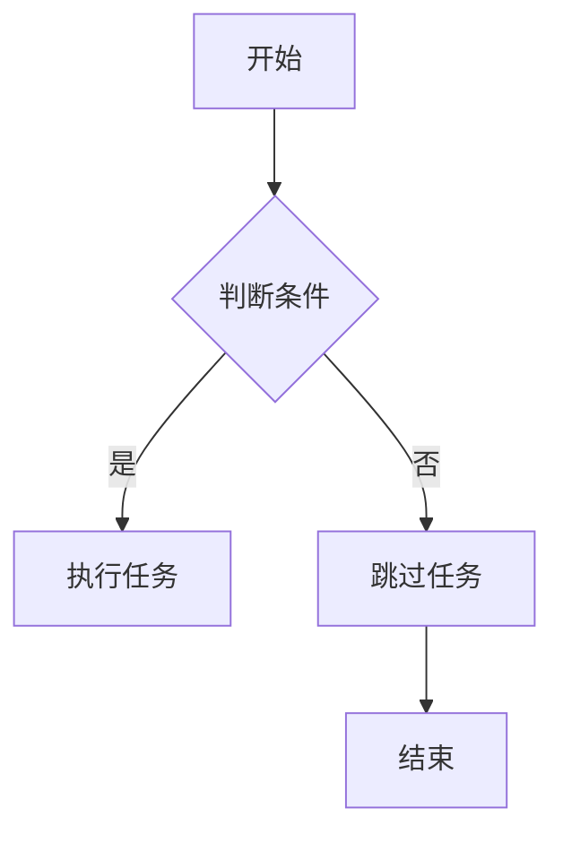

                 

### 《AI Agent的多头注意力机制实现》

---

#### 关键词：AI Agent、多头注意力机制、自然语言处理、计算机视觉、推荐系统

#### 摘要：
本文将深入探讨AI Agent的多头注意力机制实现，从基础理论到实际应用，全面解析这一关键技术。我们将首先介绍AI Agent的基本概念，然后详细讲解多头注意力机制的原理和结构。接下来，我们将探讨多头注意力机制在自然语言处理、计算机视觉和推荐系统中的应用。随后，我们将逐步展示如何实现多头注意力机制，并提供具体的应用实战案例。最后，我们将探讨多头注意力机制的优化策略和未来发展趋势，总结并展望其发展方向。

### 目录大纲

#### 第一部分：AI Agent基础理论

1. **AI Agent概述**
   - AI Agent的定义与分类
   - 人工智能发展历程与多头注意力机制

2. **多头注意力机制的原理与结构**
   - 多头注意力机制原理
   - 多头注意力机制的结构
   - 多头注意力机制的变种

3. **多头注意力机制在AI Agent中的应用**
   - 多头注意力机制在自然语言处理中的应用
   - 多头注意力机制在计算机视觉中的应用
   - 多头注意力机制在推荐系统中的应用

#### 第二部分：多头注意力机制的实现

1. **多头注意力机制的实现框架**
   - 实现框架概述
   - 实现步骤

2. **实现多头注意力机制的关键技术**
   - 深度学习基础
   - 多头注意力机制的数学模型
   - Mermaid流程图与算法可视化

3. **多头注意力机制的应用实战**
   - 实战项目背景
   - 系统分析与架构设计
   - 核心实现与代码分析

4. **多头注意力机制的优化与未来展望**
   - 优化策略
   - 未来发展趋势

#### 第8章：总结与展望
- 主要内容回顾
- 注意事项
- 拓展阅读

---

### 第一部分：AI Agent基础理论

#### 第1章：AI Agent概述

##### 1.1 AI Agent的定义与分类

AI Agent，即人工智能代理，是指能够自主感知环境、决策并采取行动的计算机系统。它可以在没有人类干预的情况下执行复杂的任务，并根据环境反馈不断优化自身行为。

AI Agent主要分为以下几类：

- **反应式Agent**：只能根据当前环境感知直接做出反应，无法预测未来。
- **模型基Agent**：具有对环境的模型，可以预测环境状态的变化。
- **学习型Agent**：通过不断学习环境和经验，优化自身行为。
- **通信型Agent**：能够在多个Agent之间进行信息交流和协作。

##### 1.2 人工智能发展历程与多头注意力机制

人工智能的发展经历了几个重要阶段：

- **早期探索（20世纪50-70年代）**：以符号推理和逻辑为基础，主要关注知识表示和推理。
- **专家系统（20世纪80年代）**：基于规则和知识库，但受限于知识表示的复杂性和不完善。
- **机器学习（20世纪90年代至今）**：通过数据驱动的方式，实现自学习和预测。
- **深度学习（21世纪至今）**：利用多层神经网络进行自动特征提取和学习。

多头注意力机制（Multi-Head Attention）是深度学习领域的一项关键技术，最早由Vaswani等人在2017年的论文《Attention Is All You Need》中提出。它通过将输入序列映射到多个不同的空间，并分别进行注意力机制操作，从而实现对不同位置信息的关注和整合。这一机制在自然语言处理、计算机视觉等领域取得了显著成果。

#### 第2章：多头注意力机制的原理与结构

##### 2.1 多头注意力机制原理

多头注意力机制的核心思想是将输入序列映射到多个不同的空间，每个空间对应一个头（Head）。每个头独立地应用注意力机制，然后这些头的结果进行拼接，得到最终输出。

##### 2.2 多头注意力机制的结构

多头注意力机制主要包括以下三个部分：

- **查询（Query）**：表示要关注的对象。
- **键（Key）**：表示可能关注的内容。
- **值（Value）**：表示被关注的对象的具体信息。

##### 2.3 多头注意力机制的变种

多头注意力机制的变种主要包括：

- **点积注意力（Dot-Product Attention）**：最简单的注意力机制，通过点积计算注意力权重。
- **加性注意力（Additive Attention）**：通过加性方式计算注意力权重，增加模型的表达能力。
- **缩放点积注意力（Scaled Dot-Product Attention）**：通过缩放点积计算注意力权重，避免梯度消失问题。

### 第二部分：多头注意力机制的实现

#### 第4章：多头注意力机制的实现框架

##### 4.1 实现框架概述

多头注意力机制的实现通常基于深度学习框架，如TensorFlow或PyTorch。实现框架主要包括：

- **数据预处理**：将输入序列编码为向量。
- **模型定义**：定义多头注意力机制的结构。
- **模型训练**：使用训练数据优化模型参数。
- **模型评估**：使用测试数据评估模型性能。

##### 4.2 实现步骤

实现多头注意力机制的步骤如下：

1. **数据预处理**：对输入序列进行编码，通常使用词向量或嵌入层。
2. **模型定义**：定义多头注意力机制的各个部分，包括查询、键和值。
3. **模型训练**：使用训练数据训练模型，优化模型参数。
4. **模型评估**：使用测试数据评估模型性能。

### 第5章：实现多头注意力机制的关键技术

##### 5.1 深度学习基础

深度学习基础包括：

- **神经网络基础**：了解神经网络的组成和训练过程。
- **反向传播算法**：了解如何计算梯度并进行参数优化。

##### 5.2 多头注意力机制的数学模型

多头注意力机制的数学模型主要包括：

- **自注意力（Self-Attention）**：输入序列的每个元素独立地计算注意力权重。
- **交叉注意力（Cross-Attention）**：不同序列之间计算注意力权重。

##### 5.3 Mermaid流程图与算法可视化

使用Mermaid流程图可以直观地展示算法的流程和结构。以下是一个简单的Mermaid流程图示例：



### 第6章：多头注意力机制的应用实战

##### 6.1 实战项目背景

本节将介绍一个使用多头注意力机制实现的自然语言处理项目。项目目标是对文本进行分类，判断文本是否属于某个类别。

##### 6.2 系统分析与架构设计

系统架构设计包括：

- **领域模型**：定义文本分类任务中的实体和关系。
- **系统架构**：设计系统的整体结构，包括输入层、编码层、注意力机制层和输出层。
- **系统接口**：设计系统与外部环境的接口，包括数据输入和结果输出。

##### 6.3 核心实现与代码分析

核心实现包括：

1. **数据预处理**：将文本数据编码为词向量。
2. **模型定义**：定义多头注意力机制的各个部分。
3. **模型训练**：使用训练数据训练模型。
4. **模型评估**：使用测试数据评估模型性能。

以下是使用PyTorch实现多头注意力机制的代码示例：

```python
import torch
import torch.nn as nn

class MultiHeadAttention(nn.Module):
    def __init__(self, d_model, num_heads):
        super(MultiHeadAttention, self).__init__()
        self.d_model = d_model
        self.num_heads = num_heads
        self.head_dim = d_model // num_heads

        self.query_linear = nn.Linear(d_model, d_model)
        self.key_linear = nn.Linear(d_model, d_model)
        self.value_linear = nn.Linear(d_model, d_model)

        self.out_linear = nn.Linear(d_model, d_model)

    def forward(self, query, key, value, mask=None):
        batch_size = query.size(0)

        query = self.query_linear(query).view(batch_size, -1, self.num_heads, self.head_dim).transpose(1, 2)
        key = self.key_linear(key).view(batch_size, -1, self.num_heads, self.head_dim).transpose(1, 2)
        value = self.value_linear(value).view(batch_size, -1, self.num_heads, self.head_dim).transpose(1, 2)

        attn_scores = torch.matmul(query, key.transpose(-2, -1)) / (self.head_dim ** 0.5)

        if mask is not None:
            attn_scores = attn_scores.masked_fill(mask == 0, float("-inf"))

        attn_weights = torch.softmax(attn_scores, dim=-1)
        attn_output = torch.matmul(attn_weights, value).transpose(1, 2).contiguous().view(batch_size, -1, self.d_model)

        output = self.out_linear(attn_output)
        return output
```

### 第7章：多头注意力机制的优化与未来展望

##### 7.1 优化策略

多头注意力机制的优化策略包括：

- **模型压缩**：通过参数共享和结构简化减少模型参数。
- **模型加速**：通过并行计算和硬件加速提高模型运行速度。
- **模型解释性提升**：通过可视化分析和解释性模型提高模型的可解释性。

##### 7.2 未来发展趋势

多头注意力机制的未来发展趋势包括：

- **更高效的实现**：通过算法优化和硬件加速提高模型性能。
- **更广泛的应用**：在其他领域，如计算机视觉和推荐系统，实现更广泛的应用。
- **与其他技术的融合**：与其他技术，如生成对抗网络（GAN）和强化学习，实现更强大的模型。

### 总结与展望

多头注意力机制是深度学习领域的一项关键技术，其在自然语言处理、计算机视觉和推荐系统等领域取得了显著成果。通过本文的详细讲解，读者可以全面了解多头注意力机制的核心概念、实现方法和应用场景。未来，多头注意力机制将继续发展，与其他技术相结合，为人工智能领域带来更多创新和突破。

---

作者：AI天才研究院/AI Genius Institute & 禅与计算机程序设计艺术 /Zen And The Art of Computer Programming

