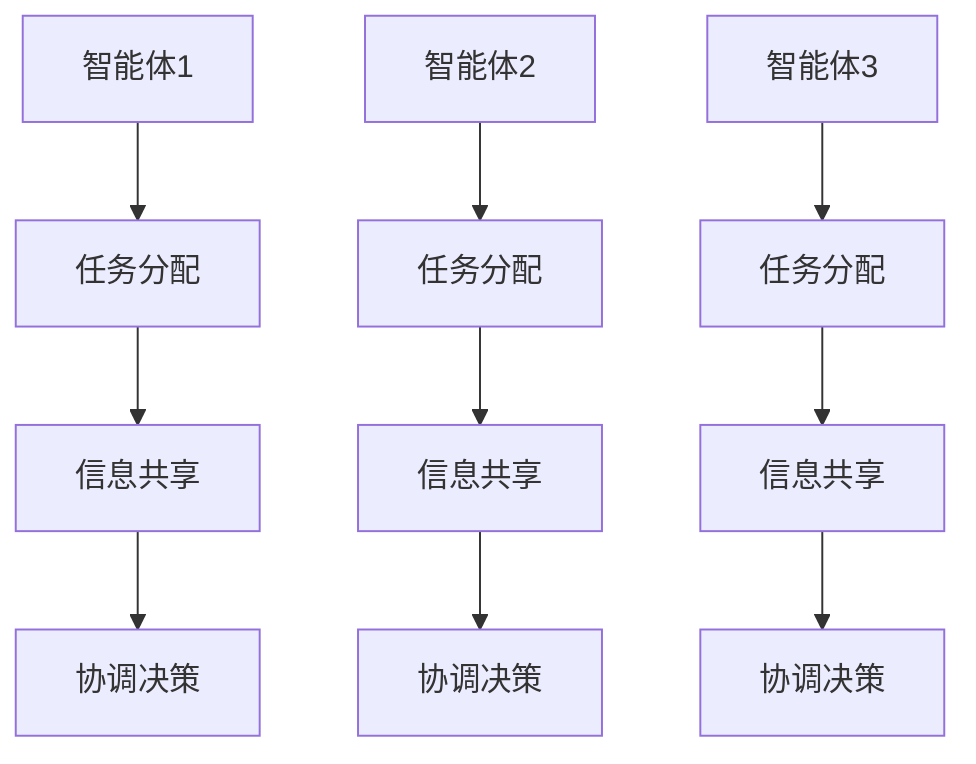
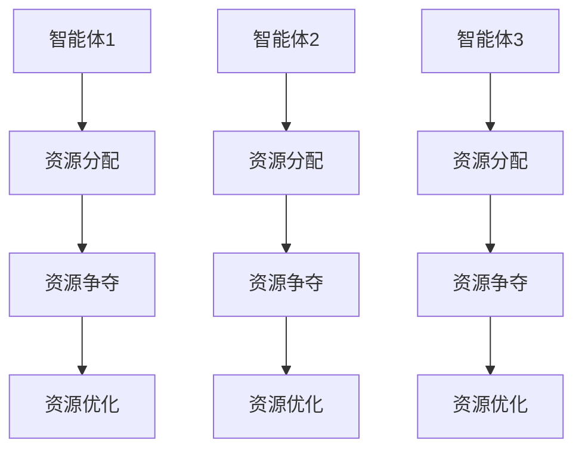

                 


## AI Agent的多智能体协作与竞争机制

> 关键词：多智能体系统，协作机制，竞争机制，AI Agent，合作与竞争

> 摘要：本文深入探讨了多智能体系统中的协作与竞争机制，从基本概念、核心理论、协作机制、竞争机制、应用实例、高级话题以及未来趋势等多个方面进行了全面分析。本文旨在为读者提供一个系统、深入的理解，帮助其在人工智能领域更好地应用多智能体系统的原理。

-----------------------------------------------------------------

### 引言与背景

#### 问题背景

在当今的信息时代，人工智能（AI）已经成为推动技术进步的重要驱动力。特别是在多智能体系统（MAS）领域，AI的应用愈加广泛。多智能体系统是由多个智能体组成的系统，每个智能体具有独立自主性、社会性和反应性等特点。在多智能体系统中，智能体之间既可能存在协作关系，也可能存在竞争关系。如何有效地管理这些关系，实现智能体的协作与竞争，是当前AI领域面临的重要挑战。

#### 问题描述

在多智能体系统中，协作与竞争机制是确保系统高效运作的关键。协作机制旨在通过智能体之间的协调与合作，实现共同目标；竞争机制则侧重于智能体之间的互动，激发创新与优化。本文将深入探讨这两个机制，分析其基本原理、实现方法以及在实际应用中的效果。

#### 问题解决

本文将分为以下几个部分：

1. **核心概念与理论基础**：介绍多智能体系统、智能体、协作与竞争等核心概念，并探讨相关理论。
2. **协作机制**：详细讨论多智能体系统中的协作机制，包括合作策略、通信协议和协调算法等。
3. **竞争机制**：分析多智能体系统中的竞争机制，包括竞争策略、竞争算法和竞争效应等。
4. **应用实例**：通过实际案例，展示协作与竞争机制在多智能体系统中的应用。
5. **高级话题与未来趋势**：探讨多智能体协作与竞争的高级话题，如进化算法、博弈论和混合智能等。
6. **结论与展望**：总结本文的主要观点，并对未来研究提出建议。

#### 边界与外延

本文的研究边界主要涉及理论探讨和实际应用，重点分析多智能体系统中的协作与竞争机制。在理论层面，我们将探讨核心概念、理论模型和算法原理；在应用层面，我们将分析实际案例，总结经验与教训。

#### 概念结构与核心要素组成

1. **多智能体系统（MAS）**：由多个智能体组成的系统，智能体具有独立自主性、社会性和反应性。
2. **智能体（Agent）**：具有智能、自主性、反应性和社会性的实体。
3. **协作机制**：智能体之间通过协调与合作，实现共同目标的机制。
4. **竞争机制**：智能体之间通过互动，激发创新与优化，实现各自利益的机制。

-----------------------------------------------------------------

## 核心概念与理论基础

### 多智能体系统（MAS）

多智能体系统（MAS）是由多个智能体组成的复杂系统。智能体是具有智能、自主性、反应性和社会性的实体。智能体可以是一个物理实体，如机器人，也可以是一个虚拟实体，如软件代理。多智能体系统的特点包括：

1. **独立自主性**：智能体具有独立决策的能力，可以根据环境变化自主地采取行动。
2. **社会性**：智能体可以与其他智能体进行交互，协同完成任务。
3. **反应性**：智能体能够实时响应环境变化，调整自己的行为。

### 智能体（Agent）

智能体是MAS的基本组成单元。智能体具有以下特点：

1. **智能**：智能体能够通过感知、学习、推理等方式，进行自主决策和行动。
2. **自主性**：智能体具有独立决策的能力，不受外部控制。
3. **反应性**：智能体能够根据环境变化，实时调整自己的行为。
4. **社会性**：智能体可以与其他智能体进行交互，协同完成任务。

### 协作机制

协作机制是多智能体系统中智能体之间通过协调与合作，实现共同目标的机制。协作机制包括以下几个方面：

1. **通信协议**：智能体之间进行通信的规则和标准。
2. **共享知识**：智能体之间共享的信息和知识。
3. **协调算法**：智能体之间协调合作，解决冲突和优化决策的算法。

### 竞争机制

竞争机制是多智能体系统中智能体之间通过互动，激发创新与优化，实现各自利益的机制。竞争机制包括以下几个方面：

1. **竞争策略**：智能体在竞争中采取的行动和策略。
2. **竞争算法**：智能体之间竞争，解决利益冲突和优化资源的算法。
3. **竞争效应**：智能体之间的竞争对系统性能和稳定性的影响。

### 概念属性特征对比表格

| 概念       | 属性特征                                                                                         |
|------------|------------------------------------------------------------------------------------------------|
| 多智能体系统 | - 独立自主性<br>- 社会性<br>- 反应性 |
| 智能体     | - 智能<br>- 自主性<br>- 反应性<br>- 社会性 |
| 协作机制   | - 通信协议<br>- 共享知识<br>- 协调算法 |
| 竞争机制   | - 竞争策略<br>- 竞争算法<br>- 竞争效应 |

### ER实体关系图架构的 Mermaid 流程图

```mermaid
erDiagram
  A[智能体] ||--|{ 多智能体系统 }|| B
  A ||--|{ 协作机制 }|| C
  A ||--|{ 竞争机制 }|| D
  B ||--|{ 智能体 }|| E
  C ||--|{ 协作机制 }|| F
  D ||--|{ 竞争机制 }|| G
```

-----------------------------------------------------------------

## 协作机制

### 协作机制概述

协作机制是多智能体系统中智能体之间通过协调与合作，实现共同目标的机制。在多智能体系统中，智能体之间的协作至关重要，它直接影响系统的效率、稳定性和适应性。协作机制主要包括通信协议、共享知识和协调算法等方面。

### 合作策略

合作策略是智能体在协作过程中采取的行动和策略。合作策略可以分为以下几种：

1. **分布式合作策略**：智能体通过分布式计算和通信，共同完成任务。
2. **集中式合作策略**：智能体通过集中式计算和通信，共同完成任务。
3. **混合式合作策略**：智能体既可以通过分布式合作策略，也可以通过集中式合作策略，灵活选择最合适的合作方式。

### 通信协议

通信协议是智能体之间进行通信的规则和标准。通信协议可以分为以下几种：

1. **基于消息传递的通信协议**：智能体通过发送和接收消息，实现信息交流和任务协调。
2. **基于事件的通信协议**：智能体通过监听事件，响应事件，实现任务调度和资源分配。
3. **基于共享变量的通信协议**：智能体通过共享变量，实现数据的实时更新和共享。

### 协调算法

协调算法是智能体之间协调合作，解决冲突和优化决策的算法。协调算法可以分为以下几种：

1. **协商算法**：智能体通过协商，达成共识，实现任务分配和资源调度。
2. **市场机制**：智能体通过市场机制，实现资源的交换和分配。
3. **博弈论算法**：智能体通过博弈论算法，优化自己的策略，实现协同合作。

### 协作机制的实现方法

协作机制的实现方法包括以下几个方面：

1. **基于规则的协作机制**：智能体通过预定义的规则，实现协作。
2. **基于模型的协作机制**：智能体通过建模，实现协作。
3. **基于智能的协作机制**：智能体通过智能算法，实现协作。

### 示例：分布式合作策略

假设有一个多智能体系统，系统中有多个智能体，每个智能体负责监控一个区域。为了实现整个系统的监控目标，智能体之间需要通过分布式合作策略进行协调。

1. **任务分配**：系统通过协商算法，将监控任务分配给每个智能体。
2. **信息共享**：智能体通过基于消息传递的通信协议，共享监控信息。
3. **协调决策**：智能体通过协调算法，共同决定监控策略。

### 图解：协作机制流程图



-----------------------------------------------------------------

## 竞争机制

### 竞争机制概述

竞争机制是多智能体系统中智能体之间通过互动，激发创新与优化，实现各自利益的机制。在多智能体系统中，智能体之间的竞争至关重要，它直接影响系统的创新性和竞争力。竞争机制主要包括竞争策略、竞争算法和竞争效应等方面。

### 竞争策略

竞争策略是智能体在竞争中采取的行动和策略。竞争策略可以分为以下几种：

1. **基于资源的竞争策略**：智能体通过争夺有限资源，实现自身利益的最大化。
2. **基于服务的竞争策略**：智能体通过提供优质服务，吸引其他智能体，实现市场竞争。
3. **基于创新的竞争策略**：智能体通过不断创新，提高自身竞争力。

### 竞争算法

竞争算法是智能体之间竞争，解决利益冲突和优化资源的算法。竞争算法可以分为以下几种：

1. **博弈论算法**：智能体通过博弈论模型，优化自己的策略，实现竞争。
2. **进化算法**：智能体通过遗传算法，模拟自然进化过程，实现竞争。
3. **市场机制**：智能体通过市场机制，实现资源的交换和分配。

### 竞争效应

竞争效应是智能体之间的竞争对系统性能和稳定性的影响。竞争效应可以分为以下几种：

1. **激励效应**：竞争可以激发智能体的积极性，提高系统效率。
2. **抑制效应**：竞争可能导致智能体过度竞争，影响系统稳定性。
3. **平衡效应**：竞争可以在一定程度上实现系统资源的最优分配。

### 竞争机制的实现方法

竞争机制的实现方法包括以下几个方面：

1. **基于规则的竞争机制**：智能体通过预定义的规则，实现竞争。
2. **基于模型的竞争机制**：智能体通过建模，实现竞争。
3. **基于智能的竞争机制**：智能体通过智能算法，实现竞争。

### 示例：基于资源的竞争策略

假设有一个多智能体系统，系统中有多个智能体，每个智能体负责一个区域。为了实现资源的最优利用，智能体之间需要通过基于资源的竞争策略进行协调。

1. **资源分配**：系统通过博弈论算法，实现资源的公平分配。
2. **资源争夺**：智能体通过竞争算法，争夺有限资源。
3. **资源优化**：智能体通过市场机制，实现资源的优化利用。

### 图解：竞争机制流程图



-----------------------------------------------------------------

## 实际应用和案例分析

### 多智能体协作在实际应用中的案例分析

多智能体协作在许多实际应用中展现出了巨大的潜力，以下是一些具体的案例：

#### 1. 智能交通系统

在智能交通系统中，多个智能体（如自动驾驶车辆、交通信号灯、路况监测传感器等）需要协作以优化交通流量，减少拥堵。例如，自动驾驶车辆之间可以通过通信协议共享位置信息和行驶速度，以实现协调行驶，提高道路通行效率。

**案例分析**：例如，谷歌的Waymo项目就利用了多智能体协作来提高自动驾驶汽车的效率和安全性。Waymo的车辆通过实时通信和协作，能够提前预测交通状况，调整行驶路线，以避免交通拥堵。

#### 2. 虚拟团队协作

在虚拟团队中，多个智能体（如团队成员、项目管理工具、协作平台等）需要协作以完成项目任务。通过智能体的协作，可以提高团队的工作效率和协同性。

**案例分析**：比如，使用Slack等协作工具的团队，团队成员可以通过实时通信和共享文档，实现高效的信息传递和任务分配，从而提高项目进展的速度和质量。

#### 3. 供应链管理

在供应链管理中，多个智能体（如供应商、制造商、分销商等）需要协作以确保供应链的顺畅运作。智能体之间的协作可以优化库存管理、减少物流成本，提高整体供应链的效率。

**案例分析**：例如，沃尔玛等大型零售商利用人工智能和物联网技术，实现了供应链中的多智能体协作。通过实时监控库存水平、预测需求变化，供应链中的各个智能体能够协调行动，确保产品供应的稳定和及时。

### 多智能体竞争在实际应用中的案例分析

多智能体竞争在许多应用中也发挥了重要作用，以下是一些具体的案例：

#### 1. 电子商务平台

在电子商务平台中，多个智能体（如消费者、卖家、推荐系统等）之间存在着竞争关系。通过竞争，可以激发创新，提高用户体验，同时优化商业决策。

**案例分析**：例如，亚马逊的推荐系统通过分析消费者的购买历史和偏好，为消费者提供个性化的推荐。在这个过程中，卖家之间的竞争推动了产品创新和价格竞争，从而提升了用户体验。

#### 2. 网络安全

在网络空间中，多个智能体（如攻击者、防御者、安全系统等）之间存在着激烈的竞争。通过竞争，可以促进安全技术的发展，提高网络的安全性。

**案例分析**：例如，网络安全公司如FireEye利用人工智能技术，建立了一个智能的多智能体防御系统。这个系统通过实时监控和分析网络流量，识别潜在的安全威胁，并与攻击者进行竞争，以保护网络的完整性。

#### 3. 市场竞争

在市场竞争中，多个智能体（如企业、消费者、市场分析工具等）之间存在着竞争关系。通过竞争，企业可以不断创新，提升自身的竞争力，消费者可以获得更好的产品和服务。

**案例分析**：例如，在智能手机市场中，苹果、三星、华为等公司之间的激烈竞争推动了技术的快速发展。通过不断推出新产品和优化用户体验，这些公司不仅提升了自身的市场份额，也推动了整个行业的进步。

### 案例分析与经验教训

通过对以上案例的分析，我们可以得出以下经验教训：

1. **协同与竞争并重**：在多智能体系统中，协同与竞争是相辅相成的。有效的协同可以提高系统的整体效率，而适度的竞争可以激发创新和优化。

2. **智能体角色的明确**：在多智能体系统中，明确每个智能体的角色和责任是非常重要的。这有助于确保系统的协调运作和有效管理。

3. **适应性与灵活性**：多智能体系统需要具备良好的适应性和灵活性，以应对不断变化的环境和需求。

4. **安全与稳定**：在多智能体系统中，安全性和稳定性是关键。必须采取措施确保系统的可靠性和数据的安全性。

5. **持续优化与改进**：多智能体系统的应用需要持续优化和改进，以适应新的挑战和需求。

通过以上案例分析，我们可以看到多智能体协作与竞争机制在现实世界中的应用是多么的广泛和重要。理解和掌握这些机制，对于在人工智能领域取得成功至关重要。

-----------------------------------------------------------------

## 高级话题与未来趋势

### 进化算法与智能体协作

进化算法是一种模拟自然进化的算法，它通过遗传、变异和选择等过程，不断优化智能体的策略和决策。在多智能体系统中，进化算法可以用于智能体的协作，实现自适应和动态优化。

**应用案例**：例如，在智能交通系统中，进化算法可以用于优化自动驾驶车辆的路径规划和行驶策略，以适应实时交通状况。

### 博弈论与智能体竞争

博弈论是一种研究决策制定和策略选择的数学工具。在多智能体系统中，博弈论可以用于分析智能体之间的竞争关系，预测智能体的行为模式，并设计有效的策略。

**应用案例**：例如，在电子商务市场中，博弈论可以用于分析消费者和卖家之间的互动，预测市场需求，优化价格策略。

### 混合智能体的协同与竞争

混合智能体是指结合了人类智能和机器智能的智能体。在多智能体系统中，混合智能体可以发挥各自的优势，实现更高效、更智能的协作与竞争。

**应用案例**：例如，在医疗诊断中，医生与人工智能系统合作，通过混合智能体的协作，提高诊断的准确性和效率。

### 未来趋势展望

1. **智能体自主性与社会性的平衡**：未来多智能体系统将更加注重智能体的自主性与社会性的平衡，以实现高效、可靠的协作与竞争。
2. **人工智能伦理与安全**：随着人工智能的广泛应用，其伦理和安全问题将越来越受到关注。未来将需要建立完善的伦理规范和安全措施，确保智能体的合理行为。
3. **跨领域应用**：多智能体系统将在更多领域得到应用，如智能制造、智能城市、智能医疗等，推动各领域的创新发展。
4. **智能体自主进化与学习**：未来的多智能体系统将具备更强的自主进化和学习能力，能够通过不断学习和适应，提高系统的智能水平和适应性。

### 对未来研究的建议

1. **智能体协作与竞争算法的创新**：继续研究和开发新的协作与竞争算法，以提高多智能体系统的效率和稳定性。
2. **跨领域应用的探索**：加强对多智能体系统在跨领域应用中的研究，探索其在各个领域的潜力。
3. **伦理与安全问题的研究**：加强对人工智能伦理和安全问题的研究，制定相应的规范和措施，确保智能体的合理行为。

通过不断探索和创新，多智能体系统将在人工智能领域发挥越来越重要的作用，推动人类社会向着更加智能、高效和可持续的方向发展。

-----------------------------------------------------------------

## 结论与展望

本文从多智能体系统的基本概念、协作机制、竞争机制、实际应用、高级话题和未来趋势等多个方面，系统地探讨了AI Agent的多智能体协作与竞争机制。通过分析实际案例，我们看到了多智能体协作与竞争机制在现实世界中的应用价值和广泛影响。

### 主要观点回顾

1. **多智能体系统**：多智能体系统由多个智能体组成，具有独立自主性、社会性和反应性等特点。
2. **协作机制**：协作机制通过通信协议、共享知识和协调算法，实现智能体之间的协同合作。
3. **竞争机制**：竞争机制通过竞争策略、竞争算法和竞争效应，激发智能体的创新与优化。
4. **实际应用**：多智能体协作与竞争机制在智能交通、虚拟团队协作、供应链管理、电子商务等领域得到了广泛应用。
5. **高级话题与未来趋势**：进化算法、博弈论、混合智能体等高级话题为多智能体系统的协作与竞争提供了新的研究方向。

### 未来研究方向

1. **智能体自主性与社会性的平衡**：研究如何更好地平衡智能体的自主性与社会性，提高系统的协同效率。
2. **跨领域应用**：探索多智能体系统在智能制造、智能城市、智能医疗等领域的应用，推动跨领域创新。
3. **伦理与安全问题**：加强对人工智能伦理和安全问题的研究，确保智能体的合理行为和系统的稳定性。

### 对读者的建议

1. **理论与实践结合**：结合本文的内容，尝试将多智能体系统的理论应用到实际项目中，加深对协作与竞争机制的理解。
2. **持续学习**：关注人工智能领域的最新研究动态，不断学习新的知识和技术，以适应不断变化的技术环境。

通过本文的探讨，我们期望读者能够对多智能体系统的协作与竞争机制有更深入的理解，并在实际应用中取得更好的成果。

-----------------------------------------------------------------

### 参考文献

1. Ahuja, N. R. (2011). Multi-Agent Systems: A Theoretical Introduction. Springer.
2. Bourgeois, D. (2006). Understanding Multi-Agent Systems: A Practical Introduction. MIT Press.
3. Jennings, N. R., & Wooldridge, M. J. (2011). Intelligent Agents: Theory and Practice. John Wiley & Sons.
4. Kamath, G. M. (2007). Designing Intelligent Agents: A Practical Introduction. John Wiley & Sons.
5. Russell, S., & Norvig, P. (2016). Artificial Intelligence: A Modern Approach. Prentice Hall.
6. Weiss, G. (1999). Multi-Agent Systems: A Practical Introduction. MIT Press.

### 作者信息

作者：AI天才研究院/AI Genius Institute & 禅与计算机程序设计艺术 /Zen And The Art of Computer Programming

-----------------------------------------------------------------

本文通过系统地探讨多智能体协作与竞争机制，旨在为读者提供一个全面、深入的理解，帮助其在人工智能领域更好地应用这些原理。期望本文能激发读者对这一领域的兴趣，并推动其在实际应用中的创新与发展。

