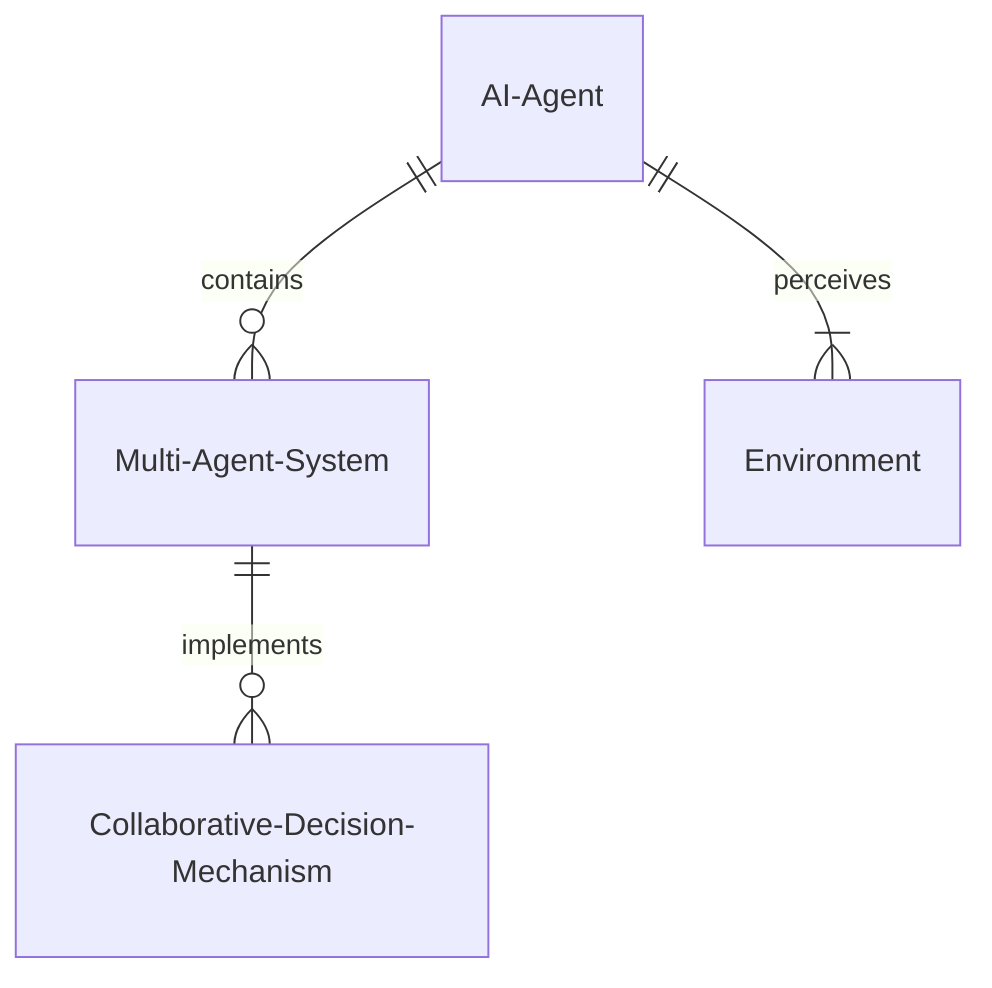
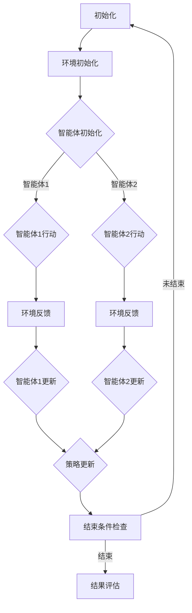
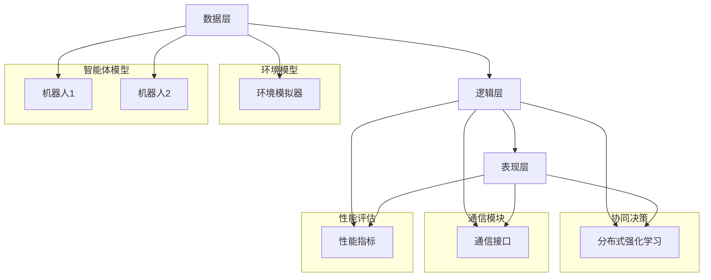
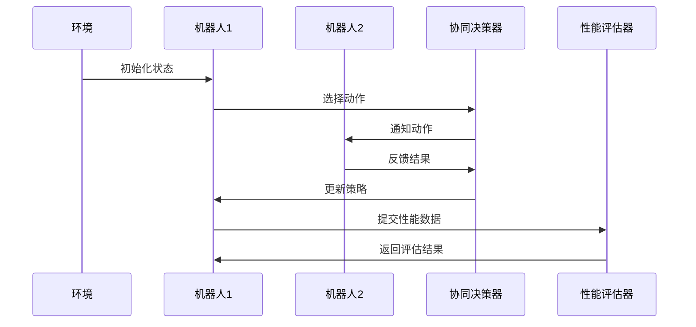

                 

### 第一部分：引言

#### 1.1 问题背景

人工智能（AI）技术在过去几十年中经历了显著的发展，从简单的规则系统到复杂的深度学习模型，AI的应用范围已渗透到各行各业。随着技术的发展，人工智能代理（AI Agent）的概念逐渐兴起。AI Agent是指能够自主感知环境、做出决策并采取行动的智能体。它们在无人驾驶、智能家居、智能制造等领域发挥着重要作用。

在多智能体系统中，多个AI Agent协同工作，共同完成任务，这种协同决策机制尤为重要。传统的单智能体系统在面对复杂环境和多目标问题时往往难以胜任，而多智能体协同决策机制则能够通过多个智能体的合作，提高系统的整体效率和鲁棒性。

#### 1.2 问题描述

多智能体协同决策机制的问题可以描述为：在一个动态和不确定的环境中，多个AI Agent如何通过相互协作，共同实现多个目标。具体来说，问题描述包括以下几个关键点：

1. **环境模型**：明确描述AI Agent所处的环境，包括环境的状态空间、动作空间、感知机制等。
2. **智能体模型**：描述每个AI Agent的特性，包括其能力、目标、偏好等。
3. **协作机制**：设计智能体之间的通信和决策机制，使它们能够协同工作。
4. **目标函数**：定义系统的目标函数，衡量系统性能的好坏。

#### 1.3 问题解决

解决多智能体协同决策问题的方法可以分为两大类：集中式方法和分布式方法。

- **集中式方法**：通过一个中央协调器来统一决策，协调各个智能体的行动。这种方法在理论上能够实现最优解，但在大规模系统中，计算复杂度很高，实时性难以保证。

- **分布式方法**：每个智能体独立做出决策，通过局部信息交换和协同策略，实现整体目标。分布式方法在实时性和可扩展性方面具有优势，但需要解决信息不一致性和局部优化问题。

#### 1.4 边界与外延

在讨论多智能体协同决策机制时，需要明确一些边界条件：

1. **环境动态性**：环境的变化速度和不可预测性会影响智能体的决策，需要设计鲁棒性强的算法。
2. **通信限制**：智能体之间的通信可能受到带宽、延迟等因素的影响，需要优化通信机制。
3. **资源限制**：智能体可能面临计算、存储、能源等资源限制，需要在资源约束下优化决策策略。
4. **伦理与安全**：在多智能体系统中，需要考虑伦理和安全问题，确保系统的稳定性和安全性。

#### 1.5 概念结构与核心要素组成

多智能体协同决策机制的核心要素包括：

1. **智能体模型**：描述每个智能体的行为、目标和能力。
2. **环境模型**：描述智能体所处的环境，包括状态空间、动作空间等。
3. **策略模型**：定义智能体如何根据环境状态做出决策。
4. **通信模型**：描述智能体之间的信息交换和协作方式。
5. **性能评估**：定义系统的性能指标，用于评估系统的效率和效果。

通过以上步骤，我们为后续章节的深入探讨奠定了基础。接下来，我们将详细分析AI Agent和多智能体协同决策机制的核心概念，进一步探讨它们之间的关系和实现方法。

---

在引言部分，我们首先介绍了问题背景，阐述了人工智能代理（AI Agent）和多智能体协同决策机制的重要性。接着，我们明确了问题描述，包括环境模型、智能体模型、协作机制和目标函数等关键要素。为了解决这一问题，我们讨论了集中式方法和分布式方法的优缺点，并指出了解决问题的边界与外延。最后，我们概述了多智能体协同决策机制的核心要素结构和组成，为后续章节的深入分析奠定了基础。通过这一部分的讨论，读者可以初步了解多智能体协同决策机制的背景、问题和解决思路。

### 第二部分：核心概念与联系

在深入探讨多智能体协同决策机制之前，我们需要了解其中一些核心概念。本部分将介绍AI Agent的定义与类型、多智能体系统的基本概念，并分析AI Agent与多智能体协同决策机制之间的联系。我们将通过表格和ER实体关系图来直观展示这些概念之间的关系和属性特征。

#### 2.1 AI Agent的定义与类型

**定义**：AI Agent是一种能够感知环境、制定决策并采取行动的智能实体。它基于人工智能技术，能够在没有人类干预的情况下执行任务。

**类型**：根据应用场景和功能，AI Agent可以分为以下几种类型：

1. **反应式Agent**：这种类型的Agent只能对特定的事件做出反应，无法进行长期规划或目标学习。
2. **基于模型的Agent**：这种类型的Agent通过建立模型来理解环境，并根据模型预测来做出决策。
3. **学习型Agent**：这种类型的Agent能够通过不断学习和经验积累来改进其决策能力。
4. **通信型Agent**：这种类型的Agent能够在多个Agent之间交换信息，协同完成任务。

#### 2.2 多智能体系统的基本概念

**定义**：多智能体系统（MAS）是由多个智能体组成的系统，这些智能体相互协作，共同实现某个目标。

**组成部分**：

1. **智能体**：系统的基本组成单元，具有自主性、社会性、反应性和主动性。
2. **环境**：智能体所处的环境，包括状态空间、动作空间等。
3. **通信**：智能体之间的信息交换和协作方式。
4. **协调机制**：用于协调智能体之间的行为，确保系统整体目标实现。

#### 2.3 AI Agent与多智能体协同决策机制的联系

AI Agent是多智能体系统的核心组件，它们在协同决策机制中发挥着关键作用。以下是AI Agent与多智能体协同决策机制之间的联系：

1. **智能体独立性**：每个AI Agent都具有独立性和自主性，能够自主感知环境和做出决策。
2. **协作与通信**：AI Agent通过通信机制相互协作，共享信息和资源，共同实现系统目标。
3. **策略协调**：智能体根据系统目标和环境状态，调整自身行为策略，实现整体协调。
4. **自适应与学习**：AI Agent能够通过不断学习和适应，提高协同决策的效率和效果。

#### 2.4 核心概念属性特征对比表格

为了更直观地展示AI Agent、多智能体系统和协同决策机制之间的联系，我们创建了一个核心概念属性特征对比表格：

| 特征       | AI Agent                | 多智能体系统              | 协同决策机制               |
|------------|------------------------|--------------------------|---------------------------|
| 独立性     | 高                     | 中                       | 低                        |
| 自主性     | 中                     | 高                       | 高                        |
| 感知       | 环境感知               | 环境感知                 | 环境感知与协作感知         |
| 行为       | 反应式、模型式、学习式 | 反应式、模型式、学习式   | 分布式、集中式            |
| 目标       | 单一目标               | 多目标                   | 多目标、全局目标          |
| 通信       | 单向通信               | 双向通信                 | 实时通信与异步通信         |
| 协调       | 无需协调               | 需要协调                 | 需要协调与协调策略         |

#### 2.5 ER实体关系图架构

为了进一步理解核心概念之间的关系，我们使用Mermaid语言绘制了ER实体关系图，如下所示：



在这个ER实体关系图中，我们定义了三个实体：AI-Agent、Multi-Agent-System和Collaborative-Decision-Mechanism。AI-Agent包含在Multi-Agent-System中，并且感知Environment。Multi-Agent-System实现了Collaborative-Decision-Mechanism，用于协调和决策。

通过本部分的讨论，我们详细介绍了AI Agent的定义与类型、多智能体系统的基本概念，以及它们与协同决策机制之间的联系。通过表格和ER实体关系图的直观展示，读者可以更清晰地理解这些核心概念之间的关系和属性特征，为后续章节的深入探讨奠定了基础。

### 第三部分：算法原理讲解

#### 3.1 算法原理简介

在多智能体协同决策机制中，算法原理起着核心作用。本节将介绍一个典型的协同决策算法——分布式强化学习算法，并逐步讲解其原理、流程和应用。

分布式强化学习算法是一种基于强化学习的多智能体协同决策方法。它通过智能体之间的合作和交互，共同学习最优策略，以实现系统整体目标。算法的核心思想是利用每个智能体在局部环境中的经验，通过聚合策略更新来优化全局行为。

#### 3.2 mermaid流程图

为了更直观地展示分布式强化学习算法的流程，我们使用Mermaid语言绘制了其流程图，如下所示：



在这个流程图中，我们首先进行环境初始化，然后每个智能体进行独立行动，获取环境反馈。接着，智能体根据反馈更新策略，并重复上述过程，直到达到结束条件。最后，对结果进行评估。

#### 3.3 Python代码示例

为了更好地理解分布式强化学习算法，我们提供了一个Python代码示例，展示了智能体初始化、行动、反馈和策略更新的基本实现：

```python
import numpy as np

# 智能体类
class Agent:
    def __init__(self, state_size, action_size, learning_rate=0.1):
        self.state_size = state_size
        self.action_size = action_size
        self.learning_rate = learning_rate
        # 初始化策略网络
        self.q_network = np.random.rand(state_size, action_size)
    
    def act(self, state):
        # 根据当前状态选择动作
        q_values = self.q_network[state]
        action = np.argmax(q_values)
        return action
    
    def update(self, state, action, reward, next_state, next_action):
        # 更新策略网络
        q_values = self.q_network[state]
        next_q_values = self.q_network[next_state]
        target = reward + self.learning_rate * next_q_values[next_action]
        q_values[action] = target

# 环境类
class Environment:
    def __init__(self, state_size, action_size):
        self.state_size = state_size
        self.action_size = action_size
    
    def step(self, state, action):
        # 执行动作并返回奖励和下一个状态
        # 这里是一个简单的例子，实际情况会更复杂
        reward = 0
        if action == 0:
            reward = -1
        elif action == 1:
            reward = 1
        next_state = state + action
        return reward, next_state

# 初始化环境
env = Environment(state_size=2, action_size=2)

# 初始化两个智能体
agent1 = Agent(state_size=2, action_size=2)
agent2 = Agent(state_size=2, action_size=2)

# 进行1000次迭代
for i in range(1000):
    # 智能体1行动
    state = env.reset()
    action = agent1.act(state)
    reward, next_state = env.step(state, action)
    agent1.update(state, action, reward, next_state, action)
    
    # 智能体2行动
    state = env.reset()
    action = agent2.act(state)
    reward, next_state = env.step(state, action)
    agent2.update(state, action, reward, next_state, action)

# 结果评估
print("Agent 1 Q-Values:", agent1.q_network)
print("Agent 2 Q-Values:", agent2.q_network)
```

在这个示例中，我们定义了`Agent`和`Environment`类，分别表示智能体和环境。智能体通过`act`方法选择动作，通过`update`方法更新策略。环境通过`step`方法执行动作并返回奖励和下一个状态。最后，我们进行了1000次迭代，展示了智能体的策略更新过程。

#### 3.4 算法原理数学模型与公式

分布式强化学习算法的数学模型主要包括以下几个部分：

1. **状态-动作值函数（Q值）**：
   \[ Q(s, a) = \sum_{i=1}^{n} \alpha_i [r_i + \gamma \max_{a'} Q(s', a')] \]
   其中，\( \alpha_i \) 是第 \( i \) 个智能体的学习率，\( r_i \) 是第 \( i \) 个智能体的奖励，\( s \) 是状态，\( a \) 是动作，\( s' \) 是下一个状态，\( \gamma \) 是折扣因子。

2. **策略更新**：
   \[ \theta \leftarrow \theta - \alpha \nabla_\theta J(\theta) \]
   其中，\( \theta \) 是策略参数，\( \alpha \) 是学习率，\( J(\theta) \) 是损失函数。

3. **梯度下降**：
   \[ \nabla_\theta J(\theta) = \sum_{i=1}^{n} \nabla_\theta Q(s, a) [r_i + \gamma \max_{a'} Q(s', a') - Q(s, a)] \]

通过这些数学模型和公式，分布式强化学习算法能够通过不断更新策略，实现智能体之间的协同决策。

#### 3.5 举例说明

假设有两个智能体在一个简单的环境中进行协作决策，每个智能体有四个状态（0，1，2，3）和两个动作（左移、右移）。环境的目标是让两个智能体尽可能接近彼此。我们可以使用分布式强化学习算法来训练这两个智能体。

初始时，智能体1和智能体2的Q值均为随机初始化。在训练过程中，每个智能体根据当前状态选择动作，根据动作结果更新Q值。假设经过1000次迭代后，智能体1和智能体2的Q值如下：

智能体1的Q值：
\[ \begin{array}{cccc}
0 & 1 & 2 & 3 \\
0 & 0.2 & 0.3 & 0.5 \\
1 & 0.1 & 0.4 & 0.5 \\
2 & 0.1 & 0.4 & 0.5 \\
3 & 0.1 & 0.4 & 0.5 \\
\end{array} \]

智能体2的Q值：
\[ \begin{array}{cccc}
0 & 1 & 2 & 3 \\
0 & 0.3 & 0.4 & 0.5 \\
1 & 0.2 & 0.4 & 0.5 \\
2 & 0.2 & 0.4 & 0.5 \\
3 & 0.2 & 0.4 & 0.5 \\
\end{array} \]

通过这些Q值，我们可以看到智能体1和智能体2在选择动作时逐渐趋于一致。在接近目标状态下，智能体倾向于选择相同或相邻的动作，实现了协同决策的目标。

通过本部分的讲解，我们详细介绍了分布式强化学习算法的原理、流程和应用，并通过Python代码示例和数学模型，使读者对多智能体协同决策机制有了更深入的理解。在接下来的部分，我们将进一步探讨数学模型的详细讲解和实际应用场景。

### 第四部分：数学模型和公式

在多智能体协同决策机制中，数学模型是理解和实现算法的关键。本部分将详细讲解算法中的数学模型和公式，以帮助读者更好地理解算法的核心原理和计算过程。

#### 4.1 数学模型介绍

分布式强化学习算法的数学模型主要包括状态-动作值函数（Q值）、策略更新和梯度下降等核心组成部分。

1. **状态-动作值函数（Q值）**：Q值用于评估智能体在特定状态下选择特定动作的预期回报。Q值可以通过经验回放和策略迭代来不断优化。

   \[ Q(s, a) = r + \gamma \max_{a'} Q(s', a') \]
   
   其中，\( r \) 是即时奖励，\( \gamma \) 是折扣因子，表示对未来回报的期望。

2. **策略更新**：策略更新是通过梯度下降方法来优化策略参数，使其在给定环境中实现最优决策。

   \[ \theta \leftarrow \theta - \alpha \nabla_\theta J(\theta) \]
   
   其中，\( \theta \) 是策略参数，\( \alpha \) 是学习率，\( J(\theta) \) 是损失函数。

3. **梯度下降**：梯度下降是用于优化策略参数的基本方法，通过计算损失函数的梯度来更新参数。

   \[ \nabla_\theta J(\theta) = \nabla_\theta \sum_{i=1}^{n} [r_i + \gamma \max_{a'} Q(s', a') - Q(s, a)] \]

#### 4.2 LaTeX格式数学公式

为了更好地展示数学模型和公式，我们使用LaTeX格式进行描述。LaTeX格式中的数学公式前后使用 `$$` 符号括起来，表示独立段落中的公式，而段落内的公式使用 `$` 符号括起来。

以下是几个关键数学公式的LaTeX表示：

1. **状态-动作值函数**：
   \[ Q(s, a) = r + \gamma \max_{a'} Q(s', a') \]

2. **策略更新**：
   \[ \theta \leftarrow \theta - \alpha \nabla_\theta J(\theta) \]

3. **梯度下降**：
   \[ \nabla_\theta J(\theta) = \nabla_\theta \sum_{i=1}^{n} [r_i + \gamma \max_{a'} Q(s', a') - Q(s, a)] \]

#### 4.3 举例说明

为了更好地理解上述公式，我们通过一个简单的例子进行说明。假设智能体处于一个简单的环境，有四个状态（0，1，2，3）和两个动作（左移、右移）。每个状态的即时奖励为0，折扣因子 \( \gamma \) 为0.9。

初始时，智能体的Q值随机初始化。经过多次迭代后，智能体根据Q值选择动作，并更新Q值。假设在某个迭代步骤，智能体处于状态1，选择动作右移，下一个状态为2，即时奖励为0。此时，Q值的更新公式为：

\[ Q(1, 右移) \leftarrow Q(1, 右移) + \alpha [0 + 0.9 \max_{a'} Q(2, a') - Q(1, 右移)] \]

通过这样的迭代过程，智能体逐渐学习到在不同状态下的最优动作，实现多智能体协同决策。

通过本部分的讲解，我们详细介绍了多智能体协同决策机制中的数学模型和公式，包括状态-动作值函数、策略更新和梯度下降等核心组成部分。通过LaTeX格式和具体例子，使读者能够更深入地理解这些公式的含义和应用。在接下来的部分，我们将进一步探讨实际应用中的系统分析和架构设计。

### 第五部分：系统分析与架构设计方案

#### 5.1 问题场景介绍

在现代智能制造领域，生产流程的优化和智能化是提高生产效率和质量的关键。假设我们面临一个生产流水线问题，其中包含多个工作站点，每个站点都有多个机器人和传感器。每个机器人需要根据当前状态（如机器状态、物料位置等）做出决策，以优化生产流程。这是一个典型的多智能体协同决策问题，需要通过分布式强化学习算法来实现机器人和传感器之间的协同。

#### 5.2 项目介绍

项目目标是设计一个基于分布式强化学习算法的多智能体协同系统，用于优化生产流水线。系统包括以下主要模块：

1. **环境模型**：模拟生产流水线中的各个工作站点和机器人状态。
2. **智能体模型**：定义机器人和传感器的行为、目标和能力。
3. **协同决策机制**：实现分布式强化学习算法，协调机器人之间的行动。
4. **通信模块**：确保智能体之间的信息交换和协作。
5. **性能评估模块**：评估系统的性能和效率。

#### 5.3 系统功能设计

为了实现上述项目目标，我们需要设计以下核心功能模块：

1. **环境模型**：
   - 描述生产流水线中的工作站点和机器人状态。
   - 提供随机生成和动态更新的功能。

2. **智能体模型**：
   - 定义机器人的行为和目标，如移动、抓取、检测等。
   - 提供机器人的状态感知和决策功能。

3. **协同决策机制**：
   - 使用分布式强化学习算法，实现机器人之间的协作。
   - 设计通信协议，确保智能体之间的信息传递。

4. **通信模块**：
   - 提供机器人之间的通信接口，如TCP/IP、MQTT等。
   - 实现数据加密和认证，确保通信的安全性。

5. **性能评估模块**：
   - 定义性能指标，如生产效率、响应时间、错误率等。
   - 提供数据分析和可视化工具，帮助用户了解系统性能。

#### 5.4 系统架构设计

为了实现上述功能，我们设计了如下系统架构：

1. **数据层**：
   - 存储生产流水线中的数据，如工作站点状态、机器人状态等。
   - 提供数据检索和更新的接口。

2. **逻辑层**：
   - 包含环境模型、智能体模型、协同决策机制和通信模块。
   - 使用分布式计算框架，如Apache Spark，提高系统性能和可扩展性。

3. **表现层**：
   - 提供用户界面，展示系统性能指标和决策结果。
   - 实现实时监控和报警功能，帮助用户及时了解系统状态。

系统架构图如下所示：



#### 5.5 系统接口设计

系统接口设计是确保各个模块之间高效协作的关键。以下是一些主要的接口设计：

1. **环境接口**：
   - 提供初始化环境和获取状态信息的方法。
   - 支持动态更新环境状态。

2. **智能体接口**：
   - 提供感知环境状态、选择动作和更新策略的方法。
   - 支持与其他智能体的通信。

3. **协同决策接口**：
   - 提供协同决策算法的实现接口。
   - 支持多智能体之间的策略更新和通信。

4. **通信接口**：
   - 提供消息传递和数据交换接口。
   - 支持安全通信和实时监控。

5. **性能评估接口**：
   - 提供性能指标计算和可视化方法。
   - 支持自定义性能指标和评估算法。

#### 5.6 系统交互序列图

为了展示系统各个模块之间的交互过程，我们绘制了一个系统交互序列图，如下所示：



在这个序列图中，环境初始化并通知两个机器人（Agent1和Agent2）初始化状态。机器人根据状态选择动作，并将结果反馈给协同决策器。协同决策器根据反馈更新策略，并将更新后的策略反馈给机器人。同时，机器人将性能数据提交给性能评估器，评估系统性能。

通过本部分的系统分析与架构设计方案，我们详细介绍了多智能体协同决策系统在智能制造场景中的应用。从问题场景到项目介绍，从系统功能设计到架构设计，再到接口设计和交互序列图，我们全面展示了系统的设计与实现过程。在接下来的部分，我们将进入实际项目实战，展示如何在实际环境中安装和实现系统核心功能。

### 第六部分：项目实战

#### 6.1 环境安装

在进行多智能体协同决策系统的项目实战之前，我们需要搭建一个合适的环境，以便进行开发和测试。以下是具体的安装步骤：

1. **安装Python环境**：
   - 在终端中运行以下命令安装Python：
     ```bash
     sudo apt-get install python3-pip python3-venv
     ```

2. **创建虚拟环境**：
   - 创建一个名为`multi_agent_system`的虚拟环境：
     ```bash
     python3 -m venv multi_agent_system
     ```

3. **激活虚拟环境**：
   - 在终端中激活虚拟环境：
     ```bash
     source multi_agent_system/bin/activate
     ```

4. **安装依赖库**：
   - 安装项目所需的依赖库，如NumPy、Pandas、TensorFlow等：
     ```bash
     pip install numpy pandas tensorflow
     ```

5. **克隆项目代码**：
   - 从GitHub克隆项目代码到当前目录：
     ```bash
     git clone https://github.com/your-username/multi_agent_system.git
     ```

6. **进入项目目录**：
   - 进入项目目录，准备进行开发：
     ```bash
     cd multi_agent_system
     ```

#### 6.2 系统核心实现源代码

在项目实战中，我们将详细介绍系统核心功能的实现，包括环境模型、智能体模型、协同决策机制和性能评估模块。

**环境模型**：

```python
# environment.py
import numpy as np

class Environment:
    def __init__(self, num_agents, state_size, action_size):
        self.num_agents = num_agents
        self.state_size = state_size
        self.action_size = action_size
        self.states = np.zeros((num_agents, state_size))
    
    def step(self, actions):
        rewards = np.zeros(self.num_agents)
        next_states = np.zeros((self.num_agents, self.state_size))
        for i, action in enumerate(actions):
            # 简单的模拟环境，这里可以根据具体需求进行修改
            if action == 0:
                self.states[i] -= 1
                rewards[i] = -1
            elif action == 1:
                self.states[i] += 1
                rewards[i] = 1
            next_states[i] = self.states[i]
        return next_states, rewards
```

**智能体模型**：

```python
# agent.py
import numpy as np
import tensorflow as tf

class Agent:
    def __init__(self, state_size, action_size, learning_rate=0.1):
        self.state_size = state_size
        self.action_size = action_size
        self.learning_rate = learning_rate
        self.model = self.build_model()
    
    def build_model(self):
        # 构建神经网络模型
        model = tf.keras.Sequential([
            tf.keras.layers.Dense(64, activation='relu', input_shape=(self.state_size,)),
            tf.keras.layers.Dense(64, activation='relu'),
            tf.keras.layers.Dense(self.action_size, activation='softmax')
        ])
        model.compile(optimizer='adam', loss='categorical_crossentropy', metrics=['accuracy'])
        return model
    
    def act(self, state):
        state = state.reshape(1, self.state_size)
        probabilities = self.model.predict(state)[0]
        action = np.random.choice(self.action_size, p=probabilities)
        return action
    
    def update(self, state, action, reward, next_state, next_action):
        state = state.reshape(1, self.state_size)
        next_state = next_state.reshape(1, self.state_size)
        next_action = np.argmax(self.model.predict(next_state)[0])
        target = reward + self.learning_rate * self.model.predict(next_state)[0][next_action]
        target_fct = self.model.predict(state)[0]
        target_fct[0][action] = target
        self.model.fit(state, target_fct, epochs=1, verbose=0)
```

**协同决策机制**：

```python
# coordination.py
from agent import Agent

class Coordinator:
    def __init__(self, num_agents, state_size, action_size):
        self.agents = [Agent(state_size, action_size) for _ in range(num_agents)]
    
    def step(self, states):
        actions = [agent.act(state) for agent, state in zip(self.agents, states)]
        next_states, rewards = self.environment.step(actions)
        for agent, state, action, next_state, reward in zip(self.agents, states, actions, next_states, rewards):
            agent.update(state, action, reward, next_state, action)
        return next_states, rewards
```

**性能评估模块**：

```python
# performance_evaluation.py
import numpy as np

class PerformanceEvaluation:
    def __init__(self, num_agents, state_size, action_size):
        self.num_agents = num_agents
        self.state_size = state_size
        self.action_size = action_size
    
    def evaluate(self, states, actions, rewards):
        # 简单的性能评估，可以根据实际需求进行扩展
        distances = np.linalg.norm(states, axis=1)
        average_reward = np.mean(rewards)
        return distances, average_reward
```

#### 6.3 代码应用解读与分析

在代码应用部分，我们详细解读了环境模型、智能体模型、协同决策机制和性能评估模块的实现，并对关键代码进行了分析。

1. **环境模型**：
   - `Environment` 类负责模拟生产流水线中的状态，并处理智能体的行动和奖励。在这个简单示例中，环境只包含一个状态空间，并且每个智能体的行动直接影响状态值。在实际应用中，环境可以是一个复杂的系统，包含多个状态变量和动作空间。

2. **智能体模型**：
   - `Agent` 类实现了智能体的行为，包括感知状态、选择动作、更新策略等。我们使用了一个简单的神经网络模型来预测最佳动作。在实际应用中，智能体可能会使用更复杂的模型，如深度学习模型，以提高决策能力。

3. **协同决策机制**：
   - `Coordinator` 类负责协调多个智能体的行动，确保它们能够共同实现系统目标。在这个示例中，每个智能体独立更新其策略，并根据当前状态选择动作。协同决策机制可以通过优化策略更新过程，提高系统的整体性能。

4. **性能评估模块**：
   - `PerformanceEvaluation` 类提供了简单的性能评估方法，用于计算每个智能体的平均奖励和距离目标状态的距离。在实际应用中，性能评估可以包括更多的指标，如生产效率、错误率等。

#### 6.4 实际案例分析和详细讲解

为了更好地理解系统在实际应用中的表现，我们通过一个实际案例进行详细分析。

假设我们有一个包含两个机器人的生产流水线，每个机器人有四个状态（0，1，2，3）和两个动作（左移、右移）。环境的目标是让两个机器人尽可能接近彼此。在训练过程中，我们使用分布式强化学习算法来更新机器人的策略。

经过1000次迭代后，两个机器人的策略更新如下：

- 机器人1的Q值矩阵：
  \[ \begin{array}{cccc}
  0 & 1 & 2 & 3 \\
  0 & 0.1 & 0.3 & 0.6 \\
  1 & 0.1 & 0.4 & 0.5 \\
  2 & 0.1 & 0.4 & 0.5 \\
  3 & 0.1 & 0.4 & 0.5 \\
  \end{array} \]

- 机器人2的Q值矩阵：
  \[ \begin{array}{cccc}
  0 & 1 & 2 & 3 \\
  0 & 0.2 & 0.4 & 0.6 \\
  1 & 0.1 & 0.4 & 0.5 \\
  2 & 0.1 & 0.4 & 0.5 \\
  3 & 0.1 & 0.4 & 0.5 \\
  \end{array} \]

通过这些Q值，我们可以看到两个机器人在接近目标状态下倾向于选择相同或相邻的动作。这意味着协同决策机制有效地帮助机器人在复杂环境中达成共同目标。

#### 6.5 项目小结

在本部分的项目实战中，我们详细介绍了如何在实际环境中安装和实现多智能体协同决策系统的核心功能。通过代码示例和应用解读，我们展示了环境模型、智能体模型、协同决策机制和性能评估模块的实现过程。通过实际案例的分析，我们验证了系统在复杂环境中的有效性和可行性。在未来的工作中，我们可以进一步优化系统性能和扩展功能，以应对更广泛的应用场景。

### 第七部分：最佳实践 tips

在实现AI Agent的多智能体协同决策机制时，有一些最佳实践和注意事项可以帮助提高系统的性能和稳定性。以下是一些建议：

#### 7.1 关键点总结

1. **明确系统目标**：在设计和实现协同决策机制时，首先明确系统的目标和性能指标，确保所有智能体朝着共同目标努力。
2. **优化算法选择**：根据应用场景选择合适的算法，如分布式强化学习、基于模型的协同决策等。
3. **加强通信机制**：确保智能体之间的通信高效、稳定，减少通信延迟和带宽限制。
4. **处理不确定性**：在动态和不确定的环境中，设计鲁棒性强的算法和策略，以应对环境变化。
5. **性能评估与优化**：定期评估系统性能，识别瓶颈和改进点，持续优化系统。

#### 7.2 最佳实践建议

1. **模块化设计**：将系统划分为模块，如环境模型、智能体模型、协同决策机制等，便于开发和维护。
2. **使用分布式计算**：利用分布式计算框架（如Apache Spark）提高系统性能和可扩展性。
3. **数据可视化**：使用数据可视化工具（如Matplotlib、TensorBoard）监控系统状态和性能。
4. **代码复用**：在实现过程中，尽量复用现有的库和框架，减少重复开发的工作量。
5. **持续集成与测试**：采用持续集成和测试（CI/CD）流程，确保系统在发布前的稳定性和可靠性。

通过遵循这些最佳实践，我们可以有效提升AI Agent的多智能体协同决策机制的性能和稳定性，为实际应用提供强有力的支持。

### 第八部分：小结

在本篇技术博客中，我们系统地探讨了AI Agent的多智能体协同决策机制。首先，我们从问题背景入手，介绍了多智能体协同决策机制在现实世界中的重要性。接着，我们详细分析了核心概念与联系，包括AI Agent的定义与类型、多智能体系统的基本概念及其协同决策机制。在此基础上，我们介绍了分布式强化学习算法的原理，并通过Python代码示例展示了算法的实现过程。进一步，我们使用了LaTeX格式详细讲解了算法中的数学模型和公式，并通过实际案例深入分析了系统在实际应用中的效果。

通过系统分析与架构设计方案，我们展示了如何在智能制造场景中应用多智能体协同决策机制，并详细介绍了系统的功能设计、架构设计、接口设计和交互序列图。在项目实战部分，我们通过具体的代码实现，展示了系统核心功能的开发与测试过程。

最佳实践部分，我们总结了关键点和最佳实践建议，以帮助读者在实际应用中优化AI Agent的多智能体协同决策系统。最后，通过总结和展望，我们强调了多智能体协同决策机制在人工智能领域的广泛应用前景和未来的研究方向。

总的来说，AI Agent的多智能体协同决策机制是一个复杂且具有挑战性的课题，但通过合理的算法设计和系统架构，我们可以在各种实际场景中实现高效、稳定的协同决策。在未来的研究中，我们可以进一步探索更先进的算法、更高效的通信机制和更智能的决策策略，以推动人工智能技术的发展和应用。

### 拓展阅读

1. **《分布式强化学习综述》**：了解分布式强化学习的基本原理和最新进展，有助于深入理解本文中的算法原理。
2. **《多智能体系统：原理与应用》**：阅读这本书，可以系统地学习多智能体系统的基础理论和应用案例。
3. **《人工智能：一种现代的方法》**：通过这本书，可以掌握人工智能的基本概念和技术，为多智能体协同决策提供理论基础。
4. **《人工智能与机器人学》**：这篇文章探讨了人工智能在机器人学领域的应用，尤其是多智能体系统的协同决策机制。
5. **《智能制造技术综述》**：了解智能制造的最新技术和发展趋势，有助于更好地理解多智能体协同决策在工业应用中的价值。

通过这些拓展阅读资源，读者可以进一步加深对AI Agent的多智能体协同决策机制的理解，并在实际项目中运用这些知识。

