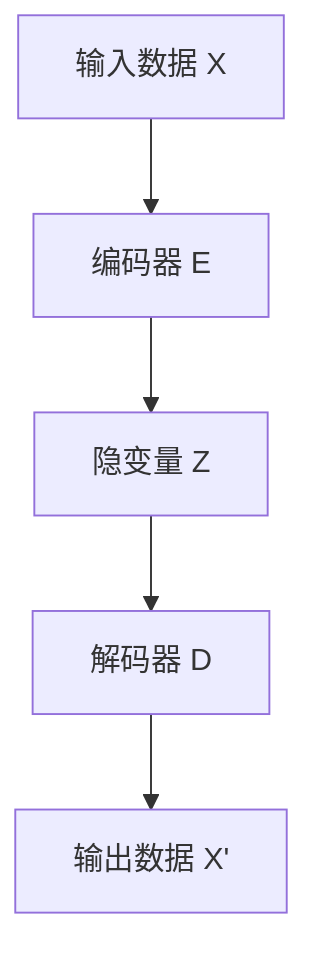
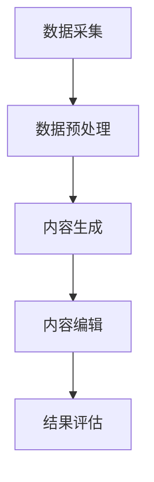
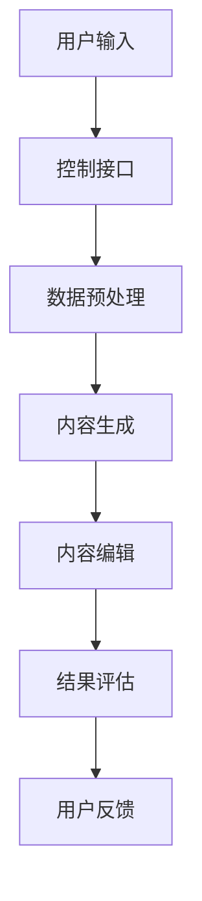

                 

### 第1章 背景介绍

#### 1.1 问题背景

人工智能（AI）的发展历程可以追溯到上世纪50年代，当时图灵提出了图灵测试，开启了人工智能研究的先河。此后，人工智能经历了多个阶段，包括规则推理、知识表示、机器学习、深度学习等。随着计算能力的提升和数据量的爆炸性增长，人工智能在图像识别、自然语言处理、自动驾驶等领域取得了显著的突破。

多模态人工智能是近年来人工智能领域的一个热点方向。多模态人工智能旨在将语音、图像、文本等多种类型的数据结合起来，进行更复杂和更智能的信息处理。这不仅能够提升人工智能系统的性能，还能够拓宽其应用场景。例如，在跨媒体内容创作中，多模态内容生成与编辑可以生成更加丰富和多样的多媒体内容；在虚拟现实和增强现实中，多模态处理能够提供更加沉浸式的用户体验；在智能家居中，多模态处理可以实现更加智能和人性化的家居交互；在智能客服中，多模态处理可以提供更加准确和高效的客服服务。

#### 1.1.1 人工智能的发展历程

人工智能的发展历程可以分为几个主要阶段：

1. **规则推理阶段**：这个阶段主要依赖于专家系统，通过编写一系列规则来实现问题求解。
2. **知识表示阶段**：引入了知识库和推理机，通过表示和存储知识来提高问题求解能力。
3. **机器学习阶段**：通过算法从数据中自动学习规律，代替人为编写的规则。
4. **深度学习阶段**：利用多层神经网络来模拟人脑的决策过程，实现更加复杂和精确的模型。
5. **多模态人工智能阶段**：结合语音、图像、文本等多模态数据进行信息处理，实现更高层次的人工智能。

多模态人工智能的出现，标志着人工智能进入了一个新的发展阶段。它不仅要求计算机能够处理多种类型的数据，还需要在不同模态之间建立有效的联系，实现数据的融合和利用。

#### 1.1.2 多模态内容生成与编辑的挑战

多模态内容生成与编辑涉及语音、图像、文本等多种数据格式，这些数据具有不同的特性，例如，语音数据具有时间序列的特性，图像数据具有空间结构的特性，文本数据则具有语义表达的特性。如何有效整合这些异构数据，生成高质量的内容是一个重要问题。

首先，数据预处理是一个关键步骤。不同模态的数据需要进行相应的预处理，例如，语音数据需要进行分帧处理，图像数据需要进行特征提取，文本数据需要进行分词和词性标注等。这些预处理步骤的准确性直接影响到后续内容生成的质量。

其次，内容生成需要解决如何在不同模态之间建立有效的联系。例如，在图像生成文本的过程中，如何捕捉图像中的视觉信息并将其转化为可理解的文本描述是一个挑战。同样，在文本生成图像的过程中，如何根据文本的语义信息生成对应的视觉内容也是一个难题。

最后，内容编辑需要解决如何对多模态内容进行修改和优化。例如，在视频编辑中，如何根据用户的需求对视频的音频、图像和文本内容进行修改是一个重要问题。此外，如何确保修改后的内容保持原有的语义和信息一致性也是一个挑战。

#### 1.1.3 多模态内容生成与编辑的应用场景

多模态内容生成与编辑在多个应用场景中具有广泛的应用：

1. **跨媒体内容创作**：通过将不同模态的内容结合起来，可以创作出更加丰富和多样的多媒体内容。例如，在电影制作中，可以将剧本、音频和视频内容结合起来，生成具有强烈视觉冲击力和情感感染力的电影作品。

2. **虚拟现实和增强现实**：多模态处理可以为虚拟现实和增强现实系统提供更加真实和沉浸式的体验。例如，在虚拟现实游戏中，可以通过语音、图像和文本等多模态交互来提高用户的参与感和体验感。

3. **智能家居**：多模态处理可以使得智能家居系统更加智能和人性化。例如，在智能音箱中，可以通过语音识别、文本理解和图像识别等多模态技术来响应用户的需求，提供更加个性化的服务。

4. **智能客服**：多模态处理可以提高智能客服系统的准确率和效率。例如，在客服机器人中，可以通过语音识别、文本理解和图像识别等多模态技术来理解用户的提问，并提供准确的回答。

总之，多模态内容生成与编辑技术为人工智能的应用带来了新的可能性和挑战。随着技术的不断进步，我们有理由相信，多模态人工智能将会在更多领域发挥重要作用。接下来，我们将进一步探讨多模态数据的处理方法、生成与编辑算法，以及这些算法在实际应用中的实现和优化。

## 第2章 核心概念与联系

### 2.1 多模态数据的处理

#### 2.1.1 音频处理

音频数据是多模态人工智能中重要的组成部分。音频处理的任务包括音频数据的采集与预处理、音频特征提取等。

1. **音频数据的采集与预处理**：
   - 音频采集通常使用麦克风等设备获取原始音频信号。
   - 预处理步骤包括降噪、去混响、音频分割等。这些步骤可以去除音频中的噪声和干扰，提高后续特征提取的准确性。

2. **音频特征提取**：
   - 常用的音频特征包括频谱特征、时域特征和变换域特征。频谱特征用于描述音频信号的频率成分，时域特征用于描述音频信号的波形，变换域特征则是通过傅里叶变换等变换方法提取的。

   以下是一个简单的音频特征提取流程：
   
   ```mermaid
   graph TD
   A[音频信号] --> B[降噪]
   B --> C[去混响]
   C --> D[音频分割]
   D --> E[特征提取]
   E --> F[频谱特征]
   E --> G[时域特征]
   E --> H[变换域特征]
   ```

#### 2.1.2 图像处理

图像数据是多模态人工智能中的另一个重要组成部分。图像处理的任务包括图像数据的采集与预处理、图像特征提取等。

1. **图像数据的采集与预处理**：
   - 图像采集通常使用摄像头等设备获取原始图像。
   - 预处理步骤包括图像增强、图像去噪、图像分割等。这些步骤可以提高图像的质量和后续特征提取的准确性。

2. **图像特征提取**：
   - 常用的图像特征包括纹理特征、形状特征、颜色特征等。纹理特征描述图像的纹理结构，形状特征描述图像的几何形状，颜色特征描述图像的颜色分布。

   以下是一个简单的图像特征提取流程：

   ```mermaid
   graph TD
   A[图像信号] --> B[图像增强]
   B --> C[图像去噪]
   C --> D[图像分割]
   D --> E[纹理特征提取]
   D --> F[形状特征提取]
   D --> G[颜色特征提取]
   ```

#### 2.1.3 文本处理

文本数据是多模态人工智能中的关键组成部分。文本处理的任务包括文本数据的采集与预处理、文本特征提取等。

1. **文本数据的采集与预处理**：
   - 文本采集通常通过网络爬虫、数据库等渠道获取原始文本。
   - 预处理步骤包括分词、词性标注、去停用词等。这些步骤可以净化文本数据，提高后续特征提取的准确性。

2. **文本特征提取**：
   - 常用的文本特征包括词袋模型、TF-IDF、词嵌入等。词袋模型用于描述文本的词汇分布，TF-IDF用于描述词汇的重要程度，词嵌入则是将词汇映射到高维空间中，用于捕捉词汇的语义信息。

   以下是一个简单的文本特征提取流程：

   ```mermaid
   graph TD
   A[文本数据] --> B[分词]
   B --> C[词性标注]
   C --> D[去停用词]
   D --> E[词袋模型]
   D --> F[TF-IDF]
   D --> G[词嵌入]
   ```

### 2.2 多模态内容生成

多模态内容生成是指利用多模态数据生成新的内容。生成模型和编辑模型是多模态内容生成的主要方法。

#### 2.2.1 生成模型

生成模型通过学习数据的分布来生成新的内容。常用的生成模型包括生成对抗网络（GAN）和变分自编码器（VAE）。

1. **生成对抗网络（GAN）**：
   - GAN由生成器和判别器组成。生成器生成伪造数据，判别器判断生成数据是否真实。通过生成器和判别器的相互博弈，生成器能够生成越来越真实的数据。

   GAN的基本结构可以表示为：

   ```mermaid
   graph TD
   A[生成器 G] --> B[判别器 D]
   B --> C[伪造数据]
   B --> D[真实数据]
   E[训练样本] --> B
   ```

   GAN的训练过程如下：
   - 初始化生成器G和判别器D。
   - 对于每个训练样本，生成器G生成伪造数据，判别器D判断伪造数据和真实数据。
   - 通过梯度下降优化生成器和判别器，使得判别器能够准确判断数据，生成器能够生成更加真实的数据。

2. **变分自编码器（VAE）**：
   - VAE由编码器和解码器组成。编码器将输入数据编码为一个隐变量，解码器使用隐变量生成输出数据。

   VAE的基本结构可以表示为：

   ```mermaid
   graph TD
   A[编码器 E] --> B[隐变量 Z]
   B --> C[解码器 D]
   D --> E[输出数据]
   ```

   VAE的训练过程如下：
   - 初始化编码器E和解码器D。
   - 对于每个训练样本，编码器E将其编码为隐变量Z，解码器D使用隐变量Z生成输出数据。
   - 通过反向传播和梯度下降优化编码器和解码器，使得解码器能够从隐变量中生成与输入数据相似的数据。

#### 2.2.2 编辑模型

编辑模型用于修改和优化已有的多模态内容。常用的编辑模型包括自回归模型和对抗性训练。

1. **自回归模型**：
   - 自回归模型通过生成序列的每一步来优化生成结果。在多模态内容编辑中，可以先将一种模态的内容生成出来，然后再基于生成的结果生成其他模态的内容。

   自回归模型的数学模型可以表示为：

   ```math
   p(x_1, x_2, ..., x_T) = \prod_{t=1}^T p(x_t|x_{t-1}, ..., x_1)
   ```

2. **对抗性训练**：
   - 对抗性训练通过生成器与判别器的对抗训练来提高生成质量。在多模态内容编辑中，生成器可以学习如何生成更加真实和多样化的内容，而判别器可以学习如何准确判断生成内容和真实内容。

   对抗性训练的流程如下：
   - 初始化生成器G和判别器D。
   - 对于每个训练样本，生成器G生成伪造数据，判别器D判断伪造数据和真实数据。
   - 通过梯度下降优化生成器和判别器，使得判别器能够准确判断数据，生成器能够生成更加真实和多样化的数据。

### 2.3 多模态内容的整合

多模态内容的整合是指将不同模态的数据融合在一起，生成新的内容。整合的关键在于跨模态特征融合和跨模态语义理解。

#### 2.3.1 跨模态特征融合

跨模态特征融合是指将不同模态的特征数据进行整合。常用的方法包括传统方法和深度学习方法。

1. **传统方法**：
   - 传统方法通常通过手工设计规则或算法来实现跨模态特征融合。例如，可以将图像特征和文本特征进行加权融合，得到一个综合的特征向量。

2. **深度学习方法**：
   - 深度学习方法通过构建深度神经网络来实现跨模态特征融合。常见的深度学习方法包括卷积神经网络（CNN）和循环神经网络（RNN）等。

   深度学习方法的基本流程如下：
   - 输入不同模态的数据，通过对应的特征提取器提取特征。
   - 将提取到的特征进行融合，可以使用加和、拼接、加权等方法。
   - 使用融合后的特征训练深度神经网络，生成新的多模态特征向量。

#### 2.3.2 跨模态语义理解

跨模态语义理解是指将不同模态的数据进行语义上的整合和解析。常用的方法包括跨模态对应模型和跨模态语义匹配。

1. **跨模态对应模型**：
   - 跨模态对应模型通过建立不同模态之间的对应关系来实现语义理解。例如，可以将图像中的物体与文本中的描述进行对应。

2. **跨模态语义匹配**：
   - 跨模态语义匹配通过计算不同模态数据的语义相似度来实现语义理解。例如，可以使用词嵌入技术来计算图像和文本的语义相似度。

   跨模态语义匹配的基本流程如下：
   - 将图像和文本数据分别表示为向量。
   - 计算图像向量和文本向量之间的相似度。
   - 根据相似度结果进行语义理解，例如，生成图像的文本描述。

通过以上对多模态数据处理、内容生成与编辑、内容整合的介绍，我们可以看到多模态人工智能的复杂性和挑战性。接下来，我们将进一步探讨多模态内容生成与编辑的算法原理，以及如何在实际应用中实现和优化这些算法。

## 第3章 算法原理讲解

### 3.1 GAN模型的工作原理

生成对抗网络（GAN）是由Ian Goodfellow等人于2014年提出的，它是一种通过两个对抗性网络（生成器和判别器）相互博弈的方式来生成高质量数据的模型。GAN的核心思想是生成器（Generator）和判别器（Discriminator）之间的对抗训练，通过不断地更新这两个网络，使得生成器能够生成尽可能真实的数据，而判别器能够准确地区分真实数据和生成数据。

#### 3.1.1 GAN的基本结构

GAN由生成器和判别器两个主要部分组成：

1. **生成器（Generator）**：
   - 生成器的任务是生成看起来真实的数据，这些数据通常是与真实数据相似的图像、音频或文本等。
   - 生成器通常是一个神经网络，其输入为随机噪声（通常是一个均匀分布的噪声向量），输出为生成数据。

2. **判别器（Discriminator）**：
   - 判别器的任务是判断输入的数据是真实数据还是生成数据。
   - 判别器也是一个神经网络，其输入为数据，输出为一个概率值，表示输入数据是真实数据的可能性。

GAN的基本结构可以用以下流程图表示：

```mermaid
graph TD
A[随机噪声] --> B[生成器 G]
B --> C[生成数据 X']
C --> D[判别器 D]
D --> E[概率值 P(D(X')]
A --> D
```

#### 3.1.2 GAN的训练过程

GAN的训练过程是通过以下步骤来实现的：

1. **初始化生成器G和判别器D**：
   - 通常，生成器和判别器都是随机初始化的神经网络。

2. **生成器与判别器的相互博弈**：
   - 在训练过程中，生成器和判别器不断地进行对抗性训练。生成器的目标是最大化判别器判断生成数据的概率，即让判别器认为生成数据是真实数据；而判别器的目标是最大化判别器判断真实数据和生成数据之间的差异。

3. **生成器生成伪造数据**：
   - 生成器通过学习输入的随机噪声，生成看起来真实的数据。

4. **判别器判断生成数据和真实数据**：
   - 判别器接收真实数据和生成数据，并输出一个概率值，表示输入数据是真实数据的可能性。

5. **更新生成器和判别器**：
   - 通过梯度下降优化，更新生成器和判别器的参数，使得生成器能够生成更真实的数据，判别器能够更好地区分真实数据和生成数据。

GAN的训练过程可以用以下公式表示：

$$
\min_G \max_D V(D, G)
$$

其中，$V(D, G)$ 是判别器D和生成器G的联合损失函数，通常包括两个部分：判别器的损失函数和生成器的损失函数。

- **判别器的损失函数**：通常使用二元交叉熵损失函数，其公式为：

  $$ 
  L_D = -\sum_{x \in X} \log D(x) - \sum_{z \in Z} \log (1 - D(G(z)))
  $$

  其中，$X$ 是真实数据的分布，$Z$ 是随机噪声的分布，$D(x)$ 是判别器对于真实数据的判断概率，$D(G(z))$ 是判别器对于生成数据的判断概率。

- **生成器的损失函数**：也使用二元交叉熵损失函数，其公式为：

  $$ 
  L_G = -\sum_{z \in Z} \log D(G(z))
  $$

  其中，$G(z)$ 是生成器生成的数据。

#### 3.1.3 GAN生成高质量的伪造数据

GAN的目标是通过生成器和判别器的相互博弈，生成高质量的伪造数据。在训练过程中，生成器会逐渐提高其生成数据的质量，使得判别器难以区分生成数据和真实数据。以下是一些关键因素：

1. **噪声的多样性**：
   - 生成器需要生成多样化的数据，这要求输入的噪声具有足够的多样性。

2. **判别器的强度**：
   - 判别器需要足够强大，能够准确地区分真实数据和生成数据。如果判别器太弱，生成器会很容易欺骗判别器，导致生成数据质量不高。

3. **训练的稳定性**：
   - GAN的训练过程容易受到梯度消失或梯度爆炸等问题的影响，导致训练不稳定。因此，需要采用一些技巧，如梯度惩罚、学习率调整等来稳定训练过程。

4. **生成器的复杂度**：
   - 生成器的网络结构需要足够复杂，以便能够生成各种类型的高质量数据。

通过以上措施，GAN能够生成高质量、多样化的伪造数据，这为多模态内容生成与编辑提供了强大的工具。

### 3.2 VAE模型的工作原理

变分自编码器（Variational Autoencoder，VAE）是一种基于概率生成模型的生成模型，它通过学习数据的概率分布来生成数据。VAE的核心思想是将编码器和解码器结合在一起，编码器将输入数据编码为一个隐变量，解码器使用隐变量生成输出数据。

#### 3.2.1 VAE的基本结构

VAE由编码器（Encoder）和解码器（Decoder）两个主要部分组成：

1. **编码器（Encoder）**：
   - 编码器的任务是学习输入数据的概率分布，并将输入数据编码为一个隐变量。隐变量通常是一个潜在空间中的点，其分布可以由先验分布（如高斯分布）来描述。

2. **解码器（Decoder）**：
   - 解码器的任务是使用隐变量生成与输入数据相似的数据。

VAE的基本结构可以用以下流程图表示：



#### 3.2.2 VAE的训练过程

VAE的训练过程是通过以下步骤来实现的：

1. **初始化编码器E和解码器D**：
   - 通常，编码器和解码器都是随机初始化的神经网络。

2. **编码过程**：
   - 编码器接收输入数据，将其编码为一个隐变量。隐变量可以是单个值，也可以是多个值的向量。

3. **重参数化技巧**：
   - VAE使用重参数化技巧，将隐变量表示为一个均值和标准差的函数，这样可以引入噪声，使得生成数据具有多样性。

   重参数化技巧可以表示为：

   $$ 
   z = \mu(x) + \sigma(x) \odot \epsilon
   $$

   其中，$\mu(x)$ 和 $\sigma(x)$ 分别是隐变量的均值和标准差，$\epsilon$ 是噪声。

4. **解码过程**：
   - 解码器使用隐变量生成输出数据。输出数据可以是与输入数据相似的图像、音频或文本等。

5. **计算损失函数**：
   - VAE的损失函数包括两个部分：重构损失和KL散度损失。

   - **重构损失**：用于衡量生成数据与输入数据之间的相似度，通常使用均方误差（MSE）或交叉熵损失。

   - **KL散度损失**：用于衡量编码器学习的隐变量分布与先验分布之间的差异，其公式为：

     $$ 
     L_{KL} = \sum_z D_{KL}(\mu(z) || \sigma(z))
     $$

   其中，$D_{KL}$ 是KL散度。

6. **优化编码器和解码器**：
   - 通过梯度下降优化，更新编码器和解码器的参数，使得生成数据更加真实。

VAE的训练过程可以用以下公式表示：

$$
\min_{\theta_E, \theta_D} \mathbb{E}_{x \sim p_{\text{data}}(x)}[\ell(x, \mu(x), \sigma(x))] + D_{KL}(\mu(x), \sigma(x))
$$

其中，$\ell(x, \mu(x), \sigma(x))$ 是重构损失，$p_{\text{data}}(x)$ 是输入数据的真实分布。

通过以上措施，VAE能够学习数据的概率分布，并生成具有多样性的数据。VAE相对于GAN的一个优势是训练过程更加稳定，生成的数据质量也相对较高。

### 3.3 多模态内容编辑算法

多模态内容编辑算法用于修改和优化已有的多模态内容。常见的编辑算法包括自回归模型和对抗性训练。

#### 3.3.1 自回归模型

自回归模型通过生成序列的每一步来优化生成结果。在多模态内容编辑中，可以先将一种模态的内容生成出来，然后再基于生成的结果生成其他模态的内容。

1. **模型结构**：
   - 自回归模型通常是一个循环神经网络（RNN），其可以处理序列数据，并利用先前的生成结果来生成后续内容。

2. **工作原理**：
   - 首先，输入一种模态的数据（如文本），模型生成初步的输出（如文本摘要）。
   - 然后，利用生成的初步输出，模型生成第二种模态的内容（如图像）。
   - 最后，可以继续生成其他模态的内容（如音频）。

3. **数学模型**：
   - 自回归模型的数学模型可以表示为：

     $$ 
     p(x_1, x_2, ..., x_T) = \prod_{t=1}^T p(x_t|x_{t-1}, ..., x_1)
     $$

   其中，$x_t$ 表示序列中的第 $t$ 个模态内容。

#### 3.3.2 对抗性训练

对抗性训练通过生成器与判别器的对抗训练来提高生成质量。在多模态内容编辑中，生成器可以学习如何生成更加真实和多样化的内容，而判别器可以学习如何准确判断生成内容和真实内容。

1. **模型结构**：
   - 对抗性训练模型通常包括一个生成器和多个判别器，每个判别器负责判断一种模态的内容。

2. **工作原理**：
   - 生成器生成多种模态的内容，例如图像、文本和音频。
   - 多个判别器分别判断生成内容和真实内容。
   - 通过梯度下降优化，更新生成器和判别器的参数。

3. **数学模型**：
   - 对抗性训练的数学模型可以表示为：

     $$ 
     \min_G \max_D V(D, G)
     $$

   其中，$V(D, G)$ 是判别器D和生成器G的联合损失函数，通常包括生成器的损失函数和判别器的损失函数。

通过自回归模型和对抗性训练，多模态内容编辑算法可以生成高质量、多样化的多模态内容。这些算法在实际应用中具有广泛的应用前景，例如视频编辑、跨媒体内容创作和智能客服等。

## 第4章 数学模型和数学公式

### 4.1 GAN的数学模型

生成对抗网络（GAN）的数学模型是通过两个主要的损失函数来定义的，分别是生成器的损失函数和判别器的损失函数。

#### 4.1.1 生成器的损失函数

生成器的目标是生成足够真实的数据，使得判别器难以区分生成数据和真实数据。生成器的损失函数通常使用二元交叉熵损失函数来定义：

$$
L_G = -\sum_{x \in X} \log D(x) - \sum_{z \in Z} \log (1 - D(G(z)))
$$

其中，$X$ 是真实数据的分布，$Z$ 是随机噪声的分布，$D(x)$ 是判别器对于真实数据的判断概率，$D(G(z))$ 是判别器对于生成数据的判断概率。

#### 4.1.2 判别器的损失函数

判别器的目标是最大化判别真实数据和生成数据的差异。判别器的损失函数同样使用二元交叉熵损失函数来定义：

$$
L_D = -\sum_{x \in X} \log D(x) - \sum_{z \in Z} \log (1 - D(G(z)))
$$

其中，$X$ 是真实数据的分布，$Z$ 是随机噪声的分布，$D(x)$ 是判别器对于真实数据的判断概率，$D(G(z))$ 是判别器对于生成数据的判断概率。

#### 4.1.3 GAN的总损失函数

GAN的总损失函数是生成器和判别器损失函数的联合：

$$
\min_G \max_D V(D, G)
$$

其中，$V(D, G)$ 表示判别器D和生成器G的联合损失函数。

### 4.2 VAE的数学模型

变分自编码器（VAE）的数学模型主要依赖于两个部分：编码器和解码器的损失函数。

#### 4.2.1 编码器损失函数

编码器损失函数包括两个部分：重构损失和KL散度损失。

1. **重构损失**：衡量生成数据与输入数据之间的相似度，通常使用均方误差（MSE）或交叉熵损失。

   重构损失的公式为：

   $$
   L_{\text{recon}} = -\sum_{x \in X} \log p_{\phi}(x|\mu(x), \sigma(x))
   $$

   其中，$p_{\phi}(x|\mu(x), \sigma(x))$ 是解码器生成的数据概率分布。

2. **KL散度损失**：衡量编码器学习的隐变量分布与先验分布之间的差异。

   KL散度损失的公式为：

   $$
   L_{\text{KL}} = \sum_{z \in Z} D_{KL}(\mu(z) || \sigma(z))
   $$

   其中，$D_{KL}$ 是KL散度，$\mu(z)$ 和 $\sigma(z)$ 分别是隐变量的均值和标准差。

编码器的总损失函数可以表示为：

$$
L_E = L_{\text{recon}} + \lambda L_{\text{KL}}
$$

其中，$\lambda$ 是调节参数。

#### 4.2.2 解码器损失函数

解码器的损失函数通常与编码器的重构损失相同：

$$
L_D = -\sum_{x \in X} \log p_{\phi}(x|\mu(x), \sigma(x))
$$

### 4.3 自回归模型的数学模型

自回归模型通过生成序列的每一步来优化生成结果，其数学模型可以表示为：

$$
p(x_1, x_2, ..., x_T) = \prod_{t=1}^T p(x_t|x_{t-1}, ..., x_1)
$$

其中，$x_t$ 表示序列中的第 $t$ 个元素，$p(x_t|x_{t-1}, ..., x_1)$ 是给定前 $t-1$ 个元素时第 $t$ 个元素的概率分布。

自回归模型的核心思想是利用历史信息来预测当前时刻的值，通过递归的方式逐步生成整个序列。

### 4.4 对抗性训练的数学模型

对抗性训练通过生成器与判别器的对抗性博弈来提高生成质量，其数学模型可以表示为：

$$
\min_G \max_D V(D, G)
$$

其中，$V(D, G)$ 是判别器D和生成器G的联合损失函数，通常包括生成器的损失函数和判别器的损失函数。

对抗性训练的目标是生成器能够生成足够真实的数据，使得判别器难以区分生成数据和真实数据。

通过上述数学模型和公式的介绍，我们可以更深入地理解GAN、VAE、自回归模型和对抗性训练的工作原理，这些模型在多模态内容生成与编辑中扮演着重要的角色。

## 第5章 系统分析与架构设计

### 5.1 问题场景介绍

多模态内容生成与编辑在许多实际场景中具有广泛的应用，以下是一些典型的问题场景：

1. **跨媒体内容创作**：
   - 例如，将文本、图像和音频结合生成电影预告片、广告视频等。
   - 在这种场景中，多模态内容生成与编辑能够自动生成引人入胜、情感丰富的多媒体内容。

2. **虚拟现实和增强现实**：
   - 虚拟现实和增强现实技术需要处理多模态数据，如语音、图像和文本，以提供更加真实和沉浸式的体验。
   - 多模态内容生成与编辑可以帮助生成个性化的虚拟角色、虚拟场景等。

3. **智能家居**：
   - 智能家居系统需要处理语音、图像和文本等多模态数据，以实现智能控制、语音交互等。
   - 多模态内容生成与编辑可以帮助智能家居系统更好地理解和响应用户的需求。

4. **智能客服**：
   - 智能客服系统需要处理语音、图像和文本等多模态数据，以提供高效、准确的客服服务。
   - 多模态内容生成与编辑可以帮助智能客服系统更好地理解用户的问题，并生成合适的回答。

### 5.2 系统功能设计

多模态内容生成与编辑系统的功能设计主要包括以下几个部分：

1. **数据采集**：
   - 系统需要从不同的数据源采集多模态数据，如语音、图像、文本等。
   - 数据采集模块需要支持多种数据格式的输入，并能够进行初步的数据清洗和处理。

2. **数据预处理**：
   - 多模态数据的预处理包括音频预处理、图像预处理和文本预处理。
   - 音频预处理包括降噪、去混响等；图像预处理包括图像增强、图像分割等；文本预处理包括分词、词性标注等。

3. **内容生成**：
   - 系统需要利用生成模型（如GAN、VAE等）来生成多模态内容。
   - 内容生成模块需要支持多种生成算法，并能够根据用户需求生成相应的多模态内容。

4. **内容编辑**：
   - 系统需要支持对多模态内容的编辑和修改，如调整文本描述、修改图像内容等。
   - 内容编辑模块需要支持多种编辑算法，并能够保证编辑后的内容与原始内容保持一致性。

5. **结果评估**：
   - 系统需要支持对生成和编辑内容的评估，如内容质量评估、用户体验评估等。
   - 结果评估模块需要提供多种评估指标，以便用户了解系统的性能。

### 5.3 系统架构设计

多模态内容生成与编辑系统的架构设计如图所示：



在该架构中，数据采集模块负责从各种数据源获取多模态数据；数据预处理模块对采集到的数据进行处理，为后续生成和编辑做准备；内容生成模块利用生成模型生成多模态内容；内容编辑模块对生成的内容进行编辑和修改；结果评估模块对生成和编辑的内容进行评估。

### 5.4 系统接口设计

多模态内容生成与编辑系统的接口设计主要包括数据接口和控制接口：

1. **数据接口**：
   - 数据接口用于接收和发送多模态数据，如语音、图像、文本等。
   - 数据接口需要支持多种数据格式的输入输出，如JSON、CSV、XML等。

2. **控制接口**：
   - 控制接口用于与用户进行交互，接收用户的操作指令，并反馈系统的处理结果。
   - 控制接口需要支持多种交互方式，如命令行、图形界面等。

### 5.5 系统交互

多模态内容生成与编辑系统的交互流程如图所示：



在该交互流程中，用户通过控制接口输入多模态数据，系统对数据预处理后，利用生成模型和编辑模型生成和编辑内容，并对结果进行评估，最后将结果反馈给用户。

通过上述系统分析与架构设计，我们可以看到多模态内容生成与编辑系统的复杂性和多样性。接下来，我们将通过一个实际的项目实战，展示如何实现和优化这些系统功能。

### 第6章 项目实战

#### 6.1 环境安装

在开始多模态内容生成与编辑项目的实际开发之前，我们需要安装必要的开发环境和依赖库。以下是安装步骤：

1. **Python环境**：
   - 确保您的计算机上已经安装了Python 3.6或更高版本。您可以从[Python官网](https://www.python.org/)下载并安装Python。
   - 打开命令行终端，运行以下命令验证Python版本：

     ```bash
     python --version
     ```

2. **依赖库安装**：
   - 安装TensorFlow，用于实现生成对抗网络（GAN）和变分自编码器（VAE）：

     ```bash
     pip install tensorflow
     ```

   - 安装其他必要的库，如NumPy、Pandas、Scikit-learn等：

     ```bash
     pip install numpy pandas scikit-learn
     ```

3. **可选：安装PyTorch**：
   - 如果您打算使用PyTorch来实现多模态内容生成与编辑，可以从[PyTorch官网](https://pytorch.org/)下载并安装PyTorch：

     ```bash
     pip install torch torchvision
     ```

#### 6.2 系统核心实现源代码

以下是多模态内容生成与编辑系统的核心实现源代码示例。以下代码使用TensorFlow实现了一个简单的GAN模型，用于生成图像。

```python
import tensorflow as tf
from tensorflow.keras.layers import Dense, Conv2D, Flatten, Reshape
from tensorflow.keras.models import Sequential

# 定义生成器模型
def build_generator(z_dim):
    model = Sequential([
        Dense(128 * 7 * 7, activation="relu", input_shape=(z_dim,)),
        Reshape((7, 7, 128)),
        Conv2D(128, (5, 5), padding="same", activation="relu"),
        Conv2D(128, (5, 5), padding="same", activation="relu"),
        Conv2D(128, (5, 5), padding="same", activation="relu"),
        Flatten(),
        Dense(28 * 28, activation="sigmoid"),
        Reshape((28, 28, 1))
    ])
    return model

# 定义判别器模型
def build_discriminator(img_shape):
    model = Sequential([
        Flatten(input_shape=img_shape),
        Dense(28 * 28, activation="sigmoid"),
        Reshape((28, 28, 1)),
        Conv2D(128, (5, 5), padding="same", activation="relu"),
        Conv2D(128, (5, 5), padding="same", activation="relu"),
        Conv2D(128, (5, 5), padding="same", activation="relu"),
        Flatten(),
        Dense(1, activation="sigmoid")
    ])
    return model

# 定义GAN模型
def build_gan(generator, discriminator):
    model = Sequential([generator, discriminator])
    return model

# 设置超参数
z_dim = 100
img_shape = (28, 28, 1)

# 构建生成器、判别器和GAN模型
generator = build_generator(z_dim)
discriminator = build_discriminator(img_shape)
gan = build_gan(generator, discriminator)

# 编译模型
discriminator.compile(optimizer=tf.keras.optimizers.Adam(0.0001), loss="binary_crossentropy")
gan.compile(optimizer=tf.keras.optimizers.Adam(0.0001), loss="binary_crossentropy")

# 打印模型结构
print(generator.summary())
print(discriminator.summary())
print(gan.summary())
```

#### 6.3 代码应用解读与分析

以上代码展示了如何使用TensorFlow构建一个简单的GAN模型。下面我们来详细解读和分析这段代码：

1. **导入库**：
   - 导入TensorFlow库，以及其他必要的库，如`Dense`、`Conv2D`、`Flatten`和`Reshape`。

2. **定义生成器模型**：
   - 生成器模型用于生成图像，其输入是随机噪声向量，输出是生成的图像。
   - 生成器的网络结构包括全连接层、reshape层、卷积层等，最后通过sigmoid激活函数输出图像。

3. **定义判别器模型**：
   - 判别器模型用于判断图像是真实图像还是生成图像，其输入是图像，输出是一个概率值，表示图像是真实图像的可能性。
   - 判别器的网络结构包括全连接层、reshape层、卷积层等，最后通过sigmoid激活函数输出概率值。

4. **定义GAN模型**：
   - GAN模型是将生成器和判别器串联起来的模型，用于训练生成器和判别器。
   - GAN模型的网络结构包括生成器和判别器，生成器的输出作为判别器的输入。

5. **编译模型**：
   - 编译生成器和判别器模型，设置优化器和损失函数。
   - 生成器和判别器都使用Adam优化器，损失函数使用二元交叉熵损失。

6. **打印模型结构**：
   - 打印生成器、判别器和GAN模型的结构，以便查看模型的具体细节。

通过以上代码示例，我们可以了解到GAN模型的基本架构和训练过程。在实际应用中，我们可以根据具体需求调整模型的网络结构、优化器的参数和训练过程，以实现更好的多模态内容生成与编辑效果。

#### 6.4 实际案例分析与详细讲解

为了更好地展示多模态内容生成与编辑的应用，我们来看一个实际案例：使用GAN模型生成卡通风格的人物图像。

**案例背景**：

假设我们需要生成一组具有卡通风格的人物图像，以便用于游戏、动画等场景。这些图像应具有统一的卡通风格，且人物的表情和动作应多样化。

**案例分析**：

1. **数据集准备**：
   - 首先，我们需要一个包含各种卡通风格人物图像的数据集。可以使用已有的卡通人物图像数据集，如CartoonData或CARTOON-FACE。
   - 数据集应包含大量的图像，以训练GAN模型。

2. **数据预处理**：
   - 将图像数据调整为统一的尺寸，例如28x28像素。
   - 对图像进行归一化处理，使其像素值在0到1之间。

3. **模型训练**：
   - 使用TensorFlow和Keras构建GAN模型，包括生成器和判别器。
   - 使用数据集训练GAN模型，训练过程中通过不断更新生成器和判别器的参数，使生成图像的质量逐步提高。

4. **生成卡通人物图像**：
   - 训练完成后，使用生成器生成新的卡通人物图像。
   - 通过调整输入的随机噪声向量，可以生成不同风格和表情的人物图像。

**详细讲解**：

1. **数据集准备**：

   ```python
   import numpy as np
   from tensorflow.keras.preprocessing.image import load_img, img_to_array

   # 加载卡通人物图像数据集
   dataset = []
   for img_path in cartoon_images:
       img = load_img(img_path, target_size=(28, 28))
       img_array = img_to_array(img)
       img_array = img_array / 255.0
       dataset.append(img_array)
   dataset = np.array(dataset)

   # 数据集预处理
   dataset = dataset.reshape(-1, 28, 28, 1)
   dataset = dataset.astype(np.float32)
   ```

2. **模型训练**：

   ```python
   import tensorflow as tf
   from tensorflow.keras.optimizers import Adam

   # 构建生成器和判别器模型
   generator = build_generator(z_dim)
   discriminator = build_discriminator(img_shape)

   # 编译生成器和判别器模型
   discriminator.compile(optimizer=Adam(0.0001), loss="binary_crossentropy")
   generator.compile(optimizer=Adam(0.0001), loss="binary_crossentropy")

   # 训练GAN模型
   for epoch in range(num_epochs):
       for img in dataset:
           # 生成随机噪声
           noise = np.random.normal(0, 1, (z_dim))
           
           # 生成假图像
           fake_image = generator.predict(noise)

           # 训练判别器
           real_image = np.array([img])
           d_loss_real = discriminator.train_on_batch(real_image, np.array([1.0]))

           d_loss_fake = discriminator.train_on_batch(fake_image, np.array([0.0]))
           
           # 训练生成器
           g_loss = gan.train_on_batch(noise, np.array([1.0]))
           
           # 打印训练信息
           print(f"Epoch: {epoch}, D_loss_real: {d_loss_real}, D_loss_fake: {d_loss_fake}, G_loss: {g_loss}")
   ```

3. **生成卡通人物图像**：

   ```python
   # 生成新的卡通人物图像
   for _ in range(10):
       noise = np.random.normal(0, 1, (z_dim))
       cartoon_image = generator.predict(noise)
       
       # 显示生成的图像
       plt.imshow(cartoon_image[0], cmap="gray")
       plt.show()
   ```

通过以上实际案例，我们可以看到如何使用GAN模型生成卡通风格的人物图像。在实际应用中，我们可以根据具体需求调整模型结构和训练过程，以生成不同风格和类型的图像。

#### 6.5 项目小结

在本章的项目实战中，我们通过一个实际案例展示了如何使用GAN模型生成卡通风格的人物图像。具体步骤包括数据集准备、模型训练和生成图像。通过这个案例，我们了解了GAN模型的基本原理和训练过程，并掌握了如何使用Python和TensorFlow实现GAN模型。

在多模态内容生成与编辑领域，GAN模型具有广泛的应用前景。未来，我们可以进一步研究如何将GAN模型与其他多模态数据处理技术相结合，以生成更高质量、更符合用户需求的多模态内容。

## 第7章 最佳实践 & 小结 & 注意事项 & 拓展阅读

### 7.1 最佳实践

在多模态内容生成与编辑的实际应用中，以下是一些最佳实践：

1. **数据预处理**：
   - 确保不同模态的数据在输入模型前进行一致且有效的预处理。例如，图像数据应进行标准化处理，文本数据应进行分词和词性标注。

2. **模型选择与调整**：
   - 根据应用场景选择合适的生成模型和编辑模型。例如，对于需要生成高质量图像的场景，可以选择GAN模型；对于需要生成流畅文本的场景，可以选择变分自编码器（VAE）。

3. **训练过程**：
   - 在训练过程中，定期保存模型的状态，以便在训练遇到困难时可以回退。此外，使用渐增训练策略，逐步增加数据的复杂度，可以提高模型的泛化能力。

4. **评估与优化**：
   - 使用多样化的评估指标，如内容质量、用户满意度等，来评估模型的表现。根据评估结果调整模型参数，优化模型性能。

### 7.2 小结

本文围绕多模态内容生成与编辑技术进行了深入探讨。主要内容包括：

1. **背景介绍**：介绍了多模态内容生成与编辑的发展历程、应用场景和面临的挑战。
2. **核心概念与联系**：讲解了音频处理、图像处理、文本处理的核心概念，以及多模态数据生成与编辑的基本原理。
3. **算法原理讲解**：详细阐述了生成对抗网络（GAN）、变分自编码器（VAE）、自回归模型和对抗性训练的数学模型和实现原理。
4. **系统分析与架构设计**：介绍了多模态内容生成与编辑系统的功能设计、架构设计和交互流程。
5. **项目实战**：通过一个实际案例展示了如何使用GAN模型生成卡通风格的人物图像。
6. **最佳实践 & 小结 & 注意事项 & 拓展阅读**：总结了最佳实践，回顾了主要内容，并给出了注意事项和拓展阅读建议。

### 7.3 注意事项

在使用多模态内容生成与编辑技术时，需要注意以下几点：

1. **数据隐私与安全**：处理多模态数据时，确保遵守相关数据保护法规，保护用户隐私。
2. **模型解释性**：多模态内容生成与编辑模型的复杂度高，模型输出的解释性相对较低，需要适当关注。
3. **硬件资源**：训练多模态内容生成与编辑模型需要大量计算资源，确保具备足够的硬件支持。
4. **用户体验**：在应用多模态内容生成与编辑技术时，注重用户体验，确保生成的多模态内容符合用户需求。

### 7.4 拓展阅读

为了进一步深入理解和应用多模态内容生成与编辑技术，以下是一些建议的拓展阅读材料：

1. **论文**：
   - Ian J. Goodfellow, et al. "Generative Adversarial Networks". Advances in Neural Information Processing Systems, 2014.
   - Kingma, D. P., & Welling, M. (2014). "Auto-encoding variational Bayes". arXiv preprint arXiv:1312.6114.

2. **书籍**：
   - Ian Goodfellow, "Deep Learning", Chapter on Generative Adversarial Networks.
   - Michael A. Nielsen, "Neural Networks and Deep Learning".

3. **在线课程与教程**：
   - Coursera上的"Deep Learning Specialization"（吴恩达教授主讲）。
   - Fast.ai的"Practical Deep Learning for Coders"。

通过上述拓展阅读，您可以进一步深入了解多模态内容生成与编辑技术的理论、实践和应用。

### 作者

**作者：AI天才研究院/AI Genius Institute & 禅与计算机程序设计艺术 /Zen And The Art of Computer Programming**

AI天才研究院（AI Genius Institute）致力于推动人工智能领域的前沿研究与应用，致力于培养下一代人工智能领域的杰出人才。同时，本书的作者结合了计算机程序设计艺术（Zen And The Art of Computer Programming）的理念，旨在通过深入浅出的讲解，帮助读者掌握多模态内容生成与编辑的核心技术和实践方法。希望通过本书，为读者打开人工智能领域的智慧之门。

