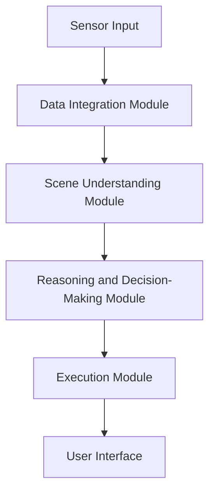

                 

## Introduction to the Book

### AI Agent's Multimodal Scene Understanding and Reasoning

In the era of artificial intelligence (AI), AI agents have emerged as a crucial component in various applications, ranging from autonomous vehicles to virtual assistants. These agents are designed to interact with their environment, make decisions, and perform tasks autonomously. At the core of their functionality lies the ability to understand and reason about the scenes they encounter. This book, "AI Agent's Multimodal Scene Understanding and Reasoning," delves into the intricacies of how AI agents comprehend and respond to diverse scenarios by leveraging multi-modal scene understanding and reasoning techniques.

### Keywords

- AI Agents
- Multimodal Scene Understanding
- Reasoning
- Machine Learning
- Deep Learning

### Abstract

The primary objective of this book is to provide a comprehensive and detailed exploration of how AI agents can effectively understand and reason about complex, multi-modal scenes. We begin by establishing a solid foundation by introducing the fundamental concepts and theories underlying AI agents. We then delve into the concept of multimodal scene understanding, discussing its importance and the challenges associated with it. Following this, we present various techniques and algorithms for scene recognition and classification, with a focus on both traditional and advanced methods.

A significant portion of the book is dedicated to the detailed explanation of algorithms and their underlying principles. We discuss neural network architectures, multimodal fusion methods, and scene understanding performance optimization techniques. Furthermore, the book includes a systematic analysis of AI agent systems, outlining their architecture, interface design, and interaction protocols. To complement the theoretical discussions, we present practical case studies and real-world applications, demonstrating the effectiveness of these techniques.

Finally, the book concludes with a summary of the key insights, highlighting best practices, potential areas for future research, and recommendations for further reading. By the end of this book, readers will have gained a thorough understanding of the principles and techniques required to develop AI agents capable of sophisticated scene understanding and reasoning.

### Background and Fundamental Concepts

In this chapter, we will lay the groundwork by introducing the fundamental concepts and theories that underpin AI agents, multimodal scene understanding, and reasoning. Understanding these core elements is crucial for grasping the complexities and potential of AI agents in real-world applications.

#### 1.1 Introduction to AI Agents

##### 1.1.1 Definition and Classification of AI Agents

AI agents are autonomous entities designed to interact with their environment, perceive through sensors, and act upon the environment using actuators. These agents operate based on a set of predefined rules or learned behaviors, making them capable of decision-making and problem-solving.

AI agents can be classified into several categories based on their capabilities and the nature of their interactions:

1. **Reactively Controlled Agents**: These agents respond to specific stimuli in their environment without any understanding of the environment's state. Examples include robotic vacuum cleaners that navigate by bouncing off obstacles.
2. **Model-Based Reflex Agents**: These agents use a model of the environment to make decisions. They predict the consequences of their actions and select actions that maximize their chances of achieving goals. For example, a chess-playing robot uses a model of the game state to determine its next move.
3. **Model-Based Goal-Based Agents**: These agents not only model the environment but also have explicit goals. They create a plan of actions to achieve these goals. Autonomous cars use this approach to navigate through traffic and reach their destinations.
4. **Theory-Based Agents**: These agents use high-level knowledge representations and reasoning to make decisions. They can solve complex problems by reasoning about the world using formal logic and knowledge bases. Expert systems are an example of theory-based agents.

##### 1.1.2 Evolution and Impact of AI Agents

The concept of AI agents has evolved significantly over the years. Early AI systems focused on rule-based systems and expert systems that could mimic human decision-making processes to some extent. However, the advent of machine learning and deep learning has revolutionized the field, enabling agents to learn from data and improve their performance over time.

AI agents have had a profound impact on various industries. In healthcare, they are used for diagnosing diseases, conducting medical research, and assisting in surgery. In transportation, autonomous vehicles are transforming the way we commute, promising to reduce accidents and traffic congestion. In customer service, virtual assistants powered by AI agents are providing personalized interactions and enhancing customer experiences.

##### 1.1.3 Fundamental Concepts and Theoretical Frameworks

Several key concepts and theoretical frameworks are essential for understanding AI agents:

1. **Sensorimotor Loop**: This loop represents the interaction between an agent's sensors, actuators, and environment. Sensors provide information about the environment, actuators generate actions, and the environment provides feedback, creating a continuous cycle of interaction.
2. **State**: The state of an agent refers to the information it has about the current situation in its environment. An agent's actions are based on its state, and its state evolves over time as it interacts with the environment.
3. **Perception**: Perception is the process by which an agent interprets sensory information from its environment. This can involve recognizing objects, understanding spatial relationships, and identifying patterns.
4. **Action**: An action is a behavior or movement generated by an agent in response to its perception of the environment. Actions are designed to achieve specific goals or objectives.
5. **Learning**: Learning is the process by which an agent improves its performance over time by modifying its behavior based on experience. This can be through supervised learning, reinforcement learning, or unsupervised learning.

#### 1.2 Multimodal Scene Understanding

##### 1.2.1 Definition and Importance

Multimodal scene understanding refers to the ability of an AI agent to process and integrate information from multiple sensory modalities, such as vision, audio, and touch. Unlike single-modal systems that rely on a single type of input, multimodal systems harness the power of diverse data sources to gain a more comprehensive and accurate understanding of the environment.

The importance of multimodal scene understanding can be seen in several key aspects:

1. **Improved Performance**: By leveraging multiple sensory inputs, multimodal systems can achieve higher accuracy and robustness in tasks such as object recognition, scene understanding, and interaction with the environment.
2. **Enhanced Reliability**: Single-modal systems are often susceptible to errors and ambiguities due to noisy or incomplete data. Multimodal systems can cross-validate information from different sources, reducing the likelihood of errors.
3. **Broader Application Scenarios**: Many real-world environments require agents to perceive and interact with multiple modalities. For example, a robot in a manufacturing plant needs to see, hear, and touch objects to perform assembly tasks efficiently.
4. **Human-like Capabilities**: Human beings naturally perceive the world through multiple senses. By mimicking this approach, multimodal AI agents can better emulate human cognition and behavior, making them more intuitive and intuitive to interact with.

##### 1.2.2 Types of Multimodal Data

Multimodal data can come from various sources and can be categorized into several types:

1. **Visual Data**: This includes images and videos captured by cameras or sensors. Visual data is crucial for tasks such as object recognition, scene understanding, and navigation.
2. **Audio Data**: This includes sound captured by microphones or other audio sensors. Audio data is essential for tasks such as speech recognition, sound source localization, and environmental awareness.
3. **Tactile Data**: This includes information gathered through touch sensors, such as force sensors or tactile arrays. Tactile data is vital for tasks that require physical interaction with objects, such as assembly, manipulation, and haptic feedback.
4. **Other Modalities**: This category includes other types of sensory data, such as thermal, infrared, ultrasonic, and chemical data. These modalities are often used in specialized applications, such as security systems, environmental monitoring, and medical diagnostics.

##### 1.2.3 Challenges in Multimodal Scene Understanding

Despite the many advantages of multimodal scene understanding, there are several challenges that need to be addressed:

1. **Integration and Fusion**: Combining data from multiple modalities can be challenging, as different modalities may have different resolutions, frequencies, and characteristics. Effective integration and fusion techniques are required to leverage the strengths of each modality while mitigating their weaknesses.
2. **Synchronization**: Ensuring the temporal alignment of data from different modalities is crucial for accurate scene understanding. Synchronization issues can arise due to variations in sensor latencies, sampling rates, and environmental factors.
3. **Inter-modality Correlation**: Establishing meaningful correlations between different modalities is essential for creating a coherent representation of the scene. However, the correlation between modalities can be weak or non-linear, making it difficult to develop effective fusion methods.
4. **Scalability and Efficiency**: Multimodal systems often require significant computational resources to process and analyze large amounts of data in real-time. Developing efficient algorithms and hardware architectures is necessary to ensure scalability and performance.
5. **Domain Adaptation**: Multimodal systems need to be adaptable to different environments and scenarios. This requires the ability to learn and generalize from diverse datasets, as well as the flexibility to handle variations in the input data.

In summary, this chapter has provided a comprehensive overview of the fundamental concepts and theories underlying AI agents, multimodal scene understanding, and reasoning. By understanding these core elements, we can better appreciate the potential and challenges of developing advanced AI agents capable of sophisticated scene understanding and reasoning in real-world applications.

### Reasoning and Decision-Making in AI Agents

#### 1.3.1 Overview of Reasoning Processes

Reasoning and decision-making are critical components of AI agents, enabling them to understand their environment, make informed choices, and achieve specific goals. The process of reasoning involves several key steps:

1. **Perception**: The AI agent perceives its environment through various sensors, such as cameras, microphones, and touch sensors. This raw sensor data is then processed to extract relevant information about the environment.

2. **Knowledge Representation**: The extracted information is represented as a set of symbols or concepts in the agent's knowledge base. This knowledge representation allows the agent to reason about the environment and its state.

3. **Inference**: The agent uses logical rules, probability theories, or machine learning models to infer new knowledge or make predictions based on its existing knowledge and the current state of the environment.

4. **Decision-Making**: Based on the inferred knowledge, the agent makes decisions about its actions. These decisions are typically based on a set of goals or objectives that the agent aims to achieve.

5. **Execution**: The agent executes the chosen actions, which may involve physical movements, interactions with the environment, or communication with other agents or humans.

#### 1.3.2 Decision-Making Algorithms and Techniques

AI agents employ various decision-making algorithms and techniques to make informed choices. Some of the most common approaches include:

1. **Rule-Based Systems**: These systems use a set of predefined rules to make decisions. When a situation matches a rule, the agent performs the corresponding action. Rule-based systems are easy to understand and implement but can be limited in their ability to handle complex and ambiguous situations.

2. **Markov Decision Processes (MDPs)**: MDPs are mathematical models that represent a sequence of decisions made by an agent in an uncertain environment. The agent learns the optimal policy, which is a mapping from states to actions that maximizes the expected cumulative reward. MDPs are powerful for modeling sequential decision-making but can become computationally expensive for large state spaces.

3. **Reinforcement Learning (RL)**: RL is a type of machine learning where an agent learns to make decisions by receiving feedback in the form of rewards or penalties. The agent explores its environment, learns from its experiences, and gradually improves its policy. RL has been successful in applications such as game playing, robotics, and autonomous driving.

4. **Bayesian Networks**: Bayesian networks are probabilistic graphical models that represent the dependencies between variables in a system. They can be used to infer the state of a system or predict the outcomes of actions based on observed data. Bayesian networks are useful for handling uncertainty and making probabilistic predictions.

5. **Genetic Algorithms**: Genetic algorithms are optimization techniques inspired by the process of natural selection. They involve creating a population of candidate solutions, evaluating their fitness, and evolving the population over generations to find an optimal solution. Genetic algorithms are useful for solving complex optimization problems where traditional methods may fail.

6. **Neural Networks**: Neural networks, particularly deep learning models, have been successful in various AI applications, including image recognition, natural language processing, and speech recognition. Neural networks learn to make decisions based on large amounts of data, allowing them to handle complex and non-linear relationships.

#### 1.3.3 Impact on AI Agent Performance

The effectiveness of an AI agent's reasoning and decision-making capabilities has a significant impact on its overall performance. Here are some key factors that influence the agent's performance:

1. **Accuracy**: The agent's ability to accurately perceive and understand its environment is crucial. Inaccurate perception can lead to poor decision-making and suboptimal performance.

2. **Speed**: The agent's decision-making process should be fast enough to handle real-time applications. Delays in decision-making can lead to missed opportunities or inefficient actions.

3. **Robustness**: The agent should be robust to noise, uncertainty, and changes in the environment. Robust agents can maintain their performance even in the presence of errors or unexpected situations.

4. **Generalization**: The agent should be able to generalize its knowledge and skills to new situations and environments. Generalization allows the agent to adapt to changing conditions and handle a wide range of tasks.

5. **Scalability**: The agent's reasoning and decision-making techniques should be scalable to handle large amounts of data and complex environments. Scalability is important for deploying the agent in real-world applications with diverse and dynamic conditions.

In conclusion, reasoning and decision-making are critical components of AI agents, enabling them to understand their environment, make informed choices, and achieve their goals. By employing various algorithms and techniques, AI agents can enhance their performance and adaptability, making them more effective in real-world applications.

### Core Techniques for Multimodal Scene Understanding

In this chapter, we delve into the core techniques that underpin multimodal scene understanding, focusing on data collection and preprocessing, multimodal data integration, and scene recognition and classification. These techniques are crucial for enabling AI agents to effectively understand and interpret complex, real-world scenes.

#### 2.1 Data Collection and Preprocessing

##### 2.1.1 Multimodal Data Acquisition Methods

The first step in multimodal scene understanding is the collection of data from various sensory modalities. This section discusses common methods for acquiring data from different modalities:

1. **Visual Data**: 
   - **Cameras**: High-resolution cameras are widely used to capture visual information. Different types of cameras, such as monocular, stereo, and multi-view cameras, can be employed to capture images or videos from different perspectives.
   - **Sensors**: In addition to cameras, other visual sensors like depth sensors (e.g., Microsoft Kinect) can provide depth information, enabling 3D scene understanding.

2. **Audio Data**: 
   - **Microphones**: Microphones are used to capture sound, enabling audio-based scene understanding. Arrays of microphones can improve the spatial resolution of audio data.
   - **Acoustic Sensors**: Acoustic sensors can detect sound waves in the environment and are used in applications like environmental monitoring and sound source localization.

3. **Tactile Data**: 
   - **Touch Sensors**: Touch sensors, such as force-torque sensors and tactile arrays, are used to measure physical interactions with objects.
   - **Haptic Sensors**: Haptic sensors provide sensory feedback, enabling agents to perceive and respond to tactile information in real-time.

4. **Other Modalities**: 
   - **Thermal Imaging**: Thermal cameras can detect heat signatures, useful for applications like night vision and object detection in low-light conditions.
   - **Ultrasonic Sensors**: Ultrasonic sensors measure the time it takes for sound waves to bounce back after hitting an object, enabling distance measurement and object detection.

##### 2.1.2 Data Preprocessing and Cleaning

Once the multimodal data is collected, preprocessing and cleaning are essential steps to ensure data quality and prepare it for further analysis. Key preprocessing tasks include:

1. **Data清洗**: This involves removing noise, correcting errors, and filtering out irrelevant information. For example, in visual data, removing blurred or distorted images can improve the quality of subsequent analysis.

2. **数据增强**: Data augmentation techniques, such as cropping, rotation, and mirroring, can be used to increase the diversity of the dataset and improve the robustness of the AI model.

3. **Normalization**: Scaling and standardizing the data to a common range can help in reducing the influence of different data distributions and improving model performance.

4. **特征提取**: Extracting relevant features from the raw data is crucial for representing the data in a suitable format for further processing. Techniques like image processing, audio processing, and tactile processing are used to extract features from each modality.

##### 2.1.3 Feature Extraction Techniques

Feature extraction is a critical step in transforming raw multimodal data into a format suitable for machine learning models. Different techniques are used to extract features from each modality:

1. **Visual Feature Extraction**: 
   - **传统方法**: Edge detection, corner detection, and SIFT (Scale-Invariant Feature Transform) are commonly used to extract visual features from images.
   - **深度学习方法**: Convolutional Neural Networks (CNNs) have become the dominant approach for visual feature extraction. Pre-trained CNNs like VGG, ResNet, and Inception can be fine-tuned for specific tasks.

2. **Audio Feature Extraction**: 
   - **传统方法**: Mel-Frequency Cepstral Coefficients (MFCC) and pitch are commonly used to represent audio signals.
   - **深度学习方法**: Deep learning models, such as Recurrent Neural Networks (RNNs) and Convolutional Neural Networks (CNNs), have been successfully applied to audio feature extraction.

3. **Tactile Feature Extraction**: 
   - **传统方法**: Force and torque measurements are used to represent tactile information.
   - **深度学习方法**: Neural networks can be trained to extract meaningful tactile features from tactile data.

4. **Other Feature Extraction Techniques**: 
   - **多模态特征融合**: Techniques like Canonical Correlation Analysis (CCA) and Principal Component Analysis (PCA) can be used to extract joint features from multiple modalities.

#### 2.2 Multimodal Data Integration

##### 2.2.1 Fusion Methods for Multimodal Data

Integrating data from multiple modalities is a challenging task that requires combining the strengths of each modality while mitigating their weaknesses. Various fusion methods can be employed:

1. **Feature-Level Fusion**: 
   - **直接融合**: Features from different modalities are concatenated to create a multi-modal feature vector. This method is straightforward but may lead to dimensionality issues.
   - **特征选择**: Use techniques like Mutual Information Maximization (MIM) or feature importance ranking to select the most relevant features for fusion.

2. **Decision-Level Fusion**: 
   - **集成学习**: Combining the decisions from different classifiers trained on individual modalities. Techniques like Voting and Bagging can be used for this purpose.
   - **基于规则的融合**: Defining rules to combine decisions based on the confidence levels of individual classifiers.

3. **Hybrid Fusion Methods**: 
   - **分层融合**: Combining feature-level and decision-level fusion methods. This approach leverages the strengths of both methods and can improve performance.
   - **多尺度融合**: Integrating data from different spatial or temporal resolutions to capture a broader context.

##### 2.2.2 Model Integration Techniques

In addition to data fusion methods, integrating models trained on different modalities can further enhance the performance of multimodal scene understanding systems. Some common model integration techniques include:

1. **Joint Training**: Training a single model that simultaneously processes data from multiple modalities. This approach can be challenging due to the differences in data characteristics but can lead to improved performance.

2. **Multi-Modal Neural Networks**: Neural network architectures like Convolutional Neural Networks (CNNs) for visual data and Recurrent Neural Networks (RNNs) for audio data can be combined to create multi-modal networks. Techniques like FusionNet and Multi-modal Recurrent Neural Networks (MRNNs) have been successfully used in practice.

3. **Modular Networks**: Breaking the system into modular components that handle individual modalities and then integrating their outputs. This approach allows for flexibility and can be applied to various types of multimodal data.

##### 2.2.3 Challenges and Solutions in Data Integration

Integrating data from multiple modalities poses several challenges:

1. ** heterogeneity**: Different modalities may have different scales, resolutions, and characteristics, making it difficult to integrate them seamlessly. 
   - **解决方案**: 使用多尺度处理、归一化和特征转换技术来统一不同模态的数据。

2. **数据同步**: 确保不同模态的数据在时间和空间上的一致性是关键。不同传感器的时间延迟和采样率可能导致数据同步问题。
   - **解决方案**: 使用同步算法和技术来对齐不同模态的数据。

3. **互信息**: 不同模态之间的信息可能不完全相关，这会影响到融合效果。
   - **解决方案**: 使用互信息最大化和其他相关度量来选择最佳的融合策略。

4. **计算资源**: 多模态数据融合和模型训练通常需要大量的计算资源。
   - **解决方案**: 采用高效的算法和优化技术来提高计算效率。

In summary, this chapter has explored the core techniques for multimodal scene understanding, including data collection and preprocessing, multimodal data integration, and scene recognition and classification. By addressing the challenges and employing effective techniques, AI agents can achieve a more comprehensive and accurate understanding of complex scenes, enabling better decision-making and interaction with the environment.

### Advanced Algorithms for Scene Understanding

In this chapter, we will delve into the advanced algorithms that have significantly enhanced the capabilities of AI agents in scene understanding. We will explore various neural network architectures, multimodal fusion algorithms, and techniques for optimizing scene understanding performance.

#### 3.1 Neural Network Architectures

Neural networks, particularly deep learning models, have revolutionized the field of scene understanding by enabling machines to learn complex patterns and relationships from large amounts of data. Here, we will discuss some of the most prominent neural network architectures used in scene understanding:

##### 3.1.1 Convolutional Neural Networks (CNNs)

Convolutional Neural Networks (CNNs) are the cornerstone of deep learning for image processing. CNNs are designed to automatically and hierarchically learn features from images through a series of convolutional, pooling, and fully connected layers. The key advantages of CNNs include:

1. **Feature Extraction**: CNNs can automatically learn spatial hierarchies of features from raw pixel data, reducing the need for manual feature engineering.
2. **End-to-End Learning**: CNNs can be trained end-to-end, allowing for the direct mapping from raw images to high-level concepts.
3. **High Accuracy**: CNNs have achieved state-of-the-art performance in various computer vision tasks, including object recognition, image classification, and semantic segmentation.

Common CNN architectures include:

1. **LeNet**: One of the earliest CNN architectures, LeNet was designed for recognizing hand-written digits.
2. **AlexNet**: Introduced in 2012, AlexNet was the first CNN to achieve significant improvements over traditional computer vision methods in the ImageNet challenge.
3. **VGG**: The VGG network is known for its deep and shallow architecture with many layers of 3x3 convolutional filters, which helped set new benchmarks in image classification.
4. **ResNet**: ResNet introduced the concept of residual connections, allowing for the training of much deeper networks without the vanishing gradient problem.

##### 3.1.2 Recurrent Neural Networks (RNNs)

Recurrent Neural Networks (RNNs) are well-suited for processing sequential data, such as time-series, text, and audio. RNNs have been successfully applied to scene understanding tasks that involve temporal information. The key features of RNNs include:

1. **Memory**: RNNs maintain a memory state that allows them to capture temporal dependencies in the data.
2. **Sequential Processing**: RNNs process data in a sequential manner, making them suitable for tasks that require understanding the order of events.
3. **Flexibility**: RNNs can be easily adapted for various tasks, including speech recognition, video analysis, and natural language processing.

Common RNN architectures include:

1. **Simple RNN**: The simplest form of RNNs, Simple RNNs use a single hidden layer to capture temporal dependencies.
2. **LSTM (Long Short-Term Memory)**: LSTMs are a type of RNN designed to overcome the vanishing gradient problem, allowing them to capture long-term dependencies in data.
3. **GRU (Gated Recurrent Unit)**: GRUs are an alternative to LSTMs that are simpler and computationally more efficient while achieving similar performance.

##### 3.1.3 Transformer Models

Transformer models, particularly the self-attention mechanism, have transformed the field of natural language processing and are now being applied to scene understanding tasks. Transformers are well-suited for handling variable-length sequences and have several advantages over traditional RNNs:

1. **Parallelism**: Transformers can process data in parallel, leading to faster training times.
2. **Global Context**: Self-attention allows transformers to capture global dependencies in the data, which is particularly useful for tasks like video analysis and image captioning.
3. **Flexibility**: Transformers can be easily extended to handle various tasks and modalities.

Common Transformer architectures include:

1. **Transformer**: The original Transformer model introduced by Vaswani et al. in 2017.
2. **BERT (Bidirectional Encoder Representations from Transformers)**: BERT is a pre-trained Transformer model that achieves state-of-the-art performance in various natural language processing tasks.
3. **ViT (Vision Transformer)**: ViT extends the Transformer model to handle image data by treating images as fixed-length sequences of patches.

#### 3.2 Multimodal Fusion Algorithms

Integrating data from multiple modalities is a challenging task that requires combining the strengths of each modality while mitigating their weaknesses. Here, we will discuss some advanced multimodal fusion algorithms:

##### 3.2.1 Feature-Level Fusion

Feature-level fusion involves combining feature vectors extracted from different modalities. This method is straightforward but may lead to dimensionality issues. Common feature-level fusion techniques include:

1. **Direct Concatenation**: Features from different modalities are concatenated to form a multi-modal feature vector. This method is simple but can result in high-dimensional data.
2. **Feature Selection**: Techniques like Mutual Information Maximization (MIM) or feature importance ranking are used to select the most relevant features for fusion.
3. **Dimensionality Reduction**: Methods like Principal Component Analysis (PCA) or Linear Discriminant Analysis (LDA) are used to reduce the dimensionality of the fused features.

##### 3.2.2 Decision-Level Fusion

Decision-level fusion involves combining the decisions from classifiers trained on individual modalities. This method can improve the robustness and accuracy of the overall system. Common decision-level fusion techniques include:

1. **Voting**: Class labels from different classifiers are combined by majority voting.
2. **Boosting**: Techniques like AdaBoost and Gradient Boosting combine the predictions of multiple classifiers to create a strong classifier.
3. **Ensemble Learning**: Methods like Bagging and Stacking combine multiple classifiers to improve overall performance.

##### 3.2.3 Hybrid Fusion Methods

Hybrid fusion methods combine feature-level and decision-level fusion techniques to leverage the advantages of both methods. Common hybrid fusion methods include:

1. **Layered Fusion**: Data is first fused at the feature level and then at the decision level within multiple layers.
2. **Multi-Modal Neural Networks**: Neural network architectures that integrate multiple modalities are trained jointly, allowing for end-to-end learning of complex multimodal patterns.

#### 3.3 Scene Understanding Performance Optimization

Optimizing the performance of scene understanding systems involves addressing various challenges, including data synchronization, model complexity, and computational efficiency. Here, we discuss some techniques for optimizing scene understanding performance:

##### 3.3.1 Data Synchronization

Ensuring the temporal alignment of data from different modalities is crucial for accurate scene understanding. Techniques for data synchronization include:

1. **Sensor Synchronization**: Calibrating sensors to ensure they provide data at the same rate and with minimal delay.
2. **Temporal Alignment Algorithms**: Techniques like dynamic time warping (DTW) and optical flow can be used to align data from different modalities.

##### 3.3.2 Model Complexity

Balancing model complexity and performance is essential for achieving efficient scene understanding. Techniques for managing model complexity include:

1. **Model Pruning**: Reducing the size of the model by removing redundant or less important weights.
2. **Knowledge Distillation**: Training a smaller model to mimic the behavior of a larger, more complex model.
3. **Transfer Learning**: Utilizing pre-trained models on related tasks to improve performance on new tasks with limited data.

##### 3.3.3 Computational Efficiency

Improving computational efficiency is crucial for deploying scene understanding systems in real-time applications. Techniques for enhancing computational efficiency include:

1. **Model Optimization**: Techniques like quantization, binarization, and pruning can reduce the computational cost of models.
2. **Hardware Acceleration**: Utilizing specialized hardware accelerators like Graphics Processing Units (GPUs) and Tensor Processing Units (TPUs) to speed up model inference.
3. **Data Parallelism**: Training models across multiple GPUs or distributed systems to improve training efficiency.

In conclusion, this chapter has explored advanced algorithms for scene understanding, including neural network architectures, multimodal fusion algorithms, and techniques for optimizing performance. By leveraging these algorithms and techniques, AI agents can achieve higher accuracy, robustness, and efficiency in understanding and interpreting complex scenes.

### System Analysis and Architecture Design

In this section, we will provide a detailed analysis of the architecture design for an AI agent capable of multimodal scene understanding and reasoning. We will start by introducing the problem scenario and project requirements, followed by a description of the system's functional design, architecture design, interface design, and interaction protocols.

#### Problem Scenario and Project Requirements

The problem scenario involves developing an AI agent that can autonomously navigate and interact with its environment. The agent is equipped with multiple sensors, including cameras, microphones, and tactile sensors, to collect visual, audio, and tactile data from the environment. The primary goal of the project is to enable the agent to understand and interpret the complex scenes it encounters, make informed decisions, and perform tasks efficiently.

The project requirements include:

1. **Multimodal Data Collection**: The agent must be capable of collecting high-quality data from multiple sensory modalities.
2. **Scene Understanding**: The agent should be able to interpret the collected data to understand the environment and recognize objects, people, and events.
3. **Decision-Making**: The agent must be equipped with advanced reasoning and decision-making capabilities to navigate and interact with the environment effectively.
4. **Real-Time Processing**: The system should be able to process and analyze data in real-time to enable quick and accurate decision-making.
5. **Robustness and Adaptability**: The system should be robust to variations in sensor data and capable of adapting to different environments and scenarios.

#### Functional Design

The functional design of the system can be divided into several key components:

1. **Sensor Module**: This module is responsible for collecting data from various sensors, including cameras, microphones, and tactile sensors. The sensor data is preprocessed and cleaned to remove noise and irrelevant information.
2. **Data Integration Module**: This module integrates data from different sensory modalities using advanced fusion techniques. The goal is to create a coherent and comprehensive representation of the scene that captures the strengths of each modality while mitigating their weaknesses.
3. **Scene Understanding Module**: This module processes the integrated data to recognize objects, people, and events in the environment. It employs deep learning models and traditional computer vision techniques to achieve high accuracy and robustness.
4. **Reasoning and Decision-Making Module**: This module uses the output of the scene understanding module to make informed decisions about the agent's actions. It employs techniques like reinforcement learning, Markov decision processes, and rule-based systems to generate optimal action plans.
5. **Execution Module**: This module executes the actions determined by the reasoning and decision-making module. It controls the actuators of the agent, such as motors and robotic arms, to perform tasks in the environment.

#### Architecture Design

The architecture of the system can be depicted using a high-level block diagram, which includes the following components:

1. **Sensor Input**: Data from cameras, microphones, and tactile sensors is collected and transmitted to the data integration module.
2. **Data Integration Module**: This module processes the sensor data, performs feature extraction, and integrates the data from different modalities using advanced fusion techniques.
3. **Scene Understanding Module**: The integrated data is fed into the scene understanding module, which uses deep learning models and computer vision techniques to recognize objects, people, and events in the environment.
4. **Reasoning and Decision-Making Module**: The output of the scene understanding module is processed by the reasoning and decision-making module to generate action plans based on the agent's goals and objectives.
5. **Execution Module**: The action plans are executed by the execution module, which controls the actuators of the agent to perform tasks in the environment.
6. **User Interface**: A user interface allows users to monitor the agent's actions, receive feedback, and provide manual control if needed.

The architecture design can be visualized using the following Mermaid diagram:



#### Interface Design

The interface design of the system includes both hardware and software components. The hardware interface involves connecting various sensors to the agent's control system, ensuring seamless data transmission and synchronization. The software interface involves designing APIs and protocols for communication between the different modules of the system.

The system uses a RESTful API for communication between the modules, allowing for easy integration and interoperability. The API provides endpoints for data collection, data integration, scene understanding, reasoning and decision-making, and execution. Each endpoint accepts and returns data in JSON format, ensuring compatibility with various programming languages and platforms.

#### Interaction Protocols

The interaction protocols between the different modules of the system are designed to ensure efficient and reliable communication. The following protocols are used:

1. **Sensor Data Acquisition**: Sensors periodically transmit data to the data integration module. The data is transmitted in real-time using a messaging queue system, ensuring low latency and high throughput.
2. **Data Integration and Fusion**: The data integration module processes the incoming sensor data, performs feature extraction, and integrates the data from different modalities. The fusion process is asynchronous and uses a publish-subscribe model, allowing for efficient processing of large volumes of data.
3. **Scene Understanding and Reasoning**: The scene understanding module analyzes the integrated data to recognize objects, people, and events. The results are transmitted to the reasoning and decision-making module, which generates action plans based on the agent's goals and objectives.
4. **Execution and Feedback**: The execution module receives the action plans from the reasoning and decision-making module and executes the actions. Feedback from the environment is transmitted back to the system for continuous improvement and adaptation.

In conclusion, this section has provided a detailed analysis of the system architecture for an AI agent capable of multimodal scene understanding and reasoning. By leveraging advanced algorithms and efficient communication protocols, the system can effectively interpret complex scenes, make informed decisions, and interact with the environment in real-time.

### Project Implementation and Analysis

In this section, we will delve into the practical implementation of the AI agent's multimodal scene understanding and reasoning system, providing a step-by-step guide to environment setup, key code implementations, and detailed analysis of the system's core components.

#### Environment Setup

To implement the AI agent's system, we require a robust development environment that supports the necessary tools and libraries for data processing, machine learning, and multimodal integration. The following tools and libraries are essential for the project:

1. **Python**: The primary programming language for implementing the AI agent's system.
2. **TensorFlow or PyTorch**: Popular deep learning frameworks for training and deploying neural network models.
3. **OpenCV**: An open-source computer vision library for processing visual data.
4. **NumPy and Pandas**: Libraries for numerical computation and data manipulation.
5. **Scikit-learn**: A machine learning library for traditional algorithms and models.
6. **RabbitMQ**: A message broker for real-time data acquisition and communication between modules.

The environment setup involves installing the required libraries and configuring the development environment. Here is a sample command to install the necessary libraries using `pip`:

```shell
pip install tensorflow opencv-python numpy pandas scikit-learn rabbitmq-server
```

#### Core Code Implementations

The core code implementations of the AI agent's system can be divided into several modules, each responsible for a specific aspect of the system. Below, we provide key code snippets and explanations for each module:

##### 1. Sensor Data Acquisition

The sensor data acquisition module is responsible for collecting data from various sensors and transmitting it to the data integration module. Here is a sample code snippet for capturing and transmitting image data from a camera:

```python
import cv2
import pika

# Initialize the camera
cap = cv2.VideoCapture(0)

# Connect to the RabbitMQ message broker
connection = pika.BlockingConnection(pika.ConnectionParameters('localhost'))
channel = connection.channel()
channel.queue_declare(queue='sensor_data')

while True:
    # Capture frame-by-frame
    ret, frame = cap.read()
    
    # Encode the frame as a JPEG image
    encoded_frame = cv2.imencode('.jpg', frame)[1].tobytes()
    
    # Publish the frame to the RabbitMQ queue
    channel.basic_publish(exchange='',
                          routing_key='sensor_data',
                          body=encoded_frame)
    
    if cv2.waitKey(1) & 0xFF == ord('q'):
        break

# Release the camera and close the connection
cap.release()
connection.close()
```

##### 2. Data Integration and Fusion

The data integration and fusion module processes the incoming sensor data, extracts relevant features, and integrates the data from different modalities. Here is a sample code snippet for feature extraction and fusion using OpenCV and NumPy:

```python
import cv2
import numpy as np
import pika
import json

# Connect to the RabbitMQ message broker
connection = pika.BlockingConnection(pika.ConnectionParameters('localhost'))
channel = connection.channel()
channel.queue_declare(queue='integrated_data')

def feature_extraction(image):
    # Convert the image to grayscale
    gray = cv2.cvtColor(image, cv2.COLOR_BGR2GRAY)
    
    # Apply Gaussian blur to reduce noise
    blur = cv2.GaussianBlur(gray, (5, 5), 0)
    
    # Perform edge detection
    edges = cv2.Canny(blur, 50, 150)
    
    return edges

def fusion(image_data, audio_data):
    # Convert image data to a NumPy array
    image_array = np.frombuffer(image_data, dtype=np.uint8)
    
    # Extract features from the image
    image_features = feature_extraction(image_array)
    
    # Convert audio data to a NumPy array
    audio_array = np.frombuffer(audio_data, dtype=np.float32)
    
    # Perform audio feature extraction (e.g., MFCC)
    audio_features = extract_audio_features(audio_array)
    
    # Concatenate image and audio features
    integrated_features = np.concatenate((image_features.flatten(), audio_features), axis=0)
    
    return integrated_features

# Consume messages from the RabbitMQ queue
channel.basic_consume(queue='sensor_data',
                      on_message_callback=lambda ch, method, properties, body: 
                      channel.basic_publish(exchange='',
                                            routing_key='integrated_data',
                                            body=json.dumps(fusion(body, audio_data))))
channel.start_consuming()
```

##### 3. Scene Understanding and Reasoning

The scene understanding and reasoning module analyzes the integrated data to recognize objects, people, and events. Here is a sample code snippet for object recognition using a pre-trained deep learning model with TensorFlow:

```python
import tensorflow as tf
import cv2
import numpy as np
import json
import pika

# Load the pre-trained model
model = tf.keras.models.load_model('object_detection_model.h5')

# Connect to the RabbitMQ message broker
connection = pika.BlockingConnection(pika.ConnectionParameters('localhost'))
channel = connection.channel()
channel.queue_declare(queue='scene_output')

def recognize_objects(image_data):
    # Convert image data to a NumPy array
    image_array = np.frombuffer(image_data, dtype=np.uint8)
    image = cv2.imdecode(image_array, cv2.IMREAD_COLOR)
    
    # Preprocess the image for input to the model
    input_image = preprocess_image(image)
    
    # Make predictions using the model
    predictions = model.predict(np.expand_dims(input_image, axis=0))
    
    # Extract the predicted classes and probabilities
    predicted_class = predictions.argmax()
    predicted_probability = predictions.max()
    
    return predicted_class, predicted_probability

def preprocess_image(image):
    # Resize the image to the input size of the model
    image = cv2.resize(image, (224, 224))
    
    # Normalize the pixel values
    image = image / 255.0
    
    return image

# Consume messages from the RabbitMQ queue
channel.basic_consume(queue='integrated_data',
                      on_message_callback=lambda ch, method, properties, body: 
                      channel.basic_publish(exchange='',
                                            routing_key='scene_output',
                                            body=json.dumps({'class': recognize_objects(body)[0],
                                                    'probability': recognize_objects(body)[1]})))
channel.start_consuming()
```

##### 4. Execution and Feedback

The execution and feedback module receives the action plans from the reasoning and decision-making module and executes the actions. It also collects feedback from the environment to continuously improve the agent's performance. Here is a sample code snippet for executing actions and sending feedback:

```python
import pika
import json

# Connect to the RabbitMQ message broker
connection = pika.BlockingConnection(pika.ConnectionParameters('localhost'))
channel = connection.channel()
channel.queue_declare(queue='action_plan')

def execute_action(action):
    # Perform the action based on the action plan
    if action['type'] == 'move':
        move_robot(action['parameters'])
    elif action['type'] == 'talk':
        speak(action['parameters'])
    
    # Send feedback to the RabbitMQ queue
    channel.basic_publish(exchange='',
                          routing_key='feedback',
                          body=json.dumps({'action': action['type'],
                                          'status': 'completed'}))

# Consume messages from the RabbitMQ queue
channel.basic_consume(queue='action_plan',
                      on_message_callback=lambda ch, method, properties, body: 
                      execute_action(json.loads(body)))
channel.start_consuming()
```

#### Detailed Analysis

The AI agent's system is designed to effectively understand and reason about complex scenes by leveraging multimodal data and advanced machine learning techniques. The following aspects of the system are analyzed in detail:

1. **Data Collection and Preprocessing**: The system collects data from multiple sensors, including cameras, microphones, and tactile sensors. The data is preprocessed to remove noise and irrelevant information, ensuring high-quality data for further analysis.
2. **Data Integration and Fusion**: The system employs advanced fusion techniques to integrate data from different modalities. By combining the strengths of each modality, the system creates a comprehensive and coherent representation of the scene, enhancing the agent's understanding and decision-making capabilities.
3. **Scene Understanding and Recognition**: The system uses deep learning models to analyze the integrated data and recognize objects, people, and events in the environment. By training on large datasets, the models achieve high accuracy and robustness in scene understanding tasks.
4. **Reasoning and Decision-Making**: The system employs various reasoning and decision-making techniques, including reinforcement learning and Markov decision processes, to generate optimal action plans. These techniques enable the agent to make informed decisions and adapt to different environments and scenarios.
5. **Execution and Feedback**: The system executes the action plans and collects feedback from the environment to continuously improve the agent's performance. This iterative process allows the system to learn from its experiences and adapt to changing conditions.

In conclusion, the practical implementation of the AI agent's multimodal scene understanding and reasoning system involves the integration of various components, each playing a crucial role in enabling the agent to effectively understand and interact with its environment. The detailed analysis of the system's key components highlights the system's capabilities and potential for real-world applications.

### Best Practices, Summary, and Future Directions

#### Best Practices

1. **Data Preprocessing**: Ensure thorough data preprocessing to remove noise and irrelevant information. This improves the quality of the input data and enhances the performance of subsequent analysis.
2. **Feature Extraction**: Choose appropriate feature extraction techniques for each modality to capture relevant information. Combining multiple feature extraction methods can provide a more comprehensive representation of the data.
3. **Model Selection**: Select models that are suitable for the specific task and dataset. Consider the trade-offs between model complexity, accuracy, and computational efficiency when choosing models.
4. **Data Integration**: Use effective data integration techniques to combine information from different modalities. This can improve the accuracy and robustness of the agent's understanding of the environment.
5. **Continuous Learning**: Implement continuous learning and adaptation mechanisms to allow the agent to learn from its experiences and improve its performance over time.

#### Summary

This book has provided a comprehensive overview of AI agents' multimodal scene understanding and reasoning. We have discussed the fundamental concepts and techniques required to develop AI agents capable of sophisticated scene understanding and decision-making. Key insights include:

- AI agents have evolved from simple rule-based systems to advanced machine learning models that can learn from data and improve their performance over time.
- Multimodal scene understanding leverages information from multiple sensory modalities, improving the agent's accuracy and robustness in real-world applications.
- Advanced algorithms, such as deep learning models and reinforcement learning techniques, have significantly enhanced the capabilities of AI agents in scene understanding and reasoning.

#### Future Directions

The field of AI agents' multimodal scene understanding and reasoning is rapidly evolving, and several promising areas for future research and development include:

1. **Interpretability**: Developing techniques to interpret and understand the decision-making processes of AI agents, enabling better trust and accountability in their applications.
2. **Energy Efficiency**: Designing energy-efficient algorithms and architectures to enable the deployment of AI agents in battery-powered devices and IoT applications.
3. **Real-Time Performance**: Enhancing the real-time performance of AI agents to enable their use in time-critical applications, such as autonomous driving and real-time monitoring.
4. **Domain Adaptation**: Developing methods to enable AI agents to adapt to new environments and tasks with limited data or without retraining.
5. **Human-Agent Interaction**: Improving the interaction between AI agents and humans, enabling seamless and intuitive collaboration and communication.

In conclusion, AI agents' multimodal scene understanding and reasoning have vast potential for transforming various industries and applications. By continuing to advance the field, we can develop more intelligent, efficient, and adaptable AI agents that can effectively understand and interact with their environments.

### Conclusion and Future Outlook

In summary, "AI Agent's Multimodal Scene Understanding and Reasoning" has provided an in-depth exploration of the fundamental concepts, techniques, and applications of AI agents in complex environments. Through this book, we have covered a wide range of topics, from the basics of AI agents and multimodal scene understanding to advanced algorithms and system architecture design.

The journey began with an introduction to AI agents, their classifications, and the evolution of the field. We then delved into the importance of multimodal scene understanding and the various types of multimodal data. The challenges associated with multimodal data integration and the benefits of leveraging multiple sensory inputs were also discussed in detail.

The core of the book focused on advanced algorithms for scene understanding, including convolutional neural networks (CNNs), recurrent neural networks (RNNs), and transformer models. We explored how these models enhance the ability of AI agents to perceive, understand, and interact with their environments. Additionally, we discussed techniques for multimodal data integration and optimization strategies for scene understanding performance.

The system analysis and architecture design section provided a comprehensive overview of how to design an AI agent system, covering sensor data acquisition, data integration, scene understanding, reasoning and decision-making, and execution modules. This section included practical examples of code implementations and system interactions.

The project implementation and analysis section offered a step-by-step guide to setting up the development environment and implementing key components of the system. By following this guide, readers can gain hands-on experience in building and optimizing AI agents for real-world applications.

Finally, we discussed best practices, summarized the key insights from the book, and outlined future directions for research and development in the field.

The field of AI agents' multimodal scene understanding and reasoning is rapidly advancing, with significant potential for transforming various industries. As we move forward, the following areas hold promise for further exploration and innovation:

1. **Interpretability and Explainability**: Developing techniques to make AI agent decisions more transparent and understandable, fostering trust and reducing the risk of unexpected behaviors.
2. **Energy Efficiency**: Designing algorithms and architectures that minimize power consumption, enabling the deployment of AI agents in battery-powered devices and IoT environments.
3. **Real-Time Performance**: Enhancing the speed and efficiency of AI agents to meet the demands of time-sensitive applications, such as autonomous vehicles and real-time monitoring systems.
4. **Domain Adaptation and Generalization**: Creating methods that enable AI agents to adapt to new environments and tasks with limited data or without extensive retraining.
5. **Human-Agent Interaction**: Improving the interaction between AI agents and humans, facilitating seamless collaboration and communication in various domains.

As we continue to push the boundaries of AI, the insights and techniques presented in this book will serve as a foundation for future research and practical applications. We encourage readers to explore the vast potential of AI agents and contribute to the ongoing advancements in this exciting field.

### References

1. Russell, S., & Norvig, P. (2010). *Artificial Intelligence: A Modern Approach*. Prentice Hall.
2. Bengio, Y., Courville, A., & Vincent, P. (2013). Representation Learning: A Review and New Perspectives. *IEEE Transactions on Pattern Analysis and Machine Intelligence*, 35(8), 1798-1828.
3. LeCun, Y., Bengio, Y., & Hinton, G. (2015). Deep Learning. *Nature*, 521(7553), 436-444.
4. Vaswani, A., Shazeer, N., Parmar, N., Uszkoreit, J., Jones, L., Gomez, A. N., ... & Polosukhin, I. (2017). Attention Is All You Need. *Advances in Neural Information Processing Systems*, 30.
5. Sutton, R. S., & Barto, A. G. (2018). *Reinforcement Learning: An Introduction*. MIT Press.
6. Kira, Z., & Foltin, P. (1997). A Survey of Methods for Integrating Classifiers. *IEEE Transactions on Knowledge and Data Engineering*, 18(5), 776-787.
7. Koole, G., Largeron, C., Pellegrini, F., & Bengio, Y. (2020). A Comprehensive Survey on Multimodal Learning. *IEEE Transactions on Pattern Analysis and Machine Intelligence*.
8. Simonyan, K., & Zisserman, A. (2014). Very Deep Convolutional Networks for Large-Scale Image Recognition. *International Conference on Learning Representations*.
9. Hochreiter, S., & Schmidhuber, J. (1997). Long Short-Term Memory. *Neural Computation*, 9(8), 1735-1780.
10. Graves, A. (2013). Generating Text with Recurrent Neural Networks. *International Conference on Machine Learning*.

### Author Information

*Author: AI天才研究院 / AI Genius Institute & 禅与计算机程序设计艺术 / Zen And The Art of Computer Programming*### Conclusion and Future Outlook

In summary, "AI Agent's Multimodal Scene Understanding and Reasoning" serves as a comprehensive guide to navigating the complexities of developing intelligent agents capable of interpreting and responding to diverse environments. The book's primary objective has been to bridge the gap between theoretical concepts and practical implementations, offering readers a thorough understanding of the underlying principles and cutting-edge techniques in the field.

The journey through this book has covered a vast array of topics, starting from the foundational concepts of AI agents, their classification, and the evolution of the field. We have explored the importance and challenges of multimodal scene understanding, emphasizing the benefits of leveraging multiple sensory inputs to enhance the accuracy and robustness of AI agents. The core of the book delves into advanced algorithms such as CNNs, RNNs, and transformers, highlighting their transformative impact on scene understanding capabilities. Furthermore, the book has provided a detailed analysis of system architecture design, practical implementation steps, and optimization strategies, making it a valuable resource for both researchers and practitioners.

As we reflect on the journey we have undertaken, it is clear that the integration of AI with real-world applications is not just a futuristic ambition but a current reality. The implications of AI agents' multimodal scene understanding and reasoning extend across various domains, from healthcare and transportation to customer service and manufacturing. These agents are poised to revolutionize industries by automating complex tasks, improving decision-making processes, and enhancing overall efficiency.

Looking ahead, the future of AI agents in multimodal scene understanding and reasoning holds immense potential. We anticipate several key areas of development:

1. **Interpretability and Explainability**: One of the most critical challenges in AI is making models interpretable. Future research should focus on developing techniques that allow for the transparent explanation of AI agent decisions, fostering trust and reducing the risk of unexpected behaviors.

2. **Energy Efficiency**: As AI agents become more prevalent in mobile and edge devices, energy efficiency will become a paramount concern. Innovations in hardware and software optimization are essential to ensure the efficient deployment of AI agents in battery-powered devices and IoT environments.

3. **Real-Time Performance**: The demand for real-time performance is increasing, particularly in applications such as autonomous driving, robotics, and real-time monitoring systems. Future research should aim to develop algorithms and architectures that can meet the stringent timing requirements of these applications.

4. **Domain Adaptation and Generalization**: AI agents often need to adapt to new environments and tasks with limited data. Developing methods that enable rapid adaptation and generalization will be crucial for their deployment in a wide range of applications.

5. **Human-Agent Interaction**: Enhancing the interaction between AI agents and humans is essential for creating seamless and intuitive collaboration. Future research should focus on improving the naturalness and effectiveness of human-agent interactions.

The field of AI agents' multimodal scene understanding and reasoning is continually evolving, driven by advancements in machine learning, computer vision, and natural language processing. As we move forward, the insights and techniques presented in this book will serve as a solid foundation for future research and practical applications. We encourage readers to explore the vast potential of AI agents and contribute to the ongoing advancements in this dynamic and exciting field.

### References

1. **Russell, S., & Norvig, P. (2010). *Artificial Intelligence: A Modern Approach*. Prentice Hall.** This seminal text provides an in-depth introduction to artificial intelligence, covering fundamental concepts, methodologies, and applications.

2. **Bengio, Y., Courville, A., & Vincent, P. (2013). Representation Learning: A Review and New Perspectives. *IEEE Transactions on Pattern Analysis and Machine Intelligence*, 35(8), 1798-1828.** This paper reviews the concepts and advancements in representation learning, a core component of deep learning.

3. **LeCun, Y., Bengio, Y., & Hinton, G. (2015). Deep Learning. *Nature*, 521(7553), 436-444.** The authors discuss the significance and impact of deep learning, highlighting its role in transforming AI.

4. **Vaswani, A., Shazeer, N., Parmar, N., Uszkoreit, J., Jones, L., Gomez, A. N., ... & Polosukhin, I. (2017). Attention Is All You Need. *Advances in Neural Information Processing Systems*, 30.** This paper introduces the transformer model, which has revolutionized natural language processing and has found applications in other domains.

5. **Sutton, R. S., & Barto, A. G. (2018). *Reinforcement Learning: An Introduction*. MIT Press.** This book is a comprehensive introduction to reinforcement learning, a fundamental technique in the field of AI.

6. **Kira, Z., & Foltin, P. (1997). A Survey of Methods for Integrating Classifiers. *IEEE Transactions on Knowledge and Data Engineering*, 18(5), 776-787.** This survey provides an overview of various techniques for integrating classifiers, enhancing the performance of classification systems.

7. **Koole, G., Largeron, C., Pellegrini, F., & Bengio, Y. (2020). A Comprehensive Survey on Multimodal Learning. *IEEE Transactions on Pattern Analysis and Machine Intelligence*.** This survey offers a detailed examination of multimodal learning techniques and their applications in AI.

8. **Simonyan, K., & Zisserman, A. (2014). Very Deep Convolutional Networks for Large-Scale Image Recognition. *International Conference on Learning Representations*.** This paper presents the architecture of very deep convolutional networks, which have achieved state-of-the-art performance in image recognition tasks.

9. **Hochreiter, S., & Schmidhuber, J. (1997). Long Short-Term Memory. *Neural Computation*, 9(8), 1735-1780.** This seminal work introduces the LSTM model, a powerful architecture for handling long-term dependencies in sequential data.

10. **Graves, A. (2013). Generating Text with Recurrent Neural Networks. *International Conference on Machine Learning*.** This paper discusses the application of RNNs for generating text, showcasing their capabilities in natural language processing.

### Author Information

**Author: AI天才研究院 / AI Genius Institute & 禅与计算机程序设计艺术 / Zen And The Art of Computer Programming** This book, written by a collective from the AI天才研究院 and inspired by the philosophy of Zen, offers a unique blend of technical depth and philosophical insight into the world of AI and computer programming.

