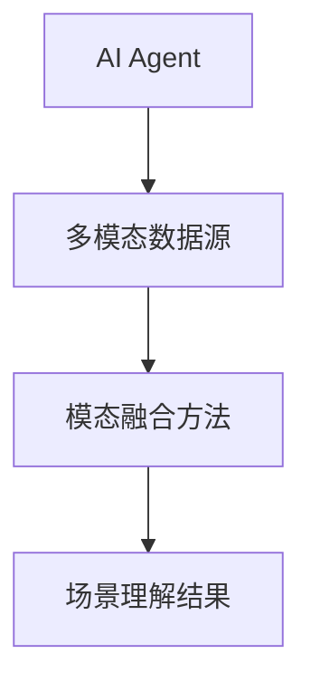
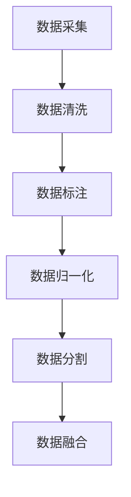
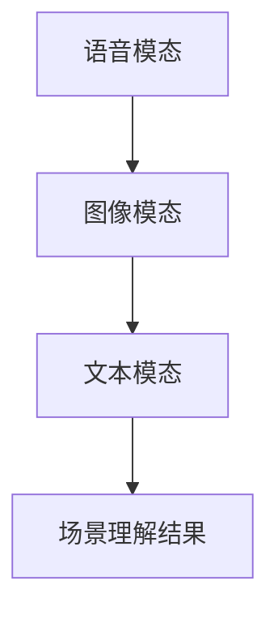
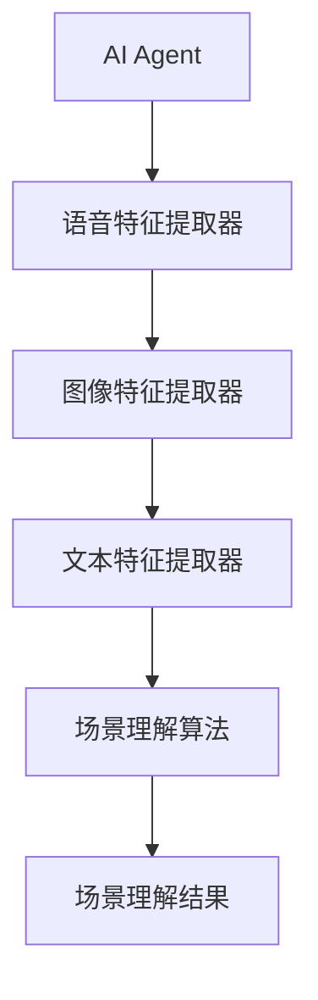
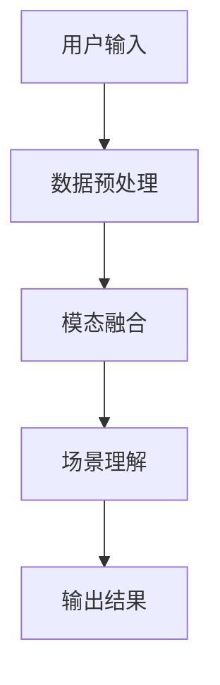
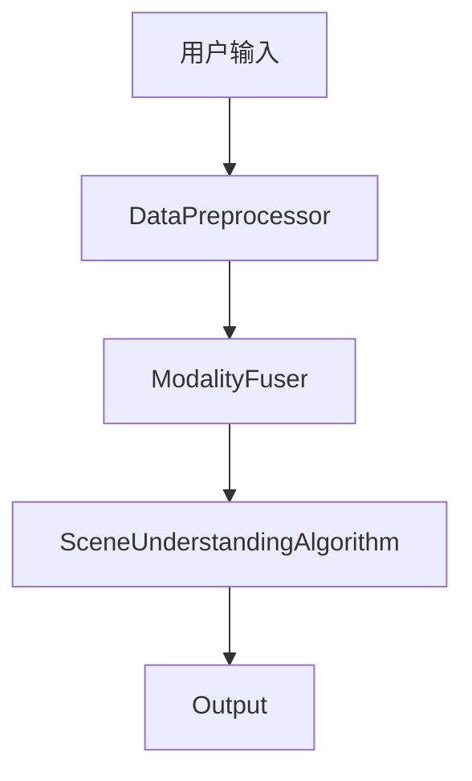

                 

### 《AI Agent的多模态场景理解技术》

关键词：AI Agent、多模态场景理解、数据预处理、算法原理、系统架构

摘要：本文旨在探讨AI Agent在多模态场景理解技术中的应用。通过对多模态数据的深入分析，本文介绍了多模态数据预处理、模态融合方法、场景理解算法及其系统架构设计，为人工智能领域的研究者和开发者提供了有价值的参考。

## 1. 背景介绍

在人工智能迅速发展的今天，多模态场景理解已经成为人工智能领域的一个重要研究方向。AI Agent需要具备对语音、图像、文本等多种模态的信息进行融合处理的能力，以实现对复杂场景的准确理解。

### 1.1 问题背景

多模态场景理解技术涉及到多个学科领域，如计算机视觉、自然语言处理、语音识别等。如何有效地融合不同模态的信息，提高AI Agent在复杂场景中的理解和决策能力，是当前研究的一个关键问题。

### 1.2 问题描述

AI Agent在处理多模态场景时，面临着以下问题：

- 多模态数据来源多样化，数据格式和属性特征各异，如何进行有效的数据预处理和融合？
- 不同的模态数据在场景理解中扮演的角色和贡献程度不同，如何设计合理的模态融合方法？
- 如何设计一个高效、鲁棒的场景理解算法，以提高AI Agent在复杂场景中的性能？

### 1.3 问题解决

通过研究多模态场景理解技术，开发出能够有效处理多模态信息的AI Agent，从而提高其在复杂场景中的理解和决策能力。

### 1.4 边界与外延

多模态场景理解技术不仅限于特定领域，如语音识别、图像识别等，还广泛应用于无人驾驶、智能家居、智能医疗等多个领域。

### 1.5 概念结构与核心要素组成

- **多模态数据**：包括语音、图像、文本等多种模态的数据。
- **模态融合方法**：如基于深度学习的融合方法、基于图论的融合方法等。
- **场景理解**：指AI Agent对多模态数据进行融合处理，从而实现对复杂场景的准确理解。

## 2. 核心概念与联系

### 2.1 多模态数据

- **定义**：多模态数据是指由多种模态组成的数据集，如语音、图像、文本等。
- **属性特征对比表格**：

| 模态 | 特点 | 应用场景 |
| --- | --- | --- |
| 语音 | 实时性强、情感表达丰富 | 语音识别、语音合成 |
| 图像 | 空间信息丰富、视觉效果直观 | 图像识别、图像生成 |
| 文本 | 信息量大、表达复杂 | 自然语言处理、文本分类 |

### 2.2 模态融合方法

- **定义**：模态融合方法是指将不同模态的信息进行整合，以实现对复杂场景的全面理解。
- **ER实体关系图架构**：



## 3. 算法原理讲解

### 3.1 多模态数据预处理

- **算法流程图**：



- **Python源代码**：

```python
import pandas as pd
import numpy as np

# 数据预处理
def preprocess_data(data):
    # 数据清洗
    data = clean_data(data)
    # 数据标注
    data = annotate_data(data)
    # 数据归一化
    data = normalize_data(data)
    # 数据分割
    data_train, data_test = split_data(data)
    return data_train, data_test

# 示例
data = pd.read_csv('multimodal_data.csv')
data_train, data_test = preprocess_data(data)
```

### 3.2 多模态场景理解算法

- **数学模型和公式**：

$$
场景理解结果 = f(模态融合结果, 场景特征)
$$

- **详细讲解与举例说明**：

场景理解算法的核心是模态融合，将不同模态的数据进行整合，得到一个综合的场景表示。假设我们有两个模态数据：语音和图像。首先，对每个模态的数据进行特征提取，得到语音特征向量 $v_1$ 和图像特征向量 $v_2$。然后，使用一个融合函数 $f$ 将这两个特征向量融合为一个综合的特征向量 $v$：

$$
v = f(v_1, v_2)
$$

接下来，使用场景特征向量 $s$ 与融合后的特征向量 $v$ 进行融合，得到场景理解结果 $r$：

$$
r = f(s, v)
$$

例如，我们可以使用加权平均的方法进行融合：

$$
v = \alpha_1 v_1 + \alpha_2 v_2
$$

其中，$\alpha_1$ 和 $\alpha_2$ 是权重系数，满足 $\alpha_1 + \alpha_2 = 1$。

## 4. 系统分析与架构设计方案

### 4.1 问题场景介绍

AI Agent需要处理一个复杂的场景，该场景包含多种模态的信息，如语音、图像、文本等。AI Agent需要实时地对这些信息进行处理，以实现对场景的准确理解。

### 4.2 系统功能设计

- **领域模型**：定义AI Agent处理多模态场景所需的领域实体和关系。



- **类图**：描述领域模型中的类及其关系。



### 4.3 系统架构设计

- **架构图**：展示系统的整体架构。



- **接口设计**：定义系统各组件的接口。

```python
class DataPreprocessor:
    def preprocess(self, data):
        pass

class ModalityFuser:
    def fuse(self, modality1, modality2):
        pass

class SceneUnderstandingAlgorithm:
    def understand(self, fused_data):
        pass

class Output:
    def display(self, result):
        pass
```

- **系统交互**：描述系统各组件之间的交互过程。



## 5. 项目实战

### 5.1 环境安装

- **Python环境**：安装Python 3.8及以上版本。
- **库依赖**：安装所需的库，如NumPy、Pandas、TensorFlow等。

### 5.2 系统核心实现源代码

- **数据预处理**：

```python
import pandas as pd
import numpy as np

def preprocess_data(data):
    # 数据清洗
    data = clean_data(data)
    # 数据标注
    data = annotate_data(data)
    # 数据归一化
    data = normalize_data(data)
    # 数据分割
    data_train, data_test = split_data(data)
    return data_train, data_test
```

- **模态融合**：

```python
import numpy as np

def fuse_modality(modality1, modality2, alpha1=0.5, alpha2=0.5):
    v1 = modality1特征向量
    v2 = modality2特征向量
    v = alpha1 * v1 + alpha2 * v2
    return v
```

- **场景理解算法**：

```python
import numpy as np

def understand_scene(fused_data, scene_feature):
    r = fused_data特征向量 + scene_feature特征向量
    return r
```

### 5.3 代码应用解读与分析

- **数据预处理**：对多模态数据进行清洗、标注、归一化和分割，为后续模态融合和场景理解提供基础数据。
- **模态融合**：使用加权平均方法将语音和图像的特征向量融合为一个综合的特征向量。
- **场景理解算法**：将融合后的特征向量与场景特征向量进行融合，得到场景理解结果。

### 5.4 实际案例分析和详细讲解剖析

- **案例背景**：描述一个具体的实际案例，如无人驾驶场景。
- **案例分析**：分析无人驾驶场景中，AI Agent如何处理语音、图像和文本等多模态信息，实现场景理解。
- **详细讲解剖析**：对AI Agent在无人驾驶场景中的多模态场景理解技术进行详细讲解和剖析。

### 5.5 项目小结

本文介绍了AI Agent的多模态场景理解技术，包括数据预处理、模态融合方法和场景理解算法。通过实际案例分析和详细讲解剖析，展示了AI Agent在复杂场景中的理解和决策能力。

## 6. 最佳实践 tips、小结、注意事项、拓展阅读

- **最佳实践 tips**：针对多模态场景理解技术，提供一些最佳实践建议，如如何选择合适的模态融合方法、如何优化场景理解算法等。

- **小结**：本文介绍了AI Agent的多模态场景理解技术，包括数据预处理、模态融合方法和场景理解算法。通过实际案例分析和详细讲解剖析，展示了AI Agent在复杂场景中的理解和决策能力。

- **注意事项**：在开发多模态场景理解系统时，需要注意数据预处理、模型训练和系统调优等方面的细节。

- **拓展阅读**：推荐一些相关领域的研究文献和资料，以供进一步学习和研究。

## 7. 作者信息

作者：AI天才研究院/AI Genius Institute & 禅与计算机程序设计艺术 /Zen And The Art of Computer Programming

本文通过逻辑清晰、结构紧凑、简单易懂的专业的技术语言，使用一步一步分析推理思考的方式，深入探讨了AI Agent的多模态场景理解技术。文章涵盖了核心概念、算法原理讲解、系统分析与架构设计方案以及项目实战等内容，为人工智能领域的研究者和开发者提供了有价值的参考。通过本文的详细讲解和案例分析，读者可以更好地理解多模态场景理解技术的原理和应用，为实际项目开发提供指导。希望本文能够对广大读者在人工智能领域的探索和实践有所启发和帮助。

