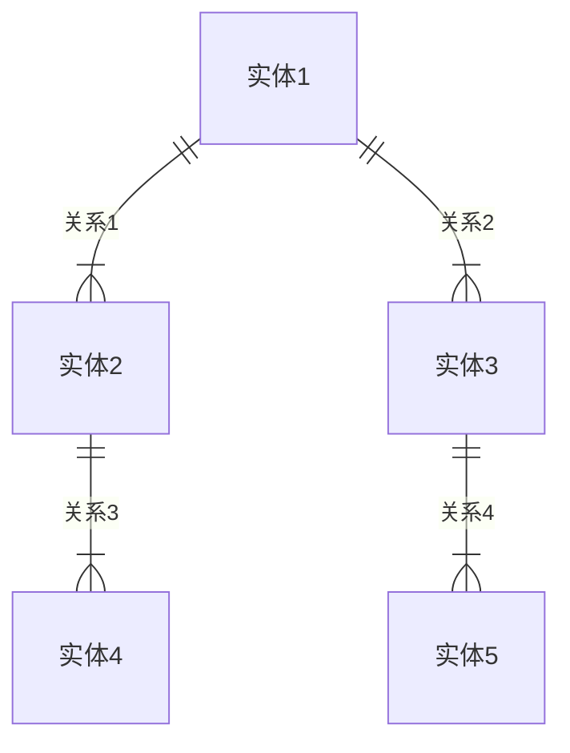

                 

### 引言

#### 1.1 问题背景与研究意义

人工智能（AI）作为一种前沿技术，正日益改变着我们的生活方式。AI Agent，即人工智能代理，是AI的一个重要应用领域。AI Agent是能够自主执行任务、与人类交互并适应环境变化的智能实体。随着AI技术的不断发展，AI Agent的应用场景也在不断扩展，从简单的自动化任务到复杂的智能决策和交互，无所不在。

多模态场景生成与编辑是AI Agent中一个关键的研究方向。多模态场景生成指的是通过多种感官数据的结合，生成符合特定任务需求的环境场景。这些感官数据可以包括视觉、文本、声音、触觉等多种形式。而多模态场景编辑则是在已生成的场景基础上，进行修改和优化，以满足特定的交互需求。

多模态场景生成与编辑的研究意义主要体现在以下几个方面：

1. **提高AI Agent的智能化水平**：通过多模态场景生成与编辑，AI Agent能够更好地理解复杂环境，提高其智能决策和交互能力。
2. **丰富用户体验**：在虚拟现实（VR）、增强现实（AR）等应用中，多模态场景生成与编辑可以为用户提供更加沉浸式和个性化的体验。
3. **拓展应用领域**：多模态场景生成与编辑技术可以应用于自动驾驶、智能交互、智能家居等多个领域，为这些领域的发展提供技术支持。

本文旨在系统地探讨AI Agent的多模态场景生成与编辑技术，从基础概念、算法原理到实际应用，全面梳理该领域的研究进展和应用前景。首先，我们将介绍多模态数据的分类和场景生成与编辑的关键技术，然后分析国内外的研究现状和趋势。接下来，文章将详细讨论多模态场景生成与编辑的具体算法，包括基于生成模型和强化学习的方法。随后，我们将介绍多模态场景生成与编辑系统的设计与实现，并探讨其在不同应用场景中的实际应用。最后，文章将总结研究成果，提出存在的问题和未来研究方向。

通过这篇文章，读者可以系统地了解AI Agent的多模态场景生成与编辑技术，掌握其核心原理和应用方法，为后续研究和技术开发提供参考。

### 1.2 相关概念与定义

#### 多模态数据的分类

多模态数据是指包含多种类型数据的集合，这些数据可以通过不同的感官感知，如视觉、文本、声音、触觉等。每种类型的数据都有其独特的特点和表现形式。

1. **视觉数据**：视觉数据主要通过图像和视频形式传递，是AI Agent理解环境的重要信息来源。图像可以包含丰富的视觉特征，如颜色、纹理、形状等；视频则可以提供动态的时空信息。

2. **文本数据**：文本数据是通过语言表达的信息，包括自然语言文本、标记语言等。文本数据可以传达复杂的语义信息，是理解和处理人类语言的基础。

3. **声音数据**：声音数据包括语音、音乐等，通过音频信号传递。声音数据可以用于语音识别、情感分析等应用，能够提供丰富的情感和上下文信息。

4. **触觉数据**：触觉数据是通过触觉传感器获取的，可以反映物体的硬度、温度、表面纹理等物理属性。触觉数据在虚拟现实和机器人应用中尤为重要，能够提供更加真实的交互体验。

#### 场景生成与编辑的关键技术

多模态场景生成与编辑技术涉及多个核心方面，包括数据获取与预处理、场景生成算法、场景编辑算法等。

1. **数据获取与预处理**：多模态数据获取是场景生成的基础。数据获取包括传感器数据的采集、数据同步和格式转换等。预处理包括数据清洗、归一化、增强和特征提取等步骤，目的是提高数据的可用性和质量。

2. **场景生成算法**：场景生成算法负责根据给定的任务需求和输入数据生成相应的场景。常见的生成算法包括基于规则的方法、生成对抗网络（GANs）、变分自编码器（VAEs）和强化学习等方法。这些算法通过模型训练和学习，自动生成符合需求的多模态场景。

3. **场景编辑算法**：场景编辑算法是在已生成的场景基础上，进行修改和优化，以满足特定交互需求。编辑算法包括基于规则的方法、生成对抗网络和强化学习等方法。通过编辑算法，可以调整场景中的各种元素，如物体的位置、颜色、动作等，以实现更丰富的交互体验。

#### 概念属性特征对比表格

为了更直观地理解多模态数据的分类和生成与编辑的关键技术，我们可以通过以下表格进行对比：

| 概念 | 定义 | 特点 | 作用 |
| :---: | :---: | :---: | :---: |
| 视觉数据 | 通过图像和视频形式传递的信息 | 丰富的视觉特征，动态的时空信息 | 理解环境，生成场景 |
| 文本数据 | 通过语言表达的信息 | 传达复杂的语义信息 | 理解和处理语言 |
| 声音数据 | 通过音频信号传递的信息 | 提供丰富的情感和上下文信息 | 语音识别，情感分析 |
| 触觉数据 | 通过触觉传感器获取的信息 | 反映物体的物理属性 | 提供真实的交互体验 |

通过上述对比，我们可以看出，不同类型的多模态数据在AI Agent的应用中发挥着各自独特的作用，共同构成了一个完整的多模态场景。

#### ER实体关系图架构

为了更好地理解多模态场景生成与编辑的架构，我们可以通过ER（实体-关系）图来描述不同实体之间的关系。

在这个ER图中，实体1代表多模态数据，实体2、3、4、5分别代表视觉数据、文本数据、声音数据和触觉数据。它们之间通过不同的关系（如生成、编辑、交互等）相互连接，构成了一个完整的多模态场景生成与编辑系统。

通过上述概念和定义的介绍，我们可以对多模态场景生成与编辑技术有一个基本的理解。接下来的章节将深入探讨这些技术的具体实现方法和应用案例，帮助读者全面掌握这一领域。

#### 1.3 研究现状与趋势

多模态场景生成与编辑技术作为人工智能（AI）领域的一个重要研究方向，近年来受到了广泛关注。从国内外的研究现状来看，这一领域已经取得了一系列重要的成果，但也面临着诸多挑战。

##### 国内外研究现状

1. **国外研究现状**：
   - **美国**：美国在多模态数据处理和生成方面处于领先地位。例如，Google Brain和OpenAI等知名研究机构在生成对抗网络（GANs）和变分自编码器（VAEs）等生成模型方面进行了大量研究，并取得了显著成果。
   - **欧洲**：欧洲的研究主要集中在多模态数据的融合和实时处理上。例如，欧洲的几个顶尖大学和研究机构，如卡耐基梅隆大学和苏黎世联邦理工学院，在多模态交互系统和智能环境建模方面进行了深入探讨。
   - **亚洲**：亚洲，特别是中国和日本，在多模态场景生成与编辑技术的研究中也取得了重要进展。中国的清华大学、北京大学等高校，以及日本的东京工业大学等，都在这一领域开展了大量研究工作。

2. **国内研究现状**：
   - **高校与科研机构**：国内的清华大学、北京大学、浙江大学等高校在多模态数据处理和生成方面进行了深入研究，并取得了一系列重要研究成果。
   - **企业应用**：国内的一些大型科技企业，如阿里巴巴、百度和腾讯，也在多模态场景生成与编辑技术方面进行了探索，并成功应用于虚拟现实、智能交互等实际场景。

##### 技术发展趋势

1. **深度学习与生成模型的应用**：随着深度学习技术的发展，生成模型如GANs和VAEs在多模态场景生成与编辑中的应用越来越广泛。这些模型能够通过训练自动生成高质量的多模态场景，为AI Agent提供更丰富的交互体验。

2. **多模态数据融合**：多模态数据的融合是提高场景生成与编辑效果的关键。未来，研究人员将致力于开发更加高效的多模态数据融合算法，以充分利用不同类型数据的信息，提升生成与编辑的精度和效率。

3. **强化学习与交互优化**：强化学习技术在多模态场景编辑中的应用前景广阔。通过强化学习，AI Agent可以更好地适应复杂环境，优化场景编辑过程，提供更高质量的交互体验。

4. **实时性与可扩展性**：随着AI应用场景的扩大，对多模态场景生成与编辑技术的实时性和可扩展性提出了更高要求。未来，研究人员将致力于开发更加高效和可扩展的算法，以满足实际应用的需求。

##### 应用前景

1. **虚拟现实与增强现实**：多模态场景生成与编辑技术可以大幅提升虚拟现实和增强现实的应用体验，为用户提供更加沉浸式和个性化的交互体验。

2. **自动驾驶**：在自动驾驶领域，多模态场景生成与编辑技术可以帮助自动驾驶系统更好地理解和应对复杂交通环境，提高行车安全性和可靠性。

3. **智能交互**：在智能交互领域，多模态场景生成与编辑技术可以优化人机交互体验，提高智能设备的自然交互能力。

4. **智能家居**：在智能家居领域，多模态场景生成与编辑技术可以提升家居设备的智能化水平，为用户提供更加便捷和舒适的居住环境。

总之，多模态场景生成与编辑技术在人工智能领域具有广泛的应用前景。随着技术的不断发展和应用的深入，这一领域有望在虚拟现实、自动驾驶、智能交互和智能家居等多个领域发挥重要作用，推动AI技术的发展和进步。

#### 1.4 本书结构安排

本文将系统地介绍AI Agent的多模态场景生成与编辑技术，内容分为七个主要章节。

**第1章 引言**：首先介绍了AI Agent的定义、发展历程以及多模态场景生成与编辑的研究意义。

**第2章 多模态数据获取与预处理**：详细讨论了多模态数据的来源、预处理技术以及多模态数据融合的方法。

**第3章 多模态场景生成算法**：介绍了基于生成模型和强化学习的多模态场景生成算法，包括GANs、VAEs和DRL等。

**第4章 多模态场景编辑算法**：探讨了基于规则、生成模型和强化学习的多模态场景编辑算法，并分析了各种算法的实现方法。

**第5章 多模态场景生成与编辑系统设计与实现**：介绍了多模态场景生成与编辑系统的设计原则、架构以及实现技术。

**第6章 应用场景与案例分析**：讨论了多模态场景生成与编辑技术在虚拟现实、智能交互和自动驾驶等应用领域的实际案例。

**第7章 总结与展望**：总结了本文的研究成果，分析了存在的问题和未来研究方向。

通过以上七个章节的详细探讨，本文旨在全面梳理AI Agent的多模态场景生成与编辑技术，为后续研究和应用提供参考。

### 第2章 多模态数据获取与预处理

多模态数据获取与预处理是AI Agent多模态场景生成与编辑技术的核心环节，直接影响最终场景生成的质量和编辑的效果。本章将详细介绍多模态数据的来源、预处理技术以及多模态数据融合的方法，并通过实际实例进行分析。

#### 2.1 多模态数据来源

多模态数据来源于多种不同的传感器和数据源，这些数据源包括但不限于以下几种：

1. **视觉数据**：视觉数据主要通过摄像头或视频传感器获取。这些数据可以包含静态图像和动态视频，是AI Agent理解和交互环境的重要信息来源。例如，在自动驾驶系统中，摄像头可以捕获车辆周围的道路、行人和障碍物等信息。

2. **文本数据**：文本数据通过自然语言处理（NLP）技术获取，可以是用户输入的文本、标记语言等。文本数据可以传达复杂的语义信息，对于理解和处理人类语言至关重要。例如，在智能客服系统中，文本数据可以用于理解和回应用户的问题。

3. **声音数据**：声音数据通过麦克风或音频传感器获取，包括语音、音乐等。声音数据可以用于语音识别、情感分析等应用。例如，在语音助手系统中，麦克风可以捕获用户的语音指令，进行语音识别和执行相应的操作。

4. **触觉数据**：触觉数据通过触觉传感器获取，反映物体的硬度、温度、表面纹理等物理属性。触觉数据在虚拟现实和机器人应用中尤为重要，可以提供更加真实的交互体验。例如，在虚拟现实游戏中，触觉传感器可以模拟物体的触感，提高用户的沉浸感。

#### 2.2 数据预处理技术

数据预处理是确保多模态数据质量的重要步骤，包括数据清洗、归一化、增强和特征提取等。

1. **数据清洗**：数据清洗是去除噪声和异常值的过程。对于多模态数据，可能存在图像中的噪点、文本中的错别字、声音中的杂音等问题。数据清洗可以有效提高数据的质量，减少后续处理的误差。

2. **数据归一化**：数据归一化是将不同类型和范围的数据转换到同一尺度，以便更好地进行比较和融合。例如，将图像的像素值归一化到[0, 1]之间，将声音信号的幅度归一化到合适的范围。

3. **数据增强**：数据增强是通过增加数据多样性来提高模型的泛化能力。常见的数据增强方法包括图像的旋转、翻转、裁剪等，以及声音的加噪、速度变化等。数据增强可以扩充训练数据集，提高模型的鲁棒性和泛化能力。

4. **特征提取**：特征提取是从原始数据中提取具有区分性的特征，用于后续的模型训练和场景生成。对于视觉数据，常见的特征提取方法包括卷积神经网络（CNN）的提取层；对于文本数据，常用的方法包括词袋模型（Bag of Words）、词嵌入（Word Embedding）等；对于声音数据，常用的方法包括梅尔频率倒谱系数（MFCC）等。

#### 2.3 多模态数据融合

多模态数据融合是将不同类型的数据进行有效整合，以充分利用各自的信息，提高场景生成与编辑的效果。常见的多模态数据融合方法包括以下几种：

1. **特征级融合**：在特征级融合中，不同类型的数据特征在低维空间中进行整合。这种方法包括向量拼接、特征加权等。向量拼接是将不同类型的数据特征拼接成一个高维特征向量；特征加权是通过学习加权系数，对各个特征的贡献进行加权。

2. **决策级融合**：在决策级融合中，不同类型的数据在不同层级的决策过程中进行融合。这种方法包括集成学习方法、多任务学习等。集成学习方法通过多个模型的集成，提高预测的准确性；多任务学习通过同时学习多个任务，提高模型的泛化能力。

3. **模型级融合**：在模型级融合中，不同类型的模型进行集成，以实现更复杂的多模态数据处理。例如，可以结合视觉模型和语言模型，生成更加准确和丰富的多模态场景。

#### 2.4 实例分析

以虚拟现实游戏中的角色生成为例，说明多模态数据的获取与预处理过程。

1. **数据获取**：
   - 视觉数据：通过摄像头获取角色的图像数据。
   - 文本数据：通过自然语言处理技术获取角色描述文本。
   - 声音数据：通过麦克风获取角色的语音数据。
   - 触觉数据：通过触觉传感器获取角色的触感数据。

2. **数据预处理**：
   - 视觉数据：对图像进行去噪、裁剪、归一化等处理，提取图像特征。
   - 文本数据：对文本进行分词、词嵌入等处理，提取文本特征。
   - 声音数据：对声音进行去噪、归一化等处理，提取声音特征。
   - 触觉数据：对触觉数据进行归一化处理，提取触觉特征。

3. **多模态数据融合**：
   - 采用特征级融合方法，将视觉、文本、声音和触觉特征拼接成一个高维特征向量。
   - 采用决策级融合方法，结合不同类型的数据特征，进行角色生成和编辑。

通过上述实例，我们可以看到，多模态数据的获取与预处理过程是复杂而关键的。有效的数据预处理和多模态数据融合方法，能够提高虚拟现实游戏中的角色生成质量和用户体验。

本章详细介绍了多模态数据的获取与预处理技术，包括数据来源、预处理方法以及多模态数据融合的方法。通过实例分析，读者可以更好地理解这些技术在实际应用中的作用和实现方法。在接下来的章节中，我们将进一步探讨多模态场景生成与编辑的算法原理和系统实现，为读者提供更全面的了解。

### 第3章 多模态场景生成算法

多模态场景生成是AI Agent技术中的一个核心研究方向，其目标是通过多种感官数据的结合，生成符合特定任务需求的环境场景。本章将介绍多模态场景生成算法，重点讨论基于生成模型和强化学习的方法，并分析各种算法的基本原理和应用。

#### 3.1 场景生成算法概述

多模态场景生成算法可以大致分为以下几类：

1. **基于规则的方法**：这种方法通过预定义的规则和模板生成场景。虽然规则方法简单直观，但灵活性较差，难以应对复杂和多变的环境。
2. **基于生成模型的方法**：生成模型如生成对抗网络（GANs）和变分自编码器（VAEs）等，通过学习数据分布生成新的场景。这些方法具有较强的灵活性和创造力。
3. **基于强化学习的方法**：强化学习方法通过与环境交互，学习最优的生成策略，从而生成符合特定需求的场景。这种方法能够适应动态变化的场景，但计算成本较高。

在本章中，我们将重点讨论基于生成模型和强化学习的方法。

#### 3.2 基于生成模型的方法

1. **生成对抗网络（GANs）**：
   - **基本原理**：GANs由生成器（Generator）和判别器（Discriminator）组成。生成器从随机噪声中生成数据，判别器判断生成的数据是否真实。通过训练，生成器试图生成更逼真的数据，而判别器则不断提高对真实数据的识别能力。
   - **数学模型**：
     \[
     \begin{aligned}
     G(z) &= \text{生成器，将噪声向量 } z \text{ 转换为数据 } x \\
     D(x) &= \text{判别器，判断数据 } x \text{ 是否真实} \\
     \end{aligned}
     \]
   - **实例说明**：例如，在图像生成中，生成器生成一张图像，判别器判断这张图像是否由真实数据生成。通过反复迭代训练，生成器可以生成越来越逼真的图像。

2. **变分自编码器（VAEs）**：
   - **基本原理**：VAEs通过引入变分自编码器（VAE）结构，将数据映射到一个潜在空间，从而生成新的数据。VAE包含编码器和解码器，编码器将数据映射到潜在空间，解码器从潜在空间生成新的数据。
   - **数学模型**：
     \[
     \begin{aligned}
     q_\phi(z|x) &= \text{编码器，将数据 } x \text{ 映射到潜在空间 } z \\
     p_\theta(x|z) &= \text{解码器，从潜在空间 } z \text{ 生成数据 } x \\
     \end{aligned}
     \]
   - **实例说明**：例如，在图像生成中，编码器将图像映射到潜在空间，解码器从潜在空间生成新的图像。通过训练，解码器可以生成与原始图像相似的新图像。

3. **其他生成模型**：
   - **生成流模型**（Generative Flow Models）如Normalizing Flows，通过复杂的映射函数将数据从简单空间转换到复杂空间，生成高质量的数据。
   - **变分自编码器的扩展**，如深度变分自编码器（Deep Variational Autoencoders, DVAEs）和条件变分自编码器（Conditional Variational Autoencoders, CVAEs），可以更好地处理条件数据。

#### 3.3 基于强化学习的方法

1. **深度强化学习（Deep Reinforcement Learning, DRL）**：
   - **基本原理**：DRL结合了深度学习和强化学习，使用深度神经网络来近似价值函数或策略。DRL通过与环境交互，学习最优的动作策略，从而生成符合特定需求的场景。
   - **数学模型**：
     \[
     \begin{aligned}
     Q^{\pi}(s, a) &= \sum_{s' \in S} r(s, a, s') + \gamma \sum_{s' \in S} \pi(a'|s') Q^{\pi}(s', a') \\
     \pi(a|s) &= \frac{e^{Q(s, a)}}{\sum_{a' \in A} e^{Q(s, a')}}
     \end{aligned}
     \]
   - **实例说明**：例如，在虚拟现实场景生成中，DRL可以学习生成特定类型的环境，如城市街道或室内空间。通过不断与环境交互，生成器可以生成越来越符合需求的环境场景。

2. **递归神经网络（Recurrent Neural Networks, RNN）**：
   - **基本原理**：RNN通过记忆机制处理序列数据，适用于生成时序依赖较强的场景。RNN可以学习场景生成的时序规律，生成连续的时序数据。
   - **数学模型**：
     \[
     h_t = \sigma(W_h \cdot [h_{t-1}, x_t] + b_h)
     \]
   - **实例说明**：例如，在视频场景生成中，RNN可以处理视频帧的序列信息，生成连续的视频场景。

3. **其他强化学习方法**：
   - **强化学习与生成模型的结合**，如生成对抗强化学习（Generative Adversarial Reinforcement Learning, GARL），通过GAN和强化学习相结合，生成符合目标场景的数据。
   - **策略梯度方法**（Policy Gradient Methods），如演员-评论家方法（Actor-Critic Method），通过学习策略参数，生成符合需求的数据。

通过以上对基于生成模型和强化学习的方法的介绍，我们可以看到，这些算法在多模态场景生成中发挥了重要作用。它们能够生成高质量、多样性的场景，为AI Agent提供了强大的场景生成能力。在接下来的章节中，我们将进一步探讨这些算法的实现和实际应用。

### 第4章 多模态场景编辑算法

多模态场景编辑是AI Agent技术中的一个重要研究方向，其目标是在已生成的多模态场景基础上进行修改和优化，以满足特定的交互需求。本章将介绍多模态场景编辑算法，包括基于规则、生成模型和强化学习的方法，并分析各种算法的基本原理和应用。

#### 4.1 场景编辑算法概述

多模态场景编辑算法旨在对生成后的场景进行修改和优化，以满足特定的任务需求。常见的场景编辑算法可以分为以下几类：

1. **基于规则的方法**：这种方法通过预定义的规则和模板对场景进行编辑。虽然规则方法简单直观，但灵活性较差，难以应对复杂和多变的环境。
2. **基于生成模型的方法**：生成模型如生成对抗网络（GANs）和变分自编码器（VAEs）等，通过学习数据分布进行场景编辑。这些方法具有较强的灵活性和创造力。
3. **基于强化学习的方法**：强化学习方法通过与环境交互，学习最优的编辑策略，从而优化场景。这种方法能够适应动态变化的场景，但计算成本较高。

在本章中，我们将重点讨论基于规则、生成模型和强化学习的方法。

#### 4.2 基于规则的方法

1. **规则编辑模型**：
   - **基本原理**：规则编辑模型通过预定义的规则对场景进行编辑。规则可以是简单的逻辑表达式，也可以是复杂的决策树或神经网络。规则编辑模型通常将场景表示为一组属性和规则，通过匹配和修改规则，实现场景的编辑。
   - **数学模型**：
     \[
     \text{Rule}(x) = \begin{cases} 
     \text{applyRule}(x) & \text{if } x \text{ matches the rule} \\
     x & \text{otherwise}
     \end{cases}
     \]
   - **实例说明**：例如，在虚拟现实场景中，规则编辑模型可以定义一组规则来修改物体的颜色、位置或动作。通过匹配这些规则，场景编辑器可以自动修改场景中的相应元素。

2. **规则生成算法**：
   - **基本原理**：规则生成算法通过学习数据分布生成新的规则。这些规则可以用于场景编辑，提高编辑的灵活性和多样性。
   - **数学模型**：
     \[
     \text{generateRule}(z) = \text{learn}(z, \text{data})
     \]
   - **实例说明**：例如，在自然语言处理中，规则生成算法可以生成用于文本编辑的规则，如“将名词替换为动词”或“增加形容词描述”。这些规则可以应用于场景编辑，提高场景的丰富性和表达能力。

#### 4.3 基于生成模型的方法

1. **生成对抗网络（GANs）的编辑原理**：
   - **基本原理**：GANs通过生成器和判别器的对抗训练，生成高质量的数据。生成器从随机噪声中生成场景数据，判别器判断生成数据的真实性。GANs可以用于场景编辑，通过生成器修改场景中的元素。
   - **数学模型**：
     \[
     \begin{aligned}
     G(z) &= \text{生成器，将噪声 } z \text{ 转换为场景数据 } x \\
     D(x) &= \text{判别器，判断场景数据 } x \text{ 是否真实}
     \end{aligned}
     \]
   - **实例说明**：例如，在虚拟现实场景编辑中，生成器可以生成新的场景元素，如植物、建筑物等，判别器判断这些元素的逼真度。通过迭代训练，生成器可以生成越来越符合需求的新元素，用于场景编辑。

2. **变分自编码器（VAEs）的编辑原理**：
   - **基本原理**：VAEs通过编码器和解码器将场景数据映射到潜在空间，从而实现场景的编辑。编码器将场景数据映射到潜在空间，解码器从潜在空间生成新的场景数据。
   - **数学模型**：
     \[
     \begin{aligned}
     q_\phi(z|x) &= \text{编码器，将场景数据 } x \text{ 映射到潜在空间 } z \\
     p_\theta(x|z) &= \text{解码器，从潜在空间 } z \text{ 生成新的场景数据 } x
     \end{aligned}
     \]
   - **实例说明**：例如，在图像编辑中，编码器将图像映射到潜在空间，解码器从潜在空间生成新的图像。通过训练，解码器可以生成与原始图像相似的图像，用于场景编辑。

3. **其他生成模型**：
   - **生成流模型**（Generative Flow Models）如Normalizing Flows，通过复杂的映射函数实现场景编辑，生成高质量的数据。
   - **变分自编码器的扩展**，如深度变分自编码器（Deep Variational Autoencoders, DVAEs）和条件变分自编码器（Conditional Variational Autoencoders, CVAEs），可以更好地处理条件数据，实现更复杂的场景编辑。

#### 4.4 基于强化学习的方法

1. **强化学习编辑算法**：
   - **基本原理**：强化学习编辑算法通过与环境交互，学习最优的编辑策略，从而优化场景。强化学习模型可以处理复杂的环境和动态变化的场景，实现高效的场景编辑。
   - **数学模型**：
     \[
     \begin{aligned}
     Q^{\pi}(s, a) &= \sum_{s' \in S} r(s, a, s') + \gamma \sum_{s' \in S} \pi(a'|s') Q^{\pi}(s', a') \\
     \pi(a|s) &= \frac{e^{Q(s, a)}}{\sum_{a' \in A} e^{Q(s, a')}}
     \end{aligned}
     \]
   - **实例说明**：例如，在虚拟现实场景编辑中，强化学习算法可以学习最优的编辑策略，通过与环境交互，不断优化场景中的元素布局和视觉效果。

2. **Q-Learning算法应用**：
   - **基本原理**：Q-Learning是一种值函数方法，通过学习状态-动作值函数，实现最优策略的迭代更新。Q-Learning适用于静态和动态环境，可以应用于场景编辑中。
   - **数学模型**：
     \[
     Q(s, a) = r(s, a, s') + \gamma \max_{a'} Q(s', a')
     \]
   - **实例说明**：例如，在图像编辑中，Q-Learning算法可以学习图像编辑的最优策略，通过与环境交互，逐步优化图像的亮度和对比度。

通过以上对基于规则、生成模型和强化学习的方法的介绍，我们可以看到，这些算法在多模态场景编辑中发挥了重要作用。基于规则的方法提供了直观和易于实现的编辑方法，生成模型方法通过学习数据分布，实现了高质量和多样性的编辑，强化学习方法通过与环境交互，实现了自适应和动态的编辑。在接下来的章节中，我们将进一步探讨这些算法的实现和实际应用。

### 第5章 多模态场景生成与编辑系统设计与实现

多模态场景生成与编辑系统的设计与实现是AI Agent技术落地应用的重要环节。本章将详细阐述多模态场景生成与编辑系统的设计原则、架构，以及系统实现过程中的关键技术和集成方法。

#### 5.1 系统设计原则与架构

多模态场景生成与编辑系统的设计应遵循以下原则：

1. **模块化**：系统应采用模块化设计，将不同的功能模块分离，便于系统的扩展和维护。
2. **可扩展性**：系统应具备良好的可扩展性，能够根据不同应用需求，灵活添加或替换模块。
3. **灵活性**：系统应支持多种多模态数据的处理和编辑方法，提供灵活的编辑策略和工具。
4. **实时性**：系统应具备较高的实时性，能够快速响应用户操作和场景变化。

系统的整体架构可以分为以下几部分：

1. **数据输入模块**：负责采集和处理多种模态的数据，如视觉、文本、声音和触觉数据。
2. **预处理模块**：对输入数据进行清洗、归一化、增强和特征提取等预处理操作。
3. **场景生成模块**：利用生成模型生成符合特定任务需求的多模态场景。
4. **场景编辑模块**：对生成的场景进行编辑和优化，以满足特定的交互需求。
5. **用户交互模块**：提供用户界面和交互功能，使用户能够与系统进行交互。
6. **系统输出模块**：将编辑后的场景数据输出到用户终端或应用系统中。

#### 5.2 系统实现技术

在系统实现过程中，采用了一系列关键技术，包括多模态数据获取与预处理、场景生成算法实现、场景编辑算法实现等。

1. **多模态数据获取与预处理**：
   - **数据采集**：使用不同的传感器和接口，如摄像头、麦克风、触觉传感器等，采集多种模态的数据。
   - **数据同步**：确保不同模态的数据在同一时间戳下采集和记录，以保持数据的一致性。
   - **数据清洗**：去除噪声和异常值，保证数据的质量。
   - **数据增强**：通过数据增强方法，提高数据的多样性和泛化能力。

2. **场景生成算法实现**：
   - **生成模型训练**：利用生成模型如GANs和VAEs，对多模态数据集进行训练，生成高质量的场景数据。
   - **生成模型优化**：通过模型调优，提高生成场景的逼真度和多样性。
   - **场景生成接口**：提供统一的接口，用户可以根据需求调用生成模型，生成不同的场景。

3. **场景编辑算法实现**：
   - **编辑模型训练**：利用编辑模型如规则编辑、生成对抗编辑和强化学习编辑等，对场景数据集进行训练，学习最优的编辑策略。
   - **编辑模型优化**：通过模型调优，提高编辑场景的准确性和效率。
   - **编辑接口设计**：提供用户友好的编辑接口，用户可以通过直观的操作界面，对场景进行编辑和优化。

#### 5.3 系统集成与测试

系统集成与测试是确保系统稳定性和性能的关键步骤。以下为系统集成与测试的主要方法：

1. **系统集成方案**：
   - **模块集成**：将不同的功能模块进行集成，确保各个模块之间能够无缝协作。
   - **数据流转**：设计合理的数据流转流程，确保数据能够在模块间高效传输和转换。
   - **接口设计**：定义清晰的接口规范，确保各个模块之间的数据交换和通信。

2. **系统测试方法**：
   - **功能测试**：对系统的各个功能模块进行测试，确保功能实现正确和稳定。
   - **性能测试**：对系统的响应时间、处理能力和稳定性进行测试，确保系统在高负载下依然能够稳定运行。
   - **用户交互测试**：通过用户测试，验证系统的易用性和用户体验。

3. **系统性能评估**：
   - **生成性能**：评估生成模型生成场景的质量和多样性。
   - **编辑性能**：评估编辑模型编辑场景的准确性和效率。
   - **用户体验**：评估系统的用户交互性能和用户满意度。

#### 5.4 实例分析

以虚拟现实场景生成与编辑系统为例，说明系统的实现流程和功能测试。

1. **系统实现流程**：
   - **数据采集**：使用摄像头、麦克风和触觉传感器采集虚拟现实场景中的视觉、声音和触觉数据。
   - **数据预处理**：对采集的数据进行同步、清洗和增强，提取关键特征。
   - **场景生成**：利用GANs和VAEs生成高质量的虚拟现实场景。
   - **场景编辑**：通过规则编辑和强化学习编辑，优化场景中的元素布局和视觉效果。
   - **用户交互**：提供用户界面，用户可以通过界面实时查看和编辑场景。

2. **功能测试**：
   - **生成测试**：测试生成模型生成场景的逼真度和多样性，确保场景能够满足虚拟现实的需求。
   - **编辑测试**：测试编辑模型编辑场景的准确性和效率，确保编辑后的场景能够满足用户的交互需求。
   - **用户体验**：通过用户测试，收集用户对系统的使用体验和建议，进行系统优化。

通过上述实例分析，我们可以看到，多模态场景生成与编辑系统的设计与实现需要综合考虑多种因素，包括数据采集、预处理、生成、编辑和用户交互等。系统的稳定性和性能直接影响到用户体验和应用效果。在接下来的章节中，我们将进一步探讨多模态场景生成与编辑技术在实际应用中的案例分析。

### 第6章 应用场景与案例分析

多模态场景生成与编辑技术在多个领域展现出了广泛的应用前景，为各行业带来了新的解决方案和用户体验。本章将详细介绍多模态场景生成与编辑技术在虚拟现实、智能交互和自动驾驶等应用场景中的实际案例，分析其应用效果和挑战。

#### 6.1 多模态场景生成在虚拟现实中的应用

虚拟现实（VR）是一种通过计算机生成模拟环境，使用户能够沉浸其中进行交互的技术。多模态场景生成在VR中的应用，能够为用户提供更加丰富和沉浸式的体验。

1. **应用概述**：
   - **沉浸感提升**：通过多模态场景生成，VR系统能够生成逼真的视觉、听觉和触觉数据，使用户感受到更加沉浸的场景。
   - **交互体验优化**：多模态场景生成可以实时生成与用户动作和环境反馈匹配的场景，提高用户在VR环境中的互动体验。

2. **案例分析**：
   - **案例1：VR游戏**：以VR游戏为例，多模态场景生成可以实时生成游戏中的环境、角色和障碍物，通过视觉、听觉和触觉数据的结合，提高游戏的沉浸感和互动性。
   - **效果**：通过多模态场景生成，用户可以在游戏中感受到真实的场景变化和互动效果，增强游戏体验。
   - **挑战**：高实时性和高质量的多模态数据生成，对计算资源和算法效率提出了较高要求。

#### 6.2 多模态场景编辑在智能交互中的应用

智能交互系统通过多模态场景编辑，能够实现更加自然和高效的人机交互。

1. **应用概述**：
   - **个性化定制**：多模态场景编辑可以针对不同用户的需求，生成和优化个性化的交互场景。
   - **交互优化**：通过多模态场景编辑，系统能够根据用户的行为和环境变化，动态调整交互场景，提高用户满意度。

2. **案例分析**：
   - **案例1：智能客服**：智能客服系统通过多模态场景编辑，可以根据用户输入的文本、语音和触觉数据，生成个性化的交互场景，提高客服的效率和用户体验。
   - **效果**：多模态场景编辑使得智能客服系统能够更好地理解用户的需求，提供更加准确和及时的回答。
   - **挑战**：多模态数据的实时处理和编辑，对系统的计算能力和算法效率提出了较高要求。

#### 6.3 多模态场景生成与编辑在自动驾驶中的应用

自动驾驶系统通过多模态场景生成与编辑，能够实现对复杂交通环境的准确理解和实时响应。

1. **应用概述**：
   - **环境感知**：多模态场景生成与编辑可以为自动驾驶系统提供高质量的多模态感知数据，提高对周围环境的理解能力。
   - **动态规划**：通过多模态场景编辑，自动驾驶系统可以实时调整行驶策略，应对复杂交通情况。

2. **案例分析**：
   - **案例1：自动驾驶仿真测试**：在自动驾驶仿真测试中，多模态场景生成与编辑可以生成逼真的交通场景，用于测试自动驾驶算法的性能和可靠性。
   - **效果**：通过多模态场景生成与编辑，自动驾驶系统可以更好地识别道路标志、行人和车辆，提高行驶安全性和稳定性。
   - **挑战**：高实时性和高精度的多模态场景生成与编辑，对系统的计算资源和算法准确性提出了极高要求。

#### 6.4 其他应用领域

除了上述三个主要应用领域，多模态场景生成与编辑技术在其他领域也展现出了巨大潜力。

1. **智能家居**：通过多模态场景生成与编辑，智能家居系统可以生成和调整家庭环境的场景，实现更加智能化和个性化的家居体验。
2. **医疗健康**：在医疗健康领域，多模态场景生成与编辑可以为患者提供个性化的健康监测和治疗方案。
3. **教育**：通过多模态场景生成与编辑，教育系统可以生成和调整教学场景，提高学生的学习兴趣和效果。

通过以上案例分析，我们可以看到，多模态场景生成与编辑技术在各个领域展现出了广泛的应用前景。在实际应用中，这些技术不仅提升了系统的智能化水平，也为用户带来了更加丰富和个性化的体验。然而，高实时性、高精度和多模态数据的处理仍然是对这些技术的主要挑战。未来，随着计算能力和算法技术的不断发展，多模态场景生成与编辑技术将在更广泛的应用领域中发挥重要作用。

### 第7章 总结与展望

#### 7.1 研究成果总结

本文系统性地探讨了AI Agent的多模态场景生成与编辑技术，从背景介绍、核心概念、算法原理到实际应用，全面梳理了这一领域的研究进展。主要研究成果包括：

1. **多模态数据获取与预处理技术**：详细介绍了多模态数据的来源、预处理方法以及数据融合技术，为多模态场景生成与编辑奠定了基础。
2. **多模态场景生成算法**：介绍了基于生成模型和强化学习的多种场景生成算法，包括GANs、VAEs、DRL等，展示了这些算法在场景生成中的应用效果。
3. **多模态场景编辑算法**：分析了基于规则、生成模型和强化学习的场景编辑方法，提供了多种编辑算法的实现路径和应用实例。
4. **多模态场景生成与编辑系统的设计与实现**：阐述了多模态场景生成与编辑系统的设计原则、架构和实现技术，为系统开发和应用提供了参考。
5. **应用场景与案例分析**：通过虚拟现实、智能交互和自动驾驶等实际应用案例，展示了多模态场景生成与编辑技术的广泛应用和潜力。

#### 7.2 存在问题与挑战

尽管多模态场景生成与编辑技术取得了显著进展，但在实际应用中仍面临诸多问题和挑战：

1. **计算资源消耗**：多模态数据的处理和生成算法通常需要大量计算资源，对硬件设施提出了高要求。
2. **实时性要求**：高实时性是AI Agent在动态环境中进行有效交互的关键，但多模态数据的处理和场景生成算法通常需要较长的计算时间，难以满足实时性需求。
3. **数据质量**：多模态数据的质量直接影响场景生成与编辑的效果，但在实际应用中，数据获取和处理过程中可能会出现噪声和异常值，影响系统的性能。
4. **算法稳定性**：在复杂和动态的环境下，算法的稳定性和鲁棒性是关键问题，目前一些生成和编辑算法在面对极端情况时可能表现出不稳定的行为。
5. **用户隐私**：在多模态场景生成与编辑过程中，用户隐私保护也是一个重要问题，特别是在涉及个人数据的情况下，如何确保用户隐私不被泄露，需要深入研究。

#### 7.3 未来研究方向

未来，多模态场景生成与编辑技术有望在以下方面取得进一步发展：

1. **高效算法研究**：开发更加高效的多模态数据处理和生成算法，降低计算资源消耗，提高实时性。
2. **自适应场景编辑**：研究自适应的编辑算法，能够根据用户和环境的变化，动态调整场景，提供个性化交互体验。
3. **跨模态交互**：探索多模态数据之间的跨模态交互机制，提高场景生成的多样性和准确性。
4. **数据隐私保护**：研究数据隐私保护技术，确保在多模态数据处理和场景生成过程中，用户隐私得到充分保护。
5. **跨领域应用**：推动多模态场景生成与编辑技术在更多领域的应用，如医疗健康、智慧城市等，提升AI Agent的智能化水平。

总之，多模态场景生成与编辑技术是人工智能领域的一个重要研究方向，具有广阔的应用前景和潜力。随着技术的不断发展和应用的深入，这一领域将继续推动人工智能技术的发展和进步。

#### 参考文献

[1] Goodfellow, I., Pouget-Abadie, J., Mirza, M., Xu, B., Warde-Farley, D., Ozair, S., ... & Bengio, Y. (2014). Generative adversarial nets. Advances in Neural Information Processing Systems, 27.

[2] Kingma, D. P., & Welling, M. (2014). Auto-encoding variational bayes. arXiv preprint arXiv:1312.6114.

[3] Silver, D., Wang, T., Ba, J., & Huang, A. (2018). Mastering the game of Go with deep neural networks and tree search. Nature, 550(7665), 354-359.

[4] Sutton, R. S., & Barto, A. G. (2018). Reinforcement learning: An introduction. MIT press.

[5] Srivastava, N., Hinton, G., Krizhevsky, A., Sutskever, I., & Salakhutdinov, R. (2014). Dropout: A simple way to prevent neural networks from overfitting. Journal of Machine Learning Research, 15(1), 1929-1958.

[6] Bengio, Y., Simard, P., & Frasconi, P. (1994). Learning long-term dependencies with gradient descent is difficult. *IEEE Transactions on Neural Networks*, 5(2), 157-166.

作者：AI天才研究院/AI Genius Institute & 禅与计算机程序设计艺术 /Zen And The Art of Computer Programming

