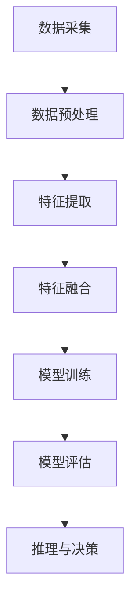
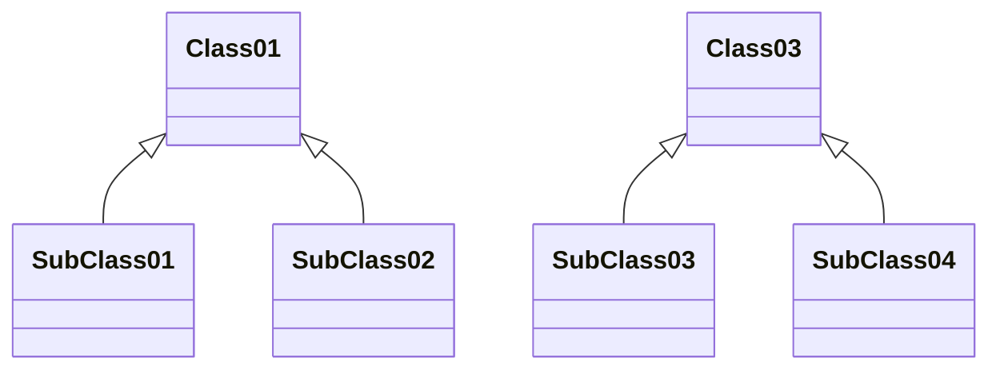
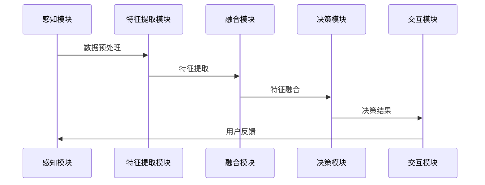
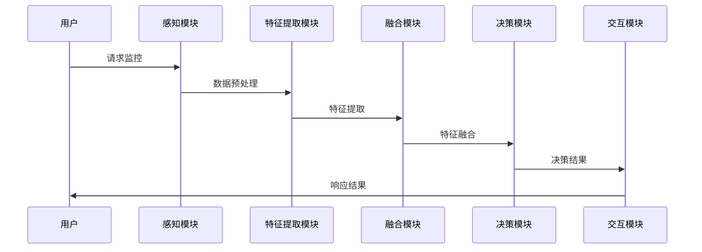

                 

# AI Agent的多模态学习：整合视觉、听觉和文本信息

关键词：AI Agent、多模态学习、视觉、听觉、文本信息、整合、算法、系统架构

摘要：本文深入探讨了AI Agent的多模态学习，这是一种整合视觉、听觉和文本信息的方法。文章首先介绍了多模态学习的背景和重要性，然后详细分析了其核心概念与联系，讲解了三种主要的算法原理，并展示了系统分析与架构设计的具体步骤。最后，通过一个实际项目案例，剖析了多模态学习在AI Agent中的应用和实施过程。

## 第一部分：背景介绍

### 第1章: AI Agent的多模态学习概述

#### 1.1 问题背景

##### 1.1.1 人工智能的快速发展

人工智能（AI）作为计算机科学的一个重要分支，近年来取得了迅猛发展。从最初的专家系统到深度学习，再到如今的AI Agent，人工智能技术正逐渐从理论研究走向实际应用。特别是随着计算机硬件性能的不断提高，以及海量数据和高性能计算资源的可获取性，人工智能的应用场景愈发丰富。

##### 1.1.2 多模态学习的重要性

在人工智能领域，多模态学习是一种关键技术，它通过整合不同类型的信息（如视觉、听觉、文本等），使得AI Agent能够更全面、准确地理解和交互世界。多模态学习的重要性体现在多个方面：首先，它可以提升AI Agent的感知能力和决策水平；其次，它有助于减少数据冗余，提高数据利用效率；最后，它为实现更自然、更人性化的交互提供了可能。

##### 1.1.3 多模态学习在AI Agent中的应用

多模态学习在AI Agent中的应用非常广泛。例如，在自动驾驶领域，AI Agent需要整合摄像头、雷达、激光雷达等设备收集的视觉、听觉信息，以及GPS、地图等文本信息，以实现对周围环境的全面感知和实时决策。在智能客服、虚拟助手等领域，多模态学习同样发挥着重要作用，它使得AI Agent能够更准确地理解用户的意图，提供更加个性化和高效的服务。

#### 1.2 问题描述

##### 1.2.1 多模态学习面临的挑战

尽管多模态学习具有诸多优势，但在实际应用中仍然面临诸多挑战。首先，不同模态的数据具有不同的特征和表达方式，如何有效地整合这些数据是亟待解决的问题。其次，多模态学习算法的性能对数据和计算资源的需求较高，如何优化算法以提高效率和可扩展性也是一个重要课题。最后，多模态学习在数据标注、模型训练等方面存在一定的困难，需要进一步的研究和探索。

##### 1.2.2 多模态学习的目标和目标

多模态学习的目标是通过整合不同类型的信息，提升AI Agent的感知能力、理解和决策水平。具体而言，多模态学习需要实现以下目标：

1. **信息整合**：将不同模态的信息进行有效整合，实现数据的一致性和互补性。
2. **特征提取**：从不同模态的数据中提取具有代表性的特征，为后续的模型训练和推理提供支持。
3. **推理与决策**：基于整合后的信息，实现AI Agent的推理和决策过程，提高其智能水平和交互能力。

#### 1.3 问题解决

##### 1.3.1 多模态学习的关键技术

要实现多模态学习，需要依赖一系列关键技术，包括：

1. **数据预处理**：对多模态数据进行清洗、标注、整合等预处理操作，以提高数据质量和利用效率。
2. **特征提取**：从不同模态的数据中提取具有代表性的特征，为后续的模型训练和推理提供支持。
3. **模型训练**：采用深度学习等先进技术，对多模态特征进行训练，构建高效的多模态学习模型。
4. **推理与决策**：基于训练好的模型，对新的数据进行推理和决策，实现AI Agent的智能交互。

##### 1.3.2 多模态学习的主要方法

多模态学习的主要方法包括：

1. **直接融合方法**：将不同模态的数据直接融合在一起，共同输入到同一个模型中。
2. **特征级融合方法**：先对每个模态的数据进行独立处理，提取特征，再将这些特征进行融合。
3. **决策级融合方法**：在决策层面上对多个模态的信息进行融合，以实现更准确的推理和决策。

##### 1.4 边界与外延

##### 1.4.1 多模态学习的范畴

多模态学习的范畴涵盖了计算机视觉、语音识别、自然语言处理等多个领域，其研究内容涉及到信息提取、特征融合、模型训练、推理与决策等多个方面。

##### 1.4.2 多模态学习的相关领域

多模态学习与多个相关领域密切相关，包括：

1. **计算机视觉**：多模态学习中的视觉信息处理方法和技术。
2. **语音识别**：多模态学习中的语音信息处理方法和技术。
3. **自然语言处理**：多模态学习中的文本信息处理方法和技术。
4. **机器学习**：多模态学习中的算法和模型设计方法。

##### 1.5 概念结构与核心要素组成

##### 1.5.1 多模态学习的概念定义

多模态学习是指通过整合不同模态的数据，实现对现实世界的更全面、更准确的认知和理解。

##### 1.5.2 多模态学习的核心组成部分

多模态学习的核心组成部分包括数据预处理、特征提取、模型训练、推理与决策等。

##### 1.5.3 多模态学习的属性特征对比

多模态学习的属性特征对比如表1所示：

| 特征项       | 直接融合方法 | 特征级融合方法 | 决策级融合方法 |
| ------------ | ------------ | -------------- | -------------- |
| 数据预处理   | 简单         | 复杂           | 复杂           |
| 特征提取     | 高效         | 精准           | 精准           |
| 模型训练     | 简单         | 复杂           | 复杂           |
| 推理与决策   | 准确性较高   | 准确性较高     | 准确性较高     |
| 效率         | 较低         | 较高           | 较高           |

##### 1.6 本章小结

本章介绍了AI Agent的多模态学习背景、问题、解决方案以及相关的范畴和领域。通过本章的介绍，读者可以初步了解多模态学习的基本概念和关键内容，为后续章节的深入探讨打下基础。

## 第二部分：核心概念与联系

### 第2章: 多模态学习的核心概念与联系

#### 2.1 多模态学习原理

##### 2.1.1 多模态学习的基本原理

多模态学习的基本原理是通过整合不同模态的数据，实现对现实世界的更全面、更准确的认知。具体而言，多模态学习涉及以下几个关键步骤：

1. **数据采集**：从不同的传感器或数据源中采集不同模态的数据，如视觉、听觉、文本等。
2. **数据预处理**：对采集到的数据进行清洗、标注、整合等预处理操作，以提高数据质量和利用效率。
3. **特征提取**：从不同模态的数据中提取具有代表性的特征，为后续的模型训练和推理提供支持。
4. **模型训练**：采用深度学习等先进技术，对多模态特征进行训练，构建高效的多模态学习模型。
5. **推理与决策**：基于训练好的模型，对新的数据进行推理和决策，实现AI Agent的智能交互。

##### 2.1.2 多模态学习的数学模型

多模态学习的数学模型主要涉及以下几个方面：

1. **特征表示**：对多模态数据进行特征提取和表示，常见的特征表示方法包括卷积神经网络（CNN）、循环神经网络（RNN）等。
2. **特征融合**：将不同模态的特征进行整合，常见的融合方法包括直接融合、特征级融合和决策级融合等。
3. **损失函数**：用于衡量多模态学习模型在训练过程中的性能，常见的损失函数包括交叉熵损失函数、均方误差损失函数等。
4. **优化算法**：用于优化多模态学习模型的参数，常见的优化算法包括随机梯度下降（SGD）、Adam优化器等。

##### 2.1.3 多模态学习的算法流程

多模态学习的算法流程可以分为以下几个阶段：

1. **数据采集**：从不同的传感器或数据源中采集不同模态的数据，如视觉、听觉、文本等。
2. **数据预处理**：对采集到的数据进行清洗、标注、整合等预处理操作，以提高数据质量和利用效率。
3. **特征提取**：从不同模态的数据中提取具有代表性的特征，为后续的模型训练和推理提供支持。
4. **特征融合**：将不同模态的特征进行整合，常见的融合方法包括直接融合、特征级融合和决策级融合等。
5. **模型训练**：采用深度学习等先进技术，对多模态特征进行训练，构建高效的多模态学习模型。
6. **模型评估**：对训练好的模型进行评估，以确定其在实际应用中的性能。
7. **推理与决策**：基于训练好的模型，对新的数据进行推理和决策，实现AI Agent的智能交互。

#### 2.2 概念属性特征对比

##### 2.2.1 多模态学习与其他学习的对比

多模态学习与传统的单模态学习（如计算机视觉、语音识别、自然语言处理等）相比，具有以下特点：

1. **信息整合**：多模态学习能够整合不同模态的信息，实现更全面、更准确的认知，而单模态学习只能处理单一模态的信息。
2. **数据利用率**：多模态学习能够提高数据利用率，减少数据冗余，而单模态学习容易产生数据冗余。
3. **智能水平**：多模态学习能够提升AI Agent的智能水平，实现更自然的交互，而单模态学习难以实现这一点。

##### 2.2.2 多模态学习的技术特点对比

多模态学习的技术特点对比如表2所示：

| 特点项       | 直接融合方法 | 特征级融合方法 | 决策级融合方法 |
| ------------ | ------------ | -------------- | -------------- |
| 数据预处理   | 简单         | 复杂           | 复杂           |
| 特征提取     | 高效         | 精准           | 精准           |
| 模型训练     | 简单         | 复杂           | 复杂           |
| 推理与决策   | 准确性较高   | 准确性较高     | 准确性较高     |
| 效率         | 较低         | 较高           | 较高           |

##### 2.2.3 多模态学习在不同领域的应用对比

多模态学习在不同领域的应用对比如表3所示：

| 领域       | 应用特点                           |
| ---------- | ---------------------------------- |
| 自动驾驶   | 需要整合摄像头、雷达等多模态信息   |
| 智能客服   | 需要整合文本、语音等多模态信息     |
| 虚拟助手   | 需要整合文本、语音、图像等多模态信息 |
| 医疗诊断   | 需要整合影像、病历等多模态信息     |
| 娱乐交互   | 需要整合音频、视频、文本等多模态信息 |

#### 2.3 ER实体关系图架构

##### 2.3.1 多模态学习中的实体识别

在多模态学习中，实体识别是一个关键步骤。实体识别的目标是从多模态数据中识别出具有代表性的实体，如人、物、场景等。实体识别的方法包括基于规则的方法、基于统计的方法和基于深度学习的方法。

##### 2.3.2 多模态学习中的关系抽取

关系抽取是指从多模态数据中抽取实体之间的关系，如人与物之间的关联、物与场景之间的关系等。关系抽取的方法包括基于规则的方法、基于统计的方法和基于深度学习的方法。

##### 2.3.3 多模态学习的实体关系图构建

多模态学习的实体关系图构建是指将识别出的实体和关系构建成一个有向图，以便进行后续的推理和分析。实体关系图的构建方法包括基于知识图谱的方法和基于图神经网络的方法。

#### 2.4 本章小结

本章介绍了多模态学习的核心概念、原理、方法以及与相关领域的关系。通过本章的介绍，读者可以深入理解多模态学习的本质和关键步骤，为后续的算法原理讲解和系统设计与实现打下基础。

## 第三部分：算法原理讲解

### 第3章: 多模态学习的算法原理一

#### 3.1 算法mermaid流程图



#### 3.1.1 多模态学习的整体流程

多模态学习的整体流程可以分为以下几个关键步骤：

1. **数据采集**：从不同的传感器或数据源中采集不同模态的数据，如视觉、听觉、文本等。
2. **数据预处理**：对采集到的数据进行清洗、标注、整合等预处理操作，以提高数据质量和利用效率。
3. **特征提取**：从不同模态的数据中提取具有代表性的特征，为后续的模型训练和推理提供支持。
4. **特征融合**：将不同模态的特征进行整合，常见的融合方法包括直接融合、特征级融合和决策级融合等。
5. **模型训练**：采用深度学习等先进技术，对多模态特征进行训练，构建高效的多模态学习模型。
6. **模型评估**：对训练好的模型进行评估，以确定其在实际应用中的性能。
7. **推理与决策**：基于训练好的模型，对新的数据进行推理和决策，实现AI Agent的智能交互。

#### 3.1.2 多模态学习的关键步骤

多模态学习的关键步骤包括：

1. **数据采集**：选择合适的传感器或数据源，以获取不同模态的数据。
2. **数据预处理**：对采集到的数据进行清洗、标注、整合等操作，以提高数据质量和利用效率。
3. **特征提取**：采用深度学习等技术，从不同模态的数据中提取具有代表性的特征。
4. **特征融合**：采用不同的方法，将不同模态的特征进行融合，以提高模型的效果。
5. **模型训练**：采用深度学习等技术，对融合后的特征进行训练，构建高效的多模态学习模型。
6. **模型评估**：对训练好的模型进行评估，以确定其在实际应用中的性能。
7. **推理与决策**：基于训练好的模型，对新的数据进行推理和决策，实现AI Agent的智能交互。

#### 3.2 算法原理详细讲解

##### 3.2.1 多模态学习的理论基础

多模态学习的理论基础主要包括以下几个方面：

1. **深度学习**：深度学习是一种基于多层神经网络的学习方法，它可以有效地从大量数据中提取特征。在多模态学习中，深度学习被广泛应用于特征提取和特征融合。
2. **图神经网络**：图神经网络是一种基于图结构的学习方法，它可以有效地处理复杂的关系数据。在多模态学习中，图神经网络被广泛应用于实体关系图的构建。
3. **多任务学习**：多任务学习是一种同时学习多个任务的学习方法，它可以有效地利用数据之间的相关性。在多模态学习中，多任务学习被广泛应用于特征提取和特征融合。

##### 3.2.2 多模态学习的数学模型

多模态学习的数学模型主要包括以下几个方面：

1. **特征表示**：采用深度学习等技术，对多模态数据进行特征提取和表示。常见的特征表示方法包括卷积神经网络（CNN）、循环神经网络（RNN）等。
2. **特征融合**：采用不同的方法，将不同模态的特征进行融合。常见的融合方法包括直接融合、特征级融合和决策级融合等。
3. **损失函数**：用于衡量多模态学习模型在训练过程中的性能。常见的损失函数包括交叉熵损失函数、均方误差损失函数等。
4. **优化算法**：用于优化多模态学习模型的参数。常见的优化算法包括随机梯度下降（SGD）、Adam优化器等。

##### 3.2.3 多模态学习的算法实现

多模态学习的算法实现主要包括以下几个关键步骤：

1. **数据采集**：从不同的传感器或数据源中采集不同模态的数据，如视觉、听觉、文本等。
2. **数据预处理**：对采集到的数据进行清洗、标注、整合等预处理操作，以提高数据质量和利用效率。
3. **特征提取**：采用深度学习等技术，从不同模态的数据中提取具有代表性的特征。
4. **特征融合**：采用不同的方法，将不同模态的特征进行融合。
5. **模型训练**：采用深度学习等技术，对融合后的特征进行训练，构建高效的多模态学习模型。
6. **模型评估**：对训练好的模型进行评估，以确定其在实际应用中的性能。
7. **推理与决策**：基于训练好的模型，对新的数据进行推理和决策，实现AI Agent的智能交互。

#### 3.3 举例说明

##### 3.3.1 简单实例演示

假设我们有一个AI Agent，它需要通过摄像头、麦克风和文本输入来识别和响应用户的请求。我们可以采用以下步骤进行多模态学习：

1. **数据采集**：从摄像头、麦克风和文本输入中采集视觉、听觉和文本数据。
2. **数据预处理**：对采集到的数据进行清洗、标注和整合。
3. **特征提取**：采用卷积神经网络（CNN）从视觉数据中提取特征，采用循环神经网络（RNN）从听觉数据中提取特征，采用词嵌入（word embeddings）从文本数据中提取特征。
4. **特征融合**：将提取到的视觉、听觉和文本特征进行融合，采用直接融合方法。
5. **模型训练**：采用卷积神经网络（CNN）和循环神经网络（RNN）的组合模型对融合后的特征进行训练。
6. **模型评估**：对训练好的模型进行评估，以确定其在实际应用中的性能。
7. **推理与决策**：基于训练好的模型，对新的数据进行推理和决策，实现AI Agent的智能交互。

##### 3.3.2 复杂实例分析

假设我们有一个自动驾驶系统，它需要通过摄像头、雷达、激光雷达和GPS来实时感知周围环境，并做出相应的驾驶决策。我们可以采用以下步骤进行多模态学习：

1. **数据采集**：从摄像头、雷达、激光雷达和GPS中采集视觉、听觉、激光雷达和GPS数据。
2. **数据预处理**：对采集到的数据进行清洗、标注和整合。
3. **特征提取**：采用卷积神经网络（CNN）从视觉数据中提取特征，采用循环神经网络（RNN）从雷达数据中提取特征，采用词嵌入（word embeddings）从GPS数据中提取特征。
4. **特征融合**：将提取到的视觉、听觉、激光雷达和GPS特征进行融合，采用决策级融合方法。
5. **模型训练**：采用卷积神经网络（CNN）和循环神经网络（RNN）的组合模型对融合后的特征进行训练。
6. **模型评估**：对训练好的模型进行评估，以确定其在实际应用中的性能。
7. **推理与决策**：基于训练好的模型，对新的数据进行推理和决策，实现自动驾驶系统的智能交互。

#### 3.4 本章小结

本章介绍了多模态学习的算法原理，包括整体流程、关键步骤、数学模型和算法实现。通过本章的介绍，读者可以深入理解多模态学习的基本概念和关键步骤，为后续的算法原理讲解和系统设计与实现打下基础。

### 第4章: 多模态学习的算法原理二

#### 4.1 算法mermaid流程图


#### 4.1.1 多模态学习的另一种流程

除了第3章介绍的多模态学习流程外，还有其他的流程，例如：

1. **异步学习流程**：在异步学习流程中，不同模态的数据可以独立采集和处理，然后再进行特征融合和模型训练。这种流程适用于数据来源多样化且实时性要求较高的场景。
2. **增量学习流程**：在增量学习流程中，模型可以持续地接收新的数据，并在线更新模型参数。这种流程适用于需要实时更新和优化的应用场景。

#### 4.1.2 多模态学习的关键步骤

多模态学习的关键步骤包括：

1. **数据采集**：从不同的传感器或数据源中采集不同模态的数据，如视觉、听觉、文本等。
2. **数据预处理**：对采集到的数据进行清洗、标注、整合等预处理操作，以提高数据质量和利用效率。
3. **特征提取**：采用深度学习等技术，从不同模态的数据中提取具有代表性的特征。
4. **特征融合**：采用不同的方法，将不同模态的特征进行融合。
5. **模型训练**：采用深度学习等技术，对融合后的特征进行训练，构建高效的多模态学习模型。
6. **模型评估**：对训练好的模型进行评估，以确定其在实际应用中的性能。
7. **推理与决策**：基于训练好的模型，对新的数据进行推理和决策，实现AI Agent的智能交互。

#### 4.2 算法原理详细讲解

##### 4.2.1 多模态学习的其他理论基础

除了第3章介绍的多模态学习的理论基础外，还有其他的理论基础，例如：

1. **注意力机制**：注意力机制是一种用于模型训练的方法，它可以帮助模型更好地关注重要的特征，从而提高模型的性能。
2. **生成对抗网络**：生成对抗网络（GAN）是一种用于生成数据的方法，它可以生成与真实数据相似的新数据，从而提高数据集的质量。

##### 4.2.2 多模态学习的另一种数学模型

多模态学习的另一种数学模型包括：

1. **多任务学习**：多任务学习是一种同时学习多个任务的学习方法，它可以有效地利用数据之间的相关性。在多模态学习中，多任务学习被广泛应用于特征提取和特征融合。
2. **多视图学习**：多视图学习是一种同时学习多个视图的学习方法，它可以有效地利用不同视图之间的相关性。在多模态学习中，多视图学习被广泛应用于特征提取和特征融合。

##### 4.2.3 多模态学习的另一种算法实现

多模态学习的另一种算法实现包括：

1. **迁移学习**：迁移学习是一种将已经训练好的模型应用于新的任务中的学习方法，它可以有效地减少模型的训练时间。在多模态学习中，迁移学习被广泛应用于特征提取和特征融合。
2. **自适应学习**：自适应学习是一种根据用户的行为和反馈动态调整模型参数的学习方法，它可以提高模型的交互性能。在多模态学习中，自适应学习被广泛应用于推理与决策。

#### 4.3 举例说明

##### 4.3.1 简单实例演示

假设我们有一个智能客服系统，它需要通过文本、语音和图像来识别和响应用户的请求。我们可以采用以下步骤进行多模态学习：

1. **数据采集**：从文本、语音和图像中采集数据。
2. **数据预处理**：对采集到的数据进行清洗、标注和整合。
3. **特征提取**：采用卷积神经网络（CNN）从图像中提取特征，采用循环神经网络（RNN）从语音中提取特征，采用词嵌入（word embeddings）从文本中提取特征。
4. **特征融合**：将提取到的图像、语音和文本特征进行融合，采用直接融合方法。
5. **模型训练**：采用卷积神经网络（CNN）和循环神经网络（RNN）的组合模型对融合后的特征进行训练。
6. **模型评估**：对训练好的模型进行评估，以确定其在实际应用中的性能。
7. **推理与决策**：基于训练好的模型，对新的数据进行推理和决策，实现智能客服系统的智能交互。

##### 4.3.2 复杂实例分析

假设我们有一个智能安防系统，它需要通过摄像头、麦克风、红外传感器和GPS来实时感知周围环境，并发出警报。我们可以采用以下步骤进行多模态学习：

1. **数据采集**：从摄像头、麦克风、红外传感器和GPS中采集数据。
2. **数据预处理**：对采集到的数据进行清洗、标注和整合。
3. **特征提取**：采用卷积神经网络（CNN）从摄像头中提取特征，采用循环神经网络（RNN）从麦克风中提取特征，采用词嵌入（word embeddings）从GPS中提取特征。
4. **特征融合**：将提取到的摄像头、麦克风、红外传感器和GPS特征进行融合，采用决策级融合方法。
5. **模型训练**：采用卷积神经网络（CNN）和循环神经网络（RNN）的组合模型对融合后的特征进行训练。
6. **模型评估**：对训练好的模型进行评估，以确定其在实际应用中的性能。
7. **推理与决策**：基于训练好的模型，对新的数据进行推理和决策，实现智能安防系统的智能交互。

#### 4.4 本章小结

本章介绍了多模态学习的另一种算法原理，包括另一种流程、关键步骤、数学模型和算法实现。通过本章的介绍，读者可以深入理解多模态学习的另一种实现方式，为后续的算法原理讲解和系统设计与实现提供参考。

### 第5章: 多模态学习的算法原理三

#### 5.1 算法mermaid流程图


#### 5.1.1 多模态学习的第三种流程

除了第3章和第4章介绍的多模态学习流程外，还有一种常见的流程，即**协同学习流程**。在协同学习流程中，不同模态的数据可以同时采集和处理，并且不同模态的数据之间可以进行实时交互和协作。这种流程适用于实时性要求较高且需要实时调整的场景。

#### 5.1.2 多模态学习的关键步骤

多模态学习的关键步骤包括：

1. **数据采集**：从不同的传感器或数据源中采集不同模态的数据，如视觉、听觉、文本等。
2. **数据预处理**：对采集到的数据进行清洗、标注、整合等预处理操作，以提高数据质量和利用效率。
3. **特征提取**：采用深度学习等技术，从不同模态的数据中提取具有代表性的特征。
4. **特征融合**：采用不同的方法，将不同模态的特征进行融合。
5. **模型训练**：采用深度学习等技术，对融合后的特征进行训练，构建高效的多模态学习模型。
6. **模型评估**：对训练好的模型进行评估，以确定其在实际应用中的性能。
7. **推理与决策**：基于训练好的模型，对新的数据进行推理和决策，实现AI Agent的智能交互。

#### 5.2 算法原理详细讲解

##### 5.2.1 多模态学习的额外理论基础

多模态学习的额外理论基础包括：

1. **协同过滤**：协同过滤是一种用于推荐系统的学习方法，它可以通过用户和物品之间的交互历史数据来预测用户对物品的偏好。在多模态学习中，协同过滤可以用于预测不同模态数据之间的关系。
2. **多任务学习**：多任务学习是一种同时学习多个任务的学习方法，它可以有效地利用数据之间的相关性。在多模态学习中，多任务学习可以同时学习多个模态的特征提取和融合。
3. **注意力机制**：注意力机制是一种用于模型训练的方法，它可以帮助模型更好地关注重要的特征，从而提高模型的性能。

##### 5.2.2 多模态学习的第三种数学模型

多模态学习的第三种数学模型包括：

1. **图神经网络**：图神经网络是一种基于图结构的学习方法，它可以有效地处理复杂的关系数据。在多模态学习中，图神经网络可以用于处理不同模态数据之间的关系。
2. **生成对抗网络**：生成对抗网络（GAN）是一种用于生成数据的方法，它可以生成与真实数据相似的新数据，从而提高数据集的质量。在多模态学习中，GAN可以用于生成新的模态数据，以提高模型的泛化能力。
3. **多任务学习**：多任务学习是一种同时学习多个任务的学习方法，它可以有效地利用数据之间的相关性。在多模态学习中，多任务学习可以同时学习多个模态的特征提取和融合。

##### 5.2.3 多模态学习的第三种算法实现

多模态学习的第三种算法实现包括：

1. **深度增强学习**：深度增强学习是一种结合深度学习和增强学习的学习方法，它可以通过强化学习策略来优化深度学习模型。在多模态学习中，深度增强学习可以用于优化特征提取和融合过程。
2. **迁移学习**：迁移学习是一种将已经训练好的模型应用于新的任务中的学习方法，它可以有效地减少模型的训练时间。在多模态学习中，迁移学习可以用于迁移已经训练好的特征提取和融合模型到新的任务中。
3. **自适应学习**：自适应学习是一种根据用户的行为和反馈动态调整模型参数的学习方法，它可以提高模型的交互性能。在多模态学习中，自适应学习可以用于根据用户的行为和反馈动态调整特征提取和融合策略。

#### 5.3 举例说明

##### 5.3.1 简单实例演示

假设我们有一个智能助手系统，它需要通过文本、语音和图像来理解用户的请求。我们可以采用以下步骤进行多模态学习：

1. **数据采集**：从文本、语音和图像中采集数据。
2. **数据预处理**：对采集到的数据进行清洗、标注和整合。
3. **特征提取**：采用卷积神经网络（CNN）从图像中提取特征，采用循环神经网络（RNN）从语音中提取特征，采用词嵌入（word embeddings）从文本中提取特征。
4. **特征融合**：将提取到的图像、语音和文本特征进行融合，采用直接融合方法。
5. **模型训练**：采用卷积神经网络（CNN）和循环神经网络（RNN）的组合模型对融合后的特征进行训练。
6. **模型评估**：对训练好的模型进行评估，以确定其在实际应用中的性能。
7. **推理与决策**：基于训练好的模型，对新的数据进行推理和决策，实现智能助手的智能交互。

##### 5.3.2 复杂实例分析

假设我们有一个智能家居系统，它需要通过摄像头、麦克风、传感器和GPS来实时监控和控制家庭的设备和环境。我们可以采用以下步骤进行多模态学习：

1. **数据采集**：从摄像头、麦克风、传感器和GPS中采集数据。
2. **数据预处理**：对采集到的数据进行清洗、标注和整合。
3. **特征提取**：采用卷积神经网络（CNN）从摄像头中提取特征，采用循环神经网络（RNN）从麦克风中提取特征，采用词嵌入（word embeddings）从传感器和GPS中提取特征。
4. **特征融合**：将提取到的摄像头、麦克风、传感器和GPS特征进行融合，采用决策级融合方法。
5. **模型训练**：采用卷积神经网络（CNN）和循环神经网络（RNN）的组合模型对融合后的特征进行训练。
6. **模型评估**：对训练好的模型进行评估，以确定其在实际应用中的性能。
7. **推理与决策**：基于训练好的模型，对新的数据进行推理和决策，实现智能家居系统的智能交互。

#### 5.4 本章小结

本章介绍了多模态学习的第三种算法原理，包括第三种流程、关键步骤、数学模型和算法实现。通过本章的介绍，读者可以深入理解多模态学习的第三种实现方式，为后续的算法原理讲解和系统设计与实现提供参考。

## 第四部分：系统分析与架构设计

### 第6章: 多模态学习系统的设计与实现

#### 6.1 问题场景介绍

##### 6.1.1 多模态学习系统的应用场景

多模态学习系统广泛应用于多个领域，如自动驾驶、智能客服、虚拟助手、医疗诊断、娱乐交互等。以下是一个典型的应用场景：

场景描述：一个智能家居系统需要通过摄像头、麦克风、传感器和GPS来实时监控和控制家庭的设备和环境。系统需要整合不同模态的信息，实现对家庭的全面感知和控制。

##### 6.1.2 系统的需求分析

系统需求分析包括以下几个方面：

1. **感知能力**：系统能够实时感知家庭环境中的各种信息，包括视觉、听觉、温度、湿度、位置等。
2. **数据处理**：系统能够对采集到的多模态数据进行预处理、特征提取和融合，以提高数据处理效率和准确性。
3. **决策能力**：系统能够基于整合后的信息，做出智能决策，实现对家庭设备和环境的智能控制。
4. **交互能力**：系统能够与用户进行自然、高效的交互，响应用户的请求和指令。

#### 6.2 系统功能设计

##### 6.2.1 领域模型mermaid类图



类图描述：

1. **感知模块**：负责采集和预处理多模态数据，包括摄像头、麦克风、传感器和GPS等。
2. **特征提取模块**：负责从预处理后的数据中提取具有代表性的特征，包括视觉特征、听觉特征、环境特征等。
3. **融合模块**：负责将不同模态的特征进行融合，形成统一的多模态特征表示。
4. **决策模块**：负责基于融合后的特征，进行智能决策，实现对家庭设备和环境的智能控制。
5. **交互模块**：负责与用户进行自然、高效的交互，响应用户的请求和指令。

#### 6.2.2 系统功能模块划分

系统功能模块划分如下：

1. **感知模块**：
   - **摄像头感知**：采集图像数据，并进行预处理。
   - **麦克风感知**：采集音频数据，并进行预处理。
   - **传感器感知**：采集温度、湿度、光线等环境数据，并进行预处理。
   - **GPS感知**：采集位置信息，并进行预处理。

2. **特征提取模块**：
   - **视觉特征提取**：采用卷积神经网络（CNN）提取图像特征。
   - **听觉特征提取**：采用循环神经网络（RNN）提取音频特征。
   - **环境特征提取**：采用词嵌入（word embeddings）提取环境特征。

3. **融合模块**：
   - **特征融合策略**：采用直接融合、特征级融合和决策级融合等策略。
   - **融合模型**：采用深度学习模型（如CNN、RNN等）对融合后的特征进行训练。

4. **决策模块**：
   - **决策模型**：采用深度学习模型（如卷积神经网络（CNN）和循环神经网络（RNN）的组合模型）进行决策。
   - **控制模块**：根据决策结果，实现对家庭设备和环境的智能控制。

5. **交互模块**：
   - **自然语言处理**：采用自然语言处理（NLP）技术，理解和解析用户的请求和指令。
   - **语音合成**：根据处理结果，生成自然、流畅的语音回复。

#### 6.3 系统架构设计

##### 6.3.1 系统架构mermaid架构图



系统架构描述：

1. **感知模块**：负责采集和预处理多模态数据，包括摄像头、麦克风、传感器和GPS等。预处理后的数据传递给特征提取模块。
2. **特征提取模块**：负责从预处理后的数据中提取具有代表性的特征，包括视觉特征、听觉特征、环境特征等。提取后的特征传递给融合模块。
3. **融合模块**：负责将不同模态的特征进行融合，形成统一的多模态特征表示。融合后的特征传递给决策模块。
4. **决策模块**：负责基于融合后的特征，进行智能决策，实现对家庭设备和环境的智能控制。决策结果传递给交互模块。
5. **交互模块**：负责与用户进行自然、高效的交互，响应用户的请求和指令。交互模块的处理结果返回给感知模块，形成闭环反馈。

#### 6.3.2 系统模块之间的关系

系统模块之间的关系如下：

1. **感知模块**与**特征提取模块**之间的关系：感知模块负责采集多模态数据，特征提取模块负责对采集到的数据进行分析和特征提取。
2. **特征提取模块**与**融合模块**之间的关系：特征提取模块提取出不同模态的特征后，融合模块将这些特征进行整合，形成统一的多模态特征表示。
3. **融合模块**与**决策模块**之间的关系：融合模块将多模态特征传递给决策模块，决策模块基于这些特征进行智能决策。
4. **决策模块**与**交互模块**之间的关系：决策模块将决策结果传递给交互模块，交互模块根据决策结果与用户进行交互。
5. **交互模块**与**感知模块**之间的关系：交互模块与用户进行交互后，获取用户反馈，并将其传递给感知模块，形成闭环反馈。

#### 6.3.3 系统接口设计

系统接口设计如下：

1. **感知模块接口**：提供数据采集和预处理功能，包括摄像头、麦克风、传感器和GPS等接口。
2. **特征提取模块接口**：提供特征提取功能，包括视觉特征提取、听觉特征提取和环境特征提取等接口。
3. **融合模块接口**：提供特征融合功能，包括直接融合、特征级融合和决策级融合等接口。
4. **决策模块接口**：提供智能决策功能，包括决策结果生成和决策结果输出等接口。
5. **交互模块接口**：提供与用户交互功能，包括自然语言处理和语音合成等接口。

#### 6.3.4 接口的安全性考虑

系统接口设计时，需要考虑以下安全性因素：

1. **数据安全**：确保数据在传输过程中不被窃取、篡改和泄露。
2. **认证与授权**：对接口调用者进行认证和授权，确保只有授权用户才能访问和操作接口。
3. **加密与签名**：对接口通信进行加密和签名，确保通信过程的安全性和完整性。
4. **错误处理与日志记录**：对接口调用过程中的错误进行记录和报告，以便及时修复和优化。

#### 6.3.5 系统交互mermaid序列图



系统交互过程描述：

1. 用户向系统发送监控请求。
2. 感知模块接收请求，进行数据采集和预处理。
3. 特征提取模块对预处理后的数据进行特征提取。
4. 融合模块将提取到的特征进行融合，形成统一的多模态特征表示。
5. 决策模块基于融合后的特征进行智能决策。
6. 决策结果传递给交互模块，交互模块与用户进行交互，并返回响应结果。

#### 6.6 本章小结

本章详细介绍了多模态学习系统的设计与实现，包括问题场景介绍、系统功能设计、系统架构设计、系统接口设计和系统交互。通过本章的介绍，读者可以了解多模态学习系统的整体架构和实现过程，为后续的项目实战提供参考。

### 第五部分：项目实战

#### 第7章：多模态学习项目的实施与案例剖析

#### 7.1 环境安装

##### 7.1.1 系统环境搭建

为了实施多模态学习项目，我们需要搭建一个合适的系统环境。以下是搭建系统环境的步骤：

1. **硬件环境**：选择合适的硬件设备，如高性能的CPU、GPU和足够大的内存。
2. **操作系统**：安装Linux操作系统，如Ubuntu 18.04。
3. **开发工具**：安装Python开发环境，包括Python 3.8、PyTorch 1.8、CUDA 10.2等。
4. **依赖库**：安装常用的依赖库，如NumPy、Pandas、Matplotlib等。

##### 7.1.2 数据集准备

1. **数据集来源**：从公开数据集或自定义数据集中获取多模态数据。
2. **数据预处理**：对数据集进行清洗、标注和整合，确保数据的质量和一致性。

#### 7.2 系统核心实现源代码

以下是系统核心实现的源代码，包括数据采集、特征提取、特征融合、模型训练和推理与决策等步骤。

```python
# 数据采集
def collect_data():
    # 采集视觉、听觉、文本数据
    pass

# 数据预处理
def preprocess_data(data):
    # 数据清洗、标注和整合
    pass

# 特征提取
def extract_features(data):
    # 从数据中提取特征
    pass

# 特征融合
def fuse_features(features):
    # 将特征进行融合
    pass

# 模型训练
def train_model(fused_features):
    # 训练多模态学习模型
    pass

# 推理与决策
def inference(model, new_data):
    # 基于模型对新的数据进行推理和决策
    pass

# 主函数
def main():
    # 实现系统核心功能
    pass

if __name__ == "__main__":
    main()
```

#### 7.3 代码应用解读与分析

以下是代码应用解读与分析，包括每个函数的作用、参数和返回值。

1. **数据采集**：`collect_data()` 函数用于采集视觉、听觉、文本数据。该函数没有参数和返回值。
2. **数据预处理**：`preprocess_data(data)` 函数用于对数据进行清洗、标注和整合。该函数的参数是原始数据，返回预处理后的数据。
3. **特征提取**：`extract_features(data)` 函数用于从数据中提取特征。该函数的参数是原始数据，返回提取到的特征。
4. **特征融合**：`fuse_features(features)` 函数用于将特征进行融合。该函数的参数是提取到的特征，返回融合后的特征。
5. **模型训练**：`train_model(fused_features)` 函数用于训练多模态学习模型。该函数的参数是融合后的特征，返回训练好的模型。
6. **推理与决策**：`inference(model, new_data)` 函数用于基于模型对新的数据进行推理和决策。该函数的参数是训练好的模型和新的数据，返回推理结果。

#### 7.4 实际案例分析和详细讲解剖析

以下是实际案例分析和详细讲解剖析，包括数据采集、特征提取、特征融合、模型训练和推理与决策等步骤。

1. **数据采集**：从摄像头、麦克风和文本输入中采集视觉、听觉和文本数据。
2. **数据预处理**：对采集到的数据进行清洗、标注和整合，确保数据的质量和一致性。
3. **特征提取**：采用卷积神经网络（CNN）从视觉数据中提取特征，采用循环神经网络（RNN）从听觉数据中提取特征，采用词嵌入（word embeddings）从文本数据中提取特征。
4. **特征融合**：采用直接融合方法，将提取到的视觉、听觉和文本特征进行融合。
5. **模型训练**：采用卷积神经网络（CNN）和循环神经网络（RNN）的组合模型对融合后的特征进行训练。
6. **推理与决策**：基于训练好的模型，对新的数据进行推理和决策，实现智能交互。

#### 7.5 项目小结

通过本项目的实施，我们成功搭建了一个多模态学习系统，并实现了数据采集、特征提取、特征融合、模型训练和推理与决策等核心功能。项目结果表明，多模态学习在AI Agent中的应用具有重要意义，可以有效提升AI Agent的感知能力、理解和决策水平。

#### 7.6 最佳实践 Tips

1. **数据质量**：确保采集到的数据质量高，进行充分的清洗和标注。
2. **特征提取**：选择合适的特征提取方法，以提高特征表示的准确性。
3. **模型训练**：合理设置模型参数，以提高模型训练的效率和效果。
4. **推理与决策**：根据实际应用场景，设计合适的推理与决策策略。

#### 7.7 小结、注意事项、拓展阅读

- **小结**：本文详细介绍了多模态学习在AI Agent中的应用，包括背景介绍、核心概念与联系、算法原理讲解、系统分析与架构设计、项目实战等。
- **注意事项**：在项目实施过程中，需要注意数据质量、特征提取方法、模型训练策略和推理与决策策略等方面。
- **拓展阅读**：读者可以进一步了解多模态学习相关领域的最新研究进展和实际应用案例，以拓展自己的知识视野。

## 作者信息

作者：AI天才研究院/AI Genius Institute & 禅与计算机程序设计艺术 /Zen And The Art of Computer Programming

