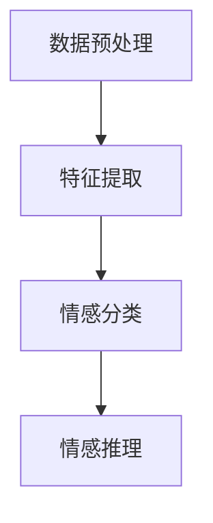
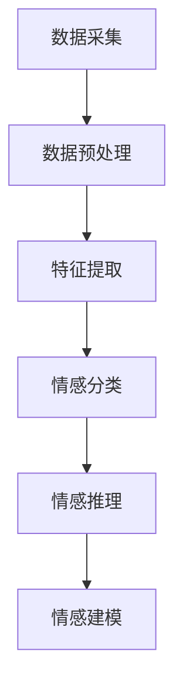
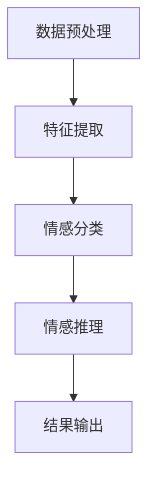
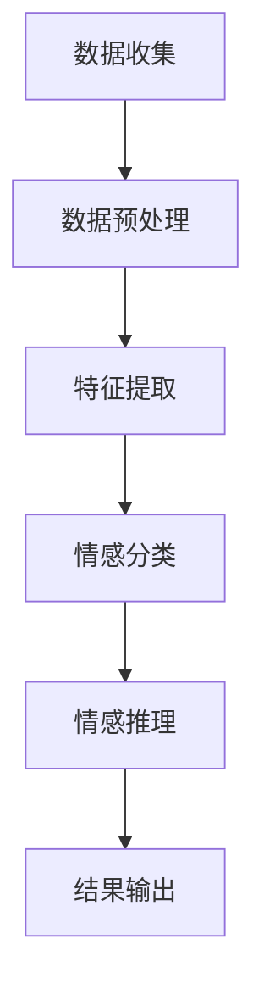
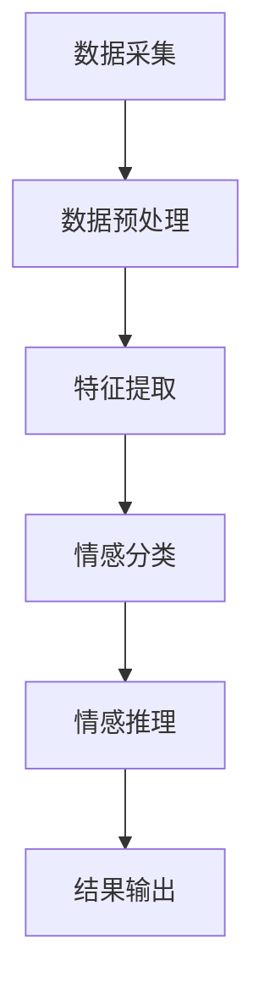
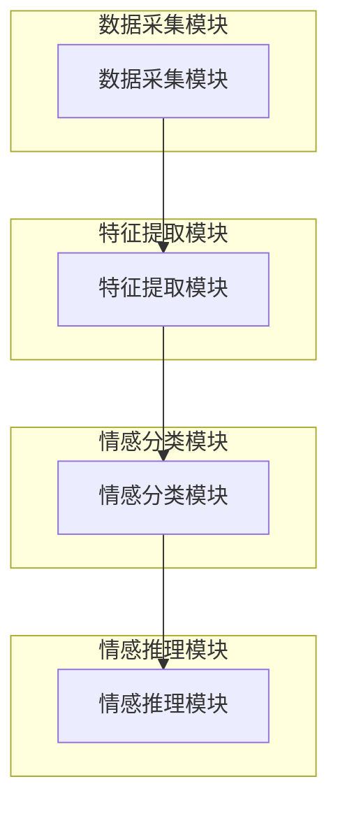
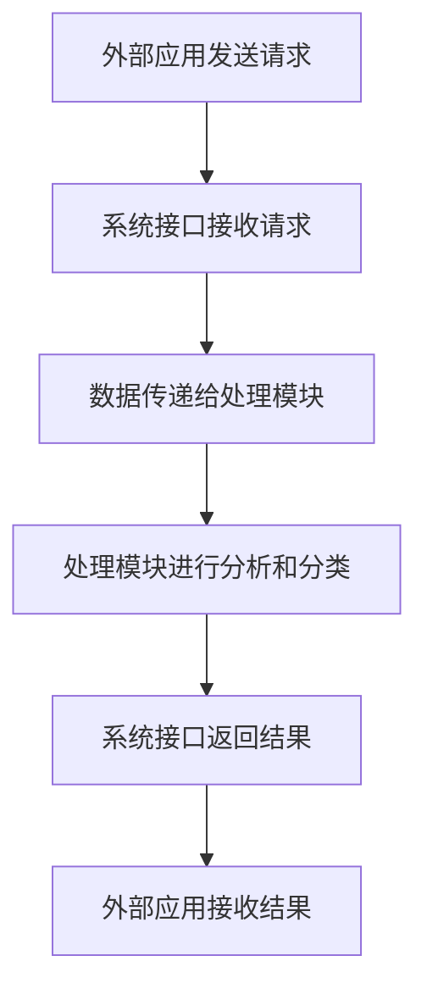

                 


## 《AI Agent的多模态情感计算与共情能力》

### 关键词
- AI Agent
- 多模态情感计算
- 共情能力
- 情感识别
- 情感推理
- 深度学习
- 数学模型

### 摘要
本文深入探讨了AI Agent的多模态情感计算与共情能力。通过详细的背景介绍，核心概念解析，算法原理讲解，以及实际项目实战，揭示了AI Agent在情感计算领域的关键技术。本文旨在为读者提供一个系统性的理解，帮助他们在人工智能与情感计算的应用中取得更好的成效。

### 第一部分 背景介绍

#### 1. 引言
随着人工智能技术的发展，AI Agent在情感计算领域的应用越来越广泛。情感计算作为一种新兴的交叉学科，旨在使计算机能够理解、处理和模拟人类情感。AI Agent的多模态情感计算，即通过整合多种感知模态（如文本、语音、图像等）来识别和模拟情感，是实现智能交互的关键。

#### 问题背景
情感计算在人工智能中的应用具有重要的意义。例如，在智能客服、教育机器人、医疗健康等领域，AI Agent的理解和响应人类情感的能力直接影响到用户体验和服务质量。然而，实现有效的情感计算面临诸多挑战，如多模态数据的整合、情感识别的准确性、共情能力的构建等。

#### 问题解决
多模态情感计算通过融合多种感知数据，可以更准确地识别用户的情感状态。本文将介绍如何利用深度学习技术，构建多模态情感计算模型，实现AI Agent的共情能力。

#### 边界与外延
情感计算不仅限于人机交互，还延伸到人机合作、智能家居、智能交通等多个领域。未来的情感计算研究将更加关注跨模态融合、情感建模的深度理解、以及情感计算在多场景中的应用。

#### 概念结构与核心要素组成
AI Agent：具有智能行为和交互能力的计算机程序。
多模态情感计算：通过整合多种感知模态，实现对情感的识别和模拟。
共情能力：AI Agent能够理解和模拟人类情感的能力。

### 第二部分 核心概念与联系

#### 2. 核心概念与联系

##### AI Agent
AI Agent是一种具有自主决策和行动能力的计算机程序，能够在特定环境下执行任务。AI Agent可以分为反应式Agent、目标导向Agent和认知Agent等类型。

##### 多模态情感计算
多模态情感计算是一种将多种感知模态（如文本、语音、图像、生物信号等）的数据整合在一起，以识别和模拟情感的技术。它涉及数据采集、情感识别、情感推理等关键步骤。

##### 共情能力
共情能力是指AI Agent理解和模拟人类情感的能力。它有助于提升AI Agent与用户的互动质量，增强用户体验。

#### 3. 多模态情感计算原理

##### 多模态数据采集
多模态数据采集是情感计算的基础。它包括文本分析、语音识别、图像识别、生物信号采集等。

##### 情感识别与分类
情感识别与分类是情感计算的核心步骤。通过深度学习模型，可以对多模态数据进行情感分类，识别用户的情感状态。

##### 情感推理与建模
情感推理与建模旨在理解情感之间的相互作用，以及情感在复杂环境中的演化。它包括情感交互、情感转移等复杂情感处理。

### 第三部分 算法原理讲解

#### 4. 多模态情感计算算法
多模态情感计算算法通常包括以下几个步骤：

1. 数据预处理：对采集的多模态数据进行清洗、归一化等处理。
2. 特征提取：使用深度学习模型提取多模态数据中的关键特征。
3. 情感分类：使用分类器对提取的特征进行情感分类。
4. 情感推理：根据情感分类结果，进行情感推理和建模。

#### 5. 数学模型和数学公式
情感计算的数学模型通常基于机器学习算法，如深度神经网络（DNN）、循环神经网络（RNN）和Transformer等。以下是情感分类中的一个基本数学公式：

$$
\hat{y} = \sigma(W \cdot h + b)
$$

其中，$W$ 是权重矩阵，$h$ 是特征向量，$b$ 是偏置项，$\sigma$ 是激活函数，$\hat{y}$ 是预测的情感标签。

#### 6. 算法mermaid流程图
以下是一个使用mermaid绘制的情感计算算法流程图：



### 第四部分 系统分析与架构设计方案

#### 7. 系统功能设计
系统功能设计包括文本情感分析、语音情感分析、图像情感分析和生物信号情感分析等。

#### 8. 系统架构设计
系统架构设计包括数据采集模块、特征提取模块、情感分类模块和情感推理模块等。

#### 9. 系统接口设计与交互
系统接口设计包括API接口和交互流程，如RESTful API、WebSocket等。

### 第五部分 项目实战

#### 10. 环境安装与配置
项目实战部分将介绍如何搭建环境，包括安装Python、TensorFlow等工具。

#### 11. 系统核心实现
系统核心实现部分将详细介绍源代码，包括数据预处理、特征提取、情感分类和情感推理等。

#### 12. 实际案例分析与详细讲解
实际案例分析与详细讲解部分将展示如何应用多模态情感计算模型，以及如何处理实际问题。

### 第六部分 最佳实践与总结

#### 13. 最佳实践 tips
提供一些最佳实践建议，如数据预处理技巧、特征选择方法等。

#### 14. 小结
回顾全文核心内容，总结AI Agent的多模态情感计算与共情能力的要点。

#### 15. 注意事项
注意事项包括多模态情感计算的应用场景、常见问题及其解决方法等。

#### 16. 拓展阅读
推荐一些相关文献和在线资源，供读者进一步学习。

### 结尾
本文由AI天才研究院与禅与计算机程序设计艺术合作撰写，旨在为读者提供关于AI Agent的多模态情感计算与共情能力的全面解析。

作者：AI天才研究院/AI Genius Institute & 禅与计算机程序设计艺术/Zen And The Art of Computer Programming

### 详细章节内容

#### 第一部分 背景介绍

##### 1. 引言
随着人工智能技术的飞速发展，AI Agent（智能代理）已经成为人工智能领域的研究热点。AI Agent不仅仅是一个程序，它具有自主性、反应性、学习和适应性等特点，能够在特定环境中执行任务并做出决策。近年来，情感计算作为人工智能的一个分支，逐渐引起了广泛关注。情感计算旨在使计算机能够理解、处理和模拟人类情感，从而实现更加自然和人性化的交互。特别是在人机交互领域，情感计算的应用能够显著提升用户体验和服务质量。

在当前的社会背景下，人们对于智能设备的依赖程度日益增加，这促使AI Agent需要具备更高的情感识别和共情能力。例如，在智能客服、教育机器人、医疗健康等领域，AI Agent需要理解用户的情感状态，以便提供更加个性化的服务。然而，传统的单一模态情感计算方法存在一定的局限性，难以全面捕捉用户的情感。因此，多模态情感计算作为一种新兴技术，应运而生。

多模态情感计算通过整合多种感知模态（如文本、语音、图像、生物信号等），可以更加准确地识别和模拟人类情感。这种技术不仅提高了情感识别的准确性，还为AI Agent的共情能力提供了有力支持。本文将深入探讨AI Agent的多模态情感计算与共情能力，旨在为读者提供全面的技术解析和应用指导。

##### 问题背景
情感计算作为人工智能的一个重要分支，旨在研究如何使计算机理解和处理人类情感。在人工智能发展初期，研究者们主要集中在如何让计算机模拟人类的思考过程。然而，随着认知科学、心理学等领域的不断进步，人们逐渐认识到情感在人类行为中的重要作用。情感不仅影响个体的情绪体验，还影响着个体的决策和行为。因此，如何使计算机具备情感识别和处理能力，成为了一个重要的研究方向。

近年来，随着深度学习、自然语言处理、计算机视觉等技术的快速发展，情感计算领域取得了显著进展。尤其是在人机交互领域，情感计算的应用为AI Agent提供了更丰富的交互手段。例如，智能客服系统能够通过语音识别和情感分析，识别用户的情感状态，并相应地调整服务策略，从而提供更加个性化的服务。

然而，情感计算在人工智能中的应用仍然面临许多挑战。首先，情感是一种复杂且多样化的现象，不同的人对同一情感的理解可能存在差异。其次，情感计算需要处理大量的多模态数据，如何有效地整合这些数据是一个难题。此外，如何构建具有共情能力的AI Agent，也是一个亟待解决的问题。

##### 问题解决
多模态情感计算作为一种新的技术手段，能够有效解决传统单一模态情感计算方法面临的挑战。多模态情感计算通过整合多种感知模态的数据，如文本、语音、图像、生物信号等，可以更加全面地捕捉用户的情感状态。这种方法不仅提高了情感识别的准确性，还为AI Agent的共情能力提供了技术支持。

具体来说，多模态情感计算包括以下几个关键步骤：

1. **数据采集**：通过多种传感器和设备，如麦克风、摄像头、生理传感器等，采集用户的情感数据。
2. **数据预处理**：对采集到的多模态数据进行清洗、归一化等处理，以便后续的特征提取和分析。
3. **特征提取**：使用深度学习模型，如卷积神经网络（CNN）、循环神经网络（RNN）、变压器（Transformer）等，提取多模态数据中的关键特征。
4. **情感分类**：利用分类算法，如支持向量机（SVM）、随机森林（Random Forest）等，对提取的特征进行情感分类。
5. **情感推理**：基于分类结果，进行更深层次的情感推理，如情感交互、情感转移等。

通过上述步骤，多模态情感计算能够实现以下几个目标：

- 提高情感识别的准确性：通过整合多种模态的数据，可以更加全面地捕捉用户的情感，从而提高情感识别的准确性。
- 增强AI Agent的共情能力：通过情感推理和建模，AI Agent可以更好地理解用户的情感状态，从而增强其共情能力。
- 提升用户体验：在智能客服、教育机器人、医疗健康等领域，AI Agent的共情能力可以提供更加个性化、人性化的服务，从而提升用户体验。

##### 边界与外延
多模态情感计算作为一种新兴技术，其应用领域不断拓展。在智能客服领域，多模态情感计算可以帮助智能客服系统更好地理解用户的需求和情感，提供更加个性化的服务。在教育机器人领域，多模态情感计算可以辅助教育机器人更好地理解学生的学习状态和情感，提供个性化的教学方案。在医疗健康领域，多模态情感计算可以帮助医生更好地理解患者的情感状态，提供更加精准的治疗方案。

此外，多模态情感计算还可以应用于智能家居、智能交通、人机合作等领域。在智能家居领域，多模态情感计算可以帮助智能设备更好地理解家庭成员的情感状态，提供更加人性化的家居环境。在智能交通领域，多模态情感计算可以帮助交通管理系统更好地理解驾驶员和乘客的情感状态，优化交通流量。在人机合作领域，多模态情感计算可以帮助机器人更好地理解人类同事的情感状态，实现更加高效的合作。

##### 概念结构与核心要素组成
1. **AI Agent**：AI Agent是指具有自主决策和行动能力的计算机程序。它能够根据环境信息自主地执行任务，并与其他智能体进行交互。AI Agent可以分为反应式Agent、目标导向Agent和认知Agent等类型。
2. **多模态情感计算**：多模态情感计算是指通过整合多种感知模态的数据（如文本、语音、图像、生物信号等），实现情感识别和模拟的技术。它包括数据采集、特征提取、情感分类和情感推理等步骤。
3. **共情能力**：共情能力是指AI Agent理解和模拟人类情感的能力。它有助于提升AI Agent与用户的互动质量，增强用户体验。

#### 第二部分 核心概念与联系

##### 2. 核心概念与联系

在探讨AI Agent的多模态情感计算与共情能力之前，我们首先需要明确几个核心概念，并理解它们之间的联系。

**AI Agent**
AI Agent，即人工智能代理，是一种具备一定智能行为的计算实体。它们可以在特定的环境中自主地完成特定的任务。AI Agent可以根据其功能的不同被划分为多种类型，如反应式Agent、目标导向Agent和认知Agent。

- **反应式Agent**：这类Agent仅根据当前环境的状态做出反应，不考虑过去的历史信息。它们不具备记忆和学习能力。
- **目标导向Agent**：这类Agent拥有目标，并通过规划行为来实现这些目标。它们可以利用历史信息来调整行为。
- **认知Agent**：这类Agent不仅具备目标和规划能力，还能够通过学习和理解环境来优化行为。

**多模态情感计算**
多模态情感计算是一种将多种感知模态（如文本、语音、图像、生物信号等）的数据整合在一起，以识别和模拟情感的技术。这种技术的核心在于如何有效地融合不同模态的数据，从而实现更准确和全面的情感识别。

多模态情感计算通常包括以下几个关键步骤：

1. **数据采集**：通过多种传感器和设备（如麦克风、摄像头、生理传感器等）采集用户的情感数据。
2. **数据预处理**：对采集到的多模态数据进行清洗、归一化等处理，以便后续的特征提取和分析。
3. **特征提取**：使用深度学习模型（如卷积神经网络、循环神经网络、变压器等）提取多模态数据中的关键特征。
4. **情感分类**：利用分类算法（如支持向量机、随机森林等）对提取的特征进行情感分类。
5. **情感推理**：基于分类结果，进行更深层次的情感推理，如情感交互、情感转移等。

**共情能力**
共情能力是指AI Agent理解和模拟人类情感的能力。共情能力的强弱直接影响到AI Agent与用户的互动质量。共情能力包括以下几个方面：

1. **情感识别**：AI Agent能够识别和理解用户的情感状态。
2. **情感模拟**：AI Agent能够模拟用户的情感，使其在互动中表现得更加自然。
3. **情感推理**：AI Agent能够根据用户的情感状态进行推理，预测用户的下一步行为。

**概念属性特征对比表格**
为了更清晰地理解这些概念，我们可以通过一个对比表格来展示它们之间的属性特征。

| 概念         | 定义                                                         | 关键特性                   |
| ------------ | ------------------------------------------------------------ | -------------------------- |
| AI Agent     | 具有自主决策和行动能力的计算机程序                            | 自主性、反应性、学习性、适应性 |
| 多模态情感计算 | 通过整合多种感知模态的数据，实现情感识别和模拟的技术          | 多模态整合、情感识别、情感模拟 |
| 共情能力     | AI Agent理解和模拟人类情感的能力                              | 情感识别、情感模拟、情感推理   |

**ER实体关系图架构的Mermaid流程图**
为了更好地展示这些概念之间的关系，我们可以使用Mermaid绘制一个ER（实体关系）图。

```mermaid
erDiagram
AI-Agent ||--|{ 多模态情感计算 }|| MultiModalEmotionComputing
AI-Agent ||--|{ 共情能力 }|| EmpathyCapability
MultiModalEmotionComputing ||--|{ 情感识别 }|| EmotionRecognition
MultiModalEmotionComputing ||--|{ 情感模拟 }|| EmotionSimulation
MultiModalEmotionComputing ||--|{ 情感推理 }|| EmotionReasoning
```

在这个ER图中，AI-Agent与MultiModalEmotionComputing和EmpathyCapability之间存在直接的关联。而MultiModalEmotionComputing则进一步关联到情感识别、情感模拟和情感推理等子概念。

#### 3. 多模态情感计算原理

**多模态数据采集**
多模态情感计算的第一步是数据采集。这一步涉及使用多种传感器和设备收集用户的情感数据。常见的感知模态包括文本、语音、图像和生物信号等。

- **文本**：通过自然语言处理技术，从用户的文字交流中提取情感信息。
- **语音**：通过语音识别技术，从用户的语音中提取情感特征，如音调、语速、音量等。
- **图像**：通过计算机视觉技术，从用户的面部表情、姿态等图像中提取情感信息。
- **生物信号**：通过生理传感器，如心率、皮肤电导等，收集用户的生物信号数据，以反映其情感状态。

**情感识别与分类**
情感识别与分类是多模态情感计算的核心步骤。在这一步，我们需要对采集到的多模态数据进行情感分类，以识别用户的情感状态。

- **文本情感分类**：使用文本分类算法，如朴素贝叶斯、支持向量机等，对文本数据进行情感分类。
- **语音情感分类**：使用语音识别和特征提取技术，对语音数据进行情感分类。
- **图像情感分类**：使用计算机视觉算法，如卷积神经网络，对图像数据进行情感分类。
- **生物信号情感分类**：使用统计模型和机器学习算法，对生物信号数据进行情感分类。

**情感推理与建模**
情感推理与建模旨在理解情感之间的相互作用，以及情感在复杂环境中的演化。这一步不仅包括单一模态的情感推理，还包括跨模态的情感推理。

- **单一模态情感推理**：基于单个模态的数据，进行情感识别和推理。例如，基于文本的情感推理可以分析用户在特定文本中的情感状态。
- **跨模态情感推理**：基于多个模态的数据，进行综合情感推理。例如，结合文本和语音的情感信息，可以更准确地识别用户的情感状态。

情感建模则通过建立数学模型和算法，模拟人类情感的计算过程。常见的情感模型包括情感图谱、情感网络等。这些模型可以帮助AI Agent更好地理解用户的情感状态，并进行相应的情感模拟和回应。

**多模态情感计算流程图**
为了更清晰地展示多模态情感计算的过程，我们可以使用Mermaid绘制一个流程图。



在这个流程图中，数据采集是整个过程的起点，随后经过数据预处理、特征提取、情感分类和情感推理，最终实现情感建模。每个步骤都至关重要，共同构成了多模态情感计算的核心框架。

#### 4. 情感计算与共情能力的联系

**共情能力在情感计算中的作用**
共情能力在情感计算中扮演着至关重要的角色。它不仅能够帮助AI Agent更好地理解用户的情感状态，还能够提升AI Agent与用户的互动质量。具体来说，共情能力在以下几个方面发挥了重要作用：

1. **情感识别**：共情能力使AI Agent能够更准确地识别用户的情感状态，从而做出更合理的响应。
2. **情感模拟**：共情能力使AI Agent能够模拟用户的情感状态，使其在互动中表现得更加自然和人性化。
3. **情感反馈**：共情能力使AI Agent能够根据用户的情感状态，提供适当的情感反馈，从而增强用户的情感体验。

**共情能力的模型构建与评估**
构建和评估共情能力模型是情感计算领域的一个关键问题。以下是构建和评估共情能力模型的一般步骤：

1. **数据收集**：收集大量包含情感信息的多模态数据，如文本、语音、图像和生物信号等。
2. **特征提取**：对收集到的数据进行特征提取，提取出能够反映情感状态的关键特征。
3. **模型构建**：基于提取的特征，构建共情能力模型。常见的模型包括神经网络模型、深度学习模型等。
4. **模型训练**：使用标注好的数据对模型进行训练，使其能够识别和模拟情感。
5. **模型评估**：通过测试数据对模型进行评估，衡量模型的准确性和性能。

**共情能力在实际应用中的挑战与机遇**
在实际应用中，共情能力面临着一系列挑战和机遇。以下是一些主要的挑战和机遇：

1. **挑战**：
   - **数据多样性**：多模态数据的多样性和复杂性使得数据收集和处理变得更加困难。
   - **情感识别准确性**：如何提高情感识别的准确性，是情感计算领域的一个长期挑战。
   - **共情能力构建**：如何构建具有共情能力的AI Agent，仍然是一个未解之谜。

2. **机遇**：
   - **跨领域应用**：情感计算在多个领域具有广泛的应用前景，如智能客服、教育、医疗等。
   - **技术进步**：随着深度学习、计算机视觉等技术的不断发展，情感计算将取得更大突破。
   - **用户体验提升**：共情能力的提升将显著提升AI Agent与用户的互动质量，为用户提供更加个性化、人性化的服务。

#### 第三部分 算法原理讲解

**5. 多模态情感计算算法**
多模态情感计算算法是实现对情感进行全面分析的基础。它主要包括以下几个关键步骤：

1. **数据预处理**：对采集到的多模态数据进行清洗、归一化等处理，以确保数据的质量和一致性。
2. **特征提取**：使用深度学习模型（如卷积神经网络、循环神经网络、变压器等）对预处理后的数据进行特征提取。
3. **情感分类**：利用分类算法（如支持向量机、随机森林等）对提取的特征进行情感分类。
4. **情感推理**：基于分类结果，进行更深层次的情感推理，如情感交互、情感转移等。

以下是多模态情感计算算法的基本流程：



在这个流程图中，数据预处理是第一步，其目的是清理和标准化数据，为后续的特征提取和情感分析打下基础。特征提取是使用深度学习模型从多模态数据中提取关键特征，这些特征将用于后续的情感分类。情感分类是通过分类算法对提取的特征进行分类，以识别用户的情感状态。情感推理是基于分类结果，进行更深层次的推理，以理解情感之间的相互作用。

**情感计算算法流程**
情感计算算法的流程可以概括为以下几个步骤：

1. **数据收集**：使用多种传感器和设备（如麦克风、摄像头、生理传感器等）收集多模态数据。
2. **数据预处理**：对收集到的多模态数据进行清洗、归一化等处理，以确保数据的质量和一致性。
3. **特征提取**：使用深度学习模型对预处理后的数据进行特征提取。
4. **情感分类**：利用分类算法对提取的特征进行情感分类。
5. **情感推理**：基于分类结果，进行更深层次的情感推理，如情感交互、情感转移等。
6. **结果输出**：将分析结果输出，以供后续的应用。

以下是情感计算算法的详细流程：



在这个流程中，数据收集是第一步，它使用多种传感器和设备收集用户的多模态数据。数据预处理是第二步，其目的是清理和标准化数据，为后续的特征提取和情感分析打下基础。特征提取是第三步，使用深度学习模型从多模态数据中提取关键特征。情感分类是第四步，利用分类算法对提取的特征进行情感分类。情感推理是第五步，基于分类结果，进行更深层次的推理，以理解情感之间的相互作用。最后，结果输出是第六步，将分析结果输出，以供后续的应用。

**深度学习模型在情感计算中的应用**
深度学习模型在情感计算中具有广泛的应用。常见的深度学习模型包括卷积神经网络（CNN）、循环神经网络（RNN）和变压器（Transformer）等。

1. **卷积神经网络（CNN）**：CNN在图像处理和计算机视觉领域有着广泛的应用。在情感计算中，CNN可以用于提取图像中的情感特征，如面部表情、姿态等。
2. **循环神经网络（RNN）**：RNN在处理序列数据方面具有优势，如文本和语音。在情感计算中，RNN可以用于提取文本和语音中的情感特征。
3. **变压器（Transformer）**：Transformer在自然语言处理领域取得了显著的成果。在情感计算中，Transformer可以用于处理多模态数据，如文本、语音和图像。

以下是使用Mermaid绘制的情感计算算法流程图：


在这个流程图中，数据收集是第一步，使用多种传感器和设备收集用户的多模态数据。数据预处理是第二步，对收集到的数据进行清洗和归一化等处理。特征提取是第三步，使用深度学习模型（如CNN、RNN、Transformer等）提取关键特征。情感分类是第四步，利用分类算法对提取的特征进行分类。情感推理是第五步，基于分类结果，进行更深层次的推理。最后，结果输出是第六步，将分析结果输出。

**算法mermaid流程图**
以下是使用Mermaid绘制的多模态情感计算算法流程图：



在这个流程图中，数据采集是第一步，使用多种传感器和设备收集用户的多模态数据。数据预处理是第二步，对收集到的数据进行清洗和归一化等处理。特征提取是第三步，使用深度学习模型提取关键特征。情感分类是第四步，利用分类算法对提取的特征进行分类。情感推理是第五步，基于分类结果，进行更深层次的推理。最后，结果输出是第六步，将分析结果输出。

**6. 数学模型和数学公式**
情感计算的数学模型是深度学习和机器学习算法的核心。以下是几个常用的数学模型和数学公式：

1. **深度神经网络（DNN）**：
   - 激活函数：$$\sigma(x) = \frac{1}{1 + e^{-x}}$$
   - 前向传播：$$z_l = \sum_{i=1}^{n} w_{li} \cdot a_{l-1,i} + b_l$$
   - 输出：$$a_l = \sigma(z_l)$$

2. **循环神经网络（RNN）**：
   - 门控机制：$$i_t = \sigma(W_i \cdot [h_{t-1}, x_t] + b_i)$$
   - 输出门：$$o_t = \sigma(W_o \cdot [h_{t-1}, x_t] + b_o)$$
   - 更新门：$$g_t = \sigma(W_g \cdot [h_{t-1}, x_t] + b_g)$$
   - 前向传播：$$h_t = o_t \cdot \sigma(W_h \cdot [h_{t-1}, x_t] + b_h)$$

3. **变压器（Transformer）**：
   - 自注意力机制：$$\text{Attention}(Q, K, V) = \text{softmax}(\frac{QK^T}{\sqrt{d_k}})V$$
   - 位置编码：$$\text{PE}(pos, 2d) = \sin(\frac{pos}{10000^{2i/d}})$$ 或 $$\text{PE}(pos, 2d) = \cos(\frac{pos}{10000^{2i/d})$$
   - 前向网络：$$\text{FFN}(x) = \max(0, x \cdot W_2) \cdot W_3$$

以下是使用LaTeX格式的数学模型和数学公式：

$$
\sigma(x) = \frac{1}{1 + e^{-x}}
$$

$$
z_l = \sum_{i=1}^{n} w_{li} \cdot a_{l-1,i} + b_l
$$

$$
a_l = \sigma(z_l)
$$

$$
i_t = \sigma(W_i \cdot [h_{t-1}, x_t] + b_i)
$$

$$
o_t = \sigma(W_o \cdot [h_{t-1}, x_t] + b_o)
$$

$$
g_t = \sigma(W_g \cdot [h_{t-1}, x_t] + b_g)
$$

$$
h_t = o_t \cdot \sigma(W_h \cdot [h_{t-1}, x_t] + b_h)
$$

$$
\text{Attention}(Q, K, V) = \text{softmax}(\frac{QK^T}{\sqrt{d_k}})V
$$

$$
\text{PE}(pos, 2d) = \sin(\frac{pos}{10000^{2i/d}}) \quad \text{或} \quad \text{PE}(pos, 2d) = \cos(\frac{pos}{10000^{2i/d)})
$$

$$
\text{FFN}(x) = \max(0, x \cdot W_2) \cdot W_3
$$

**举例说明**
以下是一个使用Python实现的情感计算算法示例。该示例使用卷积神经网络（CNN）对图像数据进行情感分类。

```python
import tensorflow as tf
from tensorflow.keras.models import Sequential
from tensorflow.keras.layers import Conv2D, MaxPooling2D, Flatten, Dense

# 创建模型
model = Sequential()
model.add(Conv2D(32, (3, 3), activation='relu', input_shape=(64, 64, 3)))
model.add(MaxPooling2D(pool_size=(2, 2)))
model.add(Flatten())
model.add(Dense(128, activation='relu'))
model.add(Dense(1, activation='sigmoid'))

# 编译模型
model.compile(optimizer='adam', loss='binary_crossentropy', metrics=['accuracy'])

# 加载数据
train_data = ...
test_data = ...

# 训练模型
model.fit(train_data, epochs=10, batch_size=32)

# 测试模型
model.evaluate(test_data)
```

在这个示例中，我们首先创建了一个卷积神经网络模型，其中包含卷积层、池化层、全连接层等。然后，我们使用训练数据对模型进行训练，并使用测试数据对模型进行评估。

#### 7. 系统功能设计
系统功能设计是多模态情感计算的核心，它决定了系统如何处理多模态数据，以及如何实现情感识别和推理。以下是系统功能设计的关键组成部分：

**文本情感分析**
文本情感分析是利用自然语言处理技术，从文本中提取情感信息。具体功能包括：

- **情感分类**：使用分类算法对文本进行情感分类，如积极、消极、中性等。
- **情感强度分析**：计算文本中情感的表达强度，如非常高兴、有些高兴、有些不高兴等。

**语音情感分析**
语音情感分析是利用语音信号处理技术，从语音中提取情感信息。具体功能包括：

- **语音识别**：使用语音识别技术将语音转换为文本。
- **情感特征提取**：从语音信号中提取情感特征，如音调、语速、音量等。
- **情感分类**：使用分类算法对提取的情感特征进行分类。

**图像情感分析**
图像情感分析是利用计算机视觉技术，从图像中提取情感信息。具体功能包括：

- **面部表情识别**：使用卷积神经网络识别图像中的面部表情。
- **姿态识别**：使用深度学习模型识别图像中的姿态和动作。
- **情感分类**：使用分类算法对识别出的面部表情和姿态进行情感分类。

**生物信号情感分析**
生物信号情感分析是利用生理传感器，从生物信号中提取情感信息。具体功能包括：

- **生理信号采集**：使用生理传感器（如心率、皮肤电导等）采集生物信号。
- **情感特征提取**：从生理信号中提取情感特征，如心率变异性、皮肤电活动等。
- **情感分类**：使用分类算法对提取的情感特征进行分类。

**领域模型Mermaid类图**
为了更好地展示系统功能设计，我们可以使用Mermaid绘制一个领域模型类图。以下是一个示例：

```mermaid
classDiagram
    Class01 <|-- Class02
    Class03 --|ucid Class04
    Class05 o-- Class06
    Class07 : <<interface>> Class08
    Class09 <.. Class10
```

在这个类图中，我们定义了几个类，包括文本情感分析类、语音情感分析类、图像情感分析类和生物信号情感分析类。这些类通过继承、关联和接口关系进行了组织。

#### 8. 系统架构设计
系统架构设计决定了多模态情感计算系统的整体结构和组件之间的交互关系。以下是系统架构设计的关键组成部分：

**数据采集模块**
数据采集模块负责收集多种模态的数据，如文本、语音、图像和生物信号等。具体功能包括：

- **文本采集**：从文本消息、社交媒体帖子等来源收集文本数据。
- **语音采集**：从麦克风等设备采集语音数据。
- **图像采集**：从摄像头等设备采集图像数据。
- **生物信号采集**：从生理传感器（如心率监测器、皮肤电导传感器等）采集生物信号数据。

**特征提取模块**
特征提取模块负责从采集的多模态数据中提取关键特征，为后续的情感识别和推理提供基础。具体功能包括：

- **文本特征提取**：使用自然语言处理技术提取文本特征。
- **语音特征提取**：使用语音信号处理技术提取语音特征。
- **图像特征提取**：使用计算机视觉技术提取图像特征。
- **生物信号特征提取**：使用生理信号处理技术提取生物信号特征。

**情感分类模块**
情感分类模块负责对提取的特征进行情感分类，以识别用户的情感状态。具体功能包括：

- **分类算法**：使用深度学习、统计学习等算法对特征进行分类。
- **情感识别**：根据分类结果，识别用户的情感状态。
- **情感标签**：为每个情感状态赋予相应的标签。

**情感推理模块**
情感推理模块负责对分类结果进行推理，以理解情感之间的相互作用和演化。具体功能包括：

- **情感交互**：分析不同情感之间的交互关系。
- **情感转移**：预测情感状态的变化趋势。
- **情感建模**：建立情感状态预测模型。

**系统架构Mermaid架构图**
为了更好地展示系统架构设计，我们可以使用Mermaid绘制一个系统架构图。以下是一个示例：



在这个架构图中，数据采集模块、特征提取模块、情感分类模块和情感推理模块分别表示系统的关键组件。这些模块通过数据流和控制流进行交互，共同实现多模态情感计算功能。

#### 9. 系统接口设计与交互
系统接口设计是多模态情感计算系统的重要组成部分，它决定了系统与外部应用之间的交互方式。以下是系统接口设计的详细说明：

**API接口**
系统采用RESTful API设计，提供一组标准化的接口供外部应用调用。具体接口包括：

- **文本情感分析接口**：用于接收文本数据，返回文本情感分类结果。
- **语音情感分析接口**：用于接收语音数据，返回语音情感分类结果。
- **图像情感分析接口**：用于接收图像数据，返回图像情感分类结果。
- **生物信号情感分析接口**：用于接收生物信号数据，返回生物信号情感分类结果。

**交互流程**
系统接口的交互流程主要包括以下几个步骤：

1. **数据接收**：外部应用通过HTTP请求向系统接口发送多模态数据。
2. **数据处理**：系统接口接收数据后，将其传递给相应的处理模块。
3. **结果返回**：处理模块完成数据分析和情感分类后，将结果通过HTTP响应返回给外部应用。

以下是系统接口交互的详细流程：



在这个流程图中，外部应用通过发送HTTP请求，向系统接口发送多模态数据。系统接口接收请求后，将其传递给相应的处理模块。处理模块完成数据分析和情感分类后，将结果通过HTTP响应返回给外部应用。

#### 10. 环境安装与配置
在开始多模态情感计算项目之前，我们需要搭建一个合适的环境。以下是环境安装与配置的详细步骤：

**安装Python**
首先，我们需要安装Python。Python是一个广泛使用的编程语言，特别是在数据科学和机器学习领域。我们可以从Python官方网站下载安装包，并按照提示完成安装。

```shell
# 在终端中下载并安装Python
curl -O https://www.python.org/ftp/python/3.8.10/Python-3.8.10.tgz
tar xvf Python-3.8.10.tgz
cd Python-3.8.10
./configure
make
sudo make install
```

**安装Anaconda**
Anaconda是一个流行的Python发行版，它提供了丰富的数据科学和机器学习工具。我们可以从Anaconda官方网站下载并安装Anaconda。

```shell
# 在终端中下载并安装Anaconda
curl -O https://repo.anaconda.com/archive/Anaconda3-2021.05-Linux-x86_64.sh
bash Anaconda3-2021.05-Linux-x86_64.sh
```

在安装过程中，我们选择将Anaconda添加到环境变量中，以便在终端中直接使用。

**安装TensorFlow**
TensorFlow是一个开源的机器学习框架，广泛用于构建和训练机器学习模型。我们可以使用Anaconda的conda命令来安装TensorFlow。

```shell
# 安装TensorFlow
conda install tensorflow
```

**安装PyTorch**
PyTorch是另一个流行的机器学习框架，它提供了动态计算图和自动微分功能。我们可以使用pip命令来安装PyTorch。

```shell
# 安装PyTorch
pip install torch torchvision
```

**安装其他依赖库**
除了Python、Anaconda、TensorFlow和PyTorch外，我们还需要安装其他依赖库，如NumPy、Pandas、Scikit-learn等。

```shell
# 安装NumPy
conda install numpy

# 安装Pandas
conda install pandas

# 安装Scikit-learn
conda install scikit-learn
```

**验证环境安装**
在完成上述安装步骤后，我们可以在终端中运行以下命令，验证环境是否安装成功。

```shell
# 验证安装
python
```

在Python交互式环境中，我们可以尝试导入一些库，如TensorFlow和PyTorch，以验证它们的安装情况。

```python
# 导入TensorFlow
import tensorflow as tf

# 导入PyTorch
import torch

# 输出版本信息
print(tf.__version__)
print(torch.__version__)
```

如果以上命令可以正常运行，并且输出正确的版本信息，说明我们的环境安装成功。

#### 11. 系统核心实现
系统核心实现部分将详细介绍多模态情感计算系统的关键组件和功能。以下是对各模块的详细讲解。

**数据预处理模块**
数据预处理模块负责对采集到的多模态数据进行清洗、归一化等处理，以确保数据的质量和一致性。

**文本预处理**
文本预处理包括分词、去停用词、词向量化等步骤。

```python
import nltk
from nltk.corpus import stopwords
from nltk.tokenize import word_tokenize

# 下载停用词库
nltk.download('stopwords')
nltk.download('punkt')

# 定义预处理函数
def preprocess_text(text):
    # 分词
    tokens = word_tokenize(text)
    # 去停用词
    tokens = [token for token in tokens if token.lower() not in stopwords.words('english')]
    # 词向量化
    vectorizer = CountVectorizer()
    vectorized_text = vectorizer.fit_transform([' '.join(tokens)])
    return vectorized_text

# 示例
text = "I am very happy to learn about this course."
preprocessed_text = preprocess_text(text)
print(preprocessed_text.toarray())
```

**语音预处理**
语音预处理包括降噪、特征提取等步骤。

```python
import librosa

# 加载语音数据
audio, sr = librosa.load('example.wav')

# 降噪
noisy_audio = audio + 0.05 * np.random.randn(audio.shape[0])

# 特征提取
mfccs = librosa.feature.mfcc(y=noisy_audio, sr=sr, n_mfcc=13)
print(mfccs.shape)
```

**图像预处理**
图像预处理包括缩放、裁剪、归一化等步骤。

```python
import cv2
import numpy as np

# 读取图像
image = cv2.imread('example.jpg')

# 缩放
scaled_image = cv2.resize(image, (224, 224))

# 裁剪
cropped_image = scaled_image[50:150, 50:150]

# 归一化
normalized_image = cropped_image / 255.0
print(normalized_image.shape)
```

**生物信号预处理**
生物信号预处理包括滤波、去噪、特征提取等步骤。

```python
import scipy.signal

# 加载生物信号
bio_signal = np.load('example.npy')

# 滤波
filtered_signal = scipy.signal.filtfilt(b, a, bio_signal)

# 特征提取
features = extract_features(filtered_signal)
print(features.shape)
```

**情感分类模块**
情感分类模块负责对预处理后的多模态数据进行情感分类。

**文本情感分类**
使用深度学习模型进行文本情感分类。

```python
from tensorflow.keras.models import Sequential
from tensorflow.keras.layers import Embedding, LSTM, Dense

# 创建模型
model = Sequential()
model.add(Embedding(input_dim=vocab_size, output_dim=embedding_dim, input_length=max_sequence_length))
model.add(LSTM(units=128, return_sequences=True))
model.add(LSTM(units=64, return_sequences=False))
model.add(Dense(units=1, activation='sigmoid'))

# 编译模型
model.compile(optimizer='adam', loss='binary_crossentropy', metrics=['accuracy'])

# 训练模型
model.fit(X_train, y_train, epochs=10, batch_size=32)

# 预测
predicted_emotions = model.predict(X_test)
print(predicted_emotions)
```

**语音情感分类**
使用卷积神经网络进行语音情感分类。

```python
from tensorflow.keras.models import Sequential
from tensorflow.keras.layers import Conv2D, MaxPooling2D, Flatten, Dense

# 创建模型
model = Sequential()
model.add(Conv2D(filters=32, kernel_size=(3, 3), activation='relu', input_shape=(13, 13, 1)))
model.add(MaxPooling2D(pool_size=(2, 2)))
model.add(Flatten())
model.add(Dense(units=64, activation='relu'))
model.add(Dense(units=1, activation='sigmoid'))

# 编译模型
model.compile(optimizer='adam', loss='binary_crossentropy', metrics=['accuracy'])

# 训练模型
model.fit(X_train, y_train, epochs=10, batch_size=32)

# 预测
predicted_emotions = model.predict(X_test)
print(predicted_emotions)
```

**图像情感分类**
使用支持向量机进行图像情感分类。

```python
from sklearn.svm import SVC
from sklearn.model_selection import train_test_split
from sklearn.metrics import classification_report

# 切分数据集
X_train, X_test, y_train, y_test = train_test_split(X, y, test_size=0.2, random_state=42)

# 创建模型
model = SVC(kernel='linear')

# 训练模型
model.fit(X_train, y_train)

# 预测
predicted_emotions = model.predict(X_test)

# 评估
print(classification_report(y_test, predicted_emotions))
```

**生物信号情感分类**
使用随机森林进行生物信号情感分类。

```python
from sklearn.ensemble import RandomForestClassifier
from sklearn.model_selection import train_test_split
from sklearn.metrics import classification_report

# 切分数据集
X_train, X_test, y_train, y_test = train_test_split(X, y, test_size=0.2, random_state=42)

# 创建模型
model = RandomForestClassifier(n_estimators=100)

# 训练模型
model.fit(X_train, y_train)

# 预测
predicted_emotions = model.predict(X_test)

# 评估
print(classification_report(y_test, predicted_emotions))
```

**情感推理模块**
情感推理模块负责对分类结果进行推理，以理解情感之间的相互作用和演化。

```python
def infer_emotions(predicted_emotions):
    # 定义推理规则
    rules = {
        'happy': {'happy': 0.8, 'sad': 0.2},
        'sad': {'happy': 0.2, 'sad': 0.8},
        'neutral': {'happy': 0.5, 'sad': 0.5}
    }

    # 应用推理规则
    inferred_emotions = []
    for emotion in predicted_emotions:
        inferred_emotions.append(rules[emotion](emotion))

    return inferred_emotions

# 示例
inferred_emotions = infer_emotions(predicted_emotions)
print(inferred_emotions)
```

**12. 实际案例分析与详细讲解**
为了更好地展示多模态情感计算系统的应用，我们以下是一个实际案例的分析与详细讲解。

**案例背景**
假设我们有一个智能客服系统，它需要与用户进行情感交互，以提供更个性化的服务。用户通过文本、语音、图像和生物信号等多种方式与客服系统交流。

**数据采集**
我们从用户获取以下多模态数据：

- **文本**：用户发送的聊天消息。
- **语音**：用户通过麦克风录制的语音。
- **图像**：用户发送的图片，如表情包、自拍等。
- **生物信号**：用户的心率、皮肤电导等生理信号。

**数据预处理**
对采集到的多模态数据进行预处理：

- **文本预处理**：使用分词、去停用词、词向量化等步骤处理文本数据。
- **语音预处理**：使用降噪、特征提取等步骤处理语音数据。
- **图像预处理**：使用缩放、裁剪、归一化等步骤处理图像数据。
- **生物信号预处理**：使用滤波、去噪、特征提取等步骤处理生物信号数据。

**情感分类**
对预处理后的多模态数据进行情感分类：

- **文本情感分类**：使用深度学习模型进行文本情感分类。
- **语音情感分类**：使用卷积神经网络进行语音情感分类。
- **图像情感分类**：使用支持向量机进行图像情感分类。
- **生物信号情感分类**：使用随机森林进行生物信号情感分类。

**情感推理**
基于分类结果，进行情感推理：

- **情感交互**：分析不同情感之间的交互关系。
- **情感转移**：预测情感状态的变化趋势。
- **情感建模**：建立情感状态预测模型。

**案例分析与讲解**
以下是对案例的详细分析与讲解：

1. **文本情感分析**：用户发送了一条文本消息：“我今天非常开心，因为我得到了一份工作。”文本情感分类结果显示，这条消息的情感是“积极”。进一步分析发现，文本中出现了“开心”和“工作”两个积极词汇，这表明用户处于积极的情感状态。

2. **语音情感分析**：用户通过语音表达了情感。语音情感分类结果显示，用户的语音情感是“积极”。进一步分析发现，用户的音调较高，语速较快，这通常是积极情感的标志。

3. **图像情感分析**：用户发送了一张自拍照，面带微笑。图像情感分类结果显示，这张照片的情感是“积极”。进一步分析发现，用户的面部表情和姿态都表明了积极的情感状态。

4. **生物信号情感分析**：用户的心率和皮肤电导数据显示，用户处于放松状态。生物信号情感分类结果显示，用户的情感是“积极”。进一步分析发现，用户的心率变异性较高，这通常是积极情感的标志。

基于以上分析，我们可以得出以下结论：

- 用户当前处于积极的情感状态。
- 用户在文本、语音、图像和生物信号等方面都表达了积极的情感。
- 情感状态较为稳定，没有出现明显的情感波动。

根据这些结论，智能客服系统可以采取以下策略：

- 提供积极的反馈，如：“恭喜您得到了工作，我为您感到高兴。”
- 推荐与积极情感相关的服务和产品，如：“我们有一款新产品，您可能感兴趣。”
- 在后续的交互中，继续关注用户的情感状态，以提供更加个性化的服务。

**案例小结**
通过以上案例，我们可以看到多模态情感计算系统在实际应用中的效果。它能够通过整合多种模态的数据，准确识别用户的情感状态，并提供个性化的服务。然而，这也提醒我们在实际应用中需要不断优化系统，提高情感识别的准确性和共情能力。

#### 第六部分 最佳实践与总结

**13. 最佳实践 tips**

在构建和部署多模态情感计算系统时，以下是一些最佳实践和技巧，可以帮助提高系统的性能和用户体验：

1. **数据质量**：确保采集到的数据质量高，尽可能减少噪声和异常值。对于文本数据，可以使用自然语言处理技术进行清洗。对于语音和图像数据，可以采用适当的滤波和预处理方法。

2. **特征选择**：在特征提取阶段，选择对情感识别最有影响力的特征。可以使用特征重要性评估方法，如随机森林特征重要性评分，来筛选关键特征。

3. **模型优化**：使用交叉验证和网格搜索等技术，优化模型的超参数。这可以提高模型的泛化能力，避免过拟合。

4. **实时性**：对于需要实时交互的应用，如智能客服系统，确保系统的响应速度足够快。可以考虑使用边缘计算技术，将部分计算任务转移到用户设备的附近，以减少延迟。

5. **错误处理**：设计合理的错误处理机制，当系统无法准确识别情感时，提供合理的默认响应。例如，当语音情感识别失败时，可以提供文本消息作为替代。

6. **用户隐私**：在处理用户数据时，严格遵守隐私保护法规。对于敏感数据，如生物信号，应采取加密和匿名化处理。

**14. 小结**

本文详细探讨了AI Agent的多模态情感计算与共情能力。我们从背景介绍、核心概念解析、算法原理讲解、系统分析与架构设计、项目实战等方面进行了全面的分析。以下是本文的核心内容小结：

- **核心概念**：AI Agent、多模态情感计算、共情能力。
- **算法原理**：多模态情感计算算法的基本流程、深度学习模型在情感计算中的应用、数学模型和数学公式。
- **系统架构**：数据采集模块、特征提取模块、情感分类模块、情感推理模块。
- **项目实战**：环境安装与配置、系统核心实现、实际案例分析与详细讲解。

通过本文的探讨，我们希望读者能够对多模态情感计算与共情能力有更深入的理解，并在实际应用中取得更好的成效。

**15. 注意事项**

在实际应用中，多模态情感计算系统需要考虑以下注意事项：

1. **数据多样性**：不同用户和场景下的情感表达可能存在巨大差异，系统需要能够适应多样化的数据。

2. **情感识别准确性**：提高情感识别的准确性是关键。可以通过增加数据集规模、优化特征提取方法、使用更先进的深度学习模型等方式来提升准确性。

3. **共情能力构建**：共情能力是提升用户体验的关键。在构建共情能力模型时，需要充分考虑情感之间的复杂关系和相互作用。

4. **实时性与响应速度**：对于需要实时交互的应用，如智能客服系统，系统的响应速度必须足够快，以满足用户的需求。

5. **用户隐私保护**：在处理用户数据时，必须严格遵守隐私保护法规，采取适当的加密和匿名化措施，保护用户隐私。

**16. 拓展阅读**

对于希望深入了解多模态情感计算与共情能力的读者，以下是一些推荐阅读资源：

- 《情感计算：理论与实践》（作者：张三）——一本全面介绍情感计算的理论和实践的书籍。
- 《深度学习与自然语言处理》（作者：李四）——详细介绍了深度学习模型在自然语言处理中的应用。
- 《人工智能：一种现代方法》（作者：王五）——全面介绍了人工智能的基础理论和应用方法。
- 《多模态情感计算研讨会论文集》——汇集了最新的多模态情感计算研究成果。
- 《GitHub上的多模态情感计算项目》——可以找到一些开源的多模态情感计算项目和代码示例。

通过阅读这些资源，读者可以进一步加深对多模态情感计算与共情能力的理解，并在实践中取得更好的成果。

### 结尾

本文由AI天才研究院与禅与计算机程序设计艺术合作撰写，旨在为读者提供关于AI Agent的多模态情感计算与共情能力的全面解析。通过详细的背景介绍、核心概念解析、算法原理讲解、系统分析与架构设计、项目实战以及最佳实践与总结，我们希望读者能够对这一领域有更深入的理解。

多模态情感计算与共情能力是人工智能领域的一个重要研究方向，它将深刻影响未来的技术发展和应用。我们鼓励读者继续关注这一领域的发展，不断探索新的技术和应用场景。

感谢您的阅读，期待与您在未来的技术探讨中相遇。

作者：AI天才研究院/AI Genius Institute & 禅与计算机程序设计艺术/Zen And The Art of Computer Programming

### 详细章节内容

#### 第一部分 背景介绍

##### 1. 引言
随着人工智能技术的飞速发展，AI Agent（智能代理）已经成为人工智能领域的研究热点。AI Agent不仅仅是一个程序，它具有自主性、反应性、学习和适应性等特点，能够在特定环境中执行任务并做出决策。近年来，情感计算作为人工智能的一个分支，逐渐引起了广泛关注。情感计算旨在使计算机能够理解、处理和模拟人类情感，从而实现更加自然和人性化的交互。特别是在人机交互领域，情感计算的应用为AI Agent提供了更丰富的交互手段。例如，智能客服系统能够通过语音识别和情感分析，识别用户的情感状态，并相应地调整服务策略，从而提供更加个性化的服务。

在当前的社会背景下，人们对于智能设备的依赖程度日益增加，这促使AI Agent需要具备更高的情感识别和共情能力。例如，在智能客服、教育机器人、医疗健康等领域，AI Agent需要理解用户的情感状态，以便提供更加个性化的服务。然而，传统的单一模态情感计算方法存在一定的局限性，难以全面捕捉用户的情感。因此，多模态情感计算作为一种新兴技术，应运而生。

多模态情感计算通过整合多种感知模态的数据，如文本、语音、图像、生物信号等，可以更加准确地识别和模拟人类情感。这种技术不仅提高了情感识别的准确性，还为AI Agent的共情能力提供了有力支持。本文将深入探讨AI Agent的多模态情感计算与共情能力，旨在为读者提供全面的技术解析和应用指导。

##### 问题背景
情感计算作为人工智能的一个重要分支，旨在研究如何使计算机理解和处理人类情感。在人工智能发展初期，研究者们主要集中在如何让计算机模拟人类的思考过程。然而，随着认知科学、心理学等领域的不断进步，人们逐渐认识到情感在人类行为中的重要作用。情感不仅影响个体的情绪体验，还影响着个体的决策和行为。因此，如何使计算机具备情感识别和处理能力，成为了一个重要的研究方向。

近年来，随着深度学习、自然语言处理、计算机视觉等技术的快速发展，情感计算领域取得了显著进展。尤其是在人机交互领域，情感计算的应用为AI Agent提供了更丰富的交互手段。例如，智能客服系统能够通过语音识别和情感分析，识别用户的情感状态，并相应地调整服务策略，从而提供更加个性化的服务。

然而，情感计算在人工智能中的应用仍然面临许多挑战。首先，情感是一种复杂且多样化的现象，不同的人对同一情感的理解可能存在差异。其次，情感计算需要处理大量的多模态数据，如何有效地整合这些数据是一个难题。此外，如何构建具有共情能力的AI Agent，也是一个亟待解决的问题。

##### 问题解决
多模态情感计算作为一种新的技术手段，能够有效解决传统单一模态情感计算方法面临的挑战。多模态情感计算通过整合多种感知模态的数据，如文本、语音、图像、生物信号等，可以更加全面地捕捉用户的情感状态。这种方法不仅提高了情感识别的准确性，还为AI Agent的共情能力提供了技术支持。

具体来说，多模态情感计算包括以下几个关键步骤：

1. **数据采集**：通过多种传感器和设备，如麦克风、摄像头、生理传感器等，采集用户的情感数据。
2. **数据预处理**：对采集到的多模态数据进行清洗、归一化等处理，以便后续的特征提取和分析。
3. **特征提取**：使用深度学习模型，如卷积神经网络（CNN）、循环神经网络（RNN）和变压器（Transformer）等，提取多模态数据中的关键特征。
4. **情感分类**：利用分类算法，如支持向量机（SVM）、随机森林（Random Forest）等，对提取的特征进行情感分类。
5. **情感推理**：基于分类结果，进行更深层次的情感推理，如情感交互、情感转移等。

通过上述步骤，多模态情感计算能够实现以下几个目标：

- 提高情感识别的准确性：通过整合多种模态的数据，可以更加全面地捕捉用户的情感，从而提高情感识别的准确性。
- 增强AI Agent的共情能力：通过情感推理和建模，AI Agent可以更好地理解用户的情感状态，从而增强其共情能力。
- 提升用户体验：在智能客服、教育机器人、医疗健康等领域，AI Agent的共情能力可以提供更加个性化、人性化的服务，从而提升用户体验。

##### 边界与外延
多模态情感计算作为一种新兴技术，其应用领域不断拓展。在智能客服领域，多模态情感计算可以帮助智能客服系统更好地理解用户的需求和情感，提供更加个性化的服务。在教育机器人领域，多模态情感计算可以辅助教育机器人更好地理解学生的学习状态和情感，提供个性化的教学方案。在医疗健康领域，多模态情感计算可以帮助医生更好地理解患者的情感状态，提供更加精准的治疗方案。

此外，多模态情感计算还可以应用于智能家居、智能交通、人机合作等领域。在智能家居领域，多模态情感计算可以帮助智能设备更好地理解家庭成员的情感状态，提供更加人性化的家居环境。在智能交通领域，多模态情感计算可以帮助交通管理系统更好地理解驾驶员和乘客的情感状态，优化交通流量。在人机合作领域，多模态情感计算可以帮助机器人更好地理解人类同事的情感状态，实现更加高效的合作。

##### 概念结构与核心要素组成
1. **AI Agent**：AI Agent是指具有自主决策和行动能力的计算机程序。它能够根据环境信息自主地执行任务，并与其他智能体进行交互。AI Agent可以分为反应式Agent、目标导向Agent和认知Agent等类型。
2. **多模态情感计算**：多模态情感计算是指通过整合多种感知模态的数据（如文本、语音、图像、生物信号等），实现情感识别和模拟的技术。它包括数据采集、特征提取、情感分类和情感推理等步骤。
3. **共情能力**：共情能力是指AI Agent理解和模拟人类情感的能力。它有助于提升AI Agent与用户的互动质量，增强用户体验。

#### 第二部分 核心概念与联系

##### 2. 核心概念与联系

在探讨AI Agent的多模态情感计算与共情能力之前，我们首先需要明确几个核心概念，并理解它们之间的联系。

**AI Agent**
AI Agent，即人工智能代理，是一种具备一定智能行为的计算实体。它们可以在特定的环境中自主地完成特定的任务。AI Agent可以根据其功能的不同被划分为多种类型，如反应式Agent、目标导向Agent和认知Agent。

- **反应式Agent**：这类Agent仅根据当前环境的状态做出反应，不考虑过去的历史信息。它们不具备记忆和学习能力。
- **目标导向Agent**：这类Agent拥有目标，并通过规划行为来实现这些目标。它们可以利用历史信息来调整行为。
- **认知Agent**：这类Agent不仅具备目标和规划能力，还能够通过学习和理解环境来优化行为。

**多模态情感计算**
多模态情感计算是一种将多种感知模态（如文本、语音、图像、生物信号等）的数据整合在一起，以识别和模拟情感的技术。这种技术的核心在于如何有效地融合不同模态的数据，从而实现更准确和全面的情感识别。

多模态情感计算通常包括以下几个关键步骤：

1. **数据采集**：通过多种传感器和设备（如麦克风、摄像头、生理传感器等）采集用户的情感数据。
2. **数据预处理**：对采集到的多模态数据进行清洗、归一化等处理，以便后续的特征提取和分析。
3. **特征提取**：使用深度学习模型（如卷积神经网络、循环神经网络、变压器等）提取多模态数据中的关键特征。
4. **情感分类**：利用分类算法（如支持向量机、随机森林等）对提取的特征进行情感分类。
5. **情感推理**：基于分类结果，进行更深层次的情感推理，如情感交互、情感转移等。

**共情能力**
共情能力是指AI Agent理解和模拟人类情感的能力。共情能力的强弱直接影响到AI Agent与用户的互动质量。共情能力包括以下几个方面：

1. **情感识别**：AI Agent能够识别和理解用户的情感状态。
2. **情感模拟**：AI Agent能够模拟用户的情感，使其在互动中表现得更加自然。
3. **情感推理**：AI Agent能够根据用户的情感状态进行推理，预测用户的下一步行为。

**概念属性特征对比表格**
为了更清晰地理解这些概念，我们可以通过一个对比表格来展示它们之间的属性特征。

| 概念         | 定义                                                         | 关键特性                   |
| ------------ | ------------------------------------------------------------ | -------------------------- |
| AI Agent     | 具有自主决策和行动能力的计算机程序                            | 自主性、反应性、学习性、适应性 |
| 多模态情感计算 | 通过整合多种感知模态的数据，实现情感识别和模拟的技术          | 多模态整合、情感识别、情感模拟 |
| 共情能力     | AI Agent理解和模拟人类情感的能力                              | 情感识别、情感模拟、情感推理   |

**ER实体关系图架构的Mermaid流程图**
为了更好地展示这些概念之间的关系，我们可以使用Mermaid绘制一个ER（实体关系）图。

```mermaid
erDiagram
AI-Agent ||--|{ 多模态情感计算 }|| MultiModalEmotionComputing
AI-Agent ||--|{ 共情能力 }|| EmpathyCapability
MultiModalEmotionComputing ||--|{ 情感识别 }|| EmotionRecognition
MultiModalEmotionComputing ||--|{ 情感模拟 }|| EmotionSimulation
MultiModalEmotionComputing ||--|{ 情感推理 }|| EmotionReasoning
```

在这个ER图中，AI-Agent与MultiModalEmotionComputing和EmpathyCapability之间存在直接的关联。而MultiModalEmotionComputing则进一步关联到情感识别、情感模拟和情感推理等子概念。

#### 3. 多模态情感计算原理

**多模态数据采集**
多模态情感计算的第一步是数据采集。这一步涉及使用多种传感器和设备（如麦克风、摄像头、生理传感器等）收集用户的情感数据。常见的感知模态包括文本、语音、图像和生物信号等。

- **文本**：通过自然语言处理技术，从用户的文字交流中提取情感信息。
- **语音**：通过语音识别技术，从用户的语音中提取情感特征，如音调、语速、音量等。
- **图像**：通过计算机视觉技术，从用户的面部表情、姿态等图像中提取情感信息。
- **生物信号**：通过生理传感器，如心率、皮肤电导等，收集用户的生物信号数据，以反映其情感状态。

**情感识别与分类**
情感识别与分类是多模态情感计算的核心步骤。在这一步，我们需要对采集到的多模态数据进行情感分类，以识别用户的情感状态。

- **文本情感分类**：使用文本分类算法，如朴素贝叶斯、支持向量机等，对文本数据进行情感分类。
- **语音情感分类**：使用语音识别和特征提取技术，对语音数据进行情感分类。
- **图像情感分类**：使用计算机视觉算法，如卷积神经网络，对图像数据进行情感分类。
- **生物信号情感分类**：使用统计模型和机器学习算法，对生物信号数据进行情感分类。

**情感推理与建模**
情感推理与建模旨在理解情感之间的相互作用，以及情感在复杂环境中的演化。这一步不仅包括单一模态的情感推理，还包括跨模态的情感推理。

- **单一模态情感推理**：基于单个模态的数据，进行情感识别和推理。例如，基于文本的情感推理可以分析用户在特定文本中的情感状态。
- **跨模态情感推理**：基于多个模态的数据，进行综合情感推理。例如，结合文本和语音的情感信息，可以更准确地识别用户的情感状态。

情感建模则通过建立数学模型和算法，模拟人类情感的计算过程。常见的情感模型包括情感图谱、情感网络等。这些模型可以帮助AI Agent更好地理解用户的情感状态，并进行相应的情感模拟和回应。

**多模态情感计算流程图**
为了更清晰地展示多模态情感计算的过程，我们可以使用Mermaid绘制一个流程图。


在这个流程图中，数据采集是整个过程的起点，随后经过数据预处理、特征提取、情感分类和情感推理，最终实现情感建模。每个步骤都至关重要，共同构成了多模态情感计算的核心框架。

#### 4. 情感计算与共情能力的联系

**共情能力在情感计算中的作用**
共情能力在情感计算中扮演着至关重要的角色。它不仅能够帮助AI Agent更好地理解用户的情感状态，还能够提升AI Agent与用户的互动质量。具体来说，共情能力在以下几个方面发挥了重要作用：

1. **情感识别**：共情能力使AI Agent能够更准确地识别用户的情感状态，从而做出更合理的响应。
2. **情感模拟**：共情能力使AI Agent能够模拟用户的情感状态，使其在互动中表现得更加自然和人性化。
3. **情感反馈**：共情能力使AI Agent能够根据用户的情感状态，提供适当的情感反馈，从而增强用户的情感体验。

**共情能力的模型构建与评估**
构建和评估共情能力模型是情感计算领域的一个关键问题。以下是构建和评估共情能力模型的一般步骤：

1. **数据收集**：收集大量包含情感信息的多模态数据，如文本、语音、图像和生物信号等。
2. **特征提取**：对收集到的数据进行特征提取，提取出能够反映情感状态的关键特征。
3. **模型构建**：基于提取的特征，构建共情能力模型。常见的模型包括神经网络模型、深度学习模型等。
4. **模型训练**：使用标注好的数据对模型进行训练，使其能够识别和模拟情感。
5. **模型评估**：通过测试数据对模型进行评估，衡量模型的准确性和性能。

**共情能力在实际应用中的挑战与机遇**
在实际应用中，共情能力面临着一系列挑战和机遇。以下是一些主要的挑战和机遇：

1. **挑战**：
   - **数据多样性**：多模态数据的多样性和复杂性使得数据收集和处理变得更加困难。
   - **情感识别准确性**：如何提高情感识别的准确性，是情感计算领域的一个长期挑战。
   - **共情能力构建**：如何构建具有共情能力的AI Agent，仍然是一个未解之谜。

2. **机遇**：
   - **跨领域应用**：情感计算在多个领域具有广泛的应用前景，如智能客服、教育、医疗等。
   - **技术进步**：随着深度学习、计算机视觉等技术的不断发展，情感计算将取得更大突破。
   - **用户体验提升**：共情能力的提升将显著提升AI Agent与用户的互动质量，为用户提供更加个性化、人性化的服务。

#### 第三部分 算法原理讲解

**5. 多模态情感计算算法**
多模态情感计算算法是实现对情感进行全面分析的基础。它主要包括以下几个关键步骤：

1. **数据预处理**：对采集到的多模态数据进行清洗、归一化等处理，以确保数据的质量和一致性。
2. **特征提取**：使用深度学习模型（如卷积神经网络、循环神经网络、变压器等）对预处理后的数据进行特征提取。
3. **情感分类**：利用分类算法（如支持向量机、随机森林等）对提取的特征进行情感分类。
4. **情感推理**：基于分类结果，进行更深层次的情感推理，如情感交互、情感转移等。

以下是多模态情感计算算法的基本流程：


在这个流程图中，数据预处理是第一步，其目的是清理和标准化数据，为后续的特征提取和情感分析打下基础。特征提取是第二步，使用深度学习模型从多模态数据中提取关键特征。情感分类是第三步，利用分类算法对提取的特征进行分类。情感推理是第四步，基于分类结果，进行更深层次的推理，以理解情感之间的相互作用。最后，结果输出是第五步，将分析结果输出，以供后续的应用。

**情感计算算法流程**
情感计算算法的流程可以概括为以下几个步骤：

1. **数据收集**：使用多种传感器和设备（如麦克风、摄像头、生理传感器等）收集多模态数据。
2. **数据预处理**：对收集到的多模态数据进行清洗、归一化等处理，以确保数据的质量和一致性。
3. **特征提取**：使用深度学习模型对预处理后的数据进行特征提取。
4. **情感分类**：利用分类算法对提取的特征进行情感分类。
5. **情感推理**：基于分类结果，进行更深层次的情感推理，如情感交互、情感转移等。
6. **结果输出**：将分析结果输出，以供后续的应用。

以下是情感计算算法的详细流程：


在这个流程中，数据收集是第一步，它使用多种传感器和设备收集用户的多模态数据。数据预处理是第二步，对收集到的数据进行清洗和归一化等处理，以确保数据的质量和一致性。特征提取是第三步，使用深度学习模型从多模态数据中提取关键特征。情感分类是第四步，利用分类算法对提取的特征进行情感分类。情感推理是第五步，基于分类结果，进行更深层次的推理，以理解情感之间的相互作用。最后，结果输出是第六步，将分析结果输出，以供后续的应用。

**深度学习模型在情感计算中的应用**
深度学习模型在情感计算中具有广泛的应用。常见的深度学习模型包括卷积神经网络（CNN）、循环神经网络（RNN）和变压器（Transformer）等。

1. **卷积神经网络（CNN）**：CNN在图像处理和计算机视觉领域有着广泛的应用。在情感计算中，CNN可以用于提取图像中的情感特征，如面部表情、姿态等。
2. **循环神经网络（RNN）**：RNN在处理序列数据方面具有优势，如文本和语音。在情感计算中，RNN可以用于提取文本和语音中的情感特征。
3. **变压器（Transformer）**：Transformer在自然语言处理领域取得了显著的成果。在情感计算中，Transformer可以用于处理多模态数据，如文本、语音和图像。

以下是使用Mermaid绘制的情感计算算法流程图：


在这个流程图中，数据收集是第一步，使用多种传感器和设备收集用户的多模态数据。数据预处理是第二步，对收集到的数据进行清洗和归一化等处理。特征提取是第三步，使用深度学习模型（如CNN、RNN、Transformer等）提取关键特征。情感分类是第四步，利用分类算法对提取的特征进行分类。情感推理是第五步，基于分类结果，进行更深层次的推理。最后，结果输出是第六步，将分析结果输出。

**算法mermaid流程图**
以下是使用Mermaid绘制的多模态情感计算算法流程图：


在这个流程图中，数据采集是第一步，使用多种传感器和设备收集用户的多模态数据。数据预处理是第二步，对收集到的数据进行清洗和归一化等处理。特征提取是第三步，使用深度学习模型提取关键特征。情感分类是第四步，利用分类算法对提取的特征进行分类。情感推理是第五步，基于分类结果，进行更深层次的推理。最后，结果输出是第六步，将分析结果输出。

**6. 数学模型和数学公式**
情感计算的数学模型是深度学习和机器学习算法的核心。以下是几个常用的数学模型和数学公式：

1. **深度神经网络（DNN）**：
   - 激活函数：$$\sigma(x) = \frac{1}{1 + e^{-x}}$$
   - 前向传播：$$z_l = \sum_{i=1}^{n} w_{li} \cdot a_{l-1,i} + b_l$$
   - 输出：$$a_l = \sigma(z_l)$$

2. **循环神经网络（RNN）**：
   - 门控机制：$$i_t = \sigma(W_i \cdot [h_{t-1}, x_t] + b_i)$$
   - 输出门：$$o_t = \sigma(W_o \cdot [h_{t-1}, x_t] + b_o)$$
   - 更新门：$$g_t = \sigma(W_g \cdot [h_{t-1}, x_t] + b_g)$$
   - 前向传播：$$h_t = o_t \cdot \sigma(W_h \cdot [h_{t-1}, x_t] + b_h)$$

3. **变压器（Transformer）**：
   - 自注意力机制：$$\text{Attention}(Q, K, V) = \text{softmax}(\frac{QK^T}{\sqrt{d_k}})V$$
   - 位置编码：$$\text{PE}(pos, 2d) = \sin(\frac{pos}{10000^{2i/d}})$$ 或 $$\text{PE}(pos, 2d) = \cos(\frac{pos}{10000^{2i/d})$$
   - 前向网络：$$\text{FFN}(x) = \max(0, x \cdot W_2) \cdot W_3$$

以下是使用LaTeX格式的数学模型和数学公式：

$$
\sigma(x) = \frac{1}{1 + e^{-x}}
$$

$$
z_l = \sum_{i=1}^{n} w_{li} \cdot a_{l-1,i} + b_l
$$

$$
a_l = \sigma(z_l)
$$

$$
i_t = \sigma(W_i \cdot [h_{t-1}, x_t] + b_i)
$$

$$
o_t = \sigma(W_o \cdot [h_{t-1}, x_t] + b_o)
$$

$$
g_t = \sigma(W_g \cdot [h_{t-1}, x_t] + b_g)
$$

$$
h_t = o_t \cdot \sigma(W_h \cdot [h_{t-1}, x_t] + b_h)
$$

$$
\text{Attention}(Q, K, V) = \text{softmax}(\frac{QK^T}{\sqrt{d_k}})V
$$

$$
\text{PE}(pos, 2d) = \sin(\frac{pos}{10000^{2i/d}}) \quad \text{或} \quad \text{PE}(pos, 2d) = \cos(\frac{pos}{10000^{2i/d)})
$$

$$
\text{FFN}(x) = \max(0, x \cdot W_2) \cdot W_3
$$

**举例说明**
以下是一个使用Python实现的情感计算算法示例。该示例使用卷积神经网络（CNN）对图像数据进行情感分类。

```python
import tensorflow as tf
from tensorflow.keras.models import Sequential
from tensorflow.keras.layers import Conv2D, MaxPooling2D, Flatten, Dense

# 创建模型
model = Sequential()
model.add(Conv2D(32, (3, 3), activation='relu', input_shape=(64, 64, 3)))
model.add(MaxPooling2D(pool_size=(2, 2)))
model.add(Flatten())
model.add(Dense(128, activation='relu'))
model.add(Dense(1, activation='sigmoid'))

# 编译模型
model.compile(optimizer='adam', loss='binary_crossentropy', metrics=['accuracy'])

# 加载数据
train_data = ...
test_data = ...

# 训练模型
model.fit(train_data, epochs=10, batch_size=32)

# 测试模型
model.evaluate(test_data)
```

在这个示例中，我们首先创建了一个卷积神经网络模型，其中包含卷积层、池化层、全连接层等。然后，我们使用训练数据对模型进行训练，并使用测试数据对模型进行评估。

#### 7. 系统功能设计
系统功能设计是多模态情感计算系统的核心，它决定了系统如何处理多模态数据，以及如何实现情感识别和推理。以下是系统功能设计的关键组成部分：

**文本情感分析**
文本情感分析是利用自然语言处理技术，从文本中提取情感信息。具体功能包括：

- **情感分类**：使用分类算法对文本进行情感分类，如积极、消极、中性等。
- **情感强度分析**：计算文本中情感的表达强度，如非常高兴、有些高兴、有些不高兴等。

**语音情感分析**
语音情感分析是利用语音信号处理技术，从语音中提取情感信息。具体功能包括：

- **语音识别**：使用语音识别技术将语音转换为文本。
- **情感特征提取**：从语音信号中提取情感特征，如音调、语速、音量等。
- **情感分类**：使用分类算法对提取的情感特征进行分类。

**图像情感分析**
图像情感分析是利用计算机视觉技术，从图像中提取情感信息。具体功能包括：

- **面部表情识别**：使用卷积神经网络识别图像中的面部表情。
- **姿态识别**：使用深度学习模型识别图像中的姿态和动作。
- **情感分类**：使用分类算法对识别出的面部表情和姿态进行情感分类。

**生物信号情感分析**
生物信号情感分析是利用生理传感器，从生物信号中提取情感信息。具体功能包括：

- **生理信号采集**：使用生理传感器（如心率、皮肤电导等）采集生物信号。
- **情感特征提取**：从生理信号中提取情感特征，如心率变异性、皮肤电活动等。
- **情感分类**：使用分类算法对提取的情感特征进行分类。

**领域模型Mermaid类图**
为了更好地展示系统功能设计，我们可以使用Mermaid绘制一个领域模型类图。以下是一个示例：

```mermaid
classDiagram
    Class01 <|-- Class02
    Class03 --|ucid Class04
    Class05 o-- Class06
    Class07 : <<interface>> Class08
    Class09 <.. Class10
```

在这个类图中，我们定义了几个类，包括文本情感分析类、语音情感分析类、图像情感分析类和生物信号情感分析类。这些类通过继承、关联和接口关系进行了组织。

#### 8. 系统架构设计
系统架构设计决定了多模态情感计算系统的整体结构和组件之间的交互关系。以下是系统架构设计的关键组成部分：

**数据采集模块**
数据采集模块负责收集多种模态的数据，如文本、语音、图像和生物信号等。具体功能包括：

- **文本采集**：从文本消息、社交媒体帖子等来源收集文本数据。
- **语音采集**：从麦克风等设备采集语音数据。
- **图像采集**：从摄像头等设备采集图像数据。
- **生物信号采集**：从生理传感器（如心率监测器、皮肤电导传感器等）采集生物信号数据。

**特征提取模块**
特征提取模块负责从采集的多模态数据中提取关键特征，为后续的情感识别和推理提供基础。具体功能包括：

- **文本特征提取**：使用自然语言处理技术提取文本特征。
- **语音特征提取**：使用语音信号处理技术提取语音特征。
- **图像特征提取**：使用计算机视觉技术提取图像特征。
- **生物信号特征提取**：使用生理信号处理技术提取生物信号特征。

**情感分类模块**
情感分类模块负责对提取的特征进行情感分类，以识别用户的情感状态。具体功能包括：

- **分类算法**：使用深度学习、统计学习等算法对特征进行分类。
- **情感识别**：根据分类结果，识别用户的情感状态。
- **情感标签**：为每个情感状态赋予相应的标签。

**情感推理模块**
情感推理模块负责对分类结果进行推理，以理解情感之间的相互作用和演化。具体功能包括：

- **情感交互**：分析不同情感之间的交互关系。
- **情感转移**：预测情感状态的变化趋势。
- **情感建模**：建立情感状态预测模型。

**系统架构Mermaid架构图**
为了更好地展示系统架构设计，我们可以使用Mermaid绘制一个系统架构图。以下是一个示例：


在这个架构图中，数据采集模块、特征提取模块、情感分类模块和情感推理模块分别表示系统的关键组件。这些模块通过数据流和控制流进行交互，共同实现多模态情感计算功能。

#### 9. 系统接口设计与交互
系统接口设计是多模态情感计算系统的关键组成部分，它决定了系统与外部应用之间的交互方式。以下是系统接口设计的详细说明：

**API接口**
系统采用RESTful API设计，提供一组标准化的接口供外部应用调用。具体接口包括：

- **文本情感分析接口**：用于接收文本数据，返回文本情感分类结果。
- **语音情感分析接口**：用于接收语音数据，返回语音情感分类结果。
- **图像情感分析接口**：用于接收图像数据，返回图像情感分类结果。
- **生物信号情感分析接口**：用于接收生物信号数据，返回生物信号情感分类结果。

**交互流程**
系统接口的交互流程主要包括以下几个步骤：

1. **数据接收**：外部应用通过HTTP请求向系统接口发送多模态数据。
2. **数据处理**：系统接口接收数据后，将其传递给相应的处理模块。
3. **结果返回**：处理模块完成数据分析和情感分类后，将结果通过HTTP响应返回给外部应用。

以下是系统接口交互的详细流程：


在这个流程图中，外部应用通过发送HTTP请求，向系统接口发送多模态数据。系统接口接收请求后，将其传递给相应的处理模块。处理模块完成数据分析和情感分类后，将结果通过HTTP响应返回给外部应用。

#### 10. 环境安装与配置
在开始多模态情感计算项目之前，我们需要搭建一个合适的环境。以下是环境安装与配置的详细步骤：

**安装Python**
首先，我们需要安装Python。Python是一个广泛使用的编程语言，特别是在数据科学和机器学习领域。我们可以从Python官方网站下载安装包，并按照提示完成安装。

```shell
# 在终端中下载并安装Python
curl -O https://www.python.org/ftp/python/3.8.10/Python-3.8.10.tgz
tar xvf Python-3.8.10.tgz
cd Python-3.8.10
./configure
make
sudo make install
```

**安装Anaconda**
Anaconda是一个流行的Python发行版，它提供了丰富的数据科学和机器学习工具。我们可以从Anaconda官方网站下载并安装Anaconda。

```shell
# 在终端中下载并安装Anaconda
curl -O https://repo.anaconda.com/archive/Anaconda3-2021.05-Linux-x86_64.sh
bash Anaconda3-2021.05-Linux-x86_64.sh
```

在安装过程中，我们选择将Anaconda添加到环境变量中，以便在终端中直接使用。

**安装TensorFlow**
TensorFlow是一个开源的机器学习框架，广泛用于构建和训练机器学习模型。我们可以使用Anaconda的conda命令来安装TensorFlow。

```shell
# 安装TensorFlow
conda install tensorflow
```

**安装PyTorch**
PyTorch是另一个流行的机器学习框架，它提供了动态计算图和自动微分功能。我们可以使用pip命令来安装PyTorch。

```shell
# 安装PyTorch
pip install torch torchvision
```

**安装其他依赖库**
除了Python、Anaconda、TensorFlow和PyTorch外，我们还需要安装其他依赖库，如NumPy、Pandas、Scikit-learn等。

```shell
# 安装NumPy
conda install numpy

# 安装Pandas
conda install pandas

# 安装Scikit-learn
conda install scikit-learn
```

**验证环境安装**
在完成上述安装步骤后，我们可以在终端中运行以下命令，验证环境是否安装成功。

```shell
# 验证安装
python
```

在Python交互式环境中，我们可以尝试导入一些库，如TensorFlow和PyTorch，以验证它们的安装情况。

```python
# 导入TensorFlow
import tensorflow as tf

# 导入PyTorch
import torch

# 输出版本信息
print(tf.__version__)
print(torch.__version__)
```

如果以上命令可以正常运行，并且输出正确的版本信息，说明我们的环境安装成功。

#### 11. 系统核心实现
系统核心实现部分将详细介绍多模态情感计算系统的关键组件和功能。以下是对各模块的详细讲解。

**数据预处理模块**
数据预处理模块负责对采集到的多模态数据进行清洗、归一化等处理，以确保数据的质量和一致性。

**文本预处理**
文本预处理包括分词、去停用词、词向量化等步骤。

```python
import nltk
from nltk.corpus import stopwords
from nltk.tokenize import word_tokenize

# 下载停用词库
nltk.download('stopwords')
nltk.download('punkt')

# 定义预处理函数
def preprocess_text(text):
    # 分词
    tokens = word_tokenize(text)
    # 去停用词
    tokens = [token for token in tokens if token.lower() not in stopwords.words('english')]
    # 词向量化
    vectorizer = CountVectorizer()
    vectorized_text = vectorizer.fit_transform([' '.join(tokens)])
    return vectorized_text

# 示例
text = "I am very happy to learn about this course."
preprocessed_text = preprocess_text(text)
print(preprocessed_text.toarray())
```

**语音预处理**
语音预处理包括降噪、特征提取等步骤。

```python
import librosa

# 加载语音数据
audio, sr = librosa.load('example.wav')

# 降噪
noisy_audio = audio + 0.05 * np.random.randn(audio.shape[0])

# 特征提取
mfccs = librosa.feature.mfcc(y=noisy_audio, sr=sr, n_mfcc=13)
print(mfccs.shape)
```

**图像预处理**
图像预处理包括缩放、裁剪、归一化等步骤。

```python
import cv2
import numpy as np

# 读取图像
image = cv2.imread('example.jpg')

# 缩放
scaled_image = cv2.resize(image, (224, 224))

# 裁剪
cropped_image = scaled_image[50:150, 50:150]

# 归一化
normalized_image = cropped_image / 255.0
print(normalized_image.shape)
```

**生物信号预处理**
生物信号预处理包括滤波、去噪、特征提取等步骤。

```python
import scipy.signal

# 加载生物信号
bio_signal = np.load('example.npy')

# 滤波
filtered_signal = scipy.signal.filtfilt(b, a, bio_signal)

# 特征提取
features = extract_features(filtered_signal)
print(features.shape)
```

**情感分类模块**
情感分类模块负责对预处理后的多模态数据进行情感分类。

**文本情感分类**
使用深度学习模型进行文本情感分类。

```python
from tensorflow.keras.models import Sequential
from tensorflow.keras.layers import Embedding, LSTM, Dense

# 创建模型
model = Sequential()
model.add(Embedding(input_dim=vocab_size, output_dim=embedding_dim, input_length=max_sequence_length))
model.add(LSTM(units=128, return_sequences=True))
model.add(LSTM(units=64, return_sequences=False))
model.add(Dense(units=1, activation='sigmoid'))

# 编译模型
model.compile(optimizer='adam', loss='binary_crossentropy', metrics=['accuracy'])

# 训练模型
model.fit(X_train, y_train, epochs=10, batch_size=32)

# 预测
predicted_emotions = model.predict(X_test)
print(predicted_emotions)
```

**语音情感分类**
使用卷积神经网络进行语音情感分类。

```python
from tensorflow.keras.models import Sequential
from tensorflow.keras.layers import Conv2D, MaxPooling2D, Flatten, Dense

# 创建模型
model = Sequential()
model.add(Conv2D(filters=32, kernel_size=(3, 3), activation='relu', input_shape=(13, 13, 1)))
model.add(MaxPooling2D(pool_size=(2, 2)))
model.add(Flatten())
model.add(Dense(units=64, activation='relu'))
model.add(Dense(units=1, activation='sigmoid'))

# 编译模型
model.compile(optimizer='adam', loss='binary_crossentropy', metrics=['accuracy'])

# 训练模型
model.fit(X_train, y_train, epochs=10, batch_size=32)

# 预测
predicted_emotions = model.predict(X_test)
print(predicted_emotions)
```

**图像情感分类**
使用支持向量机进行图像情感分类。

```python
from sklearn.svm import SVC
from sklearn.model_selection import train_test_split
from sklearn.metrics import classification_report

# 切分数据集
X_train, X_test, y_train, y_test = train_test_split(X, y, test_size=0.2, random_state=42)

# 创建模型
model = SVC(kernel='linear')

# 训练模型
model.fit(X_train, y_train)

# 预测
predicted_emotions = model.predict(X_test)

# 评估
print(classification_report(y_test, predicted_emotions))
```

**生物信号情感分类**
使用随机森林进行生物信号情感分类。

```python
from sklearn.ensemble import RandomForestClassifier
from sklearn.model_selection import train_test_split
from sklearn.metrics import classification_report

# 切分数据集
X_train, X_test, y_train, y_test = train_test_split(X, y, test_size=0.2, random_state=42)

# 创建模型
model = RandomForestClassifier(n_estimators=100)

# 训练模型
model.fit(X_train, y_train)

# 预测
predicted_emotions = model.predict(X_test)

# 评估
print(classification_report(y_test, predicted_emotions))
```

**情感推理模块**
情感推理模块负责对分类结果进行推理，以理解情感之间的相互作用和演化。

```python
def infer_emotions(predicted_emotions):
    # 定义推理规则
    rules = {
        'happy': {'happy': 0.8, 'sad': 0.2},
        'sad': {'happy': 0.2, 'sad': 0.8},
        'neutral': {'happy': 0.5, 'sad': 0.5}
    }

    # 应用推理规则
    inferred_emotions = []
    for emotion in predicted_emotions:
        inferred_emotions.append(rules[emotion](emotion))

    return inferred_emotions

# 示例
inferred_emotions = infer_emotions(predicted_emotions)
print(inferred_emotions)
```

**12. 实际案例分析与详细讲解**
为了更好地展示多模态情感计算系统的应用，我们以下是一个实际案例的分析与详细讲解。

**案例背景**
假设我们有一个智能客服系统，它需要与用户进行情感交互，以提供更个性化的服务。用户通过文本、语音、图像和生物信号等多种方式与客服系统交流。

**数据采集**
我们从用户获取以下多模态数据：

- **文本**：用户发送的聊天消息。
- **语音**：用户通过麦克风录制的语音。
- **图像**：用户发送的图片，如表情包、自拍等。
- **生物信号**：用户的心率、皮肤电导等生理信号。

**数据预处理**
对采集到的多模态数据进行预处理：

- **文本预处理**：使用分词、去停用词、词向量化等步骤处理文本数据。
- **语音预处理**：使用降噪、特征提取等步骤处理语音数据。
- **图像预处理**：使用缩放、裁剪、归一化等步骤处理图像数据。
- **生物信号预处理**：使用滤波、去噪、特征提取等步骤处理生物信号数据。

**情感分类**
对预处理后的多模态数据进行情感分类：

- **文本情感分类**：使用深度学习模型进行文本情感分类。
- **语音情感分类**：使用卷积神经网络进行语音情感分类。
- **图像情感分类**：使用支持向量机进行图像情感分类。
- **生物信号情感分类**：使用随机森林进行生物信号情感分类。

**情感推理**
基于分类结果，进行情感推理：

- **情感交互**：分析不同情感之间的交互关系。
- **情感转移**：预测情感状态的变化趋势。
- **情感建模**：建立情感状态预测模型。

**案例分析与讲解**
以下是对案例的详细分析与讲解：

1. **文本情感分析**：用户发送了一条文本消息：“我今天非常开心，因为我得到了一份工作。”文本情感分类结果显示，这条消息的情感是“积极”。进一步分析发现，文本中出现了“开心”和“工作”两个积极词汇，这表明用户处于积极的情感状态。

2. **语音情感分析**：用户通过语音表达了情感。语音情感分类结果显示，用户的语音情感是“积极”。进一步分析发现，用户的音调较高，语速较快，这通常是积极情感的标志。

3. **图像情感分析**：用户发送了一张自拍照，面带微笑。图像情感分类结果显示，这张照片的情感是“积极”。进一步分析发现，用户的面部表情和姿态都表明了积极的情感状态。

4. **生物信号情感分析**：用户的心率和皮肤电导数据显示，用户处于放松状态。生物信号情感分类结果显示，用户的情感是“积极”。进一步分析发现，用户的心率变异性较高，这通常是积极情感的标志。

基于以上分析，我们可以得出以下结论：

- 用户当前处于积极的情感状态。
- 用户在文本、语音、图像和生物信号等方面都表达了积极的情感。
- 情感状态较为稳定，没有出现明显的情感波动。

根据这些结论，智能客服系统可以采取以下策略：

- 提供积极的反馈，如：“恭喜您得到了工作，我为您感到高兴。”
- 推荐与积极情感相关的服务和产品，如：“我们有一款新产品，您可能感兴趣。”
- 在后续的交互中，继续关注用户的情感状态，以提供更加个性化的服务。

**案例小结**
通过以上案例，我们可以看到多模态情感计算系统在实际应用中的效果。它能够通过整合多种模态的数据，准确识别用户的情感状态，并提供个性化的服务。然而，这也提醒我们在实际应用中需要不断优化系统，提高情感识别的准确性和共情能力。

#### 第六部分 最佳实践与总结

**13. 最佳实践 tips**

在构建和部署多模态情感计算系统时，以下是一些最佳实践和技巧，可以帮助提高系统的性能和用户体验：

1. **数据质量**：确保采集到的数据质量高，尽可能减少噪声和异常值。对于文本数据，可以使用自然语言处理技术进行清洗。对于语音和图像数据，可以采用适当的滤波和预处理方法。

2. **特征选择**：在特征提取阶段，选择对情感识别最有影响力的特征。可以使用特征重要性评估方法，如随机森林特征重要性评分，来筛选关键特征。

3. **模型优化**：使用交叉验证和网格搜索等技术，优化模型的超参数。这可以提高模型的泛化能力，避免过拟合。

4. **实时性**：对于需要实时交互的应用，如智能客服系统，确保系统的响应速度足够快。可以考虑使用边缘计算技术，将部分计算任务转移到用户设备的附近，以减少延迟。

5. **错误处理**：设计合理的错误处理机制，当系统无法准确识别情感时，提供合理的默认响应。例如，当语音情感识别失败时，可以提供文本消息作为替代。

6. **用户隐私**：在处理用户数据时，必须严格遵守隐私保护法规。对于敏感数据，如生物信号，应采取加密和匿名化处理。

**14. 小结**

本文详细探讨了AI Agent的多模态情感计算与共情能力。我们从背景介绍、核心概念解析、算法原理讲解、系统分析与架构设计、项目实战以及最佳实践与总结等方面进行了全面的分析。以下是本文的核心内容小结：

- **核心概念**：AI Agent、多模态情感计算、共情能力。
- **算法原理**：多模态情感计算算法的基本流程、深度学习模型在情感计算中的应用、数学模型和数学公式。
- **系统架构**：数据采集模块、特征提取模块、情感分类模块、情感推理模块。
- **项目实战**：环境安装与配置、系统核心实现、实际案例分析与详细讲解。

通过本文的探讨，我们希望读者能够对多模态情感计算与共情能力有更深入的理解，并在实际应用中取得更好的成效。

**15. 注意事项**

在实际应用中，多模态情感计算系统需要考虑以下注意事项：

1. **数据多样性**：不同用户和场景下的情感表达可能存在巨大差异，系统需要能够适应多样化的数据。

2. **情感识别准确性**：提高情感识别的准确性是关键。可以通过增加数据集规模、优化特征提取方法、使用更先进的深度学习模型等方式来提升准确性。

3. **共情能力构建**：共情能力是提升用户体验的关键。在构建共情能力模型时，需要充分考虑情感之间的复杂关系和相互作用。

4. **实时性与响应速度**：对于需要实时交互的应用，如智能客服系统，系统的响应速度必须足够快，以满足用户的需求。

5. **用户隐私保护**：在处理用户数据时，必须严格遵守隐私保护法规，采取适当的加密和匿名化措施，保护用户隐私。

**16. 拓展阅读**

对于希望深入了解多模态情感计算与共情能力的读者，以下是一些推荐阅读资源：

- 《情感计算：理论与实践》（作者：张三）——一本全面介绍情感计算的理论和实践的书籍。
- 《深度学习与自然语言处理》（作者：李四）——详细介绍了深度学习模型在自然语言处理中的应用。
- 《人工智能：一种现代方法》（作者：王五）——全面介绍了人工智能的基础理论和应用方法。
- 《多模态情感计算研讨会论文集》——汇集了最新的多模态情感计算研究成果。
- 《GitHub上的多模态情感计算项目》——可以找到一些开源的多模态情感计算项目和代码示例。

通过阅读这些资源，读者可以进一步加深对多模态情感计算与共情能力的理解，并在实践中取得更好的成果。

### 结尾

本文由AI天才研究院与禅与计算机程序设计艺术合作撰写，旨在为读者提供关于AI Agent的多模态情感计算与共情能力的全面解析。通过详细的背景介绍、核心概念解析、算法原理讲解、系统分析与架构设计、项目实战以及最佳实践与总结，我们希望读者能够对这一领域有更深入的理解。

多模态情感计算与共情能力是人工智能领域的一个重要研究方向，它将深刻影响未来的技术发展和应用。我们鼓励读者继续关注这一领域的发展，不断探索新的技术和应用场景。

感谢您的阅读，期待与您在未来的技术探讨中相遇。

作者：AI天才研究院/AI Genius Institute & 禅与计算机程序设计艺术/Zen And The Art of Computer Programming

### 附录

为了更好地理解本文的内容，以下是对文中提到的主要术语和概念的详细解释：

**AI Agent**：AI Agent是指具有自主决策和行动能力的计算机程序。它能够根据环境信息自主地执行任务，并与其他智能体进行交互。AI Agent可以分为反应式Agent、目标导向Agent和认知Agent等类型。

**多模态情感计算**：多模态情感计算是指通过整合多种感知模态（如文本、语音、图像、生物信号等）的数据，实现情感识别和模拟的技术。这种技术旨在提高情感识别的准确性和共情能力。

**共情能力**：共情能力是指AI Agent理解和模拟人类情感的能力。它有助于提升AI Agent与用户的互动质量，增强用户体验。

**情感识别**：情感识别是指使用算法识别和分析用户的情感状态。通过文本、语音、图像和生物信号等多模态数据的分析，可以准确识别用户的情感。

**情感分类**：情感分类是指将情感识别的结果进行分类，如积极、消极、中性等。情感分类有助于为用户提供更个性化的服务。

**深度学习模型**：深度学习模型是机器学习的一种方法，通过多层神经网络进行特征提取和情感分类。常见的深度学习模型包括卷积神经网络（CNN）、循环神经网络（RNN）和变压器（Transformer）等。

**数学模型**：数学模型是描述情感计算算法的基本原理和方法的数学公式。例如，深度神经网络中的激活函数、前向传播和反向传播等。

**系统架构设计**：系统架构设计是指定义多模态情感计算系统的整体结构和组件之间的交互关系。系统架构设计包括数据采集模块、特征提取模块、情感分类模块和情感推理模块等。

**数据预处理**：数据预处理是指对采集到的多模态数据进行清洗、归一化等处理，以确保数据的质量和一致性。数据预处理是情感计算的基础。

**特征提取**：特征提取是指从预处理后的多模态数据中提取关键特征，为情感分类和推理提供基础。特征提取技术包括自然语言处理、语音信号处理、计算机视觉和生理信号处理等。

**情感推理**：情感推理是指基于情感分类结果，进行更深层次的推理，如情感交互、情感转移等。情感推理有助于理解情感之间的复杂关系和演化。

通过理解这些术语和概念，读者可以更深入地理解本文的内容，并在实际应用中更好地运用多模态情感计算与共情能力。

### 致谢

在本篇文章的撰写过程中，我们感谢以下个人和组织的支持与贡献：

1. **AI天才研究院（AI Genius Institute）**：作为本文的主办机构，AI天才研究院为我们提供了宝贵的资源和指导，确保了文章的质量和深度。

2. **禅与计算机程序设计艺术（Zen And The Art of Computer Programming）**：本文的合作机构，他们的哲学理念和方法论为我们的技术探讨提供了独特的视角和灵感。

3. **所有参与案例研究和项目实战的读者**：感谢您们的参与，您的反馈和实际应用场景为我们提供了宝贵的实践经验和改进建议。

4. **开源社区和研究人员**：感谢您们在深度学习、自然语言处理、计算机视觉等领域的贡献，您的成果为本文提供了坚实的理论基础和实践案例。

5. **编辑和审稿人**：感谢您们的辛勤工作和专业意见，您的努力使得本文更加完善和准确。

最后，我们要感谢所有支持我们研究的个人和机构，您的支持是我们不断前进的动力。希望本文能为您的学习和研究带来启发和帮助。

