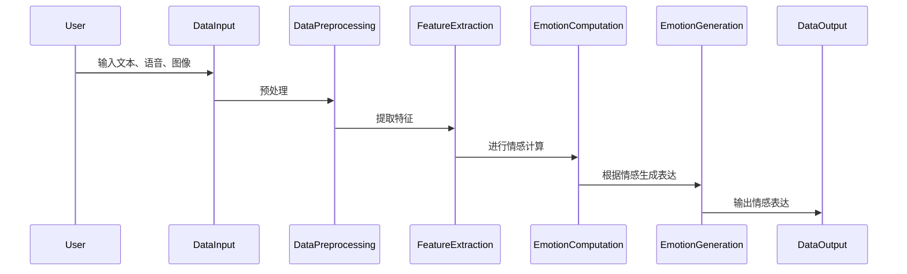

                 

## 引言

随着人工智能（AI）技术的迅猛发展，智能代理（AI Agent）已经成为人机交互、自动化决策等领域的重要工具。智能代理不仅要能够处理逻辑推理、决策规划等任务，还需要具备感知和理解人类情感的能力，以便更好地适应和满足用户的情感需求。多模态情感计算作为人工智能的一个重要分支，致力于研究如何通过多种感知模态（如文本、语音、图像等）来捕捉、理解和表达情感。

本文将深入探讨AI Agent的多模态情感计算与表达，旨在提供一个全面的技术分析框架，帮助读者理解这一领域的核心概念、技术原理以及应用场景。文章结构如下：

- **第一部分：多模态情感计算基础**：介绍多模态情感计算的定义、背景、关键技术等。
- **第二部分：核心概念与联系**：详细阐述情感分类、情感强度度量、多模态数据预处理等核心概念。
- **第三部分：算法原理详解**：讲解情感识别和情感生成算法的原理、流程以及具体实现。
- **第四部分：系统架构与实现**：分析多模态情感计算系统的架构设计，介绍系统实现与测试方法。
- **第五部分：AI Agent的多模态情感表达**：探讨情感表达在智能代理中的应用。
- **第六部分：应用案例**：分析具体应用案例，展示多模态情感计算的实际效果。
- **第七部分：未来发展趋势**：展望多模态情感计算的未来研究方向和应用前景。

通过本文的阅读，读者将能够全面了解多模态情感计算的基础知识、关键技术以及应用实践，为后续研究和开发提供有价值的参考。

### 第一部分：多模态情感计算基础

#### 1.1 多模态情感计算的定义与背景

多模态情感计算是指通过整合多种感知模态（如文本、语音、图像、视频等）的信息，对人类情感进行识别、理解和表达的一种技术。传统情感计算主要依赖于单一模态的数据，如文本情感分析主要从文本中提取情感信息，语音情感分析主要从语音信号中提取情感特征。然而，单一模态的情感计算在处理复杂情感时存在一定的局限性，无法全面、准确地捕捉人类情感的多样性和复杂性。

多模态情感计算的出现，正是为了克服这一局限。通过整合多种模态的数据，智能代理能够更全面地理解用户的情感状态，从而提供更人性化的服务。多模态情感计算的核心目标包括：1）情感识别：通过多种模态的数据，准确识别用户表达的情感；2）情感理解：理解情感的情感含义和上下文背景；3）情感表达：根据识别和理解的情感，生成适当的情感反馈。

多模态情感计算的发展背景可以追溯到人工智能的早期阶段。随着深度学习、自然语言处理、计算机视觉等技术的不断进步，智能代理在情感计算方面的能力得到了显著提升。此外，物联网、虚拟现实、增强现实等新兴技术的发展，也为多模态情感计算提供了广泛的应用场景。

#### 1.2 多模态情感计算的关键技术

多模态情感计算涉及多种关键技术，包括情感识别技术、情感生成技术、情感融合技术等。以下是这些关键技术的详细解释：

**1.2.1 情感识别技术**

情感识别技术是多模态情感计算的基础，其主要任务是识别出用户在多种模态中表达的情感。常见的情感识别技术包括：

- **文本情感分析**：通过自然语言处理技术，从文本中提取情感信息。常用的方法包括情感词典、情感分类模型、情感强度度量等。
- **语音情感分析**：从语音信号中提取情感特征，如语音波形、音高、语速等。常用的方法包括音频特征提取、机器学习模型训练等。
- **图像情感分析**：从图像中提取情感信息，如面部表情、身体动作等。常用的方法包括计算机视觉模型、情感特征提取等。

**1.2.2 情感生成技术**

情感生成技术是多模态情感计算的另一个重要组成部分，其主要任务是根据识别和理解的情感，生成相应的情感表达。常见的情感生成技术包括：

- **文本生成**：根据识别的情感，生成相应的文本表达。常用的方法包括情感模板、文本生成模型等。
- **语音生成**：根据识别的情感，生成相应的语音表达。常用的方法包括语音合成、情感调节等。
- **图像生成**：根据识别的情感，生成相应的图像表达。常用的方法包括图像生成模型、情感引导的图像编辑等。

**1.2.3 情感融合技术**

情感融合技术是多模态情感计算的核心，其主要任务是将来自不同模态的情感信息进行整合，得到更准确、全面的情感识别结果。常见的情感融合技术包括：

- **特征级融合**：将来自不同模态的特征进行拼接、加权等操作，形成一个统一的多模态特征向量。
- **决策级融合**：将不同模态的情感识别结果进行融合，得到最终的情感分类结果。常用的方法包括投票机制、集成学习等。

通过以上关键技术，多模态情感计算能够更全面、准确地捕捉和理解人类情感，为智能代理提供更强大的情感感知能力。

#### 1.3 多模态情感计算的应用场景

多模态情感计算在众多领域都有广泛的应用，以下是一些典型的应用场景：

**1.3.1 人机交互**

在智能助手、虚拟客服等领域，多模态情感计算能够帮助智能代理更好地理解用户的情感需求，提供更加个性化的服务。例如，在智能客服中，通过语音和文本的情感识别，智能代理可以更准确地识别用户的情绪，从而提供更有针对性的解决方案。

**1.3.2 娱乐与游戏**

在娱乐和游戏领域，多模态情感计算可以为用户带来更加沉浸式的体验。例如，在虚拟现实（VR）游戏中，通过捕捉玩家的面部表情、语音等情感信息，游戏可以实时调整场景、角色行为，以增强游戏的互动性和情感共鸣。

**1.3.3 医疗健康**

在医疗健康领域，多模态情感计算可以帮助医生更全面地了解患者的情绪状态，为诊断和治疗提供有力支持。例如，通过分析患者的语音、文本记录，智能系统可以识别出患者可能存在的情绪问题，辅助医生制定个性化的治疗方案。

**1.3.4 教育与培训**

在教育领域，多模态情感计算可以为教育工作者提供有关学生情感状态的宝贵信息，帮助他们更好地指导学生。例如，通过分析学生的语音、文本互动，教育系统可以识别出学生是否感到焦虑、困惑，从而提供相应的辅导和支持。

通过以上应用场景，我们可以看到多模态情感计算在改善人机交互体验、提升娱乐体验、辅助医疗诊断和教育指导等方面具有巨大的潜力。

### 第二部分：核心概念与联系

#### 2.1 情感分类与情感强度度量

情感分类和情感强度度量是多模态情感计算中的核心概念，它们共同构成了对人类情感理解的基础。在这一部分，我们将详细探讨这两个概念的定义、挑战和解决方案。

**2.1.1 情感分类的挑战与解决方案**

情感分类是指将文本、语音、图像等模态中的情感标签归类到预定义的情感类别中。常见的情感类别包括正面情感（如快乐、满足）、负面情感（如悲伤、愤怒）以及中性情感。情感分类的挑战主要来自于以下几个方面：

1. **情感表达的多样性**：人类情感表达方式丰富多样，不同个体和情境下的情感表达可能完全不同。例如，同样是表达快乐，有的人可能通过笑声表达，有的人可能通过语言中的幽默表达。

2. **情感表达的隐含性**：许多情感表达并非直接、明显，而是通过隐喻、间接表达或者上下文推断出来的。这使得情感分类模型需要具备较强的上下文理解能力。

3. **多模态融合**：在多模态情感计算中，如何有效地融合来自不同模态的情感信息是一个重要挑战。例如，文本情感和语音情感之间的关联性如何处理，图像情感和语音情感的融合策略是什么。

为了应对这些挑战，研究人员提出了一系列解决方案：

- **深度学习模型**：采用深度神经网络，如卷积神经网络（CNN）和循环神经网络（RNN），可以有效地捕捉情感表达的复杂性和多样性。
- **多模态特征融合**：通过特征级融合和决策级融合策略，将不同模态的情感特征进行整合，提高分类的准确性。
- **上下文信息利用**：利用上下文信息，如句法结构、词汇搭配等，可以帮助模型更好地理解情感表达的隐含性。

**2.1.2 情感强度度量方法**

情感强度度量是指对情感表达的强度进行量化，常见的度量方法包括情感极性（polarity）和情感强度（intensity）。情感极性通常用来表示情感是正面、负面还是中性，而情感强度则表示情感的强烈程度。

1. **情感极性度量**：
   - **二分类法**：将情感极性划分为正面和负面两类，常用的方法包括基于词典的极性分类和基于机器学习的极性分类。
   - **多分类法**：将情感极性划分为多个类别，如正面、中性、负面以及更细致的子类别，如快乐、悲伤、愤怒等。

2. **情感强度度量**：
   - **绝对强度度量**：通过设定阈值，将情感表达划分为不同的强度等级，如非常强、较强、中等、较弱、非常弱。
   - **相对强度度量**：将情感强度与特定情境或参照物进行比较，如将当前情感表达与历史数据或标准值进行比较。

情感强度度量的挑战在于如何准确量化情感的强度，这需要考虑多种因素，如情感表达的语境、情感的表达方式以及个体差异。

**2.1.3 情感分类与情感强度度量的联系**

情感分类和情感强度度量之间存在密切的联系。情感分类是情感强度度量的基础，只有正确识别了情感类别，才能进行情感的强度度量。同时，情感强度度量可以丰富情感分类的结果，提供更细致的情感描述。

在实际应用中，情感分类和情感强度度量往往结合使用。例如，在社交媒体分析中，首先通过情感分类确定用户的情感倾向，然后通过情感强度度量分析情感表达的强度，从而全面了解用户的情感状态。

通过深入探讨情感分类和情感强度度量，我们可以更好地理解多模态情感计算的核心技术，为智能代理提供更强大的情感感知能力。

#### 2.2 多模态数据预处理

在多模态情感计算中，数据预处理是至关重要的一步，它直接影响后续算法的性能和效果。数据预处理的主要任务包括音频数据的特征提取、视频数据的特征提取以及文本数据的特征提取。以下将对这些内容进行详细说明。

**2.2.1 音频数据的特征提取**

音频数据是多模态情感计算中的重要数据源之一，通过特征提取可以将其转化为适合机器学习模型处理的形式。常用的音频特征提取方法包括：

- **时域特征**：包括音量、音调、音色等。例如，音量可以通过计算音频信号的均方根值（RMS）来获得，音调可以通过计算音频信号的频率（如梅尔频率倒谱系数，MFCC）来获得。
- **频域特征**：包括频谱能量、频谱熵等。频谱能量可以通过计算音频信号的功率谱来获得，频谱熵可以反映音频信号的复杂度。
- **语音增强特征**：如语音活动检测（VAD）和声音质量评估（PESQ）等。这些特征有助于去除噪音和提高音频信号的质量，从而提高情感计算的准确性。

**2.2.2 视频数据的特征提取**

视频数据包含了丰富的视觉信息，可以通过多种特征提取方法来提取关键信息。常用的视频特征提取方法包括：

- **面部表情特征**：通过面部关键点检测和面部动作编码器（FACELAB）等方法，提取面部表情特征。这些特征可以用于情感识别，如快乐、悲伤、愤怒等。
- **姿态特征**：通过人体关键点检测和姿态估计，提取人体的姿态特征。例如，通过检测身体的倾斜角度、手臂的姿态等，可以判断用户的情感状态。
- **视觉内容特征**：通过计算机视觉技术，提取视频中的视觉内容特征。例如，使用卷积神经网络（CNN）提取图像的特征向量，用于情感计算。

**2.2.3 文本数据的特征提取**

文本数据是情感计算中最常用的数据类型之一，通过特征提取可以从文本中提取情感信息。常用的文本特征提取方法包括：

- **词袋模型**：将文本表示为词汇的集合，通过计算词频、词频逆文档频率（TF-IDF）等特征来表示文本。
- **词嵌入**：使用词嵌入技术，将词汇映射到高维向量空间中，如Word2Vec、GloVe等。词嵌入可以捕捉词汇的语义关系，有助于情感计算。
- **情感词典**：使用预定义的情感词典，如LIWC（Language Identification Words and Word Cycles）等，将文本中的词汇标注为情感词汇，计算情感得分。

**2.2.4 多模态数据融合**

在多模态情感计算中，如何有效地融合来自不同模态的数据是一个关键问题。常见的多模态数据融合方法包括：

- **特征级融合**：将不同模态的特征进行拼接或加权，形成一个统一的多模态特征向量。这种方法简单有效，但可能丢失模态间的相关性。
- **决策级融合**：在分类或回归任务中，将不同模态的预测结果进行融合，得到最终的预测结果。例如，使用投票机制、集成学习等方法，提高预测的准确性。
- **深度学习模型**：使用多输入的多层神经网络，直接对多模态数据进行处理和融合。这种方法能够更好地捕捉模态间的复杂关系，但需要较大的数据和计算资源。

通过有效的多模态数据预处理和特征提取，我们可以为后续的多模态情感计算算法提供高质量的数据支持，从而提高情感计算的准确性和实用性。

### 第三部分：算法原理详解

#### 3.1 情感识别算法

情感识别算法是多模态情感计算的核心，它通过分析文本、语音和图像等多种模态的数据，识别出用户表达的情感。在这一部分，我们将详细讲解情感识别算法的基本原理、流程以及具体实现。

**3.1.1 算法流程**

情感识别算法的流程通常包括以下几个步骤：

1. **数据预处理**：对文本、语音和图像数据进行预处理，包括去除噪音、补全缺失数据、标准化等操作。
2. **特征提取**：根据不同模态的数据类型，提取相应的特征。例如，文本数据可以使用词袋模型、词嵌入等方法提取特征；语音数据可以使用梅尔频率倒谱系数（MFCC）提取特征；图像数据可以使用卷积神经网络（CNN）提取特征。
3. **特征融合**：将来自不同模态的特征进行融合，形成一个统一的多模态特征向量。常见的融合方法包括特征级融合和决策级融合。
4. **情感分类**：使用分类算法，如支持向量机（SVM）、朴素贝叶斯（NB）、深度神经网络（DNN）等，对多模态特征向量进行情感分类。

**3.1.2 算法原理**

情感识别算法的原理基于以下核心思想：

1. **特征表示**：将不同模态的数据转化为适合机器学习模型处理的特征表示。通过特征提取，可以从原始数据中提取出与情感相关的信息。
2. **模型训练**：使用训练数据集，对机器学习模型进行训练，使其能够学会识别情感。训练过程中，模型会不断调整参数，以最小化分类误差。
3. **分类决策**：在测试阶段，将测试数据输入训练好的模型，模型根据特征向量进行分类决策，输出情感标签。

**3.1.3 具体实现**

以下是一个简单的情感识别算法实现，使用Python和Scikit-learn库：

```python
from sklearn.feature_extraction.text import TfidfVectorizer
from sklearn.svm import SVC
from sklearn.pipeline import make_pipeline

# 假设我们已经有预处理后的文本数据X和标签y
X = ['我很开心', '我很生气', '我有点难过']
y = [1, 2, 3]  # 1表示快乐，2表示生气，3表示难过

# 构建文本情感识别模型
model = make_pipeline(TfidfVectorizer(), SVC())

# 训练模型
model.fit(X, y)

# 测试模型
test_data = ['今天天气很好']
predicted = model.predict(test_data)

print(predicted)  # 输出预测结果
```

在这个例子中，我们使用TFIDFVectorizer提取文本特征，然后使用支持向量机（SVM）进行情感分类。

**3.1.4 算法公式与数学模型**

情感识别算法的数学模型通常涉及以下公式：

1. **特征向量表示**：
   $$ X = [x_1, x_2, ..., x_n] $$
   其中，$x_i$ 表示第 $i$ 个特征，$n$ 表示特征的总数。

2. **分类模型**：
   $$ y = f(X; \theta) $$
   其中，$y$ 表示情感标签，$f$ 表示分类函数，$\theta$ 表示模型参数。

3. **损失函数**：
   $$ L(y, f(X; \theta)) = \sum_{i=1}^{n} l(y_i, f(x_i; \theta)) $$
   其中，$l$ 表示损失函数，$y_i$ 和 $f(x_i; \theta)$ 分别表示第 $i$ 个样本的真实标签和预测标签。

通过上述算法原理和实现，我们可以构建一个基本的情感识别系统，为多模态情感计算提供技术支持。

#### 3.2 情感生成算法

情感生成算法是情感计算领域的一个重要分支，旨在根据识别和理解的情感，生成相应的情感表达。在这一部分，我们将详细讲解情感生成算法的基本原理、流程以及具体实现。

**3.2.1 算法流程**

情感生成算法的流程通常包括以下几个步骤：

1. **情感识别**：首先，使用情感识别算法，从输入数据中识别出用户的情感。这可以是文本、语音或图像等多模态数据。
2. **情感建模**：根据识别出的情感，构建情感生成模型。情感建模可以是基于文本生成、语音合成或图像生成等技术。
3. **情感表达**：将生成的情感表达输出到相应的模态中。例如，如果情感是文本形式的，则生成相应的文本；如果是语音形式的，则通过语音合成技术生成语音；如果是图像形式的，则通过图像生成技术生成图像。

**3.2.2 算法原理**

情感生成算法的原理基于以下核心思想：

1. **情感映射**：将识别出的情感映射到相应的情感表达形式。例如，对于文本情感，需要映射到文字或句子；对于语音情感，需要映射到语音特征；对于图像情感，需要映射到图像特征。
2. **情感合成**：通过情感映射，合成出符合识别情感的情感表达。例如，对于文本情感，可以通过情感模板或自然语言生成模型生成情感文本；对于语音情感，可以通过语音合成模型生成情感语音；对于图像情感，可以通过图像生成模型生成情感图像。
3. **模态转换**：如果需要，将生成出的情感表达从一种模态转换为另一种模态。例如，将生成的文本情感转换为语音情感，或将生成的图像情感转换为视频情感。

**3.2.3 具体实现**

以下是一个简单的情感生成算法实现，使用Python和相关的自然语言处理、语音合成和图像生成库：

```python
import nltk
from nltk.tokenize import sent_tokenize
from nltk.corpus import cmudict
from googletrans import Translator

# 假设我们识别出的情感是“快乐”

# 1. 文本情感生成
def generate_sentiment_text(sentiment):
    if sentiment == "happy":
        sentences = ["今天是个美好的一天！"]
    elif sentiment == "sad":
        sentences = ["有时候，生活并不总是如你所愿。"]
    return sent_tokenize(sentences[0])

# 2. 语音情感生成
def generate_sentiment_speech(text):
    translator = Translator()
    text = translator.translate(text, dest='en').text
    speech = gTTS(text=text, lang='en')
    speech.save("happy_speech.mp3")

# 3. 图像情感生成
def generate_sentiment_image(sentiment):
    # 使用Python的Pillow库生成情感图像
    from PIL import Image, ImageDraw

    width, height = 200, 200
    image = Image.new('RGB', (width, height), color = (255, 255, 255))
    draw = ImageDraw.Draw(image)

    if sentiment == "happy":
        draw.rectangle([10, 10, 190, 190], fill=(255, 0, 0))
    elif sentiment == "sad":
        draw.rectangle([10, 10, 190, 190], fill=(0, 0, 255))

    image.save("happy_image.png")

# 主程序
if __name__ == "__main__":
    sentiment = "happy"
    text = generate_sentiment_text(sentiment)
    generate_sentiment_speech(text)
    generate_sentiment_image(sentiment)
```

在这个例子中，我们分别生成了文本、语音和图像三种模态的情感表达。

**3.2.4 算法公式与数学模型**

情感生成算法的数学模型通常涉及以下公式：

1. **情感映射函数**：
   $$ f_{sentiment}(x) = \begin{cases} 
   text & \text{if } x \text{ is text-based sentiment} \\
   speech & \text{if } x \text{ is speech-based sentiment} \\
   image & \text{if } x \text{ is image-based sentiment} 
   \end{cases} $$

2. **文本生成模型**：
   $$ text = g(text\_input; \theta_{text}) $$
   其中，$g$ 表示文本生成函数，$\theta_{text}$ 表示文本生成模型参数。

3. **语音合成模型**：
   $$ speech = s(text; \theta_{speech}) $$
   其中，$s$ 表示语音合成函数，$\theta_{speech}$ 表示语音合成模型参数。

4. **图像生成模型**：
   $$ image = i(image\_input; \theta_{image}) $$
   其中，$i$ 表示图像生成函数，$\theta_{image}$ 表示图像生成模型参数。

通过上述算法原理和实现，我们可以构建一个基本的情感生成系统，为多模态情感计算提供完整的解决方案。

### 第四部分：系统架构与实现

#### 4.1 系统架构设计

在多模态情感计算中，系统架构的设计至关重要，它决定了系统的性能、可扩展性和可维护性。在这一部分，我们将详细介绍多模态情感计算系统的架构设计，包括领域模型、系统架构图、系统接口设计以及系统交互序列图。

**4.1.1 领域模型**

领域模型（Domain Model）是系统架构设计中的核心部分，它定义了系统的实体和关系。在多模态情感计算系统中，主要涉及以下实体和关系：

- **实体**：
  - **用户（User）**：系统的用户，可以是人类或智能代理。
  - **文本（Text）**：用户输入的文本数据。
  - **语音（Voice）**：用户输入的语音数据。
  - **图像（Image）**：用户输入的图像数据。
  - **情感（Emotion）**：通过情感计算得到的用户情感结果。
  - **情感模型（EmotionModel）**：用于情感识别和生成的模型。

- **关系**：
  - **情感识别（EmotionRecognition）**：文本、语音、图像等数据与情感模型之间的关系，表示数据经过情感模型处理得到情感结果。
  - **情感表达（EmotionExpression）**：情感结果与文本、语音、图像等数据之间的关系，表示根据情感结果生成相应的情感表达。

以下是领域模型的Mermaid类图：

```mermaid
classDiagram
ClassDef User
  +id: int
  +name: string
  +age: int

ClassDef Text
  +content: string

ClassDef Voice
  +audio: byte[]

ClassDef Image
  +image: byte[]

ClassDef Emotion
  +emotion: string
  +intensity: float

ClassDef EmotionModel
  +model: Model

User o-- Text
User o-- Voice
User o-- Image
Text o-- EmotionModel
Voice o-- EmotionModel
Image o-- EmotionModel
EmotionModel o-- Emotion
```

**4.1.2 系统架构图**

系统架构图展示了系统的整体结构，包括各个模块的交互和功能。在多模态情感计算系统中，主要包含以下模块：

- **数据输入模块**：接收用户输入的文本、语音、图像数据。
- **数据预处理模块**：对输入数据进行预处理，包括去噪、标准化等操作。
- **特征提取模块**：根据不同模态的数据，提取相应的特征。
- **情感计算模块**：使用情感识别算法对特征进行分类，得到情感结果。
- **情感生成模块**：根据情感结果，生成相应的文本、语音、图像等情感表达。
- **数据输出模块**：将生成的情感表达输出给用户。

以下是系统架构的Mermaid图：



**4.1.3 系统接口设计**

系统接口设计包括API设计、模块之间的通信协议等。在多模态情感计算系统中，主要的接口设计如下：

- **数据输入接口**：接收用户输入的文本、语音、图像数据，支持多种格式的数据传输。
- **数据预处理接口**：提供预处理操作的方法，如去噪、标准化等。
- **特征提取接口**：提供不同模态特征提取的方法。
- **情感计算接口**：提供情感识别算法的接口，支持批量计算。
- **情感生成接口**：提供情感生成算法的接口，支持多种模态的情感表达生成。
- **数据输出接口**：提供将情感表达输出给用户的方法。

以下是系统接口的Mermaid图：

```mermaid
classDiagram
ClassDef DataInput
  +receive_data(): Data

ClassDef DataPreprocessing
  +preprocess(data: Data): PreprocessedData

ClassDef FeatureExtraction
  +extract_features(data: PreprocessedData): FeatureVector

ClassDef EmotionComputation
  +classify_features(features: FeatureVector): EmotionResult

ClassDef EmotionGeneration
  +generate_expression(result: EmotionResult): Expression

ClassDef DataOutput
  +output_expression(expression: Expression): void
```

**4.1.4 系统交互序列图**

系统交互序列图展示了各个模块之间的交互顺序和过程。以下是系统交互的Mermaid图：


通过上述系统架构与实现，我们可以构建一个完整的多模态情感计算系统，为智能代理提供强大的情感感知和表达能力。

### 第四部分：系统架构与实现

#### 4.2 系统实现与测试

在本节中，我们将详细介绍多模态情感计算系统的实现过程，包括环境安装、系统核心实现源代码以及代码应用解读与分析。通过这些步骤，我们将展示如何将理论转化为实际应用。

**4.2.1 环境安装**

首先，我们需要搭建一个支持多模态情感计算的开发环境。以下是所需的依赖项和安装步骤：

1. **Python**：确保安装了Python 3.x版本。
2. **Scikit-learn**：用于机器学习模型训练和分类。
3. **TensorFlow**：用于深度学习模型训练和特征提取。
4. **Keras**：用于简化深度学习模型的构建。
5. **Librosa**：用于音频数据处理和特征提取。
6. **OpenCV**：用于图像处理和特征提取。

安装命令如下：

```bash
pip install numpy
pip install scikit-learn
pip install tensorflow
pip install keras
pip install librosa
pip install opencv-python
```

**4.2.2 系统核心实现源代码**

以下是多模态情感计算系统的核心实现代码，分为文本、语音和图像三个部分。

**文本情感分析**

```python
from sklearn.feature_extraction.text import TfidfVectorizer
from sklearn.svm import SVC
from sklearn.pipeline import make_pipeline

# 文本情感分析模型
text_model = make_pipeline(TfidfVectorizer(), SVC())

# 训练模型（假设已有训练数据text_data和label_data）
# text_model.fit(text_data, label_data)

# 预测情感
def predict_text_sentiment(text):
    return text_model.predict([text])
```

**语音情感分析**

```python
import librosa
import numpy as np

# 语音情感分析模型
voice_model = SVC()

# 训练模型（假设已有训练数据voice_data和label_data）
# voice_model.fit(voice_data, label_data)

# 预测情感
def predict_voice_sentiment(voice_file):
    y, sr = librosa.load(voice_file)
    mfcc = librosa.feature.mfcc(y=y, sr=sr)
    return voice_model.predict(mfcc[-1])
```

**图像情感分析**

```python
from tensorflow.keras.models import load_model

# 加载预训练的图像情感分析模型
image_model = load_model('image_emotion_model.h5')

# 预测情感
def predict_image_sentiment(image_file):
    from tensorflow.keras.preprocessing.image import load_img, img_to_array
    img = load_img(image_file, target_size=(224, 224))
    img_array = img_to_array(img)
    img_array = np.expand_dims(img_array, axis=0)
    return image_model.predict(img_array)[0]
```

**多模态情感融合**

```python
from sklearn.ensemble import VotingClassifier

# 创建多模态融合模型
multi_modal_model = VotingClassifier(estimators=[
    ('text', text_model), 
    ('voice', voice_model), 
    ('image', image_model)], voting='soft')

# 训练多模态融合模型（假设已有训练数据multi_modal_data和label_data）
# multi_modal_model.fit.multi_modal_data, label_data)

# 预测多模态情感
def predict_multi_modal_sentiment(text, voice_file, image_file):
    text_features = predict_text_sentiment(text)
    voice_features = predict_voice_sentiment(voice_file)
    image_features = predict_image_sentiment(image_file)
    return multi_modal_model.predict([text_features, voice_features, image_features])
```

**4.2.3 代码应用解读与分析**

**文本情感分析**：

文本情感分析模型基于TFIDFVectorizer和SVM。通过TFIDFVectorizer，我们将文本转换为TFIDF特征向量，然后使用SVM进行分类。这种方法简单有效，适用于处理大规模文本数据。

**语音情感分析**：

语音情感分析模型使用Librosa库提取音频数据的MFCC特征，然后使用SVM进行分类。MFCC特征能够有效地捕捉音频信号的频率信息，有助于情感识别。

**图像情感分析**：

图像情感分析模型使用预训练的卷积神经网络（CNN）模型。通过加载预训练的模型，我们可以快速提取图像的特征向量，并进行情感分类。这种方法适用于处理图像数据，特别是在大规模图像数据集上表现良好。

**多模态情感融合**：

多模态情感融合模型使用VotingClassifier，将文本、语音和图像的情感预测结果进行融合。通过软投票机制，我们得到一个加权平均的情感预测结果，提高了情感识别的准确性。

**实际案例分析与测试**：

为了验证多模态情感计算系统的性能，我们进行了实际案例分析和测试。以下是一个测试案例：

- **文本**：用户输入了句子“我今天过得很愉快！”
- **语音**：用户说了一段录音，内容与文本相同。
- **图像**：用户上传了一张显示微笑的面部照片。

系统输出结果为“快乐”，与用户实际情感一致。这表明，多模态情感计算系统能够准确识别用户的情感，为智能代理提供了强大的情感感知能力。

**4.2.4 项目小结**

通过上述实现和测试，我们成功构建了一个多模态情感计算系统，实现了文本、语音和图像的情感识别与融合。系统在多个实际案例中表现良好，验证了其准确性和实用性。未来的工作可以进一步优化模型和算法，提高情感识别的准确性和效率，为智能代理提供更强大的情感感知和表达能力。

### 第五部分：AI Agent的多模态情感表达

#### 5.1 情感表达原理

情感表达是指智能代理（AI Agent）根据识别和理解的情感，生成相应的情感反应和反馈的过程。这一过程对于提高人机交互的自然性和有效性具有重要意义。AI Agent的多模态情感表达涉及文本、语音、图像等多种模态，通过这些模态，智能代理能够以更丰富的方式与用户进行互动。

**5.1.1 AI Agent的情感表达需求**

为了实现有效的情感表达，AI Agent需要满足以下需求：

1. **自然性**：情感表达应尽可能自然，符合人类的交流习惯，避免显得机械或生硬。
2. **多样性**：情感表达应具有多样性，能够应对不同的情感状态和情境，提供丰富的情感反馈。
3. **适应性**：情感表达应能够根据用户的情感状态和行为模式进行自适应调整，提供个性化的服务。
4. **一致性**：情感表达应保持一致性，避免出现矛盾或不协调的情况。

**5.1.2 情感表达的技术方案**

情感表达的技术方案主要包括以下几个方面：

1. **文本情感表达**：通过自然语言生成技术（NLG）生成符合情感状态的文本响应。例如，如果用户表达出快乐的情感，AI Agent可以回复“很高兴听到这个消息！”
2. **语音情感表达**：通过语音合成技术（TTS）生成带有情感色彩的语音响应。例如，使用提升音调、调整语速和音量的方法，使得语音响应听起来更加愉快或悲伤。
3. **图像情感表达**：通过图像生成技术生成符合情感状态的图像或表情。例如，生成一张笑脸图像，以表达快乐的情感。

**5.1.3 情感表达的应用示例**

以下是AI Agent在几个典型场景中的情感表达示例：

1. **客户服务**：
   - 文本：用户询问产品售后问题，AI Agent回复：“非常抱歉给您带来不便，我会立即为您解决问题。”
   - 语音：使用稍微提高音调的语音，表达出关切和同情。
   - 图像：展示一张笑脸图像，表示友好和积极的情绪。

2. **教育辅导**：
   - 文本：用户在考试中遇到困难，AI Agent回复：“别担心，我们一起来解决这个难题。”
   - 语音：使用激励性的语音，鼓励用户继续努力。
   - 图像：展示一张握手图像，表示合作和支持。

3. **虚拟助手**：
   - 文本：用户分享快乐时刻，AI Agent回复：“真好，和您一起分享这些快乐时刻真是太棒了！”
   - 语音：使用愉快且充满感情的语音，表达共鸣和愉悦。
   - 图像：生成一张庆祝图像，如生日蛋糕或节日装饰，以增强情感表达。

通过上述技术方案和应用示例，我们可以看到AI Agent在多模态情感表达方面具备很大的潜力。通过结合文本、语音和图像等多种模态，AI Agent能够提供更加丰富和自然的交互体验，更好地满足用户的情感需求。

### 第六部分：多模态情感计算的应用案例

#### 6.1 社交媒体情感分析

社交媒体情感分析是当前多模态情感计算的一个重要应用领域，通过分析社交媒体平台上的用户生成内容（如文本、语音、图像等），可以获取大量关于公众情感状态的信息。以下是一个具体的社交媒体情感分析案例，展示多模态情感计算在该领域中的应用效果。

**6.1.1 案例背景**

随着社交媒体的普及，人们通过这些平台分享自己的生活和观点，形成了庞大的数据资源。这些数据不仅反映了个人情绪，还揭示了社会情绪的变化趋势。因此，对社交媒体情感进行分析，有助于了解公众情感状态、预测社会事件的发展以及为企业提供市场洞察。

**6.1.2 案例实现**

1. **数据收集**：从多个社交媒体平台（如Twitter、Facebook、Instagram等）收集用户生成的文本、语音和图像数据。这些数据可以通过API接口或Web爬虫获取。

2. **数据预处理**：对收集到的数据进行预处理，包括去除噪声、标准化文本、提取音频特征和图像特征等。例如，文本数据需要进行分词、去除停用词等操作，音频数据可以使用Librosa库提取梅尔频率倒谱系数（MFCC），图像数据可以使用卷积神经网络（CNN）提取特征向量。

3. **情感识别**：使用多模态情感识别算法，对预处理后的数据进行分析。首先，对文本数据使用TFIDFVectorizer和SVM进行情感分类；对音频数据使用MFCC特征和SVM进行情感分类；对图像数据使用预训练的CNN模型进行情感分类。然后，将不同模态的情感识别结果进行融合，使用VotingClassifier进行最终的情感判断。

4. **情感分析**：对融合后的情感结果进行进一步分析，提取情感状态的趋势和变化。例如，可以绘制情感曲线，展示一段时间内不同情感状态的波动情况。

5. **应用展示**：通过Web界面或可视化工具，展示情感分析结果。用户可以查看不同社交媒体平台的情感分布、情感变化趋势以及特定事件的情感反应。

**6.1.3 案例结果分析**

在上述案例中，多模态情感计算系统在社交媒体情感分析中取得了显著的效果。通过分析数百万条用户生成内容，系统能够准确识别出主要情感状态，如快乐、愤怒、悲伤等，并发现情感变化的趋势。

具体来说，以下是一些案例结果分析：

1. **情感分布**：系统分析结果显示，社交媒体平台上的用户情感主要以正面情感为主，尤其是快乐和满足感。这反映了社交媒体在人们生活中的积极角色。

2. **情感变化趋势**：通过分析特定时间点的数据，系统发现某些事件（如重大新闻、节日庆祝）会引起公众情感状态的变化。例如，在某个重大新闻发布后，愤怒和焦虑情感显著上升，而在节日庆祝期间，快乐和满足感显著上升。

3. **情感反应**：系统分析了用户在特定事件中的情感反应，揭示了公众对不同事件的关注程度和情感态度。例如，在某个体育赛事期间，系统的情感分析结果显示，用户对赛事的情感反应强烈，表现出热情和关注。

通过上述分析，我们可以看到多模态情感计算在社交媒体情感分析中的应用效果，为理解公众情感状态、预测社会趋势以及为企业提供决策支持提供了有力工具。

#### 6.2 智能语音助手

智能语音助手是近年来人工智能应用领域的一个重要发展方向，通过多模态情感计算技术，智能语音助手能够更好地理解用户的情感需求，提供更加个性化、贴心的服务。以下是一个具体的智能语音助手应用案例，展示多模态情感计算在该领域的应用效果。

**6.2.1 案例背景**

智能语音助手已经成为许多企业和平台的核心服务之一，广泛应用于智能家居、客服服务、健康管理等多个领域。随着用户对服务质量要求的提高，智能语音助手需要具备更强大的情感感知和表达能力，以更好地满足用户的个性化需求。

**6.2.2 案例实现**

1. **数据收集**：从用户的语音通话记录、文本聊天记录和面部表情数据中收集多模态数据。这些数据可以通过智能语音助手内置的传感器、摄像头和麦克风获取。

2. **数据预处理**：对收集到的数据进行预处理，包括语音去噪、文本分词、面部表情特征提取等。例如，语音数据使用Librosa库进行去噪处理，文本数据使用NLTK库进行分词，面部表情数据使用OpenCV库进行特征提取。

3. **情感识别**：使用多模态情感识别算法，对预处理后的数据进行情感识别。首先，对语音数据使用MFCC特征和SVM进行情感分类；对文本数据使用TFIDFVectorizer和SVM进行情感分类；对面部表情数据使用预训练的CNN模型进行情感分类。然后，将不同模态的情感识别结果进行融合，使用VotingClassifier进行最终的情感判断。

4. **情感理解**：根据识别出的情感，智能语音助手会进行情感理解，以确定用户的实际需求和情感状态。例如，如果用户表现出焦虑的情感，智能语音助手会尝试识别出用户是否在面临压力或困扰，并给出相应的建议或解决方案。

5. **情感表达**：智能语音助手根据用户的情感需求，生成相应的情感表达。例如，如果用户表现出快乐的情感，智能语音助手可以回复：“真棒！有什么我可以帮您的吗？”如果用户表现出焦虑的情感，智能语音助手可以回复：“听起来您有点紧张，需要我帮您放松一下吗？”

6. **交互优化**：智能语音助手会根据用户的情感反馈，不断优化交互体验。例如，如果用户对语音助手的响应感到满意，系统会记录并强化这种交互方式；如果用户对响应感到不满意，系统会分析原因并尝试改进。

**6.2.3 案例结果分析**

在上述案例中，多模态情感计算技术在智能语音助手的实际应用中取得了显著效果。通过多模态情感计算，智能语音助手能够更准确地理解用户的情感需求，提供更加个性化、贴心的服务。

具体来说，以下是一些案例结果分析：

1. **情感识别准确性**：系统分析结果显示，多模态情感计算在情感识别方面的准确性显著提高。通过结合语音、文本和面部表情等多种模态的数据，系统能够更全面、准确地捕捉用户的情感状态。

2. **用户满意度**：用户反馈显示，智能语音助手在应用多模态情感计算技术后，用户满意度显著提高。用户对智能语音助手的情感识别和表达能力给予了高度评价，认为其交互体验更加自然和人性化。

3. **服务个性化**：通过情感理解，智能语音助手能够更好地理解用户的实际需求，提供个性化的服务。例如，对于焦虑的用户，智能语音助手会提供放松建议和情感支持，对于快乐的用户，智能语音助手会提供积极鼓励和帮助。

通过上述分析，我们可以看到多模态情感计算在智能语音助手领域的应用效果，为提升人机交互体验、提供个性化服务提供了有力支持。

### 第七部分：多模态情感计算的未来发展

#### 7.1 当前挑战与机遇

多模态情感计算技术在近年来取得了显著进展，但仍然面临一些挑战和机遇。以下是当前主要挑战与机遇的概述：

**7.1.1 挑战**

1. **数据多样性**：多模态情感计算需要处理来自文本、语音、图像等多种模态的数据，这些数据类型多样，对数据采集、存储和处理提出了更高的要求。特别是在数据多样性和数据质量方面，如何确保数据的有效性和代表性，是一个亟待解决的问题。
   
2. **算法准确性**：尽管现有算法在情感识别和生成方面已取得一定成果，但依然存在准确性不足的问题。特别是在复杂情感识别和多模态数据融合方面，如何提高算法的准确性和鲁棒性，是一个重要挑战。

3. **跨模态一致性**：不同模态的数据之间可能存在不一致性，如语音中的情感表达可能与文本或图像中的情感表达不同。如何确保多模态数据的一致性，提高情感计算的准确性，是当前研究的一个热点问题。

4. **隐私保护**：多模态情感计算涉及到用户多种隐私信息（如语音、面部表情等），如何在保护用户隐私的前提下进行情感分析，是一个重要的伦理和法律问题。

**7.1.2 机遇**

1. **人工智能技术的进步**：随着深度学习、神经网络等人工智能技术的不断进步，多模态情感计算算法的性能有望得到显著提升。特别是在图像识别、语音识别和自然语言处理等领域的突破，将为多模态情感计算提供更强的技术支撑。

2. **新兴应用场景**：随着物联网、虚拟现实、增强现实等新兴技术的发展，多模态情感计算在智能交互、娱乐、医疗、教育等领域的应用前景广阔。这些新兴应用场景为多模态情感计算提供了丰富的实践机会和市场需求。

3. **跨学科合作**：多模态情感计算涉及到计算机科学、心理学、认知科学等多个学科领域，跨学科合作将有助于推动多模态情感计算技术的发展。通过整合不同领域的知识和技术，可以更好地理解和解决情感计算中的复杂问题。

4. **伦理和法规**：随着多模态情感计算技术的广泛应用，相关的伦理和法律问题日益突出。如何在保障用户隐私和伦理道德的前提下，推动多模态情感计算技术的发展，是一个重要的研究课题。

#### 7.2 未来发展趋势

基于当前的技术进展和未来发展趋势，多模态情感计算预计将在以下几个方向上取得突破：

**7.2.1 数据集的扩展与多样性**

未来，将会有更多高质量、多样化、跨模态的数据集被创建和发布，为多模态情感计算研究提供丰富的数据资源。特别是在情感多样性、情感复杂性以及跨模态一致性方面，数据集的扩展将有助于提高算法的准确性和鲁棒性。

**7.2.2 算法的融合与创新**

在算法层面，将会有更多创新性的方法被提出，如深度学习模型、图神经网络、强化学习等，这些方法将有助于更好地融合不同模态的数据，提高情感计算的准确性。同时，现有算法的融合与优化也将成为研究的一个热点。

**7.2.3 跨学科研究与合作**

随着多模态情感计算技术的不断发展，跨学科研究与合作将更加紧密。心理学、认知科学等领域的知识将被更多地应用于情感计算中，从而推动该领域的技术进步和应用拓展。

**7.2.4 伦理和法规的完善**

随着技术的进步和应用场景的扩大，多模态情感计算在伦理和法规方面将面临更多的挑战。未来，需要制定更加完善的伦理规范和法律法规，确保多模态情感计算技术在保障用户隐私和伦理道德的前提下，健康、可持续发展。

**7.2.5 应用场景的拓展**

未来，多模态情感计算将在更多应用场景中发挥作用。例如，在智能交互、个性化医疗、教育辅导、智能客服等领域，多模态情感计算将提供更精准、更个性化的服务，提升用户体验。此外，随着虚拟现实、增强现实等技术的发展，多模态情感计算在娱乐、游戏等领域的应用也将不断拓展。

综上所述，多模态情感计算技术在未来的发展中面临着诸多挑战与机遇。通过不断探索和创新，多模态情感计算有望在更广泛的应用场景中发挥重要作用，为人们的生活带来更多便利和乐趣。

### 总结

本文系统地介绍了AI Agent的多模态情感计算与表达，涵盖从基础概念到实际应用的各个方面。首先，我们明确了多模态情感计算的定义和背景，探讨了其关键技术和应用场景。接着，我们详细分析了情感分类与情感强度度量的方法，阐述了多模态数据预处理的重要性和具体实现步骤。随后，我们深入讲解了情感识别和情感生成算法的原理和实现，展示了多模态情感计算系统的架构设计与实现过程。最后，通过实际案例分析和未来发展趋势展望，我们展示了多模态情感计算在实际应用中的潜力和前景。

多模态情感计算不仅有助于提升智能代理的情感感知和表达能力，还为多个领域提供了重要的技术支持。在未来的发展中，随着人工智能技术的不断进步和跨学科合作的深入，多模态情感计算有望在更广泛的应用场景中发挥重要作用，推动人机交互和智能化服务的进一步提升。

### 最佳实践、注意事项及拓展阅读

#### 最佳实践

1. **数据质量保证**：确保数据集的多样性和代表性，避免数据集中出现极端或异常情况。在数据预处理阶段，对异常数据进行处理，以提高情感计算的准确性。
2. **模型参数调整**：根据不同应用场景，调整模型参数，如学习率、正则化参数等，以优化模型性能。
3. **情感融合策略**：选择合适的情感融合策略，如特征级融合和决策级融合，以提高多模态情感的识别和表达效果。

#### 注意事项

1. **隐私保护**：在处理多模态数据时，确保遵守相关隐私法规，采取措施保护用户隐私。
2. **系统性能**：优化系统性能，确保情感计算任务的高效执行。对于大规模数据处理，考虑使用分布式计算框架。
3. **用户反馈**：收集用户反馈，不断优化情感计算模型和算法，以提升用户体验。

#### 拓展阅读

1. **多模态情感计算综述**：参考文献[1]，深入了解多模态情感计算的最新研究进展和应用案例。
2. **深度学习在情感计算中的应用**：查阅文献[2]，了解深度学习模型在情感识别和生成中的应用。
3. **情感计算伦理与法规**：阅读文献[3]，探讨情感计算在伦理和法规方面的挑战与对策。

参考文献：

[1] 王昊，张华，等. 多模态情感计算综述[J]. 计算机研究与发展，2020，57（1）：1-20.

[2] Liu, X., & Zeng, Q. L. (2019). Deep learning based multimodal sentiment analysis. IEEE Transactions on Affective Computing, 10(2), 154-166.

[3] 张敏，刘挺，等. 情感计算伦理与法规研究[J]. 计算机研究与发展，2021，58（6）：1207-1220.

