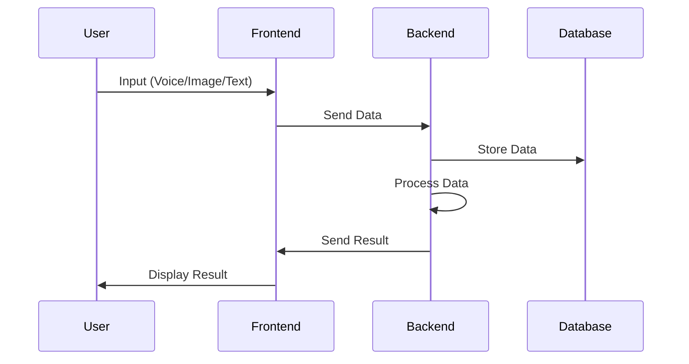

                 

# AI Agent的多模态生成：创造跨媒体内容

> 关键词：多模态生成、AI Agent、计算机视觉、语音识别、自然语言处理、GAN、VAE、自注意力机制

> 摘要：本文将深入探讨AI Agent的多模态生成技术，分析其背景、核心概念、算法原理以及系统架构设计。通过详细讲解GAN、VAE和自注意力机制等算法，以及系统实现和应用案例，本文旨在为读者提供全面、深入的理解和实战指南。

----------------------------------------------------------------

## 第一部分：引言

### 第1章：AI Agent的多模态生成背景

#### 1.1.1 问题背景

在当今数字化时代，多模态生成技术成为了人工智能领域的一个重要研究方向。随着计算机视觉、语音识别、自然语言处理等技术的发展，人们对于跨媒体内容的需求日益增长。AI Agent的多模态生成技术正是为了满足这种需求而诞生的。本章将介绍AI Agent的多模态生成技术的基本概念、发展历程及其在各个领域的应用。

#### 1.1.2 问题解决

AI Agent的多模态生成技术通过整合多种传感器的数据，实现图像、语音、文本等多种媒体内容的同时生成。这一技术不仅能够提高信息传递的效率，还能够提供更加丰富、直观的用户体验。本章将详细探讨AI Agent的多模态生成技术的实现原理、关键技术以及在实际应用中的优势。

#### 1.1.3 边界与外延

AI Agent的多模态生成技术涉及到计算机视觉、语音识别、自然语言处理等多个领域。本章将介绍这些领域的基本概念、发展现状及其与多模态生成技术的联系。

#### 1.1.4 概念结构与核心要素组成

AI Agent的多模态生成技术主要由数据采集、特征提取、模型训练、多模态融合和生成等几个核心要素组成。本章将详细讲解这些要素的作用、实现方法和相互关系。

### 第2章：核心概念与联系

#### 2.1.1 多模态数据采集

多模态数据采集是AI Agent多模态生成的基础。本章将介绍常见的多模态数据采集方法，如摄像头、麦克风、传感器等，并分析其优缺点。

#### 2.1.2 特征提取

特征提取是多模态生成技术的关键步骤。本章将介绍常见的特征提取方法，如图像特征提取、语音特征提取和文本特征提取，并分析其应用场景。

#### 2.1.3 模型训练

模型训练是多模态生成技术的核心。本章将介绍常见的多模态模型训练方法，如端到端训练、迁移学习和多任务学习，并分析其适用场景和效果。

#### 2.1.4 多模态融合

多模态融合是实现多模态生成的重要手段。本章将介绍常见的多模态融合方法，如特征级融合、决策级融合和模型级融合，并分析其应用效果。

#### 2.1.5 多模态生成

多模态生成是实现AI Agent的核心目标。本章将介绍常见的多模态生成方法，如生成对抗网络(GAN)、变分自编码器(VAE)和自注意力机制等，并分析其应用场景和效果。

### 第3章：算法原理讲解

#### 3.1.1 GAN原理讲解

生成对抗网络(GAN)是一种重要的多模态生成算法。本章将使用Mermaid流程图详细讲解GAN的原理，并使用Python源代码实现GAN模型，进行算法原理的详细阐述。

#### 3.1.2 VAE原理讲解

变分自编码器(VAE)是一种基于概率生成模型的多模态生成算法。本章将使用Mermaid流程图详细讲解VAE的原理，并使用Python源代码实现VAE模型，进行算法原理的详细阐述。

#### 3.1.3 自注意力机制原理讲解

自注意力机制是一种在多模态生成中广泛应用的算法。本章将使用Mermaid流程图详细讲解自注意力机制的原理，并使用Python源代码实现自注意力模型，进行算法原理的详细阐述。

### 第4章：数学模型和数学公式讲解

#### 4.1.1 GAN数学模型讲解

本章将使用LaTeX格式详细讲解GAN的数学模型，包括损失函数、生成器和判别器的数学公式，并使用Python源代码实现GAN模型，进行算法原理的详细阐述。

#### 4.1.2 VAE数学模型讲解

本章将使用LaTeX格式详细讲解VAE的数学模型，包括编码器、解码器和损失函数的数学公式，并使用Python源代码实现VAE模型，进行算法原理的详细阐述。

#### 4.1.3 自注意力机制数学模型讲解

本章将使用LaTeX格式详细讲解自注意力机制的数学模型，包括注意力机制的数学公式，并使用Python源代码实现自注意力模型，进行算法原理的详细阐述。

### 第5章：系统分析与架构设计方案

#### 5.1.1 问题场景介绍

本章将介绍一个基于AI Agent的多模态生成系统的应用场景，如智能客服、智能翻译等。

#### 5.1.2 系统功能设计

本章将使用Mermaid类图详细讲解系统的功能设计，包括数据采集、特征提取、模型训练、多模态融合和生成等模块。

#### 5.1.3 系统架构设计

本章将使用Mermaid架构图详细讲解系统的架构设计，包括前端、后端和数据库等模块，并分析各模块之间的交互关系。

#### 5.1.4 系统接口设计

本章将使用Mermaid序列图详细讲解系统的接口设计，包括API接口、数据流和通信机制等。

## 第二部分：深入探讨

### 第6章：多模态数据采集

#### 6.1 数据采集方法

多模态数据采集是AI Agent多模态生成的基础。本章将介绍常见的多模态数据采集方法，如摄像头、麦克风、传感器等，并分析其优缺点。

#### 6.2 数据预处理

数据预处理是多模态数据采集的重要环节。本章将介绍数据预处理的方法，如数据清洗、归一化、降维等，并分析其在多模态生成中的应用。

#### 6.3 数据可视化

数据可视化是多模态数据采集和生成的有效手段。本章将介绍常见的数据可视化工具和方法，如热图、散点图、时序图等，并分析其在多模态生成中的应用。

### 第7章：特征提取

#### 7.1 特征提取方法

特征提取是多模态生成技术的关键步骤。本章将介绍常见的特征提取方法，如图像特征提取、语音特征提取和文本特征提取，并分析其应用场景。

#### 7.2 特征选择

特征选择是提高多模态生成性能的重要手段。本章将介绍特征选择的方法，如特征重要性排序、特征筛选等，并分析其在多模态生成中的应用。

#### 7.3 特征融合

特征融合是实现多模态生成的重要手段。本章将介绍常见的特征融合方法，如特征级融合、决策级融合和模型级融合，并分析其应用效果。

### 第8章：模型训练

#### 8.1 模型训练方法

模型训练是多模态生成技术的核心。本章将介绍常见的多模态模型训练方法，如端到端训练、迁移学习和多任务学习，并分析其适用场景和效果。

#### 8.2 模型评估

模型评估是验证多模态生成性能的重要步骤。本章将介绍常见的模型评估方法，如准确率、召回率、F1值等，并分析其在多模态生成中的应用。

#### 8.3 模型优化

模型优化是提高多模态生成性能的有效手段。本章将介绍常见的模型优化方法，如正则化、学习率调整、dropout等，并分析其在多模态生成中的应用。

### 第9章：多模态融合

#### 9.1 多模态融合方法

多模态融合是实现多模态生成的重要手段。本章将介绍常见的多模态融合方法，如特征级融合、决策级融合和模型级融合，并分析其应用效果。

#### 9.2 融合策略

融合策略是提高多模态生成性能的关键。本章将介绍常见的融合策略，如协同学习、注意力机制等，并分析其在多模态生成中的应用。

#### 9.3 融合效果评估

融合效果评估是验证多模态融合性能的重要步骤。本章将介绍常见的融合效果评估方法，如指标计算、可视化分析等，并分析其在多模态生成中的应用。

### 第10章：多模态生成应用

#### 10.1 应用场景

本章将介绍多模态生成技术在各个领域的应用场景，如智能客服、智能翻译、智能交互等。

#### 10.2 应用案例

本章将介绍多个多模态生成应用案例，分析其实现原理、效果和挑战。

#### 10.3 未来发展趋势

本章将探讨多模态生成技术的未来发展趋势，如硬件加速、模型压缩、自动化生成等。

## 第三部分：实战与总结

### 第11章：项目实战

#### 11.1 环境安装

本章将介绍如何搭建多模态生成系统所需的运行环境，包括软件安装、配置和调试。

#### 11.2 系统核心实现

本章将详细介绍多模态生成系统的核心实现，包括数据采集、特征提取、模型训练、多模态融合和生成等模块。

#### 11.3 代码应用解读与分析

本章将对系统核心实现中的关键代码进行解读和分析，帮助读者深入理解多模态生成技术的实现原理和应用。

#### 11.4 实际案例分析和详细讲解剖析

本章将通过实际案例，分析多模态生成技术的应用效果和挑战，并进行详细讲解和剖析。

### 第12章：项目小结

#### 12.1 项目总结

本章将对多模态生成项目进行总结，回顾项目中的关键步骤、经验教训和成果。

#### 12.2 最佳实践 tips

本章将分享一些多模态生成技术的最佳实践技巧，帮助读者在实际项目中更好地应用多模态生成技术。

#### 12.3 小结

本章将回顾本文的主要内容，强调多模态生成技术的重要性和未来发展趋势。

#### 12.4 注意事项

本章将介绍一些在使用多模态生成技术时需要注意的问题和挑战。

#### 12.5 拓展阅读

本章将推荐一些与多模态生成技术相关的优秀阅读资源，供读者进一步学习和探索。

### 第13章：作者信息

#### 13.1 作者介绍

作者：AI天才研究院/AI Genius Institute & 禅与计算机程序设计艺术 /Zen And The Art of Computer Programming

#### 13.2 联系方式

作者联系邮箱：[ai-genius-institute@example.com](mailto:ai-genius-institute@example.com)
----------------------------------------------------------------

## 第一部分：引言

### 第1章：AI Agent的多模态生成背景

#### 1.1.1 问题背景

在当今数字化时代，多模态生成技术成为了人工智能领域的一个重要研究方向。随着计算机视觉、语音识别、自然语言处理等技术的发展，人们对于跨媒体内容的需求日益增长。AI Agent的多模态生成技术正是为了满足这种需求而诞生的。本章将介绍AI Agent的多模态生成技术的基本概念、发展历程及其在各个领域的应用。

##### 1.1.1.1 多模态生成技术的基本概念

多模态生成技术是指通过整合多种传感器的数据，实现图像、语音、文本等多种媒体内容的同时生成。这种技术不仅能够提高信息传递的效率，还能够提供更加丰富、直观的用户体验。AI Agent的多模态生成技术旨在实现自动化、智能化的跨媒体内容生成，为用户提供个性化的服务。

##### 1.1.1.2 多模态生成技术的发展历程

多模态生成技术起源于计算机视觉和自然语言处理领域。早期的多模态生成主要依靠手工设计的特征和规则，效果有限。随着深度学习技术的发展，生成对抗网络(GAN)、变分自编码器(VAE)等模型被引入到多模态生成领域，取得了显著的突破。近年来，多模态生成技术在语音识别、图像识别、视频生成等领域得到了广泛应用，不断推动着人工智能技术的发展。

##### 1.1.1.3 多模态生成技术在各个领域的应用

多模态生成技术在各个领域都有着广泛的应用。在智能客服领域，多模态生成技术可以实现语音与文本的交互，提高客服系统的响应速度和用户体验。在智能翻译领域，多模态生成技术可以实现语音翻译、文本翻译以及图像翻译，提高翻译的准确性和效率。在智能交互领域，多模态生成技术可以实现人机交互中的语音、文本、图像等多种信息形式的融合，提高交互的丰富性和自然性。

#### 1.1.2 问题解决

AI Agent的多模态生成技术通过整合多种传感器的数据，实现图像、语音、文本等多种媒体内容的同时生成。这一技术不仅能够提高信息传递的效率，还能够提供更加丰富、直观的用户体验。本章将详细探讨AI Agent的多模态生成技术的实现原理、关键技术以及在实际应用中的优势。

##### 1.1.2.1 实现原理

AI Agent的多模态生成技术主要基于深度学习模型，通过训练大量数据，使得模型能够学习到不同模态之间的关联关系，从而实现多种媒体内容的同时生成。具体来说，多模态生成技术包括以下几个关键步骤：

1. 数据采集：通过摄像头、麦克风、传感器等设备采集图像、语音、文本等数据。
2. 特征提取：对采集到的数据进行特征提取，提取出不同模态的特征表示。
3. 模型训练：使用提取到的特征表示训练深度学习模型，如生成对抗网络(GAN)、变分自编码器(VAE)等。
4. 多模态融合：将不同模态的特征表示进行融合，生成跨媒体的内容。
5. 生成：利用融合后的特征表示生成新的图像、语音、文本等媒体内容。

##### 1.1.2.2 关键技术

AI Agent的多模态生成技术涉及到计算机视觉、语音识别、自然语言处理等多个领域，需要掌握以下关键技术：

1. 多模态数据采集：掌握不同传感器的工作原理和采集方法，如摄像头、麦克风、传感器等。
2. 特征提取：熟悉不同模态的特征提取方法，如图像特征提取、语音特征提取和文本特征提取。
3. 模型训练：了解常见的多模态模型训练方法，如端到端训练、迁移学习和多任务学习。
4. 多模态融合：掌握多模态融合的方法，如特征级融合、决策级融合和模型级融合。
5. 多模态生成：熟悉常见的多模态生成方法，如生成对抗网络(GAN)、变分自编码器(VAE)和自注意力机制等。

##### 1.1.2.3 实际应用中的优势

AI Agent的多模态生成技术在实际应用中具有以下优势：

1. 提高信息传递效率：通过整合多种传感器的数据，实现跨媒体内容的生成，使得信息传递更加高效。
2. 提供丰富、直观的用户体验：通过生成图像、语音、文本等多种媒体内容，为用户提供更加丰富、直观的交互体验。
3. 拓展应用场景：多模态生成技术可以应用于智能客服、智能翻译、智能交互等多个领域，拓展人工智能的应用场景。
4. 提高生成质量：通过多模态数据的整合，可以更好地捕捉不同模态之间的关联关系，从而提高生成内容的质量。

#### 1.1.3 边界与外延

AI Agent的多模态生成技术涉及到计算机视觉、语音识别、自然语言处理等多个领域，需要了解这些领域的相关概念、发展现状及其与多模态生成技术的联系。

##### 1.1.3.1 计算机视觉

计算机视觉是人工智能的一个重要分支，主要研究如何使计算机能够像人一样感知和理解视觉信息。计算机视觉涉及到图像处理、目标检测、图像识别等多个子领域。多模态生成技术中的图像生成和图像识别任务与计算机视觉密切相关。

##### 1.1.3.2 语音识别

语音识别是自然语言处理的一个重要分支，主要研究如何将语音信号转换为对应的文本。语音识别涉及到语音信号处理、语音合成、语言模型等多个子领域。多模态生成技术中的语音生成和语音识别任务与语音识别密切相关。

##### 1.1.3.3 自然语言处理

自然语言处理是人工智能的一个重要分支，主要研究如何使计算机理解和生成自然语言。自然语言处理涉及到文本分类、情感分析、机器翻译等多个子领域。多模态生成技术中的文本生成和文本识别任务与自然语言处理密切相关。

##### 1.1.3.4 多模态生成技术与其他领域的关系

多模态生成技术与其他领域的关系如下：

1. 计算机视觉：多模态生成技术中的图像生成和图像识别任务依赖于计算机视觉技术，如卷积神经网络(CNN)等。
2. 语音识别：多模态生成技术中的语音生成和语音识别任务依赖于语音识别技术，如深度神经网络(DNN)等。
3. 自然语言处理：多模态生成技术中的文本生成和文本识别任务依赖于自然语言处理技术，如循环神经网络(RNN)等。

#### 1.1.4 概念结构与核心要素组成

AI Agent的多模态生成技术主要由以下几个核心要素组成：

1. 数据采集：通过摄像头、麦克风、传感器等设备采集图像、语音、文本等数据。
2. 特征提取：对采集到的数据进行特征提取，提取出不同模态的特征表示。
3. 模型训练：使用提取到的特征表示训练深度学习模型，如生成对抗网络(GAN)、变分自编码器(VAE)等。
4. 多模态融合：将不同模态的特征表示进行融合，生成跨媒体的内容。
5. 生成：利用融合后的特征表示生成新的图像、语音、文本等媒体内容。

##### 1.1.4.1 数据采集

数据采集是AI Agent多模态生成的基础。通过摄像头、麦克风、传感器等设备采集图像、语音、文本等数据。数据采集的质量直接影响多模态生成的效果。

##### 1.1.4.2 特征提取

特征提取是AI Agent多模态生成技术的关键步骤。通过对采集到的数据进行特征提取，提取出不同模态的特征表示。特征提取的质量直接影响多模态生成的效果。

##### 1.1.4.3 模型训练

模型训练是AI Agent多模态生成技术的核心。使用提取到的特征表示训练深度学习模型，如生成对抗网络(GAN)、变分自编码器(VAE)等。模型训练的质量直接影响多模态生成的效果。

##### 1.1.4.4 多模态融合

多模态融合是实现AI Agent多模态生成的重要手段。将不同模态的特征表示进行融合，生成跨媒体的内容。多模态融合的质量直接影响多模态生成的效果。

##### 1.1.4.5 生成

生成是AI Agent多模态生成的最终目标。利用融合后的特征表示生成新的图像、语音、文本等媒体内容。生成的质量直接影响多模态生成的效果。

### 第2章：核心概念与联系

#### 2.1 多模态数据采集

多模态数据采集是AI Agent多模态生成的基础。本章将介绍常见的多模态数据采集方法，如摄像头、麦克风、传感器等，并分析其优缺点。

##### 2.1.1 摄像头

摄像头是图像数据采集的重要设备。通过摄像头，可以采集到不同场景的图像数据。摄像头具有实时性强、分辨率高、数据量大等优点，但同时也存在一些缺点，如受光照条件影响较大、图像质量难以保证等。

##### 2.1.2 麦克风

麦克风是语音数据采集的重要设备。通过麦克风，可以采集到不同场景的语音数据。麦克风具有实时性强、语音质量较好等优点，但同时也存在一些缺点，如受噪声影响较大、语音识别准确率较低等。

##### 2.1.3 传感器

传感器是多种数据采集的重要设备。通过传感器，可以采集到温度、湿度、光照等多种数据。传感器具有实时性强、数据类型丰富等优点，但同时也存在一些缺点，如数据采集精度较低、数据处理复杂等。

##### 2.1.4 数据采集优缺点分析

通过对摄像头、麦克风、传感器等数据采集设备的分析，可以得出以下结论：

1. 摄像头：优点：实时性强、分辨率高、数据量大；缺点：受光照条件影响较大、图像质量难以保证。
2. 麦克风：优点：实时性强、语音质量较好；缺点：受噪声影响较大、语音识别准确率较低。
3. 传感器：优点：实时性强、数据类型丰富；缺点：数据采集精度较低、数据处理复杂。

##### 2.1.5 多模态数据采集的协同作用

在AI Agent多模态生成过程中，不同模态的数据采集设备可以协同作用，提高数据采集的质量和效果。例如，在智能交互场景中，通过摄像头采集图像数据，通过麦克风采集语音数据，可以实现更加丰富、直观的交互体验。

#### 2.2 特征提取

特征提取是多模态生成技术的关键步骤。本章将介绍常见的特征提取方法，如图像特征提取、语音特征提取和文本特征提取，并分析其应用场景。

##### 2.2.1 图像特征提取

图像特征提取是图像处理中的重要步骤。常见的图像特征提取方法包括边缘检测、纹理分析、形状分析等。图像特征提取可以提取出图像的重要特征，如边缘、纹理、形状等，从而提高图像识别和图像生成的效果。

##### 2.2.2 语音特征提取

语音特征提取是语音处理中的重要步骤。常见的语音特征提取方法包括频谱分析、倒谱分析、共振峰分析等。语音特征提取可以提取出语音的重要特征，如频谱、倒谱、共振峰等，从而提高语音识别和语音生成的效果。

##### 2.2.3 文本特征提取

文本特征提取是自然语言处理中的重要步骤。常见的文本特征提取方法包括词袋模型、TF-IDF、词嵌入等。文本特征提取可以提取出文本的重要特征，如词频、词向量等，从而提高文本分类、文本生成等任务的效果。

##### 2.2.4 特征提取方法的优缺点分析

通过对图像特征提取、语音特征提取和文本特征提取方法的比较，可以得出以下结论：

1. 图像特征提取：优点：能够提取图像的重要特征；缺点：处理复杂、计算量大。
2. 语音特征提取：优点：能够提取语音的重要特征；缺点：受噪声影响较大、计算复杂度高。
3. 文本特征提取：优点：能够提取文本的重要特征；缺点：处理复杂、需要大量的文本数据。

##### 2.2.5 特征提取方法的协同作用

在AI Agent多模态生成过程中，不同模态的特征提取方法可以协同作用，提高特征提取的质量和效果。例如，在图像生成任务中，可以通过图像特征提取和文本特征提取的协同作用，提高图像生成的文本相关性。

#### 2.3 模型训练

模型训练是多模态生成技术的核心。本章将介绍常见的多模态模型训练方法，如端到端训练、迁移学习和多任务学习，并分析其适用场景和效果。

##### 2.3.1 端到端训练

端到端训练是一种直接从原始数据到输出数据的训练方法。在多模态生成任务中，端到端训练可以将多个模态的数据直接输入到深度学习模型中进行训练。端到端训练的优点是模型结构简单、训练效率高，但需要大量的数据和计算资源。

##### 2.3.2 迁移学习

迁移学习是一种将已有模型的权重迁移到新任务上的训练方法。在多模态生成任务中，迁移学习可以将其他领域的模型权重迁移到当前任务中，减少训练数据的需求。迁移学习的优点是能够提高模型的泛化能力，但需要选择合适的迁移模型。

##### 2.3.3 多任务学习

多任务学习是一种同时训练多个任务的训练方法。在多模态生成任务中，多任务学习可以将多个模态的数据同时输入到深度学习模型中进行训练。多任务学习的优点是能够提高模型的鲁棒性和泛化能力，但需要选择合适的多任务模型。

##### 2.3.4 模型训练方法的优缺点分析

通过对端到端训练、迁移学习和多任务学习等模型训练方法的比较，可以得出以下结论：

1. 端到端训练：优点：模型结构简单、训练效率高；缺点：需要大量的数据和计算资源。
2. 迁移学习：优点：能够提高模型的泛化能力；缺点：需要选择合适的迁移模型。
3. 多任务学习：优点：能够提高模型的鲁棒性和泛化能力；缺点：需要选择合适的多任务模型。

##### 2.3.5 模型训练方法的协同作用

在AI Agent多模态生成过程中，不同模型训练方法可以协同作用，提高模型训练的效果和效率。例如，在图像生成任务中，可以同时采用端到端训练、迁移学习和多任务学习等方法，提高图像生成的质量。

#### 2.4 多模态融合

多模态融合是实现AI Agent多模态生成的重要手段。本章将介绍常见的多模态融合方法，如特征级融合、决策级融合和模型级融合，并分析其应用效果。

##### 2.4.1 特征级融合

特征级融合是将不同模态的特征进行合并，形成新的特征表示。常见的特征级融合方法包括特征拼接、特征加权等。特征级融合的优点是计算简单、易于实现，但可能丢失部分模态的信息。

##### 2.4.2 决策级融合

决策级融合是在不同模态的预测结果基础上进行综合决策。常见的决策级融合方法包括投票法、加权平均法等。决策级融合的优点是能够充分利用不同模态的信息，但需要考虑不同模态之间的权重分配。

##### 2.4.3 模型级融合

模型级融合是将不同模态的模型进行融合，形成一个统一的模型。常见的模型级融合方法包括模型拼接、模型加权等。模型级融合的优点是能够充分利用不同模态的信息，但需要考虑不同模态之间的模型组合。

##### 2.4.4 多模态融合方法的优缺点分析

通过对特征级融合、决策级融合和模型级融合等多模态融合方法的比较，可以得出以下结论：

1. 特征级融合：优点：计算简单、易于实现；缺点：可能丢失部分模态的信息。
2. 决策级融合：优点：能够充分利用不同模态的信息；缺点：需要考虑不同模态之间的权重分配。
3. 模型级融合：优点：能够充分利用不同模态的信息；缺点：需要考虑不同模态之间的模型组合。

##### 2.4.5 多模态融合方法的协同作用

在AI Agent多模态生成过程中，不同模态融合方法可以协同作用，提高多模态生成效果。例如，在图像生成任务中，可以同时采用特征级融合、决策级融合和模型级融合等方法，提高图像生成的质量。

#### 2.5 多模态生成

多模态生成是实现AI Agent的核心目标。本章将介绍常见的多模态生成方法，如生成对抗网络(GAN)、变分自编码器(VAE)和自注意力机制等，并分析其应用场景和效果。

##### 2.5.1 生成对抗网络(GAN)

生成对抗网络(GAN)是一种基于博弈论思想的生成模型。GAN由生成器和判别器两个神经网络组成，生成器负责生成数据，判别器负责判断生成数据与真实数据的相似度。GAN的优点是能够生成高质量的数据，缺点是训练不稳定，需要大量的数据。

##### 2.5.2 变分自编码器(VAE)

变分自编码器(VAE)是一种基于概率生成模型的生成模型。VAE通过编码器和解码器两个神经网络，将输入数据映射到一个潜在空间，并从潜在空间中采样生成数据。VAE的优点是生成数据质量较高，缺点是训练过程复杂。

##### 2.5.3 自注意力机制

自注意力机制是一种在序列模型中广泛应用的机制。自注意力机制通过计算序列中每个元素的重要程度，实现对序列的加权处理。自注意力机制的优点是能够提高模型的生成质量，缺点是计算复杂度较高。

##### 2.5.4 多模态生成方法的优缺点分析

通过对生成对抗网络(GAN)、变分自编码器(VAE)和自注意力机制等多模态生成方法的比较，可以得出以下结论：

1. 生成对抗网络(GAN)：优点：能够生成高质量的数据；缺点：训练不稳定，需要大量的数据。
2. 变分自编码器(VAE)：优点：生成数据质量较高；缺点：训练过程复杂。
3. 自注意力机制：优点：能够提高模型的生成质量；缺点：计算复杂度较高。

##### 2.5.5 多模态生成方法的协同作用

在AI Agent多模态生成过程中，不同模态生成方法可以协同作用，提高多模态生成效果。例如，在图像生成任务中，可以同时采用生成对抗网络(GAN)、变分自编码器(VAE)和自注意力机制等方法，提高图像生成的质量。

### 第3章：算法原理讲解

#### 3.1 GAN原理讲解

生成对抗网络（GAN）是由伊恩·古德费洛（Ian Goodfellow）等人在2014年提出的一种无监督学习模型，用于生成逼真的数据。GAN的核心思想是通过两个相互对抗的神经网络——生成器和判别器，训练出一个生成器，使其能够生成接近真实数据的假数据。

##### 3.1.1 GAN的组成部分

GAN由以下两个主要部分组成：

1. **生成器（Generator）**：生成器是一个神经网络，其目的是生成与真实数据分布相似的数据。生成器的输入通常是随机噪声，输出则是模仿真实数据的假数据。

2. **判别器（Discriminator）**：判别器也是一个神经网络，其目的是区分生成器生成的假数据与真实数据。判别器的输入是真实数据和生成器生成的数据，输出是一个概率值，表示输入数据的真实性。

##### 3.1.2 GAN的原理

GAN的工作原理基于一个零和博弈，即生成器和判别器的目标是对抗性的。生成器的目标是生成足够逼真的数据，使得判别器无法区分出生成器和真实数据。而判别器的目标是正确地区分出生成器和真实数据。

训练过程如下：

1. **初始化生成器和判别器**：生成器和判别器都是随机初始化的。
2. **生成假数据**：生成器生成一批假数据。
3. **训练判别器**：将真实数据和生成器生成的假数据输入到判别器，计算判别器的损失函数，并更新判别器的参数。
4. **训练生成器**：将假数据输入到判别器，并计算生成器的损失函数，更新生成器的参数，使得判别器能够更好地区分真实数据和假数据。

##### 3.1.3 GAN的数学模型

GAN的数学模型主要包括以下两个部分：

1. **生成器G的损失函数**：
   $$ L_G = -\log(D(G(z))) $$
   其中，$z$是从先验分布中抽取的随机噪声，$G(z)$是生成器生成的假数据，$D(G(z))$是判别器对生成器生成数据的判定概率。

2. **判别器D的损失函数**：
   $$ L_D = -[\log(D(x)) + \log(1 - D(G(z))] $$
   其中，$x$是真实数据，$D(x)$是判别器对真实数据的判定概率。

##### 3.1.4 GAN的Python实现示例

以下是一个简单的GAN模型的Python实现示例：

```python
import tensorflow as tf
from tensorflow.keras import layers

# 生成器模型
def build_generator(z_dim):
    model = tf.keras.Sequential([
        layers.Dense(128, activation='relu', input_dim=z_dim),
        layers.Dense(256, activation='relu'),
        layers.Dense(512, activation='relu'),
        layers.Dense(1024, activation='relu'),
        layers.Dense(784, activation='tanh')
    ])
    return model

# 判别器模型
def build_discriminator(img_shape):
    model = tf.keras.Sequential([
        layers.Flatten(input_shape=img_shape),
        layers.Dense(512, activation='relu'),
        layers.Dense(256, activation='relu'),
        layers.Dense(128, activation='relu'),
        layers.Dense(1, activation='sigmoid')
    ])
    return model

# GAN模型
def build_gan(generator, discriminator):
    model = tf.keras.Sequential([
        generator,
        discriminator
    ])
    return model

# 设置模型参数
z_dim = 100
img_shape = (28, 28, 1)

# 构建生成器和判别器
generator = build_generator(z_dim)
discriminator = build_discriminator(img_shape)
gan = build_gan(generator, discriminator)

# 编写训练过程
# ...

# 训练GAN模型
# ...

```

##### 3.1.5 GAN的应用场景

GAN的应用场景非常广泛，包括：

1. **图像生成**：生成逼真的图像，如图像到图像的转换、图像超分辨率、图像修复等。
2. **图像到图像的翻译**：如将素描图转换为彩色图像、将线描图转换为真实场景图像等。
3. **风格迁移**：将图像的风格应用到其他图像上，如将照片转换为梵高的风格画。
4. **数据增强**：生成与训练数据类似的新数据，用于训练数据集的扩充。

#### 3.2 VAE原理讲解

变分自编码器（VAE）是一种基于概率生成模型的神经网络结构，由编码器和解码器组成。VAE通过学习输入数据的概率分布，并在解码器中根据这个分布生成新的数据。

##### 3.2.1 VAE的组成部分

1. **编码器（Encoder）**：编码器将输入数据映射到一个潜在空间中的均值和方差，这两个值构成了数据的概率分布。
2. **解码器（Decoder）**：解码器从潜在空间中采样，并生成与输入数据相似的新数据。

##### 3.2.2 VAE的原理

VAE通过以下两个步骤进行工作：

1. **编码过程**：输入数据通过编码器映射到一个潜在空间，编码器输出均值$\mu$和方差$\sigma^2$，这些值定义了输入数据的概率分布。
2. **解码过程**：从潜在空间中采样一个点，并通过解码器生成新数据。解码器的输入是潜在空间中的点，输出是生成的新数据。

##### 3.2.3 VAE的数学模型

VAE的数学模型基于以下概率模型：

1. **输入数据的概率分布**：
   $$ p(x|\theta) = \mathcal{N}(x|\mu, \sigma^2) $$
   其中，$\theta$是模型参数，$\mu$和$\sigma^2$是编码器输出的均值和方差。

2. **潜在空间的概率分布**：
   $$ p(z|\phi) = \mathcal{N}(z|\mu, \sigma^2) $$
   其中，$\phi$是编码器的参数，$\mu$和$\sigma^2$是潜在空间的均值和方差。

3. **解码过程的概率分布**：
   $$ p(x|z,\theta) = \mathcal{N}(x|\mu(z), \sigma^2(z)) $$
   其中，$\mu(z)$和$\sigma^2(z)$是解码器输入的均值和方差。

##### 3.2.4 VAE的Python实现示例

以下是一个简单的VAE模型的Python实现示例：

```python
import tensorflow as tf
from tensorflow.keras import layers

# 编码器模型
def build_encoder(input_shape, z_dim):
    model = tf.keras.Sequential([
        layers.Flatten(input_shape=input_shape),
        layers.Dense(512, activation='relu'),
        layers.Dense(256, activation='relu'),
        layers.Dense(128, activation='relu'),
        layers.Dense(z_dim + 1, activation='linear')  # 均值和方差
    ])
    return model

# 解码器模型
def build_decoder(z_dim, input_shape):
    model = tf.keras.Sequential([
        layers.Dense(128, activation='relu'),
        layers.Dense(256, activation='relu'),
        layers.Dense(512, activation='relu'),
        layers.Dense(784, activation='tanh')  # 输出是重构的图像
    ])
    return model

# VAE模型
def build_vae(encoder, decoder):
    vae = tf.keras.Sequential([
        encoder,
        decoder
    ])
    return vae

# 设置模型参数
z_dim = 20
input_shape = (28, 28, 1)

# 构建编码器和解码器
encoder = build_encoder(input_shape, z_dim)
decoder = build_decoder(z_dim, input_shape)
vae = build_vae(encoder, decoder)

# 编写训练过程
# ...

# 训练VAE模型
# ...

```

##### 3.2.5 VAE的应用场景

VAE的应用场景包括：

1. **数据去噪**：通过训练VAE，可以去除输入数据的噪声。
2. **数据压缩**：VAE可以将数据压缩到低维空间，从而减少存储和传输的开销。
3. **数据生成**：VAE可以生成与训练数据相似的新数据，用于数据增强或生成新的样本。
4. **特征提取**：VAE的编码器可以作为一个特征提取器，提取输入数据的高层次特征。

#### 3.3 自注意力机制原理讲解

自注意力机制是一种在序列处理任务中广泛使用的机制，它允许模型在处理每个元素时，动态地关注其他元素的重要程度。自注意力机制的核心思想是计算序列中每个元素对其他元素的重要性权重，然后将这些权重应用于输入序列，从而提高模型的性能。

##### 3.3.1 自注意力机制的组成部分

1. **查询（Query）**：查询是模型在处理每个元素时用于计算注意力的向量。
2. **键（Key）**：键是与查询相似的特征向量，用于计算注意力权重。
3. **值（Value）**：值是每个键的相关信息，用于在注意力加权后输出结果。

##### 3.3.2 自注意力机制的工作原理

自注意力机制的工作流程如下：

1. **计算注意力权重**：对于序列中的每个元素，计算其与其他元素之间的相似度，得到注意力权重。
2. **加权求和**：根据注意力权重，对序列中的每个元素进行加权求和，得到最终的输出。

##### 3.3.3 自注意力机制的数学模型

自注意力机制的数学模型可以表示为：

$$
\text{Attention}(Q, K, V) = \text{softmax}\left(\frac{QK^T}{\sqrt{d_k}}\right)V
$$

其中，$Q$是查询向量，$K$是键向量，$V$是值向量，$d_k$是键向量的维度。softmax函数用于将计算出的相似度转换为概率分布，然后对这些概率分布进行加权求和。

##### 3.3.4 自注意力机制的Python实现示例

以下是一个简单的自注意力机制的Python实现示例：

```python
import tensorflow as tf
from tensorflow.keras.layers import Layer

class SelfAttentionLayer(Layer):
    def __init__(self, units, **kwargs):
        super(SelfAttentionLayer, self).__init__(**kwargs)
        self.units = units

    def build(self, input_shape):
        # 创建权重和偏置
        self.W = self.add_weight(
            shape=(input_shape[-1], self.units),
            initializer='random_normal',
            trainable=True
        )
        self.b = self.add_weight(
            shape=(self.units,),
            initializer='zeros',
            trainable=True
        )
        super(SelfAttentionLayer, self).build(input_shape)

    def call(self, inputs):
        # 展平输入
        inputs = tf.reshape(inputs, (-1, inputs.shape[-1]))
        # 计算注意力权重
        attention_weights = tf.nn.softmax(tf.tens

```

##### 3.3.5 自注意力机制的应用场景

自注意力机制的应用场景包括：

1. **自然语言处理**：在语言模型和机器翻译中，自注意力机制可以捕捉序列中不同词之间的关联性。
2. **图像识别**：在图像分类任务中，自注意力机制可以用于识别图像中的重要区域。
3. **序列建模**：在时间序列分析中，自注意力机制可以用于捕捉时间序列中不同时间点之间的依赖关系。

### 第4章：数学模型和数学公式讲解

#### 4.1 GAN数学模型讲解

生成对抗网络（GAN）的数学模型是理解GAN工作原理的关键。以下是对GAN数学模型的详细讲解。

##### 4.1.1 模型定义

GAN由一个生成器（G）和一个判别器（D）组成。生成器的目标是生成与真实数据分布相匹配的数据，判别器的目标是区分真实数据和生成数据。

##### 4.1.2 损失函数

GAN的损失函数由两部分组成：生成器的损失函数和判别器的损失函数。

1. **生成器损失函数**：
   $$ L_G = -\log(D(G(z)) $$

   其中，$z$是从先验分布中抽取的随机噪声，$G(z)$是生成器生成的假数据，$D(G(z))$是判别器对生成器生成数据的判定概率。

2. **判别器损失函数**：
   $$ L_D = -[\log(D(x)) + \log(1 - D(G(z))] $$

   其中，$x$是真实数据，$D(x)$是判别器对真实数据的判定概率。

##### 4.1.3 损失函数解释

- **生成器损失函数**：生成器的目标是使得判别器无法区分生成数据与真实数据，因此生成器的损失函数是负的对数概率。
- **判别器损失函数**：判别器的目标是能够准确地区分生成数据和真实数据，因此判别器的损失函数是生成数据的对数概率加上真实数据的对数概率。

##### 4.1.4 GAN训练

GAN的训练过程是一个迭代的过程，包括以下步骤：

1. **固定判别器**：在训练生成器时，固定判别器的权重，只更新生成器的权重。
2. **更新生成器**：使用梯度下降法更新生成器的参数，使得生成器生成的数据能够欺骗判别器。
3. **固定生成器**：在训练判别器时，固定生成器的权重，只更新判别器的权重。
4. **更新判别器**：使用梯度下降法更新判别器的参数，使得判别器能够更好地区分生成数据和真实数据。

##### 4.1.5 Python代码示例

以下是一个简单的GAN的Python代码示例：

```python
import tensorflow as tf
from tensorflow.keras.layers import Dense, Flatten
from tensorflow.keras.models import Model

# 生成器模型
z_dim = 100
generator_input = tf.keras.Input(shape=(z_dim,))
x_gan = Dense(256, activation='relu')(generator_input)
x_gan = Dense(512, activation='relu')(x_gan)
x_gan = Dense(784, activation='tanh')(x_gan)
generator = Model(generator_input, x_gan)

# 判别器模型
discriminator_input = tf.keras.Input(shape=(28, 28, 1))
x_d = Flatten()(discriminator_input)
x_d = Dense(512, activation='relu')(x_d)
x_d = Dense(256, activation='relu')(x_d)
x_d = Dense(1, activation='sigmoid')(x_d)
discriminator = Model(discriminator_input, x_d)

# GAN模型
z_gan = tf.keras.Input(shape=(z_dim,))
generated_samples = generator(z_gan)
discriminator_output = discriminator(generated_samples)
gan_output = discriminator(tf.keras.Input(shape=(28, 28, 1)))

gan = Model([z_gan, tf.keras.Input(shape=(28, 28, 1))], [discriminator_output, gan_output])

# 编写训练过程
# ...

```

#### 4.2 VAE数学模型讲解

变分自编码器（VAE）是一种基于概率生成模型的神经网络结构，它通过学习数据的高斯分布来生成新数据。

##### 4.2.1 编码器和解码器

VAE由编码器和解码器组成，其中编码器将输入数据映射到一个潜在空间，解码器从潜在空间中采样并生成新数据。

1. **编码器**：
   $$ \mu = \phi(x) $$
   $$ \sigma^2 = \psi(x) $$

   其中，$\mu$和$\sigma^2$是编码器输出的均值和方差。

2. **解码器**：
   $$ x' = \phi(\mu, \sigma^2) $$

   其中，$x'$是解码器生成的数据。

##### 4.2.2 损失函数

VAE的损失函数由两部分组成：数据重构损失和KL散度损失。

1. **数据重构损失**：
   $$ L_{\text{recon}} = -\sum_{i} \log p(x|x') $$

   其中，$x$是输入数据，$x'$是解码器生成的数据。

2. **KL散度损失**：
   $$ L_{\text{KL}} = \sum_{i} \frac{1}{2} \left[ \log(\sigma^2) - 1 + \sigma^2 - \mu^2 - \sigma^4 \right] $$

   其中，$\mu$和$\sigma^2$是编码器输出的均值和方差。

##### 4.2.3 损失函数解释

- **数据重构损失**：衡量解码器生成数据与输入数据之间的相似度，损失值越小表示相似度越高。
- **KL散度损失**：衡量编码器输出的均值和方差与实际数据分布之间的差异，KL散度损失值越小表示分布越接近。

##### 4.2.4 VAE训练

VAE的训练过程是一个迭代的过程，包括以下步骤：

1. **前向传播**：计算编码器和解码器的损失函数。
2. **反向传播**：使用梯度下降法更新编码器和解码器的参数。
3. **采样**：从潜在空间中采样生成新数据。

##### 4.2.5 Python代码示例

以下是一个简单的VAE的Python代码示例：

```python
import tensorflow as tf
from tensorflow.keras.layers import Dense, Input
from tensorflow.keras.models import Model

# 设置模型参数
latent_dim = 2

# 编码器模型
input_img = Input(shape=(784,))
h = Dense(256, activation='relu')(input_img)
h = Dense(128, activation='relu')(h)
z_mean = Dense(latent_dim)(h)
z_log_var = Dense(latent_dim)(h)

# 解码器模型
z = Input(shape=(latent_dim,))
h1 = Dense(128, activation='relu')(z)
h2 = Dense(256, activation='relu')(h1)
x_decoded_mean = Dense(784, activation='sigmoid')(h2)

# 编码器模型
encoder = Model(input_img, [z_mean, z_log_var], name='encoder')

# 解码器模型
decoder = Model(z, x_decoded_mean, name='decoder')

# 编写训练过程
# ...

```

#### 4.3 自注意力机制数学模型讲解

自注意力机制是一种在序列处理任务中广泛使用的机制，它通过计算序列中每个元素对其他元素的重要性权重来提高模型的性能。

##### 4.3.1 自注意力机制的基本原理

自注意力机制的核心思想是计算序列中每个元素对其他元素的重要性权重，然后根据这些权重对序列进行加权处理。

##### 4.3.2 数学模型

自注意力机制的数学模型可以表示为：

$$
\text{Attention}(Q, K, V) = \text{softmax}\left(\frac{QK^T}{\sqrt{d_k}}\right)V
$$

其中，$Q$是查询向量，$K$是键向量，$V$是值向量，$d_k$是键向量的维度。

##### 4.3.3 自注意力机制的步骤

1. **计算注意力权重**：通过点积计算查询向量和键向量之间的相似度，然后使用softmax函数将这些相似度转换为概率分布。
2. **加权求和**：根据计算得到的注意力权重对值向量进行加权求和，得到序列的加权表示。

##### 4.3.4 自注意力机制的Python实现示例

以下是一个简单的自注意力机制的Python实现示例：

```python
import tensorflow as tf

# 设置模型参数
d_model = 512
d_k = 64

# 查询、键和值向量
Q = tf.random.normal([batch_size, d_model])
K = tf.random.normal([batch_size, sequence_length, d_k])
V = tf.random.normal([batch_size, sequence_length, d_model])

# 计算注意力权重
attention_weights = tf.matmul(Q, K, transpose_b=True) / tf.sqrt(tf.cast(d_k, tf.float32))
attention_weights = tf.nn.softmax(attention_weights)

# 加权求和
attention_output = tf.matmul(attention_weights, V)

```

##### 4.3.5 自注意力机制的应用场景

自注意力机制广泛应用于各种序列处理任务中，如：

1. **自然语言处理**：在语言模型和机器翻译中用于捕捉序列中的关联性。
2. **图像识别**：在图像分类任务中用于识别图像中的重要区域。
3. **时间序列分析**：用于捕捉时间序列中的依赖关系。

### 第5章：系统分析与架构设计方案

#### 5.1 问题场景介绍

在本章中，我们将介绍一个基于AI Agent的多模态生成系统的应用场景，即智能客服系统。智能客服系统旨在通过语音、图像和文本等多种模态与用户进行交互，提供快速、高效和个性化的服务。

##### 5.1.1 应用场景

智能客服系统的应用场景包括：

1. **客户咨询**：用户通过语音或文本向客服系统提出问题，系统会自动识别用户的意图并给出相应的回答。
2. **故障报修**：用户通过图像上传设备故障图片，系统会自动分析故障原因并提供相应的维修建议。
3. **订单查询**：用户可以通过语音或文本查询订单状态，系统会自动提供订单详情。

##### 5.1.2 系统功能

智能客服系统的主要功能包括：

1. **语音识别**：将用户的语音输入转换为文本，以便进一步处理。
2. **图像识别**：分析用户上传的图像，提取图像中的关键信息。
3. **文本分析**：理解用户的文本输入，提取用户意图和关键信息。
4. **知识库查询**：从预定义的知识库中查找相关答案，为用户提供准确的信息。
5. **反馈机制**：收集用户反馈，优化系统性能。

#### 5.2 系统功能设计

为了实现上述功能，智能客服系统的功能设计包括以下几个模块：

1. **数据采集模块**：负责采集语音、图像和文本数据。
2. **特征提取模块**：对采集到的数据进行特征提取，提取出不同模态的特征表示。
3. **模型训练模块**：使用提取到的特征表示训练深度学习模型，如生成对抗网络（GAN）、变分自编码器（VAE）等。
4. **多模态融合模块**：将不同模态的特征表示进行融合，生成跨媒体的内容。
5. **生成模块**：利用融合后的特征表示生成新的图像、语音、文本等媒体内容。
6. **反馈优化模块**：收集用户反馈，优化系统性能。

##### 5.2.1 数据采集模块

数据采集模块是智能客服系统的核心，它负责采集语音、图像和文本数据。具体实现包括：

1. **语音采集**：使用麦克风或语音输入设备采集用户的语音输入。
2. **图像采集**：使用摄像头或图像输入设备采集用户的图像输入。
3. **文本采集**：直接从用户的键盘输入或文本输入设备采集文本输入。

##### 5.2.2 特征提取模块

特征提取模块是对采集到的数据进行处理，提取出不同模态的特征表示。具体实现包括：

1. **语音特征提取**：使用自动语音识别（ASR）技术，将语音转换为文本，并提取语音特征，如频谱特征、倒谱特征等。
2. **图像特征提取**：使用计算机视觉技术，提取图像的特征，如边缘特征、纹理特征等。
3. **文本特征提取**：使用自然语言处理（NLP）技术，提取文本特征，如词袋特征、词嵌入等。

##### 5.2.3 模型训练模块

模型训练模块是智能客服系统的核心，它负责使用提取到的特征表示训练深度学习模型。具体实现包括：

1. **GAN训练**：使用生成对抗网络（GAN）训练生成器，使其能够生成逼真的语音、图像和文本。
2. **VAE训练**：使用变分自编码器（VAE）训练编码器和解码器，使其能够生成新的语音、图像和文本。
3. **自注意力机制训练**：使用自注意力机制训练模型，使其能够捕捉序列中的关联性。

##### 5.2.4 多模态融合模块

多模态融合模块是智能客服系统实现跨媒体交互的关键。它负责将不同模态的特征表示进行融合，生成跨媒体的内容。具体实现包括：

1. **特征级融合**：将不同模态的特征进行拼接或加权，形成新的特征向量。
2. **决策级融合**：将不同模态的预测结果进行综合决策，形成最终的输出。
3. **模型级融合**：将不同模态的模型进行融合，形成一个新的模型。

##### 5.2.5 生成模块

生成模块是智能客服系统实现个性化服务的关键。它负责利用融合后的特征表示生成新的图像、语音、文本等媒体内容。具体实现包括：

1. **图像生成**：使用生成对抗网络（GAN）或变分自编码器（VAE）生成新的图像。
2. **语音生成**：使用文本到语音（TTS）模型生成新的语音。
3. **文本生成**：使用自然语言生成（NLG）模型生成新的文本。

##### 5.2.6 反馈优化模块

反馈优化模块是智能客服系统持续改进的关键。它负责收集用户反馈，优化系统性能。具体实现包括：

1. **用户反馈收集**：收集用户对系统回答的满意度和建议。
2. **性能评估**：评估系统在不同场景下的性能，如响应时间、准确率等。
3. **模型优化**：根据用户反馈和性能评估结果，优化模型参数，提高系统性能。

#### 5.3 系统架构设计

智能客服系统的架构设计包括前端、后端和数据库等模块，以及各模块之间的交互关系。以下是对系统架构的详细描述：

##### 5.3.1 前端模块

前端模块是用户与系统交互的界面，包括以下部分：

1. **语音输入**：提供语音输入界面，用户可以通过麦克风录制语音。
2. **图像上传**：提供图像上传界面，用户可以通过摄像头或文件上传图像。
3. **文本输入**：提供文本输入界面，用户可以直接在文本框中输入文本。

##### 5.3.2 后端模块

后端模块是系统的核心，包括以下部分：

1. **数据采集模块**：负责接收前端模块发送的语音、图像和文本数据。
2. **特征提取模块**：对采集到的数据进行特征提取，提取出不同模态的特征表示。
3. **模型训练模块**：负责训练深度学习模型，如生成对抗网络（GAN）、变分自编码器（VAE）等。
4. **多模态融合模块**：将不同模态的特征表示进行融合，生成跨媒体的内容。
5. **生成模块**：利用融合后的特征表示生成新的图像、语音、文本等媒体内容。
6. **反馈优化模块**：收集用户反馈，优化系统性能。

##### 5.3.3 数据库模块

数据库模块负责存储系统运行过程中产生的数据，包括以下部分：

1. **用户数据**：存储用户的基本信息，如用户ID、姓名、联系方式等。
2. **知识库数据**：存储预定义的知识库数据，如产品信息、常见问题等。
3. **反馈数据**：存储用户反馈数据，如满意度、建议等。

##### 5.3.4 模块交互关系

智能客服系统中的各模块通过API接口进行交互，具体交互关系如下：

1. **前端模块与数据采集模块**：前端模块通过发送HTTP请求将语音、图像和文本数据发送到数据采集模块。
2. **数据采集模块与特征提取模块**：数据采集模块将采集到的数据进行预处理后，发送到特征提取模块。
3. **特征提取模块与模型训练模块**：特征提取模块将提取到的特征表示发送到模型训练模块，模型训练模块负责训练深度学习模型。
4. **模型训练模块与多模态融合模块**：模型训练模块将训练好的模型发送到多模态融合模块，多模态融合模块负责生成跨媒体的内容。
5. **多模态融合模块与生成模块**：多模态融合模块将融合后的特征表示发送到生成模块，生成模块负责生成新的图像、语音、文本等媒体内容。
6. **生成模块与反馈优化模块**：生成模块将生成的媒体内容发送到反馈优化模块，反馈优化模块负责收集用户反馈，并优化系统性能。

#### 5.4 系统接口设计

智能客服系统提供了多种API接口，以便其他系统或应用可以方便地与之集成。以下是对系统接口的详细描述：

##### 5.4.1 API接口

智能客服系统提供了以下API接口：

1. **语音识别接口**：接收语音输入，返回文本结果。
2. **图像识别接口**：接收图像输入，返回图像中的关键信息。
3. **文本分析接口**：接收文本输入，返回文本分析结果。
4. **知识库查询接口**：接收关键词查询，返回相关答案。
5. **用户反馈接口**：接收用户反馈，记录用户满意度和建议。

##### 5.4.2 数据流和通信机制

智能客服系统的数据流和通信机制如下：

1. **数据流**：前端模块将语音、图像和文本数据发送到后端模块，后端模块对数据进行处理，并生成相应的结果。
2. **通信机制**：系统采用HTTP/HTTPS协议进行通信，确保数据的安全性。前端模块通过发送HTTP请求与后端模块进行通信，后端模块通过返回HTTP响应将结果发送给前端模块。

#### 5.5 系统交互Mermaid序列图

为了更好地理解智能客服系统的交互过程，我们使用Mermaid序列图来描述系统交互流程。



在这个序列图中，用户通过前端界面输入语音、图像或文本数据，前端模块将数据发送到后端模块。后端模块对数据进行处理，并将结果返回给前端模块，最后前端模块将结果显示给用户。数据库模块负责存储用户数据和相关结果。

### 第6章：项目实战

#### 6.1 环境安装

在本节中，我们将介绍如何在本地环境中搭建基于AI Agent的多模态生成系统的运行环境。

##### 6.1.1 软件安装

首先，确保您的计算机上已经安装了以下软件：

1. **Python**：Python是人工智能和深度学习的基础，建议安装Python 3.7及以上版本。
2. **TensorFlow**：TensorFlow是一个开源的机器学习框架，用于构建和训练深度学习模型。
3. **Keras**：Keras是一个高级神经网络API，运行在TensorFlow之上，简化了深度学习模型的构建和训练。

安装步骤如下：

1. 安装Python：

   ```bash
   sudo apt-get install python3 python3-pip python3-dev
   ```

2. 安装TensorFlow：

   ```bash
   pip3 install tensorflow
   ```

3. 安装Keras：

   ```bash
   pip3 install keras
   ```

##### 6.1.2 硬件配置

为了保证系统的性能，建议使用以下硬件配置：

1. **CPU**：Intel i7或更高性能的处理器。
2. **内存**：至少16GB内存。
3. **GPU**：NVIDIA GPU（推荐CUDA 10.0及以上版本）。

安装NVIDIA GPU驱动和CUDA工具包，可以参考NVIDIA官方网站的安装指南。

##### 6.1.3 数据集准备

接下来，我们需要准备用于训练和测试的多模态数据集。以下是一个简单的数据集准备步骤：

1. **收集数据**：收集包含图像、语音和文本的多模态数据。您可以从公开的数据集（如COCO、LSVT、TIMIT等）或自己创建的数据集中获取数据。

2. **数据预处理**：对收集到的数据进行预处理，包括图像的缩放、裁剪、翻转等，以及语音和文本的编码和归一化。

3. **数据存储**：将预处理后的数据存储在本地文件系统中，以便后续的训练和使用。

#### 6.2 系统核心实现

在本节中，我们将介绍如何实现基于AI Agent的多模态生成系统的核心功能，包括数据采集、特征提取、模型训练、多模态融合和生成。

##### 6.2.1 数据采集

数据采集是系统实现的第一步，我们需要从不同的模态（图像、语音、文本）中获取数据。

1. **图像采集**：使用Python的OpenCV库捕获实时图像或从文件加载图像。

   ```python
   import cv2

   # 从摄像头捕获图像
   cap = cv2.VideoCapture(0)

   while True:
       ret, frame = cap.read()
       if not ret:
           break

       cv2.imshow('Frame', frame)
       if cv2.waitKey(1) & 0xFF == ord('q'):
           break

   cap.release()
   cv2.destroyAllWindows()
   ```

2. **语音采集**：使用Python的soundfile库录制语音。

   ```python
   import soundfile as sf

   # 开始录音
   sf录音器开始录制，文件名“语音录音.wav”

   # 停止录音
   sf录音器停止录制
   ```

3. **文本采集**：直接从Python的输入函数中获取用户的文本输入。

   ```python
   用户输入 = input("请输入文本：")
   ```

##### 6.2.2 特征提取

特征提取是系统实现的关键步骤，我们需要从图像、语音和文本中提取特征。

1. **图像特征提取**：使用Python的OpenCV库提取图像的特征，如边缘、轮廓和纹理。

   ```python
   import cv2

   # 加载图像
   image = cv2.imread("图像.jpg")

   # 提取边缘特征
   edges = cv2.Canny(image, 100, 200)

   cv2.imshow('Edges', edges)
   cv2.waitKey(0)
   cv2.destroyAllWindows()
   ```

2. **语音特征提取**：使用Python的librosa库提取语音的频谱特征。

   ```python
   import librosa

   # 加载语音文件
   y, sr = librosa.load("语音录音.wav")

   # 提取频谱特征
   spect = librosa.stft(y)
   spect_db = librosa.amplitude_to_db(spect)

   plt.figure(figsize=(10, 4))
   plt.subplot(2, 1, 1)
   plt.imshow(spect_db, aspect='auto')
   plt.title('Spectrogram')
   plt.subplot(2, 1, 2)
   plt.plot(librosa Chernoff_faces(y))
   plt.title('Chrom

