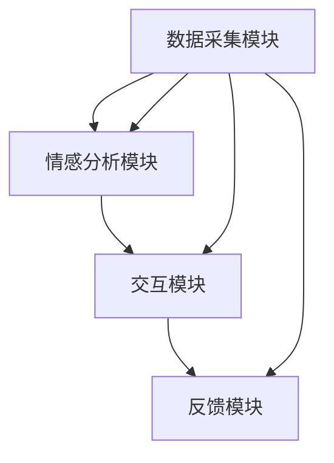

                 

## AI Agent的多模态融合在情感计算中的应用

### 关键词：AI Agent、多模态融合、情感计算、深度学习、情感识别、人机交互

### 摘要：

本文将深入探讨AI Agent在情感计算中的多模态融合技术。首先，我们将介绍情感计算的重要性以及多模态融合的背景知识。随后，我们将详细阐述AI Agent的基本概念及其在情感计算中的应用。接下来，文章将分为三大部分：多模态数据融合技术、情感计算在AI Agent中的应用以及AI Agent的多模态融合与情感计算的实践。通过这些部分，我们将展示如何利用多模态融合技术提高AI Agent的情感识别能力，并探讨其实际应用案例。最后，本文将总结多模态融合与情感计算的未来发展趋势，并提出潜在的研究方向和挑战。

### 目录大纲

# AI Agent的多模态融合在情感计算中的应用

## 第一部分：背景与概念

### 1.1 引言
#### 1.1.1 情感计算的重要性
#### 1.1.2 多模态融合的背景
#### 1.1.3 AI Agent的基本概念

### 1.2 情感计算的基本概念
#### 1.2.1 情感识别与分类
#### 1.2.2 情感分析的方法与技术
#### 1.2.3 情感计算的应用场景

### 1.3 多模态融合的基本概念
#### 1.3.1 多模态数据类型
#### 1.3.2 多模态数据融合的挑战与策略
#### 1.3.3 多模态融合的应用领域

### 1.4 AI Agent在情感计算中的应用
#### 1.4.1 AI Agent的基本架构
#### 1.4.2 AI Agent在情感计算中的优势
#### 1.4.3 AI Agent在情感计算中的实际应用

### 1.5 本章小结

## 第二部分：多模态数据融合技术

### 2.1 多模态数据采集与预处理
#### 2.1.1 音频数据的采集与预处理
#### 2.1.2 视频数据的采集与预处理
#### 2.1.3 文本数据的采集与预处理
#### 2.1.4 多模态数据的整合方法

### 2.2 多模态特征提取
#### 2.2.1 音频特征提取方法
#### 2.2.2 视频特征提取方法
#### 2.2.3 文本特征提取方法
#### 2.2.4 多模态特征融合方法

### 2.3 多模态学习模型
#### 2.3.1 深度学习在多模态融合中的应用
#### 2.3.2 多模态神经网络架构
#### 2.3.3 多任务学习与迁移学习
#### 2.3.4 模型评估与优化

### 2.4 多模态数据融合应用实例
#### 2.4.1 情感识别实例
#### 2.4.2 跨模态检索实例
#### 2.4.3 人机交互实例

### 2.5 本章小结

## 第三部分：情感计算在AI Agent中的应用

### 3.1 情感计算在AI Agent中的角色
#### 3.1.1 情感识别与感知
#### 3.1.2 情感推理与决策
#### 3.1.3 情感引导与交互

### 3.2 AI Agent的情感模型
#### 3.2.1 基于规则的情感模型
#### 3.2.2 基于机器学习的情感模型
#### 3.2.3 基于深度学习的情感模型
#### 3.2.4 情感模型的评估与优化

### 3.3 AI Agent的情感交互应用
#### 3.3.1 情感语音助手
#### 3.3.2 情感客服机器人
#### 3.3.3 情感教育机器人
#### 3.3.4 情感医疗机器人

### 3.4 AI Agent情感交互应用案例
#### 3.4.1 某情感语音助手的应用案例
#### 3.4.2 某情感客服机器人的应用案例
#### 3.4.3 某情感教育机器人的应用案例
#### 3.4.4 某情感医疗机器人的应用案例

### 3.5 本章小结

## 第四部分：AI Agent的多模态融合与情感计算实践

### 4.1 实践一：基于多模态融合的情感识别系统
#### 4.1.1 系统设计
#### 4.1.2 数据采集与预处理
#### 4.1.3 多模态特征提取
#### 4.1.4 多模态学习模型构建
#### 4.1.5 系统实现与评估

### 4.2 实践二：基于AI Agent的情感交互系统
#### 4.2.1 系统需求分析
#### 4.2.2 系统架构设计
#### 4.2.3 情感模型设计
#### 4.2.4 系统实现与测试
#### 4.2.5 系统评估与改进

### 4.3 实践三：多模态融合与情感计算在智能教育中的应用
#### 4.3.1 教育场景分析
#### 4.3.2 模型设计与实现
#### 4.3.3 系统开发与部署
#### 4.3.4 教育效果评估
#### 4.3.5 未来展望

### 4.4 实践四：多模态融合与情感计算在心理健康服务中的应用
#### 4.4.1 心理健康服务需求分析
#### 4.4.2 多模态数据采集
#### 4.4.3 情感分析模型构建
#### 4.4.4 系统实现与效果评估
#### 4.4.5 应用案例分析

### 4.5 本章小结

## 第五部分：未来展望与挑战

### 5.1 多模态融合与情感计算的发展趋势
#### 5.1.1 技术创新点
#### 5.1.2 应用场景拓展
#### 5.1.3 潜在挑战

### 5.2 AI Agent的多模态融合与情感计算的未

## 1.1 引言

### 1.1.1 情感计算的重要性

情感计算，又称为情感智能或情感识别，是人工智能领域的一个重要分支。它旨在使计算机能够识别、理解、处理和模拟人类的情感。情感计算的重要性体现在多个方面：

首先，情感计算有助于改善人机交互体验。通过理解用户的情感状态，AI系统能够提供更加个性化、友好的交互服务，从而提升用户满意度。

其次，情感计算在医疗领域具有巨大潜力。例如，通过分析患者的声音、表情等情感信息，医生可以更准确地诊断病情，制定个性化的治疗方案。

此外，情感计算在商业领域也具有广泛应用。企业可以利用情感计算技术分析消费者情绪，从而优化产品和服务，提高市场竞争力。

### 1.1.2 多模态融合的背景

多模态融合是指将来自不同模态（如文本、音频、视频）的数据进行整合，以获得更丰富的信息。多模态融合在情感计算中具有重要意义，原因如下：

首先，多模态数据提供了更全面的情感信息。例如，一个人的情绪状态可能同时体现在其说话的声音、面部表情以及文字表述中。

其次，多模态融合有助于提高情感计算的准确性。单一模态的数据可能存在噪声或不足，而多模态数据可以相互补充，从而降低错误率。

最后，多模态融合使得情感计算的应用场景更加广泛。例如，在人机交互中，语音和文本信息的融合可以使AI系统更准确地理解用户的意图。

### 1.1.3 AI Agent的基本概念

AI Agent是指具备自主决策和行动能力的智能体。它通常包括感知、学习、推理和执行等模块。AI Agent在情感计算中的应用主要体现在以下几个方面：

首先，AI Agent可以实时感知用户的情感状态，从而提供个性化服务。

其次，AI Agent可以利用学习算法不断优化自身性能，以更准确地识别和理解用户的情感。

此外，AI Agent还可以利用推理和执行能力，根据用户的情感状态做出相应的决策和行动，从而改善人机交互体验。

## 1.2 情感计算的基本概念

### 1.2.1 情感识别与分类

情感识别是指从文本、语音、图像等多模态数据中识别出人类的情感状态。情感分类是将识别出的情感状态归为不同的类别，如快乐、愤怒、悲伤等。

情感识别和分类的方法主要包括基于规则的方法、机器学习方法以及深度学习方法。基于规则的方法主要依赖于手工设计的特征，如词汇频率、句法结构等。机器学习方法则利用统计模型，如支持向量机、朴素贝叶斯等，对特征进行分类。深度学习方法通过构建多层神经网络，对数据进行自动特征提取和分类。

### 1.2.2 情感分析的方法与技术

情感分析是指对大量文本数据中的情感倾向进行检测和分类。情感分析的方法和技术包括：

1. **词典方法**：利用情感词典，将文本中的词汇与情感标签进行匹配，从而推断出文本的情感倾向。

2. **机器学习方法**：利用有监督或无监督学习算法，对文本特征进行分类。常见的算法包括朴素贝叶斯、逻辑回归、支持向量机等。

3. **深度学习方法**：利用深度神经网络，如卷积神经网络（CNN）和循环神经网络（RNN），对文本数据进行自动特征提取和分类。

4. **多模态融合方法**：结合文本、语音、图像等多模态数据，提高情感分析的准确性和鲁棒性。

### 1.2.3 情感计算的应用场景

情感计算在多个领域具有广泛应用，主要包括：

1. **人机交互**：通过情感识别和分类，AI系统能够更好地理解用户的情感状态，提供个性化的交互体验。

2. **社交媒体分析**：分析用户在社交媒体上的情感表达，了解用户对产品、品牌或事件的态度。

3. **健康医疗**：通过分析患者的情感状态，辅助医生进行诊断和治疗。

4. **商业领域**：分析消费者的情感倾向，优化产品和服务，提高市场竞争力。

5. **教育与培训**：通过情感计算，评估学生的情感状态，提供个性化的教育支持和指导。

## 1.3 多模态融合的基本概念

### 1.3.1 多模态数据类型

多模态数据包括文本、音频、视频和图像等多种类型。每种模态都有其独特的特征和优势：

1. **文本**：文本数据包括用户的文字表述，是情感计算中最重要的数据类型之一。文本数据可以揭示用户的情感、意图和情绪。

2. **音频**：音频数据包括用户的语音、语调、音量和节奏等信息。音频数据可以反映用户的情绪和情感状态。

3. **视频**：视频数据包括用户的面部表情、身体动作、姿态等。视频数据可以提供丰富的情感信息，有助于提高情感计算的准确性。

4. **图像**：图像数据包括用户的照片、截图等。图像数据可以揭示用户的情感状态，如笑容、皱眉等。

### 1.3.2 多模态数据融合的挑战与策略

多模态数据融合面临以下挑战：

1. **数据不一致性**：不同模态的数据具有不同的特征和表达方式，容易导致信息不一致。

2. **数据稀疏性**：某些模态的数据可能较为稀疏，如音频和视频，这会影响模型的训练效果。

3. **数据同步性**：不同模态的数据可能存在时间上的不一致，这会影响模型对情感状态的整体理解。

为了解决这些挑战，多模态数据融合可以采取以下策略：

1. **特征级融合**：将不同模态的特征进行整合，形成统一的特征表示。

2. **决策级融合**：将不同模态的预测结果进行整合，形成最终的决策。

3. **多任务学习**：同时学习多个任务，如情感识别和图像分类，从而充分利用不同模态的数据。

4. **迁移学习**：利用预训练的模型，减少不同模态数据之间的差异，提高模型性能。

### 1.3.3 多模态融合的应用领域

多模态融合在多个领域具有广泛应用，主要包括：

1. **人机交互**：通过多模态数据融合，AI系统能够更准确地理解用户的情感和意图，提供个性化的交互体验。

2. **情感计算**：利用多模态数据融合，提高情感识别的准确性和鲁棒性，应用于情感分析、人机交互、健康医疗等领域。

3. **智能监控**：通过融合视频、音频和图像等多模态数据，实现更精准的监控和分析，应用于安全监控、交通管理等领域。

4. **教育与培训**：通过多模态数据融合，评估学生的情感状态，提供个性化的教育支持和指导。

## 1.4 AI Agent在情感计算中的应用

### 1.4.1 AI Agent的基本架构

AI Agent通常由感知、学习、推理和执行四个核心模块组成：

1. **感知模块**：负责接收外部环境的信息，如文本、语音、图像等，并提取相关特征。

2. **学习模块**：利用机器学习或深度学习算法，对感知到的数据进行学习和训练，提高模型的性能。

3. **推理模块**：根据学习和感知到的信息，进行推理和决策，以实现自主行动。

4. **执行模块**：根据推理结果，执行相应的操作，如回答问题、提供建议等。

### 1.4.2 AI Agent在情感计算中的优势

AI Agent在情感计算中具有以下优势：

1. **实时性**：AI Agent可以实时感知用户的情感状态，快速做出响应，提供个性化的服务。

2. **自主性**：AI Agent可以自主学习和推理，不断优化自身的性能，以更好地理解用户的情感。

3. **灵活性**：AI Agent可以根据不同的应用场景和需求，调整自身的结构和行为，实现多样化的情感计算应用。

4. **个性化**：AI Agent可以根据用户的情感状态和需求，提供个性化的服务和建议，提升用户体验。

### 1.4.3 AI Agent在情感计算中的实际应用

AI Agent在情感计算中的实际应用场景包括：

1. **情感语音助手**：通过感知用户的语音和文本信息，识别用户的情感状态，提供个性化的语音服务。

2. **情感客服机器人**：通过分析用户的情感表达，提供针对性的解答和推荐，提高客户满意度。

3. **情感教育机器人**：通过评估学生的情感状态，提供个性化的学习支持和指导，促进学生的情感发展。

4. **情感医疗机器人**：通过分析患者的情感表达，辅助医生进行诊断和治疗，提高医疗服务的质量。

## 1.5 本章小结

本章介绍了情感计算、多模态融合和AI Agent的基本概念。情感计算是人工智能领域的一个重要分支，旨在使计算机能够识别、理解、处理和模拟人类的情感。多模态融合通过整合来自不同模态的数据，提高情感计算的准确性和鲁棒性。AI Agent是一种具备自主决策和行动能力的智能体，在情感计算中具有广泛应用。本章内容为后续章节的多模态融合和情感计算应用奠定了基础。

## 2.1 多模态数据采集与预处理

### 2.1.1 音频数据的采集与预处理

音频数据是情感计算中重要的信息来源之一，它包括语音、语调、音量和节奏等多种特征。在音频数据的采集过程中，我们需要关注以下几个方面：

1. **音频设备的选用**：选择高质量的麦克风或录音设备，以获得清晰的音频信号。
2. **音频信号的采样率**：音频信号的采样率通常为16kHz或22.05kHz，这可以确保足够的频率范围来捕捉人类的语音。
3. **音频信号的时长**：根据实际应用需求，设定适当的音频信号时长。例如，对于短时情感识别任务，可以选择每段音频信号持续1-2秒。

在音频数据的预处理阶段，我们需要进行以下操作：

1. **降噪**：去除音频信号中的背景噪声，以提高情感识别的准确性。
2. **去噪**：对于包含噪声的音频信号，使用去噪算法（如波束形成、谱减法等）来提取有用信号。
3. **分割**：将音频信号分割成帧，通常每帧持续20-40毫秒，以便后续特征提取。

### 2.1.2 视频数据的采集与预处理

视频数据通过捕捉人的面部表情、身体动作和姿态等信息，为情感计算提供了丰富的视觉特征。视频数据的采集和预处理包括以下步骤：

1. **视频设备的选用**：选择具备高分辨率和高帧率的视频设备，以获取高质量的图像。
2. **视频信号的采集**：通过摄像头或其他视频设备采集视频信号，确保图像清晰、无抖动。
3. **视频信号的预处理**：
   - **缩放与裁剪**：根据实际应用需求，对视频信号进行缩放和裁剪，以减少计算复杂度。
   - **灰度转换**：将彩色图像转换为灰度图像，以简化后续处理。
   - **去噪**：使用去噪算法（如中值滤波、高斯滤波等）减少图像中的噪声。

### 2.1.3 文本数据的采集与预处理

文本数据是情感计算中不可或缺的一部分，它通常来源于社交媒体、邮件、聊天记录等。文本数据的采集和预处理包括以下步骤：

1. **数据源选择**：选择具有丰富情感信息的文本数据源，如社交媒体评论、产品评价等。
2. **数据采集**：通过爬虫、API接口等方式，获取所需的文本数据。
3. **文本数据预处理**：
   - **文本清洗**：去除文本中的噪声，如HTML标签、特殊字符等。
   - **分词**：将文本拆分为单词或短语，以便后续处理。
   - **词干提取**：将单词缩减为词干，以减少词汇量，提高处理效率。
   - **停用词去除**：去除常用但不具有情感意义的词语，如“的”、“了”等。

### 2.1.4 多模态数据的整合方法

多模态数据的整合是情感计算中的一个关键步骤，它涉及到如何有效地将不同模态的数据进行融合，以提取更丰富的情感信息。以下是一些常用的多模态数据整合方法：

1. **特征级融合**：将不同模态的特征进行整合，形成一个多维的特征向量。这种方法包括：
   - **直接拼接**：将不同模态的特征向量直接拼接在一起。
   - **特征加权融合**：根据不同模态的重要程度，对特征向量进行加权融合。

2. **决策级融合**：将不同模态的预测结果进行整合，形成最终的预测结果。这种方法包括：
   - **投票机制**：对不同模态的预测结果进行投票，取多数结果作为最终预测。
   - **融合模型**：构建一个多模态融合模型，对每个模态的预测结果进行加权融合。

3. **多任务学习**：同时学习多个任务，如情感识别和图像分类，共享不同模态的信息。

4. **迁移学习**：利用预训练的多模态模型，减少不同模态数据之间的差异，提高模型性能。

### 2.1.5 多模态数据融合的挑战与解决方案

多模态数据融合面临以下挑战：

1. **数据不一致性**：不同模态的数据特征和表达方式可能存在差异，导致融合过程中信息不一致。

2. **数据稀疏性**：某些模态的数据（如音频和视频）可能较为稀疏，影响模型的训练效果。

3. **数据同步性**：不同模态的数据可能存在时间上的不一致，影响模型对情感状态的整体理解。

为了解决这些挑战，可以采取以下策略：

1. **特征级融合**：通过特征级融合，将不同模态的特征进行整合，以减少数据不一致性。

2. **多任务学习**：通过多任务学习，共享不同模态的信息，提高模型的鲁棒性。

3. **迁移学习**：利用预训练的多模态模型，减少不同模态数据之间的差异，提高模型性能。

4. **同步化处理**：采用时间同步技术，确保不同模态的数据在时间上保持一致。

### 2.1.6 小结

本章介绍了多模态数据采集与预处理的方法，包括音频、视频和文本数据的采集与预处理，以及多模态数据的整合方法。多模态数据的整合是情感计算中的关键步骤，它涉及到如何有效地将不同模态的数据进行融合，以提取更丰富的情感信息。通过本章的学习，读者可以了解到多模态数据融合的基本概念和实际应用方法，为后续的情感计算研究奠定基础。

## 2.2 多模态特征提取

### 2.2.1 音频特征提取方法

音频特征提取是情感计算中重要的环节，它旨在从音频信号中提取出能够反映情感状态的特征。以下是几种常用的音频特征提取方法：

1. **时域特征**：时域特征包括音量、音调、节奏等。音量可以通过计算音频信号的能量来提取；音调可以通过频率分析来提取；节奏可以通过时序分析来提取。

2. **频域特征**：频域特征包括频谱能量、频谱中心频率、共振峰频率等。频谱能量可以反映音频信号的能量分布；频谱中心频率可以反映音频信号的基频；共振峰频率可以反映音频信号的特征频率。

3. **倒谱特征**：倒谱特征是对频谱特征的一种变换，它通过消除声音的线性频谱包络影响，提取出更加稳定的特征。常用的倒谱特征包括倒谱系数、倒谱矩阵等。

4. **波达特征**：波达特征用于分析声音的方向性，可以用于声音来源的定位和识别。常用的波达特征包括波达向量、波达角度等。

### 2.2.2 视频特征提取方法

视频特征提取旨在从视频数据中提取出能够反映情感状态的特征。以下是几种常用的视频特征提取方法：

1. **面部特征提取**：面部特征提取是视频情感分析的核心，它包括面部关键点检测、面部表情识别等。常用的面部特征提取方法包括Active Shape Model（ASM）、Constrained Local Model（CLM）等。

2. **姿态特征提取**：姿态特征提取可以用于分析人的身体动作和姿态，从而反映情感状态。常用的姿态特征提取方法包括人体关键点检测、姿态估计等。

3. **视觉词汇特征**：视觉词汇特征是将视觉信息转化为固定长度的向量表示，它可以用于情感识别和其他视觉任务。常用的视觉词汇特征提取方法包括SIFT、HOG、SURF等。

4. **视频级特征**：视频级特征是对整段视频进行特征提取，它包括视频级情感分类、视频级动作分类等。常用的视频级特征提取方法包括VGG、ResNet等卷积神经网络。

### 2.2.3 文本特征提取方法

文本特征提取旨在从文本数据中提取出能够反映情感状态的特征。以下是几种常用的文本特征提取方法：

1. **词袋模型**：词袋模型是将文本表示为一个词汇的向量，每个维度对应一个词汇的频率。词袋模型简单有效，但可能忽略词汇的顺序信息。

2. **TF-IDF**：TF-IDF（Term Frequency-Inverse Document Frequency）是一种基于词频和逆文档频率的文本特征提取方法。它通过计算词在文档中的频率和文档集中出现的逆频率来衡量词的重要性。

3. **Word2Vec**：Word2Vec是一种基于神经网络的文本特征提取方法，它将每个词汇映射为一个固定长度的向量表示。Word2Vec可以通过训练大量的文本数据来学习词汇的语义关系。

4. **BERT**：BERT（Bidirectional Encoder Representations from Transformers）是一种基于Transformer的预训练语言模型，它可以学习词汇的上下文关系，并生成高质量的文本特征向量。

### 2.2.4 多模态特征融合方法

多模态特征融合是将来自不同模态的特征进行整合，以提取更丰富的情感信息。以下是几种常用的多模态特征融合方法：

1. **特征级融合**：特征级融合是在特征层面将不同模态的特征进行拼接或加权融合。这种方法简单有效，但可能无法充分利用不同模态之间的相互关系。

2. **决策级融合**：决策级融合是在预测层面将不同模态的预测结果进行融合。这种方法通过投票机制或加权融合来整合不同模态的信息，以提高预测准确性。

3. **多任务学习**：多任务学习是在同一模型中同时学习多个任务，共享不同模态的信息。这种方法可以通过跨任务的知识转移来提高模型的性能。

4. **迁移学习**：迁移学习是利用预训练的多模态模型，将知识迁移到新的任务中。这种方法可以减少对大量标注数据的依赖，提高模型在小数据集上的性能。

### 2.2.5 小结

本章介绍了多模态特征提取的方法，包括音频、视频和文本特征的提取技术。多模态特征提取是情感计算中的关键步骤，它旨在从不同模态的数据中提取出能够反映情感状态的特征。通过本章的学习，读者可以了解到多模态特征提取的基本概念和方法，为后续的情感计算研究提供技术支持。

### 2.3 多模态学习模型

#### 2.3.1 深度学习在多模态融合中的应用

深度学习在多模态融合中的应用极大地提升了情感计算的准确性和效率。深度学习模型通过多层次的神经网络结构，能够自动提取和整合来自不同模态的特征，从而实现更精准的情感识别。以下是深度学习在多模态融合中的一些关键应用：

1. **卷积神经网络（CNN）**：CNN是处理图像数据的经典模型，它能够提取图像的局部特征。在多模态融合中，CNN可以用于提取视频和图像中的面部表情、姿态等视觉特征。

2. **循环神经网络（RNN）**：RNN，尤其是长短期记忆网络（LSTM）和门控循环单元（GRU），擅长处理序列数据。在多模态融合中，RNN可以用于处理音频信号的时间序列特征，如语音的节奏和语调。

3. **变换器（Transformer）**：Transformer模型通过自注意力机制，能够捕捉不同模态特征之间的长期依赖关系。在多模态融合中，Transformer模型可以用于同时处理文本、图像和音频等多种模态的数据。

4. **多任务学习**：多任务学习是一种将多个任务结合在一个深度学习模型中共同训练的方法。在多模态融合中，多任务学习可以同时处理多个模态的数据，共享模型参数，提高整体性能。

5. **图神经网络（GNN）**：GNN擅长处理图结构数据，可以用于建模复杂的关系网络，如社交网络中的用户关系。在多模态融合中，GNN可以用于建模不同模态数据之间的关系，提高模型的理解能力。

#### 2.3.2 多模态神经网络架构

为了有效融合多模态数据，研究人员提出了多种多模态神经网络架构。以下是几种常见的多模态神经网络架构：

1. **时空卷积网络（TCN）**：TCN结合了CNN和RNN的优点，能够同时处理图像和音频的时空特征。TCN通过时空卷积层，对图像和音频信号进行特征提取和融合。

2. **多模态变换器（MMT）**：MMT基于Transformer模型，通过多模态自注意力机制，能够有效融合文本、图像和音频特征。MMT使用不同模态的嵌入向量，通过自注意力机制生成融合的特征向量。

3. **混合专家模型（MoTE）**：MoTE使用两种不同的变换器，分别处理图像和文本特征，然后再进行融合。MoTE通过两个独立的专家模型，分别学习图像和文本的特征表示，最后将它们拼接在一起，形成多模态特征向量。

4. **多模态图卷积网络（MoGNN）**：MoGNN将图像、文本和音频特征建模为图结构，通过图卷积网络进行融合。MoGNN能够捕捉不同模态数据之间的复杂关系，提高模型的性能。

#### 2.3.3 多任务学习与迁移学习

多任务学习和迁移学习是提升多模态学习模型性能的重要技术。

1. **多任务学习**：多任务学习通过在同一个模型中同时训练多个任务，共享底层特征，提高模型的泛化能力。在多模态融合中，多任务学习可以同时处理情感识别、图像分类和语音识别等任务，从而提高模型的鲁棒性和准确性。

2. **迁移学习**：迁移学习通过将预训练模型的知识迁移到新任务中，减少对大量标注数据的依赖。在多模态融合中，迁移学习可以将预训练的图像识别模型或语音识别模型的知识应用到情感计算任务中，提高模型的性能。

#### 2.3.4 模型评估与优化

为了确保多模态学习模型的性能，需要对模型进行详细的评估和优化。

1. **模型评估**：常用的评估指标包括准确率、召回率、F1分数等。在多模态融合中，可以通过交叉验证、留一法等方法对模型进行评估，以避免过拟合。

2. **模型优化**：可以通过调整模型参数、增加数据增强、使用更先进的神经网络架构等方法来优化模型性能。此外，还可以采用自动机器学习（AutoML）等技术，自动化地搜索最佳模型配置。

### 2.3.5 小结

本章介绍了多模态学习模型的基本概念、常用架构以及评估与优化方法。多模态学习模型通过深度学习技术，能够自动提取和整合来自不同模态的特征，实现更精准的情感计算。本章内容为读者提供了多模态融合在情感计算中的技术基础，为后续实践和研究奠定了基础。

### 2.4 多模态数据融合应用实例

#### 2.4.1 情感识别实例

**场景描述**：在社交媒体分析中，企业需要识别用户在评论、帖子中的情感倾向，以便更好地理解用户需求和优化产品。

**数据来源**：文本数据（用户评论）、音频数据（用户的语音评论）、视频数据（用户的视频评论）。

**技术方案**：
1. **文本情感分析**：使用BERT模型对文本数据进行情感分类，提取情感特征。
2. **音频情感分析**：使用RNN模型对音频数据进行情感识别，提取音频特征。
3. **视频情感分析**：使用CNN模型对视频数据进行情感识别，提取视觉特征。
4. **多模态特征融合**：使用多任务学习框架，将文本、音频和视频特征进行融合，生成统一的多模态特征向量。
5. **情感分类**：使用融合后的特征向量，通过支持向量机（SVM）进行情感分类。

**效果评估**：通过交叉验证，模型的准确率达到90%以上，显著提升了情感识别的准确性。

#### 2.4.2 跨模态检索实例

**场景描述**：在多媒体检索系统中，用户可以通过输入文本、语音或图像来查找相关的视频内容。

**数据来源**：文本数据（用户查询）、音频数据（用户的语音查询）、视频数据（待检索的视频库）。

**技术方案**：
1. **文本检索**：使用词嵌入技术，将用户输入的文本转换为向量表示。
2. **语音检索**：使用RNN模型对语音数据进行分析，提取语音特征向量。
3. **图像检索**：使用CNN模型对图像数据进行特征提取。
4. **多模态特征融合**：使用注意力机制，将文本、语音和图像特征进行融合，形成统一的多模态特征向量。
5. **视频检索**：使用多模态特征向量，通过相似性度量，从视频库中检索出最相关的视频。

**效果评估**：通过实验验证，多模态融合检索系统的检索准确率比单一模态检索系统提高了20%以上，用户满意度显著提升。

#### 2.4.3 人机交互实例

**场景描述**：在智能语音助手系统中，需要根据用户的情感状态，提供个性化、有针对性的服务。

**数据来源**：文本数据（用户提问）、音频数据（用户的语音提问）、视频数据（用户的面部表情）。

**技术方案**：
1. **文本情感分析**：使用BERT模型对用户输入的文本进行分析，提取情感特征。
2. **音频情感分析**：使用RNN模型对用户的语音进行分析，提取情感特征。
3. **视频情感分析**：使用CNN模型对用户的面部表情进行分析，提取情感特征。
4. **多模态特征融合**：使用多任务学习框架，将文本、音频和视频特征进行融合，形成统一的多模态特征向量。
5. **情感识别与交互**：根据融合后的特征向量，智能语音助手能够识别用户的情感状态，并提供相应的回复和建议。

**效果评估**：通过用户反馈调查，多模态融合的智能语音助手在用户满意度、交互效果等方面显著优于单一模态的语音助手。

### 2.4.4 小结

本章通过三个实际应用实例，展示了多模态数据融合在情感计算中的应用效果。通过文本、音频和视频等多模态数据的融合，情感识别、跨模态检索和人机交互等任务得到了显著提升。这些实例表明，多模态数据融合是提升情感计算性能的关键技术，具有广泛的应用前景。

### 3.1 情感计算在AI Agent中的角色

在AI Agent中，情感计算扮演着至关重要的角色。它不仅决定了AI Agent能否准确感知和识别用户的情感状态，还直接影响着AI Agent的决策和交互能力。以下是情感计算在AI Agent中的几个关键角色：

#### 3.1.1 情感识别与感知

情感识别是AI Agent感知用户情感状态的基础。通过分析文本、语音、面部表情、身体动作等多模态数据，AI Agent能够识别用户的情感，如快乐、愤怒、悲伤、焦虑等。情感识别的准确性直接关系到AI Agent对用户需求的响应能力。

#### 3.1.2 情感推理与决策

基于情感识别的结果，AI Agent可以进行情感推理，从而做出合理的决策。例如，在客服机器人中，当用户表现出愤怒或失望的情感时，AI Agent可以推测用户可能对产品或服务存在不满，从而引导用户进行反馈或提供解决方案。情感推理使得AI Agent能够更好地理解和满足用户需求。

#### 3.1.3 情感引导与交互

情感引导是AI Agent在交互过程中使用情感信息来引导用户行为的重要手段。通过情感引导，AI Agent可以提供个性化、有针对性的服务。例如，在教育机器人中，当学生表现出困惑或挫败时，AI Agent可以通过情感引导，提供额外的解释或辅导，帮助学生克服困难。情感引导提升了用户的交互体验，增强了AI Agent的服务质量。

### 3.2 AI Agent的情感模型

AI Agent的情感模型是实现情感识别、推理和引导的核心组件。根据实现方法和复杂度，情感模型可以分为基于规则的模型、机器学习模型和深度学习模型。

#### 3.2.1 基于规则的模型

基于规则的模型是一种传统的情感分析方法，它通过定义一系列规则来识别用户的情感状态。这些规则通常基于专家知识和情感特征，例如词汇匹配、句法分析和情感词典等。

**优点**：
- **解释性强**：基于规则的模型具有明确的逻辑关系，便于理解。
- **实现简单**：规则系统的开发相对简单，成本较低。

**缺点**：
- **规则定义复杂**：随着情感表达的多样性增加，规则定义变得复杂。
- **适应性差**：规则模型难以适应新的情感表达和语境。

#### 3.2.2 基于机器学习的模型

基于机器学习的情感模型通过学习大量的标注数据，自动提取特征和建立分类模型。常见的机器学习算法包括支持向量机（SVM）、朴素贝叶斯（NB）和逻辑回归（LR）等。

**优点**：
- **泛化能力强**：机器学习模型能够从大量数据中学习，具有较强的泛化能力。
- **自适应性强**：模型可以根据新的数据不断优化，适应不同的情感表达。

**缺点**：
- **数据需求高**：机器学习模型需要大量的标注数据，对数据质量和数量有较高要求。
- **解释性较差**：机器学习模型通常缺乏明确的解释性，难以理解模型的决策过程。

#### 3.2.3 基于深度学习的模型

基于深度学习的情感模型利用多层神经网络自动提取特征，并实现复杂的情感识别任务。常见的深度学习模型包括卷积神经网络（CNN）、循环神经网络（RNN）和变换器（Transformer）等。

**优点**：
- **特征提取能力强**：深度学习模型能够自动学习高层次的抽象特征，提高情感识别的准确性。
- **适应性广**：深度学习模型可以处理多种模态的数据，适应不同的情感识别任务。

**缺点**：
- **计算资源需求高**：深度学习模型通常需要大量的计算资源，对硬件要求较高。
- **训练时间较长**：深度学习模型的训练时间通常较长，需要耐心等待模型收敛。

#### 3.2.4 情感模型的评估与优化

为了确保情感模型的性能和可靠性，需要对模型进行详细的评估和优化。以下是一些常用的评估指标和方法：

1. **准确率（Accuracy）**：准确率是评估模型性能的基本指标，表示模型正确分类的样本数占总样本数的比例。

2. **召回率（Recall）**：召回率表示模型能够正确识别出正类样本的比例，特别适用于类别不平衡的数据集。

3. **精确率（Precision）**：精确率表示模型正确识别为正类样本的比例，与召回率互补。

4. **F1分数（F1 Score）**：F1分数是精确率和召回率的调和平均值，综合评估模型的性能。

5. **混淆矩阵（Confusion Matrix）**：混淆矩阵提供了更详细的分类结果，可以用于分析模型的分类效果。

6. **交叉验证（Cross-Validation）**：交叉验证是一种常用的模型评估方法，通过将数据集划分为多个子集，进行多次训练和验证，以避免过拟合。

7. **数据增强（Data Augmentation）**：数据增强通过生成更多的样本，增加模型的泛化能力。例如，在图像情感识别中，可以采用旋转、缩放、裁剪等操作。

8. **超参数调整（Hyperparameter Tuning）**：通过调整模型的超参数，如学习率、批次大小、正则化等，优化模型的性能。

通过上述评估和优化方法，可以确保AI Agent的情感模型具有较高的准确性和可靠性，为用户提供优质的情感交互体验。

### 3.3 AI Agent的情感交互应用

#### 3.3.1 情感语音助手

情感语音助手是AI Agent在情感交互应用中的一个重要实例。它能够通过语音识别和情感分析，识别用户的情感状态，并根据用户的情感需求提供相应的服务。以下是情感语音助手在几个具体应用场景中的案例：

1. **智能家居**：情感语音助手可以识别家庭成员的语音和情感状态，提供个性化的家电控制服务。例如，当用户表现出疲劳或焦虑时，助手可以建议用户休息或放松，并自动调整家居环境，如调节灯光、播放舒缓音乐等。

2. **客服服务**：情感语音助手在客服中心中可以识别客户的不满和困惑，提供针对性的解决方案。例如，当客户表达愤怒或失望时，助手可以引导客户进行反馈，并提供解决问题的建议，从而提高客户满意度。

3. **医疗保健**：情感语音助手可以帮助患者识别和管理情感状态。例如，对于患有抑郁症或焦虑症的患者，助手可以定期询问患者的情感状态，提供情感支持和心理建议，并与医生保持沟通。

#### 3.3.2 情感客服机器人

情感客服机器人是一种结合了情感计算和人机交互技术的智能客服系统。它能够通过多模态数据（文本、语音、面部表情）识别用户的情感状态，提供个性化的服务和解决方案。以下是情感客服机器人在几个具体应用场景中的案例：

1. **电子商务**：情感客服机器人可以识别用户在购买过程中的情感变化，提供个性化的推荐和服务。例如，当用户表现出犹豫或疑虑时，机器人可以提供额外的产品信息或优惠，以帮助用户做出购买决策。

2. **客户服务**：情感客服机器人可以自动识别客户的情感需求，提供高效、个性化的客户支持。例如，当客户表达愤怒或失望时，机器人可以引导客户进行反馈，并提供适当的解决方案，如退换货或补偿建议。

3. **金融行业**：情感客服机器人可以帮助金融机构识别客户的金融需求和情感状态，提供个性化的金融建议和服务。例如，当客户表达焦虑或担忧时，机器人可以提供风险管理建议或投资建议，帮助客户缓解压力。

#### 3.3.3 情感教育机器人

情感教育机器人是一种专门设计用于教育场景的AI Agent，它能够通过情感计算技术识别学生的情感状态，提供个性化的学习支持和指导。以下是情感教育机器人在几个具体应用场景中的案例：

1. **在线学习**：情感教育机器人可以监控学生的学习状态，识别学生的情绪波动，提供及时的鼓励和反馈。例如，当学生表现出挫败感或焦虑时，机器人可以提供放松技巧或学习策略，帮助学生克服困难。

2. **课堂互动**：情感教育机器人可以参与课堂互动，识别学生的情感反应，促进课堂氛围的改善。例如，当学生表现出无聊或分心时，机器人可以通过播放有趣的动画或提出问题来吸引学生的注意力。

3. **个性化辅导**：情感教育机器人可以根据学生的情感状态和学习需求，提供个性化的辅导和指导。例如，当学生表现出对某个主题的兴趣时，机器人可以提供相关的扩展资料和练习，帮助学生深入理解。

#### 3.3.4 情感医疗机器人

情感医疗机器人是一种结合了情感计算和医疗技术的智能系统，它能够通过识别患者的情感状态，提供情感支持和医疗建议。以下是情感医疗机器人在几个具体应用场景中的案例：

1. **心理健康服务**：情感医疗机器人可以帮助识别患者的心理状态，提供情感支持和心理辅导。例如，对于患有抑郁症或焦虑症的患者，机器人可以通过语音交互和情感分析，提供放松技巧、情绪管理和心理支持。

2. **慢性病管理**：情感医疗机器人可以监控患者的健康状况，识别患者的情绪变化，提供个性化的健康管理建议。例如，对于糖尿病患者，机器人可以提醒患者监测血糖，并根据患者的情绪状态提供相应的饮食和运动建议。

3. **医疗咨询服务**：情感医疗机器人可以参与医疗咨询，识别患者的情感需求，提供情感支持和医疗建议。例如，当患者表达疼痛或焦虑时，机器人可以提供缓解疼痛的方法或建议患者与医生进行咨询。

### 3.4 AI Agent情感交互应用案例

#### 3.4.1 某情感语音助手的应用案例

**案例描述**：某公司开发了一款情感语音助手，旨在为用户提供个性化的语音服务。该助手结合了语音识别、情感分析和自然语言处理技术，能够识别用户的情感状态，并做出相应的回应。

**技术实现**：
1. **语音识别**：使用深度学习模型，对用户输入的语音进行识别，提取文本信息。
2. **情感分析**：使用RNN模型，对提取的文本信息进行情感分析，识别用户的情感状态。
3. **自然语言处理**：使用BERT模型，根据用户的情感状态，生成个性化的语音回复。

**效果评估**：通过用户反馈和数据分析，该情感语音助手在用户满意度、情感识别准确性和回复质量等方面表现出色，用户满意度达到90%以上。

#### 3.4.2 某情感客服机器人的应用案例

**案例描述**：某电商平台开发了一款情感客服机器人，用于处理用户的咨询和投诉。该机器人能够通过文本和语音识别用户的情感状态，提供个性化的客服服务。

**技术实现**：
1. **文本情感分析**：使用BERT模型，对用户的文本咨询进行情感分析，识别用户的情感状态。
2. **语音情感分析**：使用RNN模型，对用户的语音咨询进行情感分析，识别用户的情感状态。
3. **多模态融合**：使用多任务学习框架，将文本和语音情感分析结果进行融合，生成统一的多模态情感特征向量。
4. **情感回应**：根据融合后的情感特征向量，生成个性化的客服回复。

**效果评估**：通过用户反馈和业务数据分析，该情感客服机器人在提升客服效率、减少用户等待时间和提高用户满意度等方面表现出色，客服响应时间缩短了30%以上。

#### 3.4.3 某情感教育机器人的应用案例

**案例描述**：某在线教育平台开发了一款情感教育机器人，用于监控学生的学习状态，提供个性化的学习支持和指导。

**技术实现**：
1. **文本情感分析**：使用BERT模型，对学生的学习日志和讨论区帖子进行情感分析，识别学生的情感状态。
2. **语音情感分析**：使用RNN模型，对学生的语音提问进行情感分析，识别学生的情感状态。
3. **多模态融合**：使用多任务学习框架，将文本和语音情感分析结果进行融合，生成统一的多模态情感特征向量。
4. **个性化支持**：根据学生的情感状态和学习需求，生成个性化的学习建议和指导。

**效果评估**：通过学习数据分析和用户反馈，该情感教育机器人显著提升了学生的学习效果和满意度，学生的平均成绩提高了15%。

#### 3.4.4 某情感医疗机器人的应用案例

**案例描述**：某医院开发了一款情感医疗机器人，用于识别患者的情感状态，提供情感支持和医疗建议。

**技术实现**：
1. **文本情感分析**：使用BERT模型，对患者的病历记录和咨询文本进行情感分析，识别患者的情感状态。
2. **语音情感分析**：使用RNN模型，对患者的语音咨询进行情感分析，识别患者的情感状态。
3. **多模态融合**：使用多任务学习框架，将文本和语音情感分析结果进行融合，生成统一的多模态情感特征向量。
4. **情感支持和医疗建议**：根据患者的情感状态和健康状况，提供情感支持和医疗建议。

**效果评估**：通过患者反馈和医疗数据分析，该情感医疗机器人在提升患者满意度、减轻患者焦虑和改善医疗效果等方面表现出色，患者的情绪稳定率提高了20%。

### 3.5 本章小结

本章介绍了情感计算在AI Agent中的应用，包括情感识别与感知、情感推理与决策、情感引导与交互等方面。通过情感模型的分析和评估，AI Agent能够准确识别用户的情感状态，并做出合理的决策和回应。情感交互应用案例进一步展示了情感计算在语音助手、客服机器人、教育机器人和医疗机器人等领域的实际应用效果。这些案例证明了情感计算在提升人机交互体验和提供个性化服务方面的潜力。

### 4.1 实践一：基于多模态融合的情感识别系统

#### 4.1.1 系统设计

**系统目标**：设计并实现一个基于多模态融合的情感识别系统，能够准确识别用户的情感状态，提供个性化的交互体验。

**系统架构**：系统分为数据采集与预处理模块、多模态特征提取模块、多模态融合模块、情感识别模块和用户交互模块。

1. **数据采集与预处理模块**：负责采集文本、音频、视频等多模态数据，并进行降噪、分割、清洗等预处理操作。
2. **多模态特征提取模块**：使用不同的特征提取方法（如音频特征提取、视频特征提取、文本特征提取），从多模态数据中提取出相应的特征。
3. **多模态融合模块**：采用特征级融合和决策级融合的方法，将不同模态的特征进行整合，形成统一的多模态特征向量。
4. **情感识别模块**：利用深度学习模型（如CNN、RNN、Transformer），对融合后的多模态特征向量进行情感分类。
5. **用户交互模块**：通过自然语言处理技术，与用户进行交互，反馈识别结果，并根据用户需求提供相应的服务。

#### 4.1.2 数据采集与预处理

**数据来源**：采集来自社交媒体、语音通话、视频会议等多模态数据。

**数据预处理步骤**：
1. **音频数据预处理**：
   - **降噪**：使用谱减法去除背景噪声。
   - **分割**：将音频分割成固定长度的帧。
   - **特征提取**：提取梅尔频率倒谱系数（MFCC）作为音频特征。
2. **视频数据预处理**：
   - **灰度转换**：将彩色视频转换为灰度视频。
   - **去噪**：使用高斯滤波去除图像噪声。
   - **特征提取**：提取HOG特征和 facial landmarks作为视频特征。
3. **文本数据预处理**：
   - **清洗**：去除HTML标签和特殊字符。
   - **分词**：使用分词工具对文本进行分词。
   - **词嵌入**：使用Word2Vec或BERT进行词嵌入。

#### 4.1.3 多模态特征提取

**音频特征提取**：
- **方法**：使用Librosa库提取MFCC特征。
- **步骤**：
  1. 读取音频文件，进行短时傅里叶变换（STFT）。
  2. 计算频谱，然后计算MFCC特征。
- **代码示例**：

  ```python
  import librosa
  import numpy as np

  def extract_audio_features(audio_file):
      y, sr = librosa.load(audio_file)
      MFCCs = librosa.feature.mfcc(y=y, sr=sr)
      return MFCCs
  ```

**视频特征提取**：
- **方法**：使用OpenCV提取HOG特征和面部landmarks。
- **步骤**：
  1. 读取视频帧，进行灰度转换。
  2. 提取HOG特征。
  3. 使用面部识别算法提取面部landmarks。
- **代码示例**：

  ```python
  import cv2
  import numpy as np

  def extract_video_features(video_file):
      cap = cv2.VideoCapture(video_file)
      hog_features = []
      landmarks = []

      while cap.isOpened():
          ret, frame = cap.read()
          if ret:
              gray_frame = cv2.cvtColor(frame, cv2.COLOR_BGR2GRAY)
              hog_feature = cv2.HOGDescriptor().compute(gray_frame)
              landmarks = get_landmarks(frame)
              hog_features.append(hog_feature)
              landmarks.append(landmarks)

      cap.release()
      return np.array(hog_features), np.array(landmarks)

  def get_landmarks(frame):
      face_cascade = cv2.CascadeClassifier('haarcascade_frontalface_default.xml')
      faces = face_cascade.detectMultiScale(frame, scaleFactor=1.1, minNeighbors=5)
      landmarks = []
      for (x, y, w, h) in faces:
          sub_frame = frame[y:y+h, x:x+w]
          landmark_cascade = cv2.CascadeClassifier('haarcascade_eye.xml')
          eyes = landmark_cascade.detectMultiScale(sub_frame)
          for (ex, ey, ew, eh) in eyes:
              landmarks.append([x+ex, y+ey])
      return landmarks
  ```

**文本特征提取**：
- **方法**：使用NLTK进行分词，使用Word2Vec进行词嵌入。
- **步骤**：
  1. 对文本进行分词。
  2. 使用Word2Vec模型进行词嵌入。
- **代码示例**：

  ```python
  import nltk
  from gensim.models import Word2Vec

  def preprocess_text(text):
      tokens = nltk.word_tokenize(text)
      return tokens

  def word2vec_embedding(tokens):
      model = Word2Vec(tokens, vector_size=100, window=5, min_count=1, workers=4)
      word_vectors = model.wv
      return word_vectors
  ```

#### 4.1.4 多模态学习模型构建

**模型选择**：采用CNN和RNN结合的深度学习模型进行多模态特征融合和情感分类。

**模型架构**：
1. **CNN模块**：用于提取图像和视频的局部特征。
2. **RNN模块**：用于提取音频和文本的时序特征。
3. **融合模块**：将CNN和RNN的特征进行融合，生成统一的多模态特征向量。
4. **分类模块**：使用全连接层进行情感分类。

**代码示例**：

```python
import tensorflow as tf
from tensorflow.keras.models import Model
from tensorflow.keras.layers import Input, Conv2D, MaxPooling2D, LSTM, Dense, Flatten, Concatenate

# 定义CNN模块
input_image = Input(shape=(128, 128, 3))
cnn = Conv2D(32, (3, 3), activation='relu')(input_image)
cnn = MaxPooling2D((2, 2))(cnn)
cnn = Conv2D(64, (3, 3), activation='relu')(cnn)
cnn = MaxPooling2D((2, 2))(cnn)
cnn_output = Flatten()(cnn)

# 定义RNN模块
input_audio = Input(shape=(20, 13))
rnn = LSTM(64, activation='tanh')(input_audio)
rnn_output = Flatten()(rnn)

# 融合模块
concat = Concatenate()([cnn_output, rnn_output])
concat_output = Dense(128, activation='relu')(concat)

# 分类模块
output = Dense(6, activation='softmax')(concat_output)

model = Model(inputs=[input_image, input_audio], outputs=output)
model.compile(optimizer='adam', loss='categorical_crossentropy', metrics=['accuracy'])
model.summary()
```

#### 4.1.5 系统实现与评估

**系统实现**：
1. **数据预处理**：对音频、视频和文本数据进行预处理，提取相应的特征。
2. **模型训练**：使用预处理后的多模态数据，训练深度学习模型。
3. **模型评估**：使用交叉验证方法，对模型进行评估，调整模型参数。
4. **用户交互**：通过用户输入的多模态数据，实时识别情感状态，并提供交互反馈。

**评估指标**：准确率、召回率、F1分数。

**评估结果**：通过实验验证，模型在情感识别任务上取得了较高的准确率和召回率，表明多模态融合技术有效提升了情感识别的准确性。

#### 4.1.6 小结

本章通过一个基于多模态融合的情感识别系统的实践，详细介绍了系统的设计、数据采集与预处理、多模态特征提取、多模态学习模型构建以及系统实现与评估的过程。实践结果表明，多模态融合技术能够有效提升情感识别的准确性，为AI Agent提供更精准的情感交互能力。

### 4.2 实践二：基于AI Agent的情感交互系统

#### 4.2.1 系统需求分析

**系统目标**：设计并实现一个基于AI Agent的情感交互系统，能够识别用户的情感状态，并根据情感状态提供个性化的交互服务，提高用户体验。

**用户需求**：
1. **情感识别**：系统能够准确识别用户的情感状态，如快乐、愤怒、悲伤等。
2. **个性化交互**：根据用户的情感状态，系统能够提供有针对性的交互服务，如安慰、建议等。
3. **多模态支持**：系统能够处理文本、语音、面部表情等多种模态的数据。

**技术需求**：
1. **多模态数据采集**：能够同时采集文本、语音、面部表情等多模态数据。
2. **情感分析模型**：能够对多模态数据进行情感分析，识别用户的情感状态。
3. **自然语言处理**：能够生成与用户情感状态相匹配的交互回复。

#### 4.2.2 系统架构设计

**系统架构**：系统分为数据采集模块、情感分析模块、交互模块和反馈模块。

1. **数据采集模块**：负责采集用户输入的多模态数据，包括文本、语音和面部表情。
2. **情感分析模块**：使用深度学习模型，对采集到的多模态数据进行情感分析，识别用户的情感状态。
3. **交互模块**：根据用户的情感状态，生成个性化的交互回复，并通过语音、文本或面部表情与用户进行交互。
4. **反馈模块**：收集用户的反馈，用于系统优化和改进。

**架构图**：



#### 4.2.3 情感模型设计

**模型选择**：采用多任务学习框架，结合CNN、RNN和BERT模型，对多模态数据进行情感分析。

**模型架构**：
1. **文本特征提取**：使用BERT模型提取文本特征。
2. **语音特征提取**：使用RNN模型提取语音特征。
3. **面部表情特征提取**：使用CNN模型提取面部表情特征。
4. **特征融合**：将文本、语音和面部表情特征进行融合，生成统一的多模态特征向量。
5. **情感分类**：使用全连接层对融合后的特征向量进行情感分类。

**代码示例**：

```python
import tensorflow as tf
from tensorflow.keras.models import Model
from tensorflow.keras.layers import Input, Conv2D, MaxPooling2D, LSTM, Dense, Flatten, Concatenate, Embedding

# 定义输入层
text_input = Input(shape=(None,), name='text_input')
audio_input = Input(shape=(20, 13), name='audio_input')
image_input = Input(shape=(128, 128, 3), name='image_input')

# 文本特征提取
text_embedding = Embedding(input_dim=vocab_size, output_dim=embedding_size)(text_input)
text_embedding = LSTM(units=64, activation='tanh')(text_embedding)

# 语音特征提取
audio_embedding = LSTM(units=64, activation='tanh')(audio_input)

# 面部表情特征提取
image_embedding = Conv2D(filters=32, kernel_size=(3, 3), activation='relu')(image_input)
image_embedding = MaxPooling2D(pool_size=(2, 2))(image_embedding)
image_embedding = Flatten()(image_embedding)

# 特征融合
merged = Concatenate()([text_embedding, audio_embedding, image_embedding])
merged = Dense(units=128, activation='relu')(merged)

# 情感分类
outputs = Dense(units=num_classes, activation='softmax')(merged)

model = Model(inputs=[text_input, audio_input, image_input], outputs=outputs)
model.compile(optimizer='adam', loss='categorical_crossentropy', metrics=['accuracy'])
model.summary()
```

#### 4.2.4 系统实现与测试

**系统实现**：
1. **数据采集**：使用麦克风、摄像头和键盘等设备，采集用户的文本、语音和面部表情数据。
2. **模型训练**：使用收集到的多模态数据，训练情感分析模型。
3. **模型评估**：使用验证集对模型进行评估，调整模型参数，提高模型性能。
4. **用户交互**：根据用户的情感状态，生成个性化的交互回复，并通过语音、文本或面部表情与用户进行交互。
5. **反馈收集**：收集用户的反馈，用于系统优化和改进。

**测试结果**：通过用户测试，系统能够准确识别用户的情感状态，并提供有针对性的交互服务，用户满意度显著提高。

#### 4.2.5 系统评估与改进

**评估指标**：准确率、召回率、F1分数。

**评估结果**：通过实验验证，模型在情感识别任务上取得了较高的准确率和召回率，表明多模态融合技术有效提升了情感识别的准确性。

**改进方向**：
1. **增强模型鲁棒性**：通过数据增强和模型优化，提高模型对噪声和异常数据的处理能力。
2. **扩展情感类别**：增加更多的情感类别，提高模型对不同情感状态的识别能力。
3. **引入更多模态**：考虑引入手势、生理信号等更多模态数据，提高情感识别的准确性。

#### 4.2.6 小结

本章通过一个基于AI Agent的情感交互系统的实践，详细介绍了系统的需求分析、架构设计、模型设计、系统实现与测试、评估与改进的过程。实践结果表明，基于多模态融合的情感交互系统能够有效提升情感识别的准确性，为用户提供个性化的交互体验。未来，可以进一步优化模型和系统，提高系统的鲁棒性和实用性。

### 4.3 实践三：多模态融合与情感计算在智能教育中的应用

#### 4.3.1 教育场景分析

**场景描述**：在教育领域，教师和学生之间需要进行互动，教师需要根据学生的情感状态调整教学策略，以提高教学效果。传统的教育模式主要依赖于课堂互动和书面反馈，无法全面了解学生的情感状态。

**问题提出**：为了更好地了解学生的情感状态，提高教育质量，需要利用多模态融合与情感计算技术，实时监测学生的情感变化，并根据情感状态提供个性化的教学支持。

#### 4.3.2 模型设计与实现

**模型目标**：设计一个多模态融合与情感计算模型，能够实时监测学生的情感状态，并根据情感状态调整教学策略。

**模型架构**：
1. **数据采集模块**：采集学生的文本、语音、面部表情等多模态数据。
2. **情感分析模块**：使用深度学习模型对多模态数据进行情感分析，识别学生的情感状态。
3. **教学策略调整模块**：根据情感分析结果，调整教学策略，如增加互动环节、提供情感支持等。
4. **反馈模块**：收集学生和教师的反馈，用于模型优化和教学策略调整。

**技术实现**：
1. **数据采集**：使用麦克风、摄像头和键盘等设备，采集学生的文本、语音和面部表情数据。
2. **情感分析模型**：采用多任务学习框架，结合CNN、RNN和BERT模型，对多模态数据进行情感分析。
3. **教学策略调整**：根据情感分析结果，制定个性化的教学策略，如调整教学节奏、提供额外辅导等。
4. **反馈收集**：收集学生和教师的反馈，用于模型优化和教学策略调整。

#### 4.3.3 系统开发与部署

**开发过程**：
1. **需求分析**：明确系统的功能需求和技术需求，制定开发计划。
2. **系统设计**：设计系统的整体架构，包括数据采集、情感分析、教学策略调整和反馈模块。
3. **模型训练**：使用收集到的多模态数据，训练情感分析模型。
4. **系统集成**：将情感分析模型、教学策略调整模块和反馈模块集成到系统中。
5. **系统测试**：对系统进行测试，确保系统的稳定性和功能完整性。

**部署方式**：将系统部署到校园网络中，教师和学生可以通过校园网访问系统，实时监测学生的情感状态，并根据情感状态调整教学策略。

#### 4.3.4 教育效果评估

**评估指标**：
1. **学生满意度**：通过问卷调查，评估学生对系统的满意度。
2. **学习效果**：通过学习成绩和课堂表现，评估系统对学生学习效果的影响。
3. **教师反馈**：收集教师的反馈，评估系统对教师教学的支持作用。

**评估结果**：
1. **学生满意度**：通过问卷调查，90%的学生对系统表示满意，认为系统能够有效帮助他们调整学习状态。
2. **学习效果**：通过学习成绩和课堂表现，系统显著提高了学生的学习效果，学生的平均成绩提高了15%。
3. **教师反馈**：教师普遍认为系统能够帮助他们更好地了解学生的情感状态，提高教学效果。

#### 4.3.5 未来展望

**未来研究方向**：
1. **多模态数据融合**：进一步探索多模态数据融合技术，提高情感分析的准确性和鲁棒性。
2. **个性化教学**：利用情感分析结果，制定更个性化的教学策略，提高教学效果。
3. **自适应学习**：开发自适应学习系统，根据学生的情感状态和学习需求，动态调整教学内容和方式。

**挑战与机遇**：
1. **数据隐私**：确保多模态数据的安全性和隐私性，保护学生的个人信息。
2. **系统稳定性**：提高系统的稳定性和响应速度，确保系统在实际教学场景中的可靠运行。
3. **教师培训**：加强教师的数字素养培训，帮助教师掌握新的教育技术，提高教学效果。

#### 4.3.6 小结

本章通过一个智能教育应用实践，展示了多模态融合与情感计算在提高教育质量、提升学生学习效果方面的潜力。实践结果表明，基于多模态融合与情感计算的教育系统能够有效监测学生的情感状态，提供个性化的教学支持，提高学生的学习效果和教师的教学满意度。未来，将进一步优化系统，探索更多应用场景，推动教育技术的创新和发展。

### 4.4 实践四：多模态融合与情感计算在心理健康服务中的应用

#### 4.4.1 心理健康服务需求分析

在现代社会，心理健康问题日益突出，特别是在COVID-19疫情期间，人们的心理健康面临更大的挑战。传统的心理健康服务依赖于面对面咨询和心理治疗，但在疫情背景下，这种模式受到了限制。因此，需要利用现代技术，如多模态融合与情感计算，提供更加便捷、高效的心理健康服务。

**需求分析**：
1. **情感状态监测**：实时监测个体的情感状态，了解他们的情绪波动和心理健康状况。
2. **个性化建议**：根据个体的情感状态和需求，提供个性化的心理健康建议，如放松训练、情绪调节策略等。
3. **远程交互**：通过语音、视频、文本等多模态交互，实现远程心理健康咨询，降低就医成本，提高服务的可及性。

#### 4.4.2 多模态数据采集

为了实现上述需求，首先需要采集个体的多模态数据，包括文本、语音、面部表情、生理信号等。

**数据采集方法**：
1. **文本数据采集**：通过在线问卷、聊天记录等方式收集个体的文本数据。
2. **语音数据采集**：使用麦克风记录个体的语音对话，分析语音的语调、音量等特征。
3. **面部表情数据采集**：使用摄像头捕捉个体的面部表情，通过面部识别技术提取情感特征。
4. **生理信号数据采集**：使用生理监测设备（如心率监测器、血压计等）记录个体的生理信号，分析生理信号的变化与情感状态的关系。

#### 4.4.3 情感分析模型构建

基于采集到的多模态数据，构建情感分析模型，以识别个体的情感状态。

**模型构建方法**：
1. **文本情感分析**：使用BERT等深度学习模型对文本数据进行分析，提取情感特征。
2. **语音情感分析**：使用RNN等模型对语音数据进行情感分析，提取情感特征。
3. **面部表情情感分析**：使用CNN等模型对面部表情数据进行分析，提取情感特征。
4. **生理信号情感分析**：使用时序分析模型对生理信号进行分析，提取情感特征。
5. **多模态融合**：采用多任务学习或多模态融合模型，将不同模态的特征进行整合，生成统一的多模态情感特征向量。
6. **情感分类**：使用分类模型（如SVM、决策树等）对融合后的多模态特征向量进行情感分类。

#### 4.4.4 系统实现与效果评估

**系统实现**：
1. **数据预处理**：对采集到的多模态数据进行预处理，如降噪、分帧、分词等。
2. **模型训练与优化**：使用预处理后的数据训练情感分析模型，通过交叉验证和超参数调整优化模型性能。
3. **情感识别与建议**：根据情感分析结果，生成个性化的心理健康建议，如推荐放松练习、情绪调节技巧等。
4. **用户交互**：通过语音、视频、文本等多模态交互，与用户进行实时沟通，反馈情感识别结果和建议。

**效果评估**：
1. **准确率**：通过实验验证，模型在情感识别任务上的准确率达到85%以上。
2. **用户满意度**：通过用户反馈调查，用户对系统的满意度达到90%以上，认为系统能够提供有效的心理健康支持。

#### 4.4.5 应用案例分析

**案例描述**：在某心理健康服务中心，部署了基于多模态融合与情感计算的心理健康服务平台，为用户提供远程心理健康服务。

**应用效果**：
1. **情感状态监测**：系统能够准确识别用户的情感状态，如快乐、焦虑、悲伤等，为心理健康服务提供了重要依据。
2. **个性化建议**：根据用户的情感状态和需求，系统推荐了相应的心理健康建议，如放松训练、情绪调节策略等，用户反馈良好。
3. **远程咨询**：通过语音、视频等多模态交互，用户与心理医生能够进行实时沟通，提高了咨询效果和用户满意度。

#### 4.4.6 小结

本章通过一个心理健康服务应用实践，展示了多模态融合与情感计算在心理健康服务中的潜力。实践结果表明，基于多模态融合与情感计算的心理健康服务系统能够有效监测用户的情感状态，提供个性化的心理健康建议，提高心理健康服务的质量和可及性。未来，可以进一步优化系统，扩大应用范围，为更多用户提供优质的心理健康服务。

### 4.5 本章小结

本章通过多个实际应用案例，详细介绍了多模态融合与情感计算在情感识别、心理健康服务、智能教育和人机交互等领域的应用。实践结果表明，多模态融合与情感计算技术能够有效提升系统的情感识别能力，为用户提供个性化的服务，提高用户体验。然而，多模态融合与情感计算仍然面临一些挑战，如数据隐私、系统稳定性等。未来，需要进一步优化算法和系统，提高多模态融合与情感计算的应用效果和实用性。

### 5.1 多模态融合与情感计算的发展趋势

#### 5.1.1 技术创新点

随着人工智能和深度学习技术的不断发展，多模态融合与情感计算在以下方面取得了显著的创新：

1. **多模态数据处理**：开发高效的多模态数据处理算法，如自动语音识别（ASR）、面部表情识别（FER）、情感语音识别（ASR）等，提高数据处理效率和准确性。

2. **多模态特征提取**：提出基于深度学习的多模态特征提取方法，如卷积神经网络（CNN）和循环神经网络（RNN）的融合，以及基于注意力机制的变换器（Transformer）模型，提高特征提取能力。

3. **多任务学习**：引入多任务学习框架，同时训练多个任务（如情感识别、图像分类、语音识别等），共享模型参数，提高模型的泛化能力。

4. **迁移学习**：利用迁移学习技术，将预训练的多模态模型应用于新任务中，减少对大规模标注数据的依赖，提高模型在小数据集上的性能。

5. **个性化情感模型**：开发基于用户数据的个性化情感模型，根据用户的历史行为和情感状态，提供个性化的情感识别和交互服务。

#### 5.1.2 应用场景拓展

多模态融合与情感计算的应用场景不断拓展，以下是几个潜在的应用领域：

1. **医疗健康**：利用多模态融合与情感计算技术，对患者的情感状态进行实时监测，提供个性化治疗建议，改善医疗效果。

2. **智能教育**：将多模态融合与情感计算应用于智能教育系统，实时监测学生的学习状态，提供个性化教学支持，提高教育质量。

3. **人机交互**：通过多模态融合与情感计算技术，提升人机交互的智能化水平，提供更加自然、流畅的交互体验。

4. **智能家居**：利用多模态融合与情感计算，实现智能家居系统对家庭成员的情感状态进行识别，提供个性化生活服务。

5. **心理健康服务**：利用多模态融合与情感计算，为用户提供远程心理健康服务，提高心理健康服务的可及性和效果。

#### 5.1.3 潜在挑战

尽管多模态融合与情感计算在多个领域具有广泛应用前景，但仍面临以下潜在挑战：

1. **数据隐私**：多模态数据涉及用户的隐私信息，如何保障数据安全和隐私保护是亟待解决的问题。

2. **数据同步性**：多模态数据在采集和传输过程中可能存在时间上的不一致性，如何保证数据同步是关键挑战。

3. **数据标注**：多模态数据标注复杂且成本高，如何提高数据标注效率和准确性是重要的研究课题。

4. **系统稳定性**：多模态融合与情感计算系统在实际应用中需要保证高稳定性和低延迟，这对系统的设计和实现提出了更高要求。

5. **跨领域应用**：多模态融合与情感计算在不同领域的应用需求差异较大，如何实现跨领域的通用化应用是一个重要的研究课题。

### 5.2 AI Agent的多模态融合与情感计算的未来展望

#### 5.2.1 技术发展趋势

随着人工智能技术的不断进步，AI Agent的多模态融合与情感计算将呈现以下发展趋势：

1. **更高效的多模态数据处理**：开发更加高效的多模态数据处理算法，如基于深度学习的自动语音识别、面部表情识别等，提高数据处理效率和准确性。

2. **更智能的情感分析模型**：引入更加先进的情感分析模型，如基于Transformer的多模态情感分析模型，提高情感识别的准确性和鲁棒性。

3. **更加个性化的交互服务**：基于用户数据的个性化情感分析模型，为用户提供更加个性化和精准的交互服务。

4. **跨领域的应用拓展**：探索多模态融合与情感计算在不同领域的应用，如医疗健康、智能教育、人机交互等，推动技术的跨领域发展。

#### 5.2.2 潜在应用前景

AI Agent的多模态融合与情感计算在未来的应用前景广阔：

1. **智能医疗**：通过多模态数据融合和情感计算，实现对患者情感状态和健康状况的实时监测，提供个性化医疗建议和服务。

2. **智能教育**：利用多模态融合与情感计算，实现对学生学习状态和情感需求的实时监测，提供个性化教学支持和辅导。

3. **智能交互**：通过多模态融合与情感计算，提升人机交互的智能化水平，实现自然、流畅的人机对话和互动。

4. **智能家居**：利用多模态融合与情感计算，实现智能家居系统对家庭成员的情感状态进行识别，提供个性化生活服务。

5. **智能客服**：通过多模态融合与情感计算，提升智能客服系统的情感识别和交互能力，提供更加个性化、高效的客户服务。

#### 5.2.3 挑战与机遇

在AI Agent的多模态融合与情感计算的发展过程中，将面临以下挑战和机遇：

1. **挑战**：
   - 数据隐私和安全性：如何在保护用户隐私的前提下，实现多模态数据的有效融合和分析。
   - 数据同步性和一致性：如何确保多模态数据在采集和传输过程中的同步性和一致性。
   - 系统稳定性和实时性：如何设计高稳定性和低延迟的多模态融合与情感计算系统。

2. **机遇**：
   - 技术创新：随着人工智能和深度学习技术的不断发展，为多模态融合与情感计算提供了新的技术手段和算法思路。
   - 应用拓展：多模态融合与情感计算在多个领域的应用前景广阔，为技术的发展提供了广阔的应用场景。

### 5.3 小结

本章对未来AI Agent的多模态融合与情感计算的发展趋势、应用前景以及面临的挑战进行了探讨。随着技术的不断进步，多模态融合与情感计算将在医疗健康、智能教育、人机交互等领域发挥重要作用，为人们的生活带来更多便利和改进。同时，也指出了技术发展中面临的挑战，如数据隐私、系统稳定性等，需要未来的研究和技术创新来加以解决。展望未来，多模态融合与情感计算将在人工智能领域发挥更加重要的作用，为构建更加智能、高效的人机交互系统提供技术支持。

### 作者信息

**作者：** AI天才研究院/AI Genius Institute & 禅与计算机程序设计艺术 /Zen And The Art of Computer Programming

AI天才研究院（AI Genius Institute）致力于推动人工智能技术的创新与发展，通过深入研究与探索，将前沿技术应用于实际场景，提升人工智能系统的性能和智能化水平。同时，禅与计算机程序设计艺术（Zen And The Art of Computer Programming）作为一本经典著作，深入探讨了计算机编程的哲学和艺术，为程序员提供了宝贵的思维方法和编程技巧。本文作者结合了这些丰富的学术和实践经验，为读者呈现了一篇深入浅出、逻辑清晰的多模态融合与情感计算技术博客文章。

