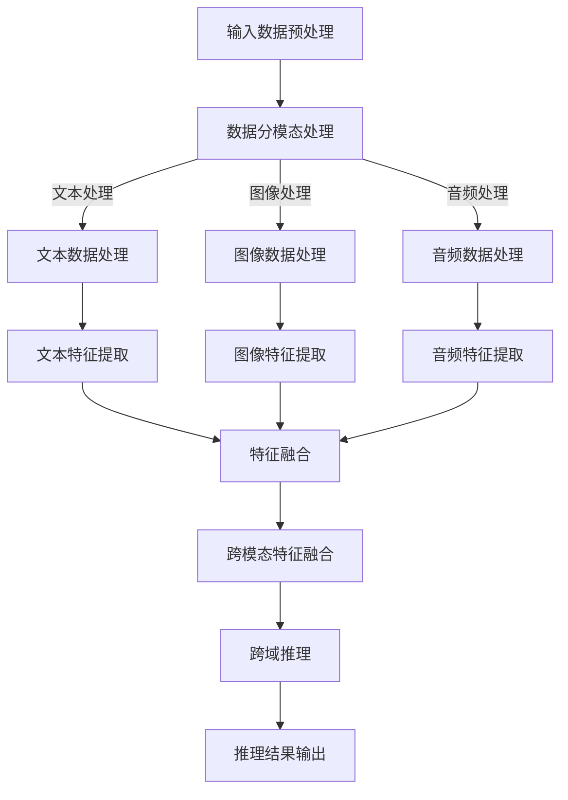

                 

### 算法原理讲解

#### 多模态跨域推理算法流程图

首先，我们使用Mermaid语言绘制算法的流程图，以便更直观地理解其工作原理。



如上所示，多模态跨域推理算法的核心流程可以概括为以下几个步骤：

1. **输入数据预处理**：首先对输入的多模态数据进行预处理，包括数据清洗、标准化等操作，确保数据质量。
2. **数据分模态处理**：将预处理后的数据按照模态类型（如文本、图像、音频）进行分类处理。
3. **多模态特征提取**：对每个模态的数据进行特征提取，生成特征向量。例如，文本数据可以采用词袋模型、TF-IDF等方法提取特征；图像数据可以使用卷积神经网络（CNN）提取特征；音频数据可以采用Mel频谱等方法提取特征。
4. **特征融合**：将不同模态的特征向量进行融合，生成统一的特征表示。特征融合的方法有多种，如加权平均、叠加融合、深度学习等。
5. **跨模态特征融合**：在特征融合的基础上，进一步进行跨模态特征的融合，生成更加综合的特征表示。
6. **跨域推理**：利用生成的跨模态特征进行推理，以实现跨领域的智能决策。
7. **推理结果输出**：将推理结果输出，用于后续的应用。

#### 数学模型与公式

在多模态跨域推理中，特征融合和跨模态特征融合是关键步骤。以下是相关的数学模型和公式。

##### 特征提取

1. **文本数据特征提取**：

   $$ f_{text} = \text{Embedding}(W \cdot x + b) $$

   其中，\( x \) 是文本数据，\( W \) 是嵌入矩阵，\( b \) 是偏置项，\( \text{Embedding} \) 函数用于将文本数据映射为向量表示。

2. **图像数据特征提取**：

   $$ f_{image} = \text{CNN}(I) $$

   其中，\( I \) 是图像数据，\( \text{CNN} \) 表示卷积神经网络，用于提取图像特征。

3. **音频数据特征提取**：

   $$ f_{audio} = \text{MelSpectrogram}(x) $$

   其中，\( x \) 是音频数据，\( \text{MelSpectrogram} \) 函数用于生成音频的Mel频谱特征。

##### 特征融合

1. **特征向量融合**：

   $$ f_{fusion} = \alpha_1 f_{text} + \alpha_2 f_{image} + \alpha_3 f_{audio} $$

   其中，\( \alpha_1, \alpha_2, \alpha_3 \) 是权重系数，用于平衡不同模态的特征贡献。

2. **跨模态特征融合**：

   $$ f_{cross} = \text{ Concat}(f_{fusion_1}, f_{fusion_2}, \ldots, f_{fusion_n}) $$

   其中，\( f_{fusion_1}, f_{fusion_2}, \ldots, f_{fusion_n} \) 是不同模态的特征融合结果，\( \text{Concat} \) 函数用于将它们拼接成一个多维特征向量。

##### 跨域推理

1. **跨域推理**：

   $$ y = \text{Model}(f_{cross}) $$

   其中，\( f_{cross} \) 是跨模态特征融合结果，\( \text{Model} \) 是用于推理的机器学习模型。

#### Python代码示例

以下是一个简单的Python代码示例，用于展示多模态跨域推理算法的核心实现。

```python
import tensorflow as tf
from tensorflow.keras.models import Model
from tensorflow.keras.layers import Embedding, Conv2D, LSTM, Dense

# 文本数据处理
text_embedding = Embedding(input_dim=vocab_size, output_dim=embedding_dim)(text_data)
text_output = LSTM(units=lstm_units)(text_embedding)

# 图像数据处理
image_input = Input(shape=(image_height, image_width, image_channels))
image_output = Conv2D(filters=32, kernel_size=(3, 3), activation='relu')(image_input)
image_output = MaxPooling2D(pool_size=(2, 2))(image_output)

# 音频数据处理
audio_embedding = Embedding(input_dim=vocab_size, output_dim=embedding_dim)(audio_data)
audio_output = LSTM(units=lstm_units)(audio_embedding)

# 特征融合
combined_output = concatenate([text_output, image_output, audio_output])

# 跨模态特征融合
cross_output = Dense(units=512, activation='relu')(combined_output)

# 跨域推理
output = Dense(units=num_classes, activation='softmax')(cross_output)

# 构建和编译模型
model = Model(inputs=[text_data, image_input, audio_embedding], outputs=output)
model.compile(optimizer='adam', loss='categorical_crossentropy', metrics=['accuracy'])

# 模型训练
model.fit(x_train, y_train, epochs=10, batch_size=32, validation_data=(x_val, y_val))
```

通过上述代码示例，我们可以看到如何使用TensorFlow构建一个多模态跨域推理模型，并进行训练和预测。这里的代码只是一个简化版本，实际的模型可能更加复杂，需要根据具体应用场景进行调整。

### 算法原理讲解总结

多模态跨域推理算法的核心在于将不同模态的数据进行有效融合，以实现更全面的信息理解和决策。通过特征提取、特征融合和跨域推理等步骤，算法能够实现跨模态和跨领域的推理。数学模型和Python代码示例为我们提供了具体的实现方法，使读者能够更好地理解和应用这一技术。在后续的章节中，我们将进一步探讨多模态跨域推理技术的系统架构设计、实际应用案例和项目实战，以帮助读者深入理解和掌握这一前沿技术。

