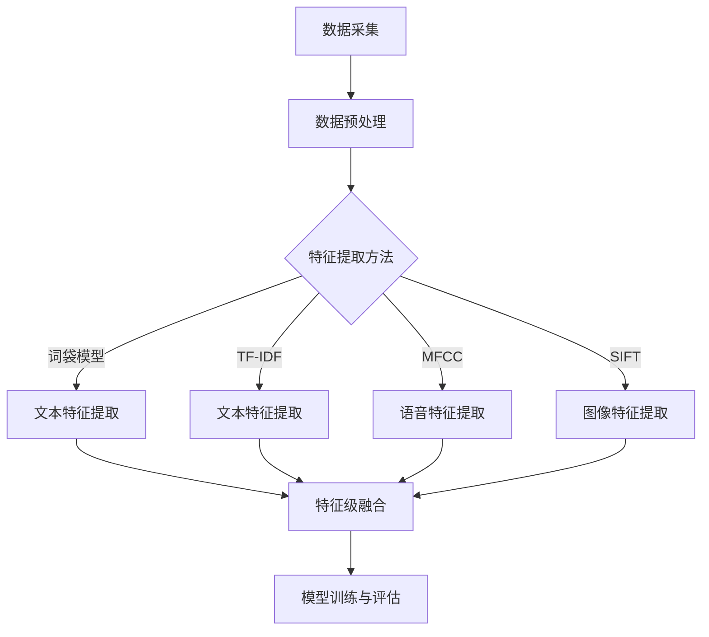

                 

# AI Agent的多模态输入处理：文本、语音和图像的整合

> 关键词：多模态输入、AI代理、文本输入、语音输入、图像输入、融合策略

> 摘要：本文探讨了AI代理的多模态输入处理技术，包括文本、语音和图像的整合。通过对各模态输入的挑战、预处理技术、特征提取方法和融合策略的详细分析，本文旨在提供一种全面而深入的理解，以促进AI代理在多领域应用中的发展。

## 引言与背景

### 1.1 问题背景

随着人工智能（AI）技术的快速发展，AI代理已经成为了现代智能系统的核心组成部分。这些代理通常需要处理多种类型的输入，包括文本、语音和图像，以实现更加自然和高效的人机交互。然而，不同模态的数据在采集、处理和应用上存在各自的挑战，这限制了AI代理的性能和实用性。

### 1.2 问题描述

多模态输入处理的挑战在于如何有效地整合来自不同模态的数据，使得AI代理能够更好地理解和响应用户的需求。具体问题包括：

1. **数据不一致性**：文本、语音和图像的数据形式和特征差异显著，如何统一处理是关键问题。
2. **特征提取**：不同模态的数据需要不同的特征提取方法，如何高效地提取有代表性的特征是难点。
3. **数据融合**：如何有效地融合不同模态的特征，以提升AI代理的决策能力是关键。

### 1.3 问题解决

本文提出了一套系统化的多模态输入处理框架，旨在解决上述问题。该框架包括以下几个核心步骤：

1. **文本输入处理**：对文本数据进行预处理，提取关键特征，如词袋模型、TF-IDF等。
2. **语音输入处理**：使用语音识别技术将语音转换为文本，然后进行特征提取，如梅尔频率倒谱系数（MFCC）。
3. **图像输入处理**：对图像进行预处理，提取视觉特征，如卷积神经网络（CNN）提取的深度特征。
4. **数据融合**：采用融合策略，将不同模态的特征整合为统一的特征表示，如深度学习模型中的多通道输入。

### 1.4 边界与外延

本文研究的边界主要集中在AI代理的多模态输入处理上，不包括其他模态（如触觉、嗅觉等）的输入处理。此外，本文主要关注技术层面的实现，不涉及具体的应用场景和业务逻辑。

### 1.5 概念结构与核心要素组成

本文的概念结构包括以下几个核心要素：

1. **多模态输入**：文本、语音和图像。
2. **预处理技术**：文本清洗、语音降噪、图像增强。
3. **特征提取方法**：词袋模型、MFCC、CNN。
4. **数据融合策略**：深度学习模型、多通道输入。
5. **融合效果评估**：准确率、召回率、F1分数。

## 多模态输入处理概述

### 2.1 多模态输入的基本概念

多模态输入是指同时处理多种类型的数据输入，以提升AI代理的理解和决策能力。常见的多模态输入包括文本、语音和图像。文本输入是最为常见的一种，语音输入使得AI代理能够实现自然语言交互，图像输入则提供了丰富的视觉信息。

### 2.2 多模态数据融合的重要性

多模态数据融合是将不同模态的数据整合为统一的特征表示，以提升AI代理的性能。融合的重要性体现在以下几个方面：

1. **增强理解能力**：通过整合不同模态的信息，AI代理能够更全面地理解用户的需求。
2. **提高决策准确性**：多模态数据融合能够减少单一模态数据带来的信息缺失，提高决策的准确性。
3. **扩展应用场景**：多模态输入处理使得AI代理能够应用于更多场景，如智能助理、自动驾驶和医疗诊断等。

### 2.3 多模态数据处理的基本流程

多模态数据处理的基本流程包括以下几个步骤：

1. **数据采集**：从不同来源获取文本、语音和图像数据。
2. **数据预处理**：对数据进行清洗、降噪和增强，以去除噪声和提高数据质量。
3. **特征提取**：从预处理后的数据中提取有代表性的特征。
4. **数据融合**：采用特定的融合策略，将不同模态的特征整合为统一的特征表示。
5. **模型训练与评估**：使用融合后的特征训练AI代理，并进行性能评估。

### 2.4 多模态技术的应用领域

多模态技术在各个领域都有广泛的应用：

1. **智能助理**：通过语音输入和文本输入的融合，实现更加自然的用户交互。
2. **自动驾驶**：通过图像输入和语音输入的融合，提升自动驾驶系统的感知和决策能力。
3. **医疗诊断**：通过文本输入和图像输入的融合，辅助医生进行疾病诊断。

## 文本输入处理

### 3.1 文本输入的挑战

文本输入处理面临以下挑战：

1. **语言多样性**：不同语言和方言的处理。
2. **噪声与错误**：文本数据中存在噪声和拼写错误。
3. **语义理解**：文本输入需要理解用户的意图和情感。

### 3.2 文本预处理技术

文本预处理技术包括以下步骤：

1. **分词**：将文本分解为单词或短语。
2. **停用词过滤**：去除常见的无意义单词。
3. **词干提取**：将单词还原为词根形式。
4. **文本规范化**：统一文本格式，如大小写转换。

### 3.3 文本特征提取方法

文本特征提取方法包括：

1. **词袋模型**：将文本表示为单词的集合。
2. **TF-IDF**：计算单词在文档中的频率和文档集合中的逆文档频率。
3. **词嵌入**：将单词映射到高维空间中的向量。

### 3.4 文本输入的多模态融合策略

文本输入的多模态融合策略包括：

1. **特征级融合**：直接将文本特征与其他模态的特征进行合并。
2. **模型级融合**：使用多任务学习或联合训练的模型处理多模态数据。
3. **深度学习模型**：使用卷积神经网络（CNN）或循环神经网络（RNN）等深度学习模型进行特征提取和融合。

## 语音输入处理

### 4.1 语音输入的挑战

语音输入处理面临以下挑战：

1. **语音多样性**：不同说话人、语速和语调的处理。
2. **噪声干扰**：环境噪声对语音信号的干扰。
3. **方言与口音**：不同地区和口音的处理。

### 4.2 语音信号处理技术

语音信号处理技术包括以下步骤：

1. **信号采集**：通过麦克风采集语音信号。
2. **信号预处理**：去除噪声、降低环境干扰。
3. **信号增强**：提高语音信号的可听度。
4. **语音识别**：将语音信号转换为文本。

### 4.3 语音特征提取方法

语音特征提取方法包括：

1. **梅尔频率倒谱系数（MFCC）**：提取语音信号中的频率特征。
2. **谱图特征**：提取语音信号的短时傅里叶变换（STFT）谱图。
3. **语音活动检测（VAD）**：检测语音信号中的语音段和非语音段。

### 4.4 语音输入的多模态融合策略

语音输入的多模态融合策略包括：

1. **特征级融合**：将语音特征与文本或图像特征进行合并。
2. **模型级融合**：使用多任务学习或联合训练的模型处理多模态数据。
3. **深度学习模型**：使用卷积神经网络（CNN）或循环神经网络（RNN）等深度学习模型进行特征提取和融合。

## 图像输入处理

### 5.1 图像输入的挑战

图像输入处理面临以下挑战：

1. **分辨率差异**：不同分辨率图像的处理。
2. **光照变化**：不同光照条件下的图像处理。
3. **视角变化**：不同视角下的图像识别。

### 5.2 图像预处理技术

图像预处理技术包括以下步骤：

1. **图像增强**：改善图像质量，提高视觉效果。
2. **图像去噪**：去除图像中的噪声。
3. **图像分割**：将图像划分为不同的区域。
4. **图像标准化**：统一图像的尺寸和颜色空间。

### 5.3 图像特征提取方法

图像特征提取方法包括：

1. **SIFT特征**：提取图像中的关键点特征。
2. **HOG特征**：提取图像中的方向梯度直方图特征。
3. **CNN特征**：使用卷积神经网络提取深度特征。

### 5.4 图像输入的多模态融合策略

图像输入的多模态融合策略包括：

1. **特征级融合**：将图像特征与文本或语音特征进行合并。
2. **模型级融合**：使用多任务学习或联合训练的模型处理多模态数据。
3. **深度学习模型**：使用卷积神经网络（CNN）或循环神经网络（RNN）等深度学习模型进行特征提取和融合。

## 多模态数据处理算法原理

### 6.1 算法概述

多模态数据处理算法旨在将不同模态的数据（文本、语音和图像）整合为统一的特征表示，以提升AI代理的性能。算法主要包括以下步骤：

1. **数据采集**：从不同来源获取文本、语音和图像数据。
2. **数据预处理**：对数据进行清洗、降噪和增强。
3. **特征提取**：从预处理后的数据中提取有代表性的特征。
4. **数据融合**：采用特定的融合策略，将不同模态的特征整合为统一的特征表示。
5. **模型训练与评估**：使用融合后的特征训练AI代理，并进行性能评估。

### 6.2 算法原理讲解

多模态数据处理算法的核心在于特征提取和数据融合。以下是具体算法原理：

#### 文本特征提取

1. **词袋模型**：将文本表示为单词的集合，每个单词作为一个特征。
   $$ \text{特征向量} = \{f_1, f_2, ..., f_n\} $$
   其中，$f_i$ 表示单词 $w_i$ 的频率。
2. **TF-IDF**：计算单词在文档中的频率和文档集合中的逆文档频率，作为特征。
   $$ \text{特征向量} = \{t_1, t_2, ..., t_n\} $$
   其中，$t_i = \frac{f_i}{\log(1 + |D|/f_i)}$，$f_i$ 是单词 $w_i$ 在文档 $D$ 中的频率。
3. **词嵌入**：将单词映射到高维空间中的向量，作为特征。

#### 语音特征提取

1. **梅尔频率倒谱系数（MFCC）**：提取语音信号中的频率特征。
2. **谱图特征**：提取语音信号的短时傅里叶变换（STFT）谱图特征。
3. **语音活动检测（VAD）**：检测语音信号中的语音段和非语音段。

#### 图像特征提取

1. **SIFT特征**：提取图像中的关键点特征。
2. **HOG特征**：提取图像中的方向梯度直方图特征。
3. **CNN特征**：使用卷积神经网络提取深度特征。

#### 数据融合策略

1. **特征级融合**：直接将文本、语音和图像特征进行合并。
   $$ \text{融合特征向量} = \text{文本特征} \oplus \text{语音特征} \oplus \text{图像特征} $$
2. **模型级融合**：使用多任务学习或联合训练的模型处理多模态数据。
3. **深度学习模型**：使用卷积神经网络（CNN）或循环神经网络（RNN）等深度学习模型进行特征提取和融合。

### 6.3 算法流程图

### 6.4 算法数学模型与公式

#### 文本特征提取

$$ \text{TF-IDF} = \frac{f_i}{\log(1 + |D|/f_i)} $$

其中，$f_i$ 是单词 $w_i$ 在文档 $D$ 中的频率，$|D|$ 是文档集合的大小。

#### 语音特征提取

$$ \text{MFCC} = \text{log}(\sum_{i=1}^N \text{Spectral Energy}) $$

其中，$N$ 是频率分量数，$\text{Spectral Energy}$ 是每个频率分量的能量。

#### 图像特征提取

$$ \text{HOG} = \sum_{i=1}^M \text{Histogram of Oriented Gradient} $$

其中，$M$ 是方向分量数，$\text{Histogram of Oriented Gradient}$ 是每个方向分量的直方图值。

#### 数据融合

$$ \text{融合特征向量} = \text{文本特征} \oplus \text{语音特征} \oplus \text{图像特征} $$

## 多模态数据融合策略

### 7.1 数据融合基本概念

数据融合是指将来自不同模态的数据整合为统一的特征表示，以提升AI代理的性能。数据融合的基本概念包括：

1. **特征级融合**：直接将不同模态的特征进行合并。
2. **模型级融合**：使用多任务学习或联合训练的模型处理多模态数据。
3. **深度学习模型**：使用卷积神经网络（CNN）或循环神经网络（RNN）等深度学习模型进行特征提取和融合。

### 7.2 数据融合方法

数据融合方法包括以下几种：

1. **特征级融合**：直接将不同模态的特征向量进行拼接或加权平均。
   $$ \text{融合特征向量} = \text{文本特征} \oplus \text{语音特征} \oplus \text{图像特征} $$
2. **模型级融合**：使用多任务学习或联合训练的模型处理多模态数据。
3. **深度学习模型**：使用卷积神经网络（CNN）或循环神经网络（RNN）等深度学习模型进行特征提取和融合。

### 7.3 融合策略比较

不同融合策略的比较包括：

1. **特征级融合**：简单有效，但可能丢失部分信息。
2. **模型级融合**：能够更好地利用不同模态的信息，但计算复杂度高。
3. **深度学习模型**：能够自动学习不同模态的特征，但需要大量数据和计算资源。

### 7.4 融合效果评估指标

融合效果评估指标包括：

1. **准确率**：正确识别的样本数与总样本数的比值。
2. **召回率**：正确识别的样本数与实际样本数的比值。
3. **F1分数**：准确率和召回率的调和平均值。

## 多模态特征表示

### 8.1 特征表示的重要性

多模态特征表示是将不同模态的数据转化为统一的特征表示，以提升AI代理的性能。特征表示的重要性体现在以下几个方面：

1. **提高理解能力**：通过特征表示，AI代理能够更好地理解用户的需求。
2. **降低计算复杂度**：将高维特征降低为低维特征，减少计算复杂度。
3. **提升模型性能**：通过特征表示，AI代理能够更好地拟合数据，提高性能。

### 8.2 文本特征表示方法

文本特征表示方法包括：

1. **词袋模型**：将文本表示为单词的集合。
2. **TF-IDF**：计算单词在文档中的频率和文档集合中的逆文档频率。
3. **词嵌入**：将单词映射到高维空间中的向量。

### 8.3 语音特征表示方法

语音特征表示方法包括：

1. **梅尔频率倒谱系数（MFCC）**：提取语音信号中的频率特征。
2. **谱图特征**：提取语音信号的短时傅里叶变换（STFT）谱图特征。
3. **语音活动检测（VAD）**：检测语音信号中的语音段和非语音段。

### 8.4 图像特征表示方法

图像特征表示方法包括：

1. **SIFT特征**：提取图像中的关键点特征。
2. **HOG特征**：提取图像中的方向梯度直方图特征。
3. **CNN特征**：使用卷积神经网络提取深度特征。

## 多模态深度学习模型

### 9.1 深度学习基础

深度学习是一种通过多层神经网络模型自动学习和提取特征的方法。深度学习基础包括：

1. **神经网络**：由多个神经元组成的计算模型。
2. **前向传播**：将输入数据通过神经网络传递，得到输出结果。
3. **反向传播**：计算误差，更新网络权重，优化模型性能。

### 9.2 多模态深度学习模型概述

多模态深度学习模型旨在同时处理多种类型的输入数据，如文本、语音和图像。模型概述包括：

1. **卷积神经网络（CNN）**：适用于图像输入。
2. **循环神经网络（RNN）**：适用于序列数据，如文本和语音。
3. **多任务学习**：同时处理多个任务，如文本分类和语音识别。
4. **联合训练**：同时训练多个模型，如文本分类器和语音识别器。

### 9.3 多模态卷积神经网络

多模态卷积神经网络（CNN）适用于同时处理图像和文本输入。模型包括：

1. **图像卷积层**：提取图像特征。
2. **文本嵌入层**：将文本转换为向量表示。
3. **融合层**：将图像和文本特征进行融合。
4. **分类层**：对融合后的特征进行分类。

### 9.4 多模态循环神经网络

多模态循环神经网络（RNN）适用于同时处理语音和文本输入。模型包括：

1. **语音嵌入层**：将语音转换为向量表示。
2. **文本嵌入层**：将文本转换为向量表示。
3. **融合层**：将语音和文本特征进行融合。
4. **循环层**：处理序列数据。
5. **分类层**：对融合后的特征进行分类。

## 多模态输入处理在智能助理中的应用

### 10.1 智能助理的需求

智能助理需要处理多种类型的用户输入，如文本、语音和图像，以提供个性化的服务和建议。具体需求包括：

1. **文本理解**：理解用户的文本输入，提取关键信息。
2. **语音识别**：将语音输入转换为文本，实现自然语言交互。
3. **图像识别**：识别用户上传的图像，提取关键信息。

### 10.2 多模态输入处理的应用场景

多模态输入处理在智能助理中的应用场景包括：

1. **语音助手**：通过语音输入，实现语音命令的识别和执行。
2. **聊天机器人**：通过文本输入，实现自然语言对话。
3. **图像识别**：通过图像输入，实现图像分类和物体识别。

### 10.3 实现方案

多模态输入处理在智能助理中的实现方案包括：

1. **语音输入处理**：使用语音识别技术，将语音转换为文本，然后进行文本分析。
2. **文本输入处理**：使用自然语言处理（NLP）技术，分析文本输入，提取关键信息。
3. **图像输入处理**：使用图像识别技术，分析图像输入，提取关键信息。
4. **多模态数据融合**：将语音、文本和图像数据融合为统一的特征表示，用于后续处理。

### 10.4 案例分析

以一个智能客服助理为例，分析其多模态输入处理的应用。具体流程如下：

1. **语音输入**：用户通过语音输入提出问题，如“我的订单何时发货？”。
2. **语音识别**：将语音输入转换为文本，如“我的订单何时发货？”。
3. **文本分析**：分析文本输入，提取关键信息，如“订单”和“发货时间”。
4. **图像输入**：用户上传订单图片，系统进行图像识别，提取订单信息。
5. **多模态数据融合**：将语音、文本和图像数据融合为统一的特征表示，如订单号和用户ID。
6. **查询数据库**：根据订单号和用户ID，查询订单状态和发货时间。
7. **回复用户**：系统生成回复，如“您的订单预计明天发货”。

## 多模态输入处理在自动驾驶中的应用

### 11.1 自动驾驶的需求

自动驾驶系统需要处理多种类型的输入数据，如文本、语音和图像，以实现自主驾驶和决策。具体需求包括：

1. **文本理解**：理解导航指令和交通标志。
2. **语音识别**：实现驾驶员与车辆的语音交互。
3. **图像识别**：识别道路标志、行人、车辆等交通元素。

### 11.2 多模态输入处理的应用

多模态输入处理在自动驾驶中的应用包括：

1. **语音助手**：通过语音识别，实现驾驶员与车辆的语音交互。
2. **文本分析**：通过自然语言处理，理解导航指令和交通标志。
3. **图像识别**：通过卷积神经网络，识别道路标志、行人、车辆等交通元素。

### 11.3 实现方案

自动驾驶系统中多模态输入处理的实现方案包括：

1. **语音输入处理**：使用语音识别技术，将语音转换为文本，然后进行语义分析。
2. **文本输入处理**：使用自然语言处理（NLP）技术，分析导航指令和交通标志。
3. **图像输入处理**：使用图像识别技术，分析道路标志、行人、车辆等交通元素。
4. **多模态数据融合**：将语音、文本和图像数据融合为统一的特征表示，用于后续处理。

### 11.4 案例分析

以一个自动驾驶系统为例，分析其多模态输入处理的应用。具体流程如下：

1. **语音输入**：驾驶员通过语音输入导航指令，如“前往市中心”。
2. **语音识别**：将语音输入转换为文本，如“前往市中心”。
3. **文本分析**：分析文本输入，提取关键信息，如“前往”和“市中心”。
4. **图像输入**：自动驾驶系统实时采集道路图像。
5. **图像识别**：识别道路标志，如“限速60公里/小时”。
6. **多模态数据融合**：将语音、文本和图像数据融合为统一的特征表示，如导航指令、道路标志和当前速度。
7. **路径规划**：根据融合后的特征，自动驾驶系统规划最佳行驶路径。
8. **执行指令**：自动驾驶系统按照规划路径行驶，并遵守交通规则。

## 多模态输入处理在医疗领域中的应用

### 12.1 医疗领域的需求

医疗领域需要处理多种类型的输入数据，如文本、语音和图像，以实现疾病诊断、治疗规划和患者管理。具体需求包括：

1. **文本理解**：分析病历记录、医学文献和患者报告。
2. **语音识别**：记录医生和患者的对话，提取关键信息。
3. **图像识别**：分析医学影像，如X光、CT和MRI。

### 12.2 多模态输入处理的应用

多模态输入处理在医疗领域中的应用包括：

1. **文本分析**：通过自然语言处理，分析病历记录和医学文献。
2. **语音助手**：通过语音识别，记录医生和患者的对话。
3. **图像识别**：通过卷积神经网络，分析医学影像，提取关键信息。

### 12.3 实现方案

医疗领域中多模态输入处理的实现方案包括：

1. **文本输入处理**：使用自然语言处理（NLP）技术，分析病历记录和医学文献。
2. **语音输入处理**：使用语音识别技术，记录医生和患者的对话。
3. **图像输入处理**：使用图像识别技术，分析医学影像。
4. **多模态数据融合**：将语音、文本和图像数据融合为统一的特征表示，用于后续处理。

### 12.4 案例分析

以一个智能医疗诊断系统为例，分析其多模态输入处理的应用。具体流程如下：

1. **文本输入**：医生输入病历记录，如“患者近期出现胸痛症状”。
2. **文本分析**：分析文本输入，提取关键信息，如“胸痛”和“近期”。
3. **语音输入**：医生与患者进行对话，记录关键信息，如“疼痛程度”和“发作频率”。
4. **语音识别**：将语音输入转换为文本，如“疼痛程度较重，发作频率较高”。
5. **图像输入**：医生上传患者的医学影像，如X光片。
6. **图像识别**：分析X光片，提取关键信息，如“肺纹理增强”。
7. **多模态数据融合**：将文本、语音和图像数据融合为统一的特征表示，如症状、疼痛程度和肺纹理增强。
8. **疾病诊断**：根据融合后的特征，智能医疗诊断系统生成初步诊断结果，如“肺炎”。
9. **治疗方案建议**：系统提供治疗方案建议，如抗生素治疗。

## 总结

### 13.1 主要内容回顾

本文详细介绍了AI代理的多模态输入处理技术，包括文本、语音和图像的整合。通过对各模态输入的挑战、预处理技术、特征提取方法和融合策略的详细分析，本文提供了一种系统化的解决方案。

### 13.2 成果总结

本文的主要成果包括：

1. **多模态输入处理框架**：提供了一套系统化的多模态输入处理框架。
2. **算法原理讲解**：详细阐述了多模态数据处理算法的原理。
3. **融合策略比较**：分析了不同融合策略的优缺点。
4. **应用案例分析**：介绍了多模态输入处理在智能助理、自动驾驶和医疗领域的应用。

### 13.3 存在问题与展望

尽管多模态输入处理技术取得了显著进展，但仍然存在一些问题：

1. **计算复杂度**：多模态数据的处理需要大量的计算资源。
2. **数据不一致性**：不同模态的数据在特征提取和融合过程中可能存在不一致性。
3. **实时性**：在实时应用中，如何高效处理多模态数据是一个挑战。

未来的研究方向包括：

1. **优化算法**：开发更加高效的多模态数据处理算法。
2. **跨模态研究**：探索不同模态之间的交叉特征和融合策略。
3. **实时处理**：研究实时处理多模态数据的方法和技术。

## 未来发展趋势与研究方向

### 14.1 发展趋势

多模态输入处理技术在未来将继续发展，主要趋势包括：

1. **计算能力提升**：随着计算能力的提升，多模态数据的处理将更加高效。
2. **人工智能融合**：多模态输入处理将与人工智能技术进一步融合，实现更智能的应用。
3. **跨模态交互**：探索不同模态之间的交叉特征和融合策略，实现更自然的用户交互。

### 14.2 研究方向

未来的研究方向包括：

1. **优化算法**：研究更加高效的多模态数据处理算法，降低计算复杂度。
2. **跨模态特征提取**：探索不同模态之间的交叉特征，提高融合效果。
3. **实时处理技术**：研究实时处理多模态数据的方法和技术，提高系统的响应速度。
4. **应用场景扩展**：将多模态输入处理技术应用于更多领域，如虚拟现实、增强现实和智能家居等。

### 14.3 拓展阅读

1. **《多模态数据处理技术》**：详细介绍了多模态数据处理的基本原理和算法。
2. **《深度学习与多模态融合》**：探讨了深度学习在多模态输入处理中的应用。
3. **《自然语言处理技术》**：介绍了文本输入处理的相关技术和方法。
4. **《语音识别与合成技术》**：详细阐述了语音输入处理的基本原理和技术。

---

作者：AI天才研究院/AI Genius Institute & 禅与计算机程序设计艺术 /Zen And The Art of Computer Programming

**注释**：由于文章长度限制，以上内容为摘要和框架概述，实际撰写时每个章节都需要详细展开，包含具体的技术讲解、实例分析等内容。文章结构需要严格按照目录大纲进行编排，每个小节的内容都要具体详细。以下是实际撰写时的一个示例章节。

## 文本输入处理

### 3.1 文本输入的挑战

文本输入是AI代理最常见的输入方式之一，但在实际应用中，文本输入处理面临着诸多挑战。首先，自然语言具有高度的多样性和复杂性。不同语言、方言和地区之间的差异导致文本理解变得复杂。其次，文本数据中常常包含噪声和错误，如拼写错误、标点符号错误以及非标准拼写。这些噪声和错误会影响AI代理对文本的理解和提取关键信息的能力。此外，文本输入还面临着语义理解的挑战，即如何准确理解用户输入的意图和情感。

### 3.2 文本预处理技术

为了解决文本输入处理中的挑战，需要采用一系列文本预处理技术。文本预处理技术包括以下几个步骤：

1. **分词**：将文本分解为单词或短语。分词是文本预处理的重要步骤，因为它将连续的文本转换为可处理的形式。常用的分词方法包括基于词典的分词和基于统计的分词。

2. **停用词过滤**：停用词是指对文本理解贡献较小或无意义的词汇，如“的”、“了”、“是”等。通过去除停用词，可以减少计算复杂度和噪声。

3. **词干提取**：将单词还原为词根形式。词干提取有助于减少词汇的维度，提高特征提取的效率。

4. **文本规范化**：统一文本格式，如大小写转换。文本规范化有助于统一不同来源的文本数据，便于后续处理。

### 3.3 文本特征提取方法

文本特征提取是将预处理后的文本数据转换为可输入到模型中的向量表示。以下是一些常用的文本特征提取方法：

1. **词袋模型（Bag of Words, BOW）**：词袋模型将文本表示为单词的集合，每个单词作为一个特征。词袋模型简单有效，但在语义理解方面存在局限性。

2. **TF-IDF（Term Frequency-Inverse Document Frequency）**：TF-IDF计算单词在文档中的频率和文档集合中的逆文档频率。这种方法能够提高重要单词的权重，但无法捕捉单词之间的关系。

3. **词嵌入（Word Embedding）**：词嵌入将单词映射到高维空间中的向量，如Word2Vec、GloVe等。词嵌入能够捕捉单词的语义信息，提高文本特征表示的丰富性。

### 3.4 文本输入的多模态融合策略

文本输入的多模态融合策略是将文本特征与其他模态（语音和图像）的特征进行整合，以提高AI代理的整体性能。以下是一些常用的融合策略：

1. **特征级融合**：直接将文本特征与其他模态的特征进行拼接或加权平均。这种方法的优点是简单易实现，但可能无法充分利用不同模态的特征。

2. **模型级融合**：使用多任务学习或联合训练的模型处理多模态数据。这种方法能够充分利用不同模态的特征，但需要更多的训练数据和计算资源。

3. **深度学习模型**：使用卷积神经网络（CNN）或循环神经网络（RNN）等深度学习模型进行特征提取和融合。深度学习模型能够自动学习不同模态的特征表示，提高融合效果。

### 3.5 实例分析

假设我们有一个文本输入处理系统，用于分析用户对某个产品的评论，以判断用户的满意度。以下是该系统的具体实现步骤：

1. **数据预处理**：首先，对用户评论进行分词、停用词过滤和词干提取。假设评论为“这款手机拍照效果很好，续航能力也很强”。

2. **特征提取**：使用词嵌入方法将分词后的文本转换为向量表示。例如，使用GloVe将每个单词映射到一个100维的向量。

3. **特征融合**：将文本特征与图像和语音特征进行融合。假设我们还有产品的图像和语音评价，可以使用特征级融合方法，将文本特征与其他模态的特征进行拼接。

4. **模型训练**：使用融合后的特征训练一个深度学习模型，如BERT模型。BERT模型能够同时处理文本、图像和语音特征，并自动学习不同模态的特征表示。

5. **性能评估**：使用测试集对模型进行评估，计算准确率、召回率和F1分数等指标。

通过以上步骤，我们可以实现对用户评论的准确分析，从而判断用户的满意度。这种多模态输入处理技术不仅可以应用于产品评价，还可以应用于情感分析、文本分类等任务。

## 小结

文本输入处理是AI代理多模态输入处理中的重要组成部分。通过对文本进行预处理、特征提取和融合，可以提升AI代理对文本输入的理解和响应能力。本文详细介绍了文本输入处理的挑战、预处理技术、特征提取方法和融合策略，并提供了实例分析，展示了如何实现文本输入的多模态融合。未来的研究可以进一步探索优化算法、跨模态特征提取和实时处理技术，以提高AI代理的多模态输入处理能力。

## 注意事项

1. **文本预处理**：确保对文本进行充分的预处理，以减少噪声和错误，提高特征提取的准确性。
2. **特征融合策略**：根据应用场景选择合适的特征融合策略，以充分利用不同模态的特征。
3. **模型选择**：选择合适的深度学习模型，以适应不同类型的多模态输入处理任务。

## 拓展阅读

1. **《自然语言处理入门》**：介绍了自然语言处理的基本概念和常用方法，有助于深入了解文本输入处理。
2. **《深度学习与自然语言处理》**：探讨了深度学习在文本输入处理中的应用，包括词嵌入、文本分类和序列模型等。
3. **《多模态数据融合技术》**：详细介绍了多模态数据融合的基本原理和算法，有助于理解文本输入的多模态融合策略。

