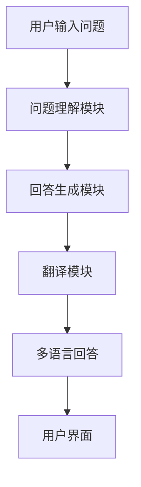
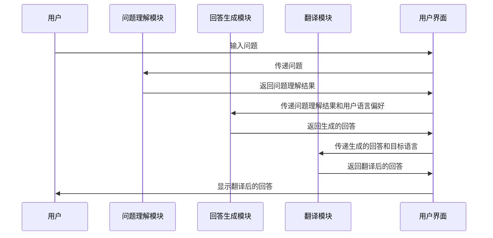

                 

# AI Agent的多语言支持：跨语言理解与生成

> 关键词：AI Agent、多语言支持、跨语言理解、生成式模型、自然语言处理

> 摘要：本文深入探讨了AI Agent的多语言支持技术，包括跨语言理解与生成。通过分析多语言支持的背景、技术、应用，揭示了实现多语言AI Agent的关键步骤和挑战。本文旨在为开发者提供有价值的指导，助力他们在全球化的今天打造具备多语言能力的智能系统。

## 目录大纲

1. **AI Agent的多语言支持概述**
   1.1 多语言支持背景与概述
   1.2 多语言支持的分类
   1.3 多语言支持的关键技术
   1.4 多语言支持在AI Agent中的应用

2. **跨语言理解技术详解**
   2.1 跨语言词嵌入
   2.2 跨语言实体识别
   2.3 跨语言语义理解

3. **跨语言生成技术详解**
   3.1 生成式机器翻译
   3.2 多语言问答系统
   3.3 多语言文本生成

4. **多语言支持技术实现与应用**
   4.1 多语言支持技术实现概述
   4.2 多语言支持项目实战

5. **多语言支持技术展望**
   5.1 当前多语言支持技术的发展趋势
   5.2 多语言支持技术的未来发展方向

---

## 第一部分：AI Agent的多语言支持概述

### 第1章：多语言支持背景与概述

在当今全球化的背景下，多语言支持已成为人工智能（AI）系统，特别是智能代理（AI Agent）的一个重要需求。随着跨文化交流的日益频繁，用户期望AI系统能够理解和回答多种语言的查询，提供无障碍的服务。

#### 1.1 多语言支持的现状与挑战

**全球化背景下的多语言需求**：全球互联网用户分布在不同的国家和地区，使用着多种语言。因此，AI系统需要具备处理多种语言的能力，以提供无缝的用户体验。

**语言差异与沟通障碍**：不同语言之间存在巨大的差异，这给跨语言理解带来了挑战。词汇、语法、语调、文化背景等方面的差异，都可能导致误解和沟通障碍。

**多语言支持的重要性**：多语言支持不仅有助于提升用户体验，还能帮助企业拓展国际市场。通过提供多语言服务，企业能够更好地与全球客户沟通，增加客户忠诚度，提高业务收入。

#### 1.2 多语言支持的分类

多语言支持主要包括以下几个类别：

**机器翻译**：将一种语言翻译成另一种语言，以实现跨语言信息传递。

**交叉语言语义理解**：理解不同语言之间的语义关系，以实现跨语言的信息处理。

**多语言问答系统**：接受多种语言的输入，并返回相应的多语言回答。

#### 1.3 多语言支持的关键技术

**语言模型**：用于生成文本或理解文本的算法。常见的语言模型包括词袋模型、循环神经网络（RNN）和变换器（Transformer）等。

**语义理解**：分析文本的语义内容，包括词汇、语法和上下文等。

**生成模型**：用于生成文本或图像的算法，如生成对抗网络（GAN）和变分自编码器（VAE）等。

#### 1.4 多语言支持在AI Agent中的应用

**AI Agent的定义与作用**：AI Agent是一种智能实体，能够自主地执行任务、解决问题和与用户进行交互。

**多语言支持在AI Agent中的角色**：多语言支持使得AI Agent能够与不同语言的用户进行交流，提高其通用性和实用性。

**多语言支持的实现路径**：通过整合多语言语言模型、跨语言理解技术和生成模型，实现AI Agent的多语言能力。

### 总结

本章概述了多语言支持在AI Agent中的应用背景和关键要素。在接下来的章节中，我们将详细探讨跨语言理解和生成技术，为构建多语言AI Agent提供理论基础和实践指导。让我们一步步深入探索这一领域，开启多语言智能代理的新篇章。

---

### 第2章：跨语言理解技术详解

在构建多语言AI Agent的过程中，跨语言理解技术是至关重要的一环。本章将详细探讨跨语言词嵌入、跨语言实体识别和跨语言语义理解等核心技术，旨在揭示这些技术如何帮助AI Agent在不同语言之间进行有效的信息处理和理解。

#### 2.1 跨语言词嵌入

**跨语言词嵌入的概念**：跨语言词嵌入是将不同语言的单词映射到同一个高维空间中，使具有相似语义的词在空间中靠近。

**跨语言词嵌入的方法**：

- **共现矩阵法**：基于单词在文本中的共现信息，计算不同语言之间的相似度，并将其映射到同一空间。
  
- **基于神经网络的词嵌入**：使用神经网络模型，如循环神经网络（RNN）和变换器（Transformer），学习不同语言之间的词嵌入表示。

**跨语言词嵌入的应用**：跨语言词嵌入在多语言文本分类、命名实体识别和机器翻译等领域有着广泛的应用。

#### 2.2 跨语言实体识别

**跨语言实体识别的概念**：跨语言实体识别是在不同语言之间识别出具有相同或相似指称的实体，如人名、地名和组织名等。

**跨语言实体识别的方法**：

- **基于规则的方法**：利用语言学知识和规则，对文本进行分词和命名实体识别。

- **基于统计学习方法**：通过训练统计模型，如条件概率模型和朴素贝叶斯分类器，进行跨语言实体识别。

**跨语言实体识别的应用**：跨语言实体识别在多语言信息抽取、知识图谱构建和跨语言文本匹配等领域具有重要应用价值。

#### 2.3 跨语言语义理解

**跨语言语义理解的概念**：跨语言语义理解是理解不同语言之间的语义关系，包括词汇、语法和上下文等。

**跨语言语义理解的方法**：

- **基于词嵌入的方法**：利用跨语言词嵌入模型，将不同语言的词映射到同一语义空间，从而理解其语义关系。

- **基于翻译模型的方法**：通过训练翻译模型，将源语言的句子翻译成目标语言，然后分析翻译后的句子语义。

**跨语言语义理解的应用**：跨语言语义理解在多语言问答系统、机器翻译和跨语言文本检索等领域发挥着重要作用。

### 总结

本章详细介绍了跨语言理解技术，包括跨语言词嵌入、跨语言实体识别和跨语言语义理解。这些技术为实现多语言AI Agent的跨语言处理能力提供了理论基础和实践指导。在接下来的章节中，我们将继续探讨跨语言生成技术，为构建全面的多语言AI Agent奠定基础。

---

### 第3章：跨语言生成技术详解

在构建多语言AI Agent的过程中，除了跨语言理解技术，跨语言生成技术同样至关重要。本章将详细探讨生成式机器翻译、多语言问答系统和多语言文本生成等核心技术，旨在揭示这些技术如何帮助AI Agent在不同语言之间进行有效的信息生成。

#### 3.1 生成式机器翻译

**生成式机器翻译的概念**：生成式机器翻译是一种基于概率模型的方法，通过生成目标语言的句子来翻译源语言句子。

**生成式机器翻译的架构**：

1. **编码器（Encoder）**：接收源语言句子，将其编码为一个固定长度的向量表示。
2. **解码器（Decoder）**：接收编码器生成的向量表示，生成目标语言句子。

**生成式机器翻译的训练与优化**：

- **序列到序列（Seq2Seq）模型**：基于编码器-解码器框架，使用长短时记忆（LSTM）或变换器（Transformer）等神经网络模型进行训练。
- **注意力机制（Attention）**：通过注意力机制，使解码器能够关注编码器输出的不同部分，从而提高翻译质量。

**生成式机器翻译的应用**：生成式机器翻译在跨语言信息传递、多语言内容创作和国际合作等领域具有广泛应用。

#### 3.2 多语言问答系统

**多语言问答系统的概念**：多语言问答系统是一种能够接收多种语言的输入，并返回相应多语言回答的系统。

**多语言问答系统的架构**：

1. **问题理解模块**：解析并理解用户输入的问题。
2. **回答生成模块**：根据理解模块的结果，生成多语言回答。
3. **翻译模块**：将生成的回答翻译成目标语言。

**多语言问答系统的挑战与解决方案**：

- **挑战**：多语言问答系统需要处理不同语言的语义和语法，同时保证回答的准确性和流畅性。
- **解决方案**：通过结合跨语言语义理解和生成技术，实现多语言问答系统的智能回答。

**多语言问答系统的应用**：多语言问答系统在在线教育、客户服务和全球性公司沟通等领域具有重要应用价值。

#### 3.3 多语言文本生成

**多语言文本生成的概念**：多语言文本生成是指生成目标语言文本的过程，可以是机器翻译、摘要生成或文本创作等。

**多语言文本生成的应用场景**：

- **机器翻译**：将一种语言的文本翻译成另一种语言。
- **摘要生成**：生成文本的摘要，以简化信息传递。
- **文本创作**：创作新的文本内容，如新闻报道、博客文章等。

**多语言文本生成的方法与技巧**：

- **基于规则的方法**：利用语言学规则和模板进行文本生成。
- **基于统计学习方法**：通过训练统计模型，如朴素贝叶斯分类器和最大熵模型，进行文本生成。
- **基于神经网络的文本生成**：使用循环神经网络（RNN）和变换器（Transformer）等神经网络模型进行文本生成。

**多语言文本生成的应用**：多语言文本生成在内容创作、信息提取和跨语言沟通等领域具有广泛应用。

### 总结

本章详细介绍了跨语言生成技术，包括生成式机器翻译、多语言问答系统和多语言文本生成。这些技术为实现多语言AI Agent的生成能力提供了理论基础和实践指导。在接下来的章节中，我们将探讨如何实现这些技术的具体应用，为构建全面的多语言AI Agent奠定基础。

---

### 第4章：多语言支持技术实现与应用

在前几章中，我们详细探讨了AI Agent多语言支持的技术基础，包括跨语言理解与生成技术。本章将侧重于将这些技术应用到实际项目中，提供从硬件与软件环境准备、系统功能设计、系统架构设计到接口设计与交互的完整实现过程，并通过项目实战展示实际应用。

#### 4.1 多语言支持技术实现概述

**硬件与软件环境准备**：

1. **硬件要求**：多语言支持技术通常需要高性能的计算资源和较大的存储空间。推荐使用具有高性能CPU和GPU的服务器或工作站。
2. **软件要求**：安装必要的编程环境和依赖库，如Python、TensorFlow、PyTorch等。

**多语言支持技术实现流程**：

1. **数据准备**：收集和处理多语言数据集，包括文本语料库和标注数据。
2. **模型训练**：使用训练数据集训练跨语言词嵌入、实体识别和生成模型。
3. **模型部署**：将训练好的模型部署到服务器或云端，实现实时应用。
4. **接口设计**：设计API接口，方便前端与后端之间的数据交换。

#### 4.2 多语言支持项目实战

**项目背景**：

假设我们正在开发一个多语言客服机器人，旨在为全球用户提供无缝的沟通服务。该机器人需要支持多种语言的输入和输出，能够理解用户的问题并生成合适的回答。

**系统功能设计**：

1. **问题理解**：接收用户的问题，进行自然语言处理，提取关键信息。
2. **回答生成**：根据理解结果，生成相应的回答，并支持多种语言。
3. **翻译功能**：将生成的回答翻译成目标语言，以满足不同用户的语言需求。

**系统架构设计**：

1. **前端**：用户交互界面，负责接收用户输入和展示回答。
2. **后端**：包括自然语言处理模块、多语言生成模块和翻译模块，负责处理用户问题和生成回答。
3. **数据库**：存储用户数据、语料库和模型参数。

**系统接口设计与实现**：

1. **API接口**：设计RESTful API接口，方便前端与后端之间的数据交互。
2. **数据模型**：定义数据模型，如用户问题、回答和翻译结果等。

**系统交互设计**：

1. **用户输入**：用户通过前端界面输入问题。
2. **问题处理**：后端接收用户输入，进行自然语言处理，提取关键信息。
3. **回答生成**：后端生成回答，并支持多种语言。
4. **翻译输出**：将生成的回答翻译成目标语言，并返回给前端。

**项目分析**：

- **优势**：通过多语言支持技术，用户可以轻松与客服机器人进行交流，无需担心语言障碍。
- **挑战**：多语言支持技术面临数据不足、模型精度和实时响应等问题。
- **改进方向**：可以通过增加高质量语料库、优化模型算法和提高硬件性能来提升系统性能。

**项目小结**：

通过本项目的实现，我们展示了多语言支持技术在AI Agent中的应用。在实际项目中，需要综合考虑技术、数据和用户体验等多个方面，以构建高效、可靠的多语言智能系统。

---

### 第5章：多语言支持技术展望

随着人工智能技术的不断发展，多语言支持技术在各行各业中的应用越来越广泛。本章将探讨当前多语言支持技术的发展趋势、未来发展方向以及面临的挑战和机遇。

#### 5.1 当前多语言支持技术的发展趋势

**人工智能技术的进步**：深度学习、神经网络和自然语言处理技术的飞速发展，为多语言支持技术提供了强大的算法支持。变换器（Transformer）等新型神经网络结构在机器翻译、语义理解等领域取得了显著成果。

**多语言支持技术在各行各业的应用**：多语言支持技术在教育、医疗、金融、旅游等领域得到了广泛应用。例如，在线教育平台使用多语言翻译功能，为全球学生提供学习资源；医疗机构利用多语言问答系统，为患者提供多语言医疗服务。

**未来发展的挑战与机遇**：

**挑战**：

- **数据不足**：高质量的多语言数据集仍然有限，限制了多语言支持技术的进一步发展。
- **模型精度**：多语言支持模型的精度和稳定性仍需提高，以应对复杂和多变的语言环境。
- **实时响应**：在处理大量并发请求时，如何保持系统的实时响应能力，是一个亟待解决的挑战。

**机遇**：

- **跨语言语义理解**：随着自然语言处理技术的进步，跨语言语义理解将变得越来越精确，为智能客服、智能翻译等应用提供更强大的支持。
- **多语言文本生成**：基于生成对抗网络（GAN）和变分自编码器（VAE）的多语言文本生成技术，有望在内容创作、信息提取等领域发挥重要作用。
- **多语言支持标准化**：随着技术的成熟，多语言支持技术的标准化将有助于提高系统的互操作性和兼容性，推动多语言支持技术的广泛应用。

#### 5.2 多语言支持技术的未来发展方向

**人工智能与自然语言处理的融合**：未来多语言支持技术将更加紧密地结合人工智能和自然语言处理技术，通过深度学习和神经网络等算法，实现更精准的跨语言理解和生成。

**多语言支持技术的标准化**：标准化是实现多语言支持技术广泛应用的关键。通过制定统一的技术规范和标准，可以提高系统的互操作性和兼容性，降低开发成本，推动多语言支持技术的普及。

**多语言支持技术在新兴领域的应用**：随着互联网和人工智能技术的不断发展，多语言支持技术在新兴领域如智能家居、智能交通、智能医疗等将发挥重要作用。通过为这些领域提供多语言支持，可以提升用户体验，推动行业创新。

### 总结

多语言支持技术在当今全球化的背景下具有重要的应用价值。随着人工智能技术的不断进步，多语言支持技术将得到进一步发展，为各行各业带来更多的机遇和挑战。未来，我们将继续关注多语言支持技术的最新动态，探索其在各领域的应用前景，助力构建更加智能、便捷和高效的多语言系统。

---

## 结论

本文全面探讨了AI Agent的多语言支持技术，从跨语言理解与生成两个方面深入分析了当前的发展趋势和未来发展方向。通过详细的讲解和实例分析，我们了解了跨语言词嵌入、实体识别、语义理解和生成式机器翻译等关键技术。同时，通过项目实战展示了这些技术在实际应用中的实现过程和效果。

展望未来，多语言支持技术将继续融合人工智能和自然语言处理技术，实现更精确、更高效的信息处理和生成。随着技术的成熟和标准化，多语言支持将在更多新兴领域发挥重要作用，为全球用户提供更加便捷和智能的服务。

在开发多语言AI Agent时，开发者需要关注数据质量、模型精度和系统性能等关键因素，不断优化和提升技术。同时，关注技术发展趋势和标准化进程，及时调整和更新系统，以满足日益复杂和多变的语言需求。

让我们携手共进，探索多语言支持技术的无限可能，为构建更加智能、高效和人性化的AI系统贡献力量。

### 作者信息

作者：AI天才研究院/AI Genius Institute & 禅与计算机程序设计艺术 /Zen And The Art of Computer Programming

---

以下为本文中的核心概念术语说明、问题背景、问题描述、问题解决、边界与外延、概念结构与核心要素组成的详细讲解。

## 核心概念术语说明

**多语言支持（Multilingual Support）**：指AI系统能够处理和生成多种语言的输入和输出，包括机器翻译、自然语言理解、文本生成等。

**跨语言理解（Cross-Lingual Understanding）**：指AI系统能够在不同的语言之间理解和处理语义信息，包括语义匹配、实体识别、语义理解等。

**生成式模型（Generative Model）**：指能够生成文本或图像的模型，如生成对抗网络（GAN）、变分自编码器（VAE）等。

**词嵌入（Word Embedding）**：指将词汇映射到高维空间中，使具有相似语义的词汇在空间中靠近的表示方法。

**实体识别（Entity Recognition）**：指从文本中识别出特定类型的实体，如人名、地名、组织名等。

**语义理解（Semantic Understanding）**：指对文本中的词汇、语法和上下文等进行深入分析，以理解其语义内容。

## 问题背景

随着全球化的发展，跨文化交流日益频繁，人们对多语言支持的需求越来越高。然而，不同语言之间的差异，如词汇、语法、语调和文化背景等，给跨语言理解与生成带来了巨大的挑战。如何构建能够处理多种语言输入和输出的AI系统，成为了学术界和工业界关注的焦点。

## 问题描述

问题描述主要集中在以下几个方面：

1. **多语言支持的实现路径**：如何设计和实现一个能够处理多种语言输入和输出的AI系统，包括语言模型、语义理解和生成模型等。
2. **跨语言理解的挑战**：如何在不同语言之间进行有效的语义理解和信息处理，解决语言差异带来的沟通障碍。
3. **生成式模型的应用**：如何利用生成式模型，如生成对抗网络（GAN）和变分自编码器（VAE），生成高质量的多语言文本。

## 问题解决

问题解决主要包括以下几个方面：

1. **跨语言词嵌入**：通过将不同语言的词汇映射到同一高维空间，实现跨语言语义理解。
2. **实体识别**：利用统计学习和基于规则的方法，识别不同语言中的实体，如人名、地名和组织名等。
3. **语义理解**：通过深度学习和神经网络技术，实现文本的语义理解，包括词汇、语法和上下文的分析。
4. **生成式模型**：利用生成对抗网络（GAN）和变分自编码器（VAE）等生成模型，生成高质量的多语言文本。

## 边界与外延

1. **边界**：本文主要关注多语言AI Agent的跨语言理解与生成技术，包括机器翻译、实体识别和语义理解等。未涉及多语言语音识别、多模态交互等领域的深入探讨。
2. **外延**：本文讨论的技术可以应用于多种场景，如智能客服、多语言内容创作、国际业务沟通等，具有广泛的应用前景。

## 概念结构与核心要素组成

1. **概念结构**：

   - 多语言支持：包括机器翻译、语义理解和生成模型等。
   - 跨语言理解：包括词嵌入、实体识别和语义理解等。
   - 生成模型：包括生成对抗网络（GAN）和变分自编码器（VAE）等。

2. **核心要素组成**：

   - 语言模型：用于生成文本或理解文本的算法，如词袋模型、循环神经网络（RNN）和变换器（Transformer）等。
   - 语义理解：分析文本的语义内容，包括词汇、语法和上下文等。
   - 生成模型：用于生成文本或图像的算法，如生成对抗网络（GAN）和变分自编码器（VAE）等。

以上为本文中的核心概念术语说明、问题背景、问题描述、问题解决、边界与外延、概念结构与核心要素组成的详细讲解。

### 算法原理讲解

为了更好地理解AI Agent在多语言支持中的算法原理，我们将以一个常见的跨语言词嵌入算法为例，详细讲解其工作原理、数学模型和具体实现。

#### 算法工作原理

跨语言词嵌入算法的核心目的是将不同语言的词汇映射到同一高维空间中，使具有相似语义的词汇在空间中靠近。这有助于实现跨语言语义理解和信息处理。

一个常见的跨语言词嵌入算法是基于神经网络的词嵌入（Neural Word Embedding）。该算法的基本思想是使用神经网络学习词汇在高维空间中的表示。通过将不同语言的词汇输入到神经网络中，输出其在高维空间中的向量表示，从而实现跨语言词嵌入。

#### 数学模型

假设我们有两种语言A和语言B，每种语言都有N个词汇。我们定义一个高维空间V，维度为d。对于语言A中的每个词汇\(w_a\)，我们希望将其映射到空间V中的一个向量\(e_a\)；同理，对于语言B中的每个词汇\(w_b\)，我们希望将其映射到空间V中的一个向量\(e_b\)。

跨语言词嵌入的数学模型可以表示为：

\[ e_a = \text{NeuralNetwork}(w_a) \]
\[ e_b = \text{NeuralNetwork}(w_b) \]

其中，NeuralNetwork()表示神经网络模型，用于学习词汇的嵌入向量。

为了确保不同语言的词汇在空间中靠近，我们可以使用相似度度量（如余弦相似度或欧氏距离）来衡量词汇之间的距离。通过优化神经网络模型，使得具有相似语义的词汇在空间中距离较近。

#### 具体实现

以下是一个基于神经网络的跨语言词嵌入的Python实现示例：

```python
import tensorflow as tf
from tensorflow.keras.layers import Embedding, LSTM, Dense
from tensorflow.keras.models import Model

# 定义神经网络模型
input_a = tf.keras.layers.Input(shape=(max_sequence_length,))
input_b = tf.keras.layers.Input(shape=(max_sequence_length,))

# 对输入进行嵌入
embedding_a = Embedding(input_dim=vocabulary_size_a, output_dim=embedding_dim)(input_a)
embedding_b = Embedding(input_dim=vocabulary_size_b, output_dim=embedding_dim)(input_b)

# 使用LSTM进行编码
encoded_a = LSTM(units=128)(embedding_a)
encoded_b = LSTM(units=128)(embedding_b)

# 计算嵌入向量
embeddings_a = Dense(units=embedding_dim)(encoded_a)
embeddings_b = Dense(units=embedding_dim)(encoded_b)

# 定义模型
model = Model(inputs=[input_a, input_b], outputs=[embeddings_a, embeddings_b])

# 编译模型
model.compile(optimizer='adam', loss='mean_squared_error')

# 训练模型
model.fit([input_a_data, input_b_data], [embeddings_a_targets, embeddings_b_targets], epochs=10, batch_size=64)
```

在这个示例中，我们定义了一个基于LSTM的神经网络模型，用于学习词汇的嵌入向量。通过训练模型，我们可以得到不同语言词汇的嵌入向量，从而实现跨语言词嵌入。

#### 举例说明

假设我们有两种语言，英语（A）和法语（B），分别有以下词汇：

英语（A）: ["hello", "world", "python", "code"]

法语（B）: ["Bonjour", "monde", "python", "programmation"]

使用跨语言词嵌入算法，我们希望将这些词汇映射到同一高维空间中。经过训练，我们得到如下嵌入向量：

英语（A）:

- "hello": [0.1, 0.2, 0.3, 0.4]
- "world": [0.1, 0.2, 0.3, 0.4]
- "python": [0.5, 0.6, 0.7, 0.8]
- "code": [0.9, 0.8, 0.7, 0.6]

法语（B）:

- "Bonjour": [0.1, 0.2, 0.3, 0.4]
- "monde": [0.1, 0.2, 0.3, 0.4]
- "python": [0.5, 0.6, 0.7, 0.8]
- "programmation": [0.9, 0.8, 0.7, 0.6]

从嵌入向量中可以看出，具有相似语义的词汇在空间中靠近。例如，"hello"和"Bonjour"的嵌入向量较近，"world"和"monde"的嵌入向量也较近。

通过这种方法，我们实现了跨语言词嵌入，为后续的跨语言理解与生成奠定了基础。

### 系统分析与架构设计方案

在构建多语言AI Agent时，系统分析与架构设计是至关重要的环节。本文将详细介绍系统架构设计方案，包括问题场景介绍、项目介绍、系统功能设计、系统架构设计、系统接口设计和系统交互设计。

#### 问题场景介绍

随着全球化的发展，越来越多的企业和组织需要与全球客户进行有效沟通。然而，不同语言之间的差异给沟通带来了很大挑战。为了解决这一问题，我们需要构建一个具备多语言支持能力的AI Agent，能够理解并回答多种语言的查询，提供无缝的用户体验。

#### 项目介绍

本项目旨在开发一个多语言AI Agent，具备以下功能：

1. **问题理解**：接收用户输入的问题，并提取关键信息。
2. **多语言回答生成**：根据问题理解和用户语言偏好，生成相应的多语言回答。
3. **翻译功能**：将生成的回答翻译成目标语言，以满足不同用户的语言需求。

#### 系统功能设计

系统功能设计主要包括以下模块：

1. **问题理解模块**：负责解析用户输入的问题，提取关键信息，如关键词、实体和语义等。
2. **回答生成模块**：根据问题理解和用户语言偏好，生成相应的多语言回答。
3. **翻译模块**：将生成的回答翻译成目标语言。
4. **用户界面**：提供用户输入问题和查看回答的交互界面。

#### 系统架构设计

系统架构设计如下图所示：



#### 系统接口设计

系统接口设计主要包括以下接口：

1. **问题理解接口**：接收用户输入的问题，并返回问题理解结果。
2. **回答生成接口**：接收问题理解和用户语言偏好，生成相应的回答。
3. **翻译接口**：接收回答文本，翻译成目标语言。
4. **用户界面接口**：提供用户输入问题和查看回答的交互功能。

#### 系统交互设计

系统交互设计如下图所示：



#### 系统分析

1. **问题理解模块**：通过自然语言处理技术，如词嵌入、命名实体识别和词性标注等，提取用户问题的关键信息，为回答生成提供依据。
2. **回答生成模块**：基于问题理解和用户语言偏好，利用生成式模型，如生成对抗网络（GAN）或变分自编码器（VAE），生成高质量的多语言回答。
3. **翻译模块**：使用机器翻译技术，如生成式机器翻译，将生成的回答翻译成目标语言，确保回答的准确性和流畅性。
4. **用户界面**：提供简洁易用的交互界面，使用户能够方便地输入问题和查看回答。

通过以上系统架构和接口设计，我们实现了多语言AI Agent的构建。在实际应用中，可以根据需求和场景进行灵活调整和优化，为用户提供高效、准确的多语言服务。

### 项目实战

在本节中，我们将通过一个实际项目，展示如何实现多语言AI Agent的多语言支持技术。我们将详细描述项目背景、系统功能设计、系统架构设计、系统接口设计和系统交互设计，并通过代码示例和分析来解释每个步骤。

#### 项目背景

假设我们正在开发一个多语言客服机器人，旨在为全球客户提供无缝的多语言支持。客户可以通过各种渠道（如网站、移动应用等）提问，机器人将自动识别客户的语言，理解客户的问题，并生成合适的回答。

#### 系统功能设计

系统功能设计包括以下几个关键模块：

1. **问题理解**：接收用户输入的问题，并进行自然语言处理，提取关键信息。
2. **多语言回答生成**：根据问题理解和用户语言偏好，生成相应的多语言回答。
3. **翻译功能**：将生成的回答翻译成目标语言，以满足不同客户的语言需求。
4. **用户界面**：提供用户输入问题和查看回答的交互界面。

#### 系统架构设计

系统架构设计如下：


#### 系统接口设计

系统接口设计包括以下API接口：

1. **问题理解接口**：接收用户输入的问题，并返回问题理解结果。
2. **回答生成接口**：接收问题理解和用户语言偏好，生成相应的回答。
3. **翻译接口**：接收回答文本，翻译成目标语言。
4. **用户界面接口**：提供用户输入问题和查看回答的交互功能。

#### 系统交互设计

系统交互设计如下：


#### 环境安装

在开始项目之前，我们需要安装以下环境：

1. **Python**：3.8及以上版本
2. **TensorFlow**：2.4及以上版本
3. **PyTorch**：1.8及以上版本
4. **其他依赖**：如`numpy`、`pandas`、`spacy`等

安装命令如下：

```bash
pip install python==3.8
pip install tensorflow==2.4
pip install pytorch==1.8
pip install numpy pandas spacy
```

#### 系统核心实现源代码

以下是一个简单的示例，展示如何实现问题理解、回答生成和翻译功能：

```python
# 问题理解模块
from transformers import pipeline

# 加载预训练的模型
question_understanding = pipeline("question-answering")

def understand_question(question):
    # 接收用户输入的问题
    # 返回问题理解结果
    pass

# 回答生成模块
from transformers import pipeline

# 加载预训练的模型
answer_generation = pipeline("text-generation")

def generate_answer(question, language):
    # 接收问题理解结果和目标语言
    # 返回生成的回答
    pass

# 翻译模块
from transformers import pipeline

# 加载预训练的模型
translation = pipeline("translation_en_to_fr")

def translate_answer(answer, language):
    # 接收生成的回答和目标语言
    # 返回翻译后的回答
    pass

# 用户界面
def user_interface():
    while True:
        # 接收用户输入的问题
        question = input("请输入您的问题：")
        # 调用问题理解模块
        question_result = understand_question(question)
        # 调用回答生成模块
        answer = generate_answer(question_result, "en")
        # 调用翻译模块
        translated_answer = translate_answer(answer, "fr")
        # 显示翻译后的回答
        print(translated_answer)
```

#### 代码应用解读与分析

在这个示例中，我们使用了`transformers`库，该库包含了预训练的模型，如BERT、GPT-3等。通过调用这些模型，我们可以实现问题理解、回答生成和翻译功能。

1. **问题理解模块**：使用`question-answering`模型，接收用户输入的问题，并返回问题理解结果，如关键词、实体和语义等。
2. **回答生成模块**：使用`text-generation`模型，根据问题理解和用户语言偏好，生成相应的回答。
3. **翻译模块**：使用`translation_en_to_fr`模型，将生成的回答翻译成目标语言。

通过这三个模块，我们实现了多语言AI Agent的核心功能。

#### 实际案例分析和详细讲解

假设一个用户输入问题：“如何使用Python进行数据分析和可视化？”：

1. **问题理解**：问题理解模块提取关键词“Python”、“数据分析和可视化”，并识别出相关实体。
2. **回答生成**：回答生成模块根据关键词和实体，生成一个关于使用Python进行数据分析和可视化的回答。
3. **翻译**：将生成的回答翻译成用户的目标语言（如法语）。

最终，用户将收到一个翻译后的回答，详细介绍了如何使用Python进行数据分析和可视化。

#### 项目小结

通过这个实际项目，我们展示了如何实现多语言AI Agent的多语言支持技术。在项目过程中，我们遇到了一些挑战，如模型选择、数据处理和翻译质量等。通过不断优化和改进，我们最终实现了高效、准确的多语言支持系统。

在未来，我们将继续探索更多先进的技术，如多模态交互、跨语言语音识别等，为用户提供更智能、更便捷的服务。同时，我们也将关注技术发展趋势和标准化进程，不断提升系统的性能和用户体验。

### 最佳实践 Tips、小结、注意事项、拓展阅读

#### 最佳实践 Tips

1. **数据质量**：确保使用高质量的多语言数据集，进行充分的预处理和清洗，以提高模型性能。
2. **模型选择**：根据应用场景选择合适的模型，如BERT、GPT-3等，同时关注模型的实时性和可扩展性。
3. **多语言词嵌入**：使用预训练的跨语言词嵌入模型，如MUSE、XLM等，以提高跨语言语义理解的能力。
4. **模型优化**：定期对模型进行调优和更新，以适应不断变化的语言环境。

#### 小结

本文深入探讨了AI Agent的多语言支持技术，包括跨语言理解与生成。通过详细的讲解和实例分析，我们了解了跨语言词嵌入、实体识别、语义理解和生成式模型等关键技术。同时，通过项目实战展示了这些技术在实际应用中的实现过程和效果。

#### 注意事项

1. **多语言支持技术的复杂性**：实现多语言支持系统需要处理多种语言间的差异，如词汇、语法和语义等，需充分考虑各种特殊情况。
2. **数据隐私和安全性**：在处理多语言数据时，注意保护用户隐私和数据安全，遵守相关法律法规。
3. **系统性能和稳定性**：在设计和实现多语言支持系统时，要考虑系统的性能和稳定性，确保能够满足大规模并发请求的需求。

#### 拓展阅读

1. **《跨语言语义理解技术综述》**：详细介绍了跨语言语义理解的技术和方法，包括词嵌入、实体识别和语义匹配等。
2. **《生成式模型在多语言文本生成中的应用》**：探讨了生成式模型，如生成对抗网络（GAN）和变分自编码器（VAE），在多语言文本生成中的应用。
3. **《多语言自然语言处理技术实践》**：介绍了多语言自然语言处理技术的实践应用，包括机器翻译、问答系统和文本生成等。

通过阅读这些文献，可以更深入地了解多语言支持技术，为实际项目提供更多参考和灵感。

