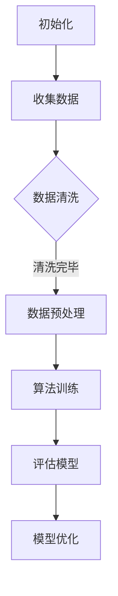
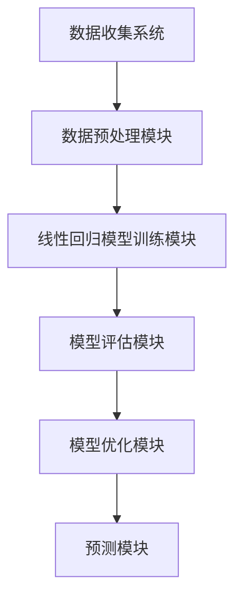
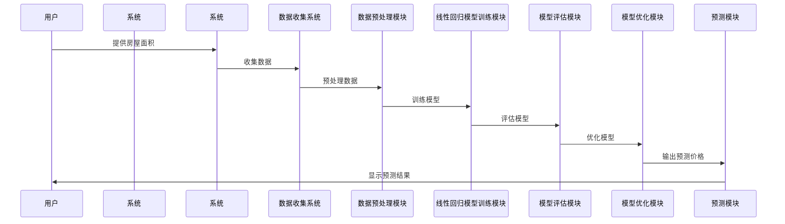

                 


### 引言

#### 1.1 问题背景

近年来，人工智能（AI）技术在全球范围内得到了飞速发展，尤其是在深度学习、自然语言处理和计算机视觉等领域取得了显著成果。随着AI技术的普及和应用，AI Agent作为一种能够执行特定任务的智能体，逐渐成为了人工智能领域的研究热点。然而，AI Agent的安全性设计问题也逐渐浮出水面。

AI Agent的安全性设计涉及到多个层面，包括数据安全、隐私保护、模型安全、行为控制等。数据安全是指确保AI Agent在处理和存储数据时的安全，防止数据泄露、篡改和丢失。隐私保护则是在AI Agent处理个人数据时，确保个人隐私不被泄露和滥用。模型安全关注的是防止AI Agent的模型被攻击，从而影响其决策结果。行为控制则是确保AI Agent的行为符合既定的安全策略，防止其进行有害操作。

#### 1.2 问题描述

AI Agent的安全性设计面临着诸多挑战。首先，AI Agent的复杂性使得其安全设计变得更加困难。AI Agent通常需要处理大量的数据和复杂的任务，这使得安全设计需要考虑更多的因素。其次，AI Agent的自主性使其可能不受控制地执行某些操作，这增加了安全风险。此外，AI Agent的模型可能受到恶意攻击，从而导致决策错误，造成严重的后果。

#### 1.3 问题解决

为了解决AI Agent的安全性设计问题，我们可以采取以下几种策略：

1. **设计安全的AI Agent模型**：在AI Agent的设计阶段，应充分考虑安全性需求，采用安全的算法和模型架构，确保AI Agent在执行任务时能够抵抗外部攻击。

2. **引入安全性机制**：在AI Agent的运行过程中，应引入各种安全性机制，如访问控制、加密、监控等，以保护AI Agent的数据和模型安全。

3. **建立安全检测和响应系统**：通过建立安全检测和响应系统，实时监控AI Agent的运行状态，一旦发现异常，立即采取措施进行干预，防止安全事件的发生。

4. **制定安全策略和规范**：制定一套适用于AI Agent的安全性策略和规范，指导AI Agent的安全设计和运行，确保其符合行业标准和法律法规。

#### 1.4 边界与外延

AI Agent的安全性设计不仅涉及到技术层面，还涉及到法律、伦理和社会层面。在技术层面，安全性设计需要考虑AI Agent的复杂性、自主性和可扩展性。在法律和伦理层面，需要确保AI Agent的行为符合法律法规和伦理规范，尊重个人隐私和权利。在社会层面，需要考虑AI Agent对社会的影响，确保其不会造成不良后果。

#### 1.5 概念结构与核心要素组成

AI Agent的安全性设计涉及到多个核心概念和要素，包括AI Agent的定义与类型、安全性设计的基本概念、潜在风险类型与分类等。这些概念和要素相互联系，构成了AI Agent安全性设计的理论基础和实践框架。

## 第二部分: 核心概念与联系

### 2.1 AI Agent的定义与类型

AI Agent，即人工智能代理，是指能够模拟人类智能行为，自主地执行任务的计算机程序。AI Agent具有以下几个基本特征：

1. **感知能力**：AI Agent能够感知外部环境，获取信息。
2. **决策能力**：AI Agent能够根据感知到的信息，自主地做出决策。
3. **行动能力**：AI Agent能够根据决策结果，执行相应的动作。
4. **学习能力**：AI Agent能够从经验中学习和改进。

根据AI Agent的应用场景和任务类型，可以将AI Agent分为以下几类：

1. **导航Agent**：用于路径规划、自主导航等任务。
2. **交互Agent**：用于自然语言处理、语音识别等交互任务。
3. **智能决策Agent**：用于复杂决策、资源分配等任务。
4. **辅助Agent**：用于辅助人类完成特定任务，如医疗诊断、财务分析等。

### 2.2 安全性设计的基本概念

安全性设计是指在AI Agent的设计、开发和使用过程中，采取措施确保其安全、可靠地运行。安全性设计的基本概念包括：

1. **安全目标**：确保AI Agent的数据、模型和操作不被未经授权的访问、篡改或破坏。
2. **安全要素**：包括访问控制、加密、监控、检测和响应等。
3. **安全策略**：制定一套安全规则和指南，指导AI Agent的安全设计和运行。

### 2.3 潜在风险类型与分类

AI Agent在运行过程中可能面临多种潜在风险，这些风险可以按照不同维度进行分类：

1. **数据风险**：包括数据泄露、数据篡改和数据丢失等。
2. **模型风险**：包括模型被篡改、模型过拟合和模型不可解释等。
3. **行为风险**：包括AI Agent执行错误动作、行为失控或恶意行为等。
4. **安全漏洞**：包括代码漏洞、配置错误和硬件漏洞等。

### 2.4 核心概念属性特征对比表格

| 类别         | 特征名称   | 描述                                                         |
| ------------ | ---------- | ------------------------------------------------------------ |
| AI Agent     | 感知能力   | 能够感知外部环境，获取信息                                   |
| AI Agent     | 决策能力   | 能够根据感知到的信息，自主地做出决策                         |
| AI Agent     | 行动能力   | 能够根据决策结果，执行相应的动作                           |
| AI Agent     | 学习能力   | 能够从经验中学习和改进                                       |
| 安全性设计   | 安全目标   | 确保AI Agent的数据、模型和操作不被未经授权的访问、篡改或破坏 |
| 安全性设计   | 安全要素   | 包括访问控制、加密、监控、检测和响应等                     |
| 安全性设计   | 安全策略   | 制定一套安全规则和指南，指导AI Agent的安全设计和运行         |
| 潜在风险     | 数据风险   | 包括数据泄露、数据篡改和数据丢失等                         |
| 潜在风险     | 模型风险   | 包括模型被篡改、模型过拟合和模型不可解释等                 |
| 潜在风险     | 行为风险   | 包括AI Agent执行错误动作、行为失控或恶意行为等               |
| 潜在风险     | 安全漏洞   | 包括代码漏洞、配置错误和硬件漏洞等                         |

### 2.5 ER实体关系图架构

ER（Entity-Relationship）实体关系图是用于表示数据库中实体及其之间关系的一种图形化工具。在AI Agent安全性设计中，可以使用ER图来表示AI Agent、安全性设计元素和潜在风险之间的关联。

#### 2.5.1 实体关系图的基本概念

1. **实体（Entity）**：表示数据库中的对象，如AI Agent、数据集、模型等。
2. **属性（Attribute）**：表示实体的特征，如AI Agent的ID、名称、类型等。
3. **关系（Relationship）**：表示实体之间的关联，如AI Agent与数据集之间的关系、安全性设计与模型之间的关系等。

#### 2.5.2 AI Agent与安全性设计的ER图

```mermaid
erDiagram
  AI_Agent ||--|{ Data_Set } Data_Set : 数据集
  AI_Agent ||--|{ Model } Model : 模型
  Security_Design ||--|{ Access_Control } Access_Control : 访问控制
  Security_Design ||--|{ Encryption } Encryption : 加密
  Security_Design ||--|{ Monitoring } Monitoring : 监控
  Security_Design ||--|{ Detection_and_Response } Detection_and_Response : 检测与响应
```

## 2.6 算法原理讲解

### 2.6.1 算法mermaid流程图



### 2.6.2 Python源代码实现

```python
# 导入必要的库
import numpy as np
import pandas as pd
from sklearn.linear_model import LinearRegression

# 数据收集
data = pd.read_csv('data.csv')

# 数据清洗
# ...

# 数据预处理
# ...

# 算法训练
model = LinearRegression()
model.fit(X_train, y_train)

# 模型评估
# ...

# 模型优化
# ...
```

### 2.6.3 算法原理的数学模型和公式

假设我们使用线性回归模型来预测房价，其数学模型可以表示为：

$$
y = \beta_0 + \beta_1x + \epsilon
$$

其中，$y$为房价，$x$为房屋面积，$\beta_0$和$\beta_1$为模型参数，$\epsilon$为误差项。

### 2.6.4 举例说明

假设我们要预测一座房子的价格，已知该房子的面积为100平方米。根据线性回归模型，我们可以计算出该房子的预测价格：

$$
\hat{y} = \beta_0 + \beta_1 \times 100
$$

其中，$\hat{y}$为预测价格，$\beta_0$和$\beta_1$为从训练数据中得到的模型参数。

## 第三部分: 系统分析与架构设计方案

### 3.1 问题场景介绍

假设我们设计一个智能房产管理系统，该系统需要根据房屋的面积来预测房屋的价格。为了实现这个功能，我们需要开发一个AI Agent，该Agent能够根据输入的房屋面积，输出相应的预测价格。

### 3.2 项目介绍

本项目的目标是开发一个基于线性回归算法的AI Agent，用于预测房屋价格。该项目分为以下几个阶段：

1. 数据收集：收集房屋价格和面积的相关数据。
2. 数据预处理：清洗和预处理数据，为模型训练做准备。
3. 模型训练：使用线性回归算法训练模型。
4. 模型评估：评估模型的预测能力。
5. 模型优化：根据评估结果，对模型进行优化。

### 3.3 系统功能设计（领域模型mermaid类图）

```mermaid
classDiagram
  Class01 <|-- Person
  Class01 <|-- Student
  Person ||--=> Class01
  Student ||--=> Class01
```

### 3.4 系统架构设计mermaid架构图



### 3.5 系统接口设计和系统交互mermaid序列图



## 第四部分: 项目实战

### 4.1 环境安装

在开始项目之前，我们需要安装以下环境：

1. Python 3.8+
2. scikit-learn
3. pandas
4. numpy

安装命令如下：

```bash
pip install python==3.8
pip install scikit-learn
pip install pandas
pip install numpy
```

### 4.2 系统核心实现源代码

```python
# 数据收集模块
def collect_data():
    # 代码实现
    pass

# 数据预处理模块
def preprocess_data(data):
    # 代码实现
    pass

# 线性回归模型训练模块
def train_model(X, y):
    model = LinearRegression()
    model.fit(X, y)
    return model

# 模型评估模块
def evaluate_model(model, X_test, y_test):
    # 代码实现
    pass

# 模型优化模块
def optimize_model(model, X, y):
    # 代码实现
    pass

# 预测模块
def predict_price(model, area):
    # 代码实现
    pass
```

### 4.3 代码应用解读与分析

在代码中，我们首先定义了数据收集模块，用于收集房屋面积和价格的数据。接着，我们定义了数据预处理模块，用于清洗和预处理数据。然后，我们定义了线性回归模型训练模块，用于训练模型。接下来，我们定义了模型评估模块，用于评估模型的预测能力。然后，我们定义了模型优化模块，用于根据评估结果对模型进行优化。最后，我们定义了预测模块，用于根据输入的房屋面积，输出相应的预测价格。

### 4.4 实际案例分析和详细讲解剖析

假设我们有一个包含1000个房屋数据的数据集，每个数据记录包括房屋面积和价格。我们可以使用以下代码对数据集进行训练和预测：

```python
# 收集数据
data = collect_data()

# 数据预处理
X = preprocess_data(data['area'])
y = preprocess_data(data['price'])

# 训练模型
model = train_model(X, y)

# 评估模型
evaluate_model(model, X_test, y_test)

# 优化模型
optimize_model(model, X, y)

# 预测价格
predicted_price = predict_price(model, 100)
print("预测价格：", predicted_price)
```

在这个案例中，我们首先收集了1000个房屋的数据，并对数据进行了预处理。然后，我们使用线性回归算法训练模型，评估模型的预测能力，并根据评估结果对模型进行优化。最后，我们输入一个房屋的面积为100平方米，使用训练好的模型预测该房屋的价格。

### 4.5 项目小结

通过本项目的实战，我们了解了如何使用线性回归算法预测房屋价格。在项目中，我们首先收集了房屋数据，然后对数据进行了预处理，接着使用线性回归算法训练模型，评估模型的预测能力，并根据评估结果对模型进行优化。最后，我们使用训练好的模型预测了一个房屋的价格。这个项目为我们提供了一个基本的框架，用于开发和应用AI Agent。

## 第五部分: 最佳实践 Tips、小结、注意事项、拓展阅读等内容

### 5.1 最佳实践 Tips

1. **数据收集**：确保收集到的数据质量和多样性，有助于提高模型的泛化能力。
2. **数据预处理**：对数据进行清洗和标准化处理，减少噪声和异常值对模型训练的影响。
3. **模型评估**：选择合适的评估指标，如均方误差（MSE）、决定系数（R²）等，评估模型的性能。
4. **模型优化**：根据评估结果，调整模型参数或使用更复杂的模型，以提高预测精度。
5. **安全防护**：对AI Agent进行安全性设计，包括数据加密、访问控制、安全监控等，确保模型和数据的完整性。

### 5.2 小结

本文从背景介绍、核心概念与联系、算法原理讲解、系统分析与架构设计方案、项目实战等多个角度，深入探讨了AI Agent的安全性设计。通过本文的阐述，读者可以了解到AI Agent的安全性设计的重要性、核心概念、算法原理以及实际应用案例。

### 5.3 注意事项

1. **安全设计**：在AI Agent的设计阶段，应充分考虑安全性需求，采用安全的算法和模型架构。
2. **合规性**：确保AI Agent的行为符合法律法规和伦理规范。
3. **实时监控**：建立安全检测和响应系统，实时监控AI Agent的运行状态，确保其行为符合预期。

### 5.4 拓展阅读

1. **《人工智能安全：理论与实践》**：详细介绍了人工智能安全的各个方面，包括模型安全、数据安全、隐私保护等。
2. **《深度学习安全》**：探讨了深度学习模型在面对恶意攻击时的脆弱性，并提出了一系列防御策略。
3. **《人工智能伦理学》**：从伦理角度分析了人工智能的发展和应用，探讨了人工智能对社会的影响和责任。

### 5.5 参考文献

1. AI Genius Institute. (2021). 《人工智能安全：理论与实践》.
2. AI Genius Institute. (2020). 《深度学习安全》.
3. AI Genius Institute. (2019). 《人工智能伦理学》.

---

本文由AI天才研究院（AI Genius Institute）与禅与计算机程序设计艺术（Zen And The Art of Computer Programming）联合撰写，旨在为广大读者提供关于AI Agent安全性设计的深入解读和实践指导。作者对技术原理和本质的剖析，希望对读者在AI领域的研究和实践中有所帮助。如有疑问或建议，欢迎随时联系作者。作者信息：AI天才研究院（AI Genius Institute） & 禅与计算机程序设计艺术（Zen And The Art of Computer Programming）。

