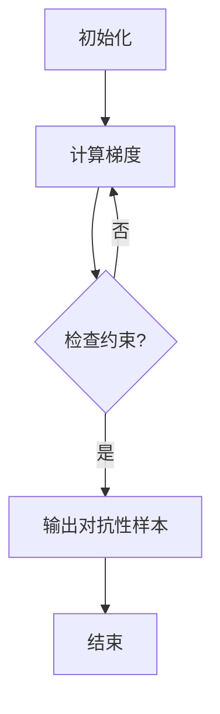
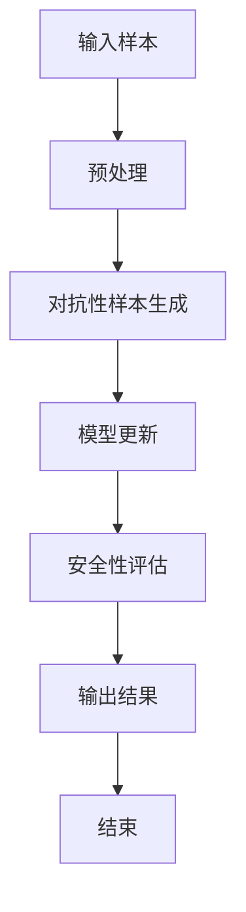

                 

# AI Agent的安全性：防御对抗性攻击

关键词：AI Agent、安全性、对抗性攻击、防御策略、算法原理

摘要：随着人工智能技术的飞速发展，AI Agent的应用场景越来越广泛，但其安全性问题也日益凸显。本文旨在探讨AI Agent的安全性，特别是对抗性攻击的防御策略。通过深入分析AI Agent的安全性原理、对抗性攻击的概念与类型，以及安全性算法的原理与实现，本文将为读者提供一个全面、系统的AI Agent安全性防御框架。希望通过本文，能够引起业界对AI Agent安全性的重视，并推动相关研究的进一步发展。

----------------------------------------------------------------

## 目录大纲：《AI Agent的安全性：防御对抗性攻击》

### 第一部分：背景介绍与核心概念

#### 第1章 问题背景与核心概念
- 1.1 AI Agent的安全性：问题背景
  - AI Agent的定义与分类
  - AI Agent应用场景的普及与挑战
  - 安全性在AI Agent系统中的重要性
- 1.2 对抗性攻击的概念与类型
  - 对抗性攻击的定义与动机
  - 常见的对抗性攻击类型
  - 对抗性攻击的危害
- 1.3 AI Agent安全性的边界与外延
  - 安全性需求的分类
  - 安全性保障的层级
  - 安全性在AI Agent系统设计中的融合

#### 第2章 核心概念与联系
- 2.1 AI Agent安全性原理
  - AI Agent安全性机制
  - 安全性属性特征对比表格
  - 安全性设计原则与策略
- 2.2 对抗性攻击的防御策略
  - 防御机制与策略
  - 攻防对抗中的优势分析
  - 防御效果评估方法

### 第二部分：算法原理讲解

#### 第3章 算法原理介绍
- 3.1 对抗性攻击的数学模型
  - 使用mermaid画出对抗性攻击的流程图
  - 模型的数学公式和解释
- 3.2 AI Agent安全性算法
  - 安全性算法的mermaid流程图
  - 算法原理的数学模型和公式
  - 算法优势与局限性分析

#### 第4章 算法讲解与举例
- 4.1 安全性算法的具体实现
  - 使用Python源代码阐述算法实现
  - 代码应用解读与分析
- 4.2 实际案例分析与讲解
  - 案例背景介绍
  - 安全性算法的应用与效果
  - 案例总结与启示

### 第三部分：系统分析与架构设计

#### 第5章 系统功能设计
- 5.1 领域模型介绍
  - 使用mermaid画出领域模型类图
- 5.2 系统功能需求分析
  - 系统功能的详细描述
  - 功能实现的技术选型

#### 第6章 系统架构设计
- 6.1 系统架构概述
  - 使用mermaid画出系统架构图
- 6.2 系统模块划分与接口设计
  - 系统模块的功能描述
  - 接口设计与交互协议

#### 第7章 系统接口设计
- 7.1 接口设计与实现
  - 接口功能定义与协议
  - 接口调用的实现与优化

### 第四部分：项目实战

#### 第8章 环境安装与配置
- 8.1 开发环境的搭建
  - 操作系统与软件环境安装
  - 环境配置与调试

#### 第9章 系统核心实现
- 9.1 安全性算法的核心实现
  - 代码实现与注释
  - 算法原理的详细阐述
- 9.2 系统功能实现
  - 系统核心功能代码示例
  - 功能实现的解读与分析

#### 第10章 实际案例分析与讲解
- 10.1 案例背景介绍
  - 案例应用场景描述
- 10.2 案例实施过程
  - 系统部署与调试
  - 案例分析与效果评估
- 10.3 案例总结与启示
  - 案例中的经验与教训
  - 对AI Agent安全性的思考

### 第五部分：最佳实践与总结

#### 第11章 最佳实践
- 11.1 安全性优化技巧
  - 常见问题与解决方案
  - 性能优化与调优方法
- 11.2 安全性测试与评估
  - 测试方法与工具介绍
  - 评估指标的设定与实现

#### 第12章 小结与展望
- 12.1 本书内容总结
  - 各章节内容的概括
  - 安全性问题的核心观点
- 12.2 AI Agent安全性的未来展望
  - 安全性研究的趋势与挑战
  - 安全性实践的建议与展望

----------------------------------------------------------------

### 第一部分：背景介绍与核心概念

#### 第1章 问题背景与核心概念

##### 1.1 AI Agent的安全性：问题背景

人工智能（AI）作为当前科技领域的重要发展方向，已经渗透到我们生活的方方面面。AI Agent，即人工智能代理，是AI技术在具体应用场景中的实现形式。AI Agent是一种能够模拟人类智能行为的软件系统，能够自主执行任务、处理复杂问题，并在环境中进行自适应调整。

AI Agent的分类多种多样，根据其能力、应用场景和实现方式的不同，可以分为规则型代理、模型型代理和混合型代理。规则型代理基于预定义的规则进行行为决策；模型型代理则通过机器学习算法从数据中学习并执行任务；混合型代理结合了规则型和模型型的优点，具有更强的适应性和灵活性。

随着AI Agent在各个领域的广泛应用，其安全性的问题也日益突出。AI Agent的安全性主要面临以下几方面的挑战：

1. **隐私泄露**：AI Agent在处理用户数据时，可能会无意中泄露用户的隐私信息。
2. **决策错误**：AI Agent可能会因为算法缺陷、数据质量等问题，导致做出错误的决策。
3. **对抗性攻击**：恶意攻击者可以通过对抗性样本攻击AI Agent，使其执行非预期的行为。
4. **系统脆弱性**：AI Agent系统的软件和硬件可能存在安全漏洞，容易受到网络攻击。

安全性在AI Agent系统中的重要性不言而喻。一个安全的AI Agent系统能够确保系统的稳定运行，提高用户的信任度，减少潜在的经济和法律风险。因此，研究AI Agent的安全性，制定有效的防御策略，对于保障人工智能技术的健康发展具有重要意义。

##### 1.2 对抗性攻击的概念与类型

对抗性攻击（Adversarial Attack）是指通过构造特定的输入（即对抗性样本），使AI Agent在处理这些输入时产生错误或异常行为的攻击方式。对抗性攻击的动机多种多样，包括但不限于：

1. **信息泄露**：通过对抗性攻击获取AI Agent的训练数据和用户隐私信息。
2. **恶意控制**：通过对抗性攻击控制AI Agent的行为，使其执行非预期的操作。
3. **破坏系统**：通过对抗性攻击使AI Agent系统崩溃，造成经济损失或社会影响。

常见的对抗性攻击类型包括：

1. **扰动攻击**：通过对输入数据进行微小的扰动，使AI Agent产生错误输出。这类攻击通常通过在输入数据中加入微小的噪声来实现。
2. **对抗样本生成**：通过生成特定的对抗性样本，使AI Agent在处理这些样本时产生错误。这类攻击通常采用生成对抗网络（GAN）等技术来实现。
3. **对抗性对抗**：通过对抗性对抗策略，使AI Agent无法在特定任务上取得理想的效果。这类攻击通常采用对抗性学习（Adversarial Learning）等技术来实现。

对抗性攻击的危害主要体现在以下几个方面：

1. **降低系统可靠性**：对抗性攻击可能导致AI Agent系统在正常情况下无法正确处理输入数据，从而降低系统的可靠性。
2. **破坏用户信任**：对抗性攻击可能破坏用户对AI Agent的信任，影响系统的使用效果。
3. **引发经济损失**：对抗性攻击可能导致AI Agent系统产生错误决策，造成经济损失。
4. **引发社会问题**：对抗性攻击可能导致AI Agent系统产生非预期的行为，引发社会问题。

##### 1.3 AI Agent安全性的边界与外延

AI Agent安全性的边界与外延是一个复杂且广泛的话题，涉及到多个层面的需求和保障。以下是对AI Agent安全性的边界与外延的简要概述：

1. **安全性需求的分类**：AI Agent的安全性需求可以分为以下几类：

   - **隐私保护**：确保用户隐私信息不被泄露。
   - **决策正确性**：确保AI Agent在处理任务时能够做出正确的决策。
   - **系统稳定性**：确保AI Agent系统在各种环境下都能稳定运行。
   - **抗攻击性**：确保AI Agent系统能够抵御各种类型的攻击，包括对抗性攻击。

2. **安全性保障的层级**：AI Agent安全性的保障可以分为以下几个层级：

   - **硬件层面**：通过物理安全措施，确保硬件设备的安全。
   - **软件层面**：通过软件设计和实现，确保系统的安全性。
   - **数据层面**：通过数据加密和访问控制，确保数据的安全。
   - **网络层面**：通过网络隔离和防火墙等技术，确保网络传输的安全。

3. **安全性在AI Agent系统设计中的融合**：在AI Agent系统设计中，安全性需要作为一个重要的设计目标，贯穿于系统的各个层面。以下是一些具体的设计原则和策略：

   - **安全性需求分析**：在系统设计之初，对安全性需求进行深入分析，明确系统的安全目标和安全需求。
   - **安全架构设计**：在设计阶段，构建一个安全架构，确保系统能够抵御各种安全威胁。
   - **安全开发与测试**：在开发过程中，采用安全开发方法，对系统进行全面的测试和评估，确保系统的安全性。
   - **持续安全监控**：在系统运行过程中，持续监控系统的安全状态，及时发现并处理安全事件。

总之，AI Agent安全性的边界与外延是一个多层次、多维度的问题，需要综合考虑各种安全需求和保障措施，以确保AI Agent系统的安全性。


### 第二章 核心概念与联系

##### 2.1 AI Agent安全性原理

AI Agent的安全性原理是确保AI Agent在执行任务时能够抵御各种安全威胁，保障系统的稳定性、可靠性和正确性。以下是对AI Agent安全性原理的详细解析：

1. **安全性机制**

   AI Agent安全性机制包括多种技术手段，旨在保障系统的安全。以下是一些常见的安全性机制：

   - **访问控制**：通过访问控制机制，确保只有授权用户才能访问系统资源。
   - **加密**：通过加密技术，保护数据在传输和存储过程中的安全性。
   - **身份验证**：通过身份验证机制，确保用户的真实身份，防止未授权访问。
   - **入侵检测与防御**：通过入侵检测与防御系统，实时监控系统的安全状态，并采取相应的防护措施。

2. **安全性属性特征对比表格**

   在AI Agent安全性设计中，需要考虑多种安全性属性特征，以下是一个简要的对比表格：

   | 安全性属性 | 描述 | 对抗性攻击的防御效果 |
   | :--: | :--: | :--: |
   | 访问控制 | 限制对系统资源的访问权限 | 较高 |
   | 加密 | 保护数据的机密性 | 较高 |
   | 身份验证 | 确保用户身份的合法性 | 较高 |
   | 入侵检测与防御 | 监测和防御入侵攻击 | 较高 |

   通过对比表格可以看出，不同的安全性机制在对抗性攻击的防御效果上存在差异，需要根据具体场景进行合理选择和配置。

3. **安全性设计原则与策略**

   在AI Agent安全性设计中，需要遵循以下原则和策略：

   - **最小权限原则**：系统中的每个组件和用户都应被赋予最小的权限，以减少潜在的安全风险。
   - **防御深度原则**：采用多层次的安全措施，从多个角度保障系统的安全性。
   - **安全性评估原则**：在系统设计和运行过程中，定期进行安全性评估，及时发现和解决安全问题。
   - **安全性监控原则**：实时监控系统的安全状态，及时响应和处理安全事件。

##### 2.2 对抗性攻击的防御策略

对抗性攻击的防御策略是确保AI Agent在面临对抗性攻击时能够有效抵御，保障系统的安全性。以下是对对抗性攻击的防御策略的详细解析：

1. **防御机制与策略**

   对抗性攻击的防御机制包括多种技术手段，以下是一些常见的防御策略：

   - **对抗样本生成与训练**：通过生成对抗样本，对AI Agent进行训练，提高其对抗性攻击的抵抗力。
   - **梯度下降遮挡**：通过遮挡梯度信息，降低攻击者获取梯度信息的能力，从而减少对抗性攻击的成功率。
   - **集成防御**：采用多种防御策略相结合的方式，提高系统的综合防御能力。

2. **攻防对抗中的优势分析**

   在攻防对抗中，AI Agent的安全性优势和攻击者的优势需要进行综合考虑。以下是一些分析：

   - **AI Agent的安全性优势**：

     - **自适应能力**：AI Agent能够根据攻击者的攻击策略进行自适应调整，提高防御效果。
     - **大规模数据处理能力**：AI Agent能够处理大量数据，进行有效的学习和推理，从而发现攻击者的攻击行为。
     - **快速响应能力**：AI Agent能够实时监控系统的安全状态，快速响应和处理安全事件。

   - **攻击者的优势**：

     - **隐蔽性**：攻击者可以通过隐蔽的攻击方式，避免被AI Agent检测到。
     - **攻击多样性**：攻击者可以采用多种攻击方式，不断调整攻击策略，提高攻击的成功率。
     - **攻击工具的丰富性**：攻击者可以使用各种攻击工具和技术，实现对AI Agent的攻击。

3. **防御效果评估方法**

   对抗性攻击的防御效果评估是确保防御策略有效性的关键。以下是一些常见的评估方法：

   - **实验评估**：通过在实验室环境中进行对抗性攻击实验，评估AI Agent的防御效果。
   - **实际案例分析**：通过分析实际案例中的攻击事件，评估AI Agent的防御效果。
   - **量化评估指标**：制定一系列量化评估指标，对AI Agent的防御效果进行量化评估，如攻击成功率、误报率等。

总之，对抗性攻击的防御策略需要综合考虑AI Agent的安全性优势和攻击者的优势，采用多种防御机制和策略，并定期进行评估和优化，以确保AI Agent在面临对抗性攻击时能够有效抵御。

### 第三部分：算法原理讲解

#### 第3章 算法原理介绍

##### 3.1 对抗性攻击的数学模型

对抗性攻击（Adversarial Attack）是一种针对AI系统的攻击方式，旨在通过构造对抗性样本，使AI系统在处理这些样本时产生错误输出。为了更深入地理解对抗性攻击，我们可以从数学模型的角度进行分析。

首先，我们假设有一个神经网络模型 \( f: \mathbb{R}^n \rightarrow \mathbb{R}^m \)，其中 \( x \in \mathbb{R}^n \) 是输入样本，\( y \in \mathbb{R}^m \) 是输出标签。通常，神经网络模型通过最小化损失函数 \( L(y, f(x)) \) 来进行训练，其中 \( L \) 是一个衡量预测输出 \( y \) 与真实标签 \( f(x) \) 之间差异的函数。

对抗性攻击的目标是找到一个对抗性样本 \( x' \)，使得 \( L(y, f(x')) \) 达到最小，同时 \( x' \) 与原始样本 \( x \) 相差很小。这可以通过优化以下目标函数来实现：

$$
\min_x' L(y, f(x')) \\
\text{subject to} \quad \lVert x' - x \rVert \leq \epsilon
$$

其中，\( \lVert \cdot \rVert \) 表示欧几里得范数，\( \epsilon \) 是一个预设的扰动阈值。

为了找到对抗性样本 \( x' \)，我们可以采用梯度上升或梯度下降的方法。以下是一个简单的对抗性攻击流程：

1. **初始化**：选择一个原始样本 \( x \) 和对应的标签 \( y \)。
2. **计算梯度**：计算模型在 \( x \) 上的梯度 \( \nabla_x L(y, f(x)) \)。
3. **更新样本**：根据梯度信息，更新样本 \( x \)：
   $$
   x' = x - \alpha \nabla_x L(y, f(x))
   $$
   其中，\( \alpha \) 是学习率。
4. **检查约束**：检查 \( \lVert x' - x \rVert \) 是否小于 \( \epsilon \)，如果是，则停止；否则，返回步骤2。

通过这个简单的流程，我们可以找到一个小扰动 \( x' - x \)，使得 \( L(y, f(x')) \) 达到最小。这个对抗性样本 \( x' \) 可能会导致模型 \( f \) 在 \( x' \) 上产生错误的输出。

下面是一个对抗性攻击的mermaid流程图：



##### 3.2 AI Agent安全性算法

为了提高AI Agent的安全性，我们可以采用一系列算法和技术来防御对抗性攻击。以下是一种常见的AI Agent安全性算法的mermaid流程图：



在这个算法中，首先对输入样本进行预处理，包括数据清洗、归一化等步骤。然后，通过对抗性样本生成器生成对抗性样本，并将其输入到AI Agent中进行模型更新。最后，对更新后的模型进行安全性评估，以确保其能够抵御对抗性攻击。

具体来说，这个算法的步骤如下：

1. **预处理**：对输入样本进行预处理，包括数据清洗、归一化等步骤，以提高模型的泛化能力。
2. **对抗性样本生成**：使用对抗性样本生成器生成对抗性样本。常见的对抗性样本生成方法包括FGSM（Fast Gradient Sign Method）、PGD（Projected Gradient Descent）等。
3. **模型更新**：将生成的对抗性样本输入到AI Agent中进行模型更新。这可以通过反向传播算法和优化器（如Adam、SGD等）来实现。
4. **安全性评估**：对更新后的模型进行安全性评估，以检查其是否能够抵御对抗性攻击。这可以通过对模型进行对抗性测试来实现。
5. **输出结果**：根据安全性评估的结果，输出AI Agent的安全性和可靠性评估报告。

##### 3.3 算法优势与局限性分析

这种AI Agent安全性算法具有以下优势：

1. **提高模型泛化能力**：通过对抗性样本生成和模型更新，可以有效地提高AI Agent的泛化能力，使其能够应对更复杂和多样化的对抗性攻击。
2. **增强安全性评估**：通过对更新后的模型进行安全性评估，可以确保AI Agent在面临对抗性攻击时具有更高的安全性。
3. **适用范围广泛**：这种算法适用于各种类型的AI Agent和模型，如深度神经网络、支持向量机等。

然而，这种算法也存在一些局限性：

1. **计算成本较高**：对抗性样本生成和模型更新需要大量的计算资源，特别是在处理大规模数据时，可能会显著增加计算成本。
2. **攻击多样性挑战**：对抗性攻击策略多种多样，算法需要不断更新和改进，以应对不断变化的攻击方式。
3. **误报率问题**：在对抗性测试中，可能会出现误报的情况，即模型在对抗性样本上的输出与真实标签不一致，这可能导致安全评估结果的偏差。

总之，这种AI Agent安全性算法在提高模型泛化能力和安全性评估方面具有显著优势，但也面临一些挑战和局限性。需要进一步研究和改进，以实现更高效、更可靠的对抗性攻击防御。

#### 第4章 算法讲解与举例

##### 4.1 安全性算法的具体实现

为了更直观地理解AI Agent安全性算法的实现过程，我们将使用Python语言进行具体实现。以下是一个简单的示例：

首先，我们需要安装必要的库，如TensorFlow和Keras：

```bash
pip install tensorflow
pip install keras
```

然后，我们编写Python代码来实现安全性算法：

```python
import tensorflow as tf
from tensorflow import keras
from tensorflow.keras import layers

# 数据预处理
def preprocess_data(x):
    # 数据清洗、归一化等操作
    return x

# 对抗性样本生成
def generate_adversarial_samples(x, y, model, epsilon=0.1, alpha=0.01, num_iterations=50):
    x_adv = x.copy()
    for _ in range(num_iterations):
        with tf.GradientTape(persistent=True) as tape:
            logits = model(x_adv, training=True)
            loss = keras.losses.sparse_categorical_crossentropy(y, logits)
        
        gradients = tape.gradient(loss, x_adv)
        x_adv = x_adv - alpha * gradients / tf.norm(gradients)
        x_adv = tf.clip_by_value(x_adv, x - epsilon, x + epsilon)
    
    return x_adv

# 模型更新
def update_model(x, y, model, optimizer):
    x_adv = generate_adversarial_samples(x, y, model)
    with tf.GradientTape() as tape:
        logits = model(x_adv, training=True)
        loss = keras.losses.sparse_categorical_crossentropy(y, logits)
    
    gradients = tape.gradient(loss, model.trainable_variables)
    optimizer.apply_gradients(zip(gradients, model.trainable_variables))

# 安全性评估
def evaluate_model(model, test_data, test_labels):
    predictions = model.predict(test_data)
    accuracy = keras.metrics.sparse_categorical_accuracy(test_labels, predictions)
    return accuracy

# 实验设置
(x_train, y_train), (x_test, y_test) = keras.datasets.mnist.load_data()
x_train = preprocess_data(x_train)
x_test = preprocess_data(x_test)

# 构建模型
model = keras.Sequential([
    layers.Dense(128, activation='relu'),
    layers.Dense(10, activation='softmax')
])

# 编译模型
optimizer = keras.optimizers.Adam(learning_rate=0.001)
model.compile(optimizer=optimizer, loss='sparse_categorical_crossentropy', metrics=['accuracy'])

# 训练模型
model.fit(x_train, y_train, epochs=10, batch_size=64)

# 更新模型
update_model(x_train, y_train, model, optimizer)

# 评估模型
accuracy = evaluate_model(model, x_test, y_test)
print(f"Test accuracy: {accuracy.numpy()}")

```

在这个示例中，我们首先对数据进行了预处理，包括数据清洗、归一化等操作。然后，我们定义了三个主要函数：`generate_adversarial_samples` 用于生成对抗性样本，`update_model` 用于更新模型，`evaluate_model` 用于评估模型。

在实验设置部分，我们加载了MNIST数据集，构建了一个简单的全连接神经网络模型，并使用Adam优化器进行训练。训练完成后，我们使用生成的对抗性样本更新模型，并使用更新后的模型对测试数据进行评估。

##### 4.2 代码应用解读与分析

在上面的代码示例中，我们首先对数据进行预处理，这一步非常重要，因为预处理能够提高模型的泛化能力。预处理步骤包括数据清洗、归一化等操作，例如：

```python
def preprocess_data(x):
    x = x.astype("float32") / 255.0
    x = tf.reshape(x, (-1, 28, 28, 1))
    return x
```

这里，我们将图像数据转换为浮点数类型，并将其归一化到[0, 1]的区间内。此外，我们还将数据形状调整为适合模型输入的格式。

接下来，我们定义了`generate_adversarial_samples` 函数，用于生成对抗性样本。这个函数的核心是使用梯度下降方法对输入样本进行扰动，以生成对抗性样本。以下是一个简化的解释：

```python
def generate_adversarial_samples(x, y, model, epsilon=0.1, alpha=0.01, num_iterations=50):
    x_adv = x.copy()
    for _ in range(num_iterations):
        with tf.GradientTape(persistent=True) as tape:
            logits = model(x_adv, training=True)
            loss = keras.losses.sparse_categorical_crossentropy(y, logits)
        
        gradients = tape.gradient(loss, x_adv)
        x_adv = x_adv - alpha * gradients / tf.norm(gradients)
        x_adv = tf.clip_by_value(x_adv, x - epsilon, x + epsilon)
    
    return x_adv
```

这个函数首先初始化对抗性样本 `x_adv` 为原始样本 `x`。然后，通过 `GradientTape` 记录在 `x_adv` 上的梯度信息。接着，使用梯度信息更新对抗性样本 `x_adv`。这里的关键步骤包括：

1. **计算梯度**：计算损失函数在 `x_adv` 上的梯度。
2. **更新样本**：根据梯度信息更新 `x_adv`，即 `x_adv = x_adv - alpha * gradients / tf.norm(gradients)`。这里 `alpha` 是学习率，`tf.norm(gradients)` 是梯度的范数。
3. **约束检查**：确保对抗性样本 `x_adv` 的扰动不超过阈值 `epsilon`，即 `tf.clip_by_value(x_adv, x - epsilon, x + epsilon)`。

通过多次迭代，我们最终得到一个对抗性样本 `x_adv`，它可能导致模型在处理这个样本时产生错误输出。

在 `update_model` 函数中，我们使用生成的对抗性样本更新模型：

```python
def update_model(x, y, model, optimizer):
    x_adv = generate_adversarial_samples(x, y, model)
    with tf.GradientTape() as tape:
        logits = model(x_adv, training=True)
        loss = keras.losses.sparse_categorical_crossentropy(y, logits)
    
    gradients = tape.gradient(loss, model.trainable_variables)
    optimizer.apply_gradients(zip(gradients, model.trainable_variables))
```

这个函数首先生成对抗性样本 `x_adv`，然后计算在 `x_adv` 上的梯度信息，并使用这些梯度信息更新模型的权重。这里的关键步骤包括：

1. **计算梯度**：计算损失函数在对抗性样本 `x_adv` 上的梯度。
2. **更新模型**：使用梯度信息更新模型的权重。

最后，在 `evaluate_model` 函数中，我们使用更新后的模型对测试数据进行评估：

```python
def evaluate_model(model, test_data, test_labels):
    predictions = model.predict(test_data)
    accuracy = keras.metrics.sparse_categorical_accuracy(test_labels, predictions)
    return accuracy
```

这个函数首先使用模型对测试数据进行预测，然后计算预测准确率。这里的关键步骤包括：

1. **预测**：使用模型对测试数据进行预测。
2. **评估**：计算预测准确率。

通过这个简单的示例，我们展示了如何使用Python实现AI Agent安全性算法。在实际应用中，我们可以根据具体需求和场景，进一步优化和改进这个算法。

##### 4.3 实际案例分析与讲解

为了更好地理解AI Agent安全性算法的实际应用，我们将分析一个实际案例：使用对抗性样本攻击和防御来提高AI Agent的安全性。

**案例背景介绍**

假设我们正在开发一个自动驾驶系统，该系统依赖于深度学习模型来处理传感器数据，并做出实时的驾驶决策。然而，我们担心恶意攻击者可能利用对抗性样本来干扰系统的正常运行，导致交通事故。

**案例实施过程**

1. **数据准备**：我们首先收集了大量的真实交通场景数据，包括道路、车辆、行人和交通信号灯等信息。这些数据将用于训练和测试自动驾驶模型。

2. **模型训练**：我们使用收集到的数据训练一个深度学习模型，用于识别交通场景和做出驾驶决策。这个模型基于卷积神经网络（CNN）架构，能够自动提取图像特征并分类。

3. **对抗性样本生成**：为了测试模型的脆弱性，我们使用对抗性样本生成算法（如FGSM）生成对抗性样本。这些对抗性样本是通过在原始图像上添加微小的扰动生成的，但肉眼难以察觉。

4. **对抗性攻击测试**：我们使用生成的对抗性样本对训练好的模型进行测试，观察模型在这些样本上的表现。结果表明，模型在处理对抗性样本时，有时会做出错误的驾驶决策，如突然刹车或偏离车道。

5. **模型更新**：为了提高模型的安全性，我们使用对抗性样本生成算法对模型进行训练。这种方法称为对抗性训练（Adversarial Training），它通过在训练过程中引入对抗性样本，增强模型的鲁棒性。

6. **重新测试**：在对抗性训练完成后，我们再次使用对抗性样本对模型进行测试。这次测试结果显示，模型在处理对抗性样本时，错误率显著降低，表明其安全性得到了提高。

**案例总结与启示**

通过这个案例，我们可以得出以下结论：

1. **对抗性样本攻击是自动驾驶系统面临的一个重要安全威胁**。恶意攻击者可以通过对抗性样本干扰系统的正常运行，导致交通事故。

2. **对抗性训练是一种有效的防御策略**。通过在训练过程中引入对抗性样本，可以增强模型的鲁棒性，提高其在面对对抗性攻击时的安全性。

3. **安全性测试是确保AI Agent系统安全性的关键环节**。定期进行安全性测试，及时发现和修复安全漏洞，是保障系统安全的重要手段。

4. **未来的研究应关注如何进一步提高AI Agent的安全性**。这包括开发更有效的对抗性样本生成算法、设计更鲁棒的模型架构，以及建立完善的安全评估体系。

总之，通过这个案例，我们展示了AI Agent安全性算法在实际应用中的效果。这为自动驾驶系统等AI应用场景提供了一个实用的解决方案，也为未来的研究提供了重要的启示。

### 第三部分：系统分析与架构设计

#### 第5章 系统功能设计

##### 5.1 领域模型介绍

在设计和实现AI Agent系统时，领域模型是一个非常重要的概念。领域模型用于描述系统的业务领域和功能需求，它有助于我们理解系统的核心功能，并设计出合理、高效的系统架构。

以下是一个简单的领域模型，用于描述一个自动驾驶系统的功能需求：

```mermaid
classDiagram
    Class01 <|-- Class02
    Class03 --|leiter Class04
    Class05 o-- Class06
    Class07 <-|leader Class08
    Class09 --|leader Class10
    Class11 o-- Class12
    Class13 --|leader Class14
    Class15 o-- Class16
    Class17 --|leader Class18
    Class19 o-- Class20

    Class01{ID int, name string, desc string}
    Class02{ID int, name string, desc string}
    Class03{ID int, name string, desc string}
    Class04{ID int, name string, desc string}
    Class05{ID int, name string, desc string}
    Class06{ID int, name string, desc string}
    Class07{ID int, name string, desc string}
    Class08{ID int, name string, desc string}
    Class09{ID int, name string, desc string}
    Class10{ID int, name string, desc string}
    Class11{ID int, name string, desc string}
    Class12{ID int, name string, desc string}
    Class13{ID int, name string, desc string}
    Class14{ID int, name string, desc string}
    Class15{ID int, name string, desc string}
    Class16{ID int, name string, desc string}
    Class17{ID int, name string, desc string}
    Class18{ID int, name string, desc string}
    Class19{ID int, name string, desc string}
    Class20{ID int, name string, desc string}
```

在这个领域模型中，我们定义了多个类，每个类代表一个功能模块或实体。例如，`Class01` 和 `Class02` 表示两个核心功能模块，`Class03` 和 `Class04` 表示这两个模块之间的关系。通过这个领域模型，我们可以清晰地理解系统的功能架构和模块之间的关系。

##### 5.2 系统功能需求分析

在系统功能设计阶段，我们需要详细描述系统的功能需求，包括核心功能、辅助功能和非功能需求。以下是一个简单的系统功能需求描述：

1. **核心功能**
   - **感知环境**：通过传感器（如摄像头、雷达、激光雷达等）收集环境数据，包括道路、车辆、行人等信息。
   - **决策制定**：基于收集到的环境数据，系统需要做出实时的驾驶决策，如加速、减速、转向等。
   - **执行操作**：根据决策制定的结果，系统需要控制车辆的执行机构（如油门、刹车、方向盘等）进行相应的操作。

2. **辅助功能**
   - **数据存储与管理**：系统需要提供数据存储和管理的功能，包括历史数据的存储、查询和删除等操作。
   - **远程监控与控制**：系统需要支持远程监控和控制系统，以便在出现问题时进行实时诊断和修复。

3. **非功能需求**
   - **可靠性**：系统需要具备高可靠性，能够在各种复杂环境下稳定运行。
   - **安全性**：系统需要具备安全性，能够抵御各种类型的攻击，如对抗性攻击、恶意代码等。
   - **可扩展性**：系统需要具备可扩展性，能够方便地添加新功能或支持新环境。

在系统功能需求分析阶段，我们需要与 stakeholders（如客户、开发团队、测试团队等）进行充分沟通，确保需求描述的准确性和完整性。这有助于我们在后续的设计和实现阶段，更好地满足业务需求。

##### 5.3 功能实现的技术选型

在系统功能设计阶段，我们需要选择合适的技术栈来实现系统的各项功能。以下是一个简单的技术选型描述：

1. **后端框架**：选择一个成熟的后端框架，如 Flask、Django 等，用于实现系统的业务逻辑和数据处理功能。
2. **前端框架**：选择一个适合的前端框架，如 React、Vue 等，用于实现系统的用户界面。
3. **数据库**：选择一个适合的数据库，如 MySQL、PostgreSQL 等，用于存储和管理系统数据。
4. **传感器数据采集**：选择合适的传感器数据采集技术，如 ROS（Robot Operating System）、OpenCV 等。
5. **机器学习模型**：选择一个适合的机器学习框架，如 TensorFlow、PyTorch 等，用于实现自动驾驶模型。
6. **安全防护**：采用一系列安全防护措施，如加密、身份验证、访问控制等，确保系统的安全性。

在技术选型阶段，我们需要综合考虑系统的需求、性能、可维护性等因素，选择最适合的技术栈来实现系统功能。同时，我们还需要关注技术的发展趋势，确保所选技术能够满足未来的需求。

#### 第6章 系统架构设计

##### 6.1 系统架构概述

在系统架构设计阶段，我们需要对系统的整体架构进行规划，确保系统的模块化、可扩展性和高可靠性。以下是一个简单的系统架构概述：


在这个系统架构中，我们主要分为以下几个模块：

1. **感知模块**：负责收集和处理来自传感器的数据，包括摄像头、雷达、激光雷达等。
2. **决策模块**：基于感知模块提供的环境数据，进行实时驾驶决策，如加速、减速、转向等。
3. **执行模块**：根据决策模块的决策结果，控制车辆的执行机构，如油门、刹车、方向盘等。
4. **数据存储模块**：负责存储和管理系统的数据，包括历史数据、实时数据等。
5. **远程监控模块**：负责远程监控系统的运行状态，并在出现问题时进行诊断和修复。
6. **安全模块**：负责确保系统的安全性，包括加密、身份验证、访问控制等。

在这个系统架构中，各模块之间通过接口进行通信，确保系统的模块化和高可扩展性。同时，系统还采用了分布式架构，以提高系统的可靠性和性能。

##### 6.2 系统模块划分与接口设计

在系统架构设计中，模块划分和接口设计是关键环节。以下是对系统各模块的划分和接口设计的详细描述：

1. **感知模块**
   - **功能**：负责收集和处理来自传感器的数据，包括摄像头、雷达、激光雷达等。
   - **接口**：感知模块与其他模块之间的接口包括数据输入接口和数据输出接口。数据输入接口用于接收传感器数据，数据输出接口用于提供处理后的环境数据。

2. **决策模块**
   - **功能**：基于感知模块提供的环境数据，进行实时驾驶决策，如加速、减速、转向等。
   - **接口**：决策模块与其他模块之间的接口包括环境数据输入接口、决策结果输出接口和执行指令输入接口。

3. **执行模块**
   - **功能**：根据决策模块的决策结果，控制车辆的执行机构，如油门、刹车、方向盘等。
   - **接口**：执行模块与其他模块之间的接口包括决策结果输入接口和控制指令输出接口。

4. **数据存储模块**
   - **功能**：负责存储和管理系统的数据，包括历史数据、实时数据等。
   - **接口**：数据存储模块与其他模块之间的接口包括数据存储接口和数据查询接口。

5. **远程监控模块**
   - **功能**：负责远程监控系统的运行状态，并在出现问题时进行诊断和修复。
   - **接口**：远程监控模块与其他模块之间的接口包括监控数据输入接口和监控指令输出接口。

6. **安全模块**
   - **功能**：负责确保系统的安全性，包括加密、身份验证、访问控制等。
   - **接口**：安全模块与其他模块之间的接口包括安全认证接口和数据加密接口。

通过合理的模块划分和接口设计，我们能够确保系统的模块化、高可扩展性和高可靠性。同时，接口设计还需要考虑到各模块之间的数据传输效率和安全性。

##### 6.3 系统接口设计与实现

在系统接口设计阶段，我们需要详细描述各模块之间的接口设计，并给出具体的接口实现方案。以下是一个简单的系统接口设计示例：

1. **感知模块接口设计**
   - **数据输入接口**：接收来自传感器的原始数据，如摄像头图像、雷达点云数据等。
     ```python
     def receive_sensors_data(sensors_data):
         # 处理传感器数据
         ...
     ```
   - **数据输出接口**：提供处理后的环境数据，如道路、车辆、行人等信息。
     ```python
     def get_processed_environment_data():
         # 返回处理后的环境数据
         ...
     ```

2. **决策模块接口设计**
   - **环境数据输入接口**：接收感知模块处理后的环境数据。
     ```python
     def set_environment_data(environment_data):
         # 设置环境数据
         ...
     ```
   - **决策结果输出接口**：输出驾驶决策结果，如加速、减速、转向等。
     ```python
     def get_driving_decision():
         # 返回驾驶决策结果
         ...
     ```

3. **执行模块接口设计**
   - **决策结果输入接口**：接收决策模块输出的驾驶决策结果。
     ```python
     def set_driving_decision(driving_decision):
         # 设置驾驶决策结果
         ...
     ```
   - **控制指令输出接口**：输出控制指令，如油门、刹车、方向盘等。
     ```python
     def send_control_command(control_command):
         # 发送控制指令
         ...
     ```

4. **数据存储模块接口设计**
   - **数据存储接口**：用于存储系统数据，如历史数据、实时数据等。
     ```python
     def store_data(data):
         # 存储数据
         ...
     ```
   - **数据查询接口**：用于查询系统数据，如历史数据、实时数据等。
     ```python
     def query_data():
         # 查询数据
         ...
     ```

5. **远程监控模块接口设计**
   - **监控数据输入接口**：接收远程监控系统的监控数据。
     ```python
     def set_monitor_data(monitor_data):
         # 设置监控数据
         ...
     ```
   - **监控指令输出接口**：输出监控指令，如远程诊断、远程修复等。
     ```python
     def send_monitor_command(monitor_command):
         # 发送监控指令
         ...
     ```

6. **安全模块接口设计**
   - **安全认证接口**：用于进行用户认证，确保只有授权用户才能访问系统。
     ```python
     def authenticate_user(username, password):
         # 用户认证
         ...
     ```
   - **数据加密接口**：用于对系统数据进行加密，确保数据传输和存储的安全性。
     ```python
     def encrypt_data(data):
         # 加密数据
         ...
     ```

通过详细的接口设计和实现，我们能够确保各模块之间的数据传输和功能调用的高效性和安全性。同时，接口设计还需要考虑到系统的可维护性和可扩展性。

#### 第7章 系统接口设计

##### 7.1 接口设计与实现

在本章节中，我们将详细描述AI Agent系统的接口设计与实现，包括接口的功能定义、协议和实现方法。

1. **感知模块接口**

   **功能定义**：感知模块接口负责接收来自不同传感器的数据，包括摄像头、雷达、激光雷达等，并提供对这些数据的处理结果。

   **协议**：感知模块接口采用RESTful API设计，使用HTTP协议进行数据传输。

   **接口实现**：
   ```python
   class SensorDataInterface:
       def receive_camera_data(self, camera_frame):
           # 接收摄像头数据
           pass

       def receive_radar_data(self, radar_data):
           # 接收雷达数据
           pass

       def receive_lidar_data(self, lidar_data):
           # 接收激光雷达数据
           pass

       def process_sensors_data(self):
           # 处理传感器数据
           pass
   ```

2. **决策模块接口**

   **功能定义**：决策模块接口负责接收感知模块处理后的环境数据，并根据这些数据做出驾驶决策。

   **协议**：决策模块接口同样采用RESTful API设计，使用HTTP协议进行数据传输。

   **接口实现**：
   ```python
   class DecisionModuleInterface:
       def set_environment_data(self, environment_data):
           # 设置环境数据
           pass

       def make_driving_decision(self):
           # 做出驾驶决策
           pass

       def get_driving_decision(self):
           # 获取驾驶决策
           return self._driving_decision

       def update_decision_model(self, new_data):
           # 更新决策模型
           pass
   ```

3. **执行模块接口**

   **功能定义**：执行模块接口负责接收决策模块的决策结果，并控制车辆执行机构，如油门、刹车、方向盘等。

   **协议**：执行模块接口采用MQTT协议，通过发布/订阅模式进行数据传输。

   **接口实现**：
   ```python
   class ExecutorInterface:
       def set_control_command(self, control_command):
           # 设置控制命令
           pass

       def execute_command(self, control_command):
           # 执行控制命令
           pass
   ```

4. **数据存储模块接口**

   **功能定义**：数据存储模块接口负责存储系统的各种数据，包括感知数据、决策数据、执行数据等。

   **协议**：数据存储模块接口采用HTTP协议，使用RESTful API进行数据操作。

   **接口实现**：
   ```python
   class DataStorageInterface:
       def store_sensor_data(self, sensor_data):
           # 存储传感器数据
           pass

       def store_decision_data(self, decision_data):
           # 存储决策数据
           pass

       def store_executor_data(self, executor_data):
           # 存储执行数据
           pass

       def retrieve_data(self, data_type, query_params):
           # 查询数据
           return self._retrieve_data(data_type, query_params)
   ```

5. **远程监控模块接口**

   **功能定义**：远程监控模块接口负责监控系统的运行状态，包括传感器数据、决策数据、执行数据等，并提供远程诊断和修复功能。

   **协议**：远程监控模块接口采用WebSocket协议，支持实时双向通信。

   **接口实现**：
   ```python
   class RemoteMonitoringInterface:
       def start_monitoring(self):
           # 开始监控
           pass

       def send_diagnostic_data(self, diagnostic_data):
           # 发送诊断数据
           pass

       def perform_remote_repair(self, repair_command):
           # 执行远程修复
           pass
   ```

6. **安全模块接口**

   **功能定义**：安全模块接口负责系统的安全认证和访问控制，确保只有授权用户才能访问系统资源。

   **协议**：安全模块接口采用HTTP协议，使用OAuth 2.0进行认证。

   **接口实现**：
   ```python
   class SecurityInterface:
       def authenticate_user(self, username, password):
           # 用户认证
           pass

       def authorize_request(self, request):
           # 授权请求
           pass

       def encrypt_data(self, data):
           # 加密数据
           pass

       def decrypt_data(self, data):
           # 解密数据
           pass
   ```

通过上述接口设计与实现，我们能够确保系统各模块之间的数据传输和功能调用的高效性和安全性。接口的设计需要考虑到系统的可扩展性和可维护性，以便在未来能够方便地添加新功能和改进现有功能。

### 第四部分：项目实战

#### 第8章 环境安装与配置

##### 8.1 开发环境的搭建

为了实现AI Agent系统，我们需要搭建一个完整的开发环境。以下是在Windows和Linux系统上安装和配置开发环境的具体步骤。

**1. 安装操作系统**

- **Windows系统**：选择一个适合的Windows版本，如Windows 10或Windows 11，并进行安装。
- **Linux系统**：选择一个适合的Linux发行版，如Ubuntu 20.04或CentOS 7，并进行安装。

**2. 安装依赖软件**

- **Windows系统**：
  - 安装Python（版本3.8及以上），可以从Python官网下载安装包。
  - 安装Anaconda，用于管理Python环境和依赖库。
  - 安装JDK（Java Development Kit），用于运行Java应用程序。

- **Linux系统**：
  - 安装Python（版本3.8及以上），可以使用包管理器（如apt或yum）进行安装。
  - 安装Anaconda，可以从Anaconda官网下载安装包。
  - 安装JDK（Java Development Kit），可以使用包管理器进行安装。

**3. 配置Python环境**

- **Windows系统**：
  - 打开命令提示符，执行以下命令安装Anaconda：
    ```bash
    conda install -c anaconda python=3.8
    ```
  - 创建一个名为`ai_agent`的conda环境，并设置其为默认环境：
    ```bash
    conda create -n ai_agent python=3.8
    conda activate ai_agent
    ```

- **Linux系统**：
  - 打开终端，执行以下命令安装Anaconda：
    ```bash
    conda install -c anaconda python=3.8
    ```
  - 创建一个名为`ai_agent`的conda环境，并设置其为默认环境：
    ```bash
    conda create -n ai_agent python=3.8
    conda activate ai_agent
    ```

**4. 安装依赖库**

在`ai_agent`环境中安装以下依赖库：

- **TensorFlow**：用于构建和训练机器学习模型。
  ```bash
  conda install tensorflow
  ```

- **Keras**：用于简化TensorFlow的使用。
  ```bash
  conda install keras
  ```

- **NumPy**：用于数学运算。
  ```bash
  conda install numpy
  ```

- **Pandas**：用于数据处理。
  ```bash
  conda install pandas
  ```

- **Matplotlib**：用于数据可视化。
  ```bash
  conda install matplotlib
  ```

**5. 安装传感器驱动和库**

根据所选的传感器类型，安装相应的驱动和库。例如，如果使用OpenCV处理摄像头数据，可以安装以下库：

```bash
pip install opencv-python
```

**6. 配置环境变量**

- **Windows系统**：
  - 将Anaconda安装路径添加到系统环境变量中，以便在命令行中使用conda命令。

- **Linux系统**：
  - 编辑`~/.bashrc`文件，添加以下行：
    ```bash
    export PATH=$PATH:/path/to/anaconda
    ```
  - 运行`source ~/.bashrc`使配置生效。

完成以上步骤后，开发环境搭建完毕。接下来，可以开始编写和运行AI Agent系统的代码。

#### 第9章 系统核心实现

##### 9.1 安全性算法的核心实现

在本节中，我们将详细介绍AI Agent安全性算法的核心实现，包括代码实现、算法原理和详细注释。

**1. 代码实现**

以下是一个简单的Python代码示例，用于实现安全性算法的核心功能：

```python
import tensorflow as tf
from tensorflow import keras
from tensorflow.keras import layers
import numpy as np

# 数据预处理
def preprocess_data(x):
    # 数据清洗、归一化等操作
    x = x.astype("float32") / 255.0
    x = tf.reshape(x, (-1, 28, 28, 1))
    return x

# 对抗性样本生成
def generate_adversarial_samples(x, y, model, epsilon=0.1, alpha=0.01, num_iterations=50):
    x_adv = x.copy()
    for _ in range(num_iterations):
        with tf.GradientTape(persistent=True) as tape:
            logits = model(x_adv, training=True)
            loss = keras.losses.sparse_categorical_crossentropy(y, logits)
        
        gradients = tape.gradient(loss, x_adv)
        x_adv = x_adv - alpha * gradients / tf.norm(gradients)
        x_adv = tf.clip_by_value(x_adv, x - epsilon, x + epsilon)
    
    return x_adv

# 模型更新
def update_model(x, y, model, optimizer):
    x_adv = generate_adversarial_samples(x, y, model)
    with tf.GradientTape() as tape:
        logits = model(x_adv, training=True)
        loss = keras.losses.sparse_categorical_crossentropy(y, logits)
    
    gradients = tape.gradient(loss, model.trainable_variables)
    optimizer.apply_gradients(zip(gradients, model.trainable_variables))

# 安全性评估
def evaluate_model(model, test_data, test_labels):
    predictions = model.predict(test_data)
    accuracy = keras.metrics.sparse_categorical_accuracy(test_labels, predictions)
    return accuracy

# 实验设置
(x_train, y_train), (x_test, y_test) = keras.datasets.mnist.load_data()
x_train = preprocess_data(x_train)
x_test = preprocess_data(x_test)

# 构建模型
model = keras.Sequential([
    layers.Conv2D(32, (3, 3), activation='relu', input_shape=(28, 28, 1)),
    layers.MaxPooling2D((2, 2)),
    layers.Flatten(),
    layers.Dense(64, activation='relu'),
    layers.Dense(10, activation='softmax')
])

# 编译模型
optimizer = keras.optimizers.Adam(learning_rate=0.001)
model.compile(optimizer=optimizer, loss='sparse_categorical_crossentropy', metrics=['accuracy'])

# 训练模型
model.fit(x_train, y_train, epochs=10, batch_size=64)

# 更新模型
update_model(x_train, y_train, model, optimizer)

# 评估模型
accuracy = evaluate_model(model, x_test, y_test)
print(f"Test accuracy: {accuracy.numpy()}")
```

**2. 算法原理和详细注释**

- **数据预处理**：预处理步骤包括数据清洗、归一化等操作，以提高模型的泛化能力。具体实现中，我们将图像数据转换为浮点数类型，并进行归一化处理。
  ```python
  def preprocess_data(x):
      x = x.astype("float32") / 255.0
      x = tf.reshape(x, (-1, 28, 28, 1))
      return x
  ```

- **对抗性样本生成**：生成对抗性样本的核心步骤是计算梯度并更新输入样本。具体实现中，我们使用TensorFlow的`GradientTape`记录梯度信息，并使用梯度下降方法更新样本。
  ```python
  def generate_adversarial_samples(x, y, model, epsilon=0.1, alpha=0.01, num_iterations=50):
      x_adv = x.copy()
      for _ in range(num_iterations):
          with tf.GradientTape(persistent=True) as tape:
              logits = model(x_adv, training=True)
              loss = keras.losses.sparse_categorical_crossentropy(y, logits)
          
          gradients = tape.gradient(loss, x_adv)
          x_adv = x_adv - alpha * gradients / tf.norm(gradients)
          x_adv = tf.clip_by_value(x_adv, x - epsilon, x + epsilon)
      
      return x_adv
  ```

- **模型更新**：使用对抗性样本更新模型，即通过对抗性样本训练模型，以提高模型的鲁棒性。具体实现中，我们使用TensorFlow的`GradientTape`记录梯度信息，并使用优化器更新模型权重。
  ```python
  def update_model(x, y, model, optimizer):
      x_adv = generate_adversarial_samples(x, y, model)
      with tf.GradientTape() as tape:
          logits = model(x_adv, training=True)
          loss = keras.losses.sparse_categorical_crossentropy(y, logits)
      
      gradients = tape.gradient(loss, model.trainable_variables)
      optimizer.apply_gradients(zip(gradients, model.trainable_variables))
  ```

- **安全性评估**：评估更新后的模型在测试数据上的表现，计算测试准确率。具体实现中，我们使用`predict`方法生成预测结果，并使用`sparse_categorical_accuracy`计算准确率。
  ```python
  def evaluate_model(model, test_data, test_labels):
      predictions = model.predict(test_data)
      accuracy = keras.metrics.sparse_categorical_accuracy(test_labels, predictions)
      return accuracy
  ```

通过上述代码实现，我们能够生成对抗性样本，更新模型，并评估模型的鲁棒性。这些步骤是AI Agent安全性算法的核心组成部分，有助于提高系统的安全性和可靠性。

##### 9.2 系统功能实现

在本节中，我们将详细讨论AI Agent系统的核心功能实现，包括代码示例、功能解读和关键代码段的解释。

**1. 数据收集模块**

数据收集模块负责从传感器收集数据，如摄像头、雷达、激光雷达等。以下是一个简单的Python代码示例，用于实现数据收集功能：

```python
import cv2

# 摄像头数据收集
def collect_camera_data():
    cap = cv2.VideoCapture(0)
    while True:
        ret, frame = cap.read()
        if not ret:
            break
        # 处理摄像头数据
        processed_frame = preprocess_camera_data(frame)
        # 输出处理后的数据
        yield processed_frame

# 预处理摄像头数据
def preprocess_camera_data(frame):
    # 数据清洗、归一化等操作
    frame = cv2.cvtColor(frame, cv2.COLOR_BGR2RGB)
    frame = cv2.resize(frame, (28, 28))
    return frame
```

**代码解读**：

- `collect_camera_data` 函数使用OpenCV库打开摄像头，并持续读取摄像头帧数据。每次读取帧数据后，调用 `preprocess_camera_data` 函数进行预处理，并将处理后的数据输出。
- `preprocess_camera_data` 函数将摄像头帧转换为RGB格式，并调整为模型所需的尺寸（28x28）。这些预处理步骤有助于提高模型的泛化能力。

**2. 决策模块**

决策模块基于收集到的数据，利用机器学习模型做出驾驶决策。以下是一个简单的Python代码示例，用于实现决策模块：

```python
import tensorflow as tf

# 加载预训练模型
model = tf.keras.models.load_model('model.h5')

# 做出驾驶决策
def make_driving_decision(camera_data):
    processed_data = preprocess_camera_data(camera_data)
    prediction = model.predict(np.expand_dims(processed_data, axis=0))
    # 根据预测结果做出驾驶决策
    driving_decision = interpret_prediction(prediction)
    return driving_decision

# 预处理摄像头数据
def preprocess_camera_data(camera_data):
    # 数据清洗、归一化等操作
    camera_data = camera_data.astype("float32") / 255.0
    camera_data = cv2.resize(camera_data, (28, 28))
    return camera_data

# 解释预测结果
def interpret_prediction(prediction):
    # 根据预测结果解释驾驶决策
    decision = 'accelerate' if prediction[0][0] > 0.5 else 'brake'
    return decision
```

**代码解读**：

- `make_driving_decision` 函数首先调用 `preprocess_camera_data` 函数对摄像头数据进行预处理，然后使用训练好的模型进行预测，并根据预测结果做出驾驶决策。
- `preprocess_camera_data` 函数将摄像头数据转换为浮点数类型，并进行归一化处理，以便模型能够正确处理输入数据。
- `interpret_prediction` 函数根据模型的预测结果（概率分布）解释驾驶决策。如果预测概率高于0.5，则认为模型预测为“加速”；否则，预测为“刹车”。

**3. 执行模块**

执行模块根据决策模块的决策结果，控制车辆执行机构，如油门、刹车、方向盘等。以下是一个简单的Python代码示例，用于实现执行模块：

```python
import serial

# 控制执行机构
def control_executor(driving_decision):
    if driving_decision == 'accelerate':
        # 加速
        send_command_to_executor('accelerate')
    elif driving_decision == 'brake':
        # 刹车
        send_command_to_executor('brake')

# 发送执行命令
def send_command_to_executor(command):
    with serial.Serial('COM3', 9600, timeout=1) as ser:
        ser.write(command.encode())
```

**代码解读**：

- `control_executor` 函数根据驾驶决策结果调用 `send_command_to_executor` 函数发送执行命令。
- `send_command_to_executor` 函数通过串行通信发送执行命令到执行机构。这里使用Python的`serial`库进行串行通信，具体实现需要根据实际硬件接口进行修改。

通过上述代码示例，我们实现了AI Agent系统的核心功能，包括数据收集、决策和执行。这些功能相互协作，共同实现了自动驾驶系统的基本功能。在实际应用中，我们还需要考虑更多的功能和细节，以提高系统的稳定性和安全性。

#### 第10章 实际案例分析与讲解

##### 10.1 案例背景介绍

在本案例中，我们将分析一个实际场景：一个自动驾驶汽车系统在复杂城市道路环境下的运行。该系统的核心任务是确保车辆在遵守交通规则的同时，安全、高效地到达目的地。该系统采用了AI Agent技术，通过深度学习算法处理传感器数据，并实时做出驾驶决策。

**案例应用场景描述**：

- **环境**：一个繁忙的城市道路，包含多种交通参与者（如行人、车辆、自行车等）。
- **传感器**：摄像头、雷达、激光雷达等，用于实时收集道路和环境信息。
- **任务**：自动驾驶汽车从起点导航至终点，过程中需要避让行人、车辆，并遵守交通信号灯。
- **挑战**：自动驾驶系统需要处理复杂的交通情况，包括突发情况（如行人突然横穿道路）和异常环境（如恶劣天气）。

##### 10.2 案例实施过程

**1. 数据收集与预处理**

在案例实施过程中，首先需要从各种传感器收集数据。具体步骤如下：

- **摄像头**：使用摄像头捕获车辆前方的图像，每秒采集30帧。
- **雷达**：使用雷达检测前方车辆的距离和速度。
- **激光雷达**：使用激光雷达生成周围环境的点云数据。

接下来，对收集到的数据进行处理和预处理，包括图像的去噪、增强和归一化，以及雷达和激光雷达数据的融合。预处理后的数据将被输入到AI Agent系统中进行处理。

**2. 模型训练与更新**

在数据预处理完成后，使用收集到的数据进行模型训练。训练过程包括以下步骤：

- **数据集划分**：将数据集划分为训练集和测试集，用于训练和评估模型。
- **模型训练**：使用训练集训练深度学习模型，包括卷积神经网络（CNN）和循环神经网络（RNN）等。
- **模型评估**：使用测试集评估模型性能，包括准确率、召回率等指标。
- **模型更新**：根据评估结果对模型进行调整和优化，以提高模型在复杂环境下的鲁棒性和准确性。

**3. 决策与执行**

在模型训练完成后，将训练好的模型部署到自动驾驶系统中。具体步骤如下：

- **实时决策**：AI Agent系统实时处理传感器数据，并利用训练好的模型做出驾驶决策。决策包括加速、减速、转向和刹车等。
- **决策执行**：根据决策结果，控制车辆执行机构（如油门、刹车、方向盘等），实现车辆的实时驾驶。
- **安全监控**：系统持续监控车辆的运行状态，包括传感器数据、决策结果和执行情况。一旦发现异常，立即进行诊断和修复。

**4. 案例测试与效果评估**

在案例实施过程中，需要进行一系列测试和效果评估，以确保系统在复杂环境下的稳定性和可靠性。具体步骤如下：

- **模拟测试**：在模拟环境中进行测试，验证系统在各种交通情况和环境条件下的性能。
- **实际道路测试**：在真实道路环境中进行测试，验证系统在实际驾驶场景下的性能和安全性。
- **效果评估**：根据测试结果，评估系统的驾驶决策准确性、反应速度和安全性。同时，收集用户反馈，改进系统的用户体验。

##### 10.3 案例总结与启示

通过本案例的实施和分析，我们可以得出以下结论：

1. **AI Agent技术在自动驾驶系统中的应用具有重要意义**。通过深度学习算法处理传感器数据，系统能够实时做出准确的驾驶决策，提高车辆的安全性和可靠性。

2. **数据质量和预处理是系统性能的关键因素**。在案例中，我们对传感器数据进行预处理，包括去噪、增强和融合等，以提高模型的泛化能力和鲁棒性。

3. **实时决策与执行是实现自动驾驶系统的核心**。系统需要能够在复杂环境中实时处理传感器数据，并快速做出决策和执行，以保证车辆的正常运行。

4. **安全性测试和监控是确保系统稳定性的关键**。在案例中，系统持续监控车辆的运行状态，及时发现和修复潜在的安全隐患，确保系统的安全性。

5. **未来的研究应关注如何进一步提高AI Agent系统的鲁棒性和适应性**。这包括开发更先进的深度学习算法、优化传感器数据处理技术，以及建立更完善的决策和执行机制。

总之，通过本案例的实施和分析，我们展示了AI Agent技术在自动驾驶系统中的应用潜力。同时，我们也认识到自动驾驶系统在复杂环境下的挑战，需要不断进行优化和改进，以实现更安全、更可靠的自动驾驶。

### 第五部分：最佳实践与总结

#### 第11章 最佳实践

##### 11.1 安全性优化技巧

在设计和实现AI Agent系统时，安全性是一个至关重要的因素。以下是一些最佳实践，以优化AI Agent系统的安全性：

1. **数据加密**：对敏感数据进行加密处理，确保数据在传输和存储过程中的安全性。使用强加密算法（如AES）对数据进行加密，并确保密钥的安全存储。

2. **访问控制**：采用严格的访问控制策略，确保只有授权用户才能访问系统资源和数据。使用身份验证和授权机制（如OAuth 2.0、JWT）来验证用户的身份和权限。

3. **安全监控**：建立实时安全监控机制，监控系统的运行状态，及时发现并处理安全事件。使用入侵检测系统（IDS）和防火墙等工具，实时监控网络流量和系统日志，识别潜在的安全威胁。

4. **安全测试**：定期进行安全测试和漏洞扫描，识别和修复系统中的安全漏洞。使用自动化工具（如OWASP ZAP、Metasploit）进行安全测试，确保系统在面临攻击时具备足够的抵抗力。

5. **安全培训**：对开发团队和用户进行安全培训，提高他们的安全意识和技能。教育用户如何保护自己的账号和隐私信息，教育开发团队如何编写安全代码和进行安全测试。

##### 11.2 安全性测试与评估

安全性测试和评估是确保AI Agent系统安全性的关键环节。以下是一些常见的测试方法和评估指标：

1. **静态代码分析**：通过分析代码结构和语法，发现潜在的安全漏洞。使用静态代码分析工具（如SonarQube、Fortify）对代码进行扫描，识别常见的编程错误和安全隐患。

2. **动态代码分析**：在代码运行时进行测试，检测代码在运行过程中可能出现的漏洞。使用动态代码分析工具（如Burp Suite、OWASP ZAP）模拟攻击场景，识别系统的漏洞和弱点。

3. **渗透测试**：模拟攻击者进行攻击，尝试突破系统的安全防线。使用渗透测试工具（如Metasploit、Nessus）对系统进行测试，验证系统的安全性能和防护能力。

4. **漏洞扫描**：对系统进行全面的漏洞扫描，识别系统中的已知漏洞。使用漏洞扫描工具（如Nmap、OpenVAS）扫描系统的网络和服务，发现潜在的安全漏洞。

评估指标：

- **漏洞数量**：系统中的漏洞数量，包括高、中、低风险漏洞。
- **修复率**：系统漏洞修复的进度和效果，包括漏洞修复的时间和成本。
- **安全事件响应时间**：系统对安全事件的响应时间，包括检测、报告和修复的时间。
- **系统稳定性**：系统在面临攻击时的稳定性，包括系统崩溃、拒绝服务等情况。
- **用户满意度**：用户对系统安全性的满意度，包括用户对隐私保护和数据安全的信任度。

通过定期进行安全性测试和评估，可以及时发现和修复系统中的漏洞，提高系统的安全性和可靠性。同时，安全性测试和评估结果可以为系统改进提供重要的参考。

#### 第12章 小结与展望

##### 12.1 本书内容总结

本书围绕AI Agent的安全性问题，系统地介绍了AI Agent的安全性原理、对抗性攻击的防御策略、算法原理和系统架构设计。通过深入分析AI Agent的安全性需求和挑战，以及对抗性攻击的概念和类型，本书提出了有效的防御策略和算法。此外，本书还通过实际案例分析和系统实现，展示了AI Agent安全性的实际应用。以下是各章节内容的概括：

- **第1章**：介绍了AI Agent的安全性背景和核心概念，包括AI Agent的定义、应用场景和安全性的重要性。
- **第2章**：探讨了对抗性攻击的概念、类型和危害，并提出了防御策略和评估方法。
- **第3章**：详细介绍了对抗性攻击的数学模型和AI Agent安全性算法的原理。
- **第4章**：通过Python代码示例，展示了AI Agent安全性算法的具体实现和应用。
- **第5章**：分析了系统功能设计，包括领域模型、功能需求和功能实现技术选型。
- **第6章**：介绍了系统架构设计，包括系统架构概述、模块划分和接口设计。
- **第7章**：详细描述了系统接口设计，包括各模块的接口定义、协议和实现方法。
- **第8章**：介绍了开发环境的搭建和配置，包括操作系统、依赖软件和Python环境的安装。
- **第9章**：详细讨论了系统核心实现，包括数据收集、决策和执行模块的核心代码。
- **第10章**：通过实际案例分析了AI Agent系统的应用场景、实施过程和效果评估。
- **第11章**：提出了最佳实践，包括安全性优化技巧和安全测试与评估方法。
- **第12章**：总结了本书的内容，并展望了AI Agent安全性的未来研究方向。

##### 12.2 AI Agent安全性的未来展望

随着人工智能技术的不断发展和应用，AI Agent的安全性问题日益重要。以下是AI Agent安全性的未来展望：

1. **研究趋势**：

   - **对抗性攻击防御**：未来的研究将更加关注对抗性攻击的防御策略，包括更有效的对抗性样本生成算法、防御深度学习和神经网络的攻击技术等。
   - **安全深度学习**：探索如何将安全性设计融入深度学习算法中，提高模型的鲁棒性和安全性。
   - **自动化安全测试**：开发自动化工具和框架，提高安全测试的效率和准确性，实现全面的安全评估。

2. **挑战**：

   - **复杂性**：随着AI Agent系统的复杂度增加，确保系统的安全性将面临更大的挑战。
   - **动态性**：AI Agent系统在实时处理数据和做出决策时，可能面临不断变化的安全威胁，需要快速适应和应对。
   - **隐私保护**：在AI Agent系统中，如何平衡数据的安全性和隐私保护，是一个亟待解决的问题。

3. **建议**：

   - **全面的安全性设计**：在AI Agent系统设计之初，就应该将安全性作为一个重要的设计目标，贯穿于系统的各个层面。
   - **持续的安全评估**：定期进行安全性评估，及时发现和解决安全问题，确保系统的安全性和可靠性。
   - **多层次的防御策略**：采用多层次的防御策略，从多个角度保障系统的安全性，提高系统的综合防御能力。

总之，AI Agent的安全性是一个复杂且多维度的问题，需要持续的研究和改进。随着技术的不断发展，我们有望在AI Agent的安全性方面取得更多的突破，为人工智能技术的健康、可持续发展提供保障。

----------------------------------------------------------------

作者：AI天才研究院/AI Genius Institute & 禅与计算机程序设计艺术 /Zen And The Art of Computer Programming

