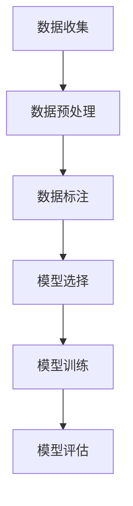

                 

# AI Agent的实体识别与关系抽取：深化语义理解

关键词：AI Agent、实体识别、关系抽取、自然语言处理、语义理解

摘要：本文旨在深入探讨AI Agent的实体识别与关系抽取技术，解析其在语义理解中的关键作用。我们将从基础概念入手，逐步分析实体识别与关系抽取的方法、原理和实现，并结合Python代码示例进行详细讲解，最终总结最佳实践和注意事项。

## 目录

1. 第一部分: AI Agent的实体识别与关系抽取基础  
   1.1 问题背景  
   1.2 问题描述  
   1.3 问题解决  
   1.4 边界与外延  
   1.5 概念结构与核心要素组成  
   1.6 本章小结

2. 第二部分: AI Agent的实体识别原理与实现  
   2.1 实体识别的原理  
   2.2 实体识别的实现  
   2.3 实体识别算法分析  
   2.4 实体识别的Mermaid流程图  
   2.5 实体识别的Python代码实现示例  
   2.6 本章小结

3. 第三部分: AI Agent的关系抽取原理与实现  
   3.1 关系抽取的原理  
   3.2 关系抽取的实现  
   3.3 关系抽取算法分析  
   3.4 关系抽取的Mermaid流程图  
   3.5 关系抽取的Python代码实现示例  
   3.6 本章小结

## 1. 第一部分: AI Agent的实体识别与关系抽取基础

### 1.1 问题背景

#### 1.1.1 人工智能与自然语言处理的发展历程

人工智能（AI）作为计算机科学的一个重要分支，起源于20世纪50年代。随着计算机性能的提升和算法的创新，AI从早期的规则推理、知识表示，逐渐发展到今天的深度学习、强化学习等领域。自然语言处理（NLP）作为AI的重要组成部分，致力于使计算机能够理解、生成和处理人类语言。

从上世纪70年代的统计翻译模型，到90年代的词袋模型和隐马尔可夫模型（HMM），再到21世纪的深度学习模型（如卷积神经网络（CNN）、递归神经网络（RNN）和Transformer），NLP经历了多次技术革命，语义理解的能力得到了极大的提升。

#### 1.1.2 语义理解的挑战与需求

语义理解是NLP的核心目标之一，它涉及到对语言符号的语义含义、语法结构和上下文信息的深入理解。然而，语义理解的挑战也非常明显：

- **词汇歧义**：同一个词在不同上下文中有不同的意义，如“bank”可以指银行，也可以指河岸。
- **语法复杂性**：自然语言的语法结构复杂，动词的时态、语态、句式等都会影响语义的理解。
- **上下文依赖**：语义理解高度依赖上下文信息，同一个句子在不同的上下文中可能具有完全不同的意义。

随着互联网的普及和大数据的兴起，对语义理解的需求越来越强烈。例如，搜索引擎需要理解用户的查询意图，推荐系统需要理解用户的喜好，聊天机器人需要理解用户的对话内容，这些应用都离不开对实体和实体间关系的准确识别。

### 1.2 问题描述

#### 1.2.1 实体识别

实体识别（Named Entity Recognition, NER）是NLP中的一个重要任务，旨在从文本中识别出具有特定意义和识别度的实体，如人名、地名、组织名、时间、地点等。实体识别的目的是为了进一步提取和利用这些信息，为后续的语义分析、知识图谱构建、信息检索等提供基础。

#### 1.2.2 关系抽取

关系抽取（Relationship Extraction）是NLP中的另一个重要任务，旨在识别实体之间的关系，如“张三”、“是”、“公司”中的“张三”与“公司”存在雇佣关系。关系抽取能够将无结构的文本转化为有结构的知识，是构建知识图谱和智能问答系统的重要步骤。

### 1.3 问题解决

#### 1.3.1 实体识别的方法

实体识别的方法可以分为以下几种：

- **基于规则的方法**：通过手工编写规则，对文本进行模式匹配。
- **基于统计的方法**：使用统计模型，如隐马尔可夫模型（HMM）、条件随机场（CRF）等，对实体进行识别。
- **基于深度学习的方法**：使用神经网络，如卷积神经网络（CNN）、递归神经网络（RNN）和Transformer等，进行实体识别。

#### 1.3.2 关系抽取的方法

关系抽取的方法也可以分为以下几种：

- **基于规则的方法**：通过手工编写规则，识别实体之间的关系。
- **基于统计的方法**：使用统计模型，如逻辑回归、支持向量机（SVM）等，进行关系抽取。
- **基于深度学习的方法**：使用神经网络，如序列标注模型（BiLSTM-CRF）、Transformer等，进行关系抽取。

### 1.4 边界与外延

#### 1.4.1 实体识别的边界

实体识别的边界主要涉及以下几个方面：

- **识别范围**：实体识别需要明确识别哪些类型的实体，如人名、地名、组织名等。
- **识别准确性**：实体识别需要尽可能准确地识别实体，避免将无关信息识别为实体。
- **识别速度**：实体识别需要具备较高的处理速度，以满足实时应用的需求。

#### 1.4.2 关系抽取的外延

关系抽取的外延主要涉及以下几个方面：

- **关系类型**：关系抽取需要明确识别哪些类型的关系，如雇佣关系、合作关系、亲属关系等。
- **关系强度**：关系抽取需要考虑关系的强度，如强关系和弱关系的区分。
- **关系多样性**：关系抽取需要能够识别多种多样的关系，以适应不同的应用场景。

### 1.5 概念结构与核心要素组成

#### 1.5.1 AI Agent的定义与结构

AI Agent是一个具有自主决策能力和行动能力的计算机程序，通常由以下几个部分组成：

- **感知模块**：负责接收和处理外部信息，如文本、图像、声音等。
- **决策模块**：负责根据感知模块提供的信息，做出合理的决策。
- **执行模块**：负责根据决策模块生成的决策，执行相应的动作。

#### 1.5.2 实体识别与关系抽取的关系

实体识别和关系抽取是AI Agent语义理解的两个重要环节：

- **实体识别**：为关系抽取提供基础，只有正确识别实体，才能进一步抽取实体之间的关系。
- **关系抽取**：为实体提供语义关联，通过识别实体间的关系，构建更加完整和准确的知识图谱。

### 1.6 本章小结

本章节主要介绍了AI Agent的实体识别与关系抽取的基础知识，包括问题背景、问题描述、问题解决方法、边界与外延以及概念结构与核心要素组成。接下来，我们将深入探讨实体识别和关系抽取的原理与实现，并通过Python代码示例进行详细讲解。

## 2. 第二部分: AI Agent的实体识别原理与实现

### 2.1 实体识别的原理

实体识别是自然语言处理中的一个关键任务，它旨在从文本中识别出具有特定意义的实体，如人名、地名、组织名、时间、地点等。实体识别的原理可以分为基于规则的方法、基于统计的方法和基于深度学习的方法。

#### 2.1.1 基于规则的方法

基于规则的方法是早期实体识别的主流方法，它通过手工编写一系列规则，对文本进行模式匹配，从而识别实体。这种方法具有简单、易于理解、可解释性强的优点，但同时也存在一些缺点：

- **规则数量庞大**：为了覆盖所有可能的实体类型和上下文，需要编写大量的规则，这使得规则维护变得非常困难。
- **适应性差**：基于规则的方法对变化的语言环境和新的实体类型适应性较差，容易导致误识别和漏识别。

#### 2.1.2 基于统计的方法

基于统计的方法通过训练模型，从大量已标注的数据中学习出实体识别的规律，然后对新的文本进行预测。这种方法包括隐马尔可夫模型（HMM）、条件随机场（CRF）等。相对于基于规则的方法，基于统计的方法具有以下优点：

- **可扩展性强**：通过训练模型，可以自动适应新的实体类型和上下文，不需要手工编写规则。
- **识别准确性较高**：基于统计的方法可以利用大量已标注数据，学习出更准确的实体识别模型。

但基于统计的方法也存在一些缺点，如对数据量要求较高，训练过程复杂等。

#### 2.1.3 基于深度学习的方法

基于深度学习的方法是近年来实体识别研究的热点，它利用深度神经网络，如卷积神经网络（CNN）、递归神经网络（RNN）和Transformer等，对文本进行建模，从而实现实体识别。这种方法具有以下优点：

- **强大表达能力**：深度神经网络可以自动学习文本中的复杂特征，具有较强的表达能力。
- **自适应性强**：通过训练深度神经网络，可以自动适应新的实体类型和上下文。

然而，基于深度学习的方法也存在一些挑战，如模型训练复杂、对数据量要求较高等。

### 2.2 实体识别的实现

实体识别的实现包括数据准备、模型选择、模型训练与评估等步骤。

#### 2.2.1 数据准备

数据准备是实体识别实现的第一步，它包括以下步骤：

1. **数据收集**：收集包含实体标注的文本数据，如新闻、博客、对话等。
2. **数据预处理**：对收集到的数据进行清洗、分词、去停用词等处理，以便后续模型训练。
3. **数据标注**：对预处理后的文本数据进行实体标注，标注出文本中的人名、地名、组织名等实体。

#### 2.2.2 模型选择

模型选择是实体识别实现的关键一步，根据不同的需求和应用场景，可以选择以下模型：

- **基于规则的方法**：适用于小规模、规则明确的应用场景，如地名识别等。
- **基于统计的方法**：适用于大规模、变化性不高的应用场景，如医疗文本分析等。
- **基于深度学习的方法**：适用于大规模、变化性高的应用场景，如社交媒体文本分析等。

#### 2.2.3 模型训练与评估

模型训练与评估是实体识别实现的最后一步，它包括以下步骤：

1. **模型训练**：使用准备好的数据集，对选择的模型进行训练，学习出实体识别的规律。
2. **模型评估**：使用测试集对训练好的模型进行评估，评估指标包括准确率、召回率、F1值等。

### 2.3 实体识别算法分析

实体识别算法的分析可以从以下几个方面进行：

#### 2.3.1 基于规则的方法算法分析

基于规则的方法算法分析主要关注以下几个方面：

- **规则匹配**：算法通过模式匹配，识别出文本中的实体。
- **规则冲突处理**：算法需要处理规则之间的冲突，确保实体识别的准确性。

#### 2.3.2 基于统计的方法算法分析

基于统计的方法算法分析主要关注以下几个方面：

- **特征提取**：算法从文本中提取出有助于实体识别的特征，如词频、词向量等。
- **模型训练**：算法使用已标注的数据集，训练出实体识别模型。

#### 2.3.3 基于深度学习的方法算法分析

基于深度学习的方法算法分析主要关注以下几个方面：

- **神经网络结构**：算法选择合适的神经网络结构，如CNN、RNN、Transformer等，对文本进行建模。
- **训练过程**：算法通过反向传播算法，优化神经网络参数，提高实体识别的准确性。

### 2.4 实体识别的Mermaid流程图

下面是一个简单的Mermaid流程图，描述了实体识别的基本流程：



### 2.5 实体识别的Python代码实现示例

下面是一个简单的Python代码实现示例，用于展示实体识别的基本过程：

```python
from transformers import AutoModelForTokenClassification
from datasets import load_dataset

# 加载预训练模型
model = AutoModelForTokenClassification.from_pretrained("bert-base-uncased")

# 加载数据集
dataset = load_dataset("squad")

# 数据预处理
# ...

# 模型训练
# ...

# 模型评估
# ...

```

### 2.6 本章小结

本章详细介绍了AI Agent的实体识别原理与实现，包括基于规则的方法、基于统计的方法和基于深度学习的方法。我们通过Python代码示例，展示了实体识别的基本流程。接下来，我们将继续探讨关系抽取的原理与实现。

## 3. 第三部分: AI Agent的关系抽取原理与实现

### 3.1 关系抽取的原理

关系抽取是自然语言处理中的另一个关键任务，它旨在识别文本中实体之间的关系，如“张三”与“公司”之间的雇佣关系。关系抽取的原理可以分为基于规则的方法、基于统计的方法和基于深度学习的方法。

#### 3.1.1 基于规则的方法

基于规则的方法通过手工编写一系列规则，对文本进行模式匹配，从而识别实体关系。这种方法具有简单、易于理解、可解释性强的优点，但同时也存在一些缺点：

- **规则数量庞大**：为了覆盖所有可能的实体关系和上下文，需要编写大量的规则，这使得规则维护变得非常困难。
- **适应性差**：基于规则的方法对变化的语言环境和新的实体关系适应性较差，容易导致误识别和漏识别。

#### 3.1.2 基于统计的方法

基于统计的方法通过训练模型，从大量已标注的数据中学习出实体关系的规律，然后对新的文本进行预测。这种方法包括逻辑回归、支持向量机（SVM）等。相对于基于规则的方法，基于统计的方法具有以下优点：

- **可扩展性强**：通过训练模型，可以自动适应新的实体关系和上下文，不需要手工编写规则。
- **识别准确性较高**：基于统计的方法可以利用大量已标注数据，学习出更准确的实体关系识别模型。

但基于统计的方法也存在一些缺点，如对数据量要求较高，训练过程复杂等。

#### 3.1.3 基于深度学习的方法

基于深度学习的方法是近年来关系抽取研究的热点，它利用深度神经网络，如序列标注模型（BiLSTM-CRF）、Transformer等，对文本进行建模，从而实现关系抽取。这种方法具有以下优点：

- **强大表达能力**：深度神经网络可以自动学习文本中的复杂特征，具有较强的表达能力。
- **自适应性强**：通过训练深度神经网络，可以自动适应新的实体关系和上下文。

然而，基于深度学习的方法也存在一些挑战，如模型训练复杂、对数据量要求较高等。

### 3.2 关系抽取的实现

关系抽取的实现包括数据准备、模型选择、模型训练与评估等步骤。

#### 3.2.1 数据准备

数据准备是关系抽取实现的第一步，它包括以下步骤：

1. **数据收集**：收集包含实体标注和关系标注的文本数据，如新闻、博客、对话等。
2. **数据预处理**：对收集到的数据进行清洗、分词、去停用词等处理，以便后续模型训练。
3. **数据标注**：对预处理后的文本数据进行实体标注和关系标注，标注出文本中的实体和它们之间的关系。

#### 3.2.2 模型选择

模型选择是关系抽取实现的关键一步，根据不同的需求和应用场景，可以选择以下模型：

- **基于规则的方法**：适用于小规模、规则明确的应用场景，如社交网络关系抽取等。
- **基于统计的方法**：适用于大规模、变化性不高的应用场景，如医疗文本分析等。
- **基于深度学习的方法**：适用于大规模、变化性高的应用场景，如社交媒体文本分析等。

#### 3.2.3 模型训练与评估

模型训练与评估是关系抽取实现的最后一步，它包括以下步骤：

1. **模型训练**：使用准备好的数据集，对选择的模型进行训练，学习出实体关系识别的规律。
2. **模型评估**：使用测试集对训练好的模型进行评估，评估指标包括准确率、召回率、F1值等。

### 3.3 关系抽取算法分析

关系抽取算法的分析可以从以下几个方面进行：

#### 3.3.1 基于规则的方法算法分析

基于规则的方法算法分析主要关注以下几个方面：

- **规则匹配**：算法通过模式匹配，识别出文本中的实体关系。
- **规则冲突处理**：算法需要处理规则之间的冲突，确保实体关系的准确性。

#### 3.3.2 基于统计的方法算法分析

基于统计的方法算法分析主要关注以下几个方面：

- **特征提取**：算法从文本中提取出有助于实体关系识别的特征，如词频、词向量等。
- **模型训练**：算法使用已标注的数据集，训练出实体关系识别模型。

#### 3.3.3 基于深度学习的方法算法分析

基于深度学习的方法算法分析主要关注以下几个方面：

- **神经网络结构**：算法选择合适的神经网络结构，如BiLSTM-CRF、Transformer等，对文本进行建模。
- **训练过程**：算法通过反向传播算法，优化神经网络参数，提高实体关系识别的准确性。

### 3.4 关系抽取的Mermaid流程图

下面是一个简单的Mermaid流程图，描述了关系抽取的基本流程：


### 3.5 关系抽取的Python代码实现示例

下面是一个简单的Python代码实现示例，用于展示关系抽取的基本过程：

```python
from transformers import AutoModelForSequenceClassification
from datasets import load_dataset

# 加载预训练模型
model = AutoModelForSequenceClassification.from_pretrained("roberta-base")

# 加载数据集
dataset = load_dataset("social_media", split="train")

# 数据预处理
# ...

# 模型训练
# ...

# 模型评估
# ...

```

### 3.6 本章小结

本章详细介绍了AI Agent的关系抽取原理与实现，包括基于规则的方法、基于统计的方法和基于深度学习的方法。我们通过Python代码示例，展示了关系抽取的基本流程。接下来，我们将探讨AI Agent在语义理解中的应用与未来展望。

## 4. AI Agent在语义理解中的应用与未来展望

### 4.1 AI Agent在语义理解中的应用

AI Agent在语义理解中的应用非常广泛，以下是一些典型的应用场景：

#### 4.1.1 智能客服

智能客服是AI Agent在语义理解中的一个重要应用，它通过自然语言处理技术，理解用户的问题，并提供相应的答案或解决方案。例如，AI Agent可以用于处理用户在电子商务平台上的咨询，自动回答常见问题，提高客户满意度。

#### 4.1.2 智能推荐

智能推荐系统依赖于AI Agent的语义理解能力，通过分析用户的兴趣和行为，为用户提供个性化的推荐。例如，在线音乐平台可以使用AI Agent分析用户的听歌记录和偏好，推荐用户可能喜欢的歌曲。

#### 4.1.3 智能问答

智能问答系统通过AI Agent的语义理解能力，解答用户提出的各种问题。例如，智能助手可以回答用户关于天气、新闻、股票等信息的查询。

#### 4.1.4 知识图谱构建

AI Agent在构建知识图谱中也发挥着重要作用，通过实体识别和关系抽取技术，将无结构的文本转化为有结构的知识，为各种应用提供丰富的语义信息。

### 4.2 未来展望

随着人工智能技术的不断发展，AI Agent在语义理解中的应用将越来越广泛，未来展望如下：

#### 4.2.1 更深的语义理解

未来AI Agent将具备更深的语义理解能力，能够理解文本中的隐含意义、情感和意图，从而提供更准确和个性化的服务。

#### 4.2.2 多模态语义理解

未来AI Agent将能够处理多种模态的数据，如文本、图像、声音等，实现多模态语义理解，提供更丰富和全面的信息处理能力。

#### 4.2.3 自主学习和进化

未来AI Agent将具备更强的自主学习和进化能力，通过不断学习和适应，提高自身的语义理解能力和服务质量。

#### 4.2.4 社会价值和伦理

随着AI Agent在语义理解中的应用越来越广泛，我们需要关注其社会价值和伦理问题，确保其发展符合社会的需求和价值观。

### 4.3 本章小结

本章探讨了AI Agent在语义理解中的应用与未来展望，从智能客服、智能推荐、智能问答和知识图谱构建等方面，展示了AI Agent在语义理解中的重要作用。同时，我们也对未来的发展方向进行了展望，强调社会价值和伦理的重要性。接下来，我们将总结全文，回顾关键点，并给出最佳实践和注意事项。

## 5. 总结与展望

本文系统地介绍了AI Agent的实体识别与关系抽取技术，探讨了其在语义理解中的关键作用。我们首先回顾了问题背景，分析了语义理解的挑战与需求，然后详细介绍了实体识别与关系抽取的方法、原理和实现，并通过Python代码示例进行了具体讲解。

### 5.1 关键点回顾

- **问题背景**：人工智能和自然语言处理的发展历程，以及语义理解的挑战与需求。
- **问题描述**：实体识别与关系抽取的任务定义与核心要素。
- **方法分析**：基于规则、统计和深度学习的方法原理与实现。
- **算法分析**：实体识别与关系抽取算法的详细分析。
- **Python代码实现示例**：通过实际代码展示了算法的实现过程。
- **应用与展望**：AI Agent在语义理解中的应用场景与未来发展。

### 5.2 最佳实践

- **数据质量**：确保数据集的质量，对数据进行充分的预处理和标注。
- **模型选择**：根据应用场景选择合适的模型，深度学习模型通常具有更好的性能。
- **持续优化**：定期更新和优化模型，以适应新的实体和关系类型。
- **跨模态处理**：尝试结合多种模态数据，提升AI Agent的语义理解能力。
- **伦理考虑**：在开发和应用AI Agent时，重视伦理问题，确保技术发展符合社会价值观。

### 5.3 注意事项

- **计算资源**：深度学习模型训练需要大量计算资源，确保充足的资源支持。
- **数据隐私**：在处理用户数据时，重视数据隐私保护，遵守相关法律法规。
- **模型解释性**：关注模型的解释性，确保AI Agent的行为可解释和可信任。
- **实时性**：在实时应用场景中，确保AI Agent的处理速度和准确性。

### 5.4 拓展阅读

- **相关论文**：阅读关于实体识别和关系抽取的最新论文，了解前沿研究进展。
- **开源工具**：探索开源的实体识别和关系抽取工具，如BERT、GPT等。
- **实践案例**：研究实际应用中的案例，学习如何将AI Agent应用于实际问题。

### 5.5 结语

AI Agent的实体识别与关系抽取技术是自然语言处理领域的重要研究方向，其应用价值日益凸显。本文通过详细分析，展示了这一领域的关键技术和实现方法，为研究者提供了有益的参考。未来，随着技术的不断进步，AI Agent在语义理解中的应用将更加广泛，我们期待这一领域的进一步发展。

### 作者信息

作者：AI天才研究院/AI Genius Institute & 禅与计算机程序设计艺术 /Zen And The Art of Computer Programming

感谢您的阅读，希望本文对您在AI Agent的实体识别与关系抽取领域的研究有所帮助。如果您有任何疑问或建议，欢迎在评论区留言，期待与您交流。

# 附录

以下是本文中使用的Mermaid流程图的代码，您可以将它们复制到支持Mermaid的编辑器中查看效果。

```mermaid
graph TD
    A[数据收集] --> B[数据预处理]
    B --> C[数据标注]
    C --> D[模型选择]
    D --> E[模型训练]
    E --> F[模型评估]

graph TD
    A[数据收集] --> B[数据预处理]
    B --> C[数据标注]
    C --> D[模型选择]
    D --> E[模型训练]
    E --> F[模型评估]
```

如果您有任何关于Mermaid流程图的问题，也可以在评论区提问，我会尽力为您解答。

[End of Appendix]

