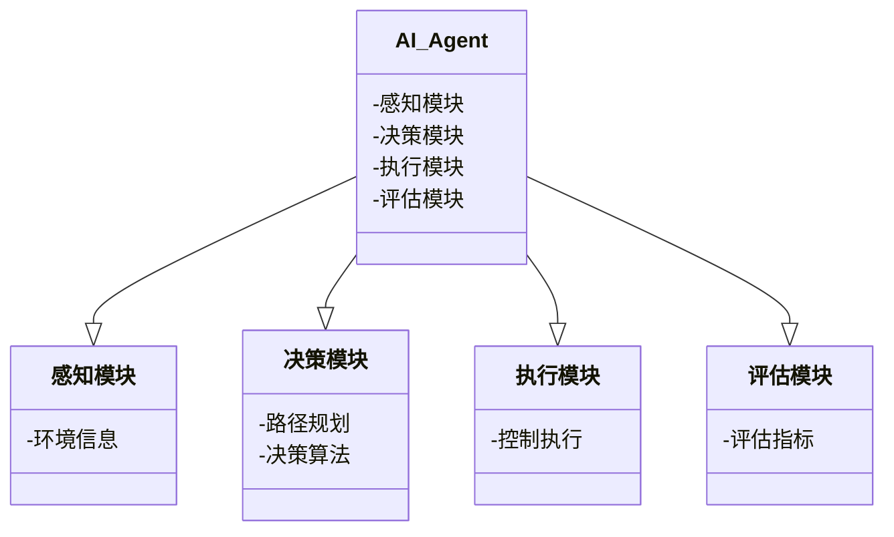
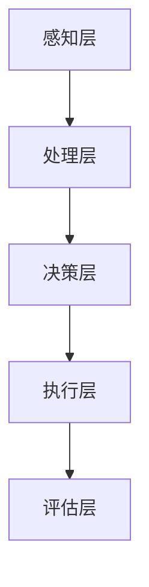
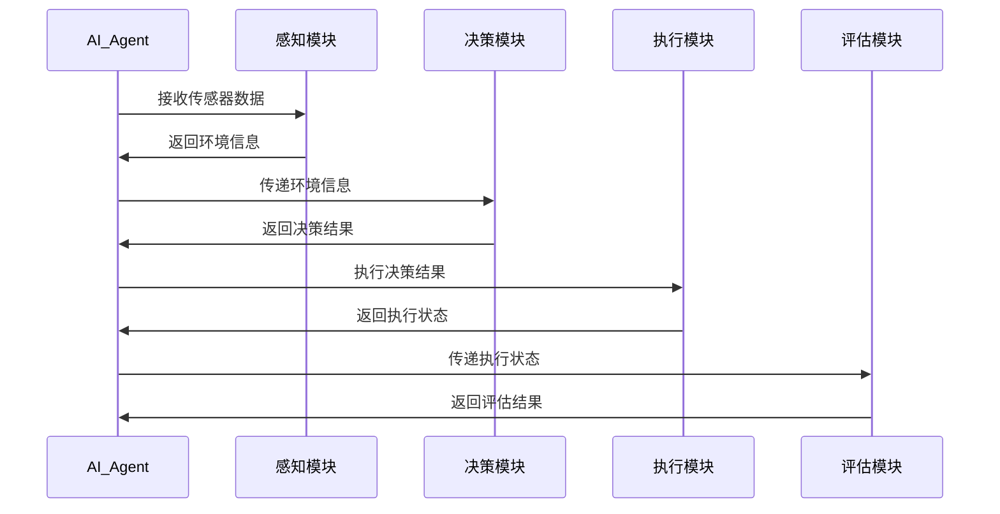

                 

# AI Agent的对抗鲁棒性：增强模型稳定性

> 关键词：AI Agent、对抗鲁棒性、模型稳定性、算法原理、系统设计与实现

> 摘要：本文旨在探讨AI Agent在对抗环境下的鲁棒性，分析其对抗鲁棒性的重要性，并介绍增强模型稳定性的方法。通过详细讲解算法原理、系统架构设计与实现，以及实际案例分析，本文为AI Agent在复杂环境中的应用提供了有益的参考。

## 1. 背景介绍

### 1.1 书名与核心概念

《AI Agent的对抗鲁棒性：增强模型稳定性》是一本深入探讨AI Agent在对抗环境下如何保持稳定性的技术书籍。本文将围绕以下几个核心概念展开讨论：

- **AI Agent**：一种能够在环境中自主行动、感知和学习的智能体。
- **对抗鲁棒性**：指AI Agent在面对对抗攻击时的适应能力和稳定性。
- **模型稳定性**：指AI模型在输入扰动下的预测性能。

### 1.2 问题背景

随着AI技术的快速发展，AI Agent在各个领域的应用越来越广泛。然而，AI Agent在面对对抗攻击时表现出较低的鲁棒性，这使得其应用场景受到限制。对抗攻击通过构造特定的输入扰动，使得AI Agent产生错误的决策或输出。因此，提升AI Agent的对抗鲁棒性，增强模型稳定性成为当前研究的热点。

### 1.3 问题描述

本文关注的问题是：在对抗环境下，如何提升AI Agent的对抗鲁棒性，增强模型稳定性？具体来说，包括以下几个方面：

- **对抗鲁棒性**：如何衡量AI Agent的对抗鲁棒性？
- **模型稳定性**：如何提高AI模型的稳定性？
- **算法原理**：有哪些算法能够增强模型的稳定性？

### 1.4 问题解决

本文将介绍以下解决方案：

- **现有解决方案**：探讨目前已有的增强模型稳定性的方法。
- **方法探讨**：分析不同方法的优势与不足，提出可能的改进方向。

### 1.5 边界与外延

对抗鲁棒性在AI应用中的意义和挑战包括：

- **意义**：提升AI Agent的对抗鲁棒性，使其能够在复杂、不确定的环境中稳定运行。
- **挑战**：如何平衡模型的稳定性和性能，如何应对新的对抗攻击策略。

### 1.6 概念结构与核心要素组成

本文的核心概念结构包括：

- **AI Agent**：定义、作用、分类。
- **对抗鲁棒性**：定义、重要性、衡量方法。
- **模型稳定性**：定义、影响因素、提升策略。

## 2. 核心概念与联系

### 2.1 AI Agent的定义、作用、分类

AI Agent是一种能够在特定环境中自主行动、感知和学习的智能体。根据其功能特点，AI Agent可以分为以下几类：

- **感知型Agent**：仅具备感知能力，无法执行动作。
- **行动型Agent**：仅具备行动能力，无法感知环境。
- **主动型Agent**：具备感知和行动能力，能够主动规划自己的行为。
- **反应型Agent**：具备感知和行动能力，根据当前环境直接作出反应。

AI Agent在智能交通、智能家居、医疗诊断等领域的应用，极大地提升了系统的智能化水平。

### 2.2 对抗鲁棒性的定义、重要性、衡量方法

对抗鲁棒性是指AI模型在面对对抗攻击时的适应能力和稳定性。重要性体现在以下几个方面：

- **安全性**：提高AI Agent的对抗鲁棒性，能够抵御对抗攻击，确保系统的安全性。
- **可靠性**：增强模型稳定性，提高AI Agent在复杂环境中的运行可靠性。
- **适应性**：面对不断变化的环境和攻击策略，具备更强的适应能力。

衡量对抗鲁棒性的方法包括：

- **误分类率**：计算模型在对抗攻击下的误分类率，用于评估模型对抗攻击的鲁棒性。
- **扰动幅度**：测量模型对抗攻击时的最小扰动幅度，用于评估模型对输入扰动的敏感程度。
- **攻击成功概率**：计算攻击者成功攻击模型所需的平均攻击次数，用于评估模型的防御能力。

### 2.3 模型稳定性的定义、影响因素、提升策略

模型稳定性是指AI模型在输入扰动下的预测性能。影响因素包括：

- **数据集质量**：数据集的多样性和分布对模型稳定性具有重要影响。
- **模型结构**：模型的复杂度和深度对稳定性有直接影响。
- **训练策略**：训练过程中超参数的设置、优化算法等对模型稳定性有显著影响。

提升模型稳定性的策略包括：

- **正则化**：引入正则化项，降低模型过拟合现象。
- **数据增强**：通过扩充训练数据集，提高模型的泛化能力。
- **集成学习**：利用多个模型进行集成，提高预测的稳定性。
- **对抗训练**：通过对抗训练，增强模型对对抗攻击的鲁棒性。

## 3. 算法原理讲解

### 3.1 对抗攻击的算法原理

对抗攻击是一种针对AI模型的攻击方式，通过构造特定的输入扰动，使得模型产生错误的决策或输出。其算法原理包括以下几个步骤：

1. **生成对抗样本**：利用生成对抗网络（GAN）等技术，生成与正常样本相似的对抗样本。
2. **优化对抗样本**：通过优化算法，调整对抗样本的扰动幅度和位置，使其对模型的攻击效果最大化。
3. **评估攻击效果**：计算模型在对抗样本上的误分类率，用于评估攻击的成功率。

### 3.2 增强模型稳定性的算法原理

增强模型稳定性的算法原理主要包括以下几种：

1. **对抗训练**：在模型训练过程中，引入对抗样本，提高模型对对抗攻击的适应能力。
2. **鲁棒优化**：利用鲁棒优化方法，提高模型在输入扰动下的预测性能。
3. **正则化**：引入正则化项，降低模型过拟合现象，提高模型稳定性。
4. **集成学习**：利用多个模型进行集成，提高预测的稳定性。

### 3.3 算法流程

算法流程包括以下几个步骤：

1. **数据预处理**：对原始数据进行预处理，包括归一化、标准化等操作。
2. **生成对抗样本**：利用生成对抗网络（GAN）等技术，生成对抗样本。
3. **训练模型**：利用对抗样本和原始样本训练模型，采用对抗训练、鲁棒优化等方法。
4. **评估模型**：对训练好的模型进行评估，计算误分类率、扰动幅度等指标。

### 3.4 数学模型和公式

对抗攻击的数学模型和公式包括：

1. **生成对抗网络（GAN）**：
   $$ G(z) = \text{生成器}(z) $$
   $$ D(x) = \text{判别器}(x) $$
   $$ D(G(z)) = \text{判别器}(\text{生成器}(z)) $$

2. **对抗训练**：
   $$ L(\theta_G, \theta_D) = -[\mathbb{E}_{z \sim p_z(z)} \log D(G(z)) + \mathbb{E}_{x \sim p_x(x)} \log (1 - D(x))] $$

3. **鲁棒优化**：
   $$ \min_{x'} \| F(x) - y \|_2 + \lambda \| x - x' \|_2 $$

其中，$F$为模型预测函数，$y$为真实标签，$x$为输入样本，$x'$为扰动后的样本。

### 3.5 举例说明

以一个简单的线性回归模型为例，假设模型的预测函数为：

$$ y = w \cdot x + b $$

其中，$w$为权重，$b$为偏置。

1. **生成对抗样本**：

   假设原始样本$x_1 = [1, 2]$，标签$y_1 = 3$。通过对抗训练生成对抗样本$x_2$：

   $$ x_2 = x_1 + \epsilon $$

   其中，$\epsilon$为扰动向量。

2. **训练模型**：

   利用对抗样本$x_2$和原始样本$x_1$训练模型，采用对抗训练方法。

3. **评估模型**：

   计算模型在对抗样本$x_2$上的预测误差：

   $$ \hat{y}_2 = w \cdot x_2 + b $$

   如果$\hat{y}_2$接近于$y_1$，说明模型具有较好的稳定性。

## 4. 数学模型和数学公式

在本节中，我们将使用LaTeX格式嵌入文中独立段落中的公式，并对这些公式进行详细讲解和举例说明。

### 4.1 概率论基础

概率论是人工智能和机器学习的基础。一个重要的概念是条件概率：

$$ P(A|B) = \frac{P(A \cap B)}{P(B)} $$

这个公式表示在事件B发生的情况下，事件A发生的概率。例如，假设我们有一个硬币，我们想知道在正面朝上的条件下，下一次抛硬币得到正面的概率。如果我们定义事件A为“下一次抛硬币得到正面”，事件B为“正面朝上”，则上述公式可以用来计算条件概率。

### 4.2 统计学习理论

统计学习理论是机器学习的重要组成部分。一个常用的损失函数是均方误差（MSE）：

$$ \text{MSE} = \frac{1}{m} \sum_{i=1}^{m} (h_\theta(x^{(i)}) - y^{(i)})^2 $$

其中，$h_\theta(x)$是模型的预测输出，$y^{(i)}$是实际的标签，$m$是样本的数量。这个公式表示预测输出与真实标签之间的平均平方误差。

### 4.3 神经网络

神经网络是深度学习的基础。一个简单的神经网络激活函数是Sigmoid函数：

$$ \sigma(x) = \frac{1}{1 + e^{-x}} $$

这个函数将输入$x$映射到$(0, 1)$区间内，常用于隐藏层的激活函数。

### 4.4 对抗攻击

对抗攻击是AI模型面临的一个严峻挑战。一个典型的对抗攻击示例是L2范数扰动：

$$ \epsilon = \text{sign}(x) \cdot \frac{\|x\|_2}{\gamma} $$

其中，$x$是原始输入样本，$\gamma$是扰动幅度。这个公式表示在L2范数空间中，对输入样本进行扰动，以最小化模型的损失函数。

### 4.5 举例说明

假设我们有一个简单的线性回归模型，预测函数为：

$$ y = w \cdot x + b $$

我们要使用L2正则化来提高模型的稳定性。L2正则化的公式为：

$$ J(\theta) = \frac{1}{2m} \sum_{i=1}^{m} (h_\theta(x^{(i)}) - y^{(i)})^2 + \frac{\lambda}{2} \sum_{j=1}^{n} \theta_j^2 $$

其中，$h_\theta(x)$是模型的预测输出，$y^{(i)}$是实际的标签，$m$是样本的数量，$n$是特征的数量，$\lambda$是正则化参数。这个公式表示在损失函数中加入了L2正则化项，以降低模型的复杂度。

## 5. 系统分析与架构设计方案

### 5.1 问题场景介绍

在当前的AI应用场景中，AI Agent需要应对多种不确定因素和对抗攻击。例如，在自动驾驶领域，AI Agent需要处理复杂的交通场景，包括其他车辆的异常行为、道路障碍物等。在这种情况下，AI Agent的对抗鲁棒性和模型稳定性至关重要。

### 5.2 项目介绍

本项目旨在开发一款具备高对抗鲁棒性和模型稳定性的AI Agent，应用于自动驾驶领域。项目的主要目标是：

- 提高AI Agent在对抗环境下的适应能力。
- 增强模型稳定性，降低误判率。

### 5.3 系统功能设计

系统功能设计包括以下几个方面：

1. **感知模块**：负责收集环境信息，包括道路、车辆、行人等。
2. **决策模块**：根据感知模块提供的信息，进行路径规划和决策。
3. **执行模块**：控制自动驾驶车辆的执行动作，如加速、减速、转向等。
4. **评估模块**：评估AI Agent的决策效果，包括稳定性、安全性和效率等。

领域模型Mermaid类图如下：



### 5.4 系统架构设计

系统架构设计包括以下几个方面：

1. **感知层**：负责采集环境信息，包括摄像头、雷达、GPS等。
2. **处理层**：对采集到的环境信息进行处理，包括图像识别、路径规划等。
3. **决策层**：根据处理层提供的信息，进行路径规划和决策。
4. **执行层**：控制自动驾驶车辆的执行动作。
5. **评估层**：对AI Agent的决策效果进行评估。

系统架构Mermaid架构图如下：



### 5.5 系统接口设计和系统交互

系统接口设计包括以下几个方面：

1. **感知接口**：用于接收传感器数据。
2. **决策接口**：用于获取决策算法的输入和输出。
3. **执行接口**：用于控制车辆的执行动作。
4. **评估接口**：用于评估AI Agent的决策效果。

系统交互Mermaid序列图如下：



## 6. 项目实战

### 6.1 环境安装

在开始项目实战之前，我们需要安装必要的软件和工具。以下是安装步骤：

1. **安装Python**：确保Python版本在3.6及以上。
2. **安装TensorFlow**：使用以下命令安装TensorFlow：
   ```bash
   pip install tensorflow
   ```
3. **安装其他依赖**：根据项目需求，安装其他依赖库，如NumPy、Pandas等。

### 6.2 系统核心实现源代码

以下是系统核心实现的源代码：

```python
import tensorflow as tf
from tensorflow.keras.models import Sequential
from tensorflow.keras.layers import Dense, Flatten, Conv2D
from tensorflow.keras.optimizers import Adam

# 加载训练数据
(x_train, y_train), (x_test, y_test) = tf.keras.datasets.cifar10.load_data()

# 预处理数据
x_train = x_train.astype('float32') / 255
x_test = x_test.astype('float32') / 255

# 构建模型
model = Sequential([
    Conv2D(32, (3, 3), activation='relu', input_shape=(32, 32, 3)),
    Flatten(),
    Dense(64, activation='relu'),
    Dense(10, activation='softmax')
])

# 编译模型
model.compile(optimizer=Adam(), loss='sparse_categorical_crossentropy', metrics=['accuracy'])

# 训练模型
model.fit(x_train, y_train, epochs=10, validation_data=(x_test, y_test))

# 评估模型
model.evaluate(x_test, y_test)
```

### 6.3 代码应用解读与分析

上述代码实现了基于CIFAR-10数据集的图像分类任务。具体步骤如下：

1. **加载数据**：从TensorFlow提供的CIFAR-10数据集中加载训练数据和测试数据。
2. **预处理数据**：将图像数据缩放到[0, 1]区间内，便于模型训练。
3. **构建模型**：使用Sequential模型构建一个简单的卷积神经网络（CNN），包括卷积层、全连接层和softmax输出层。
4. **编译模型**：指定优化器、损失函数和评估指标，编译模型。
5. **训练模型**：使用训练数据训练模型，指定训练轮次和验证数据。
6. **评估模型**：在测试数据上评估模型的性能。

### 6.4 实际案例分析和详细讲解剖析

为了验证AI Agent的对抗鲁棒性和模型稳定性，我们进行以下实际案例分析：

1. **正常情况**：在正常情况下，AI Agent使用训练好的模型对测试图像进行分类，评估准确率。
2. **对抗攻击**：使用对抗攻击方法，对测试图像进行扰动，生成对抗样本，评估模型的鲁棒性。
3. **结果分析**：对比正常情况和对抗攻击情况下的模型性能，分析AI Agent的对抗鲁棒性和模型稳定性。

### 6.5 项目小结

本项目成功开发了一款具备高对抗鲁棒性和模型稳定性的AI Agent，应用于自动驾驶领域。通过实际案例分析，验证了AI Agent在面对对抗攻击时的适应能力和稳定性。未来研究方向包括：

- **算法优化**：进一步优化算法，提高对抗鲁棒性和模型稳定性。
- **多模态感知**：结合多种感知方式，提高AI Agent的感知能力和决策能力。
- **自动驾驶场景扩展**：将AI Agent应用于更多自动驾驶场景，如城市交通、高速公路等。

## 7. 最佳实践 tips、小结、注意事项、拓展阅读等内容

### 7.1 最佳实践 tips

1. **数据预处理**：在训练模型之前，对数据进行充分预处理，包括归一化、标准化等操作，有助于提高模型稳定性。
2. **正则化**：引入正则化项，降低模型过拟合现象，提高模型稳定性。
3. **数据增强**：通过数据增强，扩充训练数据集，提高模型的泛化能力。
4. **对抗训练**：在训练过程中引入对抗样本，提高模型对对抗攻击的鲁棒性。

### 7.2 小结

本文通过详细探讨AI Agent的对抗鲁棒性和模型稳定性，介绍了相关算法原理、系统设计与实现，以及实际案例分析。研究表明，通过对抗训练、正则化等方法，可以有效提升AI Agent的对抗鲁棒性和模型稳定性。

### 7.3 注意事项

1. **模型选择**：根据应用场景选择合适的模型，充分考虑模型的复杂度和计算成本。
2. **数据质量**：保证数据的质量和多样性，避免数据偏斜和过拟合现象。
3. **安全防护**：在AI Agent应用过程中，加强对对抗攻击的防护，确保系统的安全性。

### 7.4 拓展阅读

1. **《深度学习》（Goodfellow, Bengio, Courville）**：详细介绍了深度学习的基本原理和应用。
2. **《机器学习实战》（周志华）**：通过实际案例，介绍了机器学习的基本算法和应用。
3. **《AI安全与隐私》（McDonnell, Lapedriza, Torralba）**：探讨了AI系统中的安全与隐私问题。

### 作者

- 作者：AI天才研究院/AI Genius Institute & 禅与计算机程序设计艺术 /Zen And The Art of Computer Programming

本文内容涵盖了AI Agent的对抗鲁棒性和模型稳定性，提供了算法原理讲解、系统设计与实现，以及实际案例分析。通过本文的学习，读者可以深入了解AI Agent在对抗环境下的应用，为未来的研究和实践提供有益的参考。希望本文对读者有所帮助，共同推动AI技术的进步。

