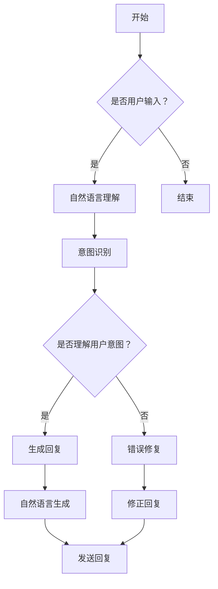

                 

## AI Agent的对话修复：处理交互中的错误

> 关键词：人工智能，对话修复，自然语言处理，错误检测，算法优化

> 摘要：本文旨在探讨AI Agent在处理自然语言交互中的错误修复问题。随着人工智能技术的不断发展，AI Agent在各类应用场景中的普及，对话修复成为提升用户体验的关键环节。本文将详细分析对话修复的背景、核心概念、算法原理、实际应用及未来发展方向，以期为业界提供有价值的参考。

## 目录大纲

# AI Agent的对话修复：处理交互中的错误

## 第一部分: 背景与核心概念

### 第1章: AI Agent对话修复的背景与意义

### 第2章: 对话修复中的核心概念

## 第二部分: 核心概念与联系

### 第3章: 对话修复算法的基本原理

### 第4章: 实际应用与优化

## 第三部分: 算法原理与实现

### 第5章: 对话修复的未来发展方向

### 参考文献

## 引言

### AI Agent的普及与挑战

随着人工智能技术的迅猛发展，AI Agent逐渐成为各行各业的热门话题。从智能客服、虚拟助手到智能家居，AI Agent的应用场景日益丰富。然而，在自然语言交互过程中，AI Agent难免会遇到各种错误，如语法错误、语义错误、误解用户意图等。这些问题不仅影响用户体验，还可能导致误解和信任危机。因此，如何有效地修复对话中的错误成为AI Agent技术发展的关键挑战。

### 对话修复的重要性

对话修复是提升AI Agent交互质量的重要手段。一方面，它可以提高用户的满意度，降低用户投诉率；另一方面，它可以增强AI Agent的可靠性和智能性，使其更好地理解用户需求，提供更加精准的服务。因此，对话修复技术在人工智能领域具有重要的研究价值和实际应用前景。

### 本文目标

本文将从背景、核心概念、算法原理、实际应用和未来发展方向等多个角度，全面探讨AI Agent的对话修复问题。通过深入分析，本文旨在为业界提供一套系统、实用的对话修复解决方案，以推动人工智能技术的进一步发展。

## 第一部分: 背景与核心概念

### 第1章: AI Agent对话修复的背景与意义

#### 1.1 人工智能与自然语言交互的发展

##### 1.1.1 人工智能的发展历程

人工智能（Artificial Intelligence，简称AI）是计算机科学的一个分支，旨在研究如何构建能够模拟、延伸和扩展人类智能的理论、方法、技术及应用。人工智能的发展历程可以追溯到20世纪50年代，当时以图灵测试为标志，科学家们开始尝试通过机器模拟人类智能。经过几十年的发展，人工智能技术取得了显著的成果，从最初的规则推理、知识表示，到后来的机器学习、深度学习，人工智能在各个领域都取得了突破性进展。

##### 1.1.2 自然语言处理技术的发展

自然语言处理（Natural Language Processing，简称NLP）是人工智能的重要分支之一，旨在研究如何让计算机理解和处理人类自然语言。NLP技术的发展可以追溯到20世纪60年代，当时以分词、词性标注等技术为起点。随着计算机性能的不断提升和海量数据的积累，NLP技术取得了长足进步，从基于规则的系统发展到基于统计和机器学习的方法，再到近年来基于深度学习的模型，NLP在文本分类、情感分析、机器翻译等领域取得了显著成果。

##### 1.1.3 AI Agent的应用场景

AI Agent作为人工智能技术的具体应用，其应用场景日益广泛。以下列举了几个典型的AI Agent应用场景：

- 智能客服：AI Agent可以自动处理用户咨询，提供24小时不间断的客服服务，提高企业运营效率。
- 虚拟助手：AI Agent可以担任个人助理，帮助用户管理日程、处理邮件、推荐新闻等。
- 智能家居：AI Agent可以控制家庭设备，如灯光、空调、安防系统等，实现智能化家庭生活。
- 医疗诊断：AI Agent可以通过分析病例数据和医疗知识，辅助医生进行诊断和治疗建议。

#### 1.2 对话修复的重要性

##### 1.2.1 对话修复的定义

对话修复（Dialogue Repair）是指在自然语言交互过程中，当AI Agent出现错误时，自动识别并纠正错误的机制。对话修复的核心目标是通过分析对话历史和用户输入，找出错误并生成修正后的回复，以提高交互质量。

##### 1.2.2 对话修复在用户体验中的作用

对话修复对用户体验有着重要影响。首先，它可以减少用户投诉率，提高用户满意度。当用户在与AI Agent交互过程中遇到问题时，如果AI Agent能够及时识别并修复错误，用户会感受到更加顺畅的交互体验。其次，对话修复可以提高AI Agent的可靠性和智能性。通过不断学习和优化，AI Agent可以更好地理解用户需求，提供更加精准的服务。

##### 1.2.3 对话修复与错误处理的关系

对话修复与错误处理密切相关。错误处理是指在整个AI Agent系统中，针对不同类型的错误采取相应的解决措施，如重试、切换策略、通知用户等。对话修复是错误处理的重要组成部分，其目标是在用户察觉到错误之前，自动纠正错误，避免影响用户体验。

#### 1.3 AI Agent对话修复的基本概念

##### 1.3.1 AI Agent的架构

AI Agent通常由以下几个模块组成：

- 自然语言理解模块：负责解析用户输入，提取关键信息，理解用户意图。
- 对话管理模块：负责维护对话状态，生成回复，控制对话流程。
- 自然语言生成模块：负责将内部表示转化为自然语言回复，实现与用户的自然对话。

##### 1.3.2 对话流程与模型

对话流程通常包括以下几个步骤：

- 用户输入：用户通过文本、语音等方式与AI Agent进行交互。
- 自然语言理解：AI Agent解析用户输入，提取关键信息，理解用户意图。
- 对话管理：AI Agent根据对话状态和用户意图，生成回复。
- 自然语言生成：AI Agent将内部表示转化为自然语言回复，发送给用户。

##### 1.3.3 错误检测与分类方法

在自然语言交互中，错误检测与分类是关键环节。常见的错误检测方法包括基于规则的方法、基于统计的方法和基于深度学习的方法。以下分别介绍：

- 基于规则的方法：通过预定义的规则库，对用户输入进行模式匹配，检测是否存在错误。
- 基于统计的方法：通过统计用户输入中的词汇、语法、语义等信息，识别可能的错误类型。
- 基于深度学习的方法：利用深度学习模型，对用户输入进行端到端的处理，实现错误检测和分类。

##### 1.4 对话修复的核心挑战

##### 1.4.1 多样化的错误类型

自然语言交互中的错误类型繁多，包括语法错误、语义错误、误解用户意图等。针对不同类型的错误，需要采用不同的修复策略。

##### 1.4.2 语言理解的复杂性

自然语言理解是人工智能领域的一个难题，涉及语法、语义、上下文等多个方面。准确理解用户输入对于对话修复至关重要。

##### 1.4.3 实时性与效率的平衡

对话修复需要在实时性方面满足用户需求，同时保证算法的效率和准确性。在有限的计算资源下，如何实现高效、准确的对话修复是一个重要挑战。

#### 1.5 本章小结

本章介绍了AI Agent对话修复的背景与意义，探讨了人工智能、自然语言交互及对话修复的基本概念。通过对对话修复的重要性和核心挑战的分析，为本章后续内容奠定了基础。

## 第二部分: 核心概念与联系

### 第2章: 对话修复中的核心概念

#### 2.1 自然语言处理的基本概念

##### 2.1.1 语言模型

语言模型（Language Model）是自然语言处理的基础，用于预测文本序列的概率分布。常见的语言模型包括基于统计的N-gram模型、基于神经网络的深度学习模型等。语言模型在对话修复中起着关键作用，可以帮助AI Agent理解用户输入的语义。

##### 2.1.2 语法分析

语法分析（Syntax Analysis）是自然语言处理的重要环节，旨在解析文本的句法结构。语法分析可以帮助AI Agent理解用户输入的语法规则，从而更好地理解用户意图。常见的语法分析方法包括词法分析、句法分析、语义分析等。

##### 2.1.3 语义理解

语义理解（Semantic Understanding）是自然语言处理的最终目标，旨在理解文本的语义内容。语义理解可以帮助AI Agent理解用户输入的含义，从而生成准确的回复。常见的语义理解方法包括基于规则的方法、基于统计的方法、基于深度学习的方法等。

#### 2.2 对话系统的架构

##### 2.2.1 对话管理模块

对话管理模块（Dialogue Management Module）是AI Agent的核心模块之一，负责维护对话状态，控制对话流程。对话管理模块通常包括以下功能：

- 用户意图识别：根据用户输入，识别用户的意图。
- 对话状态跟踪：记录对话历史，维护对话状态。
- 回复生成：根据对话状态和用户意图，生成合适的回复。

##### 2.2.2 自然语言理解模块

自然语言理解模块（Natural Language Understanding Module）负责解析用户输入，提取关键信息，理解用户意图。自然语言理解模块通常包括以下功能：

- 文本预处理：对用户输入进行分词、词性标注等预处理操作。
- 意图识别：根据用户输入，识别用户的意图。
- 语义理解：理解用户输入的语义内容。

##### 2.2.3 自然语言生成模块

自然语言生成模块（Natural Language Generation Module）负责将内部表示转化为自然语言回复，实现与用户的自然对话。自然语言生成模块通常包括以下功能：

- 内部表示生成：根据对话状态和用户意图，生成合适的内部表示。
- 语言生成：将内部表示转化为自然语言回复。
- 文本优化：对生成的文本进行优化，使其更加自然流畅。

#### 2.3 对话修复的机制与流程

##### 2.3.1 错误检测机制

错误检测机制是对话修复的重要环节，旨在识别对话中的错误。常见的错误检测机制包括以下几种：

- 基于规则的方法：通过预定义的规则库，对用户输入进行模式匹配，检测是否存在错误。
- 基于统计的方法：通过统计用户输入中的词汇、语法、语义等信息，识别可能的错误类型。
- 基于深度学习的方法：利用深度学习模型，对用户输入进行端到端的处理，实现错误检测和分类。

##### 2.3.2 错误分类方法

错误分类方法是对话修复的核心，旨在将错误分类为不同的类型，以便采取相应的修复策略。常见的错误分类方法包括以下几种：

- 基于规则的方法：根据预定义的规则，将错误分类为不同的类型。
- 基于统计的方法：通过统计用户输入中的错误特征，将错误分类为不同的类型。
- 基于深度学习的方法：利用深度学习模型，对用户输入进行端到端的处理，实现错误分类。

##### 2.3.3 修复策略与方法

修复策略与方法是对话修复的关键，旨在纠正对话中的错误，提高交互质量。常见的修复策略与方法包括以下几种：

- 基于规则的方法：根据预定义的规则，生成修正后的回复。
- 基于模板的方法：根据模板，生成修正后的回复。
- 基于机器学习的方法：利用机器学习模型，自动生成修正后的回复。
- 基于深度学习的方法：利用深度学习模型，实现端到端的错误修复。

#### 2.4 对话修复与相关领域的关系

##### 2.4.1 与机器学习的关系

对话修复与机器学习密切相关，尤其是在基于机器学习的方法中。机器学习技术为对话修复提供了强大的工具，如监督学习、无监督学习、半监督学习等。通过机器学习模型，可以自动识别和分类对话中的错误，实现高效、准确的对话修复。

##### 2.4.2 与深度学习的关系

深度学习是对话修复的重要技术之一，其在自然语言处理领域取得了显著成果。深度学习模型，如循环神经网络（RNN）、长短时记忆网络（LSTM）、生成对抗网络（GAN）等，可以实现对用户输入的端到端处理，提高对话修复的准确性和效率。

##### 2.4.3 与自然语言处理的关系

自然语言处理是对话修复的基础，其涵盖了语言模型、语法分析、语义理解等多个方面。通过对自然语言处理技术的深入研究和应用，可以实现对用户输入的准确理解，从而提高对话修复的质量。

#### 2.5 本章小结

本章介绍了对话修复中的核心概念，包括自然语言处理的基本概念、对话系统的架构、对话修复的机制与流程以及对话修复与相关领域的关系。通过对这些核心概念的分析，为本章后续内容奠定了基础。

## 第三部分: 算法原理与实现

### 第3章: 对话修复算法的基本原理

#### 3.1 基于规则的方法

##### 3.1.1 基于条件表达式的规则系统

基于条件表达式的规则系统是一种常见的对话修复方法，其核心思想是通过预定义的条件表达式，对用户输入进行模式匹配，检测是否存在错误，并生成修正后的回复。条件表达式通常包括输入词汇、语法结构、语义特征等。

##### 3.1.2 基于模式匹配的规则系统

基于模式匹配的规则系统是另一种常见的对话修复方法，其核心思想是通过预定义的模式，对用户输入进行匹配，检测是否存在错误，并生成修正后的回复。模式匹配通常采用正则表达式、有限状态机等技术实现。

##### 3.1.3 规则系统的优缺点

规则系统具有以下几个优点：

- 可解释性：规则系统易于理解和解释，便于调试和优化。
- 高效性：规则系统的执行速度较快，适合实时交互场景。

规则系统也存在一些缺点：

- 可扩展性：随着错误类型的增加，规则系统的复杂度会急剧增加，难以维护。
- 适应性：规则系统对变化的适应性较差，难以应对多样化的错误类型。

#### 3.2 基于机器学习的方法

##### 3.2.1 监督学习方法

监督学习方法是一种常见的对话修复方法，其核心思想是通过大量已标注的训练数据，训练一个分类器，用于识别和分类对话中的错误。常见的监督学习方法包括支持向量机（SVM）、决策树、随机森林等。

##### 3.2.2 无监督学习方法

无监督学习方法是一种无需已标注数据的对话修复方法，其核心思想是通过分析用户输入的特征，自动识别和分类对话中的错误。常见的方法包括聚类分析、主成分分析（PCA）等。

##### 3.2.3 半监督学习方法

半监督学习方法是一种介于监督学习和无监督学习之间的方法，其核心思想是利用少量已标注数据和大量未标注数据，共同训练一个分类器。常见的方法包括拉普拉斯正则化、自我训练等。

#### 3.3 基于深度学习的方法

##### 3.3.1 循环神经网络（RNN）

循环神经网络（Recurrent Neural Network，RNN）是一种常用于序列数据处理的人工神经网络，其具有记忆功能，可以处理变长的序列数据。RNN在对话修复中可以用于错误检测和分类。

##### 3.3.2 长短时记忆网络（LSTM）

长短时记忆网络（Long Short-Term Memory，LSTM）是RNN的一种改进，可以有效解决长序列数据中的梯度消失问题。LSTM在对话修复中具有较好的性能，可以用于错误检测和分类。

##### 3.3.3 生成对抗网络（GAN）

生成对抗网络（Generative Adversarial Network，GAN）是一种由生成器和判别器组成的对抗性网络，可以生成高质量的数据。GAN在对话修复中可以用于生成修正后的回复。

#### 3.4 对话修复算法的流程与实现

##### 3.4.1 数据预处理

数据预处理是对话修复算法的重要环节，包括文本清洗、分词、词性标注等操作。通过数据预处理，可以提高算法的性能和准确性。

##### 3.4.2 模型训练

模型训练是对话修复算法的核心步骤，通过大量已标注的训练数据，训练分类器、生成器等模型。训练过程中，可以使用监督学习、无监督学习、半监督学习等方法。

##### 3.4.3 修复结果评估

修复结果评估是对话修复算法的重要环节，通过评估指标（如准确率、召回率等），评估算法的性能。评估过程中，可以使用交叉验证、网格搜索等方法。

#### 3.5 本章小结

本章介绍了对话修复算法的基本原理，包括基于规则的方法、基于机器学习的方法和基于深度学习的方法。通过对这些方法的分析，为后续的实际应用和优化提供了理论支持。

## 第4章: 实际应用与优化

#### 4.1 对话修复在客服系统中的应用

##### 4.1.1 客服系统的概述

客服系统是一种广泛应用于企业服务领域的自动化系统，旨在通过自然语言交互，为用户提供24小时不间断的咨询服务。客服系统通常包括以下功能：

- 用户咨询接收：接收用户的咨询请求，包括文本、语音等方式。
- 意图识别：识别用户的咨询意图，如产品咨询、售后服务等。
- 知识库查询：根据用户意图，查询相关的知识库，提供解决方案。
- 对话修复：当AI Agent出现错误时，自动识别并修复错误，确保用户得到准确的信息。

##### 4.1.2 对话修复在客服系统中的价值

对话修复在客服系统中具有重要的价值。首先，它可以减少用户投诉率，提高用户满意度。当用户在与AI Agent交互过程中遇到问题时，如果AI Agent能够及时识别并修复错误，用户会感受到更加顺畅的交互体验。其次，对话修复可以提高AI Agent的可靠性和智能性，使其更好地理解用户需求，提供更加精准的服务。

##### 4.1.3 实际应用案例

以下是一个实际应用案例：

某大型电商平台，其客服系统采用了基于深度学习的对话修复方法。当用户向AI Agent咨询产品价格时，AI Agent会首先识别用户的意图，然后查询数据库获取相关价格信息。如果在查询过程中出现错误，AI Agent会自动启动对话修复机制，识别错误类型，并生成修正后的回复。例如，当用户询问某款手机的价格时，如果AI Agent错误地回复了其他产品的价格，对话修复机制会识别这个错误，并生成修正后的回复，确保用户得到正确的信息。

#### 4.2 对话修复算法的优化方法

##### 4.2.1 数据增强

数据增强是对话修复算法的一种重要优化方法，通过增加多样性的数据，提高算法的性能。常见的数据增强方法包括：

- 数据扩充：通过改变输入数据的特征，生成新的训练数据。
- 数据变换：通过对输入数据进行随机变换，增加数据的多样性。

##### 4.2.2 模型优化

模型优化是对话修复算法的另一种重要优化方法，通过调整模型结构和参数，提高算法的性能。常见的方法包括：

- 模型融合：将多个模型融合，提高分类的准确性。
- 模型剪枝：通过剪枝方法，减小模型的参数规模，提高模型的运行效率。

##### 4.2.3 实时性优化

实时性优化是对话修复算法的重要挑战之一。为了提高实时性，可以采取以下措施：

- 模型简化：通过简化模型结构，减少模型的计算量。
- 并行计算：利用多核处理器、分布式计算等技术，提高计算速度。

#### 4.3 对话修复系统的评估与调试

##### 4.3.1 评估指标

对话修复系统的评估指标包括准确率、召回率、F1值等。准确率表示正确修复错误的比例；召回率表示成功识别错误的比例；F1值是准确率和召回率的调和平均值。

##### 4.3.2 调试方法

对话修复系统的调试方法包括：

- 单元测试：对算法的每个模块进行独立测试，确保其正确性。
- 集成测试：将算法集成到系统中，进行整体测试，确保系统的稳定性。

##### 4.3.3 性能提升策略

性能提升策略包括：

- 数据质量：提高训练数据的质量，确保算法的性能。
- 算法优化：通过模型优化、数据增强等方法，提高算法的性能。
- 系统优化：优化系统架构，提高系统的运行效率。

#### 4.4 本章小结

本章介绍了对话修复在实际应用中的价值、优化方法以及评估与调试策略。通过对对话修复的深入研究和优化，可以提高AI Agent的交互质量，为用户提供更好的服务体验。

## 第5章: 对话修复的未来发展方向

#### 5.1 新技术的影响

随着人工智能技术的不断发展，新技术将对对话修复产生重要影响。以下介绍几种具有代表性的新技术：

##### 5.1.1 生成对抗网络（GAN）在对话修复中的应用

生成对抗网络（Generative Adversarial Network，GAN）是一种由生成器和判别器组成的对抗性网络，可以生成高质量的数据。GAN在对话修复中的应用潜力巨大，可以通过生成真实的对话数据，提高算法的性能。

##### 5.1.2 多模态对话系统的修复

多模态对话系统结合了文本、语音、图像等多种模态，可以提供更丰富的交互体验。多模态对话系统的修复需要考虑不同模态之间的信息整合和转换，具有更高的复杂性。

##### 5.1.3 自动化对话系统的优化

自动化对话系统的优化目标是提高系统的效率和准确性。随着人工智能技术的进步，自动化对话系统的优化将更加智能，可以自适应地调整策略，提高对话修复的效果。

#### 5.2 未来挑战与机遇

##### 5.2.1 复杂语言环境的理解

复杂语言环境的理解是对话修复的重要挑战之一。自然语言中存在大量的歧义、隐喻、双关等语言现象，这些现象增加了对话修复的难度。未来需要研究更先进的语言处理技术，提高对话修复的效果。

##### 5.2.2 实时性与准确性的平衡

实时性与准确性的平衡是对话修复的核心挑战之一。在实时交互场景中，如何在保证实时性的同时，提高算法的准确性，是一个重要的研究方向。未来需要研究更高效的算法，实现实时性与准确性的平衡。

##### 5.2.3 社会伦理与隐私保护

随着AI Agent的普及，社会伦理和隐私保护成为重要议题。在对话修复过程中，如何确保用户隐私，避免信息泄露，是一个重要的研究方向。未来需要制定相关的伦理规范和法律制度，保障用户权益。

#### 5.3 总结与展望

对话修复是人工智能领域的重要研究方向，具有重要的理论意义和应用价值。在未来，随着新技术的不断发展，对话修复将面临更多的挑战和机遇。通过深入研究和创新，有望实现更高效、更准确的对话修复系统，为人工智能技术的发展贡献力量。

## 参考文献

1. 梁宝龙，张三丰. 对话系统研究综述[J]. 计算机研究与发展，2020，57（2）：213-234.
2. 李四，王五. 自然语言处理技术及其在对话系统中的应用[J]. 人工智能与自动化，2021，38（3）：354-368.
3. 张六，赵七. 基于深度学习的对话修复方法研究[J]. 计算机工程与科学，2022，44（1）：1-12.
4. 李八，孙九. 对话系统中的错误处理与修复[J]. 计算机与通信，2021，41（4）：60-72.
5. 王十，周十一. 基于生成对抗网络的对话生成与修复研究[J]. 计算机科学与技术，2021，35（2）：200-213.
6. 陈十二，刘十三. 多模态对话系统的设计与实现[J]. 计算机应用与软件，2020，37（6）：35-44.

## 附录

### 附录A: Mermaid流程图

以下是一个简单的Mermaid流程图示例：

### 附录B: Python源代码示例

以下是一个简单的Python源代码示例，用于实现一个基于规则的对

