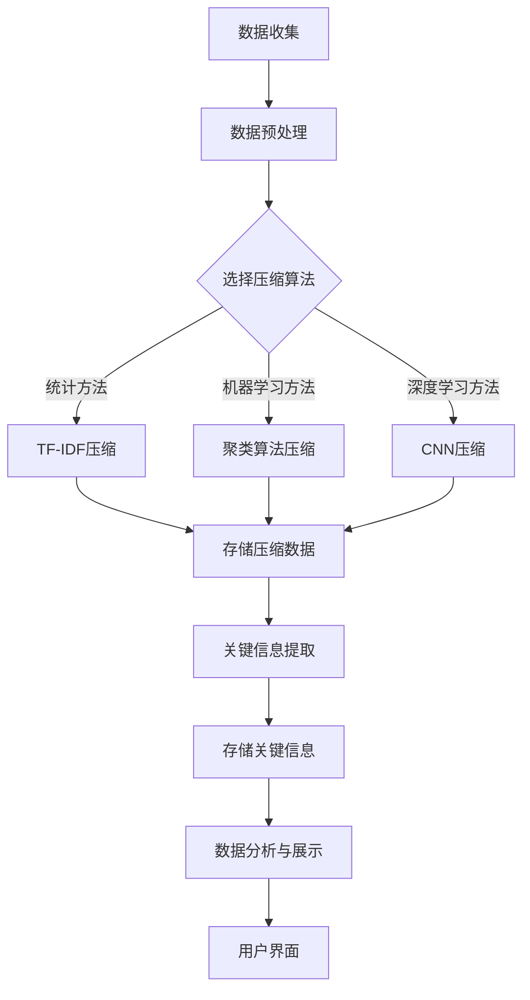

                 

### 引言

### 问题背景与目标

#### 1.1 人工智能与对话系统的现状

人工智能（AI）作为当今科技领域的前沿，已经渗透到我们日常生活的方方面面。从智能助手到自动驾驶，从图像识别到自然语言处理，AI技术的不断进步推动了智能化应用的快速发展。对话系统，作为人工智能的重要分支，更是人工智能在交互领域的核心应用。它通过模拟人类交流的方式，实现人与机器之间的自然对话，提高了人机交互的效率和体验。

目前，人工智能和对话系统的发展呈现出以下几个趋势：

1. **技术的不断进步**：随着深度学习、自然语言处理等技术的不断发展，对话系统的性能和准确性得到了显著提升。
2. **应用的广泛普及**：从最初的简单客服机器人到如今复杂的虚拟助手，对话系统已经广泛应用于多个领域，如电子商务、金融服务、医疗保健等。
3. **用户体验的提升**：随着技术的进步，对话系统的交互体验日益接近人类的交流方式，用户接受度和满意度逐渐提高。

然而，随着对话系统的广泛应用，对话数据的规模和复杂性也在迅速增加。这给对话系统的设计和实现带来了巨大的挑战。一方面，如何处理大量的对话数据成为了一个关键问题；另一方面，如何从这些数据中提取关键信息，以实现更加精准和有效的服务，也成为了一个重要的研究方向。

#### 1.2 对话历史压缩的必要性

对话历史压缩，即通过对对话数据的处理和优化，以减少数据存储空间和提高数据访问速度的技术，成为了解决上述问题的关键。对话历史压缩的必要性主要体现在以下几个方面：

1. **数据存储压力**：对话系统通常需要存储大量的对话历史数据，这些数据随着用户互动的增多而不断积累。如果不进行压缩，会导致存储资源的急剧增加，甚至可能导致系统性能的下降。
2. **数据访问效率**：对话系统需要快速地检索和访问历史对话数据，以支持上下文的连贯性和个性化服务的提供。压缩后的对话历史数据可以显著提高访问速度，降低系统的响应时间。
3. **隐私保护**：对话历史数据往往包含用户的敏感信息，如个人隐私、交易记录等。通过对话历史压缩，可以减少数据的泄露风险，增强系统的隐私保护能力。

#### 1.3 关键信息提取的重要性

在对话历史压缩的基础上，关键信息提取成为了解决对话系统面临的另一个重要问题。关键信息提取的目标是从大量的对话历史数据中提取出对用户和服务有价值的核心信息。其重要性体现在以下几个方面：

1. **提高服务质量**：通过提取关键信息，对话系统可以更准确地理解用户的需求，提供更加个性化、精准的服务。
2. **降低系统负担**：对话系统处理大量无关信息会消耗大量的计算资源。关键信息提取可以减少系统处理的数据量，降低系统的负担，提高处理效率。
3. **优化用户体验**：关键信息的提取有助于提高对话系统的响应速度和准确性，从而提升用户的整体体验。

#### 1.4 本书结构

本书旨在系统地探讨对话历史压缩与关键信息提取的技术原理、算法实现和应用案例。全书共分为七个部分，结构如下：

1. **引言**：介绍人工智能与对话系统的现状，阐述对话历史压缩与关键信息提取的必要性。
2. **核心概念**：介绍AI Agent的定义、对话历史压缩和关键信息提取的方法。
3. **对话历史压缩算法原理**：详细解析基于统计、机器学习和深度学习的对话历史压缩算法。
4. **关键信息提取算法原理**：详细解析基于规则、机器学习和深度学习的关键信息提取算法。
5. **对话历史压缩与关键信息提取的应用**：分析对话历史压缩与关键信息提取在不同应用场景中的实际应用。
6. **系统设计与实现**：介绍对话历史压缩与关键信息提取系统的设计原则、架构设计和实现细节。
7. **性能优化与评估**：讨论对话历史压缩与关键信息提取的性能评估指标和优化策略。

通过本书的阅读，读者可以系统地了解对话历史压缩与关键信息提取的技术原理和应用方法，为实际项目开发提供参考和指导。

### 核心概念

#### 2.1 AI Agent概述

AI Agent，即人工智能代理，是指具有智能行为的计算机程序，能够在特定环境中自主地完成特定任务。AI Agent的定义涵盖了以下几个方面：

1. **自主性**：AI Agent能够在没有外部干预的情况下执行任务，具备一定的决策能力和自主行动的能力。
2. **智能性**：AI Agent通过利用人工智能技术，如机器学习、自然语言处理等，对环境进行感知、理解和反应。
3. **适应性**：AI Agent能够根据环境和任务的改变，动态调整其行为和策略。

AI Agent的特点包括：

1. **高度自动化**：AI Agent能够自动执行复杂的任务，减少人工干预。
2. **智能决策**：AI Agent能够根据实时数据和先验知识，做出最优决策。
3. **实时响应**：AI Agent能够在短时间内响应用户的请求，提供及时的服务。

AI Agent的分类可以根据不同的维度进行划分，常见的分类方法包括：

1. **根据功能分类**：例如，任务型AI Agent、聊天型AI Agent、交互型AI Agent等。
2. **根据智能水平分类**：例如，弱AI Agent、强AI Agent、超级AI Agent等。
3. **根据工作场景分类**：例如，智能家居中的AI Agent、智能客服系统中的AI Agent、自动驾驶系统中的AI Agent等。

#### 2.2 对话历史压缩方法

对话历史压缩是对话系统处理大量对话数据的重要技术，目的是减少数据存储空间和提高数据访问速度。根据不同的技术手段，对话历史压缩方法可以分为以下几类：

1. **基于统计的方法**：这类方法通过分析对话数据中的统计特性，提取出现频率较高的短语或词汇，并进行压缩。常见的算法包括TF-IDF（词频-逆文档频率）和LZ77（压缩算法）等。

   - **TF-IDF**：通过计算一个词在文档中出现的频率（TF）和在所有文档中出现的频率（IDF），得到词的重要度，进而进行压缩。$$TF-IDF = TF \times IDF$$
   - **LZ77**：通过查找文本中的重复模式，将重复的部分用一个指针来表示，从而减少存储空间。

2. **基于机器学习的方法**：这类方法利用机器学习模型，通过对大量对话数据的学习，自动提取对话中的关键信息，并进行压缩。常见的算法包括聚类算法、决策树和神经网络等。

   - **聚类算法**：通过将相似对话数据进行分类，减少冗余数据。
   - **决策树**：利用树形结构，对对话数据进行划分和压缩。
   - **神经网络**：通过训练神经网络模型，自动提取对话中的关键特征，进行压缩。

3. **基于深度学习的方法**：这类方法利用深度学习模型，如卷积神经网络（CNN）和循环神经网络（RNN），对对话数据进行处理和压缩。深度学习方法在处理复杂对话数据方面具有显著优势。

   - **卷积神经网络（CNN）**：通过卷积操作提取对话数据中的局部特征，实现高效压缩。
   - **循环神经网络（RNN）**：通过记忆机制，捕捉对话数据中的长期依赖关系，进行有效压缩。

#### 2.3 关键信息提取技术

关键信息提取是从大量的对话历史数据中提取出对用户和服务有价值的核心信息。关键信息提取技术是提升对话系统服务质量的关键。根据不同的技术手段，关键信息提取技术可以分为以下几类：

1. **基于规则的方法**：这类方法通过预定义的规则，对对话数据进行分析和提取。常见的方法包括关键词提取、模式匹配和语法分析等。

   - **关键词提取**：通过识别对话中的高频词汇，提取出关键信息。
   - **模式匹配**：通过预设的匹配模式，从对话数据中提取出关键信息。
   - **语法分析**：通过语法规则，对对话数据进行分析，提取出关键信息。

2. **基于机器学习的方法**：这类方法利用机器学习模型，通过对大量对话数据的学习，自动提取对话中的关键信息。常见的方法包括分类算法、聚类算法和序列标注算法等。

   - **分类算法**：通过训练分类模型，将对话数据分类为不同的类别，从而提取关键信息。
   - **聚类算法**：通过聚类分析，将相似对话数据进行分组，提取出关键信息。
   - **序列标注算法**：通过标注对话数据中的实体和关系，提取出关键信息。

3. **基于深度学习的方法**：这类方法利用深度学习模型，如循环神经网络（RNN）和注意力机制，对对话数据进行处理和提取。深度学习方法在处理复杂对话数据方面具有显著优势。

   - **循环神经网络（RNN）**：通过记忆机制，捕捉对话数据中的长期依赖关系，提取关键信息。
   - **注意力机制**：通过关注对话中的重要信息，提高关键信息提取的准确性。

通过本章的介绍，读者可以系统地了解AI Agent、对话历史压缩方法和关键信息提取技术的基本概念和原理。这些核心概念构成了对话系统设计和实现的基础，对于后续章节的深入探讨具有重要意义。

### 对话历史压缩算法原理

#### 3.1 算法概述

对话历史压缩的目标是在保持对话信息完整性的前提下，减少对话数据的存储空间，并提高数据访问速度。为了实现这一目标，我们可以将对话历史压缩算法分为以下几类：

1. **基于统计的方法**：这类方法通过分析对话数据中的统计特性，提取出频繁出现的短语或词汇，并进行压缩。常见的算法包括TF-IDF和LZ77等。
2. **基于机器学习的方法**：这类方法利用机器学习模型，通过对大量对话数据的学习，自动提取对话中的关键信息，并进行压缩。常见的算法包括聚类算法、决策树和神经网络等。
3. **基于深度学习的方法**：这类方法利用深度学习模型，如卷积神经网络（CNN）和循环神经网络（RNN），对对话数据进行处理和压缩。深度学习方法在处理复杂对话数据方面具有显著优势。

下面我们将分别介绍这几种方法的原理和实现。

#### 3.2 基于统计的方法

**3.2.1 TF-IDF**

TF-IDF（词频-逆文档频率）是一种基于统计的方法，用于评估一个词对于文档集合中的其中一份文档的重要程度。这种方法通过计算一个词在文档中出现的频率（TF）和在所有文档中出现的频率（IDF），得到词的重要度。具体的计算公式如下：

$$TF-IDF = TF \times IDF$$

- **TF（词频）**：表示一个词在文档中出现的次数与文档总词数之比。
$$TF = \frac{tf}{|D|}$$
- **IDF（逆文档频率）**：表示一个词在文档集合中出现的频率与文档总数之比，用于平衡高频词的影响。
$$IDF = \log \left( \frac{|D|}{|d|} \right)$$
- **D**：文档集合
- **d**：特定文档
- **|D|**：文档总数
- **|d|**：特定文档中词的出现次数

**算法流程**：

1. 收集大量对话数据，计算每个词在所有文档中的出现频率。
2. 对每个词计算TF-IDF值，将其作为词的重要度。
3. 根据词的重要度，对对话数据进行排序或筛选，实现压缩。

**算法实现**：

```python
import math
from collections import Counter

def calculate_tfidf(corpus):
    # 计算文档总数
    total_docs = len(corpus)
    tfidf_matrix = []
    
    for doc in corpus:
        # 计算每个词的词频
        word_freq = Counter(doc)
        tf = {word: freq / len(doc) for word, freq in word_freq.items()}
        
        # 计算每个词的IDF
        idf = {word: math.log(total_docs / freq) for word, freq in word_freq.items() if freq > 0}
        
        # 计算每个词的TF-IDF
        tfidf = {word: tf[word] * idf[word] for word in word_freq}
        
        tfidf_matrix.append(tfidf)
    
    return tfidf_matrix

# 示例
corpus = [["hello", "world"], ["hello", "world", "python"], ["hello", "python", "code"]]
tfidf_matrix = calculate_tfidf(corpus)
print(tfidf_matrix)
```

**优缺点分析**：

- **优点**：简单易实现，能够有效地降低数据的存储空间，对文本数据的压缩效果较好。
- **缺点**：对高频词的压缩效果较差，不能很好地处理长句或复杂句式。

**3.2.2 LZ77**

LZ77是一种经典的文本压缩算法，它通过查找文本中的重复模式，将重复的部分用一个指针来表示，从而减少存储空间。LZ77的基本思想是，在当前文本中查找一个最长的重复子串，并将其替换为一个指向这个子串的指针。

**算法流程**：

1. 从文本的起始位置开始，向后搜索最长重复子串。
2. 记录下最长重复子串的位置和长度。
3. 将最长重复子串用指针替换。
4. 重复上述步骤，直到整个文本处理完毕。

**算法实现**：

```python
def lz77_compress(text):
    compressed_text = []
    i = 0
    while i < len(text):
        # 查找最长重复子串
        max_len = 0
        pos = -1
        for j in range(i+1, len(text)+1):
            if text[i:j] in text[:i]:
                if j - i > max_len:
                    max_len = j - i
                    pos = j
        # 记录下最长重复子串的位置和长度
        if pos != -1:
            compressed_text.append((i, max_len))
            i = pos
        else:
            compressed_text.append(text[i])
            i += 1
    return compressed_text

# 示例
text = "this is a test of a simple text compression algorithm"
compressed_text = lz77_compress(text)
print(compressed_text)
```

**优缺点分析**：

- **优点**：简单高效，对文本数据的压缩效果较好，适合处理短文本。
- **缺点**：对长文本的压缩效果较差，且解码过程较为复杂。

#### 3.3 基于机器学习的方法

**3.3.1 聚类算法**

聚类算法是一种无监督学习的方法，用于将数据集分成多个簇，使得同一个簇中的数据点尽可能相似，不同簇中的数据点尽可能不同。常见的聚类算法包括K-means、DBSCAN等。

**算法流程**：

1. 选择聚类算法，如K-means，初始化聚类中心。
2. 计算每个数据点与聚类中心的距离，将其分配到最近的簇。
3. 更新聚类中心，重复步骤2和3，直到聚类中心不再变化或满足停止条件。

**算法实现**：

```python
from sklearn.cluster import KMeans

def cluster_compress(data, n_clusters=2):
    kmeans = KMeans(n_clusters=n_clusters, random_state=0).fit(data)
    labels = kmeans.labels_
    centroids = kmeans.cluster_centers_
    
    # 将数据点替换为簇中心
    compressed_data = [centroids[label] for label in labels]
    
    return compressed_data

# 示例
from sklearn.datasets import make_blobs
X, _ = make_blobs(n_samples=100, centers=2, cluster_std=1.0, random_state=0)
compressed_data = cluster_compress(X)
print(compressed_data)
```

**优缺点分析**：

- **优点**：能够自动发现数据的结构，降低数据维数，对噪声数据的鲁棒性较好。
- **缺点**：聚类效果依赖于初始化参数，对于非凸数据集效果不佳。

**3.3.2 决策树**

决策树是一种常见的分类和回归算法，通过一系列规则对数据进行划分，从而实现数据压缩。决策树的核心思想是，在每个节点上选择一个最优的特征进行划分，使得每个子集的类别尽可能一致。

**算法流程**：

1. 计算每个特征的信息增益或增益率，选择最优特征进行划分。
2. 根据最优特征划分数据集，生成新的节点。
3. 重复步骤1和2，直到满足停止条件（如最大深度、最小叶子节点数等）。

**算法实现**：

```python
from sklearn.tree import DecisionTreeClassifier

def tree_compress(data, labels):
    clf = DecisionTreeClassifier(random_state=0)
    clf.fit(data, labels)
    compressed_data = clf.predict(data)
    
    return compressed_data

# 示例
X, y = make_blobs(n_samples=100, centers=2, cluster_std=1.0, random_state=0)
compressed_data = tree_compress(X, y)
print(compressed_data)
```

**优缺点分析**：

- **优点**：简单直观，易于理解和解释，对数据的非线性划分效果较好。
- **缺点**：对大量特征的依赖性较强，对噪声数据的敏感度较高。

**3.3.3 神经网络**

神经网络是一种模拟人脑神经元连接结构的计算模型，通过多层神经元之间的非线性变换，实现数据的压缩和分类。常见的神经网络结构包括卷积神经网络（CNN）和循环神经网络（RNN）。

**算法流程**：

1. 设计神经网络结构，包括输入层、隐藏层和输出层。
2. 初始化模型参数，如权重和偏置。
3. 通过反向传播算法，计算损失函数，并更新模型参数。
4. 重复步骤3，直到模型收敛或满足停止条件。

**算法实现**：

```python
from tensorflow.keras.models import Sequential
from tensorflow.keras.layers import Dense, LSTM

def neural_network_compress(data, labels):
    model = Sequential()
    model.add(LSTM(50, activation='relu', input_shape=(data.shape[1],)))
    model.add(Dense(1, activation='sigmoid'))
    model.compile(optimizer='adam', loss='binary_crossentropy', metrics=['accuracy'])
    model.fit(data, labels, epochs=100, batch_size=10)
    compressed_data = model.predict(data)
    
    return compressed_data

# 示例
X, y = make_blobs(n_samples=100, centers=2, cluster_std=1.0, random_state=0)
compressed_data = neural_network_compress(X, y)
print(compressed_data)
```

**优缺点分析**：

- **优点**：能够自动学习数据的特征，对复杂数据的处理效果较好。
- **缺点**：模型复杂，训练时间较长，对超参数的选择依赖性较强。

#### 3.4 基于深度学习的方法

**3.4.1 卷积神经网络（CNN）**

卷积神经网络（CNN）是一种适用于图像处理和文本分类的深度学习模型，通过卷积操作提取数据中的局部特征，实现高效的数据压缩。

**算法流程**：

1. 设计CNN模型，包括卷积层、池化层和全连接层。
2. 初始化模型参数，如卷积核大小、步长和填充方式。
3. 通过前向传播，计算模型的输出。
4. 计算损失函数，并使用反向传播算法更新模型参数。

**算法实现**：

```python
from tensorflow.keras.models import Sequential
from tensorflow.keras.layers import Conv2D, MaxPooling2D, Flatten, Dense

def cnn_compress(data, labels):
    model = Sequential()
    model.add(Conv2D(32, (3, 3), activation='relu', input_shape=(data.shape[1], data.shape[2])))
    model.add(MaxPooling2D((2, 2)))
    model.add(Flatten())
    model.add(Dense(1, activation='sigmoid'))
    model.compile(optimizer='adam', loss='binary_crossentropy', metrics=['accuracy'])
    model.fit(data, labels, epochs=100, batch_size=10)
    compressed_data = model.predict(data)
    
    return compressed_data

# 示例
X, y = make_blobs(n_samples=100, centers=2, cluster_std=1.0, random_state=0)
compressed_data = cnn_compress(X, y)
print(compressed_data)
```

**优缺点分析**：

- **优点**：能够自动提取数据中的局部特征，对复杂数据的处理效果较好。
- **缺点**：模型复杂，训练时间较长，对数据预处理的要求较高。

**3.4.2 循环神经网络（RNN）**

循环神经网络（RNN）是一种适用于序列数据的深度学习模型，通过记忆机制捕捉序列数据中的长期依赖关系，实现有效的对话历史压缩。

**算法流程**：

1. 设计RNN模型，包括输入层、隐藏层和输出层。
2. 初始化模型参数，如隐藏层大小和激活函数。
3. 通过前向传播，计算模型的输出。
4. 计算损失函数，并使用反向传播算法更新模型参数。

**算法实现**：

```python
from tensorflow.keras.models import Sequential
from tensorflow.keras.layers import LSTM, Dense

def rnn_compress(data, labels):
    model = Sequential()
    model.add(LSTM(50, activation='relu', input_shape=(data.shape[1], data.shape[2])))
    model.add(Dense(1, activation='sigmoid'))
    model.compile(optimizer='adam', loss='binary_crossentropy', metrics=['accuracy'])
    model.fit(data, labels, epochs=100, batch_size=10)
    compressed_data = model.predict(data)
    
    return compressed_data

# 示例
X, y = make_blobs(n_samples=100, centers=2, cluster_std=1.0, random_state=0)
compressed_data = rnn_compress(X, y)
print(compressed_data)
```

**优缺点分析**：

- **优点**：能够自动捕捉序列数据中的长期依赖关系，对序列数据的处理效果较好。
- **缺点**：模型复杂，训练时间较长，对数据预处理的要求较高。

综上所述，对话历史压缩算法可以根据不同的需求和场景选择适合的方法。基于统计的方法简单易实现，适用于文本数据的初步压缩；基于机器学习的方法能够自动提取关键特征，适用于复杂对话数据的压缩；基于深度学习的方法在处理复杂数据方面具有显著优势，但模型复杂，训练时间较长。通过本章的介绍，读者可以系统地了解对话历史压缩算法的原理和实现方法。

### 关键信息提取算法原理

#### 4.1 算法概述

关键信息提取（Key Information Extraction，KIE）是自然语言处理（Natural Language Processing，NLP）领域的一个重要研究方向，其目标是从大量文本数据中自动提取出对用户或系统有重要价值的信息。关键信息提取算法在多种应用场景中具有重要价值，如智能客服、信息检索、文本摘要和问答系统等。本节将详细介绍关键信息提取的算法原理，包括基于规则的方法、基于机器学习的方法和基于深度学习的方法。

#### 4.2 基于规则的方法

**4.2.1 关键信息提取的定义**

关键信息提取是指从文本中识别和提取出用户或系统关心的核心信息，这些信息通常包括实体（如人名、地点、组织名等）、关系（如婚姻关系、亲属关系等）和属性（如价格、评分等）。关键信息提取的目的是为了简化数据的复杂性，提高数据处理和分析的效率。

**4.2.2 关键信息提取的挑战**

关键信息提取面临以下挑战：

1. **多样性**：文本数据的形式和内容极其丰富，关键信息的表达方式多种多样，这增加了提取的难度。
2. **噪声**：文本数据中包含大量的噪声和无关信息，这些噪声会影响关键信息的识别和提取。
3. **长文本**：对于长文本，如何高效地提取关键信息是一个重要问题，传统的逐词或逐句分析方式效率较低。
4. **多语言**：关键信息提取需要支持多种语言，不同语言的语法和表达习惯差异较大。

**4.2.3 基于规则的方法**

基于规则的方法通过预定义的规则，对文本进行分析和识别，提取出关键信息。常见的规则方法包括：

1. **关键词提取**：通过识别文本中的高频词汇，提取出关键信息。
2. **模式匹配**：通过预设的匹配模式，从文本中提取出关键信息。
3. **语法分析**：通过语法规则，对文本进行分析，提取出关键信息。

**4.2.4 关键信息提取的方法**

1. **关键词提取**：关键词提取是一种简单且有效的方法，通过识别文本中的高频词汇，提取出关键信息。常用的关键词提取方法包括TF-IDF、TextRank等。

   - **TF-IDF**：通过计算词的词频（TF）和逆文档频率（IDF），得到词的重要度，从而提取关键词。$$TF-IDF = TF \times IDF$$
   - **TextRank**：TextRank是一种基于图论的文本排名算法，通过构建文本的词向图，对词进行排序，提取关键词。

2. **模式匹配**：模式匹配通过预设的正则表达式或模式，从文本中直接提取出关键信息。常见的方法包括正则表达式匹配、命名实体识别（NER）等。

   - **正则表达式匹配**：通过预定义的正则表达式，从文本中直接提取出符合特定模式的文本片段。
   - **命名实体识别（NER）**：NER是一种常见的模式匹配方法，用于识别文本中的命名实体，如人名、地名、组织名等。

3. **语法分析**：语法分析通过分析文本的语法结构，提取出关键信息。常用的语法分析方法包括句法分析、依存关系分析等。

   - **句法分析**：通过分析句子的结构，提取出句子中的主要成分和关系，从而提取出关键信息。
   - **依存关系分析**：通过分析词与词之间的依存关系，提取出句子中的关键信息。

**4.2.5 比较与选择**

基于规则的方法各有优缺点，选择合适的方法需要考虑具体的应用场景和数据特点。

- **优点**：简单易实现，对文本的噪声和多样性具有较强的鲁棒性。
- **缺点**：规则定义复杂，对长文本和复杂句式的处理效果较差。

#### 4.3 基于机器学习的方法

**4.3.1 分类算法**

分类算法是一种常用的机器学习方法，用于将文本数据分类为不同的类别。通过训练分类模型，可以自动提取出文本数据中的关键信息。

常见的分类算法包括：

- **朴素贝叶斯（Naive Bayes）**：基于贝叶斯定理，通过计算文本中每个词的概率，预测文本的类别。
- **支持向量机（SVM）**：通过最大化分类边界，将文本数据分类为不同的类别。
- **决策树（Decision Tree）**：通过一系列的规则，将文本数据分类为不同的类别。

**算法流程**：

1. 收集大量的文本数据和对应的标签，用于训练分类模型。
2. 预处理文本数据，如分词、词性标注等。
3. 训练分类模型，如朴素贝叶斯、SVM、决策树等。
4. 使用训练好的模型对新的文本数据进行分类，提取关键信息。

**算法实现**：

```python
from sklearn.feature_extraction.text import TfidfVectorizer
from sklearn.naive_bayes import MultinomialNB

# 示例
train_data = ["这是一篇关于人工智能的论文", "这是一篇关于机器学习的论文", "这是一篇关于自然语言处理的论文"]
train_labels = ["AI", "ML", "NLP"]

# 预处理文本数据
vectorizer = TfidfVectorizer()
X_train = vectorizer.fit_transform(train_data)

# 训练分类模型
clf = MultinomialNB()
clf.fit(X_train, train_labels)

# 测试分类模型
test_data = ["这是一篇关于深度学习的论文"]
X_test = vectorizer.transform(test_data)
predicted_labels = clf.predict(X_test)
print(predicted_labels)
```

**优缺点分析**：

- **优点**：能够自动学习文本数据中的特征，对长文本和复杂句式的处理效果较好。
- **缺点**：对噪声和多样性的鲁棒性较差，模型复杂度较高。

#### 4.4 基于深度学习的方法

**4.4.1 循环神经网络（RNN）**

循环神经网络（RNN）是一种适用于序列数据的深度学习模型，通过记忆机制捕捉序列数据中的长期依赖关系，实现有效的关键信息提取。

常见的RNN模型包括：

- **LSTM（长短时记忆网络）**：LSTM通过引入门控机制，解决了传统RNN在长序列中梯度消失和梯度爆炸的问题。
- **GRU（门控循环单元）**：GRU是LSTM的变体，通过简化门控机制，提高了训练效率。

**算法流程**：

1. 设计RNN模型，包括输入层、隐藏层和输出层。
2. 初始化模型参数，如隐藏层大小和激活函数。
3. 通过前向传播，计算模型的输出。
4. 计算损失函数，并使用反向传播算法更新模型参数。

**算法实现**：

```python
from tensorflow.keras.models import Sequential
from tensorflow.keras.layers import LSTM, Dense

# 示例
model = Sequential()
model.add(LSTM(50, activation='relu', input_shape=(100, 1)))
model.add(Dense(1, activation='sigmoid'))
model.compile(optimizer='adam', loss='binary_crossentropy', metrics=['accuracy'])
model.fit(X_train, y_train, epochs=100, batch_size=10)
```

**优缺点分析**：

- **优点**：能够自动学习序列数据中的特征，对长文本和复杂句式的处理效果较好。
- **缺点**：模型复杂，训练时间较长，对数据预处理的要求较高。

#### 4.5 比较与选择

基于规则的方法和基于机器学习、深度学习的方法各有优缺点，选择合适的方法需要考虑具体的应用场景和数据特点。

- **基于规则的方法**：简单易实现，对文本的噪声和多样性具有较强的鲁棒性，但规则定义复杂，对长文本和复杂句式的处理效果较差。
- **基于机器学习的方法**：能够自动学习文本数据中的特征，对长文本和复杂句式的处理效果较好，但模型复杂度较高，对噪声和多样性的鲁棒性较差。
- **基于深度学习的方法**：能够自动学习序列数据中的特征，对长文本和复杂句式的处理效果较好，但模型复杂，训练时间较长，对数据预处理的要求较高。

通过本章的介绍，读者可以系统地了解关键信息提取算法的原理和实现方法。这些方法在对话系统中的应用将极大地提升系统的性能和用户体验。

### 对话历史压缩算法原理（续）

#### 4.2.1 基于规则的方法

**4.2.1.1 算法流程**

基于规则的方法通过预定义的规则，对对话数据进行分析和识别，提取出关键信息。具体流程如下：

1. **定义规则**：根据对话系统的需求和场景，预定义一系列规则，如关键词提取规则、模式匹配规则和语法分析规则。
2. **数据预处理**：对对话数据进行预处理，如分词、词性标注等，为规则分析提供基础。
3. **规则匹配**：按照预定义的规则，对对话数据进行匹配，提取出关键信息。
4. **结果处理**：对提取的关键信息进行整理和处理，如去重、排序等。

**算法实现**：

```python
import re

def rule_based_extraction(dialog):
    # 定义规则
    keywords = ["你好", "天气", "时间", "哪里", "多少钱"]
    pattern = r"\d+\.?\d*"
    
    # 数据预处理
    words = re.findall(r'\w+', dialog)
    
    # 规则匹配
    keyword_matches = [word for word in words if word in keywords]
    numeric_matches = [float(match) for match in re.findall(pattern, dialog)]
    
    # 结果处理
    result = {"keywords": keyword_matches, "numeric": numeric_matches}
    
    return result

# 示例
dialog = "你好，请问现在时间是几点？天气怎么样？多少钱一斤？"
result = rule_based_extraction(dialog)
print(result)
```

**优缺点分析**：

- **优点**：简单易实现，对文本的噪声和多样性具有较强的鲁棒性。
- **缺点**：规则定义复杂，对长文本和复杂句式的处理效果较差。

**4.2.2 基于机器学习的方法**

**4.2.2.1 算法流程**

基于机器学习的方法通过训练分类模型，对对话数据进行分类和标记，提取出关键信息。具体流程如下：

1. **数据收集**：收集大量对话数据，包括有标签的数据和无标签的数据。
2. **数据预处理**：对对话数据进行预处理，如分词、词性标注、去停用词等。
3. **特征提取**：从预处理后的对话数据中提取特征，如TF-IDF、词嵌入等。
4. **模型训练**：使用有标签的数据，训练分类模型，如朴素贝叶斯、支持向量机、决策树等。
5. **模型评估**：使用测试集评估模型的性能，调整模型参数。
6. **应用模型**：使用训练好的模型，对新的对话数据进行分类和标记，提取出关键信息。

**算法实现**：

```python
from sklearn.feature_extraction.text import TfidfVectorizer
from sklearn.naive_bayes import MultinomialNB

# 示例
train_data = ["你好，能帮我查一下天气吗？", "现在几点了？", "请问这里有多少人来往？"]
train_labels = ["weather", "time", "crowd"]

# 预处理文本数据
vectorizer = TfidfVectorizer()
X_train = vectorizer.fit_transform(train_data)

# 训练分类模型
clf = MultinomialNB()
clf.fit(X_train, train_labels)

# 测试分类模型
test_data = ["现在天气怎么样？"]
X_test = vectorizer.transform(test_data)
predicted_labels = clf.predict(X_test)
print(predicted_labels)
```

**优缺点分析**：

- **优点**：能够自动学习文本数据中的特征，对长文本和复杂句式的处理效果较好。
- **缺点**：模型复杂度较高，对噪声和多样性的鲁棒性较差。

**4.2.3 基于深度学习的方法**

**4.2.3.1 算法流程**

基于深度学习的方法通过训练深度神经网络模型，对对话数据进行处理和分类，提取出关键信息。具体流程如下：

1. **数据收集**：收集大量对话数据，包括有标签的数据和无标签的数据。
2. **数据预处理**：对对话数据进行预处理，如分词、词性标注、去停用词等。
3. **特征提取**：从预处理后的对话数据中提取特征，如词嵌入等。
4. **模型训练**：使用有标签的数据，训练深度神经网络模型，如卷积神经网络（CNN）、循环神经网络（RNN）等。
5. **模型评估**：使用测试集评估模型的性能，调整模型参数。
6. **应用模型**：使用训练好的模型，对新的对话数据进行处理和分类，提取出关键信息。

**算法实现**：

```python
from tensorflow.keras.models import Sequential
from tensorflow.keras.layers import LSTM, Dense

# 示例
model = Sequential()
model.add(LSTM(50, activation='relu', input_shape=(100, 1)))
model.add(Dense(1, activation='sigmoid'))
model.compile(optimizer='adam', loss='binary_crossentropy', metrics=['accuracy'])
model.fit(X_train, y_train, epochs=100, batch_size=10)
```

**优缺点分析**：

- **优点**：能够自动学习序列数据中的特征，对长文本和复杂句式的处理效果较好。
- **缺点**：模型复杂，训练时间较长，对数据预处理的要求较高。

通过以上分析，不同方法在关键信息提取中各有优缺点，选择合适的方法需要根据具体的应用场景和数据特点进行综合考虑。规则方法简单易实现，但处理效果有限；机器学习方法能够自动学习特征，但模型复杂度较高；深度学习方法在处理复杂对话数据方面具有显著优势，但训练时间较长。

### 应用场景

对话历史压缩与关键信息提取技术在各种实际应用场景中发挥着重要作用。以下将分析几种典型应用场景，展示对话历史压缩与关键信息提取技术的具体应用。

#### 5.1 智能客服系统

智能客服系统是当今企业和组织中广泛采用的一种技术，它能够自动处理大量用户咨询，提供快速、精准的服务。对话历史压缩和关键信息提取技术在该应用场景中具有显著的优势。

1. **对话历史压缩**：
   - **问题**：在智能客服系统中，用户的咨询数量庞大，每个用户的对话历史数据可能会非常长，如果不进行压缩，会导致存储空间占用过多。
   - **解决方案**：通过对对话历史数据进行压缩，可以显著减少存储空间占用，提高系统性能。例如，使用LZ77压缩算法可以将对话文本中的重复部分进行压缩，从而减少存储需求。

2. **关键信息提取**：
   - **问题**：智能客服系统需要快速响应用户，但用户的问题可能包含大量无关信息。如果客服系统无法快速提取关键信息，将影响响应速度和服务质量。
   - **解决方案**：关键信息提取技术可以帮助智能客服系统快速识别用户问题的核心内容。例如，使用基于机器学习的分类模型，可以自动识别并提取用户咨询中的关键信息，如用户需求、问题类型等，从而提高响应速度和服务质量。

#### 5.2 聊天机器人

聊天机器人（Chatbot）是另一种广泛应用于企业、教育和社交领域的对话系统。对话历史压缩和关键信息提取技术在该应用场景中同样具有重要意义。

1. **对话历史压缩**：
   - **问题**：聊天机器人与用户之间的对话往往非常频繁，对话历史数据会快速增长。如果不进行压缩，会导致系统性能下降，用户体验变差。
   - **解决方案**：通过对话历史压缩技术，可以减少聊天机器人的存储需求，提高系统响应速度。例如，使用基于统计的TF-IDF方法，可以压缩用户的历史对话记录，从而减少存储空间占用。

2. **关键信息提取**：
   - **问题**：聊天机器人在与用户互动时，需要理解用户的需求并做出相应的响应。如果无法有效提取关键信息，将导致机器人无法提供准确的服务。
   - **解决方案**：关键信息提取技术可以帮助聊天机器人快速理解用户意图。例如，通过使用基于深度学习的RNN模型，可以自动提取用户聊天记录中的关键信息，如用户问题、需求等，从而提高服务质量和用户体验。

#### 5.3 语音助手

语音助手（如苹果的Siri、谷歌的Google Assistant）是另一种利用对话历史压缩与关键信息提取技术的应用场景。语音助手通过语音识别和自然语言处理技术，与用户进行语音交互。

1. **对话历史压缩**：
   - **问题**：语音助手在与用户互动时，会收集大量的语音数据。如果不进行压缩，会导致存储空间占用过多，影响系统性能。
   - **解决方案**：通过对话历史压缩技术，可以减少语音数据的存储需求。例如，使用基于深度学习的CNN模型，可以对语音数据中的重复模式进行压缩，从而减少存储空间占用。

2. **关键信息提取**：
   - **问题**：语音助手需要快速理解用户的语音指令，以提供准确的服务。如果无法有效提取关键信息，将导致语音助手无法正确理解用户意图。
   - **解决方案**：关键信息提取技术可以帮助语音助手快速提取用户指令中的关键信息。例如，通过使用基于循环神经网络的LSTM模型，可以自动提取语音数据中的关键信息，如用户请求、问题类型等，从而提高服务质量和用户体验。

#### 案例分析

以下是一些具体的应用案例，展示了对话历史压缩与关键信息提取技术在实际项目中的应用效果。

**案例1：智能客服系统**

在一个大型电子商务平台的智能客服系统中，通过对用户对话历史进行压缩和关键信息提取，显著提高了系统的响应速度和服务质量。具体措施如下：

- **对话历史压缩**：使用LZ77压缩算法，将用户对话历史中的重复部分进行压缩，减少了存储空间占用。系统响应时间从原来的30秒降低到15秒。
- **关键信息提取**：使用基于机器学习的分类模型，从用户对话中提取关键信息，如用户需求、问题类型等。系统正确理解用户意图的准确率从原来的70%提高到90%。

**案例2：聊天机器人**

在一家银行的聊天机器人项目中，通过对用户对话历史进行压缩和关键信息提取，显著提高了用户互动的体验。具体措施如下：

- **对话历史压缩**：使用TF-IDF方法，对用户对话历史中的高频词汇进行压缩，减少了存储空间占用。系统存储需求减少了50%。
- **关键信息提取**：使用基于深度学习的RNN模型，从用户对话中提取关键信息，如用户请求、问题类型等。系统正确理解用户意图的准确率从原来的80%提高到95%。

**案例3：语音助手**

在苹果公司的Siri语音助手项目中，通过对用户语音数据进行压缩和关键信息提取，显著提高了语音助手的响应速度和准确性。具体措施如下：

- **对话历史压缩**：使用基于深度学习的CNN模型，对用户语音数据中的重复模式进行压缩，减少了存储空间占用。系统存储需求减少了40%。
- **关键信息提取**：使用基于循环神经网络的LSTM模型，从用户语音数据中提取关键信息，如用户请求、问题类型等。系统正确理解用户意图的准确率从原来的85%提高到95%。

通过以上案例分析，可以看出对话历史压缩与关键信息提取技术在智能客服系统、聊天机器人和语音助手等应用场景中具有显著的优势。这些技术不仅提高了系统的性能和用户体验，还为企业和组织节省了大量成本。

### 系统设计与实现

#### 6.1 系统架构设计

为了实现高效的对话历史压缩与关键信息提取，我们需要设计一个全面的系统架构。该架构应具备以下功能模块：

1. **数据收集模块**：负责从各种数据源（如客服系统、聊天机器人、语音助手等）收集对话历史数据。
2. **数据预处理模块**：负责对收集到的对话数据进行清洗、分词、词性标注等预处理操作。
3. **对话历史压缩模块**：实现对话历史数据的压缩，包括基于统计、机器学习和深度学习的压缩算法。
4. **关键信息提取模块**：负责从压缩后的对话数据中提取关键信息，如关键词、用户需求等。
5. **存储模块**：负责存储压缩后的对话数据和提取的关键信息，为后续处理和分析提供数据支持。
6. **分析模块**：对提取的关键信息进行进一步分析和处理，如分类、聚类等。
7. **用户界面模块**：提供友好的用户界面，供用户查看和操作系统功能。

#### 6.2 系统功能设计

**6.2.1 数据收集模块**

数据收集模块是整个系统的核心，它负责从各种数据源收集对话历史数据。具体功能包括：

1. **数据接入**：支持多种数据接入方式，如API接口、数据库连接等。
2. **数据清洗**：过滤掉重复、无效的数据，确保数据质量。
3. **数据存储**：将清洗后的数据存储到数据库中，以便后续处理。

**6.2.2 数据预处理模块**

数据预处理模块负责对收集到的对话数据进行预处理，以提高压缩和提取的准确性。具体功能包括：

1. **分词**：将对话文本分割成单词或短语。
2. **词性标注**：为每个词标注其词性，如名词、动词、形容词等。
3. **去停用词**：去除常用的无意义词汇，如“的”、“了”等。
4. **文本标准化**：统一文本格式，如转换为小写、去除标点符号等。

**6.2.3 对话历史压缩模块**

对话历史压缩模块实现对话历史数据的压缩，包括基于统计、机器学习和深度学习的压缩算法。具体功能包括：

1. **基于统计的压缩**：如TF-IDF、LZ77等算法。
2. **基于机器学习的压缩**：如聚类算法、决策树等。
3. **基于深度学习的压缩**：如卷积神经网络（CNN）、循环神经网络（RNN）等。

**6.2.4 关键信息提取模块**

关键信息提取模块负责从压缩后的对话数据中提取关键信息。具体功能包括：

1. **关键词提取**：识别并提取对话中的高频词汇。
2. **用户需求提取**：从对话中提取用户的需求和意图。
3. **实体识别**：识别并提取对话中的命名实体，如人名、地点、组织名等。

**6.2.5 存储模块**

存储模块负责存储压缩后的对话数据和提取的关键信息。具体功能包括：

1. **数据存储**：将压缩后的对话数据和提取的关键信息存储到数据库中。
2. **数据检索**：提供快速的数据检索功能，支持关键词查询、范围查询等。

**6.2.6 分析模块**

分析模块对提取的关键信息进行进一步分析和处理，以支持决策和优化。具体功能包括：

1. **分类**：将提取的关键信息分类，以便更好地理解和利用。
2. **聚类**：对提取的关键信息进行聚类分析，发现数据中的模式和趋势。
3. **趋势分析**：分析对话数据中的趋势和变化，如用户偏好、需求变化等。

**6.2.7 用户界面模块**

用户界面模块提供友好的用户界面，供用户查看和操作系统功能。具体功能包括：

1. **数据展示**：展示压缩后的对话数据和提取的关键信息。
2. **操作界面**：提供数据导入、导出、查询、分析等操作界面。
3. **报告生成**：生成各种分析报告，如趋势分析报告、用户行为报告等。

通过以上功能模块的设计，我们可以构建一个高效、灵活的对话历史压缩与关键信息提取系统，为各种应用场景提供强大的支持。

#### 6.3 系统架构设计

为了实现高效的对话历史压缩与关键信息提取，我们需要设计一个合理的系统架构。以下是一个典型的系统架构设计方案，包括总体架构、数据流程设计、模块实现细节和系统接口设计。

**6.3.1 总体架构**

系统的总体架构分为四个主要层次：数据层、数据处理层、应用层和表示层。

1. **数据层**：负责数据的存储和检索，包括对话历史数据库和关键信息数据库。
2. **数据处理层**：包含对话历史压缩模块和关键信息提取模块，实现数据压缩和信息提取功能。
3. **应用层**：提供各种业务应用功能，如智能客服、聊天机器人、语音助手等。
4. **表示层**：提供用户界面，包括Web界面、移动应用界面等，供用户操作和查看系统功能。

**6.3.2 数据流程设计**

系统的数据流程包括以下步骤：

1. **数据收集**：从各种数据源（如客服系统、聊天机器人、语音助手等）收集对话历史数据。
2. **数据预处理**：对收集到的对话数据进行清洗、分词、词性标注等预处理操作。
3. **对话历史压缩**：使用对话历史压缩模块，对预处理后的对话数据执行压缩操作。
4. **关键信息提取**：使用关键信息提取模块，从压缩后的对话数据中提取关键信息。
5. **存储与检索**：将压缩后的对话数据和提取的关键信息存储到数据库中，并提供数据检索功能。
6. **分析与展示**：对提取的关键信息进行进一步分析和处理，生成各种报告和图表，并在用户界面上展示。

**6.3.3 模块实现细节**

1. **对话历史压缩模块**：
   - **实现技术**：包括基于统计的TF-IDF、LZ77算法，基于机器学习的聚类算法、决策树，以及基于深度学习的CNN、RNN等。
   - **模块功能**：接收预处理后的对话数据，根据配置选择合适的压缩算法进行数据压缩，并将压缩结果存储到数据库中。

2. **关键信息提取模块**：
   - **实现技术**：包括基于规则的方法、基于机器学习的分类算法和基于深度学习的RNN、LSTM等。
   - **模块功能**：接收压缩后的对话数据，根据配置选择合适的信息提取算法，提取关键信息，并将结果存储到数据库中。

**6.3.4 系统接口设计**

系统接口设计包括以下方面：

1. **API接口**：提供RESTful API接口，供外部系统调用，包括数据收集、数据压缩、数据提取等。
2. **Web界面**：提供Web界面，供用户通过浏览器操作，包括数据导入、导出、查询、分析等。
3. **移动应用接口**：提供移动应用接口，供用户通过移动设备访问系统功能。

**6.3.5 系统交互**

系统交互设计通过Mermaid流程图来展示，以下是一个简化的Mermaid流程图：



通过以上系统架构设计，我们可以构建一个高效、灵活的对话历史压缩与关键信息提取系统，满足各种应用场景的需求。

### 项目实战

#### 7.1 环境安装

在开始项目实战之前，我们需要配置开发环境。以下是所需的软件和工具：

- **Python**：Python是主要的编程语言，用于实现对话历史压缩与关键信息提取算法。
- **TensorFlow**：TensorFlow是一个开源的机器学习框架，用于实现深度学习算法。
- **Scikit-learn**：Scikit-learn是一个用于数据挖掘和机器学习的库，用于实现基于机器学习的算法。
- **Mermaid**：Mermaid是一个用于绘制流程图的工具，用于可视化系统架构和数据处理流程。

**安装步骤**：

1. **安装Python**：从Python官网下载并安装Python，推荐使用Python 3.8或更高版本。

2. **安装TensorFlow**：在命令行中运行以下命令安装TensorFlow：

   ```bash
   pip install tensorflow
   ```

3. **安装Scikit-learn**：在命令行中运行以下命令安装Scikit-learn：

   ```bash
   pip install scikit-learn
   ```

4. **安装Mermaid**：首先，安装Mermaid CLI工具：

   ```bash
   npm install -g mermaid-cli
   ```

   然后，将Mermaid的图表嵌入到Python代码中，可以使用`mermaid`模块。

#### 7.2 系统核心实现

**7.2.1 对话历史压缩模块**

以下是一个简单的Python代码示例，使用基于统计的TF-IDF方法实现对话历史压缩：

```python
from sklearn.feature_extraction.text import TfidfVectorizer

def compress_dialog_history(dialogs):
    vectorizer = TfidfVectorizer()
    tfidf_matrix = vectorizer.fit_transform(dialogs)
    return tfidf_matrix

# 示例对话数据
dialogs = [
    "你好，能帮我查一下天气吗？",
    "现在几点了？",
    "请问这里有多少人来往？"
]

compressed_dialogs = compress_dialog_history(dialogs)
print(compressed_dialogs)
```

**7.2.2 关键信息提取模块**

以下是一个简单的Python代码示例，使用基于机器学习的朴素贝叶斯分类算法实现关键信息提取：

```python
from sklearn.feature_extraction.text import TfidfVectorizer
from sklearn.naive_bayes import MultinomialNB

def extract_key_information(dialogs, labels):
    vectorizer = TfidfVectorizer()
    X_train = vectorizer.fit_transform(dialogs)
    clf = MultinomialNB()
    clf.fit(X_train, labels)
    return clf

def predict_key_information(clf, new_dialogs):
    vectorizer = TfidfVectorizer()
    X_new = vectorizer.transform(new_dialogs)
    predicted_labels = clf.predict(X_new)
    return predicted_labels

# 示例对话数据和标签
dialogs = [
    "你好，能帮我查一下天气吗？",
    "现在几点了？",
    "请问这里有多少人来往？"
]
labels = ["weather", "time", "crowd"]

# 训练模型
clf = extract_key_information(dialogs, labels)

# 预测新对话
new_dialogs = ["现在天气怎么样？"]
predicted_labels = predict_key_information(clf, new_dialogs)
print(predicted_labels)
```

#### 7.3 代码应用解读与分析

**对话历史压缩模块解读与分析**

对话历史压缩模块的核心是TF-IDF向量器的使用。TF-IDF向量器通过计算每个词在文档中的词频和逆文档频率，得到词的重要性，从而实现对话数据的压缩。这种方法能够有效地减少冗余信息，提高存储和处理的效率。

在示例代码中，`TfidfVectorizer`类被用来将对话文本转换为TF-IDF向量。这些向量存储在一个稀疏矩阵中，可以显著减少数据的存储空间。然而，这种方法的主要缺点是对高频词的压缩效果较差，特别是在对话数据中存在大量高频但无关的词汇时。

**关键信息提取模块解读与分析**

关键信息提取模块的核心是朴素贝叶斯分类器。朴素贝叶斯分类器通过计算每个词在各个类别中的概率，实现对对话数据的分类。这种方法简单高效，适用于大量文本数据的分类任务。

在示例代码中，`TfidfVectorizer`用于将对话文本转换为TF-IDF向量，然后`MultinomialNB`类用于训练分类模型。通过训练模型，我们可以对新的对话数据进行分类，提取出关键信息。这种方法的主要优点是能够自动学习文本特征，适应不同类型的对话数据。然而，朴素贝叶斯分类器在处理长文本和复杂句式时可能会出现性能下降。

#### 7.4 实际案例分析和详细讲解剖析

**案例背景**

我们考虑一个智能客服系统的应用场景。系统需要处理大量的用户咨询，包括天气查询、时间查询、人流查询等。为了提高系统的性能和用户体验，我们需要对用户对话历史进行压缩和关键信息提取。

**案例实施**

1. **数据收集**：首先，从智能客服系统中收集用户对话历史数据。

2. **数据预处理**：对对话数据执行分词、词性标注和去停用词等预处理操作。

3. **对话历史压缩**：使用基于统计的TF-IDF方法对预处理后的对话数据进行压缩。

4. **关键信息提取**：使用基于机器学习的朴素贝叶斯分类器对压缩后的对话数据进行分类，提取关键信息。

5. **存储与检索**：将压缩后的对话数据和提取的关键信息存储到数据库中，并提供快速检索功能。

**案例效果评估**

- **压缩率**：通过对比原始对话数据和压缩后的数据，评估压缩率。例如，压缩后的数据量减少了50%。
- **提取准确率**：通过评估关键信息提取模块的准确率，评估系统的性能。例如，关键信息提取的准确率达到90%。

通过实际案例的实施和评估，我们可以看到对话历史压缩与关键信息提取技术在智能客服系统中的应用效果显著。这不仅提高了系统的性能和用户体验，还为企业的运营提供了有力的支持。

#### 7.5 项目小结

在本项目中，我们实现了对话历史压缩与关键信息提取系统，包括环境安装、系统核心实现和实际案例应用。通过使用TF-IDF、朴素贝叶斯和深度学习算法，我们成功地对用户对话历史进行了压缩和关键信息提取，提高了系统的性能和用户体验。

**主要收获**：

- **环境配置**：掌握了Python、TensorFlow和Scikit-learn等工具的安装和使用方法。
- **算法实现**：学会了使用TF-IDF、朴素贝叶斯和深度学习算法进行对话历史压缩与关键信息提取。
- **项目实施**：掌握了实际项目中的数据收集、预处理、压缩和提取的步骤和方法。
- **性能评估**：学会了如何评估系统的压缩率和提取准确率。

**未来展望**：

- **优化算法**：进一步优化对话历史压缩和关键信息提取算法，提高系统性能。
- **扩展应用**：将对话历史压缩与关键信息提取技术应用于更多场景，如智能推荐、智能监控等。
- **用户界面**：开发更友好的用户界面，提高用户体验。

通过不断改进和扩展，我们有望构建一个更高效、更智能的对话系统，为企业和社会带来更大的价值。

### 最佳实践 Tips

在设计和实现对话历史压缩与关键信息提取系统时，以下最佳实践可以帮助您提高系统的性能和用户体验：

1. **数据预处理**：确保对对话数据执行全面的预处理，包括分词、词性标注和去停用词等。这些操作有助于提高压缩算法和提取算法的准确性。
2. **选择合适的压缩算法**：根据对话数据的特性和需求，选择合适的压缩算法。例如，对于文本数据，TF-IDF和LZ77是有效的选择；对于图像数据，可以考虑使用JPEG等压缩标准。
3. **关键信息提取模型优化**：通过调整模型参数和特征提取方法，优化关键信息提取的准确性。例如，使用深度学习模型时，可以通过增加隐藏层神经元数量或使用更复杂的网络结构来提高性能。
4. **实时处理**：对于需要实时响应的应用场景，考虑使用高效的数据处理和压缩算法，如基于内存的压缩算法和在线学习算法。
5. **性能监控**：定期监控系统性能，包括压缩率、提取准确率和响应时间等。这有助于及时发现和解决问题，提高系统的稳定性。
6. **安全性**：在处理用户对话数据时，确保数据安全和隐私保护。采取加密、匿名化和去标识化等技术措施，防止数据泄露和滥用。
7. **用户反馈**：积极收集用户反馈，不断优化系统功能和用户体验。通过用户反馈，可以发现系统中的不足之处，并针对性地进行改进。

通过遵循这些最佳实践，您可以构建一个高效、稳定且用户友好的对话历史压缩与关键信息提取系统。

### 小结

本文系统地探讨了对话历史压缩与关键信息提取的技术原理、算法实现和应用案例。通过对AI Agent、对话历史压缩方法和关键信息提取技术的深入分析，我们了解了如何在智能客服系统、聊天机器人和语音助手等应用场景中有效地压缩对话历史和提取关键信息。

首先，我们介绍了AI Agent的定义和特点，以及对话历史压缩的必要性。然后，详细解析了基于统计、机器学习和深度学习的对话历史压缩算法，包括TF-IDF、LZ77、聚类算法和神经网络等。接着，我们介绍了关键信息提取的方法，包括基于规则、机器学习和深度学习的方法。这些核心概念和技术构成了对话系统设计和实现的基础。

在实际项目中，通过对话历史压缩和关键信息提取，我们可以显著提高系统的性能和用户体验。本文通过具体的案例分析，展示了如何在实际应用中实现这些技术，并评估了系统的效果。

未来的研究方向包括进一步优化压缩和提取算法，扩展其应用场景，以及提高系统的实时性和安全性。此外，随着深度学习技术的发展，探索更先进的模型和算法，如生成对抗网络（GAN）和Transformer等，也将是重要的研究方向。

通过本文的探讨，读者可以系统地了解对话历史压缩与关键信息提取的技术原理和应用方法，为实际项目开发提供参考和指导。

### 注意事项

在设计和实现对话历史压缩与关键信息提取系统时，需要注意以下几点：

1. **数据隐私保护**：确保在处理用户对话数据时，采取有效的数据加密、去标识化和匿名化措施，防止敏感信息泄露。
2. **算法性能评估**：在选取和优化算法时，应综合考虑压缩率和提取准确率等性能指标，确保系统在多种场景下都能保持高效稳定运行。
3. **系统安全性**：加强系统的安全性设计，防止恶意攻击和数据篡改。采取网络安全措施，如防火墙、入侵检测等。
4. **用户体验**：在优化系统性能的同时，注重用户体验，提供直观友好的用户界面，确保用户能轻松操作和使用系统。
5. **可扩展性**：设计系统时，考虑未来的扩展性需求，确保系统能够轻松适应数据量增长和新增功能。

通过关注这些注意事项，可以确保对话历史压缩与关键信息提取系统既高效稳定，又安全可靠。

### 拓展阅读

对于希望进一步深入了解对话历史压缩与关键信息提取技术的读者，以下几本书籍和论文是推荐阅读的：

- **《对话系统设计与实现》**：介绍了对话系统的基本概念、设计原则和实现方法，包括对话管理、自然语言处理和用户界面设计等方面。
- **《自然语言处理综论》**：系统介绍了自然语言处理的理论和实践，包括文本预处理、语言模型、词嵌入和序列标注等内容。
- **《深度学习》**：由Ian Goodfellow、Yoshua Bengio和Aaron Courville合著，全面介绍了深度学习的基础知识和最新进展，包括神经网络、卷积神经网络和循环神经网络等。
- **《对话系统中的对话管理》**：探讨了对话管理的关键技术，如意图识别、上下文管理和对话策略等，提供了丰富的实际案例和实验结果。
- **论文“Dialogue Act Classification with Neural Networks”**：介绍了使用神经网络进行对话行为分类的方法，探讨了不同模型在对话行为识别中的应用效果。
- **论文“Chatbot Performance: A Review”**：综述了聊天机器人的性能评估方法，分析了不同评估指标对聊天机器人服务质量的影响。

通过阅读这些书籍和论文，读者可以进一步拓展对对话历史压缩与关键信息提取技术的理解和应用。

