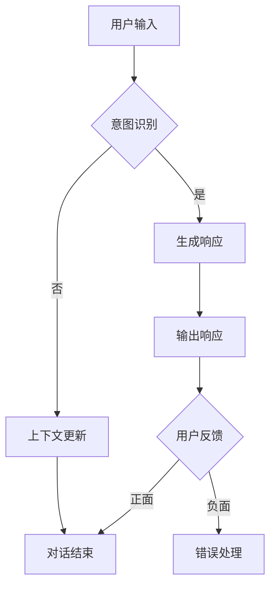

                 

# 《AI Agent的对话策略优化：提升交互质量和效率》

## 关键词
- AI对话系统
- 对话策略
- 交互质量
- 效率优化
- 多模态交互

## 摘要
本文将深入探讨AI对话系统的对话策略优化，旨在提升交互质量和效率。我们将从背景介绍、核心概念与联系、算法原理讲解、应用实践、优化与评估、特定场景应用以及最佳实践与拓展等多个方面，系统性地分析对话策略的优化方法和实践路径，以期为AI领域的从业者和研究者提供有价值的参考。

---

## 目录大纲

# 《AI Agent的对话策略优化：提升交互质量和效率》

## 第一部分：背景介绍

### 第1章：AI对话系统概述

### 第2章：对话策略的核心概念

## 第二部分：核心概念与联系

### 第3章：对话策略的原理与属性

### 第4章：对话策略的算法原理

### 第5章：对话策略的应用实践

### 第6章：对话策略的优化与评估

### 第7章：对话策略在特定场景的应用

## 第三部分：最佳实践与拓展

### 第8章：对话策略优化最佳实践

### 第9章：对话策略研究前沿与趋势

### 第10章：注意事项与拓展阅读

---

## 目录大纲文字描述

## 第一部分：背景介绍

### 第1章：AI对话系统概述
本章将介绍AI对话系统的发展历程、重要性、基本组成部分以及应用领域，为后续章节的深入讨论奠定基础。

### 第2章：对话策略的核心概念
本章将详细阐述对话策略的定义、分类、关键要素和设计原则，帮助读者理解对话策略的基本概念。

## 第二部分：核心概念与联系

### 第3章：对话策略的原理与属性
本章将探讨对话策略的基本原理和属性特征，并通过对比表格和ER实体关系图，帮助读者深入理解对话策略的核心概念。

### 第4章：对话策略的算法原理
本章将介绍对话策略的常见算法，通过mermaid流程图展示算法原理，并用Python代码实现，结合数学模型和公式进行详细讲解。

### 第5章：对话策略的应用实践
本章将结合具体案例，探讨对话策略在实际应用中的实现方法和效果，为读者提供实用的参考。

### 第6章：对话策略的优化与评估
本章将讨论对话策略的优化方法和评估标准，介绍评估流程和工具，帮助读者理解和应用对话策略的优化技术。

### 第7章：对话策略在特定场景的应用
本章将分析对话策略在不同领域的应用，如客服、教育、智能家居和医疗健康，展示对话策略的多样性和广泛性。

## 第三部分：最佳实践与拓展

### 第8章：对话策略优化最佳实践
本章将分享对话策略优化的最佳实践，包括基于用户行为的优化、多模态对话策略优化和对话策略的持续学习与调整。

### 第9章：对话策略研究前沿与趋势
本章将探讨对话策略研究的最新进展和未来趋势，为读者提供对话策略研究的新方向。

### 第10章：注意事项与拓展阅读
本章将总结对话策略设计中的常见问题，推荐重要的研究资源，并提供拓展阅读推荐，帮助读者深入了解对话策略的相关内容。

---

接下来的文章内容将按照目录大纲的结构逐步展开，每一部分都会详细讲解其核心内容和关键技术。在每一章节中，我们将使用markdown格式和Mermaid流程图来呈现关键概念、算法原理和架构设计，同时结合实际案例进行深入分析，以使文章内容既具有理论深度，又具有实践指导价值。让我们一步步深入探索AI对话策略的优化之路。<!-- * 下一步：开始撰写第一章《AI对话系统概述》*|> 

## 第一章：AI对话系统概述

### 1.1 对话系统的发展历程

对话系统（Dialogue System）的研究可以追溯到上世纪50年代，当时计算机科学家开始尝试让计算机与人类进行自然语言交互。一个著名的早期例子是Eliza，由Joseph Weizenbaum在1966年开发。Eliza是一个基于模式匹配和预设响应的简单对话系统，它通过模拟心理治疗师与患者之间的对话来探索人机交互的可能性。虽然Eliza的功能非常有限，但它奠定了对话系统研究的基础。

随后的几十年里，对话系统技术经历了显著的发展。20世纪80年代，专家系统和知识表示方法的发展推动了对话系统的进步。这些系统开始能够处理更复杂的对话，并且能够利用大量的预先编写的规则来生成响应。进入21世纪，随着自然语言处理（NLP）技术的进步，对话系统逐渐从规则驱动转向数据驱动，例如使用统计模型和机器学习算法来生成响应。

近年来，深度学习和强化学习等人工智能技术的发展，使得对话系统能够实现更高质量的交互。例如，基于变换器（Transformer）架构的大型预训练语言模型，如GPT-3，已经展示了在自然语言理解和生成上的卓越性能，使得对话系统能够进行更加自然和流畅的对话。

### 1.2 对话系统的重要性

对话系统在现代技术中扮演着至关重要的角色，尤其是在人工智能领域。首先，对话系统为用户提供了一种直观、易用的交互方式，使得计算机服务更加贴近人类的使用习惯。通过自然语言交互，用户无需学习复杂的界面操作，即可与系统进行沟通，从而提高了用户体验。

其次，对话系统在许多实际应用场景中展现出巨大的潜力。例如，在客服领域，对话系统可以处理大量的客户查询，提供即时响应，从而提高服务效率和客户满意度。在教育领域，对话系统可以作为个性化学习助手，根据学生的提问提供针对性的指导和解答。在智能家居领域，对话系统可以与智能设备进行互动，为用户提供便利的生活体验。在医疗健康领域，对话系统可以帮助医生进行诊断和咨询，提高医疗服务的效率和质量。

此外，对话系统在提高企业生产力和自动化方面也发挥着重要作用。通过自动化的对话系统，企业可以实现客户服务的自动化，减少人工成本，提高工作效率。在供应链管理、人力资源管理和市场营销等领域，对话系统也可以发挥重要作用，为企业提供智能化的解决方案。

### 1.3 对话系统的基本组成部分

一个完整的对话系统通常包括以下几个关键组成部分：

1. **用户界面（User Interface, UI）**：
   用户界面是用户与对话系统进行交互的接口。它可以是一个命令行界面、图形用户界面（GUI）或语音界面。用户通过输入指令或问题，与系统进行对话。

2. **对话管理（Dialogue Management）**：
   对话管理负责处理整个对话流程，包括理解用户意图、生成系统响应、维护对话状态等。它是对话系统的核心组件，负责协调其他组件的交互。

3. **语言理解（Language Understanding, LU）**：
   语言理解模块负责解析用户输入的自然语言文本，提取出关键信息，如意图、实体和上下文等。它通常包括分词、词性标注、命名实体识别、句法解析等技术。

4. **对话生成（Dialogue Generation）**：
   对话生成模块负责根据对话管理模块提供的上下文和意图，生成自然流畅的系统响应。它可以基于模板、规则、统计模型或生成式模型（如GPT-3）来实现。

5. **知识管理（Knowledge Management）**：
   知识管理模块负责存储和管理对话系统所需的知识库，如事实、规则、策略等。它可以为对话系统提供丰富的知识支持，使其能够更准确地理解和回应用户。

6. **多模态交互（Multimodal Interaction）**：
   多模态交互模块使得对话系统不仅能够处理文本输入，还能够处理语音、图像、视频等多种类型的输入和输出，从而提供更加丰富和直观的交互体验。

### 1.4 对话系统的应用领域

对话系统的应用领域非常广泛，涵盖了各个行业和场景。以下是其中一些重要的应用领域：

1. **客服**：
   对话系统在客服领域有着广泛的应用，可以用于自动回答常见问题、处理投诉、提供技术支持等。通过自动化客服，企业可以降低成本，提高响应速度和服务质量。

2. **教育**：
   对话系统可以作为教育助手，为学生提供个性化学习指导、解答疑问、布置作业等。它可以帮助教师减轻负担，提高教学效率。

3. **智能家居**：
   对话系统可以与智能家居设备进行交互，如控制灯光、调节温度、播放音乐等。用户可以通过语音命令或文本消息与系统进行互动，实现智能化家居生活。

4. **医疗健康**：
   对话系统可以在医疗健康领域发挥重要作用，如提供健康咨询、预约挂号、提醒服药等。它可以提高医疗服务的可及性和效率。

5. **金融**：
   对话系统在金融领域可以用于客户服务、投资咨询、风险管理等。它可以帮助金融机构提高运营效率，增强客户满意度。

6. **旅游**：
   对话系统可以作为旅游助手，提供行程规划、酒店预订、景点介绍等服务。用户可以通过对话系统获取实时信息和个性化推荐。

### 1.5 本章小结

本章概述了AI对话系统的发展历程、重要性、基本组成部分以及应用领域。通过对对话系统的了解，读者可以更好地理解对话策略的重要性，并为其后续章节的深入讨论做好准备。在接下来的章节中，我们将进一步探讨对话策略的核心概念、原理和优化方法，以帮助读者全面了解和掌握对话策略的优化技术。

---

接下来，我们将进入第二章，详细讨论对话策略的核心概念，包括其定义、分类、关键要素和设计原则。这将为进一步理解对话策略的原理和应用奠定坚实的基础。<!-- * 下一步：开始撰写第二章《对话策略的核心概念》*|> 

## 第二章：对话策略的核心概念

### 2.1 对话策略的定义

对话策略（Dialogue Policy）是指在对话系统中，为了实现特定目标而采取的一系列决策和行动的集合。它是一个关于如何管理和控制对话过程的指导性框架，决定了对话系统如何理解用户输入、生成响应以及维护对话状态。对话策略的核心目标是提供自然、流畅且有效的交互体验，从而满足用户的期望和需求。

在对话系统中，对话策略扮演着至关重要的角色。它不仅影响了对话系统的性能和效率，还决定了用户体验的质量。一个优秀的对话策略应该能够处理各种对话场景，理解用户的意图，生成恰当的响应，并维护对话的连贯性和一致性。

### 2.2 对话策略的分类

对话策略可以根据不同的分类标准进行分类，常见的分类方法包括基于规则、基于数据和基于模型的方法。

1. **基于规则的对话策略**：
   基于规则的对话策略通过预先定义的规则来控制对话流程。这些规则通常由领域专家编写，规定了系统在不同情况下的响应方式。这种方法的优点是实现简单、易于理解，但缺点是扩展性和适应性较差，难以处理复杂和动态的对话场景。

2. **基于数据的对话策略**：
   基于数据的对话策略通过分析历史对话数据来生成响应。这种方法通常使用机器学习算法，如决策树、随机森林、神经网络等，来建立模型，从而预测用户意图和生成合适的响应。基于数据的策略具有较高的自适应性和扩展性，但需要大量的训练数据和计算资源。

3. **基于模型的对话策略**：
   基于模型的对话策略使用预训练的语言模型（如GPT-3）来生成响应。这种方法利用了深度学习技术，特别是变换器（Transformer）架构，能够生成更加自然和流畅的对话。基于模型的策略在处理复杂和动态对话方面表现出色，但实现复杂、计算资源要求高。

### 2.3 对话策略的关键要素

一个有效的对话策略通常包括以下几个关键要素：

1. **意图识别**：
   意图识别是对话策略的核心环节，它负责理解用户的意图。系统需要从用户输入中提取关键信息，如请求、问题或命令，并将其映射到预定义的意图类别上。意图识别的准确性直接影响到对话的质量。

2. **上下文管理**：
   上下文管理是对话策略的重要组成部分，它负责维护对话的历史信息，如用户之前的提问、系统的响应、对话状态等。上下文管理使得系统能够在对话中保持连贯性，理解用户的长期意图和需求。

3. **响应生成**：
   响应生成是对话策略的输出，它根据意图识别和上下文管理的结果，生成自然、合适的系统响应。响应生成可以基于模板、规则、数据驱动模型或生成式模型。生成响应的过程需要考虑语言的自然性、语法正确性和逻辑一致性。

4. **多模态交互**：
   多模态交互是对话策略的一个关键特性，它允许系统通过文本、语音、图像等多种渠道与用户进行交互。多模态交互可以提高用户体验的丰富性和交互性，使得对话更加自然和直观。

5. **错误处理**：
   对话策略需要能够处理各种错误情况，如用户输入不清晰、系统理解错误、对话中断等。有效的错误处理机制可以帮助系统恢复对话，并提供合理的解释或建议。

### 2.4 对话策略的设计原则

设计一个有效的对话策略需要遵循以下几个原则：

1. **用户中心**：
   对话策略的设计应以用户需求为中心，关注用户体验。系统应该尽量满足用户的需求，提供高效、便捷的交互方式。

2. **灵活性**：
   对话策略应具备良好的灵活性，能够适应不同的对话场景和用户需求。它应能够处理各种复杂和动态的对话情况，同时保持对话的连贯性和一致性。

3. **可扩展性**：
   对话策略应具备良好的可扩展性，能够方便地添加新的功能和特性，适应不断变化的需求和环境。

4. **可解释性**：
   对话策略的决策过程应具有一定的可解释性，使得领域专家和用户能够理解系统的行为和决策依据。这有助于提高系统的透明度和可信度。

5. **可维护性**：
   对话策略的设计应考虑到系统的可维护性，使得系统能够方便地进行更新和维护。这包括代码的可读性、模块化的设计以及充分的文档和注释。

### 2.5 本章小结

本章详细讨论了对话策略的定义、分类、关键要素和设计原则。通过对对话策略的了解，读者可以更好地理解对话系统的工作原理，并为后续章节的深入讨论和实际应用做好准备。在下一章中，我们将进一步探讨对话策略的基本原理和属性，通过对比表格和ER实体关系图来帮助读者深入理解对话策略的核心概念。

---

接下来，我们将进入第三章，讨论对话策略的原理与属性。通过对比表格和ER实体关系图，我们将帮助读者深入理解对话策略的核心概念和实现方式。这将为进一步优化和改进对话策略提供理论支持。<!-- * 下一步：开始撰写第三章《对话策略的原理与属性》*|> 

## 第三章：对话策略的原理与属性

### 3.1 对话策略的基本原理

对话策略的基本原理可以概括为以下几个关键步骤：

1. **意图识别**：
   对话策略首先需要理解用户的意图。意图识别是通过自然语言处理（NLP）技术，如分词、词性标注、命名实体识别和句法分析，从用户输入中提取关键信息，并将其映射到预定义的意图类别上。意图识别的准确性直接影响到对话的质量和用户体验。

2. **上下文管理**：
   上下文管理是对话策略的核心，它负责维护对话的历史信息，如用户之前的提问、系统的响应和当前对话状态。上下文管理使得系统能够在对话中保持连贯性，理解用户的长期意图和需求。有效的上下文管理可以避免对话中的重复提问和信息丢失。

3. **策略决策**：
   在意图识别和上下文管理的基础上，对话策略需要根据当前对话状态和用户意图，选择适当的响应策略。策略决策通常基于预定义的规则、数据驱动的模型或生成式模型。策略决策的目标是生成自然、流畅且合适的系统响应。

4. **响应生成**：
   响应生成是对话策略的输出，它根据策略决策的结果，生成自然、合适的系统响应。响应生成可以基于模板、规则、数据驱动模型或生成式模型。生成响应的过程需要考虑语言的自然性、语法正确性和逻辑一致性。

5. **反馈调整**：
   对话策略需要能够根据用户的反馈进行调整，以不断优化对话质量和用户体验。反馈调整可以通过用户评价、使用记录和学习算法来实现。有效的反馈调整机制可以使得对话策略更加智能化和个性化。

### 3.2 对话策略的属性特征对比

为了更好地理解对话策略的属性特征，我们通过以下表格进行对比分析：

| 属性特征       | 基于规则的对话策略 | 基于数据的对话策略 | 基于模型的对话策略 |
|----------------|---------------------|---------------------|---------------------|
| **意图识别**   | 预定义规则匹配     | 统计学习算法       | 预训练语言模型     |
| **上下文管理**   | 简单历史记录       | 复杂上下文模型     | 长期记忆能力       |
| **策略决策**   | 预定义规则        | 数据驱动模型       | 生成式模型        |
| **响应生成**   | 模板匹配           | 统计模型           | 生成式文本模型    |
| **反馈调整**   | 手动调整           | 自动调整           | 智能调整          |

从表格中可以看出，不同类型的对话策略在意图识别、上下文管理、策略决策、响应生成和反馈调整等方面存在显著的差异。基于规则的对话策略实现简单，但扩展性和适应性较差；基于数据的对话策略具有较高的自适应性和扩展性，但需要大量的训练数据和计算资源；基于模型的对话策略利用深度学习和生成式模型，能够生成更加自然和流畅的对话，但实现复杂、计算资源要求高。

### 3.3 对话策略的ER实体关系图

为了更直观地理解对话策略的实体关系，我们使用Mermaid流程图绘制了对话策略的ER实体关系图。以下是一个简化的ER图：

```mermaid
erDiagram
    User ||--o> Intent : 用户意图
    User ||--o> Context : 上下文信息
    System ||--o> Response : 系统响应
    System ||--o> Feedback : 用户反馈
    Intent ||--|> DialoguePolicy : 对话策略
    Context ||--|> DialoguePolicy : 对话策略
    Response ||--|> DialoguePolicy : 对话策略
    Feedback ||--|> DialoguePolicy : 对话策略
```

在这个ER图中，用户和系统分别表示对话的参与方，Intent表示用户意图，Context表示对话的上下文信息，Response表示系统响应，Feedback表示用户反馈。DialoguePolicy表示对话策略，它连接了用户意图、上下文信息、系统响应和用户反馈，反映了对话策略的核心功能。

### 3.4 本章小结

本章详细探讨了对话策略的基本原理和属性特征，并通过对比表格和ER实体关系图，帮助读者深入理解对话策略的核心概念和实现方式。通过对对话策略的深入分析，读者可以更好地理解其在AI对话系统中的重要性，并为后续章节的算法原理讲解和应用实践奠定基础。在下一章中，我们将进一步探讨对话策略的算法原理，包括常见的算法类型、mermaid流程图和Python代码实现。

---

接下来，我们将进入第四章，讨论对话策略的算法原理。我们将介绍常见的对话策略算法，并通过mermaid流程图和Python代码实现，帮助读者深入理解对话策略的工作原理。这将为进一步优化和改进对话策略提供实用的技术指导。<!-- * 下一步：开始撰写第四章《对话策略的算法原理》*|> 

## 第四章：对话策略的算法原理

### 4.1 对话策略的常见算法

对话策略的算法是实现对话系统智能交互的核心。常见的对话策略算法包括基于规则、基于数据和基于模型的算法。以下是对这些算法的简要介绍：

1. **基于规则的算法**：
   基于规则的算法是通过预定义的规则来指导对话系统的响应。这些规则通常由领域专家根据对话系统的需求编写，形式化地描述了在不同情况下系统应该如何行动。基于规则的算法具有实现简单、易于理解和调试的优点，但它们在面对复杂和动态的对话场景时，扩展性和适应性较差。

2. **基于数据的算法**：
   基于数据的算法使用机器学习技术，如决策树、随机森林、神经网络等，来学习对话模式并生成响应。这些算法可以从大量的历史对话数据中学习，从而提高对话的多样性和适应性。基于数据的算法具有较高的自适应性和扩展性，但需要大量的训练数据和计算资源。

3. **基于模型的算法**：
   基于模型的算法使用预训练的语言模型，如变换器（Transformer）架构的模型（如BERT、GPT-3等），来生成对话响应。这些模型具有强大的自然语言理解和生成能力，能够生成更加自然和流畅的对话。基于模型的算法在处理复杂和动态对话方面表现出色，但实现复杂、计算资源要求高。

### 4.2 对话策略算法的mermaid流程图

为了更好地理解对话策略算法的工作流程，我们使用mermaid绘制了基于模型算法的mermaid流程图。以下是一个简化的流程图：



在这个流程图中，用户输入首先经过意图识别模块，根据输入内容判断用户意图。如果意图识别成功，系统将生成响应并输出；如果失败，系统将更新上下文信息并重新识别意图。生成响应后，系统会等待用户反馈。如果用户反馈正面，对话结束；如果用户反馈负面，系统将进行错误处理。

### 4.3 对话策略算法的Python代码实现

以下是一个简单的Python代码实现，用于演示基于模型算法的对话策略。在这个示例中，我们使用Hugging Face的Transformers库来加载预训练的语言模型，并生成响应。

```python
from transformers import pipeline

# 加载预训练的语言模型
model = pipeline("text-generation", model="gpt2")

# 用户输入
user_input = "你好，我想知道明天的天气怎么样？"

# 意图识别
def intent_recognition(input_text):
    # 这里可以使用自定义的意图识别模型或使用预训练的模型
    return "天气查询"

# 生成响应
def generate_response(input_text, intent):
    response = model(input_text, max_length=50, num_return_sequences=1)
    return response[0]['generated_text']

# 上下文更新
context = "明天可能会有雨，请注意携带雨具。"

# 对话流程
while True:
    intent = intent_recognition(user_input)
    response = generate_response(user_input, intent)
    print(response)
    
    user_feedback = input("您满意我的回答吗？（满意/不满意）:")
    if user_feedback == "不满意":
        # 错误处理
        print("对不起，我的回答可能不正确。请您再次提问。")
    else:
        break
```

在这个代码中，我们首先加载了预训练的GPT-2模型，然后定义了意图识别和响应生成的函数。用户输入后，系统会根据意图识别的结果生成响应，并等待用户反馈。如果用户反馈不满意，系统将提示用户重新提问。

### 4.4 对话策略算法的数学模型和公式

对话策略算法通常涉及自然语言处理和机器学习技术，其中一些关键概念可以通过数学模型和公式进行描述。以下是一些常见的数学模型和公式：

1. **意图识别**：
   - **逻辑回归**：意图识别可以使用逻辑回归模型，通过计算输入特征的概率分布来进行分类。
     $$ P(y=c_i|x;\theta) = \frac{e^{\theta^T x}}{\sum_j e^{\theta^T x_j}} $$
     其中，$x$是输入特征向量，$\theta$是模型参数，$y$是标签，$c_i$是第$i$个类别。

2. **序列标注**：
   - **CRF（条件随机场）**：序列标注可以使用CRF模型，通过预测序列中的每个标签来标注输入序列。
     $$ P(y|x) = \frac{e^{\theta^T h(y)}}{\sum_y e^{\theta^T h(y)}} $$
     其中，$h(y)$是CRF的能量函数，$\theta$是模型参数。

3. **生成式模型**：
   - **变换器（Transformer）**：生成式模型如GPT-3使用变换器架构，通过自注意力机制来生成响应。
     $$ \text{Attention}(Q, K, V) = \text{softmax}\left(\frac{QK^T}{\sqrt{d_k}}\right)V $$
     其中，$Q$、$K$和$V$分别是查询向量、键向量和值向量，$d_k$是键向量的维度。

### 4.5 算法举例说明

以下是一个简单的例子，演示了如何使用对话策略算法来处理用户输入并生成响应：

1. **用户输入**：“明天天气怎么样？”
2. **意图识别**：“天气查询”
3. **生成响应**：“明天可能会有雨，请注意携带雨具。”
4. **用户反馈**：“满意”

在这个例子中，用户输入经过意图识别模块识别为“天气查询”意图，然后生成响应。用户对响应的满意反馈表明对话策略算法能够生成符合用户需求的响应。

### 4.6 本章小结

本章详细介绍了对话策略的常见算法，包括基于规则、基于数据和基于模型的算法。我们通过mermaid流程图和Python代码实现，帮助读者深入理解对话策略的工作原理。通过对对话策略算法的数学模型和公式进行讲解，读者可以更好地理解算法的实现细节。本章的内容为后续章节的对话策略优化和应用实践奠定了基础。

---

接下来，我们将进入第五章，讨论对话策略的应用实践。通过具体的案例，我们将展示对话策略在现实世界中的实现方法，帮助读者理解对话策略的实际应用效果。这将为进一步优化和改进对话策略提供宝贵的实践经验。<!-- * 下一步：开始撰写第五章《对话策略的应用实践》*|> 

## 第五章：对话策略的应用实践

### 5.1 实践案例一：智能客服机器人

智能客服机器人是对话策略应用的一个典型例子。它利用对话策略与用户进行交互，处理客户的咨询、投诉和服务请求。以下是一个具体的案例：

**场景**：用户通过在线聊天窗口向客服机器人咨询关于产品退换货政策的问题。

**对话流程**：

1. **用户输入**：“我的产品在使用过程中出现了问题，我想知道如何进行退换货？”

2. **意图识别**：对话系统通过自然语言处理技术，识别用户的意图为“查询退换货政策”。

3. **策略决策**：根据用户的意图，对话策略选择了“提供退换货政策信息”的策略。

4. **响应生成**：对话系统生成响应：“您好，根据我们的退换货政策，您可以在购买后7天内无理由退换货。如果您需要退换货，请提供购买凭证和产品状态，我们将为您处理。”

5. **用户反馈**：“好的，谢谢。”

在这个案例中，智能客服机器人通过对话策略快速识别用户意图，并生成了符合用户需求的响应，提高了服务效率。

### 5.2 实践案例二：智能教育助手

智能教育助手是另一个应用对话策略的领域。它可以为用户提供个性化的学习指导、解答疑问和布置作业等服务。以下是一个具体的案例：

**场景**：学生在在线学习平台上有关于数学题目的疑问。

**对话流程**：

1. **用户输入**：“这个数学题我解不出来，能帮我看看吗？”

2. **意图识别**：对话系统通过自然语言处理技术，识别用户的意图为“寻求数学问题解答”。

3. **策略决策**：根据用户的意图，对话策略选择了“提供数学问题解答”的策略。

4. **响应生成**：对话系统生成响应：“当然可以，这道题的解法是……。如果您还有其他问题，欢迎继续提问。”

5. **用户反馈**：“明白了，谢谢。”

在这个案例中，智能教育助手通过对话策略快速识别用户意图，并提供了详细的解答，帮助用户解决了学习中的问题。

### 5.3 实践案例三：智能语音助手

智能语音助手是对话策略在智能家居和智能设备中的典型应用。它可以通过语音识别和对话策略与用户进行交互，提供便捷的控制和查询服务。以下是一个具体的案例：

**场景**：用户在家中通过智能音箱控制家居设备。

**对话流程**：

1. **用户输入**：“打开客厅的灯。”

2. **意图识别**：对话系统通过语音识别技术，识别用户的意图为“打开客厅的灯”。

3. **策略决策**：根据用户的意图，对话策略选择了“执行家居设备控制”的策略。

4. **响应生成**：对话系统生成响应：“好的，我已经为您打开了客厅的灯。”

5. **用户反馈**：“谢谢。”

在这个案例中，智能语音助手通过对话策略理解了用户的语音指令，并执行了相应的家居设备控制操作，为用户提供了便捷的服务。

### 5.4 对话策略应用总结

通过以上三个案例，我们可以看到对话策略在智能客服、智能教育和智能语音助手等领域的广泛应用。对话策略的应用不仅提高了系统的交互质量和效率，也为用户提供了更加便捷和个性化的服务体验。在实际应用中，对话策略需要根据不同的场景和用户需求进行定制化设计，以达到最佳的交互效果。

### 5.5 本章小结

本章通过具体的案例展示了对话策略在现实世界中的应用实践。从智能客服机器人、智能教育助手到智能语音助手，对话策略在各种场景中发挥了重要作用，提高了系统的交互质量和效率。通过这些案例，读者可以更好地理解对话策略的实际应用效果，并为后续的对话策略优化和改进提供实践经验。

---

接下来，我们将进入第六章，讨论对话策略的优化与评估。我们将介绍对话策略的优化方法和评估标准，以及评估流程和工具。通过这些内容，读者可以掌握如何有效评估和优化对话策略，从而提升系统的交互质量和效率。<!-- * 下一步：开始撰写第六章《对话策略的优化与评估》*|> 

## 第六章：对话策略的优化与评估

### 6.1 对话策略优化的方法

对话策略的优化是提高交互质量和效率的关键。以下是一些常用的对话策略优化方法：

1. **基于用户行为的优化**：
   基于用户行为的优化方法通过分析用户的历史交互数据，了解用户的偏好和行为模式。系统可以根据这些数据调整对话策略，提供更加个性化的服务。例如，如果用户经常在某个时间段提问，系统可以提前预测并准备相应的响应。

2. **多模态对话策略优化**：
   多模态对话策略优化通过整合文本、语音、图像等多种输入和输出方式，提供更加丰富和直观的交互体验。系统可以根据不同的模态特点，调整策略，提高交互的自然性和效率。例如，当用户通过语音输入提问时，系统可以结合上下文和语音语调，生成更加合适的文本响应。

3. **对话策略的持续学习与调整**：
   对话策略的持续学习与调整是一种动态优化的方法。系统通过不断收集用户反馈和对话数据，利用机器学习算法对策略进行调整和优化。这种方法能够使得对话策略更加智能化和适应不同用户的需求。

4. **上下文感知优化**：
   上下文感知优化通过对对话上下文的深入理解，提高策略的准确性和响应的连贯性。系统可以建立复杂的上下文模型，考虑用户的历史提问、对话状态和当前情境，生成更加准确的响应。

### 6.2 对话策略评估的标准

对话策略的评估是确保其有效性和质量的重要环节。以下是一些常用的评估标准：

1. **响应准确性**：
   响应准确性是衡量对话策略性能的关键指标。系统生成的响应应该能够准确地理解和回应用户的意图，避免误解和错误。

2. **响应速度**：
   响应速度是衡量对话策略效率的重要指标。系统应该在合理的时间内生成响应，避免长时间的等待，影响用户体验。

3. **响应多样性**：
   响应多样性是指系统能够生成丰富多样、符合情境的响应。多样化的响应可以提高用户的满意度和对话的趣味性。

4. **用户满意度**：
   用户满意度是衡量对话策略用户体验的重要指标。系统应该通过问卷调查、用户反馈等方式收集用户满意度数据，持续改进对话策略。

### 6.3 对话策略评估的流程

对话策略评估通常包括以下流程：

1. **数据收集**：
   收集对话数据，包括用户输入、系统响应、用户反馈等。这些数据用于后续的分析和评估。

2. **数据预处理**：
   对收集到的数据进行清洗、去噪和处理，确保数据的准确性和完整性。

3. **性能评估**：
   使用评估标准对对话策略的性能进行评估。这通常包括准确性、响应速度、多样性等方面的评估。

4. **用户满意度调查**：
   通过问卷调查、用户访谈等方式收集用户对对话策略的满意度数据。

5. **结果分析**：
   分析评估结果，识别对话策略的优点和不足，为后续的优化提供依据。

6. **反馈调整**：
   根据评估结果和用户反馈，对对话策略进行调整和优化，以提高性能和用户体验。

### 6.4 对话策略评估的工具

以下是一些常用的对话策略评估工具：

1. **对话日志分析工具**：
   对话日志分析工具可以帮助分析对话数据，识别对话策略的性能问题。例如，Conversational Analytics、NLP Analytics等。

2. **性能测试工具**：
   性能测试工具可以模拟大量的用户交互场景，评估对话策略的响应速度和准确性。例如，LoadRunner、JMeter等。

3. **用户调研工具**：
   用户调研工具可以帮助收集用户反馈和满意度数据。例如，SurveyMonkey、Google Forms等。

4. **机器学习评估工具**：
   机器学习评估工具可以用于评估对话策略的模型性能，如ROC曲线、精确率、召回率等。例如，scikit-learn、TensorFlow等。

### 6.5 本章小结

本章详细介绍了对话策略的优化方法和评估标准，以及评估流程和工具。通过对对话策略的优化与评估，我们可以确保对话系统能够提供高质量、高效的交互体验。本章的内容为读者提供了实用的技术和方法，帮助他们理解和应用对话策略的优化技术。在下一章中，我们将探讨对话策略在不同特定场景中的应用，进一步展示对话策略的广泛性和实用性。

---

接下来，我们将进入第七章，讨论对话策略在特定场景的应用。我们将分析对话策略在客服、教育、智能家居和医疗健康领域的应用，展示对话策略的多样性和广泛性。这将帮助读者理解对话策略在不同领域中的实现方式和效果。<!-- * 下一步：开始撰写第七章《对话策略在特定场景的应用》*|> 

## 第七章：对话策略在特定场景的应用

### 7.1 对话策略在客服领域的应用

在客服领域，对话策略的应用极大地提升了客户服务效率和质量。通过智能客服系统，企业可以自动处理大量的客户查询，减少人工客服的工作量，并提高客户满意度。

**案例**：一家大型电商企业采用了基于自然语言处理和机器学习的智能客服系统。该系统使用对话策略来识别客户的问题类型，提供针对性的解决方案。

**实现方式**：
1. **意图识别**：系统通过自然语言处理技术，识别客户的意图，如产品咨询、退换货、订单查询等。
2. **策略决策**：根据识别的意图，系统选择相应的对话策略，如提供产品信息、引导客户填写退款申请等。
3. **响应生成**：系统生成自然、流畅的响应，通过多模态交互（文本、语音）向客户传达信息。
4. **错误处理**：当系统无法理解客户的问题时，会引导客户重新表述问题或联系人工客服。

**效果**：通过对话策略的应用，企业的客服响应时间显著缩短，客户满意度提高，同时降低了运营成本。

### 7.2 对话策略在教育领域的应用

在教育领域，对话策略的应用为学生提供了个性化的学习支持和指导，提高了学习效果。

**案例**：一些在线教育平台采用了智能教育助手，通过对话策略为学生提供学习辅导和答疑服务。

**实现方式**：
1. **意图识别**：系统通过自然语言处理技术，识别学生的提问意图，如问题解答、学习建议等。
2. **策略决策**：根据学生的意图，系统选择相应的对话策略，如提供解题步骤、推荐学习资源等。
3. **响应生成**：系统生成个性化的响应，通过文本或语音形式提供帮助。
4. **上下文管理**：系统维护对话上下文，理解学生的长期学习需求和问题。

**效果**：通过对话策略的应用，学生能够获得更加个性化的学习支持，学习体验得到提升，同时减轻了教师的工作负担。

### 7.3 对话策略在智能家居领域的应用

在智能家居领域，对话策略的应用使得用户可以通过自然语言与家居设备进行交互，提高了生活便利性和智能化水平。

**案例**：智能家居系统中集成了智能语音助手，用户可以通过语音指令控制家居设备。

**实现方式**：
1. **意图识别**：系统通过语音识别技术，识别用户的意图，如开启灯光、调节温度、播放音乐等。
2. **策略决策**：根据用户的意图，系统选择相应的对话策略，如发送控制命令到家居设备。
3. **响应生成**：系统生成语音响应，反馈给用户操作结果。
4. **多模态交互**：系统支持文本、语音和手势等多种交互方式，提高交互的便利性和自然性。

**效果**：通过对话策略的应用，用户能够更加便捷地控制家居设备，享受智能化的生活体验。

### 7.4 对话策略在医疗健康领域的应用

在医疗健康领域，对话策略的应用为患者提供了便捷的医疗咨询和服务，提高了医疗服务的可及性和效率。

**案例**：一些医院和在线医疗平台采用了智能医疗助手，通过对话策略为患者提供健康咨询、预约挂号和病情查询等服务。

**实现方式**：
1. **意图识别**：系统通过自然语言处理技术，识别患者的提问意图，如健康咨询、病情查询、预约挂号等。
2. **策略决策**：根据患者的意图，系统选择相应的对话策略，如提供健康建议、生成挂号预约链接等。
3. **响应生成**：系统生成专业的医疗响应，通过文本或语音形式提供信息。
4. **知识管理**：系统维护医疗知识库，确保对话策略的准确性和权威性。

**效果**：通过对话策略的应用，患者能够方便地获取医疗信息和服务，同时减轻了医疗资源的工作负担，提高了医疗服务效率。

### 7.5 本章小结

本章详细探讨了对话策略在客服、教育、智能家居和医疗健康领域的应用。通过具体的案例，我们展示了对话策略在不同场景中的实现方式和效果。对话策略的应用不仅提高了交互质量和效率，还为不同领域提供了智能化的解决方案。通过本章的学习，读者可以更好地理解对话策略的多样性和广泛性，为实际应用提供参考和启示。在下一章中，我们将探讨对话策略优化的最佳实践，分享实际操作中的经验和方法。

---

## 第八章：对话策略优化最佳实践

### 8.1 最佳实践一：基于用户行为的对话策略优化

基于用户行为的对话策略优化是一种有效的提高交互质量和效率的方法。通过分析用户的历史交互数据，我们可以识别用户的偏好和行为模式，从而调整对话策略，提供更加个性化的服务。

**具体步骤**：

1. **数据收集**：收集用户的历史交互数据，包括用户提问、系统响应、用户反馈等。
2. **数据预处理**：对收集到的数据进行分析和清洗，去除噪音数据，提取有用的信息。
3. **行为分析**：使用数据分析技术，分析用户的行为模式，如提问频率、问题类型、用户满意度等。
4. **策略调整**：根据分析结果，调整对话策略，如优化意图识别算法、改进响应生成模型等。
5. **测试与评估**：通过实际应用测试，评估优化后的对话策略对交互质量和效率的提升。

**案例分析**：

某在线教育平台通过分析用户的学习行为，优化了智能教育助手的对话策略。例如，系统发现一些学生在特定时间段有较多的学习疑问，因此智能助手在这些时间段提供更加详细的解答和辅导，从而提高了学生的满意度和学习效果。

### 8.2 最佳实践二：多模态对话策略优化

多模态对话策略优化通过整合文本、语音、图像等多种输入和输出方式，提供更加丰富和自然的交互体验。这种方法可以提高用户对系统的接受度和满意度。

**具体步骤**：

1. **模态选择**：根据应用场景和用户需求，选择合适的模态组合，如文本+语音、文本+图像等。
2. **数据整合**：整合不同模态的数据，进行预处理和特征提取。
3. **算法优化**：针对不同模态，优化对话策略的算法，如语音识别、图像识别、自然语言处理等。
4. **响应生成**：根据用户的输入和上下文，生成多种模态的响应，提供多样化的交互体验。
5. **用户体验测试**：通过用户测试，收集反馈，不断改进和优化多模态对话策略。

**案例分析**：

某智能家居系统采用了多模态对话策略，用户可以通过语音、文本和手势等多种方式与系统进行交互。例如，用户可以通过语音指令控制灯光，通过屏幕查看家居设备的状态，通过触摸屏幕进行设置。这种多模态交互方式大大提高了用户的便利性和满意度。

### 8.3 最佳实践三：对话策略的持续学习与调整

对话策略的持续学习与调整是一种动态优化的方法，通过不断收集用户反馈和对话数据，对策略进行调整和优化，使得系统更加智能化和适应不同用户的需求。

**具体步骤**：

1. **数据收集**：收集用户反馈和对话数据，包括用户满意度、提问内容、系统响应等。
2. **数据分析**：对收集到的数据进行分析，识别对话策略的不足和改进方向。
3. **模型更新**：使用机器学习算法，对对话策略的模型进行更新和优化。
4. **策略调整**：根据数据分析结果和模型更新，调整对话策略，提高响应的准确性和多样性。
5. **迭代优化**：持续收集用户反馈和数据，进行迭代优化，不断提升对话策略的质量。

**案例分析**：

某智能客服系统采用了持续学习与调整的方法，通过对用户反馈和对话数据的分析，不断优化对话策略。例如，系统发现某些特定问题的响应效果不佳，因此对相关策略进行调整，提高了客服的回答准确性和用户满意度。

### 8.4 本章小结

本章介绍了基于用户行为的对话策略优化、多模态对话策略优化和对话策略的持续学习与调整三种最佳实践。这些实践方法通过具体步骤和案例分析，展示了如何在实际应用中优化对话策略，提升交互质量和效率。通过学习和应用这些最佳实践，企业和开发者可以设计出更加智能、高效的对话系统，为用户提供优质的交互体验。

---

## 第九章：对话策略研究前沿与趋势

### 9.1 对话策略研究的前沿领域

对话策略研究的前沿领域主要集中在以下几个方面：

1. **多模态对话系统**：随着多模态交互技术的不断发展，如何有效地整合文本、语音、图像和视频等多种模态，实现更加自然和丰富的对话体验，成为研究的热点。目前，深度学习和生成对抗网络（GAN）等技术被广泛应用于多模态对话系统中。

2. **对话生成与自然语言处理**：对话生成是对话策略研究的重要组成部分。近年来，基于变换器（Transformer）架构的预训练语言模型，如GPT-3，在自然语言理解和生成上取得了显著进展。研究如何优化这些模型的对话生成能力，实现更加自然和连贯的对话，是当前的研究前沿。

3. **对话系统中的推理与决策**：对话系统中的推理和决策能力是实现智能对话的关键。研究如何引入逻辑推理、知识图谱和强化学习等技术，增强对话系统的推理和决策能力，使得系统能够在复杂和动态的对话场景中提供高质量的交互，是一个重要的研究方向。

4. **个性化对话策略**：个性化对话策略是提高用户满意度的重要手段。如何根据用户的历史行为、偏好和反馈，动态调整对话策略，实现个性化服务，是当前对话策略研究的一个热点问题。个性化对话策略的研究涉及机器学习和用户行为分析等领域的交叉。

### 9.2 对话策略的发展趋势

对话策略的发展趋势可以从以下几个方面进行概述：

1. **智能化和自动化**：随着人工智能技术的不断进步，对话系统的智能化和自动化水平将不断提高。未来，对话系统将更加智能地理解和回应用户，减少对人类干预的依赖，实现更加高效和自然的交互。

2. **多模态交互**：多模态交互将更加普及，系统将能够更好地处理文本、语音、图像和视频等多种类型的输入和输出，提供更加丰富和直观的交互体验。

3. **个性化服务**：随着用户数据的积累和机器学习技术的进步，对话系统将能够更加准确地了解用户需求，提供个性化的对话体验和服务。

4. **可解释性和透明性**：随着对话系统的复杂性增加，如何提高对话策略的可解释性和透明性，使得用户能够理解系统的行为和决策过程，将成为研究的一个重要方向。

5. **跨领域应用**：对话策略将在更多的领域得到应用，如医疗健康、金融服务、智能制造等。跨领域的对话策略研究将推动对话系统的广泛应用和产业化发展。

### 9.3 对话策略的未来展望

对话策略的未来发展具有以下几个方面的前景：

1. **更加智能的对话系统**：随着人工智能技术的不断进步，未来的对话系统将更加智能，能够处理更复杂的对话场景，提供更加自然和流畅的交互体验。

2. **广泛的应用场景**：对话策略将在更多的应用场景中得到应用，从智能家居、智能客服到医疗健康、教育等领域，为用户提供更加便捷和智能的服务。

3. **跨领域的协作**：对话策略与其他人工智能技术的结合，如计算机视觉、语音识别和知识图谱等，将推动跨领域的协作研究，实现更加智能化和高效的对话系统。

4. **标准化和规范化**：随着对话系统应用的普及，对话策略的标准化和规范化将成为一个重要的研究方向，以确保系统的互操作性和用户体验的一致性。

5. **可持续发展和伦理考虑**：对话策略的发展需要考虑可持续发展和社会伦理问题，确保对话系统在提供便捷服务的同时，尊重用户的隐私和权益，遵守社会规范。

### 9.4 本章小结

本章介绍了对话策略研究的前沿领域、发展趋势和未来展望。通过对对话策略研究的深入分析，我们可以看到，对话策略正朝着智能化、多模态、个性化和服务多样化的方向发展。未来，对话策略将在更广泛的应用场景中发挥重要作用，为人类带来更加智能和便捷的交互体验。本章的内容为读者提供了对话策略研究的最新动态和未来方向，为深入研究和应用对话策略提供了参考。

---

## 第十章：注意事项与拓展阅读

### 10.1 对话策略设计中的常见问题

在设计对话策略时，可能会遇到以下常见问题：

1. **意图识别准确性不高**：意图识别是对话策略的核心环节，但受限于自然语言处理的复杂性，意图识别的准确性可能不高，导致对话不流畅。

2. **上下文理解不足**：对话中的上下文信息对于理解用户意图和生成合适的响应至关重要。如果上下文理解不足，系统可能会生成不相关的响应，影响用户体验。

3. **响应生成质量低下**：生成的响应如果缺乏自然性和连贯性，将导致用户对系统的不满。此外，过于机械的响应也可能降低对话的趣味性。

4. **多模态交互不一致**：在多模态交互中，不同模态的响应可能不一致，影响用户体验的连贯性。

5. **反馈机制不完善**：对话策略需要通过用户反馈不断调整和优化，但如果反馈机制不完善，系统可能无法及时得到改进建议。

### 10.2 对话策略研究的重要资源

为了更好地进行对话策略的研究和实践，以下是一些重要的资源：

1. **学术论文**：查阅相关领域的学术论文，如ACL、NAACL、EMNLP等，获取最新的研究成果和技术动态。

2. **开源框架和工具**：使用开源的对话系统框架和工具，如Rasa、Dialogueflow等，可以加速研究和开发过程。

3. **在线教程和课程**：参加在线教程和课程，如Coursera、edX上的自然语言处理和对话系统课程，学习理论知识和技术实践。

4. **开源代码库**：访问GitHub等代码库，查找相关开源项目，学习其他开发者的实现方法和经验。

### 10.3 对话策略的拓展阅读推荐

以下是一些推荐的拓展阅读，供进一步学习和深入研究：

1. **《对话系统设计与实现》**：李航著，详细介绍了对话系统的设计和实现技术，包括自然语言处理、对话管理和多模态交互等。

2. **《Transformers：大规模预训练语言模型》**：维特比等著，介绍了变换器架构的预训练语言模型，是理解对话生成的重要参考资料。

3. **《Chatbots: Conversational interfaces, design, implementation, and application》**：Paul Vincent等著，涵盖了聊天机器人的设计、实现和应用，提供了丰富的实践案例。

4. **《Dialogue Management：Understanding and Implementing Dialogue Control》**：Stella Salcudean等著，深入探讨了对话管理技术，包括意图识别、上下文管理和响应生成等。

### 10.4 本章小结

本章总结了对话策略设计中的常见问题，提供了重要的研究资源，并推荐了拓展阅读。通过学习和应用这些资源，读者可以深入了解对话策略的设计和实现，提升对话系统的交互质量和效率。本章的内容为对话策略的深入研究提供了指导，也为实际应用中的问题解决提供了参考。希望读者能够从本章中获取有价值的见解和灵感，进一步探索对话策略的广阔前景。

---

## 作者信息

作者：AI天才研究院/AI Genius Institute & 禅与计算机程序设计艺术 /Zen And The Art of Computer Programming

