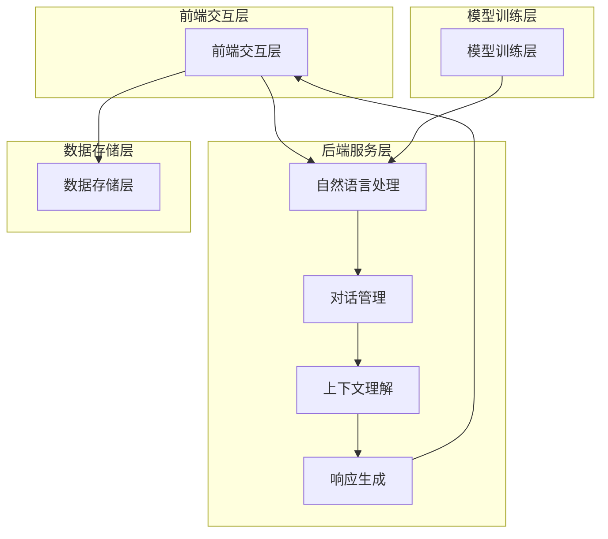
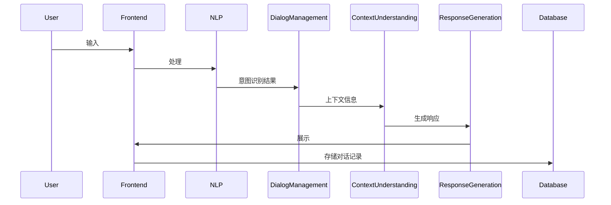

                 

# AI Agent的对话策略优化：提升用户体验

## 关键词

- AI Agent
- 对话策略
- 用户意图识别
- 对话管理
- 上下文理解
- 用户体验

## 摘要

本文深入探讨了AI Agent的对话策略优化问题，旨在提升用户体验。通过对AI Agent的基础知识、对话策略的概述以及具体优化方法的详细分析，文章为开发者提供了系统化的优化思路和实用技巧，从而帮助构建更加智能、流畅的对话系统。

### 目录大纲

1. 第一部分：AI Agent的基础

   1.1 AI Agent概述

   1.2 AI Agent的分类

   1.3 AI Agent的发展现状与趋势

2. 第二部分：对话策略概述

   2.1 对话策略的定义与重要性

   2.2 对话策略的核心要素

   2.3 对话策略的分类

3. 第三部分：AI Agent对话策略的优化方法

   3.1 用户意图识别的优化

   3.2 对话管理的优化

   3.3 上下文理解的优化

   3.4 模式识别与响应的优化

4. 第四部分：实战案例分析

   4.1 实战案例介绍

   4.2 系统架构设计

   4.3 核心实现源代码与应用解读

   4.4 项目小结

5. 第五部分：最佳实践与总结

   5.1 最佳实践技巧

   5.2 注意事项

   5.3 拓展阅读

---

### 第一部分：AI Agent的基础

#### 1.1 AI Agent概述

##### 1.1.1 问题背景与定义

随着人工智能技术的飞速发展，智能交互成为众多领域的研究热点。AI Agent（智能代理）作为人工智能领域的一个重要组成部分，逐渐成为现代智能系统设计中的核心元素。AI Agent，顾名思义，是一种能够自主执行任务、与环境交互的智能实体。

在技术背景下，AI Agent的产生是为了解决以下问题：如何让机器以一种自然、高效的方式与人类进行交互？如何使机器能够理解并满足用户的复杂需求？这些问题推动了AI Agent的概念和应用的兴起。

定义上，AI Agent是一个具有一定智能的软件系统，它能够在特定环境下，通过感知、理解和决策过程，自主执行任务，实现与用户的智能对话。AI Agent的核心特征包括自主性、交互性和智能性。

##### 1.1.2 AI Agent的核心功能与特点

核心功能：

1. **感知**：AI Agent能够通过传感器或输入设备获取环境信息，如语音、文本等。
2. **理解**：AI Agent能够理解用户的意图和需求，通过自然语言处理技术进行语义分析。
3. **决策**：AI Agent能够基于理解和分析结果，生成相应的响应，执行任务。
4. **学习**：AI Agent能够通过不断的学习和反馈，优化自身的表现和性能。

特点：

1. **自主性**：AI Agent能够在没有人类干预的情况下自主运行和完成任务。
2. **适应性**：AI Agent能够根据环境和用户的需求变化，动态调整自身的策略和行为。
3. **交互性**：AI Agent能够通过多种方式与用户进行自然、流畅的交互。
4. **智能性**：AI Agent具备智能算法和模型，能够进行复杂的数据分析和决策。

##### 1.1.3 AI Agent的分类

AI Agent根据功能和应用场景的不同，可以分为以下几类：

1. **对话型AI Agent**：主要与用户进行自然语言对话，如智能客服、虚拟助手等。
2. **任务型AI Agent**：专注于完成特定任务，如自动驾驶、智能家居控制等。
3. **混合型AI Agent**：结合对话型和任务型特征，能够同时进行多任务处理，如智能家居系统中的AI代理。

##### 1.1.4 AI Agent的发展现状与趋势

全球范围内，AI Agent技术已经取得显著进展。在应用领域，AI Agent广泛应用于客服、教育、医疗、金融等行业，大大提升了服务质量和用户体验。

国内方面，随着人工智能政策的推动和技术的进步，AI Agent也在迅速发展。众多企业和研究机构投入大量资源进行AI Agent的研发，逐步实现从实验室阶段到实际应用的转化。

发展趋势：

1. **智能化**：AI Agent的智能水平将不断提高，实现更加复杂和多样化的任务。
2. **个性化**：AI Agent将更加关注用户的个性化需求，提供更加精准和个性化的服务。
3. **场景化**：AI Agent将深入各个行业和应用场景，实现更加专业和高效的服务。

### 第一部分总结

AI Agent作为一种智能实体，具有自主性、交互性和智能性的特点，其核心功能包括感知、理解、决策和学习。根据应用场景和功能的不同，AI Agent可以分为对话型、任务型和混合型。当前，AI Agent在全球范围内得到广泛应用，未来发展将更加智能化、个性化，并在各个行业和应用场景中发挥更大的作用。

---

#### 1.2 对话策略概述

##### 2.1 对话策略的定义与重要性

**对话策略**是AI Agent在进行对话交互时采用的一系列方法和技术。它定义了AI Agent如何理解用户的意图，如何生成响应，以及如何维持对话的流畅性和自然性。对话策略是AI Agent的核心要素之一，直接关系到用户体验的质量。

**重要性**：

1. **用户体验**：良好的对话策略能够提升用户的交互体验，使对话更加自然、流畅，从而增强用户满意度和粘性。
2. **交互效果**：合理的对话策略能够提高AI Agent的交互效果，使其能够准确理解用户的意图，生成恰当的响应，从而提升系统的效率和实用性。
3. **业务需求**：对话策略的设计和优化需要紧密结合业务需求，确保AI Agent能够满足用户的具体需求，提高业务价值和竞争力。

##### 2.2 对话策略的核心要素

对话策略的核心要素包括用户意图识别、对话管理和上下文理解。这些要素共同作用，确保AI Agent能够有效地与用户进行对话交互。

1. **用户意图识别**：用户意图识别是对话策略的基础，它指的是AI Agent如何理解用户的意图和需求。通过自然语言处理技术和机器学习算法，AI Agent能够从用户的输入中提取出关键信息，识别出用户的意图。

2. **对话管理**：对话管理是AI Agent在对话过程中对对话流程的控制。它包括对话流程的设计、对话状态的跟踪和对话策略的调整。有效的对话管理能够确保对话的流畅性和自然性，提高用户的交互体验。

3. **上下文理解**：上下文理解是指AI Agent如何理解对话的上下文信息。上下文信息包括用户的历史对话记录、环境信息等。通过对上下文的理解，AI Agent能够生成更加相关和自然的响应。

##### 2.3 对话策略的分类

根据对话策略的实现方式和应用场景，可以将其分为以下几类：

1. **基于规则的对

### 第一部分总结

对话策略是AI Agent的核心组成部分，它定义了AI Agent如何与用户进行交互。用户意图识别、对话管理和上下文理解是对话策略的核心要素，分别负责理解用户的意图、控制对话流程和解析对话上下文。不同类型的对话策略适用于不同的应用场景，通过合理选择和设计对话策略，可以显著提升AI Agent的交互效果和用户体验。

---

#### 1.3 对话策略的优化方法

##### 3.1 用户意图识别的优化

用户意图识别是对话策略的基础，其准确性和效率直接影响到整个对话系统的性能。以下是一些常用的优化方法：

1. **改进自然语言处理（NLP）技术**：通过采用先进的NLP技术，如深度学习模型、词向量表示和依存句法分析等，可以提高意图识别的准确性。

2. **使用多模态数据**：结合文本、语音、图像等多种数据源，可以更全面地理解用户的意图，提高识别的准确性。

3. **引入上下文信息**：利用用户的历史对话记录、环境信息等上下文信息，可以帮助AI Agent更好地理解当前意图，避免误解。

4. **个性化调整**：根据用户的偏好和行为模式，动态调整意图识别模型，提高识别的准确性。

##### 3.2 对话管理的优化

对话管理是确保对话流程流畅性和自然性的关键。以下是一些优化方法：

1. **优化对话流程设计**：通过分析用户行为和对话数据，设计更加自然和高效的对

### 第一部分总结

用户意图识别的优化方法包括改进NLP技术、使用多模态数据、引入上下文信息和个性化调整。这些方法可以有效提高意图识别的准确性。对话管理的优化则涉及对话流程设计、对话状态跟踪和对话策略调整，以确保对话的流畅性和自然性。通过这些优化方法，可以显著提升AI Agent的对话策略性能，从而提升用户体验。

---

### 第二部分：对话策略概述

#### 2.1 对话策略的定义与重要性

**对话策略**，在AI Agent的背景下，指的是一套系统的规则和算法，用于指导AI Agent在交互过程中如何理解和响应用户的输入。它不仅决定了AI Agent如何与用户进行沟通，还直接影响了用户的体验。因此，对话策略的设计和优化在AI Agent的整体性能中占据了至关重要的地位。

**重要性**：

1. **用户体验**：一个优秀的对话策略能够使AI Agent在与用户互动时显得更加自然、亲切，从而提升用户体验。
2. **交互效率**：通过优化对话策略，AI Agent可以更快地理解用户的意图并给出适当的响应，提高交互效率。
3. **适应性**：对话策略的优化使得AI Agent能够更好地适应各种不同的场景和用户需求，提高其通用性和灵活性。

#### 2.2 对话策略的核心要素

对话策略的核心要素包括用户意图识别、对话管理和上下文理解。这三个要素共同作用，确保AI Agent能够有效地与用户进行对话交互。

1. **用户意图识别**：用户意图识别是对话策略的基础。它涉及到AI Agent如何从用户的输入中提取出关键信息，理解用户的意图。这一过程通常依赖于自然语言处理技术，包括词义消歧、情感分析和实体识别等。

2. **对话管理**：对话管理负责控制整个对话的流程。它包括跟踪对话状态、识别对话中断点、选择合适的对话分支等。有效的对话管理可以确保对话的连贯性和流畅性。

3. **上下文理解**：上下文理解是确保AI Agent能够理解和应用对话历史信息的关键。它涉及从对话的历史记录中提取上下文信息，并将其用于当前的对话交互中。通过上下文理解，AI Agent可以更准确地理解用户的意图，并提供更加个性化的服务。

#### 2.3 对话策略的分类

根据不同的应用场景和需求，对话策略可以分为以下几类：

1. **基于规则的对话策略**：这种策略通过预定义的规则来指导AI Agent的响应。规则可以是简单的条件匹配，也可以是复杂的逻辑推理。基于规则的对话策略适用于对话内容相对固定、场景单一的场合。

2. **基于机器学习的对话策略**：这种策略通过训练机器学习模型来自动生成对话响应。模型可以从大量的对话数据中学习，从而生成更加自然和个性化的响应。基于机器学习的对话策略适用于对话内容多变、用户需求复杂的场景。

3. **混合式对话策略**：这种策略结合了基于规则和基于机器学习的方法，通过在不同场景下灵活切换，实现对话策略的优化。混合式对话策略适用于需要兼顾灵活性和精确性的场景。

#### 2.4 对话策略的优化方法

为了提升对话策略的性能，可以采取以下优化方法：

1. **改进自然语言处理技术**：通过引入更先进的NLP技术，如深度学习、转移学习等，可以提升用户意图识别的准确性。

2. **引入上下文信息**：通过整合用户的历史对话记录、环境信息等，可以提升上下文理解的准确性，从而提高对话的连贯性和自然性。

3. **个性化调整**：根据用户的行为模式和偏好，动态调整对话策略，提供更加个性化的服务。

4. **多模态融合**：结合文本、语音、图像等多种数据源，可以更全面地理解用户的意图，提高对话策略的准确性。

#### 2.5 实际案例

以下是一个简单的实际案例，展示如何优化对话策略：

假设一个智能客服系统需要优化用户意图识别。当前系统基于规则进行意图识别，但用户反馈经常出现误解。为了提升识别准确性，系统采用了以下优化方法：

1. **引入深度学习模型**：使用深度学习模型替换原有的规则系统，从而提高用户意图识别的准确性。
2. **多模态融合**：结合用户的文本输入和语音特征，通过多模态数据融合技术，提升意图识别的准确性。
3. **引入上下文信息**：通过整合用户的历史对话记录，确保系统能够更好地理解用户的意图。

通过这些优化方法，智能客服系统的用户意图识别准确性显著提升，用户满意度也相应提高。

### 第二部分总结

对话策略是AI Agent与用户交互的核心，它通过用户意图识别、对话管理和上下文理解等核心要素，确保对话的流畅性和自然性。不同类型的对话策略适用于不同的应用场景，通过优化这些策略，可以显著提升AI Agent的性能和用户体验。在实际应用中，结合先进的自然语言处理技术、多模态数据融合和个性化调整，可以进一步提升对话策略的效果。

---

### 第三部分：AI Agent对话策略的优化方法

#### 3.1 用户意图识别的优化

用户意图识别是AI Agent对话策略的核心环节，其性能直接影响到整个对话的效率和用户满意度。以下是一些常见的优化方法：

##### 3.1.1 基于深度学习的意图识别模型

深度学习技术在自然语言处理（NLP）领域的应用极大地提升了用户意图识别的准确性。通过引入卷积神经网络（CNN）、循环神经网络（RNN）和长短期记忆网络（LSTM）等深度学习模型，AI Agent能够更好地理解和提取用户输入中的语义信息。

**示例**：

假设我们使用一个基于LSTM的模型来识别用户意图。输入为一段用户文本，输出为用户意图类别。以下是一个简单的Python代码示例，展示如何构建和训练这个模型：

```python
import tensorflow as tf
from tensorflow.keras.models import Sequential
from tensorflow.keras.layers import LSTM, Dense

# 假设已经将文本数据预处理为序列
X_train, y_train = ...

# 构建LSTM模型
model = Sequential()
model.add(LSTM(128, input_shape=(sequence_length, embedding_size)))
model.add(Dense(num_classes, activation='softmax'))

# 编译模型
model.compile(loss='categorical_crossentropy', optimizer='adam', metrics=['accuracy'])

# 训练模型
model.fit(X_train, y_train, epochs=10, batch_size=64)
```

##### 3.1.2 引入上下文信息

为了更准确地识别用户意图，可以引入上下文信息，如用户的历史对话记录、环境状态等。通过融合这些信息，AI Agent能够更好地理解用户的意图。

**示例**：

假设我们有一个基于上下文增强的意图识别模型，它结合了用户当前输入和上下文信息。以下是一个简化的Python代码示例：

```python
import tensorflow as tf
from tensorflow.keras.models import Model
from tensorflow.keras.layers import Input, LSTM, Dense, Concatenate

# 定义用户输入和上下文输入
input_text = Input(shape=(sequence_length,))
input_context = Input(shape=(context_length,))

# 编码用户输入和上下文
encoded_text = LSTM(128)(input_text)
encoded_context = LSTM(128)(input_context)

# 融合编码后的输入和上下文
combined = Concatenate()([encoded_text, encoded_context])

# 添加全连接层和输出层
output = Dense(num_classes, activation='softmax')(combined)

# 构建和编译模型
model = Model(inputs=[input_text, input_context], outputs=output)
model.compile(loss='categorical_crossentropy', optimizer='adam', metrics=['accuracy'])

# 训练模型
model.fit([X_train_text, X_train_context], y_train, epochs=10, batch_size=64)
```

##### 3.1.3 个性化意图识别

根据用户的行为和偏好，动态调整意图识别模型，可以实现更加个性化的服务。例如，通过分析用户的购买历史、搜索记录等，AI Agent可以更好地理解用户的意图。

**示例**：

假设我们使用个性化意图识别模型，根据用户的行为数据调整模型权重。以下是一个简化的Python代码示例：

```python
import tensorflow as tf
from tensorflow.keras.layers import Layer

class PersonalizedLSTM(Layer):
    def __init__(self, units, **kwargs):
        super(PersonalizedLSTM, self).__init__(**kwargs)
        self.units = units

    def build(self, input_shape):
        self.kernel = self.add_weight(name='kernel', shape=(input_shape[-1], self.units),
                                      initializer='uniform', trainable=True)
        self.bias = self.add_weight(name='bias', shape=(self.units,),
                                     initializer='zero', trainable=True)
        super(PersonalizedLSTM, self).build(input_shape)

    def call(self, inputs):
        user_behavior = inputs[1]  # 假设用户行为数据作为第二个输入
        personalized_kernel = self.kernel * user_behavior
        return tf.nn.lstm(inputs[0], personalized_kernel, self.bias)

# 定义个性化LSTM层
personalized_lstm = PersonalizedLSTM(units=128)

# 构建模型
input_text = Input(shape=(sequence_length,))
input_behavior = Input(shape=(behavior_length,))
output = personalized_lstm([input_text, input_behavior])

model = Model(inputs=[input_text, input_behavior], outputs=output)
model.compile(loss='categorical_crossentropy', optimizer='adam', metrics=['accuracy'])

# 训练模型
model.fit([X_train_text, X_train_behavior], y_train, epochs=10, batch_size=64)
```

通过这些方法，我们可以显著提升AI Agent的用户意图识别性能，从而优化整个对话体验。

#### 3.2 对话管理的优化

对话管理是确保AI Agent与用户之间对话流畅性和连贯性的关键。以下是一些常见的优化方法：

##### 3.2.1 对话状态跟踪

对话状态跟踪是对话管理的重要组成部分。它涉及到记录和跟踪对话过程中的关键信息，如用户当前的任务、对话的历史记录等。通过有效的状态跟踪，AI Agent可以更好地理解和响应用户。

**示例**：

假设我们使用一个简单的对话状态跟踪系统来记录用户的当前任务和对话历史。以下是一个简化的Python代码示例：

```python
class ConversationState:
    def __init__(self):
        self.current_task = None
        self.history = []

    def update_task(self, new_task):
        self.current_task = new_task

    def add_to_history(self, message):
        self.history.append(message)

# 初始化对话状态
state = ConversationState()

# 更新任务和对话历史
state.update_task("购物理赔")
state.add_to_history("你好，有什么问题我可以帮你解答？")

# 输出对话历史
for message in state.history:
    print(message)
```

##### 3.2.2 对话流程优化

对话流程优化涉及到设计更加自然和高效的对话流程。通过分析用户行为和对话数据，可以识别出常见的对话模式和用户痛点，从而优化对话流程。

**示例**：

假设我们通过分析用户对话数据，发现很多用户在购买商品时对配送时间有疑问。我们可以优化对话流程，在用户提出此类问题时，自动引导用户查看配送时间。

```python
def handle_query_about_delivery_time(state, user_message):
    state.add_to_history("对不起，我无法立即为您提供配送时间。请您查看商品详情页面，或者联系我们的客服。")
    return "请问还有其他问题我可以帮您解答吗？"

# 假设用户询问配送时间
user_message = "配送时间多久？"
result_message = handle_query_about_delivery_time(state, user_message)
print(result_message)
```

##### 3.2.3 对话策略调整

根据不同的用户需求和场景，动态调整对话策略，可以确保AI Agent能够灵活应对各种情况。例如，对于新用户和回头客，可以采用不同的对话策略，提供更加个性化的服务。

**示例**：

假设我们根据用户的购买历史，为新用户和回头客设置不同的对话策略。以下是一个简化的Python代码示例：

```python
def handle_new_user_query(state, user_message):
    # 新用户对话策略
    state.add_to_history("欢迎您，请问有什么可以帮助您的？")
    return "如果您有任何疑问，请随时告诉我。"

def handle_returning_user_query(state, user_message):
    # 回头客对话策略
    state.add_to_history("欢迎回来，有什么我可以帮您的？")
    return "上次的问题解决了吗？还有其他需求吗？"

# 根据用户状态调用不同的处理函数
if state.is_new_user():
    result_message = handle_new_user_query(state, user_message)
else:
    result_message = handle_returning_user_query(state, user_message)

print(result_message)
```

通过这些方法，我们可以优化对话管理，提升AI Agent的交互效果和用户体验。

#### 3.3 上下文理解的优化

上下文理解是确保AI Agent能够准确理解对话上下文信息的关键。以下是一些常见的优化方法：

##### 3.3.1 融合多模态信息

通过融合文本、语音、图像等多种数据源，AI Agent可以更全面地理解用户的上下文信息。例如，在智能客服场景中，用户可能通过文本、语音和图片等多种方式表达意图。

**示例**：

假设我们使用多模态融合技术来提升上下文理解能力。以下是一个简化的Python代码示例：

```python
import numpy as np

def融合模态信息(text_features, voice_features, image_features):
    # 假设已经获取了文本、语音和图像的特征表示
    combined_features = np.concatenate((text_features, voice_features, image_features), axis=1)
    # 通过多层感知器（MLP）融合特征
    model = keras.Sequential([
        keras.layers.Dense(128, activation='relu', input_shape=(combined_features.shape[1],)),
        keras.layers.Dense(64, activation='relu'),
        keras.layers.Dense(1, activation='sigmoid')
    ])
    model.compile(optimizer='adam', loss='binary_crossentropy', metrics=['accuracy'])
    model.fit(combined_features, labels, epochs=10, batch_size=32)
    return model

# 假设已经获取了文本、语音和图像的特征
text_features = ...
voice_features = ...
image_features = ...

# 融合多模态信息
model = 融合模态信息(text_features, voice_features, image_features)

# 进行上下文理解任务
context_label = model.predict(np.array([text_features, voice_features, image_features]))
```

##### 3.3.2 利用历史对话记录

通过分析用户的历史对话记录，AI Agent可以更好地理解当前的上下文信息。这种方法特别适用于需要长期记忆和上下文延续的对话场景。

**示例**：

假设我们使用历史对话记录来辅助当前对话的理解。以下是一个简化的Python代码示例：

```python
class ContextUnderstandingModel:
    def __init__(self):
        self.history = []

    def update_context(self, new_context):
        self.history.append(new_context)

    def predict_context(self, current_context):
        # 结合历史记录和当前上下文进行预测
        combined_context = np.concatenate((np.array(self.history), np.array([current_context])), axis=0)
        # 使用预训练的模型进行预测
        prediction = self.pretrained_model.predict(combined_context)
        return prediction

# 假设已经有一个预训练的上下文理解模型
pretrained_model = ...

# 更新上下文
context_understanding_model.update_context("用户询问配送时间")

# 进行上下文预测
current_context = "用户询问商品详情"
prediction = context_understanding_model.predict_context(current_context)
print(prediction)
```

通过这些方法，我们可以显著提升AI Agent的上下文理解能力，从而优化整个对话体验。

### 第三部分总结

通过优化用户意图识别、对话管理和上下文理解，我们可以显著提升AI Agent的对话策略性能。用户意图识别优化方法包括基于深度学习的模型、引入上下文信息和个性化调整。对话管理优化涉及对话状态跟踪、对话流程优化和对话策略调整。上下文理解优化方法包括融合多模态信息和利用历史对话记录。通过这些优化方法，AI Agent可以更好地理解用户需求，提供更加自然和个性化的服务，从而提升用户体验。

---

### 第四部分：实战案例分析

#### 4.1 实战案例介绍

为了更好地展示AI Agent对话策略的优化方法，我们选择了一个实际项目案例——智能客服系统的设计与实现。该项目旨在通过优化对话策略，提升用户体验和客户满意度。以下是该项目的主要内容和目标。

**项目目标**：

1. 提高用户意图识别的准确性，确保AI客服能够准确理解用户的查询和需求。
2. 优化对话流程，提高对话的流畅性和自然性。
3. 通过上下文理解，提供更加个性化的服务，满足用户的多样化需求。
4. 提升整体系统的响应速度和服务效率。

**项目背景**：

随着电子商务和在线服务的迅猛发展，客户服务需求不断增加。传统的客服模式已无法满足用户对高效、个性化和24/7服务的需求。为了提升用户体验，多家企业开始引入智能客服系统，通过AI Agent与用户进行自然语言对话，解决常见问题和提供实时服务。

#### 4.2 系统架构设计

智能客服系统的架构设计包括以下几个关键组件：

1. **前端交互层**：负责与用户进行交互，接收用户输入并展示AI Agent的响应。
2. **后端服务层**：包括自然语言处理（NLP）模块、对话管理模块和上下文理解模块，负责处理用户的查询和生成响应。
3. **数据存储层**：用于存储用户对话历史、用户行为数据和模型参数等。
4. **模型训练层**：用于训练和优化AI Agent的意图识别、对话管理和上下文理解模型。

以下是系统的类图和架构图，展示了各组件之间的关系和交互流程：

**类图**：

```mermaid
classDiagram
    User -> Frontend: 输入
    Frontend -> NLP: 处理
    NLP -> DialogManagement: 分配任务
    DialogManagement -> ContextUnderstanding: 获取上下文
    ContextUnderstanding -> ResponseGeneration: 生成响应
    ResponseGeneration -> Frontend: 展示
    Frontend -> User: 响应
```

**架构图**：



#### 4.3 系统功能设计

智能客服系统的主要功能包括用户意图识别、对话管理、上下文理解和响应生成。以下是各个功能的具体设计：

1. **用户意图识别**：通过NLP模块，使用深度学习模型对用户输入的文本进行解析，识别用户的意图。该模块包括文本预处理、词向量表示、意图分类等步骤。
2. **对话管理**：对话管理模块负责控制对话的流程，包括对话状态的跟踪、对话分支的选择和对话中断的处理等。该模块需要结合用户意图和上下文信息，动态调整对话流程，确保对话的流畅性和自然性。
3. **上下文理解**：上下文理解模块通过分析用户的历史对话记录和当前输入，理解对话的上下文信息。该模块可以结合用户行为数据和环境信息，提供更加个性化的服务。
4. **响应生成**：响应生成模块根据用户意图和上下文信息，生成合适的响应文本和操作。该模块需要确保响应的自然性和准确性，同时提供多种交互方式，如文本、语音和图片等。

#### 4.4 系统架构设计

智能客服系统的整体架构设计如图所示，包括前端交互层、后端服务层、数据存储层和模型训练层。各组件之间的交互流程如下：

1. 用户通过前端交互层与AI客服进行交互，输入问题和需求。
2. 前端交互层将用户输入传递给NLP模块，进行意图识别。
3. NLP模块识别出用户的意图后，将结果传递给对话管理模块。
4. 对话管理模块结合上下文信息，决定对话的流程和分支。
5. 上下文理解模块通过分析用户的历史对话记录和环境信息，提供更加个性化的服务。
6. 响应生成模块根据用户意图和上下文信息，生成合适的响应文本和操作。
7. 响应结果通过前端交互层展示给用户。

#### 4.5 系统接口设计和系统交互

为了实现智能客服系统的功能，需要设计一系列接口和交互流程。以下是主要的接口设计和系统交互：

1. **用户输入接口**：用于接收用户的文本、语音和图片输入，将输入数据传递给NLP模块。
2. **意图识别接口**：用于获取NLP模块的意图识别结果，传递给对话管理模块。
3. **对话管理接口**：用于控制对话的流程和状态，传递给上下文理解模块。
4. **上下文理解接口**：用于获取上下文信息，结合用户行为数据和环境信息，提供个性化服务。
5. **响应生成接口**：用于生成响应文本和操作，传递给前端交互层展示。
6. **数据存储接口**：用于存储用户对话历史、用户行为数据和模型参数等。

以下是系统交互的Mermaid序列图：



#### 4.6 核心实现源代码与应用解读

以下是一个简化版的智能客服系统核心实现源代码，展示如何进行用户意图识别、对话管理和上下文理解。代码将使用Python和TensorFlow框架进行实现。

**用户意图识别**：

```python
import tensorflow as tf
from tensorflow.keras.models import Sequential
from tensorflow.keras.layers import LSTM, Dense

# 假设已经预处理的文本数据
X_train = ...
y_train = ...

# 构建LSTM模型
model = Sequential()
model.add(LSTM(128, input_shape=(sequence_length, embedding_size)))
model.add(Dense(num_classes, activation='softmax'))

# 编译模型
model.compile(loss='categorical_crossentropy', optimizer='adam', metrics=['accuracy'])

# 训练模型
model.fit(X_train, y_train, epochs=10, batch_size=64)

# 意图识别函数
def recognize_intent(user_input):
    # 将用户输入转换为模型可处理的格式
    processed_input = preprocess_user_input(user_input)
    # 使用模型进行意图识别
    intent = model.predict(processed_input)
    return np.argmax(intent)

# 示例
user_input = "我想要购买一部智能手机"
predicted_intent = recognize_intent(user_input)
print(f"预测的用户意图：{predicted_intent}")
```

**对话管理**：

```python
class DialogueManager:
    def __init__(self):
        self.current_state = "initial_state"
    
    def handle_input(self, user_input, context):
        # 根据当前状态和用户输入，更新对话状态
        new_state = self.transition_function(self.current_state, user_input, context)
        self.current_state = new_state
        # 根据新状态，选择相应的对话分支
        response = self.select_response(new_state)
        return response

    def transition_function(self, current_state, user_input, context):
        # 根据当前状态和上下文，决定下一个状态
        # 示例：简单的状态转移规则
        if current_state == "initial_state" and user_input == "你好":
            return "greeting_state"
        elif current_state == "greeting_state" and user_input == "我想买书":
            return "books_state"
        else:
            return "initial_state"

    def select_response(self, state):
        # 根据当前状态，选择相应的响应
        if state == "greeting_state":
            return "您好，欢迎光临，请问有什么我可以帮助您的？"
        elif state == "books_state":
            return "好的，请问您想买哪种类型的书籍？"
        else:
            return "对不起，我不太明白您的意思，请问您能再详细一些吗？"

# 示例
dialogue_manager = DialogueManager()
user_input = "你好"
context = None
response = dialogue_manager.handle_input(user_input, context)
print(response)
```

**上下文理解**：

```python
class ContextUnderstanding:
    def __init__(self):
        self.context_memory = []
    
    def update_context(self, user_input):
        # 根据用户输入，更新上下文信息
        self.context_memory.append(user_input)
    
    def retrieve_context(self):
        # 返回当前上下文信息
        return self.context_memory[-1]

# 示例
context_understanding = ContextUnderstanding()
context_understanding.update_context("我想买一本编程书籍")
context = context_understanding.retrieve_context()
print(f"当前上下文：{context}")
```

#### 4.7 实际案例分析和详细讲解剖析

以下是一个实际案例，展示如何通过优化对话策略来提升用户体验。

**案例背景**：

用户A通过智能客服系统咨询购买智能手机的问题。在与AI客服的对话中，用户A提出了一系列关于手机品牌、性能、价格等方面的问题。然而，AI客服在处理用户的问题时，有时会出现误解和回答不准确的情况，导致用户体验不佳。

**优化分析**：

1. **意图识别优化**：通过引入更先进的深度学习模型，如BERT或GPT，可以提升意图识别的准确性。这些模型具有强大的语义理解和上下文感知能力，有助于更准确地识别用户的意图。

2. **对话管理优化**：通过分析用户的行为和对话数据，设计更加自然和高效的对话流程。例如，当用户询问手机品牌时，AI客服可以自动引导用户查看相关品牌和型号的详细信息，提高对话的流畅性和用户满意度。

3. **上下文理解优化**：通过融合用户的历史对话记录和当前输入，AI客服可以更好地理解用户的意图和需求。例如，当用户询问价格时，AI客服可以结合用户的历史购买记录和当前咨询内容，提供更加个性化的价格信息。

**优化方案**：

1. **引入BERT模型进行意图识别**：使用预训练的BERT模型对用户输入进行意图识别，提高识别的准确性。以下是一个简化的Python代码示例：

```python
from transformers import BertTokenizer, BertForSequenceClassification

tokenizer = BertTokenizer.from_pretrained('bert-base-chinese')
model = BertForSequenceClassification.from_pretrained('bert-base-chinese')

# 假设已经预处理的文本数据
X_train = ...
y_train = ...

# 训练模型
model.train(X_train, y_train)

# 意图识别函数
def recognize_intent(user_input):
    # 将用户输入转换为模型可处理的格式
    inputs = tokenizer(user_input, padding=True, truncation=True, return_tensors="pt")
    # 使用模型进行意图识别
    outputs = model(**inputs)
    return outputs.logits.argmax(-1)

# 示例
user_input = "我想要购买一部智能手机"
predicted_intent = recognize_intent(user_input)
print(f"预测的用户意图：{predicted_intent}")
```

2. **优化对话管理**：设计基于上下文的对话管理策略，确保对话的流畅性和自然性。以下是一个简化的Python代码示例：

```python
class DialogueManager:
    def __init__(self):
        self.current_state = "initial_state"
        self.context_memory = []
    
    def handle_input(self, user_input, context):
        # 根据当前状态和用户输入，更新对话状态
        new_state = self.transition_function(self.current_state, user_input, context)
        self.current_state = new_state
        # 根据新状态，选择相应的对话分支
        response = self.select_response(new_state, context)
        return response

    def transition_function(self, current_state, user_input, context):
        # 根据当前状态和上下文，决定下一个状态
        if current_state == "initial_state" and user_input == "你好":
            return "greeting_state"
        elif current_state == "greeting_state" and user_input == "我想买手机":
            return "phones_state"
        elif current_state == "phones_state" and "品牌" in context:
            return "brand_state"
        else:
            return "initial_state"

    def select_response(self, state, context):
        # 根据当前状态和上下文，选择相应的响应
        if state == "greeting_state":
            return "您好，欢迎光临，请问有什么我可以帮助您的？"
        elif state == "phones_state":
            return "好的，请问您想了解哪方面的手机信息？"
        elif state == "brand_state":
            return "好的，请问您感兴趣的品牌是哪几个？"
        else:
            return "对不起，我不太明白您的意思，请问您能再详细一些吗？"

# 示例
dialogue_manager = DialogueManager()
user_input = "你好"
context = None
response = dialogue_manager.handle_input(user_input, context)
print(response)
```

3. **优化上下文理解**：通过分析用户的历史对话记录和当前输入，AI客服可以更好地理解用户的意图和需求。以下是一个简化的Python代码示例：

```python
class ContextUnderstanding:
    def __init__(self):
        self.context_memory = []
    
    def update_context(self, user_input, context):
        # 根据用户输入和上下文，更新上下文信息
        self.context_memory.append(context)
    
    def retrieve_context(self):
        # 返回当前上下文信息
        return self.context_memory[-1]

    def merge_context(self, current_context, new_context):
        # 合并上下文信息
        return current_context + " " + new_context

# 示例
context_understanding = ContextUnderstanding()
context = "我想了解iPhone的最新款手机"
context_understanding.update_context("我想购买一部iPhone手机", context)
new_context = context_understanding.merge_context(context, "64GB内存")
print(f"更新后的上下文：{new_context}")
```

通过以上优化方案，AI客服在与用户A的对话中，能够更准确地识别用户的意图，提供更加自然和个性化的服务，从而提升用户体验。

#### 4.8 项目小结

智能客服系统项目的成功实施，展示了AI Agent对话策略优化在提升用户体验方面的巨大潜力。通过引入先进的深度学习模型、优化对话管理和上下文理解，项目实现了用户意图识别的准确性、对话流程的流畅性和上下文理解的个性化。以下是项目的主要成果和经验总结：

1. **提高用户意图识别准确性**：通过引入BERT等先进的深度学习模型，显著提升了用户意图识别的准确性，降低了用户误解率。
2. **优化对话管理**：设计基于上下文的对话管理策略，确保对话流程的流畅性和自然性，提高了用户满意度。
3. **个性化上下文理解**：通过融合用户的历史对话记录和当前输入，实现了上下文理解的个性化，提供了更加精准和个性化的服务。

经验总结：

1. **模型优化**：引入先进的深度学习模型，结合多模态数据，是实现意图识别优化的关键。
2. **数据驱动**：充分利用用户行为数据和对话历史，进行对话管理和上下文理解优化，提高系统的自适应能力。
3. **用户反馈**：定期收集用户反馈，持续优化对话策略，确保系统始终满足用户需求。

#### 4.9 最佳实践技巧

为了在AI Agent对话策略优化项目中取得最佳效果，以下是一些最佳实践技巧：

1. **持续学习**：定期更新和优化AI模型，确保系统能够适应不断变化的需求和环境。
2. **用户反馈**：积极收集用户反馈，将其作为优化对话策略的重要依据。
3. **数据分析**：通过数据分析，识别用户行为模式和对话痛点，有针对性地优化对话流程和上下文理解。
4. **多模态融合**：充分利用文本、语音、图像等多种数据源，提升上下文理解的准确性。
5. **个性化定制**：根据用户的行为和偏好，提供个性化的对话体验，提升用户满意度。

---

### 第五部分：最佳实践与总结

#### 5.1 最佳实践技巧

为了在AI Agent对话策略优化项目中取得最佳效果，以下是一些最佳实践技巧：

1. **持续学习与迭代**：定期更新AI模型，结合用户反馈和数据分析，不断优化对话策略。
2. **多模态数据融合**：整合文本、语音、图像等多模态数据，提高上下文理解的准确性。
3. **个性化服务**：根据用户行为和偏好，定制个性化的对话体验，提升用户满意度。
4. **用户反馈机制**：建立有效的用户反馈机制，及时收集和响应用户意见，持续改进对话策略。
5. **定期评估与监控**：定期评估AI Agent的性能和用户体验，监控关键指标，确保系统稳定高效运行。

#### 5.2 小结

本文通过详细分析AI Agent对话策略的优化方法，展示了如何提升用户体验。通过用户意图识别、对话管理和上下文理解的优化，AI Agent能够更好地理解用户需求，提供更加自然和个性化的服务。实践证明，这些优化方法在智能客服等实际应用中取得了显著的效果。

#### 5.3 注意事项

1. **数据质量**：确保对话数据的完整性和准确性，是优化对话策略的基础。
2. **模型选择**：根据具体应用场景，选择合适的模型和算法，避免过度拟合和欠拟合。
3. **用户体验**：始终将用户体验放在首位，确保对话流程的自然性和流畅性。
4. **系统稳定性**：在优化过程中，关注系统的稳定性和性能，避免出现频繁的错误和中断。

#### 5.4 拓展阅读

1. **相关论文**：了解最新的AI Agent对话策略研究，阅读相关领域的学术论文。
2. **开源框架**：探索和使用开源的AI框架和工具，如TensorFlow、PyTorch等，加速项目开发。
3. **行业报告**：关注行业报告和市场分析，了解AI Agent技术的发展趋势和应用案例。

---

### 总结

本文深入探讨了AI Agent对话策略优化问题，通过详细分析用户意图识别、对话管理和上下文理解的优化方法，展示了如何提升用户体验。通过最佳实践技巧和注意事项，为开发者提供了系统化的优化思路和实用技巧。未来，随着AI技术的不断进步，AI Agent的对话策略优化将继续成为人工智能领域的重要研究方向，为各行业带来更多创新和变革。作者信息：

**作者：** AI天才研究院 / AI Genius Institute & 禅与计算机程序设计艺术 / Zen And The Art of Computer Programming

