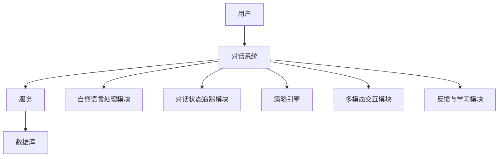

                 

### 第2章: 对话管理系统的架构设计

在深入了解对话管理系统的核心概念之后，我们需要将理论转化为实践，构建一个有效的架构。本章将探讨对话管理系统的架构设计，包括系统架构的概述、模块划分以及各模块的详细功能。

### 2.1 系统架构设计

#### 2.1.1 系统整体架构

对话管理系统是一个复杂的系统，涉及多个组件的协同工作。以下是一个典型的系统架构概述：

**Mermaid架构图：**



- **用户（A）**：系统的启动者，可以是人类用户或其他系统。
- **对话系统（B）**：核心组件，负责接收用户输入，处理对话流程，并与服务进行交互。
- **服务（C）**：提供特定功能的服务，如查询天气、推荐商品等。
- **数据库（D）**：存储对话历史、用户信息等数据。
- **自然语言处理模块（E）**：处理自然语言输入，进行分词、词性标注、意图识别等。
- **对话状态追踪模块（F）**：跟踪对话状态，记录当前对话的上下文。
- **策略引擎（G）**：根据对话状态和策略模型，决定对话系统的下一步动作。
- **多模态交互模块（H）**：支持文本、语音、图像等多种交互方式。
- **反馈与学习模块（I）**：收集用户反馈，用于模型优化和系统改进。

#### 2.1.2 模块划分

在上述架构中，各个模块具有不同的功能，下面详细描述每个模块的作用：

**Mermaid类图：**

```mermaid
classDiagram
    User <<-- DialogueSystem
    DialogueSystem o-- Service
    DialogueSystem o-- Database
    DialogueSystem o-- NaturalLanguageProcessingModule
    DialogueSystem o-- DialogueStateTrackingModule
    DialogueSystem o-- PolicyEngine
    DialogueSystem o-- MultimodalInteractionModule
    DialogueSystem o-- FeedbackLearningModule
```

- **用户（User）**：用户是系统交互的起点，可以是单个用户或多个用户的集合。用户发起对话，提供输入。
  
- **对话系统（DialogueSystem）**：对话系统的核心，负责管理整个对话流程。它包括多个子模块，如自然语言处理、对话状态追踪、策略引擎等。

- **服务（Service）**：提供实际功能的组件，如查询天气、推荐商品等。对话系统通过与服务交互来获取所需的信息。

- **数据库（Database）**：存储对话历史、用户偏好、策略模型等数据。数据库是系统数据持久化的关键。

- **自然语言处理模块（NaturalLanguageProcessingModule）**：处理自然语言输入，进行分词、词性标注、句法分析等。它为对话系统提供语言层面的理解能力。

- **对话状态追踪模块（DialogueStateTrackingModule）**：跟踪对话状态，记录当前对话的上下文。这对于理解用户意图和保持对话连贯性至关重要。

- **策略引擎（PolicyEngine）**：根据对话状态和策略模型，决定对话系统的下一步动作。策略引擎是决策的核心。

- **多模态交互模块（MultimodalInteractionModule）**：支持文本、语音、图像等多种交互方式。这使得对话系统能够更加自然地与用户互动。

- **反馈与学习模块（FeedbackLearningModule）**：收集用户反馈，用于模型优化和系统改进。反馈与学习是提升系统性能的关键。

### 2.2 模块详细功能

下面详细讨论每个模块的功能：

#### 2.2.1 用户模块

用户模块负责接收用户输入，并将其传递给对话系统。用户可以是单个用户或多个用户的集合。用户输入可以是文本、语音、图像等形式。用户模块的主要功能包括：

- **输入接收**：接收用户输入，并转换为系统可处理的形式。
- **输入校验**：检查输入的有效性，如格式、长度等。
- **错误处理**：处理输入错误或异常情况。

#### 2.2.2 对话系统模块

对话系统模块是整个系统的核心，负责管理对话流程。其主要功能包括：

- **对话初始化**：初始化对话状态，设置初始策略。
- **输入处理**：接收用户输入，进行自然语言处理。
- **意图识别**：根据输入文本，识别用户的意图。
- **对话管理**：根据意图识别结果和对话状态，决定下一步动作。
- **上下文维护**：记录和更新对话上下文，保持对话连贯性。

#### 2.2.3 服务模块

服务模块提供实际功能，如查询天气、推荐商品等。其主要功能包括：

- **功能调用**：根据对话系统的指令，调用相应的服务功能。
- **结果返回**：将服务结果返回给对话系统，用于生成回复。
- **异常处理**：处理服务调用中的异常情况。

#### 2.2.4 数据库模块

数据库模块负责存储对话历史、用户偏好、策略模型等数据。其主要功能包括：

- **数据存储**：将对话历史、用户偏好、策略模型等数据存储到数据库中。
- **数据查询**：根据需要查询数据库中的数据。
- **数据更新**：更新用户偏好和策略模型。

#### 2.2.5 自然语言处理模块

自然语言处理模块负责处理自然语言输入，提供语言层面的理解能力。其主要功能包括：

- **分词**：将输入文本分割成单词或短语。
- **词性标注**：为每个单词或短语标注词性，如名词、动词等。
- **句法分析**：分析句子的结构，提取句法信息。
- **意图识别**：根据输入文本，识别用户的意图。

#### 2.2.6 对话状态追踪模块

对话状态追踪模块负责跟踪对话状态，记录当前对话的上下文。其主要功能包括：

- **状态记录**：记录对话过程中的各种状态，如当前意图、上下文等。
- **状态更新**：根据对话系统的决策，更新对话状态。
- **上下文维护**：保持对话上下文的连贯性。

#### 2.2.7 策略引擎模块

策略引擎模块根据对话状态和策略模型，决定对话系统的下一步动作。其主要功能包括：

- **策略决策**：根据当前对话状态，选择合适的策略。
- **动作生成**：根据策略决策，生成对话系统的下一步动作。
- **策略学习**：根据对话结果，调整策略模型。

#### 2.2.8 多模态交互模块

多模态交互模块支持文本、语音、图像等多种交互方式。其主要功能包括：

- **交互方式选择**：根据用户偏好和对话场景，选择合适的交互方式。
- **交互内容生成**：根据对话系统的决策，生成相应的交互内容。
- **交互效果评估**：评估交互效果，优化交互体验。

#### 2.2.9 反馈与学习模块

反馈与学习模块负责收集用户反馈，用于模型优化和系统改进。其主要功能包括：

- **反馈收集**：收集用户对对话系统的反馈。
- **模型优化**：根据用户反馈，优化策略模型和自然语言处理模型。
- **系统改进**：根据用户反馈，改进系统功能。

### 2.3 本章小结

本章详细介绍了对话管理系统的架构设计，包括系统架构的概述、模块划分以及各模块的详细功能。通过本章的内容，我们对对话管理系统的整体架构有了更清晰的认识，为后续章节的设计与实现奠定了基础。在下一章中，我们将深入探讨对话管理系统的核心算法和实现细节。让我们一起继续前进，深入挖掘对话管理的精髓。

---

在了解了对话管理系统的架构设计后，我们需要关注其核心算法和实现细节。下一章将详细介绍对话管理系统中的核心算法，包括自然语言处理算法、意图识别算法、对话状态追踪算法等。我们将使用Mermaid流程图和Python代码来展示这些算法的实现，帮助读者更好地理解对话管理系统的内部工作原理。敬请期待！

