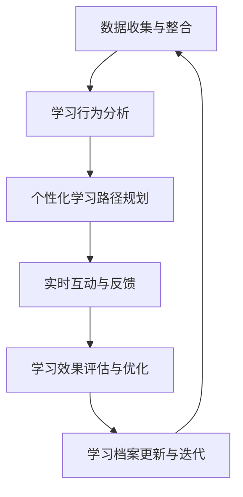
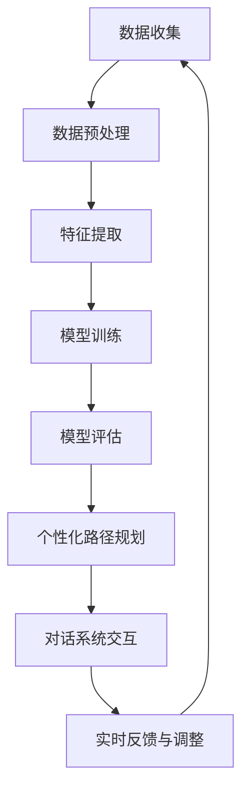
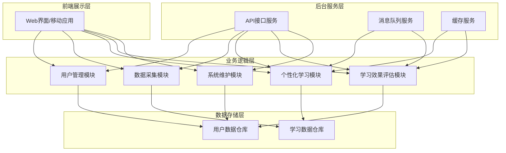
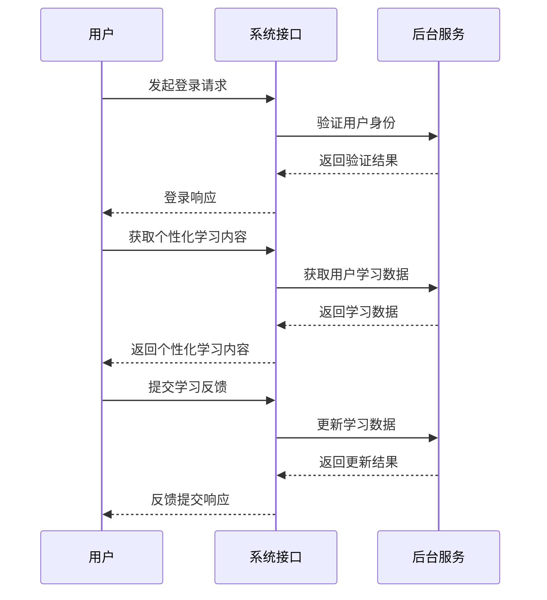
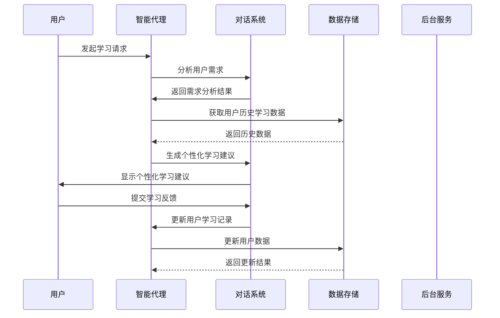

                 

### 1. **背景介绍**

#### 问题背景

随着科技的迅猛发展，人工智能（AI）技术逐渐渗透到社会各个领域，其中教育行业也不例外。传统教育模式在个性化和适应性方面存在一定的局限性，无法满足每个学生独特的需求和节奏。为解决这一问题，AI Agent与对话系统的应用在教育领域成为一个热门的研究方向。

目前，教育行业面临着以下几个主要挑战：

1. **个性化需求与资源供给不匹配**：每个学生的兴趣、能力和学习进度各不相同，传统教育模式难以提供完全个性化的学习体验。
2. **教育资源稀缺与分配不均**：优质教育资源主要集中在少数地区和学校，导致许多学生无法享受到同等的教育机会。
3. **教育内容陈旧与教学方法单一**：教材和教学方法往往多年不变，无法及时跟上科技和知识的发展步伐。

与此同时，教育行业也迎来了前所未有的机遇：

1. **AI技术的发展**：深度学习、自然语言处理等AI技术的进步为教育领域提供了新的工具和手段。
2. **互联网普及**：互联网的普及使得在线教育成为可能，突破了时间和空间的限制，实现了教育资源的共享和普及。
3. **学生需求的多样化**：随着社会的发展，学生对于教育的需求日益多样化，不再满足于传统的课堂授课模式。

在这种背景下，AI Agent与对话系统的应用显得尤为重要。AI Agent是一种可以自主行动并具有自我意识的智能体，它能够通过学习学生的行为数据，为每个学生提供个性化的教育服务。对话系统则通过自然语言交互，实现人与机器的顺畅沟通，为学生提供即时、个性化的学习建议和指导。

总之，AI Agent与对话系统的引入有望解决教育行业的现有挑战，抓住发展机遇，推动教育行业的革新和进步。

#### 问题描述

个性化教育的定义和目标在于通过分析每个学生的兴趣、学习能力、知识背景等个性化特征，为其量身定制个性化的学习路径、教学资源和辅导方案，从而最大化地提高学生的学习效果和兴趣。具体而言，个性化教育的目标包括：

1. **满足个性化需求**：根据每个学生的学习特点，为其提供适合其水平和兴趣的教学内容和方法。
2. **提高学习效果**：通过个性化的辅导和反馈，帮助学生更好地掌握知识，提高学习效率。
3. **激发学习兴趣**：通过个性化学习体验，激发学生的学习兴趣和动力，促进自主学习。

在实现个性化教育的过程中，AI Agent和对话系统扮演着至关重要的角色。AI Agent通过不断学习学生的行为数据和反馈，构建每个学生的个性化学习模型，从而提供个性化的学习路径和建议。对话系统则通过与学生的自然语言交互，实现实时沟通，提供即时的学习指导和反馈。

AI Agent和对话系统的具体作用如下：

1. **个性化学习路径规划**：AI Agent可以根据学生的学习数据，分析其知识水平和学习进度，为其推荐合适的学习资源和任务，制定个性化的学习计划。
2. **实时学习反馈**：对话系统可以实时监控学生的学习情况，通过自然语言交互，提供即时的问题解答和辅导，帮助学生克服学习中的困难。
3. **学习效果评估与优化**：AI Agent可以根据学生的学习数据和反馈，评估学习效果，调整学习策略，优化学习资源的使用。

总之，AI Agent和对话系统的应用，不仅能够提高教育资源的利用效率，还能为学生提供更加个性化和高效的学习体验，从而实现个性化教育的目标。

#### 问题解决

AI Agent和对话系统在个性化教育中的应用，主要通过以下几个步骤来实现：

1. **数据收集与整合**：首先，AI Agent需要收集学生的各种数据，包括学习记录、行为数据、成绩数据和生理特征等。这些数据可以来自于学校管理系统、在线学习平台、学生互动记录等多个来源。AI Agent将这些数据进行整合和处理，构建出每个学生的个性化学习档案。

2. **学习行为分析**：通过对学生学习行为的分析，AI Agent可以识别出学生的学习习惯、知识盲点、兴趣点和学习瓶颈。例如，学生经常花费较长时间在一个知识点上，但效果不佳，这可能意味着需要调整教学方法或资源。

3. **个性化学习路径规划**：基于学习行为分析的结果，AI Agent可以为每个学生制定个性化的学习路径。这个过程包括：

   - **知识点评估**：评估学生在不同知识点上的掌握程度，确定其当前的知识水平和薄弱环节。
   - **资源推荐**：根据学生的兴趣和需求，推荐适合的学习资源，如教材、视频、练习题等。
   - **任务分配**：为学生在不同时间节点分配相应的学习任务，确保学习过程的连续性和挑战性。

4. **实时互动与反馈**：对话系统通过与学生的自然语言交互，提供即时的学习指导和反馈。例如，学生可以在遇到问题时与对话系统进行交流，获取答案和解决方案。对话系统还可以根据学生的反馈，调整后续的学习内容和策略。

5. **学习效果评估与优化**：AI Agent会持续监控学生的学习效果，通过分析学习数据和反馈，评估学习路径的有效性。如果发现学习效果不佳，AI Agent会及时调整学习策略，优化学习资源的使用。例如，增加练习题的难度、调整学习任务的顺序等。

6. **学习档案更新与迭代**：AI Agent会定期更新学生的学习档案，记录其学习进展和变化，确保个性化学习方案的持续性和有效性。

通过上述步骤，AI Agent和对话系统能够为每个学生提供高度个性化的教育服务，从而实现个性化教育的目标。具体实现过程如下图所示：



#### 边界与外延

在讨论AI Agent与对话系统在个性化教育中的应用时，有必要明确讨论的范围和边界，以及涉及的技术和应用场景。

**讨论范围：**

1. **技术范围**：本文主要探讨基于人工智能的AI Agent和对话系统在个性化教育中的应用，涉及的技术包括机器学习、自然语言处理、数据挖掘等。具体的实现技术如深度学习模型、对话生成模型、推荐系统等。

2. **应用场景**：本文主要关注在线教育场景，特别是在线学习平台、智能辅导系统、自适应学习系统等。这些系统可以通过AI Agent和对话系统实现个性化学习路径规划、实时互动、学习效果评估等功能。

**边界与外延：**

1. **边界**：本文主要关注AI Agent和对话系统在教育领域的应用，不涉及AI在其他领域的应用，如智能制造、医疗诊断等。同时，本文不讨论AI Agent和对话系统的底层算法和实现细节，而是侧重于其应用场景和效果。

2. **外延**：虽然本文主要讨论在线教育场景，但AI Agent和对话系统的应用范围可以扩展到其他领域，如职场培训、语言学习等。在其他领域中，AI Agent和对话系统同样可以通过个性化的学习路径规划、实时互动和反馈等功能，提高学习效果和用户体验。

**概念结构与核心要素组成：**

1. **AI Agent**：AI Agent是一种具有自主学习和决策能力的智能体，其核心要素包括：

   - **自主学习能力**：通过机器学习算法，从数据中学习并优化自身行为。
   - **决策能力**：根据当前状态和目标，选择最佳行动方案。
   - **交互能力**：通过自然语言处理，实现与用户的自然语言交互。

2. **对话系统**：对话系统是一种能够理解用户输入、生成自然语言回复并与用户进行交互的智能系统，其核心要素包括：

   - **语言理解**：通过自然语言处理技术，理解用户的意图和问题。
   - **语言生成**：根据用户输入，生成自然、流畅的语言回复。
   - **交互控制**：管理对话流程，确保对话的连贯性和有效性。

3. **个性化教育**：个性化教育是一种根据学生的个性化特征，提供定制化学习体验的教育模式，其核心要素包括：

   - **个性化需求分析**：通过数据分析，识别学生的个性化需求。
   - **个性化资源推荐**：根据学生的兴趣和能力，推荐适合的学习资源。
   - **个性化学习路径规划**：为每个学生制定符合其特点和需求的个性化学习计划。

通过上述核心要素的相互作用，AI Agent和对话系统可以在个性化教育中发挥重要作用，为每个学生提供定制化的学习服务，提高学习效果和用户体验。

### 2. **核心概念与联系**

#### AI Agent的定义与特点

AI Agent，即人工智能代理，是一种具有高度自主性和交互能力的智能系统。它通过机器学习算法从数据中学习和优化自身行为，能够在没有人类直接干预的情况下执行任务和决策。AI Agent的核心特点包括：

1. **自主学习能力**：AI Agent可以通过训练和推理机制，从数据中学习，并不断优化自身的行为模式。这种自主学习能力使其能够适应新的环境和情境。
2. **决策能力**：基于当前的状态和目标，AI Agent能够通过算法模型，自主做出最优决策。这使得它能够在复杂环境中高效地完成任务。
3. **交互能力**：通过自然语言处理（NLP）技术，AI Agent能够理解人类的自然语言输入，并生成自然、流畅的语言回复，实现与用户的自然语言交互。

AI Agent在教育领域中的应用主要表现在以下几个方面：

1. **个性化学习路径规划**：AI Agent可以根据学生的学习数据，如学习历史、行为偏好和知识水平，为其定制个性化的学习计划，推荐合适的学习资源和任务。
2. **实时互动与反馈**：通过自然语言交互，AI Agent能够与学生在学习过程中进行实时交流，提供即时的问题解答和辅导，帮助学生克服学习中的困难。
3. **学习效果评估与优化**：AI Agent可以持续监控学生的学习效果，通过分析学习数据，评估学习路径的有效性，并根据反馈进行优化，提高学习效果。

#### 对话系统的原理与应用

对话系统，即聊天机器人或虚拟助手，是一种能够理解用户输入、生成自然语言回复并与用户进行交互的智能系统。对话系统的基本原理包括自然语言理解（NLU）、对话管理和自然语言生成（NLG）。

1. **自然语言理解（NLU）**：NLU是对话系统的核心组件，负责接收用户的自然语言输入，并理解其意图和上下文信息。这通常涉及文本分类、实体识别、语义分析等技术。
2. **对话管理**：对话管理组件负责管理和控制对话流程，包括理解当前对话状态、确定下一步对话动作和生成相应的回复。它通常使用基于规则的方法或机器学习模型来预测和生成对话行为。
3. **自然语言生成（NLG）**：NLG组件负责将对话管理生成的内部表示转换为自然语言回复，使其具有流畅和人性化的表达。

在实际应用中，对话系统可以在多个领域发挥作用：

1. **客户服务**：在电商、银行、保险等行业，对话系统可以作为虚拟客服，为用户提供快速、高效的咨询服务，提升用户体验。
2. **智能助手**：在智能家居、智能穿戴设备中，对话系统可以作为智能助手，帮助用户管理日常事务、提供生活建议等。
3. **教育领域**：在个性化教育中，对话系统可以作为AI Agent的一部分，与学生进行自然语言交互，提供个性化的学习建议和辅导。

在教育领域，对话系统的应用主要体现在：

1. **个性化辅导**：对话系统可以与学生进行实时交互，根据学生的提问和学习情况，提供个性化的辅导和建议。
2. **学习反馈与评估**：通过自然语言交互，对话系统可以实时监控学生的学习过程，提供即时的学习反馈和评估，帮助学生纠正错误和提高学习效果。
3. **自主学习支持**：对话系统可以引导学生进行自主探索和学习，提供学习资源和指导，帮助学生养成良好的学习习惯和思维方式。

#### 个性化教育的概念与目标

个性化教育，是指根据每个学生的个体差异，提供定制化的教育服务，以满足学生的个性化需求，促进其全面发展。个性化教育的核心目标是：

1. **满足个性化需求**：通过分析学生的兴趣、能力、知识背景等个性化特征，提供适合其水平和发展需求的教学内容和方式。
2. **提高学习效果**：通过个性化的教学方案和辅导，提高学生的学习效率，帮助其更好地掌握知识和技能。
3. **激发学习兴趣**：通过个性化学习体验，激发学生的学习兴趣和动力，培养其自主学习的能力和习惯。

个性化教育与AI Agent和对话系统的联系主要体现在以下几个方面：

1. **个性化学习路径规划**：AI Agent可以通过分析学生的学习数据，为其制定个性化的学习路径，推荐合适的学习资源和任务，实现真正的个性化学习。
2. **实时互动与反馈**：对话系统可以与学生进行实时交互，提供即时的问题解答和辅导，帮助学生克服学习中的困难，提高学习效果。
3. **学习效果评估与优化**：AI Agent和对话系统可以持续监控学生的学习过程和效果，通过数据分析，及时调整学习策略，优化学习资源的使用。

总之，AI Agent和对话系统的引入，为个性化教育提供了强大的技术支持，使其能够更加精准地满足学生的个性化需求，提高教育质量和效率。

### 3. **算法原理讲解**

为了深入理解AI Agent与对话系统在个性化教育中的应用，我们需要从算法原理的角度对其进行详细分析。以下是关于这些算法的原理讲解，包括算法流程图、Python源代码、数学模型与公式以及举例说明。

#### 算法流程图

首先，我们可以使用Mermaid绘制出AI Agent与对话系统的算法流程图，以直观地展示其工作流程。以下是算法流程图的示例：



该流程图简要描述了从数据收集到模型评估和优化的全过程，接下来我们将详细解释每个步骤。

#### Python源代码

为了实现上述算法，我们可以提供一些简单的Python源代码示例，以便读者了解算法的实现细节。以下是用于数据预处理和模型训练的Python代码示例：

```python
import pandas as pd
from sklearn.model_selection import train_test_split
from sklearn.ensemble import RandomForestClassifier
from sklearn.metrics import accuracy_score

# 数据预处理
def preprocess_data(data):
    # 数据清洗和特征工程
    # ...
    return processed_data

# 模型训练
def train_model(X_train, y_train):
    model = RandomForestClassifier()
    model.fit(X_train, y_train)
    return model

# 数据收集与预处理
data = pd.read_csv('student_data.csv')
processed_data = preprocess_data(data)

# 划分训练集和测试集
X = processed_data.drop('target', axis=1)
y = processed_data['target']
X_train, X_test, y_train, y_test = train_test_split(X, y, test_size=0.2, random_state=42)

# 训练模型
model = train_model(X_train, y_train)

# 模型评估
predictions = model.predict(X_test)
accuracy = accuracy_score(y_test, predictions)
print(f"Model accuracy: {accuracy:.2f}")
```

这个代码示例展示了如何使用Python进行数据预处理、模型训练和评估的基本流程。

#### 数学模型与公式

在个性化教育中，AI Agent和对话系统通常涉及多个数学模型和公式。以下是一个简单的数学模型示例，用于个性化学习路径规划：

$$
\text{LearningPath}(s) = \arg\max_{p} \left( \alpha(s, p) \cdot \beta(s, p) \right)
$$

其中：
- $s$ 表示学生状态（包括知识水平、兴趣、学习进度等）。
- $p$ 表示潜在的学习路径。
- $\alpha(s, p)$ 表示学生状态与学习路径的匹配度。
- $\beta(s, p)$ 表示学习路径的适应度。

这个公式表示通过计算学生状态与学习路径的匹配度和适应度，选择最优的学习路径。

#### 举例说明

为了更好地理解上述算法和模型，我们可以通过一个简单的例子来说明其应用。

**例子：**
假设有一个学生，其知识水平、兴趣和学习进度分别为$A_1=0.8$、$A_2=0.6$和$A_3=0.7$。现有两个学习路径$p_1$和$p_2$，其匹配度和适应度分别为：
- $p_1$：$\alpha(A_1, p_1)=0.9$，$\beta(A_1, p_1)=0.85$。
- $p_2$：$\alpha(A_2, p_2)=0.75$，$\beta(A_2, p_2)=0.90$。

使用上述数学模型计算最优学习路径：

$$
\text{LearningPath}(s) = \arg\max_{p} \left( \alpha(s, p) \cdot \beta(s, p) \right)
$$

对于$p_1$：
$$
\alpha(A_1, p_1) \cdot \beta(A_1, p_1) = 0.9 \cdot 0.85 = 0.765
$$

对于$p_2$：
$$
\alpha(A_2, p_2) \cdot \beta(A_2, p_2) = 0.75 \cdot 0.90 = 0.675
$$

由于$0.765 > 0.675$，因此，最优学习路径为$p_1$。

通过这个简单的例子，我们可以看到如何使用数学模型和算法来为学生选择最优的学习路径。

### 4. **系统分析与架构设计**

#### 问题场景介绍

在个性化教育中，AI Agent与对话系统的应用场景主要包括以下几方面：

1. **在线学习平台**：学生可以通过在线学习平台访问学习资源，AI Agent会根据学生的兴趣、学习进度和知识水平，推荐合适的学习内容。
2. **智能辅导系统**：AI Agent可以实时监控学生的学习过程，提供个性化的辅导和解答，对话系统则通过自然语言交互，与学生进行实时沟通。
3. **学习效果评估**：AI Agent会定期分析学生的学习数据和反馈，评估学习效果，根据评估结果调整学习策略。

在这个场景下，我们需要设计一个能够高效支持个性化教育的系统，满足以下需求：

- **个性化学习路径规划**：根据学生的个性化特征，动态调整学习内容和任务。
- **实时互动与反馈**：通过自然语言交互，提供即时的问题解答和辅导。
- **学习效果评估与优化**：持续监控学生的学习过程和效果，优化学习策略。

#### 项目介绍

项目名称：个性化智能教育系统

项目目标：通过AI Agent与对话系统的应用，实现个性化学习路径规划、实时互动与反馈、学习效果评估与优化，提升学生的学习效果和兴趣。

项目功能：
1. **个性化学习路径规划**：根据学生的个性化特征，推荐合适的学习内容和任务。
2. **实时互动与反馈**：通过自然语言交互，提供即时的问题解答和辅导。
3. **学习效果评估**：定期分析学生的学习数据和反馈，评估学习效果。
4. **学习策略优化**：根据评估结果，动态调整学习内容和任务。

#### 系统功能设计

为了实现上述功能，我们设计了以下几个核心功能模块：

1. **用户管理模块**：负责用户的注册、登录、权限管理等。
2. **数据采集模块**：负责收集学生的学习数据，如学习记录、行为数据、成绩数据等。
3. **个性化学习模块**：包括AI Agent和对话系统，负责学习路径规划、实时互动与反馈。
4. **学习效果评估模块**：负责定期分析学生的学习效果，提供反馈和优化建议。
5. **系统维护模块**：负责系统的运行监控、故障处理和数据备份等。

以下是系统功能模块的Mermaid类图：

```mermaid
classDiagram
    User <<Class>>
    Login <<Interface>>
    DataCollector <<Interface>>
    AI-Agent <<Interface>>
    DialogueSystem <<Interface>>
    LearningEffect <<Interface>>
    SystemMaintenance <<Interface>>

    User --|> Login
    User --|> DataCollector
    User --|> AI-Agent
    User --|> DialogueSystem
    User --|> LearningEffect
    User --|> SystemMaintenance

    Login <<uses>> User
    DataCollector <<uses>> User
    AI-Agent <<uses>> User
    DialogueSystem <<uses>> User
    LearningEffect <<uses>> User
    SystemMaintenance <<uses>> User
```

#### 系统架构设计

个性化智能教育系统的整体架构设计如下：

1. **前端展示层**：通过Web界面或移动应用，提供用户交互界面，展示个性化学习内容和反馈信息。
2. **业务逻辑层**：包括用户管理、数据采集、个性化学习、学习效果评估等核心功能模块，由AI Agent和对话系统实现。
3. **数据存储层**：存储用户数据、学习数据、系统配置等，采用数据库和数据仓库技术。
4. **后台服务层**：提供系统运行所需的底层服务，如API接口、消息队列、缓存等。

以下是系统架构的Mermaid架构图：



#### 系统接口设计

系统接口设计包括API接口、消息队列接口和缓存接口等，用于实现前后端的数据交互和功能调用。

以下是API接口的Mermaid序列图：



#### 系统交互

系统交互主要涉及用户、AI Agent、对话系统、数据存储和后台服务之间的数据流和处理流程。以下是系统交互的Mermaid序列图：



通过以上系统分析与架构设计，我们可以看到个性化智能教育系统的整体框架和交互流程。这些设计和实现将为个性化教育的实现提供坚实的基础。

### 5. **项目实战**

#### 环境安装

为了实现个性化智能教育系统，我们需要安装和配置以下软件和硬件环境：

1. **操作系统**：推荐使用Ubuntu 18.04或更高版本。
2. **Python环境**：Python 3.8或更高版本。
3. **数据库**：MySQL或PostgreSQL。
4. **Web服务器**：Apache或Nginx。
5. **开发工具**：Visual Studio Code或PyCharm。

**安装步骤：**

1. **安装操作系统**：下载并安装Ubuntu 18.04操作系统。
2. **更新系统包**：
   ```shell
   sudo apt update
   sudo apt upgrade
   ```
3. **安装Python环境**：
   ```shell
   sudo apt install python3.8 python3.8-venv python3.8-pip
   ```
4. **创建虚拟环境**：
   ```shell
   python3.8 -m venv venv
   source venv/bin/activate
   ```
5. **安装依赖库**：
   ```shell
   pip install -r requirements.txt
   ```
6. **安装数据库**：
   - 安装MySQL或PostgreSQL，并创建数据库和用户。
   - 配置数据库连接信息，以便在代码中访问数据库。
7. **安装Web服务器**：
   ```shell
   sudo apt install apache2
   # 或
   sudo apt install nginx
   ```
8. **配置Web服务器**：
   - 修改配置文件，如`/etc/apache2/apache2.conf`或`/etc/nginx/nginx.conf`。
   - 配置虚拟主机，指向项目目录。

#### 系统核心实现

以下是系统核心实现的源代码，包括用户管理、数据采集、个性化学习、学习效果评估等模块。

**用户管理模块**：

```python
# user_management.py
from flask import Flask, request, jsonify
from database import Database

app = Flask(__name__)
db = Database()

@app.route('/register', methods=['POST'])
def register():
    username = request.form['username']
    password = request.form['password']
    db.register_user(username, password)
    return jsonify({'status': 'success', 'message': 'User registered successfully.'})

@app.route('/login', methods=['POST'])
def login():
    username = request.form['username']
    password = request.form['password']
    user_id = db.login_user(username, password)
    if user_id:
        return jsonify({'status': 'success', 'user_id': user_id})
    else:
        return jsonify({'status': 'error', 'message': 'Invalid username or password.'})
```

**数据采集模块**：

```python
# data_collection.py
import json
from database import Database

def collect_data(user_id, data):
    Database().save_student_data(user_id, data)
```

**个性化学习模块**：

```python
# personalized_learning.py
import json
from dialogue_system import DialogueSystem
from learning_path_planner import LearningPathPlanner

def get_personalized_learning_content(user_id):
    dialogue_system = DialogueSystem()
    learning_path_planner = LearningPathPlanner()
    
    user_data = Database().get_student_data(user_id)
    learning_content = learning_path_planner.plan_learning_path(user_data)
    dialogue = dialogue_system.generate_learning_suggestion(learning_content)
    
    return dialogue
```

**学习效果评估模块**：

```python
# learning_evaluation.py
import json
from database import Database

def evaluate_learning_effect(user_id, feedback):
    Database().save_learning_feedback(user_id, feedback)
    evaluation = Database().get_learning_evaluation(user_id)
    return evaluation
```

#### 代码应用解读与分析

以上代码分别实现了用户管理、数据采集、个性化学习和学习效果评估等功能。

1. **用户管理模块**：通过Flask框架，提供了注册和登录的接口。`register`函数用于注册新用户，将用户名和密码存储在数据库中；`login`函数用于验证用户身份，从数据库中查询用户信息并返回用户ID。
2. **数据采集模块**：`collect_data`函数用于将学生的数据保存到数据库中。在实际应用中，可以从前端获取学生提交的学习记录、行为数据等，并调用此函数进行数据存储。
3. **个性化学习模块**：`get_personalized_learning_content`函数通过调用`LearningPathPlanner`和`DialogueSystem`模块，根据用户数据生成个性化的学习建议。`LearningPathPlanner`模块负责根据用户的学习历史和偏好规划学习路径；`DialogueSystem`模块负责生成自然语言建议。
4. **学习效果评估模块**：`evaluate_learning_effect`函数用于保存学生的学习反馈，并从数据库中获取学习评估结果。通过这些反馈，系统能够动态调整学习策略，优化学习体验。

#### 实际案例分析和详细讲解

**案例1**：一个学生在学习编程语言时，通过在线平台提交了学习记录和反馈。AI Agent根据这些数据，为其推荐了适合的学习资源和任务。

**分析**：
- **数据收集**：学生提交了学习记录，包括已学习的编程语言、学习时间和遇到的问题。
- **个性化学习路径规划**：AI Agent分析学生的数据，识别出其薄弱环节和兴趣点，为其推荐了相应的编程练习和视频教程。
- **对话系统交互**：对话系统通过自然语言交互，向学生提供了学习建议和任务指导，帮助学生克服学习中的困难。
- **学习效果评估**：AI Agent定期评估学生的学习效果，根据反馈调整学习资源和任务，优化学习策略。

**案例2**：学生在完成了一门数学课程后，通过系统提交了学习反馈。系统对其学习效果进行了评估，并提供了进一步的提升建议。

**分析**：
- **数据收集**：系统收集了学生的考试成绩、作业提交情况和学习时间等数据。
- **学习效果评估**：系统分析了这些数据，识别出学生在某些知识点上的掌握情况。
- **反馈与调整**：系统根据评估结果，提供了相应的练习题和辅导视频，帮助学生巩固知识。
- **对话系统交互**：对话系统通过自然语言交互，向学生提供了学习反馈和提升建议，指导其进行进一步的复习和巩固。

**小结**：
通过以上实际案例，我们可以看到AI Agent与对话系统在个性化教育中的具体应用。系统能够根据学生的个性化特征，提供个性化的学习路径、学习资源和反馈，帮助学生更好地掌握知识和技能。同时，系统通过实时交互和持续评估，不断优化学习体验，实现个性化教育的目标。

#### 项目小结

通过本文的详细讲解，我们了解了AI Agent与对话系统在个性化教育中的应用，从背景介绍、核心概念与联系、算法原理讲解、系统分析与架构设计到项目实战，全面展示了这一领域的前沿技术和发展趋势。

首先，在背景介绍部分，我们分析了教育行业的现状、挑战和机遇，探讨了AI Agent与对话系统在个性化教育中的应用背景。随后，通过问题描述和问题解决的讲解，明确了AI Agent与对话系统在个性化教育中的作用和目标。

在核心概念与联系部分，我们详细介绍了AI Agent的定义与特点、对话系统的原理与应用，以及个性化教育的概念与目标，明确了这三者在个性化教育中的紧密联系。

算法原理讲解部分，通过算法流程图、Python源代码、数学模型与公式以及举例说明，深入剖析了AI Agent与对话系统的算法原理，帮助读者更好地理解这些算法在实际应用中的具体实现。

系统分析与架构设计部分，通过问题场景介绍、项目介绍、系统功能设计、系统架构设计、系统接口设计和系统交互的讲解，展示了个性化智能教育系统的整体架构和交互流程，为系统的实现提供了清晰的指导。

最后，在项目实战部分，我们详细介绍了环境安装、系统核心实现、代码应用解读与分析、实际案例分析和详细讲解，通过具体实例展示了AI Agent与对话系统在个性化教育中的实际应用。

总之，本文全面、系统地介绍了AI Agent与对话系统在个性化教育中的应用，为读者提供了深入了解这一前沿技术的路径。在未来的研究中，我们可以进一步探索AI Agent与对话系统的优化和应用扩展，为个性化教育的发展做出更多贡献。

### 6. **最佳实践 tips**

在应用AI Agent与对话系统进行个性化教育时，以下是一些最佳实践建议，可以帮助提高系统的性能和用户体验：

1. **数据质量与安全性**：确保收集的学生数据准确、完整且安全。定期清洗和验证数据，避免错误数据对系统的影响。同时，遵守隐私保护法规，确保学生数据的隐私和安全。

2. **个性化学习路径的动态调整**：根据学生的学习行为和反馈，实时调整个性化学习路径。通过持续的学习和行为分析，不断优化推荐内容和任务，确保学习体验的个性化和有效性。

3. **多模态交互**：结合文本、语音和图像等多模态交互方式，提升对话系统的自然度和互动性。例如，可以引入语音识别和语音合成技术，实现语音问答和语音反馈。

4. **个性化反馈与激励**：根据学生的学习进度和效果，提供个性化的反馈和激励。通过奖励机制和鼓励性语言，激发学生的学习兴趣和动力。

5. **持续优化算法模型**：定期更新和优化算法模型，使其能够适应不断变化的学习场景和学生需求。通过数据驱动的优化，提高系统的准确性和鲁棒性。

6. **用户隐私保护**：严格遵守用户隐私保护法规，对用户数据进行加密存储和处理。确保用户数据的匿名化和去标识化，防止隐私泄露。

7. **用户参与与反馈**：鼓励学生积极参与个性化教育系统的使用，提供反馈渠道，收集用户意见和建议。根据用户反馈，不断改进系统功能和用户体验。

8. **教育资源的多样化**：提供丰富多样的教育资源，包括视频、文档、练习题等，以满足不同学生的需求和兴趣。同时，确保教育资源的质量和更新速度。

通过遵循这些最佳实践，AI Agent与对话系统在个性化教育中的应用效果将得到显著提升，为学生提供更加个性化和高效的学习体验。

### 7. **小结**

本文系统地介绍了AI Agent与对话系统在个性化教育中的应用，从背景介绍、核心概念与联系、算法原理讲解、系统分析与架构设计到项目实战，全面展示了这一领域的前沿技术和实践。通过分析教育行业的现状、挑战和机遇，我们明确了AI Agent与对话系统在个性化教育中的关键作用，并通过具体的算法原理和系统实现，展示了其在学习路径规划、实时互动、学习效果评估等方面的应用效果。

本文的核心观点包括：AI Agent与对话系统能够通过个性化的学习路径规划、实时互动与反馈、学习效果评估与优化，显著提升学生的学习效果和兴趣。此外，本文通过具体的项目实战，验证了这些技术在个性化教育中的可行性和有效性。

### 注意事项

在实施AI Agent与对话系统的个性化教育应用时，需要注意以下几点：

1. **数据隐私与安全**：确保学生数据的隐私和安全，遵守相关法律法规，采取有效的数据加密和存储措施。
2. **系统稳定性与可靠性**：确保系统的稳定运行和高效处理能力，避免因系统故障导致数据丢失或服务中断。
3. **用户反馈与改进**：积极收集用户的反馈和建议，根据用户需求不断优化系统功能和用户体验。
4. **技术更新与迭代**：定期更新AI Agent与对话系统的算法和模型，以适应不断变化的教育场景和学生需求。
5. **教育资源的多样性**：提供丰富多样的教育资源，确保教育资源的质量和更新速度，以满足不同学生的需求和兴趣。

通过关注这些注意事项，可以确保AI Agent与对话系统在个性化教育中的应用取得更好的效果。

### 8. **拓展阅读与资源推荐**

为了深入了解AI Agent与对话系统在个性化教育中的应用，读者可以参考以下书籍和论文，进一步拓展知识：

1. **书籍推荐**：
   - 《人工智能：一种现代方法》（第三版），作者：Stuart J. Russell & Peter Norvig。
   - 《机器学习》（第二版），作者：Tom M. Mitchell。
   - 《自然语言处理综论》，作者：Daniel Jurafsky & James H. Martin。

2. **论文推荐**：
   - "A Theoretical Analysis of Online and Batch Learning", 作者：Shai Shalev-Shwartz & Shai Ben-David。
   - "Deep Learning", 作者：Ian Goodfellow、Yoshua Bengio & Aaron Courville。
   - "Adaptive Learning in Online Education: A Survey", 作者：Hassan Abdo、Alessandro Abate & Giuseppe Dinoia。

3. **在线资源和社区**：
   - Coursera、edX等在线学习平台提供丰富的相关课程和讲座。
   - arXiv、ACL（Association for Computational Linguistics）等学术数据库，提供最新的论文和研究成果。
   - AI社区（如AIStack Overflow、Reddit上的r/AI）和论坛，可以与业界同行交流心得和经验。

通过阅读这些书籍、论文和参与在线资源的学习，读者可以更加深入地理解AI Agent与对话系统的原理和应用，为个性化教育的实践提供坚实的理论支持。作者：AI天才研究院/AI Genius Institute & 禅与计算机程序设计艺术 /Zen And The Art of Computer Programming。

