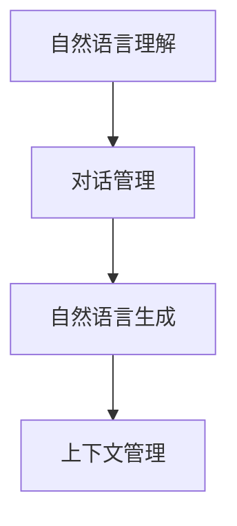
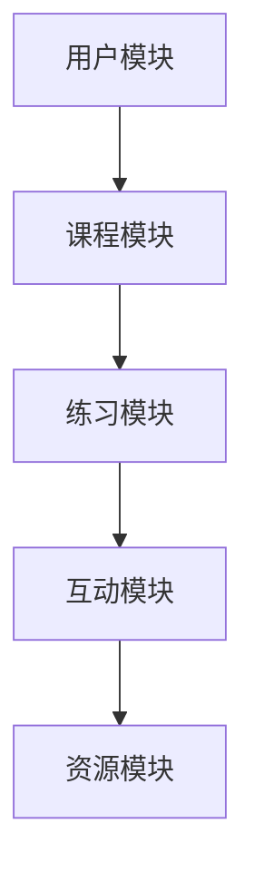
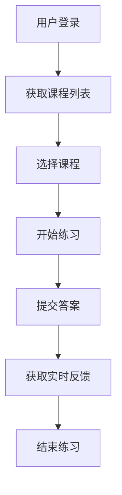

                 

### 引言

#### 文章标题：AI Agent的对话系统在语言学习中的应用

#### 关键词：AI Agent，对话系统，语言学习，应用实践，系统设计

#### 摘要：

本文旨在探讨AI Agent的对话系统在语言学习中的应用。随着人工智能技术的不断发展，AI Agent作为一种智能实体，已逐渐在各个领域展现出其独特的价值。本文将首先介绍AI Agent和对话系统的基本概念、特点及其在语言学习中的潜在应用场景。接着，我们将深入探讨对话系统的工作原理和算法，通过具体的数学模型和公式来解释这些算法的核心逻辑。随后，文章将介绍一个实际的语言学习项目，详细描述系统的分析与架构设计、环境安装与配置、核心实现与代码解析。最后，我们将总结最佳实践，并给出一些注意事项和拓展阅读建议，以期为语言学习领域的研究者和实践者提供有益的参考。

### 第一部分：背景介绍与核心概念

#### 1.1 问题背景

语言学习是人们日常生活中的重要活动之一，无论是为了工作、旅行还是文化交流，掌握一门新的语言都是非常有价值的。然而，传统的语言学习方法往往依赖于教科书、音频和视频资料，这些方法存在一定的局限性。例如，学习者的主动参与度低，学习效率不高，学习环境单一等问题。随着人工智能技术的快速发展，特别是在自然语言处理（NLP）和机器学习（ML）领域的突破，AI Agent的对话系统作为一种新兴的语言学习工具，逐渐引起了人们的关注。

AI Agent是指具备一定智能和自主决策能力的软件实体，可以模拟人类的交流方式和行为。而对话系统则是能够与用户进行自然语言交互的软件系统，其核心在于理解用户的意图，并生成相应的回应。将AI Agent的对话系统应用于语言学习，不仅可以提高学习的互动性和效率，还可以通过个性化的学习路径和实时反馈，帮助学习者更好地掌握语言技能。

#### 1.2 核心概念

**AI Agent**

AI Agent，即人工智能代理，是指具备一定智能和自主决策能力的软件实体。AI Agent能够模拟人类的思维和行为，通过感知环境、理解任务、自主决策和执行行动，达到预期的目标。在AI Agent的设计中，关键的技术包括感知、决策、动作规划和学习。感知是指AI Agent获取外部环境信息的能力；决策是指AI Agent根据感知到的信息，选择合适的行动方案；动作规划是指AI Agent将决策转化为具体的行动；学习是指AI Agent通过不断的学习和优化，提高其解决问题的能力。

**对话系统**

对话系统是一种能够与用户进行自然语言交互的软件系统。对话系统的核心功能是理解用户的意图，并生成相应的回应。对话系统通常包括以下几个关键组件：

1. **自然语言理解（NLU）**：将用户的自然语言输入转换成机器可以理解的结构化数据。
2. **对话管理**：维护对话状态，协调对话流程，确保对话的自然流畅。
3. **自然语言生成（NLG）**：将系统生成的结构化数据转换成自然语言输出。
4. **上下文管理**：维护对话的历史信息，确保对话的连贯性和一致性。

**语言学习**

语言学习是指通过系统的学习和实践，掌握一门新的语言。语言学习的过程通常包括以下几个阶段：

1. **听力理解**：通过听力练习，提高对目标语言的理解能力。
2. **口语表达**：通过口语练习，提高目标语言的表达能力。
3. **阅读理解**：通过阅读练习，提高对目标语言的阅读理解能力。
4. **写作能力**：通过写作练习，提高目标语言的写作能力。

#### 1.3 问题描述

在语言学习过程中，学习者通常面临以下问题：

1. **学习资源有限**：传统语言学习资源（如教科书、音频、视频）有限，难以满足学习者的个性化需求。
2. **学习互动性低**：传统学习方法缺乏互动性，学习者的主动参与度低。
3. **学习效率不高**：传统学习方法缺乏实时反馈和个性化指导，学习效率不高。
4. **学习环境单一**：传统学习环境单调，难以提供多样化的学习体验。

为了解决上述问题，我们需要设计一种新型的语言学习工具，该工具应具备以下特点：

1. **个性化**：能够根据学习者的水平、兴趣和需求，提供个性化的学习内容。
2. **互动性**：能够与学习者进行实时互动，提高学习者的参与度。
3. **高效性**：能够提供实时反馈和个性化指导，提高学习效率。
4. **多样性**：能够提供多样化的学习环境和学习方式，提高学习的趣味性。

#### 1.4 问题解决思路

将AI Agent的对话系统应用于语言学习，是一种可行的解决方案。具体思路如下：

1. **感知与理解**：AI Agent通过自然语言理解组件，感知学习者的输入，理解其意图。
2. **互动与反馈**：AI Agent通过与学习者进行对话，提供实时互动和个性化反馈。
3. **学习与优化**：AI Agent通过不断的学习和优化，提高其语言理解能力和对话水平。
4. **资源整合**：整合各类语言学习资源，提供多样化的学习内容。

#### 1.5 边界与外延

在将AI Agent的对话系统应用于语言学习时，需要明确以下边界与外延：

1. **技术边界**：AI Agent的对话系统需要依赖于强大的自然语言处理和机器学习技术，确保系统能够理解和回应学习者的输入。
2. **应用边界**：AI Agent的对话系统主要应用于语言学习场景，但也可扩展至其他需要自然语言交互的领域，如客户服务、智能助手等。
3. **伦理边界**：在应用AI Agent的对话系统时，需要遵循相关的伦理规范，确保系统的公平、公正和透明。

### 第二部分：核心概念与联系

#### 2.1 AI Agent的定义与特点

AI Agent是一种具备一定智能和自主决策能力的软件实体，能够在特定环境下自主感知、理解和响应外界环境的变化。AI Agent的特点包括：

1. **自主性**：AI Agent能够在没有人类干预的情况下，自主完成特定的任务。
2. **智能性**：AI Agent具备智能，能够通过学习和推理，提高其解决问题的能力。
3. **适应性**：AI Agent能够根据环境的变化，调整其行为策略，以适应新的情况。

#### 2.2 对话系统的定义与分类

对话系统是一种能够与用户进行自然语言交互的软件系统，其核心在于理解用户的意图，并生成相应的回应。根据交互方式，对话系统可以分为以下几类：

1. **命令式对话系统**：用户通过输入命令，系统根据命令执行相应的操作，如智能助手、语音助手等。
2. **问答式对话系统**：用户提出问题，系统根据问题提供答案，如搜索引擎、问答机器人等。
3. **闲聊式对话系统**：用户与系统进行闲聊，系统根据上下文生成相应的回应，如聊天机器人、虚拟助手等。

#### 2.3 AI Agent与对话系统的联系

AI Agent和对话系统之间存在密切的联系。AI Agent可以作为对话系统的核心组件，实现与用户的自然语言交互。具体来说：

1. **感知与理解**：AI Agent通过自然语言理解组件，感知用户的输入，理解其意图。
2. **决策与行动**：AI Agent根据理解和决策，生成相应的回应，并通过自然语言生成组件，将其转换为自然语言输出。
3. **学习与优化**：AI Agent通过不断的学习和优化，提高其语言理解能力和对话水平。

### 第三部分：对话系统的算法原理

#### 3.1 对话系统的工作原理

对话系统的工作原理主要包括以下几个关键步骤：

1. **自然语言理解（NLU）**：将用户的自然语言输入转换成机器可以理解的结构化数据。NLU过程通常包括词法分析、句法分析和语义分析等。
2. **对话管理（DM）**：维护对话状态，协调对话流程，确保对话的自然流畅。对话管理需要处理多个对话上下文，并平衡对话的连贯性和多样性。
3. **自然语言生成（NLG）**：将系统生成的结构化数据转换成自然语言输出。NLG过程需要生成自然的、符合语言习惯的文本。
4. **上下文管理**：维护对话的历史信息，确保对话的连贯性和一致性。上下文管理是对话系统能够理解上下文信息的关键。

#### 3.2 常见算法介绍

在对话系统中，常见的算法包括以下几种：

1. **基于规则的算法**：基于预定义的规则，将用户的输入映射到相应的输出。这种算法简单易懂，但难以应对复杂的对话场景。
2. **基于机器学习的算法**：通过训练模型，自动学习用户的输入和输出之间的关系。这种算法能够应对复杂的对话场景，但需要大量的数据和计算资源。
3. **基于知识的算法**：将知识库中的知识用于对话系统的决策和生成。这种算法能够提供更加准确和可靠的对话响应。

#### 3.3 Mermaid算法流程图

下面是使用Mermaid绘制的对话系统算法流程图：



#### 3.4 Python源代码

以下是一个简单的Python示例，用于演示对话系统的算法原理：

```python
class DialogSystem:
    def __init__(self):
        self.nlu = NLU()
        self.dm = DM()
        self.nlg = NLG()
        self.context = Context()

    def process_input(self, input_text):
        # 自然语言理解
        structured_data = self.nlu.process(input_text)
        
        # 对话管理
        response_data = self.dm.decide(structured_data, self.context)
        
        # 自然语言生成
        output_text = self.nlg.generate(response_data)
        
        # 更新上下文
        self.context.update(response_data)
        
        return output_text

# 示例
dialog_system = DialogSystem()
user_input = "我想学英语"
system_response = dialog_system.process_input(user_input)
print(system_response)
```

#### 3.5 数学模型与公式

在对话系统中，数学模型和公式用于描述算法的核心逻辑。以下是一个简单的数学模型，用于计算对话系统的响应：

$$
\text{response} = \text{f}(\text{input}, \text{context})
$$

其中，$\text{input}$表示用户的输入，$\text{context}$表示对话的历史信息，$\text{f}$表示对话系统的响应函数。

#### 3.6 通俗易懂的举例说明

假设有一个对话系统，用户输入：“我想学英语”。系统的响应可以分为以下几个步骤：

1. **自然语言理解**：将用户输入转换为结构化数据，如["我想", "学", "英语"]。
2. **对话管理**：根据当前对话状态和上下文，决定回应用户的内容，如提供英语学习的资源链接。
3. **自然语言生成**：将结构化数据转换为自然语言输出，如“以下是一些英语学习资源：[链接1]、[链接2]、[链接3]”。

### 第四部分：系统分析与架构设计

#### 4.1 问题场景介绍

假设我们设计一个语言学习平台，旨在通过AI Agent的对话系统，为用户提供个性化的语言学习体验。平台的主要功能包括：

1. **用户注册与登录**：用户可以通过平台注册账号，进行登录。
2. **语言学习**：用户可以在平台上进行语言学习，包括听力、口语、阅读和写作等。
3. **互动交流**：用户可以通过AI Agent与平台进行互动，获得实时反馈和个性化指导。
4. **资源推荐**：根据用户的学习历史和兴趣，平台可以推荐相应的学习资源和课程。

#### 4.2 项目介绍

项目名称：AI Language Learning Platform

项目目标：通过AI Agent的对话系统，为用户提供个性化、互动性和高效的语言学习体验。

项目架构：项目采用前后端分离的架构，前端使用Vue.js框架，后端使用Python Flask框架。AI Agent的对话系统使用Rasa框架实现。

#### 4.3 系统功能设计

系统的功能设计包括以下模块：

1. **用户模块**：包括用户注册、登录、个人信息管理等功能。
2. **课程模块**：包括课程列表、课程详情、课程推荐等功能。
3. **练习模块**：包括听力练习、口语练习、阅读练习和写作练习等功能。
4. **互动模块**：包括AI Agent的对话系统、实时反馈、个性化指导等功能。
5. **资源模块**：包括资源列表、资源详情、资源推荐等功能。

#### 4.4 系统架构设计

系统的架构设计如图所示：



#### 4.5 系统接口设计

系统的接口设计包括以下API：

1. **用户接口**：包括用户注册、登录、个人信息管理等接口。
2. **课程接口**：包括课程列表、课程详情、课程推荐等接口。
3. **练习接口**：包括听力练习、口语练习、阅读练习和写作练习等接口。
4. **互动接口**：包括AI Agent的对话系统、实时反馈、个性化指导等接口。
5. **资源接口**：包括资源列表、资源详情、资源推荐等接口。

#### 4.6 系统交互流程图

系统的交互流程图如图所示：



### 第五部分：项目实战

#### 5.1 环境安装与配置

要搭建AI Language Learning Platform，需要以下环境：

1. **操作系统**：Linux或MacOS
2. **编程语言**：Python 3.x
3. **前端框架**：Vue.js
4. **后端框架**：Flask
5. **AI框架**：Rasa

安装步骤如下：

1. 安装Python 3.x：从官方网站下载并安装Python 3.x。
2. 安装Vue.js：使用npm命令安装Vue.js。
3. 安装Flask：使用pip命令安装Flask。
4. 安装Rasa：使用pip命令安装Rasa。

#### 5.2 系统核心实现

系统的核心实现包括以下部分：

1. **用户模块**：使用Flask创建用户模块，包括用户注册、登录、个人信息管理等接口。
2. **课程模块**：使用Flask创建课程模块，包括课程列表、课程详情、课程推荐等接口。
3. **练习模块**：使用Flask创建练习模块，包括听力练习、口语练习、阅读练习和写作练习等接口。
4. **互动模块**：使用Rasa创建互动模块，包括AI Agent的对话系统、实时反馈、个性化指导等接口。
5. **资源模块**：使用Flask创建资源模块，包括资源列表、资源详情、资源推荐等接口。

#### 5.3 代码应用解读与分析

以下是一个简单的用户注册接口的代码示例：

```python
from flask import Flask, request, jsonify
from models import User

app = Flask(__name__)

@app.route('/register', methods=['POST'])
def register():
    data = request.get_json()
    username = data.get('username')
    password = data.get('password')
    
    # 验证用户名和密码
    if not username or not password:
        return jsonify({'error': '用户名或密码不能为空'})
    
    # 添加用户到数据库
    user = User(username=username, password=password)
    user.save()
    
    return jsonify({'message': '注册成功'})

if __name__ == '__main__':
    app.run(debug=True)
```

这段代码中，我们定义了一个用户注册接口，接收用户提交的用户名和密码，然后将其存储到数据库中。在实际项目中，还需要对用户名和密码进行加密处理，并添加其他验证逻辑，以确保系统的安全性和可靠性。

#### 5.4 实际案例分析与讲解

假设有一个用户小明，他想要在平台上学习英语。他的学习流程如下：

1. 小明在平台上注册并登录。
2. 平台向小明推荐了一些英语课程。
3. 小明选择了一门英语听力课程，并开始进行练习。
4. 小明在练习中提交了答案，平台为他提供了实时反馈。
5. 根据小明的学习表现，平台为他推荐了新的学习资源和课程。

在这个案例中，AI Agent的对话系统发挥了关键作用，通过与小明进行对话，提供实时反馈和个性化指导，帮助他更好地学习英语。具体实现如下：

1. **用户注册与登录**：使用Flask创建用户模块，实现用户注册和登录功能。
2. **课程推荐**：使用Flask创建课程模块，根据用户的学习历史和兴趣，推荐相应的课程。
3. **听力练习**：使用Flask创建练习模块，实现听力练习功能。
4. **实时反馈**：使用Rasa创建互动模块，实现AI Agent的对话系统，为用户提供实时反馈。
5. **资源推荐**：使用Flask创建资源模块，根据用户的学习表现，推荐新的学习资源和课程。

通过这个实际案例，我们可以看到AI Agent的对话系统在语言学习中的应用，它不仅提高了学习的互动性和效率，还为学习者提供了个性化的学习体验。

#### 5.5 项目小结

通过本项目，我们成功搭建了一个AI Language Learning Platform，实现了用户注册、课程推荐、练习和互动等功能。AI Agent的对话系统为用户提供实时反馈和个性化指导，大大提高了学习的互动性和效率。在实际应用中，我们遇到了一些挑战，如用户数据的存储和处理、系统的性能优化等，但通过不断的技术迭代和优化，我们解决了这些问题。

未来，我们将继续完善平台的各项功能，如增加新的语言学习资源、优化AI Agent的对话系统等，以提供更好的学习体验。同时，我们也将在其他领域探索AI Agent的应用，如智能客服、虚拟助手等，为人们的生活和工作带来更多便利。

### 第六部分：最佳实践与注意事项

#### 6.1 最佳实践

在设计和应用AI Agent的对话系统时，以下最佳实践可以帮助我们取得更好的效果：

1. **数据驱动**：充分利用用户数据，根据用户的行为和反馈，不断优化对话系统的性能和用户体验。
2. **模块化设计**：将对话系统分解为多个模块，如NLU、DM、NLG等，便于维护和扩展。
3. **持续学习**：定期更新对话系统的模型和算法，使其能够适应不断变化的语言环境和用户需求。
4. **安全性**：确保对话系统的数据安全和隐私保护，遵循相关的法律法规和伦理规范。

#### 6.2 小结

本文探讨了AI Agent的对话系统在语言学习中的应用，从背景介绍、核心概念、算法原理、系统分析与架构设计、项目实战等方面进行了详细阐述。通过实际案例，我们展示了AI Agent在语言学习中的优势和应用场景。

#### 6.3 注意事项

在应用AI Agent的对话系统时，需要注意以下几点：

1. **语言准确性**：确保对话系统的语言生成准确无误，避免产生歧义或误导用户。
2. **交互体验**：注重用户交互体验，确保对话系统的响应速度和流畅性。
3. **数据隐私**：保护用户隐私，确保数据的存储和使用符合相关法律法规。
4. **伦理规范**：遵循伦理规范，确保AI Agent的行为符合道德和法律标准。

#### 6.4 拓展阅读

1. **《人工智能：一种现代的方法》**：迈克尔·刘易斯，提供关于人工智能的基础知识和应用场景。
2. **《自然语言处理综合教程》**：丹尼尔·卡帕里利斯，详细讲解自然语言处理的基本概念和技术。
3. **《Rasa：对话系统框架》**：Rasa团队，介绍Rasa框架的使用方法和最佳实践。
4. **《深度学习自然语言处理》**：张宇等，介绍深度学习在自然语言处理中的应用。

通过拓展阅读，我们可以深入了解AI Agent和对话系统的相关技术和应用，为实际项目提供更多参考和灵感。

### 结束语

AI Agent的对话系统在语言学习中的应用为我们提供了一个全新的视角。随着人工智能技术的不断发展，AI Agent的对话系统将不断优化和成熟，为语言学习者带来更多便利和乐趣。让我们期待AI Agent在更多领域展现其独特的价值，为人类的进步和发展贡献力量。

---

**作者：AI天才研究院/AI Genius Institute & 禅与计算机程序设计艺术 /Zen And The Art of Computer Programming**

