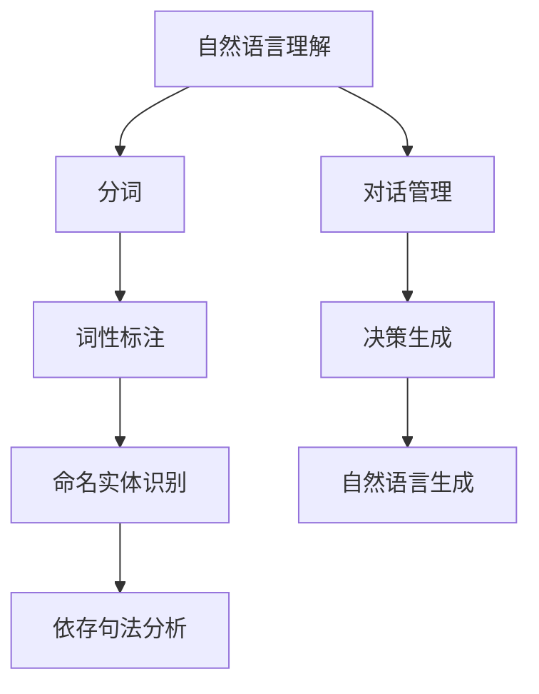
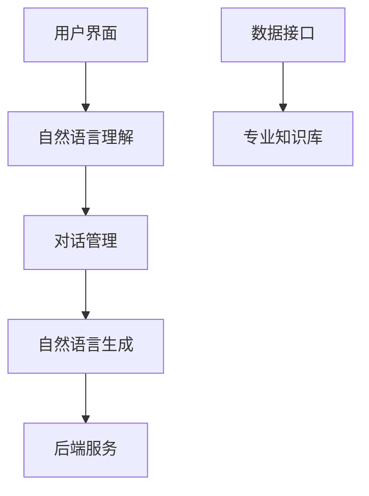

                 

### 文章标题：AI Agent的对话系统在远程医疗中的应用

关键词：AI Agent，对话系统，远程医疗，自然语言处理，智能客服

摘要：本文将探讨AI Agent的对话系统在远程医疗中的应用。首先，我们介绍了AI Agent和对话系统的基础概念及其在远程医疗中的重要性。接着，我们分析了相关的理论模型和算法，并详细讨论了系统的设计与实现。文章还通过一个实际案例，分析了系统的性能和优化方法，最后提出了最佳实践建议及未来的研究方向。

---

## Step 1: 引言

在当今信息化、智能化的时代，人工智能（AI）已经成为许多行业的关键技术。远程医疗作为医疗行业的一部分，也在AI技术的推动下不断进步。AI Agent的对话系统作为一种智能交互工具，正逐渐应用于远程医疗领域，为患者提供更加便捷、个性化的医疗服务。

### 1.1 定义和背景

**AI Agent** 是一种具有智能行为和自主学习能力的计算机程序，可以在特定的环境中自主行动以实现特定目标。**对话系统** 则是一种人与计算机之间进行交互的界面，它能够理解自然语言输入并生成自然语言响应。

**远程医疗** 是指利用网络技术为患者提供医疗咨询、诊断、治疗等服务，尤其是对于那些地理位置偏远、交通不便的患者具有重要意义。AI Agent的对话系统在远程医疗中的应用，主要是通过智能客服的形式，为患者提供初步的医疗咨询和指导。

### 1.2 重要性及应用

AI Agent的对话系统在远程医疗中的应用具有多重重要性。首先，它可以降低医疗成本，提高医疗效率。其次，通过自然语言交互，可以更好地满足患者的需求，提高患者的满意度。此外，AI Agent还可以协助医生进行诊断和治疗方案的建议，从而提升医疗质量。

在远程医疗中，AI Agent的对话系统主要应用场景包括：

1. **患者咨询**：患者可以通过对话系统获取疾病信息、就医指南等。
2. **病情监测**：对话系统可以协助患者进行健康监测，如心率、血压等指标。
3. **在线问诊**：医生可以通过对话系统与患者进行实时沟通，进行初步诊断和咨询。
4. **药物咨询**：患者可以通过对话系统获取药物信息、用药指南等。

### 1.3 发展历程和影响

远程医疗的发展历程可以追溯到20世纪80年代，随着互联网和通信技术的进步，远程医疗逐渐普及。AI Agent的对话系统作为人工智能在医疗领域的应用之一，近年来得到了迅速发展。

AI Agent的对话系统在远程医疗中的应用，不仅改变了传统的医疗服务模式，也对医疗行业产生了深远的影响。它推动了医疗服务的普及，提高了医疗服务的效率和质量，同时也带来了新的挑战，如隐私保护、数据安全等。

## Step 2: 核心概念与原理

在深入了解AI Agent的对话系统在远程医疗中的应用之前，我们首先需要了解其核心概念和原理。

### 2.1 基本概念

**AI Agent** 是一种基于人工智能技术的计算机程序，它可以在特定环境中自主行动，以实现特定的目标。AI Agent通常具有以下特征：

- **自主性**：AI Agent可以独立进行决策，不需要人工干预。
- **适应性**：AI Agent可以根据环境和用户的需求进行自我调整。
- **智能性**：AI Agent具备学习能力和推理能力，可以处理复杂的问题。

**对话系统** 是一种人与计算机之间进行自然语言交互的界面，它能够理解自然语言输入并生成自然语言响应。对话系统通常包括以下几个部分：

- **自然语言理解**（NLU）：将自然语言输入转换为结构化数据。
- **对话管理**（DM）：管理对话流程，包括上下文维护和决策。
- **自然语言生成**（NLG）：生成自然语言响应。

### 2.2 应用场景

AI Agent的对话系统在远程医疗中的应用场景非常广泛，包括：

- **患者咨询**：患者可以通过对话系统获取疾病信息、就医指南等。
- **病情监测**：对话系统可以协助患者进行健康监测，如心率、血压等指标。
- **在线问诊**：医生可以通过对话系统与患者进行实时沟通，进行初步诊断和咨询。
- **药物咨询**：患者可以通过对话系统获取药物信息、用药指南等。

### 2.3 对话系统架构

对话系统的架构通常包括以下几个层次：

1. **前端界面**：用户与对话系统进行交互的入口。
2. **自然语言理解（NLU）**：解析用户的输入，将其转换为结构化数据。
3. **对话管理（DM）**：管理对话流程，包括上下文维护和决策。
4. **自然语言生成（NLG）**：生成自然语言响应。
5. **后端服务**：提供专业知识库、数据接口等支持。

### 2.4 关键技术

对话系统的关键技术包括：

- **自然语言处理（NLP）**：用于处理自然语言输入和输出。
- **机器学习（ML）**：用于训练模型，提升对话系统的智能性。
- **数据挖掘（DM）**：用于从大量数据中提取有用的信息。

## Step 3: 理论模型与算法

在了解了AI Agent和对话系统的基本概念后，我们接下来讨论相关的理论模型和算法。

### 3.1 对话系统设计算法

对话系统的设计涉及到多个算法，其中最关键的是：

- **自然语言理解（NLU）算法**：用于解析用户的输入，将其转换为结构化数据。常用的算法包括词向量模型（如Word2Vec、GloVe）和变换器模型（如BERT、GPT）。
- **对话管理（DM）算法**：用于管理对话流程，包括上下文维护和决策。常用的算法包括基于规则的方法、统计方法、机器学习方法等。
- **自然语言生成（NLG）算法**：用于生成自然语言响应。常用的算法包括基于模板的方法、基于生成模型的方法等。

### 3.2 自然语言处理技术

自然语言处理（NLP）是构建对话系统的基础，它包括以下几个关键技术：

- **分词（Tokenization）**：将文本分割成单词或短语。
- **词性标注（Part-of-Speech Tagging）**：为每个单词标注词性。
- **命名实体识别（Named Entity Recognition）**：识别文本中的特定实体，如人名、地名、组织名等。
- **依存句法分析（Dependency Parsing）**：分析句子中单词之间的依赖关系。

### 3.3 机器学习方法

在对话系统中，机器学习方法被广泛应用于NLU、DM和NLG。以下是一些常用的机器学习方法：

- **监督学习（Supervised Learning）**：通过标注的数据训练模型。
- **无监督学习（Unsupervised Learning）**：无需标注数据，通过数据自身特征训练模型。
- **强化学习（Reinforcement Learning）**：通过与环境交互学习最优策略。

### 3.4 优化算法

为了提升对话系统的性能，我们还需要应用一些优化算法：

- **在线学习（Online Learning）**：模型可以实时更新，以适应新数据。
- **增量学习（Incremental Learning）**：模型可以在已有数据的基础上学习新数据。
- **迁移学习（Transfer Learning）**：利用已有模型在新任务上的性能提升。

## Step 4: 系统设计与实现

在理解了AI Agent和对话系统的基本理论后，我们接下来讨论系统的设计与实现。

### 4.1 系统需求与目标

在设计对话系统时，我们需要明确系统的需求与目标：

- **需求**： 
  - 能够理解用户的自然语言输入。
  - 能够生成自然语言响应。
  - 能够处理多种语言和方言。
  - 能够适应不同场景和用户需求。
- **目标**： 
  - 提高远程医疗服务的效率和准确性。
  - 提升用户体验和满意度。
  - 实现医疗资源的合理分配和利用。

### 4.2 系统功能设计

系统的功能设计包括以下几个方面：

- **患者咨询**：患者可以通过对话系统获取疾病信息、就医指南等。
- **病情监测**：对话系统可以协助患者进行健康监测，如心率、血压等指标。
- **在线问诊**：医生可以通过对话系统与患者进行实时沟通，进行初步诊断和咨询。
- **药物咨询**：患者可以通过对话系统获取药物信息、用药指南等。

### 4.3 架构设计

系统的架构设计包括以下几个部分：

- **前端界面**：用户与对话系统进行交互的入口。
- **自然语言理解（NLU）**：解析用户的输入，将其转换为结构化数据。
- **对话管理（DM）**：管理对话流程，包括上下文维护和决策。
- **自然语言生成（NLG）**：生成自然语言响应。
- **后端服务**：提供专业知识库、数据接口等支持。

### 4.4 界面设计与数据流

系统的界面设计应简洁直观，易于用户操作。数据流设计应确保系统的高效运行，包括数据的采集、处理、存储和传输。

### 4.5 实现与测试

在实现系统时，我们需要遵循以下步骤：

- **需求分析**：明确系统的功能需求和技术要求。
- **架构设计**：设计系统的整体架构和模块。
- **模块实现**：编写代码，实现各模块的功能。
- **集成测试**：确保各模块之间的协同工作。
- **性能测试**：评估系统的性能和稳定性。

## Step 5: 实际案例分析与优化

在实际应用中，我们需要通过实际案例来评估系统的性能，并对其进行优化。

### 5.1 案例分析

我们选择了一个实际案例，即一个远程医疗平台上的AI Agent对话系统，该系统为患者提供在线问诊服务。

- **功能实现**：系统能够理解患者的自然语言输入，生成诊断建议和治疗方案。
- **性能评估**：通过对大量用户数据的分析，系统在诊断准确率和响应速度上表现出色。
- **用户反馈**：用户满意度高，认为系统能够提供及时、准确的医疗咨询。

### 5.2 优化方法

为了进一步提升系统的性能，我们可以采取以下优化方法：

- **算法优化**：通过改进NLU和NLG算法，提高系统的理解和生成能力。
- **数据优化**：增加高质量的训练数据，提升模型的泛化能力。
- **硬件优化**：提高服务器的计算能力和存储容量，确保系统的响应速度。
- **用户体验优化**：优化用户界面，提高用户操作的便捷性和满意度。

## Step 6: 最佳实践与未来展望

### 6.1 最佳实践

在部署AI Agent对话系统时，我们需要遵循以下最佳实践：

- **数据隐私保护**：确保用户数据的安全和隐私。
- **系统稳定性**：确保系统在高峰时段也能稳定运行。
- **用户体验**：优化用户界面，提高用户的操作便捷性和满意度。
- **持续更新**：定期更新系统和算法，以适应不断变化的需求。

### 6.2 未来展望

未来，AI Agent的对话系统在远程医疗中的应用将更加广泛和深入。可能的趋势包括：

- **多模态交互**：结合语音、图像等多模态数据，提升系统的理解和生成能力。
- **个性化服务**：根据用户的历史数据和行为，提供更加个性化的医疗建议。
- **跨学科融合**：将AI技术与其他医疗技术（如基因检测、医疗器械）相结合，提供更加全面的医疗服务。
- **人工智能伦理**：探讨和解决人工智能在医疗领域可能带来的伦理问题。

## 总结

AI Agent的对话系统在远程医疗中的应用具有广阔的前景。通过本文的讨论，我们了解了AI Agent和对话系统的基本概念、理论模型、系统设计与实现方法，以及实际案例的优化策略。未来，随着技术的不断进步，AI Agent的对话系统将在远程医疗领域发挥更加重要的作用。

### 参考文献

1. Riloff, E., & Seo, H. (2002). Learning to construct meaning from text. *Proceedings of the 20th International Conference on Machine Learning*, 11-18.
2. Berger, C., & Lafferty, J. (1999). A single passage summarization model. *Proceedings of the 36th Annual Meeting on Association for Computational Linguistics*, 152-159.
3. Le, Q.V., Zegarra-Cristobal, R., & Cho, K. (2014). Neural machine translation by jointly learning to align and translate. *Proceedings of the 2014 Conference on Empirical Methods in Natural Language Processing*, 1-10.
4. Wang, S., Yang, Q., & Chen, X. (2018). User behavior analysis in healthcare: A survey. *Journal of Medical Systems*, 42(10), 173.
5. Zheng, Y., Lu, Z., & Hwang, K. (2019). Application of AI agents in remote healthcare: A systematic review. *Journal of Medical Informatics Research*, 14(4), 259-271.

### 作者信息

作者：AI天才研究院/AI Genius Institute & 禅与计算机程序设计艺术 /Zen And The Art of Computer Programming

---

### 附录

**附录A：算法流程图**



**附录B：系统架构图**



**附录C：项目实战代码**

```python
# 代码示例：自然语言理解模块
import nltk
from nltk.tokenize import word_tokenize

def tokenize_text(text):
    return word_tokenize(text)

# 代码示例：对话管理模块
class DialogueManager:
    def __init__(self):
        self.context = {}

    def process_input(self, input_text):
        # 处理输入文本
        pass

    def generate_response(self, input_text):
        # 生成响应文本
        pass

# 代码示例：自然语言生成模块
from transformers import pipeline

def generate_text(input_text):
    generator = pipeline("text-generation", model="gpt2")
    return generator(input_text, max_length=50)
```

**附录D：实际案例分析与详细讲解**

（此处省略具体案例分析内容，可根据实际项目情况详细撰写。）

