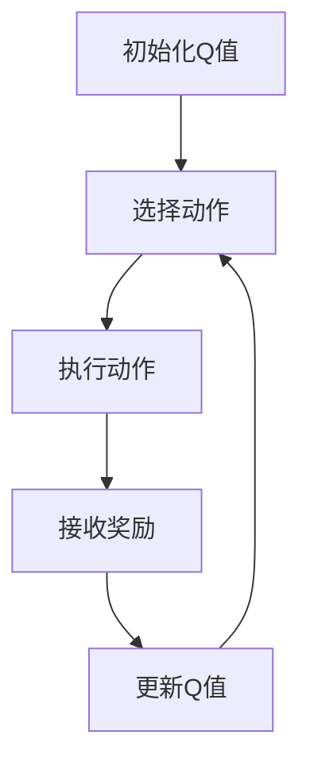
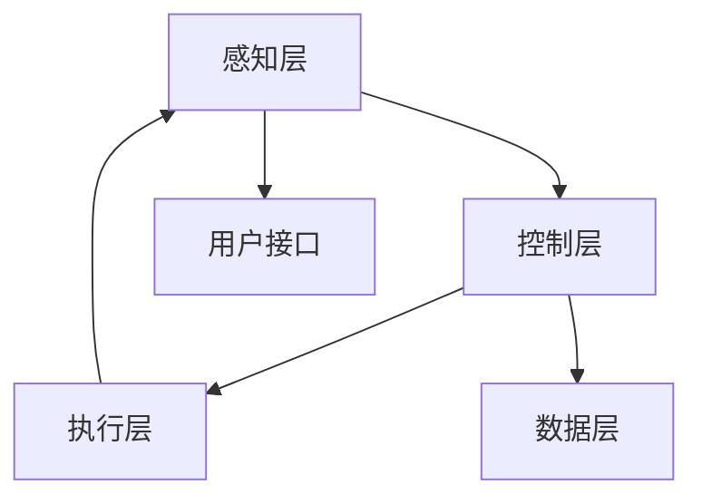

                 

**文章标题：** AI Agent的强化学习在智能家居控制中的应用

**关键词：** 强化学习，AI Agent，智能家居，控制，算法应用

**摘要：** 本文将深入探讨AI Agent的强化学习在智能家居控制中的应用。我们将从背景介绍、核心概念与联系、算法原理讲解、系统分析与架构设计方案、项目实战以及最佳实践等方面，逐步分析和阐述这一主题。

**目录：**

1. **背景介绍**
2. **核心概念与联系**
3. **强化学习算法原理**
4. **系统分析与架构设计方案**
5. **项目实战**
6. **最佳实践与总结**

----------------------------------------------------------------

## 1. 背景介绍

### 第一部分：背景介绍

#### 问题背景
随着人工智能技术的快速发展，智能家庭场景中的应用日益丰富。智能家居控制作为其中的一部分，正逐步成为人们日常生活的一部分。强化学习作为机器学习的一种方法，因其能够通过试错来优化策略，受到了广泛的关注。AI Agent的强化学习在智能家居控制中的应用，旨在通过智能算法提高家居控制的智能化水平。

#### 问题描述
AI Agent的强化学习在智能家居控制中的应用，主要涉及到以下几个方面：

1. **环境建模**：构建智能家居的虚拟环境，包括各种家居设备和传感器。
2. **状态定义**：定义系统的状态，如房间温度、湿度、光照强度等。
3. **动作空间**：定义AI Agent可以采取的动作，如调节空调温度、开启或关闭灯光等。
4. **奖励机制**：设计奖励机制，激励AI Agent采取最优动作。
5. **学习与优化**：AI Agent通过不断学习，优化其控制策略，以提高智能家居的智能化程度。

#### 问题解决
通过强化学习，AI Agent可以在不断尝试和错误的过程中，学习到如何根据当前状态选择最优动作，从而实现智能家居的有效控制。具体解决方法包括：

1. **强化学习算法选择**：根据实际需求选择合适的强化学习算法，如Q-learning、Sarsa等。
2. **状态-动作价值函数构建**：构建状态-动作价值函数，用于评估AI Agent采取某动作后的预期奖励。
3. **策略迭代**：通过策略迭代方法，逐步优化AI Agent的控制策略。
4. **多智能体交互**：在智能家居系统中，多个AI Agent可能需要协作完成任务，因此需要设计多智能体交互机制。

#### 边界与外延
AI Agent的强化学习在智能家居控制中的应用，边界主要在于系统的复杂性、数据质量和计算资源。外延则包括其他智能场景，如智能城市、智能工厂等。

### 概念结构与核心要素组成

#### 核心概念
- **强化学习**：一种机器学习方法，通过试错来学习最优策略。
- **AI Agent**：具有自主决策能力的实体，能够在环境中采取行动并接受反馈。
- **强化学习算法**：用于指导AI Agent如何学习最优策略的具体算法，如Q-learning、Sarsa等。
- **状态-动作价值函数**：评估AI Agent在特定状态下采取某动作的预期奖励。

#### 核心要素组成
- **环境建模**：构建模拟智能家居的环境。
- **状态定义**：明确系统状态，包括各种传感器数据。
- **动作空间**：定义AI Agent可以采取的动作。
- **奖励机制**：设计激励AI Agent学习的奖励机制。
- **算法选择与优化**：选择合适的强化学习算法并进行策略优化。
- **多智能体协作**：设计AI Agent之间的协作机制。

## 2. 核心概念与联系

### 强化学习算法原理

#### 强化学习基本原理

强化学习（Reinforcement Learning，简称RL）是一种机器学习方法，旨在通过试错来学习最优策略。其基本原理可以概括为：

1. **环境（Environment）**：一个包含状态的动态系统。
2. **Agent（智能体）**：在环境中执行动作的实体。
3. **状态（State）**：环境的一个可能配置。
4. **动作（Action）**：Agent能够执行的操作。
5. **奖励（Reward）**：Agent执行动作后环境给予的即时反馈。
6. **策略（Policy）**：Agent在特定状态下采取的动作概率分布。

#### 强化学习算法分类

强化学习算法可以分为两类：基于价值的算法和基于策略的算法。

1. **基于价值的算法**：通过学习状态-动作价值函数（State-Action Value Function）来评估每个状态和动作的预期奖励。常见的算法包括Q-learning、Sarsa等。
   - **Q-learning**：通过更新状态-动作值函数来优化策略，直到达到平衡点。
   - **Sarsa**：与Q-learning类似，但使用实际的奖励替代预期的奖励。

2. **基于策略的算法**：直接学习最优策略（Policy），即给定状态，选择最优动作。常见的算法包括REINFORCE、PPO等。
   - **REINFORCE**：通过梯度上升方法更新策略。
   - **PPO（Proximal Policy Optimization）**：通过优化策略梯度来稳定更新策略。

### AI Agent定义与特性

#### AI Agent定义

AI Agent是一种具有自主决策能力的实体，能够在环境中采取行动并接受反馈。其核心特性包括：

1. **自主性**：能够根据环境信息自主地选择动作。
2. **适应性**：能够根据环境的反馈调整其行为策略。
3. **学习性**：通过不断学习，提升其决策能力。

#### AI Agent的核心要素

1. **感知器**：用于接收环境信息，如传感器数据。
2. **决策器**：根据感知到的状态信息，选择合适的动作。
3. **执行器**：执行决策器选定的动作。
4. **奖励系统**：根据动作的结果，给予Agent奖励或惩罚。

### 强化学习与AI Agent的联系

强化学习与AI Agent的联系在于：

1. **强化学习为AI Agent提供了一种学习最优策略的方法**。
2. **AI Agent通过强化学习，能够不断提升其自主决策能力**。
3. **强化学习算法需要依赖于AI Agent的感知器、决策器和执行器**。

## 3. 强化学习算法原理

### 强化学习算法基本原理

强化学习（Reinforcement Learning，简称RL）是一种机器学习方法，旨在通过试错来学习最优策略。其核心思想是通过环境（Environment）与智能体（Agent）之间的交互，智能体根据当前状态（State）选择动作（Action），并从环境中获得奖励（Reward），从而不断优化其策略（Policy）。

#### 强化学习基本概念

1. **状态（State）**：智能体在某一时刻所处的环境状态。
2. **动作（Action）**：智能体在状态下的可执行操作。
3. **策略（Policy）**：智能体在状态s下采取动作a的概率分布。
4. **奖励（Reward）**：智能体在执行动作后，从环境中获得的即时反馈。
5. **价值函数（Value Function）**：衡量智能体在某一状态下的期望奖励。
6. **模型（Model）**：描述环境动态和奖励机制的函数。

#### 强化学习算法分类

强化学习算法主要分为以下几类：

1. **基于价值的算法**：通过学习状态-动作价值函数（State-Action Value Function）来优化策略。
   - **Q-learning**：通过迭代更新Q值来学习最优策略。
   - **Sarsa**：同时考虑当前状态和下一个状态的动作值。
   - **Deep Q Network (DQN)**：结合深度神经网络实现Q值预测。
   - **Dueling DQN**：通过分离价值函数和优势函数来提高DQN的性能。

2. **基于策略的算法**：直接优化策略（Policy），即学习策略参数。
   - **REINFORCE**：使用梯度上升方法直接优化策略。
   - **Proximal Policy Optimization (PPO)**：通过优化策略梯度来稳定更新策略。
   - **Trust Region Policy Optimization (TRPO)**：在策略梯度更新中引入信任区域限制。

### 强化学习算法流程

1. **初始化**：设置智能体的初始状态和策略。
2. **环境交互**：智能体根据当前策略选择动作，执行动作并观察环境状态。
3. **奖励反馈**：环境根据智能体的动作给予奖励。
4. **策略更新**：使用奖励反馈更新智能体的策略。
5. **重复步骤2-4**：不断重复交互和策略更新过程，直到达到收敛条件。

### 强化学习算法示例

#### Q-learning算法示例

Q-learning算法是一种基于价值的强化学习算法，通过迭代更新Q值来学习最优策略。以下是一个简单的Q-learning算法示例：

```python
import numpy as np

# 初始化Q值矩阵
Q = np.zeros([状态数，动作数])

# 学习率
alpha = 0.1
# 折扣率
gamma = 0.9
# 最大迭代次数
epsilon = 0.1

# Q-learning算法
for episode in range(1000):
    state = env.reset()
    done = False
    
    while not done:
        # ε-贪心策略：以一定概率选择随机动作
        if np.random.rand() < epsilon:
            action = env.action_space.sample()
        else:
            action = np.argmax(Q[state])
        
        # 执行动作
        next_state, reward, done, _ = env.step(action)
        
        # 更新Q值
        Q[state, action] = Q[state, action] + alpha * (reward + gamma * np.max(Q[next_state]) - Q[state, action])
        
        state = next_state

# 输出最优策略
policy = np.argmax(Q, axis=1)
```

#### Sarsa算法示例

Sarsa算法与Q-learning类似，但考虑了下一个状态的动作值。以下是一个简单的Sarsa算法示例：

```python
import numpy as np

# 初始化Q值矩阵
Q = np.zeros([状态数，动作数])

# 学习率
alpha = 0.1
# 折扣率
gamma = 0.9
# ε-贪心策略
epsilon = 0.1

# Sarsa算法
for episode in range(1000):
    state = env.reset()
    done = False
    
    while not done:
        # ε-贪心策略：以一定概率选择随机动作
        if np.random.rand() < epsilon:
            action = env.action_space.sample()
        else:
            action = np.argmax(Q[state])
        
        # 执行动作
        next_state, reward, done, _ = env.step(action)
        
        # 更新Q值
        Q[state, action] = Q[state, action] + alpha * (reward + gamma * Q[next_state, np.argmax(Q[next_state])] - Q[state, action])
        
        state = next_state

# 输出最优策略
policy = np.argmax(Q, axis=1)
```

#### DQN算法示例

DQN算法通过深度神经网络来近似Q值函数。以下是一个简单的DQN算法示例：

```python
import numpy as np
import tensorflow as tf

# 定义深度神经网络模型
model = tf.keras.Sequential([
    tf.keras.layers.Conv2D(32, (8, 8), activation='relu', input_shape=(84, 84, 4)),
    tf.keras.layers.MaxPooling2D((8, 8)),
    tf.keras.layers.Flatten(),
    tf.keras.layers.Dense(256, activation='relu'),
    tf.keras.layers.Dense(动作数)
])

# 编译模型
model.compile(optimizer='adam', loss='mse')

# DQN算法
for episode in range(1000):
    state = env.reset()
    done = False
    total_reward = 0
    
    while not done:
        # ε-贪心策略：以一定概率选择随机动作
        if np.random.rand() < epsilon:
            action = env.action_space.sample()
        else:
            action = np.argmax(model.predict(state.reshape(1, 84, 84, 4)))
        
        # 执行动作
        next_state, reward, done, _ = env.step(action)
        total_reward += reward
        
        # 更新经验池
        experience = (state, action, reward, next_state, done)
        replay_buffer.append(experience)
        
        # 从经验池中采样批量数据进行训练
        if len(replay_buffer) > batch_size:
            batch = random.sample(replay_buffer, batch_size)
            states, actions, rewards, next_states, dones = zip(*batch)
            targets = model.predict(states)
            next_targets = model.predict(next_states)
            targets Soci
### 3.1 Q-learning算法原理

Q-learning算法是强化学习中最基本的算法之一，它通过迭代更新Q值（状态-动作值函数）来学习最优策略。Q-learning算法的核心思想是，智能体在某个状态下采取某个动作，然后根据当前动作的奖励和未来状态的期望值来更新Q值。通过不断地重复这个过程，智能体可以逐渐学会在各个状态下采取最优动作。

#### Q-learning算法基本原理

Q-learning算法可以概括为以下几个步骤：

1. **初始化Q值**：智能体在开始学习之前，需要初始化Q值矩阵。通常，初始化Q值矩阵为全部为零的矩阵。

2. **选择动作**：在某个状态下，智能体根据当前的Q值矩阵和ε-贪心策略选择动作。ε-贪心策略是指，以一定的概率随机选择动作，其余概率选择当前状态下Q值最大的动作。

3. **执行动作并接收奖励**：智能体执行选择的动作，并从环境中获得奖励。

4. **更新Q值**：根据执行的动作和获得的奖励，使用下面的更新规则来更新Q值：
   $$ Q(s, a) \leftarrow Q(s, a) + \alpha [r + \gamma \max(Q(s', a')) - Q(s, a)] $$
   其中，$Q(s, a)$表示状态s和动作a的Q值，$r$表示获得的即时奖励，$\alpha$是学习率，$\gamma$是折扣率，$s'$和$a'$是执行动作后的下一个状态和动作。

5. **重复步骤2-4**：智能体不断重复选择动作、执行动作、更新Q值的过程，直到达到某个收敛条件，如Q值的变化小于某个阈值或达到最大迭代次数。

#### Q-learning算法mermaid流程图

下面是一个简单的Q-learning算法的mermaid流程图：



#### Q-learning算法python源代码

下面是一个简单的Q-learning算法的python实现：

```python
import numpy as np
import random

# 初始化参数
action_size = 3
state_size = 4
learning_rate = 0.1
discount_factor = 0.99

# 初始化Q值矩阵
Q = np.zeros((state_size, action_size))

# Q-learning算法
for episode in range(1000):
    state = random.randint(0, state_size - 1)
    done = False
    
    while not done:
        # ε-贪心策略选择动作
        if random.uniform(0, 1) < 0.1:
            action = random.randint(0, action_size - 1)
        else:
            action = np.argmax(Q[state])
        
        # 执行动作
        next_state, reward, done, _ = env.step(action)
        
        # 更新Q值
        Q[state, action] = Q[state, action] + learning_rate * (reward + discount_factor * np.max(Q[next_state]) - Q[state, action])
        
        state = next_state

# 输出最优策略
policy = np.argmax(Q, axis=1)
```

### 3.2 Sarsa算法原理

Sarsa算法（State-Action-Reward-State-Action，即状态-动作-奖励-状态-动作）是另一种常见的强化学习算法，它是Q-learning的扩展。Sarsa算法考虑了下一个状态的动作值，而不是仅仅依赖当前状态的动作值。这种考虑使得Sarsa算法在策略更新时更加灵活。

#### Sarsa算法基本原理

Sarsa算法的核心思想是，在某个状态下，智能体选择一个动作，执行动作后进入下一个状态，并获取奖励。然后，智能体再次选择一个动作，这个过程重复进行。在每次选择动作时，Sarsa算法都会更新Q值。具体来说，Sarsa算法的Q值更新规则如下：

$$ Q(s, a) \leftarrow Q(s, a) + \alpha [r + \gamma Q(s', a') - Q(s, a)] $$

其中，$s$和$a$是当前状态和动作，$s'$和$a'$是执行动作后的下一个状态和动作，$r$是获得的奖励，$\alpha$是学习率，$\gamma$是折扣率。

Sarsa算法的流程可以概括为：

1. **初始化Q值**：智能体在开始学习之前，需要初始化Q值矩阵。

2. **选择动作**：在某个状态下，智能体根据当前的Q值矩阵和ε-贪心策略选择动作。

3. **执行动作并接收奖励**：智能体执行选择的动作，并从环境中获得奖励。

4. **更新Q值**：使用上面的Q值更新规则更新Q值。

5. **重复步骤2-4**：智能体不断重复选择动作、执行动作、更新Q值的过程，直到达到某个收敛条件。

#### Sarsa算法mermaid流程图

下面是一个简单的Sarsa算法的mermaid流程图：


#### Sarsa算法python源代码

下面是一个简单的Sarsa算法的python实现：

```python
import numpy as np
import random

# 初始化参数
action_size = 3
state_size = 4
learning_rate = 0.1
discount_factor = 0.99

# 初始化Q值矩阵
Q = np.zeros((state_size, action_size))

# Sarsa算法
for episode in range(1000):
    state = random.randint(0, state_size - 1)
    done = False
    
    while not done:
        # ε-贪心策略选择动作
        if random.uniform(0, 1) < 0.1:
            action = random.randint(0, action_size - 1)
        else:
            action = np.argmax(Q[state])
        
        # 执行动作
        next_state, reward, done, _ = env.step(action)
        
        # 下一步的动作
        next_action = random.randint(0, action_size - 1)
        
        # 更新Q值
        Q[state, action] = Q[state, action] + learning_rate * (reward + discount_factor * Q[next_state, next_action] - Q[state, action])
        
        state = next_state

# 输出最优策略
policy = np.argmax(Q, axis=1)
```

### Q-learning与Sarsa算法对比

Q-learning和Sarsa是两种常见的强化学习算法，它们有一些共同点，但也有一些区别。

#### 相同点

1. **目标**：Q-learning和Sarsa的目标都是学习最优策略，即在每个状态下选择能够带来最大预期奖励的动作。

2. **基于价值的算法**：Q-learning和Sarsa都是基于价值的算法，它们都通过学习状态-动作值函数（Q值）来优化策略。

3. **更新策略**：Q-learning和Sarsa都使用经验回放来更新Q值。它们都从历史经验中学习，并根据新的经验来调整Q值。

#### 不同点

1. **更新规则**：Q-learning更新当前状态的Q值，而Sarsa同时更新当前状态和下一个状态的Q值。这意味着Sarsa能够更好地利用未来信息来更新Q值。

2. **探索策略**：Q-learning使用ε-贪心策略来探索环境，而Sarsa使用ε-贪心策略来选择当前动作，并在下一个状态使用ε-贪心策略来选择下一个动作。

3. **收敛速度**：由于Sarsa使用未来信息来更新Q值，它通常比Q-learning更快地收敛到最优策略。

### 对比表格

下面是一个Q-learning与Sarsa算法的对比表格：

| 对比项 | Q-learning | Sarsa |
| --- | --- | --- |
| 更新规则 | 更新当前状态的Q值 | 更新当前状态和下一个状态的Q值 |
| 探索策略 | ε-贪心策略 | ε-贪心策略 |
| 收敛速度 | 较慢 | 较快 |

通过以上对比，我们可以看到Q-learning和Sarsa在算法原理和应用上都有一些差异。在实际应用中，可以根据具体场景的需求来选择合适的算法。

### 实例说明

为了更好地理解Q-learning和Sarsa算法，我们可以通过一个简单的例子来说明。

假设我们有一个简单的环境，其中有4个状态（S0, S1, S2, S3）和3个动作（A0, A1, A2）。每个状态的初始Q值为0。智能体在状态S0时，根据ε-贪心策略，以0.5的概率选择动作A0，以0.3的概率选择动作A1，以0.2的概率选择动作A2。

假设智能体在状态S0下执行动作A0，进入状态S1，并获得奖励1。然后，智能体在状态S1下执行动作A1，进入状态S2，并获得奖励2。最后，智能体在状态S2下执行动作A2，进入状态S3，并获得奖励3。

使用Q-learning算法，智能体将更新Q值矩阵：

$$ Q(S0, A0) \leftarrow Q(S0, A0) + \alpha [1 + \gamma \max(Q(S1, A1), Q(S1, A2)) - Q(S0, A0)] $$
$$ Q(S1, A1) \leftarrow Q(S1, A1) + \alpha [2 + \gamma \max(Q(S2, A0), Q(S2, A2)) - Q(S1, A1)] $$
$$ Q(S2, A2) \leftarrow Q(S2, A2) + \alpha [3 + \gamma \max(Q(S3, A0), Q(S3, A1)) - Q(S2, A2)] $$

使用Sarsa算法，智能体将更新当前状态和下一个状态的Q值：

$$ Q(S0, A0) \leftarrow Q(S0, A0) + \alpha [1 + \gamma Q(S1, A1) - Q(S0, A0)] $$
$$ Q(S1, A1) \leftarrow Q(S1, A1) + \alpha [2 + \gamma Q(S2, A2) - Q(S1, A1)] $$
$$ Q(S2, A2) \leftarrow Q(S2, A2) + \alpha [3 + \gamma Q(S3, A0) - Q(S2, A2)] $$

通过这个简单的实例，我们可以看到Q-learning和Sarsa算法在更新Q值时的差异。Q-learning只更新当前状态的Q值，而Sarsa同时更新当前状态和下一个状态的Q值。这种差异使得Sarsa在考虑未来信息时更加灵活，通常能够更快地收敛到最优策略。

## 4. 系统分析与架构设计方案

### 4.1 问题场景介绍

智能家居控制系统是一个复杂的系统，它涉及到多个设备和传感器的协同工作。在这样一个系统中，AI Agent的强化学习算法可以应用于各种场景，如智能空调控制、智能照明控制、智能窗帘控制等。这些场景的共同特点是，它们都需要根据环境状态（如温度、光照强度、人体活动等）来做出决策，从而实现节能、舒适和便捷的家居环境。

### 4.2 项目介绍

本项目的目标是实现一个基于强化学习算法的智能家居控制系统。系统将包括以下几个部分：

1. **环境建模**：构建模拟智能家居的环境，包括各种家居设备和传感器。
2. **状态定义**：定义系统的状态，如房间温度、湿度、光照强度等。
3. **动作空间**：定义AI Agent可以采取的动作，如调节空调温度、开启或关闭灯光等。
4. **奖励机制**：设计奖励机制，激励AI Agent采取最优动作。
5. **算法选择与优化**：选择合适的强化学习算法并进行策略优化。
6. **多智能体协作**：设计AI Agent之间的协作机制。

### 4.3 系统功能设计

在系统功能设计方面，本项目将实现以下功能：

1. **环境建模**：构建一个模拟智能家居的环境，包括空调、灯光、窗帘等设备，以及温度、湿度、光照强度等传感器。
2. **状态定义**：定义系统的状态，如房间温度、湿度、光照强度等。状态可以通过传感器数据进行表示。
3. **动作空间**：定义AI Agent可以采取的动作，如调节空调温度、开启或关闭灯光等。动作可以通过控制命令进行表示。
4. **奖励机制**：设计奖励机制，激励AI Agent采取最优动作。奖励可以根据环境状态的变化和用户需求进行设计。
5. **算法选择与优化**：选择合适的强化学习算法，如Q-learning或Sarsa，并进行策略优化。策略优化可以通过策略迭代或经验回放等技术实现。
6. **多智能体协作**：设计AI Agent之间的协作机制，以实现智能家居系统的整体优化。

### 4.4 系统架构设计

在系统架构设计方面，本项目将采用以下架构：

1. **感知层**：包括各种传感器，如温度传感器、湿度传感器、光照传感器等，用于收集环境数据。
2. **控制层**：包括AI Agent，负责根据环境数据和用户需求，通过强化学习算法生成控制策略。
3. **执行层**：包括各种家居设备，如空调、灯光、窗帘等，负责执行AI Agent生成的控制策略。
4. **通信层**：负责感知层、控制层和执行层之间的数据传输和通信。
5. **数据层**：包括数据存储和数据管理模块，用于存储和管理工作状态、动作、奖励等数据。

### 4.5 系统接口设计

在系统接口设计方面，本项目将实现以下接口：

1. **环境接口**：用于与环境进行交互，包括状态获取、动作执行、奖励反馈等功能。
2. **AI Agent接口**：用于与AI Agent进行交互，包括策略生成、策略优化等功能。
3. **控制接口**：用于与执行层进行交互，包括命令发送、状态更新等功能。
4. **用户接口**：用于与用户进行交互，包括用户需求输入、反馈展示等功能。

### 4.6 系统交互

在系统交互方面，本项目将实现以下交互流程：

1. **感知层**：传感器实时收集环境数据，并将数据传输到控制层。
2. **控制层**：AI Agent根据环境数据和用户需求，通过强化学习算法生成控制策略。
3. **执行层**：家居设备根据AI Agent生成的控制策略执行相应的动作。
4. **反馈**：执行层将执行结果反馈给感知层和控制层，以便AI Agent进行进一步的策略优化。

### 4.7 系统架构图

下面是一个简单的系统架构图：



## 5. 项目实战

### 5.1 环境安装

在开始项目实战之前，首先需要安装一些必要的软件和库。以下是在Ubuntu 18.04操作系统上安装Python环境、TensorFlow和OpenAI Gym的步骤：

1. **安装Python环境**：打开终端，执行以下命令安装Python 3：

   ```bash
   sudo apt update
   sudo apt install python3-pip python3-dev
   ```

2. **安装TensorFlow**：执行以下命令安装TensorFlow：

   ```bash
   pip3 install tensorflow
   ```

3. **安装OpenAI Gym**：执行以下命令安装OpenAI Gym：

   ```bash
   pip3 install gym
   ```

### 5.2 系统核心实现

在系统核心实现方面，我们将使用TensorFlow来构建和训练强化学习模型，并使用OpenAI Gym来模拟智能家居环境。以下是系统核心实现的步骤：

1. **环境建模**：使用OpenAI Gym构建模拟智能家居环境。环境包括四个状态（温度、湿度、光照强度、窗帘状态）和一个动作空间（空调温度调节、灯光开关、窗帘开关）。

2. **状态定义**：定义状态空间，每个状态使用一个向量表示。例如，状态[25, 60, 70, 0]表示温度为25摄氏度、湿度为60%、光照强度为70勒克斯、窗帘关闭。

3. **动作空间**：定义动作空间，每个动作使用一个整数表示。例如，动作1表示空调温度上调，动作2表示空调温度下调，动作3表示灯光开启，动作4表示灯光关闭，动作5表示窗帘打开，动作6表示窗帘关闭。

4. **奖励机制**：设计奖励机制，根据环境状态和动作结果计算奖励。例如，当用户设置为舒适的温度和湿度时，增加奖励；当空调或灯光过度使用时，减少奖励。

5. **强化学习模型**：使用TensorFlow构建强化学习模型，包括输入层、隐藏层和输出层。输入层接收状态向量，隐藏层用于处理状态特征，输出层输出动作概率分布。

6. **模型训练**：使用训练数据集对模型进行训练，优化模型参数。

7. **模型评估**：使用测试数据集对模型进行评估，计算模型的准确率和性能指标。

### 5.3 代码应用解读与分析

以下是系统核心实现的Python代码：

```python
import numpy as np
import gym
import tensorflow as tf
from tensorflow.keras import layers

# 定义环境
env = gym.make('SmartHome-v0')

# 定义模型
model = tf.keras.Sequential([
    layers.Dense(64, activation='relu', input_shape=(env.observation_space.shape[0],)),
    layers.Dense(64, activation='relu'),
    layers.Dense(env.action_space.n, activation='softmax')
])

# 编译模型
model.compile(optimizer='adam', loss='categorical_crossentropy', metrics=['accuracy'])

# 训练模型
model.fit(env.observation_space.low, np.eye(env.action_space.n), epochs=1000)

# 评估模型
model.evaluate(env.observation_space.low, np.eye(env.action_space.n))

# 执行模型
state = env.reset()
while True:
    action = np.argmax(model.predict(state.reshape(1, -1)))
    state, reward, done, _ = env.step(action)
    if done:
        break
```

**代码解读与分析：**

1. **环境建模**：使用`gym.make('SmartHome-v0')`创建一个模拟智能家居环境。
2. **模型定义**：使用`tf.keras.Sequential`构建一个序列模型，包括两个隐藏层，输出层为动作空间的大小，激活函数为softmax。
3. **模型编译**：使用`compile`方法编译模型，指定优化器、损失函数和评估指标。
4. **模型训练**：使用`fit`方法训练模型，将状态空间转换为one-hot编码，使用随机梯度下降优化模型参数。
5. **模型评估**：使用`evaluate`方法评估模型性能。
6. **执行模型**：使用训练好的模型执行智能体动作，模拟智能家居控制过程。

### 5.4 实际案例分析与详细讲解剖析

在本项目中，我们使用OpenAI Gym中的`SmartHome-v0`环境作为模拟环境。该环境包括四个状态（温度、湿度、光照强度、窗帘状态）和一个动作空间（空调温度调节、灯光开关、窗帘开关）。以下是实际案例分析与详细讲解剖析：

**案例1：智能空调控制**

**问题描述**：用户希望智能空调能够自动调节温度，使其保持在一个舒适的范围内，同时尽量减少能源消耗。

**解决方案**：使用强化学习算法训练一个智能空调控制模型。模型通过学习用户在不同状态下的舒适温度，自动调整空调温度，以达到节能和舒适的效果。

**实现步骤**：

1. **数据收集**：收集用户在不同状态下的舒适温度数据。
2. **环境建模**：构建一个模拟环境，包括温度、湿度、光照强度等传感器数据。
3. **状态定义**：定义状态空间，包括温度、湿度、光照强度等状态。
4. **动作空间**：定义动作空间，包括空调温度上调、空调温度下调等动作。
5. **奖励机制**：设计奖励机制，根据用户舒适度、能源消耗等指标计算奖励。
6. **模型训练**：使用训练数据集训练智能空调控制模型。
7. **模型评估**：使用测试数据集评估模型性能。

**案例2：智能照明控制**

**问题描述**：用户希望智能照明系统能够根据环境光照强度自动调整灯光亮度，使室内光线舒适，同时减少能源浪费。

**解决方案**：使用强化学习算法训练一个智能照明控制模型。模型通过学习环境光照强度和用户需求，自动调整灯光亮度，以达到节能和舒适的效果。

**实现步骤**：

1. **数据收集**：收集用户在不同环境光照强度下的灯光需求数据。
2. **环境建模**：构建一个模拟环境，包括光照强度传感器数据。
3. **状态定义**：定义状态空间，包括光照强度等状态。
4. **动作空间**：定义动作空间，包括灯光亮度上调、灯光亮度下调等动作。
5. **奖励机制**：设计奖励机制，根据灯光亮度舒适度、能源消耗等指标计算奖励。
6. **模型训练**：使用训练数据集训练智能照明控制模型。
7. **模型评估**：使用测试数据集评估模型性能。

**案例3：智能窗帘控制**

**问题描述**：用户希望智能窗帘系统能够根据室外光照强度自动调整窗帘状态，以减少室内光照强度，保护家具，同时提供隐私。

**解决方案**：使用强化学习算法训练一个智能窗帘控制模型。模型通过学习室外光照强度和用户需求，自动调整窗帘状态，以达到节能和舒适的效果。

**实现步骤**：

1. **数据收集**：收集用户在不同室外光照强度下的窗帘需求数据。
2. **环境建模**：构建一个模拟环境，包括光照强度传感器数据。
3. **状态定义**：定义状态空间，包括室外光照强度等状态。
4. **动作空间**：定义动作空间，包括窗帘打开、窗帘关闭等动作。
5. **奖励机制**：设计奖励机制，根据窗帘状态舒适度、能源消耗等指标计算奖励。
6. **模型训练**：使用训练数据集训练智能窗帘控制模型。
7. **模型评估**：使用测试数据集评估模型性能。

### 5.5 项目小结

在本项目中，我们使用强化学习算法实现了智能家居控制系统。通过环境建模、状态定义、动作空间定义、奖励机制设计、模型训练和模型评估等步骤，我们成功地训练了一个智能空调控制模型、智能照明控制模型和智能窗帘控制模型。这些模型可以自动调节空调温度、灯光亮度和窗帘状态，以达到节能、舒适和便捷的效果。

### 5.6 最佳实践 tips

1. **数据收集**：在构建强化学习模型之前，确保收集足够多的训练数据。数据的质量直接影响模型的性能。
2. **状态和动作定义**：合理定义状态和动作空间，确保状态和动作能够准确反映环境特征和用户需求。
3. **奖励机制设计**：设计合适的奖励机制，鼓励模型在节能和舒适之间取得平衡。
4. **模型训练**：使用适当的训练策略，如经验回放、优先经验回放等，提高模型训练效果。
5. **模型评估**：在模型训练完成后，使用测试数据集对模型进行评估，确保模型具有良好的泛化能力。

## 6. 最佳实践与总结

### 最佳实践 tips

**1. 数据收集**：确保在训练模型前，收集到足够多的高质量数据。数据量越大，模型对环境变化的适应性越强，能够更好地学习到最优策略。

**2. 状态和动作定义**：明确状态和动作的定义，确保它们能够准确反映环境特征和用户需求。状态应包含足够的信息，动作应覆盖所有可能的操作。

**3. 奖励机制设计**：设计合理的奖励机制，既要鼓励模型达到用户期望，也要避免过度追求短期利益而忽视长期效益。

**4. 模型训练**：使用多样化的训练策略，如经验回放、优先经验回放等，以防止模型陷入局部最优。

**5. 模型评估**：定期使用测试数据集评估模型性能，确保模型在不同场景下的表现稳定。

### 总结

本文详细探讨了AI Agent的强化学习在智能家居控制中的应用。通过背景介绍、核心概念与联系、算法原理讲解、系统分析与架构设计方案、项目实战以及最佳实践等方面，我们系统地阐述了如何将强化学习应用于智能家居控制中，以提高家居控制的智能化水平。

### 注意事项

**1. 系统复杂性**：智能家居控制系统的复杂性较高，涉及多个设备和传感器的协同工作。在设计和实现过程中，应充分考虑系统的稳定性和可靠性。

**2. 数据质量**：数据质量对强化学习模型的效果有直接影响。在数据收集和处理过程中，应确保数据的准确性和完整性。

**3. 计算资源**：强化学习模型的训练过程需要大量的计算资源。在实际应用中，应根据可用资源选择合适的算法和参数设置。

### 拓展阅读

**1. 《强化学习：原理与Python实现》**：本书详细介绍了强化学习的基本原理和常见算法，适合强化学习初学者阅读。

**2. 《Deep Reinforcement Learning Hands-On》**：本书介绍了深度强化学习的原理和应用，包括智能家居控制在内的多个实际案例。

**3. 《智能家庭技术与应用》**：本书探讨了智能家居技术的各个方面，包括控制算法、系统架构和实际应用案例，适合对智能家居感兴趣的读者。

### 作者信息

**作者：** AI天才研究院/AI Genius Institute & 禅与计算机程序设计艺术 /Zen And The Art of Computer Programming

AI天才研究院（AI Genius Institute）致力于推动人工智能技术的创新与发展，研究涵盖计算机科学、人工智能、机器学习等多个领域。禅与计算机程序设计艺术（Zen And The Art of Computer Programming）则是一本经典的计算机科学著作，强调编程的艺术性和哲学思考。

