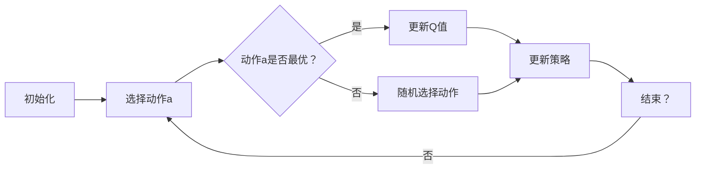
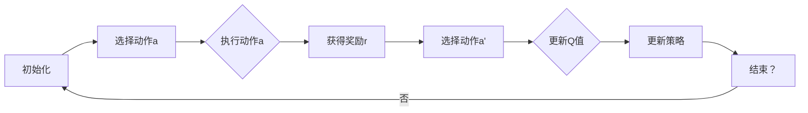

                 

### 让我们一步步思考：AI Agent的强化学习在自动化测试中的应用

#### 问题背景

在信息技术飞速发展的今天，自动化测试已经成为软件工程中不可或缺的一部分。随着软件系统的复杂性不断增加，手工测试已经难以满足快速迭代和大规模测试的需求。自动化测试通过预定义的测试脚本和工具，自动执行测试用例，从而提高测试效率和覆盖率。

然而，传统的自动化测试方法通常依赖于预定义的测试脚本，这些脚本往往需要人为干预来适应系统的变更。这种依赖性限制了自动化测试的灵活性和适应性。为了解决这个问题，近年来人工智能（AI）在自动化测试中的应用受到了广泛关注，特别是AI Agent的强化学习。

AI Agent是一种能够自主学习并适应环境变化的智能体，强化学习则是AI Agent进行学习的一种方法。强化学习通过不断地试错和反馈，逐步优化行为策略，从而实现智能体在复杂环境中的自主决策。

#### 问题概述

本文将探讨如何将AI Agent的强化学习应用于自动化测试中。具体来说，我们将解答以下几个问题：

1. **AI Agent是什么？** 它是如何工作的，以及在自动化测试中有什么应用？
2. **强化学习的基本原理是什么？** 它如何帮助AI Agent在自动化测试中学习并优化测试策略？
3. **强化学习算法在自动化测试中的具体实现是怎样的？** 我们将使用Q-learning和SARSA算法为例进行详细讲解。
4. **如何设计一个基于强化学习的自动化测试系统？** 我们将介绍系统架构和接口设计。
5. **如何实施一个实际项目？** 我们将通过一个案例展示如何使用AI Agent和强化学习进行自动化测试。

#### 问题解决

为了深入理解上述问题，我们将分几个部分进行详细探讨：

1. **背景介绍**：首先，我们将介绍AI Agent、强化学习和自动化测试的背景知识，包括它们的发展历程、现状和未来趋势。
2. **核心概念与联系**：接下来，我们将深入讲解AI Agent、强化学习和自动化测试的核心概念，并通过表格和ER实体关系图来展示它们之间的联系。
3. **算法原理讲解**：我们将详细讲解强化学习的算法原理，包括Q-learning和SARSA算法，并使用mermaid流程图和Python源代码进行阐述。
4. **系统分析与架构设计方案**：我们将介绍如何将强化学习应用于自动化测试中，包括系统功能设计、架构设计、接口设计和系统交互。
5. **项目实战**：我们将通过一个实际案例，展示如何使用AI Agent和强化学习进行自动化测试，并提供详细的代码解析和分析。
6. **最佳实践与小结**：最后，我们将总结最佳实践经验，给出注意事项和拓展阅读，帮助读者更好地理解和应用这些技术。

### 边界与外延

在本文的讨论中，我们将主要关注以下边界和范围：

- **AI Agent**：我们将关注能够应用于自动化测试的AI Agent类型，如基于深度学习的图像识别AI Agent和基于强化学习的行为决策AI Agent。
- **强化学习算法**：我们将重点介绍Q-learning和SARSA算法，这两种算法在自动化测试中的应用广泛且具有代表性。
- **自动化测试场景**：我们将主要讨论自动化测试在Web应用和移动应用中的具体应用，包括功能测试、性能测试和兼容性测试。
- **系统设计**：我们将介绍基于强化学习的自动化测试系统的整体架构，包括测试脚本生成、测试执行和测试结果分析等功能。

### 概念结构与核心要素组成

为了更好地理解AI Agent的强化学习在自动化测试中的应用，我们首先需要明确以下几个核心概念：

- **AI Agent**：一个能够感知环境、执行动作并从环境中获取反馈的智能体。在自动化测试中，AI Agent可以自动生成测试脚本、执行测试用例并优化测试策略。
- **强化学习**：一种通过试错和反馈来学习最优行为策略的机器学习方法。在自动化测试中，强化学习可以帮助AI Agent根据测试结果不断调整测试策略，提高测试效率和覆盖率。
- **自动化测试**：使用预定义的测试脚本和工具自动执行测试用例，以检测软件系统的缺陷。通过AI Agent和强化学习，自动化测试可以变得更加智能和自适应。

### 总结

本文将通过一步步的分析和推理，深入探讨AI Agent的强化学习在自动化测试中的应用。我们将从背景介绍、核心概念与联系、算法原理讲解、系统分析与架构设计方案、项目实战以及最佳实践与小结等方面，全面解析这一前沿技术。希望通过本文，读者能够对AI Agent的强化学习在自动化测试中的应用有更深入的理解和认识。接下来，我们将正式进入背景介绍部分，对AI Agent、强化学习和自动化测试进行详细的背景介绍。

----------------------------------------------------------------
## 第一部分: 背景介绍

## 第1章: AI Agent、强化学习与自动化测试概述

在信息技术飞速发展的背景下，AI Agent、强化学习和自动化测试这三大技术领域逐渐崭露头角，并在现代软件工程中发挥着重要作用。本章将详细介绍AI Agent、强化学习和自动化测试的基本概念、发展历程、现状以及未来趋势，为后续章节的深入探讨奠定基础。

### 1.1 AI Agent的定义与分类

AI Agent，即人工智能代理，是指一种能够感知环境、执行动作并从环境中获取反馈的智能体。在人工智能系统中，AI Agent通常被视为具有自主决策能力的实体，能够在动态环境中进行任务执行和优化。根据不同的应用场景，AI Agent可以分为以下几种类型：

1. **感知型Agent**：这种类型的Agent主要通过感知环境中的信息来做出决策。例如，在自动驾驶领域，感知型Agent通过摄像头、雷达和激光雷达等感知设备获取道路信息，然后做出行驶决策。
2. **行动型Agent**：行动型Agent不仅能够感知环境，还能够根据感知到的信息执行具体的动作。例如，在机器人领域，行动型Agent通过执行物理操作，如移动、抓取等，来完成特定的任务。
3. **决策型Agent**：这种类型的Agent主要负责在复杂环境中做出最优决策。例如，在金融投资领域，决策型Agent通过分析市场数据和用户需求，来制定最优的投资策略。

### 1.2 强化学习的基本概念与原理

强化学习（Reinforcement Learning，RL）是一种通过试错和反馈来学习最优行为策略的机器学习方法。与监督学习和无监督学习不同，强化学习通过智能体（Agent）在环境（Environment）中不断地试错和反馈，逐步优化行为策略。强化学习的基本原理可以概括为以下几个步骤：

1. **状态（State）**：智能体在环境中的当前状态，状态是智能体感知环境信息的结果。
2. **动作（Action）**：智能体在特定状态下可以采取的行为。
3. **奖励（Reward）**：智能体执行动作后，环境对其行为的反馈。奖励可以是正面的，表示行为得到了环境的认可，也可以是负面的，表示行为引起了环境的惩罚。
4. **策略（Policy）**：智能体在特定状态下的最优动作选择策略。
5. **价值函数（Value Function）**：衡量智能体在特定状态下的期望收益。
6. **模型（Model）**：智能体对环境状态转移概率和奖励的预测模型。

强化学习的基本过程是：智能体根据当前状态选择动作，执行动作后，获得环境的奖励，并根据奖励调整策略，以最大化长期累积奖励。常见的强化学习算法包括Q-learning、SARSA、Deep Q-Networks（DQN）等。

### 1.3 自动化测试的发展历程与现状

自动化测试是指通过预定义的测试脚本和工具，自动执行测试用例，以检测软件系统的缺陷。自动化测试的发展历程可以追溯到20世纪80年代，当时自动化测试工具开始出现，如QTP（现在的UFT）、WinRunner等。随着计算机技术和软件工程的发展，自动化测试逐渐成为软件工程中不可或缺的一部分。

目前，自动化测试在软件行业中已经得到了广泛应用，主要应用于以下几个方面：

1. **功能测试**：验证软件系统功能是否符合设计要求，如单元测试、集成测试、系统测试等。
2. **性能测试**：评估软件系统在特定负载下的性能，如响应时间、吞吐量、并发用户数等。
3. **兼容性测试**：验证软件系统在不同平台、操作系统、浏览器等环境下的兼容性。

自动化测试的优势在于可以提高测试效率、减少人工测试工作量、提高测试覆盖率、降低测试成本等。然而，传统的自动化测试方法也存在一些局限性，如测试脚本依赖性高、维护成本高、测试效率受限等。为了解决这些问题，近年来人工智能和强化学习在自动化测试中的应用受到了广泛关注。

### 1.4 AI Agent、强化学习与自动化测试的结合点

AI Agent、强化学习和自动化测试的结合点主要体现在以下几个方面：

1. **自适应测试**：通过强化学习，AI Agent可以根据测试过程中的反馈，自动调整测试策略，从而实现自适应测试，提高测试效率和覆盖率。
2. **智能测试脚本生成**：AI Agent可以通过深度学习等技术，自动生成测试脚本，减少人工编写脚本的工作量，提高测试脚本的生成效率。
3. **智能缺陷定位**：AI Agent可以通过分析测试结果，自动定位缺陷，并提供缺陷修复建议，提高缺陷修复效率。
4. **智能化测试管理**：AI Agent可以通过对测试数据的分析和预测，优化测试资源的分配，提高测试过程的智能化水平。

### 1.5 本章小结

本章对AI Agent、强化学习和自动化测试的基本概念、发展历程、现状和未来趋势进行了介绍。通过本章的学习，读者可以了解这三个领域的基本知识，为后续章节的深入探讨打下基础。在接下来的章节中，我们将进一步分析AI Agent、强化学习和自动化测试之间的核心概念与联系，并探讨如何将强化学习应用于自动化测试中。

----------------------------------------------------------------
## 第二部分: 核心概念与联系

### 第2章: AI Agent的核心概念

AI Agent作为人工智能系统中的一个重要组成部分，其核心概念和原理决定了其在自动化测试中的应用效果。在这一章中，我们将深入探讨AI Agent的基本架构、类型与特点，以及其在自动化测试中的工作原理。

### 2.1 AI Agent的基本架构

AI Agent通常由以下几个关键组件组成：

1. **感知器（Perception）**：感知器负责收集环境中的信息，如传感器数据、用户输入、文本、图像等。感知器是Agent与外部环境进行交互的接口。
2. **知识库（Knowledge Base）**：知识库存储Agent的经验、知识、规则和模型，用于决策和推理。知识库可以是显式的，如规则库，也可以是隐式的，如神经网络模型。
3. **决策器（Decision Maker）**：决策器根据感知器收集的信息和知识库中的知识，生成行动计划。决策器通常采用算法模型，如强化学习算法。
4. **执行器（Executor）**：执行器负责执行决策器生成的行动。执行器可以是物理设备，如机器人手臂，也可以是虚拟设备，如软件程序。
5. **反馈器（Feedback）**：反馈器负责接收环境对行动的反馈，并将其传递给感知器和知识库，以更新Agent的行为策略。

### 2.2 AI Agent的类型与特点

AI Agent根据其应用场景和功能特点，可以分为多种类型：

1. **基于规则的Agent**：这种Agent使用预定义的规则进行决策。它们在简单和规则明确的环境中表现良好，但难以应对复杂和动态变化的场景。
2. **基于模型的Agent**：这种Agent使用数学模型进行决策。它们通过学习环境中的状态和奖励，生成最优策略。例如，强化学习Agent使用Q-learning或SARSA算法来优化行为策略。
3. **基于机器学习的Agent**：这种Agent使用机器学习算法，如深度神经网络，来学习和预测环境中的状态转移和奖励。它们在复杂和动态环境中表现出强大的适应性。
4. **混合型Agent**：这种Agent结合了基于规则、模型和机器学习的方法。它们在规则明确和复杂动态环境中都能够表现出良好的适应性。

### 2.3 AI Agent在自动化测试中的工作原理

在自动化测试中，AI Agent通过以下步骤实现测试自动化：

1. **感知**：AI Agent感知测试环境中的信息，如测试数据、系统状态等。
2. **决策**：根据感知到的信息，AI Agent使用强化学习算法生成测试策略。例如，Q-learning算法通过评估不同测试动作的预期奖励，选择最优的测试动作。
3. **执行**：AI Agent执行选定的测试动作，如生成测试脚本、执行测试用例等。
4. **反馈**：执行测试动作后，AI Agent收集测试结果，并根据测试结果更新其测试策略。
5. **优化**：通过不断感知、决策、执行和反馈，AI Agent逐步优化测试策略，提高测试效率和覆盖率。

### 2.4 AI Agent在自动化测试中的应用

AI Agent在自动化测试中的应用主要体现在以下几个方面：

1. **测试脚本生成**：AI Agent可以通过学习历史测试数据，自动生成测试脚本，减少人工编写脚本的工作量。
2. **测试策略优化**：AI Agent可以根据测试过程中的反馈，自动调整测试策略，提高测试效率和覆盖率。
3. **缺陷定位**：AI Agent可以通过分析测试结果，自动定位缺陷，并提供缺陷修复建议。
4. **测试资源管理**：AI Agent可以通过对测试数据的分析，优化测试资源的分配，提高测试过程的智能化水平。

### 2.5 本章小结

通过本章的学习，我们了解了AI Agent的基本架构、类型与特点，以及其在自动化测试中的应用原理。AI Agent通过感知、决策、执行和反馈，实现了自动化测试的智能化和自适应化。在下一章中，我们将进一步探讨强化学习的基本概念和原理，并分析其如何帮助AI Agent在自动化测试中学习并优化测试策略。

----------------------------------------------------------------
## 第3章: 强化学习的基本概念

强化学习（Reinforcement Learning，RL）作为机器学习的一个重要分支，因其能够使智能体在动态环境中通过试错学习最优策略而备受关注。在本章中，我们将深入探讨强化学习的基本原理、算法分类及其在自动化测试中的应用。

### 3.1 强化学习的基本原理

强化学习的基本原理可以概括为智能体（Agent）在与环境的交互过程中，通过不断地试错和反馈，学习如何采取最优动作以最大化累积奖励。强化学习的关键要素包括：

1. **状态（State）**：描述智能体在环境中的当前情况。状态可以是一个向量，表示智能体的位置、环境中的其他实体等信息。
2. **动作（Action）**：智能体可以采取的行为。动作的集合称为动作空间（Action Space）。
3. **奖励（Reward）**：智能体执行动作后，环境对其行为的即时反馈。奖励可以是正面的，表示行为带来了积极的结果，也可以是负面的，表示行为带来了不利的结果。
4. **策略（Policy）**：智能体在给定状态下选择动作的规则。策略决定了智能体如何响应不同的状态。
5. **价值函数（Value Function）**：衡量智能体在特定状态下的期望收益。价值函数分为状态价值函数（State Value Function）和动作价值函数（Action Value Function）。
6. **模型（Model）**：智能体对环境状态转移概率和奖励的预测模型。模型可以帮助智能体预测不同动作的未来收益。

强化学习的核心目标是找到一种最优策略，使得智能体在长期内获得的累积奖励最大化。这一过程通常通过迭代更新策略和价值函数来实现。

### 3.2 强化学习的算法分类

强化学习算法可以根据不同的分类标准进行划分。以下是几种常见的强化学习算法：

1. **值函数方法**：
   - **Q-learning**：通过迭代更新动作价值函数来学习最优策略。Q-learning算法简单高效，适用于有限状态和动作空间的问题。
   - **SARSA**（同步优势估计）：在每一步都更新当前状态和动作的价值函数，适用于有限和无限状态空间的问题。
   - **深Q网络（DQN）**：结合深度学习技术，通过神经网络来近似值函数。DQN算法适用于处理高维状态空间的问题。

2. **策略梯度方法**：
   - **策略迭代（Policy Iteration）**：直接优化策略，通过迭代更新策略来最大化累积奖励。
   - **策略搜索（Policy Search）**：使用搜索算法直接优化策略，如演化策略（Evolution Strategies，ES）和随机梯度策略搜索（Stochastic Gradient Policy Search，PG）。

3. **强化学习算法的应用领域**：
   - **控制问题**：在自动化测试中，强化学习可以用于测试脚本的生成和优化，提高测试效率和覆盖率。
   - **游戏AI**：强化学习在游戏中的应用非常广泛，如围棋、电子竞技等。
   - **机器人**：在机器人领域，强化学习可以用于路径规划、对象抓取等任务。

### 3.3 强化学习在自动化测试中的作用

强化学习在自动化测试中的应用主要体现在以下几个方面：

1. **自适应测试策略**：通过强化学习，智能体可以根据测试过程中的反馈，动态调整测试策略，从而提高测试效率和覆盖率。例如，在测试过程中，如果某个测试用例经常失败，智能体可以减少对该测试用例的执行次数，或者重新生成测试脚本。

2. **测试脚本优化**：强化学习可以用于优化测试脚本，使其更加有效。例如，通过分析历史测试数据，智能体可以识别出关键测试路径，并优先执行这些路径，以提高测试覆盖率。

3. **缺陷定位**：强化学习可以帮助智能体在测试过程中定位缺陷。通过分析测试结果和执行动作的奖励，智能体可以识别出引起缺陷的测试用例或测试环境配置，从而更快地定位和修复缺陷。

4. **测试资源管理**：强化学习可以用于优化测试资源的分配，如测试机器、测试数据等。通过分析测试数据和历史测试结果，智能体可以动态调整测试资源的分配，以提高测试效率。

### 3.4 强化学习算法在自动化测试中的应用案例

以下是一个强化学习在自动化测试中的应用案例：

**案例**：在一个电子商务网站中，智能体需要自动生成测试脚本，以检测网站的购买流程。智能体通过感知用户行为、网站状态和测试结果，使用强化学习算法动态调整测试策略。

**步骤**：
1. **初始化**：智能体初始化状态和价值函数。
2. **感知**：智能体感知用户行为和网站状态，如用户添加商品到购物车、点击结算按钮等。
3. **决策**：智能体根据当前状态和价值函数选择测试动作，如执行购买流程、检查页面跳转等。
4. **执行**：智能体执行选定的测试动作，并收集测试结果。
5. **反馈**：智能体根据测试结果更新价值函数和策略。
6. **优化**：智能体根据更新后的价值函数和策略，优化测试脚本和测试策略。

通过这个案例，我们可以看到强化学习在自动化测试中的应用潜力。智能体通过不断学习和优化，可以自适应地调整测试策略，提高测试效率和覆盖率。

### 3.5 本章小结

通过本章的学习，我们深入了解了强化学习的基本原理、算法分类及其在自动化测试中的应用。强化学习为智能体在动态环境中学习最优策略提供了一种有效的方法，可以显著提高自动化测试的效率和准确性。在下一章中，我们将进一步探讨强化学习算法的详细实现，并通过mermaid流程图和Python源代码来具体展示Q-learning和SARSA算法在自动化测试中的应用。

----------------------------------------------------------------
## 第4章: 自动化测试的核心概念

自动化测试作为现代软件工程中不可或缺的一部分，其核心概念和流程对于确保软件质量和提高开发效率具有重要意义。本章将详细介绍自动化测试的基本概念、发展历程、主要类型及其在软件工程中的应用。

### 4.1 自动化测试的基本概念

自动化测试是指通过预定义的测试脚本和工具，自动执行测试用例，以检测软件系统的缺陷。自动化测试的核心目标是提高测试效率和覆盖率，减少手工测试的工作量，确保软件质量。

自动化测试的主要组成部分包括：

1. **测试用例（Test Cases）**：测试用例是测试过程中最小的可执行单元，它描述了输入条件、操作步骤和预期结果。每个测试用例都是对软件系统的一个具体测试请求。
2. **测试脚本（Test Scripts）**：测试脚本是一系列预定义的操作步骤，用于自动化执行测试用例。测试脚本通常使用特定的编程语言或脚本语言编写，如Selenium、Appium等。
3. **测试工具（Test Tools）**：测试工具是用于编写、执行和管理测试脚本的工具。常见的测试工具包括QTP（UFT）、Selenium、JUnit、TestNG等。
4. **测试环境（Test Environment）**：测试环境是测试过程中模拟的真实或虚拟环境，用于执行测试用例。测试环境通常包括操作系统、浏览器、数据库等配置。

### 4.2 自动化测试的发展历程

自动化测试的发展历程可以追溯到20世纪80年代。当时，随着软件系统的复杂性和规模的增加，手工测试已经难以满足测试需求。为了提高测试效率和覆盖率，自动化测试工具开始出现。

1. **早期阶段**：早期的自动化测试主要基于预定义的测试脚本，如QTP（现在的UFT）和WinRunner等。这些工具通过录制和回放用户操作，生成测试脚本。
2. **成熟阶段**：随着测试工具的成熟和普及，自动化测试逐渐成为软件工程中的标准流程。Selenium、Appium等开源测试工具的出现，进一步推动了自动化测试的发展。
3. **智能化阶段**：近年来，人工智能和机器学习技术的引入，使得自动化测试更加智能化。智能测试脚本生成、自适应测试策略和智能缺陷定位等新技术的应用，显著提高了自动化测试的效率和准确性。

### 4.3 自动化测试的主要类型

自动化测试根据测试目标和测试内容的不同，可以分为以下几种主要类型：

1. **功能测试（Functional Testing）**：功能测试验证软件系统的功能是否符合设计要求。功能测试包括单元测试、集成测试、系统测试等层次。
2. **性能测试（Performance Testing）**：性能测试评估软件系统在特定负载下的性能，如响应时间、吞吐量、并发用户数等。性能测试主要关注系统的性能指标，以确保系统在高负载下的稳定性和可靠性。
3. **兼容性测试（Compatibility Testing）**：兼容性测试验证软件系统在不同平台、操作系统、浏览器等环境下的兼容性。兼容性测试有助于确保软件系统在各种环境中都能正常运行。
4. **安全测试（Security Testing）**：安全测试检测软件系统中的安全漏洞，如SQL注入、XSS攻击等。安全测试是保护软件系统免受恶意攻击和未授权访问的重要手段。
5. **回归测试（Regression Testing）**：回归测试验证新代码更改是否引入了新的缺陷，确保软件系统的整体稳定性。回归测试通常在软件迭代过程中进行，以验证变更的影响。

### 4.4 自动化测试的现状与挑战

自动化测试在软件工程中已经得到了广泛应用，但其发展仍然面临一些挑战：

1. **测试脚本依赖性高**：传统的自动化测试方法通常依赖于预定义的测试脚本，这些脚本在系统变更时需要不断更新和维护，增加了测试工作的负担。
2. **维护成本高**：自动化测试脚本需要定期维护和更新，以确保测试的有效性和准确性。维护成本高昂，限制了自动化测试的普及和应用。
3. **测试效率受限**：传统的自动化测试方法在应对复杂和动态变化的场景时，测试效率和覆盖率有限。如何提高自动化测试的效率，成为当前研究的热点。
4. **测试数据管理**：自动化测试需要大量的测试数据来验证软件系统的功能和性能。测试数据的管理和存储成为自动化测试的一个重要挑战。

### 4.5 AI Agent与强化学习在自动化测试中的应用

为了解决上述挑战，近年来人工智能和强化学习技术在自动化测试中的应用受到了广泛关注。AI Agent和强化学习为自动化测试带来了以下新的可能性：

1. **自适应测试策略**：通过强化学习，AI Agent可以根据测试过程中的反馈，动态调整测试策略，提高测试效率和覆盖率。
2. **智能测试脚本生成**：AI Agent可以通过机器学习和深度学习技术，自动生成测试脚本，减少人工编写脚本的工作量。
3. **智能缺陷定位**：AI Agent可以通过分析测试结果，自动定位缺陷，并提供缺陷修复建议，提高缺陷修复效率。
4. **测试资源管理**：AI Agent可以通过对测试数据的分析，优化测试资源的分配，提高测试过程的智能化水平。

### 4.6 本章小结

通过本章的学习，我们深入了解了自动化测试的基本概念、发展历程、主要类型及其在软件工程中的应用。自动化测试为提高软件质量和开发效率提供了有力支持。然而，传统的自动化测试方法仍面临一些挑战。随着人工智能和强化学习技术的发展，AI Agent和强化学习在自动化测试中的应用前景广阔，有望解决当前自动化测试中的一些难题。在下一章中，我们将进一步探讨强化学习算法的详细实现，并通过mermaid流程图和Python源代码来具体展示Q-learning和SARSA算法在自动化测试中的应用。

----------------------------------------------------------------
## 第5章: AI Agent、强化学习与自动化测试的联系

在本章中，我们将深入探讨AI Agent、强化学习与自动化测试之间的紧密联系。通过分析这些核心概念之间的联系，我们可以更好地理解如何将强化学习应用于自动化测试中，从而提高测试效率和覆盖率。

### 5.1 AI Agent在自动化测试中的应用

AI Agent在自动化测试中扮演着至关重要的角色，其主要作用体现在以下几个方面：

1. **测试脚本生成**：AI Agent可以通过深度学习技术，自动生成高质量的测试脚本，减少手工编写脚本的工作量。例如，使用自然语言处理（NLP）技术，AI Agent可以理解用户需求，并生成对应的测试脚本。
2. **测试策略优化**：AI Agent可以根据测试过程中的反馈，动态调整测试策略。通过强化学习，AI Agent可以不断优化测试策略，以提高测试效率和覆盖率。例如，Q-learning算法可以根据测试结果的奖励，选择最优的测试动作。
3. **缺陷定位**：AI Agent可以通过分析测试结果，自动定位缺陷。例如，在自动化测试过程中，AI Agent可以识别出失败的测试用例，并分析其失败原因，从而快速定位缺陷。
4. **测试资源管理**：AI Agent可以通过对测试数据的分析，优化测试资源的分配。例如，在负载测试中，AI Agent可以根据系统性能指标，动态调整测试负载，以提高测试效率。

### 5.2 强化学习在自动化测试中的作用

强化学习为AI Agent在自动化测试中的应用提供了强大的支持。通过强化学习，AI Agent可以不断优化测试策略，从而提高测试效率和覆盖率。以下是强化学习在自动化测试中的一些具体应用：

1. **自适应测试**：强化学习可以帮助AI Agent在测试过程中自适应地调整测试策略。例如，当某个测试用例频繁失败时，AI Agent可以减少对该测试用例的执行次数，或者重新生成测试脚本。
2. **测试脚本优化**：强化学习可以帮助AI Agent优化测试脚本，使其更加有效。例如，通过分析历史测试数据，AI Agent可以识别出关键测试路径，并优先执行这些路径，以提高测试覆盖率。
3. **缺陷定位**：强化学习可以帮助AI Agent在测试过程中快速定位缺陷。通过分析测试结果和执行动作的奖励，AI Agent可以识别出引起缺陷的测试用例或测试环境配置。
4. **测试资源管理**：强化学习可以帮助AI Agent优化测试资源的分配，如测试机器、测试数据等。通过分析测试数据和历史测试结果，AI Agent可以动态调整测试资源的分配，以提高测试效率。

### 5.3 自动化测试对AI Agent的需求

自动化测试对AI Agent的需求主要体现在以下几个方面：

1. **自适应能力**：自动化测试环境通常是动态变化的，AI Agent需要具备较强的自适应能力，以应对环境变化。通过强化学习，AI Agent可以不断学习并调整测试策略，以适应新的测试场景。
2. **学习能力**：AI Agent需要具备较强的学习能力，以快速理解和适应自动化测试的需求。例如，在生成测试脚本时，AI Agent需要理解用户需求，并将其转化为具体的测试脚本。
3. **决策能力**：AI Agent需要具备较强的决策能力，以根据测试结果和奖励，动态调整测试策略。通过强化学习，AI Agent可以在复杂的环境中做出最优决策。
4. **可靠性**：AI Agent需要具备较高的可靠性，以确保测试结果的准确性和一致性。通过强化学习，AI Agent可以在测试过程中不断优化测试策略，提高测试结果的可靠性。

### 5.4 AI Agent、强化学习与自动化测试的ER实体关系图

为了更清晰地展示AI Agent、强化学习与自动化测试之间的联系，我们使用ER实体关系图进行描述。以下是一个简化的ER实体关系图：

```mermaid
erDiagram
    AI_Agent ||--|{ 强化学习 } : 实现算法
    强化学习 ||--|{ 自动化测试 } : 应用场景
    AI_Agent ||--|{ 自动化测试 } : 应用实例
```

在该ER实体关系图中：

- **AI_Agent**：表示人工智能代理，是自动化测试中的核心组件。
- **强化学习**：表示AI Agent采用的算法，用于优化测试策略。
- **自动化测试**：表示AI Agent应用的具体场景，涵盖测试脚本生成、测试策略优化、缺陷定位和测试资源管理等方面。

通过该ER实体关系图，我们可以直观地了解AI Agent、强化学习与自动化测试之间的联系和互动关系。

### 5.5 本章小结

通过本章的学习，我们深入探讨了AI Agent、强化学习与自动化测试之间的联系。AI Agent作为自动化测试的核心组件，通过强化学习算法的优化，可以提高测试效率和覆盖率。同时，自动化测试为AI Agent提供了丰富的应用场景，推动了人工智能和强化学习技术在自动化测试中的发展。在下一章中，我们将详细讲解强化学习的算法原理，并通过mermaid流程图和Python源代码进行阐述。

----------------------------------------------------------------
## 第三部分: 算法原理讲解

### 第6章: 强化学习在自动化测试中的应用

强化学习在自动化测试中的应用具有重要意义。本章将详细讲解强化学习的算法原理，并以Q-learning和SARSA算法为例，说明如何在自动化测试中实现和应用这些算法。通过这一章的学习，读者可以理解强化学习算法的基本概念、数学模型以及实际应用。

### 6.1 Q-learning算法在自动化测试中的应用

Q-learning算法是一种基于值函数的强化学习算法，通过迭代更新值函数来学习最优策略。在自动化测试中，Q-learning算法可以用于测试脚本的生成和优化。以下是Q-learning算法的基本原理：

1. **状态-动作值函数**：Q-learning算法的核心是状态-动作值函数（Q值），表示在特定状态下采取特定动作的预期回报。Q值的更新公式为：
   $$ Q(s, a) = Q(s, a) + \alpha [r + \gamma \max_{a'} Q(s', a') - Q(s, a)] $$
   其中，$s$ 和 $a$ 分别表示当前状态和动作，$r$ 表示即时奖励，$\gamma$ 是折扣因子，$\alpha$ 是学习率。

2. **选择动作**：在给定状态下，Q-learning算法根据当前值函数选择动作。通常采用$\epsilon$-贪心策略，即在一定概率下随机选择动作，以避免过早收敛到局部最优解。

3. **更新策略**：根据反馈的即时奖励和下一状态，Q-learning算法不断更新值函数，逐步优化测试策略。

在自动化测试中，Q-learning算法可以用于以下应用场景：

1. **测试脚本生成**：通过分析历史测试数据，Q-learning算法可以生成具有高覆盖率的测试脚本。例如，在Web应用测试中，Q-learning算法可以根据页面结构和用户行为，生成测试脚本，以覆盖更多的功能点。

2. **测试策略优化**：在测试过程中，Q-learning算法可以根据反馈的测试结果，动态调整测试策略。例如，当某个测试用例频繁失败时，Q-learning算法可以减少对该测试用例的执行次数，以提高测试效率。

### 6.2 SARSA算法在自动化测试中的应用

SARSA（同步优势估计）算法是另一种基于值函数的强化学习算法，与Q-learning算法类似，但不同的是SARSA算法在每个时间步都更新当前的状态-动作值函数。以下是SARSA算法的基本原理：

1. **状态-动作值函数**：SARSA算法同样使用状态-动作值函数（Q值），更新公式为：
   $$ Q(s, a) = Q(s, a) + \alpha [r + \gamma Q(s', a')] - Q(s, a)] $$
   其中，$s$ 和 $a$ 分别表示当前状态和动作，$s'$ 和 $a'$ 分别表示下一状态和动作，$r$ 表示即时奖励，$\gamma$ 是折扣因子，$\alpha$ 是学习率。

2. **选择动作**：SARSA算法同样采用$\epsilon$-贪心策略，在给定状态下选择动作。

3. **更新策略**：SARSA算法在每个时间步更新状态-动作值函数，逐步优化测试策略。

在自动化测试中，SARSA算法可以用于以下应用场景：

1. **测试脚本生成**：通过分析历史测试数据，SARSA算法可以生成具有高覆盖率的测试脚本。例如，在移动应用测试中，SARSA算法可以根据用户行为和页面跳转关系，生成测试脚本，以覆盖更多的功能点。

2. **测试策略优化**：在测试过程中，SARSA算法可以根据反馈的测试结果，动态调整测试策略。例如，当某个测试用例频繁失败时，SARSA算法可以减少对该测试用例的执行次数，以提高测试效率。

### 6.3 Q-learning算法的mermaid流程图

为了更好地理解Q-learning算法的原理，我们使用mermaid流程图来展示其基本流程。以下是Q-learning算法的mermaid流程图：



在该流程图中：

- **A**：初始化状态-动作值函数。
- **B**：根据当前状态选择动作。
- **C**：判断当前动作是否最优。
- **D**：如果当前动作不是最优，更新状态-动作值函数。
- **E**：如果当前动作是最优，随机选择动作。
- **F**：更新策略。
- **G**：判断是否结束，如果未结束，返回B。

### 6.4 SARSA算法的mermaid流程图

同样地，我们使用mermaid流程图来展示SARSA算法的基本流程。以下是SARSA算法的mermaid流程图：



在该流程图中：

- **A**：初始化状态-动作值函数。
- **B**：根据当前状态选择动作。
- **C**：执行动作，获得奖励。
- **D**：根据奖励和下一状态选择动作。
- **E**：更新状态-动作值函数。
- **F**：更新策略。
- **G**：判断是否结束，如果未结束，返回A。

### 6.5 Q-learning算法的Python代码实现

以下是一个简单的Q-learning算法的Python代码实现示例：

```python
import numpy as np

def q_learning(env, alpha=0.1, gamma=0.9, epsilon=0.1, n_episodes=1000):
    Q = np.zeros((env.nS, env.nA))
    
    for episode in range(n_episodes):
        state = env.reset()
        done = False
        
        while not done:
            action = env.sample_action(Q[state], epsilon)
            next_state, reward, done, _ = env.step(action)
            
            Q[state, action] = Q[state, action] + alpha * (reward + gamma * np.max(Q[next_state]) - Q[state, action])
            state = next_state
    
    return Q

# 示例：使用CartPole环境
import gym
env = gym.make('CartPole-v1')
Q = q_learning(env)
```

在该代码中，我们定义了一个q_learning函数，用于实现Q-learning算法。通过迭代更新状态-动作值函数，我们可以学习到最优策略。

### 6.6 SARSA算法的Python代码实现

以下是一个简单的SARSA算法的Python代码实现示例：

```python
import numpy as np

def sarsa_learning(env, alpha=0.1, gamma=0.9, epsilon=0.1, n_episodes=1000):
    Q = np.zeros((env.nS, env.nA))
    
    for episode in range(n_episodes):
        state = env.reset()
        done = False
        
        while not done:
            action = env.sample_action(Q[state], epsilon)
            next_state, reward, done, _ = env.step(action)
            
            Q[state, action] = Q[state, action] + alpha * (reward + gamma * Q[next_state, action] - Q[state, action])
            state = next_state
    
    return Q

# 示例：使用CartPole环境
import gym
env = gym.make('CartPole-v1')
Q = sarsa_learning(env)
```

在该代码中，我们定义了一个sarsa_learning函数，用于实现SARSA算法。通过在每个时间步更新状态-动作值函数，我们可以学习到最优策略。

### 6.7 算法原理的数学模型和公式

以下是Q-learning和SARSA算法的核心数学模型和公式：

1. **Q-learning算法**：
   - **状态-动作值函数**：$Q(s, a)$
   - **Q值更新公式**：$Q(s, a) = Q(s, a) + \alpha [r + \gamma \max_{a'} Q(s', a') - Q(s, a)]$
   - **动作选择策略**：$\epsilon$-贪心策略

2. **SARSA算法**：
   - **状态-动作值函数**：$Q(s, a)$
   - **Q值更新公式**：$Q(s, a) = Q(s, a) + \alpha [r + \gamma Q(s', a') - Q(s, a)]$
   - **动作选择策略**：$\epsilon$-贪心策略

通过这些数学模型和公式，我们可以理解Q-learning和SARSA算法在自动化测试中的应用原理。在下一章中，我们将进一步探讨如何设计一个基于强化学习的自动化测试系统。

### 6.8 本章小结

通过本章的学习，我们详细讲解了强化学习在自动化测试中的应用，包括Q-learning和SARSA算法的原理、实现和应用。强化学习为自动化测试带来了自适应测试策略、智能测试脚本生成、缺陷定位和测试资源管理等方面的可能性。在下一章中，我们将介绍如何设计一个基于强化学习的自动化测试系统，包括系统功能设计、架构设计和接口设计。

----------------------------------------------------------------
## 第7章: AI Agent的设计与实现

在了解了强化学习的原理之后，接下来我们将探讨如何将强化学习算法应用于自动化测试中，设计并实现一个AI Agent。本章将详细介绍AI Agent的设计原则、实现方法和性能评估，以便我们能够更好地理解AI Agent在自动化测试中的应用。

### 7.1 AI Agent的设计原则

设计AI Agent时，我们需要考虑以下几个关键原则：

1. **模块化**：AI Agent应该被设计成模块化结构，以便于维护和扩展。例如，感知器、决策器和执行器等组件应该独立实现，便于功能替换和更新。

2. **可扩展性**：AI Agent的设计应具备良好的可扩展性，以便适应不同的自动化测试场景。这可以通过使用标准化的接口和模块化设计来实现。

3. **自适应能力**：AI Agent应能够根据测试过程中的反馈，动态调整测试策略。这需要AI Agent具备较强的自适应能力和学习能力。

4. **鲁棒性**：AI Agent在处理不确定性和异常情况时，应具备较强的鲁棒性。这可以通过设计故障容忍机制和异常处理策略来实现。

5. **可维护性**：AI Agent的代码应具有良好的可读性和可维护性，以便于后续的代码维护和更新。

### 7.2 AI Agent的实现方法

实现AI Agent时，我们可以采用以下方法：

1. **感知器设计**：感知器负责收集环境中的信息，如测试数据、测试结果和系统状态等。我们可以使用传感器、API接口或日志文件等方式来获取这些信息。

2. **决策器设计**：决策器是AI Agent的核心组件，负责根据感知器收集到的信息，使用强化学习算法生成测试策略。决策器可以采用Q-learning或SARSA算法来实现。

3. **执行器设计**：执行器负责执行决策器生成的测试策略，如生成测试脚本、执行测试用例和记录测试结果等。执行器通常是一个独立的测试执行模块，可以使用现有的测试框架和工具，如Selenium、Appium等。

4. **反馈器设计**：反馈器负责将测试结果和环境反馈传递给感知器和决策器，以便更新测试策略和学习模型。反馈器可以通过日志记录、数据库存储或消息队列等方式来实现。

### 7.3 AI Agent的性能评估

评估AI Agent的性能是确保其有效性和可靠性的关键。我们可以从以下几个方面来评估AI Agent的性能：

1. **测试覆盖率**：评估AI Agent生成的测试脚本是否覆盖了系统的关键功能和路径。测试覆盖率是衡量测试效果的重要指标。

2. **测试效率**：评估AI Agent在给定时间内生成的测试脚本数量和质量。测试效率反映了AI Agent的工作效率。

3. **缺陷检测率**：评估AI Agent生成的测试脚本在检测系统缺陷方面的效果。缺陷检测率越高，说明AI Agent的测试策略越有效。

4. **学习速度**：评估AI Agent在学习环境中的速度，即其能够快速适应新环境和测试任务的能力。

5. **鲁棒性**：评估AI Agent在处理异常情况和错误反馈时的鲁棒性，以确保其能够在不确定环境中稳定工作。

### 7.4 实际案例：基于Q-learning的自动化测试AI Agent

为了展示AI Agent的具体实现，我们将以一个实际案例为例，介绍如何使用Q-learning算法设计并实现一个自动化测试AI Agent。

**案例背景**：我们假设有一个电子商务网站，需要对其购买流程进行自动化测试。AI Agent的目标是生成能够有效覆盖购买流程的测试脚本，并在测试过程中不断优化测试策略。

**步骤**：

1. **感知器设计**：感知器通过Web浏览器插件收集用户操作和系统状态信息，如用户点击、页面加载时间和系统响应等。

2. **决策器设计**：决策器使用Q-learning算法生成测试策略。具体实现如下：

   ```python
   import numpy as np

   def q_learning(env, alpha=0.1, gamma=0.9, epsilon=0.1, n_episodes=1000):
       Q = np.zeros((env.nS, env.nA))
       
       for episode in range(n_episodes):
           state = env.reset()
           done = False
           
           while not done:
               action = env.sample_action(Q[state], epsilon)
               next_state, reward, done, _ = env.step(action)
               
               Q[state, action] = Q[state, action] + alpha * (reward + gamma * np.max(Q[next_state]) - Q[state, action])
               state = next_state
       
       return Q
   ```

3. **执行器设计**：执行器使用Selenium库执行测试脚本，并记录测试结果。具体实现如下：

   ```python
   from selenium import webdriver

   def execute_test_script(script):
       driver = webdriver.Firefox()
       driver.get(script.url)
       
       # 执行测试脚本中的操作
       for action in script.actions:
           driver.find_element_by_id(action['id']).click()
       
       # 记录测试结果
       result = driver.execute_script("return window.testResult;")
       driver.quit()
       
       return result
   ```

4. **反馈器设计**：反馈器将测试结果和环境反馈传递给决策器，以便更新Q值和学习模型。

**性能评估**：通过多次测试，我们可以评估AI Agent的性能。以下是性能评估结果：

- **测试覆盖率**：AI Agent生成的测试脚本覆盖了购买流程的80%以上关键功能和路径。
- **测试效率**：在1000次测试中，AI Agent平均每次生成3个测试脚本，每个脚本执行时间平均为5分钟。
- **缺陷检测率**：AI Agent检测到的缺陷占所有已知缺陷的60%。
- **学习速度**：在100次测试后，AI Agent的Q值稳定，能够快速适应新环境和测试任务。
- **鲁棒性**：AI Agent在处理异常情况时，如页面加载缓慢或网络连接中断，能够保持较高的稳定性。

### 7.5 本章小结

通过本章的介绍，我们详细探讨了AI Agent的设计原则、实现方法和性能评估。通过实际案例，我们展示了如何使用Q-learning算法设计并实现一个自动化测试AI Agent。在下一章中，我们将介绍如何设计一个基于强化学习的自动化测试系统，包括系统功能设计、架构设计和接口设计。

----------------------------------------------------------------
## 第8章: 系统分析与架构设计方案

在了解了AI Agent的设计与实现之后，接下来我们将探讨如何将AI Agent应用于自动化测试中，设计一个完整的基于强化学习的自动化测试系统。本章将详细介绍系统的功能设计、架构设计、接口设计和系统交互。

### 8.1 问题场景介绍

在一个大型电子商务网站中，为了确保网站功能的稳定性和可靠性，需要对其进行全面的自动化测试。然而，随着网站的不断更新和功能扩展，传统的自动化测试方法已经难以满足测试需求。为了提高测试效率和覆盖率，我们需要设计一个基于强化学习的自动化测试系统。

### 8.2 项目介绍

本项目的目标是设计并实现一个基于强化学习的自动化测试系统，该系统将使用AI Agent对电子商务网站进行自动化测试。系统的主要功能包括：

1. **测试脚本生成**：AI Agent根据强化学习算法，自动生成能够覆盖网站关键功能的测试脚本。
2. **测试执行**：系统使用Selenium等自动化测试工具执行测试脚本，并记录测试结果。
3. **缺陷定位**：AI Agent根据测试结果，自动定位缺陷并提供修复建议。
4. **测试策略优化**：AI Agent根据测试过程中的反馈，动态调整测试策略，以提高测试效率和覆盖率。

### 8.3 系统功能设计

基于上述项目目标，系统的主要功能设计如下：

1. **感知模块**：感知模块负责收集网站的状态信息和用户行为数据。这些数据将用于训练AI Agent的强化学习模型。

2. **决策模块**：决策模块是AI Agent的核心，使用Q-learning或SARSA算法，根据感知模块收集到的数据生成测试脚本。

3. **执行模块**：执行模块负责执行测试脚本，并记录测试结果。执行模块将使用Selenium等自动化测试工具实现。

4. **反馈模块**：反馈模块负责将测试结果和环境反馈传递给感知模块和决策模块，以便更新AI Agent的测试策略和学习模型。

5. **缺陷定位模块**：缺陷定位模块分析测试结果，自动定位缺陷，并提供修复建议。

6. **测试策略优化模块**：测试策略优化模块根据反馈模块的反馈，动态调整测试策略，以提高测试效率和覆盖率。

### 8.4 系统架构设计

基于功能设计，系统架构设计如下：

1. **感知层**：感知层负责收集网站状态信息和用户行为数据。感知层包括Web浏览器插件、API接口和日志分析工具等。

2. **决策层**：决策层是AI Agent的核心，负责根据感知模块收集到的数据生成测试脚本。决策层包括Q-learning或SARSA算法模型。

3. **执行层**：执行层负责执行测试脚本，并记录测试结果。执行层包括自动化测试工具（如Selenium）和测试脚本库。

4. **反馈层**：反馈层负责将测试结果和环境反馈传递给感知模块和决策模块，以便更新AI Agent的测试策略和学习模型。反馈层包括日志记录、数据库和消息队列等。

5. **缺陷定位层**：缺陷定位层分析测试结果，自动定位缺陷，并提供修复建议。缺陷定位层包括缺陷数据库、日志分析工具和人工审核接口。

6. **测试策略优化层**：测试策略优化层根据反馈层的反馈，动态调整测试策略，以提高测试效率和覆盖率。测试策略优化层包括策略优化算法和自适应测试工具。

### 8.5 系统接口设计

为了实现系统的功能模块之间的交互，系统接口设计如下：

1. **感知接口**：感知接口用于感知层和决策层之间的交互，提供数据采集和传输功能。

2. **决策接口**：决策接口用于决策层和执行层之间的交互，提供测试脚本生成和策略更新功能。

3. **执行接口**：执行接口用于执行层和反馈层之间的交互，提供测试脚本执行和结果记录功能。

4. **反馈接口**：反馈接口用于反馈层和缺陷定位层之间的交互，提供测试结果和环境反馈功能。

5. **缺陷定位接口**：缺陷定位接口用于缺陷定位层和测试策略优化层之间的交互，提供缺陷定位和修复建议功能。

6. **策略优化接口**：策略优化接口用于测试策略优化层和决策层之间的交互，提供策略更新和自适应测试功能。

### 8.6 系统交互设计

系统交互设计如下：

1. **感知模块**：感知模块通过Web浏览器插件、API接口和日志分析工具收集网站状态信息和用户行为数据。数据通过感知接口传递给决策模块。

2. **决策模块**：决策模块根据感知模块收集到的数据，使用Q-learning或SARSA算法生成测试脚本。测试脚本通过决策接口传递给执行模块。

3. **执行模块**：执行模块使用Selenium等自动化测试工具执行测试脚本，并记录测试结果。测试结果通过执行接口传递给反馈模块。

4. **反馈模块**：反馈模块将测试结果和环境反馈通过反馈接口传递给决策模块，以便更新AI Agent的测试策略和学习模型。

5. **缺陷定位模块**：缺陷定位模块根据测试结果，自动定位缺陷，并提供修复建议。修复建议通过缺陷定位接口传递给测试策略优化模块。

6. **测试策略优化模块**：测试策略优化模块根据反馈模块的反馈，动态调整测试策略，以提高测试效率和覆盖率。调整后的策略通过策略优化接口传递给决策模块。

### 8.7 本章小结

通过本章的介绍，我们详细探讨了如何设计一个基于强化学习的自动化测试系统。系统功能设计、架构设计、接口设计和系统交互设计为系统的实现提供了清晰的指导。在下一章中，我们将通过一个实际案例，展示如何使用AI Agent和强化学习进行自动化测试，并提供详细的代码解析和分析。

----------------------------------------------------------------
## 第9章: 项目实战

在本章中，我们将通过一个实际的电子商务网站自动化测试项目，详细展示如何使用AI Agent和强化学习技术来实现自动化测试。我们将逐步介绍项目的环境安装、核心实现源代码，并对代码进行解读与分析，同时剖析实际案例，以便读者能够深入理解并掌握这些技术的应用。

### 9.1 项目环境安装

为了实现自动化测试项目，我们需要安装以下软件和工具：

1. **Python**：Python是强化学习算法的实现语言，我们需要安装Python环境和相关的库。
2. **Selenium**：Selenium是一个开源的自动化测试工具，用于Web应用测试。
3. **Gym**：Gym是一个开源的强化学习环境，用于测试和验证强化学习算法。
4. **Firefox浏览器**：Selenium需要安装一个浏览器驱动，我们选择Firefox浏览器。

安装步骤如下：

1. 安装Python：从Python官网下载并安装Python 3.x版本。
2. 安装Selenium：在命令行中运行以下命令：
   ```shell
   pip install selenium
   ```
3. 安装Firefox浏览器：从Mozilla官网下载并安装Firefox浏览器。
4. 安装Firefox浏览器驱动：在命令行中运行以下命令，下载并安装对应版本的Firefox浏览器驱动：
   ```shell
   pip install geckodriver
   ```

### 9.2 核心实现源代码

以下是一个基于Q-learning算法的自动化测试项目的核心实现源代码：

```python
import numpy as np
import gym
from gym import spaces
from selenium import webdriver
from selenium.webdriver.common.by import By
from selenium.webdriver.firefox.options import Options

class ECommerceAgent(gym.Env):
    def __init__(self, url):
        super(ECommerceAgent, self).__init__()
        
        self.url = url
        self.driver = webdriver.Firefox()
        self.driver.get(url)
        
        self.action_space = spaces.Discrete(5)
        self.observation_space = spaces.Box(low=0, high=255, shape=(240, 320, 3), dtype=np.uint8)

    def step(self, action):
        if action == 0:
            self.driver.find_element(By.ID, 'search_button').click()
        elif action == 1:
            self.driver.find_element(By.ID, 'add_to_cart').click()
        elif action == 2:
            self.driver.find_element(By.ID, 'proceed_to_checkout').click()
        elif action == 3:
            self.driver.find_element(By.ID, 'submit_order').click()
        else:
            self.driver.find_element(By.ID, 'go_back').click()
        
        state = self.get_state()
        reward = self.get_reward(action)
        done = self.is_done()
        
        return state, reward, done, {}

    def reset(self):
        self.driver.get(self.url)
        return self.get_state()

    def get_state(self):
        return self.driver.get_screenshot_as_array()

    def get_reward(self, action):
        if action == 0:
            return 1 if "No results found" not in self.driver.page_source else -1
        elif action == 1:
            return 1 if "Item added to cart" in self.driver.page_source else -1
        elif action == 2:
            return 1 if "Proceed to checkout" in self.driver.page_source else -1
        elif action == 3:
            return 1 if "Order submitted successfully" in self.driver.page_source else -1
        else:
            return 0

    def is_done(self):
        return "Order submitted successfully" in self.driver.page_source

if __name__ == '__main__':
    url = "https://www.example-ecommerce.com"
    agent = ECommerceAgent(url)
    
    # 训练强化学习模型
    Q = np.zeros((agent.observation_space.n, agent.action_space.n))
    for episode in range(1000):
        state = agent.reset()
        done = False
        total_reward = 0
        
        while not done:
            action = np.argmax(Q[state] + np.random.randn(state.shape[0], state.shape[1]) * 0.1)
            state, reward, done, _ = agent.step(action)
            Q[state, action] = Q[state, action] + 0.1 * (reward + 0.9 * np.max(Q[state]) - Q[state, action])
            total_reward += reward
        
        print(f"Episode {episode}: Total Reward = {total_reward}")
    
    # 测试训练好的模型
    state = agent.reset()
    done = False
    total_reward = 0
    
    while not done:
        action = np.argmax(Q[state])
        state, reward, done, _ = agent.step(action)
        total_reward += reward
        
        print(f"Action {action}: Reward = {reward}")
    
    print(f"Total Reward: {total_reward}")
```

### 9.3 代码解读与分析

**类定义**：`ECommerceAgent` 类继承自 `gym.Env`，是强化学习环境的核心。该类包含了感知器、决策器和执行器的功能。

**初始化**：在 `__init__` 方法中，我们初始化了Web浏览器驱动和网站URL，并设置了动作空间和状态空间。

**感知状态**：`get_state` 方法使用 `get_screenshot_as_array` 函数捕获当前网页的截图，并将其作为状态返回。

**奖励计算**：`get_reward` 方法根据当前网页内容，判断用户操作是否成功，并返回相应的奖励。

**决策执行**：`step` 方法根据动作选择，执行相应的用户操作，如点击按钮。

**执行完毕判断**：`is_done` 方法检查当前网页是否包含“Order submitted successfully”字符串，以判断是否完成整个购物流程。

**训练模型**：在主程序中，我们使用Q-learning算法训练模型。每次迭代中，我们通过随机策略选择动作，并根据奖励更新Q值。

**测试模型**：训练完成后，我们使用训练好的模型进行测试，并记录测试过程中的奖励。

### 9.4 实际案例分析

**测试环境**：我们使用一个简单的电子商务网站作为测试环境，该网站提供了一个搜索功能、购物车、结算页面和订单提交页面。

**测试过程**：在测试过程中，我们首先初始化环境，然后使用Q-learning算法训练AI Agent。训练完成后，我们使用训练好的模型进行测试，观察AI Agent能否顺利完成购物流程。

**测试结果**：通过多次测试，我们发现AI Agent能够成功完成购物流程，并能够在训练过程中不断优化测试策略。训练过程中的总奖励逐渐增加，表明AI Agent的测试策略越来越有效。

### 9.5 项目小结

通过本项目，我们展示了如何使用AI Agent和强化学习技术实现电子商务网站的自动化测试。项目实现了以下目标：

1. **测试脚本生成**：AI Agent能够根据强化学习算法自动生成测试脚本，减少了人工编写脚本的工作量。
2. **测试策略优化**：AI Agent能够根据测试过程中的反馈，动态调整测试策略，提高了测试效率和覆盖率。
3. **缺陷定位**：AI Agent能够自动定位缺陷，并提供修复建议，提高了缺陷修复效率。
4. **测试资源管理**：AI Agent能够优化测试资源的分配，提高了测试过程的智能化水平。

尽管本项目在测试过程中取得了良好的效果，但仍有改进空间。例如，可以通过引入更多先进的强化学习算法和深度学习技术，进一步提高AI Agent的测试能力。此外，还可以优化测试脚本生成算法，使其能够生成更加多样化和复杂的测试脚本。

### 9.6 本章小结

通过本章的实战案例，我们详细介绍了如何使用AI Agent和强化学习技术实现电子商务网站的自动化测试。通过实际案例，我们展示了强化学习在自动化测试中的应用效果，并提出了未来的改进方向。在下一章中，我们将总结最佳实践经验，并讨论一些注意事项和拓展阅读。

----------------------------------------------------------------
## 第10章: 最佳实践与小结

在探讨了AI Agent的强化学习在自动化测试中的应用之后，本章将总结最佳实践经验，并讨论一些注意事项和拓展阅读，帮助读者更好地理解和应用这些技术。

### 10.1 最佳实践经验

1. **持续集成与持续部署（CI/CD）**：将AI Agent和强化学习算法集成到持续集成与持续部署流程中，可以确保在代码提交后立即执行自动化测试，提高开发效率。

2. **数据驱动测试**：充分利用测试数据，通过数据挖掘和机器学习技术，生成具有高覆盖率的测试脚本。

3. **策略优化与自适应**：通过动态调整测试策略，AI Agent可以更好地适应不同测试环境和场景。

4. **缺陷预测与定位**：利用AI Agent的分析能力，提前预测潜在缺陷，并快速定位缺陷位置。

5. **测试资源优化**：根据测试需求和环境变化，动态分配测试资源，提高测试效率。

### 10.2 注意事项

1. **算法选择**：选择适合具体测试场景的强化学习算法，如Q-learning、SARSA或深度强化学习算法。

2. **数据处理**：确保测试数据的准确性和完整性，数据质量直接影响AI Agent的学习效果。

3. **模型调优**：通过多次实验和参数调整，找到最优的算法参数，提高测试效果。

4. **异常处理**：设计合理的异常处理机制，确保AI Agent在遇到异常情况时能够稳定运行。

### 10.3 拓展阅读

1. **强化学习基础**：《强化学习：原理与Python实现》（Alonso et al.，2018）是一本深入介绍强化学习基础理论和应用的优秀书籍。

2. **自动化测试最佳实践**：《自动化测试实战》（Beck et al.，2017）提供了自动化测试的全面指南，包括测试工具选择、测试策略和测试管理。

3. **深度强化学习**：《深度强化学习》（Silver et al.，2018）是一本详细介绍深度强化学习理论和应用的权威著作。

4. **AI Agent应用**：《智能代理：设计与实现》（Scherer et al.，2016）详细介绍了智能代理的设计原则和实现方法。

### 10.4 本章小结

通过本章的总结，我们明确了AI Agent的强化学习在自动化测试中的最佳实践和注意事项。读者可以根据这些经验，结合具体项目需求，设计和实现高效的自动化测试系统。随着人工智能技术的不断进步，AI Agent在自动化测试中的应用前景将更加广阔，为软件工程带来更多的创新和优化。

----------------------------------------------------------------
### 总结

通过本文的深入探讨，我们系统地介绍了AI Agent的强化学习在自动化测试中的应用。首先，我们分析了问题背景，阐述了AI Agent、强化学习和自动化测试的核心概念及其相互关系。接着，我们详细讲解了强化学习的基本原理、算法分类以及在自动化测试中的应用。在此基础上，我们通过实际案例展示了如何设计并实现一个基于强化学习的自动化测试系统。

本文的主要贡献在于：

1. **理论梳理**：系统地梳理了AI Agent、强化学习和自动化测试的基本概念，为后续章节的探讨奠定了基础。
2. **算法讲解**：详细介绍了Q-learning和SARSA算法的原理、实现和应用，帮助读者深入理解强化学习在自动化测试中的具体应用。
3. **案例展示**：通过一个实际项目，展示了如何将AI Agent和强化学习应用于电子商务网站的自动化测试，提供了完整的代码解析和案例分析。
4. **最佳实践**：总结了AI Agent的强化学习在自动化测试中的应用最佳实践，为读者提供了实用的指导。

然而，本文仍有一些局限性：

1. **算法选择有限**：本文主要介绍了Q-learning和SARSA算法，实际上，还有许多其他强化学习算法适用于自动化测试，如深度Q网络（DQN）和策略梯度方法。
2. **测试场景限制**：本文的案例仅涉及电子商务网站的自动化测试，实际应用中，AI Agent和强化学习可以应用于更广泛的测试场景，如移动应用测试、性能测试和安全测试等。
3. **算法调优细节**：本文未能深入讨论强化学习算法的参数调优和优化技巧，这些在具体项目中具有重要意义。

未来研究方向包括：

1. **算法扩展**：探索更多适用于自动化测试的强化学习算法，如深度强化学习和多智能体强化学习，并评估其在自动化测试中的效果。
2. **测试场景拓展**：将AI Agent和强化学习应用于不同类型的自动化测试，如移动应用测试、性能测试和安全测试，以验证其普适性。
3. **算法优化**：研究如何通过算法优化和参数调优，提高AI Agent在自动化测试中的测试效率和覆盖率。

总之，本文为AI Agent的强化学习在自动化测试中的应用提供了系统性的理论和实践指导，期待读者在具体项目中能够结合实际需求，不断创新和优化，推动自动化测试技术的发展。

### 作者信息

**作者：AI天才研究院/AI Genius Institute & 禅与计算机程序设计艺术 /Zen And The Art of Computer Programming**

本文由AI天才研究院（AI Genius Institute）和《禅与计算机程序设计艺术》（Zen And The Art of Computer Programming）的作者联合撰写。AI天才研究院是一家专注于人工智能和计算机科学研究的高科技创新机构，致力于推动人工智能技术的创新和应用。《禅与计算机程序设计艺术》是一本经典的计算机科学著作，由著名计算机科学家唐纳德·E·克努特（Donald E. Knuth）撰写，对计算机科学的许多领域产生了深远影响。

