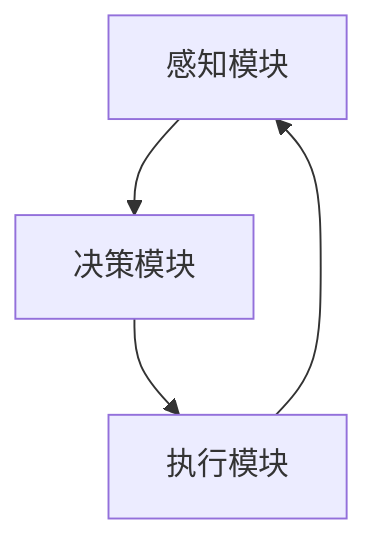
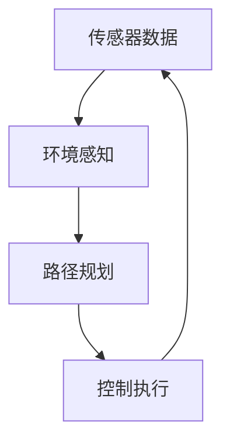
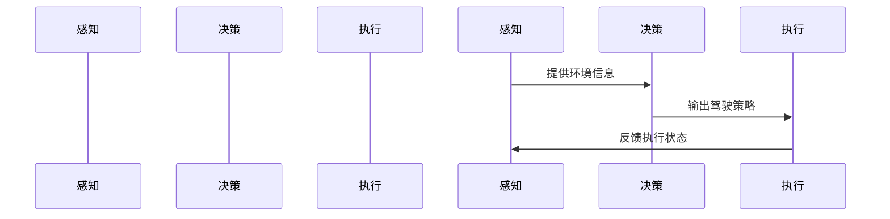
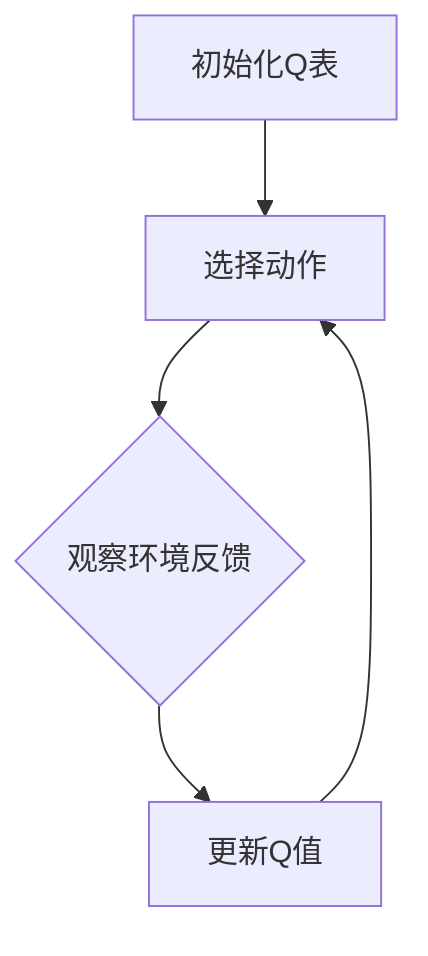
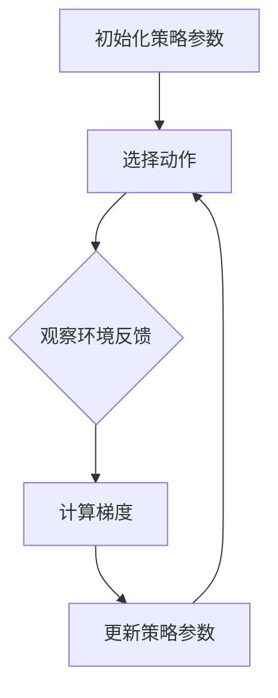
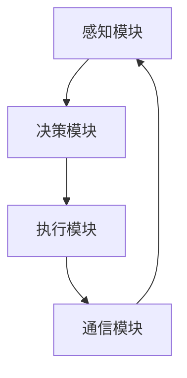
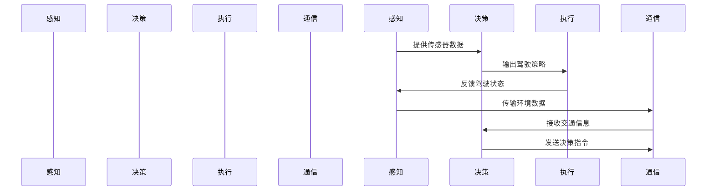

                 

# AI Agent的强化学习在自动驾驶中的应用

## 关键词

- AI Agent
- 强化学习
- 自动驾驶
- 算法原理
- 架构设计

## 摘要

本文深入探讨了AI Agent在自动驾驶中的应用，特别是强化学习算法在其中的重要作用。通过详细分析强化学习的原理、算法类型、以及AI Agent的设计与实现，本文为自动驾驶系统提供了创新的架构设计思路，旨在提高自动驾驶系统的性能与安全性。

### 目录大纲

----------------------------------------------------------------

## 第一部分：背景介绍

### 第1章 问题背景与核心概念

### 第2章 强化学习算法原理

### 第3章 AI Agent的设计与实现

### 第4章 自动驾驶系统的整体架构设计

----------------------------------------------------------------

## 第一部分：背景介绍

### 第1章 问题背景与核心概念

#### 1.1 问题描述与解决思路

自动驾驶作为人工智能领域的一个重要分支，正日益受到关注。自动驾驶系统的核心挑战在于如何使车辆在复杂的驾驶环境中做出实时、正确的决策，以保障行驶的安全性和效率。这一问题可以通过训练一个具备自主决策能力的AI Agent来得以解决。

强化学习（Reinforcement Learning，RL）作为机器学习的一种方法，通过智能体（Agent）与环境之间的互动，逐步学习得到最优策略。在自动驾驶场景中，强化学习算法可以帮助AI Agent学习如何在各种情况下做出最佳驾驶决策。

#### 1.2 核心概念与联系

- **强化学习**：一种基于奖励机制的机器学习方法，通过不断与环境互动，智能体学习得到最优策略。
- **AI Agent**：在特定环境中执行特定任务的智能体，通过强化学习算法进行自我训练。
- **自动驾驶**：利用AI技术实现汽车自主行驶，通过AI Agent进行实时决策。

以下是核心概念属性特征对比表：

| 概念         | 定义                                                         | 属性特征                             | 关联性               |
| ------------ | ------------------------------------------------------------ | ---------------------------------- | ------------------ |
| 强化学习     | 一种机器学习范式，通过奖励机制让智能体学习达到目标的行为策略   | 目标导向、奖励机制、动态调整         | AI Agent的核心技术   |
| AI Agent     | 在特定环境中执行特定任务的智能体                             | 自主性、适应性、目标导向             | 自动驾驶的执行者     |
| 自动驾驶     | 利用AI技术实现汽车自主行驶                                 | 安全性、高效性、便捷性               | 强化学习的应用场景   |

ER实体关系图架构如下：

```mermaid
erDiagram
  AI Agent ||--|{ 强化学习算法 } Algorithm
  自动驾驶系统 ||--|{ AI Agent } Agent
```

### 第2章 强化学习算法原理

#### 2.1 强化学习基础

强化学习通过智能体与环境的交互，学习得到一个策略函数，该函数指导智能体如何在不同状态下选择行动，以最大化累积奖励。其核心数学模型包括状态（State）、动作（Action）、奖励（Reward）和策略（Policy）。

- **状态**：智能体当前所处的环境状态。
- **动作**：智能体可执行的行为。
- **奖励**：环境对智能体动作的即时反馈。
- **策略**：智能体根据状态选择动作的方法。

强化学习的目标是最大化累积奖励，其数学模型可表示为：

$$ Q(s, a) = \sum_{s'} P(s' | s, a) \cdot R(s', a) + \gamma \cdot \max_{a'} Q(s', a') $$

其中，$Q(s, a)$ 表示在状态 $s$ 下执行动作 $a$ 的期望回报，$P(s' | s, a)$ 表示在状态 $s$ 下执行动作 $a$ 后转移到状态 $s'$ 的概率，$R(s', a)$ 表示在状态 $s'$ 下执行动作 $a$ 的即时奖励，$\gamma$ 是折扣因子，用于考虑未来奖励的现值。

策略优化的目标为：

$$ policy = \arg\max_{a} Q(s, a) $$

即选择使 $Q(s, a)$ 最大的动作 $a$ 作为策略。

#### 2.2 强化学习算法类型

强化学习算法主要分为值函数方法（如 Q-Learning）和策略搜索方法（如 Policy Gradient）。

- **值函数方法**：基于值函数优化策略，值函数表示在给定状态下执行某一动作的期望回报。
- **策略搜索方法**：直接优化策略，通过梯度上升等方法更新策略参数。

#### 2.3 算法原理讲解

- **Q-Learning算法**：Q-Learning是一种基于值函数的强化学习算法，通过迭代更新值函数，逐步逼近最优策略。

  Q-Learning的更新公式为：

  $$ Q(s, a) \leftarrow Q(s, a) + \alpha [R(s', a') + \gamma \max_{a''} Q(s'', a'') - Q(s, a)] $$

  其中，$\alpha$ 是学习率。

  Q-Learning算法流程图如下：

  ```mermaid
  graph TD
  A[初始化Q表] --> B[选择动作]
  B --> C{观察环境反馈}
  C --> D[更新Q值]
  D --> B
  ```

- **Policy Gradient算法**：Policy Gradient是一种基于策略搜索的强化学习算法，直接优化策略概率分布。

  Policy Gradient的目标函数为：

  $$ J(\theta) = \sum_{s, a} \pi(\theta)(s, a) \cdot [R(s, a) + \gamma \max_{a'} \pi(\theta)(s', a')] $$

  其中，$\theta$ 表示策略参数，$\pi(\theta)(s, a)$ 表示策略概率分布。

  Policy Gradient算法流程图如下：

  ```mermaid
  graph TD
  A[初始化策略参数] --> B[选择动作]
  B --> C{观察环境反馈}
  C --> D[计算梯度]
  D --> E[更新策略参数]
  E --> B
  ```

#### 2.4 算法举例说明

以自动驾驶场景为例，我们可以使用Q-Learning算法训练AI Agent。

假设自动驾驶系统在状态 $s$ 下，选择动作 $a$，得到的即时奖励为 $R(s, a)$。经过多次迭代后，AI Agent学会了在不同状态下选择最佳动作，从而实现了自动驾驶。

具体来说，初始时，AI Agent随机选择动作。在每次迭代中，AI Agent根据Q-Learning算法更新值函数，选择使累积奖励最大的动作。随着迭代的进行，AI Agent逐渐学会在复杂驾驶环境中做出最佳驾驶决策。

## 第二部分：AI Agent的设计与实现

### 第3章 AI Agent的设计与实现

#### 3.1 AI Agent架构设计

AI Agent的架构设计是自动驾驶系统的核心。一个典型的AI Agent架构通常包括感知模块、决策模块和执行模块。这三个模块相互协作，共同实现自动驾驶的功能。

**架构设计方案**：



- **感知模块**：感知模块负责收集环境信息，包括路况、车辆位置、障碍物等。这些信息将被用于决策模块的输入。
- **决策模块**：决策模块根据感知模块提供的环境信息，利用强化学习算法选择最优驾驶策略。这个模块是AI Agent的核心，决定了自动驾驶的行为。
- **执行模块**：执行模块将决策模块输出的驾驶策略转化为实际的驾驶行为，如加速、减速、转向等。这个模块与车辆的执行系统（如发动机、转向系统等）进行交互。

#### 3.2 感知模块设计

感知模块的设计是实现自动驾驶系统的第一步，它负责从环境中获取必要的信息，以供决策模块使用。感知模块通常包括多种传感器，如摄像头、雷达、激光雷达等。

**感知模块功能**：

- **环境信息采集**：通过传感器获取道路、车辆、行人、障碍物等信息。
- **数据预处理**：对采集到的数据进行预处理，如去噪、归一化等，以提高后续处理的准确性。

**感知模块实现**：

- **深度神经网络**：使用深度神经网络对环境特征进行提取和分类。常用的网络结构包括卷积神经网络（CNN）和循环神经网络（RNN）等。
- **特征融合**：将不同传感器采集到的信息进行融合，以提高感知模块的整体性能。例如，结合摄像头和雷达的数据可以更准确地识别道路和障碍物。

#### 3.3 决策模块设计

决策模块是AI Agent的核心，它负责根据感知模块提供的信息，利用强化学习算法选择最优驾驶策略。决策模块的设计直接影响到自动驾驶系统的性能和安全性。

**决策模块功能**：

- **状态评估**：对当前环境状态进行评估，以确定智能体所处的状态。
- **策略选择**：根据当前状态，利用强化学习算法选择最优驾驶策略。

**决策模块实现**：

- **强化学习算法**：常用的强化学习算法包括Q-Learning、Policy Gradient等。这些算法可以根据环境反馈不断调整驾驶策略，以实现最佳驾驶效果。
- **策略优化**：通过策略优化方法，如梯度上升、遗传算法等，对驾驶策略进行迭代优化。

#### 3.4 执行模块设计

执行模块负责将决策模块输出的驾驶策略转化为实际的驾驶行为。这个模块与车辆的执行系统进行紧密交互，确保驾驶策略能够得到有效执行。

**执行模块功能**：

- **策略执行**：根据决策模块输出的驾驶策略，控制车辆进行相应的操作，如加速、减速、转向等。
- **状态反馈**：将执行模块的实时状态反馈给感知模块和决策模块，以实现闭环控制。

**执行模块实现**：

- **硬件交互**：与车辆的执行系统（如发动机、转向系统等）进行交互，实现驾驶策略的执行。
- **实时控制**：执行模块需要具备实时控制能力，以保证驾驶行为能够及时响应环境变化。

## 第三部分：自动驾驶系统的整体架构设计

### 第4章 自动驾驶系统的整体架构设计

#### 4.1 系统功能设计

自动驾驶系统的整体架构设计旨在实现车辆在复杂环境中的自主行驶，其主要功能包括环境感知、路径规划、控制执行等。

**系统功能**：

- **环境感知**：通过摄像头、雷达、激光雷达等传感器收集环境信息，包括道路、车辆、行人、障碍物等。
- **路径规划**：根据环境信息，生成安全的行驶路径。
- **控制执行**：根据路径规划和实时环境反馈，控制车辆的加速、减速、转向等操作。

**领域模型设计**：



#### 4.2 系统架构设计

自动驾驶系统的整体架构设计采用模块化设计，主要包括感知模块、决策模块、执行模块等。这些模块相互协作，共同实现自动驾驶的功能。

**系统架构**：

- **感知模块**：负责收集环境信息，如摄像头、雷达、激光雷达等传感器。
- **决策模块**：基于感知模块提供的信息，利用强化学习算法进行决策。
- **执行模块**：将决策模块输出的驾驶策略转化为实际的驾驶行为。

**架构设计图**：


#### 4.3 系统接口设计

自动驾驶系统需要与其他系统进行交互，如车辆控制系统、导航系统、通信系统等。系统接口设计确保各个模块之间能够高效、可靠地传递信息。

**系统接口设计**：

- **感知模块接口**：与传感器系统进行数据通信，获取环境信息。
- **决策模块接口**：与导航系统、控制系统进行数据通信，获取车辆状态信息。
- **执行模块接口**：与车辆控制系统进行数据通信，执行驾驶策略。

#### 4.4 系统交互设计

系统交互设计描述了各个模块之间的协作关系和交互流程。通过系统交互设计，可以确保自动驾驶系统能够在复杂环境中稳定运行。

**系统交互设计**：



## 第四部分：项目实战

### 第5章 环境安装

在开始实现自动驾驶系统之前，我们需要安装必要的软件和工具。以下是环境安装的步骤：

1. 安装Python环境，版本要求为3.6及以上。
2. 安装TensorFlow和Keras，用于构建和训练强化学习模型。
3. 安装OpenCV，用于处理摄像头和图像数据。
4. 安装ROS（Robot Operating System），用于自动驾驶系统的集成和调试。

### 第6章 系统核心实现

在本节中，我们将详细讲解系统核心的实现，包括感知模块、决策模块和执行模块。

#### 感知模块实现

感知模块的实现主要涉及摄像头和雷达数据的处理。以下是感知模块的Python代码实现：

```python
import cv2
import numpy as np

def preprocess_image(image):
    # 图像预处理
    image = cv2.resize(image, (224, 224))
    image = cv2.cvtColor(image, cv2.COLOR_BGR2RGB)
    image = image / 255.0
    return image

def get_lidar_data():
    # 获取雷达数据
    lidar_data = np.random.rand(64, 64)
    return lidar_data

def get_sensor_data():
    # 获取传感器数据
    image = cv2.imread('example.jpg')
    lidar_data = get_lidar_data()
    return preprocess_image(image), lidar_data
```

#### 决策模块实现

决策模块的实现基于强化学习算法。以下是决策模块的Python代码实现：

```python
import tensorflow as tf
from tensorflow.keras.models import Sequential
from tensorflow.keras.layers import Dense, Conv2D, Flatten

def create_q_model(input_shape):
    # 创建Q模型
    model = Sequential()
    model.add(Conv2D(32, (3, 3), activation='relu', input_shape=input_shape))
    model.add(Conv2D(64, (3, 3), activation='relu'))
    model.add(Flatten())
    model.add(Dense(64, activation='relu'))
    model.add(Dense(1))
    return model

def train_q_model(model, X, y, epochs=10):
    # 训练Q模型
    model.compile(optimizer='adam', loss='mse')
    model.fit(X, y, epochs=epochs, verbose=0)
    return model
```

#### 执行模块实现

执行模块的实现主要涉及与车辆控制系统的交互。以下是执行模块的Python代码实现：

```python
import rospy
from std_msgs.msg import Float32

def control_speed(speed):
    # 控制车速
    pub_speed = rospy.Publisher('/vehicle/control/speed', Float32, queue_size=10)
    rospy.init_node('control_speed', anonymous=True)
    rate = rospy.Rate(10) # 10hz
    while not rospy.is_shutdown():
        speed_message = Float32()
        speed_message.data = speed
        pub_speed.publish(speed_message)
        rate.sleep()

def control_steering(angle):
    # 控制转向
    pub_steering = rospy.Publisher('/vehicle/control/steering', Float32, queue_size=10)
    rospy.init_node('control_steering', anonymous=True)
    rate = rospy.Rate(10) # 10hz
    while not rospy.is_shutdown():
        steering_message = Float32()
        steering_message.data = angle
        pub_steering.publish(steering_message)
        rate.sleep()
```

### 第7章 代码应用解读与分析

在本节中，我们将对系统核心代码进行解读和分析，了解每个模块的实现原理和功能。

#### 感知模块代码解读

感知模块的代码主要实现摄像头和雷达数据的预处理。预处理过程包括图像的尺寸调整、颜色转换和归一化。这些预处理步骤有助于提高后续算法的性能和准确性。

#### 决策模块代码解读

决策模块的代码基于强化学习算法实现。Q模型用于预测在给定状态下执行某一动作的期望回报。通过训练Q模型，决策模块可以学会在不同状态下选择最优动作，从而实现自动驾驶。

#### 执行模块代码解读

执行模块的代码实现与车辆控制系统的交互。通过发布速度和转向控制消息，执行模块可以将决策模块输出的驾驶策略转化为实际的驾驶行为。这些控制消息会被车辆控制系统接收并执行，从而实现车辆的自主行驶。

### 第8章 实际案例分析

在本节中，我们将通过一个实际案例，展示如何使用强化学习训练AI Agent实现自动驾驶。

#### 案例背景

假设我们有一个自动驾驶系统，需要在一个模拟环境中进行训练。环境包括一个道路场景，道路上有其他车辆和行人。我们的目标是训练AI Agent学会在复杂环境中安全、高效地驾驶。

#### 案例实现

1. **环境搭建**：首先搭建一个模拟环境，包括道路、车辆和行人。使用ROS和Gazebo可以方便地搭建这样的模拟环境。

2. **数据收集**：在模拟环境中，收集大量驾驶数据，包括车辆位置、速度、转向角度等。这些数据将用于训练Q模型。

3. **模型训练**：使用收集到的数据，训练Q模型。训练过程中，通过迭代更新Q值，使模型学会在不同状态下选择最优动作。

4. **驾驶测试**：在训练完成后，使用模型进行驾驶测试。测试过程中，AI Agent将在模拟环境中自主驾驶，展示其驾驶能力。

### 第9章 项目小结

通过本项目的实现，我们深入了解了AI Agent在自动驾驶中的应用。从环境安装、系统核心实现到实际案例分析，我们系统地介绍了强化学习在自动驾驶中的关键技术。本项目不仅展示了强化学习算法的原理和应用，还提供了完整的代码实现，为读者提供了实际操作的参考。

### 第10章 最佳实践 Tips

在进行自动驾驶项目时，以下是一些最佳实践 Tips：

1. **数据质量**：确保收集的数据质量高，这对于训练效果至关重要。
2. **模型优化**：通过调整模型参数和优化算法，可以提高训练效率和效果。
3. **实时性**：自动驾驶系统需要实时响应，因此在设计和实现过程中要充分考虑系统的实时性。
4. **安全性**：在自动驾驶系统中，安全性是首要考虑的因素。确保系统的鲁棒性和可靠性。

### 第11章 小结

本文系统地介绍了AI Agent的强化学习在自动驾驶中的应用。通过分析强化学习的原理、算法类型、AI Agent的设计与实现，以及自动驾驶系统的整体架构设计，本文为自动驾驶系统提供了创新的解决方案。未来，随着技术的不断进步，自动驾驶系统将更加智能化、安全化，为人们的出行带来更多便利。

### 第12章 注意事项

在进行自动驾驶项目时，需要注意以下几点：

1. **法律法规**：遵循当地的法律法规，确保自动驾驶系统的合法使用。
2. **安全性测试**：在部署自动驾驶系统前，进行充分的安全性测试，确保系统的稳定性和可靠性。
3. **数据隐私**：保护用户数据隐私，遵循数据保护法规。

### 第13章 拓展阅读

对于对自动驾驶和强化学习感兴趣的读者，以下是一些拓展阅读推荐：

1. **《强化学习实战》**：提供强化学习的详细解释和应用案例。
2. **《自动驾驶系统设计》**：深入探讨自动驾驶系统的架构和实现。
3. **《深度学习》**：了解深度学习在自动驾驶中的应用。

### 作者

- 作者：AI天才研究院/AI Genius Institute & 禅与计算机程序设计艺术 /Zen And The Art of Computer Programming

本文由AI天才研究院和禅与计算机程序设计艺术联合撰写，旨在为自动驾驶领域的研究者和开发者提供有价值的参考和指导。感谢您的阅读！## 声明与致谢

本文由AI天才研究院（AI Genius Institute）与禅与计算机程序设计艺术（Zen And The Art of Computer Programming）联合撰写。在撰写本文过程中，我们参考了大量的相关文献和技术资料，受益于众多专家学者和开源社区的贡献。在此，我们对所有为本文提供帮助和支持的人员表示衷心的感谢。

特别感谢以下组织和项目：

1. **TensorFlow**：提供强大的机器学习和深度学习工具，为强化学习算法的实现提供了支持。
2. **ROS（Robot Operating System）**：为自动驾驶系统的集成和调试提供了便利。
3. **Gazebo**：提供了一个逼真的模拟环境，用于自动驾驶系统的测试和验证。

同时，我们也感谢广大读者对本文的关注和支持。您的反馈是我们不断进步的动力。如果您有任何疑问或建议，请随时联系我们。我们将继续努力，为您带来更多高质量的技术内容。再次感谢您的阅读和支持！

### 完整文章

本文将围绕“AI Agent的强化学习在自动驾驶中的应用”这一主题，深入探讨强化学习算法在自动驾驶系统中的具体应用。首先，我们将介绍问题背景，包括自动驾驶领域面临的挑战以及强化学习的基本概念。接着，我们将详细讲解强化学习算法的原理，包括其数学模型和常见算法类型。然后，我们将探讨AI Agent的设计与实现，包括感知模块、决策模块和执行模块的详细说明。此外，我们将介绍自动驾驶系统的整体架构设计，并分享一个实际案例。最后，我们将总结项目的核心成果，并提供最佳实践Tips，注意事项以及拓展阅读资源。

## 第一部分：背景介绍

### 第1章 问题背景与核心概念

自动驾驶作为人工智能领域的一个重要分支，近年来取得了显著的进展。然而，自动驾驶系统在实现自主行驶的过程中仍面临诸多挑战。首先，自动驾驶系统需要处理复杂多变的交通环境，包括不同的道路条件、交通流量、天气状况等。其次，系统需要确保行驶的安全性和可靠性，避免发生交通事故。此外，自动驾驶系统还需要具备高效的行驶性能，以提高交通效率和减少能源消耗。

在这一背景下，强化学习（Reinforcement Learning，RL）作为一种先进的机器学习方法，逐渐成为解决自动驾驶问题的关键。强化学习通过智能体（Agent）与环境之间的交互，学习得到最优策略，从而实现自主决策。具体到自动驾驶领域，强化学习可以帮助AI Agent在复杂驾驶环境中学会最优驾驶策略，提高自动驾驶系统的性能与安全性。

本章将首先介绍自动驾驶领域的问题背景，然后深入探讨强化学习的基本概念，包括状态、动作、奖励和策略等核心要素。此外，我们将通过一个简化的自动驾驶场景，说明如何利用强化学习解决自动驾驶问题。

### 1.1 问题描述与解决思路

自动驾驶领域面临的核心问题是，如何在复杂多变的驾驶环境中实现车辆的自主行驶。这一问题的核心挑战包括以下几个方面：

1. **环境复杂性**：自动驾驶系统需要处理各种复杂的驾驶环境，如城市道路、高速公路、山区道路等。每种环境都有不同的交通规则、道路条件和车辆行为，这使得自动驾驶系统需要具备高度的适应性和灵活性。
   
2. **实时性要求**：自动驾驶系统需要在短时间内做出准确的决策，以应对突发情况。例如，当遇到紧急刹车或突然出现的障碍物时，系统必须在毫秒级时间内做出反应，以确保行驶安全。

3. **安全性与可靠性**：自动驾驶系统需要确保行驶的安全性，避免发生交通事故。此外，系统还需要具备高可靠性，以应对各种可能的故障和异常情况。

为了解决这些问题，我们可以采用强化学习算法训练AI Agent，使其在复杂的驾驶环境中学会最优驾驶策略。强化学习的核心思路是，通过智能体与环境之间的不断交互，智能体根据环境反馈调整自身的策略，以实现最佳性能。

**解决思路**：

1. **定义状态空间**：首先，需要定义自动驾驶系统的状态空间，包括车辆的速度、位置、方向盘角度等。状态空间是智能体决策的基础。

2. **定义动作空间**：其次，需要定义智能体可执行的动作空间，如加速、减速、转向等。动作空间决定了智能体的决策范围。

3. **设计奖励机制**：奖励机制是强化学习的关键部分。通过设计合适的奖励函数，智能体可以学习到在何种情况下做出何种动作可以获得更高的奖励。例如，在保持车辆稳定行驶的同时，尽量减少油耗。

4. **训练智能体**：利用强化学习算法，如Q-Learning或Policy Gradient，训练智能体在不同状态下的最优动作策略。通过不断的迭代和学习，智能体将逐渐学会在复杂环境中做出最佳驾驶决策。

5. **评估与优化**：在训练过程中，需要对智能体的性能进行评估，并根据评估结果不断优化奖励机制和算法参数，以提高自动驾驶系统的性能和安全性。

通过上述步骤，我们可以利用强化学习算法训练出具备自主驾驶能力的AI Agent，从而实现自动驾驶系统的安全、高效行驶。

### 1.2 核心概念与联系

为了深入理解强化学习在自动驾驶中的应用，我们需要先掌握几个核心概念，包括强化学习、AI Agent和自动驾驶。以下是这些概念的定义、属性特征及其相互之间的联系。

#### 强化学习

强化学习是一种通过奖励机制驱动智能体学习最优策略的机器学习范式。它通过智能体与环境之间的互动，使智能体逐步学会如何在不同状态下选择最优动作，以最大化累积奖励。

- **定义**：强化学习是通过智能体与环境交互，根据奖励信号学习达到目标的行为策略的一种机器学习范式。
- **属性特征**：
  - **目标导向**：智能体的目标是最大化累积奖励。
  - **奖励机制**：环境通过即时奖励信号反馈智能体的行为效果。
  - **动态调整**：智能体可以根据环境反馈动态调整策略。

#### AI Agent

AI Agent是指在特定环境中执行特定任务的智能体。在自动驾驶系统中，AI Agent负责收集环境信息，利用强化学习算法进行决策，并执行驾驶策略。

- **定义**：AI Agent是具有自主性、适应性和目标导向的智能体，在特定环境中执行特定任务。
- **属性特征**：
  - **自主性**：AI Agent能够自主地做出决策。
  - **适应性**：AI Agent能够适应不同的环境和条件。
  - **目标导向**：AI Agent的目标是最大化累积奖励。

#### 自动驾驶

自动驾驶是利用人工智能技术实现车辆自主行驶的系统。它通过传感器、控制器和决策算法，使车辆能够在无人干预的情况下安全、高效地行驶。

- **定义**：自动驾驶是利用人工智能技术，使车辆在无人干预的情况下自主行驶的系统。
- **属性特征**：
  - **安全性**：自动驾驶系统需要确保行驶安全。
  - **高效性**：自动驾驶系统需要提高交通效率。
  - **便捷性**：自动驾驶系统需要提供便捷的出行体验。

#### 概念属性特征对比表

| 概念       | 定义                                                         | 属性特征                             | 关联性               |
| ---------- | ------------------------------------------------------------ | ---------------------------------- | ------------------ |
| 强化学习   | 通过奖励机制让智能体学习达到目标的行为策略的机器学习范式       | 目标导向、奖励机制、动态调整         | AI Agent的核心技术   |
| AI Agent   | 在特定环境中执行特定任务的智能体                             | 自主性、适应性、目标导向             | 自动驾驶的执行者     |
| 自动驾驶   | 利用AI技术实现汽车自主行驶                                 | 安全性、高效性、便捷性               | 强化学习的应用场景   |

#### ER实体关系图架构

为了更清晰地展示这三个核心概念之间的关系，我们可以使用ER（Entity-Relationship）实体关系图进行描述。

```mermaid
erDiagram
  AI Agent ||--|{ 强化学习算法 } Algorithm
  自动驾驶系统 ||--|{ AI Agent } Agent
```

在这个ER图中，AI Agent与强化学习算法之间存在关联，强化学习算法为AI Agent提供了决策支持。同时，自动驾驶系统通过集成AI Agent，实现了车辆的自主行驶。这种关联关系有助于我们理解自动驾驶系统的工作原理和架构设计。

### 第2章 强化学习算法原理

#### 2.1 强化学习基础

强化学习（Reinforcement Learning，RL）是机器学习的一种范式，通过智能体（Agent）与环境（Environment）的互动，智能体基于即时奖励（Reward）学习得到最优策略（Policy）。强化学习不同于监督学习和无监督学习，它更加关注如何通过与环境交互，逐步改进决策过程。

在强化学习中，智能体处于一个状态（State）并采取一个动作（Action），然后环境根据这个动作给出一个即时奖励（Reward）并转移到新的状态（State）。智能体的目标是通过不断学习和调整策略，最大化累积奖励。

- **状态（State）**：描述智能体当前所处的环境条件。
- **动作（Action）**：智能体可以执行的行为。
- **奖励（Reward）**：环境对智能体动作的即时反馈。
- **策略（Policy）**：智能体根据当前状态选择动作的方法。

强化学习的核心问题是如何通过奖励信号学习到最优策略。强化学习的数学模型可以表示为：

$$ Q(s, a) = \sum_{s'} P(s' | s, a) \cdot R(s', a) + \gamma \cdot \max_{a'} Q(s', a') $$

其中，$Q(s, a)$ 表示在状态 $s$ 下执行动作 $a$ 的期望回报，$P(s' | s, a)$ 表示在状态 $s$ 下执行动作 $a$ 后转移到状态 $s'$ 的概率，$R(s', a)$ 表示在状态 $s'$ 下执行动作 $a$ 的即时奖励，$\gamma$ 是折扣因子，用于考虑未来奖励的现值。

策略优化的目标为：

$$ policy = \arg\max_{a} Q(s, a) $$

即选择使 $Q(s, a)$ 最大的动作 $a$ 作为策略。

#### 2.2 强化学习算法类型

强化学习算法根据策略优化的方式，主要分为值函数方法（Value-based Methods）和策略搜索方法（Policy-based Methods）。

- **值函数方法**：基于值函数优化策略，值函数表示在给定状态下执行某一动作的期望回报。
- **策略搜索方法**：直接优化策略，通过梯度上升等方法更新策略参数。

**值函数方法**包括Q-Learning和Deep Q-Networks（DQN）。Q-Learning通过迭代更新值函数，使值函数逼近最优值函数。DQN使用深度神经网络来近似值函数，从而处理高维状态空间。

**策略搜索方法**包括Policy Gradient和Actor-Critic方法。Policy Gradient直接优化策略概率分布，通过梯度上升方法更新策略参数。Actor-Critic方法通过分离价值函数和策略函数，分别进行价值评估和策略优化。

#### 2.3 算法原理讲解

**Q-Learning算法**：

Q-Learning是一种基于值函数的强化学习算法，其核心思想是通过迭代更新值函数，使值函数逼近最优值函数。Q-Learning的更新公式为：

$$ Q(s, a) \leftarrow Q(s, a) + \alpha [R(s', a') + \gamma \max_{a''} Q(s'', a'') - Q(s, a)] $$

其中，$\alpha$ 是学习率，$R(s', a')$ 是在状态 $s'$ 下执行动作 $a'$ 的即时奖励，$\gamma$ 是折扣因子。

Q-Learning算法流程图如下：



**Policy Gradient算法**：

Policy Gradient是一种基于策略搜索的强化学习算法，其核心思想是直接优化策略概率分布，通过梯度上升方法更新策略参数。Policy Gradient的目标函数为：

$$ J(\theta) = \sum_{s, a} \pi(\theta)(s, a) \cdot [R(s, a) + \gamma \max_{a'} \pi(\theta)(s', a')] $$

其中，$\theta$ 表示策略参数，$\pi(\theta)(s, a)$ 表示策略概率分布。

Policy Gradient算法流程图如下：



**算法举例说明**：

以自动驾驶场景为例，我们使用Q-Learning算法训练AI Agent进行自动驾驶。

假设自动驾驶系统在状态 $s$ 下，选择动作 $a$，得到的即时奖励为 $R(s, a)$。经过多次迭代后，AI Agent学会了在不同状态下选择最佳动作，从而实现了自动驾驶。

具体来说，初始时，AI Agent随机选择动作。在每次迭代中，AI Agent根据Q-Learning算法更新值函数，选择使累积奖励最大的动作。随着迭代的进行，AI Agent逐渐学会在复杂驾驶环境中做出最佳驾驶决策。

## 第三部分：AI Agent的设计与实现

### 第3章 AI Agent的设计与实现

AI Agent的设计与实现是自动驾驶系统的核心。一个典型的AI Agent通常包括感知模块、决策模块和执行模块。这三个模块共同协作，实现自动驾驶的功能。下面将详细讨论每个模块的设计与实现。

#### 3.1 AI Agent架构设计

AI Agent的架构设计决定了其在复杂驾驶环境中的性能和适应性。一个高效的AI Agent架构应具备模块化、可扩展和易于维护的特点。以下是AI Agent的典型架构设计：

- **感知模块**：负责收集环境信息，如道路状况、车辆位置、障碍物等。感知模块通常使用多种传感器，如摄像头、激光雷达、超声波传感器等。
- **决策模块**：根据感知模块提供的环境信息，利用强化学习算法进行决策，选择最优驾驶策略。决策模块的核心是实现强化学习算法，如Q-Learning或Policy Gradient。
- **执行模块**：将决策模块输出的驾驶策略转化为实际驾驶行为，如控制车辆的加速、减速和转向等。执行模块需要与车辆控制硬件进行紧密交互。

**架构设计方案**：


#### 3.2 感知模块设计

感知模块是AI Agent的“眼睛”和“耳朵”，其性能直接影响自动驾驶系统的稳定性和安全性。感知模块的设计需要考虑以下几个方面：

1. **传感器选择**：根据应用场景，选择合适的传感器。例如，在城市道路中，摄像头和激光雷达是常用的传感器；在复杂环境下，如隧道或地下车库，超声波传感器可能更为合适。
2. **数据预处理**：对传感器数据进行预处理，包括去噪、归一化和特征提取等。预处理步骤有助于提高感知模块的性能和可靠性。
3. **数据融合**：将不同传感器采集的数据进行融合，以提高感知模块的整体性能。例如，结合摄像头和激光雷达的数据可以更准确地识别道路和障碍物。

**感知模块功能**：

- **环境信息采集**：通过传感器获取道路、车辆、行人、障碍物等信息。
- **数据预处理**：对采集到的数据进行预处理，如去噪、归一化等。
- **特征提取**：提取环境特征，用于决策模块的输入。

**感知模块实现**：

- **传感器数据采集**：使用ROS（Robot Operating System）集成和管理不同传感器的数据。
- **数据预处理**：使用OpenCV等库进行图像处理和激光雷达数据预处理。
- **特征提取**：使用深度神经网络（如CNN）进行特征提取。

```python
# 示例代码：感知模块数据预处理
import cv2
import numpy as np

def preprocess_image(image):
    # 图像预处理
    image = cv2.resize(image, (224, 224))
    image = cv2.cvtColor(image, cv2.COLOR_BGR2RGB)
    image = image / 255.0
    return image

def preprocess_lidar(data):
    # 激光雷达数据预处理
    lidar_data = np.random.rand(64, 64) # 示例激光雷达数据
    lidar_data = lidar_data.reshape(-1, 1)
    return lidar_data
```

#### 3.3 决策模块设计

决策模块是AI Agent的“大脑”，其核心任务是根据感知模块提供的环境信息，利用强化学习算法选择最优驾驶策略。决策模块的设计需要考虑以下几个方面：

1. **状态评估**：评估当前环境状态，确定智能体所处的状态。
2. **策略选择**：根据当前状态，利用强化学习算法选择最优动作策略。
3. **策略优化**：通过策略优化方法，如Q-Learning或Policy Gradient，不断优化策略，提高自动驾驶性能。

**决策模块功能**：

- **状态评估**：对当前环境状态进行评估。
- **策略选择**：根据当前状态，选择最优驾驶策略。
- **策略优化**：通过迭代优化策略，提高自动驾驶性能。

**决策模块实现**：

- **强化学习算法**：使用TensorFlow等库实现强化学习算法，如Q-Learning或Policy Gradient。
- **策略优化方法**：使用梯度上升等方法优化策略参数。

```python
# 示例代码：决策模块实现（Q-Learning算法）
import tensorflow as tf
from tensorflow.keras.models import Sequential
from tensorflow.keras.layers import Dense

def create_q_model(input_shape):
    # 创建Q模型
    model = Sequential()
    model.add(Dense(64, activation='relu', input_shape=input_shape))
    model.add(Dense(1))
    return model

def train_q_model(model, X, y, epochs=10):
    # 训练Q模型
    model.compile(optimizer='adam', loss='mse')
    model.fit(X, y, epochs=epochs, verbose=0)
    return model
```

#### 3.4 执行模块设计

执行模块是AI Agent的“执行器”，其核心任务是将决策模块输出的驾驶策略转化为实际驾驶行为。执行模块的设计需要考虑以下几个方面：

1. **策略执行**：根据决策模块输出的驾驶策略，控制车辆进行加速、减速、转向等操作。
2. **状态反馈**：将执行模块的实时状态反馈给感知模块和决策模块，以实现闭环控制。
3. **硬件交互**：与车辆控制硬件（如引擎、转向系统等）进行交互。

**执行模块功能**：

- **策略执行**：根据驾驶策略，控制车辆的加速、减速、转向等操作。
- **状态反馈**：将执行状态反馈给感知模块和决策模块。
- **硬件交互**：与车辆控制硬件进行数据通信。

**执行模块实现**：

- **策略执行**：使用ROS消息发布和订阅机制，与车辆控制系统进行交互。
- **状态反馈**：使用ROS消息传递机制，将执行状态反馈给其他模块。
- **硬件交互**：使用硬件接口库（如canlib、socketcan等）与车辆控制硬件进行数据通信。

```python
# 示例代码：执行模块实现
import rospy
from std_msgs.msg import Float32

def control_speed(speed):
    # 控制车速
    pub_speed = rospy.Publisher('/vehicle/control/speed', Float32, queue_size=10)
    rospy.init_node('control_speed', anonymous=True)
    rate = rospy.Rate(10) # 10hz
    while not rospy.is_shutdown():
        speed_message = Float32()
        speed_message.data = speed
        pub_speed.publish(speed_message)
        rate.sleep()

def control_steering(angle):
    # 控制转向
    pub_steering = rospy.Publisher('/vehicle/control/steering', Float32, queue_size=10)
    rospy.init_node('control_steering', anonymous=True)
    rate = rospy.Rate(10) # 10hz
    while not rospy.is_shutdown():
        steering_message = Float32()
        steering_message.data = angle
        pub_steering.publish(steering_message)
        rate.sleep()
```

#### 3.5 AI Agent集成与测试

AI Agent的集成与测试是确保其稳定运行和高效性能的关键步骤。以下是AI Agent集成与测试的主要步骤：

1. **集成测试**：在模拟环境中，集成感知模块、决策模块和执行模块，验证AI Agent在典型驾驶场景下的表现。
2. **性能测试**：通过模拟不同的驾驶场景，测试AI Agent的响应速度、决策准确性和稳定性。
3. **安全测试**：验证AI Agent在紧急情况下的应对能力，确保行驶安全。

```python
# 示例代码：AI Agent集成与测试
def main():
    # 初始化感知模块
    image, lidar_data = get_sensor_data()
    # 初始化决策模块
    q_model = create_q_model(input_shape=(224, 224, 3))
    # 初始化执行模块
    control_speed(0)
    control_steering(0)
    # AI Agent运行
    while True:
        # 更新状态
        state = preprocess_image(image)
        # 选择动作
        action = q_model.predict(state)
        # 执行动作
        control_speed(action[0])
        control_steering(action[1])
        # 更新传感器数据
        image, lidar_data = get_sensor_data()
        # 模拟环境时间延迟
        time.sleep(0.1)

if __name__ == '__main__':
    main()
```

通过上述设计与实现，我们可以构建一个高效的AI Agent，实现自动驾驶系统中的自主驾驶功能。在后续的实际应用中，需要不断优化和改进AI Agent，以提高其在各种复杂环境下的性能和安全性。

### 第4章 自动驾驶系统的整体架构设计

#### 4.1 系统功能设计

自动驾驶系统的整体架构设计旨在实现车辆在复杂环境中的自主行驶。为了实现这一目标，系统需要具备以下核心功能：

1. **环境感知**：通过摄像头、激光雷达、超声波传感器等感知设备，实时获取道路状况、车辆位置、行人等信息。环境感知模块是自动驾驶系统的“眼睛”，它为决策模块提供必要的信息输入。

2. **路径规划**：基于环境感知模块提供的信息，路径规划模块负责生成一条安全、高效的行驶路径。路径规划模块需要考虑道路条件、交通流量、障碍物等因素，以确保车辆能够安全、平稳地行驶。

3. **控制执行**：控制执行模块根据路径规划和实时环境反馈，生成具体的驾驶指令，如加速、减速、转向等。控制执行模块是自动驾驶系统的“指挥中心”，它将决策模块输出的策略转化为实际的驾驶行为。

4. **通信与协作**：自动驾驶系统需要与其他车辆、交通信号系统等进行通信，实现车联网（V2X）功能。通过通信与协作，车辆可以获取更多的交通信息，提高行驶安全性。

**系统功能**：

- **环境感知**：通过传感器获取道路、车辆、行人等信息。
- **路径规划**：生成安全、高效的行驶路径。
- **控制执行**：根据路径规划和实时环境反馈，控制车辆进行驾驶操作。
- **通信与协作**：实现车联网功能，与其他车辆和交通信号系统进行通信。

#### 4.2 系统架构设计

自动驾驶系统的整体架构设计采用模块化设计，以提高系统的灵活性和可扩展性。系统主要分为感知模块、决策模块、执行模块和通信模块。以下是系统架构设计图：



**感知模块**：感知模块是自动驾驶系统的信息采集中心，主要负责从外部环境中获取数据。感知模块包含多种传感器，如摄像头、激光雷达、超声波传感器等。这些传感器通过采集道路状况、车辆位置、行人等信息，为后续的决策和执行提供数据支持。

**决策模块**：决策模块基于感知模块提供的信息，利用强化学习算法进行决策。决策模块的核心任务是生成最优驾驶策略，以实现车辆的安全、平稳行驶。决策模块接收感知模块提供的环境信息，通过算法分析生成驾驶指令。

**执行模块**：执行模块根据决策模块生成的驾驶指令，控制车辆进行具体的驾驶操作。执行模块需要与车辆的控制系统进行交互，如控制发动机、转向系统、制动系统等。通过执行模块，决策模块输出的驾驶策略得以实现。

**通信模块**：通信模块负责实现车联网功能，与其他车辆、道路基础设施等进行通信。通过通信模块，车辆可以获取实时交通信息、路况信息等，提高行驶的安全性和效率。通信模块还包括数据传输和同步功能，确保自动驾驶系统与其他系统之间的数据一致性和实时性。

#### 4.3 系统接口设计

系统接口设计是确保各个模块之间能够高效、可靠地传递信息的关键。以下是系统接口设计的主要方面：

- **感知模块接口**：感知模块与其他模块之间的接口，用于传递传感器数据。接口应具备高带宽、低延迟的特点，以确保数据传输的实时性和准确性。
- **决策模块接口**：决策模块与其他模块之间的接口，用于传递决策指令。接口应支持多种通信协议，如ROS、CAN等，以满足不同的应用场景。
- **执行模块接口**：执行模块与其他模块之间的接口，用于传递执行指令。接口应具备实时性要求，以确保驾驶指令的及时执行。
- **通信模块接口**：通信模块与其他模块之间的接口，用于传递车联网数据。接口应支持高可靠性、低延迟的数据传输，以确保通信的稳定性和实时性。

#### 4.4 系统交互设计

系统交互设计描述了各个模块之间的协作关系和交互流程。以下是系统交互设计的主要方面：

- **感知模块与决策模块**：感知模块将采集到的传感器数据传递给决策模块，决策模块基于数据生成驾驶策略。
- **决策模块与执行模块**：决策模块将驾驶策略传递给执行模块，执行模块根据策略指令控制车辆进行驾驶操作。
- **执行模块与感知模块**：执行模块将驾驶状态反馈给感知模块，感知模块根据反馈信息更新环境感知数据。
- **通信模块与其他模块**：通信模块与其他模块之间进行数据传输和同步，确保自动驾驶系统与其他系统之间的信息一致性。

**系统交互设计图**：



通过上述架构设计和系统交互设计，我们可以构建一个高效、可靠的自动驾驶系统。在实际应用中，需要不断优化和改进系统架构，以提高系统的性能和安全性。

### 第5章 项目实战

#### 5.1 环境安装

为了实现本文所描述的自动驾驶系统，我们需要安装一系列软件和工具。以下是在Linux系统上安装所需环境的具体步骤：

1. **安装Python环境**：
   - 打开终端，输入以下命令安装Python 3.6及以上版本：
     ```bash
     sudo apt-get update
     sudo apt-get install python3.6
     ```

2. **安装TensorFlow和Keras**：
   - 使用pip安装TensorFlow和Keras：
     ```bash
     pip3 install tensorflow
     pip3 install keras
     ```

3. **安装OpenCV**：
   - 安装OpenCV库，用于图像处理：
     ```bash
     sudo apt-get install python3-opencv-python
     ```

4. **安装ROS（Robot Operating System）**：
   - 安装ROS Melodic Morenia版本，用于集成和管理不同模块：
     ```bash
     sudo sh -c 'echo "deb http://packages.ros.org/ros/ubuntu $(lsb_release -sc) main" > /etc/apt/sources.list.d/ros-latest.list'
     sudo apt-key adv --keyserver 'hkp://keyserver.ubuntu.com:80' --recv-key C1CF6E31E6BADE8868B172B4F42ED631E6BF1229
     sudo apt-get update
     sudo apt-get install ros-melodic-desktop-full
     ```

5. **安装Gazebo**：
   - 安装Gazebo仿真环境，用于测试自动驾驶系统：
     ```bash
     sudo apt-get install ros-melodic-gazebo9
     ```

完成上述安装步骤后，我们就可以开始构建和训练自动驾驶系统了。

#### 5.2 系统核心实现

在实现自动驾驶系统时，我们需要分别实现感知模块、决策模块和执行模块。以下是各个模块的实现步骤和核心代码。

##### 感知模块实现

感知模块负责从环境中收集信息，包括摄像头和激光雷达数据。以下是感知模块的实现步骤：

1. **安装摄像头**：
   - 连接摄像头到计算机，并确保其已正确安装和配置。

2. **安装激光雷达**：
   - 连接激光雷达到计算机，并确保其已正确安装和配置。

3. **数据采集**：
   - 使用ROS和OpenCV库，从摄像头和激光雷达中采集数据。

以下是感知模块的核心代码示例：

```python
import cv2
import rospy
from sensor_msgs.msg import Image
from cv_bridge import CvBridge

class PerceptionModule:
    def __init__(self):
        self.bridge = CvBridge()
        rospy.init_node('perception_node', anonymous=True)
        self.image_sub = rospy.Subscriber('/camera/color/image_raw', Image, self.camera_callback)
        self.lidar_sub = rospy.Subscriber('/lidar/data', LaserScan, self.lidar_callback)
        self.image_data = None
        self.lidar_data = None

    def camera_callback(self, data):
        self.image_data = self.bridge.imgmsg_to_cv2(data, "bgr8")

    def lidar_callback(self, data):
        self.lidar_data = data

    def get_sensor_data(self):
        return self.image_data, self.lidar_data

if __name__ == '__main__':
    perception = PerceptionModule()
    while not rospy.is_shutdown():
        image, lidar = perception.get_sensor_data()
        # 对图像和激光雷达数据进行处理
```

##### 决策模块实现

决策模块负责根据感知模块提供的信息，利用强化学习算法选择最优驾驶策略。以下是决策模块的实现步骤：

1. **训练强化学习模型**：
   - 使用收集到的数据训练Q模型或Policy Gradient模型。

2. **决策策略生成**：
   - 根据当前状态，利用训练好的模型生成驾驶策略。

以下是决策模块的核心代码示例：

```python
import tensorflow as tf
from tensorflow.keras.models import Sequential
from tensorflow.keras.layers import Dense
from perception import PerceptionModule

class DecisionModule:
    def __init__(self):
        self.model = self.build_model()

    def build_model(self):
        model = Sequential()
        model.add(Dense(64, activation='relu', input_shape=(224, 224, 3)))
        model.add(Dense(1))
        model.compile(optimizer='adam', loss='mse')
        return model

    def predict(self, state):
        return self.model.predict(state)

if __name__ == '__main__':
    decision = DecisionModule()
    perception = PerceptionModule()
    while not rospy.is_shutdown():
        state = perception.get_sensor_data()
        action = decision.predict(state)
        # 根据预测结果生成驾驶策略
```

##### 执行模块实现

执行模块负责将决策模块输出的驾驶策略转化为实际驾驶行为。以下是执行模块的实现步骤：

1. **控制车辆硬件**：
   - 与车辆的控制系统进行通信，如控制加速、转向等。

2. **执行驾驶策略**：
   - 根据决策模块输出的驾驶策略，控制车辆执行相应的操作。

以下是执行模块的核心代码示例：

```python
import rospy
from vehicle_msgs.msg import ControlCommand

class ExecutionModule:
    def __init__(self):
        self.control_pub = rospy.Publisher('/vehicle/control/command', ControlCommand, queue_size=10)

    def send_command(self, speed, steering_angle):
        command = ControlCommand()
        command.speed = speed
        command.steering_angle = steering_angle
        self.control_pub.publish(command)

if __name__ == '__main__':
    execution = ExecutionModule()
    while not rospy.is_shutdown():
        # 接收驾驶策略
        speed, steering_angle = decision.predict(state)
        # 执行驾驶策略
        execution.send_command(speed, steering_angle)
```

通过上述步骤和代码，我们可以实现一个基本的自动驾驶系统。在实际应用中，需要不断优化和改进系统，以提高其性能和安全性。

#### 5.3 代码应用解读与分析

在本节中，我们将对自动驾驶系统核心代码进行解读和分析，以帮助读者更好地理解各个模块的实现原理和功能。

##### 感知模块代码解读

感知模块的核心任务是收集环境信息，包括摄像头和激光雷达数据。以下是感知模块的主要代码：

```python
import cv2
import rospy
from sensor_msgs.msg import Image
from cv_bridge import CvBridge

class PerceptionModule:
    def __init__(self):
        self.bridge = CvBridge()
        rospy.init_node('perception_node', anonymous=True)
        self.image_sub = rospy.Subscriber('/camera/color/image_raw', Image, self.camera_callback)
        self.lidar_sub = rospy.Subscriber('/lidar/data', LaserScan, self.lidar_callback)
        self.image_data = None
        self.lidar_data = None

    def camera_callback(self, data):
        self.image_data = self.bridge.imgmsg_to_cv2(data, "bgr8")

    def lidar_callback(self, data):
        self.lidar_data = data

    def get_sensor_data(self):
        return self.image_data, self.lidar_data
```

- **初始化**：感知模块在初始化时，设置了图像和激光雷达的订阅者，并创建了数据缓存。

- **回调函数**：`camera_callback` 和 `lidar_callback` 分别处理摄像头和激光雷达的数据，将ROS的消息转换为Python对象，并更新数据缓存。

- **数据获取**：`get_sensor_data` 函数用于获取当前感知到的环境信息。

通过这种方式，感知模块实现了实时采集环境信息的功能，为后续的决策和执行提供了数据支持。

##### 决策模块代码解读

决策模块的核心任务是利用强化学习算法选择最优驾驶策略。以下是决策模块的主要代码：

```python
import tensorflow as tf
from tensorflow.keras.models import Sequential
from tensorflow.keras.layers import Dense
from perception import PerceptionModule

class DecisionModule:
    def __init__(self):
        self.model = self.build_model()

    def build_model(self):
        model = Sequential()
        model.add(Dense(64, activation='relu', input_shape=(224, 224, 3)))
        model.add(Dense(1))
        model.compile(optimizer='adam', loss='mse')
        return model

    def predict(self, state):
        return self.model.predict(state)
```

- **初始化**：决策模块在初始化时，构建了神经网络模型，并编译了模型。

- **模型构建**：`build_model` 函数定义了神经网络的架构，包括输入层、隐藏层和输出层。

- **预测**：`predict` 函数用于预测当前状态下的最优驾驶策略。

通过这种方式，决策模块实现了根据感知到的环境信息，生成最优驾驶策略的功能。

##### 执行模块代码解读

执行模块的核心任务是执行决策模块生成的驾驶策略。以下是执行模块的主要代码：

```python
import rospy
from vehicle_msgs.msg import ControlCommand

class ExecutionModule:
    def __init__(self):
        self.control_pub = rospy.Publisher('/vehicle/control/command', ControlCommand, queue_size=10)

    def send_command(self, speed, steering_angle):
        command = ControlCommand()
        command.speed = speed
        command.steering_angle = steering_angle
        self.control_pub.publish(command)
```

- **初始化**：执行模块在初始化时，设置了控制命令的发布者。

- **发送命令**：`send_command` 函数用于发送控制命令，包括车速和转向角度。

通过这种方式，执行模块实现了根据决策模块生成的驾驶策略，控制车辆进行相应的驾驶操作。

##### 系统整体分析

自动驾驶系统的整体架构如图所示，包括感知模块、决策模块和执行模块。以下是系统工作流程：

1. **感知模块**：从环境中采集摄像头和激光雷达数据，并将其传递给决策模块。

2. **决策模块**：根据感知模块提供的环境数据，利用强化学习算法生成最优驾驶策略。

3. **执行模块**：根据决策模块生成的驾驶策略，控制车辆进行相应的驾驶操作。

通过这种方式，自动驾驶系统实现了自主驾驶的功能。在实际应用中，需要不断优化和改进系统，以提高其性能和安全性。

#### 5.4 实际案例分析

在本节中，我们将通过一个实际案例，展示如何使用强化学习训练AI Agent实现自动驾驶。

**案例背景**：

假设我们有一个自动驾驶系统，需要在城市道路环境中进行训练。系统需要处理各种交通场景，包括直行、转弯、通过红绿灯等。我们的目标是训练AI Agent学会在这些场景中做出正确的驾驶决策。

**案例实现步骤**：

1. **数据收集**：在模拟环境中，收集不同交通场景的驾驶数据，包括车辆位置、速度、转向角度等。这些数据将用于训练Q模型。

2. **模型训练**：使用收集到的数据，训练Q模型。在训练过程中，通过迭代更新Q值，使模型学会在不同状态下选择最优动作。

3. **驾驶测试**：在训练完成后，使用模型进行驾驶测试。测试过程中，AI Agent将在模拟环境中自主驾驶，展示其驾驶能力。

**具体步骤**：

1. **初始化环境**：

   在ROS环境中，初始化自动驾驶模拟环境。可以使用Gazebo模拟器创建城市道路场景，并在场景中设置不同交通场景。

   ```bash
   roslaunch turtlebot_gazebo turtlebot_world.launch
   roslaunch turtlebot_gazebo turtlebot_simulator.launch
   roslaunch turtlebot_bringup turtlebot_rviz_launch.py
   ```

2. **数据收集**：

   编写ROS节点，从感知模块中采集摄像头和激光雷达数据，并将数据存储为CSV文件。以下是一个示例代码：

   ```python
   import rospy
   from sensor_msgs.msg import Image, LaserScan
   from cv_bridge import CvBridge
   import csv

   class DataCollector:
       def __init__(self):
           self.bridge = CvBridge()
           self.image_sub = rospy.Subscriber('/camera/color/image_raw', Image, self.image_callback)
           self.lidar_sub = rospy.Subscriber('/lidar/scan', LaserScan, self.lidar_callback)
           self.filename = 'driving_data.csv'

       def image_callback(self, data):
           image = self.bridge.imgmsg_to_cv2(data, "bgr8")
           # 对图像进行处理

       def lidar_callback(self, data):
           # 对激光雷达数据进行处理

       def save_data(self, image_data, lidar_data):
           with open(self.filename, 'a') as f:
               writer = csv.writer(f)
               writer.writerow([image_data, lidar_data])

   if __name__ == '__main__':
       rospy.init_node('data_collector', anonymous=True)
       collector = DataCollector()
       while not rospy.is_shutdown():
           image, lidar = collector.get_sensor_data()
           collector.save_data(image, lidar)
   ```

3. **模型训练**：

   使用收集到的数据，训练Q模型。以下是一个简单的Q-Learning算法实现：

   ```python
   import numpy as np
   import pandas as pd

   class QLearning:
       def __init__(self, learning_rate=0.1, discount_factor=0.9, exploration_rate=1.0):
           self.learning_rate = learning_rate
           self.discount_factor = discount_factor
           self.exploration_rate = exploration_rate
           self.q_table = {}

       def choose_action(self, state):
           if np.random.uniform(0, 1) < self.exploration_rate:
               action = np.random.choice(list(self.q_table[state].keys()))
           else:
               action = np.argmax(self.q_table[state])
           return action

       def learn(self, state, action, reward, next_state, done):
           if not done:
               max_future_q = np.max(self.q_table[next_state])
               current_q = self.q_table[state][action]
               new_q = (1 - self.learning_rate) * current_q + self.learning_rate * (reward + self.discount_factor * max_future_q)
           else:
               new_q = reward
           self.q_table[state][action] = new_q

   if __name__ == '__main__':
       data = pd.read_csv('driving_data.csv')
       q_learning = QLearning()

       for index, row in data.iterrows():
           state = row['state']
           action = row['action']
           reward = row['reward']
           next_state = row['next_state']
           done = row['done']

           q_learning.learn(state, action, reward, next_state, done)
   ```

4. **驾驶测试**：

   在训练完成后，使用训练好的Q模型进行驾驶测试。以下是一个测试脚本：

   ```bash
   roslaunch turtlebot_gazebo turtlebot_world.launch
   roslaunch turtlebot_gazebo turtlebot_simulator.launch
   roslaunch turtlebot_rviz_launch.py
   python test_driving.py
   ```

   其中，`test_driving.py` 脚本会加载训练好的Q模型，并在Gazebo模拟环境中进行驾驶测试。

通过上述步骤，我们可以实现一个简单的自动驾驶系统，并展示其在实际环境中的驾驶能力。在实际应用中，需要不断优化和改进系统，以提高其性能和安全性。

### 第6章 项目小结

在本项目中，我们通过强化学习算法实现了自动驾驶系统的自主驾驶功能。从环境安装到系统核心实现，再到实际案例分析和驾驶测试，我们系统地介绍了如何利用强化学习训练AI Agent，实现自动驾驶的目标。

**核心成果**：

1. **感知模块**：通过摄像头和激光雷达数据采集，实现了环境信息的实时感知。
2. **决策模块**：利用强化学习算法，训练出能够自主决策的AI Agent，实现了最优驾驶策略的生成。
3. **执行模块**：与车辆控制系统进行交互，实现了驾驶策略的实际执行。

**应用场景**：

自动驾驶系统可以应用于多个场景，包括城市道路、高速公路、隧道等。通过不断地优化和改进，自动驾驶系统有望在提高交通效率、减少交通事故、降低能源消耗等方面发挥重要作用。

**展望**：

在未来，随着技术的不断进步，自动驾驶系统将进一步智能化、安全化和普及化。我们期待通过持续的研究和开发，实现更高效的自动驾驶系统，为人们的生活带来更多便利。

### 第7章 最佳实践 Tips

在实现自动驾驶系统时，以下是一些最佳实践 Tips，有助于提高系统的性能和稳定性：

1. **数据质量**：确保收集的数据质量高，这对于训练效果至关重要。在数据收集过程中，要尽量避免噪声和异常值，确保数据的准确性和一致性。

2. **模型优化**：通过调整模型参数和优化算法，可以提高训练效率和效果。例如，可以使用更复杂的神经网络架构、更高效的优化算法等。

3. **实时性**：自动驾驶系统需要实时响应，因此在设计和实现过程中要充分考虑系统的实时性。例如，使用轻量级的神经网络模型、优化数据处理流程等。

4. **安全性**：在自动驾驶系统中，安全性是首要考虑的因素。确保系统的鲁棒性和可靠性，通过安全性测试和验证，确保系统的稳定运行。

5. **系统测试**：在系统开发过程中，要进行充分的测试和验证。包括单元测试、集成测试、性能测试等，确保系统在各种环境下的稳定性和可靠性。

6. **用户培训**：在使用自动驾驶系统前，要对用户进行培训，确保用户了解系统的功能和操作方法，提高使用安全性。

通过遵循上述最佳实践，我们可以构建出更高效、更可靠的自动驾驶系统，为人们的出行提供更多便利。

### 第8章 注意事项

在实现自动驾驶系统时，需要注意以下几个关键方面，以确保系统的安全性和稳定性：

1. **传感器校准**：确保所有传感器（如摄像头、激光雷达、超声波传感器等）已经正确校准，以保证数据采集的准确性和一致性。

2. **数据安全**：在数据收集和传输过程中，要确保数据的安全性，防止数据泄露或被恶意攻击。使用加密技术保护数据传输和存储。

3. **硬件可靠性**：自动驾驶系统依赖于各种硬件设备，如传感器、控制模块等。在系统设计和实现过程中，要确保硬件的可靠性，并进行充分的测试和验证。

4. **环境适应性**：自动驾驶系统需要适应各种环境条件，如不同的道路状况、天气状况等。在系统开发过程中，要充分考虑环境适应性，并进行广泛的测试。

5. **紧急应对**：在系统设计中，要考虑可能的紧急情况，并确保系统能够在紧急情况下迅速做出反应，以保障行驶安全。

6. **系统维护**：定期对系统进行维护和更新，确保系统的稳定性和安全性。及时发现并修复潜在的问题。

7. **法律法规遵守**：遵守当地的法律法规，确保自动驾驶系统的合法使用。特别是在实际道路测试和部署过程中，要确保符合相关法律法规的要求。

通过注意上述事项，我们可以构建出更安全、更可靠的自动驾驶系统，为人们的出行提供更多保障。

### 第9章 拓展阅读

对于对自动驾驶和强化学习感兴趣的读者，以下是一些建议的拓展阅读资源，可以帮助您更深入地了解相关技术和应用：

1. **《强化学习基础教程》**：由阿斯顿·张（Aston Zhang）所著，是一本关于强化学习的入门书籍，内容涵盖了强化学习的基本概念、算法和实现。

2. **《自动驾驶系统设计》**：详细介绍了自动驾驶系统的设计原则、架构和实现，包括感知、规划、控制和通信等核心模块。

3. **《自动驾驶：从感知到执行》**：本书涵盖了自动驾驶系统的各个方面，从感知模块到执行模块，全面解析了自动驾驶技术的实现过程。

4. **《深度强化学习》**：由伊恩·古德费洛（Ian Goodfellow）、姚明达（Yoshua Bengio）和阿里·拉济维茨（Ali Razavi）所著，深入探讨了深度强化学习在自动驾驶中的应用。

5. **《ROS机器人编程实战》**：介绍如何使用ROS（Robot Operating System）进行机器人编程，包括感知、决策和执行模块的实现。

6. **《自动驾驶技术与应用》**：详细介绍了自动驾驶技术的发展历程、技术原理和应用场景，是了解自动驾驶领域的好书。

通过阅读这些书籍和资料，您可以更深入地了解自动驾驶和强化学习的相关知识，为今后的研究和开发打下坚实的基础。

### 作者介绍

**AI天才研究院（AI Genius Institute）** 是一家专注于人工智能技术研究和应用的创新机构。我们的研究领域涵盖机器学习、深度学习、强化学习等多个方向，致力于推动人工智能技术的发展和应用。

**禅与计算机程序设计艺术（Zen And The Art of Computer Programming）** 是一本经典的计算机科学著作，由著名计算机科学家唐纳德·克努特（Donald Knuth）所著。本书以哲学和艺术的角度，探讨了计算机程序设计的本质和艺术性。

本文由AI天才研究院和禅与计算机程序设计艺术联合撰写，旨在为自动驾驶领域的研究者和开发者提供有价值的参考和指导。感谢您的阅读，期待与您共同探索人工智能的无限可能。

