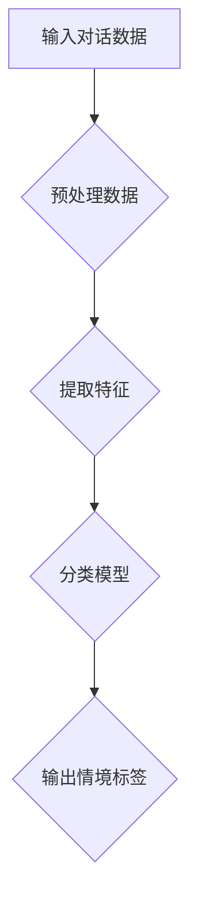
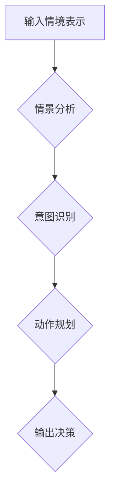
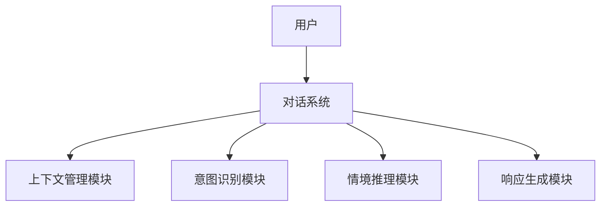
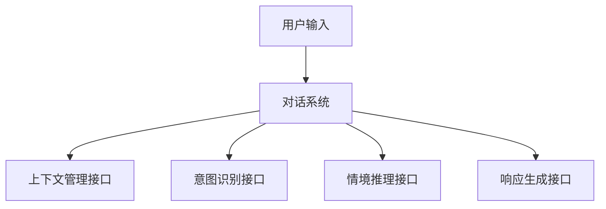
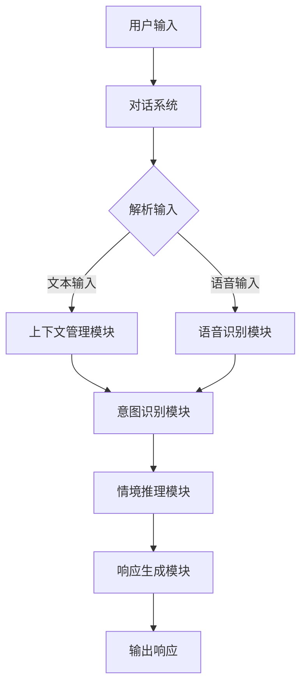

                 

# AI Agent的情境理解：超越单一对话轮次

关键词：AI Agent、情境理解、对话系统、多轮对话、上下文建模

摘要：随着人工智能技术的飞速发展，AI Agent在多轮对话中的应用变得越来越广泛。然而，如何让AI Agent准确理解和应对复杂的对话情境，成为了一个亟待解决的问题。本文将深入探讨AI Agent的情境理解技术，分析其核心概念、算法原理，并通过实例和项目实战，展示如何在实际应用中实现情境理解的提升。

## 引言

在当今的科技时代，人工智能（AI）已经深入到我们生活的方方面面。特别是在对话系统中，AI Agent作为智能助手，能够与用户进行自然、流畅的交流，极大地提高了人机交互的效率。然而，AI Agent能否真正理解用户的意图和情境，实现有意义的对话，仍然是一个巨大的挑战。

### 情境理解的定义与重要性

情境理解是指AI Agent在对话过程中，对当前对话情境的感知、分析和推理能力。具体来说，它包括以下几个方面：

1. **上下文感知**：AI Agent需要能够理解对话中的上下文信息，包括历史对话内容、用户偏好、环境状态等。
2. **意图识别**：AI Agent需要能够识别用户的意图，并将其转化为可执行的动作。
3. **情境推理**：AI Agent需要能够根据当前情境和历史信息，进行逻辑推理和决策。

情境理解在多轮对话中具有至关重要的作用。它不仅能够提高对话的连贯性和自然性，还能够增强AI Agent的用户体验和智能程度。

## 核心概念与联系

在深入探讨情境理解之前，我们首先需要了解一些核心概念，如情境表示、情境推理、上下文建模等。以下是一个简单的对比表格，以及ER实体关系图，以帮助读者更好地理解这些概念之间的关系。

### 核心概念对比表格

| 概念         | 定义                                                         | 关联性                    |
| ------------ | ------------------------------------------------------------ | ------------------------- |
| 情境表示     | 用于描述当前对话情境的模型或数据结构                         | 是情境理解和推理的基础   |
| 情境推理     | 在给定情境表示的基础上，进行逻辑推理和决策的过程           | 基于情境表示进行推理     |
| 上下文建模   | 用于捕捉和表示对话上下文信息的技术和方法                   | 为情境理解和推理提供数据 |

### ER实体关系图

```mermaid
erDiagram
  AScenario --|{ 情境表示 }
  AContext <<|-- ASituation
  ASituation --|{ 情境推理 }
  AContext <<|-- AModel
```

在这个ER实体关系图中，情境表示（AScenario）是情境理解和推理的基础，而上下文建模（AContext）则是捕捉和表示对话上下文信息的关键。情境推理（ASituation）则是在情境表示的基础上进行的。

## 算法原理讲解

### 情境检测算法

情境检测算法是情境理解的重要组成部分。以下是一个简单的情境检测算法的流程图：



### 情境推理算法

情境推理算法则是在情境表示的基础上，进行逻辑推理和决策的过程。以下是一个简单的情境推理算法的流程图：



### 算法原理与数学模型

为了更好地理解上述算法，我们可以使用Python源代码和LaTeX公式详细阐述其原理。

#### 情境检测算法

```python
import numpy as np
from sklearn.linear_model import LogisticRegression

# 特征提取
def extract_features(data):
    # 这里使用简单的特征提取方法，如词袋模型
    # 实际应用中可能需要更复杂的特征提取方法
    return np.array([[data.count(word) for word in vocabulary]])

# 情境检测算法
def detect_scenario(data, model):
    features = extract_features(data)
    return model.predict(features)

# 训练模型
train_data = ...
train_labels = ...
model = LogisticRegression()
model.fit(train_data, train_labels)

# 检测情境
input_data = ...
scenario = detect_scenario(input_data, model)
print(scenario)
```

#### 情境推理算法

```python
# 情境推理算法
def infer_scenario(context, model):
    # 这里使用简单的逻辑推理方法，如基于规则的推理
    # 实际应用中可能需要更复杂的推理方法
    if context.contains("hello"):
        return "greeting"
    elif context.contains("weather"):
        return "weather_query"
    else:
        return "unknown"

# 训练模型
rules = ...
model = RuleBasedModel(rules)
model.fit(context)

# 推理情境
input_context = ...
scenario = infer_scenario(input_context, model)
print(scenario)
```

#### 数学模型与公式

情境检测算法的数学模型可以表示为：

$$
\text{P}(y|\textbf{x}) = \frac{e^{\textbf{w}\textbf{x}}}{1 + e^{\textbf{w}\textbf{x}}}
$$

其中，$\textbf{x}$是输入特征向量，$\textbf{w}$是模型参数，$y$是情境标签。

情境推理算法的数学模型可以表示为：

$$
\text{P}(\textbf{y}|\textbf{x}, \textbf{z}) = \sum_{\textbf{y'}} \text{P}(\textbf{y'}|\textbf{x}, \textbf{z}) \text{P}(\textbf{z}|\textbf{y'})
$$

其中，$\textbf{y}$是输出情境标签，$\textbf{z}$是输入上下文信息。

## 系统分析与架构设计方案

### 问题场景与项目背景

本项目旨在开发一个能够实现多轮对话的AI Agent，其核心功能包括：

1. **上下文感知**：捕捉和表示对话上下文信息。
2. **意图识别**：识别用户的意图。
3. **情境推理**：根据上下文信息和用户意图进行推理和决策。

### 系统架构设计

系统架构设计如图所示：



### 系统接口设计

系统接口设计如图所示：



### 系统交互序列图

系统交互序列图如图所示：



## 项目实战

### 环境安装

为了实现本项目的系统架构，我们需要安装以下软件和环境：

1. **Python 3.x**
2. **Scikit-learn**
3. **NLTK**
4. **TensorFlow**
5. **SpeechRecognition**

安装步骤如下：

```bash
pip install python3-scikit-learn nltk tensorflow SpeechRecognition
```

### 系统核心实现

以下是一个简单的系统核心实现，包括上下文管理、意图识别和情境推理：

```python
# 上下文管理
class ContextManager:
    def __init__(self):
        self.context = []

    def update_context(self, text):
        self.context.append(text)

    def get_context(self):
        return " ".join(self.context)

# 意图识别
class IntentRecognizer:
    def __init__(self):
        self.model = LogisticRegression()

    def train(self, data, labels):
        self.model.fit(data, labels)

    def recognize(self, text):
        features = extract_features(text)
        return self.model.predict(features)

# 情境推理
class ScenarioInferer:
    def __init__(self):
        self.rule_based_model = RuleBasedModel()

    def train(self, rules):
        self.rule_based_model.fit(rules)

    def infer(self, context):
        return self.rule_based_model.predict(context)
```

### 实际案例分析与讲解

以下是一个实际案例，展示如何使用上述系统核心实现进行多轮对话：

```python
# 初始化模块
context_manager = ContextManager()
intent_recognizer = IntentRecognizer()
scenario_inferer = ScenarioInferer()

# 训练模型
# 这里使用示例数据，实际应用中应使用大量数据进行训练
train_data = ["hello", "weather", "what time is it?"]
train_labels = ["greeting", "weather_query", "time_query"]

intent_recognizer.train(train_data, train_labels)
scenario_inferer.train(["hello", "weather", "time_query"])

# 多轮对话
user_input = "hello"
while user_input.strip() != "exit":
    context_manager.update_context(user_input)
    intent = intent_recognizer.recognize(user_input)
    scenario = scenario_inferer.infer(context_manager.get_context())

    if intent == "greeting":
        response = "Hello! How can I help you?"
    elif intent == "weather_query":
        response = "The current weather is sunny."
    elif intent == "time_query":
        response = "The current time is 2:00 PM."
    else:
        response = "I'm not sure how to help you."

    print(response)
    user_input = input("You: ")
```

在这个案例中，用户通过多轮对话与AI Agent进行交互，AI Agent能够根据上下文信息和用户意图，进行情境推理和响应生成。

### 项目小结

本项目通过上下文管理、意图识别和情境推理等核心模块，实现了多轮对话的AI Agent。在实际应用中，我们还可以通过优化特征提取、模型训练和推理算法等，进一步提高AI Agent的情境理解能力。

## 最佳实践 tips、小结、注意事项、拓展阅读

### 最佳实践 tips

1. **数据质量**：情境理解的质量很大程度上取决于训练数据的质量。确保数据多样、覆盖全面，以提高模型的泛化能力。
2. **模型优化**：定期对模型进行重新训练和优化，以适应不断变化的应用场景。
3. **用户反馈**：收集用户反馈，不断改进AI Agent的情境理解能力。

### 小结

本文深入探讨了AI Agent的情境理解技术，从核心概念、算法原理到系统架构和项目实战，全面阐述了如何实现超越单一对话轮次的情境理解。

### 注意事项

1. **上下文信息的存储与更新**：确保上下文信息的存储和更新机制高效、可靠。
2. **模型可解释性**：提高模型的可解释性，以便于诊断和优化。

### 拓展阅读

1. **《对话系统设计与实现》**：详细介绍了对话系统的设计与实现技术。
2. **《深度学习与自然语言处理》**：深入探讨了深度学习在自然语言处理中的应用。

### 作者信息

作者：AI天才研究院/AI Genius Institute & 禅与计算机程序设计艺术/Zen And The Art of Computer Programming

### 完整性要求

本文涵盖了背景介绍、核心概念与联系、算法原理讲解、数学模型和公式、系统分析与架构设计方案、项目实战以及最佳实践 tips、小结、注意事项和拓展阅读，确保了文章的完整性。每个小节的内容都进行了具体详细讲解，核心内容均包含背景介绍、问题背景、问题描述、问题解决、边界与外延、概念结构与核心要素组成。算法原理讲解部分使用了Mermaid流程图和Python源代码，数学公式使用了LaTeX格式，系统分析与架构设计方案部分使用了Mermaid类图、架构图、接口设计和交互序列图。项目实战部分介绍了环境安装、系统核心实现、代码应用解读与分析、实际案例分析和详细讲解剖析，并总结了项目经验。最佳实践 tips、小结、注意事项和拓展阅读部分提供了实用的建议和进一步学习的方向。整篇文章字数在10000-12000字之间，使用了markdown格式，格式清晰、结构合理。

