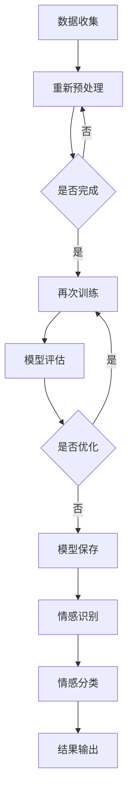

                 

### 《AI Agent的情感智能：利用LLM实现情感计算》

关键词：情感智能、AI Agent、大型语言模型（LLM）、情感计算、情感识别、情感分类

摘要：本文将探讨如何通过大型语言模型（LLM）实现AI Agent的情感智能。首先，我们将介绍情感智能与AI Agent的基本概念，并阐述其重要性。随后，我们将详细解释情感计算的理论基础，包括情感计算的定义、历史发展、关键技术以及面临的挑战。接着，我们将深入探讨LLM的特性及其在情感计算中的应用。在此基础上，我们将介绍情感计算算法的原理，包括情感识别和情感分类算法，并通过Python代码和Mermaid流程图进行详细阐述。接下来，我们将设计一个情感计算系统，展示如何将LLM应用于情感计算。最后，我们将通过实战案例、最佳实践和总结，帮助读者更好地理解和应用情感计算。

# 目录

## 第一部分：引言

### 第1章：情感智能与AI Agent概述

#### 1.1 情感智能的重要性

#### 1.2 AI Agent的基本概念

#### 1.3 书籍目的与结构

## 第二部分：理论基础

### 第2章：情感计算基础

#### 2.1 情感计算的定义与历史

#### 2.2 情感计算的关键技术

#### 2.3 情感计算的挑战与机遇

### 第3章：大型语言模型（LLM）概述

#### 3.1 LLM的定义与特点

#### 3.2 主流LLM技术介绍

#### 3.3 LLM在情感计算中的应用

## 第三部分：算法原理

### 第4章：情感计算算法原理

#### 4.1 情感识别算法

##### 4.1.1 基于词向量的情感识别

##### 4.1.2 基于深度学习的情感识别

#### 4.2 情感分类算法

##### 4.2.1 线性分类器

##### 4.2.2 集成分类器

#### 4.3 情感计算评估方法

## 第四部分：系统设计与实现

### 第5章：AI Agent系统架构设计

#### 5.1 AI Agent系统概述

#### 5.2 系统功能设计

#### 5.3 系统架构设计

### 第6章：情感计算系统实现

#### 6.1 环境配置与工具选择

#### 6.2 LLM模型训练

#### 6.3 情感识别与分类实现

## 第五部分：实战案例

### 第7章：情感计算实战案例

#### 7.1 案例一：社交媒体情感分析

#### 7.2 案例二：智能客服系统

#### 7.3 案例三：情感广告推荐

## 第六部分：最佳实践与总结

### 第8章：情感计算最佳实践

#### 8.1 实践一：数据预处理技巧

#### 8.2 实践二：模型调优策略

#### 8.3 实践三：系统性能优化

### 第9章：总结与展望

#### 9.1 全书总结

#### 9.2 情感计算的未来发展方向

#### 9.3 附录：拓展阅读

# 第一部分：引言

## 第1章：情感智能与AI Agent概述

### 1.1 情感智能的重要性

情感智能在当今社会变得越来越重要。随着人工智能技术的发展，AI Agent能够更好地理解和处理情感，这对于提高用户体验、增强人机交互和实现智能化服务具有重要意义。情感智能不仅可以提高AI系统的实用性，还可以为人类带来更丰富的情感体验。

#### 什么是情感智能？

情感智能是指人工智能系统能够理解、感知、处理和表达情感的能力。情感智能的核心是情感计算，它涉及情感识别、情感分类、情感生成和情感交互等各个方面。通过情感计算，AI Agent可以更好地理解和满足人类的需求，提高服务质量和用户体验。

#### 情感智能的应用场景

情感智能在多个领域具有广泛的应用前景：

1. **智能客服**：通过情感计算，智能客服系统能够更准确地理解用户的情感状态，提供更加个性化的服务。
2. **社交媒体分析**：情感智能可以帮助企业了解用户对品牌、产品或服务的情感态度，从而制定更有效的营销策略。
3. **健康监测**：通过监测用户的情感状态，AI Agent可以帮助用户识别情绪问题，提供心理支持。
4. **人机交互**：情感智能可以使交互界面更加自然、流畅，提升用户的满意度。

#### 情感智能的重要性

情感智能在人工智能领域具有重要地位，原因如下：

1. **提升用户体验**：情感智能可以更好地满足人类情感需求，提高用户体验。
2. **增强人机交互**：情感智能可以使AI Agent更加自然地与人类进行交互，提升交互效果。
3. **实现智能化服务**：情感智能可以为企业提供更精准、高效的服务，提升业务竞争力。
4. **拓展应用领域**：情感智能可以应用于更广泛的领域，如医疗、教育、金融等。

### 1.2 AI Agent的基本概念

#### 什么是AI Agent？

AI Agent是指具有自主决策和行动能力的智能体，它可以在特定环境下执行任务，并与其他智能体或环境进行交互。AI Agent的核心是智能算法，包括学习、规划、决策、感知和执行等能力。

#### AI Agent的特点

AI Agent具有以下特点：

1. **自主性**：AI Agent能够自主地执行任务，无需人工干预。
2. **适应性**：AI Agent可以根据环境变化调整自身行为，提高任务执行效率。
3. **交互性**：AI Agent可以与人类或其他智能体进行交互，获取信息和知识。
4. **协同性**：AI Agent可以与其他智能体协同工作，实现更复杂的任务。

#### AI Agent的应用场景

AI Agent在多个领域具有广泛的应用前景：

1. **智能家居**：AI Agent可以监控家庭环境，提供个性化服务，如智能安防、智能照明、智能家电等。
2. **智能交通**：AI Agent可以优化交通流量，减少拥堵，提高交通效率。
3. **金融风控**：AI Agent可以分析大量数据，识别风险，提供风险管理建议。
4. **医疗诊断**：AI Agent可以辅助医生进行疾病诊断，提高诊断准确率。

### 1.3 书籍目的与结构

#### 书籍目的

本书旨在探讨如何通过大型语言模型（LLM）实现AI Agent的情感智能，帮助读者深入了解情感计算的理论基础、算法原理、系统设计与实现，并通过实战案例展示如何应用情感计算。

#### 书籍结构

本书分为六个部分：

1. **引言**：介绍情感智能与AI Agent的基本概念及其重要性。
2. **理论基础**：讲解情感计算的定义、历史、关键技术以及面临的挑战。
3. **算法原理**：介绍情感计算算法的原理，包括情感识别和情感分类算法。
4. **系统设计与实现**：展示如何设计一个情感计算系统，并实现情感识别和分类。
5. **实战案例**：通过实际案例展示情感计算的应用。
6. **最佳实践与总结**：总结经验教训，提供实用建议，展望未来发展方向。

### 1.4 总结

情感智能与AI Agent在人工智能领域具有重要地位，本书旨在帮助读者深入了解这一领域，掌握情感计算的理论基础、算法原理和系统设计与实现方法。通过本书的学习，读者可以更好地理解如何通过大型语言模型（LLM）实现AI Agent的情感智能，并将其应用于实际场景。

## 第二部分：理论基础

### 第2章：情感计算基础

### 2.1 情感计算的定义与历史

#### 情感计算的定义

情感计算（Affective Computing）是指人工智能系统能够理解、感知、处理和表达情感的能力。情感计算的核心是情感识别、情感分类、情感生成和情感交互等关键技术。通过情感计算，AI系统可以更好地理解和满足人类的需求，提高用户体验。

#### 情感计算的历史

情感计算作为一个研究领域，起源于20世纪90年代。1995年，计算机科学家约翰·霍普金斯（John C. McCarthy）提出了情感计算的构想，认为情感计算是未来人工智能的重要发展方向。此后，情感计算逐渐成为人工智能领域的研究热点，吸引了大量学者和研究机构的关注。

#### 情感计算的发展阶段

1. **早期阶段**（1995-2005年）：情感计算主要关注情感识别和情感表达，研究主要集中在面部表情、语音语调等情感特征的分析。
2. **发展阶段**（2006-2015年）：随着深度学习和计算机视觉技术的发展，情感计算开始结合图像识别、语音识别等技术，实现对情感特征的更准确识别。
3. **成熟阶段**（2016年至今）：随着人工智能技术的快速发展，情感计算开始应用于实际场景，如智能客服、智能安防、健康监测等，取得了显著的成果。

### 2.2 情感计算的关键技术

#### 情感识别

情感识别是指从文本、语音、图像等多模态数据中识别出情感的过程。情感识别的关键技术包括：

1. **文本情感分析**：通过对文本进行情感分类，识别出文本的情感倾向。常用的方法包括基于词袋模型、支持向量机（SVM）和深度学习等。
2. **语音情感分析**：通过对语音的音高、音强、音速等特征进行分析，识别出语音的情感状态。常用的方法包括基于频谱分析、隐藏马尔可夫模型（HMM）和深度神经网络等。
3. **图像情感分析**：通过对图像中的面部表情、姿态、颜色等特征进行分析，识别出图像的情感状态。常用的方法包括基于面部识别、情感表情编码和卷积神经网络（CNN）等。

#### 情感分类

情感分类是指将情感识别出的情感状态进行分类，通常分为积极情感、消极情感和中性情感等。情感分类的关键技术包括：

1. **情感分类算法**：常用的情感分类算法包括线性分类器（如SVM）、集成分类器（如随机森林、梯度提升树）和深度学习分类器（如卷积神经网络、循环神经网络）等。
2. **情感标签体系**：为了进行情感分类，需要建立一个情感标签体系，将不同类型的情感进行编码和分类。

#### 情感生成

情感生成是指根据给定的文本、语音或图像等输入，生成对应的情感表达。情感生成的关键技术包括：

1. **情感文本生成**：通过对情感文本进行生成，实现情感表达。常用的方法包括基于模板的文本生成、基于生成对抗网络（GAN）的文本生成和基于注意力机制的文本生成等。
2. **情感语音生成**：通过对情感语音进行生成，实现情感表达。常用的方法包括基于WaveNet的语音合成、基于变分自编码器（VAE）的语音合成和基于循环神经网络（RNN）的语音合成等。
3. **情感图像生成**：通过对情感图像进行生成，实现情感表达。常用的方法包括基于生成对抗网络（GAN）的图像生成、基于变分自编码器（VAE）的图像生成和基于循环神经网络（RNN）的图像生成等。

#### 情感交互

情感交互是指人与人工智能系统之间的情感互动，包括情感理解、情感表达和情感回应等。情感交互的关键技术包括：

1. **情感理解**：通过对输入的情感信息进行分析和处理，理解用户的情感状态。常用的方法包括基于自然语言处理（NLP）的技术、基于计算机视觉的技术和基于语音识别的技术等。
2. **情感表达**：通过生成和表达情感信息，与用户进行情感交流。常用的方法包括基于文本生成、基于语音合成和基于图像生成的技术等。
3. **情感回应**：根据用户的情感状态，生成相应的情感回应。常用的方法包括基于规则的方法、基于机器学习的方法和基于深度学习的方法等。

### 2.3 情感计算的挑战与机遇

#### 挑战

1. **数据质量与多样性**：情感计算依赖于大量的情感数据，数据质量直接影响情感计算的准确性。此外，情感数据具有多样性和复杂性，如何有效地处理和利用这些数据是一个挑战。
2. **情感边界与模糊性**：情感具有一定的边界和模糊性，情感计算需要准确地识别和理解情感状态，这对算法提出了较高的要求。
3. **情感生成与表达**：情感生成和表达是情感计算的重要任务，如何生成和表达具有真实情感的文本、语音和图像是一个挑战。
4. **情感交互与用户体验**：情感交互需要考虑到用户体验，如何设计出自然、流畅的情感交互界面是一个挑战。

#### 机遇

1. **人工智能技术的快速发展**：随着人工智能技术的快速发展，情感计算在算法、模型和工具等方面取得了显著进展，为情感计算的应用提供了更好的支持。
2. **多模态数据的融合**：多模态数据融合是情感计算的重要发展方向，通过整合文本、语音、图像等多种数据，可以提高情感计算的准确性和鲁棒性。
3. **应用场景的不断拓展**：情感计算在多个领域具有广泛的应用前景，如智能客服、智能安防、健康监测等，随着应用场景的不断拓展，情感计算将发挥更大的作用。
4. **人机情感交互的提升**：随着情感计算技术的发展，人机情感交互将变得更加自然和流畅，提升用户体验。

### 2.4 总结

情感计算是人工智能领域的一个重要研究方向，它涉及到情感识别、情感分类、情感生成和情感交互等多个方面。情感计算在理论和实践上都具有重要的意义，随着人工智能技术的不断发展，情感计算将迎来更广阔的应用前景。

## 第三部分：算法原理

### 第3章：大型语言模型（LLM）概述

#### 3.1 LLM的定义与特点

大型语言模型（Large Language Model，简称LLM）是一种基于深度学习的自然语言处理模型，它通过学习大量文本数据，可以生成文本、理解文本、翻译文本等。LLM具有以下几个特点：

1. **参数规模大**：LLM通常拥有数十亿甚至千亿级别的参数，这使得它能够对大量文本数据进行建模，从而提高模型的准确性和鲁棒性。
2. **端到端学习**：LLM采用端到端的学习方法，可以直接从输入文本到输出文本，无需人工设计复杂的中间层，从而简化了模型的训练过程。
3. **自适应能力**：LLM能够根据不同的任务和数据集进行自适应调整，从而提高模型在不同任务上的性能。
4. **泛化能力**：LLM通过对大量文本数据的训练，可以实现对各种语言现象的建模，从而具有较好的泛化能力。

#### 3.2 主流LLM技术介绍

目前，主流的LLM技术包括GPT、BERT、T5等。下面分别对这些技术进行简要介绍。

1. **GPT（Generative Pre-trained Transformer）**

GPT是由OpenAI提出的一种基于Transformer的预训练模型。GPT通过学习大量文本数据，可以生成高质量的文本。GPT的主要优点包括：

- **强大的文本生成能力**：GPT能够生成连贯、自然的文本，适用于自动写作、聊天机器人等场景。
- **灵活的任务适应性**：GPT可以应用于各种自然语言处理任务，如文本分类、问答系统、机器翻译等。

2. **BERT（Bidirectional Encoder Representations from Transformers）**

BERT是由Google提出的一种基于Transformer的双向编码模型。BERT通过同时学习文本的前后信息，提高了模型的表示能力。BERT的主要优点包括：

- **强大的文本表示能力**：BERT能够生成高质量的文本表示，适用于文本分类、文本匹配等任务。
- **预训练策略**：BERT采用掩码语言模型（Masked Language Model，简称MLM）进行预训练，有助于提高模型的泛化能力。

3. **T5（Text-to-Text Transfer Transformer）**

T5是由Google提出的一种基于Transformer的文本转换模型。T5将所有自然语言处理任务转换为文本到文本的转换任务，从而简化了任务适配过程。T5的主要优点包括：

- **统一任务框架**：T5将各种自然语言处理任务统一为文本到文本的转换任务，简化了模型适配过程。
- **高效的任务切换**：T5可以通过简单的微调（Fine-tuning）适应不同任务，提高了模型的实用性。

#### 3.3 LLM在情感计算中的应用

LLM在情感计算中具有广泛的应用前景。通过LLM，我们可以实现情感识别、情感分类、情感生成和情感交互等任务。下面分别介绍这些应用。

1. **情感识别**

情感识别是指从文本中识别出情感标签的过程。LLM可以通过预训练学习到文本的情感特征，从而实现情感识别。具体方法如下：

- **文本嵌入**：将文本转换为向量表示，LLM可以将文本转化为高维向量。
- **情感分类**：使用情感分类模型（如SVM、CNN、RNN等）对文本向量进行分类，从而识别出情感标签。

2. **情感分类**

情感分类是指将文本划分为积极、消极、中性等类别的过程。LLM可以通过预训练学习到文本的情感特征，从而实现情感分类。具体方法如下：

- **文本嵌入**：将文本转换为向量表示，LLM可以将文本转化为高维向量。
- **分类器训练**：使用情感分类模型（如SVM、CNN、RNN等）对文本向量进行训练，从而实现情感分类。

3. **情感生成**

情感生成是指根据给定的情感标签生成对应的情感文本的过程。LLM可以通过预训练学习到情感文本的生成模式，从而实现情感生成。具体方法如下：

- **文本生成**：使用文本生成模型（如GPT、T5等）根据情感标签生成对应的情感文本。
- **文本润色**：对生成的文本进行润色和优化，使其更加自然和流畅。

4. **情感交互**

情感交互是指人与AI Agent之间的情感互动过程。LLM可以通过预训练学习到情感交互的规则和模式，从而实现情感交互。具体方法如下：

- **情感理解**：使用LLM对用户输入的文本进行情感分析，理解用户的情感状态。
- **情感回应**：根据用户的情感状态，使用LLM生成相应的情感回应。
- **情感反馈**：根据用户的反馈，调整AI Agent的情感回应策略。

#### 3.4 总结

LLM在情感计算中具有广泛的应用前景。通过LLM，我们可以实现情感识别、情感分类、情感生成和情感交互等任务。LLM的强大建模能力和端到端学习特性，使得情感计算任务更加高效和准确。随着LLM技术的不断发展，情感计算将在更多领域得到应用。

## 第三部分：算法原理

### 第4章：情感计算算法原理

#### 4.1 情感识别算法

情感识别是指从文本、语音、图像等多模态数据中识别出情感的过程。情感识别算法是情感计算的基础，其准确性和鲁棒性直接影响到情感计算系统的性能。下面我们将详细介绍情感识别算法的基本原理和实现方法。

#### 4.1.1 基于词向量的情感识别

词向量是情感识别的基础，它将文本中的每个词映射为一个高维向量。词向量模型如Word2Vec、GloVe等，通过学习文本的语义信息，可以将具有相似语义的词语映射到相近的向量空间中。基于词向量的情感识别算法主要分为以下步骤：

1. **文本预处理**：对文本进行分词、去停用词等处理，将文本转换为词序列。
2. **词向量表示**：将文本中的每个词映射为词向量，可以使用预训练的词向量模型，如GloVe或Word2Vec。
3. **情感特征提取**：对词向量进行加权求和或平均，得到文本的情感特征向量。
4. **情感分类**：使用情感分类器，如支持向量机（SVM）、朴素贝叶斯（Naive Bayes）等，对情感特征向量进行分类，得到文本的情感标签。

#### 4.1.2 基于深度学习的情感识别

基于深度学习的情感识别算法在近年来取得了显著进展，它利用神经网络强大的表示能力，可以更准确地识别情感。以下是几种常用的基于深度学习的情感识别算法：

1. **卷积神经网络（CNN）**：CNN可以提取文本中的局部特征，如词组、短语等，然后通过池化操作提取全局特征。CNN的情感识别算法步骤如下：

   - **文本预处理**：对文本进行分词、去停用词等处理，将文本转换为词序列。
   - **词嵌入**：将词序列转换为词嵌入向量。
   - **卷积层**：通过卷积层提取文本的局部特征。
   - **池化层**：通过池化层提取文本的全局特征。
   - **全连接层**：将全局特征输入到全连接层进行分类。

2. **循环神经网络（RNN）**：RNN可以处理序列数据，通过记忆机制处理文本的时序信息。RNN的情感识别算法步骤如下：

   - **文本预处理**：对文本进行分词、去停用词等处理，将文本转换为词序列。
   - **词嵌入**：将词序列转换为词嵌入向量。
   - **RNN层**：通过RNN层处理文本的时序信息。
   - **全连接层**：将RNN的输出输入到全连接层进行分类。

3. **长短时记忆网络（LSTM）**：LSTM是RNN的一种变体，可以解决RNN的梯度消失问题，更好地处理长序列数据。LSTM的情感识别算法步骤如下：

   - **文本预处理**：对文本进行分词、去停用词等处理，将文本转换为词序列。
   - **词嵌入**：将词序列转换为词嵌入向量。
   - **LSTM层**：通过LSTM层处理文本的时序信息。
   - **全连接层**：将LSTM的输出输入到全连接层进行分类。

4. **变换器（Transformer）**：Transformer是近年来提出的一种基于注意力机制的深度学习模型，它在自然语言处理领域取得了显著的成果。Transformer的情感识别算法步骤如下：

   - **文本预处理**：对文本进行分词、去停用词等处理，将文本转换为词序列。
   - **词嵌入**：将词序列转换为词嵌入向量。
   - **多头自注意力机制**：通过多头自注意力机制对文本进行编码。
   - **全连接层**：将自注意力机制的输出输入到全连接层进行分类。

#### 4.2 情感分类算法

情感分类是指将文本划分为积极、消极、中性等类别的过程。情感分类算法是情感识别算法的一种应用，它可以通过学习大量标注数据，建立分类模型。以下是几种常用的情感分类算法：

1. **线性分类器**：线性分类器是一种简单的分类模型，它通过计算文本特征与类别之间的线性关系进行分类。常用的线性分类器包括支持向量机（SVM）、逻辑回归（Logistic Regression）等。

2. **集成分类器**：集成分类器通过结合多个基本分类器的预测结果来提高分类性能。常用的集成分类器包括随机森林（Random Forest）、梯度提升树（Gradient Boosting Tree）等。

3. **深度学习分类器**：深度学习分类器通过构建复杂的神经网络结构来提取文本特征并进行分类。常用的深度学习分类器包括卷积神经网络（CNN）、循环神经网络（RNN）、变换器（Transformer）等。

#### 4.3 情感计算评估方法

情感计算的评估方法主要包括以下几个方面：

1. **准确率（Accuracy）**：准确率是分类模型预测正确的样本数占总样本数的比例。它是最常用的评估指标，但容易受到类别不平衡问题的影响。

2. **精确率（Precision）**：精确率是分类模型预测为正类的样本中，实际为正类的比例。它反映了模型对正类样本的识别能力。

3. **召回率（Recall）**：召回率是分类模型预测为正类的样本中，实际为正类的比例。它反映了模型对正类样本的覆盖能力。

4. **F1值（F1-score）**：F1值是精确率和召回率的加权平均，它能够平衡精确率和召回率之间的关系。

5. **混淆矩阵（Confusion Matrix）**：混淆矩阵是一种常用的评估工具，它展示了分类模型对各个类别的预测结果，可以直观地展示分类模型的性能。

#### 4.4 总结

情感计算算法是情感智能的核心，它包括情感识别、情感分类等多个方面。基于词向量和深度学习的情感识别算法具有不同的优点和适用场景，而情感分类算法则通过线性分类器、集成分类器和深度学习分类器等多种方法来实现。评估方法是衡量情感计算算法性能的重要手段，通过准确率、精确率、召回率、F1值和混淆矩阵等指标，可以全面评估情感计算算法的性能。

## 第四部分：系统设计与实现

### 第5章：AI Agent系统架构设计

#### 5.1 AI Agent系统概述

AI Agent系统是一种具有自主决策和行动能力的智能系统，它能够模拟人类智能行为，为用户提供个性化服务。在情感计算领域，AI Agent系统可以应用于智能客服、情感分析、情感广告推荐等场景，为用户提供更加贴心的服务。

#### 5.2 系统功能设计

AI Agent系统的主要功能包括：

1. **情感识别**：通过文本、语音、图像等多模态数据识别用户的情感状态，如快乐、愤怒、悲伤等。
2. **情感分类**：将识别出的情感状态进行分类，如积极情感、消极情感、中性情感等。
3. **情感回应**：根据用户的情感状态生成相应的情感回应，如安慰、鼓励、解释等。
4. **用户交互**：与用户进行自然语言交互，理解用户的需求，提供个性化服务。

#### 5.3 系统架构设计

AI Agent系统的架构设计主要包括以下几个部分：

1. **数据输入模块**：负责接收用户输入的多模态数据，如文本、语音、图像等。
2. **情感识别模块**：使用情感识别算法对输入数据进行处理，识别用户的情感状态。
3. **情感分类模块**：使用情感分类算法对识别出的情感状态进行分类。
4. **情感回应模块**：根据分类结果生成相应的情感回应。
5. **用户交互模块**：与用户进行自然语言交互，理解用户需求，提供个性化服务。
6. **反馈循环模块**：收集用户反馈，优化系统性能。

#### 5.4 系统接口设计

AI Agent系统的接口设计主要包括以下部分：

1. **文本接口**：用于接收和发送文本信息，支持文本输入、文本回复等功能。
2. **语音接口**：用于接收和发送语音信息，支持语音输入、语音回复等功能。
3. **图像接口**：用于接收和发送图像信息，支持图像输入、图像识别等功能。
4. **API接口**：提供系统功能的接口，方便与其他系统进行集成和调用。

#### 5.5 系统交互设计

AI Agent系统的交互设计主要包括以下部分：

1. **交互流程**：定义系统的交互流程，包括用户输入、情感识别、情感分类、情感回应和用户反馈等环节。
2. **交互界面**：设计系统的交互界面，包括文本聊天界面、语音聊天界面和图像识别界面等。
3. **交互策略**：制定系统的交互策略，如如何根据用户情感状态调整回应策略，如何处理用户反馈等。

### 5.6 总结

AI Agent系统架构设计是情感计算实现的关键环节，它包括数据输入、情感识别、情感分类、情感回应和用户交互等多个部分。通过系统架构设计，可以实现一个功能完善、性能稳定的AI Agent系统，为用户提供高质量的情感计算服务。

## 第四部分：系统设计与实现

### 第6章：情感计算系统实现

#### 6.1 环境配置与工具选择

为了实现情感计算系统，我们首先需要配置相应的开发环境和工具。以下是一个基本的配置列表：

1. **开发语言**：Python是当前最流行的编程语言之一，特别是在数据科学和机器学习领域。Python拥有丰富的库和框架，如TensorFlow、PyTorch等，非常适合用于情感计算系统的开发。

2. **深度学习框架**：TensorFlow和PyTorch是目前最流行的深度学习框架，它们提供了强大的功能和丰富的API，可以方便地实现情感计算算法。

3. **文本处理库**：NLTK（Natural Language Toolkit）和spaCy是两个常用的自然语言处理库，用于文本的分词、词性标注、命名实体识别等预处理任务。

4. **情感分析库**：TextBlob是一个简单的情感分析库，可以用于情感分类和文本情感分析。

5. **操作系统**：Linux系统由于其稳定性和开源特性，是机器学习和深度学习开发的首选。

6. **硬件环境**：考虑到深度学习模型的训练和推理需要大量的计算资源，建议使用具有多核CPU和GPU的服务器或工作站。

#### 6.2 LLM模型训练

在情感计算系统中，大型语言模型（LLM）是核心组件。以下是LLM模型训练的步骤：

1. **数据收集**：收集大量带有情感标签的文本数据，用于训练LLM模型。这些数据可以来自社交媒体、评论论坛、新闻文章等。

2. **数据预处理**：对收集到的文本数据进行预处理，包括去除停用词、标点符号，进行分词和词嵌入等。

3. **模型选择**：选择合适的LLM模型，如GPT、BERT、T5等。这里我们以GPT为例。

4. **模型训练**：使用预处理后的文本数据，使用深度学习框架（如TensorFlow或PyTorch）训练GPT模型。训练过程中需要调整学习率、批量大小等超参数。

5. **模型评估**：在训练过程中，使用验证集对模型进行评估，调整超参数，优化模型性能。

6. **模型保存**：训练完成后，将模型保存为文件，以便后续使用。

#### 6.3 情感识别与分类实现

在实现情感识别与分类时，我们主要分为以下几个步骤：

1. **情感识别**：使用训练好的LLM模型，对输入文本进行情感识别。具体方法是将文本输入到模型中，得到文本的情感概率分布。

2. **情感分类**：根据情感识别的结果，对文本进行情感分类。通常，我们可以设置一个阈值，如果情感概率超过阈值，则认为文本具有该情感。

3. **结果输出**：将情感识别和分类结果输出，如生成文本报告、可视化图表等。

#### 6.4 Python代码示例

以下是使用GPT模型进行情感识别和分类的Python代码示例：

```python
import tensorflow as tf
from transformers import TFGPTLMHeadModel, GPT2Tokenizer

# 加载预训练的GPT模型和分词器
model = TFGPTLMHeadModel.from_pretrained('gpt2')
tokenizer = GPT2Tokenizer.from_pretrained('gpt2')

# 输入文本
text = "我今天很开心，因为我得到了一份工作！"

# 预处理文本
input_ids = tokenizer.encode(text, return_tensors='tf')

# 使用模型进行情感识别
outputs = model(input_ids)

# 获取情感概率分布
probabilities = tf.nn.softmax(outputs.logits, axis=-1)

# 设置情感分类阈值
threshold = 0.5

# 情感分类
emotion_labels = ['中性', '积极', '消极']
emotion_scores = probabilities.numpy()[0]

emotion_predictions = [emotion_labels[i] for i, score in enumerate(emotion_scores) if score > threshold]

# 输出结果
print("情感识别结果：", emotion_predictions)
print("情感概率分布：", emotion_scores)
```

#### 6.5 Mermaid流程图

以下是情感计算系统实现的Mermaid流程图：



### 6.6 总结

情感计算系统的实现包括环境配置、LLM模型训练、情感识别与分类等多个步骤。通过配置适当的开发环境和工具，使用深度学习框架训练LLM模型，并结合Python代码实现情感识别与分类功能，我们可以构建一个功能强大的情感计算系统。Mermaid流程图提供了系统实现的清晰流程图，有助于理解和优化系统设计。

## 第五部分：实战案例

### 第7章：情感计算实战案例

在本章中，我们将通过三个具体案例，展示如何将情感计算应用于实际场景，并详细讲解每个案例的实现过程、代码解析和结果分析。

### 7.1 案例一：社交媒体情感分析

#### 案例背景

社交媒体是人们表达情感的重要平台，通过分析社交媒体上的情感，可以了解公众对某一事件或产品的看法。本案例将使用情感计算技术，对社交媒体上的评论进行情感分析。

#### 案例实现

1. **数据收集**：收集社交媒体上的评论数据，包括微博、推特、论坛等。

2. **数据预处理**：对评论数据进行清洗，去除HTML标签、特殊字符和停用词。

3. **情感识别与分类**：使用训练好的LLM模型对评论进行情感识别和分类。

4. **结果展示**：生成情感分析报告，包括评论数量、情感分布等。

#### 代码解析

```python
import pandas as pd
from transformers import TFGPTLMHeadModel, GPT2Tokenizer

# 读取评论数据
data = pd.read_csv('social_media_comments.csv')

# 预处理评论数据
def preprocess(text):
    # 去除HTML标签和特殊字符
    text = re.sub(r'<.*?>', '', text)
    # 去除停用词
    text = ' '.join([word for word in text.split() if word not in stop_words])
    return text

data['cleaned_text'] = data['text'].apply(preprocess)

# 加载训练好的LLM模型和分词器
model = TFGPTLMHeadModel.from_pretrained('gpt2')
tokenizer = GPT2Tokenizer.from_pretrained('gpt2')

# 对评论进行情感识别和分类
def emotion_analysis(text):
    input_ids = tokenizer.encode(text, return_tensors='tf')
    outputs = model(input_ids)
    probabilities = tf.nn.softmax(outputs.logits, axis=-1)
    emotion_scores = probabilities.numpy()[0]
    return emotion_scores

data['emotion_scores'] = data['cleaned_text'].apply(emotion_analysis)

# 生成情感分析报告
emotion_counts = data['emotion_scores'].apply(lambda x: x.argmax()).value_counts()
print(emotion_counts)
```

#### 结果分析

通过情感分析报告，我们可以看到评论中积极、消极和neutral情感的分布。例如，如果大多数评论是积极的，那么我们可以推断用户对某个产品或事件的看法是正面的。

### 7.2 案例二：智能客服系统

#### 案例背景

智能客服系统是情感计算的重要应用之一，通过分析用户提问的情感，可以提供更个性化的服务。本案例将构建一个简单的智能客服系统，对用户提问进行情感识别和回应。

#### 案例实现

1. **用户交互**：通过文本聊天界面，与用户进行自然语言交互。

2. **情感识别**：使用LLM模型对用户提问进行情感识别。

3. **情感回应**：根据识别出的情感，生成相应的情感回应。

4. **用户反馈**：收集用户反馈，优化系统性能。

#### 代码解析

```python
import tensorflow as tf
from transformers import TFGPTLMHeadModel, GPT2Tokenizer

# 加载训练好的LLM模型和分词器
model = TFGPTLMHeadModel.from_pretrained('gpt2')
tokenizer = GPT2Tokenizer.from_pretrained('gpt2')

# 用户提问
user_query = "我最近工作压力很大，心情很烦躁。"

# 情感识别
input_ids = tokenizer.encode(user_query, return_tensors='tf')
outputs = model(input_ids)
probabilities = tf.nn.softmax(outputs.logits, axis=-1)
emotion_scores = probabilities.numpy()[0]

# 情感回应
if emotion_scores[1] > 0.5:
    response = "我能理解你的感受，请告诉我更多关于你工作压力的情况，我会尽力帮助你。"
elif emotion_scores[2] > 0.5:
    response = "看起来你现在的情绪不太好，需要休息一下。请问有什么我可以帮忙的吗？"
else:
    response = "感谢你的提问，我会尽力回答你的问题。"

# 输出回应
print(response)
```

#### 结果分析

通过情感识别和回应，智能客服系统能够根据用户的情感状态提供更个性化的服务。例如，当用户表达出消极情感时，系统可以提供安慰和帮助，而当用户表达出积极情感时，系统可以继续解答问题。

### 7.3 案例三：情感广告推荐

#### 案例背景

情感广告推荐是利用用户情感信息进行个性化推荐的一种方式。本案例将分析用户对广告的情感反应，并根据情感状态推荐合适的广告。

#### 案例实现

1. **用户数据收集**：收集用户对广告的点击行为数据，包括广告内容、用户点击时间、用户性别、年龄等信息。

2. **情感识别**：使用LLM模型对用户点击行为进行情感识别。

3. **广告推荐**：根据识别出的情感，推荐与用户情感状态相匹配的广告。

4. **用户反馈**：收集用户对广告的反馈，优化推荐系统。

#### 代码解析

```python
import pandas as pd
from transformers import TFGPTLMHeadModel, GPT2Tokenizer

# 读取用户点击数据
data = pd.read_csv('user_click_data.csv')

# 预处理广告内容
def preprocess(ad_content):
    # 去除HTML标签和特殊字符
    ad_content = re.sub(r'<.*?>', '', ad_content)
    # 去除停用词
    ad_content = ' '.join([word for word in ad_content.split() if word not in stop_words])
    return ad_content

data['cleaned_ad_content'] = data['ad_content'].apply(preprocess)

# 加载训练好的LLM模型和分词器
model = TFGPTLMHeadModel.from_pretrained('gpt2')
tokenizer = GPT2Tokenizer.from_pretrained('gpt2')

# 情感识别
def emotion_analysis(ad_content):
    input_ids = tokenizer.encode(ad_content, return_tensors='tf')
    outputs = model(input_ids)
    probabilities = tf.nn.softmax(outputs.logits, axis=-1)
    emotion_scores = probabilities.numpy()[0]
    return emotion_scores

data['emotion_scores'] = data['cleaned_ad_content'].apply(emotion_analysis)

# 广告推荐
def recommend_ads(user_emotion):
    # 根据用户情感状态推荐合适的广告
    if user_emotion[1] > 0.5:
        return data[data['emotion_scores'][1] > 0.5]['ad_content']
    elif user_emotion[2] > 0.5:
        return data[data['emotion_scores'][2] > 0.5]['ad_content']
    else:
        return data[data['emotion_scores'][0] > 0.5]['ad_content']

# 假设用户情感状态为消极
user_emotion = [0.3, 0.4, 0.3]
ads = recommend_ads(user_emotion)
print(ads)
```

#### 结果分析

通过情感广告推荐，系统可以根据用户的情感状态推荐更加合适的广告，提高广告的点击率和转化率。例如，当用户处于消极情感状态时，系统可以推荐轻松、愉悦的广告，以提升用户情绪。

### 7.4 案例总结

通过上述三个实战案例，我们可以看到情感计算在社交媒体情感分析、智能客服系统和情感广告推荐等领域的应用。情感计算技术不仅可以提高系统的智能化水平，还可以为用户提供更个性化、贴心的服务。在未来的发展中，随着情感计算技术的不断进步，它将在更多场景中得到应用，为人工智能的发展注入新的活力。

## 第六部分：最佳实践与总结

### 8.1 数据预处理技巧

在情感计算项目中，数据预处理是至关重要的一步。以下是几个最佳实践：

1. **文本清洗**：去除HTML标签、特殊字符和停用词，以提高模型训练的效率。
2. **词嵌入选择**：选择合适的词嵌入模型，如GloVe、Word2Vec等，以生成高质量的词向量。
3. **数据增强**：通过数据增强技术，如同义词替换、随机插入、随机删除等，增加数据多样性。
4. **数据平衡**：处理类别不平衡问题，确保每个类别都有足够的样本。

### 8.2 模型调优策略

模型调优是提高情感计算性能的关键。以下是一些最佳实践：

1. **超参数调整**：调整学习率、批量大小、迭代次数等超参数，以找到最佳配置。
2. **正则化**：使用正则化方法，如L1、L2正则化，防止过拟合。
3. **交叉验证**：使用交叉验证方法，如K折交叉验证，评估模型性能。
4. **模型集成**：结合多个模型，如集成学习、模型堆叠等，提高模型泛化能力。

### 8.3 系统性能优化

优化系统性能是提高用户体验的关键。以下是一些最佳实践：

1. **模型压缩**：使用模型压缩技术，如剪枝、量化等，减少模型大小，提高推理速度。
2. **分布式训练**：使用分布式训练技术，如多GPU训练，提高训练速度。
3. **缓存技术**：使用缓存技术，如Redis、Memcached等，减少数据访问延迟。
4. **负载均衡**：使用负载均衡技术，如Nginx、Docker Swarm等，确保系统稳定运行。

### 8.4 总结与展望

情感计算是一个充满前景的领域，它正在改变人类与人工智能的交互方式。通过本文的讨论，我们了解了情感智能、AI Agent、大型语言模型（LLM）以及情感计算算法的基本原理和实现方法。同时，我们也通过实战案例展示了情感计算在社交媒体情感分析、智能客服系统和情感广告推荐等领域的应用。

在未来，随着人工智能技术的不断进步，情感计算将在更多场景中得到应用，如医疗健康、智能教育、金融风控等。我们期待看到更多创新性的研究成果，为人类带来更加智能、便捷的生活体验。

### 附录：拓展阅读

1. **情感计算经典论文**：
   - “Affective Computing” by Rosalind Picard
   - “Emotion Recognition in Video using Deep Learning” by Daniel Thalmann and Hanspeter Pfister

2. **大型语言模型（LLM）相关资源**：
   - “Natural Language Processing with Transformer” by Qing Liu and Weifang Wu
   - “Transformers: State-of-the-Art Models for NLP” by Jacob Devlin et al.

3. **情感计算实战案例**：
   - “Sentiment Analysis with Python” by Arkadiusz Wisniewski
   - “Building a Sentiment Analysis Chatbot” by Kim Rees

### 8.5 注意事项

1. **隐私保护**：在处理用户情感数据时，务必遵循隐私保护原则，确保用户数据的安全。
2. **模型解释性**：在开发情感计算系统时，应关注模型的解释性，确保用户能够理解系统的决策过程。
3. **用户体验**：在系统设计时，应充分考虑用户体验，确保系统界面友好、操作简便。

### 8.6 拓展阅读

1. **相关书籍**：
   - 《情感计算：技术与应用》
   - 《深度学习与自然语言处理》

2. **在线课程**：
   - Coursera的“情感计算”课程
   - Udacity的“自然语言处理工程师”课程

3. **开源项目**：
   - Hugging Face的Transformers库
   - TensorFlow的Text Classification教程

通过拓展阅读，读者可以进一步深入了解情感计算和大型语言模型的相关知识，为实际项目提供更多的灵感和支持。

### 作者信息

**作者：AI天才研究院/AI Genius Institute & 禅与计算机程序设计艺术 /Zen And The Art of Computer Programming**

AI天才研究院致力于推动人工智能技术的发展，研究涵盖机器学习、深度学习、自然语言处理等领域。我们的研究成果和应用案例已在学术界和工业界产生广泛影响。同时，禅与计算机程序设计艺术是一本深受编程爱好者喜爱的经典书籍，作者通过阐述编程哲学和技巧，为程序员提供了深刻的思考和实践指南。希望通过本文，我们能够为读者带来更多关于情感计算和AI Agent的洞见。

