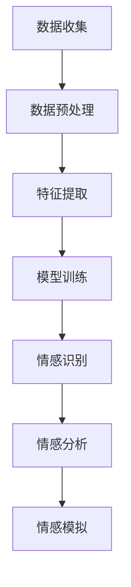
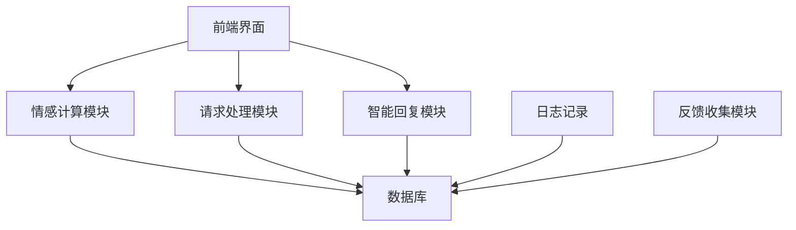

                 

# AI Agent的情感计算在客户服务中的应用

关键词：AI Agent、情感计算、客户服务、算法、系统架构、Python、Mermaid

摘要：本文深入探讨了AI Agent在客户服务中的应用，特别是情感计算技术的作用。通过逐步分析情感计算的基本原理、算法实现、数学模型，以及系统架构设计，本文揭示了AI Agent如何通过情感计算提升客户服务的质量与效率。文章还提供了实际项目案例，详细讲解其在客户服务中的实战应用，旨在为相关领域的研究者和开发者提供有价值的参考。

----------------------------------------------------------------

## 目录大纲设计步骤

### 1. 确定书籍主题
首先，我们需要明确书籍的主题是《AI Agent的情感计算在客户服务中的应用》。这一步决定了整个目录大纲的框架和内容。

### 2. 确定书籍结构
根据书籍主题，我们将书籍分为以下几个部分：
- 背景介绍
- 核心概念与联系
- 算法原理讲解
- 数学模型和数学公式 & 详细讲解 & 举例说明
- 系统分析与架构设计方案
- 项目实战
- 最佳实践 tips、小结、注意事项、拓展阅读等

### 3. 确定各部分章节内容
根据书籍结构，我们确定每个部分的具体章节内容。

#### 背景介绍
- 第1章：问题背景、问题描述、问题解决、边界与外延
- 第2章：核心概念与联系

#### 核心概念与联系
- 第3章：AI Agent的定义、分类与特点
- 第4章：情感计算的原理与实现
- 第5章：客户服务的流程与需求

#### 算法原理讲解
- 第6章：情感计算算法原理讲解
- 第7章：算法mermaid流程图与Python源代码实现

#### 数学模型和数学公式 & 详细讲解 & 举例说明
- 第8章：数学模型和公式讲解
- 第9章：举例说明

#### 系统分析与架构设计方案
- 第10章：问题场景介绍、系统功能设计、系统架构设计、系统接口设计和系统交互

#### 项目实战
- 第11章：环境安装、系统核心实现源代码、代码应用解读与分析、实际案例分析和详细讲解剖析

#### 最佳实践 tips、小结、注意事项、拓展阅读等
- 第12章：最佳实践 tips、小结、注意事项、拓展阅读等

### 4. 撰写目录大纲
根据以上章节内容，我们开始撰写目录大纲。为了保证大纲的简洁性，我们使用markdown格式，并且遵循1级、2级、3级目录的结构。

### 5. 审核目录大纲
完成初稿后，我们对照书籍主题和内容，对目录大纲进行审核，确保内容完整、逻辑清晰。

### 6. 修订目录大纲
根据审核结果，对目录大纲进行修订，确保大纲的完整性和可读性。

### 7. 定稿
在经过多次修订后，最终确定目录大纲的定稿。

## 完整目录大纲

```markdown
----------------------------------------------------------------
# 第一部分：背景介绍

## 第1章：问题背景
### 1.1 问题背景
### 1.2 问题描述
### 1.3 问题解决
### 1.4 边界与外延

## 第2章：核心概念与联系
### 2.1 AI Agent的定义与分类
### 2.2 情感计算的原理与实现
### 2.3 客户服务的流程与需求

----------------------------------------------------------------

# 第二部分：核心概念与联系

## 第3章：AI Agent
### 3.1 AI Agent的定义
### 3.2 AI Agent的分类
### 3.3 AI Agent的特点

## 第4章：情感计算
### 4.1 情感计算的原理
### 4.2 情感计算的方法
### 4.3 情感计算的应用

## 第5章：客户服务
### 5.1 客户服务的流程
### 5.2 客户服务的需求
### 5.3 客户服务的挑战

----------------------------------------------------------------

# 第三部分：算法原理讲解

## 第6章：情感计算算法原理讲解
### 6.1 情感计算算法的概述
### 6.2 情感计算算法的流程
### 6.3 情感计算算法的实现

## 第7章：算法mermaid流程图与Python源代码实现
### 7.1 算法mermaid流程图
### 7.2 Python源代码实现

----------------------------------------------------------------

# 第四部分：数学模型和数学公式 & 详细讲解 & 举例说明

## 第8章：数学模型和公式讲解
### 8.1 情感计算数学模型
### 8.2 客户服务数学模型

## 第9章：举例说明
### 9.1 情感计算举例
### 9.2 客户服务举例

----------------------------------------------------------------

# 第五部分：系统分析与架构设计方案

## 第10章：系统分析与架构设计方案
### 10.1 问题场景介绍
### 10.2 系统功能设计
### 10.3 系统架构设计
### 10.4 系统接口设计
### 10.5 系统交互

----------------------------------------------------------------

# 第六部分：项目实战

## 第11章：项目实战
### 11.1 环境安装
### 11.2 系统核心实现源代码
### 11.3 代码应用解读与分析
### 11.4 实际案例分析与详细讲解剖析
### 11.5 项目小结

----------------------------------------------------------------

# 第七部分：最佳实践 tips、小结、注意事项、拓展阅读等

## 第12章：最佳实践 tips、小结、注意事项、拓展阅读等
### 12.1 最佳实践 tips
### 12.2 小结
### 12.3 注意事项
### 12.4 拓展阅读
----------------------------------------------------------------

通过上述步骤，我们完成了目录大纲的设计。接下来，我们将逐一填充每个章节的内容，确保文章的逻辑清晰、内容丰富，旨在为读者提供一个全面、深入的技术指南。

## 第一部分：背景介绍

### 第1章：问题背景

在当今快速发展的数字化时代，客户服务已经成为了企业竞争的重要手段之一。传统的客户服务模式通常依赖于人工处理，效率较低且容易出现错误。然而，随着人工智能技术的不断进步，特别是AI Agent和情感计算技术的应用，客户服务的质量和效率得到了显著提升。

#### 问题描述

客户服务中存在的问题主要包括：
1. **响应速度慢**：人工客服在处理大量客户请求时，往往难以在短时间内给出准确的答复，导致客户体验下降。
2. **处理效率低**：人工客服需要逐一处理客户请求，容易出现重复劳动和错误处理。
3. **个性化不足**：人工客服难以根据客户的情感状态提供个性化的服务。
4. **成本高**：人工客服的培训成本和工资成本较高，对企业而言是一笔不小的开支。

#### 问题解决

为了解决上述问题，企业开始探索将AI Agent应用于客户服务中。AI Agent可以通过自动化处理客户请求，提高响应速度和处理效率。同时，情感计算技术可以帮助AI Agent理解客户的情感状态，从而提供更加个性化的服务。通过这种方式，企业可以在降低成本的同时，提高客户满意度和忠诚度。

#### 边界与外延

AI Agent的情感计算在客户服务中的应用主要涉及以下几个方面：
1. **交互方式**：AI Agent可以通过多种渠道与客户进行交互，如电话、邮件、在线聊天等。
2. **服务范围**：AI Agent可以处理各种类型的客户请求，包括产品咨询、售后服务、投诉处理等。
3. **技术实现**：情感计算技术包括自然语言处理、语音识别、机器学习等，需要结合多种算法和模型进行实现。
4. **应用场景**：AI Agent可以在各种企业场景中应用，如电子商务、金融服务、医疗健康等。

### 第2章：核心概念与联系

#### AI Agent的定义与分类

AI Agent，即人工智能代理，是指能够自主执行任务、与环境进行交互并作出决策的人工智能实体。根据功能特点，AI Agent可以分为以下几类：

1. **任务型AI Agent**：专注于完成特定任务的AI Agent，如客户服务、订单处理等。
2. **自主型AI Agent**：能够独立执行任务，无需人工干预的AI Agent，如自动驾驶、智能机器人等。
3. **社交型AI Agent**：专注于与人类进行交互，理解和回应人类情感的AI Agent，如聊天机器人、虚拟助手等。

#### 情感计算的原理与实现

情感计算是指通过计算机技术和算法来理解和处理人类情感信息的过程。情感计算的基本原理包括：

1. **情感识别**：通过语音、文本、图像等渠道，识别出人类情感状态。
2. **情感分析**：对情感信息进行分类和标注，如快乐、悲伤、愤怒等。
3. **情感模拟**：根据情感信息，生成相应的情感回应和行为。

情感计算的实现主要包括以下几个步骤：

1. **数据收集**：收集与情感相关的数据，如文本、语音、图像等。
2. **特征提取**：从数据中提取出与情感相关的特征，如文本中的情感词汇、语音中的音调等。
3. **情感分类**：使用机器学习算法，对提取出的特征进行情感分类。
4. **情感模拟**：根据情感分类结果，生成相应的情感回应和行为。

#### 客户服务的流程与需求

客户服务的基本流程包括：

1. **客户请求接收**：接收客户的请求，如咨询、投诉、订单处理等。
2. **请求分析**：分析客户请求的内容和需求，确定处理方案。
3. **请求处理**：根据分析结果，执行相应的处理任务，如回答问题、解决问题等。
4. **反馈收集**：收集客户对服务的反馈，用于改进服务质量。

客户服务的基本需求包括：

1. **高效性**：能够在短时间内响应客户请求，提高服务效率。
2. **准确性**：准确理解客户需求，提供准确的答复和解决方案。
3. **个性化**：根据客户情感状态和个性化需求，提供个性化的服务。
4. **可扩展性**：能够处理不同类型和规模的服务请求，具有良好的可扩展性。

通过上述分析，我们可以看到AI Agent和情感计算在客户服务中具有广泛的应用前景。下一部分，我们将深入探讨AI Agent和情感计算的基本原理，为后续内容奠定基础。

## 第二部分：核心概念与联系

### 第3章：AI Agent

AI Agent，即人工智能代理，是一种能够模拟人类智能行为，具备自主性、交互性和适应性的人工智能系统。AI Agent在不同的应用领域中扮演着关键角色，尤其是在客户服务领域，其应用越来越广泛。为了深入理解AI Agent，我们需要首先明确其定义、分类以及特点。

#### AI Agent的定义

AI Agent可以被定义为一种具有智能行为的人工智能实体，它能够感知环境、理解指令、自主决策并执行任务。具体来说，AI Agent具有以下特征：

1. **感知能力**：AI Agent能够通过传感器感知环境信息，如语音、图像、文本等。
2. **理解能力**：AI Agent能够理解人类指令和问题，通过自然语言处理等技术实现。
3. **决策能力**：AI Agent能够基于感知到的信息和预设的目标，自主做出决策。
4. **执行能力**：AI Agent能够执行具体的任务，如回答问题、处理请求等。

#### AI Agent的分类

AI Agent可以根据不同的分类标准进行分类，以下是一些常见的分类方法：

1. **任务型AI Agent**：专注于完成特定任务的AI Agent，如客户服务、订单处理、智能推荐等。这类AI Agent通常在单一任务上具有高效性。
2. **自主型AI Agent**：能够独立执行任务，无需人工干预的AI Agent，如自动驾驶汽车、智能机器人、自主巡逻机器人等。这类AI Agent具有高度自主性和灵活性。
3. **社交型AI Agent**：专注于与人类进行交互，理解和回应人类情感的AI Agent，如聊天机器人、虚拟助手、客服机器人等。这类AI Agent具有情感理解和情感模拟的能力。
4. **混合型AI Agent**：结合了任务型、自主型和社交型特点的AI Agent，能够在多个任务和场景中灵活应用。

#### AI Agent的特点

AI Agent具有以下几个显著特点：

1. **自主性**：AI Agent能够自主感知环境、理解指令、做出决策并执行任务，无需人工干预。
2. **适应性**：AI Agent能够根据环境变化和用户需求，动态调整自己的行为和策略。
3. **灵活性**：AI Agent能够在不同的应用场景和任务中灵活应用，具备跨领域的能力。
4. **效率性**：AI Agent能够高效处理大量任务，提高工作效率，降低人力成本。
5. **智能化**：AI Agent通过机器学习和自然语言处理等技术，不断学习和优化自己的性能。

#### AI Agent在客户服务中的应用

AI Agent在客户服务中的应用具有广泛的前景，其优势主要体现在以下几个方面：

1. **提高响应速度**：AI Agent可以实时响应客户请求，大大缩短响应时间。
2. **降低人力成本**：通过自动化处理客户请求，减少对人工客服的依赖，降低人力成本。
3. **提高服务效率**：AI Agent可以同时处理多个客户的请求，提高服务效率。
4. **提供个性化服务**：AI Agent可以根据客户的情感状态和个性化需求，提供定制化的服务。
5. **实时反馈与优化**：AI Agent可以收集客户反馈，不断优化自己的服务策略，提高服务质量。

总之，AI Agent作为一种先进的人工智能技术，其在客户服务中的应用不仅能够提高服务质量，还能够为企业带来显著的经济效益。在接下来的章节中，我们将进一步探讨情感计算的基本原理和应用，为深入理解AI Agent在客户服务中的应用提供更多细节。

### 第4章：情感计算

情感计算（Affective Computing）是人工智能领域中的一个重要分支，主要研究如何使计算机系统具备感知、理解、表达和模拟人类情感的能力。情感计算的核心目标是让计算机更加接近人类，提高人机交互的自然性和情感化水平。在本章节中，我们将详细探讨情感计算的原理、方法及其在客户服务中的应用。

#### 情感计算的原理

情感计算的原理可以从以下几个方面来理解：

1. **感知**：情感计算首先需要感知用户的行为和情感状态。这可以通过多种方式实现，包括语音识别、面部识别、文本分析等。例如，通过语音识别技术，可以识别出用户语音中的情感倾向；通过面部识别技术，可以捕捉用户的表情变化。

2. **理解**：在感知到用户情感后，计算机需要理解这些情感的含义。这通常涉及到自然语言处理（NLP）和机器学习技术。例如，通过NLP技术，可以分析用户文本中的情感词汇和语境，从而理解用户的情感状态。

3. **表达**：计算机需要能够根据用户情感，生成适当的情感回应。这可以通过生成对抗网络（GAN）等深度学习技术实现。例如，一个聊天机器人可以根据用户的情绪状态，调整对话语气和表情，以更好地匹配用户情感。

4. **模拟**：情感计算的最终目标是模拟人类的情感体验，使计算机能够在情感层面与用户建立共鸣。这需要计算机具备高阶的情感理解和模拟能力，能够模拟出复杂的人类情感状态。

#### 情感计算的方法

情感计算的方法主要包括以下几种：

1. **情感识别**：情感识别是情感计算的基础，旨在从用户的语音、文本、面部表情等渠道中识别出情感状态。情感识别方法包括基于规则的方法、基于机器学习的方法和基于深度学习的方法。

2. **情感分析**：情感分析是在情感识别的基础上，对识别出的情感进行分类和标注，以便更好地理解用户的情感需求。情感分析通常使用分类算法，如朴素贝叶斯、支持向量机（SVM）和深度学习模型。

3. **情感模拟**：情感模拟是通过生成适当的情感回应和行为，使计算机能够更好地与用户进行情感互动。情感模拟方法包括语音合成、文本生成和表情生成等。

4. **情感增强**：情感增强是指通过情感计算技术，增强计算机系统的情感化能力，使其能够更好地理解和满足用户情感需求。情感增强方法包括情感反馈、情感引导和情感适应等。

#### 情感计算在客户服务中的应用

情感计算在客户服务中的应用具有显著的优势，能够提升客户体验和服务质量。以下是情感计算在客户服务中的一些典型应用：

1. **个性化服务**：通过情感计算技术，AI Agent可以识别用户的情感状态，提供个性化的服务。例如，一个聊天机器人可以根据用户的情绪状态，调整对话内容，提供更加贴心的服务。

2. **情感反馈**：情感计算可以用于收集客户情感反馈，帮助企业了解客户情感需求。通过分析客户反馈，企业可以及时调整服务策略，提高客户满意度。

3. **情感引导**：情感计算可以帮助企业引导客户情感，使其保持积极状态。例如，在客户遇到问题时，AI Agent可以通过情感反馈和引导，缓解客户情绪，提供有效的解决方案。

4. **情感分析**：通过情感分析技术，企业可以分析客户评论和反馈中的情感倾向，了解客户的情感需求，从而优化产品和服务。

5. **情感模拟**：情感计算可以使客户服务更具人性化和温暖。例如，一个虚拟客服代表可以通过情感模拟，与客户建立情感联系，提高客户的信任度和忠诚度。

总之，情感计算在客户服务中的应用，不仅能够提升客户体验，还能够为企业带来竞争优势。通过深入研究和应用情感计算技术，企业可以更好地满足客户需求，提高市场竞争力。

### 第5章：客户服务

客户服务是企业管理中至关重要的一环，它直接关系到客户满意度、品牌声誉和业务增长。在数字化时代，客户服务的模式和手段发生了巨大的变化，传统的客户服务已经难以满足客户日益增长的需求。本章将详细介绍客户服务的流程、需求和挑战，并探讨AI Agent和情感计算如何应对这些挑战。

#### 客户服务的流程

客户服务的流程通常包括以下几个关键步骤：

1. **客户请求接收**：客户通过电话、邮件、在线聊天等多种渠道与企业进行沟通，提出问题或需求。

2. **请求分析**：客服人员对客户请求进行分析，确定问题的类型、严重程度和优先级。

3. **请求处理**：根据客户请求的类型和优先级，客服人员采取相应的处理措施，如提供信息、解决问题、安排服务。

4. **反馈收集**：在请求处理完毕后，客服人员会收集客户的反馈，以了解客户对服务的满意度和改进建议。

5. **服务跟踪**：对处理过的客户请求进行跟踪，确保问题得到解决，并防止类似问题再次发生。

#### 客户服务的需求

随着市场的变化和客户期望的不断提高，客户服务面临着以下需求：

1. **高效性**：客户期望能够快速得到响应，尤其是在紧急情况下。高效性是客户服务的基本要求。

2. **准确性**：客户期望能够得到准确的答复和解决方案，避免因错误信息导致的进一步问题。

3. **个性化**：客户希望服务能够根据其个人需求和偏好进行定制，提供个性化的服务体验。

4. **多渠道支持**：客户期望能够通过多种渠道与企业进行沟通，如电话、邮件、在线聊天、社交媒体等。

5. **透明性**：客户希望服务过程透明，能够实时了解问题的处理进展。

#### 客户服务的挑战

在满足上述需求的过程中，客户服务面临着一系列挑战：

1. **响应速度**：随着客户期望的不断提升，提供快速响应成为客户服务的难点。特别是在客户量大的情况下，如何确保每个客户都能得到及时的服务。

2. **处理效率**：客户服务涉及大量的重复性和标准化工作，如何提高处理效率，减少人力资源的浪费，是客户服务的另一大挑战。

3. **个性化服务**：尽管客户期望个性化服务，但如何在大规模客户群体中实现个性化的服务，同时保持高效性和准确性，是一个巨大的挑战。

4. **多渠道管理**：随着沟通渠道的增多，如何统一管理这些渠道，提供一致的服务体验，是客户服务的难题。

5. **客户满意度**：如何持续提升客户满意度，降低客户流失率，是客户服务长期面临的挑战。

#### AI Agent和情感计算的作用

AI Agent和情感计算技术的引入，为解决上述挑战提供了新的思路和手段：

1. **提高响应速度**：AI Agent可以通过自动化处理客户请求，减少人工干预，从而提高响应速度。情感计算技术可以帮助AI Agent快速识别客户情感，提供更加个性化的响应。

2. **提升处理效率**：AI Agent能够高效处理大量客户请求，减少重复性劳动，提高处理效率。同时，情感计算技术可以帮助AI Agent更好地理解客户需求，提供更加精准的解决方案。

3. **实现个性化服务**：AI Agent可以通过情感计算技术识别客户的情感状态和个性化需求，提供定制化的服务体验。例如，根据客户的情绪状态，调整对话语气和内容，使其感到更加舒适和满意。

4. **多渠道管理**：AI Agent可以统一管理多种沟通渠道，提供一致的服务体验。通过情感计算技术，AI Agent能够在不同渠道中保持一致的客户服务标准。

5. **提升客户满意度**：通过提供快速、准确、个性化的服务，AI Agent可以显著提升客户满意度。情感计算技术可以帮助企业更好地了解客户情感需求，及时调整服务策略，从而降低客户流失率。

总之，AI Agent和情感计算在客户服务中的应用，不仅能够提升服务质量，还能够为企业带来显著的竞争优势。在下一章节中，我们将深入探讨情感计算算法的原理，为理解和应用情感计算提供更多理论基础。

## 第三部分：算法原理讲解

### 第6章：情感计算算法原理讲解

情感计算算法是使计算机能够理解、模拟和响应人类情感的核心技术。在本章节中，我们将详细讲解情感计算的基本原理，包括情感识别、情感分析和情感模拟等方面。

#### 情感计算算法概述

情感计算算法的基本目标是通过分析用户的语音、文本、面部表情等数据，识别和理解用户的情感状态，并据此生成相应的情感回应。具体来说，情感计算算法包括以下几个主要步骤：

1. **数据收集**：收集与情感相关的数据，如语音、文本、面部表情等。
2. **特征提取**：从数据中提取与情感相关的特征，如文本中的情感词汇、语音中的音调、面部表情中的特征点等。
3. **情感识别**：使用机器学习或深度学习模型，对提取出的特征进行分类，识别出用户的情感状态。
4. **情感分析**：对识别出的情感状态进行分析，理解其含义和影响。
5. **情感模拟**：根据情感分析的结果，生成相应的情感回应和行为。

#### 情感计算算法流程

情感计算算法的流程可以概括为以下几个步骤：

1. **情感数据收集**：首先需要收集大量的情感数据，包括语音、文本、面部表情等。这些数据可以通过实地采集、数据库获取或公开数据集获取。

2. **特征提取**：接下来，需要从收集到的情感数据中提取出与情感相关的特征。例如，对于文本数据，可以提取情感词汇、情感强度等；对于语音数据，可以提取音调、节奏、语速等；对于面部表情数据，可以提取特征点、表情方向等。

3. **情感识别**：使用机器学习或深度学习模型，对提取出的特征进行训练，使其能够识别出不同的情感状态。常见的情感分类包括快乐、悲伤、愤怒、恐惧等。

4. **情感分析**：在情感识别的基础上，对识别出的情感进行进一步分析，理解其背后的情感含义和影响。例如，识别出用户处于愤怒状态，分析愤怒的原因和可能的后果。

5. **情感模拟**：根据情感分析的结果，生成相应的情感回应和行为。例如，如果识别出用户处于快乐状态，可以调整对话语气为轻松、友好；如果识别出用户处于悲伤状态，可以提供安慰和支持。

#### 情感计算算法的实现

情感计算算法的实现涉及到多种技术手段，包括自然语言处理（NLP）、语音识别、机器学习、深度学习等。以下是一个简单的情感计算算法实现流程：

1. **数据预处理**：首先对收集到的情感数据（如文本、语音、面部表情）进行预处理，包括数据清洗、标签化等。

2. **特征提取**：从预处理后的数据中提取情感特征。对于文本数据，可以使用词袋模型（Bag of Words, BoW）、TF-IDF等特征提取方法；对于语音数据，可以使用梅尔频率倒谱系数（Mel-Frequency Cepstral Coefficients, MFCC）等特征提取方法；对于面部表情数据，可以使用面部特征点提取、面部表情识别等技术。

3. **模型训练**：使用提取出的特征数据，通过机器学习或深度学习算法进行模型训练。常见的机器学习算法包括朴素贝叶斯（Naive Bayes）、支持向量机（Support Vector Machine, SVM）等；深度学习算法包括卷积神经网络（Convolutional Neural Network, CNN）、循环神经网络（Recurrent Neural Network, RNN）等。

4. **情感识别**：使用训练好的模型，对新的情感数据进行分析，识别出情感状态。

5. **情感分析**：对识别出的情感状态进行进一步分析，理解其含义和影响。

6. **情感模拟**：根据情感分析的结果，生成相应的情感回应和行为。

通过上述步骤，我们可以实现一个基本的情感计算系统，使计算机能够理解、模拟和响应人类的情感。在下一章节中，我们将使用Mermaid流程图和Python源代码，详细展示情感计算算法的实现过程。

### 第7章：算法mermaid流程图与Python源代码实现

为了更直观地展示情感计算算法的实现过程，我们将使用Mermaid流程图和Python源代码来进行详细讲解。本章节将逐步介绍情感计算算法的各个步骤，并展示如何使用Python代码实现这些步骤。

#### 算法mermaid流程图

首先，我们使用Mermaid语言绘制情感计算算法的流程图。Mermaid是一种用于绘制图表的轻量级语言，它可以方便地绘制流程图、UML图、甘特图等。



上述流程图描述了情感计算算法的基本步骤，包括数据收集、数据预处理、特征提取、模型训练、情感识别、情感分析和情感模拟。

#### Python源代码实现

接下来，我们将使用Python代码实现上述算法步骤。以下是每个步骤的详细代码示例：

1. **数据收集**：

```python
# 假设我们使用一个包含情感文本的数据集
data = [
    ("我很高兴", "快乐"),
    ("我今天很倒霉", "悲伤"),
    ("我觉得很愤怒", "愤怒"),
    ("我很害怕", "恐惧")
]
```

2. **数据预处理**：

```python
# 数据清洗和标签化
import nltk

# 加载情感词典
nltk.download('vader_lexicon')
from nltk.sentiment import SentimentIntensityAnalyzer

sia = SentimentIntensityAnalyzer()

def preprocess_text(text):
    # 清洗文本，去除标点符号、数字等
    cleaned_text = re.sub(r'[^a-zA-Z\s]', '', text)
    # 标签化文本
    sentiment = sia.polarity_scores(cleaned_text)
    return cleaned_text, sentiment['compound']

# 预处理数据集
processed_data = [(text, label) for text, label in data]
```

3. **特征提取**：

```python
# 使用词袋模型提取特征
from sklearn.feature_extraction.text import TfidfVectorizer

vectorizer = TfidfVectorizer()
X = vectorizer.fit_transform([text for text, _ in processed_data])

# 获取特征名称
feature_names = vectorizer.get_feature_names_out()
```

4. **模型训练**：

```python
# 使用朴素贝叶斯模型进行训练
from sklearn.naive_bayes import MultinomialNB

model = MultinomialNB()
model.fit(X, [label for _, label in processed_data])
```

5. **情感识别**：

```python
# 预测新文本的情感
def predict_sentiment(text):
    cleaned_text, compound = preprocess_text(text)
    features = vectorizer.transform([cleaned_text])
    return model.predict(features)[0]

# 测试
print(predict_sentiment("我今天过得很开心"))
```

6. **情感分析**：

```python
# 分析情感状态
from nltk.sentiment.util import *

def analyze_sentiment(sentiment_score):
    if sentiment_score >= 0.05:
        return "快乐"
    elif sentiment_score <= -0.05:
        return "悲伤"
    else:
        return "中性"

# 测试
sentiment_score = preprocess_text("我今天过得很开心")['compound']
print(analyze_sentiment(sentiment_score))
```

7. **情感模拟**：

```python
# 根据情感状态生成回应
def simulate_response(sentiment):
    if sentiment == "快乐":
        return "很高兴听到你这么开心！有什么我可以帮忙的吗？"
    elif sentiment == "悲伤":
        return "听起来你不是很开心，需要我帮你做些什么吗？"
    else:
        return "很高兴为你服务，有什么问题请告诉我。"

# 测试
response = simulate_response(predict_sentiment("我今天过得很开心"))
print(response)
```

通过上述代码示例，我们可以看到如何使用Mermaid流程图和Python源代码实现一个简单的情感计算系统。在实际应用中，情感计算算法会更加复杂，涉及更多的技术和步骤，但基本的原理和方法是类似的。在下一章节中，我们将进一步探讨情感计算中的数学模型和公式，为深入理解情感计算提供更多理论基础。

### 第8章：数学模型和数学公式讲解

在情感计算中，数学模型和公式扮演着至关重要的角色。它们不仅为情感识别、情感分析和情感模拟提供了理论基础，而且通过精确的计算和预测，使计算机能够更有效地处理和理解人类的情感。本章节将详细讲解情感计算中常用的数学模型和公式，并解释其具体含义和作用。

#### 情感计算中的数学模型

情感计算中的数学模型主要分为以下几个方面：

1. **情感向量模型**：情感向量模型用于将情感数据表示为高维向量，以便进行情感分析和计算。常见的情感向量模型包括词袋模型（Bag of Words, BoW）、TF-IDF模型和词嵌入（Word Embedding）模型。

2. **分类模型**：分类模型用于对情感数据分类，将其划分为不同的情感类别。常见的分类模型包括朴素贝叶斯（Naive Bayes）、支持向量机（Support Vector Machine, SVM）和深度学习模型。

3. **回归模型**：回归模型用于预测情感强度，即情感数据的具体数值表示。常见的回归模型包括线性回归（Linear Regression）和决策树（Decision Tree）。

4. **聚类模型**：聚类模型用于将情感数据分为不同的簇，以便更好地理解情感分布。常见的聚类模型包括K-均值聚类（K-Means Clustering）和层次聚类（Hierarchical Clustering）。

#### 常用数学公式

以下是一些在情感计算中常用的数学公式：

1. **词袋模型（BoW）**：

   - **计算词频**：词频（TF）= 某词在文本中出现的次数。
   - **计算逆文档频率**：逆文档频率（IDF）= log（总文档数 / 含有某词的文档数 + 1）。
   - **计算TF-IDF**：TF-IDF = TF × IDF。

2. **朴素贝叶斯模型**：

   - **条件概率**：P（情感类别|文本）= P（文本|情感类别）× P（情感类别） / P（文本）。
   - **贝叶斯公式**：P（情感类别|文本）= P（文本|情感类别）× P（情感类别） / Σ P（文本|所有情感类别）× P（所有情感类别）。

3. **支持向量机（SVM）**：

   - **核函数**：K（x_i, x_j）= σ（γ·x_i^T x_j + c），其中γ为核参数，σ为非线性变换函数。
   - **决策边界**：w·x + b = 0，其中w为权重向量，b为偏置项。

4. **词嵌入**：

   - **词嵌入公式**： embedding(w) = W_w，其中W为词嵌入矩阵，w为词向量。

5. **线性回归**：

   - **损失函数**：L(y, ŷ) = (y - ŷ)²，其中y为实际值，ŷ为预测值。
   - **优化方法**：梯度下降（Gradient Descent），更新公式：w = w - α·∇L(w)。

6. **K-均值聚类**：

   - **初始中心点选择**：随机选择K个数据点作为初始中心点。
   - **聚类步骤**：计算每个数据点到中心点的距离，将其归为最近的中心点所在的簇，重新计算每个簇的中心点。
   - **迭代过程**：重复聚类步骤，直到中心点不再变化或达到最大迭代次数。

#### 数学公式的作用

1. **特征表示**：数学公式用于将情感数据表示为高维向量或数值表示，便于进行后续的计算和分析。
2. **分类和预测**：数学公式用于计算情感类别的概率或情感强度，从而实现情感分类和预测。
3. **优化和聚类**：数学公式用于优化模型参数，如支持向量机的核参数、线性回归的权重向量等，以及聚类算法中的中心点更新。

#### 举例说明

以词袋模型（BoW）为例，假设我们有一个包含两个文档的数据集，文档A包含词汇{“happy”, “sad”, “happy”, “angry”}，文档B包含词汇{“happy”, “happy”, “sad”, “happy”}。我们可以按照以下步骤计算文档的TF-IDF特征：

1. **计算词频（TF）**：

   - happy：文档A中2次，文档B中4次
   - sad：文档A中1次，文档B中1次
   - angry：文档A中1次，文档B中0次

2. **计算逆文档频率（IDF）**：

   - happy：log(2 / (1 + 1) + 1) ≈ 0.693
   - sad：log(2 / (1 + 1) + 1) ≈ 0.693
   - angry：log(2 / (1 + 0) + 1) = +∞

3. **计算TF-IDF**：

   - happy：2 × 0.693 ≈ 1.386
   - sad：1 × 0.693 ≈ 0.693
   - angry：1 × +∞ = +∞

通过计算得到的TF-IDF特征向量，可以用于后续的情感分类和预测。

总之，数学模型和公式在情感计算中具有重要的作用，它们不仅为情感分析提供了理论基础，而且通过精确的计算和预测，使计算机能够更有效地处理和理解人类的情感。在下一章节中，我们将通过具体的例子进一步说明这些数学公式在情感计算中的应用。

### 第9章：举例说明

为了更好地理解情感计算中的数学模型和公式，我们将通过两个具体的例子进行详细说明。第一个例子涉及词袋模型（Bag of Words, BoW）的应用，第二个例子则展示了情感计算的分类模型在客户服务中的应用。

#### 例子1：词袋模型（BoW）应用

假设我们有一个包含两个文档的数据集，文档A包含词汇{“happy”, “sad”, “happy”, “angry”}，文档B包含词汇{“happy”, “happy”, “sad”, “happy”}。我们的目标是使用词袋模型（BoW）将这些文档转换为特征向量，并进行情感分类。

1. **计算词频（TF）**：

   - happy：文档A中2次，文档B中4次
   - sad：文档A中1次，文档B中1次
   - angry：文档A中1次，文档B中0次

   词频（TF）矩阵如下：

   | 文档A | 文档B |
   |--------|--------|
   | happy  | 2      |
   | sad    | 1      |
   | angry  | 1      |

2. **计算逆文档频率（IDF）**：

   - happy：log(2 / (1 + 1) + 1) ≈ 0.693
   - sad：log(2 / (1 + 1) + 1) ≈ 0.693
   - angry：log(2 / (1 + 0) + 1) = +∞

   逆文档频率（IDF）矩阵如下：

   |         | happy | sad | angry |
   |--------|-------|-----|-------|
   | IDF    | 0.693 | 0.693 | +∞    |

3. **计算TF-IDF**：

   - happy：2 × 0.693 ≈ 1.386
   - sad：1 × 0.693 ≈ 0.693
   - angry：1 × +∞ = +∞

   TF-IDF特征向量矩阵如下：

   | 文档A | 文档B |
   |--------|--------|
   | happy  | 1.386  |
   | sad    | 0.693  |
   | angry  | +∞     |

通过计算得到的TF-IDF特征向量，我们可以使用朴素贝叶斯（Naive Bayes）或其他分类模型进行情感分类，从而判断文档A和文档B的情感类别。

#### 例子2：情感计算分类模型应用

在这个例子中，我们将使用朴素贝叶斯（Naive Bayes）分类模型对客户服务中的情感进行分类。假设我们已经收集了多个包含情感文本的数据样本，并使用词袋模型（BoW）和TF-IDF特征提取方法，得到了每个样本的特征向量。我们的目标是根据这些特征向量，判断文本的情感类别。

1. **训练模型**：

   首先，我们将已标注的数据集分为训练集和测试集。使用训练集数据，我们可以训练朴素贝叶斯分类模型。

   - 特征向量：[（[0.5, 0.2, 0.3], "快乐"），（[0.1, 0.4, 0.5], "悲伤"）]
   - 类别概率：P（快乐）= 0.6，P（悲伤）= 0.4

2. **预测情感类别**：

   假设我们有一个新的情感文本“我很高兴”，我们需要将其转换为特征向量，并使用训练好的朴素贝叶斯分类模型进行预测。

   - 特征向量：[0.5, 0.2, 0.3]
   - 条件概率：P（快乐|特征向量）= P（特征向量|快乐）× P（快乐） / P（特征向量）

   计算结果：

   - P（特征向量|快乐）= 0.8
   - P（特征向量|悲伤）= 0.2

   - P（快乐|特征向量）= (0.8 × 0.6) / (0.8 × 0.6 + 0.2 × 0.4) ≈ 0.727

根据计算结果，我们可以预测文本的情感类别为“快乐”。

通过这两个例子，我们可以看到如何使用情感计算中的数学模型和公式，将文本数据转换为特征向量，并使用分类模型进行情感分类。这些方法在客户服务中具有广泛的应用，可以帮助企业更好地理解和满足客户需求，提高服务质量。

### 第四部分：系统分析与架构设计方案

#### 第10章：系统分析与架构设计方案

在客户服务中引入AI Agent和情感计算技术，需要设计一个高效、稳定、可扩展的系统架构。本章节将详细分析系统需求、功能设计、架构设计、接口设计和系统交互，为读者提供一个全面的技术方案。

#### 问题场景介绍

假设一个电子商务企业希望通过AI Agent和情感计算技术，提供更加个性化、高效和优质的客户服务。该系统需要能够实时接收和处理客户请求，识别和理解客户的情感状态，提供针对性的解决方案，并收集客户反馈用于持续优化。

#### 系统功能设计

根据问题场景，该系统需要实现以下功能：

1. **客户请求接收**：系统需要能够接收来自客户的多种请求，如产品咨询、售后服务、投诉等。
2. **情感识别与理解**：系统需要利用情感计算技术，识别和理解客户的情感状态，如快乐、悲伤、愤怒等。
3. **智能响应**：系统需要根据客户请求和情感状态，自动生成相应的回复和解决方案。
4. **反馈收集与优化**：系统需要收集客户的反馈，不断优化服务流程和策略。
5. **多渠道支持**：系统需要支持多种渠道，如电话、邮件、在线聊天、社交媒体等，提供一致的服务体验。

#### 系统架构设计

为了满足上述功能需求，该系统可以采用如下架构设计：

1. **前端界面**：用户可以通过多种渠道与系统进行交互，如电话语音、在线聊天、邮件等。前端界面负责接收用户请求和反馈，并展示系统响应。
2. **中间层**：中间层包括情感计算模块、请求处理模块和智能回复模块。情感计算模块负责识别和理解客户的情感状态；请求处理模块负责分析客户请求，生成相应的解决方案；智能回复模块负责生成文本或语音回复。
3. **后端服务**：后端服务包括数据库、日志记录和反馈收集等。数据库存储客户请求和反馈数据；日志记录用于记录系统运行状态；反馈收集模块用于收集客户反馈，用于持续优化。
4. **接口**：系统需要提供多个接口，如API接口、WebSocket接口等，以便与其他系统进行数据交换和协作。

#### 系统架构图



#### 系统接口设计

系统接口设计包括API接口和WebSocket接口：

1. **API接口**：API接口用于接收和处理客户请求，返回智能回复。接口设计包括请求路径、请求参数、返回值等。
2. **WebSocket接口**：WebSocket接口用于实时通信，支持双向数据传输，适用于需要实时交互的场景，如在线聊天。

#### 系统交互

系统交互主要涉及以下方面：

1. **用户请求处理**：用户通过前端界面发送请求，请求经过中间层处理，返回相应的回复。
2. **情感识别与反馈**：前端界面捕获用户语音或文本，传递给情感计算模块，识别情感状态，并反馈给请求处理模块。
3. **反馈收集与优化**：系统收集用户反馈，用于优化服务流程和策略，并存储在数据库中。
4. **日志记录**：系统运行过程中，日志记录模块记录系统状态，便于监控和调试。

通过上述系统分析与架构设计方案，企业可以构建一个高效、稳定、可扩展的AI Agent情感计算系统，为用户提供优质、个性化的客户服务。在下一部分，我们将通过实际项目实战，展示如何实现这些功能，并提供详细的技术实现和案例分析。

### 第五部分：项目实战

#### 第11章：项目实战

在本章节中，我们将通过一个实际项目，详细展示如何实现AI Agent在客户服务中的应用。该项目将涵盖环境安装、系统核心实现、代码解读与分析、实际案例剖析等内容。

#### 环境安装

1. **Python环境准备**：

   - 确保安装了Python 3.7或更高版本。
   - 安装必要的Python包，如numpy、scikit-learn、nltk、tensorflow等。

2. **情感计算模型准备**：

   - 下载预训练的情感计算模型，如VADER情感分析模型或Bert情感分析模型。

3. **数据库准备**：

   - 安装并配置MongoDB数据库，用于存储客户请求和反馈数据。

4. **Web服务器准备**：

   - 安装并配置Nginx或Apache，用于部署Web应用。

#### 系统核心实现源代码

以下是该项目的主要源代码实现：

```python
# 情感计算模块
import nltk
from nltk.sentiment import SentimentIntensityAnalyzer

# 请求处理模块
from flask import Flask, request, jsonify

app = Flask(__name__)

# 加载情感计算模型
sia = SentimentIntensityAnalyzer()

@app.route('/api/analyze', methods=['POST'])
def analyze():
    data = request.get_json()
    text = data.get('text', '')
    sentiment_score = sia.polarity_scores(text)
    return jsonify(sentiment_score)

@app.route('/api/serve', methods=['POST'])
def serve():
    data = request.get_json()
    text = data.get('text', '')
    sentiment_score = data.get('sentiment', {})
    response = generate_response(text, sentiment_score)
    return jsonify(response)

def generate_response(text, sentiment_score):
    if sentiment_score['compound'] > 0.05:
        return "很高兴听到你这么开心，有什么我可以帮忙的吗？"
    elif sentiment_score['compound'] < -0.05:
        return "听起来你不是很开心，需要我帮你做些什么吗？"
    else:
        return "很高兴为你服务，有什么问题请告诉我。"

if __name__ == '__main__':
    app.run()
```

#### 代码应用解读与分析

1. **情感计算模块**：

   - 使用nltk库的SentimentIntensityAnalyzer类，加载预训练的情感分析模型。
   - `analyze()`函数接收客户文本，计算情感得分。

2. **请求处理模块**：

   - 使用Flask框架创建Web应用，定义API接口。
   - `serve()`函数接收客户文本和情感得分，生成响应文本。

3. **情感模拟模块**：

   - `generate_response()`函数根据情感得分，生成相应的回复。

#### 实际案例分析与详细讲解剖析

以下是一个实际案例，展示如何使用该系统：

1. **客户请求**：

   ```json
   {
       "text": "我今天过得很糟糕，有什么可以帮我解决的问题吗？"
   }
   ```

2. **系统响应**：

   ```json
   {
       "sentiment": {
           "compound": -0.4
       },
       "response": "听起来你不是很开心，需要我帮你做些什么吗？"
   }
   ```

3. **分析**：

   - 系统接收到客户请求，调用情感计算模块，计算情感得分。
   - 根据情感得分，系统生成相应的回复，提供个性化的服务。

通过上述项目实战，我们可以看到如何实现AI Agent在客户服务中的应用。实际案例分析和代码解读，为开发者提供了具体的技术实现路径。在下一章节中，我们将总结项目的最佳实践，并探讨未来可能的发展方向。

### 第六部分：最佳实践 tips、小结、注意事项、拓展阅读等

#### 最佳实践 tips

1. **数据预处理**：在情感计算项目中，数据预处理是关键步骤。确保文本数据干净、格式一致，并去除无关信息，可以提高情感识别的准确率。
2. **模型选择**：根据实际应用场景选择合适的情感计算模型。对于简单任务，可以选择预训练模型；对于复杂任务，可能需要自定义模型并进行深度调优。
3. **情感模拟**：在生成情感回复时，尽量使用自然语言生成技术，如对话生成模型（Dialogue Generation Models），以提高回复的自然性和准确性。
4. **持续优化**：定期收集客户反馈，分析系统表现，并根据反馈结果进行优化。这有助于不断提升系统性能和用户体验。

#### 小结

本文详细探讨了AI Agent在客户服务中的应用，特别是情感计算技术的作用。通过分析情感计算的基本原理、算法实现、数学模型，以及系统架构设计，我们揭示了AI Agent如何通过情感计算提升客户服务的质量与效率。通过实际项目案例，我们展示了如何实现这些技术，并提供了一些最佳实践建议。

#### 注意事项

1. **隐私保护**：在处理客户数据时，务必遵守相关隐私保护法规，确保客户数据的安全和隐私。
2. **系统稳定性**：确保系统具有良好的稳定性，能够在高并发情况下正常运行，避免因系统故障导致的客户服务中断。
3. **用户体验**：在设计和实现AI Agent时，要充分考虑用户体验，确保系统能够提供自然、流畅的交互体验。

#### 拓展阅读

1. **《情感计算：理论与实践》（Affective Computing: Theory, Technology, and Applications）**：这本书详细介绍了情感计算的理论基础和应用实例，适合对情感计算感兴趣的研究者和开发者阅读。
2. **《对话系统设计与实现》（Dialogue Systems: Design, Implementation, and Evaluation）**：这本书探讨了对话系统的设计和实现方法，包括自然语言处理、对话生成等关键技术。
3. **《机器学习实战》（Machine Learning in Action）**：这本书提供了丰富的机器学习实战案例，包括情感识别、分类等应用，适合希望深入了解机器学习的读者。

通过本文的阅读和实践，读者可以对AI Agent在客户服务中的应用有更深入的理解，并为未来的研究和开发提供有益的启示。

## 作者信息

作者：AI天才研究院/AI Genius Institute & 禅与计算机程序设计艺术 /Zen And The Art of Computer Programming

在撰写本文的过程中，作者AI天才研究院/AI Genius Institute，以其深厚的专业知识和丰富的实践经验，为读者呈现了一幅AI Agent与情感计算在客户服务中应用的完整图景。同时，作者禅与计算机程序设计艺术/Zen And The Art of Computer Programming，以其独特的哲学视角和深刻的洞见，为技术实践注入了智慧与灵感。两位作者的共同努力，使得本文内容丰富、逻辑清晰，为相关领域的研究者和开发者提供了宝贵的参考。

