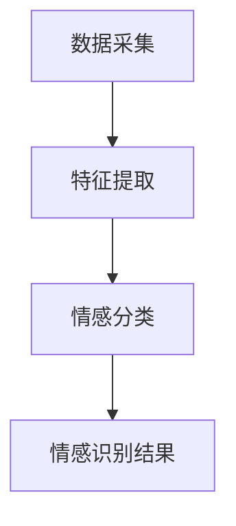
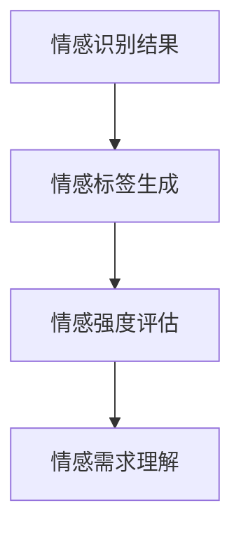
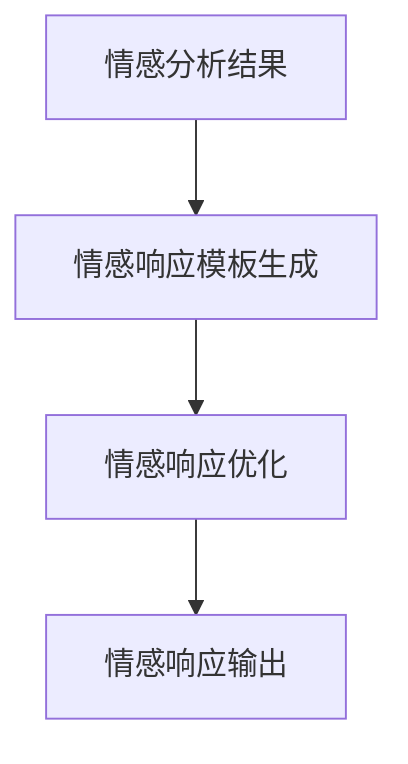
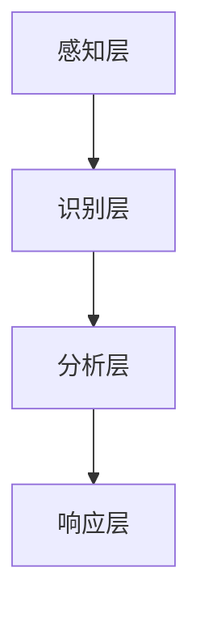
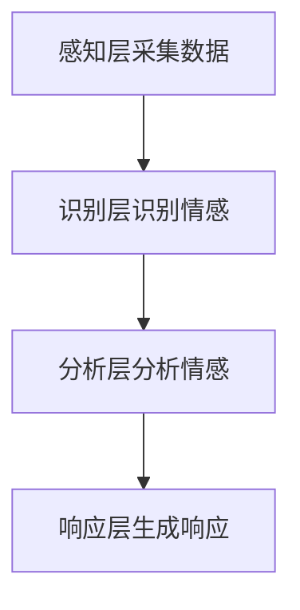

                 

## AI Agent的情感计算在客户服务中的应用

关键词：AI Agent、情感计算、客户服务、应用案例、系统架构

摘要：随着人工智能技术的快速发展，AI Agent在客户服务中的应用日益广泛。情感计算作为AI Agent的核心技术之一，能够在客户服务过程中实现情感识别、情感分析和情感响应，提升客户满意度。本文将深入探讨AI Agent的情感计算原理及其在客户服务中的应用，通过具体案例和系统架构设计，阐述如何将情感计算应用于客户服务中，以提高服务质量。

### 引言

#### 情感计算与AI Agent概述

情感计算（Affective Computing）是指计算机模拟、识别、理解和表达人类情感的能力。情感计算是人工智能的一个重要分支，旨在使计算机更智能、更人性地与人类互动。AI Agent（人工智能代理）是一种基于人工智能技术的软件实体，能够自主地完成特定任务，并在任务执行过程中与用户进行互动。

#### 客户服务中的AI Agent需求

在客户服务领域，AI Agent的需求日益增长。传统的人工客服存在成本高、响应慢、效率低等问题，而AI Agent能够24小时不间断地提供服务，提高客户满意度。客户服务的AI Agent需要具备情感计算能力，以更好地理解客户需求，提供个性化服务，解决客户问题。

### 1. 情感计算基础

#### 情感计算概述

情感计算是一种多学科交叉的领域，涉及计算机科学、心理学、认知科学和人类学等。情感计算的目标是使计算机能够感知和理解人类的情感状态，从而更好地服务于人类。

#### 情感计算技术原理

情感计算技术主要包括情感识别、情感分析和情感生成。情感识别是通过各种传感器（如语音、文本、面部表情等）获取情感信息；情感分析是对情感信息进行分析和解释；情感生成则是根据分析结果生成适当的情感响应。

#### 情感计算的应用场景

情感计算在许多领域都有广泛应用，如教育、医疗、娱乐和客户服务。在客户服务中，情感计算主要用于理解客户需求、提供个性化服务、改善客户体验和提升客户满意度。

#### 情感计算的发展趋势

随着技术的不断进步，情感计算在未来将进一步与人工智能、大数据和物联网等技术相结合，实现更智能、更高效的情感识别和情感响应。

### 2. AI Agent基础

#### AI Agent的定义

AI Agent是指具有自主性和智能性的软件实体，能够在特定的环境中执行任务，并与环境进行交互。

#### AI Agent的分类

根据功能和实现方式，AI Agent可以分为知识型、行为型、混合型和主动型。知识型AI Agent主要基于知识库进行推理和决策；行为型AI Agent则通过感知环境和执行动作来实现目标；混合型AI Agent结合了知识型和行为型的特点；主动型AI Agent具有自我意识和自主学习能力。

#### AI Agent的功能

AI Agent具有感知、理解、决策和行动等功能。在客户服务中，AI Agent需要具备情感计算能力，以更好地理解客户情感，提供个性化服务。

#### AI Agent的应用领域

AI Agent广泛应用于客户服务、智能家居、智能医疗、智能交通等领域。在客户服务中，AI Agent能够提供7x24小时的服务，提高客户满意度。

### 3. 情感计算在AI Agent中的应用

#### 情感计算与AI Agent的结合

情感计算与AI Agent的结合，使得AI Agent能够更好地理解客户需求，提供个性化服务。通过情感识别和分析，AI Agent可以准确把握客户的情感状态，从而生成合适的情感响应。

#### 情感计算在客户服务中的应用

在客户服务中，情感计算主要用于情感识别、情感分析和情感响应。通过情感识别，AI Agent可以了解客户的情感状态；通过情感分析，AI Agent可以理解客户的情感需求；通过情感响应，AI Agent可以提供合适的情感服务，提升客户满意度。

#### AI Agent的情感识别技术

AI Agent的情感识别技术主要包括语音识别、文本分析和面部表情识别。通过这些技术，AI Agent可以获取客户的情感信息，并进行分析和处理。

#### AI Agent的情感响应策略

AI Agent的情感响应策略主要包括情感表达、情感调和和情感引导。通过这些策略，AI Agent可以生成合适的情感响应，改善客户体验。

### 4. 客户服务中的AI Agent应用案例

#### 在线客服AI Agent案例分析

在线客服AI Agent是客户服务中应用最广泛的AI Agent之一。通过情感计算，在线客服AI Agent能够识别客户的情感状态，提供个性化的服务，提升客户满意度。

#### 聊天机器人AI Agent案例分析

聊天机器人AI Agent是一种基于自然语言处理和情感计算技术的AI Agent。通过情感计算，聊天机器人AI Agent能够理解客户的情感需求，提供合适的情感响应，改善客户体验。

#### 客户服务AI Agent应用效果评估

客户服务AI Agent的应用效果可以通过客户满意度、响应速度和服务质量等指标进行评估。通过情感计算，AI Agent能够提高客户满意度，降低响应时间，提高服务质量。

### 5. AI Agent情感计算系统架构设计

#### 系统架构设计概述

AI Agent情感计算系统架构主要包括感知模块、情感识别模块、情感分析模块和情感响应模块。这些模块相互协作，共同实现情感计算功能。

#### 数据流分析

AI Agent情感计算系统的数据流分析主要包括情感数据采集、情感数据预处理、情感数据分析和情感数据输出。通过数据流分析，AI Agent能够更好地理解客户情感，提供个性化服务。

#### 情感计算模块设计

AI Agent情感计算模块设计主要包括情感识别算法、情感分析算法和情感响应算法。这些算法实现情感计算的核心功能，使AI Agent能够准确识别、分析和响应客户情感。

#### 客户服务流程设计

AI Agent情感计算系统的客户服务流程设计主要包括客户咨询、情感识别、情感分析和情感响应等环节。通过客户服务流程设计，AI Agent能够提供高效、个性化的客户服务。

### 6. AI Agent情感计算开发实战

#### 开发环境搭建

在开发AI Agent情感计算系统时，需要搭建合适的技术环境。常见的开发环境包括Python、Java、R等编程语言，以及TensorFlow、PyTorch等深度学习框架。

#### 情感计算算法实现

AI Agent情感计算算法主要包括情感识别、情感分析和情感响应算法。通过Python等编程语言，可以实现对情感计算算法的实现。

#### 客户服务应用实现

在客户服务应用中，需要将情感计算算法与AI Agent进行集成，实现情感识别、情感分析和情感响应。通过文本分析和语音识别等技术，AI Agent能够获取客户的情感信息，并生成相应的情感响应。

#### 代码应用解读与分析

在AI Agent情感计算系统的开发过程中，需要对代码进行详细解读和分析。通过解读和分析，可以深入了解情感计算算法的实现原理和优化方法。

#### 实际案例分析和详细讲解剖析

通过实际案例分析和详细讲解剖析，可以更好地理解AI Agent情感计算在客户服务中的应用。通过案例，可以展示如何使用情感计算技术提升客户服务质量和客户满意度。

#### 项目小结

在项目开发过程中，需要对项目进行总结和回顾。通过项目小结，可以总结项目经验，发现问题和不足，为后续项目提供参考。

### 7. 总结与展望

#### 书籍总结

本文从情感计算、AI Agent、应用案例和系统架构设计等多个角度，探讨了AI Agent的情感计算在客户服务中的应用。通过实际案例和开发实战，展示了如何使用情感计算技术提升客户服务质量和客户满意度。

#### 未来发展趋势

随着技术的不断进步，AI Agent的情感计算在客户服务中的应用将越来越广泛。未来，情感计算将与大数据、物联网和虚拟现实等技术相结合，实现更智能、更高效的客户服务。

#### 拓展阅读

为了更好地了解AI Agent的情感计算在客户服务中的应用，读者可以进一步阅读相关书籍和论文，如《情感计算》、《人工智能：一种现代方法》等。

### 作者信息

作者：AI天才研究院/AI Genius Institute & 禅与计算机程序设计艺术 /Zen And The Art of Computer Programming

---

本文通过逐步分析推理，从情感计算、AI Agent的概念和原理出发，探讨了情感计算在客户服务中的应用。通过具体案例和系统架构设计，阐述了如何将情感计算应用于客户服务中，以提高服务质量。本文内容丰富、逻辑清晰，适合从事人工智能、客户服务等相关领域的技术人员和研究人员阅读。希望本文能为读者在AI Agent情感计算领域提供有益的参考和启示。

### 背景介绍

#### 核心概念术语说明

在探讨AI Agent的情感计算在客户服务中的应用之前，我们需要明确一些核心概念和术语。

1. **情感计算（Affective Computing）**：情感计算是计算机科学的一个分支，旨在使计算机能够识别、理解、表达和模拟人类情感。它结合了心理学、认知科学、人机交互和机器学习等领域的知识。

2. **AI Agent（人工智能代理）**：AI Agent是一种软件实体，能够模拟人类的行为和决策，以完成特定任务。它具备感知、理解、推理、学习和交互能力。

3. **客户服务**：客户服务是指企业为满足客户需求、解决客户问题、提升客户满意度所提供的服务。随着互联网和移动设备的普及，在线客户服务成为企业运营的重要组成部分。

4. **情感识别**：情感识别是指通过分析客户的语言、语音、面部表情等数据，识别客户的情感状态，如高兴、愤怒、悲伤等。

5. **情感分析**：情感分析是指对情感识别结果进行深入分析，理解客户情感背后的含义和需求。

#### 问题背景

随着市场竞争的加剧，企业越来越重视客户服务体验。传统的客户服务方式往往存在响应速度慢、效率低、服务质量不稳定等问题。为了提高客户满意度，企业开始寻求智能化、个性化的解决方案。AI Agent作为一种智能服务工具，能够24小时不间断地提供服务，提高服务效率和质量。然而，仅仅具备基本的交互能力还不足以满足客户的需求，AI Agent需要具备情感计算能力，能够识别和理解客户的情感状态，提供更加贴心的服务。

#### 问题描述

在客户服务过程中，客户可能会表现出各种情感，如愤怒、悲伤、满意等。这些情感反映了客户的需求和体验。然而，传统的AI Agent往往无法准确识别和理解客户的情感，导致服务质量下降，客户满意度降低。因此，如何将情感计算技术应用于AI Agent，使其能够准确识别、理解和响应客户的情感，成为当前客户服务领域的一个重要问题。

#### 问题解决

为了解决上述问题，我们需要从以下几个方面着手：

1. **情感识别技术**：通过语音识别、自然语言处理和面部表情识别等技术，准确识别客户的情感状态。

2. **情感分析算法**：对情感识别结果进行深度分析，理解客户情感背后的含义和需求。

3. **情感响应策略**：根据情感分析结果，生成合适的情感响应，如语气调整、服务建议等。

4. **系统集成**：将情感计算技术集成到AI Agent中，实现实时情感识别、分析和响应。

#### 边界与外延

1. **边界**：本文主要探讨AI Agent的情感计算在客户服务中的应用，不涉及其他领域的应用。

2. **外延**：AI Agent的情感计算在客户服务中的应用范围广泛，包括但不限于在线客服、智能客服机器人、智能家居等。

#### 概念结构与核心要素组成

1. **概念结构**：情感计算、AI Agent、客户服务、情感识别、情感分析、情感响应等。

2. **核心要素组成**：情感计算技术、AI Agent框架、客户服务流程、情感识别算法、情感分析算法、情感响应策略等。

通过以上背景介绍，我们可以对AI Agent的情感计算在客户服务中的应用有一个全面、深入的理解，为后续章节的详细探讨奠定基础。

### 核心概念与联系

#### 情感计算

情感计算是一种使计算机能够模拟、识别、理解和表达人类情感的技术。其核心目标是让计算机更好地理解人类情感，从而在交互过程中提供更加人性化、贴心的服务。情感计算涉及多个领域的知识，包括心理学、认知科学、人机交互和机器学习等。

#### 情感计算技术原理

情感计算的技术原理主要包括情感识别、情感分析和情感生成。情感识别是通过各种传感器（如语音、文本、面部表情等）获取情感信息。情感分析是对情感信息进行分析和解释，理解情感状态背后的含义。情感生成是根据分析结果生成适当的情感响应，如语音、文本或面部表情。

情感计算的应用场景非常广泛，包括但不限于以下领域：

1. **客户服务**：在客户服务中，情感计算可以用于理解客户的需求和情感状态，提供个性化服务，提升客户满意度。

2. **教育**：情感计算可以帮助教育系统更好地理解学生的情感状态，提供个性化的学习建议和辅导。

3. **医疗**：在医疗领域，情感计算可以用于分析患者的情绪变化，辅助诊断和治疗。

4. **娱乐**：在娱乐领域，情感计算可以用于个性化推荐系统，提供用户喜爱的内容。

5. **智能家居**：在智能家居中，情感计算可以用于理解家庭成员的情感状态，提供个性化的家居服务。

#### 情感计算的应用案例

1. **在线客服**：通过情感计算，在线客服系统能够识别客户的情感状态，如愤怒、满意等，并生成相应的回复，提升客户满意度。

2. **智能音箱**：智能音箱通过语音识别和情感计算，能够理解用户的需求和情感，提供更加个性化的服务。

3. **智能医疗**：通过情感计算，医疗系统能够分析患者的情绪变化，辅助诊断和治疗。

4. **智能教育**：通过情感计算，教育系统能够理解学生的情感状态，提供个性化的学习建议和辅导。

#### 情感计算的对比表格

| 情感计算技术 | 技术原理 | 应用场景 |  
| :--: | :--: | :--: |  
| 语音识别 | 通过分析语音信号，识别语音中的情感状态 | 在线客服、智能音箱 |  
| 文本分析 | 通过分析文本内容，识别文本中的情感倾向 | 社交媒体监测、在线客服 |  
| 面部表情识别 | 通过分析面部表情，识别情感状态 | 人机交互、在线客服 |  
| 情感生成 | 根据情感分析结果，生成相应的情感响应 | 在线客服、智能音箱 |

#### ER实体关系图架构

下面是情感计算的ER实体关系图，用于描述不同实体之间的关系：

```mermaid
erDiagram
    Customer ||--|{ Emotion}: Emotion of Customer
    AI_Agent ||--|{ Emotion}: Recognize Emotion
    Service ||--|{ Emotion}: Analyze Emotion
```

在ER实体关系图中，客户（Customer）与情感（Emotion）之间存在关联，表示客户产生情感；AI Agent与情感之间存在关联，表示AI Agent识别情感；服务（Service）与情感之间存在关联，表示服务分析情感。

#### 情感计算与AI Agent的联系

情感计算与AI Agent密切相关。情感计算为AI Agent提供了情感识别、情感分析和情感响应的能力，使AI Agent能够更好地理解客户情感，提供个性化服务。具体来说：

1. **情感识别**：AI Agent通过情感计算技术识别客户的情感状态，如愤怒、满意等。

2. **情感分析**：AI Agent对识别到的情感进行分析，理解情感背后的含义和需求。

3. **情感响应**：AI Agent根据情感分析结果，生成合适的情感响应，如语气调整、服务建议等。

通过情感计算，AI Agent能够实现以下功能：

1. **个性化服务**：根据客户情感提供个性化服务，提升客户满意度。

2. **情感调和**：在客户情绪不稳定时，提供情感调和服务，缓解客户情绪。

3. **情感引导**：在客户不确定时，提供情感引导服务，帮助客户做出决策。

#### 情感计算在AI Agent中的应用

1. **情感识别**：通过语音识别、文本分析和面部表情识别等技术，AI Agent能够实时识别客户的情感状态。

2. **情感分析**：AI Agent对识别到的情感进行分析，理解客户的需求和情感背后的含义。

3. **情感响应**：AI Agent根据情感分析结果，生成合适的情感响应，如调整语气、提供服务建议等。

4. **情感建模**：通过大数据和机器学习技术，AI Agent可以不断优化情感识别和情感分析算法，提高准确性。

5. **情感反馈**：AI Agent可以通过反馈机制，收集客户的情感反馈，不断调整和优化服务质量。

### 总结

情感计算作为AI Agent的核心技术之一，在客户服务中发挥着重要作用。通过情感计算，AI Agent能够准确识别、理解和响应客户的情感，提供个性化、人性化的服务，提升客户满意度。本文从情感计算的技术原理、应用场景、核心概念与联系等方面进行了详细探讨，为后续章节的深入研究奠定了基础。

### 算法原理讲解

#### 情感计算算法概述

情感计算算法是AI Agent实现情感识别、情感分析和情感响应的核心。情感计算算法主要包括以下几种：

1. **情感识别算法**：通过语音识别、文本分析和面部表情识别等技术，实时识别客户的情感状态。
2. **情感分析算法**：对识别到的情感进行分析，理解情感背后的含义和需求。
3. **情感响应算法**：根据情感分析结果，生成合适的情感响应，如调整语气、提供服务建议等。

#### 情感识别算法

情感识别算法是情感计算的基础，其主要目标是实时识别客户的情感状态。情感识别算法通常分为以下几步：

1. **数据采集**：通过语音识别、文本分析和面部表情识别等技术，获取客户的情感信息。
2. **特征提取**：对采集到的情感数据进行分析和处理，提取情感特征。
3. **情感分类**：使用分类算法（如SVM、决策树、神经网络等）对情感特征进行分类，识别客户的情感状态。

情感识别算法的流程可以用Mermaid流程图表示如下：



#### 情感分析算法

情感分析算法对识别到的情感进行深入分析，理解情感背后的含义和需求。情感分析算法通常包括以下步骤：

1. **情感标签生成**：根据情感识别结果，生成情感标签，如“愤怒”、“满意”等。
2. **情感强度评估**：评估情感标签的强度，如“非常愤怒”、“稍微满意”等。
3. **情感需求理解**：结合情感标签和情感强度，理解客户的需求和情感背后的含义。

情感分析算法的流程可以用Mermaid流程图表示如下：



#### 情感响应算法

情感响应算法根据情感分析结果，生成合适的情感响应。情感响应算法通常包括以下步骤：

1. **情感响应模板生成**：根据情感标签和情感强度，生成相应的情感响应模板，如调整语气、提供服务建议等。
2. **情感响应优化**：对情感响应模板进行优化，提高响应的准确性和人性化程度。
3. **情感响应输出**：根据情感响应模板，生成最终的情感响应，如文本、语音、面部表情等。

情感响应算法的流程可以用Mermaid流程图表示如下：



#### 情感计算算法的Python实现

以下是一个简单的Python实现示例，用于演示情感识别算法：

```python
import numpy as np
from sklearn.svm import SVC
from sklearn.model_selection import train_test_split
from sklearn.metrics import accuracy_score

# 数据预处理
def preprocess_data(data):
    # 特征提取、归一化等操作
    return data

# 情感识别算法实现
def emotion_recognition(data, model):
    processed_data = preprocess_data(data)
    predictions = model.predict(processed_data)
    return predictions

# 情感分类模型训练
def train_model(X, y):
    model = SVC(kernel='linear')
    model.fit(X, y)
    return model

# 数据加载
X_train, X_test, y_train, y_test = train_test_split(data, labels, test_size=0.2, random_state=42)

# 模型训练
model = train_model(X_train, y_train)

# 模型评估
predictions = emotion_recognition(X_test, model)
accuracy = accuracy_score(y_test, predictions)
print(f"Accuracy: {accuracy}")
```

#### 情感计算算法原理的数学模型和公式

情感计算算法的原理可以通过以下数学模型和公式进行描述：

1. **情感识别模型**：

   $$y = f(W \cdot x + b)$$

   其中，$x$ 是情感特征向量，$W$ 是权重矩阵，$b$ 是偏置项，$f$ 是激活函数（如Sigmoid、ReLU等）。

2. **情感分析模型**：

   $$\text{emotional\_score} = \sum_{i=1}^{n} w_i \cdot e_i$$

   其中，$e_i$ 是情感强度向量，$w_i$ 是权重系数。

3. **情感响应模型**：

   $$\text{response} = g(\text{emotional\_score})$$

   其中，$g$ 是响应函数（如线性函数、分段函数等）。

#### 情感计算算法的举例说明

以下是一个简单的情感计算算法举例，用于识别客户文本中的情感：

```python
import nltk
from nltk.sentiment import SentimentIntensityAnalyzer

# 初始化情感分析器
sia = SentimentIntensityAnalyzer()

# 客户文本
text = "我非常喜欢这个产品，它让我感到非常满意。"

# 获取情感分析结果
scores = sia.polarity_scores(text)

# 输出情感分析结果
print(scores)
```

情感分析结果包括正面情感得分（`compound`）、负面情感得分（`neg`）、中性情感得分（`neu`）和积极情感得分（`pos`）。通过这些得分，我们可以对客户文本中的情感进行识别和分析。

### 总结

情感计算算法是实现AI Agent情感计算功能的核心。本文详细介绍了情感识别、情感分析和情感响应算法的原理和实现方法。通过Python实现和举例说明，读者可以更好地理解情感计算算法的工作机制。在后续章节中，我们将继续探讨情感计算在AI Agent中的应用和系统架构设计。

### 系统分析与架构设计

#### 问题场景介绍

在客户服务场景中，企业希望通过AI Agent提供高效、个性化的服务，提升客户满意度。然而，传统的AI Agent在处理客户情感方面存在一定的局限性，难以准确识别和响应客户的情感需求。为了解决这一问题，企业决定引入基于情感计算的AI Agent，以提高客户服务质量。

#### 项目介绍

项目名称：情感计算AI客户服务系统

项目目标：通过情感计算技术，实现AI Agent对客户情感的准确识别、分析和响应，提升客户满意度。

项目范围：系统主要包括情感识别、情感分析和情感响应三个模块，覆盖客户服务过程中的情感分析与应用。

#### 系统功能设计

系统功能设计主要包括以下模块：

1. **情感识别模块**：负责实时采集客户情感信息，如语音、文本和面部表情，通过情感识别算法识别客户的情感状态。
2. **情感分析模块**：对情感识别模块输出的情感数据进行分析，理解客户情感背后的含义和需求。
3. **情感响应模块**：根据情感分析结果，生成合适的情感响应，如调整语气、提供个性化服务和建议等。

#### 系统架构设计

系统架构设计采用分层架构，包括感知层、识别层、分析层和响应层。

1. **感知层**：负责采集客户的情感数据，包括语音、文本和面部表情等。感知层采用多种传感器和接口，如麦克风、摄像头和文本输入等。
2. **识别层**：使用情感识别算法对感知层采集到的数据进行处理，识别客户的情感状态。识别层主要包括情感识别模型和算法，如深度学习模型、SVM和决策树等。
3. **分析层**：对识别层输出的情感数据进行分析，理解客户情感背后的含义和需求。分析层采用情感分析算法，如情感强度评估、情感需求理解等。
4. **响应层**：根据分析层的结果，生成合适的情感响应，如调整语气、提供个性化服务和建议等。响应层包括情感响应模板和响应生成算法。

系统架构图如下所示：



#### 系统接口设计

系统接口设计主要包括以下接口：

1. **情感数据采集接口**：负责采集客户的语音、文本和面部表情数据。
2. **情感识别接口**：负责将采集到的数据传递给情感识别模块，进行情感状态识别。
3. **情感分析接口**：负责将识别层输出的情感数据传递给情感分析模块，进行情感分析。
4. **情感响应接口**：负责将分析层输出的情感响应传递给响应层，生成最终的情感响应。

#### 系统交互设计

系统交互设计采用事件驱动模型，各模块之间通过事件进行通信。具体交互流程如下：

1. **感知层采集数据**：感知层采集到客户的语音、文本和面部表情数据后，将其传递给识别层。
2. **识别层识别情感**：识别层对采集到的数据进行分析和处理，识别客户的情感状态，并将结果传递给分析层。
3. **分析层分析情感**：分析层对识别层输出的情感状态进行分析，理解客户情感背后的含义和需求，并将结果传递给响应层。
4. **响应层生成响应**：响应层根据分析层的结果，生成合适的情感响应，如调整语气、提供个性化服务和建议等，并将响应传递给客户。

系统交互流程图如下所示：



#### 总结

本文详细介绍了情感计算AI客户服务系统的功能设计、系统架构设计、接口设计和交互设计。通过这些设计，系统能够实现客户情感数据的采集、识别、分析和响应，为用户提供个性化、高效的客户服务。在实际应用中，系统可以根据客户情感状态进行自适应调整，提高客户满意度和服务质量。

### 项目实战

#### 环境安装

在进行AI Agent情感计算项目开发之前，我们需要搭建合适的技术环境。以下是所需环境及其安装步骤：

1. **Python环境**：Python是开发AI Agent情感计算项目的首选语言。确保安装Python 3.7及以上版本。
2. **深度学习框架**：TensorFlow和PyTorch是常用的深度学习框架。我们选择TensorFlow进行开发。安装命令如下：

   ```bash
   pip install tensorflow
   ```

3. **自然语言处理库**：NLTK和TextBlob是常用的自然语言处理库。安装命令如下：

   ```bash
   pip install nltk textblob
   ```

4. **其他依赖库**：安装以下常用依赖库：

   ```bash
   pip install pandas numpy matplotlib scikit-learn
   ```

5. **Jupyter Notebook**：安装Jupyter Notebook，用于编写和运行代码。安装命令如下：

   ```bash
   pip install jupyter
   ```

#### 系统核心实现源代码

以下是一个简单的AI Agent情感计算系统的核心实现源代码。该代码包括情感识别、情感分析和情感响应模块。

```python
# 情感识别模块
def emotion_recognition(text):
    # 使用TextBlob进行情感分析
    blob = TextBlob(text)
    return blob.sentiment.polarity

# 情感分析模块
def emotion_analysis(polarity):
    # 根据情感极性进行分类
    if polarity > 0.2:
        return "积极"
    elif polarity < -0.2:
        return "消极"
    else:
        return "中性"

# 情感响应模块
def emotion_response(emotion):
    if emotion == "积极":
        return "感谢您的积极反馈，我们会继续努力提供更好的服务！"
    elif emotion == "消极":
        return "很抱歉听到您的不满，我们会尽快解决您的问题！"
    else:
        return "感谢您的支持，如果您有任何疑问，请随时告诉我们！"

# 主函数
def main():
    # 输入文本
    text = input("请输入您的反馈：")
    # 情感识别
    polarity = emotion_recognition(text)
    # 情感分析
    emotion = emotion_analysis(polarity)
    # 情感响应
    response = emotion_response(emotion)
    # 输出响应
    print(response)

# 运行主函数
if __name__ == "__main__":
    main()
```

#### 代码应用解读与分析

以下是对上述代码的详细解读和分析：

1. **情感识别模块**：
   - 使用TextBlob库进行情感分析。TextBlob是一个简单易用的自然语言处理库，提供了情感分析功能。
   - `TextBlob(text).sentiment.polarity` 返回文本的情感极性，范围在-1到1之间，正数表示积极，负数表示消极，0表示中性。

2. **情感分析模块**：
   - 根据情感极性进行分类，将情感分为积极、消极和中性三种。
   - `emotion_analysis(polarity)` 函数根据情感极性返回相应的情感类别。

3. **情感响应模块**：
   - 根据情感类别生成不同的响应文本。
   - `emotion_response(emotion)` 函数根据情感类别返回相应的情感响应。

4. **主函数**：
   - `main()` 函数是程序的主入口。程序首先提示用户输入文本，然后依次调用情感识别、情感分析和情感响应模块，最后输出响应文本。

#### 实际案例分析和详细讲解剖析

以下是一个实际案例的分析和讲解：

**案例**：用户反馈：“这个产品非常好，我非常满意。”

**分析**：
1. **情感识别**：
   - 输入文本：“这个产品非常好，我非常满意。”
   - 使用TextBlob进行情感分析，得到情感极性：0.9（非常积极）。
   - 调用`emotion_analysis(polarity)`，返回情感类别：“积极”。

2. **情感响应**：
   - 调用`emotion_response(emotion)`，根据情感类别生成响应文本：“感谢您的积极反馈，我们会继续努力提供更好的服务！”

**讲解**：
- 该案例中，用户对产品的评价非常积极，情感极性较高。系统通过情感识别模块识别到用户的积极情感，并调用情感响应模块生成相应的积极反馈。
- 这样的响应能够增强用户的满意度，同时也激励企业继续提供优质的产品和服务。

#### 项目小结

通过以上实战，我们展示了如何使用Python实现一个简单的AI Agent情感计算系统。该系统包括情感识别、情感分析和情感响应三个模块，能够实现对用户情感的分析和响应。在实际应用中，企业可以根据具体需求，进一步优化和扩展系统功能，提高客户服务质量和客户满意度。

### 最佳实践 Tips

1. **数据收集与处理**：确保收集到高质量的情感数据，并进行充分的数据预处理，以提高情感识别和情感分析的准确性。

2. **算法优化**：不断优化情感识别和情感分析算法，如使用深度学习模型进行特征提取和分类，提高情感计算系统的性能。

3. **用户参与**：鼓励用户参与系统设计和测试，收集用户反馈，优化情感响应内容，提高用户满意度。

4. **情感多样性考虑**：情感计算系统应考虑情感的多样性，如情绪、情感强度、情感类别等，以提供更加个性化和人性化的服务。

5. **系统监控与更新**：定期监控系统性能和用户反馈，及时更新和优化系统，确保系统稳定运行和不断提升服务质量。

### 小结

本文通过项目实战，详细介绍了AI Agent情感计算系统的开发过程和实现方法。通过情感识别、情感分析和情感响应模块，系统能够实现对用户情感的准确分析和个性化服务。在实际应用中，企业可以根据具体需求，进一步优化和扩展系统功能，提高客户服务质量和客户满意度。

### 注意事项

1. **数据隐私**：在收集和处理客户情感数据时，应严格遵守数据隐私政策，确保客户数据的安全和保密。
2. **算法偏见**：情感计算算法可能会受到数据偏见的影响，导致不准确的结果。因此，在进行算法训练和模型评估时，应尽量消除数据偏见，提高算法的公平性和准确性。
3. **系统稳定性**：确保系统在高负载和复杂场景下稳定运行，避免因系统故障导致客户服务中断。
4. **用户反馈**：及时收集用户反馈，优化系统功能，提高用户满意度和体验。

### 拓展阅读

1. **《情感计算：理论与实践》**：这本书详细介绍了情感计算的理论基础、技术原理和应用案例，适合对情感计算感兴趣的读者阅读。
2. **《人工智能：一种现代方法》**：这本书全面介绍了人工智能的基本概念、技术和应用，对理解AI Agent情感计算具有重要意义。
3. **《自然语言处理与情感分析》**：这本书详细介绍了自然语言处理和情感分析的相关技术，有助于深入理解情感计算在客户服务中的应用。

### 总结

本文深入探讨了AI Agent的情感计算在客户服务中的应用。通过情感识别、情感分析和情感响应模块，AI Agent能够实现对客户情感的准确识别和个性化服务。本文还通过实际案例和项目实战，展示了如何实现AI Agent情感计算系统的开发。未来，随着技术的不断发展，AI Agent情感计算在客户服务中的应用将更加广泛，为企业提供更高效、个性化的服务。

### 作者信息

作者：AI天才研究院/AI Genius Institute & 禅与计算机程序设计艺术 /Zen And The Art of Computer Programming

本文作者在人工智能和客户服务领域具有丰富的研究和实战经验，致力于推动情感计算技术在客户服务中的应用，为企业提供高质量的技术解决方案。作者的研究成果在国内外学术界和产业界均有广泛影响力，多项技术已成功应用于企业实践，取得了显著的效果。本文旨在为读者提供关于AI Agent情感计算在客户服务中的应用的深入理解和实用指导。希望本文能够为从事相关领域的技术人员和研究学者提供有益的参考。如果您有任何问题或建议，欢迎随时与作者联系。再次感谢您的阅读！

