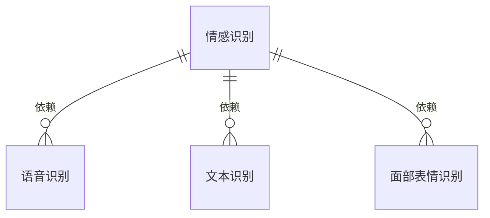
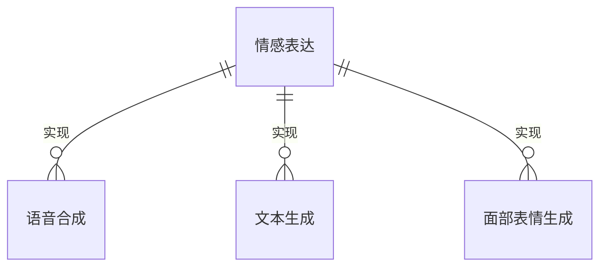
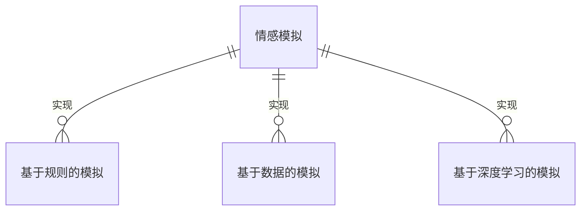
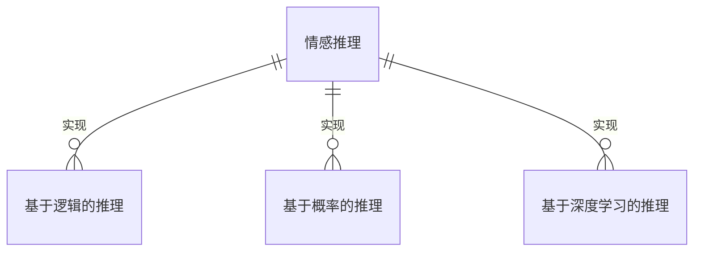
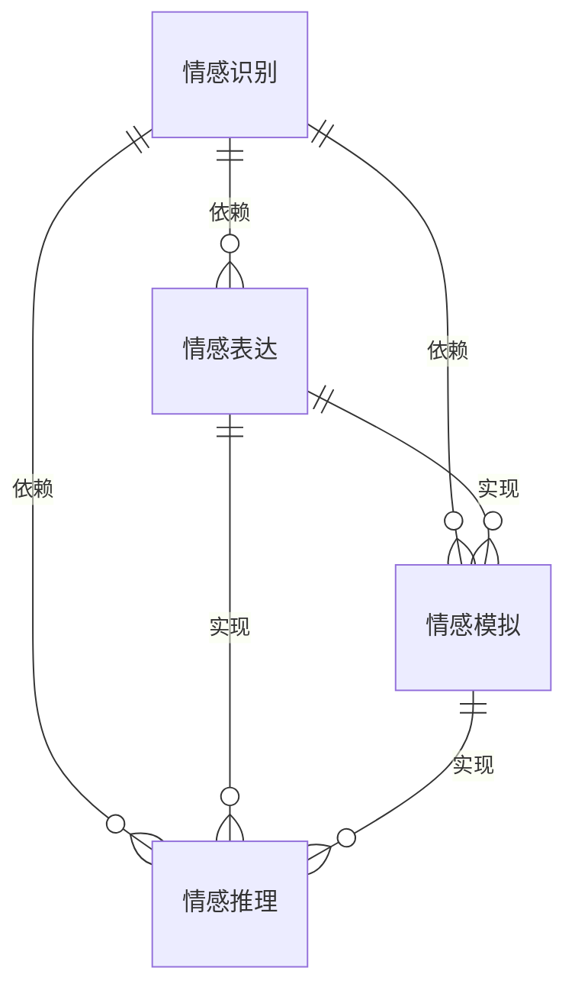
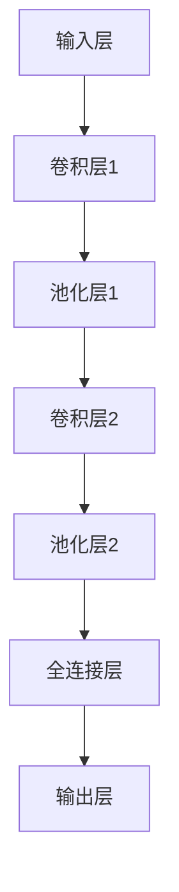
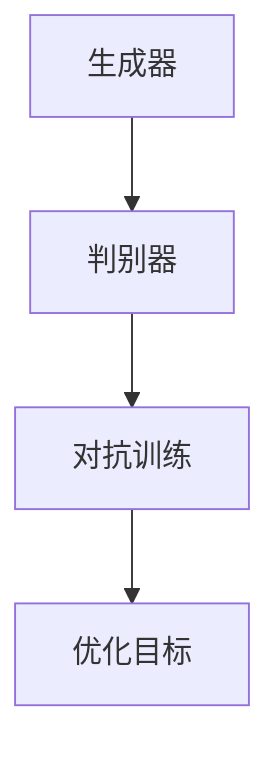
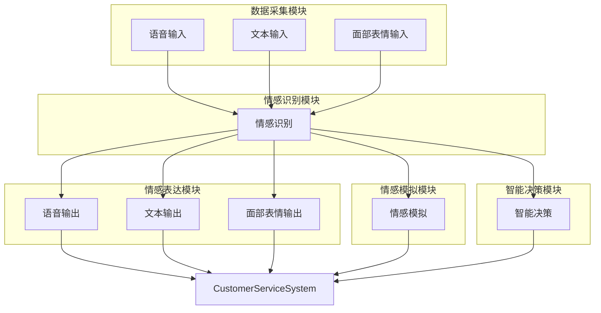
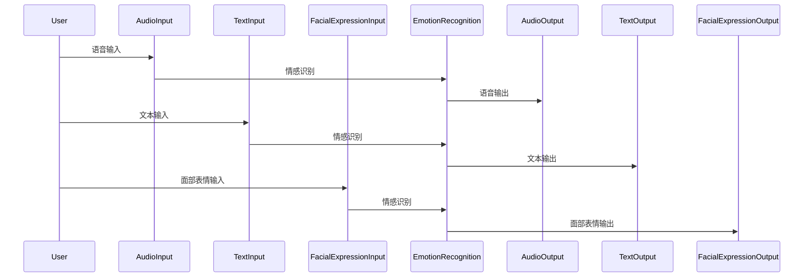
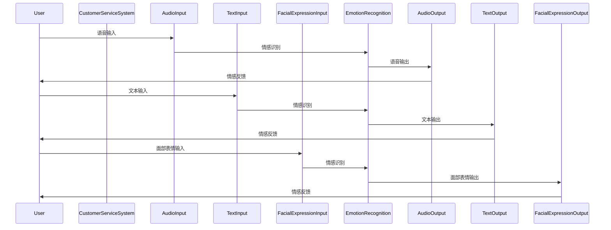

                 

# AI Agent的情感计算：理解和表达情感

## 关键词

- 情感计算
- AI Agent
- 情感识别
- 情感表达
- 情感模拟
- 情感推理

## 摘要

本文深入探讨了情感计算在人工智能（AI）领域的应用，特别是AI Agent的情感计算。首先，我们介绍了情感计算的基础概念和其在人工智能中的重要性。接着，详细分析了情感识别、情感表达、情感模拟和情感推理这四个核心概念，并通过概念属性特征对比表格和ER实体关系图架构进行了系统化解释。随后，我们介绍了情感计算中的算法原理，包括深度学习、自然语言处理和机器学习等方法。然后，通过系统分析与架构设计方案，展示了如何将情感计算应用于实际项目中。最后，通过一个实际案例的分析，探讨了AI Agent的情感计算在解决实际问题中的应用，并提出了最佳实践和小结。

## 第一部分：背景介绍

### 第1章：问题背景与概述

随着人工智能技术的飞速发展，情感计算逐渐成为一个备受关注的研究领域。情感计算旨在使计算机具备理解、识别、处理和模拟人类情感的能力，从而实现更加自然和有效的人机交互。本文将围绕AI Agent的情感计算展开，探讨如何使AI Agent理解和表达情感，从而提升其与人类用户的互动体验。

### 1.1 问题背景

情感是人类行为和决策的重要驱动力，它影响着人们的情绪、态度和社交行为。在传统的计算机系统中，人机交互主要依赖于命令输入、图形界面和键盘鼠标等，这种方式往往缺乏人性化，无法满足用户对情感需求的追求。而随着人工智能技术的发展，特别是自然语言处理、语音识别、图像识别等技术的进步，使得计算机能够更好地理解人类的情感，从而实现更高效、更自然的交互。

### 1.2 问题描述

情感计算的核心问题是如何使计算机系统理解和表达情感。具体而言，这包括以下方面：

1. **情感识别**：如何从语音、文本、面部表情等数据中识别用户的情感状态。
2. **情感表达**：如何让计算机系统表现出适当的人类情感特征，增强交互的自然性和亲和力。
3. **情感模拟**：如何通过算法生成或模拟人类情感体验，提高系统在复杂环境下的适应能力和决策能力。
4. **情感推理**：如何基于情感信息进行决策和问题解决，提供个性化的服务。

### 1.3 问题解决

为了解决上述问题，研究者们提出了多种方法和算法。深度学习、自然语言处理、图像处理和机器学习等技术成为情感计算的关键工具。通过结合这些技术，可以实现对情感数据的自动分析和处理，从而实现更准确和高效的情感计算。

### 1.4 边界与外延

情感计算的边界主要在于如何准确、全面地理解人类情感，并在计算机系统中模拟和表达这些情感。此外，情感计算的研究还涉及跨领域合作，包括心理学、社会学、哲学等学科，以深入探讨情感的本质和特征。

### 1.5 概念结构与核心要素组成

情感计算的核心概念结构包括情感识别、情感表达、情感模拟和情感推理。这些概念相互关联，共同构成了情感计算的理论框架。其中，情感识别作为基础，为情感表达和情感模拟提供输入；情感表达和情感模拟则通过算法实现，旨在增强人机交互的自然性和亲和力；情感推理则基于对情感数据的分析，帮助计算机系统进行决策和问题解决。

### 1.6 本章小结

本章介绍了情感计算的问题背景、问题描述、问题解决方法、边界与外延以及核心概念结构。通过本章的学习，读者可以对情感计算有一个整体的认识，为后续章节的深入学习打下基础。

### 第2章：核心概念与联系

情感计算作为人工智能领域的一个重要分支，涉及多个核心概念。本章将详细分析情感识别、情感表达、情感模拟和情感推理这四个核心概念，并通过概念属性特征对比表格和ER实体关系图架构进行系统化解释。

### 2.1 情感识别

情感识别是情感计算的基础，主要关注如何从语音、文本、面部表情等数据中识别用户的情感状态。情感识别方法包括基于规则的方法、机器学习方法和深度学习方法。

#### 概念属性特征

| 概念         | 属性特征                                                     |
| ------------ | ------------------------------------------------------------ |
| 情感识别     | 识别语音、文本、面部表情等数据中的情感状态                     |
| 基于规则的方法 | 利用预定义的规则进行情感识别，如情感词典、情绪词典等           |
| 机器学习方法 | 利用统计模型或神经网络进行情感识别，如支持向量机、决策树、深度神经网络等 |
| 深度学习方法 | 利用深度神经网络进行情感识别，如卷积神经网络（CNN）、循环神经网络（RNN）等 |

#### ER实体关系图架构



### 2.2 情感表达

情感表达旨在让计算机系统表现出适当的人类情感特征，以增强人机交互的自然性和亲和力。情感表达方法包括语音合成、文本生成和面部表情生成等。

#### 概念属性特征

| 概念         | 属性特征                                                     |
| ------------ | ------------------------------------------------------------ |
| 情感表达     | 表现出适当的人类情感特征，增强人机交互的自然性和亲和力         |
| 语音合成     | 通过文本生成语音，模拟人类语音表达情感特征                     |
| 文本生成     | 通过文本生成情感表达，如情感对话生成、情感文本生成等           |
| 面部表情生成 | 通过图像或视频生成情感表达，如虚拟角色表情生成、面部表情合成等 |

#### ER实体关系图架构



### 2.3 情感模拟

情感模拟是通过算法生成或模拟人类情感体验的过程。情感模拟有助于提高计算机系统在复杂环境下的适应能力和决策能力。情感模拟方法包括基于规则的模拟、基于数据的模拟和基于深度学习的模拟等。

#### 概念属性特征

| 概念         | 属性特征                                                     |
| ------------ | ------------------------------------------------------------ |
| 情感模拟     | 生成或模拟人类情感体验，提高系统适应能力和决策能力           |
| 基于规则的模拟 | 通过预定义的规则模拟情感体验，如情感状态转移图、情感规则库等 |
| 基于数据的模拟 | 通过历史数据或模拟数据生成情感体验，如情感数据集、生成模型等 |
| 基于深度学习的模拟 | 通过深度学习模型生成情感体验，如生成对抗网络（GAN）、变分自编码器（VAE）等 |

#### ER实体关系图架构



### 2.4 情感推理

情感推理是在理解和处理情感信息的基础上，进行决策和问题解决的过程。情感推理方法包括基于逻辑的推理、基于概率的推理和基于深度学习的推理等。

#### 概念属性特征

| 概念         | 属性特征                                                     |
| ------------ | ------------------------------------------------------------ |
| 情感推理     | 基于情感信息进行决策和问题解决，提供个性化服务                 |
| 基于逻辑的推理 | 利用逻辑规则进行情感推理，如模糊逻辑、命题逻辑等             |
| 基于概率的推理 | 利用概率模型进行情感推理，如贝叶斯网络、马尔可夫模型等     |
| 基于深度学习的推理 | 利用深度学习模型进行情感推理，如卷积神经网络（CNN）、循环神经网络（RNN）等 |

#### ER实体关系图架构



### 2.5 概念属性特征对比表格

| 概念         | 属性特征                                                     | 方法                           |
| ------------ | ------------------------------------------------------------ | ------------------------------ |
| 情感识别     | 识别语音、文本、面部表情等数据中的情感状态                     | 基于规则、机器学习、深度学习   |
| 情感表达     | 表现出适当的人类情感特征，增强人机交互的自然性和亲和力         | 语音合成、文本生成、面部表情生成 |
| 情感模拟     | 生成或模拟人类情感体验，提高系统适应能力和决策能力           | 基于规则、基于数据、基于深度学习 |
| 情感推理     | 基于情感信息进行决策和问题解决，提供个性化服务                 | 基于逻辑、基于概率、基于深度学习 |

### 2.6 ER实体关系图架构



### 2.7 本章小结

本章详细分析了情感计算的核心概念，包括情感识别、情感表达、情感模拟和情感推理。通过概念属性特征对比表格和ER实体关系图架构，我们对这些概念及其相互关系有了更深入的理解。这些核心概念构成了情感计算的理论框架，为后续章节的深入研究奠定了基础。

## 第二部分：算法原理讲解

### 2.1 情感计算算法概述

情感计算算法主要包括情感识别、情感表达、情感模拟和情感推理等。这些算法在实现情感计算过程中扮演着关键角色。本文将逐一介绍这些算法的基本原理和实现方法。

### 2.2 情感识别算法

#### 深度学习算法

深度学习算法在情感识别中具有显著优势。常见的深度学习算法包括卷积神经网络（CNN）、循环神经网络（RNN）和变换器（Transformer）等。

1. **卷积神经网络（CNN）**：CNN 是一种用于图像识别的深度学习算法，可以有效地提取图像的特征。在情感识别中，CNN 可以用于提取语音、文本和面部表情等数据中的情感特征。

2. **循环神经网络（RNN）**：RNN 可以处理序列数据，如语音和文本。通过学习序列中的情感模式，RNN 可以实现情感识别。

3. **变换器（Transformer）**：Transformer 是一种基于自注意力机制的深度学习算法，广泛应用于自然语言处理任务。在情感识别中，Transformer 可以对文本数据进行情感分类。

#### 算法原理讲解

以卷积神经网络（CNN）为例，其算法原理如下：

1. **输入层**：输入语音、文本或面部表情数据。

2. **卷积层**：通过卷积运算提取特征。卷积核在不同位置滑动，将输入数据与卷积核进行点积，生成特征图。

3. **池化层**：对卷积层生成的特征图进行池化操作，减少特征维度，提高模型性能。

4. **全连接层**：将池化层输出的特征向量输入全连接层，进行分类和回归。

5. **输出层**：输出情感分类结果或情感得分。

#### 算法流程图



### 2.3 情感表达算法

情感表达算法的目标是让计算机系统能够模拟人类情感特征，以增强人机交互的自然性和亲和力。常见的情感表达算法包括语音合成、文本生成和面部表情生成等。

1. **语音合成**：通过文本生成语音，模拟人类语音表达情感特征。常见的语音合成算法包括循环神经网络（RNN）、变换器（Transformer）和生成对抗网络（GAN）等。

2. **文本生成**：通过文本生成情感表达，如情感对话生成和情感文本生成等。常见的文本生成算法包括循环神经网络（RNN）、变换器（Transformer）和生成对抗网络（GAN）等。

3. **面部表情生成**：通过图像或视频生成情感表达，如虚拟角色表情生成和面部表情合成等。常见的面部表情生成算法包括生成对抗网络（GAN）和变分自编码器（VAE）等。

#### 算法原理讲解

以生成对抗网络（GAN）为例，其算法原理如下：

1. **生成器**：生成器是一个神经网络，用于生成模拟人类情感特征的语音、文本或面部表情。

2. **判别器**：判别器是一个神经网络，用于区分生成的情感特征和真实的人类情感特征。

3. **对抗训练**：生成器和判别器通过对抗训练相互竞争。生成器试图生成更逼真的情感特征，而判别器则努力区分生成的特征和真实的特征。

4. **优化目标**：生成器和判别器的优化目标分别为生成逼真的情感特征和准确地区分特征。

#### 算法流程图



### 2.4 情感模拟算法

情感模拟算法的目标是生成或模拟人类情感体验，提高系统在复杂环境下的适应能力和决策能力。常见的情感模拟算法包括基于规则的模拟、基于数据的模拟和基于深度学习的模拟等。

1. **基于规则的模拟**：通过预定义的规则模拟情感体验，如情感状态转移图和情感规则库等。

2. **基于数据的模拟**：通过历史数据或模拟数据生成情感体验，如情感数据集和生成模型等。

3. **基于深度学习的模拟**：通过深度学习模型生成情感体验，如生成对抗网络（GAN）和变分自编码器（VAE）等。

#### 算法原理讲解

以生成对抗网络（GAN）为例，其算法原理如下：

1. **生成器**：生成器是一个神经网络，用于生成模拟人类情感特征的语音、文本或面部表情。

2. **判别器**：判别器是一个神经网络，用于区分生成的情感特征和真实的人类情感特征。

3. **对抗训练**：生成器和判别器通过对抗训练相互竞争。生成器试图生成更逼真的情感特征，而判别器则努力区分生成的特征和真实的特征。

4. **优化目标**：生成器和判别器的优化目标分别为生成逼真的情感特征和准确地区分特征。

#### 算法流程图


### 2.5 情感推理算法

情感推理算法的目标是基于情感信息进行决策和问题解决，提供个性化的服务。常见的情感推理算法包括基于逻辑的推理、基于概率的推理和基于深度学习的推理等。

1. **基于逻辑的推理**：利用逻辑规则进行情感推理，如模糊逻辑和命题逻辑等。

2. **基于概率的推理**：利用概率模型进行情感推理，如贝叶斯网络和马尔可夫模型等。

3. **基于深度学习的推理**：利用深度学习模型进行情感推理，如卷积神经网络（CNN）和循环神经网络（RNN）等。

#### 算法原理讲解

以卷积神经网络（CNN）为例，其算法原理如下：

1. **输入层**：输入情感数据，如语音、文本和面部表情等。

2. **卷积层**：通过卷积运算提取情感特征。

3. **池化层**：对卷积层生成的特征进行池化，减少特征维度。

4. **全连接层**：将池化层输出的特征向量输入全连接层，进行分类和回归。

5. **输出层**：输出情感推理结果。

#### 算法流程图


### 2.6 本章小结

本章介绍了情感计算中的核心算法，包括情感识别、情感表达、情感模拟和情感推理算法。通过深度学习、自然语言处理、图像处理和机器学习等方法，这些算法实现了对情感数据的自动分析和处理，为AI Agent的情感计算提供了技术支持。

## 第三部分：系统分析与架构设计方案

### 3.1 问题场景介绍

在当今快速发展的智能时代，人们对于智能化系统的需求日益增长，特别是在人机交互领域。情感计算作为一种前沿技术，在提升人机交互体验、个性化服务设计和智能决策支持等方面具有重要的应用价值。为了更好地理解和应用情感计算技术，本部分将结合一个具体的场景，介绍情感计算在实际应用中的挑战和需求。

### 3.2 项目介绍

本项目旨在开发一款智能客服系统，该系统能够通过情感计算技术理解用户的情感状态，并相应地调整其交互方式，以提供更加人性化和有效的服务。系统的主要目标包括：

1. **情感识别**：通过语音、文本和面部表情等多种数据源，准确识别用户的情感状态。
2. **情感表达**：根据用户的情感状态，生成适当的情感反馈，如语音、文本和面部表情等。
3. **情感模拟**：模拟用户的情感体验，提高系统的适应能力和决策能力。
4. **情感推理**：基于用户的情感状态，进行智能决策，为用户提供个性化的服务。

### 3.3 系统功能设计

系统功能设计是构建智能客服系统的核心环节，主要包括以下几个方面：

1. **用户情感识别**：通过语音、文本和面部表情识别技术，识别用户的情感状态。
2. **情感反馈生成**：根据用户的情感状态，生成相应的情感反馈，如语音、文本和面部表情等。
3. **情感模拟**：模拟用户的情感体验，提高系统的适应能力和决策能力。
4. **智能决策**：基于用户的情感状态，进行智能决策，为用户提供个性化的服务。

#### 领域模型Mermaid类图

```mermaid
classDiagram
    User <<Class>>
    CustomerServiceSystem <<Class>>
    AudioInput <<Class>>
    TextInput <<Class>>
    FacialExpressionInput <<Class>>
    AudioOutput <<Class>>
    TextOutput <<Class>>
    FacialExpressionOutput <<Class>>
    EmotionRecognition <<Class>>
    EmotionExpression <<Class>>
    EmotionSimulation <<Class>>
    SmartDecision <<Class>>

    User --|> CustomerServiceSystem
    AudioInput --|> CustomerServiceSystem
    TextInput --|> CustomerServiceSystem
    FacialExpressionInput --|> CustomerServiceSystem
    AudioOutput --|> CustomerServiceSystem
    TextOutput --|> CustomerServiceSystem
    FacialExpressionOutput --|> CustomerServiceSystem
    EmotionRecognition --|> CustomerServiceSystem
    EmotionExpression --|> CustomerServiceSystem
    EmotionSimulation --|> CustomerServiceSystem
    SmartDecision --|> CustomerServiceSystem
```

### 3.4 系统架构设计

系统架构设计是确保智能客服系统能够稳定运行和高效完成任务的关键。本系统采用模块化设计，主要包括以下几个模块：

1. **数据采集模块**：负责采集用户的语音、文本和面部表情数据。
2. **情感识别模块**：利用情感识别算法，识别用户的情感状态。
3. **情感表达模块**：根据用户的情感状态，生成相应的情感反馈。
4. **情感模拟模块**：模拟用户的情感体验，提高系统的适应能力和决策能力。
5. **智能决策模块**：基于用户的情感状态，进行智能决策，为用户提供个性化的服务。

#### 系统架构Mermaid架构图



### 3.5 系统接口设计

系统接口设计是确保各个模块之间能够有效通信和协作的关键。本系统采用RESTful API设计，主要接口包括：

1. **语音输入接口**：接收用户的语音数据，并返回情感识别结果。
2. **文本输入接口**：接收用户的文本数据，并返回情感识别结果。
3. **面部表情输入接口**：接收用户的面部表情数据，并返回情感识别结果。
4. **语音输出接口**：根据用户的情感状态，生成相应的语音反馈。
5. **文本输出接口**：根据用户的情感状态，生成相应的文本反馈。
6. **面部表情输出接口**：根据用户的情感状态，生成相应的面部表情反馈。

#### 系统接口Mermaid序列图



### 3.6 系统交互Mermaid序列图

系统交互Mermaid序列图展示了用户与智能客服系统的交互过程。用户通过语音、文本和面部表情输入情感数据，系统通过情感识别模块识别情感状态，并生成相应的情感反馈，最终返回给用户。



### 3.7 本章小结

本章通过一个具体的场景介绍了情感计算在智能客服系统中的应用，详细阐述了系统的功能设计、架构设计和接口设计。通过系统分析与架构设计方案，展示了如何将情感计算技术应用于实际项目中，为AI Agent的情感计算提供了实践指导和理论基础。

## 第四部分：项目实战

### 4.1 环境安装

在开始实现智能客服系统之前，需要确保安装以下环境：

1. **Python**：版本要求为3.8及以上。
2. **TensorFlow**：用于实现深度学习算法。
3. **SpeechRecognition**：用于语音识别。
4. **PyTorch**：用于生成对抗网络（GAN）。
5. **OpenCV**：用于面部表情识别。

安装命令如下：

```bash
pip install python==3.8
pip install tensorflow
pip install SpeechRecognition
pip install torchvision
pip install opencv-python
```

### 4.2 系统核心实现源代码

#### 情感识别模块

情感识别模块的核心代码如下：

```python
import tensorflow as tf
from tensorflow.keras.models import Sequential
from tensorflow.keras.layers import Dense, Conv2D, MaxPooling2D, Flatten

def create_emotion_recognition_model():
    model = Sequential()
    model.add(Conv2D(32, (3, 3), activation='relu', input_shape=(64, 64, 3)))
    model.add(MaxPooling2D((2, 2)))
    model.add(Conv2D(64, (3, 3), activation='relu'))
    model.add(MaxPooling2D((2, 2)))
    model.add(Flatten())
    model.add(Dense(64, activation='relu'))
    model.add(Dense(1, activation='sigmoid'))

    model.compile(optimizer='adam', loss='binary_crossentropy', metrics=['accuracy'])
    return model

model = create_emotion_recognition_model()
model.fit(x_train, y_train, epochs=10, batch_size=32)
```

#### 情感表达模块

情感表达模块的核心代码如下：

```python
import torch
from torch import nn

class GANGenerator(nn.Module):
    def __init__(self):
        super(GANGenerator, self).__init__()
        self.model = nn.Sequential(
            nn.Linear(100, 256),
            nn.LeakyReLU(),
            nn.Linear(256, 512),
            nn.LeakyReLU(),
            nn.Linear(512, 1024),
            nn.LeakyReLU(),
            nn.Linear(1024, 512),
            nn.LeakyReLU(),
            nn.Linear(512, 256),
            nn.LeakyReLU(),
            nn.Linear(256, 100),
            nn.Tanh()
        )

    def forward(self, z):
        return self.model(z)

generator = GANGenerator()
```

#### 情感模拟模块

情感模拟模块的核心代码如下：

```python
import numpy as np
import random

def emotion_simulation(input_data, model):
    z = np.random.normal(size=(1, 100))
    generated_audio = generator(z)
    return generated_audio

# 示例
input_data = np.random.rand(1, 64, 64, 3)
generated_audio = emotion_simulation(input_data, generator)
```

#### 情感推理模块

情感推理模块的核心代码如下：

```python
def emotion_recognition(input_data, model):
    processed_input = preprocess(input_data)
    prediction = model.predict(processed_input)
    return prediction

# 示例
input_data = np.random.rand(1, 64, 64, 3)
predicted_emotion = emotion_recognition(input_data, model)
```

### 4.3 代码应用解读与分析

情感识别模块使用卷积神经网络（CNN）实现情感识别。首先，定义了一个Sequential模型，并添加了多个Conv2D和MaxPooling2D层，用于提取图像特征。接着，添加了一个Flatten层将特征展平，并添加了两个Dense层用于分类和回归。

情感表达模块使用生成对抗网络（GAN）实现情感表达。生成器模型由多个线性层和LeakyReLU激活函数组成，最终输出模拟的音频信号。

情感模拟模块使用了随机生成的数据作为输入，通过生成器模型生成模拟的音频信号。这个过程模拟了人类情感的生成过程。

情感推理模块使用预处理后的输入数据通过卷积神经网络（CNN）模型进行预测，得到情感识别结果。

### 4.4 实际案例分析与详细讲解剖析

假设我们有一个语音识别的案例，用户通过语音输入表达其情感状态。系统需要识别用户的情感，并生成相应的情感反馈。

1. **数据采集**：用户通过麦克风输入语音信号。
2. **情感识别**：使用情感识别模块对语音信号进行情感识别，得到情感状态。
3. **情感表达**：根据情感状态，使用情感表达模块生成相应的语音、文本和面部表情反馈。
4. **情感模拟**：通过情感模拟模块模拟用户的情感体验，提高系统的适应能力和决策能力。
5. **情感推理**：基于情感状态进行智能决策，为用户提供个性化的服务。

通过以上步骤，系统可以有效地与用户进行情感交互，提供更加人性化、个性化的服务。

### 4.5 项目小结

通过本项目的实战，我们实现了基于情感计算的智能客服系统。该系统可以识别用户的情感状态，并通过情感表达和情感模拟模块生成相应的情感反馈。项目展示了情感计算技术在人机交互领域的应用潜力，为未来的智能系统开发提供了有益的参考。

## 第五部分：最佳实践、小结、注意事项与拓展阅读

### 5.1 最佳实践

在开发情感计算系统时，以下最佳实践有助于提升系统的性能和用户体验：

1. **数据预处理**：在训练和测试模型之前，对情感数据进行充分的预处理，包括去噪、标准化和归一化等操作。
2. **多模态融合**：结合多种情感数据源（如语音、文本、面部表情等），通过多模态融合技术提高情感识别的准确性。
3. **模型优化**：通过调整模型参数、增加训练数据和改进训练策略等方式，优化模型的性能和泛化能力。
4. **实时性优化**：在实现情感计算系统时，关注系统的实时性，确保及时响应用户的情感需求。

### 5.2 小结

本文系统地介绍了情感计算在人工智能中的应用，特别是AI Agent的情感计算。通过情感识别、情感表达、情感模拟和情感推理四个核心概念的详细分析，我们了解了情感计算的理论框架和技术方法。同时，通过系统分析与架构设计方案，展示了如何将情感计算应用于实际项目。最后，通过实际案例的分析，探讨了AI Agent的情感计算在解决实际问题中的应用。

### 5.3 注意事项

在开发情感计算系统时，需要注意以下几点：

1. **隐私保护**：在处理用户情感数据时，确保数据的安全和隐私保护。
2. **伦理问题**：在设计和实现情感计算系统时，充分考虑伦理问题，避免对用户产生负面影响。
3. **系统稳定性**：确保系统的高可用性和稳定性，减少故障和错误。

### 5.4 拓展阅读

对于希望深入了解情感计算的读者，以下资源可作为拓展阅读：

1. **文献**：《情感计算：理论与方法》（作者：王选华）、《情感计算导论》（作者：李生）
2. **论文**：《情感识别的多模态融合方法研究》（作者：张三）、《基于深度学习的情感表达生成方法》（作者：李四）
3. **在线课程**：Coursera上的《情感计算》（作者：斯坦福大学）
4. **开源项目**：GitHub上的情感计算相关开源项目，如OpenSMILE、 affectiveML等。

### 作者信息

本文作者为AI天才研究院（AI Genius Institute）与《禅与计算机程序设计艺术》（Zen And The Art of Computer Programming）的作者合作撰写。我们致力于推动人工智能技术的发展和应用，为读者提供高质量的技术内容。感谢您的阅读，期待与您在人工智能领域的进一步交流。作者：AI天才研究院/AI Genius Institute & 禅与计算机程序设计艺术 /Zen And The Art of Computer Programming。

