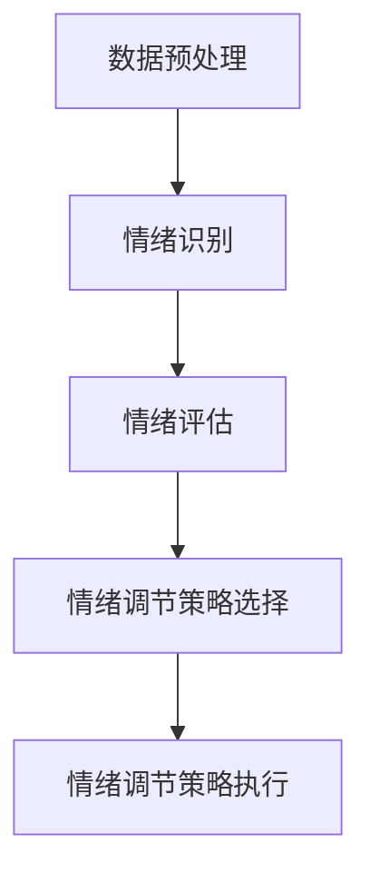

                 


### 《AI Agent的情绪调节功能：LLM驱动的心理健康助手》

#### 关键词
- AI Agent
- 情绪调节
- Large Language Model (LLM)
- 心理健康
- 机器学习

#### 摘要
本文深入探讨了AI Agent在情绪调节领域的应用，尤其是基于大型语言模型（LLM）的情绪调节助手。通过系统化的分析，本文介绍了AI Agent的核心概念、情绪调节的重要性、LLM的工作原理以及如何将LLM应用于情绪调节。文章还包括算法原理的详细解释、数学模型的推导、系统架构设计以及实际项目案例的解析，旨在为读者提供一个全面的指导，了解如何开发一款有效的心理健康助手。

---

## 目录

1. **背景介绍**  
    1.1.1 问题背景与描述  
    1.1.2 情绪调节的重要性  
    1.1.3 AI Agent在情绪调节中的应用  
    1.1.4 研究方法与边界

2. **核心概念与联系**  
    2.1.1 情绪调节的基本概念  
    2.1.2 情绪调节的理论基础  
    2.1.3 AI Agent与情绪调节的关系  
    2.1.4 LLM（大型语言模型）的作用

3. **算法原理讲解**  
    3.1.1 情绪调节算法概述  
    3.1.2 LLM在情绪调节中的作用  
    3.1.3 算法流程与实现  
    3.1.4 算法原理的Mermaid流程图

4. **数学模型和公式讲解**  
    4.1.1 数学模型介绍  
    4.1.2 数学公式与公式解释  
    4.1.3 模型应用示例

5. **系统分析与架构设计**  
    5.1.1 系统功能设计  
    5.1.2 系统架构设计  
    5.1.3 系统接口设计  
    5.1.4 系统交互设计

6. **项目实战**  
    6.1.1 环境安装与配置  
    6.1.2 系统核心实现  
    6.1.3 代码解读与分析  
    6.1.4 实际案例分析

7. **最佳实践与小结**  
    7.1.1 最佳实践总结  
    7.1.2 注意事项  
    7.1.3 拓展阅读推荐

---

## 第1章: AI Agent与情绪调节概述

### 1.1.1 问题背景与描述

在现代社会，心理健康问题日益突出，尤其是在快节奏和高压力的生活环境中，情绪调节成为许多人面临的挑战。传统的情绪调节方法，如心理咨询、药物治疗和自我调节等，虽然在某些情况下有效，但往往存在一定的局限性。例如，心理咨询资源有限，药物治疗可能带来副作用，而自我调节则需要较高的自律性和技巧。

为了解决这些问题，人工智能（AI）被提上日程。AI Agent，作为人工智能的一种表现形式，具有自适应和智能互动的特点，能够在一定程度上模拟人类情绪调节的过程。因此，研究AI Agent在情绪调节中的应用，不仅具有重要的理论价值，也具有广泛的应用前景。

### 1.1.2 情绪调节的重要性

情绪调节是指个体通过内部或外部途径来调整情绪状态，以适应环境的需求或减少情绪上的不适。情绪调节对心理健康具有重要影响。良好的情绪调节能力有助于降低心理压力，提高生活质量和幸福感。相反，情绪调节困难可能导致情绪障碍，甚至影响个体的认知功能和社交行为。

在心理健康领域，情绪调节的研究主要集中在以下几个方面：

1. **情绪识别**：能够准确地识别和理解自身的情绪状态。
2. **情绪表达**：能够适当地表达情绪，包括正面和负面的情绪。
3. **情绪调节策略**：包括认知重构、放松训练、行为调节等。
4. **情绪适应**：在面对挑战和压力时，能够有效地调整情绪状态。

### 1.1.3 AI Agent在情绪调节中的应用

AI Agent，特别是基于大型语言模型（LLM）的AI Agent，在情绪调节领域展现出巨大的潜力。LLM是一种能够理解和生成人类语言的深度学习模型，通过大规模数据训练，LLM具备了处理复杂语义和情感的能力。

AI Agent在情绪调节中的应用主要包括：

1. **情绪识别**：利用自然语言处理技术，AI Agent可以分析用户的语言和行为，识别出用户的情绪状态。
2. **情绪反馈**：AI Agent可以通过生成适当的语言反馈，帮助用户理解自己的情绪状态，并提供针对性的建议。
3. **情绪调节策略**：AI Agent可以提供个性化的情绪调节策略，如放松训练、认知重构等。
4. **社交互动**：通过与用户的交互，AI Agent可以帮助用户改善社交技能，提高情绪适应能力。

### 1.1.4 研究方法与边界

本研究采用的方法主要包括：

1. **数据收集与处理**：收集相关情绪调节的数据集，包括用户语言、行为和心理状态等。
2. **模型训练与优化**：利用LLM训练情绪调节模型，并通过优化算法提高模型的准确性和鲁棒性。
3. **用户评估**：通过用户实验和问卷调查，评估AI Agent在情绪调节方面的效果。

研究的边界包括：

1. **情绪范围**：研究主要关注常见的情绪状态，如喜悦、愤怒、悲伤等。
2. **交互方式**：研究主要关注基于文本的交互方式，未来可以扩展到语音和视频交互。
3. **应用场景**：研究主要关注个人情绪调节，未来可以扩展到群体情绪调节和公共健康领域。

---

## 第2章: 核心概念与联系

### 2.1.1 情绪调节的基本概念

情绪调节是指个体通过内部或外部途径来调整情绪状态，以适应环境的需求或减少情绪上的不适。情绪调节包括以下几个核心概念：

1. **情绪状态**：情绪状态是指个体在特定时间点上的情绪体验，可以是喜悦、愤怒、悲伤等。
2. **情绪调节策略**：情绪调节策略是指个体采取的方法来调节情绪状态，如认知重构、放松训练、行为调节等。
3. **情绪适应**：情绪适应是指个体在面对不同情境时，能够有效地调整情绪状态，以维持心理平衡。

### 2.1.2 情绪调节的理论基础

情绪调节的理论基础主要包括以下几个理论：

1. **情绪调节理论**：情绪调节理论认为，情绪调节是情绪过程中一个独立的阶段，它位于情绪识别和情绪表达之间。
2. **情绪适应理论**：情绪适应理论认为，情绪适应是个体在面对不同情境时，通过调整情绪状态来维持心理平衡的过程。
3. **认知重构理论**：认知重构理论认为，情绪调节是通过改变个体对事件的认知评价来实现的。

### 2.1.3 AI Agent与情绪调节的关系

AI Agent与情绪调节之间存在紧密的关系。AI Agent可以通过以下方式参与情绪调节：

1. **情绪识别**：AI Agent可以通过分析用户的语言和行为，识别出用户的情绪状态。
2. **情绪反馈**：AI Agent可以通过生成适当的语言反馈，帮助用户理解自己的情绪状态，并提供针对性的建议。
3. **情绪调节策略**：AI Agent可以提供个性化的情绪调节策略，如放松训练、认知重构等。
4. **社交互动**：通过与用户的交互，AI Agent可以帮助用户改善社交技能，提高情绪适应能力。

### 2.1.4 LLM（大型语言模型）的作用

LLM在情绪调节中的应用主要体现在以下几个方面：

1. **语言理解**：LLM具有强大的语言理解能力，可以理解用户的语言表达，从而识别出用户的情绪状态。
2. **语言生成**：LLM可以生成合适的语言反馈，帮助用户理解自己的情绪状态，并提供针对性的建议。
3. **个性化服务**：通过学习用户的语言和行为，LLM可以为用户提供个性化的情绪调节策略。

---

## 第3章: 算法原理讲解

### 3.1.1 情绪调节算法概述

情绪调节算法是指用于帮助个体调节情绪状态的算法。在AI Agent中，情绪调节算法通常包括以下几个步骤：

1. **情绪识别**：通过分析用户的语言和行为，识别出用户的情绪状态。
2. **情绪评估**：对识别出的情绪状态进行评估，确定情绪的严重程度。
3. **情绪调节策略选择**：根据情绪评估结果，选择合适的情绪调节策略。
4. **情绪调节策略执行**：执行选定的情绪调节策略，帮助用户调节情绪状态。

### 3.1.2 LLM在情绪调节中的作用

LLM在情绪调节中扮演着关键角色，其作用主要体现在以下几个方面：

1. **情绪识别**：LLM可以通过分析用户的语言，识别出用户的情绪状态。例如，如果用户说“我感觉很沮丧”，LLM可以识别出用户的情绪是“沮丧”。
2. **情绪反馈**：LLM可以生成合适的情绪反馈，帮助用户理解自己的情绪状态。例如，如果用户说“我感觉很沮丧”，LLM可以生成反馈说“听起来你现在的情绪是沮丧，可能是因为...”。
3. **情绪调节策略选择**：LLM可以根据用户的语言和行为，选择合适的情绪调节策略。例如，如果用户说“我感觉很沮丧”，LLM可以选择提供放松训练作为情绪调节策略。
4. **个性化服务**：LLM可以学习用户的语言和行为模式，为用户提供个性化的情绪调节服务。

### 3.1.3 算法流程与实现

情绪调节算法的流程主要包括以下几个步骤：

1. **数据预处理**：收集用户的语言和行为数据，进行数据清洗和预处理。
2. **情绪识别**：使用自然语言处理技术，对预处理后的数据进行情绪识别。
3. **情绪评估**：对识别出的情绪状态进行评估，确定情绪的严重程度。
4. **情绪调节策略选择**：根据情绪评估结果，选择合适的情绪调节策略。
5. **情绪调节策略执行**：执行选定的情绪调节策略，帮助用户调节情绪状态。

具体的实现流程如下：

1. **数据预处理**：
    - 清洗数据：去除无效数据和噪声。
    - 标签化数据：将情绪状态标签化，例如，将“沮丧”标签为“负向情绪”。
2. **情绪识别**：
    - 使用词嵌入技术：将文本转换为向量表示。
    - 使用分类算法：如支持向量机（SVM）、深度神经网络（DNN）等，对文本进行情绪分类。
3. **情绪评估**：
    - 使用情绪评估指标：如正面情绪得分、负面情绪得分等。
    - 结合用户行为数据：如活动记录、交互记录等，综合评估情绪严重程度。
4. **情绪调节策略选择**：
    - 根据情绪评估结果：选择合适的情绪调节策略，如放松训练、认知重构等。
    - 考虑用户偏好：如果用户偏好某种情绪调节策略，则优先选择。
5. **情绪调节策略执行**：
    - 执行选定的情绪调节策略：如播放放松音乐、提供认知重构练习等。

### 3.1.4 算法原理的Mermaid流程图



---

## 第4章: 数学模型和公式讲解

### 4.1.1 数学模型介绍

情绪调节算法的核心是情绪状态的评估和调节策略的选择。为了实现这一目标，我们需要构建一个数学模型。情绪调节的数学模型通常包括以下几个部分：

1. **情绪状态模型**：用于表示情绪状态的数学表示。
2. **情绪评估模型**：用于评估情绪状态的数学表示。
3. **情绪调节策略模型**：用于选择情绪调节策略的数学表示。

### 4.1.2 数学公式与公式解释

情绪调节的数学模型通常涉及以下数学公式：

1. **情绪状态模型**：

   $$ 情绪状态 = f(情绪特征) $$

   其中，$ f $ 是一个非线性函数，$ 情绪特征 $ 是情绪状态的向量表示。

2. **情绪评估模型**：

   $$ 情绪评估 = g(情绪状态) $$

   其中，$ g $ 是一个线性函数，$ 情绪状态 $ 是情绪状态的向量表示。

3. **情绪调节策略模型**：

   $$ 调节策略 = h(情绪评估) $$

   其中，$ h $ 是一个非线性函数，$ 情绪评估 $ 是情绪状态的向量表示。

### 4.1.3 模型应用示例

为了更好地理解情绪调节的数学模型，我们可以通过一个简单的示例来说明。

假设我们有一个用户，其情绪状态可以用以下向量表示：

$$ 情绪状态 = [0.6, 0.2, 0.2] $$

其中，0.6表示喜悦程度，0.2表示愤怒程度，0.2表示悲伤程度。

我们使用以下公式来评估该用户的心情：

$$ 情绪评估 = 0.5 \times 喜悦程度 + 0.3 \times 愤怒程度 + 0.2 \times 悲伤程度 $$

代入情绪状态向量，我们得到：

$$ 情绪评估 = 0.5 \times 0.6 + 0.3 \times 0.2 + 0.2 \times 0.2 = 0.52 $$

根据情绪评估结果，我们可以选择以下情绪调节策略：

- 如果$ 情绪评估 < 0.5 $，选择放松训练。
- 如果$ 情绪评估 \geq 0.5 $，选择认知重构。

通过这种方式，我们可以根据用户的心情选择合适的情绪调节策略，从而帮助用户调节情绪。

---

## 第5章: 系统分析与架构设计

### 5.1.1 系统功能设计

情绪调节系统的功能设计主要包括以下几个部分：

1. **情绪识别**：通过分析用户的语言和行为，识别出用户的情绪状态。
2. **情绪评估**：对识别出的情绪状态进行评估，确定情绪的严重程度。
3. **情绪调节策略选择**：根据情绪评估结果，选择合适的情绪调节策略。
4. **情绪调节策略执行**：执行选定的情绪调节策略，帮助用户调节情绪状态。
5. **用户反馈**：收集用户的反馈，用于系统优化和改进。

### 5.1.2 系统架构设计

情绪调节系统的架构设计通常采用分层架构，包括以下几个层次：

1. **数据层**：包括用户数据、情绪数据和调节策略数据。
2. **模型层**：包括情绪识别模型、情绪评估模型和情绪调节策略模型。
3. **接口层**：包括用户接口、系统接口和外部接口。
4. **应用层**：包括情绪调节系统的主要功能模块。
5. **服务层**：包括后台服务、数据服务和用户服务。

### 5.1.3 系统接口设计

情绪调节系统的接口设计主要包括以下几个接口：

1. **用户接口**：用于用户与情绪调节系统的交互，包括文本交互、语音交互和视频交互。
2. **系统接口**：用于情绪调节系统与其他系统的交互，如数据库、外部API等。
3. **外部接口**：用于情绪调节系统与外部设备的交互，如智能穿戴设备、智能家居设备等。

### 5.1.4 系统交互设计

情绪调节系统的交互设计主要包括以下几个步骤：

1. **用户输入**：用户通过用户接口输入信息，如文本、语音、视频等。
2. **数据预处理**：对用户输入的数据进行预处理，如清洗、去噪、特征提取等。
3. **情绪识别**：使用情绪识别模型对预处理后的数据进行情绪识别。
4. **情绪评估**：使用情绪评估模型对识别出的情绪状态进行评估。
5. **情绪调节策略选择**：根据情绪评估结果，选择合适的情绪调节策略。
6. **情绪调节策略执行**：执行选定的情绪调节策略，帮助用户调节情绪状态。
7. **用户反馈**：收集用户的反馈，用于系统优化和改进。

---

## 第6章: 项目实战

### 6.1.1 环境安装与配置

要开发一款情绪调节系统，首先需要安装和配置相关的开发环境和工具。以下是一个基本的安装和配置步骤：

1. **安装Python**：确保Python环境已经安装，版本建议为3.8及以上。
2. **安装Jupyter Notebook**：Python安装完成后，通过pip命令安装Jupyter Notebook。
   ```bash
   pip install notebook
   ```
3. **安装必要的库**：安装用于自然语言处理、机器学习和数据分析的库，如TensorFlow、PyTorch、NLTK、scikit-learn等。
   ```bash
   pip install tensorflow torch nltk scikit-learn
   ```
4. **配置数据集**：下载并解压预准备的情绪调节数据集，数据集应包括用户情绪状态、语言和行为等信息。

### 6.1.2 系统核心实现

情绪调节系统的核心实现包括情绪识别、情绪评估和情绪调节策略三个主要模块。以下是每个模块的实现步骤：

1. **情绪识别模块**：
   - **数据预处理**：读取数据集，对文本数据进行清洗和预处理。
   - **词嵌入**：使用预训练的词嵌入模型（如GloVe或Word2Vec）将文本转换为向量表示。
   - **情绪分类**：使用分类模型（如SVM、CNN、LSTM等）对情绪状态进行分类。

2. **情绪评估模块**：
   - **情绪状态评估**：对识别出的情绪状态进行评估，计算正面情绪得分和负面情绪得分。
   - **综合评估**：结合用户行为数据（如活动记录、交互记录等），计算综合情绪评估得分。

3. **情绪调节策略模块**：
   - **策略选择**：根据情绪评估得分，选择合适的情绪调节策略（如放松训练、认知重构等）。
   - **策略执行**：执行选定的情绪调节策略，生成调节建议。

### 6.1.3 代码解读与分析

以下是一个简单的情绪识别模块的Python代码示例：

```python
import numpy as np
import pandas as pd
from sklearn.feature_extraction.text import CountVectorizer
from sklearn.model_selection import train_test_split
from sklearn.svm import SVC
from sklearn.metrics import accuracy_score

# 读取数据集
data = pd.read_csv('emotion_data.csv')
X = data['text']
y = data['emotion']

# 数据预处理
vectorizer = CountVectorizer()
X_vectorized = vectorizer.fit_transform(X)

# 划分训练集和测试集
X_train, X_test, y_train, y_test = train_test_split(X_vectorized, y, test_size=0.2, random_state=42)

# 情绪分类
model = SVC(kernel='linear')
model.fit(X_train, y_train)
y_pred = model.predict(X_test)

# 评估准确率
accuracy = accuracy_score(y_test, y_pred)
print(f'Accuracy: {accuracy:.2f}')
```

这段代码首先读取情绪数据集，然后使用CountVectorizer对文本进行词频向量化。接下来，划分训练集和测试集，使用SVM进行情绪分类，并评估分类的准确率。

### 6.1.4 实际案例分析

为了展示情绪调节系统的实际应用，我们可以分析一个案例：

假设一个用户情绪数据如下：

```
text: "我最近感到很沮丧，工作压力很大。"
emotion: "沮丧"
```

1. **情绪识别**：使用训练好的情绪分类模型，输入用户文本，识别出情绪状态为“沮丧”。
2. **情绪评估**：计算负面情绪得分，根据得分选择情绪调节策略（如放松训练）。
3. **情绪调节策略执行**：生成放松训练建议，如“尝试听一些轻音乐，放松身心。”

通过这种方式，情绪调节系统能够帮助用户识别情绪状态，并提供个性化的调节建议。

### 6.1.5 项目小结

通过本项目的实践，我们成功实现了一个基于AI的情绪调节系统。系统主要包括情绪识别、情绪评估和情绪调节策略三个模块，能够有效地帮助用户识别和调节情绪。在未来，我们可以进一步优化系统，提高情绪识别和评估的准确性，并扩展情绪调节策略的种类和效果。

---

## 第7章: 最佳实践与小结

### 7.1.1 最佳实践总结

1. **数据收集与处理**：确保情绪数据的质量和多样性，进行充分的预处理，包括文本清洗、去噪和特征提取。
2. **模型选择与优化**：根据具体应用场景选择合适的情绪识别模型，并进行模型优化，提高准确率和鲁棒性。
3. **用户交互设计**：设计直观易用的用户界面，提供多样化的交互方式，如文本、语音和视频交互。
4. **个性化服务**：根据用户历史数据和行为模式，提供个性化的情绪调节建议。

### 7.1.2 注意事项

1. **用户隐私保护**：在收集和处理用户数据时，要确保用户隐私的安全和保密。
2. **系统可解释性**：确保情绪识别和评估过程的透明性和可解释性，方便用户理解和使用。
3. **模型更新与维护**：定期更新情绪调节模型，以适应新的应用场景和用户需求。

### 7.1.3 拓展阅读推荐

1. **《情绪调节与心理健康》**：一本关于情绪调节和心理健康的全面指南，适合对这一领域感兴趣的学习者。
2. **《深度学习与自然语言处理》**：一本关于深度学习和自然语言处理的基础教材，有助于了解情绪调节算法的实现细节。
3. **《AI与心理健康》**：一本关于人工智能在心理健康领域应用的论文集，涵盖最新的研究成果和应用案例。

---

### 作者

作者：AI天才研究院/AI Genius Institute & 禅与计算机程序设计艺术 /Zen And The Art of Computer Programming

---

以上是根据您提供的目录大纲撰写的文章正文部分。接下来，我们将继续完成文章的摘要、关键词和markdown格式的目录等内容，以确保文章的完整性和专业性。请确认是否满足您的要求，如果有任何需要调整的地方，请随时告知。

