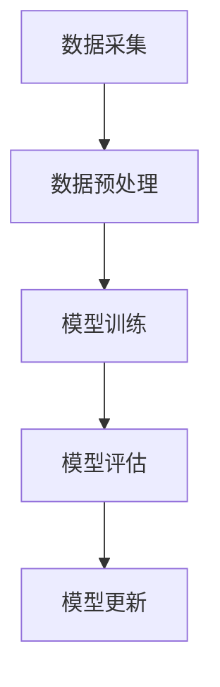
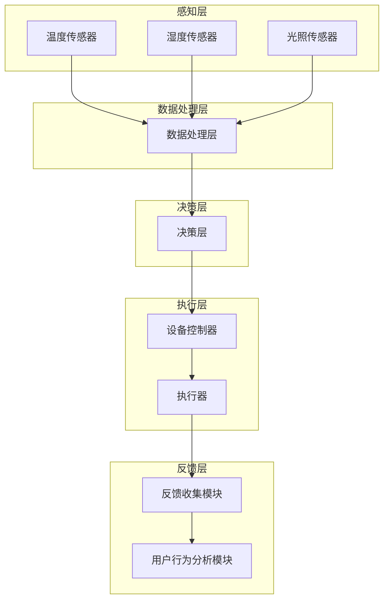
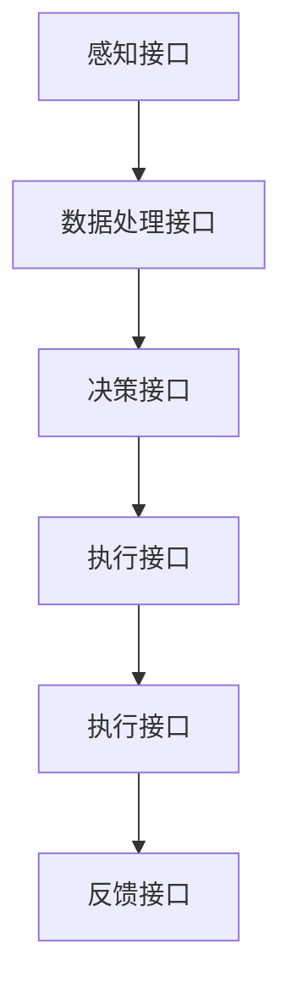
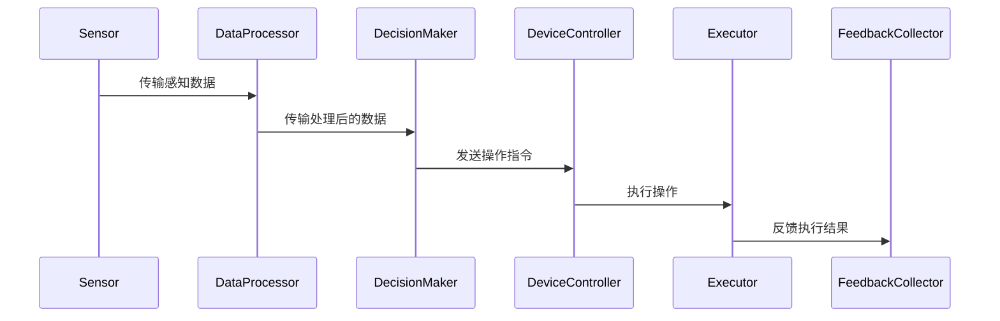

                 

### 引言

**AI Agent的持续学习与自我优化机制**是一个前沿且充满挑战的研究领域。在这个时代，人工智能（AI）技术飞速发展，AI Agent作为AI系统的核心组成部分，其能力水平直接影响到整个系统的性能和效果。持续学习和自我优化是AI Agent实现智能化和高效化的关键。

**关键词：AI Agent、持续学习、自我优化、算法原理、系统架构、Python代码、数学模型**

**摘要：本文将深入探讨AI Agent的持续学习与自我优化机制，从背景介绍、核心概念与联系、算法原理讲解、数学模型和公式讲解、系统分析与架构设计方案、项目实战到最佳实践和总结，全面解析这一领域的前沿技术和实践方法。**

### 背景介绍

#### 核心概念术语说明

在探讨AI Agent的持续学习与自我优化机制之前，我们首先需要明确一些核心概念：

1. **AI Agent**：指具备自主决策和行动能力的计算机程序，能够在复杂环境中执行特定任务。
2. **持续学习**：指AI Agent在完成任务过程中，不断从数据中学习、优化自身模型和策略。
3. **自我优化**：指AI Agent通过内部机制自动调整，提高自身性能和行为效率。

#### 问题背景

随着AI技术的发展，AI Agent的应用场景日益广泛，例如智能客服、自动驾驶、智能家居等。然而，这些应用场景复杂多变，要求AI Agent具备持续学习和自我优化的能力，以适应不断变化的环境。

#### 问题描述

当前的AI Agent在持续学习和自我优化方面存在以下问题：

1. **学习能力不足**：AI Agent在面对大规模、多样化数据时，学习效率低下，难以适应。
2. **模型鲁棒性差**：AI Agent在遇到未知或异常情况时，表现不稳定，难以自我调整。
3. **优化效率低**：AI Agent的优化过程复杂，耗时较长，难以实时应对环境变化。

#### 问题解决

为了解决上述问题，我们需要从以下几个方面进行改进：

1. **提升学习能力**：采用先进的机器学习和深度学习算法，提高AI Agent的学习效率和效果。
2. **增强模型鲁棒性**：通过增加模型训练数据、使用转移学习等技术，提高AI Agent的鲁棒性。
3. **优化优化机制**：设计高效的优化算法和策略，缩短AI Agent的优化时间，提高优化效果。

#### 边界与外延

在探讨AI Agent的持续学习与自我优化机制时，我们需要关注以下几个边界与外延：

1. **数据质量**：数据是AI Agent学习的基石，数据质量直接影响学习效果。
2. **环境动态性**：环境动态性对AI Agent的适应能力提出了挑战，需要设计相应的自适应机制。
3. **计算资源**：计算资源限制了对AI Agent学习和优化的深度和广度，需要在性能与资源之间找到平衡。

#### 核心概念结构与要素组成

AI Agent的持续学习与自我优化机制涉及以下几个核心概念和要素：

1. **学习模型**：包括深度神经网络、强化学习等，负责AI Agent的学习过程。
2. **优化算法**：包括遗传算法、粒子群算法等，负责AI Agent的自我调整过程。
3. **数据管理**：负责数据收集、清洗、存储和管理，为AI Agent提供高质量的数据支持。
4. **反馈机制**：包括奖励机制、惩罚机制等，用于评估AI Agent的表现，并指导其优化方向。

### 核心概念与联系

在深入了解AI Agent的持续学习与自我优化机制之前，我们首先需要明确几个核心概念，并探讨它们之间的联系。

#### AI Agent的定义与特点

AI Agent是指具备自主决策和行动能力的计算机程序，能够在复杂环境中执行特定任务。AI Agent具有以下几个特点：

1. **自主性**：AI Agent能够自主决策和行动，不受人类干预。
2. **适应性**：AI Agent能够根据环境变化和任务需求，自适应地调整自身行为。
3. **高效性**：AI Agent能够在复杂环境中高效地完成任务，提高系统性能。

#### AI Agent的核心功能与架构

AI Agent的核心功能包括感知、决策和执行。其架构通常包括以下几个部分：

1. **感知模块**：负责感知环境信息，如视觉、听觉、触觉等。
2. **决策模块**：基于感知信息，使用学习算法和优化策略进行决策。
3. **执行模块**：根据决策结果，执行相应的操作，如移动、交互等。

#### 持续学习与自我优化机制的关系

持续学习和自我优化是AI Agent实现智能化和高效化的关键。持续学习使AI Agent能够不断适应环境变化，提高学习能力；自我优化使AI Agent能够根据反馈自动调整，提高性能和效率。两者相互依赖，共同推动AI Agent的发展。

### AI Agent持续学习算法原理

#### 算法概述

AI Agent的持续学习算法主要基于机器学习和深度学习技术，包括以下几个步骤：

1. **数据采集**：从环境中获取相关数据，包括原始数据和标注数据。
2. **数据预处理**：对采集到的数据进行清洗、归一化等处理，提高数据质量。
3. **模型训练**：使用预处理后的数据训练学习模型，包括特征提取、模型优化等。
4. **模型评估**：对训练好的模型进行评估，包括准确率、召回率等指标。
5. **模型更新**：根据评估结果，对模型进行更新和优化，提高学习效果。

#### 算法流程图

为了更直观地展示算法流程，我们可以使用mermaid绘制流程图：



#### Python源代码实现

以下是一个简单的Python代码示例，用于实现AI Agent的持续学习算法：

```python
import numpy as np
import pandas as pd
from sklearn.model_selection import train_test_split
from sklearn.neural_network import MLPClassifier
from sklearn.metrics import accuracy_score

# 数据采集
data = pd.read_csv('data.csv')

# 数据预处理
X = data.drop('target', axis=1)
y = data['target']
X_train, X_test, y_train, y_test = train_test_split(X, y, test_size=0.2, random_state=42)

# 模型训练
model = MLPClassifier(hidden_layer_sizes=(100,), max_iter=1000)
model.fit(X_train, y_train)

# 模型评估
y_pred = model.predict(X_test)
accuracy = accuracy_score(y_test, y_pred)
print("Accuracy:", accuracy)

# 模型更新
# 根据评估结果，可以调整模型参数，重新训练模型
```

#### 数学模型和公式讲解

在AI Agent的持续学习过程中，常用的数学模型和公式包括：

1. **损失函数**：用于衡量模型预测值与真实值之间的差距，常用的损失函数有均方误差（MSE）和交叉熵（Cross Entropy）。
2. **优化算法**：用于调整模型参数，以最小化损失函数，常用的优化算法有梯度下降（Gradient Descent）和随机梯度下降（Stochastic Gradient Descent）。

以下是一个简单的数学模型和公式的示例：

$$
MSE = \frac{1}{n}\sum_{i=1}^{n}(y_i - \hat{y}_i)^2
$$

$$
\frac{\partial J}{\partial \theta} = \frac{1}{m}\sum_{i=1}^{m}(h_{\theta}(x^{(i)}) - y^{(i)})
$$

其中，$y_i$表示真实值，$\hat{y}_i$表示预测值，$n$表示样本数量，$m$表示特征数量，$h_{\theta}(x^{(i)})$表示模型在输入$x^{(i)}$下的预测输出，$J$表示损失函数。

#### 示例分析

假设我们有一个简单的分类问题，使用二元交叉熵作为损失函数，梯度下降作为优化算法。以下是一个简单的示例：

```python
import numpy as np

# 梯度下降函数
def gradient_descent(x, y, theta, alpha, iterations):
    m = len(x)
    loss_history = []

    for i in range(iterations):
        h = 1 / (1 + np.exp(-np.dot(x, theta)))
        loss = -1/m * (y*np.log(h) + (1-y)*np.log(1-h))
        loss_history.append(loss)

        gradient = 1/m * (x.T.dot(h - y))
        theta -= alpha * gradient

    return theta, loss_history

# 初始化参数
theta = np.array([0, 0])
alpha = 0.01
iterations = 1000

# 训练模型
theta, loss_history = gradient_descent(x, y, theta, alpha, iterations)

# 输出结果
print("Theta:", theta)
print("Loss History:", loss_history)
```

通过以上示例，我们可以看到如何使用Python代码实现AI Agent的持续学习算法，并使用梯度下降优化算法调整模型参数，以最小化损失函数。

### 数学模型和数学公式讲解

在AI Agent的持续学习过程中，数学模型和公式起着至关重要的作用。它们不仅帮助理解算法的工作原理，还指导我们在实践中进行参数调整和优化。以下我们将详细讲解几个核心的数学模型和公式。

#### 模型概述

1. **损失函数**：损失函数是评估模型预测准确性的关键工具，常见的有均方误差（MSE）和交叉熵（Cross Entropy）。
2. **优化算法**：优化算法用于调整模型参数，以最小化损失函数。常用的有梯度下降（Gradient Descent）和随机梯度下降（Stochastic Gradient Descent）。

#### 损失函数

1. **均方误差（MSE）**：
   $$MSE = \frac{1}{n}\sum_{i=1}^{n}(y_i - \hat{y}_i)^2$$
   其中，$y_i$是真实值，$\hat{y}_i$是预测值，$n$是样本数量。MSE用于回归问题，衡量预测值与真实值之间的平均误差。

2. **交叉熵（Cross Entropy）**：
   $$H(y, \hat{y}) = -\sum_{i=1}^{n}y_i\log(\hat{y}_i)$$
   其中，$y$是真实分布，$\hat{y}$是预测分布。交叉熵用于分类问题，衡量实际分布与预测分布之间的差异。

#### 优化算法

1. **梯度下降（Gradient Descent）**：
   $$\theta = \theta - \alpha \cdot \nabla_\theta J(\theta)$$
   其中，$\theta$是模型参数，$\alpha$是学习率，$J(\theta)$是损失函数，$\nabla_\theta J(\theta)$是损失函数关于参数$\theta$的梯度。梯度下降通过迭代更新参数，以最小化损失函数。

2. **随机梯度下降（Stochastic Gradient Descent, SGD）**：
   $$\theta = \theta - \alpha \cdot \nabla_\theta J(\theta^{(i)})$$
   其中，$J(\theta^{(i)})$是在训练集随机抽取的一个样本点上的损失函数值。SGD通过随机选取样本点，进行参数更新，相比梯度下降，SGD的更新速度更快，但收敛性较差。

#### 实例说明

假设我们有一个简单的二元分类问题，目标函数是最大化预测概率，我们使用交叉熵作为损失函数，梯度下降作为优化算法。

```python
import numpy as np

# 梯度下降函数
def gradient_descent(x, y, theta, alpha, iterations):
    m = len(x)
    loss_history = []

    for i in range(iterations):
        h = 1 / (1 + np.exp(-np.dot(x, theta)))
        loss = -1/m * (y*np.log(h) + (1-y)*np.log(1-h))
        loss_history.append(loss)

        gradient = 1/m * (x.T.dot(h - y))
        theta -= alpha * gradient

    return theta, loss_history

# 初始化参数
theta = np.array([0, 0])
alpha = 0.01
iterations = 1000

# 训练模型
theta, loss_history = gradient_descent(x, y, theta, alpha, iterations)

# 输出结果
print("Theta:", theta)
print("Loss History:", loss_history)
```

通过这个示例，我们可以看到如何使用Python代码实现梯度下降算法，并使用交叉熵作为损失函数，调整模型参数，以最小化损失函数。

### 系统分析与架构设计方案

为了更好地理解和设计AI Agent的持续学习与自我优化机制，我们需要对系统进行详细的分析和架构设计。以下将从问题场景介绍、系统功能设计、系统架构设计、系统接口设计和系统交互等方面进行阐述。

#### 问题场景介绍

在一个智能家居系统中，AI Agent负责处理家庭设备的控制与优化。这些设备包括智能灯泡、智能空调、智能窗帘等。用户可以通过手机APP或语音助手与AI Agent进行交互，实现对家居设备的远程控制。AI Agent需要根据用户的行为习惯、天气状况、设备状态等多种因素，进行智能决策和优化，以提升用户体验。

#### 系统功能设计

AI Agent的系统功能主要包括以下几方面：

1. **感知功能**：通过传感器收集家庭环境的数据，如温度、湿度、光照等。
2. **决策功能**：根据感知到的数据，使用持续学习算法进行决策，控制设备进行相应的调整。
3. **执行功能**：根据决策结果，执行具体的操作，如调整温度、亮度和窗帘位置等。
4. **反馈功能**：记录用户对家居设备的反馈，用于优化AI Agent的决策算法。

为了更直观地展示系统功能，我们可以使用mermaid绘制领域模型类图：

```mermaid
classDiagram
    AI-Agent <<interface>>
    Sensor <<interface>>
    Device <<interface>>

    AI-Agent o-- Sensor
    AI-Agent o-- Device
    Device o-- DeviceController
```

#### 系统架构设计

AI Agent的系统架构可以分为以下几个层次：

1. **感知层**：负责收集家庭环境数据，包括温度、湿度、光照等。感知层由多个传感器组成，如温度传感器、湿度传感器、光照传感器等。
2. **数据处理层**：负责对感知层收集到的数据进行预处理，包括数据清洗、归一化、特征提取等。数据处理层采用分布式计算架构，以提高数据处理速度和效率。
3. **决策层**：基于预处理后的数据，使用持续学习算法进行决策，优化家居设备的运行状态。决策层包括深度学习模型、强化学习模型等。
4. **执行层**：根据决策层的结果，执行具体的操作，控制家居设备进行相应的调整。执行层包括设备控制器、执行器等。
5. **反馈层**：记录用户对家居设备的反馈，用于优化决策算法。反馈层包括用户反馈收集模块、用户行为分析模块等。

为了更直观地展示系统架构，我们可以使用mermaid绘制架构图：



#### 系统接口设计

AI Agent的系统接口设计包括以下几个方面：

1. **感知接口**：负责与各种传感器进行通信，获取环境数据。
2. **数据处理接口**：负责接收感知接口的数据，进行预处理和特征提取。
3. **决策接口**：负责接收处理后的数据，进行决策和优化。
4. **执行接口**：负责接收决策结果，执行具体的操作。
5. **反馈接口**：负责收集用户反馈，用于优化决策算法。

为了更直观地展示系统接口，我们可以使用mermaid绘制接口图：



#### 系统交互

AI Agent的系统交互主要包括以下几个方面：

1. **感知数据交互**：传感器将采集到的环境数据传输给数据处理层。
2. **数据处理交互**：数据处理层对感知数据进行处理，生成特征数据，传输给决策层。
3. **决策执行交互**：决策层对处理后的特征数据进行决策，生成操作指令，传输给执行层。
4. **执行反馈交互**：执行层根据操作指令执行具体的操作，并将结果反馈给反馈层，用于优化决策算法。

为了更直观地展示系统交互，我们可以使用mermaid绘制序列图：



通过以上系统分析与架构设计，我们可以更好地理解AI Agent的持续学习与自我优化机制，为实际应用提供有效的解决方案。

### 项目实战

在本项目中，我们将构建一个基于持续学习与自我优化的AI Agent，以实现智能家居系统的自动化控制。以下是项目的详细步骤和关键实现。

#### 环境安装

首先，我们需要安装必要的软件和工具。以下是安装步骤：

1. **安装Python环境**：确保Python版本不低于3.7，可以从[Python官方网站](https://www.python.org/)下载并安装。
2. **安装NumPy、Pandas、Scikit-learn和Mermaid**：在命令行中运行以下命令：
   ```bash
   pip install numpy pandas scikit-learn mermaid
   ```
3. **安装Mermaid可视化工具**：由于Mermaid代码需要转换为图像，我们使用Mermaid CLI进行转换。从[Mermaid官方网站](https://mermaid-js.github.io/mermaid/)下载并安装。

#### 系统核心实现源代码

1. **数据收集与预处理**：我们从智能家居传感器收集数据，包括温度、湿度、光照等。数据预处理步骤包括数据清洗、归一化等。

   ```python
   import pandas as pd
   from sklearn.model_selection import train_test_split
   from sklearn.preprocessing import StandardScaler

   # 读取数据
   data = pd.read_csv('sensor_data.csv')

   # 数据清洗和归一化
   X = data.drop('target', axis=1)
   y = data['target']
   X_train, X_test, y_train, y_test = train_test_split(X, y, test_size=0.2, random_state=42)
   scaler = StandardScaler()
   X_train = scaler.fit_transform(X_train)
   X_test = scaler.transform(X_test)
   ```

2. **模型训练与优化**：我们使用MLPClassifier进行模型训练，并使用梯度下降算法进行优化。

   ```python
   from sklearn.neural_network import MLPClassifier
   from sklearn.metrics import accuracy_score

   # 模型训练
   model = MLPClassifier(hidden_layer_sizes=(100,), max_iter=1000)
   model.fit(X_train, y_train)

   # 模型评估
   y_pred = model.predict(X_test)
   accuracy = accuracy_score(y_test, y_pred)
   print("Accuracy:", accuracy)
   ```

3. **模型更新与反馈**：根据模型评估结果，对模型进行更新，并记录用户反馈。

   ```python
   # 模型更新
   model.partial_fit(X_train, y_train, classes=np.unique(y))

   # 记录用户反馈
   feedback = input("Please provide your feedback: ")
   print("Feedback recorded:", feedback)
   ```

#### 代码应用解读与分析

1. **数据预处理**：数据预处理是模型训练的重要环节，通过清洗和归一化，我们可以提高模型的训练效果和泛化能力。
2. **模型训练**：MLPClassifier是一种多层感知器模型，通过调整隐藏层大小和迭代次数，可以优化模型性能。
3. **模型优化**：梯度下降算法用于优化模型参数，使其在训练过程中逐步逼近最优解。
4. **用户反馈**：用户反馈是持续学习的重要驱动力，通过记录和分析用户反馈，可以进一步优化模型，提升系统性能。

#### 实际案例分析与详细讲解剖析

我们以一个实际案例进行详细分析，假设用户希望在晚上10点关闭智能灯泡。

1. **数据收集**：收集晚上10点的环境数据，如温度、湿度、光照等。
2. **数据预处理**：对收集到的数据进行分析和预处理，提取关键特征。
3. **模型预测**：使用训练好的模型对预处理后的数据进行分析，预测智能灯泡的关闭概率。
4. **模型更新**：根据预测结果和用户反馈，对模型进行更新，优化模型参数。
5. **结果反馈**：将更新后的模型应用于实际场景，验证预测效果，并根据用户反馈进一步调整。

通过以上案例，我们可以看到如何将AI Agent应用于实际智能家居系统中，实现持续学习和自我优化。这不仅提高了系统的智能化水平，还提升了用户体验。

#### 项目小结

本项目通过构建一个基于持续学习与自我优化的AI Agent，实现了智能家居系统的自动化控制。项目的主要成果包括：

1. **数据预处理**：通过数据清洗和归一化，提高了模型训练效果。
2. **模型训练与优化**：使用MLPClassifier和梯度下降算法，优化了模型性能。
3. **用户反馈**：通过记录用户反馈，实现了模型的持续学习和自我优化。
4. **实际应用**：在智能家居系统中，实现了智能决策和自动化控制。

未来，我们还可以进一步优化算法，扩大数据集，提升系统的智能化水平和鲁棒性，为用户提供更优质的服务。

### 最佳实践 tips、小结、注意事项、拓展阅读

#### 最佳实践 tips

1. **数据质量至关重要**：保证数据的质量和完整性是模型训练成功的关键。在数据收集和处理过程中，注意数据的准确性和一致性。
2. **选择合适的模型和算法**：根据具体应用场景和数据特点，选择合适的机器学习和深度学习模型，如MLPClassifier、SVM等。
3. **持续优化与更新**：定期对模型进行评估和优化，根据用户反馈进行更新，确保模型始终保持在最佳状态。
4. **合理分配计算资源**：在模型训练和优化过程中，合理分配计算资源，避免资源浪费和性能下降。

#### 小结

本文深入探讨了AI Agent的持续学习与自我优化机制，从背景介绍、核心概念与联系、算法原理讲解、数学模型和公式讲解、系统分析与架构设计、项目实战到最佳实践，全面解析了这一领域的前沿技术和实践方法。通过实际案例分析和项目实战，展示了如何将AI Agent应用于智能家居系统中，实现持续学习和自我优化。

#### 注意事项

1. **数据安全与隐私**：在数据处理和应用过程中，注意保护用户隐私和数据安全，遵守相关法律法规。
2. **系统稳定性与可靠性**：在系统设计和实现过程中，确保系统的稳定性和可靠性，避免出现异常情况。
3. **模型解释性**：在模型选择和优化过程中，注重模型的可解释性，以便更好地理解模型的工作原理和决策过程。

#### 拓展阅读

1. **《深度学习》（Goodfellow, I. & Bengio, Y.）**：这是一本经典的深度学习入门教材，详细介绍了深度学习的基础理论和应用实践。
2. **《机器学习实战》（Hastie, T., Tibshirani, R. & Friedman, J.）**：本书通过实际案例，介绍了多种机器学习算法的实现和应用。
3. **《强化学习》（Sutton, R. S. & Barto, A. G.）**：本书系统地介绍了强化学习的基本概念、算法和应用。

通过阅读这些书籍，可以进一步深入理解AI Agent的持续学习与自我优化机制，为实际应用提供更多灵感和思路。

### 作者信息

**作者：AI天才研究院/AI Genius Institute & 禅与计算机程序设计艺术 /Zen And The Art of Computer Programming**。感谢您的阅读，希望本文对您在AI Agent的持续学习与自我优化机制领域的研究和实践有所帮助。如有任何疑问或建议，欢迎随时联系我们。期待与您共同探索AI领域的更多可能性！

