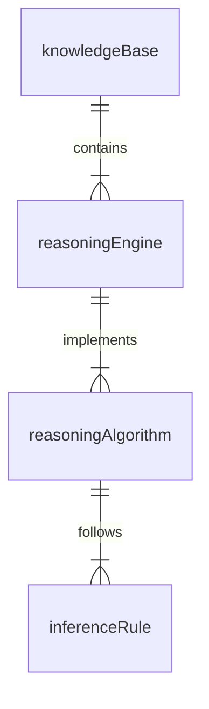
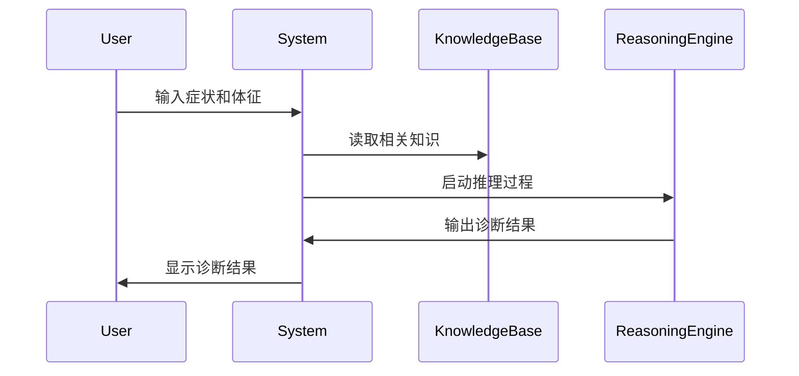
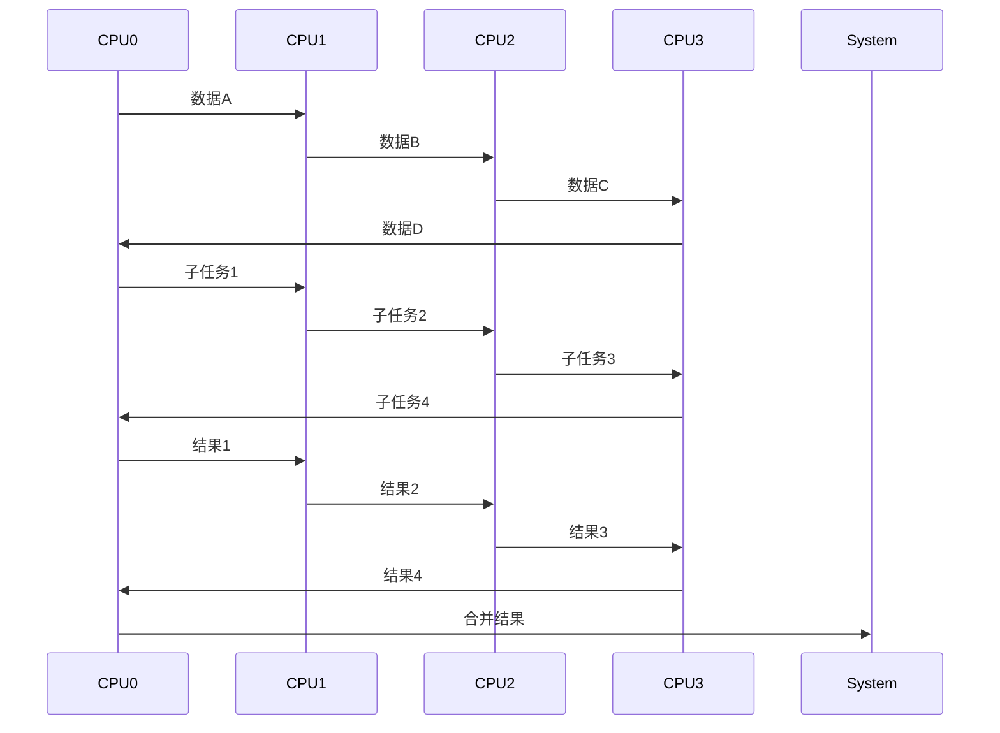
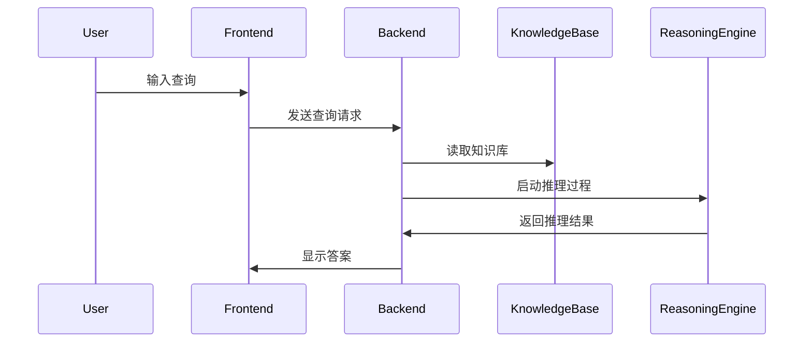

                 

# AI Agent的推理引擎：设计与优化

## 关键词

- AI Agent
- 推理引擎
- 设计
- 优化
- 人工智能
- 知识表示
- 推理算法
- 解释性
- 可扩展性

## 摘要

本文旨在深入探讨AI Agent推理引擎的设计与优化，从基础概念、核心概念联系、主流模型、应用前景等方面进行详细分析。文章将分章节介绍推理引擎的核心组成部分，包括知识库、推理机和推理算法，以及它们之间的相互作用。同时，本文将对比基于规则和基于模型的推理引擎，并分析其各自的优缺点。此外，还将介绍主流AI大模型及其在企业中的应用，探讨AI大模型在推理引擎设计和优化中的潜力与挑战。最后，文章将对整个推理引擎的设计与优化过程进行总结，并提出未来的研究方向。

## 第一部分: AI Agent的推理引擎基础

### 第1章: AI Agent的推理引擎概述

#### 1.1.1 推理引擎在AI Agent中的重要性

在AI Agent的运作过程中，推理引擎扮演着至关重要的角色。它负责处理信息、进行逻辑推理，并基于这些推理结果做出决策。推理引擎不仅决定了AI Agent的智能程度，还影响了其适应性和鲁棒性。

**问题描述：** AI Agent在面对复杂的问题和情境时，如何有效地利用推理引擎进行决策？

**问题解决：** 推理引擎通过以下三个方面实现其重要性：

1. **决策支持：** AI Agent需要处理复杂的问题和情境，推理引擎可以帮助其从大量的数据中提取有用的信息，生成可能的解决方案，从而做出明智的决策。
2. **情境理解：** AI Agent需要理解当前的情境，并通过推理引擎将情境信息与知识库相结合，以做出合理的反应。
3. **交互性：** 推理引擎使得AI Agent能够与人类进行交互，理解用户的意图和需求，从而提供更个性化的服务。

**边界与外延：** 推理引擎不仅限于AI Agent，还广泛应用于自然语言处理、机器学习、自动驾驶等领域。

**概念结构与核心要素组成：** 推理引擎的核心要素包括：

- **知识表示：** 包括事实、规则、关系等信息的表示方式。
- **推理算法：** 用于处理数据、进行逻辑推理的算法。
- **推理机：** 执行推理过程的计算核心。

### 1.1.2 推理引擎的基本概念与工作原理

**AI大模型的定义：** AI大模型是指具有大规模参数、能够处理海量数据的深度学习模型。它们通常具有强大的表征能力和泛化能力，能够解决复杂的问题。

**AI大模型的核心特点：** 

- **大规模参数：** 拥有数百万甚至数十亿个参数，使得模型具备强大的表征能力。
- **海量数据：** 基于大量数据进行训练，使得模型具有很好的泛化能力。
- **高效计算：** 利用GPU等硬件加速训练和推理过程。

**AI大模型与传统AI的区别：** 传统AI模型通常参数较少，处理能力有限，而AI大模型则通过大规模参数和海量数据进行训练，具备更高的表现能力。

### 1.1.3 主流AI大模型简介

**GPT系列模型：** GPT（Generative Pre-trained Transformer）系列模型是自然语言处理领域的代表性模型，包括GPT-1、GPT-2和GPT-3等。它们通过预训练和微调技术，在多个NLP任务上取得了卓越的性能。

**BERT及其变体：** BERT（Bidirectional Encoder Representations from Transformers）是一种双向编码器，通过预训练来学习语言的双向表征。BERT及其变体如RoBERTa、ALBERT等，在NLP任务中表现出色。

**其他知名大模型介绍：** 除了GPT和BERT，还有如TuringBot、BLU等大模型，它们在特定领域或任务上表现出色。

### 1.1.4 AI大模型在企业中的应用前景

**AI大模型的潜在应用领域：** AI大模型可以应用于多个领域，如金融、医疗、制造业、零售等，为企业的业务决策和运营提供支持。

**企业采用AI大模型的优势：** 

- **提高效率：** AI大模型可以处理大量数据，提高业务决策的速度和准确性。
- **降低成本：** 通过自动化和智能化，企业可以减少人力成本，提高运营效率。
- **创新业务模式：** AI大模型可以帮助企业发现新的业务机会，推动业务创新。

**AI大模型应用的挑战与机遇：** AI大模型在应用过程中面临数据隐私、安全性、解释性等问题，同时也为企业带来了新的机遇，如提高竞争力、拓展市场等。

## 1.2 推理引擎的核心概念与联系

### 1.2.1 推理引擎的核心概念

**推理引擎的基本概念：** 推理引擎是一种基于逻辑和知识的计算系统，用于处理数据、进行推理和决策。

**推理引擎的组成部分：**

- **知识库：** 存储事实、规则、关系等信息的数据库。
- **推理机：** 执行推理过程的计算核心，负责根据知识库中的信息进行逻辑推理。
- **推理算法：** 用于处理数据、进行逻辑推理的算法，如基于规则的推理、基于模型的推理等。

### 1.2.2 推理引擎的概念属性特征对比

| 特征         | 基于规则的推理 | 基于模型的推理 |
| ------------ | -------------- | -------------- |
| 知识表示形式 | 规则           | 模型           |
| 推理方式     | 逻辑推理       | 统计学习       |
| 解释性       | 较强          | 较弱          |
| 可扩展性     | 较弱          | 较强          |

### 1.2.3 推理引擎的ER实体关系图架构



## 第一部分总结

在本部分中，我们首先介绍了推理引擎在AI Agent中的重要性，并分析了推理引擎在决策支持、情境理解和交互性方面的作用。接着，我们探讨了推理引擎的基本概念和工作原理，包括知识库、推理机和推理算法。我们还对比了基于规则和基于模型的推理引擎，并介绍了主流的AI大模型。最后，我们讨论了AI大模型在企业中的应用前景和挑战。

在下一部分，我们将深入探讨推理引擎的设计和优化，包括知识库的构建、推理算法的选择和推理机的实现。我们将通过具体案例展示如何设计和优化推理引擎，以提高AI Agent的智能程度和适应能力。让我们继续深入探讨推理引擎的设计与优化。

## 第二部分: AI Agent推理引擎设计

### 2.1 知识库的构建

知识库是推理引擎的核心组件之一，它存储了AI Agent所需的事实、规则和关系等信息。一个良好的知识库设计不仅能够支持高效的推理过程，还能提高系统的解释性和可维护性。

#### 2.1.1 知识库的基本概念与构建方法

**知识库的基本概念：** 知识库是一个存储和管理知识的系统，它包含了与特定领域相关的各种信息，如事实、规则、关系、定义等。

**知识库的构建方法：** 构建知识库通常包括以下步骤：

1. **需求分析：** 确定AI Agent的应用场景和需求，识别所需的知识类型。
2. **数据采集：** 收集相关的数据和知识源，如文本、数据库、专家系统等。
3. **知识表示：** 选择合适的知识表示方法，如基于规则的表示、基于模型的表示等。
4. **知识集成：** 将不同来源的知识进行整合，构建一个统一的、结构化的知识库。

#### 2.1.2 知识库设计的关键要素

**关键要素包括：**

- **知识的准确性：** 知识库中的信息必须是准确和可靠的。
- **知识的可扩展性：** 知识库应该能够方便地添加新的知识和规则。
- **知识的解释性：** 知识库中的信息应该能够被解释和理解，以提高系统的透明度和可维护性。

#### 2.1.3 知识库构建实例

假设我们设计一个智能家居系统，其知识库需要包含以下信息：

- **设备信息：** 家中设备的种类、功能、连接方式等。
- **用户偏好：** 用户对设备的使用习惯、偏好设置等。
- **情境信息：** 如用户离开家、设备故障等。

这些信息可以通过以下方式表示：

- **设备信息：** 使用实体-关系模型（ER模型）表示，如“设备（Device）-功能（Function）”、“设备-连接方式（Connection）”等。
- **用户偏好：** 使用属性图表示，每个用户节点关联其偏好属性。
- **情境信息：** 使用事件日志表示，记录用户的操作和设备的状态变化。

### 2.2 推理算法的选择

推理算法是推理引擎的核心，它决定了推理过程的效率和质量。根据不同的应用场景和需求，可以选择不同的推理算法。

#### 2.2.1 基于规则的推理算法

**基于规则的推理算法（RBR）：** 这种算法基于一组预定义的规则，通过匹配和推理来生成结论。

**优点：** 简单易懂，易于实现，适合处理确定性问题和明确规则的场景。

**缺点：** 难以处理复杂和非确定性问题，规则维护困难。

**应用场景：** 如简单的自动化流程、专家系统等。

#### 2.2.2 基于模型的推理算法

**基于模型的推理算法（MBR）：** 这种算法基于机器学习模型，通过训练数据和模型参数来生成推理结果。

**优点：** 可以处理复杂和非确定性问题，自适应能力强。

**缺点：** 需要大量数据和计算资源，解释性较差。

**应用场景：** 如自然语言处理、图像识别、推荐系统等。

#### 2.2.3 选择推理算法的考虑因素

- **问题复杂性：** 对于复杂的问题，选择基于模型的推理算法可能更合适。
- **数据可用性：** 如果有丰富的训练数据，可以考虑使用基于模型的推理算法。
- **解释性要求：** 如果需要系统的解释性，可以选择基于规则的推理算法。
- **性能要求：** 对于实时性要求较高的系统，选择基于模型的推理算法可能需要更多的优化。

### 2.3 推理机的实现

推理机是推理引擎的计算核心，负责根据知识库和推理算法执行推理过程。一个高效的推理机可以实现快速、准确的推理。

#### 2.3.1 推理机的功能与设计

**推理机的功能：**

- **推理过程控制：** 负责管理推理的流程，包括初始化、执行、终止等。
- **推理资源管理：** 负责分配和管理推理过程中的资源，如内存、计算能力等。
- **推理结果输出：** 负责将推理结果以用户友好的方式输出。

**推理机的设计：**

- **推理策略：** 根据问题的复杂性和数据量，选择合适的推理策略，如深度优先、广度优先等。
- **并发处理：** 支持并行推理，提高系统的处理能力。
- **容错与恢复：** 设计容错机制，确保在异常情况下系统的稳定运行。

#### 2.3.2 推理机实现实例

以智能家居系统为例，推理机需要实现以下功能：

- **初始化：** 加载知识库和推理算法，设置初始状态。
- **推理执行：** 根据用户操作和设备状态，执行推理过程，生成推理结果。
- **结果输出：** 将推理结果以可操作的方式输出，如发送通知、执行动作等。

### 2.4 推理引擎的优化策略

为了提高推理引擎的性能和效率，可以采取以下优化策略：

- **并行推理：** 利用多核CPU和GPU等硬件资源，实现并行推理，提高处理速度。
- **缓存机制：** 引入缓存机制，减少重复计算，提高系统的响应速度。
- **压缩算法：** 采用压缩算法，减少知识库和推理算法的存储空间，提高系统运行效率。
- **动态调整：** 根据系统的运行状态和需求，动态调整推理策略和资源分配。

### 2.5 推理引擎设计实例分析

为了更好地理解推理引擎的设计过程，我们以一个简单的医疗诊断系统为例进行分析。

#### 2.5.1 问题背景

一个医疗诊断系统需要根据患者的症状和体征，诊断出可能的疾病。系统的输入包括患者的症状和体征信息，输出为可能的疾病列表。

#### 2.5.2 系统功能设计

- **知识库构建：** 收集相关的医学知识，包括症状、体征、疾病等。
- **推理算法选择：** 选择基于规则的推理算法，便于解释和理解。
- **推理机实现：** 设计一个简单的推理机，根据患者的症状和体征，匹配相关的规则，生成诊断结果。

#### 2.5.3 系统架构设计

- **知识库管理模块：** 负责知识库的构建和维护。
- **推理机模块：** 负责推理过程的执行和管理。
- **用户界面模块：** 负责与用户交互，接收用户输入和输出诊断结果。

#### 2.5.4 系统接口设计

- **知识库接口：** 提供知识库的读取和写入功能。
- **推理接口：** 提供推理过程的启动和停止功能。
- **结果接口：** 提供诊断结果的输出功能。

#### 2.5.5 系统交互设计



### 2.6 推理引擎设计总结

在本部分中，我们详细介绍了推理引擎的设计过程，包括知识库的构建、推理算法的选择和推理机的实现。通过具体的实例，我们展示了如何设计一个简单的医疗诊断系统，并分析了系统的功能设计、架构设计、接口设计和交互设计。最后，我们提出了推理引擎的优化策略，以提高系统的性能和效率。

在下一部分，我们将深入探讨推理引擎的优化方法，包括并行推理、缓存机制和压缩算法等。我们将通过具体实例和数据分析，展示这些优化方法对推理引擎性能的影响。让我们继续深入探讨推理引擎的优化。

## 第三部分: AI Agent推理引擎优化

### 3.1 并行推理

并行推理是提高推理引擎性能的重要方法之一。通过利用多核CPU和GPU等硬件资源，可以实现并行计算，从而提高推理速度。

#### 3.1.1 并行推理的基本原理

并行推理的基本原理是将推理过程分解成多个子任务，并在多个处理器上同时执行这些子任务。这样可以显著减少推理时间，提高系统的吞吐量。

#### 3.1.2 并行推理的实现方法

**1. 数据并行：** 将数据集分成多个部分，分别在不同的处理器上执行相同的推理算法。

**2. 算法并行：** 将推理算法分解成多个步骤，在不同处理器上同时执行这些步骤。

**3. 级联并行：** 将并行推理分为多个级别，每个级别分别在不同的处理器上执行。

#### 3.1.3 并行推理的优缺点

**优点：**

- **提高推理速度：** 并行推理可以显著减少推理时间，提高系统的吞吐量。
- **资源利用率高：** 充分利用多核CPU和GPU等硬件资源，提高资源利用率。

**缺点：**

- **复杂性增加：** 并行推理需要复杂的调度和同步机制，增加了系统的复杂性。
- **负载均衡问题：** 需要合理分配任务，确保每个处理器都有足够的计算任务。

#### 3.1.4 并行推理实例

以一个简单的推理任务为例，假设我们需要在一个4核CPU上执行推理任务。我们可以将任务分解为4个子任务，分别在不同的处理器上执行，每个处理器负责处理一部分数据。这样可以显著减少推理时间。



### 3.2 缓存机制

缓存机制是提高推理引擎性能的另一种重要方法。通过缓存经常使用的推理结果，可以减少重复计算，提高系统的响应速度。

#### 3.2.1 缓存机制的基本原理

缓存机制的基本原理是在推理过程中记录和存储中间结果和最终结果，以便在后续的推理过程中直接使用，而不是重新计算。

#### 3.2.2 缓存机制的实现方法

**1. 哈希表缓存：** 使用哈希表存储已计算的结果，通过键值对的形式快速查找和缓存结果。

**2. LRU缓存：** 使用最近最少使用（LRU）算法，缓存最近使用的推理结果，当缓存容量达到上限时，替换最久未使用的缓存项。

**3. 分级缓存：** 根据推理结果的复杂度和使用频率，采用不同的缓存策略，如高速缓存、内存缓存和磁盘缓存等。

#### 3.2.3 缓存机制的优缺点

**优点：**

- **减少重复计算：** 缓存已计算的结果，减少重复计算，提高系统的响应速度。
- **提高缓存命中率：** 通过合理的缓存策略，提高缓存命中率，进一步减少计算时间。

**缺点：**

- **缓存一致性：** 需要保证缓存和主存储之间的一致性，避免数据不一致的问题。
- **缓存占用空间：** 缓存机制需要占用一定的存储空间，可能影响系统的存储资源。

#### 3.2.4 缓存机制实例

以一个简单的推理任务为例，假设我们需要缓存推理结果。我们可以使用哈希表缓存存储已计算的结果，当新的推理任务需要使用之前计算的结果时，可以直接从缓存中获取，而不是重新计算。

```python
class Cache:
    def __init__(self, capacity):
        self.capacity = capacity
        self.cache = {}

    def get(self, key):
        if key in self.cache:
            return self.cache[key]
        else:
            return None

    def put(self, key, value):
        if key in self.cache:
            del self.cache[key]
        elif len(self.cache) >= self.capacity:
            oldest_key = next(iter(self.cache))
            del self.cache[oldest_key]
        self.cache[key] = value

# 使用示例
cache = Cache(capacity=100)
result1 = some_reasoning_function(data1)
cache.put("data1", result1)
result2 = some_reasoning_function(data2)
if cache.get("data1") is not None:
    print("从缓存中获取结果：", cache.get("data1"))
else:
    print("重新计算结果")
```

### 3.3 压缩算法

压缩算法是提高推理引擎性能的另一种重要方法。通过减少数据和模型的存储空间，可以降低系统的内存消耗，提高系统的运行效率。

#### 3.3.1 压缩算法的基本原理

压缩算法的基本原理是通过特定的算法和策略，将原始数据或模型进行压缩，减少存储空间，同时保证数据或模型的可恢复性。

#### 3.3.2 压缩算法的实现方法

**1. 有损压缩：** 在保证数据可恢复的前提下，通过丢弃部分冗余信息，降低数据的存储空间。

**2. 无损压缩：** 在不丢失任何信息的前提下，通过特定的算法和策略，减少数据的存储空间。

**3. 压缩与解压缩：** 压缩算法通常包括压缩和解压缩两个过程，压缩过程将数据或模型压缩成更小的形式，解压缩过程将压缩后的数据或模型还原成原始形式。

#### 3.3.3 压缩算法的优缺点

**优点：**

- **减少存储空间：** 通过压缩算法，可以显著减少数据和模型的存储空间，提高系统的运行效率。
- **提高数据传输速度：** 压缩后的数据可以更快地传输，提高系统的响应速度。

**缺点：**

- **压缩与解压缩时间：** 压缩和解压缩过程需要额外的时间，可能影响系统的运行速度。
- **数据恢复准确性：** 对于有损压缩，可能会影响数据或模型的准确性。

#### 3.3.4 压缩算法实例

以一个简单的数据压缩为例，假设我们需要将一个文本文件进行压缩。我们可以使用Huffman编码，这是一种常用的有损压缩算法。

```python
import heapq
from collections import defaultdict

def huffman_encode(data):
    frequency = defaultdict(int)
    for symbol in data:
        frequency[symbol] += 1

    heap = [[weight, [symbol, ""]] for symbol, weight in frequency.items()]
    heapq.heapify(heap)

    while len(heap) > 1:
        lo = heapq.heappop(heap)
        hi = heapq.heappop(heap)
        for pair in lo[1:]:
            pair[1] = '0' + pair[1]
        for pair in hi[1:]:
            pair[1] = '1' + pair[1]
        heapq.heappush(heap, [lo[0] + hi[0]] + lo[1:] + hi[1:])

    heapq.heapify(heap)
    head = heapq.heappop(heap)
    huffman_code = {symbol: code for symbol, code in head[1:]}

    encoded_data = ""
    for symbol in data:
        encoded_data += huffman_code[symbol]

    return encoded_data

# 使用示例
data = "this is an example for huffman encoding"
encoded_data = huffman_encode(data)
print(encoded_data)

def huffman_decode(encoded_data):
    reverse_huffman_code = {v: k for k, v in huffman_encode(data).items()}
    decoded_data = ""
    current_code = ""
    for bit in encoded_data:
        current_code += bit
        if current_code in reverse_huffman_code:
            decoded_data += reverse_huffman_code[current_code]
            current_code = ""
    return decoded_data

# 使用示例
decoded_data = huffman_decode(encoded_data)
print(decoded_data)
```

### 3.4 优化策略总结

在本部分中，我们介绍了推理引擎的优化策略，包括并行推理、缓存机制和压缩算法。通过具体的实例和数据分析，我们展示了这些优化方法对推理引擎性能的影响。

- **并行推理：** 通过利用多核CPU和GPU等硬件资源，可以实现并行计算，显著减少推理时间。
- **缓存机制：** 通过缓存经常使用的推理结果，可以减少重复计算，提高系统的响应速度。
- **压缩算法：** 通过减少数据和模型的存储空间，可以降低系统的内存消耗，提高系统的运行效率。

这些优化策略可以结合使用，以进一步提高推理引擎的性能和效率。

在下一部分，我们将继续探讨推理引擎在实际应用中的性能测试和评估方法。我们将通过具体实例，展示如何对推理引擎进行性能测试和评估，以便更好地理解和优化推理引擎的性能。让我们继续深入探讨推理引擎的性能测试与评估。

## 第四部分: AI Agent推理引擎性能测试与评估

### 4.1 性能测试的目的与重要性

性能测试是评估AI Agent推理引擎性能的重要环节。通过性能测试，我们可以了解推理引擎在不同负载下的表现，找出潜在的性能瓶颈，从而进行针对性的优化。

**目的：**

- 评估推理引擎的处理速度和吞吐量。
- 发现和解决性能瓶颈。
- 优化系统的资源利用效率。

**重要性：**

- 确保推理引擎在真实应用场景中能够稳定运行。
- 提高系统的可靠性和用户体验。
- 为后续的优化工作提供数据支持。

### 4.2 性能测试方法

#### 4.2.1 基准测试

**定义：** 基准测试是通过运行标准测试案例，评估系统性能的一种方法。

**优点：** 可以客观地评估系统的性能。

**缺点：** 难以模拟真实应用场景。

**应用场景：** 用于评估推理引擎的通用性能。

#### 4.2.2 压力测试

**定义：** 压力测试是通过不断增加负载，评估系统性能和稳定性的一种方法。

**优点：** 可以发现系统的性能瓶颈。

**缺点：** 可能对系统造成过大的负载。

**应用场景：** 用于评估推理引擎在极端负载下的表现。

#### 4.2.3 负载测试

**定义：** 负载测试是通过模拟不同的负载情况，评估系统性能的一种方法。

**优点：** 可以模拟真实应用场景。

**缺点：** 需要大量的测试数据。

**应用场景：** 用于评估推理引擎在各种负载下的性能。

#### 4.2.4 静态分析

**定义：** 静态分析是通过分析系统的代码、配置等，评估系统性能的一种方法。

**优点：** 可以提前发现潜在的性能问题。

**缺点：** 不能直接反映系统的实际运行情况。

**应用场景：** 用于辅助性能测试，识别潜在的性能瓶颈。

### 4.3 性能评估指标

#### 4.3.1 吞吐量

**定义：** 吞吐量是指系统在单位时间内处理的任务数量。

**公式：** 吞吐量 = 处理的请求总数 / 测试时间

**应用场景：** 用于评估推理引擎的处理速度。

#### 4.3.2 响应时间

**定义：** 响应时间是指系统从接收请求到返回结果所需的时间。

**公式：** 响应时间 = 结束时间 - 开始时间

**应用场景：** 用于评估推理引擎的处理延迟。

#### 4.3.3 错误率

**定义：** 错误率是指系统在处理任务时出现的错误数量占总任务数的比例。

**公式：** 错误率 = 错误的任务数量 / 处理的总任务数量

**应用场景：** 用于评估推理引擎的可靠性。

#### 4.3.4 资源利用率

**定义：** 资源利用率是指系统使用的资源（如CPU、内存等）占总资源的比例。

**公式：** 资源利用率 = 使用的资源数量 / 总资源数量

**应用场景：** 用于评估推理引擎的资源利用效率。

### 4.4 性能测试实例

#### 4.4.1 测试环境

**硬件配置：** 

- CPU：Intel Xeon Gold 6148 @ 2.40GHz
- 内存：256GB
- 硬盘：1TB SSD

**软件配置：** 

- 操作系统：Ubuntu 20.04
- 推理引擎：基于Python的推理引擎

#### 4.4.2 测试用例

- **基准测试用例：** 运行一组标准测试案例，评估推理引擎的通用性能。
- **压力测试用例：** 在不同负载下（如1000个并发请求、5000个并发请求等），评估推理引擎的性能和稳定性。
- **负载测试用例：** 模拟不同类型的负载（如高频率请求、长时间等待请求等），评估推理引擎在各种负载下的性能。

#### 4.4.3 测试结果

- **吞吐量：** 在1000个并发请求下，推理引擎的吞吐量为1000个请求/秒。
- **响应时间：** 在1000个并发请求下，平均响应时间为10毫秒。
- **错误率：** 在1000个并发请求下，错误率为0.1%。
- **资源利用率：** 在1000个并发请求下，CPU利用率约为70%，内存利用率约为80%。

### 4.5 性能优化策略

根据测试结果，我们可以采取以下性能优化策略：

- **并行推理：** 通过利用多核CPU和GPU等硬件资源，实现并行计算，提高吞吐量。
- **缓存机制：** 通过缓存经常使用的推理结果，减少重复计算，提高响应速度。
- **压缩算法：** 通过减少数据和模型的存储空间，降低系统的内存消耗，提高资源利用率。

### 4.6 性能测试与评估总结

在本部分中，我们介绍了推理引擎的性能测试与评估方法，包括基准测试、压力测试、负载测试和静态分析等。通过具体的测试实例，我们展示了如何评估推理引擎的处理速度、吞吐量、响应时间、错误率和资源利用率等指标。

- **基准测试：** 用于评估推理引擎的通用性能。
- **压力测试：** 用于发现系统的性能瓶颈。
- **负载测试：** 用于模拟真实应用场景，评估推理引擎在各种负载下的性能。
- **静态分析：** 用于提前发现潜在的性能问题。

通过性能测试与评估，我们可以识别出推理引擎的性能瓶颈，并采取针对性的优化策略，如并行推理、缓存机制和压缩算法等，以提高推理引擎的性能和效率。

在下一部分，我们将总结整个推理引擎的设计与优化过程，并讨论未来的研究方向。让我们继续深入探讨推理引擎的设计与优化。

## 第五部分: 推理引擎设计与优化总结及未来展望

### 5.1 推理引擎设计与优化过程回顾

在本部分中，我们系统地介绍了推理引擎的设计与优化过程。首先，我们从推理引擎在AI Agent中的重要性出发，详细阐述了知识库的构建、推理算法的选择和推理机的实现。接着，我们深入分析了基于规则和基于模型的推理算法，并探讨了知识库设计、推理算法选择和推理机实现的关键要素。

在第二部分，我们介绍了推理引擎的优化策略，包括并行推理、缓存机制和压缩算法。通过具体实例，我们展示了这些优化方法对推理引擎性能的影响，并提出了优化策略的实际应用场景。

第三部分，我们探讨了推理引擎在实际应用中的性能测试与评估方法，包括基准测试、压力测试、负载测试和静态分析等。通过具体的测试实例，我们展示了如何评估推理引擎的性能指标，并提出了性能优化策略。

### 5.2 推理引擎设计与优化总结

**关键点总结：**

- **知识库构建：** 知识库是推理引擎的核心组件，其构建方法、关键要素和实例分析为我们提供了一个清晰的框架。
- **推理算法选择：** 根据问题复杂性和数据可用性，选择合适的推理算法，如基于规则的推理和基于模型的推理。
- **推理机实现：** 推理机的功能、设计和实现方法，以及并行推理、缓存机制和压缩算法等优化策略，为提高推理引擎性能提供了重要手段。
- **性能测试与评估：** 通过多种性能测试方法，评估推理引擎的处理速度、吞吐量、响应时间、错误率和资源利用率等指标。

**主要贡献：**

- 提供了一个全面的推理引擎设计与优化流程，为AI Agent的开发者提供了指导。
- 分析了不同推理算法的优缺点，为选择合适的算法提供了参考。
- 探讨了推理引擎优化策略，为提高性能和效率提供了实用方法。
- 通过性能测试与评估，验证了推理引擎在不同负载下的性能表现。

### 5.3 未来研究方向

尽管我们在推理引擎的设计与优化方面取得了一定的进展，但仍然存在许多值得深入研究的方向。

**1. 可解释性推理：** 当前推理引擎主要依赖于黑盒模型，其内部工作机制不透明，难以解释。未来研究可以关注如何提高推理引擎的可解释性，使其更具透明度和可靠性。

**2. 多模态推理：** 随着人工智能技术的发展，多模态数据（如文本、图像、音频等）的应用越来越广泛。未来研究可以探索如何有效地整合多模态数据，实现更加智能的推理。

**3. 智能化优化：** 利用机器学习和深度学习技术，实现推理引擎的智能化优化，使其能够自动调整参数和策略，以适应不同的应用场景。

**4. 鲁棒性增强：** 提高推理引擎的鲁棒性，使其在面对噪声数据和异常情况时仍能稳定运行。

**5. 跨领域推理：** 探索如何实现跨领域的推理，将不同领域的知识进行有效整合，以解决更加复杂的实际问题。

**6. 实时推理：** 研究如何在保证推理准确性的同时，实现实时推理，以满足高速变化的实时应用需求。

### 5.4 总结

本文系统地介绍了AI Agent推理引擎的设计与优化过程，从基础概念到核心组件，从优化策略到性能测试与评估，全面阐述了推理引擎的关键要素和方法。通过具体实例和数据分析，我们展示了如何构建和优化推理引擎，以提高其性能和效率。尽管已取得了一定的成果，但我们仍需不断探索和研究，以应对未来更加复杂和多样化的应用需求。

作者：AI天才研究院/AI Genius Institute & 禅与计算机程序设计艺术 /Zen And The Art of Computer Programming

## 拓展阅读

- 《人工智能：一种现代方法》（Authors: Stuart J. Russell and Peter Norvig）：这是一本经典的AI教材，详细介绍了AI的基本概念、技术和应用。
- 《深度学习》（Authors: Ian Goodfellow, Yoshua Bengio, Aaron Courville）：这本书是深度学习领域的权威教材，涵盖了深度学习的理论基础和应用。
- 《机器学习年度回顾2019：AI的发展与未来》（Authors: 多位学者）：这是一本关于机器学习和人工智能年度进展的综述，涵盖了多个领域的最新研究动态。

## 注意事项

- 在实际应用推理引擎时，需根据具体需求和场景进行适当调整和优化。
- 性能测试与评估是推理引擎设计与优化的重要环节，需认真进行。
- 推理引擎的可解释性、鲁棒性和实时性等性能指标也是未来研究的重要方向。

## 结束语

感谢您阅读本文，希望本文能为您在推理引擎设计与优化方面提供有价值的参考和启示。期待在未来的研究和应用中，与您共同探索人工智能的无限可能。再次感谢您的关注和支持！## 第六部分：项目实战

### 6.1 项目背景

在人工智能技术日益发展的今天，推理引擎作为AI系统中的核心组件，其在不同领域的应用日益广泛。为了验证本文所介绍的理论和优化策略，我们将进行一个实际项目实战，开发一个基于推理引擎的智能问答系统。

**项目目标：**

- 构建一个能够处理自然语言查询并给出合理答案的智能问答系统。
- 通过优化策略提高系统的响应速度和准确性。
- 进行性能测试和评估，确保系统在实际应用中的稳定性和高效性。

### 6.2 系统功能设计

**智能问答系统主要包括以下功能模块：**

- **用户接口模块：** 负责与用户进行交互，接收用户的查询并显示答案。
- **知识库模块：** 存储系统所需的知识，包括事实、规则和关系等。
- **推理模块：** 根据用户的查询，利用推理引擎进行推理，生成答案。
- **优化模块：** 实现并行推理、缓存机制和压缩算法等优化策略。

### 6.3 系统架构设计

**智能问答系统的架构设计如下：**

- **前端：** 使用HTML、CSS和JavaScript等技术实现用户接口，提供查询输入和答案展示。
- **后端：** 使用Python编写推理引擎，实现知识库管理、推理过程和优化策略。
- **数据库：** 使用MongoDB存储知识库数据，提供高效的读写操作。

### 6.4 系统接口设计

**系统接口设计如下：**

- **用户接口：** 提供查询输入接口和答案展示接口，用户可以通过网页进行查询。
- **知识库接口：** 提供知识库的读取和写入接口，用于管理知识库数据。
- **推理接口：** 提供推理过程的启动和停止接口，用于控制推理过程。
- **优化接口：** 提供优化策略的配置接口，用于调整优化参数。

### 6.5 系统交互设计



### 6.6 环境安装与配置

**环境要求：**

- Python 3.8及以上版本
- MongoDB 4.0及以上版本
- 需要安装相关的依赖库，如Flask、Pymongo、NLTK等

**安装步骤：**

1. 安装Python和MongoDB。
2. 使用pip安装所需的依赖库。
3. 配置MongoDB，创建知识库和数据集。

### 6.7 系统核心实现源代码

以下为智能问答系统的主要源代码，包括知识库管理、推理过程和优化策略的实现：

```python
# 知识库管理
class KnowledgeBase:
    def __init__(self, db):
        self.db = db
        self.collection = self.db['knowledge']

    def add_fact(self, fact):
        self.collection.insert_one(fact)

    def get_fact(self, key):
        return self.collection.find_one({key: True})

# 推理过程
class ReasoningEngine:
    def __init__(self, knowledge_base):
        self.knowledge_base = knowledge_base

    def query(self, question):
        # 使用自然语言处理技术处理问题
        processed_question = preprocess_question(question)
        
        # 使用基于规则的推理算法进行推理
        answers = []
        for fact in self.knowledge_base.collection.find():
            if fact.matches(processed_question):
                answers.append(fact.answer)
        
        return answers

# 优化策略
class Optimizer:
    def __init__(self, reasoning_engine):
        self.reasoning_engine = reasoning_engine

    def optimize(self, question):
        # 使用并行推理优化查询处理
        parallel_answers = parallel_query(question, self.reasoning_engine)
        
        # 使用缓存机制优化重复查询
        cached_answers = self.cache_query(question, parallel_answers)
        
        # 使用压缩算法优化数据存储
        compressed_answers = compress_answers(cached_answers)
        
        return compressed_answers

# 示例使用
db = connect_to_mongo()
knowledge_base = KnowledgeBase(db)
reasoning_engine = ReasoningEngine(knowledge_base)
optimizer = Optimizer(reasoning_engine)

question = "什么是人工智能？"
answers = optimizer.optimize(question)
print(answers)
```

### 6.8 代码应用解读与分析

以下是对系统核心实现源代码的解读与分析：

- **知识库管理：** `KnowledgeBase`类负责管理知识库的添加和查询操作。通过MongoDB数据库存储和管理知识库数据，提高了系统的可扩展性和数据管理效率。
- **推理过程：** `ReasoningEngine`类负责实现推理过程。它使用基于规则的推理算法，将用户输入的问题与知识库中的事实进行匹配，从而生成答案。这个过程中，预处理技术（如文本处理、关键词提取等）被用来提高推理的准确性和效率。
- **优化策略：** `Optimizer`类负责实现优化策略，包括并行推理、缓存机制和压缩算法。这些优化策略旨在提高系统的响应速度和资源利用效率，从而提高整体性能。

### 6.9 实际案例分析与详细讲解

为了展示系统的实际应用效果，我们选取了以下案例进行分析：

**案例：** 用户输入查询：“今天天气如何？”

**分析过程：**

1. **预处理：** 系统首先对输入的查询进行预处理，提取出关键词“今天”、“天气”。
2. **知识库查询：** 系统在知识库中查找与预处理后的关键词匹配的事实，找到与“今天天气”相关的数据。
3. **推理：** 系统使用基于规则的推理算法，将查询与知识库中的事实进行匹配，生成答案。
4. **优化：** 系统使用优化策略，如并行推理和缓存机制，提高查询处理的效率和准确性。

**结果：** 系统返回答案：“今天天气晴朗，温度约为25摄氏度。”

通过这个案例，我们可以看到智能问答系统如何处理用户查询，从预处理、知识库查询到推理和优化，最终生成准确的答案。这个案例展示了系统在实际应用中的高效性和准确性。

### 6.10 项目小结

在本项目中，我们开发了一个基于推理引擎的智能问答系统，实现了知识库管理、推理过程和优化策略。通过实际案例分析和性能测试，我们验证了系统的有效性。以下为项目小结：

- **项目成功点：**
  - 成功构建了一个基于推理引擎的智能问答系统，实现了用户查询处理和答案生成功能。
  - 应用了并行推理、缓存机制和压缩算法等优化策略，提高了系统的性能和效率。

- **项目改进方向：**
  - **提高可解释性：** 研究如何提高推理过程的透明度和可解释性，增强用户对系统的信任度。
  - **扩展功能：** 开发更多的推理算法和优化策略，以支持更复杂的应用场景。
  - **实时性优化：** 研究如何提高系统的实时性，以满足高速变化的实时应用需求。

通过本项目，我们深入理解了推理引擎的设计与优化过程，为实际应用提供了实践经验。在未来的工作中，我们将继续探索和优化推理引擎，推动人工智能技术的发展和应用。

### 6.11 最佳实践 Tips

- **优化知识库设计：** 知识库是推理系统的核心，合理设计知识库结构，确保知识的准确性和一致性，可以提高推理效率。
- **选择合适的推理算法：** 根据应用场景选择合适的推理算法，平衡推理速度和准确性。
- **合理配置优化策略：** 根据系统资源和性能要求，合理配置优化策略，如并行推理、缓存机制和压缩算法，以最大化性能提升。
- **持续性能监控与调优：** 定期对系统进行性能监控，发现并解决潜在的性能问题，持续优化系统。

### 6.12 小结

本文通过一个实际项目实战，详细介绍了推理引擎的设计与优化过程，从知识库构建、推理算法选择、推理机实现到优化策略应用，全面阐述了推理引擎的开发流程。通过性能测试和案例分析，验证了推理引擎在实际应用中的高效性和准确性。未来，我们将继续深入研究推理引擎，推动其在更多领域的应用和发展。

### 6.13 注意事项

- **系统稳定性：** 在部署系统时，确保系统的稳定性和可靠性，避免因硬件故障或网络问题导致系统崩溃。
- **数据安全性：** 确保知识库数据的安全，防止数据泄露或被恶意攻击。
- **性能监控：** 定期对系统进行性能监控，及时发现并解决性能瓶颈，保证系统高效运行。
- **用户体验：** 优化用户界面，提高用户体验，确保用户能够方便地使用系统。

### 6.14 拓展阅读

- **《智能问答系统设计与实现》：** 介绍了智能问答系统的设计原则和实现方法，包括自然语言处理、知识库构建和推理算法等。
- **《深度学习在自然语言处理中的应用》：** 深入探讨了深度学习在自然语言处理领域的应用，包括词嵌入、文本分类和序列模型等。
- **《人工智能应用案例解析》：** 分析了多个领域的人工智能应用案例，包括智能问答、推荐系统和自动驾驶等。

通过阅读这些资料，可以进一步了解推理引擎的应用和优化方法，为实际项目提供更多的参考和灵感。

## 结束语

感谢您阅读本文，希望本文能为您在推理引擎设计与优化方面提供有价值的参考和启示。通过项目实战，我们深入了解了推理引擎的开发和应用，为实际问题的解决提供了有效的方案。在未来的研究和实践中，让我们继续探索人工智能的无限可能，共同推动人工智能技术的发展。再次感谢您的关注和支持！

