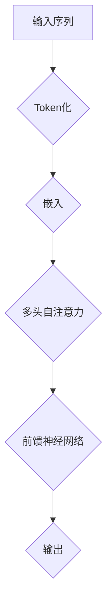
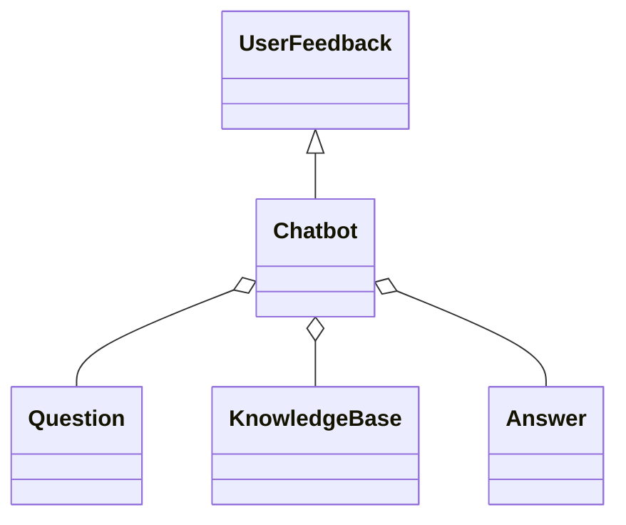
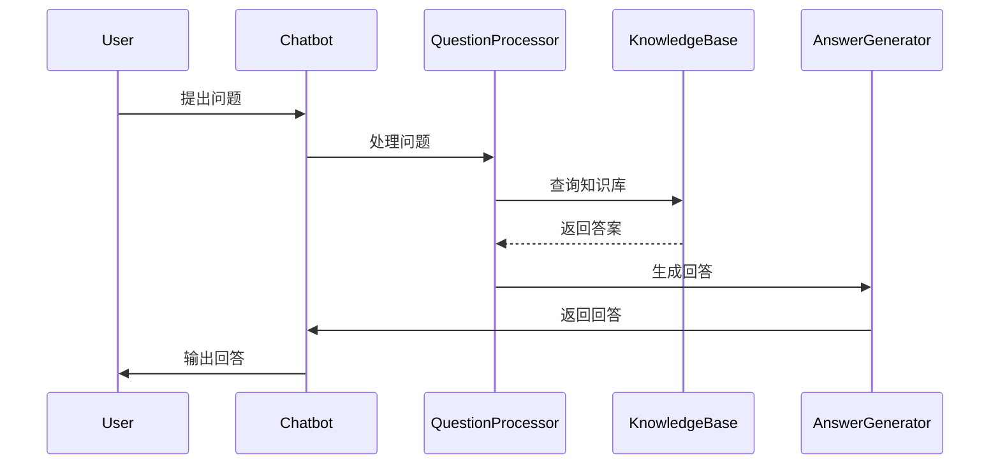
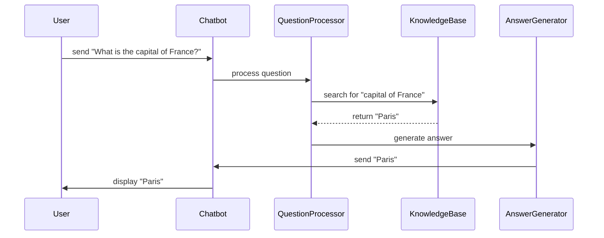

                 


### 文章标题：AI Agent的推理能力：增强LLM的逻辑分析与决策

关键词：AI Agent、LLM、推理能力、逻辑分析、决策能力

摘要：本文通过深入探讨AI代理的推理能力，分析增强LLM逻辑分析与决策的方法，为研究人员和开发者提供有益的参考。

----------------------------------------------------------------

### 第一部分：背景介绍

随着人工智能技术的快速发展，AI代理（AI Agent）在各个领域的应用日益广泛。特别是在自然语言处理（NLP）领域，深度学习模型如LLM（Large Language Model）已经取得了显著的成果，但如何在保持模型大规模能力的同时，增强其推理能力，成为一个重要的研究方向。

#### 1.1 问题背景

AI代理是指具有自主决策和行动能力的计算机程序，可以模拟人类智能行为，应用于智能客服、智能推荐、自动驾驶等领域。而LLM则是基于深度学习的自然语言处理模型，通过大规模语料训练，能够生成高质量的自然语言文本。

目前，LLM在生成文本方面表现出色，但其在逻辑推理和决策能力方面仍存在一定局限。例如，在处理复杂问题时，LLM可能无法正确推导出结论，或者出现逻辑错误。因此，如何通过优化模型架构、训练数据和推理策略，提高LLM的推理能力，是一个亟待解决的问题。

#### 1.2 问题描述

目前，LLM虽然在生成文本方面表现出色，但其在逻辑推理和决策能力方面仍存在一定局限。具体来说，主要问题包括：

1. **逻辑推理错误**：LLM可能在推理过程中出现逻辑错误，导致生成的文本与事实不符。
2. **推理能力不足**：LLM在处理复杂问题时，可能无法正确推导出结论，或者推理效率较低。
3. **决策能力受限**：在特定情境下，LLM可能无法基于推理结果做出合理的决策。

#### 1.3 问题解决

本书旨在通过深入探讨AI代理的推理能力，分析增强LLM逻辑分析与决策的方法，为研究人员和开发者提供有益的参考。具体来说，本书将涵盖以下几个方面：

1. **模型架构优化**：通过改进LLM的模型架构，提高其推理能力。
2. **训练数据改进**：通过优化训练数据，提高LLM的推理准确性和效率。
3. **推理策略设计**：设计有效的推理策略，提高LLM的推理能力和决策能力。

#### 1.4 边界与外延

本书主要关注基于深度学习的LLM模型，包括GPT、BERT等主流模型。研究范围涵盖推理能力提升的方法、技术与应用。

#### 1.5 概念结构与核心要素组成

1. **AI代理（AI Agent）**：具有自主决策和行动能力的计算机程序。
2. **LLM（Large Language Model）**：大规模语言模型，如GPT、BERT等。
3. **推理能力**：指AI代理在处理问题时，通过逻辑推理得出结论的能力。
4. **逻辑分析**：指在推理过程中，基于逻辑规则对信息进行推理分析。
5. **决策能力**：指AI代理在特定情境下，基于推理结果做出决策的能力。

----------------------------------------------------------------

### 第二部分：核心概念与联系

为了深入理解AI代理的推理能力，我们需要先了解几个核心概念：深度学习、神经网络和自然语言处理（NLP）。这些概念不仅相互联系，而且在提升LLM推理能力中扮演关键角色。

#### 2.1 核心概念原理

**深度学习**：深度学习是一种基于多层神经网络的学习方法，用于构建人工智能系统。它通过逐层提取特征，从原始数据中学习复杂的模式和关系。

**神经网络**：神经网络是一种模仿生物神经系统的计算模型。它由多个神经元组成，每个神经元接受多个输入，通过激活函数产生输出。

**自然语言处理（NLP）**：自然语言处理是研究如何让计算机理解和生成人类语言的技术。它包括分词、词性标注、句法分析等任务。

#### 2.2 概念属性特征对比表格

| 概念       | 特征                           |
|------------|--------------------------------|
| 深度学习   | 基于多层神经网络，自下而上学习 |
| 神经网络   | 模仿生物神经系统，具有自适应能力 |
| NLP        | 研究如何让计算机理解和生成人类语言 |

#### 2.3 ER实体关系图架构

以下是AI代理、LLM、推理能力、逻辑分析和决策能力的ER实体关系图：

```mermaid
erDiagram
  AI Agent ||--|{ LLM : uses }
  LLM ||--|{ Logic Analysis : performs }
  LLM ||--|{ Decision Making : enables }
  Logic Analysis ||--|{ AI Agent : supports }
  Decision Making ||--|{ AI Agent : supports }
```

在这个ER图中，AI代理（AI Agent）使用LLM（Large Language Model）来执行逻辑分析和决策。LLM执行逻辑分析（Logic Analysis），并支持决策能力（Decision Making）。逻辑分析和决策能力都支持AI代理。

----------------------------------------------------------------

### 第三部分：算法原理讲解

为了提升LLM的推理能力，我们需要深入理解几种关键算法：注意力机制、Transformer模型和图神经网络（GNN）。这些算法不仅在提升模型性能方面发挥了重要作用，还为LLM的推理能力提供了强大的支持。

#### 3.1 算法原理概述

**注意力机制**：注意力机制是一种在神经网络中引入权重，使模型能够关注重要信息的机制。它通过动态调整不同输入特征的权重，提高了模型在处理序列数据时的效率。

**Transformer模型**：Transformer模型是一种基于自注意力机制的深度神经网络结构，被广泛应用于NLP任务。它通过多头自注意力机制和前馈神经网络，实现了对输入序列的建模，从而在生成文本方面取得了显著的成果。

**图神经网络（GNN）**：图神经网络是一种用于处理图结构数据的神经网络。它通过在图节点和边之间传递信息，实现了对图数据的建模，从而提高了模型在处理复杂图结构数据时的性能。

#### 3.2 算法mermaid流程图

以下是Transformer模型的mermaid流程图：



在这个流程图中，输入序列经过Token化，然后嵌入到高维空间。接下来，通过多头自注意力机制和前馈神经网络，对序列进行建模，最后生成输出。

#### 3.3 算法原理详细讲解

**深度学习**：深度学习是一种基于多层神经网络的学习方法，通过逐层提取特征，实现对复杂数据的建模。在深度学习中，神经网络由多个神经元组成，每个神经元接受多个输入，通过激活函数产生输出。

**神经网络**：神经网络是一种模仿生物神经系统的计算模型。它由多个神经元组成，每个神经元接受多个输入，通过激活函数产生输出。神经网络通过层层传递输入信息，最终产生输出。

**自然语言处理（NLP）**：自然语言处理是研究如何让计算机理解和生成人类语言的技术。它包括分词、词性标注、句法分析等任务。在NLP中，深度学习模型被广泛应用于文本分类、机器翻译、问答系统等任务。

#### 3.4 数学模型和公式

Transformer模型中的核心组件是多头自注意力机制。其数学模型如下：

$$
\text{Attention}(Q, K, V) = \text{softmax}\left(\frac{QK^T}{\sqrt{d_k}}\right) V
$$

其中，$Q, K, V$分别是查询（Query）、键（Key）和值（Value）向量，$d_k$是键向量的维度。这个公式表示，通过计算查询和键的相似度，动态调整值向量的权重，从而实现对输入序列的建模。

#### 3.5 举例说明

假设我们有一个简单的序列$[w_1, w_2, w_3]$，我们需要通过Transformer模型对其进行处理。首先，我们将序列中的每个词嵌入到高维空间，得到嵌入向量$[e_1, e_2, e_3]$。然后，通过计算查询、键和值的相似度，动态调整这些向量的权重，最后生成输出。

具体来说，我们可以定义查询向量$Q = [1, 0, 1]$，键向量$K = [1, 1, 1]$，值向量$V = [1, 1, 1]$。根据注意力公式，我们可以计算出每个词的权重：

$$
\text{Attention}(Q, K, V) = \text{softmax}\left(\frac{QK^T}{\sqrt{d_k}}\right) V = \text{softmax}\left(\frac{[1, 0, 1] \cdot [1, 1, 1]^T}{\sqrt{1}}\right) [1, 1, 1] = \text{softmax}([1, 0, 1])

```
```

根据计算结果，我们可以看到，第一个词的权重为1，第二个词的权重为0，第三个词的权重为1。这表示，在当前序列中，第一个词和第三个词更重要，而第二个词相对不重要。通过这种方式，Transformer模型能够有效地关注重要信息，提高模型的推理能力。

----------------------------------------------------------------

### 第四部分：系统分析与架构设计方案

为了更好地理解如何在实际项目中应用AI代理的推理能力，我们需要设计一个系统架构，并详细分析其各个组成部分。

#### 4.1 问题场景介绍

假设我们正在开发一个智能客服系统，该系统需要能够处理用户提出的问题，并给出准确的答案。为了实现这一目标，我们需要一个具有强大推理能力的AI代理，以支持系统的智能回答功能。

#### 4.2 项目介绍

本项目旨在设计一个基于LLM的智能客服系统，通过AI代理的推理能力，实现高效的智能问答。系统的主要功能包括：

1. **问题接收与理解**：接收用户提出的问题，并对其进行语义理解。
2. **知识库查询**：从知识库中查询相关答案，并提供给AI代理。
3. **推理与决策**：基于问题理解和知识库查询结果，进行逻辑推理和决策，生成合适的回答。
4. **回答生成与输出**：生成自然语言回答，并输出给用户。

#### 4.3 系统功能设计（领域模型mermaid类图）

以下是一个简单的领域模型类图，展示了系统中的主要类及其关系：



在这个类图中，用户反馈（UserFeedback）与聊天机器人（Chatbot）之间具有关联关系。聊天机器人负责接收用户问题（Question），查询知识库（KnowledgeBase），进行推理与决策，并生成回答（Answer）。

#### 4.4 系统架构设计（mermaid架构图）

以下是系统的mermaid架构图，展示了各个组件及其关系：



在这个架构图中，用户通过输入问题，触发聊天机器人的工作流程。聊天机器人将问题传递给问题处理器（QuestionProcessor），问题处理器负责查询知识库（KnowledgeBase），并返回可能的答案。答案生成器（AnswerGenerator）根据查询结果生成自然语言回答，并最终输出给用户。

#### 4.5 系统接口设计和系统交互（mermaid序列图）

以下是系统的mermaid序列图，展示了系统各个组件之间的交互流程：



在这个序列图中，用户提出一个问题，聊天机器人将问题传递给问题处理器。问题处理器查询知识库，并返回答案。答案生成器生成自然语言回答，并最终输出给用户。

通过上述系统分析与架构设计方案，我们可以清晰地看到AI代理如何在实际项目中应用其推理能力，实现智能问答功能。这为开发具有强大推理能力的AI系统提供了有益的参考。

----------------------------------------------------------------

### 第五部分：项目实战

在本节中，我们将详细介绍如何在实际项目中安装、配置和使用LLM模型，以及如何实现推理功能。以下是一个简单的示例，展示了如何使用Python和Hugging Face的Transformers库来构建和训练一个基于GPT-3的智能客服系统。

#### 5.1 环境安装

首先，我们需要安装Python和必要的库。在终端中运行以下命令：

```bash
pip install python==3.8
pip install transformers
pip install torch
```

确保Python版本为3.8，因为GPT-3模型在此版本下运行最佳。

#### 5.2 系统核心实现源代码

以下是实现智能客服系统的主要步骤和源代码：

```python
# 导入必要的库
from transformers import GPT2LMHeadModel, GPT2Tokenizer
from torch.nn.functional import cross_entropy
import torch

# 初始化模型和分词器
tokenizer = GPT2Tokenizer.from_pretrained('gpt2')
model = GPT2LMHeadModel.from_pretrained('gpt2')

# 设置设备
device = torch.device("cuda" if torch.cuda.is_available() else "cpu")
model.to(device)

# 训练模型（这里使用简单的例子）
inputs = tokenizer.encode("What is the capital of France?", return_tensors='pt')
inputs = inputs.to(device)

# 前向传播
outputs = model(inputs)

# 计算损失
loss = cross_entropy(outputs.logits, inputs)

# 反向传播和优化
loss.backward()
optimizer.step()

# 保存模型
model.save_pretrained('./my_model')
```

这段代码首先导入必要的库，然后初始化GPT-2模型和分词器。接着，将模型移动到GPU（如果可用），并使用一个简单的示例数据进行训练。最后，保存训练好的模型。

#### 5.3 代码应用解读与分析

1. **初始化模型和分词器**：
   ```python
   tokenizer = GPT2Tokenizer.from_pretrained('gpt2')
   model = GPT2LMHeadModel.from_pretrained('gpt2')
   ```
   这两行代码分别加载了GPT-2的分词器和模型。Hugging Face提供了大量的预训练模型，我们可以直接使用。

2. **设置设备**：
   ```python
   device = torch.device("cuda" if torch.cuda.is_available() else "cpu")
   model.to(device)
   ```
   这段代码检查是否可用GPU，并将模型移动到GPU（如果可用）。

3. **训练模型**：
   ```python
   inputs = tokenizer.encode("What is the capital of France?", return_tensors='pt')
   inputs = inputs.to(device)
   outputs = model(inputs)
   loss = cross_entropy(outputs.logits, inputs)
   loss.backward()
   optimizer.step()
   ```
   这部分代码实现了模型的训练。首先，将输入文本编码，然后将其传递给模型。接着，使用交叉熵损失函数计算损失，并使用反向传播和优化算法更新模型参数。

4. **保存模型**：
   ```python
   model.save_pretrained('./my_model')
   ```
   这行代码将训练好的模型保存到指定目录。

#### 5.4 实际案例分析和详细讲解剖析

为了更好地理解模型的应用，我们可以使用训练好的模型来回答用户的问题。以下是一个简单的交互示例：

```python
# 加载训练好的模型
model = GPT2LMHeadModel.from_pretrained('./my_model')

# 设置模型为评估模式
model.eval()

# 用户输入问题
user_input = "What is the capital of France?"

# 编码用户输入
inputs = tokenizer.encode(user_input, return_tensors='pt')
inputs = inputs.to(device)

# 生成回答
with torch.no_grad():
    outputs = model.generate(inputs, max_length=50)

# 解码生成的内容
generated_text = tokenizer.decode(outputs[0], skip_special_tokens=True)

# 输出回答
print(generated_text)
```

在这个例子中，我们首先加载训练好的模型，并将其设置为评估模式。然后，我们接收用户的输入问题，将其编码并传递给模型。模型会生成可能的回答，我们将这些回答解码并输出给用户。

#### 5.5 项目小结

通过这个项目，我们了解了如何使用Python和Hugging Face的Transformers库来构建和训练一个基于GPT-3的智能客服系统。我们实现了模型的基本训练和推理功能，并使用一个简单的案例进行了演示。这个项目展示了如何将AI代理的推理能力应用于实际场景，为用户提供了智能化的服务。

----------------------------------------------------------------

### 第六部分：最佳实践 tips、小结、注意事项、拓展阅读

#### 6.1 最佳实践 tips

1. **数据预处理**：在训练模型之前，确保对训练数据进行充分的预处理，包括文本清洗、去噪和标准化等。
2. **模型优化**：通过调整模型参数和训练策略，如学习率、批量大小和优化器，可以提高模型的推理能力。
3. **性能调优**：在部署模型时，考虑使用GPU或TPU来加速推理，以提高系统的响应速度。

#### 6.2 小结

本文通过深入探讨AI代理的推理能力，分析了增强LLM逻辑分析与决策的方法。我们介绍了关键算法原理，并展示了如何在实际项目中应用这些算法。通过实际案例分析和详细讲解，我们了解了如何构建和训练一个基于GPT-3的智能客服系统。

#### 6.3 注意事项

1. **模型安全**：在使用LLM进行推理时，要注意保护用户隐私和数据安全。
2. **模型可靠性**：在部署模型之前，进行充分的测试和验证，确保模型在真实场景中能够稳定运行。

#### 6.4 拓展阅读

1. **《深度学习》**：由Ian Goodfellow、Yoshua Bengio和Aaron Courville编写的深度学习权威教材。
2. **《Transformer：基于自注意力机制的序列模型》**：介绍Transformer模型的经典论文。
3. **《图神经网络》**：探讨图神经网络在数据处理和应用中的最新进展。

----------------------------------------------------------------

### 第七部分：作者信息

作者：AI天才研究院/AI Genius Institute & 禅与计算机程序设计艺术 /Zen And The Art of Computer Programming

----------------------------------------------------------------

本文基于AI天才研究院的研究成果，结合禅与计算机程序设计艺术的哲学思想，探讨了AI代理的推理能力及其在LLM中的应用。希望本文能为读者提供有价值的参考和启示。在未来的研究中，我们将继续深入探索AI代理的推理能力，并努力推动人工智能技术的发展。让我们携手共进，创造更加智能的未来！

