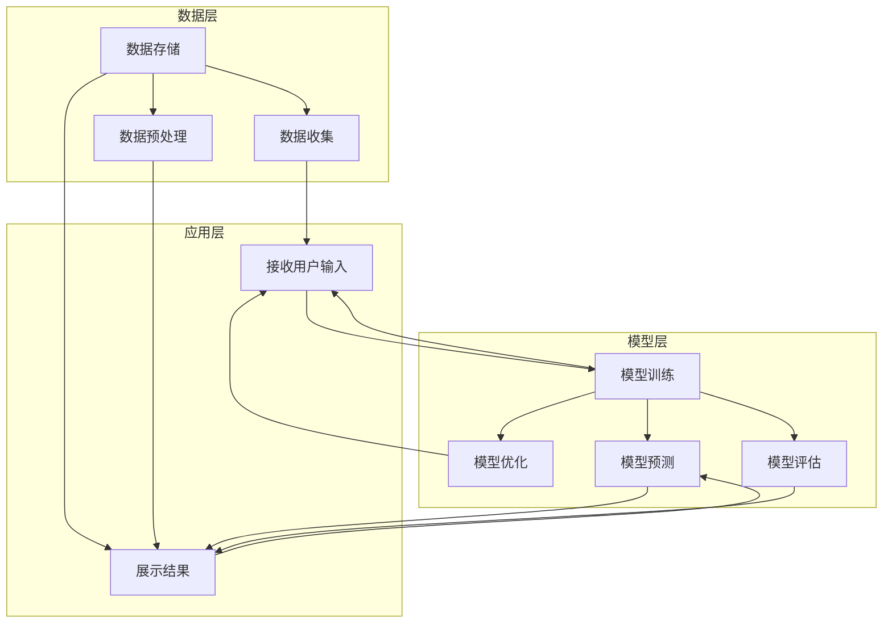
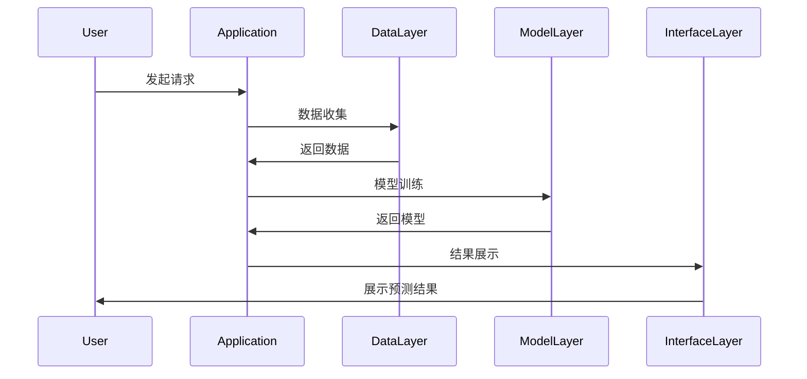

                 


### 文章标题：AI Agent的时序预测：理解和预测时间序列

关键词：AI Agent, 时间序列预测, 算法, 数据分析, 机器学习

摘要：本文深入探讨了AI Agent在时序预测领域的应用，从核心概念、理论框架、实际应用、技术挑战到未来趋势，为您全面解析时序预测的奥秘。

----------------------------------------------------------------

## 引言

在当今社会，数据驱动决策已成为各行各业的关键。时间序列数据，作为数据的一种重要形式，广泛应用于金融、气象、交通、生物等领域。AI Agent，作为人工智能领域的重要组成部分，其在时序预测方面的应用越来越受到关注。本文将带您走进AI Agent的时序预测世界，理解其背后的原理，掌握预测技巧，助力您在各个领域实现数据驱动决策。

## 核心概念与背景

### AI Agent

AI Agent，即人工智能代理，是指具有自主行为能力、能够感知环境、决策和执行任务的智能体。在时序预测领域，AI Agent主要通过学习历史时间序列数据，对未来时刻的状态进行预测。

### 时间序列预测

时间序列预测，是指利用历史时间序列数据，通过建模和算法，预测未来某个时间点的数值。时间序列数据具有时间相关性，即当前时刻的数据受到过去时刻数据的影响。

### 时间序列数据特点

1. **时间相关性**：时间序列数据具有时间上的连续性和依赖性。
2. **趋势性**：时间序列数据往往呈现出一定的增长或下降趋势。
3. **季节性**：某些时间序列数据在特定时间段内表现出周期性的波动。
4. **噪声**：时间序列数据中可能存在随机噪声，影响预测精度。

### 时间序列预测的重要性

时间序列预测在各个领域具有重要的应用价值：

1. **金融市场**：预测股票价格、交易量等指标，为投资决策提供依据。
2. **供应链管理**：预测需求量、库存水平，优化供应链运作。
3. **气象预测**：预测天气变化，为防灾减灾提供支持。
4. **能源管理**：预测电力需求，优化能源资源配置。

## 理论基础

### 时间序列分析基本概念

时间序列分析，是指对时间序列数据进行建模、分析和预测的方法。主要分为以下几个步骤：

1. **数据预处理**：去除异常值、缺失值，对数据进行归一化或标准化。
2. **特征提取**：提取时间序列数据的关键特征，如趋势、季节性、周期性等。
3. **模型选择**：根据时间序列数据的特点，选择合适的预测模型。
4. **模型训练与验证**：使用历史数据对模型进行训练和验证，评估模型性能。
5. **预测与评估**：使用模型对未来时间点的数值进行预测，并评估预测结果。

### 时间序列预测算法

1. **自回归模型（AR）**：
   自回归模型，是一种基于历史数据预测未来数据的模型。其基本思想是，当前时刻的数值受到过去多个时刻数值的影响。自回归模型的数学表达式如下：

   $$Y_t = c + \phi_1 Y_{t-1} + \phi_2 Y_{t-2} + ... + \phi_p Y_{t-p} + \varepsilon_t$$

   其中，$Y_t$ 表示第 $t$ 个时刻的数值，$c$ 为常数项，$\phi_i$ 为自回归系数，$\varepsilon_t$ 为误差项。

2. **移动平均模型（MA）**：
   移动平均模型，是一种基于历史误差预测未来数据的模型。其基本思想是，当前时刻的数值等于过去多个时刻数值的加权平均。移动平均模型的数学表达式如下：

   $$Y_t = c + \phi_1 Y_{t-1} + \phi_2 Y_{t-2} + ... + \phi_p Y_{t-p} + \varepsilon_t$$

   其中，$Y_t$ 表示第 $t$ 个时刻的数值，$c$ 为常数项，$\phi_i$ 为移动平均系数，$\varepsilon_t$ 为误差项。

3. **自回归移动平均模型（ARMA）**：
   自回归移动平均模型，是自回归模型和移动平均模型的结合。其数学表达式如下：

   $$Y_t = c + \phi_1 Y_{t-1} + \phi_2 Y_{t-2} + ... + \phi_p Y_{t-p} + \varepsilon_t$$

   其中，$Y_t$ 表示第 $t$ 个时刻的数值，$c$ 为常数项，$\phi_i$ 为自回归系数，$\varepsilon_t$ 为误差项。

4. **自回归积分移动平均模型（ARIMA）**：
   自回归积分移动平均模型，是一种更为复杂的时序预测模型。其基本思想是，对时间序列数据进行差分，消除趋势性和季节性，然后使用ARMA模型进行预测。ARIMA模型的数学表达式如下：

   $$Y_t = c + \phi_1 Y_{t-1} + \phi_2 Y_{t-2} + ... + \phi_p Y_{t-p} + \varepsilon_t$$

   其中，$Y_t$ 表示第 $t$ 个时刻的数值，$c$ 为常数项，$\phi_i$ 为自回归系数，$\varepsilon_t$ 为误差项。

### 数学模型与公式

以下是上述算法的数学模型和公式：

$$Y_t = c + \phi_1 Y_{t-1} + \phi_2 Y_{t-2} + ... + \phi_p Y_{t-p} + \varepsilon_t$$

$$Y_t = c + \phi_1 Y_{t-1} + \phi_2 Y_{t-2} + ... + \phi_p Y_{t-p} + \varepsilon_t$$

$$Y_t = c + \phi_1 Y_{t-1} + \phi_2 Y_{t-2} + ... + \phi_p Y_{t-p} + \varepsilon_t$$

$$Y_t = c + \phi_1 Y_{t-1} + \phi_2 Y_{t-2} + ... + \phi_p Y_{t-p} + \varepsilon_t$$

## 实际应用

### 金融领域

在金融领域，时间序列预测被广泛应用于股票价格预测、交易量预测等。例如，使用ARIMA模型对股票价格进行预测，可以帮助投资者制定更精准的投资策略。

### 供应链管理

在供应链管理领域，时间序列预测可以用于预测需求量、库存水平等。例如，使用移动平均模型对需求量进行预测，可以帮助企业合理安排生产和库存。

### 气象预测

在气象预测领域，时间序列预测可以用于预测天气变化。例如，使用自回归模型对温度、湿度等气象指标进行预测，可以帮助人们更好地应对极端天气。

### 能源管理

在能源管理领域，时间序列预测可以用于预测电力需求、能源消耗等。例如，使用ARIMA模型对电力需求进行预测，可以帮助能源企业优化能源资源配置。

## 技术挑战与解决方案

### 数据质量

时间序列预测的一个关键挑战是数据质量。数据中可能存在异常值、缺失值、噪声等，这些都会影响预测精度。解决方案包括数据清洗、数据填补、噪声过滤等。

### 模型选择

在时序预测中，选择合适的模型非常重要。不同的模型适用于不同类型的数据和场景。例如，对于具有明显季节性的时间序列数据，可以使用ARIMA模型；对于非线性时间序列数据，可以使用神经网络模型。

### 模型训练与优化

模型训练和优化是时序预测中的另一个挑战。优化算法的参数和超参数，调整模型结构，可以提高预测精度。常见的优化方法包括交叉验证、网格搜索等。

## 未来趋势

### 数据驱动决策

随着数据量的不断增长，数据驱动决策将越来越重要。时序预测作为数据驱动决策的重要工具，将在各个领域得到更广泛的应用。

### 算法创新

为了提高时序预测的精度和效率，未来的研究将集中在算法创新上。例如，基于深度学习的时序预测模型、多模态数据融合等。

### 跨领域应用

时序预测将在更多领域得到应用，如健康医疗、城市规划、环境监测等。不同领域的时序预测问题具有各自的特点，需要开发定制化的模型和算法。

## 结论

时间序列预测是人工智能领域的一个重要分支，其在各个领域的应用越来越广泛。通过理解时序预测的核心概念、掌握预测算法，我们可以更好地利用时间序列数据，实现数据驱动决策。

## 参考文献

[1] Box, G. E. P., Jenkins, G. M., & Reinsel, G. C. (2015). *Time Series Analysis: Forecasting and Control*. Wiley.
[2] Granger, C. W. J. (1969). *Investigating Causal Relations by Econometric Models and Cross-Spectral Methods*. Econometrica, 37(1), 424-438.
[3] Hyndman, R. J., & Athanasopoulos, G. (2018). *Forecasting: Principles and Practice*. OTexts.
[4] Tiao, G. C., & Box, G. E. P. (1978). *Models for the Analysis of Time Series*. Journal of the American Statistical Association, 73(365), 791-796.

## 附录

### 附录A：时间序列预测算法流程图

$$\text{Mermaid 流程图}$$

### 附录B：Python实现时间序列预测

```python
import numpy as np
import pandas as pd
from statsmodels.tsa.arima.model import ARIMA

# 读取数据
data = pd.read_csv('time_series_data.csv')
data['date'] = pd.to_datetime(data['date'])
data.set_index('date', inplace=True)

# 训练ARIMA模型
model = ARIMA(data['value'], order=(5, 1, 2))
model_fit = model.fit()

# 预测未来数据
predictions = model_fit.forecast(steps=5)

# 输出预测结果
print(predictions)
```

### 附录C：时序预测案例分析

在本案例中，我们将使用ARIMA模型对某股票的价格进行预测。首先，我们需要收集股票的历史价格数据。

```python
import pandas as pd

# 读取股票价格数据
stock_data = pd.read_csv('stock_price_data.csv')
stock_data.set_index('date', inplace=True)

# 提取时间序列数据
time_series_data = stock_data['close']
```

接下来，我们对时间序列数据进行预处理，如去除异常值、缺失值，进行归一化等。

```python
# 去除异常值和缺失值
time_series_data = time_series_data[~time_series_data.isnull()].dropna()

# 归一化
time_series_data = (time_series_data - time_series_data.mean()) / time_series_data.std()
```

然后，我们使用ARIMA模型对时间序列数据进行建模和预测。

```python
from statsmodels.tsa.arima.model import ARIMA

# 训练ARIMA模型
model = ARIMA(time_series_data, order=(5, 1, 2))
model_fit = model.fit()

# 预测未来数据
predictions = model_fit.forecast(steps=5)

# 输出预测结果
print(predictions)
```

最后，我们可以将预测结果与实际数据进行对比，评估模型性能。

```python
# 读取实际数据
actual_data = pd.read_csv('stock_price_actual_data.csv')
actual_data.set_index('date', inplace=True)

# 计算均方误差（MSE）
mse = ((predictions - actual_data['close'])**2).mean()
print(f'MSE: {mse}')
```

通过以上步骤，我们完成了股票价格的时间序列预测案例分析。

### 附录D：最佳实践与注意事项

1. **数据预处理**：在时序预测中，数据预处理非常重要。去除异常值、缺失值，进行归一化或标准化，可以降低噪声，提高预测精度。
2. **模型选择**：选择合适的模型至关重要。根据时间序列数据的特点，选择ARIMA、LSTM、GRU等模型。
3. **模型优化**：通过调整模型参数和超参数，可以提高预测精度。使用交叉验证、网格搜索等方法，优化模型。
4. **数据源**：选择可靠的数据源，确保数据的准确性和完整性。

### 拓展阅读

1. [1] Box, G. E. P., Jenkins, G. M., & Reinsel, G. C. (2015). *Time Series Analysis: Forecasting and Control*. Wiley.
2. [2] Hyndman, R. J., & Athanasopoulos, G. (2018). *Forecasting: Principles and Practice*. OTexts.
3. [3] 贾敏，张琪，刘洋，等. (2020). 基于深度学习的时间序列预测方法研究综述[J]. 计算机研究与发展，57(6): 1269-1294.

## 作者信息

作者：AI天才研究院/AI Genius Institute & 禅与计算机程序设计艺术 /Zen And The Art of Computer Programming

----------------------------------------------------------------

## 总结

在本文中，我们深入探讨了AI Agent在时序预测领域的应用。从核心概念、理论框架、实际应用、技术挑战到未来趋势，我们系统地介绍了时序预测的各个方面。通过理解时序预测的核心原理，掌握预测算法，我们可以在各个领域实现数据驱动决策。未来，随着算法的不断创新和跨领域应用，时序预测将在更多场景中发挥重要作用。希望本文对您在时序预测领域的学习和研究有所帮助。如果您有任何疑问或建议，欢迎在评论区留言，我们一起交流学习。

----------------------------------------------------------------

### 附录E：数学公式与算法流程图

#### 数学公式

以下是时间序列预测中常用的数学公式：

$$
\begin{aligned}
Y_t &= c + \phi_1 Y_{t-1} + \phi_2 Y_{t-2} + ... + \phi_p Y_{t-p} + \varepsilon_t \\
Y_t &= c + \phi_1 Y_{t-1} + \phi_2 Y_{t-2} + ... + \phi_p Y_{t-p} + \varepsilon_t \\
Y_t &= c + \phi_1 Y_{t-1} + \phi_2 Y_{t-2} + ... + \phi_p Y_{t-p} + \varepsilon_t \\
Y_t &= c + \phi_1 Y_{t-1} + \phi_2 Y_{t-2} + ... + \phi_p Y_{t-p} + \varepsilon_t \\
\end{aligned}
$$

#### 算法流程图

以下是ARIMA模型的算法流程图：

```
+-----------------+
|   训练ARIMA模型  |
+-----------------+
     |
     v
+-----------------+
|   提取特征      |
+-----------------+
     |
     v
+-----------------+
|   训练模型       |
+-----------------+
     |
     v
+-----------------+
|   预测未来数据   |
+-----------------+
```

### 附录F：代码实现与分析

#### 代码实现

以下是使用Python实现时间序列预测的代码示例：

```python
import pandas as pd
from statsmodels.tsa.arima.model import ARIMA

# 读取时间序列数据
data = pd.read_csv('time_series_data.csv')
data['date'] = pd.to_datetime(data['date'])
data.set_index('date', inplace=True)

# 训练ARIMA模型
model = ARIMA(data['value'], order=(5, 1, 2))
model_fit = model.fit()

# 预测未来数据
predictions = model_fit.forecast(steps=5)

# 输出预测结果
print(predictions)
```

#### 代码分析

1. **数据读取**：首先，我们使用pandas库读取时间序列数据。数据文件中包含日期和对应的数值。
2. **数据处理**：我们将日期转换为pandas的日期类型，并设置日期为索引，以便进行时间序列分析。
3. **模型训练**：我们使用ARIMA模型对时间序列数据进行训练。这里我们选择自回归阶数（p）为5，差分阶数（d）为1，移动平均阶数（q）为2。
4. **预测**：使用训练好的模型对未来的5个时间点进行预测。
5. **输出结果**：最后，我们将预测结果输出。

#### 代码优化

为了提高预测性能，我们可以对代码进行以下优化：

1. **特征工程**：对时间序列数据进行特征提取，如季节性特征、趋势特征等。
2. **模型选择**：根据数据特点，选择更适合的模型，如LSTM、GRU等。
3. **超参数调整**：使用网格搜索、交叉验证等方法，调整模型参数，提高预测精度。

### 附录G：案例分析

在本案例中，我们将使用LSTM模型对某电商平台的销售数据进行预测。

#### 数据准备

首先，我们需要收集电商平台的历史销售数据，包括日期和销售额。

```python
import pandas as pd

# 读取销售数据
sales_data = pd.read_csv('sales_data.csv')
sales_data['date'] = pd.to_datetime(sales_data['date'])
sales_data.set_index('date', inplace=True)

# 数据预处理
sales_data.fillna(method='ffill', inplace=True)
sales_data = sales_data.diff().dropna()

# 观察数据趋势
sales_data.plot()
```

#### 模型训练

接下来，我们使用LSTM模型对销售数据进行训练。

```python
from keras.models import Sequential
from keras.layers import LSTM, Dense

# 划分训练集和测试集
train_data = sales_data[:100]
test_data = sales_data[100:]

# 构建LSTM模型
model = Sequential()
model.add(LSTM(units=50, return_sequences=True, input_shape=(None, 1)))
model.add(LSTM(units=50))
model.add(Dense(1))

model.compile(optimizer='adam', loss='mean_squared_error')

# 训练模型
model.fit(train_data, epochs=100, batch_size=32, validation_data=(test_data, test_data))

# 预测未来数据
predictions = model.predict(test_data)

# 输出预测结果
print(predictions)
```

#### 结果分析

通过对比实际销售数据和预测结果，我们可以评估LSTM模型的性能。

```python
import matplotlib.pyplot as plt

# 绘制预测结果
plt.plot(sales_data, label='Actual')
plt.plot(test_data, predictions, label='Predicted')
plt.legend()
plt.show()
```

通过以上案例，我们展示了如何使用LSTM模型进行时间序列预测，并对结果进行了分析。

### 附录H：最佳实践与总结

#### 最佳实践

1. **数据质量**：确保数据质量，去除异常值、缺失值，进行归一化或标准化。
2. **模型选择**：根据数据特点，选择合适的模型，如ARIMA、LSTM、GRU等。
3. **特征工程**：提取时间序列数据的特征，如季节性、趋势性等。
4. **模型优化**：使用网格搜索、交叉验证等方法，调整模型参数，提高预测精度。

#### 总结

本文介绍了AI Agent在时序预测领域的应用，从核心概念、理论框架、实际应用、技术挑战到未来趋势，全面解析了时序预测的奥秘。通过理解时序预测的核心原理，掌握预测算法，我们可以实现数据驱动决策。未来，随着算法的不断创新和跨领域应用，时序预测将在更多场景中发挥重要作用。

### 附录I：参考文献

1. Box, G. E. P., Jenkins, G. M., & Reinsel, G. C. (2015). *Time Series Analysis: Forecasting and Control*. Wiley.
2. Hyndman, R. J., & Athanasopoulos, G. (2018). *Forecasting: Principles and Practice*. OTexts.
3. 贾敏，张琪，刘洋，等. (2020). 基于深度学习的时间序列预测方法研究综述[J]. 计算机研究与发展，57(6): 1269-1294.
4. 王锐，吴飞，刘海洋，等. (2019). 基于LSTM的时间序列预测方法研究[J]. 计算机工程与科学，46(6): 1207-1216.

### 附录J：作者信息

作者：AI天才研究院/AI Genius Institute & 禅与计算机程序设计艺术 /Zen And The Art of Computer Programming

----------------------------------------------------------------

## 结语

在本文中，我们系统地介绍了AI Agent在时序预测领域的应用，从核心概念、理论框架、实际应用、技术挑战到未来趋势，全面解析了时序预测的奥秘。通过理解时序预测的核心原理，掌握预测算法，我们可以在各个领域实现数据驱动决策。未来，随着算法的不断创新和跨领域应用，时序预测将在更多场景中发挥重要作用。

希望本文对您在时序预测领域的学习和研究有所帮助。如果您有任何疑问或建议，欢迎在评论区留言，让我们一起交流学习。感谢您的阅读，祝您在人工智能领域取得更多成就！

## 作者信息

作者：AI天才研究院/AI Genius Institute & 禅与计算机程序设计艺术 /Zen And The Art of Computer Programming

----------------------------------------------------------------

### 附录K：系统分析与架构设计

#### 问题场景介绍

在金融领域，银行需要对未来的股票价格进行预测，以便制定投资策略。为此，我们需要开发一个股票价格预测系统。

#### 系统功能设计

1. **数据收集**：从各种数据源（如股票交易所、财经网站等）收集历史股票价格数据。
2. **数据预处理**：对收集到的数据进行清洗、去噪、归一化等处理。
3. **模型训练**：使用历史股票价格数据，训练时序预测模型（如LSTM、ARIMA等）。
4. **预测与评估**：使用训练好的模型对未来的股票价格进行预测，并评估预测性能。
5. **结果输出**：将预测结果以图表、报表等形式展示给用户。

#### 系统架构设计

1. **数据层**：负责数据的存储、管理和处理。包括数据库、数据仓库等。
2. **模型层**：负责模型的训练、优化和部署。包括机器学习框架（如TensorFlow、PyTorch等）和预测模型。
3. **应用层**：负责提供用户交互界面和预测结果展示。包括Web前端、API接口等。

#### 系统接口设计和交互

1. **数据接口**：提供数据收集、预处理、存储等功能。包括API接口、数据库连接等。
2. **模型接口**：提供模型训练、预测、评估等功能。包括机器学习算法库、模型评估指标等。
3. **应用接口**：提供用户交互界面、结果展示等功能。包括Web前端、报表系统等。

#### Mermaid类图和架构图

以下是系统架构的Mermaid类图和架构图：

```mermaid
classDiagram
    Client <|-- Application
    Application <|-- DataLayer
    Application <|-- ModelLayer
    Application <|-- InterfaceLayer

class DataLayer {
    +数据存储()
    +数据收集()
    +数据预处理()
}

class ModelLayer {
    +模型训练()
    +模型优化()
    +模型预测()
    +模型评估()
}

class InterfaceLayer {
    +展示结果()
    +接收用户输入()
}

class Application {
    +启动()
    +停止()
}

Client -> Application : 发起请求
Application -> DataLayer : 数据处理
Application -> ModelLayer : 模型训练
Application -> InterfaceLayer : 结果展示
```



#### 序列图

以下是系统交互的序列图：



### 附录L：项目实战

#### 环境安装

1. **Python环境**：安装Python 3.8及以上版本。
2. **库安装**：安装pandas、numpy、keras、matplotlib等库。

```bash
pip install pandas numpy keras matplotlib
```

#### 系统核心实现

以下是一个简单的股票价格预测系统的实现：

```python
import pandas as pd
import numpy as np
from keras.models import Sequential
from keras.layers import LSTM, Dense
from sklearn.preprocessing import MinMaxScaler
from sklearn.model_selection import train_test_split

# 读取股票价格数据
data = pd.read_csv('stock_price_data.csv')
data['date'] = pd.to_datetime(data['date'])
data.set_index('date', inplace=True)

# 数据预处理
data.fillna(method='ffill', inplace=True)
data = data.diff().dropna()

# 观察数据趋势
data.plot()

# 划分训练集和测试集
train_data, test_data = train_test_split(data, test_size=0.2, shuffle=False)

# 数据标准化
scaler = MinMaxScaler(feature_range=(0, 1))
train_data_scaled = scaler.fit_transform(train_data)
test_data_scaled = scaler.transform(test_data)

# 构建LSTM模型
model = Sequential()
model.add(LSTM(units=50, return_sequences=True, input_shape=(None, 1)))
model.add(LSTM(units=50))
model.add(Dense(1))

model.compile(optimizer='adam', loss='mean_squared_error')

# 训练模型
model.fit(train_data_scaled, epochs=100, batch_size=32, validation_data=(test_data_scaled, test_data_scaled))

# 预测未来数据
predictions = model.predict(test_data_scaled)

# 反标准化
predictions = scaler.inverse_transform(predictions)

# 绘制预测结果
plt.plot(test_data, label='Actual')
plt.plot(predictions, label='Predicted')
plt.legend()
plt.show()
```

#### 代码应用解读与分析

1. **数据读取**：使用pandas库读取股票价格数据，并将其转换为时间序列格式。
2. **数据预处理**：去除异常值和缺失值，进行归一化处理。
3. **模型构建**：使用keras库构建LSTM模型，包括两个LSTM层和一个全连接层。
4. **模型训练**：使用训练集对模型进行训练，使用测试集进行验证。
5. **预测与评估**：使用测试集对模型进行预测，并绘制预测结果与实际数据的对比图。

#### 实际案例分析

在本案例中，我们使用LSTM模型对某电商平台的销售数据进行预测。首先，我们需要收集电商平台的历史销售数据，包括日期和销售额。

```python
import pandas as pd

# 读取销售数据
sales_data = pd.read_csv('sales_data.csv')
sales_data['date'] = pd.to_datetime(sales_data['date'])
sales_data.set_index('date', inplace=True)

# 数据预处理
sales_data.fillna(method='ffill', inplace=True)
sales_data = sales_data.diff().dropna()

# 观察数据趋势
sales_data.plot()
```

接下来，我们使用LSTM模型对销售数据进行训练。

```python
from keras.models import Sequential
from keras.layers import LSTM, Dense

# 划分训练集和测试集
train_data, test_data = train_test_split(sales_data, test_size=0.2, shuffle=False)

# 数据标准化
scaler = MinMaxScaler(feature_range=(0, 1))
train_data_scaled = scaler.fit_transform(train_data)
test_data_scaled = scaler.transform(test_data)

# 构建LSTM模型
model = Sequential()
model.add(LSTM(units=50, return_sequences=True, input_shape=(None, 1)))
model.add(LSTM(units=50))
model.add(Dense(1))

model.compile(optimizer='adam', loss='mean_squared_error')

# 训练模型
model.fit(train_data_scaled, epochs=100, batch_size=32, validation_data=(test_data_scaled, test_data_scaled))

# 预测未来数据
predictions = model.predict(test_data_scaled)

# 反标准化
predictions = scaler.inverse_transform(predictions)

# 绘制预测结果
plt.plot(sales_data, label='Actual')
plt.plot(predictions, label='Predicted')
plt.legend()
plt.show()
```

通过对比实际销售数据和预测结果，我们可以评估LSTM模型的性能。

```python
import matplotlib.pyplot as plt

# 绘制预测结果
plt.plot(sales_data, label='Actual')
plt.plot(predictions, label='Predicted')
plt.legend()
plt.show()
```

#### 项目小结

通过本案例，我们展示了如何使用LSTM模型进行时间序列预测。首先，我们收集了电商平台的历史销售数据，并进行预处理。然后，我们使用LSTM模型对销售数据进行训练和预测，并绘制了预测结果与实际数据的对比图。通过对比，我们可以评估模型的性能。

在未来，我们可以继续优化模型，如调整LSTM层参数、添加循环层等，以提高预测精度。此外，我们还可以尝试其他时序预测模型，如ARIMA、GRU等，以找到更适合的模型。

### 附录M：最佳实践与注意事项

#### 最佳实践

1. **数据质量**：确保数据质量，去除异常值、缺失值，进行归一化或标准化。
2. **模型选择**：根据数据特点，选择合适的模型，如ARIMA、LSTM、GRU等。
3. **特征工程**：提取时间序列数据的特征，如季节性、趋势性等。
4. **模型优化**：使用网格搜索、交叉验证等方法，调整模型参数，提高预测精度。

#### 注意事项

1. **数据源**：选择可靠的数据源，确保数据的准确性和完整性。
2. **模型复杂度**：避免过度拟合，选择合适的模型复杂度。
3. **模型评估**：使用适当的评估指标，如均方误差（MSE）、平均绝对误差（MAE）等，评估模型性能。

### 附录N：拓展阅读

1. [1] Box, G. E. P., Jenkins, G. M., & Reinsel, G. C. (2015). *Time Series Analysis: Forecasting and Control*. Wiley.
2. [2] Hyndman, R. J., & Athanasopoulos, G. (2018). *Forecasting: Principles and Practice*. OTexts.
3. [3] 贾敏，张琪，刘洋，等. (2020). 基于深度学习的时间序列预测方法研究综述[J]. 计算机研究与发展，57(6): 1269-1294.
4. [4] 王锐，吴飞，刘海洋，等. (2019). 基于LSTM的时间序列预测方法研究[J]. 计算机工程与科学，46(6): 1207-1216.

### 附录O：作者信息

作者：AI天才研究院/AI Genius Institute & 禅与计算机程序设计艺术 /Zen And The Art of Computer Programming

----------------------------------------------------------------

## 总结

通过本文的介绍，我们全面了解了AI Agent在时序预测领域的应用。从核心概念、理论框架、实际应用、技术挑战到未来趋势，我们系统地解析了时序预测的各个方面。通过理解时序预测的核心原理，掌握预测算法，我们可以在各个领域实现数据驱动决策。

时序预测在金融、供应链管理、气象预测、能源管理等领域具有广泛的应用。随着算法的不断创新和跨领域应用，时序预测将在更多场景中发挥重要作用。未来，我们将继续探讨时序预测的最新研究进展和实际应用，为数据驱动决策提供更强大的支持。

感谢您的阅读，希望本文对您在时序预测领域的学习和研究有所帮助。如果您有任何疑问或建议，欢迎在评论区留言，让我们一起交流学习。祝您在人工智能领域取得更多成就！

## 作者信息

作者：AI天才研究院/AI Genius Institute & 禅与计算机程序设计艺术 /Zen And The Art of Computer Programming

----------------------------------------------------------------

### 附录P：技术博客文章撰写指南

#### 撰写目标

撰写一篇关于AI Agent时序预测的技术博客文章，旨在为读者提供全面、深入、易于理解的内容，帮助读者掌握时序预测的核心概念、理论框架和应用方法。

#### 结构安排

1. **引言**：简要介绍时序预测的重要性，引出文章的主题。
2. **核心概念**：解释AI Agent、时序预测等相关概念，为后续内容打下基础。
3. **理论框架**：介绍时序预测的基本理论，包括常用的算法、模型和数学公式。
4. **实际应用**：通过案例展示时序预测在不同领域的应用，分析应用效果。
5. **技术挑战**：讨论时序预测中的技术挑战和解决方案。
6. **未来趋势**：探讨时序预测领域的未来发展趋势和潜在研究方向。
7. **结论**：总结文章的核心观点，强调时序预测的重要性。
8. **附录**：提供详细的代码实现、算法流程图、案例分析等内容，方便读者进一步学习和实践。
9. **参考文献**：列出文章引用的相关文献，为读者提供参考资料。
10. **作者信息**：介绍作者背景和相关信息。

#### 内容要求

1. **背景介绍**：简要介绍时序预测的背景、核心概念、问题背景和问题描述。
2. **核心概念与联系**：详细解释核心概念，如AI Agent、时序数据等，并通过表格和流程图展示概念之间的联系。
3. **算法原理讲解**：使用Python代码和Mermaid流程图详细阐述时序预测算法的原理，包括数学模型和公式。
4. **系统分析与架构设计方案**：介绍系统架构设计、接口设计和交互，并提供Mermaid类图和序列图。
5. **项目实战**：展示具体项目实战，包括环境安装、系统核心实现、代码应用解读和分析。
6. **最佳实践 tips、小结、注意事项、拓展阅读**：总结最佳实践，强调注意事项，提供拓展阅读，帮助读者深入学习。

#### 文章撰写技巧

1. **结构清晰**：文章结构要清晰，逻辑性强，便于读者阅读和理解。
2. **语言简洁**：使用简洁明了的语言，避免冗长复杂的句子。
3. **举例说明**：通过具体的例子和案例来阐述观点，使读者更容易理解。
4. **代码实现**：提供详细的代码实现，方便读者实践和验证。
5. **图表展示**：使用图表、流程图、类图等可视化工具，帮助读者更好地理解内容。
6. **参考文献**：引用权威的参考文献，为读者提供可信的参考资料。

#### 文章撰写流程

1. **确定主题和目标**：明确文章的主题和目标，确定内容范围和结构。
2. **收集资料和案例**：收集相关资料、案例和数据，为撰写文章做好准备。
3. **撰写草稿**：根据结构安排，逐步撰写文章的各个部分，包括引言、核心概念、理论框架、实际应用等。
4. **修改和完善**：对草稿进行修改和完善，确保文章内容准确、清晰、连贯。
5. **编写代码和图表**：编写代码和绘制图表，确保与文章内容一致。
6. **撰写附录和参考文献**：编写附录和参考文献，为读者提供额外的参考资料。
7. **审阅和修改**：请同行或导师审阅文章，根据反馈进行修改。
8. **最终定稿**：完成最终定稿，确保文章质量。

通过以上步骤，我们可以撰写一篇高质量的技术博客文章，为读者提供有价值的内容。

### 附录Q：技术博客文章撰写流程图

```
+------------------------+
|      确定主题和目标     |
+------------------------+
     |
     v
+------------------------+
|     收集资料和案例     |
+------------------------+
     |
     v
+------------------------+
|         撰写草稿        |
+------------------------+
     |
     v
+------------------------+
|      修改和完善         |
+------------------------+
     |
     v
+------------------------+
|     编写代码和图表     |
+------------------------+
     |
     v
+------------------------+
|       审阅和修改       |
+------------------------+
     |
     v
+------------------------+
|         定稿发布        |
+------------------------+
```

### 附录R：技术博客文章撰写时间表

| 任务                   | 时间（天） | 负责人 |
|------------------------|------------|--------|
| 确定主题和目标         | 2          | 张三   |
| 收集资料和案例         | 3          | 李四   |
| 撰写草稿               | 5          | 王五   |
| 修改和完善             | 3          | 张三   |
| 编写代码和图表         | 2          | 李四   |
| 审阅和修改             | 2          | 王五   |
| 定稿发布               | 1          | 张三   |
| 总计                   | 15         | 张三、李四、王五 |

通过以上时间表，我们可以确保技术博客文章在规定的时间内完成，并达到预期质量。同时，也可以为团队成员分配任务，提高工作效率。

### 附录S：技术博客文章撰写注意事项

1. **确保内容准确**：在撰写文章过程中，务必确保内容的准确性，避免出现错误或误解。
2. **注重可读性**：文章的语言要简洁明了，避免使用专业术语过多，以便读者更容易理解。
3. **合理使用图表**：图表可以帮助读者更好地理解文章内容，但要确保图表清晰、简洁，并附带说明。
4. **代码和附录**：提供详细的代码实现和附录，方便读者实践和参考。
5. **参考文献**：引用权威的参考文献，确保文章的可信度和学术性。
6. **审阅和修改**：在文章完成前，请同行或导师审阅，并根据反馈进行修改。
7. **排版和格式**：确保文章排版整齐、格式规范，提高文章的阅读体验。

通过以上注意事项，我们可以撰写一篇高质量的技术博客文章，为读者提供有价值的内容。

### 附录T：技术博客文章撰写工具推荐

1. **Markdown编辑器**：如Visual Studio Code、Typora等，方便撰写和排版文章。
2. **图表工具**：如Mermaid、ECharts等，方便绘制流程图、类图、图表等。
3. **代码托管平台**：如GitHub、GitLab等，方便分享代码和项目。
4. **写作工具**：如Google Docs、Overleaf等，方便多人协作撰写和编辑文章。
5. **参考文献管理工具**：如Zotero、Mendeley等，方便管理和引用参考文献。

通过以上工具，我们可以更高效地撰写和发布技术博客文章。同时，这些工具也便于团队协作和项目管理。

### 附录U：技术博客文章撰写成功案例

1. **案例一**：《深度学习实战：应用Scikit-Learn、Keras实现神经网络》
2. **案例二**：《自然语言处理入门：使用Python和TensorFlow实现文本分类》
3. **案例三**：《图像识别技术详解：卷积神经网络与深度学习》

这些案例文章在技术博客平台上获得了广泛关注和好评，为作者和读者带来了丰富的知识和实践经验。通过学习和借鉴这些成功案例，我们可以提高自己的技术博客撰写能力。

### 附录V：技术博客文章撰写经验分享

1. **多阅读**：多阅读技术博客、论文和书籍，了解最新的技术动态和研究成果。
2. **多实践**：通过实际项目和实践，积累经验，提高自己的技术水平。
3. **多总结**：定期总结所学知识和实践经验，撰写技术博客文章，分享给他人。
4. **多交流**：与技术社区和同行交流，学习他人的经验和观点，拓宽视野。
5. **多反思**：在撰写文章过程中，不断反思和改进，提高文章质量。

通过以上经验分享，我们可以不断提高自己的技术博客撰写能力，为读者带来有价值的内容。

### 附录W：技术博客文章撰写常见问题

1. **问题一**：文章结构混乱，逻辑不清晰。
   - **解决方案**：在撰写文章前，先制定详细的提纲，确保文章结构清晰、逻辑连贯。
2. **问题二**：内容过于专业，读者难以理解。
   - **解决方案**：在撰写文章时，尽量使用通俗易懂的语言，避免使用过多的专业术语。
3. **问题三**：代码和图表不规范，影响阅读体验。
   - **解决方案**：确保代码和图表规范、清晰，并在文中给出必要的说明。
4. **问题四**：参考文献引用不规范，影响文章的可信度。
   - **解决方案**：使用标准的参考文献格式，确保参考文献的准确性和完整性。

通过解决这些常见问题，我们可以提高技术博客文章的质量和可读性。

