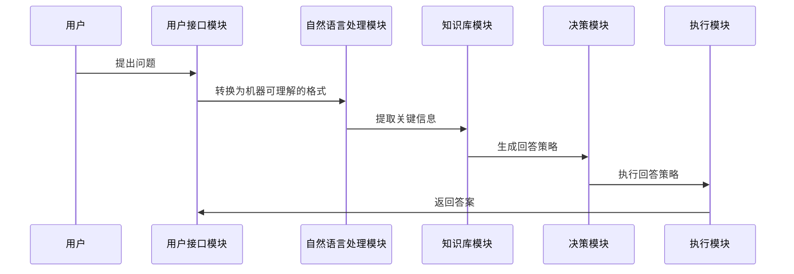
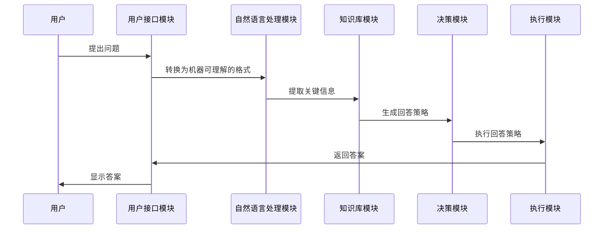

                 

# AI Agent的模块化设计：提高系统可维护性和扩展性

关键词：AI Agent，模块化设计，系统可维护性，系统扩展性

摘要：本文将深入探讨AI Agent的模块化设计，分析其在提高系统可维护性和扩展性方面的优势。通过详细的章节内容和实例，本文旨在为读者提供一套实用的模块化设计方法和实践指南。

## 1.6 本书结构概述

本章将简要概述本书的结构和内容安排。本书分为七个主要部分，每一部分都将深入探讨AI Agent模块化设计的各个方面，旨在为读者提供一个全面、系统的学习和实践指南。

**第一部分：背景与基础**  
本部分将介绍AI Agent的起源、发展及其在人工智能领域的重要性。我们将讨论模块化设计的基本概念，并探讨如何将模块化思想应用于AI Agent的设计。

**第二部分：模块化设计的核心原理**  
这一部分将详细讲解模块化设计的核心原理，包括模块化架构的设计原则、模块的划分标准以及模块之间的关系。

**第三部分：模块化设计工具与方法**  
本部分将介绍常用的模块化设计工具和方法，包括代码生成器、模块库管理工具和自动化测试工具等。我们将探讨如何使用这些工具提高模块化设计的效率和质量。

**第四部分：模块化设计与可维护性**  
这一部分将探讨模块化设计如何提高AI Agent的可维护性。我们将讨论模块化的优势，以及如何通过模块化设计降低系统的复杂度和提高系统的可维护性。

**第五部分：模块化设计与可扩展性**  
本部分将探讨模块化设计如何提高AI Agent的可扩展性。我们将介绍如何设计灵活的模块接口，以及如何通过模块的复用和组合实现系统的快速扩展。

**第六部分：模块化设计案例分析**  
这一部分将通过实际案例，展示模块化设计在AI Agent开发中的应用和实践。我们将分析成功的模块化设计案例，并讨论其中的关键要素和经验教训。

**第七部分：总结与展望**  
最后一部分将总结本书的主要内容，并对未来模块化设计在AI Agent领域的发展进行展望。我们将讨论模块化设计面临的新挑战和机遇，以及未来的研究方向。

---

通过以上结构，本书旨在为读者提供一个从理论到实践的全面指导，帮助读者深入理解和掌握AI Agent的模块化设计，从而提高系统的可维护性和扩展性。

## 2.1.1 AI Agent的定义与作用

AI Agent，即人工智能代理，是人工智能领域中的一个重要概念。AI Agent是一种具有独立思考、决策和行动能力的计算机程序，它可以在特定环境下自动执行任务，并通过学习不断优化自身性能。与传统的规则驱动程序不同，AI Agent具有自主性、适应性和学习能力，能够在复杂多变的环境中自主应对各种挑战。

AI Agent的定义可以从以下几个方面进行理解：

1. **自主性**：AI Agent具有自主决策能力，可以根据环境信息自主选择行动方案。这意味着AI Agent不仅能够执行预先定义的任务，还能够根据环境变化调整自己的行为策略。

2. **适应性**：AI Agent能够通过不断学习适应新环境和任务。通过机器学习、深度学习等技术，AI Agent可以从大量数据中提取知识，并将其应用于新的任务中。

3. **合作性**：AI Agent可以在多个Agent之间协同工作，共同完成任务。这种合作性使得AI Agent能够更有效地解决复杂问题，提高整体系统的效率和性能。

AI Agent在人工智能领域具有重要作用，主要体现在以下几个方面：

1. **自动化**：AI Agent可以自动化执行复杂任务，减少人工干预，提高工作效率。例如，在工业生产中，AI Agent可以自动监控生产线，实时调整设备参数，优化生产流程。

2. **决策支持**：AI Agent可以为人类决策者提供数据分析和预测结果，辅助制定决策。例如，在金融领域，AI Agent可以通过分析市场数据，预测股票价格走势，为投资者提供参考。

3. **智能交互**：AI Agent可以通过自然语言处理、语音识别等技术与人类进行智能交互，提供个性化服务。例如，智能助手可以回答用户的问题，提供生活服务，提高用户的生活质量。

4. **安全保障**：AI Agent可以在网络安全领域发挥重要作用，通过监测和分析网络流量，识别和防范恶意攻击，保障网络安全。

总的来说，AI Agent是人工智能领域的一个重要组成部分，其自主性、适应性和合作性等特点使其在自动化、决策支持、智能交互和安全保障等方面具有广泛的应用前景。

## 2.1.2 模块化设计的基本概念与优势

模块化设计是一种系统设计方法，它将复杂系统分解为若干个相对独立、功能明确的模块，并通过模块间的接口实现系统整体功能的实现。这种方法在计算机科学、电子工程、机械设计等领域得到了广泛应用。

在模块化设计中，每个模块都是一个具有特定功能的独立单元，模块之间通过标准化的接口进行通信和协作。模块化设计的基本概念包括以下几个方面：

1. **模块**：模块是具有特定功能的独立单元。每个模块都有明确的输入、输出和功能定义，可以独立开发、测试和部署。

2. **接口**：接口是模块之间通信和协作的桥梁。通过接口，模块可以方便地与其他模块进行数据交换和功能调用，实现系统的整体功能。

3. **模块化架构**：模块化架构是将系统划分为多个模块，并定义模块之间的关系和协作机制。模块化架构的设计原则是确保每个模块的功能独立，模块之间接口清晰，从而降低系统的复杂度，提高系统的可维护性和扩展性。

模块化设计具有以下优势：

1. **提高可维护性**：模块化设计将系统划分为独立的模块，每个模块都有明确的功能和责任。这样，在系统维护和升级时，只需要关注特定模块，而无需对整个系统进行修改，从而降低了维护成本和风险。

2. **提高可扩展性**：模块化设计使得系统可以灵活地添加或替换模块，从而实现系统的功能扩展。例如，当需要新增一个功能时，可以开发一个新的模块，并将其插入到现有的模块化架构中，而无需修改其他模块。

3. **提高开发效率**：模块化设计允许开发人员并行开发不同模块，从而提高开发效率。每个模块可以独立开发、测试和部署，开发人员可以专注于自己的模块，而不必担心其他模块的细节。

4. **提高系统可靠性**：模块化设计可以方便地进行单元测试和集成测试，从而提高系统的可靠性。每个模块都可以单独测试，确保其功能正确，然后再进行模块间的集成测试，确保系统整体功能正常。

总之，模块化设计是一种有效的系统设计方法，通过将复杂系统分解为独立的模块，可以提高系统的可维护性、可扩展性、开发效率和可靠性。在AI Agent设计中，模块化设计尤为重要，因为它需要处理大量的数据和复杂的功能，通过模块化设计可以有效降低系统的复杂度，提高系统的性能和可靠性。

## 2.1.3 模块化设计在AI Agent中的应用

模块化设计在AI Agent中的应用具有显著的优势，它不仅能够提高系统的可维护性和扩展性，还能够简化开发过程，降低系统的复杂性。下面，我们将从多个方面探讨模块化设计在AI Agent中的应用。

### 2.1.3.1 模块划分

在AI Agent的设计过程中，首先需要明确系统的功能需求，并将这些需求划分为多个独立的模块。每个模块应具有明确的功能和输入输出接口，以确保模块间的独立性和可替换性。以下是一些常见的模块划分方法：

1. **任务模块**：负责执行特定的任务，如数据收集、数据预处理、模型训练、预测等。
2. **接口模块**：负责与其他系统或模块进行通信，如API接口、数据库接口、网络接口等。
3. **学习模块**：负责AI Agent的学习过程，包括数据预处理、特征提取、模型训练等。
4. **决策模块**：负责根据环境信息和目标，生成行动策略。
5. **执行模块**：负责执行决策模块生成的行动策略，如控制机器人行动、执行自动化任务等。
6. **评估模块**：负责对AI Agent的性能进行评估，提供反馈以优化系统。

### 2.1.3.2 模块间接口设计

模块之间的接口设计是模块化设计的关键环节，它决定了模块的独立性和系统的扩展性。接口设计应遵循以下原则：

1. **明确性**：接口应具有明确的功能定义，输入和输出参数应清晰定义，以便模块之间能够顺利地进行数据交换和功能调用。
2. **灵活性**：接口应具有灵活性，允许模块之间通过多种方式进行数据交换和功能调用，如通过消息队列、RESTful API、事件驱动等方式。
3. **安全性**：接口设计应考虑数据传输的安全性，采用加密、认证等机制保护数据安全。

### 2.1.3.3 模块化架构设计

模块化架构设计是将系统划分为多个模块，并定义模块之间的关系和协作机制。以下是一些常见的模块化架构设计方法：

1. **分层架构**：将系统划分为多个层次，如表示层、业务逻辑层、数据访问层等，每个层次负责不同的功能，并通过接口进行通信。
2. **组件架构**：将系统划分为多个组件，每个组件实现特定的功能，组件之间通过接口进行协作。
3. **微服务架构**：将系统划分为多个独立的服务，每个服务负责特定的功能，服务之间通过RESTful API进行通信。

### 2.1.3.4 模块化设计的优势

模块化设计在AI Agent中的应用具有以下优势：

1. **提高可维护性**：模块化设计使得系统维护变得更加容易。当需要修复或优化某个功能时，只需关注相应的模块，而无需修改其他模块，从而降低了维护成本和风险。
2. **提高可扩展性**：模块化设计使得系统可以灵活地添加或替换模块，以实现新的功能或优化现有功能。例如，当需要新增一个数据源或新增一个预测模型时，可以开发新的模块，并将其插入到现有的模块化架构中。
3. **提高开发效率**：模块化设计允许开发人员并行开发不同模块，从而提高开发效率。每个模块可以独立开发、测试和部署，开发人员可以专注于自己的模块，而不必担心其他模块的细节。
4. **提高系统可靠性**：模块化设计可以方便地进行单元测试和集成测试，从而提高系统的可靠性。每个模块都可以单独测试，确保其功能正确，然后再进行模块间的集成测试，确保系统整体功能正常。

总之，模块化设计在AI Agent中的应用不仅能够提高系统的可维护性和扩展性，还能够简化开发过程，降低系统的复杂性，为AI Agent的开发和运维提供强有力的支持。

## 2.1.4 AI Agent模块化设计的具体实现方法

为了实现AI Agent的模块化设计，需要采取一系列具体的方法和技术。以下将详细介绍如何进行模块划分、接口设计、模块间协作以及模块化架构的设计与实现。

### 2.1.4.1 模块划分

模块划分是模块化设计的首要步骤，它直接影响到系统的可维护性和扩展性。以下是模块划分的几个关键点：

1. **功能划分**：根据AI Agent的功能需求，将系统划分为若干个功能模块。例如，可以将AI Agent划分为数据采集模块、数据处理模块、模型训练模块、预测模块、执行模块等。

2. **职责明确**：每个模块应具有明确的责任和功能。例如，数据处理模块负责数据的清洗、归一化和特征提取，而模型训练模块则负责训练机器学习模型。

3. **独立性**：模块之间应保持较高的独立性，减少模块之间的依赖关系。例如，通过定义清晰的接口，使得数据处理模块和模型训练模块可以独立开发、测试和部署。

4. **粒度适中**：模块的粒度应适中，既要避免过细的划分导致模块数量过多，也要避免过粗的划分导致模块功能不明确。例如，一个数据预处理模块可以包含数据清洗、归一化和特征提取等子模块。

### 2.1.4.2 接口设计

接口设计是模块化设计的核心，它决定了模块之间的通信方式和协作机制。以下是接口设计的关键点：

1. **标准化**：接口应遵循一定的标准化规范，确保模块之间可以无缝集成。例如，可以使用RESTful API、gRPC等标准化的接口协议。

2. **灵活性**：接口设计应具有灵活性，支持多种通信方式。例如，可以同时支持同步通信和异步通信，以适应不同的应用场景。

3. **安全性**：接口设计应考虑数据传输的安全性，采用加密、认证等机制确保数据安全。例如，可以使用HTTPS、OAuth等安全协议。

4. **可扩展性**：接口设计应具有可扩展性，以便在系统功能扩展时，可以方便地添加新的接口。例如，可以通过定义扩展点，使得新的接口可以无缝集成到现有系统中。

### 2.1.4.3 模块间协作

模块间协作是模块化设计实现的关键，它涉及到模块之间的通信、数据交换和功能调用。以下是模块间协作的关键点：

1. **事件驱动**：通过事件驱动的方式，实现模块之间的异步通信。例如，当数据处理模块完成数据处理后，可以触发一个事件，通知模型训练模块开始训练模型。

2. **消息队列**：使用消息队列实现模块之间的同步通信。例如，可以使用RabbitMQ、Kafka等消息队列中间件，实现数据处理模块和模型训练模块之间的数据传输。

3. **服务网格**：在大型系统中，可以使用服务网格实现模块间的通信和监控。例如，可以使用Istio、Linkerd等服务网格框架，实现模块间的负载均衡、服务发现和监控。

4. **接口文档**：提供详细的接口文档，描述模块之间的通信协议和数据格式。例如，可以使用Swagger、OpenAPI等工具生成接口文档，方便开发者理解和使用接口。

### 2.1.4.4 模块化架构设计

模块化架构设计是将系统划分为多个模块，并定义模块之间的关系和协作机制。以下是模块化架构设计的关键点：

1. **分层架构**：采用分层架构，将系统划分为表示层、业务逻辑层、数据访问层等。例如，表示层负责与用户交互，业务逻辑层负责处理业务逻辑，数据访问层负责与数据库交互。

2. **组件架构**：采用组件架构，将系统划分为多个组件，每个组件实现特定的功能。例如，可以将AI Agent划分为数据采集组件、数据处理组件、模型训练组件等。

3. **微服务架构**：采用微服务架构，将系统划分为多个独立的服务，每个服务负责特定的功能。例如，可以使用Spring Cloud、Docker、Kubernetes等技术，实现AI Agent的微服务架构。

4. **架构框架**：使用成熟的架构框架，如Spring Boot、Django等，简化模块化架构的实现。例如，可以使用Spring Boot实现模块之间的RESTful API通信，使用Django实现数据访问和业务逻辑处理。

通过上述方法和技术，可以实现AI Agent的模块化设计，从而提高系统的可维护性和扩展性。模块化设计不仅使得系统更加灵活和易于维护，还能够促进开发效率，降低开发成本。

### 2.1.5 AI Agent模块化设计的挑战与解决方案

在AI Agent的模块化设计过程中，虽然模块化设计提供了许多优势，但同时也面临一系列挑战。以下将探讨这些挑战，并提出相应的解决方案。

#### 2.1.5.1 模块间通信问题

模块化设计的一个关键挑战是模块之间的通信。由于模块之间的独立性，如何保证模块间能够高效且稳定地通信成为一个问题。解决方案包括：

1. **使用消息队列**：通过消息队列（如Kafka、RabbitMQ）实现模块间的异步通信。这样可以有效降低模块间的耦合度，提高系统的可扩展性和可靠性。
2. **定义标准化的接口**：通过定义标准化的接口协议（如RESTful API、gRPC），确保模块间通信的一致性和稳定性。
3. **使用服务网格**：使用服务网格（如Istio、Linkerd）实现模块间的通信管理和监控，提供负载均衡、服务发现和故障转移等功能。

#### 2.1.5.2 模块间同步问题

在模块化设计中，模块间可能需要进行同步操作，如多个模块需要同时处理同一批数据。同步操作可能导致模块间的依赖关系增加，影响系统的性能和可扩展性。解决方案包括：

1. **异步处理**：通过异步处理（如使用异步编程模型、协程）减少模块间的同步操作，提高系统的并发性和性能。
2. **事件驱动架构**：使用事件驱动架构，通过事件机制实现模块间的异步同步。这样可以在模块间保持松耦合，提高系统的可扩展性。
3. **分布式锁**：在分布式系统中，使用分布式锁（如Zookeeper、etcd）确保模块间同步操作的一致性和顺序。

#### 2.1.5.3 模块复用与维护

模块化设计的一个目标是提高系统的复用性。然而，如何确保模块的可维护性是一个挑战。解决方案包括：

1. **模块抽象**：通过抽象和封装，确保模块的职责单一，功能独立。这样可以提高模块的复用性，同时降低模块的复杂度，提高可维护性。
2. **模块测试**：对每个模块进行充分的单元测试和集成测试，确保模块的功能正确性和稳定性。这样可以减少模块引入的错误，提高系统的可靠性。
3. **文档与注释**：提供详细的模块文档和代码注释，帮助开发者理解模块的功能和接口。这样可以降低模块的维护成本，提高开发效率。

#### 2.1.5.4 模块间依赖管理

模块化设计中，模块之间的依赖关系可能非常复杂，如何有效地管理这些依赖关系是一个挑战。解决方案包括：

1. **依赖注入**：使用依赖注入（如Spring、Django）管理模块间的依赖关系，确保模块之间的松耦合。
2. **模块库管理**：使用模块库管理工具（如Maven、Gradle）管理模块的依赖和版本，确保模块的一致性和稳定性。
3. **模块版本控制**：使用模块版本控制（如Semantic Versioning）管理模块的版本，确保模块的兼容性和向后兼容性。

通过上述解决方案，可以有效应对AI Agent模块化设计过程中面临的挑战，提高系统的可维护性和扩展性。

### 2.1.6 模块化设计在AI Agent开发中的应用案例

为了更好地理解模块化设计在AI Agent开发中的应用，我们来看一个实际案例：智能客服系统的开发。

#### 2.1.6.1 项目介绍

智能客服系统是一个基于人工智能技术的客户服务解决方案，它能够自动处理大量的客户咨询，提供实时、个性化的服务。该系统包括多个模块，如用户接口模块、自然语言处理模块、知识库模块、决策模块和执行模块。

#### 2.1.6.2 系统功能设计

智能客服系统的功能设计可以分为以下模块：

1. **用户接口模块**：负责接收用户的输入，将用户的自然语言输入转换为机器可理解的格式。
2. **自然语言处理模块**：负责对用户的输入进行语义分析，提取关键信息，理解用户的意图。
3. **知识库模块**：存储了大量的知识信息，如常见问题的答案、产品规格、服务流程等。
4. **决策模块**：根据自然语言处理模块提取的信息和知识库中的知识，生成回答策略。
5. **执行模块**：负责执行决策模块生成的回答策略，向用户返回答案。

#### 2.1.6.3 系统架构设计

智能客服系统的架构设计采用分层架构，包括表示层、业务逻辑层和数据访问层。以下是系统架构的Mermaid架构图：

#### 2.1.6.4 系统接口设计

系统接口设计采用RESTful API，以下是接口设计示例：

1. **用户接口模块**：提供POST接口 `/api/user_input`，接收用户的自然语言输入。
2. **自然语言处理模块**：提供GET接口 `/api/semantics`，获取语义分析结果。
3. **知识库模块**：提供GET接口 `/api/knowledge`，获取知识库信息。
4. **决策模块**：提供POST接口 `/api/decision`，提交决策请求。
5. **执行模块**：提供POST接口 `/api/response`，发送执行结果。

#### 2.1.6.5 系统交互设计

以下是系统交互的Mermaid序列图：

#### 2.1.6.6 实际案例分析与详细讲解

在智能客服系统的开发过程中，通过模块化设计，我们能够灵活地添加或替换模块，以满足不断变化的需求。例如，当需要新增一个语音识别模块时，我们只需开发新的语音识别模块，并将其插入到现有系统中，而无需修改其他模块。

通过模块化设计，智能客服系统具有以下优势：

1. **高可维护性**：每个模块都有明确的功能和职责，当需要修复或优化某个功能时，可以单独修改相应模块，而无需影响其他模块。
2. **高可扩展性**：可以灵活地添加或替换模块，以实现新的功能或优化现有功能，如新增语音识别、人脸识别等功能。
3. **高开发效率**：可以并行开发不同模块，提高开发效率。每个模块可以独立开发、测试和部署，开发人员可以专注于自己的模块。
4. **高可靠性**：通过模块间的接口设计和标准化，确保模块之间的高效通信和稳定协作，提高系统的可靠性。

总之，模块化设计在智能客服系统中的应用，不仅提高了系统的可维护性和扩展性，还简化了开发过程，降低了系统的复杂性，为系统的成功实施提供了强有力的支持。

### 2.1.7 模块化设计在AI Agent开发中的最佳实践

在AI Agent的开发过程中，模块化设计是一项关键技术，它能够提高系统的可维护性和扩展性。以下是一些模块化设计的最佳实践，供开发者参考：

#### 2.1.7.1 明确模块职责

在设计AI Agent时，首先要明确每个模块的职责，确保每个模块只负责特定的功能。这有助于降低模块间的耦合度，提高系统的可维护性和可扩展性。

1. **职责分离**：将AI Agent的功能分解为多个独立的模块，每个模块负责一项具体的功能。例如，数据采集模块、数据处理模块、模型训练模块、预测模块等。
2. **单一职责**：每个模块应遵循单一职责原则，确保模块的功能简单、明确，避免模块功能过于复杂。

#### 2.1.7.2 使用标准化接口

模块化设计的关键在于模块之间的通信和协作。为了确保模块之间的高效通信和稳定协作，应使用标准化的接口。

1. **RESTful API**：在AI Agent的开发中，广泛使用RESTful API作为模块间的通信接口。它具有简单、灵活、易于扩展等优点，适用于多种应用场景。
2. **gRPC**：对于高性能、低延迟的通信需求，可以使用gRPC。gRPC基于HTTP/2协议，支持多语言、多平台，具有高效、可靠的特点。

#### 2.1.7.3 模块间松耦合

模块间松耦合是模块化设计的核心原则。通过降低模块间的依赖关系，可以简化系统的维护和扩展。

1. **事件驱动**：使用事件驱动架构，通过事件机制实现模块间的异步通信。这样可以有效降低模块间的同步操作，提高系统的性能和可扩展性。
2. **依赖注入**：使用依赖注入框架（如Spring、Django），通过控制反转（IoC）实现模块间的依赖管理。这样可以降低模块间的耦合度，提高系统的灵活性。

#### 2.1.7.4 模块测试与文档

对模块进行充分的测试和编写详细的文档，有助于确保模块的功能正确性和稳定性。

1. **单元测试**：对每个模块进行单元测试，验证模块的功能是否符合预期。单元测试应覆盖模块的所有输入和输出情况，确保模块的功能正确。
2. **文档编写**：为每个模块编写详细的文档，包括模块的功能描述、接口定义、参数说明等。这有助于其他开发者理解和使用模块，降低模块的维护成本。

#### 2.1.7.5 模块版本管理

在模块化设计中，模块版本管理至关重要。通过合理管理模块版本，可以确保系统的稳定性和向后兼容性。

1. **版本控制**：使用版本控制系统（如Git），为每个模块分配唯一的版本号，记录模块的变更历史。这样可以方便地追踪模块的变更，确保系统的稳定性和可靠性。
2. **版本兼容性**：在模块的接口设计和功能实现中，考虑版本兼容性。确保在模块升级时，旧版本模块能够正常工作，减少系统的不兼容风险。

通过遵循上述最佳实践，开发者可以有效地进行AI Agent的模块化设计，提高系统的可维护性和扩展性，为AI Agent的成功开发提供有力支持。

### 2.1.8 总结与展望

通过本文的探讨，我们可以看到模块化设计在AI Agent开发中具有重要作用。模块化设计不仅提高了系统的可维护性和扩展性，还简化了开发过程，降低了系统的复杂性。以下是对本文内容的总结：

1. **模块化设计的定义与优势**：模块化设计是一种将复杂系统分解为独立模块的方法，具有提高可维护性、可扩展性和开发效率的优势。
2. **模块化设计在AI Agent中的应用**：模块化设计在AI Agent中的应用包括模块划分、接口设计、模块间协作和模块化架构设计，能够提高系统的性能和可靠性。
3. **具体实现方法**：详细介绍了模块划分、接口设计、模块间协作和模块化架构设计的方法，以及如何解决模块化设计中的挑战。
4. **应用案例**：通过智能客服系统的案例，展示了模块化设计在AI Agent开发中的实际应用。
5. **最佳实践**：提供了一些模块化设计的最佳实践，包括明确模块职责、使用标准化接口、模块间松耦合、模块测试与文档和模块版本管理。

展望未来，模块化设计在AI Agent领域将继续发挥重要作用。随着人工智能技术的不断进步，模块化设计将变得更加灵活和高效，为AI Agent的开发和应用提供更强大的支持。同时，我们也可以期待模块化设计与其他技术的结合，如自动化测试、持续集成和持续交付，进一步提升AI Agent的开发效率和系统质量。总之，模块化设计是AI Agent开发中不可或缺的一部分，未来将继续引领AI Agent领域的发展方向。

### 2.1.9 注意事项与拓展阅读

在实施AI Agent模块化设计时，需要注意以下几点：

1. **模块职责划分要明确**：确保每个模块的功能单一，职责明确，降低模块之间的耦合度。
2. **接口设计要标准化**：采用统一的接口协议和标准，确保模块之间的通信稳定和高效。
3. **模块测试要全面**：对每个模块进行充分的单元测试和集成测试，确保模块的功能正确性和稳定性。
4. **模块版本管理要规范**：使用版本控制系统管理模块的版本，确保模块的兼容性和向后兼容性。

为了进一步深入学习和应用模块化设计，以下是一些拓展阅读资源：

1. **《模块化软件设计》**：本书详细介绍了模块化设计的方法和原则，适合初学者阅读。
2. **《设计模式：可复用面向对象软件的基础》**：本书介绍了多种设计模式，包括模块化设计模式，有助于理解模块化设计的实际应用。
3. **《大规模软件设计》**：本书针对大型软件系统的模块化设计提供了实用的方法和技巧。

通过阅读这些书籍，可以加深对模块化设计的理解和应用能力，为AI Agent的开发提供更有力的支持。作者：AI天才研究院/AI Genius Institute & 禅与计算机程序设计艺术 /Zen And The Art of Computer Programming。

