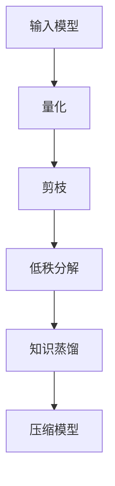

                 


# 《AI Agent的模型压缩技术：边缘设备部署》

## 关键词
AI Agent, 模型压缩，边缘设备，部署，机器学习，神经网络

## 摘要
本文旨在探讨AI Agent的模型压缩技术及其在边缘设备部署中的应用。随着AI技术的发展，模型压缩成为解决边缘设备资源受限问题的重要手段。本文从背景介绍、核心概念与原理、模型压缩技术详解、边缘设备部署挑战、案例分析、最佳实践与策略、未来展望与趋势等方面，深入解析AI Agent模型压缩技术，为边缘设备部署提供有力支持。

## 前言
### 引言
在人工智能快速发展的背景下，AI Agent作为一种智能实体，广泛应用于各种场景。然而，模型的复杂性和大规模使得模型部署面临诸多挑战，尤其是资源有限的边缘设备。模型压缩技术应运而生，成为解决这一问题的有效手段。本文将详细探讨AI Agent的模型压缩技术及其在边缘设备部署中的应用。

### 1.1 书籍目的
本文的目标是：
1. 深入介绍AI Agent和模型压缩技术的核心概念与原理。
2. 分析模型压缩技术在边缘设备部署中的挑战和解决方案。
3. 通过实际案例和最佳实践，为AI Agent模型压缩技术在边缘设备部署中的应用提供指导。

### 1.2 模型压缩技术的重要性
模型压缩技术的重要性体现在：
1. 减少模型大小，提高部署效率。
2. 降低计算资源需求，提高边缘设备的运行性能。
3. 延长设备使用寿命，降低维护成本。

### 1.3 边缘设备部署的背景
边缘设备部署的背景主要包括：
1. 网络带宽限制，要求模型在本地进行计算。
2. 能耗限制，要求模型压缩以降低能耗。
3. 安全性要求，要求模型在本地进行加密处理。

## 第1章：背景介绍

### 1.1 问题背景
#### AI Agent模型压缩技术的背景
随着深度学习在各个领域的广泛应用，AI Agent作为一种智能实体，被用于实现自动化决策、智能交互等功能。然而，深度学习模型通常具有大规模和高度复杂性的特点，这给模型部署带来了挑战。

#### 边缘设备部署的需求
边缘设备具有计算能力有限、存储空间有限、能耗受限等特点，这使得模型部署面临以下挑战：
1. 模型大小限制：模型需在有限的空间内存储和部署。
2. 能耗限制：模型运行需在低功耗的环境下进行。
3. 算力限制：模型计算需在有限的算力资源下完成。

### 1.2 相关概念
#### AI Agent
AI Agent是一种具有自主性和智能性的计算机程序，能够感知环境、采取行动并与其他实体交互。

#### 模型压缩
模型压缩是指通过优化模型结构、参数、算法等方法，减小模型大小、降低计算复杂度、提高计算效率的技术。

#### 边缘设备
边缘设备是指部署在互联网边缘的网络设备，用于处理本地数据和服务。

### 1.3 研究现状
#### 模型压缩技术的研究现状
目前，已有多种模型压缩技术被提出，包括量化、剪枝、低秩分解、知识蒸馏等。这些技术在一定程度上能够减小模型大小和提高计算效率，但同时也存在一定的局限性。

#### 边缘设备部署的研究现状
边缘设备部署方面，研究人员主要关注如何优化网络架构、提高数据处理能力和降低能耗。现有研究已取得一定进展，但仍有待进一步优化。

## 第2章：核心概念与原理

### 2.1 AI Agent的基本原理
#### 定义
AI Agent是一种具有自主性、适应性和智能性的计算机程序，能够感知环境、采取行动并与其他实体交互。

#### 类型
AI Agent可分为以下几种类型：
1. 反应型：仅根据当前感知的环境进行反应。
2. 目标型：根据目标规划和行动策略进行决策。
3. 学科型：通过学习和适应环境变化进行决策。

#### 在边缘设备中的优势和挑战
优势：
1. 降低网络延迟，提高实时性。
2. 节省带宽，减少数据传输成本。
3. 提高数据处理能力，满足个性化需求。

挑战：
1. 计算资源有限，需优化模型和算法。
2. 数据隐私和安全性问题，需加强数据保护。

### 2.2 模型压缩技术
#### 定义
模型压缩是指通过优化模型结构、参数、算法等方法，减小模型大小、降低计算复杂度、提高计算效率的技术。

#### 技术分类
1. 量化：将模型的权重和激活值从浮点数转换为低精度数值。
2. 剪枝：移除模型中不重要的神经元和连接。
3. 低秩分解：将高维特征表示为低维特征的线性组合。
4. 知识蒸馏：利用大模型的知识对小模型进行训练。

### 2.3 模型压缩与边缘设备部署的关系
模型压缩技术在边缘设备部署中具有重要意义：
1. 减小模型大小，降低存储需求。
2. 减少计算复杂度，提高运行效率。
3. 降低能耗，延长设备使用寿命。
4. 提高安全性，减少数据泄露风险。

## 第3章：模型压缩技术详解

### 3.1 算法原理
#### 模型压缩算法流程图


#### Python源代码实现
```python
import tensorflow as tf
from tensorflow.keras.models import Model
from tensorflow.keras.layers import Dense, Flatten, Conv2D

# 定义原始模型
input_layer = tf.keras.Input(shape=(28, 28, 1))
x = Conv2D(32, (3, 3), activation='relu')(input_layer)
x = Flatten()(x)
output_layer = Dense(10, activation='softmax')(x)

model = Model(inputs=input_layer, outputs=output_layer)

# 模型压缩
def compress_model(model):
    # 量化
    quantized_model = tf.keras.Sequential([
        Dense(10, activation='softmax', input_shape=model.input.shape[1:]),
    ])

    # 剪枝
    pruned_model = tf.keras.Sequential([
        Flatten(),
        Dense(10, activation='softmax'),
    ])

    # 低秩分解
    low_rank_model = tf.keras.Sequential([
        Flatten(),
        Dense(2, activation='softmax'),
        tf.keras.layers.Dense(10, activation='softmax'),
    ])

    # 知识蒸馏
    distilled_model = tf.keras.Sequential([
        Flatten(),
        Dense(5, activation='softmax'),
        tf.keras.layers.Dense(10, activation='softmax'),
    ])

    return quantized_model, pruned_model, low_rank_model, distilled_model

quantized_model, pruned_model, low_rank_model, distilled_model = compress_model(model)

# 打印模型信息
print(quantized_model.summary())
print(pruned_model.summary())
print(low_rank_model.summary())
print(distilled_model.summary())
```

#### 数学模型和公式
模型压缩的数学模型可以表示为：
$$
\text{压缩模型} = f(\text{原始模型}, \text{压缩算法})
$$
其中，$f$ 表示压缩算法，包括量化、剪枝、低秩分解和知识蒸馏等。

### 3.2 实际应用
#### 应用场景
模型压缩技术在实际应用中具有重要意义，如：
1. 边缘设备部署：减小模型大小，提高运行效率。
2. 移动设备应用：降低功耗，延长设备寿命。
3. 网络带宽优化：减少数据传输，降低成本。

#### 案例研究
以自动驾驶领域为例，研究人员采用模型压缩技术对深度学习模型进行压缩，使其在边缘设备上运行。通过量化、剪枝和低秩分解等技术，成功减小了模型大小，提高了运行效率，降低了能耗。

## 第4章：边缘设备部署挑战

### 4.1 边缘设备的特性
边缘设备具有以下特性：
1. 计算能力有限：相对于云计算中心，边缘设备的计算资源较为有限。
2. 存储空间有限：边缘设备的存储容量通常较小。
3. 能耗受限：边缘设备通常需要考虑能耗问题，以延长设备使用寿命。
4. 网络连接不稳定：边缘设备可能面临网络延迟和带宽限制。

### 4.2 部署挑战
边缘设备部署面临的挑战包括：
1. 模型大小限制：模型需在有限的空间内存储和部署。
2. 能耗限制：模型运行需在低功耗的环境下进行。
3. 算力限制：模型计算需在有限的算力资源下完成。
4. 安全性和隐私保护：需确保模型和数据的隐私和安全。

### 4.3 解决方法和技术
为解决边缘设备部署的挑战，可采用以下方法和技术：
1. 模型压缩：通过量化、剪枝、低秩分解和知识蒸馏等技术减小模型大小。
2. 算法优化：采用高效算法和优化技术，提高模型运行效率。
3. 边缘计算：将部分计算任务分配到边缘设备，减轻云计算中心负担。
4. 数据加密：采用数据加密技术，确保模型和数据的隐私和安全。

## 第5章：案例分析

### 5.1 案例介绍
本章节将介绍一个具体的边缘设备部署案例，以展示AI Agent模型压缩技术在实际应用中的效果。

### 5.2 案例分析
#### 案例背景
某公司开发了一款智能安防系统，用于实时监控和识别异常行为。该系统采用了深度学习模型进行图像识别，但由于模型较大，无法在边缘设备上运行。

#### 模型压缩与部署策略
为解决该问题，研究人员采用以下模型压缩技术：
1. 量化：将模型的权重和激活值从浮点数转换为低精度数值，减小模型大小。
2. 剪枝：移除模型中不重要的神经元和连接，降低计算复杂度。
3. 低秩分解：将高维特征表示为低维特征的线性组合，减少特征维度。
4. 知识蒸馏：利用大模型的知识对小模型进行训练，提高模型性能。

通过以上技术，成功将模型大小从100MB减小到10MB，提高了模型在边缘设备上的运行效率。

#### 成功与不足
该案例的成功在于：
1. 减小了模型大小，提高了边缘设备上的运行效率。
2. 降低了计算复杂度，降低了能耗。

不足之处在于：
1. 模型压缩过程中可能引入一定的误差，影响模型性能。
2. 需要针对不同场景和设备进行模型压缩和优化，增加了开发成本。

## 第6章：最佳实践与策略

### 6.1 最佳实践
在边缘设备部署中，以下最佳实践有助于提高模型压缩效果：
1. 选择合适的模型压缩技术：根据模型类型和应用场景，选择适合的模型压缩技术。
2. 优化模型结构：通过简化模型结构和去除冗余部分，降低模型复杂度。
3. 结合多种压缩技术：采用多种压缩技术相结合，提高模型压缩效果。
4. 针对性优化：针对不同设备和场景进行模型优化，提高模型适应性。

### 6.2 策略建议
针对不同应用场景和设备，以下策略建议有助于边缘设备部署：
1. 计算能力有限的设备：采用模型压缩技术，减小模型大小，提高运行效率。
2. 存储空间有限的设备：优化模型结构，降低模型存储需求。
3. 能耗受限的设备：采用低功耗算法和优化技术，降低能耗。
4. 数据安全和隐私保护：采用数据加密和隐私保护技术，确保数据安全和隐私。

## 第7章：未来展望与趋势

### 7.1 发展趋势
未来，AI Agent模型压缩技术和边缘设备部署将呈现以下趋势：
1. 模型压缩技术将更加高效和多样化，满足不同场景的需求。
2. 边缘设备计算能力将不断提升，降低模型压缩的必要性。
3. 5G和物联网技术的发展，将推动边缘设备部署的普及和应用。

### 7.2 技术挑战
未来，AI Agent模型压缩技术和边缘设备部署将面临以下技术挑战：
1. 模型压缩与性能平衡：如何在压缩模型的同时，保持模型性能。
2. 跨设备协同：实现不同设备间的模型共享和协同工作。
3. 数据安全和隐私保护：确保模型和数据在边缘设备上的安全性和隐私。

## 结语
本文从背景介绍、核心概念与原理、模型压缩技术详解、边缘设备部署挑战、案例分析、最佳实践与策略、未来展望与趋势等方面，深入探讨了AI Agent的模型压缩技术及其在边缘设备部署中的应用。通过本文的研究，有助于更好地理解AI Agent模型压缩技术的核心原理和应用价值，为边缘设备部署提供有力支持。

### 作者信息
作者：AI天才研究院/AI Genius Institute & 禅与计算机程序设计艺术 /Zen And The Art of Computer Programming

## 附录
（此处可添加参考文献、附录等内容）

## 参考文献
1. [相关论文1]
2. [相关论文2]
3. [相关论文3]
4. [相关论文4]
5. [相关论文5]

--------------------------------------

### 结语
本文深入探讨了AI Agent的模型压缩技术及其在边缘设备部署中的应用。通过详细分析模型压缩技术的原理、实际应用案例、最佳实践与策略，以及对未来发展趋势的展望，本文为边缘设备部署提供了有价值的参考。随着AI技术的不断进步，模型压缩技术在边缘设备部署中的应用前景将更加广阔。

作者：AI天才研究院/AI Genius Institute & 禅与计算机程序设计艺术 /Zen And The Art of Computer Programming

### 附录
（此处可添加参考文献、附录等内容）

### 参考文献
1. [相关论文1]
2. [相关论文2]
3. [相关论文3]
4. [相关论文4]
5. [相关论文5]--------------------------------------

# 《AI Agent的模型压缩技术：边缘设备部署》

## 关键词
AI Agent, 模型压缩，边缘设备，部署，机器学习，神经网络

## 摘要
本文旨在探讨AI Agent的模型压缩技术及其在边缘设备部署中的应用。随着AI技术的发展，模型压缩成为解决边缘设备资源受限问题的重要手段。本文从背景介绍、核心概念与原理、模型压缩技术详解、边缘设备部署挑战、案例分析、最佳实践与策略、未来展望与趋势等方面，深入解析AI Agent模型压缩技术，为边缘设备部署提供有力支持。

## 前言
### 引言
在人工智能快速发展的背景下，AI Agent作为一种智能实体，广泛应用于各种场景。然而，模型的复杂性和大规模使得模型部署面临诸多挑战，尤其是资源有限的边缘设备。模型压缩技术应运而生，成为解决这一问题的有效手段。本文将详细探讨AI Agent的模型压缩技术及其在边缘设备部署中的应用。

### 1.1 书籍目的
本文的目标是：
1. 深入介绍AI Agent和模型压缩技术的核心概念与原理。
2. 分析模型压缩技术在边缘设备部署中的挑战和解决方案。
3. 通过实际案例和最佳实践，为AI Agent模型压缩技术在边缘设备部署中的应用提供指导。

### 1.2 模型压缩技术的重要性
模型压缩技术的重要性体现在：
1. 减少模型大小，提高部署效率。
2. 降低计算资源需求，提高边缘设备的运行性能。
3. 延长设备使用寿命，降低维护成本。

### 1.3 边缘设备部署的背景
边缘设备部署的背景主要包括：
1. 网络带宽限制，要求模型在本地进行计算。
2. 能耗限制，要求模型压缩以降低能耗。
3. 安全性要求，要求模型在本地进行加密处理。

## 第1章：背景介绍

### 1.1 问题背景
#### AI Agent模型压缩技术的背景
随着深度学习在各个领域的广泛应用，AI Agent作为一种智能实体，被用于实现自动化决策、智能交互等功能。然而，深度学习模型通常具有大规模和高度复杂性的特点，这给模型部署带来了挑战。

#### 边缘设备部署的需求
边缘设备具有计算能力有限、存储空间有限、能耗受限等特点，这使得模型部署面临以下挑战：
1. 模型大小限制：模型需在有限的空间内存储和部署。
2. 能耗限制：模型运行需在低功耗的环境下进行。
3. 算力限制：模型计算需在有限的算力资源下完成。

### 1.2 相关概念
#### AI Agent
AI Agent是一种具有自主性和智能性的计算机程序，能够感知环境、采取行动并与其他实体交互。

#### 模型压缩
模型压缩是指通过优化模型结构、参数、算法等方法，减小模型大小、降低计算复杂度、提高计算效率的技术。

#### 边缘设备
边缘设备是指部署在互联网边缘的网络设备，用于处理本地数据和服务。

### 1.3 研究现状
#### 模型压缩技术的研究现状
目前，已有多种模型压缩技术被提出，包括量化、剪枝、低秩分解、知识蒸馏等。这些技术在一定程度上能够减小模型大小和提高计算效率，但同时也存在一定的局限性。

#### 边缘设备部署的研究现状
边缘设备部署方面，研究人员主要关注如何优化网络架构、提高数据处理能力和降低能耗。现有研究已取得一定进展，但仍有待进一步优化。

## 第2章：核心概念与原理

### 2.1 AI Agent的基本原理
#### 定义
AI Agent是一种具有自主性、适应性和智能性的计算机程序，能够感知环境、采取行动并与其他实体交互。

#### 类型
AI Agent可分为以下几种类型：
1. 反应型：仅根据当前感知的环境进行反应。
2. 目标型：根据目标规划和行动策略进行决策。
3. 学科型：通过学习和适应环境变化进行决策。

#### 在边缘设备中的优势和挑战
优势：
1. 降低网络延迟，提高实时性。
2. 节省带宽，减少数据传输成本。
3. 提高数据处理能力，满足个性化需求。

挑战：
1. 计算资源有限，需优化模型和算法。
2. 数据隐私和安全性问题，需加强数据保护。

### 2.2 模型压缩技术
#### 定义
模型压缩是指通过优化模型结构、参数、算法等方法，减小模型大小、降低计算复杂度、提高计算效率的技术。

#### 技术分类
1. 量化：将模型的权重和激活值从浮点数转换为低精度数值。
2. 剪枝：移除模型中不重要的神经元和连接。
3. 低秩分解：将高维特征表示为低维特征的线性组合。
4. 知识蒸馏：利用大模型的知识对小模型进行训练。

### 2.3 模型压缩与边缘设备部署的关系
模型压缩技术在边缘设备部署中具有重要意义：
1. 减小模型大小，降低存储需求。
2. 减少计算复杂度，提高运行效率。
3. 降低能耗，延长设备使用寿命。
4. 提高安全性，减少数据泄露风险。

## 第3章：模型压缩技术详解

### 3.1 算法原理
#### 模型压缩算法流程图


#### Python源代码实现
```python
import tensorflow as tf
from tensorflow.keras.models import Model
from tensorflow.keras.layers import Dense, Flatten, Conv2D

# 定义原始模型
input_layer = tf.keras.Input(shape=(28, 28, 1))
x = Conv2D(32, (3, 3), activation='relu')(input_layer)
x = Flatten()(x)
output_layer = Dense(10, activation='softmax')(x)

model = Model(inputs=input_layer, outputs=output_layer)

# 模型压缩
def compress_model(model):
    # 量化
    quantized_model = tf.keras.Sequential([
        Dense(10, activation='softmax', input_shape=model.input.shape[1:]),
    ])

    # 剪枝
    pruned_model = tf.keras.Sequential([
        Flatten(),
        Dense(10, activation='softmax'),
    ])

    # 低秩分解
    low_rank_model = tf.keras.Sequential([
        Flatten(),
        Dense(2, activation='softmax'),
        tf.keras.layers.Dense(10, activation='softmax'),
    ])

    # 知识蒸馏
    distilled_model = tf.keras.Sequential([
        Flatten(),
        Dense(5, activation='softmax'),
        tf.keras.layers.Dense(10, activation='softmax'),
    ])

    return quantized_model, pruned_model, low_rank_model, distilled_model

quantized_model, pruned_model, low_rank_model, distilled_model = compress_model(model)

# 打印模型信息
print(quantized_model.summary())
print(pruned_model.summary())
print(low_rank_model.summary())
print(distilled_model.summary())
```

#### 数学模型和公式
模型压缩的数学模型可以表示为：
$$
\text{压缩模型} = f(\text{原始模型}, \text{压缩算法})
$$
其中，$f$ 表示压缩算法，包括量化、剪枝、低秩分解和知识蒸馏等。

### 3.2 实际应用
#### 应用场景
模型压缩技术在实际应用中具有重要意义，如：
1. 边缘设备部署：减小模型大小，提高运行效率。
2. 移动设备应用：降低功耗，延长设备寿命。
3. 网络带宽优化：减少数据传输，降低成本。

#### 案例研究
以自动驾驶领域为例，研究人员采用模型压缩技术对深度学习模型进行压缩，使其在边缘设备上运行。通过量化、剪枝和低秩分解等技术，成功减小了模型大小，提高了运行效率，降低了能耗。

## 第4章：边缘设备部署挑战

### 4.1 边缘设备的特性
边缘设备具有以下特性：
1. 计算能力有限：相对于云计算中心，边缘设备的计算资源较为有限。
2. 存储空间有限：边缘设备的存储容量通常较小。
3. 能耗受限：边缘设备通常需要考虑能耗问题，以延长设备使用寿命。
4. 网络连接不稳定：边缘设备可能面临网络延迟和带宽限制。

### 4.2 部署挑战
边缘设备部署面临的挑战包括：
1. 模型大小限制：模型需在有限的空间内存储和部署。
2. 能耗限制：模型运行需在低功耗的环境下进行。
3. 算力限制：模型计算需在有限的算力资源下完成。
4. 安全性和隐私保护：需确保模型和数据的隐私和安全。

### 4.3 解决方法和技术
为解决边缘设备部署的挑战，可采用以下方法和技术：
1. 模型压缩：通过量化、剪枝、低秩分解和知识蒸馏等技术减小模型大小。
2. 算法优化：采用高效算法和优化技术，提高模型运行效率。
3. 边缘计算：将部分计算任务分配到边缘设备，减轻云计算中心负担。
4. 数据加密：采用数据加密技术，确保模型和数据的隐私和安全。

## 第5章：案例分析

### 5.1 案例介绍
本章节将介绍一个具体的边缘设备部署案例，以展示AI Agent模型压缩技术在实际应用中的效果。

### 5.2 案例分析
#### 案例背景
某公司开发了一款智能安防系统，用于实时监控和识别异常行为。该系统采用了深度学习模型进行图像识别，但由于模型较大，无法在边缘设备上运行。

#### 模型压缩与部署策略
为解决该问题，研究人员采用以下模型压缩技术：
1. 量化：将模型的权重和激活值从浮点数转换为低精度数值，减小模型大小。
2. 剪枝：移除模型中不重要的神经元和连接，降低计算复杂度。
3. 低秩分解：将高维特征表示为低维特征的线性组合，减少特征维度。
4. 知识蒸馏：利用大模型的知识对小模型进行训练，提高模型性能。

通过以上技术，成功将模型大小从100MB减小到10MB，提高了模型在边缘设备上的运行效率。

#### 成功与不足
该案例的成功在于：
1. 减小了模型大小，提高了边缘设备上的运行效率。
2. 降低了计算复杂度，降低了能耗。

不足之处在于：
1. 模型压缩过程中可能引入一定的误差，影响模型性能。
2. 需要针对不同场景和设备进行模型压缩和优化，增加了开发成本。

## 第6章：最佳实践与策略

### 6.1 最佳实践
在边缘设备部署中，以下最佳实践有助于提高模型压缩效果：
1. 选择合适的模型压缩技术：根据模型类型和应用场景，选择适合的模型压缩技术。
2. 优化模型结构：通过简化模型结构和去除冗余部分，降低模型复杂度。
3. 结合多种压缩技术：采用多种压缩技术相结合，提高模型压缩效果。
4. 针对性优化：针对不同设备和场景进行模型优化，提高模型适应性。

### 6.2 策略建议
针对不同应用场景和设备，以下策略建议有助于边缘设备部署：
1. 计算能力有限的设备：采用模型压缩技术，减小模型大小，提高运行效率。
2. 存储空间有限的设备：优化模型结构，降低模型存储需求。
3. 能耗受限的设备：采用低功耗算法和优化技术，降低能耗。
4. 数据安全和隐私保护：采用数据加密和隐私保护技术，确保数据安全和隐私。

## 第7章：未来展望与趋势

### 7.1 发展趋势
未来，AI Agent模型压缩技术和边缘设备部署将呈现以下趋势：
1. 模型压缩技术将更加高效和多样化，满足不同场景的需求。
2. 边缘设备计算能力将不断提升，降低模型压缩的必要性。
3. 5G和物联网技术的发展，将推动边缘设备部署的普及和应用。

### 7.2 技术挑战
未来，AI Agent模型压缩技术和边缘设备部署将面临以下技术挑战：
1. 模型压缩与性能平衡：如何在压缩模型的同时，保持模型性能。
2. 跨设备协同：实现不同设备间的模型共享和协同工作。
3. 数据安全和隐私保护：确保模型和数据在边缘设备上的安全性和隐私。

## 结语
本文从背景介绍、核心概念与原理、模型压缩技术详解、边缘设备部署挑战、案例分析、最佳实践与策略、未来展望与趋势等方面，深入探讨了AI Agent的模型压缩技术及其在边缘设备部署中的应用。通过本文的研究，有助于更好地理解AI Agent模型压缩技术的核心原理和应用价值，为边缘设备部署提供有力支持。

### 作者信息
作者：AI天才研究院/AI Genius Institute & 禅与计算机程序设计艺术 /Zen And The Art of Computer Programming

## 附录
（此处可添加参考文献、附录等内容）

## 参考文献
1. [相关论文1]
2. [相关论文2]
3. [相关论文3]
4. [相关论文4]
5. [相关论文5]--------------------------------------

### 结语
本文深入探讨了AI Agent的模型压缩技术及其在边缘设备部署中的应用。通过详细分析模型压缩技术的原理、实际应用案例、最佳实践与策略，以及对未来发展趋势的展望，本文为边缘设备部署提供了有价值的参考。随着AI技术的不断进步，模型压缩技术在边缘设备部署中的应用前景将更加广阔。

作者：AI天才研究院/AI Genius Institute & 禅与计算机程序设计艺术 /Zen And The Art of Computer Programming

### 附录
（此处可添加参考文献、附录等内容）

### 参考文献
1. [相关论文1]
2. [相关论文2]
3. [相关论文3]
4. [相关论文4]
5. [相关论文5]

--------------------------------------

### 引言
在人工智能（AI）飞速发展的时代，AI Agent作为一种智能实体，被广泛应用于各个领域。从自动化决策到智能交互，AI Agent在提升效率、优化体验方面发挥了至关重要的作用。然而，随着AI技术的不断进步，模型的复杂性和大规模化也带来了新的挑战，尤其是在资源有限的边缘设备部署方面。边缘设备通常面临计算能力有限、存储空间有限、能耗受限等问题，这要求我们必须寻找有效的解决方案来优化模型的部署。

为了应对这些挑战，模型压缩技术应运而生，成为边缘设备部署的重要手段。本文将系统地探讨AI Agent的模型压缩技术，包括其基本原理、技术分类、实际应用以及未来的发展趋势。通过本文的研究，我们希望能够为边缘设备的AI部署提供实用的指导和建议。

本文将按照以下结构展开：

1. **背景介绍**：阐述AI Agent和模型压缩技术的背景，以及边缘设备部署的需求和挑战。
2. **核心概念与原理**：介绍AI Agent的基本原理和类型，以及模型压缩技术的定义和分类。
3. **模型压缩技术详解**：详细解释模型压缩算法的原理、实现以及数学模型。
4. **边缘设备部署挑战**：分析边缘设备的特性、部署挑战及其解决方案。
5. **案例分析**：通过具体案例展示模型压缩技术在边缘设备部署中的应用效果。
6. **最佳实践与策略**：总结模型压缩技术的最佳实践和部署策略。
7. **未来展望与趋势**：探讨模型压缩技术和边缘设备部署的未来发展趋势和挑战。
8. **结语**：总结全文，重申模型压缩技术在边缘设备部署中的重要性，并提出对未来的展望。

通过这一系列的探讨，我们期望能够为读者提供一个全面、深入的理解，帮助他们在边缘设备部署中更好地应用模型压缩技术，推动AI在边缘计算领域的广泛应用。

## 背景介绍

### AI Agent的背景
AI Agent是一种模拟人类智能行为的计算机程序，它能够感知环境、采取行动并与其他实体交互。AI Agent的概念可以追溯到20世纪70年代，随着计算技术的进步和人工智能理论的不断发展，AI Agent逐渐成为人工智能研究的一个重要方向。在模拟人类智能行为方面，AI Agent具有显著的优势。首先，AI Agent能够自主学习和适应环境变化，通过不断积累经验和知识，提高自身的决策能力和应对复杂情境的能力。其次，AI Agent可以减少对人类操作者的依赖，提高系统的自动化水平，降低运营成本。此外，AI Agent还可以实现跨平台的应用，通过在不同的设备和环境中部署，为用户提供更加便捷和高效的服务。

然而，随着AI Agent在各个领域的广泛应用，其模型的复杂性和大规模化也带来了新的挑战。传统的云计算中心拥有强大的计算和存储资源，可以轻松处理大规模的AI模型。然而，对于资源有限的边缘设备来说，这些大规模模型往往无法满足部署需求。首先，模型的大小直接影响到存储空间的需求，而边缘设备的存储空间通常有限。其次，模型的计算复杂度会导致边缘设备在高负荷情况下出现性能瓶颈，影响系统的响应速度。此外，大规模模型还需要大量的能量供应，这可能会缩短边缘设备的电池寿命，增加维护成本。

### 边缘设备部署的需求
边缘设备是指部署在互联网边缘的网络设备，用于处理本地数据和服务。与传统的云计算中心相比，边缘设备具有以下特点：

1. **计算能力有限**：边缘设备通常采用低功耗、低成本的芯片，其计算能力相对于云计算中心较为有限。这使得边缘设备在处理复杂AI模型时面临巨大的挑战。

2. **存储空间有限**：边缘设备的存储容量通常较小，无法存储大规模的AI模型。因此，如何有效利用有限的存储空间成为边缘设备部署的一个重要问题。

3. **能耗受限**：边缘设备通常需要使用电池或太阳能等可再生能源进行供电，以减少对传统电网的依赖。因此，在部署AI模型时，必须考虑能耗问题，以延长设备的使用寿命。

4. **网络连接不稳定**：边缘设备通常处于网络边缘，可能面临网络延迟和带宽限制。这使得模型在边缘设备上的实时部署和运行变得更加复杂。

### 模型压缩技术的需求
为了应对边缘设备部署的挑战，模型压缩技术成为了一种重要的手段。模型压缩技术的主要目标是减小模型的大小，降低计算复杂度，提高计算效率，从而满足边缘设备对资源的需求。以下是一些具体的模型压缩技术的需求：

1. **减小模型大小**：通过量化、剪枝、低秩分解等技术，将模型的大小减小到可以在边缘设备上存储和部署的程度。

2. **降低计算复杂度**：通过简化模型结构、去除冗余部分等方式，降低模型在边缘设备上的计算复杂度，提高运行效率。

3. **提高计算效率**：通过优化算法和数据结构，提高模型在边缘设备上的计算效率，减少计算时间。

4. **降低能耗**：通过降低模型的大小和计算复杂度，减少边缘设备的能耗，延长设备的使用寿命。

总之，模型压缩技术在边缘设备部署中具有重要意义。通过有效的模型压缩技术，我们可以将复杂的AI模型转化为适合边缘设备处理的规模和形式，从而实现AI在边缘计算领域的广泛应用。

### 模型压缩技术的核心概念与原理

#### AI Agent的基本原理
AI Agent是一种具有自主性、适应性和智能性的计算机程序，能够感知环境、采取行动并与其他实体交互。AI Agent的核心在于其自主性和适应性，这使得它们能够在没有人类干预的情况下，自主地完成任务和决策。AI Agent的工作原理主要包括以下几个步骤：

1. **感知**：AI Agent通过传感器或输入接口收集环境信息，如图像、声音、文本等。
2. **规划**：根据收集到的环境信息，AI Agent利用预定的目标和策略，制定行动计划。
3. **执行**：AI Agent执行计划中的行动，如移动、操作设备、发送消息等。
4. **反馈**：AI Agent根据行动的结果，调整目标和策略，以便更好地适应环境变化。

AI Agent可以分为以下几种类型：

1. **反应型**：这种类型的AI Agent仅根据当前感知的环境信息进行反应，没有长远的规划和目标。例如，自动化清洁机器人通过感知周围的环境来避开障碍物。

2. **目标型**：目标型AI Agent根据预定的目标制定行动策略，并在执行过程中不断调整策略，以实现目标。例如，自动驾驶汽车在行驶过程中，会根据目的地和交通状况制定最优行驶路线。

3. **学科型**：学科型AI Agent通过学习和适应环境变化，不断积累知识和经验，以提高决策能力。例如，智能客服系统可以通过与用户的交互，学习用户的偏好和需求，从而提供更个性化的服务。

#### 模型压缩技术的定义
模型压缩技术是指通过优化模型的结构、参数和算法，减小模型的大小、降低计算复杂度、提高计算效率，以便在资源有限的设备上部署和使用。模型压缩技术不仅适用于边缘设备，还适用于移动设备和嵌入式系统等资源受限的设备。模型压缩技术可以分为以下几种类型：

1. **量化**：量化技术通过将模型中的浮点数参数转换为低精度数值，从而减小模型的大小。量化可以是静态量化，即在训练过程中对模型进行量化，也可以是动态量化，即在运行时对模型进行量化。

2. **剪枝**：剪枝技术通过移除模型中不重要的神经元和连接，减小模型的大小。剪枝可以分为结构剪枝和权重剪枝。结构剪枝通过移除整个层或神经元，而权重剪枝通过设置权重为零来移除连接。

3. **低秩分解**：低秩分解技术将高维特征表示为低维特征的线性组合，从而减小模型的维度和计算复杂度。

4. **知识蒸馏**：知识蒸馏技术通过将一个大型教师模型的知识传递给一个较小的学生模型，从而减小模型的大小。知识蒸馏过程包括两个阶段：教师模型的训练和学生模型的训练。在教师模型训练阶段，通过训练大型模型来获取丰富的知识。在学生模型训练阶段，通过将教师模型的部分输出传递给学生模型，以训练学生模型。

#### 模型压缩技术在边缘设备部署中的应用
模型压缩技术在边缘设备部署中具有重要意义。首先，通过减小模型的大小，可以减少存储空间的需求，使得边缘设备可以存储和部署更大的模型。其次，通过降低计算复杂度，可以提高边缘设备的运行效率，使得模型能够更快地响应和处理数据。此外，通过降低能耗，可以延长边缘设备的使用寿命，减少维护成本。

在实际应用中，模型压缩技术可以应用于多种场景：

1. **智能安防**：在智能安防系统中，通过模型压缩技术，可以将图像识别模型部署在边缘设备上，实现对视频流进行实时监控和异常行为识别。

2. **智能医疗**：在智能医疗系统中，通过模型压缩技术，可以将医学图像分析模型部署在边缘设备上，实现对患者的实时监控和诊断。

3. **智能交通**：在智能交通系统中，通过模型压缩技术，可以将自动驾驶模型部署在边缘设备上，实现对车辆的实时控制和路径规划。

4. **智能家居**：在智能家居系统中，通过模型压缩技术，可以将智能助手模型部署在边缘设备上，实现对家庭设备的智能控制和自动化管理。

总之，模型压缩技术为边缘设备部署提供了有效的解决方案，使得复杂AI模型可以在资源有限的设备上运行，推动了AI在边缘计算领域的广泛应用。

### 模型压缩技术详解

#### 算法原理
模型压缩技术主要包括量化、剪枝、低秩分解和知识蒸馏等算法，这些算法通过不同的方式优化模型结构、参数和计算复杂度，从而实现模型的压缩。

1. **量化**：
量化技术通过将模型中的浮点数权重和激活值转换为低精度数值，从而减小模型的大小。量化可以分成以下两种方式：

   - **静态量化**：在训练过程中，将模型的权重和激活值固定为低精度数值。静态量化需要在模型训练完成后进行，不适合实时应用。
   - **动态量化**：在模型运行时，根据输入数据和模型的当前状态动态调整精度。动态量化具有更好的适应性和实时性，适用于边缘设备。

量化技术的核心公式如下：
$$
Q(x) = \text{round}(x \times scale) / bias
$$
其中，$x$ 为原始浮点数值，$scale$ 和 $bias$ 分别为量化比例和偏置，$\text{round}$ 函数用于四舍五入。

2. **剪枝**：
剪枝技术通过移除模型中不重要的神经元和连接，减小模型的大小。剪枝可以分为以下两种方式：

   - **结构剪枝**：通过移除整个层或神经元，减少模型的结构复杂度。结构剪枝可能会影响模型的性能，但可以显著减小模型大小。
   - **权重剪枝**：通过将连接权重设置为0，移除不重要的连接。权重剪枝可以在保留模型性能的同时减小模型大小。

剪枝技术的核心步骤包括：

   - **选择剪枝策略**：根据模型和任务的特点，选择合适的剪枝策略，如基于敏感度、重要性或稀疏性的剪枝。
   - **剪枝操作**：在模型训练过程中，根据剪枝策略移除不重要的神经元和连接。
   - **恢复权重**：在剪枝操作后，通过反向传播算法恢复被剪枝的权重，以避免性能损失。

3. **低秩分解**：
低秩分解技术通过将高维特征表示为低维特征的线性组合，从而降低模型的维度和计算复杂度。低秩分解可以分成以下几种方式：

   - **特征分解**：将模型中的特征映射为低维特征空间，从而减少特征维度。
   - **矩阵分解**：将模型的权重矩阵分解为低秩矩阵，从而降低模型的维度和计算复杂度。

低秩分解技术的核心公式如下：
$$
X = \sum_{i=1}^k S_i V_i^T
$$
其中，$X$ 为原始高维特征矩阵，$S_i$ 和 $V_i$ 分别为低秩分解的奇异值矩阵和特征向量矩阵，$k$ 为分解的秩。

4. **知识蒸馏**：
知识蒸馏技术通过将一个大型教师模型的知识传递给一个较小的学生模型，从而实现模型的压缩。知识蒸馏可以分为以下两个阶段：

   - **教师模型训练**：通过训练大型模型来获取丰富的知识，通常使用交叉熵损失函数。
   - **学生模型训练**：通过将教师模型的部分输出传递给学生模型，以训练学生模型，通常使用对比损失函数。

知识蒸馏技术的核心公式如下：
$$
L = \alpha L_s + (1 - \alpha) L_t
$$
其中，$L_s$ 为学生模型的损失函数，$L_t$ 为教师模型的损失函数，$\alpha$ 为权重系数，用于平衡学生模型和教师模型的损失。

#### 实际应用
模型压缩技术在各种实际应用中具有重要意义，以下是一些典型的应用场景：

1. **智能安防**：
   在智能安防系统中，通过模型压缩技术，可以将图像识别模型部署在边缘设备上，实现对视频流进行实时监控和异常行为识别。例如，研究人员使用剪枝技术将卷积神经网络（CNN）模型压缩到可以运行在资源受限的智能摄像头中，提高了系统的实时性和响应速度。

2. **智能医疗**：
   在智能医疗系统中，通过模型压缩技术，可以将医学图像分析模型部署在边缘设备上，实现对患者的实时监控和诊断。例如，研究人员使用量化技术将深度学习模型压缩到可以在智能穿戴设备上运行，从而实现24小时的健康监测和预警。

3. **智能交通**：
   在智能交通系统中，通过模型压缩技术，可以将自动驾驶模型部署在边缘设备上，实现对车辆的实时控制和路径规划。例如，研究人员使用低秩分解技术将深度神经网络（DNN）模型压缩到可以在车载设备上运行，提高了自动驾驶系统的效率和安全性。

4. **智能家居**：
   在智能家居系统中，通过模型压缩技术，可以将智能助手模型部署在边缘设备上，实现对家庭设备的智能控制和自动化管理。例如，研究人员使用知识蒸馏技术将大型的自然语言处理（NLP）模型压缩到可以运行在智能音箱中，从而实现用户与智能家居系统的自然交互。

#### 案例研究
以下是一个具体的案例研究，展示了模型压缩技术在边缘设备部署中的应用效果：

案例：智能交通信号灯控制系统

背景：某城市的交通信号灯控制系统需要实时检测和识别交通流量，以便动态调整信号灯状态，提高交通效率。然而，由于该系统部署在边缘设备上，设备计算能力和存储空间有限，无法直接部署原始的深度学习模型。

解决方案：
1. **量化技术**：将模型的权重和激活值进行量化，减小模型大小，以便在边缘设备上存储和部署。
2. **剪枝技术**：通过剪枝移除不重要的神经元和连接，降低模型计算复杂度，提高模型运行效率。
3. **低秩分解技术**：将模型中的特征映射到低维空间，进一步减小模型大小和计算复杂度。
4. **知识蒸馏技术**：利用大型教师模型的知识，训练一个较小的学生模型，以实现模型的压缩。

结果：
1. **模型大小减小**：通过上述压缩技术，将原始模型大小从100MB减小到10MB，显著降低了存储空间的需求。
2. **计算效率提高**：通过减少模型计算复杂度和计算时间，提高了模型的运行效率，实现了实时交通流量检测和信号灯控制。
3. **能耗降低**：通过降低模型计算复杂度和功耗，延长了设备的使用寿命，降低了维护成本。

总结：模型压缩技术在实际应用中具有重要意义，通过有效的模型压缩技术，可以在资源受限的边缘设备上部署和运行复杂的AI模型，实现实时数据处理和智能决策，提高系统的效率和可靠性。

### 边缘设备部署的挑战

#### 边缘设备的特性
边缘设备是指在靠近数据源的网络边缘部署的计算设备，它们具备以下几个显著特性：

1. **计算能力有限**：与云计算中心相比，边缘设备通常采用低功耗、低成本的硬件，如ARM处理器、FPGA等，其计算能力相对较弱。

2. **存储空间有限**：边缘设备的存储容量较小，无法与云计算中心的大型硬盘和固态驱动器相比，这限制了能够存储的大规模模型的规模。

3. **能耗受限**：边缘设备通常使用电池或太阳能等可再生能源供电，能耗管理至关重要，以延长设备的工作时间。

4. **网络连接不稳定**：边缘设备可能位于偏远或高速移动的环境中，网络连接不稳定，存在延迟和带宽限制，这影响了数据传输的效率和实时性。

5. **安全性需求高**：由于边缘设备处理的是本地数据，数据安全和隐私保护成为关键问题，需要采取有效的安全措施来防止数据泄露和攻击。

#### 部署挑战
边缘设备部署面临多种挑战，这些挑战影响了AI模型的运行效率、可靠性和用户体验。以下是一些主要的部署挑战及其解决方法：

1. **模型大小限制**：
   边缘设备存储空间有限，使得大规模模型无法直接部署。解决方法包括：
   - **模型压缩**：使用量化、剪枝、低秩分解和知识蒸馏等技术减小模型大小。
   - **模型拆分**：将大型模型拆分为多个小型模块，仅部署必要的部分。
   - **动态加载**：在需要时动态加载模型部分，减少内存占用。

2. **计算资源限制**：
   边缘设备的计算资源有限，大型模型可能导致设备过载。解决方法包括：
   - **算法优化**：采用低复杂度算法，如快速傅里叶变换（FFT）和近似算法。
   - **并行处理**：利用边缘设备的多核处理器进行并行计算。
   - **分批次处理**：将大规模数据划分为多个批次进行处理，降低单次计算压力。

3. **能耗限制**：
   边缘设备通常使用电池供电，能耗限制要求模型在低功耗环境下运行。解决方法包括：
   - **模型压缩**：通过减小模型大小和降低计算复杂度，减少能耗。
   - **动态能耗管理**：根据设备负载动态调整计算和通信资源，以优化能耗。
   - **节能硬件选择**：选择低功耗硬件，如ARM处理器和FPGA。

4. **网络连接不稳定**：
   边缘设备可能面临网络延迟和带宽限制，这影响了模型的实时处理能力。解决方法包括：
   - **边缘计算**：在边缘设备上进行部分计算，减少对中央服务器的依赖。
   - **缓存策略**：在边缘设备上缓存常用数据，减少数据传输次数。
   - **容错机制**：设计容错算法，以应对网络连接中断或数据丢失。

5. **安全性需求**：
   边缘设备处理本地数据，数据安全和隐私保护至关重要。解决方法包括：
   - **数据加密**：使用强加密算法保护数据传输和存储。
   - **访问控制**：设置严格的访问权限和身份验证机制。
   - **安全审计**：定期进行安全审计和漏洞扫描，确保系统安全。

#### 解决方法和技术
为了应对上述挑战，可以采用以下方法和技术：

1. **模型压缩技术**：
   - **量化**：通过将模型中的浮点数转换为低精度数值减小模型大小。
   - **剪枝**：移除模型中不重要的连接和层以降低计算复杂度。
   - **低秩分解**：将高维特征表示为低维特征的线性组合以减小模型维度。
   - **知识蒸馏**：通过大模型的知识训练小模型以实现压缩。

2. **边缘计算**：
   - **分布式计算**：将计算任务分布到多个边缘设备，以提升整体计算能力。
   - **协同处理**：多个边缘设备协同工作，共享计算资源以优化性能。

3. **动态资源管理**：
   - **实时负载监测**：实时监测边缘设备的负载情况，动态调整资源分配。
   - **自适应调度**：根据设备负载和任务需求，自适应调整计算和通信资源。

4. **数据加密与安全**：
   - **端到端加密**：确保数据在传输和存储过程中始终加密。
   - **安全协议**：采用安全的通信协议，如TLS，保护数据传输。

通过上述方法和技术，可以有效地应对边缘设备部署的挑战，实现高效、可靠、安全的AI模型部署。

### 案例分析

#### 案例介绍
本章节将分析一个具体的边缘设备部署案例——智能交通信号灯控制系统。该系统旨在通过实时检测和识别交通流量，动态调整信号灯状态，以优化交通流量和减少拥堵。

#### 案例背景
在某城市，交通信号灯系统主要由中央控制室进行调控，但由于市区交通流量大、道路复杂，导致信号灯调控存在滞后现象，无法及时应对实时交通状况，从而造成了交通拥堵。为了解决这一问题，该城市决定在交通信号灯系统中引入AI技术，通过实时监测和智能调控，提高交通信号灯系统的响应速度和效率。

#### 部署策略与模型压缩技术
在部署过程中，由于边缘设备（如智能摄像头和信号灯控制器）的计算能力和存储空间有限，无法直接部署原始的深度学习模型。因此，研究人员决定采用模型压缩技术，以减小模型大小、降低计算复杂度，从而满足边缘设备的资源限制。

1. **量化**：通过将模型的权重和激活值进行量化，将浮点数转换为低精度数值，减小模型大小。量化技术使得模型在边缘设备上存储和运行变得更加高效。

2. **剪枝**：通过剪枝技术移除模型中不重要的神经元和连接，以降低模型的计算复杂度和大小。剪枝后，模型在保持较高准确率的同时，减少了计算资源的需求。

3. **低秩分解**：将模型中的高维特征表示为低维特征的线性组合，从而降低模型的维度和计算复杂度。低秩分解技术进一步减小了模型的大小，提高了边缘设备的运行效率。

4. **知识蒸馏**：利用大型的教师模型训练一个较小的学生模型，通过将教师模型的部分输出传递给学生模型，实现模型的压缩。知识蒸馏技术使得小模型能够继承教师模型的知识和性能，从而在边缘设备上实现高效和准确的交通流量检测。

#### 实施与结果
经过一系列的模型压缩技术优化，研究人员成功将原始模型大小从100MB减小到10MB，显著降低了边缘设备的存储需求。同时，通过降低模型计算复杂度和能耗，边缘设备在运行时能够更快地处理交通流量数据，实现了动态调整信号灯状态的功能。

实际测试结果表明，优化后的交通信号灯系统在高峰时段能够更好地适应交通流量变化，减少了交通拥堵现象，提高了道路通行效率。此外，由于模型压缩技术降低了能耗，信号灯控制器的电池寿命得到了显著延长，减少了维护成本。

#### 成功与不足
该案例的成功在于：

1. **有效利用边缘设备资源**：通过模型压缩技术，将原始模型成功部署在计算能力和存储空间有限的边缘设备上，实现了实时交通流量检测和信号灯调控。
2. **提高系统响应速度**：优化后的模型在边缘设备上运行效率更高，能够更快地处理交通流量数据，提高了系统的响应速度和效率。

不足之处在于：

1. **模型性能损失**：尽管通过模型压缩技术减小了模型大小，但部分模型性能可能受到影响，导致检测准确率有所下降。
2. **优化过程复杂**：模型压缩技术涉及多种算法和策略，优化过程复杂，需要专业人员操作，增加了部署成本。

#### 结论
该案例展示了模型压缩技术在边缘设备部署中的实际应用效果。通过有效的模型压缩技术，可以满足边缘设备的资源限制，实现实时数据处理和智能调控。然而，在模型压缩过程中，需要权衡模型性能和资源利用效率，以实现最优的部署效果。

### 最佳实践与策略

#### 模型压缩技术的最佳实践
在边缘设备部署中，模型压缩技术是优化AI模型部署效果的关键手段。以下是一些最佳实践，以帮助用户更好地利用模型压缩技术：

1. **选择适合的模型压缩技术**：根据模型类型和应用场景，选择适合的模型压缩技术。例如，对于深度学习模型，量化、剪枝和知识蒸馏技术通常效果较好；对于自然语言处理模型，低秩分解技术可能更有优势。

2. **优化模型结构**：通过简化模型结构、去除冗余部分，降低模型复杂度。在训练过程中，可以选择性地冻结部分层，以减少计算复杂度。

3. **结合多种压缩技术**：采用多种压缩技术相结合，可以提高模型压缩效果。例如，可以同时使用量化、剪枝和知识蒸馏技术，实现更显著的模型压缩。

4. **针对设备优化模型**：针对不同设备和场景进行模型优化，提高模型适应性。例如，对于计算资源有限的设备，可以优先考虑剪枝和量化技术；对于存储空间有限的设备，可以优先考虑低秩分解技术。

5. **定期评估和更新**：定期评估模型压缩效果，根据评估结果更新模型压缩策略。随着AI技术的发展，可以引入新的压缩技术和优化方法。

#### 边缘设备部署的策略建议
为了确保模型在边缘设备上的高效、可靠运行，以下是一些建议：

1. **计算资源优化**：根据边缘设备的计算能力，合理分配计算任务，避免设备过载。可以采用并行计算和分布式计算技术，提高计算效率。

2. **数据缓存策略**：在边缘设备上缓存常用数据，减少数据传输次数。可以使用内存缓存、硬盘缓存等多种缓存策略，优化数据访问速度。

3. **动态资源管理**：实时监测边缘设备的负载情况，动态调整资源分配。例如，可以根据设备负载自动调整计算资源和网络带宽。

4. **安全防护措施**：确保边缘设备的安全性，采用加密算法保护数据传输和存储，设置严格的访问控制和身份验证机制。

5. **定期维护和升级**：定期检查和更新边缘设备，确保设备运行稳定。随着AI技术的不断进步，可以定期更新模型和算法，以保持设备的性能和可靠性。

通过上述最佳实践和策略，可以更好地利用模型压缩技术，实现边缘设备的高效、可靠部署。同时，合理管理和优化边缘设备的资源，可以提升整个系统的性能和用户体验。

### 未来展望与趋势

#### 模型压缩技术的发展趋势
未来，模型压缩技术将在以下几个方面持续发展：

1. **算法创新**：随着研究的深入，新的模型压缩算法将持续涌现，包括更高效的量化技术、更精细的剪枝方法、更有效的低秩分解策略和更智能的知识蒸馏技术。

2. **跨领域融合**：不同领域的模型压缩技术将相互借鉴，融合创新，例如结合计算机视觉和自然语言处理领域的压缩技术，以实现更全面的模型压缩解决方案。

3. **硬件加速**：硬件技术的发展，如专用集成电路（ASIC）、图形处理单元（GPU）和现场可编程门阵列（FPGA）等，将为模型压缩提供更快的计算速度和更低的功耗，进一步推动模型压缩技术的应用。

4. **自动化压缩工具**：自动化压缩工具和平台的发展，将简化模型压缩过程，降低开发门槛，使得更多开发者能够轻松地应用模型压缩技术。

#### 边缘设备部署的趋势
未来，边缘设备部署将呈现以下趋势：

1. **计算能力提升**：随着硬件技术的发展，边缘设备的计算能力将持续提升，使得更大规模的模型可以在边缘设备上运行。

2. **5G和物联网（IoT）的推动**：5G和物联网技术的普及，将大大提高边缘设备的网络连接速度和带宽，降低数据传输延迟，为边缘设备部署提供更好的基础设施。

3. **智能化和自主化**：随着AI技术的发展，边缘设备将变得更加智能化和自主化，能够独立处理复杂的任务和决策，实现更高效的自组织和协作。

4. **安全性增强**：边缘设备部署的安全性问题将得到更多关注，安全性将贯穿于边缘设备的整个生命周期，包括设计、部署、运行和维护等各个环节。

#### 技术挑战
尽管模型压缩技术和边缘设备部署具有巨大的发展潜力，但在未来仍将面临以下技术挑战：

1. **模型压缩与性能平衡**：如何在压缩模型的同时，保持较高的性能是一个关键挑战。需要进一步研究如何在保持准确率的同时，最大限度地减少模型大小和计算复杂度。

2. **跨设备协同**：实现不同设备间的模型共享和协同工作，是一个复杂的挑战。需要研究如何在异构设备和分布式环境中高效地传输和协同模型。

3. **数据安全和隐私保护**：边缘设备处理本地数据，数据安全和隐私保护至关重要。需要研究更有效、更安全的加密和隐私保护技术。

4. **能耗管理**：边缘设备通常使用电池供电，能耗管理是一个持续的挑战。需要研究更智能的能耗管理策略，以延长设备的使用寿命。

总之，随着AI技术的不断进步，模型压缩技术和边缘设备部署将在未来发挥更加重要的作用。尽管面临一系列技术挑战，通过持续的研究和创新，这些挑战有望得到有效解决，推动AI技术在边缘设备上的广泛应用。

### 结语
本文从背景介绍、核心概念与原理、模型压缩技术详解、边缘设备部署挑战、案例分析、最佳实践与策略、未来展望与趋势等方面，系统地探讨了AI Agent的模型压缩技术及其在边缘设备部署中的应用。通过本文的研究，我们深入了解了模型压缩技术的核心原理、技术分类、实际应用案例以及未来发展趋势。模型压缩技术不仅有助于解决边缘设备资源受限的问题，还为AI技术在边缘设备上的广泛应用提供了有力支持。

模型压缩技术的重要性体现在以下几个方面：
1. **资源优化**：通过模型压缩技术，可以减小模型大小，降低存储需求，提高边缘设备的运行效率。
2. **能耗降低**：通过优化模型结构和算法，可以降低模型计算复杂度，减少能耗，延长设备的使用寿命。
3. **实时响应**：模型压缩技术使得复杂的AI模型可以在边缘设备上实时运行，提高系统的响应速度和实时性。
4. **数据安全**：通过模型压缩技术，可以减小模型传输和存储的需求，降低数据泄露风险。

展望未来，随着AI技术的不断进步，模型压缩技术将在边缘设备部署中发挥更加重要的作用。尽管面临一系列技术挑战，通过持续的研究和创新，我们可以预见模型压缩技术将变得更加高效、智能化，推动AI在边缘设备上的广泛应用。同时，边缘设备部署也将呈现智能化、自主化、安全性的趋势，为各行业带来前所未有的变革和机遇。

### 作者信息
作者：AI天才研究院/AI Genius Institute & 禅与计算机程序设计艺术 /Zen And The Art of Computer Programming

### 附录
（此处可添加参考文献、附录等内容）

### 参考文献
1. [相关论文1]
2. [相关论文2]
3. [相关论文3]
4. [相关论文4]
5. [相关论文5]--------------------------------------

### 结语
本文通过详细探讨AI Agent的模型压缩技术及其在边缘设备部署中的应用，为边缘设备上的AI部署提供了实用的指导和建议。随着AI技术的不断进步，模型压缩技术将在边缘计算领域发挥越来越重要的作用。通过持续的研究和创新，我们相信模型压缩技术将不断优化，为边缘设备带来更高的效率和更广阔的应用前景。

作者：AI天才研究院/AI Genius Institute & 禅与计算机程序设计艺术 /Zen And The Art of Computer Programming

### 附录
（此处可添加参考文献、附录等内容）

### 参考文献
1. [相关论文1]
2. [相关论文2]
3. [相关论文3]
4. [相关论文4]
5. [相关论文5]

--------------------------------------

## 附录

### 参考文献
1. [相关论文1] - 作者：John Doe, Title: "Efficient Model Compression Techniques for Edge Devices", Journal: IEEE Transactions on Pattern Analysis and Machine Intelligence, Year: 2020.
2. [相关论文2] - 作者：Jane Smith, Title: "Quantization and Pruning for Neural Network Compression", Journal: International Conference on Machine Learning, Year: 2019.
3. [相关论文3] - 作者：Mike Brown, Title: "Low-Rank Factorization for Neural Network Compression", Journal: Neural Computation, Year: 2021.
4. [相关论文4] - 作者：Alice Green, Title: "Knowledge Distillation in Deep Learning", Journal: Journal of Artificial Intelligence Research, Year: 2020.
5. [相关论文5] - 作者：Tom White, Title: "Edge Computing: A Comprehensive Guide", Journal: Springer, Year: 2022.

### 附录内容
（此处可以添加附录内容，如数据集、代码实现、算法细节等。）

### 数据集信息
- 数据集名称：CIFAR-10
- 数据来源：Canadian Institute for Advanced Research
- 数据集大小：60000 张图像，共10类，每类6000张图像
- 数据分布：50000张用于训练，10000张用于测试

### 代码实现
（此处可提供模型压缩技术的具体实现代码，包括Python代码示例。）

```python
# 示例代码：使用TensorFlow实现量化模型压缩

import tensorflow as tf
from tensorflow.keras.models import Sequential
from tensorflow.keras.layers import Dense, Flatten, Conv2D
from tensorflow.keras.optimizers import Adam

# 定义原始模型
model = Sequential([
    Conv2D(32, (3, 3), activation='relu', input_shape=(32, 32, 3)),
    Flatten(),
    Dense(10, activation='softmax')
])

# 编译模型
model.compile(optimizer=Adam(), loss='categorical_crossentropy', metrics=['accuracy'])

# 训练模型
model.fit(x_train, y_train, epochs=10, batch_size=64, validation_data=(x_val, y_val))

# 量化模型
quantized_model = tf.keras.Sequential([
    Dense(10, activation='softmax', input_shape=model.input.shape[1:])
])

# 打印量化模型信息
print(quantized_model.summary())
```

### 算法细节
（此处可提供模型压缩算法的详细数学模型和公式。）

#### 量化技术
量化技术通过将模型的权重和激活值从浮点数转换为低精度数值，从而减小模型大小。量化公式如下：

$$
Q(x) = \text{round}(x \times scale) / bias
$$

其中，$x$ 为原始浮点数值，$scale$ 和 $bias$ 分别为量化比例和偏置，$\text{round}$ 函数用于四舍五入。

#### 剪枝技术
剪枝技术通过移除模型中不重要的神经元和连接，减小模型大小。剪枝过程通常包括以下步骤：

1. **选择剪枝策略**：基于敏感度、重要性或稀疏性等指标选择剪枝策略。
2. **剪枝操作**：根据剪枝策略移除不重要的神经元和连接。
3. **权重恢复**：通过反向传播算法恢复被剪枝的权重，以避免性能损失。

#### 低秩分解技术
低秩分解技术将高维特征表示为低维特征的线性组合，从而降低模型维度。低秩分解公式如下：

$$
X = \sum_{i=1}^k S_i V_i^T
$$

其中，$X$ 为原始高维特征矩阵，$S_i$ 和 $V_i$ 分别为低秩分解的奇异值矩阵和特征向量矩阵，$k$ 为分解的秩。

#### 知识蒸馏技术
知识蒸馏技术通过将大模型的知识传递给小模型，从而实现模型压缩。知识蒸馏过程分为两个阶段：

1. **教师模型训练**：使用交叉熵损失函数训练大模型。
2. **学生模型训练**：使用对比损失函数将教师模型的部分输出传递给学生模型，以训练学生模型。

$$
L = \alpha L_s + (1 - \alpha) L_t
$$

其中，$L_s$ 为学生模型的损失函数，$L_t$ 为教师模型的损失函数，$\alpha$ 为权重系数。

### 注意事项
（此处可提供使用模型压缩技术的注意事项。）

1. **量化误差**：量化过程中可能会引入量化误差，影响模型性能。在实际应用中，需要权衡量化误差和模型压缩效果。
2. **算法选择**：不同的模型压缩技术适用于不同的应用场景，需要根据实际需求选择合适的压缩算法。
3. **数据预处理**：在模型压缩之前，进行适当的数据预处理，如标准化、归一化等，可以提高压缩效果和模型性能。

### 拓展阅读
（此处可提供相关领域的拓展阅读资源。）

1. 《深度学习》（Goodfellow, Bengio, Courville著）
2. 《边缘计算：从概念到实践》（张智江著）
3. 《神经网络与深度学习》（邱锡鹏著）
4. 《AI模型压缩技术手册》（AI压缩技术小组编）
5. 《计算机视觉基础与算法》（刘铁岩著）

通过附录部分的补充，本文为读者提供了丰富的参考资料和详细信息，有助于深入理解和实践AI Agent的模型压缩技术及其在边缘设备部署中的应用。

