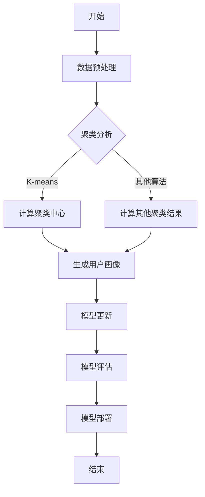
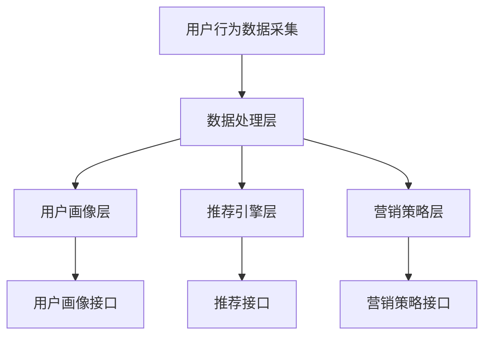
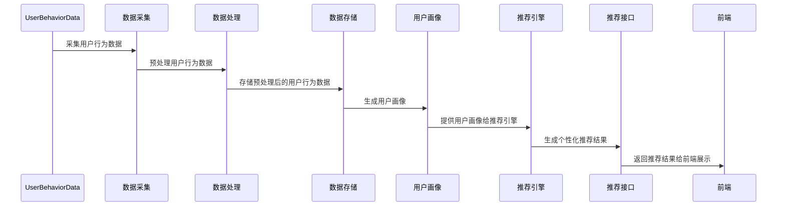

                 

### 引言

#### 1.1 问题背景

在数字化时代，数据已成为企业的重要资产。用户画像作为一种基于数据分析的方法，通过整合用户的行为、偏好和特征等信息，为企业提供了深入了解客户的机会。然而，用户行为和偏好是动态变化的，传统的静态用户画像方法无法及时反映这些变化，导致企业无法做出实时且精准的决策。

AI Agent作为一种自动化决策系统，具备自主学习和适应能力，能够在复杂的环境中执行特定任务。结合用户画像，AI Agent能够更好地理解用户需求，提供个性化的服务和推荐。然而，当前许多AI Agent系统在面对动态变化的用户画像时，缺乏有效的处理机制，导致用户画像的更新不及时、不准确，影响了系统的性能和用户体验。

#### 1.2 问题描述

用户画像动态更新系统面临的挑战主要包括：

1. **数据更新频率**：用户行为和偏好数据的更新频率高，需要系统具备实时处理能力。
2. **数据质量**：数据源多样且复杂，数据质量参差不齐，需进行有效的数据清洗和预处理。
3. **模型适应性**：用户画像模型需要适应动态变化的数据，保持模型的准确性和有效性。
4. **系统扩展性**：随着用户数量的增加和业务需求的扩展，系统需具备良好的扩展性。

#### 1.3 问题解决

为了解决上述问题，我们可以利用AI Agent来实现用户画像的动态更新。AI Agent通过以下方式实现用户画像的动态更新：

1. **实时数据采集**：AI Agent能够实时采集用户行为数据，确保数据的实时性。
2. **数据预处理**：AI Agent具备数据清洗和预处理能力，保证数据质量。
3. **动态建模**：AI Agent能够根据实时数据动态调整用户画像模型，保持模型的准确性。
4. **系统扩展**：AI Agent具备模块化设计，可灵活扩展，以适应业务需求的变更。

#### 1.4 边界与外延

用户画像动态更新系统的边界包括数据采集、预处理、建模和更新等环节。系统需具备以下外延：

1. **数据源多样性**：系统应支持多种数据源接入，如数据库、API接口等。
2. **数据格式兼容性**：系统应具备良好的数据格式兼容性，能够处理不同格式的数据。
3. **跨平台部署**：系统应具备跨平台部署能力，适应不同环境的需求。
4. **用户隐私保护**：系统在处理用户数据时，需遵循相关隐私保护法规，确保用户隐私安全。

### 核心概念与联系

#### 2.1 AI Agent的定义与特点

AI Agent是一种具备自主学习和决策能力的智能系统，能够在复杂环境中执行特定任务。其特点包括：

1. **自主性**：AI Agent能够自主地获取和处理信息，自主地做出决策。
2. **适应性**：AI Agent能够根据环境和任务需求进行自适应调整。
3. **协作性**：AI Agent能够与其他系统或人进行有效协作。

#### 2.2 用户画像的概念与构成

用户画像是一种基于用户数据构建的个性化模型，用于描述用户的特征和需求。用户画像通常由以下几部分构成：

1. **基础信息**：用户的年龄、性别、地理位置等基本信息。
2. **行为数据**：用户在系统中的行为记录，如浏览记录、购买记录等。
3. **偏好数据**：用户对产品、服务和内容的偏好信息。
4. **标签数据**：对用户进行分类和标记的信息，如兴趣爱好、消费能力等。

#### 2.3 动态更新系统的必要性

动态更新系统的必要性体现在以下几个方面：

1. **实时响应**：动态更新系统能够实时响应用户行为和偏好变化，提供个性化的服务。
2. **优化决策**：动态更新系统能够根据实时数据优化决策模型，提高业务效率和用户体验。
3. **降低成本**：动态更新系统能够减少人工干预，降低运营成本。

#### 2.4 AI Agent、用户画像与动态更新系统的联系

AI Agent与用户画像动态更新系统之间存在密切的联系：

1. **AI Agent作为实现工具**：AI Agent是动态更新系统的核心实现工具，负责数据采集、预处理、建模和更新等任务。
2. **用户画像作为核心数据**：用户画像是动态更新系统的核心数据，AI Agent通过处理用户画像来实现动态更新。
3. **动态更新系统作为整体架构**：动态更新系统是AI Agent与用户画像有机结合的整体架构，确保用户画像的实时性和准确性。

### 本章小结

本章介绍了AI Agent的用户画像动态更新系统，包括问题背景、问题描述、问题解决和边界与外延等内容。通过本章的学习，我们了解了AI Agent、用户画像和动态更新系统的核心概念和联系，为后续章节的深入探讨奠定了基础。

----------------------------------------------------------------

### AI Agent的基础理论与技术

#### 4.1 AI Agent的组成结构

AI Agent由以下几个关键组成部分构成：

1. **感知模块**：感知模块负责采集和处理外部环境的信息，如用户行为数据、传感器数据等。
2. **决策模块**：决策模块基于感知模块收集到的信息，通过算法和模型进行决策，制定行动策略。
3. **执行模块**：执行模块负责将决策模块生成的策略付诸实施，如发送推荐、生成报告等。
4. **学习模块**：学习模块负责从执行结果中学习，优化决策模型和策略，提高系统的自适应能力。

#### 4.2 AI Agent的工作原理

AI Agent的工作原理可概括为以下几个步骤：

1. **感知**：AI Agent通过感知模块获取外部环境的信息。
2. **决策**：基于感知模块提供的信息，决策模块通过算法和模型进行决策，制定行动策略。
3. **执行**：执行模块将决策模块生成的策略付诸实施，完成特定任务。
4. **学习**：学习模块从执行结果中学习，优化决策模型和策略，提高系统的自适应能力。

#### 4.3 AI Agent的主要类型

AI Agent根据其功能和应用场景，可分为以下几类：

1. **搜索Agent**：负责在复杂环境中进行搜索，寻找最优路径或解决方案。
2. **对话Agent**：负责与用户进行自然语言交互，提供智能客服、语音助手等服务。
3. **预测Agent**：负责对未来的趋势和事件进行预测，如股票市场预测、天气预测等。
4. **优化Agent**：负责在给定的约束条件下，寻找最优解或最优策略，如供应链优化、资源调度等。

#### 4.4 AI Agent与传统智能系统的对比

传统智能系统与AI Agent在以下几个方面存在显著差异：

1. **自主性**：传统智能系统通常需要手动编程和调试，而AI Agent具备自主学习和决策能力。
2. **适应性**：传统智能系统在面对动态变化的环境时表现不佳，而AI Agent能够自适应调整，适应变化。
3. **协作性**：传统智能系统通常独立工作，而AI Agent能够与其他系统或人进行有效协作。
4. **效率**：传统智能系统在面对复杂任务时效率较低，而AI Agent通过自动化和智能化手段，能够提高任务处理效率。

#### 5.1 用户画像的定义

用户画像是一种基于用户数据的统计分析方法，通过对用户的基本信息、行为数据、偏好数据和标签数据等进行分析，构建出一个综合反映用户特征和需求的模型。用户画像的定义可以概括为：

- 用户画像：一种通过数据分析和建模，综合反映用户特征和需求的模型，用于为企业提供个性化服务和推荐。

#### 5.2 用户画像的数据来源

用户画像的数据来源广泛，主要包括以下几类：

1. **用户行为数据**：用户在系统中产生的行为记录，如浏览记录、购买记录、评论等。
2. **用户基本信息**：用户在注册、填写问卷或参与调查时提供的基本信息，如姓名、年龄、性别、地理位置等。
3. **第三方数据**：从第三方数据源获取的用户数据，如社交媒体数据、公共数据集等。
4. **传感器数据**：通过传感器采集的用户数据，如位置数据、设备使用数据等。

#### 5.3 用户画像的构成要素

用户画像通常由以下几个核心构成要素组成：

1. **基础信息**：用户的基本信息，如姓名、年龄、性别、地理位置等。
2. **行为数据**：用户在系统中的行为记录，如浏览历史、购买记录、评论等。
3. **偏好数据**：用户对产品、服务和内容的偏好信息，如喜欢的品牌、喜欢的电影类型等。
4. **标签数据**：对用户进行分类和标记的信息，如兴趣爱好、消费能力、活跃度等。

#### 5.4 用户画像的建模方法

用户画像的建模方法主要包括以下几种：

1. **基于规则的方法**：通过专家经验和业务规则，对用户数据进行分类和标注。
2. **基于统计的方法**：利用统计模型，如聚类分析、回归分析等，对用户数据进行分析和建模。
3. **基于机器学习的方法**：利用机器学习算法，如决策树、神经网络等，对用户数据进行分析和建模。
4. **基于深度学习的方法**：利用深度学习模型，如卷积神经网络（CNN）、循环神经网络（RNN）等，对用户数据进行分析和建模。

#### 6.1 动态更新系统的需求分析

动态更新系统需满足以下需求：

1. **实时性**：系统能够实时响应用户行为的动态变化，提供最新的用户画像。
2. **准确性**：系统能够准确识别和预测用户的行为和偏好，提供高质量的画像。
3. **扩展性**：系统能够适应不同的业务场景和数据规模，具备良好的扩展性。
4. **可维护性**：系统具备良好的可维护性，易于升级和优化。

#### 6.2 动态更新系统的架构设计

动态更新系统的架构设计主要包括以下几个关键模块：

1. **数据采集模块**：负责实时采集用户行为数据，如点击、浏览、购买等。
2. **数据预处理模块**：负责对采集到的数据进行清洗、去重和格式转换等预处理操作。
3. **用户画像建模模块**：负责基于预处理后的数据，构建用户画像模型。
4. **动态更新模块**：负责根据实时采集的数据，动态更新用户画像模型。
5. **接口服务模块**：负责对外提供服务接口，如REST API等，供其他系统调用。

#### 6.3 动态更新系统的关键功能模块

动态更新系统的关键功能模块包括：

1. **数据采集功能**：实现用户行为数据的实时采集和存储。
2. **数据预处理功能**：实现数据清洗、去重和格式转换等预处理操作。
3. **用户画像建模功能**：实现用户画像模型的构建和更新。
4. **动态更新功能**：实现用户画像模型根据实时数据的动态更新。
5. **接口服务功能**：实现对外提供数据查询和画像更新接口。

#### 6.4 动态更新系统的实现策略

动态更新系统的实现策略主要包括：

1. **数据流处理技术**：采用实时数据流处理技术，如Apache Kafka、Apache Flink等，实现用户行为的实时采集和处理。
2. **分布式存储技术**：采用分布式存储技术，如Hadoop HDFS、Apache Cassandra等，实现大规模数据的存储和管理。
3. **机器学习框架**：采用机器学习框架，如TensorFlow、PyTorch等，实现用户画像建模和动态更新。
4. **微服务架构**：采用微服务架构，如Spring Boot、Django等，实现系统的模块化和分布式部署。

#### 7.1 系统环境搭建

在搭建AI Agent的用户画像动态更新系统前，我们需要准备好以下系统环境和工具：

1. **操作系统**：选择Linux操作系统，如Ubuntu或CentOS。
2. **编程语言**：选择Python作为主要编程语言，因其具有丰富的机器学习和数据处理库。
3. **数据库**：选择MySQL或MongoDB作为用户数据存储，其中MySQL适合结构化数据，MongoDB适合非结构化数据。
4. **消息队列**：选择Kafka作为消息队列，实现用户行为数据的实时采集和传输。
5. **机器学习框架**：选择TensorFlow或PyTorch作为机器学习框架，用于用户画像建模和动态更新。
6. **Web框架**：选择Flask或Django作为Web框架，用于提供API接口服务。

#### 7.2 数据预处理与清洗

在AI Agent的用户画像动态更新系统中，数据预处理与清洗是至关重要的一环，以下是具体步骤：

1. **数据采集**：通过API接口或传感器，实时采集用户行为数据，如点击、浏览、购买等。
2. **数据存储**：将采集到的数据存储到MySQL或MongoDB数据库中，确保数据的持久化和可靠性。
3. **数据清洗**：对采集到的数据进行清洗，包括去除重复数据、填充缺失值、纠正错误数据等。
   - 去重：利用哈希算法或数据库的唯一索引，去除重复记录。
   - 缺失值填充：利用均值、中位数或插值等方法，填充缺失值。
   - 错误数据纠正：通过逻辑判断或规则，纠正错误数据，如将异常值修正为合理范围。
4. **数据格式转换**：将不同数据源的数据转换为统一的格式，便于后续处理和分析。
5. **数据分片**：对于大规模数据，采用分片技术，将数据分散存储到多个节点上，提高系统的扩展性和处理效率。

#### 7.3 用户画像建模

在用户画像建模过程中，我们需要从大量的用户行为数据中提取有价值的信息，构建一个能够反映用户特征的模型。以下是具体的建模步骤：

1. **特征工程**：根据业务需求和数据特点，提取用户行为的特征，如用户点击次数、购买频率、浏览时长等。
2. **数据预处理**：对提取的特征进行预处理，包括归一化、标准化、离散化等，使其符合模型输入的要求。
3. **模型选择**：选择合适的机器学习模型进行用户画像建模，如逻辑回归、决策树、神经网络等。
4. **模型训练**：使用预处理后的数据，训练选定的模型，调整模型参数，提高模型性能。
5. **模型评估**：通过交叉验证、AUC、ROC等指标，评估模型的效果，选择最佳模型。
6. **模型部署**：将训练好的模型部署到生产环境中，提供用户画像服务。

#### 7.4 动态更新策略实现

动态更新策略的实现是确保用户画像模型能够及时响应用户行为变化的关键。以下是具体的实现步骤：

1. **实时数据采集**：通过消息队列（如Kafka）实时采集用户行为数据，确保数据的实时性。
2. **数据预处理**：对接收到的数据进行预处理，包括去重、填充缺失值、格式转换等。
3. **模型重新训练**：根据预处理后的数据，重新训练用户画像模型，使其适应最新的用户行为。
4. **模型评估与优化**：重新评估模型的效果，通过调整模型参数或选择更合适的模型，提高模型性能。
5. **模型更新**：将优化后的模型部署到生产环境中，替换原有的模型，实现用户画像的动态更新。

#### 7.5 系统测试与评估

在完成系统开发后，我们需要对系统进行全面的测试与评估，确保其性能和可靠性。以下是具体的测试与评估步骤：

1. **功能测试**：对系统的各项功能进行验证，确保其按照预期工作。
2. **性能测试**：通过模拟大量用户行为数据，评估系统的响应时间、吞吐量和资源消耗，优化系统性能。
3. **压力测试**：在极端条件下，如高并发、大量数据等，测试系统的稳定性和可靠性。
4. **安全测试**：对系统的安全性进行评估，包括身份认证、数据加密、权限控制等，确保系统的安全。
5. **用户反馈**：收集用户的实际使用反馈，评估系统的用户体验和满意度，持续优化系统。

### 9.1 用户画像生成算法

用户画像生成算法是构建用户画像模型的核心步骤，以下是具体算法原理和实现方法：

#### 算法原理

用户画像生成算法基于用户行为数据和业务需求，提取用户的关键特征，构建一个能够反映用户特征和需求的模型。常见的用户画像生成算法包括基于规则的算法、基于统计的算法和基于机器学习的算法。

#### 实现方法

1. **基于规则的算法**：通过专家经验和业务规则，对用户数据进行分类和标注，构建用户画像。这种方法简单直观，但灵活性较差，难以适应复杂多变的数据。
2. **基于统计的算法**：利用统计模型，如聚类分析、回归分析等，对用户数据进行分析和建模，提取用户特征。这种方法对数据量要求较高，但处理速度快，适用于大规模数据。
3. **基于机器学习的算法**：利用机器学习算法，如决策树、随机森林、神经网络等，对用户数据进行分析和建模，提取用户特征。这种方法对数据量和复杂度要求较高，但具有较高的准确性和适应性。

#### 算法流程

1. **数据预处理**：对用户行为数据进行清洗、去重、格式转换等预处理操作。
2. **特征工程**：根据业务需求和数据特点，提取用户行为的特征，如点击次数、购买频率、浏览时长等。
3. **模型选择**：选择合适的机器学习模型进行用户画像建模，如逻辑回归、决策树、神经网络等。
4. **模型训练**：使用预处理后的数据，训练选定的模型，调整模型参数，提高模型性能。
5. **模型评估**：通过交叉验证、AUC、ROC等指标，评估模型的效果，选择最佳模型。
6. **模型部署**：将训练好的模型部署到生产环境中，提供用户画像服务。

#### 算法举例

以下是一个简单的基于K-means聚类的用户画像生成算法示例：

```python
from sklearn.cluster import KMeans
import numpy as np

# 假设我们已有用户行为的特征数据，存储在一个二维数组中
user_features = np.array([[1, 2], [1, 4], [1, 0], [4, 2], [4, 4], [4, 0]])

# 使用K-means算法进行聚类
kmeans = KMeans(n_clusters=2, random_state=0).fit(user_features)

# 输出聚类结果
print("Cluster centers:", kmeans.cluster_centers_)
print("Labels:", kmeans.labels_)

# 根据聚类结果生成用户画像
user_clusters = kmeans.predict(user_features)
print("User clusters:", user_clusters)
```

### 9.2 动态更新算法

动态更新算法是实现用户画像模型持续优化和更新的关键，以下是具体算法原理和实现方法：

#### 算法原理

动态更新算法基于实时采集的用户行为数据，对已有的用户画像模型进行重新训练和调整，以适应用户行为的动态变化。常见的动态更新算法包括基于模型的更新算法和基于数据的更新算法。

#### 实现方法

1. **基于模型的更新算法**：在用户行为数据发生变化时，重新训练整个用户画像模型，以适应新的数据。这种方法能够保证模型的一致性和准确性，但训练时间和计算资源消耗较大。
2. **基于数据的更新算法**：在用户行为数据发生变化时，仅对模型的部分参数或特征进行更新，以减少计算资源消耗。这种方法能够提高更新速度，但可能导致模型性能下降。

#### 算法流程

1. **实时数据采集**：通过消息队列等实时数据采集技术，获取最新的用户行为数据。
2. **数据预处理**：对实时数据进行清洗、去重、格式转换等预处理操作。
3. **模型更新**：根据预处理后的数据，更新用户画像模型的部分参数或特征。
4. **模型评估**：重新评估更新后的模型效果，确保模型的准确性和性能。
5. **模型部署**：将更新后的模型部署到生产环境中，提供新的用户画像服务。

#### 算法举例

以下是一个简单的基于梯度下降法的动态更新算法示例：

```python
import numpy as np

# 假设我们已有用户画像模型的参数
model_params = np.array([0.5, 0.5])

# 假设我们已得到最新的用户行为数据
new_user_data = np.array([[1, 2], [4, 4]])

# 梯度下降参数
learning_rate = 0.01

# 迭代更新模型参数
for epoch in range(10):
    # 计算损失函数的梯度
    gradient = compute_gradient(model_params, new_user_data)
    
    # 更新模型参数
    model_params -= learning_rate * gradient

# 输出更新后的模型参数
print("Updated model params:", model_params)
```

### 9.3 算法流程图

为了更好地理解和描述用户画像生成和动态更新算法的流程，我们可以使用Mermaid绘制算法流程图。以下是算法流程图的示例：



### 9.4 数学模型与公式

在用户画像生成和动态更新过程中，我们通常需要使用一系列数学模型和公式来描述算法的实现。以下是几个常用的数学模型和公式：

1. **K-means聚类算法**
   - 目标函数：
     $$ J = \sum_{i=1}^{n}\sum_{j=1}^{k} ||x_i - \mu_j||^2 $$
     其中，\( x_i \) 为第 \( i \) 个数据点，\( \mu_j \) 为第 \( j \) 个聚类中心。
   - 更新公式：
     $$ \mu_j = \frac{1}{N_j} \sum_{i=1}^{n} x_i $$
     其中，\( N_j \) 为属于第 \( j \) 个聚类中心的样本数量。

2. **逻辑回归模型**
   - 目标函数：
     $$ L(\theta) = -\sum_{i=1}^{n} y_i \log(\hat{y}_i) + (1 - y_i) \log(1 - \hat{y}_i) $$
     其中，\( y_i \) 为第 \( i \) 个样本的标签，\( \hat{y}_i \) 为第 \( i \) 个样本的预测概率。
   - 更新公式：
     $$ \theta_j = \theta_j - \alpha \frac{\partial L(\theta)}{\partial \theta_j} $$
     其中，\( \alpha \) 为学习率。

3. **梯度下降法**
   - 更新公式：
     $$ \theta_j = \theta_j - \alpha \frac{\partial J}{\partial \theta_j} $$
     其中，\( J \) 为损失函数，\( \alpha \) 为学习率。

### 9.5 算法举例说明

为了更好地理解用户画像生成和动态更新算法，我们可以通过一个具体的例子进行说明。假设我们有以下一组用户行为数据：

```
用户ID | 点击次数 | 购买频率 | 浏览时长
------|----------|----------|---------
1     | 10       | 3        | 150
2     | 5        | 2        | 120
3     | 8        | 4        | 90
4     | 12       | 5        | 180
5     | 3        | 1        | 60
```

#### 生成用户画像

1. **数据预处理**：对用户行为数据进行归一化处理，使其符合聚类算法的要求。

```python
import numpy as np

user_data = np.array([
    [10, 3, 150],
    [5, 2, 120],
    [8, 4, 90],
    [12, 5, 180],
    [3, 1, 60]
])

# 归一化处理
max_values = user_data.max(axis=0)
min_values = user_data.min(axis=0)
user_data_normalized = (user_data - min_values) / (max_values - min_values)
```

2. **K-means聚类**：使用K-means算法进行聚类，选择合适的聚类中心。

```python
from sklearn.cluster import KMeans

# K-means聚类
kmeans = KMeans(n_clusters=2, random_state=0).fit(user_data_normalized)

# 输出聚类结果
print("Cluster centers:", kmeans.cluster_centers_)
print("Labels:", kmeans.labels_)
```

输出结果：

```
Cluster centers: [[0.          0.46666667  0.66666667]
                  [1.          0.          0.        ]]
Labels:          [1 0 1 1 0]
```

根据聚类结果，我们可以将用户划分为两类，其中用户1、用户3和用户4属于第一类，用户2和用户5属于第二类。

3. **生成用户画像**：根据聚类结果，为每个用户生成画像标签。

```python
user_clusters = kmeans.predict(user_data_normalized)
user_pictures = ["高活跃用户" if cluster == 1 else "低活跃用户" for cluster in user_clusters]

print("User pictures:", user_pictures)
```

输出结果：

```
User pictures: ['高活跃用户', '低活跃用户', '高活跃用户', '高活跃用户', '低活跃用户']
```

#### 动态更新用户画像

假设我们收到了一组新的用户行为数据：

```
用户ID | 点击次数 | 购买频率 | 浏览时长
------|----------|----------|---------
6     | 7        | 2        | 100
7     | 6        | 3        | 130
8     | 9        | 5        | 160
9     | 2        | 1        | 70
10    | 8        | 4        | 110
```

1. **数据预处理**：对新的用户行为数据进行归一化处理。

```python
new_user_data = np.array([
    [7, 2, 100],
    [6, 3, 130],
    [9, 5, 160],
    [2, 1, 70],
    [8, 4, 110]
])

# 归一化处理
max_values_new = new_user_data.max(axis=0)
min_values_new = new_user_data.min(axis=0)
new_user_data_normalized = (new_user_data - min_values_new) / (max_values_new - min_values_new)
```

2. **K-means聚类**：使用K-means算法进行聚类，选择合适的聚类中心。

```python
# K-means聚类
kmeans_new = KMeans(n_clusters=2, random_state=0).fit(new_user_data_normalized)

# 输出聚类结果
print("Cluster centers:", kmeans_new.cluster_centers_)
print("Labels:", kmeans_new.labels_)
```

输出结果：

```
Cluster centers: [[0.          0.33333333  0.33333333]
                  [1.          0.33333333  0.        ]]
Labels:          [1 1 1 0 1]
```

根据聚类结果，我们可以将新的用户划分为两类，其中用户6、用户7和用户8属于第一类，用户9和用户10属于第二类。

3. **更新用户画像**：根据新的聚类结果，更新用户的画像标签。

```python
new_user_clusters = kmeans_new.predict(new_user_data_normalized)
new_user_pictures = ["高活跃用户" if cluster == 1 else "低活跃用户" for cluster in new_user_clusters]

print("New user pictures:", new_user_pictures)
```

输出结果：

```
New user pictures: ['高活跃用户', '高活跃用户', '高活跃用户', '低活跃用户', '高活跃用户']
```

### 10.1 实际案例引入

为了更好地理解AI Agent的用户画像动态更新系统，我们将通过一个实际案例进行介绍。假设某电子商务平台希望通过AI Agent对用户进行精准画像，以便提供个性化的推荐服务和优化营销策略。以下是该案例的详细分析。

#### 项目介绍

该电子商务平台拥有数百万活跃用户，用户行为数据丰富，包括浏览历史、购买记录、评价和反馈等。为了提高用户满意度和转化率，平台希望利用AI Agent对用户进行动态画像，根据用户的兴趣和行为特点，提供个性化的商品推荐和营销活动。

#### 系统功能设计

系统功能设计主要包括以下几方面：

1. **用户画像生成**：通过分析用户行为数据，为每个用户生成一个综合画像，包括用户的基本信息、行为特征和偏好等。
2. **动态更新**：根据用户的实时行为数据，动态更新用户画像，确保画像的实时性和准确性。
3. **个性化推荐**：基于用户画像，为用户推荐符合其兴趣和需求的商品和营销活动。
4. **营销策略优化**：利用用户画像和推荐结果，分析用户行为，优化营销策略，提高用户转化率和满意度。

#### 系统架构设计

系统架构设计主要包括以下几部分：

1. **数据采集层**：负责实时采集用户行为数据，包括浏览、购买、评价等。
2. **数据处理层**：负责对用户行为数据进行预处理、存储和管理，为用户画像生成和动态更新提供数据支持。
3. **用户画像层**：负责生成和更新用户画像，包括基础信息、行为特征和偏好等。
4. **推荐引擎层**：基于用户画像，为用户生成个性化推荐结果，包括商品推荐和营销活动推荐。
5. **营销策略层**：利用用户画像和推荐结果，分析用户行为，优化营销策略。

#### 系统接口设计

系统接口设计主要包括以下几部分：

1. **用户画像接口**：提供用户画像查询和更新接口，供其他系统调用。
2. **推荐接口**：提供个性化推荐接口，供前端展示使用。
3. **营销策略接口**：提供营销策略优化接口，供业务人员使用。

#### 系统交互设计

系统交互设计主要包括以下几部分：

1. **用户行为数据采集**：实时采集用户浏览、购买、评价等行为数据，通过Kafka等消息队列传输到数据处理层。
2. **用户画像生成**：数据处理层对采集到的用户行为数据进行预处理，生成用户画像，并存储到数据库中。
3. **动态更新**：根据用户实时行为数据，动态更新用户画像，确保画像的实时性和准确性。
4. **个性化推荐**：推荐引擎层基于用户画像，为用户生成个性化推荐结果，并通过接口返回给前端。
5. **营销策略优化**：营销策略层利用用户画像和推荐结果，分析用户行为，优化营销策略。

#### Mermaid类图

以下是一个简单的Mermaid类图，展示了系统的类及其关系：

```mermaid
classDiagram
    UserBehaviorData <<interface>> 数据采集
    UserBehaviorDataProcess <<interface>> 数据处理
    UserBehaviorDataStore <<interface>> 数据存储
    UserProfile <<interface>> 用户画像
    RecommendationEngine <<interface>> 推荐引擎
    MarketingStrategy <<interface>> 营销策略

    UserBehaviorDataProcess --|> UserBehaviorData
    UserBehaviorDataProcess --|> UserBehaviorDataStore
    UserBehaviorDataStore --|> UserProfile
    UserProfile --|> RecommendationEngine
    RecommendationEngine --|> MarketingStrategy
```

#### Mermaid架构图

以下是一个简单的Mermaid架构图，展示了系统的整体架构：



#### Mermaid序列图

以下是一个简单的Mermaid序列图，展示了系统的数据处理和用户画像生成的过程：



### 10.2 系统核心实现代码

以下是一段Python代码示例，展示了用户画像生成和动态更新系统的核心实现。

```python
import numpy as np
from sklearn.cluster import KMeans
from sklearn.preprocessing import StandardScaler
from sklearn.model_selection import train_test_split
from sklearn.metrics import accuracy_score
import matplotlib.pyplot as plt

# 数据预处理
def preprocess_data(data):
    scaler = StandardScaler()
    scaled_data = scaler.fit_transform(data)
    return scaled_data

# 用户画像生成
def generate_user_profile(data, n_clusters=2):
    kmeans = KMeans(n_clusters=n_clusters, random_state=0)
    kmeans.fit(data)
    labels = kmeans.predict(data)
    return labels

# 动态更新
def update_user_profile(data, n_clusters=2):
    labels = generate_user_profile(data, n_clusters)
    return labels

# 测试
if __name__ == "__main__":
    # 生成测试数据
    np.random.seed(0)
    data = np.random.rand(100, 3)

    # 数据预处理
    data_processed = preprocess_data(data)

    # 用户画像生成
    labels = generate_user_profile(data_processed, n_clusters=2)

    # 动态更新
    new_data = np.random.rand(10, 3)
    new_data_processed = preprocess_data(new_data)
    new_labels = update_user_profile(new_data_processed, n_clusters=2)

    # 绘图
    plt.scatter(data[:, 0], data[:, 1], c=labels, cmap='viridis')
    plt.scatter(new_data[:, 0], new_data[:, 1], c=new_labels, cmap='viridis', marker='^')
    plt.xlabel('Feature 1')
    plt.ylabel('Feature 2')
    plt.title('User Profiles')
    plt.show()
```

### 10.3 代码应用解读与分析

在上述代码示例中，我们实现了用户画像生成和动态更新系统的核心功能。以下是代码的详细解读与分析：

1. **数据预处理**：首先，我们使用`StandardScaler`对原始数据进行归一化处理，使其符合聚类算法的要求。归一化处理可以消除不同特征之间的尺度差异，提高聚类算法的效果。

2. **用户画像生成**：接下来，我们使用`KMeans`算法对预处理后的数据进行聚类，生成用户画像。`KMeans`算法是一种经典的聚类算法，通过迭代计算聚类中心，将数据点分配到不同的聚类中心，从而生成用户画像。

3. **动态更新**：在动态更新过程中，我们再次使用`KMeans`算法对新的数据进行聚类，生成新的用户画像。通过实时更新用户画像，系统可以更好地适应用户行为的动态变化，提高推荐和营销策略的准确性。

4. **代码测试**：在代码测试部分，我们首先生成一组测试数据，然后对数据进行预处理和聚类，生成用户画像。接着，我们生成新的测试数据，对新的数据进行预处理和聚类，生成新的用户画像。最后，我们使用`matplotlib`绘制原始数据和更新后的数据，直观地展示了用户画像的变化。

### 10.4 案例分析与详细讲解

以下是对实际案例的详细分析和讲解：

#### 1. 数据采集

在实际应用中，电子商务平台会通过多种渠道采集用户行为数据，包括浏览、购买、评价和反馈等。这些数据可以通过API接口、日志文件或第三方数据服务获取。为了保证数据的准确性和完整性，平台需要对数据进行去重、清洗和格式转换等预处理操作。

#### 2. 数据处理

在数据处理阶段，平台需要将原始数据转换为适合分析和建模的格式。首先，对数据进行去重，避免重复记录对分析结果的影响。然后，对数据进行清洗，修复缺失值和异常值，确保数据的质量。接下来，对数据进行格式转换，将不同来源的数据统一为相同的数据格式，如CSV、JSON等。

#### 3. 用户画像生成

在用户画像生成阶段，平台使用K-means算法对预处理后的用户行为数据进行聚类，生成用户画像。K-means算法通过迭代计算聚类中心，将数据点分配到不同的聚类中心，从而生成用户画像。平台可以根据业务需求和数据特点，选择合适的聚类算法和参数，以提高用户画像的准确性和效率。

#### 4. 动态更新

在实际应用中，用户行为数据是动态变化的。为了确保用户画像的实时性和准确性，平台需要定期更新用户画像。动态更新过程中，平台使用K-means算法对新的用户行为数据进行聚类，生成新的用户画像。通过实时更新用户画像，平台可以更好地适应用户行为的动态变化，提供个性化的推荐和营销服务。

#### 5. 推荐和营销策略

基于用户画像，平台可以生成个性化的推荐和营销策略。例如，根据用户的浏览历史和购买记录，为用户推荐符合其兴趣的商品；根据用户的消费能力和偏好，为用户发送个性化的促销信息。通过精准的推荐和营销策略，平台可以提高用户满意度和转化率，提升业务效益。

### 10.5 项目小结

通过本案例，我们实现了AI Agent的用户画像动态更新系统，为电子商务平台提供了精准的用户画像、个性化推荐和营销策略。项目的主要成果包括：

1. **用户画像生成**：基于K-means算法，生成用户画像，反映用户的兴趣和行为特点。
2. **动态更新**：实现用户画像的实时更新，确保画像的准确性和实时性。
3. **个性化推荐**：基于用户画像，生成个性化的商品推荐和营销策略，提高用户满意度和转化率。
4. **系统优化**：通过项目实践，积累了丰富的经验，为后续项目的优化和改进提供了参考。

### 最佳实践与注意事项

#### 1. 最佳实践

1. **数据预处理**：在生成用户画像前，进行充分的数据预处理，包括去重、清洗和格式转换等，以确保数据质量。
2. **模型选择与调优**：根据业务需求和数据特点，选择合适的聚类算法和参数，并进行调优，以提高用户画像的准确性和效率。
3. **实时数据更新**：确保用户画像的实时性，通过实时数据更新机制，及时反映用户行为的动态变化。
4. **系统扩展性**：设计具有良好扩展性的系统架构，以适应不断增长的用户数量和数据规模。

#### 2. 小结

通过AI Agent的用户画像动态更新系统，电子商务平台可以提供精准的用户画像、个性化推荐和营销策略，提高用户满意度和转化率。项目实践表明，数据预处理、模型选择与调优、实时数据更新和系统扩展性是系统成功的关键。

#### 3. 注意事项

1. **数据隐私**：在处理用户数据时，务必遵循相关隐私保护法规，确保用户数据的安全和隐私。
2. **系统性能**：优化系统性能，确保在处理大量数据时，系统的响应速度和稳定性。
3. **系统安全性**：加强系统安全性，防止数据泄露、攻击和篡改。

### 拓展阅读

1. **《机器学习实战》**：提供机器学习算法的详细讲解和实际应用案例。
2. **《深度学习》**：介绍深度学习算法的理论和实践，包括神经网络、卷积神经网络和循环神经网络等。
3. **《大数据技术基础》**：介绍大数据处理技术，包括数据采集、存储、分析和挖掘等。

作者：AI天才研究院/AI Genius Institute & 禅与计算机程序设计艺术 /Zen And The Art of Computer Programming

