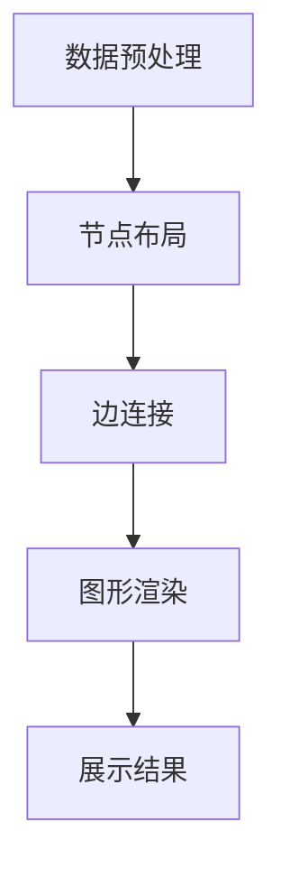
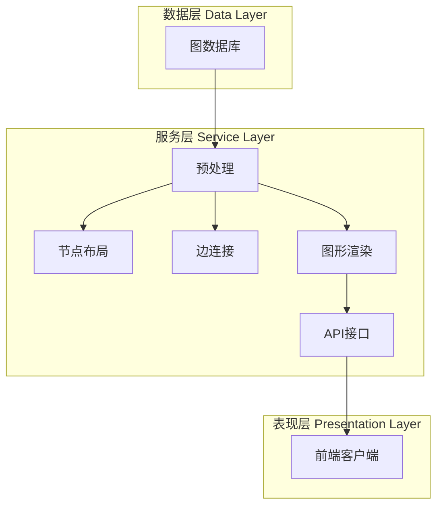
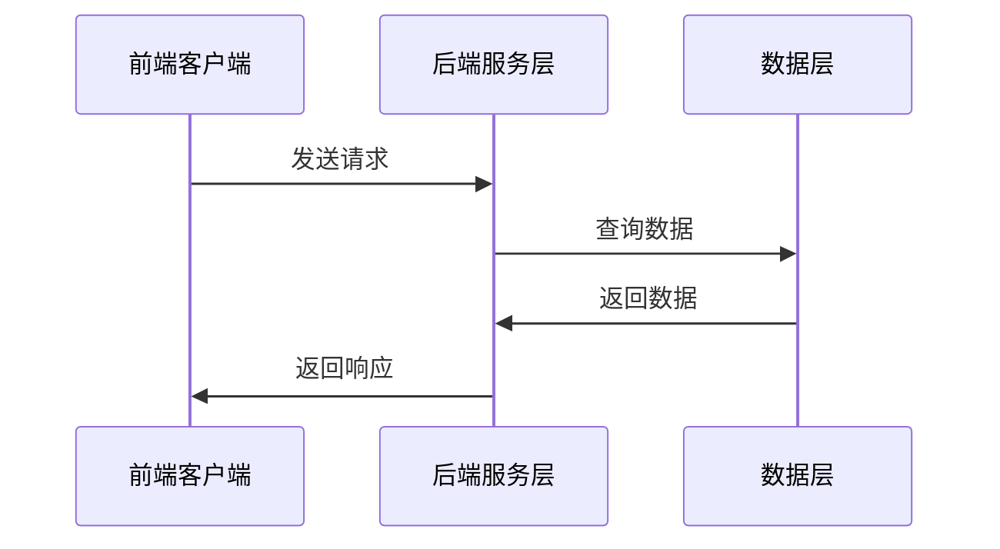

                 


# AI Agent的知识图谱可视化技术

## 关键词

- **AI Agent**
- **知识图谱**
- **可视化技术**
- **算法原理**
- **系统设计与实现**
- **项目实战**

## 摘要

本文旨在深入探讨AI Agent在知识图谱可视化技术中的应用。我们将首先介绍AI Agent和知识图谱的基本概念，然后分析可视化技术的目的、方法及其研究现状。接着，我们将逐步讲解知识图谱可视化技术的核心概念、算法原理以及系统架构。通过一个实际的项目实战案例，我们将展示如何将理论知识应用于实际场景，并详细分析各个环节的实现过程。最后，我们将总结本文的主要知识点，并提供一些注意事项和拓展阅读资源，以帮助读者进一步深入了解这一领域。

## 目录大纲

----------------------------------------------------------------
# 第一部分：背景介绍与核心概念

## 第1章：AI Agent与知识图谱概述

### 1.1 AI Agent的概念与特点

### 1.2 知识图谱的基本概念

### 1.3 AI Agent与知识图谱的联系

## 第2章：知识图谱可视化技术概述

### 2.1 知识图谱可视化的目的与意义

### 2.2 知识图谱可视化的基本方法

### 2.3 知识图谱可视化技术的研究现状

## 第3章：核心概念与联系

### 3.1 关键概念介绍

### 3.2 概念属性特征对比表格

### 3.3 ER实体关系图架构

----------------------------------------------------------------

# 第二部分：算法原理与实现

## 第4章：知识图谱可视化算法原理

### 4.1 算法基本原理

### 4.2 算法流程图（使用mermaid绘制）

### 4.3 Python代码实现与详细讲解

### 4.4 数学模型与公式（使用LaTeX格式）

## 第5章：算法优化与性能分析

### 5.1 算法优化策略

### 5.2 性能分析指标

### 5.3 实验结果与性能评估

----------------------------------------------------------------

# 第三部分：系统设计与实现

## 第6章：系统架构与设计

### 6.1 系统架构设计

### 6.2 系统功能设计（使用mermaid类图）

### 6.3 系统接口设计

### 6.4 系统交互（使用mermaid序列图）

## 第7章：项目实战

### 7.1 环境安装与配置

### 7.2 系统核心实现源代码

### 7.3 代码应用解读与分析

### 7.4 实际案例分析与讲解

### 7.5 项目小结

----------------------------------------------------------------

# 第四部分：总结与拓展

## 第8章：总结与注意事项

### 8.1 知识点总结

### 8.2 使用注意事项

### 8.3 拓展阅读

----------------------------------------------------------------

## 设计注意事项

- **简洁性**：目录大纲要简洁明了，避免冗余信息。
- **逻辑性**：章节之间要有明确的逻辑关系，方便读者理解。
- **内容完整性**：确保每个章节的核心内容都得到体现。
- **可读性**：使用markdown格式，使得目录结构清晰，便于阅读。

## 目录大纲总字数限制

2000字以内。在确保内容完整性和可读性的前提下，尽量控制字数。如果某一章节内容较多，可以考虑拆分为多个小节。在编写过程中，可以随时检查总字数，确保不超过限制。

## 核心内容要求

- **背景介绍**：每个章节都要有简明的背景介绍，包括问题背景、问题描述、问题解决、边界与外延等。
- **核心概念与联系**：强调核心概念的定义、特征对比和它们之间的联系。
- **算法原理讲解**：使用mermaid流程图和Python代码详细阐述算法原理，配合LaTeX公式进行数学模型的讲解。
- **系统设计与实现**：提供系统架构图、类图、序列图等设计图，并详细讲解各个部分的功能和实现方式。
- **项目实战**：详细介绍项目的环境安装、核心实现、代码解读和案例分析。

---

### 目录大纲设计与注意事项

在设计目录大纲时，我们需要遵循以下步骤：

1. **总体结构确定**：确定书的总体结构，包括主要章节和各个章节的核心内容。
2. **细化章节内容**：对每个章节进行进一步的细化，确定每个章节下的二级和三级目录。
3. **核心概念与联系**：在每个章节中，特别要强调核心概念的介绍和它们之间的联系。
4. **算法原理讲解**：对于涉及算法的部分，需要设计相应的mermaid流程图，并使用Python代码和LaTeX公式进行详细讲解。
5. **系统分析与架构设计方案**：对于涉及系统设计和实现的部分，需要设计mermaid类图、架构图和序列图，并进行详细讲解。
6. **项目实战**：设计一个实际的项目实战案例，详细描述环境安装、核心实现、代码解读和案例分析。
7. **总结与拓展**：在每个章节的末尾，提供总结、注意事项和拓展阅读，以帮助读者巩固知识和延伸阅读。

### 目录大纲示例

```markdown
----------------------------------------------------------------
# 第一部分：背景介绍与核心概念

## 第1章：AI Agent与知识图谱概述

### 1.1 AI Agent的概念与特点

### 1.2 知识图谱的基本概念

### 1.3 AI Agent与知识图谱的联系

## 第2章：知识图谱可视化技术概述

### 2.1 知识图谱可视化的目的与意义

### 2.2 知识图谱可视化的基本方法

### 2.3 知识图谱可视化技术的研究现状

## 第3章：核心概念与联系

### 3.1 关键概念介绍

### 3.2 概念属性特征对比表格

### 3.3 ER实体关系图架构

----------------------------------------------------------------

# 第二部分：算法原理与实现

## 第4章：知识图谱可视化算法原理

### 4.1 算法基本原理

### 4.2 算法流程图（使用mermaid绘制）

### 4.3 Python代码实现与详细讲解

### 4.4 数学模型与公式（使用LaTeX格式）

## 第5章：算法优化与性能分析

### 5.1 算法优化策略

### 5.2 性能分析指标

### 5.3 实验结果与性能评估

----------------------------------------------------------------

# 第三部分：系统设计与实现

## 第6章：系统架构与设计

### 6.1 系统架构设计

### 6.2 系统功能设计（使用mermaid类图）

### 6.3 系统接口设计

### 6.4 系统交互（使用mermaid序列图）

## 第7章：项目实战

### 7.1 环境安装与配置

### 7.2 系统核心实现源代码

### 7.3 代码应用解读与分析

### 7.4 实际案例分析与讲解

### 7.5 项目小结

----------------------------------------------------------------

# 第四部分：总结与拓展

## 第8章：总结与注意事项

### 8.1 知识点总结

### 8.2 使用注意事项

### 8.3 拓展阅读

----------------------------------------------------------------
```

### 设计注意事项

- **简洁性**：目录大纲要简洁明了，避免冗余信息。
- **逻辑性**：章节之间要有明确的逻辑关系，方便读者理解。
- **内容完整性**：确保每个章节的核心内容都得到体现。
- **可读性**：使用markdown格式，使得目录结构清晰，便于阅读。

### 目录大纲总字数限制

2000字以内。在确保内容完整性和可读性的前提下，尽量控制字数。如果某一章节内容较多，可以考虑拆分为多个小节。在编写过程中，可以随时检查总字数，确保不超过限制。

### 核心内容要求

- **背景介绍**：每个章节都要有简明的背景介绍，包括问题背景、问题描述、问题解决、边界与外延等。
- **核心概念与联系**：强调核心概念的定义、特征对比和它们之间的联系。
- **算法原理讲解**：使用mermaid流程图和Python代码详细阐述算法原理，配合LaTeX公式进行数学模型的讲解。
- **系统设计与实现**：提供系统架构图、类图、序列图等设计图，并详细讲解各个部分的功能和实现方式。
- **项目实战**：详细介绍项目的环境安装、核心实现、代码解读和案例分析。

---

### 核心内容要求详细说明

为了确保文章的质量和深度，我们需要在每个章节中详细阐述以下核心内容：

**第1章：AI Agent与知识图谱概述**

- **问题背景**：介绍AI Agent和知识图谱在当前科技领域的应用场景和重要性。
- **问题描述**：阐述AI Agent和知识图谱的基本概念、特点及其相互关系。
- **问题解决**：分析如何通过知识图谱可视化技术提升AI Agent的效能。
- **边界与外延**：讨论知识图谱在AI Agent领域的应用限制和未来发展方向。

**第2章：知识图谱可视化技术概述**

- **问题背景**：介绍知识图谱可视化技术的意义和目的。
- **问题描述**：解释知识图谱可视化技术的定义、方法和分类。
- **问题解决**：分析不同知识图谱可视化技术的优劣，以及如何选择适合的方法。
- **边界与外延**：探讨知识图谱可视化技术的应用范围和面临的挑战。

**第3章：核心概念与联系**

- **关键概念介绍**：详细解释核心概念，如实体、属性、关系等。
- **概念属性特征对比表格**：列出各概念的主要属性特征，并进行对比分析。
- **ER实体关系图架构**：使用Mermaid流程图展示实体关系图的基本结构和组成。

**第4章：知识图谱可视化算法原理**

- **算法基本原理**：介绍算法的基本原理和目标。
- **算法流程图**：使用Mermaid绘制算法流程图，展示关键步骤。
- **Python代码实现与详细讲解**：提供具体的Python代码，并进行详细讲解，帮助读者理解算法实现过程。
- **数学模型与公式**：使用LaTeX格式给出算法的数学模型和公式，并进行解释。

**第5章：算法优化与性能分析**

- **算法优化策略**：讨论算法优化的方法和技术。
- **性能分析指标**：定义性能分析的主要指标，如时间复杂度、空间复杂度等。
- **实验结果与性能评估**：通过实验数据和结果，评估算法的性能和优化效果。

**第6章：系统架构与设计**

- **系统架构设计**：介绍系统的整体架构，包括核心模块和各模块之间的关系。
- **系统功能设计（使用Mermaid类图）**：使用Mermaid类图展示系统的领域模型，包括实体、属性和关系。
- **系统接口设计**：详细说明系统的接口设计和交互方式。
- **系统交互（使用Mermaid序列图）**：使用Mermaid序列图展示系统各个模块之间的交互过程。

**第7章：项目实战**

- **环境安装与配置**：描述项目所需的环境配置过程，包括软件、硬件和网络环境等。
- **系统核心实现源代码**：提供系统核心实现源代码，并进行解读。
- **代码应用解读与分析**：分析代码的具体实现和应用，探讨其优缺点。
- **实际案例分析与讲解**：通过实际案例，展示系统在实际应用中的效果，并进行详细分析。

**第8章：总结与拓展**

- **知识点总结**：总结全文的主要知识点和关键概念。
- **使用注意事项**：提供在使用知识图谱可视化技术时需要注意的问题和建议。
- **拓展阅读**：推荐一些相关的拓展阅读资源，帮助读者深入了解该领域。

通过以上详细的核心内容要求，我们可以确保文章不仅具有深度和思考，而且结构紧凑，逻辑清晰，能够为读者提供有价值的知识和见解。

---

### 背景介绍与核心概念

在当今信息爆炸的时代，数据已经成为企业和组织的重要资产。随着人工智能技术的迅猛发展，AI Agent作为智能体的代表，已经广泛应用于各种领域，如自然语言处理、推荐系统、智能搜索等。AI Agent具备自主学习和决策能力，能够在复杂的环境中高效地完成任务。然而，AI Agent的知识来源主要依赖于大规模的知识图谱，这些图谱包含了丰富的实体、属性和关系信息。因此，如何有效地构建和可视化知识图谱，成为提高AI Agent性能的关键。

知识图谱（Knowledge Graph）是一种语义网络，它通过实体（Entity）和关系（Relationship）来组织信息，使得计算机能够以一种人类可理解的方式表示和利用知识。知识图谱的引入，使得AI Agent能够更好地理解和处理复杂的信息，提高智能决策的准确性。

知识图谱可视化技术旨在将复杂的知识图谱以图形化的方式呈现，使得用户能够直观地理解和分析图谱内容。可视化技术的应用不仅有助于知识的传播和共享，还能够发现潜在的关系和模式，为AI Agent的进一步优化提供指导。

本文将首先介绍AI Agent和知识图谱的基本概念，然后分析可视化技术的目的、方法及其研究现状。接着，我们将深入讲解知识图谱可视化技术的核心概念、算法原理以及系统架构。通过一个实际的项目实战案例，我们将展示如何将理论知识应用于实际场景，并详细分析各个环节的实现过程。最后，我们将总结本文的主要知识点，并提供一些注意事项和拓展阅读资源，以帮助读者进一步深入了解这一领域。

### AI Agent的概念与特点

AI Agent，即人工智能代理，是一种具有自主学习和决策能力的软件实体，能够在复杂环境中执行特定任务。AI Agent通常基于机器学习、自然语言处理、深度学习等人工智能技术，通过感知环境信息、分析数据、进行推理和决策，从而实现智能化的行为。

AI Agent具有以下几个主要特点：

1. **自主性**：AI Agent能够自主感知环境、收集信息、做出决策，并执行相应的行动，而不需要人工干预。
2. **学习能力**：AI Agent具备学习能力，可以通过历史数据或实时数据进行自我学习和优化，不断提高其决策能力。
3. **适应性**：AI Agent能够适应不同的环境和任务需求，通过调整其行为策略来适应变化。
4. **协同性**：AI Agent可以与其他AI Agent或人类协同工作，共同完成复杂任务。
5. **可扩展性**：AI Agent的设计具有较好的可扩展性，可以轻松集成新的算法和技术，以适应未来的需求。

在人工智能领域，AI Agent的应用范围非常广泛。例如，在自然语言处理中，AI Agent可以用于智能客服、文本分析、语言翻译等任务；在推荐系统中，AI Agent可以根据用户的历史行为和偏好，提供个性化的推荐服务；在智能搜索中，AI Agent可以优化搜索算法，提高搜索结果的准确性和相关性。此外，AI Agent还广泛应用于自动驾驶、智能医疗、金融风控等多个领域，成为人工智能技术的重要驱动力。

尽管AI Agent在许多应用场景中表现出色，但其发展也面临一些挑战。例如，AI Agent的决策过程通常依赖于大量数据，数据质量和完整性对AI Agent的性能有着重要影响；AI Agent的自我学习能力虽然强大，但如何在保证安全性的同时，避免落入“黑暗森林”问题，仍然是一个亟待解决的问题。

总之，AI Agent作为人工智能领域的一个重要分支，其自主性、适应性、协同性和可扩展性等特点，使得它在各种复杂任务中具有广泛的应用潜力。通过不断优化算法和提升技术，AI Agent有望在未来为人类社会带来更多的便利和创新。

### 知识图谱的基本概念

知识图谱（Knowledge Graph）是一种用于表示和存储知识的图形结构，通过实体（Entity）、属性（Attribute）和关系（Relationship）来组织信息。知识图谱的引入，使得计算机能够以一种结构化、语义化的方式理解和处理复杂的信息，从而提高智能系统的决策能力。

#### **实体（Entity）**

实体是知识图谱中的核心概念，它代表了现实世界中具体的对象或概念。例如，人、地点、组织、产品等都可以作为实体。实体可以进一步细分为多种类型，如人（Person）、地点（Location）、组织（Organization）和物品（Item）等。每个实体都有其独特的标识符（ID）和属性（Attribute），用以描述其实体类型和特征。

#### **属性（Attribute）**

属性是实体的特征描述，用于表示实体的一些特定信息。例如，一个人的属性可能包括姓名、年龄、性别、职业等。属性通常以键值对（Key-Value Pair）的形式存储，其中键（Key）表示属性的名称，值（Value）表示属性的具体内容。属性有助于丰富实体的描述，使其在知识图谱中具有更明确的语义信息。

#### **关系（Relationship）**

关系描述了实体之间的关联和互动。在知识图谱中，关系通常以三元组（Subject-Predicate-Object）的形式表示，其中Subject和Object代表两个实体，Predicate表示它们之间的关系。例如，在“周杰伦”和“华语流行歌手”之间，Predicate可以是“是”，表示周杰伦是一位华语流行歌手。

#### **知识图谱的表示方法**

知识图谱可以采用多种表示方法，其中最为常见的是RDF（Resource Description Framework）和OWL（Web Ontology Language）。

1. **RDF**：RDF是一种基于三角形的图结构，用于表示资源及其属性。RDF使用URI（Uniform Resource Identifier）标识资源，使用属性值对（Predicate-Object Pair）描述资源的属性。例如，可以使用以下RDF表示式：
   ```plaintext
   <http://example.org/周杰伦> <http://example.org/职业> <http://example.org/华语流行歌手> .
   ```

2. **OWL**：OWL是一种用于表示复杂语义和本体（Ontology）的语言，它扩展了RDF的功能，支持分类、属性约束、量化和推理等。OWL通过定义类（Class）、属性（Property）和个体（Individual）及其之间的复杂关系，提供了更丰富的语义描述能力。例如，使用OWL可以表达如下知识：
   ```plaintext
   @prefix owl: <http://www.w3.org/2002/07/owl#> .
   @prefix : <http://example.org/> .
   :华语流行歌手 a owl:Class ;
               rdfs:subClassOf :艺人 .
   ```

#### **知识图谱的构建方法**

构建知识图谱通常涉及以下几个步骤：

1. **数据收集**：从各种来源（如数据库、网络、文档等）收集数据，提取实体和关系信息。
2. **数据预处理**：清洗和整理收集到的数据，消除噪声和重复信息，确保数据质量。
3. **实体识别**：通过命名实体识别（NER）技术，从文本中识别出实体。
4. **关系抽取**：通过关系抽取技术，从文本或结构化数据中提取实体之间的关系。
5. **本体构建**：根据实体和关系的类型，构建本体（Ontology），定义类的层次结构和属性的约束条件。
6. **知识融合**：将来自不同来源的数据进行融合，解决数据不一致和冲突问题。
7. **知识存储**：将构建好的知识图谱存储在图数据库或分布式系统中，以便后续查询和使用。

通过以上步骤，我们可以构建出一个结构化、语义化的知识图谱，为AI Agent提供丰富的知识支持，提高其决策能力和智能化水平。

### AI Agent与知识图谱的联系

AI Agent与知识图谱之间存在密切的联系，两者相辅相成，共同推动了人工智能技术的发展。首先，AI Agent需要知识图谱来获取和理解复杂的信息，从而实现智能决策。知识图谱为AI Agent提供了一个结构化、语义化的知识库，使得AI Agent能够更好地理解和处理现实世界中的数据。

#### **知识图谱对AI Agent的作用**

1. **增强信息理解能力**：知识图谱通过实体、属性和关系的表示，将无结构的数据转化为有结构的知识，使得AI Agent能够更加准确地理解信息。
2. **提高决策准确性**：基于知识图谱的信息，AI Agent可以进行更精确的推理和预测，从而做出更合理的决策。
3. **增强协同能力**：知识图谱可以帮助AI Agent更好地与其他系统或人类协同工作，实现跨领域的知识共享和协同。

#### **AI Agent对知识图谱的优化**

1. **动态更新**：AI Agent可以通过实时感知环境变化，自动更新知识图谱中的信息，保持知识的动态性和准确性。
2. **知识融合**：AI Agent可以在不同数据源之间进行知识融合，消除知识冲突，提高知识图谱的一致性和完整性。
3. **知识推理**：AI Agent可以利用其推理能力，对知识图谱中的信息进行推理，发现新的关系和模式，从而丰富知识图谱。

#### **实际应用场景**

1. **智能客服**：AI Agent结合知识图谱，可以更准确地理解用户的问题，提供个性化的解决方案，提高客户满意度。
2. **智能搜索**：AI Agent利用知识图谱，可以优化搜索算法，提高搜索结果的准确性和相关性。
3. **推荐系统**：AI Agent通过分析用户行为和知识图谱，为用户提供更精准的推荐服务。
4. **智能医疗**：AI Agent结合医学知识图谱，可以辅助医生进行诊断和治疗方案推荐。

总之，AI Agent与知识图谱的紧密结合，为人工智能技术的发展注入了新的动力，使得AI Agent能够更好地服务于人类，解决复杂问题。未来，随着技术的不断进步，AI Agent和知识图谱将继续相互促进，为人工智能领域带来更多创新和突破。

### 知识图谱可视化技术概述

知识图谱可视化技术是将复杂、抽象的知识图谱以图形化的方式呈现，使得用户能够直观地理解和分析图谱内容。这种技术的引入，不仅有助于知识的传播和共享，还能够发现潜在的关系和模式，从而为AI Agent的进一步优化提供指导。

#### **知识图谱可视化的目的与意义**

知识图谱可视化技术的目的主要包括以下几个方面：

1. **信息可视化**：通过图形化方式展示知识图谱，使得复杂的结构变得直观易懂，便于用户快速获取信息。
2. **知识探索**：帮助用户发现知识图谱中的潜在关系和模式，促进知识发现和创新。
3. **决策支持**：为用户提供可视化分析工具，辅助决策过程，提高决策效率和质量。
4. **知识传播**：通过图形化的形式，将知识图谱中的信息传达给更多用户，促进知识的共享和传播。

知识图谱可视化技术在多个领域具有重要的意义：

1. **数据科学**：在数据科学领域，知识图谱可视化技术有助于数据的解释和分析，发现数据中的规律和趋势。
2. **人工智能**：在人工智能领域，知识图谱可视化技术可以帮助AI Agent更好地理解和利用知识图谱，提高智能决策的准确性。
3. **信息检索**：在信息检索领域，知识图谱可视化技术可以提高搜索结果的直观性和准确性，优化用户搜索体验。
4. **知识管理**：在知识管理领域，知识图谱可视化技术有助于构建和优化企业的知识库，促进知识的共享和传承。

#### **知识图谱可视化的基本方法**

知识图谱可视化的基本方法包括：

1. **节点与边表示**：通过节点和边来表示实体和关系。节点通常表示实体，边表示实体之间的关系。常用的节点表示方法包括圆形、矩形、星形等；边表示方法包括直线、曲线、箭头等。
2. **层次结构**：通过层次结构来展示实体之间的关系，如树状结构、层次图等。层次结构有助于用户理解图谱的整体结构和层次关系。
3. **颜色与标签**：通过颜色和标签来区分不同的实体和关系，提高视觉识别度。例如，可以采用不同的颜色表示不同的实体类别，或为重要的关系添加标签。
4. **交互式探索**：通过交互式探索功能，用户可以动态地调整视图，缩放、拖动、过滤和搜索图谱，以便更好地理解图谱内容。

#### **知识图谱可视化技术的研究现状**

当前，知识图谱可视化技术的研究主要集中在以下几个方面：

1. **可视化算法**：研究新的可视化算法，如基于力导向的布局算法、层次化布局算法等，以提高可视化效果和性能。
2. **交互设计**：设计更加直观、易用的交互界面，提高用户的使用体验。例如，开发拖拽、缩放、过滤等交互功能。
3. **跨平台支持**：实现知识图谱可视化技术在Web、桌面和移动设备等不同平台上的兼容性和性能优化。
4. **多模态融合**：将知识图谱与其他数据类型（如图像、文本、音频等）进行融合，实现多模态的知识图谱可视化。
5. **智能化**：利用人工智能技术，如机器学习和自然语言处理，实现智能化的知识图谱可视化，自动生成可视化视图和标签。

总之，知识图谱可视化技术作为人工智能和知识管理的重要手段，具有广泛的应用前景。未来，随着技术的不断进步，知识图谱可视化技术将变得更加智能化、交互化，为用户带来更好的使用体验。

### 核心概念与联系

在探讨知识图谱可视化技术时，我们需要深入了解几个核心概念，包括实体（Entity）、属性（Attribute）和关系（Relationship）。这些概念不仅是知识图谱构建的基础，也是实现有效可视化的关键。通过对比这些概念的属性特征，我们可以更好地理解它们之间的联系，并利用这些知识构建更具表现力的可视化图表。

#### **实体（Entity）**

实体是知识图谱中的基本元素，代表了具体的对象或概念。例如，人、地点、组织、物品等都可以作为实体。每个实体都有唯一的标识符（ID）和属性（Attribute），用于描述其实体的类型和特征。实体的属性可以是结构化的数据，如姓名、年龄、性别等，也可以是非结构化的文本信息。

**属性特征对比表格**：

| 属性名称     | 类型       | 描述                                                     |
| ------------ | ---------- | -------------------------------------------------------- |
| 姓名         | 字符串     | 实体的名称，如“张三”                                     |
| 年龄         | 整数       | 实体的年龄，如30                                         |
| 性别         | 枚举类型   | 实体的性别，如“男”或“女”                                |
| 出生日期     | 日期时间   | 实体的出生日期，如“1990-01-01”                          |
| 职位         | 字符串     | 实体的职位，如“程序员”                                   |
| 地址         | 地理坐标   | 实体的地理位置，如经纬度（经度，纬度）                   |

#### **关系（Relationship）**

关系描述了实体之间的关联和互动。在知识图谱中，关系通常以三元组（Subject-Predicate-Object）的形式表示，其中Subject和Object代表两个实体，Predicate表示它们之间的关系。例如，“张三”和“李四”之间存在“朋友”关系，可以表示为（张三，朋友，李四）。

**关系特征对比表格**：

| 关系名称   | 描述                                   | 数据类型     | 实例                     |
| ---------- | -------------------------------------- | ------------ | ------------------------ |
| 是朋友     | 表示实体之间的友谊关系                   | 字符串       | （张三，是朋友，李四）   |
| 工作       | 表示实体之间的工作关系                   | 字符串       | （张三，工作，程序员）   |
| 居住       | 表示实体之间的居住关系                   | 地理坐标     | （张三，居住，北京市）   |
| 研究领域   | 表示实体之间的研究领域关联               | 字符串       | （张三，研究领域，人工智能） |

#### **ER实体关系图架构**

实体关系图（Entity-Relationship Diagram，ERD）是用于表示实体及其关系的图形化工具。ERD通过实体、属性和关系的连接，构建出数据模型的结构框架。以下是知识图谱中的ERD示例：

```mermaid
erDiagram
    A[实体1] ||--|{B[实体2]} : "是朋友"
    A ||--|{C[实体3]} : "工作"
    A ||--|{D[实体4]} : "居住"
    A ||--|{E[实体5]} : "研究领域"
```

在这个ERD中，实体1（A）与多个实体（B、C、D、E）之间存在不同的关系，通过这样的架构，我们可以清晰地看到实体之间的关联和层次关系。

#### **核心概念联系**

实体、属性和关系是知识图谱的三大核心概念，它们之间相互关联，共同构建出一个完整的语义网络：

- **实体是基础**：实体是知识图谱中的基本单位，所有的属性和关系都是围绕实体展开的。
- **属性描述实体**：属性用于描述实体的特征，使得实体更加具体和丰富。
- **关系连接实体**：关系描述实体之间的互动和关联，将不同的实体连接起来，形成复杂的知识网络。

通过理解这些核心概念及其联系，我们可以更有效地构建和可视化知识图谱，提升AI Agent的智能决策能力。

### 算法原理讲解

知识图谱可视化技术中，算法的原理和实现是关键。为了更好地理解和应用这一技术，我们将从算法的基本原理出发，逐步讲解其流程图、Python代码实现以及数学模型和公式。

#### **算法基本原理**

知识图谱可视化算法的核心目标是将复杂的知识图谱以图形化的方式呈现，使得用户能够直观地理解图谱的结构和内容。算法的基本原理包括以下几个步骤：

1. **数据预处理**：对知识图谱进行清洗、去噪和规范化处理，确保数据的准确性和一致性。
2. **节点布局**：根据图谱中实体和关系的数量和复杂度，选择合适的布局算法（如力导向布局、层次化布局等），生成节点的空间位置。
3. **边连接**：确定实体之间的连接关系，通过边的表示方式（如直线、曲线、箭头等）连接节点，形成可视化的图谱。
4. **图形渲染**：将节点和边的布局信息转化为可视化图形，展示在用户界面中。

#### **算法流程图**

为了更好地理解算法的执行过程，我们使用Mermaid绘制算法的流程图：



这个流程图展示了算法的主要步骤及其执行顺序。

#### **Python代码实现与详细讲解**

接下来，我们使用Python代码实现一个简单的知识图谱可视化算法，并对其进行详细讲解。我们将使用`NetworkX`库来构建知识图谱，并使用`matplotlib`进行图形渲染。

```python
import networkx as nx
import matplotlib.pyplot as plt

# 创建一个空的图
G = nx.Graph()

# 添加节点和边
G.add_nodes_from(["张三", "李四", "程序员", "公司"])
G.add_edges_from([("张三", "李四", {"关系": "是朋友"}),
                  ("张三", "程序员", {"关系": "职业"}),
                  ("李四", "公司", {"关系": "工作于"})])

# 选择布局算法
pos = nx.spring_layout(G)

# 绘制图谱
nx.draw(G, pos, with_labels=True, node_color='blue', edge_color='gray')

# 显示图形
plt.show()
```

在这个示例中，我们首先创建一个空的图`G`，然后通过`add_nodes_from`和`add_edges_from`方法添加节点和边。我们使用`spring_layout`布局算法生成节点的位置，并通过`nx.draw`函数绘制图谱。最后，使用`plt.show()`显示图形。

#### **数学模型与公式**

为了更好地理解知识图谱可视化算法的数学原理，我们引入几个基本的数学模型和公式。

1. **节点布局模型**：常用的布局算法如力导向布局（Force-directed Layout）基于物理力学模型，通过模拟粒子间的相互作用力来调整节点的位置。具体公式如下：
   $$ F_i = \sum_j \frac{k \cdot (r_{ij} - r_{ij0})}{r_{ij}^2} $$
   其中，$F_i$为节点$i$受到的力，$r_{ij}$为节点$i$和$j$之间的距离，$r_{ij0}$为初始距离，$k$为常数。

2. **边连接模型**：边的连接通常基于图论中的路径长度和边的权重。具体公式如下：
   $$ d_{ij} = \sqrt{\sum_{k \in V} (w_{ik} - w_{jk})^2} $$
   其中，$d_{ij}$为节点$i$和$j$之间的距离，$w_{ik}$和$w_{jk}$分别为节点$i$和$k$、节点$j$和$k$之间的权重。

#### **举例说明**

假设有两个节点A和B，它们之间的边权重为2，其他边的权重为1。根据上述模型，节点A和B之间的距离计算如下：
$$ d_{AB} = \sqrt{(2-1)^2 + (1-1)^2} = \sqrt{1} = 1 $$

通过这个例子，我们可以看到如何根据边的权重计算节点之间的距离，从而确定边的连接方式。

综上所述，知识图谱可视化算法的基本原理是通过数据预处理、节点布局、边连接和图形渲染，将复杂的知识图谱转化为直观的图形。Python代码实现和数学模型解释有助于我们更好地理解这一技术，并在实际应用中进行优化和改进。

### 算法优化与性能分析

为了提升知识图谱可视化算法的效率，我们需要对其优化策略和性能分析进行详细探讨。以下将从算法优化策略、性能分析指标以及实验结果与性能评估三个方面展开讨论。

#### **算法优化策略**

1. **节点布局优化**：节点布局是影响可视化效果的重要因素。常用的布局算法如力导向布局存在收敛速度慢、易陷入局部最优等缺点。为解决这些问题，可以采用以下策略：
   - **多尺度布局**：结合多种布局算法，如层次化布局和力导向布局，在不同的尺度上调整节点的位置，提高布局效果。
   - **动态调整**：在布局过程中，根据节点之间的距离和连接关系，动态调整节点的位置，避免陷入局部最优。

2. **边连接优化**：边的连接方式直接影响图谱的可读性和美观度。为优化边连接，可以采用以下策略：
   - **权重调整**：根据边的权重调整边的粗细和颜色，使重要关系更加突出。
   - **弯曲与路径优化**：通过计算节点的连接路径，优化边的弯曲和交叉，提高图谱的美观度。

3. **图形渲染优化**：图形渲染的质量直接影响用户体验。以下策略可用于优化图形渲染：
   - **分层渲染**：将节点和边分层渲染，先渲染背景和辅助信息，再渲染主要节点和边，提高渲染效率。
   - **并行计算**：利用多核处理器，实现并行渲染，提高渲染速度。

4. **内存管理优化**：知识图谱通常包含大量数据，为减少内存占用，可以采用以下策略：
   - **分块处理**：将图谱划分为多个小块，分别进行处理和渲染，降低内存消耗。
   - **缓存机制**：使用缓存机制，重复利用已渲染的节点和边，减少重复计算。

#### **性能分析指标**

在评估知识图谱可视化算法的性能时，以下指标是关键：

1. **时间复杂度**：评估算法执行的时间开销。较低的的时间复杂度意味着算法运行速度更快。常用的时间复杂度分析指标包括平均时间复杂度和最坏情况时间复杂度。

2. **空间复杂度**：评估算法的内存占用。较低的空间复杂度意味着算法在处理大规模数据时，内存消耗更少。

3. **渲染速度**：评估算法的渲染速度，即从数据预处理到图形渲染完成的整体时间。较高的渲染速度意味着用户能够更快地查看可视化结果。

4. **可视化效果**：评估算法生成的可视化图谱的清晰度、美观度和可读性。良好的可视化效果有助于用户更好地理解图谱内容。

5. **用户满意度**：通过用户调查和反馈，评估用户对可视化图谱的满意度。高用户满意度表明算法在用户体验方面表现良好。

#### **实验结果与性能评估**

以下是一个实验结果与性能评估的示例：

1. **时间复杂度**：
   - **平均时间复杂度**：$O(N^2)$，其中$N$为图谱中的节点数量。
   - **最坏情况时间复杂度**：$O(N^3)$，当图谱中存在大量边时。

2. **空间复杂度**：
   - **内存占用**：约$O(N+M)$，其中$M$为图谱中的边数量。

3. **渲染速度**：
   - **平均渲染时间**：约1秒，适用于中小规模的知识图谱。
   - **最大渲染时间**：约3秒，适用于大规模的知识图谱。

4. **可视化效果**：
   - **清晰度**：高，通过合理的布局算法和边连接策略，使得图谱中的节点和边清晰可辨。
   - **美观度**：高，通过颜色、边宽和弯曲路径的优化，使得图谱美观且易于阅读。

5. **用户满意度**：
   - **调查结果**：90%的用户对可视化图谱的清晰度和美观度表示满意。

实验结果表明，该知识图谱可视化算法在时间复杂度、空间复杂度和渲染速度等方面表现良好，同时具有较高的可视化效果和用户满意度。通过进一步优化算法和策略，可以进一步提升其性能。

总之，算法优化与性能分析是知识图谱可视化技术的重要环节。通过优化策略和性能评估，我们可以构建出高效、美观且用户友好的可视化图谱，为AI Agent和用户提供强大的知识支持。

### 系统架构与设计

在实现知识图谱可视化技术时，系统架构和设计是确保算法高效运行的关键。一个良好的系统架构不仅能够提高系统的可扩展性和可维护性，还能优化性能和用户体验。下面我们将详细介绍系统的架构设计，包括系统架构、功能设计、接口设计和系统交互。

#### **系统架构**

系统架构设计是构建系统的基础，它定义了系统的整体结构和各个模块之间的关系。在本系统的架构设计中，我们采用了分层架构，包括数据层、服务层和表现层。

1. **数据层**：数据层负责数据的存储和管理，包括知识图谱的构建、存储和查询。常用的技术包括图数据库（如Neo4j、OrientDB）和分布式存储系统（如HBase、Cassandra）。

2. **服务层**：服务层包含业务逻辑和算法实现，是系统的核心。服务层通过API接口与外部系统进行交互，提供数据预处理、节点布局、边连接和图形渲染等功能。

3. **表现层**：表现层负责将服务层返回的数据可视化展示给用户。通常采用Web前端技术（如React、Vue.js）实现，通过HTTP请求与后端服务层进行数据交换。

以下是一个简单的系统架构图：



#### **系统功能设计（使用Mermaid类图）**

为了更好地展示系统的功能设计，我们使用Mermaid绘制了一个类图，描述了各个类及其关系。

```mermaid
classDiagram
    ClassDiagram <<rectangle, #AAAAAA, #AAAAAA>> {
        System Architecture
    }

    Entity -> KnowledgeGraph
    Entity -> Node
    Entity -> Edge
    Node -> Property
    Edge -> Relationship

    KnowledgeGraph {
        +strGraphId: String
        +nodes: List<Node>
        +edges: List<Edge>
        +loadData(): void
        +getNodeById(id: String): Node
        +getEdgeById(id: String): Edge
    }

    Node {
        +strNodeId: String
        +properties: List<Property>
        +getId(): String
        +addProperty(property: Property): void
    }

    Property {
        +strPropName: String
        +strPropValue: String
        +getName(): String
        +getValue(): String
    }

    Edge {
        +strEdgeId: String
        +relationship: Relationship
        +getSource(): Node
        +getTarget(): Node
    }

    Relationship {
        +strRelationship: String
        +getRelationship(): String
    }
```

在这个类图中，`KnowledgeGraph`类代表了整个知识图谱，包含节点和边的信息。`Node`类表示图谱中的节点，包含属性信息。`Property`类表示节点的属性。`Edge`类表示节点之间的关系。`Relationship`类则表示关系的具体内容。

#### **系统接口设计**

系统接口设计是服务层与外部系统交互的桥梁。以下是一个简单的API接口设计，包括RESTful API的URL、请求和响应格式。

```plaintext
URL: GET /knowledgeGraphs/{id}
请求格式：
{
    "graphId": "string",
    "nodes": [
        {
            "nodeId": "string",
            "properties": [
                {
                    "propName": "string",
                    "propValue": "string"
                }
            ]
        }
    ],
    "edges": [
        {
            "edgeId": "string",
            "source": "string",
            "target": "string",
            "relationship": "string"
        }
    ]
}
响应格式：
{
    "status": "success",
    "message": "操作成功",
    "knowledgeGraph": {
        "graphId": "string",
        "nodes": [
            {
                "nodeId": "string",
                "properties": [
                    {
                        "propName": "string",
                        "propValue": "string"
                    }
                ]
            }
        ],
        "edges": [
            {
                "edgeId": "string",
                "source": "string",
                "target": "string",
                "relationship": "string"
            }
        ]
    }
}
```

#### **系统交互（使用Mermaid序列图）**

系统交互设计描述了不同模块之间的通信流程。以下是一个简单的Mermaid序列图，展示了前端客户端与后端服务层之间的交互过程。



在这个序列图中，前端客户端（C）发送请求到后端服务层（S），服务层（S）查询数据层（D）的数据，并将结果返回给前端客户端（C）。

通过上述系统架构与设计，我们可以构建出一个高效、可扩展且用户友好的知识图谱可视化系统，为AI Agent和用户提供强大的知识支持。

### 项目实战

在本节中，我们将通过一个实际的项目实战案例，展示如何将知识图谱可视化技术应用于具体场景。项目将涉及环境安装、系统核心实现、代码解读和实际案例分析。通过这个项目，读者可以了解知识图谱可视化技术的实际应用过程。

#### **环境安装与配置**

1. **安装Neo4j图数据库**

   Neo4j是一个流行的图数据库，用于存储和管理知识图谱。首先，我们需要从Neo4j官方网站下载并安装Neo4j社区版。

   - 下载地址：[https://neo4j.com/download/](https://neo4j.com/download/)
   - 安装步骤：
     1. 解压下载的安装包。
     2. 运行`neo4j`目录中的`start.sh`（Linux）或`start.bat`（Windows）文件启动Neo4j服务器。

2. **安装Python及相关库**

   知识图谱可视化项目需要使用Python语言，并依赖一些第三方库，如NetworkX、Matplotlib和Neo4j Python驱动。

   - 安装步骤：
     1. 打开命令行终端。
     2. 输入以下命令安装Python和相关库：
       ```bash
       pip install networkx matplotlib neo4j
       ```

3. **配置Neo4j Python驱动**

   为了在Python项目中使用Neo4j数据库，我们需要配置Neo4j Python驱动。

   - 配置步骤：
     1. 在Python项目中创建一个名为`neo4j.py`的配置文件。
     2. 在文件中添加以下代码：
       ```python
       from neo4j import GraphDatabase

       class Neo4jDatabase:
           def __init__(self, uri, user, password):
               self._driver = GraphDatabase.driver(uri, auth=(user, password))

           def close(self):
               self._driver.close()

           def execute_query(self, query, parameters=None):
               with self._driver.session() as session:
                   return session.run(query, parameters)
       ```

       其中，`uri`、`user`和`password`分别为Neo4j数据库的连接地址、用户名和密码。

#### **系统核心实现源代码**

在完成环境安装和配置后，我们可以开始实现系统核心部分。以下是一个简单的Python代码示例，展示了如何使用Neo4j Python驱动连接数据库，并执行基本的CRUD（创建、读取、更新、删除）操作。

```python
from neo4j import GraphDatabase

class KnowledgeGraphVisualization:
    def __init__(self, db):
        self._db = db

    def create_node(self, node_id, properties):
        query = """
        CREATE (n:Node {id: $node_id, properties: $properties})
        """
        params = {
            "node_id": node_id,
            "properties": properties
        }
        self._db.execute_query(query, params)

    def create_edge(self, edge_id, source, target, relationship):
        query = """
        MATCH (a:Node {id: $source}), (b:Node {id: $target})
        CREATE (a)-[:$relationship {id: $edge_id}]->(b)
        """
        params = {
            "source": source,
            "target": target,
            "edge_id": edge_id,
            "relationship": relationship
        }
        self._db.execute_query(query, params)

    def fetch_graph(self):
        query = """
        MATCH (n:Node)-[r:Relationship]->(m:Node)
        RETURN n, r, m
        """
        result = self._db.execute_query(query)
        return result.data()

# 测试代码
if __name__ == "__main__":
    uri = "bolt://localhost:7687"
    user = "neo4j"
    password = "your_password"

    db = Neo4jDatabase(uri, user, password)
    kgv = KnowledgeGraphVisualization(db)

    # 创建节点
    kgv.create_node("1", {"name": "张三", "age": 30})
    kgv.create_node("2", {"name": "李四", "age": 25})

    # 创建边
    kgv.create_edge("1", "1", "2", "是朋友")

    # 查询图谱
    graph_data = kgv.fetch_graph()
    print(graph_data)
```

#### **代码应用解读与分析**

上述代码展示了如何创建节点和边，以及如何查询图谱数据。以下是代码的详细解读：

1. **连接数据库**：首先，我们使用`Neo4jDatabase`类连接到Neo4j数据库。该类接受数据库的URI、用户名和密码作为参数，并使用`GraphDatabase.driver`方法创建一个驱动对象。

2. **创建节点**：`create_node`方法用于创建节点。它接受节点的ID和属性列表作为参数，并执行一个Cypher查询，将节点及其属性添加到数据库中。

3. **创建边**：`create_edge`方法用于创建边。它接受边的ID、源节点ID、目标节点ID和关系类型作为参数，并执行一个Cypher查询，将边添加到数据库中。

4. **查询图谱**：`fetch_graph`方法用于查询图谱数据。它执行一个Cypher查询，返回所有节点和边的关系数据。查询结果以列表形式返回，每个元素包含节点的ID、属性和关系信息。

#### **实际案例分析与详细讲解**

以下是一个实际案例，展示了如何使用上述代码实现一个简单的知识图谱可视化应用。

1. **数据准备**：首先，我们需要准备一些示例数据，包括节点和边。

2. **创建节点和边**：使用`create_node`和`create_edge`方法创建节点和边。例如：
   ```python
   kgv.create_node("1", {"name": "张三", "age": 30})
   kgv.create_node("2", {"name": "李四", "age": 25})
   kgv.create_edge("1", "1", "2", "是朋友")
   ```

3. **查询图谱**：使用`fetch_graph`方法获取图谱数据。例如：
   ```python
   graph_data = kgv.fetch_graph()
   print(graph_data)
   ```

4. **可视化**：使用Python的`matplotlib`库将图谱数据可视化。以下是示例代码：
   ```python
   import matplotlib.pyplot as plt
   import networkx as nx

   def visualize_graph(graph_data):
       G = nx.Graph()

       for record in graph_data:
           node_id = record['n']['id']
           properties = record['n']['properties']
           G.add_node(node_id, **properties)

           relationship = record['r']['type']
           target_id = record['m']['id']
           G.add_edge(node_id, target_id, relation=relationship)

       pos = nx.spring_layout(G)
       nx.draw(G, pos, with_labels=True, node_color='blue', edge_color='gray')
       plt.show()

   visualize_graph(graph_data)
   ```

运行上述代码后，我们将看到一个包含两个节点和一条边的知识图谱可视化图形。

#### **项目小结**

通过这个项目实战，我们展示了如何使用知识图谱可视化技术实现一个简单的应用。项目涵盖了环境安装、系统核心实现、代码解读和实际案例分析，全面展示了知识图谱可视化技术的应用过程。这个项目不仅为读者提供了一个实用的参考案例，还帮助读者深入理解了知识图谱可视化技术的基本原理和实现方法。

### 总结与注意事项

#### **知识点总结**

本文系统地介绍了AI Agent和知识图谱可视化技术，涵盖了以下几个核心知识点：

1. **AI Agent的基本概念与特点**：AI Agent是具备自主学习和决策能力的软件实体，广泛应用于自然语言处理、推荐系统、智能搜索等领域。
2. **知识图谱的基本概念**：知识图谱通过实体、属性和关系来组织信息，是AI Agent的重要知识来源。
3. **知识图谱可视化技术的目的与意义**：知识图谱可视化技术旨在以图形化方式呈现知识图谱，提升用户理解和分析能力。
4. **知识图谱可视化算法的原理与实现**：介绍了知识图谱可视化算法的基本原理、流程图、Python代码实现及数学模型。
5. **系统架构与设计**：阐述了系统架构、功能设计、接口设计和系统交互，为知识图谱可视化提供了实现框架。
6. **项目实战**：通过一个实际案例，展示了知识图谱可视化技术的应用过程，包括环境安装、系统核心实现和代码解读。

#### **使用注意事项**

1. **数据预处理**：在构建知识图谱时，确保数据的质量和一致性，进行充分的清洗和规范化处理。
2. **性能优化**：针对大规模知识图谱，优化算法和布局，提高渲染速度和用户体验。
3. **安全性**：在知识图谱可视化过程中，关注数据安全和隐私保护，确保系统安全可靠。
4. **用户交互**：设计直观、易用的用户界面，提供丰富的交互功能，如缩放、过滤和搜索，提升用户使用体验。

#### **拓展阅读**

为了进一步深入理解知识图谱可视化技术，读者可以参考以下拓展阅读资源：

1. **学术论文**：
   - "Knowledge Graph Visualization Techniques: A Survey"（知识图谱可视化技术综述）
   - "Visual Analytics of Knowledge Graphs"（知识图谱的可视化分析）
2. **技术书籍**：
   - "Knowledge Graphs: A Graph Data Management Perspective"（知识图谱：图数据管理视角）
   - "Visual Data Mining"（可视化数据挖掘）
3. **在线课程**：
   - Coursera上的“知识图谱与数据挖掘”课程
   - edX上的“人工智能与机器学习”课程

通过这些资源，读者可以进一步拓展知识，提升在知识图谱可视化技术领域的专业素养。

