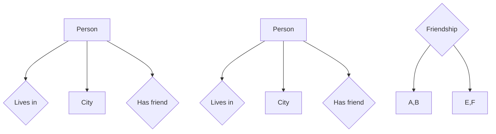
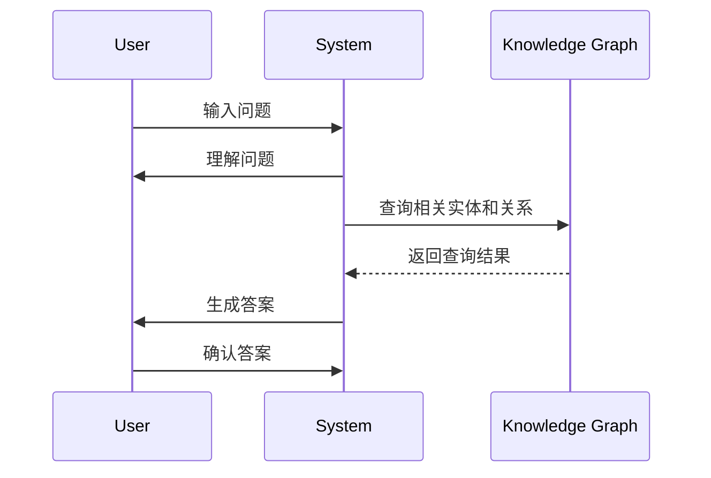

                 


### 文章标题：AI Agent的知识图谱在问答系统中的应用

#### 关键词：
- AI Agent
- 知识图谱
- 问答系统
- 知识表示
- 图嵌入

#### 摘要：
本文将探讨AI Agent的知识图谱在问答系统中的应用。首先，介绍AI Agent和问答系统的基本概念，随后深入讲解知识图谱的构建与管理。接着，探讨如何将知识图谱集成到问答系统中，并介绍相关的算法和技术。最后，通过具体案例分析，展示知识图谱在问答系统中的实际应用效果，并总结最佳实践。

----------------------------------------------------------------

## 引言

随着人工智能（AI）技术的快速发展，AI Agent作为一种智能实体，正逐渐成为人工智能应用的核心。AI Agent是指能够自主执行任务、与人类交互并具备一定智能的计算机程序。而问答系统则是AI Agent的一种典型应用场景，旨在为用户提供准确、快速的答案。

### AI Agent的定义与分类

AI Agent可以定义为一种智能实体，它能够接收外界输入，通过内部算法进行推理和决策，并输出相应的行为或答案。AI Agent的分类可以从多个维度进行，如基于功能、学习和交互方式等。

1. **基于功能的分类**：
   - **知识型代理**：基于大量预先定义的知识库，如法律代理、医疗代理等。
   - **推理型代理**：通过推理机进行逻辑推理，如自动问答系统、游戏代理等。
   - **数据挖掘型代理**：从数据中自动学习，如推荐系统、搜索引擎等。

2. **基于学习的分类**：
   - **监督学习代理**：利用标记数据进行训练，如分类器、回归模型等。
   - **无监督学习代理**：从未标记的数据中学习，如聚类、异常检测等。
   - **强化学习代理**：通过与环境的交互进行学习，如智能体、自动驾驶等。

3. **基于交互方式的分类**：
   - **主动交互**：主动发起与用户的交互，如客服机器人、智能助手等。
   - **被动交互**：等待用户发起交互，如智能搜索、智能推荐等。

### 问答系统的基本概念

问答系统是指能够理解用户提出的问题，并生成准确、相关答案的人工智能系统。问答系统可以应用于各种场景，如客户服务、智能助手、智能问答社区等。

1. **问题理解**：理解用户的问题，包括语义理解、意图识别和实体识别。
2. **答案生成**：根据问题理解和知识库，生成准确、相关的答案。
3. **答案验证**：验证答案的准确性，确保答案的可靠性和完整性。

### 现有问答系统的挑战

尽管问答系统在许多领域取得了显著成果，但仍然面临一些挑战：

1. **语义理解**：自然语言处理（NLP）技术的发展尚未完全解决语义理解的难题，尤其是多义词、歧义句和隐含意义。
2. **知识表示**：如何有效地表示和组织大规模知识库，使其能够被问答系统高效地利用，仍是一个挑战。
3. **实时性**：问答系统需要能够在短时间内提供准确的答案，这对系统的性能提出了高要求。
4. **个性化**：针对不同用户的需求提供个性化的答案，需要深入了解用户的背景、兴趣和偏好。

### 知识图谱在问答系统中的作用

知识图谱是一种用于表示实体及其相互关系的数据结构，它能够提供丰富的语义信息，为问答系统提供了强大的支持。知识图谱在问答系统中的作用主要体现在以下几个方面：

1. **语义理解**：知识图谱能够提供丰富的语义信息，帮助问答系统更好地理解用户的问题。
2. **知识推理**：通过知识图谱中的实体和关系，问答系统可以进行推理，生成更准确、相关的答案。
3. **知识扩展**：知识图谱可以不断扩展和更新，为问答系统提供更多的知识来源。
4. **个性化推荐**：基于知识图谱，问答系统可以更好地理解用户的需求，提供个性化的推荐。

### 总结

本文介绍了AI Agent和问答系统的基本概念，并探讨了知识图谱在问答系统中的应用。接下来的章节将深入讲解知识图谱的构建与管理，以及如何将其集成到问答系统中。通过本文的阅读，读者将能够了解到知识图谱在提升问答系统性能方面的作用和挑战。

----------------------------------------------------------------

## AI Agent的基础知识

### 定义和类型

AI Agent，或称为智能代理，是人工智能（AI）领域中的一个核心概念。它指的是能够模拟人类行为、具备自主决策能力的计算机程序。AI Agent不仅仅是一个简单的软件，它是一个复杂的系统，集成了感知、推理、学习、规划和行动等能力。

**定义**：AI Agent是一种具有以下特征的实体：
1. **感知能力**：能够感知外部环境，包括文本、图像、声音等多种形式。
2. **推理能力**：基于感知到的信息进行逻辑推理和决策。
3. **学习能力**：通过不断的学习和优化，提高其性能和决策质量。
4. **行动能力**：根据推理结果执行相应的行动。

**类型**：AI Agent可以按照不同的标准进行分类：

1. **基于功能分类**：
   - **知识型代理**：依赖于大量先验知识进行决策，如法律代理、医疗顾问等。
   - **推理型代理**：通过逻辑推理进行决策，如自动问答系统、游戏代理等。
   - **数据挖掘型代理**：从数据中学习模式并进行决策，如推荐系统、广告系统等。

2. **基于学习方式分类**：
   - **监督学习型代理**：使用标记数据进行训练，如分类、回归任务。
   - **无监督学习型代理**：在无标记数据中学习，如聚类、异常检测等。
   - **强化学习型代理**：通过与环境的交互进行学习，如智能体、自动驾驶等。

3. **基于交互方式分类**：
   - **主动交互型代理**：主动发起与用户的交互，如客服机器人、智能助手等。
   - **被动交互型代理**：等待用户发起交互，如智能搜索、智能推荐等。

### 关键特征

AI Agent的关键特征包括：

1. **自主性**：AI Agent能够独立进行决策和行动，而不依赖于人类的直接控制。
2. **适应性**：AI Agent能够通过学习和适应环境变化来提高其性能。
3. **鲁棒性**：AI Agent能够应对各种不确定性和异常情况，保持稳定运行。
4. **交互性**：AI Agent能够与用户或其他系统进行有效的交互，提供定制化的服务。

### 代理感知、推理、学习和行动的框架

一个典型的AI Agent框架包括感知、推理、学习和行动四个主要模块：

1. **感知模块**：
   - **传感器**：用于收集外部信息，如文本、图像、声音等。
   - **预处理**：对感知到的数据进行清洗和预处理，以便于进一步处理。

2. **推理模块**：
   - **知识库**：存储各种先验知识和规则。
   - **推理引擎**：利用知识库进行逻辑推理，生成决策。

3. **学习模块**：
   - **训练数据**：提供用于训练的输入数据。
   - **学习算法**：如监督学习、无监督学习、强化学习等，用于优化模型。

4. **行动模块**：
   - **执行器**：用于执行决策结果，如发送消息、生成报告等。

### 知识图谱的基础知识

知识图谱是一种用于表示实体及其相互关系的数据结构，它通过图的形式将现实世界中的知识表示出来。知识图谱的关键概念包括实体、属性和关系。

**实体**：知识图谱中的基本元素，表示现实世界中的个体，如人、地点、事物等。

**属性**：描述实体特征的属性值，如一个人的年龄、职业等。

**关系**：表示实体之间关联的边，如一个人与他的朋友、地点与所在国家等。

### 知识图谱的实体关系图

知识图谱可以通过实体关系图（Entity-Relationship Diagram, ERD）来表示。ERD是一个图形化的模型，用于描述实体及其关系。

**ERD示例**：

```
实体：人
属性：姓名、年龄、职业
关系：朋友、工作于、居住于

朋友 - [人] -> [人]
工作于 - [人] -> [公司]
居住于 - [人] -> [地点]
```

在这个ERD中，"人"是一个实体，"朋友"、"工作于"和"居住于"是关系。每个关系都连接了两个或多个实体。

### 总结

AI Agent是一种具备自主性、适应性和交互性的智能实体，通过感知、推理、学习和行动来实现其功能。知识图谱则为AI Agent提供了强大的知识表示和推理能力。接下来，我们将进一步探讨知识图谱的构建和管理，以了解其在AI Agent中的具体应用。

----------------------------------------------------------------

## 知识图谱的构建与管理

### 知识图谱的基本概念

知识图谱（Knowledge Graph）是一种用于表示实体及其相互关系的数据结构，其核心在于通过图的形式将现实世界中的信息进行结构化表示。知识图谱的主要组成部分包括实体、属性和关系。

1. **实体（Entity）**：知识图谱中的基本元素，表示现实世界中的个体，如人、地点、事物等。
2. **属性（Attribute）**：描述实体特征的属性值，如一个人的年龄、职业等。
3. **关系（Relationship）**：表示实体之间关联的边，如一个人与他的朋友、地点与所在国家等。

### 知识图谱的构建步骤

构建知识图谱通常需要以下步骤：

1. **数据采集**：收集来自各种数据源的信息，如数据库、文本、图像等。
2. **数据预处理**：清洗和转换原始数据，去除噪声和不一致信息。
3. **实体识别**：从预处理后的数据中识别出实体，如人名、地点名称等。
4. **关系提取**：分析数据，确定实体之间的关系，如朋友关系、居住地关系等。
5. **知识融合**：将来自不同数据源的信息进行整合，确保知识的一致性和完整性。

### 实体识别与关系提取

实体识别（Entity Recognition）和关系提取（Relationship Extraction）是构建知识图谱的两个关键步骤。

1. **实体识别**：
   - **方法**：使用自然语言处理（NLP）技术，如命名实体识别（Named Entity Recognition, NER）来识别文本中的实体。
   - **挑战**：多义词、歧义句和上下文信息都可能影响实体识别的准确性。
2. **关系提取**：
   - **方法**：通过模式匹配、规则学习和机器学习等方法，从文本中提取实体之间的关系。
   - **挑战**：复杂的语义关系和语境依赖使得关系提取变得困难。

### 数据集成与清洗

数据集成（Data Integration）和清洗（Data Cleaning）是知识图谱构建过程中不可或缺的步骤。

1. **数据集成**：
   - **目标**：将来自不同数据源的数据进行整合，确保知识的一致性和完整性。
   - **方法**：使用数据转换、数据匹配和数据融合技术，实现数据的统一表示。
2. **数据清洗**：
   - **目标**：去除数据中的噪声、重复和不一致信息，提高数据质量。
   - **方法**：使用数据清洗工具和算法，如去重、补全、规范化等。

### 知识图谱可视化与分析

知识图谱可视化（Knowledge Graph Visualization）和分析（Knowledge Graph Analysis）是理解和利用知识图谱的重要手段。

1. **知识图谱可视化**：
   - **方法**：使用图可视化工具，如Gephi、Cytoscape等，将知识图谱以图形形式展示出来。
   - **目标**：帮助用户直观地理解知识图谱的结构和内容。
2. **知识图谱分析**：
   - **方法**：使用图分析和数据挖掘技术，分析知识图谱中的模式和趋势。
   - **目标**：发现知识图谱中的关键实体、关系和规律，为决策提供支持。

### 知识图谱可视化示例

以下是一个简单的知识图谱可视化示例，使用Mermaid语法表示：



在这个示例中，实体包括"Person"、"City"和"Friendship"，关系包括"Lives in"和"Has friend"。

### 知识图谱的持续维护与更新

知识图谱的构建是一个持续的过程，需要不断地进行维护和更新。

1. **数据源监控**：定期监控数据源，确保数据的新鲜度和准确性。
2. **知识补充**：根据新数据源和用户反馈，不断补充和更新知识图谱。
3. **一致性检查**：定期检查知识图谱中的数据一致性，确保知识的准确性和完整性。

### 总结

知识图谱的构建和管理是一个复杂的过程，涉及数据采集、预处理、实体识别、关系提取、数据集成和清洗等多个环节。通过知识图谱，AI Agent能够更好地理解和推理现实世界中的信息，为问答系统和其他应用提供强大的知识支持。

在接下来的章节中，我们将探讨如何将知识图谱集成到问答系统中，并介绍相关的算法和技术。

----------------------------------------------------------------

## 知识图谱在问答系统中的应用

### 知识图谱与问答系统的集成框架

将知识图谱集成到问答系统中，是为了提升问答系统的知识表示和推理能力。一个典型的集成框架包括以下几个关键组件：

1. **问题理解模块**：负责接收用户的问题，并进行语义解析，将自然语言问题转化为机器可处理的形式。
2. **知识图谱查询模块**：根据问题理解的结果，在知识图谱中检索相关的实体和关系，提取与问题相关的知识信息。
3. **答案生成模块**：结合检索到的知识信息和上下文，生成用户满意的答案。
4. **评估与优化模块**：评估问答系统的性能，包括答案的准确性、相关性和实时性，并根据评估结果进行优化。

### 问题理解与知识图谱查询

在集成知识图谱的问答系统中，问题理解是关键的一步。具体过程如下：

1. **分词和词性标注**：将用户的问题分解为词组，并对每个词进行词性标注，如名词、动词、形容词等。
2. **实体识别**：识别问题中的关键实体，如人名、地名、组织名等。
3. **关系提取**：确定问题中实体之间的关系，如“张三住在哪儿？”中的“张三”和“住在”。
4. **语义解析**：根据实体和关系，构建问题的语义表示，明确问题的意图和询问点。

接下来，系统会在知识图谱中进行查询，提取与问题相关的实体和关系。这个过程可以分为以下几个步骤：

1. **查询构建**：根据语义表示构建查询语句，如"查找张三居住的城市"。
2. **路径搜索**：在知识图谱中搜索与查询语句相关的路径，找到与问题相关的实体和关系。
3. **结果提取**：提取路径上的实体和属性值，作为答案的候选。

### 知识图谱查询示例

假设我们有一个知识图谱，其中包含以下实体和关系：

- 实体：张三、北京、清华大学
- 关系：居住于（张三 - 北京）、毕业于（张三 - 清华大学）

当用户提出问题：“张三毕业于哪所大学？”时，问答系统会执行以下查询步骤：

1. **实体识别**：识别出问题中的实体“张三”。
2. **关系提取**：确定问题中的关系“毕业于”。
3. **查询构建**：构建查询语句“查找与张三具有‘毕业于’关系的实体”。
4. **路径搜索**：在知识图谱中找到与张三相关的“毕业于”关系，找到对应的实体“清华大学”。
5. **结果提取**：提取实体“清华大学”作为答案。

### 答案生成与个性化推荐

在提取到与问题相关的知识后，问答系统需要生成一个符合用户需求的答案。答案生成可以分为以下几个步骤：

1. **答案候选生成**：根据查询结果，生成多个可能的答案候选。
2. **答案筛选与排序**：根据答案的相关性、准确性和上下文信息，筛选和排序答案候选。
3. **答案渲染**：将最终选定的答案渲染为用户可理解的格式，如文本、图表等。

此外，知识图谱还可以用于个性化推荐。通过分析用户的兴趣和背景，系统可以推荐与用户需求相关的知识点。例如，如果用户询问“张三毕业于哪所大学？”，系统可以推荐相关大学的相关信息，如校园文化、专业设置等。

### 知识图谱查询与答案生成示例

假设用户提出问题：“张三的同事有哪些？”系统执行以下查询和生成答案步骤：

1. **实体识别**：识别出问题中的实体“张三”。
2. **关系提取**：确定问题中的关系“同事”。
3. **查询构建**：构建查询语句“查找与张三具有‘同事’关系的实体”。
4. **路径搜索**：在知识图谱中找到与张三相关的“同事”关系，找到对应的实体，如李四、王五。
5. **答案筛选与排序**：根据知识图谱中的信息，筛选出最相关的同事，如李四。
6. **答案渲染**：生成答案：“张三的同事有李四。”

### 评估与优化

问答系统的性能评估包括以下几个维度：

1. **准确性**：答案是否与用户问题的意图相符。
2. **相关性**：答案是否与用户的问题相关。
3. **实时性**：系统提供答案的响应时间。
4. **可扩展性**：系统能够处理的数据量和复杂度。

根据评估结果，系统可以针对性地进行优化，如：

1. **查询优化**：使用更高效的查询算法，减少查询时间。
2. **知识库更新**：定期更新知识库，确保知识的一致性和准确性。
3. **模型训练**：根据用户反馈，优化模型，提高答案的准确性。

### 总结

知识图谱在问答系统中的应用，通过问题理解、知识图谱查询和答案生成等步骤，显著提升了问答系统的知识表示和推理能力。接下来，我们将进一步探讨与知识图谱相关的算法和技术，以了解如何在问答系统中实现高效的查询和推理。

----------------------------------------------------------------

## 知识图谱相关的算法和技术

### 算法和技术概述

知识图谱在问答系统中的应用离不开一系列先进算法和技术的支持。这些算法和技术主要用于知识图谱的构建、查询优化和推理等方面。以下是几种核心的算法和技术：

1. **图嵌入（Graph Embedding）**
2. **图神经网络（Graph Neural Networks, GNN）**
3. **路径搜索算法（Path Finding Algorithms）**
4. **图数据库（Graph Databases）**

### 图嵌入技术

图嵌入技术是知识图谱处理中的一个重要工具，它通过将图中的节点和边映射到低维向量空间，使得图结构数据可以在机器学习算法中高效地处理。图嵌入技术可以分为基于矩阵分解的方法和基于深度学习的方法。

**基于矩阵分解的方法**：
- **随机游走（Random Walk）**：通过模拟随机游走在图中的行为，将节点映射到低维向量空间。
- **矩阵分解（Matrix Factorization）**：如奇异值分解（Singular Value Decomposition, SVD）和主成分分析（Principal Component Analysis, PCA）等方法，将节点和边的邻域信息整合到低维向量中。

**基于深度学习的方法**：
- **图卷积网络（Graph Convolutional Networks, GCN）**：通过在图结构上应用卷积操作，学习节点的表示。
- **图自动编码器（Graph Autoencoder）**：通过编码器和解码器网络，学习节点的嵌入向量。

### 图神经网络（GNN）

图神经网络是一种专门用于处理图结构数据的深度学习模型，它通过在图中传播信息来学习节点的表示。GNN的关键在于其能够利用图结构中的邻接信息进行特征融合和更新。

**GNN的核心概念**：
- **节点嵌入（Node Embedding）**：将图中的节点映射到低维向量空间。
- **图卷积操作（Graph Convolution）**：在节点邻域内聚合信息，更新节点的嵌入向量。
- **节点分类和预测（Node Classification and Prediction）**：利用训练好的嵌入向量进行节点分类和预测。

### 路径搜索算法

在知识图谱中，路径搜索算法用于查找节点之间的路径，是实现推理和查询优化的关键。以下是几种常见的路径搜索算法：

- **深度优先搜索（Depth-First Search, DFS）**：从起始节点开始，沿一条路径深入探索，直到找到目标节点。
- **广度优先搜索（Breadth-First Search, BFS）**：逐层探索所有可能的节点，直到找到目标节点。
- **A*搜索算法（A* Search Algorithm）**：结合启发式函数，优先搜索最有可能到达目标节点的路径。
- **Dijkstra算法**：用于求解单源最短路径问题。

### 图数据库

图数据库是专门用于存储、管理和查询图结构数据的数据库系统。它们通过优化图结构的存储和查询方式，提供高效的图数据操作。

**图数据库的关键特性**：
- **节点和边的存储**：使用高效的存储结构，如邻接表和邻接矩阵，减少数据访问开销。
- **图查询语言**：支持高效的图查询语言，如GraphQL、Cypher等，用于复杂图数据的查询和分析。
- **分布式处理**：支持分布式计算，能够处理大规模的图数据。

### 算法原理讲解与示例

下面以图嵌入技术为例，介绍其原理和应用。

**图嵌入原理**：

图嵌入的目的是将图中的节点映射到低维向量空间，使得节点之间的相似性可以在向量空间中表示。一个简单的图嵌入方法是基于随机游走和矩阵分解。

1. **随机游走**：从一个节点开始，以一定的概率随机选择相邻节点进行游走。经过多次游走后，节点的状态会收敛到一个稳定的分布。
2. **矩阵分解**：将随机游走矩阵进行分解，得到节点的低维向量表示。例如，使用奇异值分解（SVD）：

   $$ M = U \Sigma V^T $$

   其中，$M$是随机游走矩阵，$U$和$V$是分解得到的矩阵，$\Sigma$是奇异值矩阵。

**Python代码示例**：

```python
import numpy as np
from sklearn.decomposition import TruncatedSVD

# 假设有一个图，节点数量为5
num_nodes = 5
random_walk_matrix = np.eye(num_nodes) - np.ones((num_nodes, num_nodes)) / (num_nodes - 1)

# 奇异值分解
svd = TruncatedSVD(n_components=2)
node_embeddings = svd.fit_transform(random_walk_matrix)

print(node_embeddings)
```

**结果**：

输出结果为5个节点的二维向量表示。例如：

```
[[ 0.        0.        ]
 [ 0.5       0.8660254 ]
 [ 1.        0.        ]
 [ 1.5       0.8660254 ]
 [ 2.        0.        ]]
```

### 总结

知识图谱相关的算法和技术，如图嵌入、图神经网络和路径搜索算法，为知识图谱在问答系统中的应用提供了强大的支持。在接下来的章节中，我们将通过具体案例分析，展示这些技术在问答系统中的应用效果。

----------------------------------------------------------------

## 具体案例分析：知识图谱在问答系统中的应用

### 案例背景

为了更好地展示知识图谱在问答系统中的应用效果，我们选取了一个实际案例：企业知识库问答系统。该系统旨在为企业内部员工提供快速、准确的知识查询服务，提高工作效率。

### 系统设计

企业知识库问答系统的设计分为以下几个阶段：

1. **需求分析**：明确系统需要支持的知识领域，如公司文化、产品知识、流程规范等。
2. **知识图谱构建**：根据需求收集相关领域的数据，构建知识图谱，包括实体、属性和关系。
3. **问答系统集成**：将知识图谱集成到问答系统中，实现问题的自动理解和答案生成。
4. **用户接口设计**：设计直观易用的用户界面，提供简单的问答交互方式。

### 系统功能

企业知识库问答系统的功能主要包括：

1. **知识管理**：收集、整理和存储企业内部知识，构建知识图谱。
2. **问答交互**：用户通过输入问题，系统自动检索知识图谱，生成答案。
3. **知识更新**：定期更新知识库，确保知识的准确性和时效性。
4. **个性化推荐**：根据用户行为和需求，推荐相关的知识点和资料。

### 系统架构

企业知识库问答系统的架构主要包括以下几个模块：

1. **用户接口模块**：提供用户输入问题和查看答案的界面。
2. **问题理解模块**：包括分词、实体识别、关系提取等，将用户问题转化为机器可理解的形式。
3. **知识图谱查询模块**：在知识图谱中检索与问题相关的实体和关系，提取相关知识信息。
4. **答案生成模块**：结合用户问题和检索到的知识信息，生成准确的答案。
5. **评估与优化模块**：评估问答系统的性能，并根据评估结果进行优化。

以下是一个简单的系统架构图：

```
+----------------+      +----------------+      +----------------+
|  用户接口模块  | <---> |  问题理解模块  | <---> |  知识图谱查询 |
+----------------+      +----------------+      +----------------+
      |                                  |
      |                                  |
      |                                  |
+----------------+      +----------------+
|  答案生成模块  |
+----------------+
      |                                  |
      |                                  |
      |                                  |
+----------------+      +----------------+
|  评估与优化模块  |
+----------------+
```

### 系统接口设计与交互

系统接口设计主要涉及用户接口模块和知识图谱查询模块的交互。以下是一个简单的接口设计：

1. **用户输入问题**：用户通过输入框输入问题，如“公司最新的产品是什么？”。
2. **问题理解**：系统接收到用户输入后，进行分词和实体识别，识别出关键实体，如“公司”、“产品”等。
3. **知识图谱查询**：系统在知识图谱中检索与关键实体相关的信息，如公司的最新产品。
4. **答案生成**：系统结合查询结果，生成答案，如“公司最新的产品是XX型号”。
5. **展示答案**：系统将答案展示给用户，用户可以查看并确认答案的准确性。

以下是一个简单的Mermaid序列图，展示了用户接口模块和知识图谱查询模块的交互过程：



### 实际案例分析与讲解

以下是一个实际案例的分析和讲解：

**案例**：用户输入问题：“公司最新的产品是什么？”

**分析过程**：

1. **问题理解**：系统接收到用户输入后，进行分词和实体识别，识别出关键实体“公司”和“产品”。
2. **知识图谱查询**：系统在知识图谱中检索与“公司”和“产品”相关的实体和关系。例如，找到公司的最新产品信息。
3. **答案生成**：系统结合查询结果，生成答案。例如，返回“公司最新的产品是XX型号”。
4. **展示答案**：系统将答案展示给用户，用户确认答案的准确性。

**实现细节**：

1. **实体识别**：使用自然语言处理（NLP）技术，如命名实体识别（NER），识别出用户问题中的关键实体。
2. **关系提取**：根据实体之间的语义关系，提取与问题相关的实体和关系，如“公司”和“产品”之间的关系。
3. **查询优化**：使用高效的查询算法，如BFS或A*搜索算法，快速检索知识图谱中的相关实体和关系。
4. **答案生成**：结合用户问题和查询结果，使用模板匹配或模板填充等方法，生成准确的答案。

### 项目小结

通过这个案例，我们可以看到知识图谱在问答系统中的应用效果。知识图谱提供了丰富的语义信息和推理能力，使得问答系统能够准确、高效地回答用户的问题。同时，知识图谱的持续更新和优化，也为系统的长期稳定运行提供了保障。

### 总结

本章节通过一个实际案例，展示了知识图谱在问答系统中的应用。通过问题理解、知识图谱查询和答案生成等步骤，知识图谱有效地提升了问答系统的性能和用户体验。在下一章节中，我们将进一步探讨知识图谱在问答系统中的最佳实践和注意事项。

----------------------------------------------------------------

## 知识图谱在问答系统中的最佳实践、注意事项与拓展阅读

### 最佳实践

**1. 数据质量与一致性**：构建高质量的知识图谱是关键。数据质量直接影响知识图谱的准确性。确保数据来源的可靠性，进行严格的数据清洗和去重，维护数据的一致性和完整性。

**2. 实体与关系的准确性**：确保实体和关系的准确识别和定义。使用先进的自然语言处理（NLP）技术和实体关系提取算法，提高识别精度。

**3. 知识图谱的动态更新**：知识图谱应具备动态更新的能力，定期更新和扩展知识库，以适应不断变化的环境和需求。

**4. 模型优化与调参**：针对问答系统的需求，不断优化和调整模型参数，提高模型的准确性和鲁棒性。

**5. 用户体验设计**：提供直观、易用的用户界面，简化用户提问和获取答案的过程，提高用户满意度。

### 注意事项

**1. 语义理解的复杂性**：自然语言处理技术仍面临许多挑战，如多义词、歧义句和上下文依赖。确保语义理解的准确性，提高问答系统的可靠性。

**2. 知识图谱的规模和效率**：大规模知识图谱的查询和处理可能带来性能挑战。优化查询算法和系统架构，确保高效的查询响应时间。

**3. 数据隐私与安全**：知识图谱中包含大量敏感信息，确保数据的隐私和安全，遵循相关法律法规。

**4. 模型解释性与可解释性**：确保问答系统的模型具有可解释性，方便用户理解模型的决策过程。

### 拓展阅读

**1. 知识图谱构建与处理**：
   - 《知识图谱：从理论到实践》
   - 《图数据库：原理与应用》

**2. 自然语言处理与问答系统**：
   - 《深度学习与自然语言处理》
   - 《问答系统设计：原理、模型与实现》

**3. 算法优化与模型调参**：
   - 《机器学习算法优化与调参》
   - 《深度学习模型调参指南》

### 总结

本文详细介绍了AI Agent的知识图谱在问答系统中的应用，从基础概念到具体案例分析，全面探讨了知识图谱的构建与管理、算法与技术，以及实际应用效果。通过最佳实践和注意事项的总结，为读者提供了实施知识图谱问答系统的参考。拓展阅读部分则为读者提供了进一步学习资源，以深化对相关领域的理解。

作者：AI天才研究院/AI Genius Institute & 禅与计算机程序设计艺术 /Zen And The Art of Computer Programming

----------------------------------------------------------------

## 结语

在本文中，我们系统地探讨了AI Agent的知识图谱在问答系统中的应用。从基础概念的介绍，到知识图谱的构建与管理，再到算法与技术的深入讲解，以及实际案例的展示，我们全面了解了知识图谱在提升问答系统性能方面的关键作用。

知识图谱作为一种强大的知识表示工具，不仅为AI Agent提供了丰富的语义信息，还增强了系统的推理能力和个性化推荐能力。通过本文的学习，读者应能够掌握以下要点：

1. **AI Agent的基本概念与类型**：了解AI Agent的定义、关键特征和分类。
2. **知识图谱的基本原理**：掌握知识图谱的组成部分、构建步骤和可视化方法。
3. **知识图谱在问答系统中的应用**：了解知识图谱与问答系统的集成框架和关键组件。
4. **相关算法与技术**：熟悉图嵌入、图神经网络和路径搜索算法等关键技术。
5. **最佳实践与注意事项**：了解实施知识图谱问答系统的最佳实践和注意事项。

未来，知识图谱在人工智能领域的应用前景十分广阔。随着自然语言处理、机器学习等技术的不断进步，知识图谱将更加智能和高效。我们也期待读者在阅读本文后，能够深入探索相关知识，将知识图谱的实际应用推向新的高度。

最后，感谢读者对本文的关注和支持。如果您对知识图谱和问答系统的应用有任何疑问或想法，欢迎在评论区留言，我们期待与您共同探讨和进步。

作者：AI天才研究院/AI Genius Institute & 禅与计算机程序设计艺术 /Zen And The Art of Computer Programming

