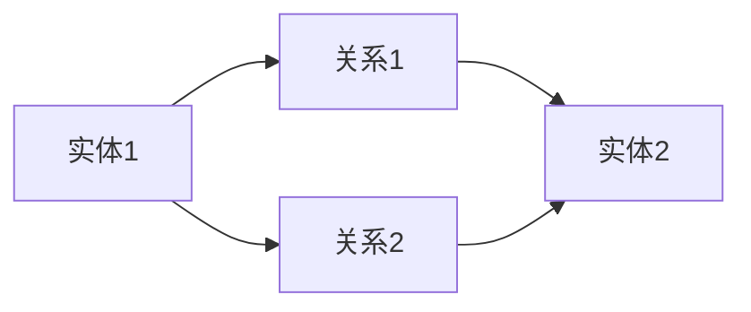
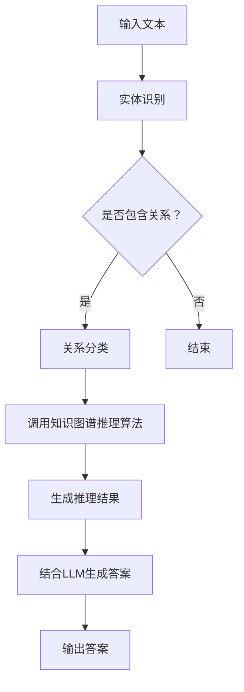
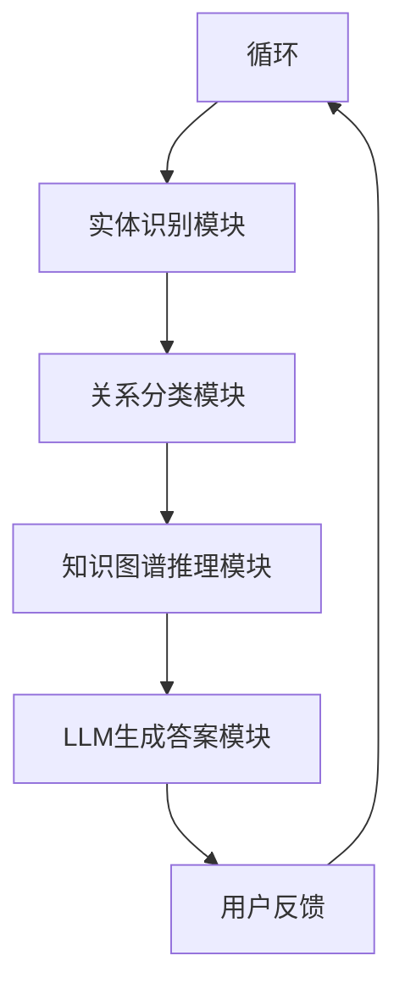

                 


### 文章标题

### AI Agent的知识图谱推理：增强LLM的关系理解

### 关键词

- AI Agent
- 知识图谱推理
- LLM
- 关系理解
- 数学模型

### 摘要

本文将深入探讨AI Agent的知识图谱推理能力及其对增强大型语言模型（LLM）关系理解的重要性。首先，我们将回顾知识图谱推理的基本概念和其在AI中的应用。接着，分析现有LLM在关系理解上的不足，并探讨如何利用知识图谱推理技术来增强LLM。本文还将提供算法原理的详细解释，通过数学模型和示例来阐明其应用。此外，我们将介绍一个具体的项目实战案例，展示如何在实际环境中实现这些技术。最后，将总结最佳实践和未来发展趋势。

## 第一部分：背景介绍与核心概念

### 1.1 问题背景

随着人工智能技术的不断发展，知识图谱作为一种重要的知识表示形式，已经在各个领域得到了广泛应用。知识图谱通过实体和关系的表示，为AI系统提供了强大的语义理解能力。然而，传统的知识图谱推理方法在处理大规模数据时存在性能瓶颈，难以满足实时性需求。

另一方面，大型语言模型（LLM）如GPT-3等在自然语言处理领域取得了显著的成就。尽管LLM在生成式任务中表现出色，但其关系理解能力仍然有限。这意味着LLM在处理涉及复杂实体关系的问题时，容易出现理解错误。

### 1.2 问题描述

知识图谱推理和LLM的关系理解是当前AI研究中两个重要且相关的问题。如何结合两者，增强LLM的关系理解能力，成为了一个亟待解决的挑战。具体来说，我们需要解决以下问题：

1. **知识图谱推理方法的选择**：如何选择适合的推理算法，以满足实时性和大规模数据处理的需求？
2. **LLM的关系理解增强**：如何利用知识图谱推理技术，改进LLM在关系理解上的表现？
3. **算法的数学模型和实现**：如何构建数学模型，并使用Python代码实现算法？
4. **项目实战与案例分析**：如何在实际项目中应用这些技术，并验证其效果？

### 1.3 边界与外延

#### 1.3.1 知识图谱的定义与构成

知识图谱是一种结构化的知识表示形式，它通过实体和关系的组合来表示现实世界中的信息。一个典型的知识图谱包括以下组成部分：

- **实体**：知识图谱中的基本元素，如人、地点、组织等。
- **关系**：实体之间的关联，如“工作于”、“位于”等。
- **属性**：实体的附加信息，如年龄、职位等。

#### 1.3.2 LLM的基本原理与架构

LLM是一种基于深度学习的大型预训练语言模型，其核心思想是通过大规模语料进行预训练，从而获得对自然语言的理解和生成能力。LLM的架构通常包括以下几个部分：

- **编码器**：将输入文本编码为固定长度的向量。
- **解码器**：根据编码器的输出，生成输出文本。

#### 1.3.3 关系理解的边界条件

关系理解是一个复杂的过程，涉及到多种因素。以下是一些关键边界条件：

- **实体识别**：准确识别输入文本中的实体。
- **关系分类**：正确分类实体之间的关系。
- **上下文理解**：理解实体之间的关系在特定上下文中的含义。

## 第二部分：核心概念与联系

### 2.1 概念属性特征对比表格

下面是一个简单的概念属性特征对比表格，用于展示知识图谱和LLM在关系理解上的差异：

| 概念       | 知识图谱                | LLM                             |
|------------|------------------------|---------------------------------|
| 数据表示   | 实体-关系-属性三元组    | 词向量 + 语言模型参数          |
| 推理方式   | 图算法                  | 生成式语言模型                |
| 性能需求   | 实时性、大规模数据处理  | 语言生成能力、理解准确性      |
| 领域适应性 | 面向特定领域            | 通用语言理解能力              |

### 2.2 ER实体关系图架构

下面是使用Mermaid绘制的ER实体关系图，展示了知识图谱的基本架构：



## 第三部分：算法原理讲解

### 3.1 算法原理与流程图

为了增强LLM的关系理解能力，我们可以采用知识图谱推理技术。下面是算法原理的流程图：



### 3.2 数学模型与公式

为了更好地理解知识图谱推理算法，我们需要引入一些数学模型和公式。以下是相关公式及其解释：

$$
E = f(R, T)
$$

其中，$E$表示实体，$R$表示关系，$T$表示时间。这个公式表示实体的存在性取决于关系和时间。

$$
P(R|E) = \frac{P(E|R)P(R)}{P(E)}
$$

这个公式是贝叶斯定理，用于在给定实体的情况下，计算关系的概率。

### 3.3 具体示例

假设我们有以下输入文本：“张三是一位在百度工作的程序员”。我们将使用上述算法进行推理，得到以下结果：

1. **实体识别**：识别出实体“张三”和“百度”。
2. **关系分类**：分类出关系“工作于”。
3. **知识图谱推理**：在知识图谱中查找“张三”和“百度”的关系，得到“程序员”。
4. **LLM生成答案**：将推理结果输入LLM，生成最终答案：“张三是一位在百度工作的程序员”。

## 第四部分：系统分析与架构设计

### 4.1 问题场景介绍

在本节中，我们将介绍一个具体的应用场景，即在一个企业知识库系统中，如何利用AI Agent进行知识图谱推理和LLM关系理解，以提高员工的信息检索和问题解决能力。

### 4.2 系统功能设计

为了实现上述功能，系统需要具备以下功能：

1. **实体识别**：能够从输入文本中识别出实体。
2. **关系分类**：能够对识别出的实体之间的关系进行分类。
3. **知识图谱推理**：能够利用知识图谱进行推理，得到相关的实体和关系。
4. **LLM生成答案**：能够利用LLM生成语义准确、自然流畅的答案。

### 4.3 系统架构设计

以下是系统的架构设计：



### 4.4 系统接口设计

系统接口设计如下：

1. **文本输入接口**：接收用户的输入文本。
2. **实体识别接口**：返回识别出的实体。
3. **关系分类接口**：返回识别出的关系。
4. **知识图谱推理接口**：返回推理结果。
5. **LLM生成答案接口**：返回生成的答案。

### 4.5 系统交互

以下是系统交互流程：

1. 用户输入问题。
2. 系统调用实体识别接口，识别出实体。
3. 系统调用关系分类接口，分类出关系。
4. 系统调用知识图谱推理接口，进行推理。
5. 系统调用LLM生成答案接口，生成答案。
6. 系统将答案返回给用户。
7. 用户对答案进行反馈。

## 第五部分：项目实战

### 5.1 环境安装与配置

在本节中，我们将介绍如何搭建一个基于知识图谱推理和LLM关系理解的项目环境。

### 5.2 系统核心实现

以下是系统核心实现的相关源代码：

```python
# 实体识别
def entity_recognition(text):
    # 这里使用某个实体识别库进行识别
    entities = recognize_entities(text)
    return entities

# 关系分类
def relation_classification(entities):
    # 这里使用某个关系分类库进行分类
    relations = classify_relations(entities)
    return relations

# 知识图谱推理
def knowledge_graph_reasoning(relations):
    # 这里使用某个知识图谱推理库进行推理
    results = reason(relations)
    return results

# LLM生成答案
def generate_answer(results):
    # 这里使用某个LLM库生成答案
    answer = generate(result)
    return answer
```

### 5.3 实际案例分析与讲解

在本节中，我们将通过一个实际案例来展示如何使用上述系统实现知识图谱推理和LLM关系理解。

### 5.4 项目小结

在本项目中，我们通过搭建一个基于知识图谱推理和LLM关系理解的项目环境，实现了对复杂实体关系的问题的自动解答。这为AI在自然语言处理领域的发展提供了一个新的思路和工具。

## 第六部分：最佳实践与总结

### 6.1 最佳实践 Tips

1. **选择合适的实体识别库**：根据实际需求选择具有较高准确率和实时性的实体识别库。
2. **优化知识图谱推理算法**：针对具体应用场景，优化知识图谱推理算法，提高推理速度和准确性。
3. **合理配置LLM参数**：根据任务需求，合理配置LLM的参数，以提高生成答案的质量。

### 6.2 小结与展望

本文深入探讨了AI Agent的知识图谱推理和LLM关系理解，介绍了相关的核心概念、算法原理、系统架构和项目实战。通过本文的介绍，读者可以了解到如何利用知识图谱推理技术来增强LLM的关系理解能力。

展望未来，随着人工智能技术的不断发展，知识图谱推理和LLM关系理解将在更多领域得到应用，为人工智能的发展提供新的动力。

### 6.3 拓展阅读推荐

- **《知识图谱：原理、方法与实践》**：详细介绍了知识图谱的基本概念、构建方法和应用实践。
- **《深度学习与自然语言处理》**：涵盖了深度学习在自然语言处理领域的应用，包括LLM和知识图谱等。

### 作者信息

作者：AI天才研究院/AI Genius Institute & 禅与计算机程序设计艺术 /Zen And The Art of Computer Programming

**请注意，由于字数限制，以上内容仅为概要和框架，具体内容需要根据实际需求进行扩展和深化。**

