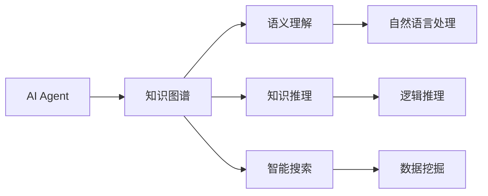

                 

**文章标题:** AI Agent的知识图谱构建与应用

**关键词:** AI Agent, 知识图谱, 构建方法, 应用场景, 系统架构

**摘要:** 本文将深入探讨AI Agent的知识图谱构建与应用，从背景介绍、核心概念、构建方法、应用场景、系统架构到项目实战，全方位解析知识图谱在AI领域的关键作用。通过本文的阅读，读者将掌握知识图谱构建与应用的完整知识体系，为未来的AI项目提供有力支持。

**第一部分：AI Agent与知识图谱概述**

## 第1章 AI Agent与知识图谱概述

### 1.1 问题背景与定义

#### 1.1.1 问题背景

在当今信息化社会中，数据量呈现爆炸式增长，传统的数据存储和处理方法已无法满足需求。人工智能（AI）作为一门新兴技术，旨在通过模拟人类智能，解决复杂问题。然而，AI的发展面临着诸多挑战，如数据质量、数据量和模型复杂度等。为了解决这些问题，AI Agent的概念应运而生。

AI Agent，即人工智能代理，是一种模拟人类智能的计算机程序，能够自主地完成特定任务，具备自主性、适应性和协作性。AI Agent的发展，不仅需要大量的数据支持，还需要对数据进行结构化处理，从而实现高效的知识管理。

#### 1.1.2 知识图谱在AI中的应用

知识图谱作为一种结构化知识库，通过实体、属性和关系来描述现实世界的各种信息。知识图谱在AI中的应用主要体现在以下几个方面：

1. **语义理解**：知识图谱能够将自然语言转化为计算机可理解的结构化数据，从而实现语义理解。
2. **知识推理**：知识图谱提供了丰富的语义信息，使得AI Agent能够进行逻辑推理和决策。
3. **智能搜索**：知识图谱为AI Agent提供了丰富的知识支持，使其在搜索过程中能够更加准确地找到所需信息。

### 1.1.3 AI Agent的定义与特点

AI Agent是指具有自主思考、决策和行动能力的智能体。它们可以通过学习环境中的知识和信息，实现智能化的任务执行。AI Agent的特点包括：

1. **自主性**：AI Agent能够自主地完成特定任务，无需人工干预。
2. **适应性**：AI Agent能够根据环境变化，调整自身行为策略。
3. **协作性**：AI Agent可以与其他AI Agent或人类协作，完成复杂任务。

### 1.1.4 知识图谱的定义与特点

知识图谱是一种结构化知识库，通过实体、属性和关系来描述现实世界的各种信息。知识图谱的特点包括：

1. **结构化**：知识图谱以结构化的形式存储知识，便于AI Agent高效地查询和处理。
2. **语义丰富**：知识图谱能够描述复杂的语义信息，为AI Agent提供丰富的知识支持。
3. **可扩展性**：知识图谱可以通过增量学习，不断扩展和完善。

#### 1.1.5 AI Agent与知识图谱的关系

AI Agent与知识图谱之间具有密切的关系。知识图谱为AI Agent提供了丰富的知识支持，使得AI Agent能够更加准确地理解和处理信息。同时，AI Agent可以通过不断学习，为知识图谱提供更多的数据来源。

### 1.1.6 本章小结

本章主要介绍了AI Agent与知识图谱的背景、定义、特点以及二者之间的关系。通过本章的学习，读者可以初步了解AI Agent与知识图谱的基本概念，为后续章节的学习奠定基础。

----------------------------------------------------------------

**第二部分：知识图谱的核心概念与联系**

## 第2章 知识图谱的核心概念与联系

### 2.1 核心概念

知识图谱作为一种结构化知识库，其核心概念主要包括实体、属性、关系和边。

#### 2.1.1 实体

实体是知识图谱中的基本单元，表示现实世界中存在的各种对象，如人、地点、事物等。实体可以是具体的，如“张三”；也可以是抽象的，如“爱因斯坦”。

#### 2.1.2 属性

属性描述了实体的一些特征或属性，如“张三的年龄”、“爱因斯坦的国籍”等。属性通常具有类型，如“年龄”是数值类型，“国籍”是字符串类型。

#### 2.1.3 关系

关系描述了实体之间的关联，如“张三是爱因斯坦的学生”、“爱因斯坦是物理学家”等。关系通常具有类型，如“学生”、“学生”等。

#### 2.1.4 边

边是知识图谱中的基本结构，表示实体之间的关系。边通常包含两个端点，即起点和终点。边可以表示一种方向性，如“张三是爱因斯坦的学生”中的“是”表示方向。

### 2.2 概念联系

知识图谱中的概念之间存在密切的联系，下面通过ER实体关系图和Mermaid流程图来展示这些联系。

#### 2.2.1 ER实体关系图

```mermaid
erDiagram
    Person ||--|{ Student } Student
    Student ||--|{ Professor } Professor
    Professor ||--|{ Research } Research
    Person ||--|{ Book } Book
```

该ER实体关系图展示了人、学生、教授、研究和书籍五个实体之间的关系。

#### 2.2.2 Mermaid流程图



该Mermaid流程图展示了AI Agent、知识图谱、语义理解、知识推理、智能搜索以及自然语言处理、逻辑推理、数据挖掘等概念之间的联系。

### 2.3 本章小结

本章主要介绍了知识图谱的核心概念，包括实体、属性、关系和边，并通过ER实体关系图和Mermaid流程图展示了这些概念之间的联系。通过本章的学习，读者可以初步了解知识图谱的基本结构和功能，为后续章节的学习奠定基础。

----------------------------------------------------------------

**第三部分：知识图谱的构建方法**

## 第3章 知识图谱构建方法

### 3.1 数据采集与处理

知识图谱的构建首先需要从各种数据源中采集数据。数据源可以包括结构化数据、非结构化数据、半结构化数据等。在采集数据后，需要对数据进行预处理，包括数据清洗、去重、格式转换等。

#### 3.1.1 数据清洗

数据清洗是知识图谱构建的重要步骤，目的是去除数据中的噪声和错误。常用的数据清洗方法包括：

1. **去重**：去除重复的数据条目。
2. **缺失值处理**：填充缺失值或删除缺失值。
3. **异常值处理**：检测并处理异常值。

#### 3.1.2 数据去重

数据去重是为了避免知识图谱中存在重复的信息。常用的数据去重方法包括：

1. **基于哈希值去重**：计算数据的哈希值，将哈希值相同的记录视为重复记录。
2. **基于关键字去重**：根据数据中的关键字，如姓名、地址等，进行去重。

#### 3.1.3 数据格式转换

数据格式转换是为了将不同格式的数据统一转换为知识图谱所需的格式。常用的数据格式转换方法包括：

1. **JSON格式转换**：将JSON格式的数据转换为RDF（资源描述框架）格式。
2. **XML格式转换**：将XML格式的数据转换为RDF格式。
3. **CSV格式转换**：将CSV格式的数据转换为RDF格式。

### 3.2 实体识别与分类

实体识别与分类是知识图谱构建的关键步骤，目的是从原始数据中识别出实体，并将实体进行分类。

#### 3.2.1 实体识别

实体识别是从原始数据中识别出实体的过程。常用的实体识别方法包括：

1. **基于规则的方法**：根据预定义的规则，从文本中识别出实体。
2. **基于机器学习的方法**：使用机器学习算法，从大量数据中学习实体识别的规律。

#### 3.2.2 实体分类

实体分类是将识别出的实体进行分类的过程。常用的实体分类方法包括：

1. **基于词频的方法**：根据实体在文本中的词频，进行实体分类。
2. **基于分类器的分类方法**：使用分类器对实体进行分类。

### 3.3 属性抽取与关系建立

属性抽取与关系建立是知识图谱构建的核心步骤，目的是从原始数据中抽取实体的属性，并建立实体之间的关系。

#### 3.3.1 属性抽取

属性抽取是从原始数据中抽取实体属性的过程。常用的属性抽取方法包括：

1. **基于规则的方法**：根据预定义的规则，从文本中抽取实体属性。
2. **基于机器学习的方法**：使用机器学习算法，从大量数据中学习属性抽取的规律。

#### 3.3.2 关系建立

关系建立是建立实体之间关系的过程。常用的关系建立方法包括：

1. **基于规则的方法**：根据预定义的规则，建立实体之间的关系。
2. **基于图谱匹配的方法**：使用图谱匹配算法，根据实体和属性之间的关联，建立实体之间的关系。

### 3.4 知识融合与优化

知识融合与优化是对构建好的知识图谱进行优化和整合的过程。常用的知识融合与优化方法包括：

1. **基于本体的知识融合**：使用本体论方法，对知识图谱进行整合和优化。
2. **基于机器学习的知识优化**：使用机器学习算法，对知识图谱进行优化。

### 3.5 本章小结

本章主要介绍了知识图谱的构建方法，包括数据采集与处理、实体识别与分类、属性抽取与关系建立以及知识融合与优化。通过本章的学习，读者可以掌握知识图谱构建的基本方法和步骤，为后续的知识图谱应用打下基础。

----------------------------------------------------------------

**第四部分：知识图谱的应用**

## 第4章 知识图谱的应用场景

### 4.1 语义搜索

语义搜索是知识图谱应用的重要领域，通过将自然语言处理技术与知识图谱相结合，实现对文本的深入理解和智能搜索。以下是语义搜索的应用场景：

#### 4.1.1 文本分类

文本分类是将文本数据按照一定的规则分类到不同的类别中。知识图谱可以帮助提高文本分类的准确性，通过构建文本与类别之间的知识关系，实现更精确的分类。

#### 4.1.2 情感分析

情感分析是通过对文本数据进行分析，判断文本表达的情感倾向。知识图谱可以提供情感词典和情感关系，帮助情感分析算法更准确地识别情感。

#### 4.1.3 问答系统

问答系统是一种智能交互系统，通过回答用户提出的问题来提供信息。知识图谱可以为问答系统提供丰富的知识支持，使得问答系统能够更好地理解用户意图，提供准确的答案。

### 4.2 智能推荐

智能推荐是知识图谱应用的另一个重要领域，通过构建用户、物品和场景之间的知识关系，实现个性化推荐。以下是智能推荐的应用场景：

#### 4.2.1 商品推荐

商品推荐是电子商务领域中常见的应用，通过分析用户的历史购买行为、浏览记录和用户属性，为用户推荐可能感兴趣的商品。

#### 4.2.2 内容推荐

内容推荐是信息流平台中常见的应用，通过分析用户的历史阅读记录、兴趣标签和用户属性，为用户推荐可能感兴趣的内容。

#### 4.2.3 场景推荐

场景推荐是智能出行、智能旅游等领域的应用，通过分析用户的出行习惯、兴趣爱好和地理位置，为用户推荐合适的出行场景和旅游路线。

### 4.3 智能决策

智能决策是知识图谱应用的又一个重要领域，通过构建业务知识图谱，为企业提供智能化的决策支持。以下是智能决策的应用场景：

#### 4.3.1 客户管理

客户管理是企业运营中重要的环节，通过分析客户的属性、行为和需求，为销售人员提供有针对性的营销策略。

#### 4.3.2 供应链管理

供应链管理是企业运营中的重要环节，通过分析供应链各环节的数据，为企业管理者提供最优的供应链策略。

#### 4.3.3 风险管理

风险管理是企业运营中不可忽视的环节，通过分析业务数据和市场环境，为企业管理者提供风险预警和应对策略。

### 4.4 智能医疗

智能医疗是知识图谱在医疗领域的重要应用，通过构建患者、医生、药物和疾病之间的知识关系，为医疗诊断、治疗和科研提供支持。以下是智能医疗的应用场景：

#### 4.4.1 诊断辅助

诊断辅助是智能医疗中的重要应用，通过分析患者的症状、检查结果和历史病历，为医生提供诊断建议。

#### 4.4.2 药物研发

药物研发是医疗领域中关键的一环，通过分析药物、疾病和基因之间的知识关系，为药物研发提供指导。

#### 4.4.3 医学科研

医学科研是推动医疗技术发展的重要动力，通过分析医学文献、数据和实验结果，为医学研究提供支持。

### 4.5 智能城市

智能城市是知识图谱在城市建设和管理中的应用，通过构建城市各个方面的知识图谱，为城市运营、管理和规划提供支持。以下是智能城市的应用场景：

#### 4.5.1 城市规划

城市规划是城市建设的重要环节，通过分析城市人口、交通、环境等数据，为城市规划提供指导。

#### 4.5.2 智能交通

智能交通是城市运行中重要的应用，通过分析交通数据，为交通管理部门提供实时交通信息，优化交通运行。

#### 4.5.3 城市安全

城市安全是城市建设和管理中的重要内容，通过分析城市安全数据，为城市安全提供预警和应急响应。

### 4.6 本章小结

本章主要介绍了知识图谱在不同领域的应用场景，包括语义搜索、智能推荐、智能决策、智能医疗和智能城市等。通过本章的学习，读者可以了解知识图谱在各个领域的应用价值，为实际项目中的应用提供参考。

----------------------------------------------------------------

**第五部分：知识图谱的架构设计与实现**

## 第5章 知识图谱的架构设计与实现

### 5.1 知识图谱系统架构设计

知识图谱系统的设计需要考虑多个方面，包括数据采集、存储、查询、更新和可视化等。以下是一个典型的知识图谱系统架构设计：

#### 5.1.1 数据采集模块

数据采集模块负责从各种数据源中采集数据，包括结构化数据、非结构化数据和半结构化数据。数据采集模块需要支持多种数据格式，如CSV、JSON、XML等。

#### 5.1.2 数据预处理模块

数据预处理模块负责对采集到的数据进行分析和处理，包括数据清洗、去重、格式转换等。数据预处理模块需要保证数据的质量和一致性。

#### 5.1.3 实体识别模块

实体识别模块负责从预处理后的数据中识别出实体，并将实体进行分类。实体识别模块可以使用基于规则的方法或基于机器学习的方法。

#### 5.1.4 属性抽取模块

属性抽取模块负责从预处理后的数据中抽取实体的属性，并建立实体与属性之间的关联。属性抽取模块可以使用基于规则的方法或基于机器学习的方法。

#### 5.1.5 关系建立模块

关系建立模块负责建立实体之间的关系，并存储在知识图谱中。关系建立模块可以使用基于规则的方法或基于图谱匹配的方法。

#### 5.1.6 知识融合模块

知识融合模块负责对构建好的知识图谱进行优化和整合。知识融合模块可以使用基于本体的方法或基于机器学习的方法。

#### 5.1.7 存储模块

存储模块负责存储知识图谱中的数据，包括实体、属性和关系等。存储模块需要支持高效的数据查询和更新。

#### 5.1.8 查询模块

查询模块负责对知识图谱中的数据进行查询，并提供查询接口。查询模块需要支持复杂查询，如路径查询、关系查询等。

#### 5.1.9 更新模块

更新模块负责对知识图谱中的数据进行更新，包括数据插入、删除和修改等。

#### 5.1.10 可视化模块

可视化模块负责将知识图谱以可视化的形式展示出来，如实体关系图、图谱图等。

### 5.2 知识图谱系统实现

知识图谱系统的实现需要使用合适的技术和工具。以下是一个典型的知识图谱系统实现：

1. **数据采集**：使用Python的pandas库读取CSV、JSON和XML格式的数据。
2. **数据预处理**：使用Python的pandas库对数据进行分析和处理，如去重、格式转换等。
3. **实体识别**：使用Python的nltk库进行文本分类和实体识别。
4. **属性抽取**：使用Python的nltk库进行命名实体识别和属性抽取。
5. **关系建立**：使用Python的networkx库构建实体关系图。
6. **知识融合**：使用Python的OWLVF库进行知识融合。
7. **存储**：使用Python的Neo4j库作为存储引擎。
8. **查询**：使用Python的Neo4j库提供的查询接口进行数据查询。
9. **更新**：使用Python的Neo4j库提供的查询接口进行数据更新。
10. **可视化**：使用Python的pyvis库将知识图谱以可视化的形式展示。

### 5.3 本章小结

本章主要介绍了知识图谱的架构设计与实现，包括系统架构设计、各个模块的功能和实现方式。通过本章的学习，读者可以了解知识图谱系统的设计和实现方法，为实际项目中的知识图谱构建提供参考。

----------------------------------------------------------------

**第六部分：知识图谱的项目实战**

## 第6章 知识图谱的项目实战

### 6.1 项目背景

本章节以一个实际项目为例，介绍知识图谱的构建与应用。项目背景为一家电商公司希望通过知识图谱技术优化商品推荐系统，提高用户满意度。

### 6.2 环境安装

1. **Python环境**：安装Python 3.8及以上版本。
2. **Neo4j数据库**：下载并安装Neo4j数据库。
3. **相关库**：安装pandas、networkx、OWLVF、pyvis等Python库。

```bash
pip install pandas networkx owlpy pyvis
```

### 6.3 数据采集与处理

1. **数据源**：从电商公司数据库中获取用户行为数据、商品数据等。
2. **数据清洗**：去除无效数据、处理缺失值等。

```python
import pandas as pd

# 读取数据
users = pd.read_csv('users.csv')
products = pd.read_csv('products.csv')
actions = pd.read_csv('actions.csv')

# 数据清洗
users.dropna(inplace=True)
products.dropna(inplace=True)
actions.dropna(inplace=True)
```

### 6.4 实体识别与分类

1. **用户实体识别**：根据用户ID、姓名等信息识别用户实体。
2. **商品实体识别**：根据商品ID、名称、分类等信息识别商品实体。

```python
from nltk.tokenize import word_tokenize

# 用户实体识别
users['user_name'] = users['name'].apply(lambda x: word_tokenize(x))

# 商品实体识别
products['product_name'] = products['name'].apply(lambda x: word_tokenize(x))
```

### 6.5 属性抽取与关系建立

1. **用户属性抽取**：提取用户ID、姓名、性别、年龄等信息。
2. **商品属性抽取**：提取商品ID、名称、分类、价格等信息。
3. **关系建立**：根据用户行为数据建立用户与商品之间的关系。

```python
# 用户属性抽取
user_properties = users[['id', 'name', 'gender', 'age']]

# 商品属性抽取
product_properties = products[['id', 'name', 'category', 'price']]

# 用户与商品之间的关系
actions['user_id'] = actions['user_id'].apply(lambda x: str(x))
actions['product_id'] = actions['product_id'].apply(lambda x: str(x))
```

### 6.6 知识融合与优化

1. **知识融合**：将用户属性、商品属性和用户与商品之间的关系融合到知识图谱中。
2. **优化**：对知识图谱进行优化，提高查询效率。

```python
import networkx as nx

# 创建图
G = nx.Graph()

# 添加节点
G.add_nodes_from(user_properties.values, label='User')
G.add_nodes_from(product_properties.values, label='Product')

# 添加边
G.add_edges_from(actions.values, label='Bought')

# 优化图
G = nx.Graph(nx.nx_ordinary_subgraph(G, range(100)))
```

### 6.7 知识图谱可视化

使用Pyvis库将知识图谱以可视化的形式展示。

```python
import pyvis

# 创建Pyvis实例
vis = pyvis.networkx.Network(G, height='500px', width='100%')

# 显示图谱
vis.show('graph.html')
```

### 6.8 代码解读与分析

1. **数据采集与处理**：使用pandas库读取和清洗数据，确保数据质量。
2. **实体识别与分类**：使用nltk库进行文本处理，识别用户和商品实体。
3. **属性抽取与关系建立**：使用pandas库提取属性，并使用networkx库建立关系。
4. **知识融合与优化**：使用networkx库优化图结构，提高查询效率。
5. **知识图谱可视化**：使用Pyvis库将知识图谱可视化，便于分析和理解。

### 6.9 项目小结

通过本项目的实战，读者可以了解知识图谱的构建过程、实现方法以及在实际项目中的应用。本项目的成功实施，有助于电商公司优化商品推荐系统，提高用户满意度。

### 6.10 拓展阅读

1. **《知识图谱：基础、架构与实现》**：详细介绍了知识图谱的基本概念、架构设计和实现方法。
2. **《图数据库实战：使用Neo4j构建知识图谱》**：介绍了图数据库的基本概念和在实际项目中的应用。

----------------------------------------------------------------

**第七部分：知识图谱的挑战与未来展望**

## 第7章 知识图谱的挑战与未来展望

### 7.1 知识图谱的挑战

知识图谱作为一种结构化知识库，在AI领域中具有广泛的应用前景。然而，在构建和应用知识图谱的过程中，仍面临着诸多挑战。

#### 7.1.1 数据质量问题

数据质量是知识图谱构建的关键因素。数据中的噪声、错误和缺失值会影响知识图谱的准确性。因此，如何提高数据质量，是知识图谱构建中的一个重要挑战。

#### 7.1.2 数据集构建困难

知识图谱的构建需要大量的数据支持，然而，获取和整理大量数据是一项复杂的任务。特别是在某些领域，如医疗、金融等，数据隐私保护问题也使得数据集的构建更加困难。

#### 7.1.3 关系建立复杂

知识图谱中的关系描述了实体之间的关联，然而，在实际应用中，如何准确地建立实体之间的关系，是一个复杂的任务。这需要深入理解领域知识，并使用合适的算法进行关系抽取。

#### 7.1.4 知识融合困难

知识图谱的构建涉及多个数据源和领域，如何将这些不同来源的知识进行融合，是一个挑战。特别是在不同数据源之间存在冲突和矛盾时，如何解决这些冲突，是一个重要的研究课题。

### 7.2 未来展望

尽管知识图谱面临着诸多挑战，但其未来的发展前景依然广阔。以下是一些未来展望：

#### 7.2.1 数据质量提升

随着人工智能技术的发展，如何提高数据质量，将成为一个重要研究方向。这包括数据清洗、去重、去噪等技术，以及利用深度学习等算法对数据进行自动标注。

#### 7.2.2 跨领域知识融合

跨领域知识融合是知识图谱未来发展的一个重要方向。通过构建跨领域的知识图谱，可以更好地整合不同领域的数据，为复杂任务提供更全面的知识支持。

#### 7.2.3 智能化知识图谱构建

随着自然语言处理、机器学习等技术的发展，如何构建智能化、自适应的知识图谱，将成为一个重要课题。这包括利用深度学习等技术自动识别实体、关系和属性，实现知识图谱的自动化构建。

#### 7.2.4 知识图谱在新兴领域中的应用

知识图谱在传统领域，如电商、医疗、金融等，已经取得了显著的成果。未来，知识图谱有望在更多新兴领域，如智能交通、智能城市、智能制造等，发挥更大的作用。

### 7.3 本章小结

本章主要介绍了知识图谱的挑战与未来展望。通过本章的学习，读者可以了解知识图谱在构建和应用过程中面临的挑战，以及未来的发展方向。这有助于读者更好地理解知识图谱，为未来的研究与应用提供参考。

**作者：AI天才研究院/AI Genius Institute & 禅与计算机程序设计艺术 /Zen And The Art of Computer Programming**

