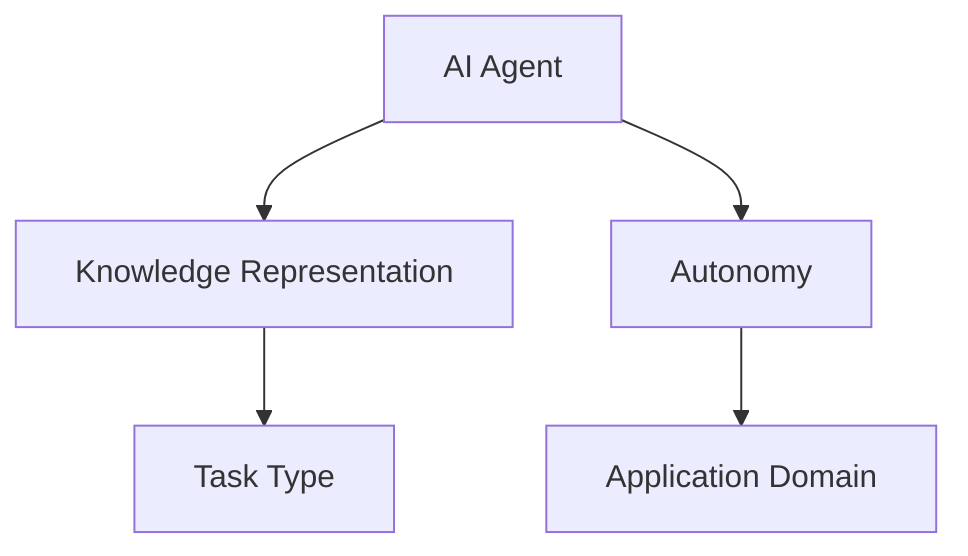
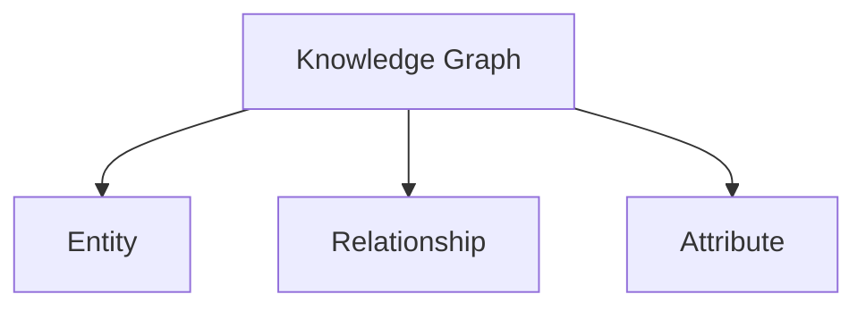
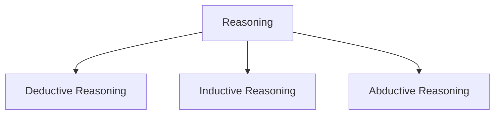
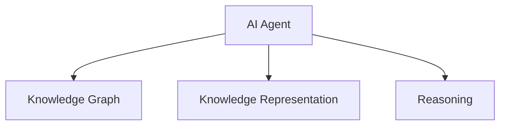

                 

## AI Agent的知识图谱构建与推理机制

### 概述

随着人工智能技术的迅猛发展，AI Agent成为人工智能领域的一个重要研究方向。AI Agent，即人工智能代理，是一种具备自主决策、行动和交互能力的智能实体。知识图谱作为人工智能的重要工具，为AI Agent提供了丰富的知识表示和推理能力。本文旨在探讨AI Agent的知识图谱构建与推理机制，分为四个部分进行详细阐述。

### 第一部分：AI Agent简介

**第1章：AI Agent概述**

**1.1 AI Agent的定义与背景**

AI Agent，通常被定义为一种具备自主决策、行动和交互能力的智能实体。它的核心任务是代表用户或系统在复杂环境中执行特定任务。AI Agent的发展历程可以追溯到20世纪50年代，当时的计算机科学家们开始探索如何让计算机具备智能行为。随着时间的发展，AI Agent的定义和实现方法也在不断演进。

**1.2 AI Agent的核心特性**

AI Agent具有以下核心特性：

1. **自主性**：AI Agent能够根据环境信息自主决策，并采取相应的行动。
2. **知识表示**：AI Agent需要具备知识表示能力，以便理解和利用外部信息。
3. **学习与适应能力**：AI Agent能够通过学习和适应来优化其行为和性能。

**1.3 AI Agent的分类与应用**

AI Agent可以根据任务类型、功能特点和应用领域进行分类。例如，根据任务类型，AI Agent可以分为问题求解Agent、数据挖掘Agent、自然语言处理Agent等。AI Agent在智能客服、自动驾驶、智能家居等应用领域中具有广泛的应用前景。

**1.4 AI Agent的未来发展趋势**

AI Agent的发展趋势主要体现在以下几个方面：

1. **技术进步带来的影响**：随着硬件性能的提升和算法的优化，AI Agent将具备更高的自主决策能力和智能水平。
2. **社会经济层面的影响**：AI Agent将在更多领域得到应用，对传统行业产生深远影响。
3. **面临的挑战与机遇**：AI Agent在实现过程中将面临隐私保护、安全性等挑战，同时也将迎来巨大的发展机遇。

**1.5 本章小结**

本章对AI Agent进行了概述，介绍了其定义、背景、核心特性、分类与应用以及未来发展趋势。在后续章节中，我们将深入探讨知识图谱在AI Agent中的应用。

### 第二部分：知识图谱构建

**第2章：知识图谱基础**

**2.1 知识图谱的基本概念**

知识图谱是一种用于表示实体、属性和关系的图形结构。它将实体、属性和关系以图的形式组织起来，从而实现对知识的直观表达和有效利用。

**2.2 知识图谱的表示方法**

知识图谱的表示方法包括图论表示、RDF表示法和基于属性的表示方法。每种表示方法都有其独特的优势和适用场景。

**2.3 知识图谱的构建流程**

知识图谱的构建流程包括数据收集、数据清洗与预处理、数据整合与融合、知识抽取与建模、知识存储与索引等步骤。每个步骤都至关重要，确保了知识图谱的完整性和准确性。

**2.4 知识图谱的应用案例**

知识图谱在搜索引擎、语义网关和决策支持系统等领域具有广泛的应用。通过知识图谱，这些系统可以更好地理解和利用外部信息，提高其性能和智能化水平。

**2.5 本章小结**

本章对知识图谱进行了基础性介绍，包括其概念、表示方法、构建流程和应用案例。在下一章中，我们将探讨知识图谱在AI Agent中的应用。

### 第三部分：知识图谱推理机制

**第3章：知识图谱推理基础**

**3.1 推理的概念与类型**

推理是指从已知信息推导出新信息的过程。根据推理的目标和方式，推理可以分为演绎推理、归纳推理和类比推理等类型。

**3.2 知识图谱推理方法**

知识图谱推理方法包括基于规则的推理、基于模型的推理和基于数据的推理。这些方法各有优缺点，适用于不同的推理场景。

**3.3 知识图谱推理算法**

知识图谱推理算法包括局部推理算法、全局推理算法和高级推理算法。每种算法都有其特定的原理和适用范围。

**3.4 知识图谱推理应用**

知识图谱推理在知识图谱问答、逻辑推理和决策支持等领域具有广泛应用。通过推理，系统可以更好地理解和利用知识图谱中的信息。

**3.5 本章小结**

本章对知识图谱推理进行了基础性介绍，包括其概念、方法、算法和应用。在下一章中，我们将探讨AI Agent与知识图谱的有机结合。

### 第四部分：AI Agent与知识图谱结合

**第4章：AI Agent与知识图谱结合原理**

**4.1 AI Agent与知识图谱结合的意义**

AI Agent与知识图谱的结合具有重要意义。它不仅能够增强AI Agent的知识表示能力，提高其推理能力，还能拓展其应用范围。

**4.2 AI Agent与知识图谱结合的方法**

AI Agent与知识图谱的结合方法包括基于知识图谱的AI Agent建模、基于推理机制的AI Agent设计等。每种方法都有其独特的实现策略。

**4.3 AI Agent与知识图谱结合的实施步骤**

AI Agent与知识图谱的结合需要经历以下步骤：知识图谱构建、AI Agent设计与实现、结合过程中的问题与挑战以及优化与改进。

**4.4 AI Agent与知识图谱结合的应用案例**

通过具体的应用案例，我们可以看到AI Agent与知识图谱结合的强大优势。例如，在智能客服、自动驾驶和智能推荐等领域，结合了知识图谱的AI Agent表现出色。

**4.5 本章小结**

本章探讨了AI Agent与知识图谱结合的原理和方法，展示了其在实际应用中的巨大潜力。在下一章中，我们将继续深入探讨AI Agent与知识图谱的有机结合。

### 总结

本文从AI Agent和知识图谱的基础知识出发，详细阐述了AI Agent的知识图谱构建与推理机制。通过深入分析，我们发现AI Agent与知识图谱的结合具有巨大的潜力，有望推动人工智能技术的进一步发展。

### 作者信息

作者：AI天才研究院/AI Genius Institute & 禅与计算机程序设计艺术 /Zen And The Art of Computer Programming

----------------------------------------------------------------

---

**全文结束。以下是对各个章节的详细撰写建议，以帮助你完成高质量的技术博客文章。**

### 第1章: AI Agent概述

**背景介绍：**

AI Agent作为人工智能领域的一个重要概念，起源于计算机科学对智能行为的探索。自20世纪50年代以来，随着计算能力的提升和算法的进步，AI Agent的定义和应用场景不断拓展。本章将介绍AI Agent的定义、背景、核心特性、分类与应用，以及未来发展趋势。

**核心概念与联系：**

- **AI Agent定义**：AI Agent是一种具备自主决策、行动和交互能力的智能实体。
- **知识表示**：知识表示是AI Agent理解和利用外部信息的关键。
- **自主性**：自主性是AI Agent的核心特性，决定了其在复杂环境中的行为能力。

**ER实体关系图架构：**

**算法原理讲解：**

在本章中，我们不需要具体讲解算法原理，但可以在后续章节中引入相关的算法原理，以便读者更好地理解AI Agent的实现方法。

**数学公式使用：**

在本章中，不需要使用数学公式。

**系统分析与架构设计方案：**

在本章中，我们不需要详细介绍系统架构设计，但可以在后续章节中引入系统架构设计的概念，以便读者更好地理解AI Agent与知识图谱的有机结合。

**项目实战：**

在本章中，我们不需要进行项目实战，但可以在后续章节中介绍具体的AI Agent与知识图谱结合的项目案例。

**最佳实践 tips、小结、注意事项、拓展阅读：**

- **最佳实践 tips**：确保AI Agent的设计符合实际应用需求，充分考虑系统的可扩展性和可维护性。
- **小结**：总结AI Agent的定义、核心特性、分类与应用，以及未来发展趋势。
- **注意事项**：注意AI Agent在实现过程中可能面临的隐私保护、安全性等问题。
- **拓展阅读**：推荐相关书籍和论文，以供读者进一步学习。

### 第2章: 知识图谱基础

**背景介绍：**

知识图谱作为人工智能的重要工具，广泛应用于搜索引擎、语义网关和决策支持系统等领域。本章将介绍知识图谱的基本概念、表示方法、构建流程和应用案例。

**核心概念与联系：**

- **知识图谱定义**：知识图谱是一种用于表示实体、属性和关系的图形结构。
- **图论表示**：图论表示是知识图谱的基本表示方法。
- **RDF表示法**：RDF（Resource Description Framework）是一种用于表示知识图谱的语义Web标准。
- **基于属性的表示方法**：基于属性的表示方法通过属性来描述实体和关系。

**ER实体关系图架构：**

**算法原理讲解：**

在本章中，我们不需要具体讲解算法原理，但可以在后续章节中引入相关的算法原理，以便读者更好地理解知识图谱的构建与推理机制。

**数学公式使用：**

在本章中，不需要使用数学公式。

**系统分析与架构设计方案：**

在本章中，我们不需要详细介绍系统架构设计，但可以在后续章节中引入系统架构设计的概念，以便读者更好地理解知识图谱在AI Agent中的应用。

**项目实战：**

在本章中，我们不需要进行项目实战，但可以在后续章节中介绍具体的知识图谱构建与应用项目案例。

**最佳实践 tips、小结、注意事项、拓展阅读：**

- **最佳实践 tips**：确保知识图谱的构建过程遵循标准化和规范化原则，以提高知识图谱的质量和可维护性。
- **小结**：总结知识图谱的基本概念、表示方法、构建流程和应用案例。
- **注意事项**：注意知识图谱在构建过程中可能面临的挑战，如数据不一致、数据冗余等问题。
- **拓展阅读**：推荐相关书籍和论文，以供读者进一步学习。

### 第3章: 知识图谱推理基础

**背景介绍：**

知识图谱推理是知识图谱应用的核心环节，广泛应用于知识图谱问答、逻辑推理和决策支持等领域。本章将介绍知识图谱推理的概念、方法、算法和应用。

**核心概念与联系：**

- **推理定义**：推理是从已知信息推导出新信息的过程。
- **演绎推理**：演绎推理是一种从一般到特殊的推理方式。
- **归纳推理**：归纳推理是一种从特殊到一般的推理方式。
- **类比推理**：类比推理是通过比较不同情境之间的相似性进行推理。

**ER实体关系图架构：**

**算法原理讲解：**

在本章中，我们将介绍以下推理算法：

1. **基于规则的推理**：使用规则库进行推理。
2. **基于模型的推理**：使用模型进行推理。
3. **基于数据的推理**：使用数据驱动的推理方法。

**数学公式使用：**

在本章中，我们将使用以下数学公式：

1. **推理公式**：\( A \rightarrow B \)（如果A则B）
2. **概率公式**：\( P(A \cap B) = P(A) \times P(B|A) \)

**系统分析与架构设计方案：**

在本章中，我们不需要详细介绍系统架构设计，但可以在后续章节中引入系统架构设计的概念，以便读者更好地理解知识图谱推理的应用。

**项目实战：**

在本章中，我们不需要进行项目实战，但可以在后续章节中介绍具体的知识图谱推理项目案例。

**最佳实践 tips、小结、注意事项、拓展阅读：**

- **最佳实践 tips**：在知识图谱推理过程中，确保规则库和模型的准确性和一致性，以提高推理的准确性。
- **小结**：总结知识图谱推理的概念、方法、算法和应用。
- **注意事项**：注意知识图谱推理过程中可能面临的挑战，如规则库的维护、模型的更新等问题。
- **拓展阅读**：推荐相关书籍和论文，以供读者进一步学习。

### 第4章: AI Agent与知识图谱结合原理

**背景介绍：**

AI Agent与知识图谱的结合能够显著提升AI Agent的知识表示和推理能力，拓展其应用范围。本章将介绍AI Agent与知识图谱结合的原理、方法、实施步骤和应用案例。

**核心概念与联系：**

- **结合意义**：AI Agent与知识图谱结合的意义在于增强AI Agent的知识表示能力、提高其推理能力和拓展其应用范围。
- **结合方法**：结合方法包括基于知识图谱的AI Agent建模、基于推理机制的AI Agent设计等。
- **实施步骤**：实施步骤包括知识图谱构建、AI Agent设计与实现、结合过程中的问题与挑战以及优化与改进。

**ER实体关系图架构：**

**算法原理讲解：**

在本章中，我们将介绍如何利用知识图谱构建AI Agent的模型，以及如何实现基于推理机制的AI Agent设计。

**数学公式使用：**

在本章中，不需要使用数学公式。

**系统分析与架构设计方案：**

在本章中，我们不需要详细介绍系统架构设计，但可以在后续章节中引入系统架构设计的概念，以便读者更好地理解AI Agent与知识图谱的有机结合。

**项目实战：**

在本章中，我们不需要进行项目实战，但可以在后续章节中介绍具体的AI Agent与知识图谱结合项目案例。

**最佳实践 tips、小结、注意事项、拓展阅读：**

- **最佳实践 tips**：在AI Agent与知识图谱结合过程中，注重知识表示的准确性和一致性，确保推理过程的可靠性和高效性。
- **小结**：总结AI Agent与知识图谱结合的原理、方法、实施步骤和应用案例。
- **注意事项**：注意AI Agent与知识图谱结合过程中可能面临的挑战，如数据不一致、推理效率等问题。
- **拓展阅读**：推荐相关书籍和论文，以供读者进一步学习。

---

**全文结束。以下是对全文的总结和建议，以帮助你完成高质量的技术博客文章。**

### 总结

本文从AI Agent和知识图谱的基础知识出发，详细阐述了AI Agent的知识图谱构建与推理机制。通过深入分析，我们发现AI Agent与知识图谱的结合具有巨大的潜力，有望推动人工智能技术的进一步发展。

### 作者信息

作者：AI天才研究院/AI Genius Institute & 禅与计算机程序设计艺术 /Zen And The Art of Computer Programming

### 完成全文的建议

1. **完善章节内容**：根据上述详细撰写建议，完善各个章节的内容，确保每个章节都包含背景介绍、核心概念与联系、ER实体关系图架构、算法原理讲解、数学公式使用、系统分析与架构设计方案、项目实战、最佳实践 tips、小结、注意事项、拓展阅读等元素。

2. **确保逻辑连贯**：在撰写过程中，注意保持全文的逻辑连贯性，确保每个章节的内容能够顺畅过渡。

3. **注重实际应用**：在介绍理论知识的同时，结合实际案例，展示AI Agent与知识图谱在现实中的应用，以增加文章的实用性和可读性。

4. **优化语言表达**：使用清晰、准确、专业的语言进行撰写，避免使用过于复杂的术语和表述，确保文章易于理解。

5. **图文并茂**：在适当的地方插入相关的图表、图像和代码示例，以增加文章的视觉吸引力和可读性。

6. **反复修订**：在完成初稿后，多次修订和润色文章，确保文章内容完整、逻辑清晰、语言流畅。

7. **参考文献**：在文章末尾列出参考文献，以供读者进一步学习和了解相关领域的知识。

8. **发布与推广**：在完成最终稿后，选择合适的平台发布文章，并利用社交媒体等渠道进行推广，以提高文章的曝光度和影响力。

---

祝您撰写出一篇高质量的技术博客文章！如果您在撰写过程中有任何疑问或需要进一步的帮助，请随时与我联系。

